# 10. Large AI Model Courses

## 10.1 Large Models Basic Courses

### 10.1.1 Large Language Model Courses

* **Overview of Large Language Model**

A Large Language Model (LLM) is an advanced artificial intelligence model developed to comprehend and generate human language.


(1) Basic Concept

A Large Language Model (LLM) is a deep learning model trained on extensive text data, designed to either generate natural language text or comprehend the meaning of language. LLM is capable of performing various natural language tasks, such as text classification, question answering, and dialogue, making them a crucial step toward achieving advanced artificial intelligence. Unlike smaller models, LLM leverages a similar Transformer architecture and pretraining objectives (like Language Modeling), but are distinguished by their larger model size, greater training data, and enhanced computational resources.

(2) Features

**Massive Scale:** LLM are characterized by their vast parameter sizes, often reaching billions or even trillions of parameters. This immense scale allows them to capture a wealth of linguistic knowledge and complex syntactic structures.

**Pretraining and Fine-tuning:** LLM utilize a two-stage learning process: pretraining and fine-tuning. Initially, they are pretrained on large-scale, unlabeled text data, learning general language representations and knowledge. Subsequently, they are fine-tuned using labeled data to specialize in specific tasks, allowing them to excel across a wide range of NLP applications.

**Contextual Awareness:** LLM demonstrate exceptional contextual awareness, with their ability to understand and generate language deeply dependent on preceding text. This enables them to perform exceptionally well in tasks like dialogue, article generation, and contextual comprehension.

**Multilingual Capabilities:** LLM support multiple languages, extending beyond just English. This multilingual proficiency enables them to power cross-lingual and cross-cultural applications, enhancing their versatility and global reach.

**Multimodal Support:** Some LLMs have expanded to handle multimodal data, including text, images, and speech. This capability allows them to understand and generate content across various media types, opening up more diverse application possibilities.

**Emergent Properties:** LLM exhibit remarkable emergent properties, where performance improvements become apparent in large models but are absent in smaller ones. This makes them adept at handling more complex tasks and challenges.

**Cross-domain Applications:** LLM have been widely adopted across numerous fields, including text generation, machine translation, information retrieval, summarization, chatbots, and virtual assistants. Their influence is profound, impacting both daily life and work in significant ways.

**Ethical and Risk Considerations:** While LLM showcase impressive capabilities, they also raise important ethical and risk-related concerns, such as the potential generation of harmful content, privacy violations, and cognitive biases. As such, the development and deployment of LLM must be approached with careful consideration and caution.

(3) Working Principle

Large Language Model (LLM) are built on deep learning principles and are trained using massive datasets and substantial computational resources to develop neural networks with billions of parameters. Through iterative training and parameter optimization, these models learn to perform a wide range of tasks with high accuracy. The "**large**" in LLM reflects their immense scale—encompassing a vast number of parameters, extensive training data, and significant computational demands. This scale enables advanced models to achieve superior generalization capabilities and deliver increasingly accurate results, even in highly specialized domains.

Today, some of the most popular applications revolve around generative AI, such as language generation tools (e.g., ChatGPT) and image generation platforms (e.g., Midjourney). At the core of these applications is the concept of generation—the model's ability to predict and produce coherent content based on a given input.

(4) Application Scenarios

① Text Generation

Large Language Models are capable of generating diverse types of text, including news articles, stories, poems, and more. These capabilities make them well-suited for applications in content creation, creative writing, and automated storytelling.

② Text Classification

Large Language Models can classify text into various categories, such as sentiment analysis and topic identification. These capabilities are especially valuable in scenarios like public opinion analysis, information retrieval, and content moderation.

③  Machine Translation

Large Language Models excel at machine translation, enabling the conversion of text from one language to another. These capabilities are essential for cross-language communication, localization, and global collaboration.

④ Question-Answering Systems

Large Language Models can be used to build question-answering systems that respond to user queries. These applications are particularly valuable in areas such as intelligent customer support, knowledge retrieval, and information lookup.

<p id="anchor10.1.1.2"></p>

* **Large Language Model Deployment**

> [!NOTE]
>
> This section outlines the steps to register on the official OpenAI website and obtain the API key for the Large Language Model.

(1) OpenAI Account Registration and Setup

① Copy the following URL: <https://platform.openai.com/docs/overvie>

Open the OpenAI website and click on the "**Sign Up**" button in the top right corner.


② Follow the prompts to register and log in using your Google, Microsoft, or Apple account.


③ Click on the settings icon, then select Billing, followed by Payment Methods, to link your payment method. Recharge your account to purchase tokens.


④ After completing the setup, click on API Keys, then select Create New Secret Key. Follow the prompts to fill in the required information. Once the key is created, make sure to save it for future use.


⑤ With these steps, the large model has been successfully created and deployed. You can now use the API in the upcoming lessons.

(2) OpenRouter Account Registration and Setup

① Copy the following URL: <https://openrouter.ai/>

Open the webpage in your browser and click "**Sign In**". Register using your Google account or another available login option.


② After logging in, click the icon in the top-right corner and select **"Credits"** to link your payment method.


③ To create an API key, go to **"API Keys"**, then click **"Create Key"**. Follow the prompts to complete the process. Once the key is generated, make sure to save it for future use.


④ At this point, the large model is successfully created and deployed. You can now use the API in the upcoming lessons.

<p id="anchor10.1.1.3"></p>

* **Large Language Model Accessing**

> [!NOTE]
>
> To proceed with this section, you will need to register on the appropriate website and obtain the API key for the large model (please refer to the file ["**10.1.1 Large Language Model Courses -> Large Language Model Deployment**"](#anchor10.1.1.2)).

It is important to ensure a stable network connection for the development board. For optimal performance, we also recommend connecting the main controller to a wired network for enhanced stability.


(1) Environment Configuration

> [!NOTE]
>
> If you have purchased a robot from our company with built-in large model functionality, the environment is already pre-configured in the robot's image. You can directly proceed to Section 3 of this document to configure the API key.

Install Vim and Gedit by running the corresponding commands. Install the necessary software packages and audio libraries required for PyAudio.

```
sudo apt update
```

```
sudo apt install vim
```

```
sudo apt install gedit
```

```
sudo apt install python3 python3-pip python3-all-dev python3-pyaudio portaudio11-dev libsndfile1
```


(2) Importing the Large Model Program Directory

① In this section, locate the '[Appendix -> Source Code](https://drive.google.com/drive/folders/1Na86By9er9Jj1_1YXz3sxAwePrIgSUcN?usp=sharing)' folder within the same directory as this tutorial document.


② Using the MobaXterm remote connection tool (as outlined in the '5.5 Remote Access and File Transfer' tutorial), drag the folder into the root directory of the main controller. The software installation package can be found in the '[Appendix -\> Remote Access and File Transfer](https://drive.google.com/drive/folders/17mfRH9lmP9OYO4_LAyzkRnHfytqRYldJ?usp=sharing)' directory.


③ Next, execute the command to navigate to the **'speech_pkg' directory**.

```
cd ~/large_models/speech_pkg/
```

④ Execute the following commands to install the necessary third-party libraries.

```
pip3 install -r requirements.txt --break-system-packages
```

```
pip3 install dashscope --break-system-packages
```

```
pip3 install opencv-python --break-system-packages
```

```
pip3 install sympy==1.13.1 --break-system-packages
```

```
pip3 install torch --break-system-packages
```

⑤ Then, use the command in the terminal to navigate to the **'speech'** directory.

```
cd ~/large_models/speech_pkg/speech
```

⑥ Run the command to list the files in the **'speech'** directory.

```
ls
```


⑦ Depending on the type of main controller and Python version you're using, switch to the appropriate folder for packaging and distribution. This tutorial uses the Jetson Orin controller as an example.

| **Type of main controller** | **Python version** |
| --------------------------- | ------------------ |
| jetson_nano                 | 3.6                |
| jetson_orin                 | 3.10               |
| rpi5                        | 3.11               |
| rpi5_docker                 | 3.8                |

⑧ Execute the following command to navigate to the Jetson Orin folder.

```
cd jetson_orin/
```

⑨ Enter the command to copy the 'speech.so' file to the parent directory.

```
cp -r speech.so ..
```

⑩ Enter the command to navigate to the parent directory.

```
cd ../..
```

⑪ Execute the command to package the speech file for the Python environment.

```
pip3 install .
```

⑫ Enter the command to install and update the OpenAI Python library.

```
pip3 install openai -U
```

(3) Key Configuration

① Open the terminal and enter the following command to navigate to the directory for configuring the large model keys:

```
cd ~/large_models
```

② Then, open the configuration file by running:

```
vim config.py
```

③ Once the file is open, configure the OpenAI and OpenRouter keys by filling in the llm_api_key and vllm_api_key parameters, respectively (you can obtain these keys from the '[10.1.1 Large Language Model Courses -> Large Language Model Deployment](#anchor10.1.1.2)' course).


For instance, copy the key created in Section 1.2 of this chapter and paste it into the appropriate field. To paste the key, place the cursor between the quotation marks, hold the **"Shift"** key, right-click, and select **"Paste"** .

> [!NOTE]
>
> Do not mix keys from different models, as this may cause the functionality to malfunction


④  After pasting, press the **'Esc'** key, then type the following command and press Enter to save the file:

```
:wq
```

(4) Running the Demo Program

Once the keys are configured, you can run the demo program (openai_llm_demo.py) to experience the text generation capabilities of the large model. For example, the program's prompt might be: 'Write a 50-word article about how technology is changing life.'


① To run the demo, enter the following command in the terminal:

```
python3 openai_llm_demo.py
```

② After running the program, the output will appear as shown in the image below.


* **Semantic Understanding with Large Language Model**

Before starting this section, make sure you have completed the API key configuration outlined in the file [10.1.1 Large Language Model Courses -\> Large Language Model Accessing](#anchor10.1.1.3).

In this lesson, we'll use a large language model to analyze and summarize short passages of text.

(1) Start by opening a new terminal window, then navigate to the large model project directory:

```
cd large_models/
```

(2) Next, run the demo program with the following command:

```
python3 openai_llm_nlu_demo.py
```

(3) As shown in the output, the model demonstrates strong summarization abilities.


(4) The result matches the prompt defined in the program — where a passage of text is provided to the model, and it generates a concise summary.


* **Emotional Perception with Large Language Model**

To proceed with this section, ensure that you have completed the API key configuration as described in the file [10.1.1 Language Model Courses -> Large Language Model Accessing](#anchor10.1.1.3).

In this lesson, we will use a large language model to assess its ability to perceive emotions based on descriptive words. We'll provide the model with emotional expressions and evaluate its response.

(1) Start by opening a new terminal window, then navigate to the large model project directory:

```
cd large_models/
```

(2) Next, run the demo program with the following command:

```
python3 openai_llm_er_demo.py
```

(3) From the output, you will see that the model successfully identifies and understands the emotions conveyed, providing a text-based response accordingly.


(4) In this program, we send two emotional expressions to the model: the first is an expression of sadness, **"So Sad"**. After the model responds, we then send an expression of happiness, "**Ha Ha**", and observe how the model reacts.


### 10.1.2 Large Speech Model Courses

* **Overview of Large Speech Model**

(1) What is a Large Speech Model?

A Speech Large Model (LSM) refers to a machine learning model that uses deep learning techniques to process and understand speech data. These models can be applied in a variety of tasks, such as speech recognition, speech synthesis, speech translation, and emotional analysis of speech. The design and training of these models typically require large amounts of speech data and substantial computational resources, which is why they are referred to as "**large models**".

(2) Why Do We Need Large Speech Model?

With the advancement of artificial intelligence and deep learning, traditional speech processing methods face many limitations. Large models leverage vast amounts of data and deep neural networks to learn and understand the complex features within speech, thereby improving the accuracy and naturalness of speech recognition and generation.

Their advantages include:

① High Accuracy: They maintain a high recognition rate even in noisy environments and with various accents.

② Naturalness: Speech generated by synthesis models is more natural, closely resembling human speech.

③ Versatility: These models support a wide range of languages and tasks, such as multilingual speech recognition, speech-to-text (STT), text-to-speech (TTS), and emotion recognition.

(3) Development of Speech Recognition Technology

Word-Level Speech Recognition: At this stage, speech recognition systems could only recognize individual words

Phrase-Level Speech Recognition: With the expansion of data and advancements in algorithms, speech recognition systems gradually gained the ability to recognize longer phrases, such as "**Please turn on my computer**".

Sentence-Level Speech Recognition: In recent years, with the emergence of AI large models, speech recognition systems have become capable of recognizing entire sentences and understanding their underlying meaning.

(4) Differences Between Large Speech Model and Traditional Speech Processing Technologies

① Processing Methods

Traditional Speech Processing Technologies: These typically rely on manual feature extraction and shallow models, such as Gaussian Mixture Models (GMM) and Hidden Markov Models (HMM), to process speech signals.

Large Speech Model: These use end-to-end learning, directly mapping raw speech waveforms to target outputs (such as text or another speech signal), reducing the reliance on manual feature extraction. They are typically based on deep learning architectures, such as Convolutional Neural Networks (CNN), Recurrent Neural Networks (RNN), and Transformers.

② Model Complexity

Traditional Speech Processing Technologies: These models are relatively simple, with fewer parameters.

Large Speech Model: These models have complex structures and a large number of parameters, enabling them to capture more subtle speech features and contextual information.

③ Recognition Capability

Traditional Speech Processing Technologies: These are highly adaptable to specific scenarios and conditions, but their recognition capability is limited when encountering new, unseen data.

Large Speech Model: Due to their large number of parameters and powerful learning ability, they offer superior recognition capabilities and can adapt to a wider variety of speech data and environments.

④Training Data Requirements

Traditional Speech Processing Technologies: These typically require less data for training, but the data must be highly annotated and of high quality.

Large Speech Model: These require vast amounts of training data to fully learn the complexities of speech, often necessitating large quantities of annotated data or the use of unsupervised/self-supervised learning methods.

(5) Core Technologies of Speech Large Model

① Automatic Speech Recognition (ASR)

ASR is the technology that converts human speech into text. The core steps of a speech recognition system include feature extraction, acoustic modeling, and language modeling.

② Text-to-Speech (TTS)

TTS is the technology that converts text into speech. Common speech synthesis models include the Tacotron series, FastSpeech, and VITS.

③ Speech Enhancement and Noise Reduction

Speech enhancement techniques are used to improve the quality of speech signals, typically for eliminating background noise and echoes. This is crucial for speech recognition applications in noisy environments.

(6) Applications of Speech Large Model

Intelligent Voice Assistants: For instance, Amazon Alexa and Google Home, which engage with users through voice interactions.

Customer Service Chatbots: In the customer service sector, speech large models assist businesses in enhancing service efficiency by swiftly processing customer inquiries through speech recognition technology, enabling 24/7 support.

Healthcare: Helping doctors with medical record-keeping, thus improving work efficiency.

Speech-to-Text: Speech large models excel in converting speech to text, offering accurate recognition and transcription in a variety of contexts. They are widely used in applications such as meeting transcription and subtitle generation.

* **Voice Device Introduction and Testing**

(1) Device Overview

① 6-Microphone Circular Array

Introduction：

The 6-Microphone Circular Array is a high-sensitivity, high signal-to-noise ratio microphone board. It features six analog silicon microphones arranged in a circular pattern. When paired with a main control board, it supports high-performance Acoustic Echo Cancellation (AEC), environmental noise reduction, and factory-level voice pickup from up to 10 meters.


Features and Specifications：

**Operating Voltage:** 3.3V (typical)

**Operating Current:** 0.8mA (typical)

**Operating Temperature:** -20°C (min), 25°C (typical), 70°C (max)

**Operating Humidity:** Up to 95% relative humidity (max)

(1) Recording and Playback Test

The following demonstration uses the Raspberry Pi 5 as an example. The connection and testing steps are also applicable to other compatible devices such as the Jetson series:

① Connection Illustration and Detection


If the main controller is a Raspberry Pi, you can use VNC remote desktop access (refer to the appendix: Remote Access and File Transfer) to log into the Raspberry Pi system. Once connected, check the upper right corner of the desktop for microphone and speaker icons. As shown in the image below, the presence of these icons indicates a successful connection.


If you're using a NVIDIA Jetson device, you can connect via the NoMachine remote access tool. After logging in, check the upper right corner of the system interface for the speaker icon to confirm successful detection.


② Recording Test

Next, open a new terminal window and enter the following command to check the available recording devices. Note that the -l option is a lowercase "**L**". You should see the card number (card) listed—for example, card 0. This is just an example; please refer to your actual query result.

```
arecord -l
```


Then, use the following command to start recording. Replace the red-marked card number (hw:0,0) with the actual number you found in the previous step:

```
arecord -D hw:0,0 -f S16_LE -r 16000 -c 2 test.wav
```

This will create a test.wav audio file in the current directory.

You can record a short 5-second sample, then press Ctrl + C to stop the recording.

③ Playback Test

After the recording is complete, you can check whether the audio file was successfully created by listing the contents of the current directory:

```
ls
```


If test.wav appears in the list, the recording was successful. To play back the recording, use the following command:

```
aplay test.wav
```

* **Voice Wake-Up**

In this lesson, we'll learn how to use a large speech model to activate the voice device by speaking a predefined wake word through a program.

(1) WonderEcho Pro Wake-Up

Device Check：

To proceed, we need to identify the USB device name assigned to the connected WonderEcho Pro or voice device (hereafter referred to as the voice device). Please follow the steps below carefully. 

> [!NOTE]
>
> Do not connect any other USB devices during this process to avoid confusion.

① First, disconnect the voice device, then open a terminal and run the following command:

```
ll /dev | grep USB
```

② Next, reconnect the voice device to the USB port on your main board and run the same command again:

```
ll /dev | grep USB
```

③ You should now see a newly listed USB port, such as ttyCH341USB1.  

Please take note of this device name—it may vary depending on the main controller being used.


Wake-Up Test：

① To begin, update the port number used in the program by editing the script. You'll also need to uncomment the line for the port you're using and comment out any unused ports.

```
vim wakeup_demo.py
```

Press i to enter edit mode and make the necessary changes as shown below (update the port number accordingly and adjust comments as needed).


Once the changes are complete, press ESC, then type :wq and press Enter to save and exit the editor.

② Next, return to the system interface and run the wake-up demo using the command below. Speak the wake word **"HELLO HIWONDER"** clearly toward the WonderEcho Pro voice device.  

If the output includes **"keyword detect"**, it indicates that the firmware has been successfully flashed and the wake word is functioning correctly.

```
python3 ~/large_models/wakeup_demo.py
```


(2) 6-Microphone Circular Array

As with the WonderEcho Pro, you can connect the 6-Microphone Circular Array to your main board (Raspberry Pi or NVIDIA Jetson) using a Type-C to USB cable.

Device Check:

For Jetson users, connect to the Jetson system using the NoMachine remote access tool. Once connected, check the desktop interface.  

If the 6-Microphone Circular Array icon appears on the left side of the desktop, it indicates the device has been successfully recognized.

Wake-Up Test:

① Open a new terminal window and run the following command to edit the wakeup_demo.py script:

```
vim ~/large_models/wakeup_demo.py
```

② Press i to enter edit mode.

③ Update the port to match the device port number you previously identified. Comment out the WonderEcho Pro configuration (add \# at the beginning of the corresponding line), and uncomment the line using the voice device on line 11 as the input device (see red box in the referenced image).


④ Press ESC to return to command mode, then type :wq and press Enter to save and exit.


⑤ In the terminal, run the wake-up program with the following command:

```
python3 ~/large_models/wakeup_demo.py
```

⑥ After about 30 seconds of initialization, speak the wake word **"hello hiwonder"** to test the device.


(3) Brief Program Overview

This is a Python-based wake word detection script that utilizes the speech module to process audio input and detect a specific wake word (e.g., "**HELLO_HIWONDER**").

Source Code Path: `/home/ubuntu/large_models/wakeup_demo.py`

Importing Required Modules

{lineno-start=5}

```
import os
import time
from speech import awake
```

`os`: Used for handling file paths and executing system-level commands.

`time`: Provides delay functions to prevent overly frequent detection attempts.

`speech`: The core module responsible for processing audio input and detecting the wake word.

Initializing the wonderecho Class

{lineno-start=9}

```
port = '/dev/ttyUSB0'
kws = awake.WonderEchoPro(port)
```

Attempts to Turn Off the Cooling Fan on Raspberry Pi 5

{lineno-start=13}

```
try:  # If a fan is present, it's recommended to turn it off before detection to reduce interference
    os.system('pinctrl FAN_PWM op dh')
except:
    pass
```

Purpose: Attempts to turn off the cooling fan by executing the system command `pinctrl FAN_PWM op dh`. This helps minimize background noise from the fan that could interfere with wake word detection.

Error Handling: If the command fails (e.g., due to unsupported hardware), the program catches the exception and continues running without interruption.

Main Wake Word Detection Loop

{lineno-start=18}

```
kws.start() # Start detection
print('start...')
```

The program starts the wake word detection thread using kws.start().

It prints start... to indicate that detection has been successfully initiated.

Main Program Logic

{lineno-start=20}

```
while True:
    try:
        if kws.wakeup(): # Wake-up detected
            print('hello hiwonder')
        time.sleep(0.02)
    except KeyboardInterrupt:
        kws.exit() # Cancel processing
        try:
            os.system('pinctrl FAN_PWM a0')
        except:
            pass
        break
```

During each iteration, the program checks whether the wake word has been detected. If the wake word is detected, it prints keyword detected.

The detection frequency is controlled using time.sleep(0.02) to prevent excessive CPU usage.

Pressing Ctrl+C triggers a KeyboardInterrupt, which gracefully exits the detection loop.

Upon exit, the program calls kws.exit() to stop the wake word detection process.

The fan is then restored to its original state (if applicable).

(4) Extended Functionality

Modifying the Wake-Up Response Text

In this section, you'll learn how to change the message that appears after a successful wake word detection.

① For example, if the wake word "**HELLO_HIWONDER**" is detected, and you'd like the program to print "**hello**" instead of the default message, follow the steps below. Navigate to the large_models directory and open the script with:

```
vim wakeup_demo.py
```

② Press i to enter INSERT mode (you'll see -- INSERT -- at the bottom of the screen). Locate the line '**print('hello hiwonder')**', and modify it to 'print('hello')'

```
i
```


③ Press ESC, then type **:wq** and press Enter to save and exit.

```
:wq
```

④ Finally, run the program with:

```
python3 wakeup_demo.py
```

(5) Creating Custom Firmware for WonderEchoPro

If you'd like to create more advanced or customized wake words and voice commands, please refer to the document titled:  

"[**Appendix →  Firmware Flashing Tool → Creating Firmware for WonderEchoPro**](https://drive.google.com/drive/folders/1Na86By9er9Jj1_1YXz3sxAwePrIgSUcN?usp=sharing)".

* **Speech Recognition**

(1) What is Speech Recognition?

Speech Recognition (Speech-to-Text, STT) is a technology that converts human speech signals into text or executable commands. In this course, we will implement speech recognition functionality using Alibaba OpenAI's Speech Recognition API.

(2) How It Works

The wave library is used to extract audio data. The extracted audio is then sent to OpenAI's ASR (Automatic Speech Recognition) model. The recognized text returned by the ASR model is stored in speech_result for use in subsequent processes.

(3) Preparation Before the Experiment

Before proceeding, refer to the course "[**10.1.1 Large Speech Model Courses -> Large Language Model Deployment**](#anchor10.1.1.2)" to obtain your API key, and make sure to add it into the configuration file (config).

(4) Experiment Steps

① Power on the device and connect to it using MobaXterm.  

(For detailed instructions, please refer to [Appendix ->Remote Connection Tools and Instructions](https://drive.google.com/drive/folders/17mfRH9lmP9OYO4_LAyzkRnHfytqRYldJ?usp=sharing).)

② Navigate to the program directory by entering the following command:

```
cd large_models/
```

③ Open the configuration file to input your API Key by entering the command below. Press i to enter INSERT mode and enter your API Key. Once finished, press Esc, type :wq, and hit Enter to save and exit.

```
vim config.py
```


④ Run the speech recognition program with:

```
python3 openai_asr_demo.py
```

(5) Function Realization

After the program starts, the microphone will recognize the recorded audio content from the user and print the converted text output.


(6) Brief Program Analysis

This program implements a speech recognition system by calling OpenAI's Speech-to-Text API to convert audio files into text.

The program source code is located at: `/home/ubuntu/large_models/openai_asr_demo.py`

① Module Import

{lineno-start=6}

```
from speech import speech
```

The speech module encapsulates ASR (Automatic Speech Recognition) functionalities, such as connecting to an external ASR service.

② Define ASR Class

{lineno-start=11}

```
asr = speech.RealTimeOpenAIASR()
```

asr = speech.RealTimeOpenAIASR()

This line creates a real-time speech recognition object named asr. The RealTimeOpenAIASR class is used to interact with the speech recognition service.

③ Speech Recognition Functionality

{lineno-start=13}

```
asr.update_session(model='whisper-1', language='en', threshold=0.2, prefix_padding_ms=300, silence_duration_ms=800) 
```

An ASR client object is created to prepare for invoking the speech recognition service.

The asr.asr() method is called to send the audio file (wav) to the ASR service for recognition.

The recognized result (typically text) is printed to the console.

(7) Function Extension

You can modify the model name to enable speech recognition in various languages, such as Chinese, English, Japanese, and Korean.

① Enter the following command to edit the script:

```
vim openai_asr_demo.py
```

② Press the i key to enter INSERT mode, and update the model setting. For example, modify it to use the gpt-4o-transcribe model.

```
i
```


③ Then, run the program with the command:

```
python3 openai_asr_demo.py
```

④ Record a sample sentence such as "**Hello, can you hear me clearly?**", and the recognized text will be printed on the console.


* **Speech Synthesis**

(1) What is Speech Synthesis?

Speech synthesis (SS) is a technology that converts written text into intelligible spoken audio. It enables computers to generate natural, human-like speech for communication or information delivery.

In this course, we will run a program that processes text using a large language model and generates corresponding audio.

(2) How It Works

The program first sends the text to the OpenAI TTS (Text-to-Speech) model. The model returns the generated audio data, which is saved as a file named tts_audio.wav for playback or storage.

(3) Preparation Before the Experiment

Refer to the course "[**Large Language Model Deployment**](#anchor10.1.1.2)" to obtain your API key, and update the configuration file accordingly.

(4) Experiment Steps

① Power on the device and connect to it using MobaXterm "(**refer to the [appendix -> Remote Connection Tools and Instructions](https://drive.google.com/drive/folders/17mfRH9lmP9OYO4_LAyzkRnHfytqRYldJ?usp=sharing) for detailed guidance**)".

② Navigate to the program directory by entering the following command:

```
cd large_models/
```

③ Open the configuration file to enter your API Key. After editing, press Esc, type :wq, and hit Enter to save and exit:

```
vim config.py
```


④ Finally, run the program with the following command:

```
python3 openai_tts_demo.py
```

(5) Function Realization

Upon running the program, it will play an audio message saying "**Hello, Can I Help You**", and simultaneously save the audio file with the same content to the following directory:  

`/home/ubuntu/large_models/resources/audio/`


(6) Brief Program Analysis

This program is a speech synthesis system based on OpenAI's Text-to-Speech (TTS) API, capable of converting text into audio files. It supports input text and outputs audio in formats like PCM, WAV, FLAC, AAC, Opus, and MP3. By specifying the desired text, the program sends the request to the API and returns the synthesized audio, which can be played or saved locally.

The source code for this program is located at:  `/home/ubuntu/large_models/openai_tts_demo.py`

① Module Import

{lineno-start=5}

```
from config import *
from speech import speech  
```

speech: This module encapsulates the TTS functionalities.

② Definition for TTS Class

{lineno-start=8}

```
tts = speech.RealTimeOpenAITTS()
tts.tts("Hello, Can I help you?") # https://platform.openai.com/docs/guides/text-to-speech
tts.tts("Hello, Can I help you?", model="tts-1", voice="onyx", speed=1.0, instructions='Speak in a cheerful and positive tone.')
tts.save_audio("Hello, Can I help you?", model="gpt-4o-mini-tts", voice="onyx", speed=1.0, instructions='Speak in a cheerful and positive tone.', audio_format='wav', save_path="./resources/audio/tts_audio.wav")
```

`speed`: Specifies the playback speed; the default value is 1.

For intelligent real-time applications, it is recommended to use the gpt-4o-mini-tts model. 

Other available models include tts-1 and tts-1-hd. tts-1 offers lower latency but with slightly reduced quality compared to tts-1-hd.

Voice Options: nova, shimmer, echo, onyx, fable, alloy, ash, sage, coral.

For more details, you can refer to the OpenAI documentation:

<https://platform.openai.com/docs/guides/text-to-speech>

③ Function Extension

To change the voice, follow these steps:

Step1 : Open the program by entering the command:

```
vim openai_tts_demo.py
```

Step2 : Press i on your keyboard to enter INSERT mode. Locate the line voice="**onyx**" and modify it to voice="**nova**".

```
i
```


Step3 : Press Esc, then type :wq and hit Enter to save and exit.

```
:wq
```


Step4 : Execute the program with the following command:

```
python3 openai_tts_demo.py
```


Once the program starts, the speaker will play the synthesized audio using the newly selected voice style.

* **Voice Interaction**

(1) What is Voice Interaction?

Voice Interaction (VI) refers to a method of communication between humans and computers or devices through spoken language. It integrates speech recognition and speech synthesis, enabling devices to both understand user commands and respond naturally, creating true two-way voice communication. To achieve natural voice interaction, factors such as semantic understanding and sentiment analysis must also be considered, allowing the system to accurately interpret user intent and provide appropriate responses.

This approach can be used as the foundation for developing our own AI assistant features.

(2) How It Works

First, the wake word detection module listens for a specific wake-up word. Once detected, it initiates audio recording. After recording, Automatic Speech Recognition (ASR) converts the audio into text, which is then sent to a Large Language Model (LLM) to generate an appropriate response. The generated text is subsequently converted into speech through a Text-to-Speech (TTS) module and played back to the user. This entire process enables seamless and natural interaction between the user and the voice assistant.

(3) Experiment Steps

① Power on the device and connect to it via MobaXterm (refer to Appendix "**5.1 Remote Connection Tools and Instructions**" for connection guidance).

② To check the microphone's port number, first disconnect the microphone and run the command. Then reconnect the microphone and run the command again to determine the port number (Note: do not connect any other USB devices during this process).

```
ll /dev | grep USB
```

After disconnecting the microphone, no USB device should appear.


Upon reconnecting the microphone, a USB port (e.g., ttyCH341USB1) will be listed (make sure to note this device name). The device name may vary depending on the main controller.

③ Navigate to the program directory:

```
cd large_models/
```

④ Open the configuration file to enter your API Key. After editing, press Esc, then type :wq and hit Enter to save and exit:

```
vim config.py
```


⑤ Enter the port number you obtained and modify the corresponding microphone port settings for either WonderEcho Pro or the six-microphone setup. Uncomment the configuration for the port you intend to use and comment out the settings for any unused ports.

```
vim openai_interaciton_demo.py
```

If you are using the WonderEcho Pro, modify the corresponding section:

If you are using the 6-Microphone Array, modify the relevant section:


⑥ Run the program:

```
python3 openai_interaciton_demo.py
```

⑦ To stop the program at any time, simply press Ctrl+C.

(4) Function Realization

After successful execution, the voice device will announce 'I'm ready.' Then, upon hearing the wake-up word 'HELLO_HIWONDER,' the device will respond with 'I'm here,' indicating that the assistant has been successfully awakened. You can now ask the AI assistant any questions:

For example: 'What are some fun places to visit in New York?'


(5) Brief Program Analysis

The program integrates voice recognition, speech synthesis, and intelligent response functionalities to create a voice assistant. Interaction is initiated through the wake-up word (HELLO_HIWONDER). Users can converse with the assistant via voice commands, and the assistant will respond using text-to-speech technology. The overall structure is clear, with distinct modules that are easy to expand and maintain.

The source code for this program is located at: `/home/ubuntu/large_models/openai_interaction_demo.py`

(1) Module Import

{lineno-start=5}

```
import os
import time
from config import *
from speech import awake
from speech import speech
```

time: Used to control the interval between program executions.

speech: The core module, integrating wake-up word detection, speech activity detection, speech recognition, TTS, and LLM.

(2) Definition of Audio File Paths

{lineno-start=11}

```
wakeup_audio_path = './resources/audio/en/wakeup.wav'
start_audio_path = './resources/audio/en/start_audio.wav'
no_voice_audio_path = './resources/audio/en/no_voice.wav'
```

This section configures the audio file paths used by various functional modules, such as wake-up sounds, recording storage paths, and prompt sounds.

The text-to-speech (TTS) module is initialized to convert LLM responses into speech.

(3) Main Functional Logic

{lineno-start=33}

```
def main():
    kws.start()
    while True:
        try:
            if kws.wakeup(): # Wake word detected(检测到唤醒词)
                speech.play_audio(wakeup_audio_path)  # Play wake-up sound(唤醒播放)
                asr_result = asr.asr() # Start voice recognition(开启录音识别)
                print('asr_result:', asr_result)
                if asr_result:
                    # Send the recognition result to the agent for a response(将识别结果传给智能体让他来回答)
                    response = client.llm(asr_result, model='gpt-4o-mini')
                    print('llm response:', response)
                    tts.tts(response)
                else:
                    speech.play_audio(no_voice_audio_path)
            time.sleep(0.02)
        except KeyboardInterrupt:
            kws.exit() 
            try:
                os.system('pinctrl FAN_PWM a0')
            except:
                pass
            break
        except BaseException as e:
            print(e)
```

Wake-up Detection: Continuously monitors for the wake-up word. Once detected, it stops the wake-up detection and plays the wake-up prompt sound.

Voice Processing: Records and recognizes the user's speech, uses the language model to generate a response, and then converts the response into speech for playback.

Error Handling: Catches exit signals and runtime errors to ensure the program exits safely and releases resources.

### 10.1.3 Vision Language Model Courses

* **Overview of Vision Language Model**

Vision Language Model (VLM) integrate visual recognition capabilities into traditional Language Model (LLM), enabling more powerful interactions between vision and language through multimodal inputs.

(1) Basic Concept

Vision Language Model (VLM) are a type of artificial intelligence model that leverages deep learning techniques to learn from and process large-scale visual data. These models often adopt convolutional neural network (CNN) architectures, enabling them to extract rich visual features from images or video streams and perform various tasks such as image classification, object detection, and facial recognition. In theory, VLM possess powerful capabilities in feature extraction and pattern recognition, making them widely applicable in fields like autonomous driving, facial recognition, and medical imaging analysis.

(2) Features

**Multimodal Input and Output**: VLM can process both images and text as input and generate various forms of output, including text, images, charts, and more.

**Powerful Visual-Semantic Understanding**: With extensive knowledge accumulated from large-scale visual datasets, VLMsexcel at tasks such as object detection, classification, and image captioning.

**Visual Question Answering (VQA):** VLM can engage in natural language conversations based on the content of input images, accurately answering vision-related questions.

**Image Generation:** Some advanced VLM are capable of generating simple image content based on given conditions.

**Deep Visual Understanding:** These models can recognize intricate details within images and explain underlying logical and causal relationships.

**Cross-Modal Reasoning:** VLM can leverage visual and linguistic information together, enabling reasoning across modalities, such as inferring from language to vision and vice versa.

**Unified Visual and Language Representation Space:** By applying attention mechanisms, VLM establish deep connections between visual and semantic information, achieving unified multimodal representations.

**Open Knowledge Integration:** VLM can integrate both structured and unstructured knowledge, enhancing their understanding of image content.

(3) How It Works

The working principle of Vision Language Model is primarily based on deep learning techniques, particularly Convolutional Neural Networks (CNNs) and Transformer architectures. Through multiple layers of neurons, these models perform feature extraction and information processing, enabling them to automatically recognize and understand complex patterns within images.

In a VLM, the input image first passes through several convolutional layers, where local features such as edges, textures, and shapes are extracted. Each convolutional layer is typically followed by an activation function (e.g., ReLU) to introduce non-linearity, allowing the model to learn more complex representations. Pooling layers are often used to reduce the dimensionality of the data while preserving important information, helping to optimize computational efficiency.

As the network deepens, it gradually transitions from extracting low-level features (like edges and corners) to higher-level features (such as objects and scenes). For classification tasks, the final feature vector is passed through fully connected layers to predict the probability of different target categories. For tasks like object detection and segmentation, the model outputs bounding boxes or masks to indicate the location and shape of objects within the image.

Transformer-based VLM divide images into small patches, treating them as sequential data, and apply self-attention mechanisms to capture global relationships within the image. This approach is particularly effective at modeling long-range dependencies, enabling VLM to excel at understanding complex visual scenes.

Training VLM typically requires large-scale labeled datasets. Through backpropagation, the model optimizes its parameters to minimize the loss between predictions and ground-truth labels. Pretraining on massive datasets allows the model to acquire general-purpose visual features, while fine-tuning on specific tasks further improves performance for specialized applications.

Thanks to this design, Visual Language Models are able to process and understand visual data effectively, and are widely used in applications like image classification, object detection, and image segmentation, driving rapid progress in the field of computer vision.

(4) Application Scenarios

① Image Captioning

VLM can automatically generate textual descriptions based on input images. This capability is particularly valuable for social media platforms, e-commerce websites, and accessibility technologies, such as providing visual content descriptions for visually impaired users.

② Visual Question Answering

Users can ask questions related to an image, such as "**What is in this picture?**" or "**What color is the car?**" The model analyzes the image content and provides accurate, natural-language responses, making it highly applicable in fields such as education, customer support, and information services.

③ Image Retrieval

In image search engines, users can perform searches using text descriptions, and Vision Language Model (VLM) can understand the descriptions and return relevant images. This capability is especially important on e-commerce platforms, where it allows users to find desired products more intuitively.

④ Augmented Reality (AR)

Vision Language Model (VLM) can provide real-time visual feedback and language-based explanations in augmented reality applications. When users view real-world scenes through a device's camera, the system can overlay relevant information or guidance, enhancing the overall user experience.

⑤ Content Creation and Editing

In design and creative tools, Vision Language Model (VLM) can generate relevant text content or suggestions based on a user's visual input (such as sketches or images), helping users complete creative work more efficiently.

⑥ Social Media Interaction

On social media platforms, VLM can generate appropriate comments or tags based on user-uploaded images, enhancing engagement and interaction.

⑦ Medical Imaging Analysis

In the healthcare field, VLM can be used to analyze medical images (such as X-rays and CT scans) and generate diagnostic reports or recommendations, assisting doctors in making more accurate decisions.

<p id="anchor10.1.3.2"></p>

* **Vision Language Model Accessing**

> [!NOTE]
>
> * **This section requires the configuration of the API key in "[Vision Language Model Accessing](#anchor10.1.3.2)" before proceeding. Additionally, ensure that the images to be used in this section are imported.**
> * **This experiment requires either an Ethernet cable or Wi-Fi connection to ensure the main control device can access the network properly.**

(1) Experiment Steps

Execute the following command to navigate to the directory of Large Model.

```
cd large_models/
```

Run the program:

```
python3 openai_vllm_understand.py
```

(2) Function Realization

After running the program, the output printed matches our request of "**Describe the image**".


* **Vision Language Model: Object Detection**

> [!NOTE]
>
> * **This section requires the configuration of the API key in "[10.1.3 Vision Language Module Courses -> Vision Language Model Accessing](#anchor10.1.3.2)" before proceeding. Additionally, ensure that the images to be used in this section are imported.**
> * **This experiment requires either an Ethernet cable or Wi-Fi connection to ensure the main control device can access the network properly.**
> * **In this course, we will use a program to transmit an image to the large model for recognition, which will then identify and locate the objects within the image by drawing bounding boxes around them.**

(1) Experiment Steps

① Execute the following command to navigate to the directory of Large Model.

```
cd large_models/
```

② Run the program:

```
python3 qwen_vllm_detect_demo.py
```

(2) Function Realization

After running the program, the positions of the fruits in the image will be circled.


(3) Function Expansion

We can switch the image and change the large model to experience different functionalities of various models.

Change Pictures:

① Click on the path box to navigate to the following directory: `/home/ubuntu/large_models/resources/pictures/`

Here, you can drag in other images, for example, in the apples.png format.


② Then, input the command:

```
vim large_models/qwen_vllm_detect_demo.py
```

③ Press the "**i**" key on your keyboard, which will display **"INSERT"** at the bottom.

```
i
```


④ Change the image recognition path from: `./resources/pictures/test_image_understand.jpeg`

To: image = cv2.imread('./resources/pictures/apples.png')


⑤ Next, input the following command and execute the program again to see the results

```
python3 qwen_vllm_detect_demo.py
```


* **Vision Language Model: Scene Understanding**

> [!NOTE]
>
> * This section requires the configuration of the API key in "[**Vision Language Model Accessing**](#anchor10.1.3.2)" before proceeding. Additionally, ensure that the images to be used in this section are imported.
>
> * This experiment requires either an Ethernet cable or Wi-Fi connection to ensure the main control device can access the network properly.
>
> * In this course, we will use a program to send an image to the large model for recognition and generate a description of the content within the image.

(1) Experiment Steps

① Execute the following command to navigate to the directory of Large Model.

```
cd large_models/
```

② Run the program:

```
python3 openai_vllm_understand.py
```

(2) Function Realization

After running the program, the output printed matches our request of "**Describe the image**".


(3) Function Expansion

If you need to recognize your own image, you should place the image in the corresponding path and modify the image path in the program.

① First, drag your image directly into the ~/large_models/resources/pictures/ path using MobaXterm, and rename the image to test.png.


② Then, open the scene understanding script by entering the following command in the terminal:

```
vim ~/large_models/vllm_understand.py
```

③ Change the image path in the code to reflect the name of your image (e.g., test.png).


④ Run the program:

```
python3 ~/large_models/openai_vllm_understand.py
```


* **Vision Language Model: Optical Character Recognition** 

> [!NOTE]
>
> * This section requires the configuration of the API key in "**[ Vision Language Model Accessing](#anchor10.1.3.2)**" before proceeding. Additionally, ensure that the images to be used in this section are imported.
>
> * This experiment requires either an Ethernet cable or Wi-Fi connection to ensure the main control device can access the network properly.
>
> * In this course, we use a program to transmit an image to the large model for recognition, extracting and identifying the text within the image.

(1) Experiment Steps

① Execute the following command to navigate to the directory of Large Model.

```
cd large_models/
```

② Run the program:

```
python3 openai_vllm_ocr.py
```

(2) Function Realization

After running the program, the output printed will be consistent with the content of the image sent.


(3) Function Expansion

We can switch the image and change the large model to experience different functionalities of various models.

Change Pictures：

① Drag the image directly into the `~/large_models/resources/pictures/` path using MobaXterm. Here, we can drag in the image named 'ocr1.png' as an example, and let the program recognize the text 'COME ON'.


② Then, input the command:

```
vim ~/large_models/openai_vllm_ocr.py
```

③ Press the **"i"** key on your keyboard, which will display **"INSERT"** at the bottom.

```
i
```


④ Change the image recognition path from: ./resources/pictures/ocr.jpeg

To: image = cv2.imread('./resources/pictures/ocr1.png')

```
image = cv2.imread('./resources/pictures/ocr1.png)
```

⑤ Run the program:

```
python3 ~/large_models/openai_vllm_ocr.py
```


### 10.1.4 Multimodal Model Basic Courses

* **Overview of Multimodal Model**

The emergence of Multimodal Model is built upon continuous advancements in the fields of Large Language Model (LLM) and Vision Language Model (VLM).

(1) Basic Concept

As LLM continue to improve in language understanding and reasoning capabilities, techniques such as instruction tuning, in-context learning, and chain-of-thought prompting have become increasingly widespread. However, despite their strong performance on language tasks, LLM still exhibit notable limitations in perceiving and understanding visual information such as images. At the same time, VLM have made significant strides in visual tasks such as image segmentation and object detection, and can now be guided by language instructions to perform these tasks, though their reasoning abilities still require further enhancement.

(2) Features

The core strength of Multimodal Model lies in their ability to understand and manipulate visual content through language instructions. Through pretraining and fine-tuning, these models learn the associations between different modalities—such as how to generate descriptions from images or how to identify and classify objects in visual data. Leveraging self-attention mechanisms from deep learning, Multimodal Model can effectively capture relationships across modalities, allowing them to synthesize information from multiple sources during reasoning and decision-making processes.

**Multimodal Fusion Capability:** Multimodal Model can process and understand multiple types of data simultaneously, including text, images, and audio. This fusion ability enables the models to build connections across modalities, leading to a more comprehensive understanding of information. For instance, a model can generate natural language descriptions based on an image or identify specific objects within an image based on a text query.

**Enhanced Contextual Understanding:** By integrating information from different modalities, Multimodal Model excel at contextual understanding. They can not only recognize content within a single modality but also combine clues from multiple sources to make more accurate judgments and decisions in complex tasks.

**Flexible Interaction Methods:** Users can interact with Multimodal Model through natural language instructions, making communication with the models more intuitive without requiring knowledge of complex programming or operations. For example, users can simply ask about details in an image, and the model can provide relevant answers.

**Scalability:** The architecture and training methods of Multimodal Model allow them to adapt to new modalities and tasks. As technology evolves, additional types of data—such as videos or sensor readings—can be incorporated, expanding their range of applications and capabilities.

**Strong Generative Capabilities:** Similar to large language models, Multimodal Model perform exceptionally well in generating both textual and visual content. They can produce natural language descriptions, summaries, and even create novel visual outputs, meeting a wide variety of application needs.

**Improved Reasoning Abilities:** Although challenges remain, Multimodal Model demonstrate significantly enhanced reasoning capabilities compared to traditional single-modality models. By integrating multimodal information, they can reason effectively in more complex scenarios, supporting advanced tasks such as logical reasoning and sentiment analysis.

**Adaptability and Personalization:** Multimodal Model can be fine-tuned to meet user-specific needs and preferences, enabling highly personalized services. This adaptability offers great potential for applications in fields such as education, entertainment, and customer service.

(3) How It Works

The working principle of Multimodal Model is built upon advanced deep learning and neural network technologies, with a core focus on fusing data from different modalities to understand and tackle complex tasks. At the foundation, Multimodal Model often adopt architectures similar to Transformers, which are highly effective at capturing relationships between different parts of input data. During training, these models are exposed to massive amounts of multimodal data—such as images, text, and audio—and leverage large-scale unsupervised learning for pretraining. Through this process, the models learn the commonalities and differences across modalities, enabling them to grasp the intrinsic connections between various types of information.

In practice, incoming text and visual data are first embedded into a shared representation space. Text inputs are transformed into vectors using word embedding techniques, while images are processed through methods like Convolutional Neural Networks (CNNs) to extract visual features. These vectors are then fed into the model's encoder, where self-attention mechanisms analyze the relationships across modalities, identifying and focusing on the most relevant information.

After encoding, the model generates a multimodal contextual representation that blends both the semantic information of the text and the visual features of the image. When a user provides a natural language instruction, the MLLM parses the input and interprets the intent by leveraging the contextual representation. This process involves reasoning and generation capabilities, allowing the model to produce appropriate responses based on its learned knowledge, or to perform specific actions in visual tasks.

Finally, the Multimodal Model's decoder translates the processed information into outputs that users can easily understand—such as generating textual descriptions or executing targeted visual operations. Throughout this process, the emphasis is on the fusion and interaction of information across different modalities, enabling Multimodal Model to excel at handling complex combinations of natural language and visual content. This integrated working mechanism empowers Multimodal Model with powerful functionality and flexibility across a wide range of application scenarios.

(4) Application Scenarios

① Education

Multimodal Model can be used to create personalized learning experiences. By combining text and visual content, the model can provide students with rich learning materials—for example, explaining scientific concepts through a mix of images and text to enhance understanding. Additionally, in online courses, the model can dynamically adjust content based on the learner's performance, offering customized learning suggestions in real time.

② Healthcare

Multimodal Model can assist doctors in diagnosis and treatment decisions. By analyzing medical images (such as X-rays or MRIs) alongside relevant medical literature, the model helps doctors access information more quickly and provides evidence-based recommendations. This application improves diagnostic accuracy and efficiency.

③ Entertainment

Multimodal Model can be used for content generation, such as automatically creating stories, scripts, or in-game dialogues. By incorporating visual elements, the model can provide rich scene descriptions for game developers, enhancing immersion. Additionally, on social media platforms, Multimodal Model can analyze user-generated images and text to help recommend suitable content.

④ Advertising and Marketing

Multimodal Model can analyze consumer behavior and preferences to generate personalized advertising content. By combining text and images, ads can better capture the attention of target audiences and improve conversion rates.

Finally, Multimodal Model also play a role in scientific research. By processing large volumes of literature and image data, the model can help researchers identify trends, generate hypotheses, or summarize findings, accelerating scientific discovery.

* **Agent Behavior Orchestration**

> [!NOTE]
>
> * This section requires the configuration of the API key in "[**Vision Language Model Accessing**](#anchor10.1.3.2)" before proceeding. Additionally, ensure that the images to be used in this section are imported.
>
> * This experiment requires either an Ethernet cable or Wi-Fi connection to ensure the main control device can access the network properly.
>
> * The purpose of this course experiment is to obtain data in a specified format returned by the large model based on the prompt words set in the model. During development, you can use the returned data for further tasks.

(1) Experiment Steps

① To check the microphone's port number, first disconnect the microphone and run the command. Then reconnect the microphone and run the command again to determine the port number (Note: do not connect any other USB devices during this process).

```
ll /dev | grep USB
```

After disconnecting the microphone, no USB device should appear.


Upon reconnecting the microphone, a USB port (e.g., ttyCH341USB1) will be listed (make sure to note this device name). The device name may vary depending on the main controller.

② Execute the following command to navigate to the directory of Large Model.

```
cd large_models/
```

③ Open the configuration file to enter your API Key. After editing, press Esc, then type :wq and hit Enter to save and exit:

```
vim config.py
```


④ Fill in the detected port number and update the corresponding microphone port settings for either the WonderEcho Pro or the Six-channel Microphone.  

Uncomment the port you wish to use and comment out the settings for any unused ports.

```
vim openai_agent_demo.py
```

Modify the settings as follows. For WonderEcho Pro, update the corresponding configuration


For 6-channel Microphone, update the respective settings:


⑤ Run the program:

```
python3 openai_agent_demo.py
```

⑥ The program will print the prompts configured for the large model. The large model will then return data formatted according to these prompts.


(2) Function Realization

① After running the program, the voice device will announce, **"I'm ready".** At this point, say **"HELLO_HIWONDER"** to the device to activate the agent.  

When the device responds with "**I'm here**", it indicates that the agent has been successfully awakened. To modify the wake word. For the Six-channel Microphone, refer to Section 2.3 Voice Wake-Up – 2. 6-Microphone Circular Array for instructions on customizing the wake word. For WonderEcho Pro, refer to Section "[**Firmware Flashing Tool->WonderEchoPro Firmware Generation**](https://drive.google.com/drive/folders/1Na86By9er9Jj1_1YXz3sxAwePrIgSUcN?usp=sharing)".

② After updating the wake word, you can say: "Take two steps forward, turn left and take one step back". The agent will respond according to the format we have defined.


## 10.2 Multimodal Large Model Applications

<p id ="anther10.2.1"></p>

### 10.2.1 Large Model API Key Setup

> [!NOTE]
>
> **This section requires registering on the official OpenAI website and obtaining an API key for accessing large language models.**

#### 10.2.1.1 OpenAI Account Registration and Deployment

1) Copy and open the following URL: https://platform.openai.com/docs/overview, then click the **Sign Up** button in the upper-right corner.


2) Register and log in using a Google, Microsoft, or Apple account, as prompted.


3) After logging in, click the Settings button, then go to **Billing**, and click **Payment Methods** to add a payment method. The payment is used to purchase **tokens**.


4) After completing the preparation steps, click **API Keys** and create a new key. Follow the prompts to fill in the required information, then save the key for later use.


5) The creation and deployment of the large model have been completed, and this API will be used in the following sections.

#### 10.2.1.2 OpenRouter Account Registration and Deployment

1) Copy the URL https://openrouter.ai/ into a browser and open the webpage. Click **Sign in** and register or sign in using a Google account or another available account.


2) After logging in, click the icon in the top-right corner, then select **Credits** to add a payment method.


3) Create an API key. Go to **API Keys**, then click **Create Key**. Follow the prompts to generate a key. Save the API key securely for later use.


The creation and deployment of the large model have been completed, and this API will be used in the following sections.

#### 10.2.1.3 API Configuration

1. Click  to open a terminal and enter the following command to open the configuration file. Press the i key to enter input mode.

```bash
vim /home/ubuntu/ros2_ws/src/large_models/large_models/large_models/config.py
```

2. Fill in the obtained Large Model API Key in the corresponding parameter, as shown in the red box in the figure below.


3. Press **Esc**, then enter the command and press **Enter** to save and exit the configuration file.

```bash
:wq
```

<p id ="anther10.2.2"></p>

### 10.2.2 Version Confirmation

Before starting features, verify that the correct microphone configuration is set in the system.

1. After remotely logging in via NoMachine, click the desktop icon  to access the configuration interface.

2. Select the appropriate microphone version configuration according to the hardware.


3. If using the AI Voice Interaction Box, select **WonderEcho Pro** as the microphone type, as shown in the figure below.


4. For the 6-Microphone Array, select **xf** as the microphone type as shown in the figure.

   

   

5. Click **Save**.

   

6. After the **Save Success** notification appears, click **Apply**.

   

7. Finally, click **Quit** to exit the software interface.

   


### 10.2.3 Voice Control

#### 10.2.3.1 Program Overview

Once the program starts, the voice device will announce “**I’m ready**”. Say the designated wake word **Hello Hiwonder** to activate the voice device, which will respond with “**I’m here**”. Then, the robot can be controlled via voice commands to perform corresponding actions, for example: “**Move forward, backward.**” The voice device will respond after processing the command and execute the corresponding action.

#### 10.2.3.2 Preparation

* **Version Confirmation**

Before starting this feature, ensure that the microphone version configuration in the system is correct. For more details, refer to section [10.2.2 Version Confirmation](#anther10.2.2).

* **Configure the Large Model API Key**

Refer to the section [10.2.1 Large Model API Key Setup](#anther10.2.1) to set up the large model key.

#### 10.2.3.3 Operation Steps

> [!NOTE]
>
> * **Command input is case-sensitive and space-sensitive.**
>
> * **The robot must be connected to the Internet, either in STA (LAN) mode or AP (direct connection) mode via Ethernet.**

1. Click the terminal  on the left side of the system interface to open the command line. Enter the command and press **Enter** to disable the app auto-start service.

```bash
sudo systemctl stop start_app_node.service
```

2. Enter the following command and press **Enter** to launch the voice control feature.

```bash
ros2 launch large_models_examples llm_control_move.launch.py
```

3. When the command line displays the output shown below and announces “**I’m ready**”, the voice device has completed initialization. At this point, say the wake word **Hello Hiwonder**.


4. When the command line shows the output below and the voice device announces “**I’m here**”, the voice device has been successfully activated. The system will begin recording your voice command.

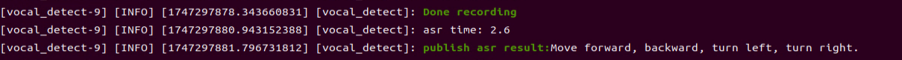

5. When the terminal displays the next output as the reference image, it shows the recognized speech transcribed by the device.

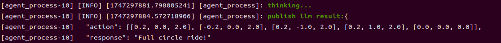

6. When the command line displays the output shown below, the cloud-based large language model has been successfully invoked. It processes the user’s command, provides a verbal response, and generates actions corresponding to the semantic meaning of the command.

The response is automatically generated by the large model. Only the semantic accuracy of the reply is guaranteed, while the wording and formatting may vary.


7. When the command line displays the output shown below, the current dialogue session has ended. Refer to Step 4 to reactivate the voice device with the wake word and start a new dialogue session.

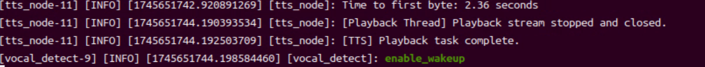

8. To exit the feature, press **Ctrl+C** in the terminal. If the feature does not shut down immediately, press **Ctrl+C** multiple times. If it still fails to exit, open a new terminal window and run the following command to terminate all active ROS processes and related programs.

```bash
~/.stop_ros.sh
```

#### 10.2.3.4 Program Outcome

Once the feature is activated, commands can be freely issued, for example: “**Move forward, backward**.” The robot will then move forward and backward accordingly.

#### 10.2.3.5 Program Analysis

* **Launch File Analysis**

The program file is located at: **/home/ubuntu/ros2_ws/src/large_models_examples/large_models_examples/llm_control_move.launch.py**

Define `launch_setup` Function

```python
def launch_setup(context):
    mode = LaunchConfiguration('mode', default=1)
    mode_arg = DeclareLaunchArgument('mode', default_value=mode)

    controller_package_path = get_package_share_directory('controller')
    large_models_package_path = get_package_share_directory('large_models')

    controller_launch = IncludeLaunchDescription(
        PythonLaunchDescriptionSource(
            os.path.join(controller_package_path, 'launch/controller.launch.py')),
    )

    large_models_launch = IncludeLaunchDescription(
        PythonLaunchDescriptionSource(
            os.path.join(large_models_package_path, 'launch/start.launch.py')),
        launch_arguments={'mode': mode}.items(),
    )


    llm_control_move_node = Node(
        package='large_models_examples',
        executable='llm_control_move',
        output='screen',
    )

    return [mode_arg,
            controller_launch,
            large_models_launch,
            llm_control_move_node,
            ]
```

This function is used to configure and launch actions in a Launch file.

`mode = LaunchConfiguration('mode', default=1)`: Defines a Launch parameter named mode with a default value of 1.

`mode_arg = DeclareLaunchArgument('mode', default_value=mode)`: Declares the mode parameter and adds it to the Launch description.

`controller_path和large_models_package_path`: Paths to the shared directories of the `controller` and `large_models` packages, which control the robot’s movement.

`controller_launch`: Uses `IncludeLaunchDescription` to include the `controller.launch.py ` file from the `controller` package.

`large_models_launch`: Uses `IncludeLaunchDescription` to include the `start.launch.py` file from the `large_models` package and passes the mode parameter.

Finally, returns a list containing all Launch actions.

* **Python File Analysis**

The program file is located at: **ros2_ws/src/large_models_examples/large_models_examples/llm_control_move.py**

1\. Define Prompt Template (PROMPT)

```python
else:
    PROMPT = '''
**Role
You are an intelligent car that can be controlled via linear velocity on the x and y axes (in meters per second), and angular velocity on the z axis (in radians per second). The movement duration is controlled by t (in seconds).
Your job is to generate a corresponding instruction based on user input.

**Requirements
- Ensure valid velocity ranges:
Linear velocity: x, y ∈ [-1.0, 1.0] (negative values mean reverse direction)
Angular velocity: z ∈ [-1.0, 1.0] (negative: clockwise, positive: counterclockwise)
- Execute multiple actions sequentially, returning a list of movement instructions under the action field.
- Always append a stop command [0.0, 0.0, 0.0, 0.0] at the end to ensure the car halts.
- Default values:
x and y: 0.2
z: 1.0
t: 2.0
- For each action sequence, craft a short (5–10 characters), witty, and endlessly variable response to make interactions fun and engaging.
- Output only the final JSON result. No explanations, no extra output.
- Format:
{
  "action": [[x1, y1, z1, t1], [x2, y2, z2, t2], ..., [0.0, 0.0, 0.0, 0.0]],
  "response": "short response"
}
- Possess strong mathematical reasoning to interpret and compute physical quantities like distance, time, and velocity.

## Special Notes
The "action" key should contain an array of stringified movement instructions in execution order. If no valid command is found, output an empty array [].
The "response" key should contain a creatively written, concise reply that matches the required tone and length.

**Examples
Input: Move forward for 2 seconds, then rotate clockwise for 1 second
Output:
{
  "action": [[0.2, 0.0, 0.0, 2.0], [0.0, 0.0, 1.0, 1.0], [0.0, 0.0, 0.0, 0.0]],
  "response": "Full speed ahead, spin and go!"
}

Input: Move forward 1 meter
Output:
{
  "action": [[0.2, 0.0, 0.0, 5.0], [0.0, 0.0, 0.0, 0.0]],
  "response": "Got it!"
}
    '''
```

2\. Class Initialization

```python
class LLMControlMove(Node):
    def __init__(self, name):
        rclpy.init()
        super().__init__(name)
        
        self.action = []
        self.llm_result = ''
        self.running = True
        self.interrupt = False
        self.action_finish = False
        self.play_audio_finish = False
        
        timer_cb_group = ReentrantCallbackGroup()
        self.tts_text_pub = self.create_publisher(String, 'tts_node/tts_text', 1)
        self.create_subscription(String, 'agent_process/result', self.llm_result_callback, 1)
        self.create_subscription(Bool, 'vocal_detect/wakeup', self.wakeup_callback, 1, callback_group=timer_cb_group)
        self.create_subscription(Bool, 'tts_node/play_finish', self.play_audio_finish_callback, 1, callback_group=timer_cb_group)
        self.set_model_client = self.create_client(SetModel, 'agent_process/set_model')
        self.set_model_client.wait_for_service()

        self.awake_client = self.create_client(SetBool, 'vocal_detect/enable_wakeup')
        self.awake_client.wait_for_service()
        self.set_mode_client = self.create_client(SetInt32, 'vocal_detect/set_mode')
        self.set_mode_client.wait_for_service()
        self.set_prompt_client = self.create_client(SetString, 'agent_process/set_prompt')
        self.set_prompt_client.wait_for_service()
        self.mecanum_pub = self.create_publisher(Twist, '/controller/cmd_vel', 1)

        self.timer = self.create_timer(0.0, self.init_process, callback_group=timer_cb_group)
```

Set state variables such as action list `action`, interrupt flag `interrupt`, and action completion flag `action_finish`. Create publishers such as TTS text publisher and subscribers such as large model results, TTS playback completion signal, and wake-up signal. Create service clients, such as for configuring the large model or enabling voice for communication and control.

3\. Set LLM Model

```python
def init_process(self):
    self.timer.cancel()

    msg = SetModel.Request()
    # msg.model = 'qwen-plus-latest'
    msg.model = llm_model
    msg.model_type = 'llm'
    msg.api_key = api_key 
    msg.base_url = base_url
    self.send_request(self.set_model_client, msg)

    msg = SetString.Request()
    msg.data = PROMPT
    self.send_request(self.set_prompt_client, msg)

    speech.play_audio(start_audio_path) 
    threading.Thread(target=self.process, daemon=True).start()
    self.create_service(Empty, '~/init_finish', self.get_node_state)
    self.get_logger().info('\033[1;32m%s\033[0m' % 'start')
    self.get_logger().info('\033[1;32m%s\033[0m' % PROMPT)
```

4\. `play_audio_finish_callback` Method

```python
def play_audio_finish_callback(self, msg):
  msg = SetBool.Request()
  msg.data = True
  self.send_request(self.awake_client, msg)
  # msg = SetInt32.Request()
  # msg.data = 1
  # self.send_request(self.set_mode_client, msg)
  self.play_audio_finish = msg.data
```

The method handles the callback after audio playback and re-enables the voice wake-up functionality.

5\. `process` Method

```python
def process(self):
    while self.running:
        if self.llm_result:
            msg = String()
            if 'action' in self.llm_result:  # If there is a corresponding behavior returned, extract and process it.
                result = eval(self.llm_result[self.llm_result.find('{'):self.llm_result.find('}') + 1])
                self.get_logger().info(str(result))
                action_list = []
                if 'action' in result:
                    action_list = result['action']
                if 'response' in result:
                    response = result['response']
                msg.data = response
                self.tts_text_pub.publish(msg)
                for i in action_list:
                    msg = Twist()
                    msg.linear.x = float(i[0])
                    msg.linear.y = float(i[1])
                    msg.angular.z = float(i[2])
                    self.mecanum_pub.publish(msg)
                    time.sleep(i[3])
                    if self.interrupt:
                        self.interrupt = False
                        self.mecanum_pub.publish(Twist())
                        break
            else:  # If there is no corresponding behavior, only respond.
                response = self.llm_result
                msg.data = response
                self.tts_text_pub.publish(msg)
            self.action_finish = True 
            self.llm_result = ''
        else:
            time.sleep(0.01)
        if self.play_audio_finish and self.action_finish:
            self.play_audio_finish = False
            self.action_finish = False
            # msg = SetInt32.Request()
            # msg.data = 2
            # self.send_request(self.set_mode_client, msg)
    rclpy.shutdown()
```

The main loop handles instructions from the LLM, parses commands, executes the corresponding actions, and provides voice feedback.


### 10.2.4 Autonomous Patrolling

#### 10.2.4.1 Program Overview

When the program starts, the voice device will announce “**I'm ready**.” To activate the voice device, say the designated wake word **Hello Hiwonder**. Upon successful activation, the voice device will respond with “**I’m here**.” Once activated, voice commands can be issued, for example, “**Follow the black line and stop when you encounter an obstacle.**” The terminal displays the recognized command, and the voice device provides a processed response. The robot then follows the black line detected by its camera and stops automatically when an obstacle is detected.

#### 10.2.4.2 Preparation

* **Version Confirmation**

Before starting this feature, ensure that the microphone version configuration in the system is correct. For more details, refer to section [10.2.2 Version Confirmation](#anther10.2.2).

* **Configure the Large Model API Key**

Refer to the section [10.2.1 Large Model API Key Setup](#anther10.2.1) to set up the large model key.

#### 10.2.4.3 Operation Steps

> [!NOTE]
>
> * **Command input is case-sensitive and space-sensitive.**
>
> * **The robot must be connected to the Internet, either in STA (LAN) mode or AP (direct connection) mode via Ethernet.**

1) Click the terminal  on the left side of the system interface to open the command line. Enter the command and press **Enter** to disable the app auto-start service.

```bash
sudo systemctl stop start_app_node.service
```

2) Enter the following command and press **Enter** to launch the autonomous patrolling feature.

```bash
ros2 launch large_models_examples llm_visual_patrol.launch.py
```

3) When the command line displays the output shown below and announces “**I’m ready**”, the voice device has completed initialization. At this point, say the wake word **Hello Hiwonder**.


4) When the command line shows the output below and the voice device announces “**I’m here**”, the voice device has been successfully activated. The system will begin recording your voice command.


5) When the terminal prints the output shown below, it indicates that the voice device has transcribed the spoken command. In this example, the command spoken is “**Follow the black line and stop when you encounter an obstacle**.”


6. When the command line displays the output shown below, the cloud-based large language model has been successfully invoked. It processes the user’s command, provides a verbal response, and generates actions corresponding to the semantic meaning of the command.

   The response is automatically generated by the large model. Only the semantic accuracy of the reply is guaranteed, while the wording and formatting may vary.


7) To stop the feature, refer to Step 4 to reactivate the voice device again with the wake word to begin a new interaction cycle.

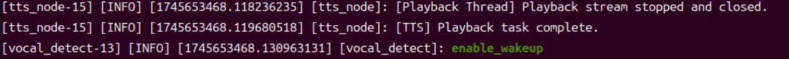

8) To exit the feature, press **Ctrl+C** in the terminal. If the feature does not exit immediately, press **Ctrl+C** multiple times.

#### 10.2.4.4 Program Outcome

Once the feature is activated, feel free to give commands in your own words. For instance, “**Follow the black line and stop when you encounter an obstacle**.” The robot uses its camera to detect and follow the black line, and it will stop when an obstacle is detected in its path. The system is pre-configured to recognize four line colors: red, blue, green, and black.

#### 10.2.4.5 Program Analysis

* **Launch File Analysis**

The program file is located at: **/home/ubuntu/ros2_ws/src/large_models_examples/large_models_examples/llm_visual_patrol.launch.py**

Define `launch_setup` Function

```python
def launch_setup(context):
    mode = LaunchConfiguration('mode', default=1)
    mode_arg = DeclareLaunchArgument('mode', default_value=mode)

    app_package_path = get_package_share_directory('app')
    large_models_package_path = get_package_share_directory('large_models')

    line_following_node_launch = IncludeLaunchDescription(
        PythonLaunchDescriptionSource(
            os.path.join(app_package_path, 'launch/line_following_node.launch.py')),
        launch_arguments={
            'debug': 'true',
        }.items(),
    )

    large_models_launch = IncludeLaunchDescription(
        PythonLaunchDescriptionSource(
            os.path.join(large_models_package_path, 'launch/start.launch.py')),
        launch_arguments={'mode': mode}.items(),
    )

    llm_visual_patrol_node = Node(
        package='large_models_examples',
        executable='llm_visual_patrol',
        output='screen',
    )

    return [mode_arg,
            line_following_node_launch,
            large_models_launch,
            llm_visual_patrol_node,
            ]
```

This function is used to configure and launch actions in a Launch file.

`mode = LaunchConfiguration('mode', default=1)`: Defines a Launch parameter named mode with a default value of 1.

`mode_arg = DeclareLaunchArgument('mode', default_value=mode)`: Declares the mode parameter and adds it to the Launch description.

`large_models_package_path`: Retrieves the shared directory path of the `large_models` package.

`line_following_node_launch`: Uses `IncludeLaunchDescription` to include the `line_following_node.launch.py` file.

`large_models_launch`: Uses `IncludeLaunchDescription` to include the `start.launch.py` launch file from the `large_models` package and passes the mode parameter.

`llm_vision_pratrol`: Defines a ROS2 node from the `large_models` package that runs the `llm_vision_pratrol` executable and prints its output to the screen.

Finally, returns a list containing all Launch actions.

* **Python File Analysis**

The program file is located at: **/home/ubuntu/ros2_ws/src/large_models_examples/large_models_examples/llm_visual_patrol.py**

1\. Define Prompt Template (PROMPT)

```python
else:
    PROMPT = '''
**Role
You are a smart robot that generates corresponding JSON commands based on user input.

**Requirements
- For every user input, search for matching commands in the action function library and output the corresponding JSON instruction.
- For each action sequence, craft a witty and creative response (10 to 30 characters) to make interactions delightful.
- Directly return the JSON result — do not include any explanations or extra text.
- There are four target colors: red, green, blue, and black.
- Format:
{
  "action": ["xx", "xx"],
  "response": "xx"
}

**Special Notes
The "action" field should contain a list of function names as strings, ordered by execution. If no matching action is found, output an empty list: [].
The "response" field should provide a concise and charming reply, staying within the word and tone guidelines.

**Action Function Library
Follow a line of a given color: line_following('black')

**Example
Input: Follow the red line
Output:
{
  "action": ["line_following('red')"],
  "response": "Roger that!"
}
    '''
```

2\. Class Initialization

```python
def __init__(self, name):
    rclpy.init()
    super().__init__(name)

    self.action = []
    self.stop = True
    self.llm_result = ''
    # self.llm_result = '{"action": ["line_following(\'black\')"], "response": "ok！"}'
    self.running = True
    self.action_finish = False
    self.play_audio_finish = False

    timer_cb_group = ReentrantCallbackGroup()
    self.tts_text_pub = self.create_publisher(String, 'tts_node/tts_text', 1)
    self.create_subscription(String, 'agent_process/result', self.llm_result_callback, 1)
    self.create_subscription(Bool, 'vocal_detect/wakeup', self.wakeup_callback, 1, callback_group=timer_cb_group)
    self.create_subscription(Bool, 'tts_node/play_finish', self.play_audio_finish_callback, 1, callback_group=timer_cb_group)
    self.awake_client = self.create_client(SetBool, 'vocal_detect/enable_wakeup')
    self.awake_client.wait_for_service()
    self.set_mode_client = self.create_client(SetInt32, 'vocal_detect/set_mode')
    self.set_mode_client.wait_for_service()

    self.set_model_client = self.create_client(SetModel, 'agent_process/set_model')
    self.set_model_client.wait_for_service()
    self.set_prompt_client = self.create_client(SetString, 'agent_process/set_prompt')
    self.set_prompt_client.wait_for_service()
    self.enter_client = self.create_client(Trigger, 'line_following/enter')
    self.enter_client.wait_for_service()
    self.start_client = self.create_client(SetBool, 'line_following/set_running')
    self.start_client.wait_for_service()
    self.set_target_client = self.create_client(SetColor, 'line_following/set_color')
    self.set_target_client.wait_for_service()

    self.timer = self.create_timer(0.0, self.init_process, callback_group=timer_cb_group)
```

Set state variables, including stop flags, LLM processing outputs, and runtime status. Create publishers for TTS text output and subscribers for agent responses, wake-word signals, and audio-playback completion. Service-client requests cover entering tracking mode, updating the running state, and specifying the tracking color, providing the communication and control interface for the system.

3\. Set LLM Model

```python
def init_process(self):
    self.timer.cancel()

    msg = SetModel.Request()
    msg.model = llm_model
    msg.model_type = 'llm'
    msg.api_key = api_key 
    msg.base_url = base_url
    self.send_request(self.set_model_client, msg)

    msg = SetString.Request()
    msg.data = PROMPT
    self.send_request(self.set_prompt_client, msg)

    init_finish = self.create_client(Trigger, 'line_following/init_finish')
    init_finish.wait_for_service()
    self.send_request(self.enter_client, Trigger.Request())
    speech.play_audio(start_audio_path)
    threading.Thread(target=self.process, daemon=True).start()
    self.create_service(Empty, '~/init_finish', self.get_node_state)
    self.get_logger().info('\033[1;32m%s\033[0m' % 'start')
    self.get_logger().info('\033[1;32m%s\033[0m' % PROMPT)
```

4\. `play_audio_finish_callback` Method

```python
def play_audio_finish_callback(self, msg):
    self.play_audio_finish = msg.data
```

The method handles the callback after audio playback and re-enables the voice wake-up functionality.

5\. `process` Method

```python
def process(self):
    while self.running:
        if self.llm_result:
            msg = String()
            if 'action' in self.llm_result: # If there is a corresponding action returned, extract and process it(If there is a corresponding behavior returned, extract and process it.)
                result = eval(self.llm_result[self.llm_result.find('{'):self.llm_result.find('}')+1])
                if 'action' in result:
                    text = result['action']
                    # Use regular expressions to extract all strings inside parentheses.
                    pattern = r"line_following\('([^']+)'\)"
                    # Use re.search to find the matching result
                    for i in text:
                        match = re.search(pattern, i)
                        # Extract the result.
                        if match:
                            # Get all argument parts, precisely content inside parentheses.
                            color = match.group(1)
                            self.get_logger().info(str(color))
                            color_msg = SetColor.Request()
                            color_msg.data = color
                            self.send_request(self.set_target_client, color_msg)
                            # Start sorting.
                            start_msg = SetBool.Request()
                            start_msg.data = True 
                            self.send_request(self.start_client, start_msg)
                if 'response' in result:
                    msg.data = result['response']
            else: # If there is no corresponding action, just respond(If there is no corresponding behavior, only respond.)
                msg.data = self.llm_result
            self.tts_text_pub.publish(msg)
            self.action_finish = True
            self.llm_result = ''
        else:
            time.sleep(0.01)
        if self.play_audio_finish and self.action_finish:
            self.play_audio_finish = False
            self.action_finish = False
            msg = SetBool.Request()
            msg.data = True
            self.send_request(self.awake_client, msg)
            # msg = SetInt32.Request()
            # msg.data = 2
            # self.send_request(self.set_mode_client, msg)
            self.stop = False
    rclpy.shutdown()
```

By continuously monitoring the large model output, the system checks for any instruction that contains the `line_following` action. Once detected, it uses a regular expression to extract the color parameter and sends it to the line-following module as the target color, then activates the tracking function. If a text response is generated, the system delivers it through TTS for voice feedback. During execution, it coordinates action handling with the completion status of audio playback. After the task is finished, it resets the status flags and re-enables the voice-wake function, ready for the next command.


### 10.2.5 Color Tracking

#### 10.2.5.1 Program Overview

When the program starts, the voice device will announce “**I'm ready**.” To activate the voice device, say the designated wake word **Hello Hiwonder**. Upon successful activation, the voice device will respond with “**I’m here**.” Once activated, voice commands can be issued, for example, “**Follow the red object**.” The terminal displays the recognized command, and the voice device provides a processed response. The robot then autonomously detects the red object using its camera and starts tracking it.

#### 10.2.5.2 Preparation

* **Version Confirmation**

Before starting this feature, ensure that the microphone version configuration in the system is correct. For more details, refer to section [10.2.2 Version Confirmation](#anther10.2.2).

* **Configure the Large Model API Key**

Refer to the section [10.2.1 Large Model API Key Setup](#anther10.2.1) to set up the large model key.

#### 10.2.5.3 Operation Steps

> [!NOTE]
>
> * **Command input is case-sensitive and space-sensitive.**
>
> * **The robot must be connected to the Internet, either in STA (LAN) mode or AP (direct connection) mode via Ethernet.**

1. Click the terminal  on the left side of the system interface to open the command line. Enter the command and press **Enter** to disable the app auto-start service.

```bash
sudo systemctl stop start_app_node.service
```

2. Enter the following command and press **Enter** to launch the color tracking feature.

```bash
ros2 launch large_models_examples llm_color_track.launch.py
```

3) When the command line displays the output shown below and announces “**I’m ready**”, the voice device has completed initialization. At this point, say the wake word **Hello Hiwonder**.


4) After the program has loaded successfully, the camera feed will appear on screen.


5) When the command line shows the output below and the voice device announces “**I’m here**”, the voice device has been successfully activated. The system will begin recording your voice command.


6) When the terminal displays the output shown below, it indicates that the voice device has printed the recognized speech. Now, say the command “Follow the red object.”


7) Upon successful recognition by the speech recognition service of a cloud-based large speech model, the parsed command will be displayed under the `publish_asr_result` output in the terminal.


8. When the command line displays the output shown below, the cloud-based large language model has been successfully invoked. It processes the user’s command, provides a verbal response, and generates actions corresponding to the semantic meaning of the command.

   The response is automatically generated by the large model. Only the semantic accuracy of the reply is guaranteed, while the wording and formatting may vary.

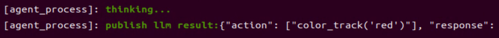

9) Then, the robot will detect the red object in its camera feed and begin tracking it in real time.


10) To stop the feature, refer to Step 4 to reactivate the voice device again with the wake word to begin a new interaction cycle.


11) To exit the feature, press **Ctrl+C** in the terminal. If the feature does not shut down immediately, press **Ctrl+C** multiple times. If it still fails to exit, open a new terminal window and run the following command to terminate all active ROS processes and related programs.

```bash
~/.stop_ros.sh
```

#### 10.2.5.4 Program Outcome

Once the feature is activated, commands can be freely issued, for example, “**Follow the red object**.” The robot uses its camera feed to detect and track the red object. Similarly, commands such as “Follow the blue object” or “Follow the green object” can be used to have the robot detect and track objects of the corresponding colors.

#### 10.2.5.5 Program Analysis

* **Launch File Analysis**

The program file is located at: **/home/ubuntu/ros2_ws/src/large_models_examples/large_models_examples/llm_color_track.launch.py**

Define `launch_setup` Function

```python
def launch_setup(context):
    mode = LaunchConfiguration('mode', default=1)
    mode_arg = DeclareLaunchArgument('mode', default_value=mode)

    app_package_path = get_package_share_directory('app')
    large_models_package_path = get_package_share_directory('large_models')

    object_tracking_node_launch = IncludeLaunchDescription(
        PythonLaunchDescriptionSource(
            os.path.join(app_package_path, 'launch/object_tracking_node.launch.py')),
        launch_arguments={
            'debug': 'true',
        }.items(),
    )

    large_models_launch = IncludeLaunchDescription(
        PythonLaunchDescriptionSource(
            os.path.join(large_models_package_path, 'launch/start.launch.py')),
        launch_arguments={'mode': mode}.items(),
    )

    llm_color_track_node = Node(
        package='large_models_examples',
        executable='llm_color_track',
        output='screen',
    )

    return [mode_arg,
            object_tracking_node_launch,
            large_models_launch,
            llm_color_track_node,
            ]
```

This function is used to configure and launch actions in a Launch file.

`mode = LaunchConfiguration('mode', default=1)`: Defines a Launch parameter named mode with a default value of 1.

`mode_arg = DeclareLaunchArgument('mode', default_value=mode)`: Declares the mode parameter and adds it to the Launch description.

`objet_sorting_launch`: Uses `IncludeLaunchDescription` to include the `object_tracking_node.launch.py` file from the `large_models` package and passes the mode parameter.

`large_models_launch`: Uses `IncludeLaunchDescription` to include the `start.launch.py` file from the `large_models` package and passes the mode parameter.

`llm_color_track_node`: Defines a ROS2 node from the `large_models` package that runs the `llm_color_track` executable and prints its output to the screen.

Finally, returns a list containing all Launch actions.

* **Python File Analysis**

The program file is located at: **/home/ubuntu/ros2_ws/src/large_models_examples/large_models_examples/llm_color_track.py**

1\. Define Prompt Template (PROMPT)

```python
else:
    PROMPT = '''
**Role
You are an intelligent companion robot. Your job is to generate corresponding JSON commands based on the user’s input.

**Requirements
- For every user input, search the action function library for matching commands and return the corresponding JSON instruction.
- Craft a witty, ever-changing, and concise response (between 10 to 30 characters) for each action sequence to make interactions lively and fun.
- Output only the JSON result — do not include explanations or any extra text.
- Output format:{"action": ["xx", "xx"], "response": "xx"}

**Special Notes
The "action" key holds an array of function name strings arranged in execution order. If no match is found, return an empty array [].
The "response" key must contain a cleverly worded, short reply (10–30 characters), adhering to the tone and length guidelines above.

**Action Function Library
Track an object of a specific color: color_track('red')

**Example
Input: Track a green object
Output:
{"action": ["color_track('green')"], "response": "Got it!"}
    '''
```

2\. Class Initialization

```python
def __init__(self, name):
    rclpy.init()
    super().__init__(name)

    self.action = []
    self.stop = True
    self.llm_result = ''
    # self.llm_result = '{"action": ["color_track(\'blue\')"], "response": "ok！"}'
    self.running = True
    self.action_finish = False
    self.play_audio_finish = False

    timer_cb_group = ReentrantCallbackGroup()
    self.tts_text_pub = self.create_publisher(String, 'tts_node/tts_text', 1)
    self.create_subscription(String, 'agent_process/result', self.llm_result_callback, 1)
    self.create_subscription(Bool, 'vocal_detect/wakeup', self.wakeup_callback, 1, callback_group=timer_cb_group)
    self.create_subscription(Bool, 'tts_node/play_finish', self.play_audio_finish_callback, 1, callback_group=timer_cb_group)
    self.awake_client = self.create_client(SetBool, 'vocal_detect/enable_wakeup')
    self.awake_client.wait_for_service()
    self.set_mode_client = self.create_client(SetInt32, 'vocal_detect/set_mode')
    self.set_mode_client.wait_for_service()

    self.set_model_client = self.create_client(SetModel, 'agent_process/set_model')
    self.set_model_client.wait_for_service()
    self.set_prompt_client = self.create_client(SetString, 'agent_process/set_prompt')
    self.set_prompt_client.wait_for_service()

    self.enter_client = self.create_client(Trigger, 'object_tracking/enter')
    self.enter_client.wait_for_service()
    self.start_client = self.create_client(SetBool, 'object_tracking/set_running')
    self.start_client.wait_for_service()
    self.set_target_client = self.create_client(SetColor, 'object_tracking/set_color')
    self.set_target_client.wait_for_service()

    self.timer = self.create_timer(0.0, self.init_process, callback_group=timer_cb_group)
```

By initializing state parameters, including the action list, stop flag, LLM processing results, and completion status, a TTS text publisher and subscribers are created to receive agent processing results, voice wake signals, and audio playback completion status. Service client requests are also established for voice wake, node configuration, model setup, prompt settings, and object tracking functions, including entering tracking mode, setting run status, and specifying the target color. Finally, a timer is created to start the initialization process.

3\. Set LLM Model

```python
def init_process(self):
    self.timer.cancel()
    msg = SetModel.Request()
    msg.model = llm_model
    msg.model_type = 'llm'
    msg.api_key = api_key 
    msg.base_url = base_url
    self.send_request(self.set_model_client, msg)

    msg = SetString.Request()
    msg.data = PROMPT
    self.send_request(self.set_prompt_client, msg)

    init_finish = self.create_client(Trigger, 'object_tracking/init_finish')
    init_finish.wait_for_service()
    self.send_request(self.enter_client, Trigger.Request())
    speech.play_audio(start_audio_path)
    threading.Thread(target=self.process, daemon=True).start()
    self.create_service(Empty, '~/init_finish', self.get_node_state)
    self.get_logger().info('\033[1;32m%s\033[0m' % 'start')
    self.get_logger().info('\033[1;32m%s\033[0m' % PROMPT)
```

4\. `play_audio_finish_callback` Method

```python
def play_audio_finish_callback(self, msg):
    self.play_audio_finish = msg.data
```

The method handles the callback after audio playback and re-enables the voice wake-up functionality.

5\. `process` Method

```python
def process(self):
    while self.running:
        if self.llm_result:
            msg = String()
            if 'action' in self.llm_result: # If there is a corresponding action returned, extract and process it（If there is a corresponding behavior returned, extract and process it.）
                result = eval(self.llm_result[self.llm_result.find('{'):self.llm_result.find('}')+1])
                if 'action' in result:
                    text = result['action']
                    # Use regular expressions to extract all strings inside parentheses.
                    pattern = r"color_track\('([^']+)'\)"
                    # Use re.search to find the matching result.
                    for i in text:
                        match = re.search(pattern, i)
                        # Extract the result.
                        if match:
                            # Get all argument parts, precisely content inside parentheses.
                            color = match.group(1)
                            self.get_logger().info(str(color))
                            color_msg = SetColor.Request()
                            color_msg.data = color
                            self.send_request(self.set_target_client, color_msg)
                            # Start sorting.
                            start_msg = SetBool.Request()
                            start_msg.data = True 
                            self.send_request(self.start_client, start_msg)
                if 'response' in result:
                    msg.data = result['response']
            else: # If there is no corresponding action, just respond（If there is no corresponding behavior, only respond.）
                msg.data = self.llm_result
            self.tts_text_pub.publish(msg)
            self.action_finish = True
            self.llm_result = ''
        else:
            time.sleep(0.01)
        if self.play_audio_finish and self.action_finish:
            self.play_audio_finish = False
            self.action_finish = False
            # msg = SetInt32.Request()
            # msg.data = 1
            # self.send_request(self.set_mode_client, msg)
            msg = SetBool.Request()
            msg.data = True
            self.send_request(self.awake_client, msg)
            self.stop = False
    rclpy.shutdown()
```

By continuously monitoring the large model output, the system checks for any instruction that contains the `color_track` action. Once detected, it uses a regular expression to extract the color parameter and sends it to the color-tracking module as the target color, then activates the tracking function. If a text response is generated, the system delivers it through TTS for voice feedback. During execution, it coordinates action handling with the completion status of audio playback. After the task is finished, it resets the status flags and re-enables the voice-wake function, ready for the next command.


## 10.3 Embodied AI Applications

<p id ="anther10.3.1"></p>

### 10.3.1 Large Model API Key Setup

> [!NOTE]
>
> **This section requires registering on the official OpenAI website and obtaining an API key for accessing large language models.**

#### 10.3.1.2 OpenRouter Account Registration and Deployment

1) Copy and open the following URL: https://platform.openai.com/docs/overview, then click the **Sign Up** button in the upper-right corner.


2) Register and log in using a Google, Microsoft, or Apple account, as prompted.


3) After logging in, click the Settings button, then go to **Billing**, and click **Payment Methods** to add a payment method. The payment is used to purchase **tokens**.


4) After completing the preparation steps, click **API Keys** and create a new key. Follow the prompts to fill in the required information, then save the key for later use.


5) The creation and deployment of the large model have been completed, and this API will be used in the following sections.

#### 10.3.1.2 OpenRouter Account Registration and Deployment

1) Copy the URL https://openrouter.ai/ into a browser and open the webpage. Click **Sign in** and register or sign in using a Google account or another available account.


2) After logging in, click the icon in the top-right corner, then select **Credits** to add a payment method.


3) Create an API key. Go to **API Keys**, then click **Create Key**. Follow the prompts to generate a key. Save the API key securely for later use.


The creation and deployment of the large model have been completed, and this API will be used in the following sections.

#### 10.3.1.3 API Configuration

1. Click  to open a terminal and enter the following command to open the configuration file. Press the i key to enter input mode.

```bash
vim /home/ubuntu/ros2_ws/src/large_models/large_models/large_models/config.py
```

2. Fill in the obtained Large Model API Key in the corresponding parameter, as shown in the red box in the figure below.


3. Press **Esc**, then enter the command and press **Enter** to save and exit the configuration file.

```bash
:wq
```

<p id ="anther10.3.2"></p>

### 10.3.2 Version Confirmation

Before starting features, verify that the correct microphone configuration is set in the system.

1. After remotely logging in via NoMachine, click the desktop icon  to access the configuration interface.

2. Select the appropriate microphone version configuration according to the hardware.


3. If using the AI Voice Interaction Box, select **WonderEcho Pro** as the microphone type, as shown in the figure below.


4. For the 6-Microphone Array, select **xf** as the microphone type as shown in the figure.

   

   

5. Click **Save**.

   

6. After the **Save Success** notification appears, click **Apply**.

   

7. Finally, click **Quit** to exit the software interface.

   


### 10.3.3 Real-Time Detection

#### 10.3.3.1 Program Overview

When the program starts, the voice device will announce “**I'm ready**.” To activate the voice device, speak the designated wake words: “**Hello Hiwonder**.” Upon successful activation, the voice device will respond with “**I’m here**.” Then, voice commands can be used to control the robot, for example, “**Tell me what you saw**.” The terminal will display the recognized speech, the voice device will respond with a generated reply after processing, and the robot will autonomously analyze the camera feed and describe the content of the scene.

#### 10.3.3.2 Preparation

* **Version Confirmation**

Before starting this feature, ensure that the microphone version configuration in the system is correct. For more details, refer to section [10.3.2 Version Confirmation](#anther10.3.2).

* **Configure the Large Model API Key**

Refer to the section [10.3.1 Large Model API Key Setup](#anther10.3.1) to set up the large model key.

#### 10.3.3.3 Operation Steps

1. Click the terminal  on the left side of the system interface to open the command line. Enter the command and press **Enter** to disable the app auto-start service.

```bash
sudo systemctl stop start_app_node.service
```

2. Enter the following command and press **Enter** to launch the real-time detection feature.

```bash
ros2 launch large_models_examples vllm_with_camera.launch.py
```

3) When the command line displays the output shown below and announces “**I’m ready**”, the voice device has completed initialization. At this point, say the wake word **Hello Hiwonder**.


4) When the command line shows the output below and the voice device announces “**I’m here**”, the voice device has been successfully activated. The system will begin recording your voice command.


5) When the command line displays the output shown below, it indicates that the voice device has printed the recognized speech. At this point, user command recording begins. Next, say the command “**Tell me what you saw**,” and wait for the large model to process it. When the command line shows the output below, it indicates that the cloud-based speech large model service has successfully processed the audio command, with the recognition result available in `publish_asr_result`.

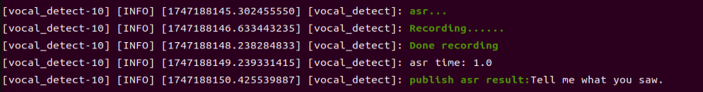

6) Upon receiving user input shown in the figure, the terminal will display output indicating that the cloud-based large language model has been successfully invoked. The model will interpret the command and generate a language response.


The response is automatically generated by the large model. Only the semantic accuracy of the reply is guaranteed, while the wording and formatting may vary.

7) When the command line displays the output shown below, the current dialogue session has ended. Refer to Step 4 to reactivate the voice device with the wake word and start a new dialogue session.


8) To exit the feature, press **Ctrl+C** in the terminal. If the feature does not exit immediately, press **Ctrl+C** multiple times.

#### 10.3.3.4 Program Outcome

Once the feature is activated, any command can be issued to the robot, for example: “**Tell me what you saw**.” The robot will automatically analyze the scene within its camera view, process the information, and describe the current environment in detail.

#### 10.3.4.5 Program Analysis

* **Launch File Analysis**

The program file is located at: **/home/ubuntu/ros2_ws/src/large_models_examples/large_models_examples/vllm_with_camera.launch.py**

Define `launch_setup` Function

```python
def launch_setup(context):
    mode = LaunchConfiguration('mode', default=1)
    mode_arg = DeclareLaunchArgument('mode', default_value=mode)

    camera_topic = LaunchConfiguration('camera_topic', default='depth_cam/rgb0/image_raw')
    camera_topic_arg = DeclareLaunchArgument('camera_topic', default_value=camera_topic)

    controller_package_path = get_package_share_directory('controller')
    peripherals_package_path = get_package_share_directory('peripherals')
    large_models_package_path = get_package_share_directory('large_models')

    controller_launch = IncludeLaunchDescription(
        PythonLaunchDescriptionSource(
            os.path.join(controller_package_path, 'launch/controller.launch.py')),
    )
    
    depth_camera_launch = IncludeLaunchDescription(
        PythonLaunchDescriptionSource(
            os.path.join(peripherals_package_path, 'launch/depth_camera.launch.py')),
    )

    large_models_launch = IncludeLaunchDescription(
        PythonLaunchDescriptionSource(
            os.path.join(large_models_package_path, 'launch/start.launch.py')),
        launch_arguments={'mode': mode, 'camera_topic': camera_topic}.items(),
    )

    vllm_with_camera_node = Node(
        package='large_models_examples',
        executable='vllm_with_camera',
        output='screen',
        parameters=[{"camera_topic": camera_topic}],
    )

    return [mode_arg,
            camera_topic_arg,
            controller_launch,
            depth_camera_launch,
            large_models_launch,
            vllm_with_camera_node,
            ]
```

This function is used to configure and launch actions in a Launch file.

`mode = LaunchConfiguration('mode', default=1)`: Defines a Launch parameter named mode with a default value of 1.

`mode_arg = DeclareLaunchArgument('mode', default_value=mode)`: Declares the mode parameter and adds it to the Launch description.

`depth_camera_launch`: Uses `IncludeLaunchDescription` to include the `depth_camera.launch.py Launch` file from the `large_models` package and passes the mode parameter.

`controller_launch`: Uses `IncludeLaunchDescription` to include the `controller.launch.py` launch file from the `large_models` package and passes the mode parameter.

`large_models_launch`: Uses `IncludeLaunchDescription` to include the `start.launch.py` file from the `large_models` package and passes the mode parameter.

`vllm_with_camera`: Defines a ROS2 node from the large_models package that runs the vllm_with_camera executable and prints its output to the screen.

Finally, returns a list containing all Launch actions.

* **Python File Analysis**

The program file is located at: **/home/ubuntu/ros2_ws/src/large_models_examples/large_models_examples/vllm_with_camera.py**

1\. Class Initialization

```python
def __init__(self, name):
    rclpy.init()
    super().__init__(name)

    # Initialize variables
    self.image_queue = queue.Queue(maxsize=2)
    self.set_above = False
    self.vllm_result = ''
    self.running = True
    self.action_finish = False
    self.play_audio_finish = False
    self.bridge = CvBridge()
    self.client = speech.OpenAIAPI(api_key, base_url)

    # Add debug flags
    self.image_received = False
    self.first_image_time = None

    # Declare parameters
    self.declare_parameter('camera_topic', '/ascamera/camera_publisher/rgb0/image')
    camera_topic = self.get_parameter('camera_topic').value

    # Log camera topic information
    self.get_logger().info(f'Camera topic: {camera_topic}')

    # Create callback group
    timer_cb_group = ReentrantCallbackGroup()

    # Create publishers
    self.joints_pub = self.create_publisher(ServosPosition, 'servo_controller', 1)
    self.tts_text_pub = self.create_publisher(String, 'tts_node/tts_text', 1)

    # Create subscribers
    self.create_subscription(Image, camera_topic, self.image_callback, 1)
    self.create_subscription(String, 'agent_process/result', self.vllm_result_callback, 1)
    self.create_subscription(Bool, 'tts_node/play_finish', self.play_audio_finish_callback, 1, callback_group=timer_cb_group)

    # Create clients
    self.awake_client = self.create_client(SetBool, 'vocal_detect/enable_wakeup')
    self.awake_client.wait_for_service()
    self.set_model_client = self.create_client(SetModel, 'agent_process/set_model')
    self.set_model_client.wait_for_service()
    self.set_mode_client = self.create_client(SetInt32, 'vocal_detect/set_mode')
    self.set_mode_client.wait_for_service()
    self.set_prompt_client = self.create_client(SetString, 'agent_process/set_prompt')
    self.set_prompt_client.wait_for_service()

    # Create initialization timer
    self.timer = self.create_timer(0.0, self.init_process, callback_group=timer_cb_group)
```

Initialize state parameters, including the action list, VLLM processing results, running status, and interrupt flags. Create publishers, such as TTS text and chassis motion control, and subscribers to receive agent processing results, voice wake signals, and audio playback completion status. Set up service client requests for model configuration, voice wake enablement, and prompt setup, then create a timer to start the initialization process.

2\. `get_node_state` Method

```python
def get_node_state(self, request, response):
    return response
```

Service callback function that returns an empty response, used for querying the node’s status.

3\. `init_process` Method

```python
def init_process(self):
    """Initialize processing workflow"""
    self.timer.cancel()

    # Set model
    msg = SetModel.Request()
    msg.model_type = 'vllm'
    if os.environ['ASR_LANGUAGE'] == 'Chinese':
        msg.model = stepfun_vllm_model
        msg.api_key = stepfun_api_key
        msg.base_url = stepfun_base_url
    else:
        msg.model = vllm_model
        msg.api_key = vllm_api_key
        msg.base_url = vllm_base_url
    self.send_request(self.set_model_client, msg)

    # Set prompt
    msg = SetString.Request()
    msg.data = VLLM_PROMPT
    self.send_request(self.set_prompt_client, msg)

    set_servo_position(self.joints_pub, 1.0,
                       ((1, 500), (2, 645), (3, 135), (4, 80), (5, 500), (10, 220)))

    # Play startup audio
    speech.play_audio(start_audio_path)

    # Wait for the first image frame before starting processing thread
    self.get_logger().info('Waiting for first image...')
    threading.Thread(target=self.wait_and_start_process, daemon=True).start()

    # Create service
    self.create_service(Empty, '~/init_finish', self.get_node_state)
    self.get_logger().info('\033[1;32m%s\033[0m' % 'start')
```

Intelligently select the language model configuration, set up a multilingual visual prompt template, initialize and play the start audio cue, launch the processing thread, create a service indicating initialization completion, and finally output the startup log.

4\. `play_audio_finish_callback` Method

```python
def play_audio_finish_callback(self, msg):
    self.play_audio_finish = msg.data
```

It sends a request to enable the wake-up feature once audio playback is complete.

5\. `process` Method

```python
def process(self):
    """Main processing loop - display images and handle VLLM results"""
    # Create OpenCV window
    cv2.namedWindow('image', cv2.WINDOW_NORMAL)
    cv2.resizeWindow('image', display_size[0], display_size[1])

    while self.running:
        try:
            # Get image with timeout to avoid blocking indefinitely
            image = self.image_queue.get(timeout=0.1)

            # Handle VLLM result
            if self.vllm_result:
                msg = String()
                msg.data = self.vllm_result
                self.tts_text_pub.publish(msg)
                self.vllm_result = ''
                self.action_finish = True

            # Handle audio playback completion
            if self.play_audio_finish and self.action_finish:
                self.play_audio_finish = False
                self.action_finish = False
                msg = SetBool.Request()
                msg.data = True
                self.send_request(self.awake_client, msg)

            # Convert color space and resize
            bgr_image = cv2.cvtColor(image, cv2.COLOR_RGB2BGR)
            display_image = cv2.resize(bgr_image, (display_size[0], display_size[1]))

            # Display image
            cv2.imshow('image', display_image)

            # Set window position, execute only once
            if not self.set_above:
                cv2.moveWindow('image', 1920 - display_size[0], 0)
                try:
                    os.system("wmctrl -r image -b add,above")
                except Exception as e:
                    self.get_logger().warn(f'Failed to set window always on top: {e}')
                self.set_above = True

        except queue.Empty:
            # Continue loop when queue is empty
            pass
        except Exception as e:
            self.get_logger().error(f'Error in process loop: {e}')

        # Check keyboard input
        k = cv2.waitKey(1)
        if k == 27 or k == ord('q'):  # Press ESC or Q key to quit
            self.get_logger().info('User requested quit')
            break

    # Cleanup
    cv2.destroyAllWindows()
    self.running = False
```

Continuously retrieve image frames from the image queue and monitor the outputs of the vision-language model. When a valid result is detected, convert it into a speech message and publish it via TTS, coordinating the completion status of visual recognition and voice feedback. After the task is completed, re-enable the voice wake-up function.

6\. `image_callback` Method

```python
def image_callback(self, ros_image):
    """Image callback function"""
    try:
        # Convert ROS image to OpenCV format
        cv_image = self.bridge.imgmsg_to_cv2(ros_image, "rgb8")
        rgb_image = np.array(cv_image, dtype=np.uint8)

        # Record first received image
        if not self.image_received:
            self.image_received = True
            self.first_image_time = time.time()
            self.get_logger().info(f'First image received! Size: {rgb_image.shape}')

        # Discard oldest image if queue is full
        if self.image_queue.full():
            self.image_queue.get()

        # Put image into the queue
        self.image_queue.put(rgb_image)

    except Exception as e:
        self.get_logger().error(f'Error in image callback: {e}')
```

It converts the received ROS image messages to `NumPy` arrays and stores them in the queue.


### 10.3.4 Vision Tracking

The large model used in this lesson operates online, requiring a stable network connection for the controller during the operation.

#### 10.3.4.1 Program Overview

When the program starts, the voice device will announce “**I'm ready**.” To activate the voice device, speak the designated wake words: “**Hello Hiwonder**.” Upon successful activation, the voice device will respond with “**I’m here**.” Once activated, voice commands can be issued, for example, “**Follow the person in white in front**.” The terminal will display the recognized command, and the voice device will respond with a generated reply after processing and execute corresponding actions.

#### 10.3.4.2 Preparation

* **Version Confirmation**

Before starting this feature, ensure that the microphone version configuration in the system is correct. For more details, refer to section [10.3.2 Version Confirmation](#anther10.3.2).

* **Configure the Large Model API Key**

Refer to the section [10.3.1 Large Model API Key Setup](#anther10.3.1) to set up the large model key.

#### 10.3.4.3 Operation Steps

> [!NOTE]
>
> **Command input is case-sensitive and space-sensitive.**
>
> **The robot must be connected to the Internet, either in STA (LAN) mode or AP (direct connection) mode via Ethernet.**

1. Click the terminal  on the left side of the system interface to open the command line. Enter the command and press **Enter** to disable the app auto-start service.

```bash
sudo systemctl stop start_app_node.service
```

2) Enter the following command and press **Enter** to launch the vision tracking feature.

```bash
ros2 launch large_models_examples vllm_track.launch.py
```

3) When the command line displays the output shown below and the device announces “**I'm ready**,” it indicates that the voice device has completed initialization and the YOLO model has also been initialized. At this point, say the wake word **Hello Hiwonder** to activate the voice device.


4) When the command line shows the output below and the voice device announces “**I’m here**”, it has been successfully activated. The system will begin recording your voice command.


5) When the command line displays the output shown below, it indicates that the voice device has printed the recognized speech. At this point, user command recording begins. Next, say the command “**Follow the person in white in front**,” and wait for the large model to process it. When the command line shows the output below, it indicates that the cloud-based speech large model service has successfully processed the audio command, with the recognition result available in `publish_asr_result`.


6. When the command line displays the output shown below, the cloud-based large language model has been successfully invoked. It processes the user’s command, provides a verbal response, and generates actions corresponding to the semantic meaning of the command.

   The response is automatically generated by the large model. Only the semantic accuracy of the reply is guaranteed, while the wording and formatting may vary.

7. When the terminal shows the output shown in the figure, indicating the end of one interaction cycle, the system is ready for the next round. To initiate another interaction, repeat step 4 by speaking the wake words again.


8) To exit the feature, press **Ctrl+C** in the terminal. If the feature does not exit immediately, press **Ctrl+C** multiple times.

#### 10.3.4.4 Program Outcome

Once the feature is activated, any command can be issued to the robot, such as “**Follow the person in white in front**.” The robot will detect the person wearing white in its camera view and stop after reaching a preset distance.


#### 10.3.4.5 Program Analysis

* **Launch File Analysis**

The program file is located at: **/home/ubuntu/ros2_ws/src/large_models_examples/large_models_examples/vllm_track.launch.py**

Define `launch_setup` Function

```python
def launch_setup(context):
    mode = LaunchConfiguration('mode', default=1)
    mode_arg = DeclareLaunchArgument('mode', default_value=mode)
    
    slam_package_path = get_package_share_directory('slam')
    large_models_package_path = get_package_share_directory('large_models') 
    
    base_launch = IncludeLaunchDescription(
        PythonLaunchDescriptionSource(
            os.path.join(slam_package_path, 'launch/include/robot.launch.py')),
        launch_arguments={
            'sim': 'false',
            'master_name': os.environ['MASTER'],
            'robot_name': os.environ['HOST']
        }.items(),
    )

    large_models_launch = IncludeLaunchDescription(
        PythonLaunchDescriptionSource(
            os.path.join(large_models_package_path, 'launch/start.launch.py')),
        launch_arguments={'mode': mode}.items(),
    )

    vllm_track_node = Node(
        package='large_models_examples',
        executable='vllm_track',
        output='screen',
    )

    # rqt
    calibrate_rqt_reconfigure_node = Node(
        package='rqt_reconfigure',
        executable='rqt_reconfigure',
        name='calibrate_rqt_reconfigure'
    )

    return [mode_arg,
            base_launch,
            large_models_launch,
            vllm_track_node,
            # calibrate_rqt_reconfigure_node,
            ]
```

This function is used to configure and launch actions in a Launch file.

`mode = LaunchConfiguration('mode', default=1)`: Defines a Launch parameter named mode with a default value of 1.

`mode_arg = DeclareLaunchArgument('mode', default_value=mode)`: Declares the mode parameter and adds it to the Launch description.

`slam_package_path和large_models_package_path`: Retrieves the shared directory path of the `slam` package and the `large_models` package.

`base_launch`: Includes the `robot.launch.py` file from the `slam` package and passes the parameters `sim`, `master_name`, and `robot_name`.

`large_models_launch`: Includes the `start.launch.py` launch file from the `large_models` package and passes the node parameter.

`llm_track_node`: Defines a ROS2 node from the `large_models` package that runs the `vllm_track` executable and prints its output to the screen.

`calibrate_rqt_reconfigure_node`: An `rqt_reconfigure` node used for debugging.

Finally, returns a list containing all Launch actions.

* **Python File Analysis**

The program file is located at: **/home/ubuntu/ros2_ws/src/large_models_examples/large_models_examples/vllm_track.py**

1\. Define Prompt Template (PROMPT)

```python
else:
    PROMPT = '''
**Role
You are a smart car with advanced visual recognition capabilities. Your task is to analyze an image sent by the user, perform object detection, and follow the detected object. Finally, return the result strictly following the specified output format.

Step 1: Understand User Instructions
You will receive a sentence. From this sentence, extract the object name to be detected.
Note: Use English for the object value, do not include any objects not explicitly mentioned in the instruction.

Step 2: Understand the Image
You will also receive an image. Locate the target object in the image and return its coordinates as the top-left and bottom-right pixel positions in the form [xmin, ymin, xmax, ymax].
Note: If the object is not found, then "xyxy" should be an empty list: [], only detect and report objects mentioned in the user instruction.The coordinates (xmin, ymin, xmax, ymax) must be normalized to the range [0, 1]

**Important: Accurately understand the spatial position of the object. The "response" must reflect both the user's instruction and the detection result.

**Output Format (strictly follow this format, do not output anything else.The coordinates (xmin, ymin, xmax, ymax) must be normalized to the range [0, 1])
{
    "object": "name", 
    "xyxy": [xmin, ymin, xmax, ymax],
    "response": "reflect both the user's instruction and the detection result (5-30 characters)"
}

**Example
Input: track the person
Output:
{
    "object": "person",
    "xyxy": [0.1, 0.3, 0.4, 0.6],
    "response": "I have detected a person in a white T-shirt and will track him now."
}
    '''
```

2\. Class Initialization

```python
def __init__(self, name):
    rclpy.init()
    super().__init__(name)
    self.machine_type = os.environ['MACHINE_TYPE']
    self.fps = fps.FPS() # Frame rate counter
    self.image_queue = queue.Queue(maxsize=2)
    self.vllm_result = ''
    # self.vllm_result = '''json{"object":"Red block", "xyxy":[521, 508, 637, 683]}'''
    self.running = True
    self.data = []
    self.start_track = False
    self.bridge = CvBridge()
    #cv2.namedWindow('image', 0)
    #cv2.moveWindow('image', 1920 - 640, 0)
    #cv2.waitKey(10)
    #os.system("wmctrl -r image -b add,above")
    self.camear_type = os.environ['DEPTH_CAMERA_TYPE']
    self.track = ObjectTracker(use_mouse=False, automatic=True, log=self.get_logger())
    timer_cb_group = ReentrantCallbackGroup()
    self.client = speech.OpenAIAPI(api_key, base_url)
    self.mecanum_pub = self.create_publisher(Twist, '/controller/cmd_vel', 1)  # Chassis control
    self.tts_text_pub = self.create_publisher(String, 'tts_node/tts_text', 1)
    self.create_subscription(Bool, 'tts_node/play_finish', self.play_audio_finish_callback, 1, callback_group=timer_cb_group)
    self.create_subscription(String, 'agent_process/result', self.vllm_result_callback, 1)
    self.create_subscription(Bool, 'vocal_detect/wakeup', self.wakeup_callback, 1)

    self.awake_client = self.create_client(SetBool, 'vocal_detect/enable_wakeup')
    self.awake_client.wait_for_service()
    self.set_model_client = self.create_client(SetModel, 'agent_process/set_model')
    self.set_model_client.wait_for_service()
    self.set_prompt_client = self.create_client(SetString, 'agent_process/set_prompt')
    self.set_prompt_client.wait_for_service()

    image_sub = message_filters.Subscriber(self, Image, 'ascamera/camera_publisher/rgb0/image')
    depth_sub = message_filters.Subscriber(self, Image, 'ascamera/camera_publisher/depth0/image_raw')

    self.result_publisher = self.create_publisher(Image, '~/image_result', 1)

    # Synchronize timestamps, allowing a time error of up to 0.03s
    sync = message_filters.ApproximateTimeSynchronizer([depth_sub, image_sub], 3, 0.02)
    sync.registerCallback(self.multi_callback)

    # Define PID parameters
    # 0.07, 0, 0.001
    self.pid_params = {
        'kp1': 0.01, 'ki1': 0.0, 'kd1': 0.00,
        'kp2': 0.002, 'ki2': 0.0, 'kd2': 0.0,
    }

    # Dynamically declare parameters
    for param_name, default_value in self.pid_params.items():
        self.declare_parameter(param_name, default_value)
        self.pid_params[param_name] = self.get_parameter(param_name).value

    self.track.update_pid([self.pid_params['kp1'], self.pid_params['ki1'], self.pid_params['kd1']],
                  [self.pid_params['kp2'], self.pid_params['ki2'], self.pid_params['kd2']])

    # Callback function for dynamic updates
    self.add_on_set_parameters_callback(self.on_parameter_update)

    self.timer = self.create_timer(0.0, self.init_process, callback_group=timer_cb_group)
```

By initializing the robot's chassis type, frame rate monitor, and image queue, publishers for TTS text output and chassis motion control are created, along with subscribers for voice wake-up detection and receiving agent processing results. Service client requests are set up for enabling voice wake-up and configuring models. Message filters synchronize depth and RGB images. PID parameters are configured for precise target tracking control with support for dynamic parameter adjustment, and finally, a timer is created to start the initialization process.

3\. `init_process` Method

```python
def init_process(self):
    self.timer.cancel()

    self.joints_pub = self.create_publisher(ServosPosition, 'servo_controller', 1)
    set_servo_position(self.joints_pub, 1, ((10, 200), (5, 500), (4, 220), (3, 100), (2, 665), (1, 500)))

    msg = SetModel.Request()
    msg.model_type = 'vllm'
    if os.environ['ASR_LANGUAGE'] == 'Chinese':
        msg.model = stepfun_vllm_model
        msg.api_key = stepfun_api_key
        msg.base_url = stepfun_base_url
    else:
        msg.model = vllm_model
        msg.api_key = vllm_api_key
        msg.base_url = vllm_base_url
    self.send_request(self.set_model_client, msg)

    msg = SetString.Request()
    msg.data = PROMPT
    self.send_request(self.set_prompt_client, msg)

    self.mecanum_pub.publish(Twist())
    time.sleep(1.8)
    speech.play_audio(start_audio_path)
    threading.Thread(target=self.process, daemon=True).start()
    self.create_service(Empty, '~/init_finish', self.get_node_state)
    self.get_logger().info('\033[1;32m%s\033[0m' % 'start')
    self.get_logger().info('\033[1;32m%s\033[0m' % PROMPT)
```

By removing the timer, a publisher is created. Based on the system's language setting, the appropriate visual language model configuration is selected, and a dedicated prompt template is set. The stop motion command for the chassis is published, and the start prompt audio is played. At the same time, the processing thread is started, the initialization completion status service is created, and finally, the startup log information is output.

4\. `process` Method

```python
def process(self):
    box = ''

    while self.running:

        image, depth_image = self.image_queue.get(block=True)

        if self.vllm_result:
            try:
                self.vllm_result = json.loads(self.vllm_result)
                box = self.vllm_result['xyxy']
                if box:
                    if self.camear_type == 'aurora':
                        w_ = 640
                        h_ = 400
                    else:
                        w_ = 640
                        h_ = 480
                    if os.environ["ASR_LANGUAGE"] == 'Chinese':
                        box = self.client.data_process(box, w_, h_)
                    else:
                        box = [int(box[0] * w_), int(box[1] * h_), int(box[2] * w_), int(box[3] * h_)]
                box = [box[0], box[1], box[2] - box[0], box[3] - box[1]]
                self.track.set_track_target(box, image)
                self.start_track = True
                speech.play_audio(start_track_audio_path, block=False)
            except (ValueError, TypeError) as e:
                self.start_track = False
                msg = String()
                msg.data = self.vllm_result
                self.tts_text_pub.publish(msg)
                speech.play_audio(track_fail_audio_path, block=False)
                self.get_logger().info(e)
            self.vllm_result = ''
            msg = SetBool.Request()
            msg.data = True
            self.send_request(self.awake_client, msg)           
        if self.start_track:
            self.data = self.track.track(image, depth_image)
            image = self.data[-1]
            twist = Twist()
            twist.linear.x, twist.angular.z = self.data[0], self.data[1]
            # self.get_logger().info('twist.linear.x:{}'.format(twist.linear.x))
            # self.get_logger().info('twist.angular.z:{}'.format(twist.angular.z))                                

            if 'Acker' in self.machine_type:
                steering_angle = common.set_range(twist.angular.z, -math.radians(40), math.radians(40))
                if steering_angle != 0:
                    R = 0.145/math.tan(steering_angle)
                    twist.angular.z = twist.linear.x/R


            self.mecanum_pub.publish(twist)                             
        self.result_publisher.publish(self.bridge.cv2_to_imgmsg(image, "bgr8"))
        self.fps.update()
        self.fps.show_fps(image)
        cv2.imshow('image', image)
        key = cv2.waitKey(1)
        if key == ord('q') or key == 27:  # Press Q or ESC to exit
            self.mecanum_pub.publish(Twist())
            self.running = False
```

By continuously retrieving RGB and depth image frames from the image queue, when the visual language model output is detected, the target bounding box coordinates are extracted. After coordinate transformation based on the camera type and language environment, tracking is initiated, and the start prompt sound is played. If parsing fails, a voice feedback is provided via TTS. After performing a kinematic transformation based on the robot type, the control commands are published to the chassis control topic for chassis control, with support for exiting the loop via a button press.

5\. `multi_callback` Method

```python
def multi_callback(self, depth_image, ros_image):
    depth_frame = np.ndarray(shape=(depth_image.height, depth_image.width), dtype=np.uint16, buffer=depth_image.data)
    bgr_image = np.array(self.bridge.imgmsg_to_cv2(ros_image, "bgr8"), dtype=np.uint8)

    if self.image_queue.full():
        # Discard oldest image if queue is full
        self.image_queue.get()
    # Put image into the queue
    self.image_queue.put([bgr_image, depth_frame])
```

Convert the ROS depth image message into a depth frame in `NumPy` array format, while using `CVBridge` to convert the ROS RGB image message into an `OpenCV` BGR format image. If the image queue is full, first clear the queue, and then insert the processed BGR image and depth frame into the image queue.


### 10.3.4 Smart Home Assistant

The large model used in this lesson operates online, requiring a stable network connection for the controller during the operation.

#### 10.3.4.1 Program Overview

When the program starts, the voice device will announce “**I'm ready**.” Then, speak the wake word **Hello Hiwonder** to activate the voice device, which will respond with “**I'm here**.” After activation, voice commands can be used to control the robot. For example, issuing the instruction:  "**Go to the kitchen to see if the door is closed, then come back and tell me**." Upon receiving a command, the terminal displays the recognized speech content. The voice device then verbally responds with a generated answer, and the robot simultaneously executes the corresponding action.

#### 10.3.4.2 Preparation

* **Version Confirmation**

Before starting this feature, ensure that the microphone version configuration in the system is correct. For more details, refer to section [10.3.2 Version Confirmation](#anther10.3.2).

* **Configure the Large Model API Key**

Refer to the section [10.3.1 Large Model API Key Setup](#anther10.3.1) to set up the large model key.

* **Navigation Map Construction**

Before enabling this feature, a map must be created in advance. Please refer to [5.1 Mapping Tutorial](https://docs.hiwonder.com/projects/ROSOrin/en/latest/docs/5_Mapping_%26_Navigation_Course.html#mapping-tutorial) for detailed instructions on how to build the map.

#### 10.3.4.3 Operation Steps

> [!NOTE]
>
> * **Command input is case-sensitive and space-sensitive.**
>
> * **The robot must be connected to the Internet, either in STA (LAN) mode or AP (direct connection) mode via Ethernet.**

1. Click the terminal  on the left side of the system interface to open the command line. Enter the command and press **Enter** to disable the app auto-start service.

```bash
sudo systemctl stop start_app_node.service
```

2) Enter the following command and press **Enter** to launch the smart home assistant feature.

```bash
ros2 launch large_models_examples vllm_navigation.launch.py map:=map_01
```

3) When the command line displays the following output and announces "**I'm ready**," it indicates that the voice device has completed initialization.


4) Say the wake word **Hello Hiwonder**.


5) The voice device will then respond with "**I'm here**," signaling that it has been activated successfully. The system will begin recording your voice command.

6) When the command line displays the following output, it indicates that the voice device has printed the recognized speech. At this point, the system begins recording the received command. Then, give the command to the robot, for example, "**Go to the kitchen to see if the door is closed, then come back and tell me**," and wait for the large model to process the command. When the command line shows the next output, it indicates that the cloud-based speech large model has successfully processed the voice command and parsed the audio. The parsed result will appear in the `publish_asr_result`.


7. When the command line displays the output shown below, the cloud-based large language model has been successfully invoked. It processes the user’s command, provides a verbal response, and generates actions corresponding to the semantic meaning of the command.

   The response is automatically generated by the large model. Only the semantic accuracy of the reply is guaranteed, while the wording and formatting may vary.


8) Upon reaching the **kitchen**, the system will recognize whether the door is closed.

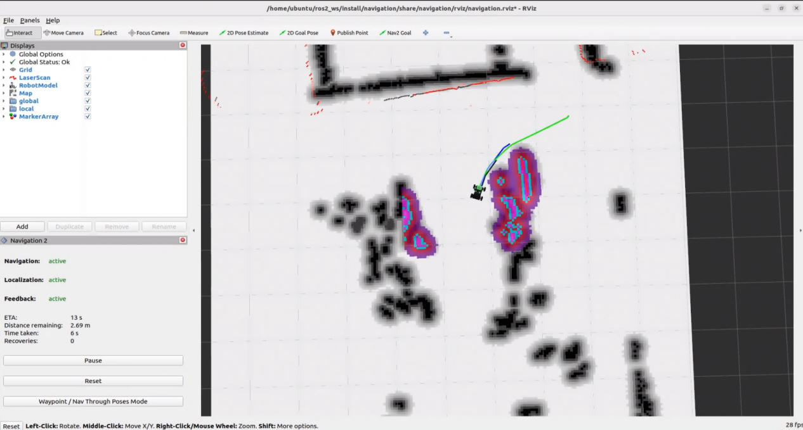

9) Afterward, the robot will return to the **origin** position and provide a response about the door's status, such as "**The door is closed**."


10) When the terminal shows the output shown in the figure, indicating the end of one interaction cycle, the system is ready for the next round. To initiate another interaction, repeat step 5 by speaking the wake words again.


11) To exit the feature, press **Ctrl+C** in the terminal. If the feature does not exit immediately, press **Ctrl+C** multiple times.

#### 10.3.4.4 Program Outcome

Once the feature starts, any command can be issued to the robot, such as “**Go to the kitchen to see if the door is closed and let me know when you come back**.” The robot will navigate to the designated location, check if the door is closed, and then return to the starting point to inform of the result.


#### 10.3.4.5 Modifying Navigation Locations

If the navigation position in the program needs to be modified, edit the file located at the following path: **~/ros2_ws/src/large_models_examples/large_models_examples/vllm_navigation.py**

1) Open the program to display the RViz map, then set the navigation target location by clicking `2D Goal Pose` and selecting the position on the map.

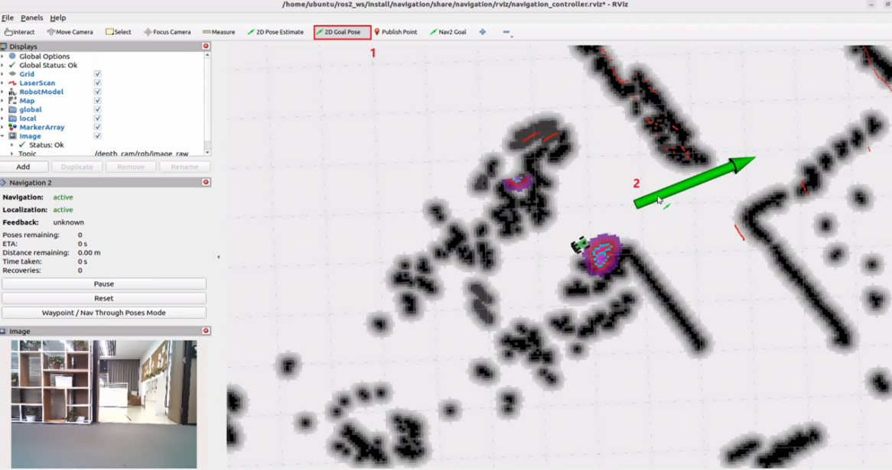

2. Return to the command terminal and check the published target position parameters.

   


Locate the corresponding section of the code shown below, and fill in your target location parameters after the appropriate location name.

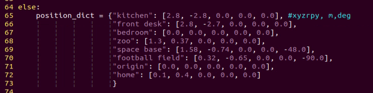

The different target navigation points in the program are relative to the robot's starting point during the mapping process. Each navigation point includes five parameters:

x: position on the x-axis (meters)

y: position on the y-axis (meters)

roll: rotation around the x-axis (degrees)

pitch: rotation around the y-axis (degrees)

yaw: rotation around the z-axis (degrees)

For example, to modify the **kitchen** target, set the robot's target position to [1.45, -0.29, 0.0, 0.0, 0.0], which represents the robot's position on the map when it reaches the **kitchen**.

The robot's target position orientation is updated. The printed quaternion `Orientation(0, 0, -0.379167, 0.925328)= Angle: -0.777791` in radians is shown. The quaternion is then converted to Euler angles, `roll, pitch, yaw`, resulting in `roll ≈ 0°，pitch ≈ 0°，yaw ≈ −44.56°`. Alternatively, converting the radians directly to degrees gives `−44.58°`.


The final target position for **kitchen** is updated to [1.45, -0.29, 0.0, 0.0, −44.58].

#### 10.3.4.6 Program Analysis

* **Launch File Analysis**

The program file is located at: **/home/ubuntu/ros2_ws/src/large_models_examples/large_models_examples/vllm_navigation.launch.py**

Define `launch_setup` Function

```python
def launch_setup(context):
    slam_package_path = get_package_share_directory('slam')
    navigation_package_path = get_package_share_directory('navigation')
    large_models_package_path = get_package_share_directory('large_models')
    
    mode = LaunchConfiguration('mode', default=1)
    mode_arg = DeclareLaunchArgument('mode', default_value=mode)
    map_name = LaunchConfiguration('map', default='map_01').perform(context)
    robot_name = LaunchConfiguration('robot_name', default=os.environ['HOST'])
    master_name = LaunchConfiguration('master_name', default=os.environ['MASTER'])

    map_name_arg = DeclareLaunchArgument('map', default_value=map_name)
    master_name_arg = DeclareLaunchArgument('master_name', default_value=master_name)
    robot_name_arg = DeclareLaunchArgument('robot_name', default_value=robot_name)

    navigation_launch = IncludeLaunchDescription(
        PythonLaunchDescriptionSource(os.path.join(navigation_package_path, 'launch/navigation.launch.py')),
        launch_arguments={
            'sim': 'false',
            'map': map_name,
            'robot_name': robot_name,
            'master_name': master_name,
            'use_teb': 'true',
        }.items(),
    )

    navigation_controller_node = Node(
        package='large_models_examples',
        executable='navigation_controller',
        output='screen',
        parameters=[{'map_frame': 'map', 'nav_goal': '/nav_goal'}]
    )

    rviz_node = ExecuteProcess(
            cmd=['rviz2', 'rviz2', '-d', os.path.join(navigation_package_path, 'rviz/navigation_controller.rviz')],
            output='screen'
        )

    large_models_launch = IncludeLaunchDescription(
        PythonLaunchDescriptionSource(
            os.path.join(large_models_package_path, 'launch/start.launch.py')),
        launch_arguments={'mode': mode}.items(),
    )

    vllm_navigation_node = Node(
        package='large_models_examples',
        executable='vllm_navigation',
        output='screen',
    )
```

`launch_setup`: Used to configure and initiate the `ROS 2 Launch` file actions.

`node = LaunchConfiguration('node', default=1)`: Defines a launch parameter named node, with a default value of 1.

`navigation_package_path`: Retrieves the shared directory path of the navigation package `parigations`.

`large_model_package_path`: Retrieves the shared directory path of the large model package `large_model`.

`navigating_lunch`: Uses `IncludeLaunchDescription` to include the navigation launch file `navigation.launch.py`, passing parameters like `node_name` and `master_name`.

`vllm_navigation_node`: Defines a ROS 2 node from the `large_models_examples` package, executing the `vllm_navigation` executable, and outputting to the screen.

`navigating_controller_node`: Defines the navigation control node from the `large_models_examples` package.

* **Python File Analysis**

The program file is located at: **/home/ubuntu/ros2_ws/src/large_models_examples/large_models_examples/vllm_navigation.py**

1\. Define Prompt Template (PROMPT)

```python
    LLM_PROMPT = '''
**Role
You are a smart navigation vehicle equipped with a camera and speaker. You can move to different places, analyze visual input, and respond by playing audio. Based on user input, you need to generate the corresponding JSON command.

**Requirements
- For any user input, look up corresponding functions from the Action Function Library, and generate the proper JSON output.
- For each action sequence, include a concise (5–20 characters) and witty, varied response to make the interaction lively and engaging.
- Output only the JSON result, no analysis or extra text.
- Output format:
{
  "action": ["xx", "xx"],
  "response": "xx"
}

**Special Notes
The "action" field contains an ordered list of function names to be executed in sequence. If no matching function is found, return: "action": [].
The "response" field should contain a carefully crafted, short, humorous, and varied message (5–20 characters).

**Action Function Library
Move to a specified place: move('kitchen')
Return to starting point: move('origin')
Analyze current view: vision('What do you see?')
Play audio response: play_audio()

**Example
Input: Go to the front desk to see if the door is closed, and then come back and tell me
Output:
{
  "action": ["move('front desk')", "vision('Is the door closed?')", "move("origin")", "play_audio()"],
  "response": "On it, reporting soon!"
}
    '''
```

2\. Class Initialization

```python
def __init__(self, name):
        rclpy.init()
        super().__init__(name)
        
        self.action = []
        self.response_text = ''
        self.llm_result = ''
        self.play_audio_finish = False
        self.running = True
        self.play_delay = False
        self.reach_goal = False
        self.interrupt = False
        
        timer_cb_group = ReentrantCallbackGroup()
        self.tts_text_pub = self.create_publisher(String, 'tts_node/tts_text', 1)
        # self.create_subscription(Image, 'ascamera/camera_publisher/rgb0/image', self.image_callback, 1)
        self.create_subscription(String, 'agent_process/result', self.llm_result_callback, 1)
        self.create_subscription(Bool, 'vocal_detect/wakeup', self.wakeup_callback, 1)
        self.create_subscription(Bool, 'tts_node/play_finish', self.play_audio_finish_callback, 1, callback_group=timer_cb_group)
        self.create_subscription(Bool, 'navigation_controller/reach_goal', self.reach_goal_callback, 1)
        self.awake_client = self.create_client(SetBool, 'vocal_detect/enable_wakeup')
        self.awake_client.wait_for_service()
        self.set_mode_client = self.create_client(SetInt32, 'vocal_detect/set_mode')
        self.set_mode_client.wait_for_service()
        self.set_model_client = self.create_client(SetModel, 'agent_process/set_model')
        self.set_model_client.wait_for_service()
        self.set_prompt_client = self.create_client(SetString, 'agent_process/set_prompt')
        self.set_prompt_client.wait_for_service()
        self.set_vllm_content_client = self.create_client(SetContent, 'agent_process/set_vllm_content')
        self.set_vllm_content_client.wait_for_service()
        self.set_pose_client = self.create_client(SetPose2D, 'navigation_controller/set_pose')
        self.set_pose_client.wait_for_service()

        self.controller = ActionGroupController(self.create_publisher(ServosPosition, 'servo_controller', 1), '/home/ubuntu/software/arm_pc/ActionGroups')

        self.timer = self.create_timer(0.0, self.init_process, callback_group=timer_cb_group)
```

Set up state parameters, including action list, response text, LLM processing results, and navigation target arrival status. Create publishers for TTS text publishing and subscribers for receiving agent processing results, voice wake-up signals, audio playback completion status, and navigation arrival status. At the same time, establish service client requests for voice wake-up, node settings, prompt word configuration, visual content settings, and navigation target point setup. Finally, create a timer to initiate the initialization process.

3\. `init_process` Method

```python
def init_process(self):
    self.timer.cancel()

    msg = SetModel.Request()
    msg.model = llm_model
    msg.model_type = 'llm'
    msg.api_key = api_key 
    msg.base_url = base_url
    self.send_request(self.set_model_client, msg)

    msg = SetString.Request()
    msg.data = LLM_PROMPT
    self.send_request(self.set_prompt_client, msg)

    init_finish = self.create_client(Empty, 'navigation_controller/init_finish')
    init_finish.wait_for_service()
    speech.play_audio(start_audio_path)
    threading.Thread(target=self.process, daemon=True).start()
    self.create_service(Empty, '~/init_finish', self.get_node_state)
    self.get_logger().info('\033[1;32m%s\033[0m' % 'start')
    self.get_logger().info('\033[1;32m%s\033[0m' % LLM_PROMPT)
```

After disabling the timer, configure the parameters for the large language model, including model type, API key, and base URL. Set up a dedicated prompt word template for the navigation task, wait for the navigation control system to initialize, and play the start prompt audio. At the same time, start the processing thread, create a service for the initialization completion status, and finally output the log information to indicate that the system is ready.

4\. `move` Method

```python
def move(self, position):
    self.get_logger().info('position: %s' % str(position))
    msg = SetPose2D.Request()
    if position not in position_dict:
        return False
    p = position_dict[position]
    msg.data.x = float(p[0])
    msg.data.y = float(p[1])
    msg.data.roll = p[2]
    msg.data.pitch = p[3]
    msg.data.yaw = p[4]
    self.send_request(self.set_pose_client, msg)
    return True
```

By receiving position parameters, query the corresponding coordinates and orientation information, including `x`, `y` coordinates and `roll`, `pitch`, `yaw` rotation angles, from the preset location dictionary. Create a `SetPose2D` type service request message, populate the data, and then send it to the navigation server, enabling the robot to navigate to the specified preset location.

5\. `reach_goal_callback` Method

```python
def reach_goal_callback(self, msg):
    self.get_logger().info('reach goal')
    self.reach_goal = msg.data
```

When the goal arrival status message published by the navigation controller is received, assign the boolean value from the message to the node's `reach_goal` status flag and log the `reach_goal` information. This ensures synchronization of the navigation system's state update and facilitates the subsequent task decision process.

6\. `vision` Method

```python
def vision(self, query):
    self.controller.run_action('horizontal')
    msg = SetContent.Request()
    if language == 'Chinese':
        msg.api_key = stepfun_api_key
        msg.base_url = stepfun_base_url
        msg.model = stepfun_vllm_model
    else:
        msg.api_key = vllm_api_key
        msg.base_url = vllm_base_url
        msg.model = vllm_model
    msg.prompt = VLLM_PROMPT
    msg.query = query
    self.get_logger().info('vision: %s' % query)
    res = self.send_request(self.set_vllm_content_client, msg)
    self.controller.run_action('init')
    return res.message
```

By receiving the query parameters, the system selects the appropriate visual language model configuration based on the language setting, sets the dedicated visual prompt template and query content, then sends a request to the visual language content service and returns the model’s response message.

7\. `process` Method

```python
def process(self):
    first = True
    while self.running:
        if self.llm_result:
            self.interrupt = False
            msg = String()
            if 'action' in self.llm_result: # If a corresponding action is returned, extract and process it
                result = json.loads(self.llm_result[self.llm_result.find('{'):self.llm_result.find('}')+1])
                if 'response' in result:
                    msg.data = result['response']
                    self.tts_text_pub.publish(msg)
                if 'action' in result:
                    action = result['action']
                    self.get_logger().info(f'vllm action: {action}')
                    for a in action:
                        if 'move' in a:
                            self.reach_goal = False
                            res = eval(f'self.{a}')
                            if res:
                                while not self.reach_goal:
                                    if self.interrupt:
                                        self.get_logger().info('interrupt')
                                        break
                                    # self.get_logger().info('waiting for reach goal')
                                    time.sleep(0.01)
                        elif 'vision' in a:
                            res = eval(f'self.{a}')
                            self.response_text = res
                            self.get_logger().info(f'vllm response: {res}')
                            self.play_audio()
                        elif 'play_audio' in a:
                            eval(f'self.{a}')
                            while not self.play_audio_finish:
                                time.sleep(1)
                        if self.interrupt:
                            self.get_logger().info('interrupt')
                            break
            else: # If there is no corresponding action, only respond
                msg.data = self.llm_result
                self.tts_text_pub.publish(msg)
            self.action_finish = True
            self.llm_result = ''
        else:
            time.sleep(0.01)
        if self.play_audio_finish and self.action_finish:
            self.play_audio_finish = False
            self.action_finish = False
            msg = SetBool.Request()
            msg.data = True
            self.send_request(self.awake_client, msg)
    rclpy.shutdown()
```

By continuously monitoring the output of the large model, when action instructions are detected, the action list and response text are parsed. If there is a movement command, navigation is executed, and the system waits for the target point to be reached while supporting interruption. If there is a visual command, a visual query is executed and the result is recorded. If there is an audio command, the corresponding content is played, and the text response is sent to the TTS module for speech output. If only a text response is provided, it will be relayed as speech feedback. During the process, coordination between action execution and the completion status of speech playback is managed. Once the task is completed, the voice wake-up function is re-enabled, and the system waits for the next command.


## 10.4 Comprehensive Application of Large AI Models

### 10.4.1 Preparation

Before starting this feature, verify that the correct microphone configuration is set in the system.

1) Log in to the machine remotely via NoMachine. Then click the desktop icon  to access the configuration interface.
2) On the right side of the interface, select the appropriate microphone type based on the hardware being used.


3) If using the AI voice interaction box, select **WonderEcho Pro** under the microphone type, as shown in the image below.


For the 6-Microphone Array, select **xf** as the microphone type as shown in the figure.


4) Change the ASR mode to **online**.


5) Then, click **Save**.


6) A **Save Success** message will confirm that the configuration has been stored in the system environment.


7) Then, click **Quit** to close the interface.


### 10.4.2 Large Model API Key Setup

> [!NOTE]
>
> **This section requires registering on the official OpenAI website and obtaining an API key for accessing large language models.**

#### 10.4.2.1 OpenAI Account Registration and Deployment

1) Copy and open the following URL: https://platform.openai.com/docs/overview, then click the **Sign Up** button in the upper-right corner.


2) Register and log in using a Google, Microsoft, or Apple account, as prompted.


3) After logging in, click the Settings button, then go to **Billing**, and click **Payment Methods** to add a payment method. The payment is used to purchase **tokens**.


4) After completing the preparation steps, click **API Keys** and create a new key. Follow the prompts to fill in the required information, then save the key for later use.


5) The creation and deployment of the large model have been completed, and this API will be used in the following sections.

#### 10.4.2.2 OpenRouter Account Registration and Deployment

1) Copy the URL https://openrouter.ai/ into a browser and open the webpage. Click **Sign in** and register or sign in using a Google account or another available account.


2) After logging in, click the icon in the top-right corner, then select **Credits** to add a payment method.


3) Create an API key. Go to **API Keys**, then click **Create Key**. Follow the prompts to generate a key. Save the API key securely for later use.


The creation and deployment of the large model have been completed, and this API will be used in the following sections.

#### 10.4.2.3 API Configuration

1. Click  to open a terminal and enter the following command to open the configuration file. Press the **i** key to enter input mode.

```bash
vim /home/ubuntu/ros2_ws/src/large_models/large_models/large_models/config.py
```

2. Fill in the obtained Large Model API Key in the corresponding parameter, as shown in the red box in the figure below.


3. Press **Esc**, then enter the command and press **Enter** to save and exit the configuration file.

```bash
:wq
```


### 10.4.3 Vision Application of Large AI Models

#### 10.4.3.1 Overview

When the program starts, the voice module announces **I’m ready**. After saying the wake word, the robot replies **I’m here**. Once activated, voice commands can be issued, for example, **Follow the black line, stop when you encounter an obstacle, then turn left, and finally describe what you see to me.** The voice system will speak the response generated after processing the command and the robot will carry out the corresponding actions.

#### 10.4.3.2 Preparation

* **Version Confirmation**

Reference Tutorial: [10.4.1 Preparation](#anther10.4.1)

* **Configure Large Model API-KEY**

Reference Tutorial: [10.4.2 Large Model API Key Setup](#anther10.4.2)

#### 10.4.3.3 Operation Steps

> [!NOTE]
>
> * **Command input is case-sensitive and space-sensitive.**
>
> * **The robot must be connected to the Internet, either in STA (LAN) mode or AP (direct connection) mode via Ethernet.**

1. Open the command line terminal from the left side of the system interface.  In the terminal window, enter the following command and press **Enter** to stop the auto-start service

2. Enter the command to disable the auto-start service of the app.

```bash
sudo systemctl stop start_app_node.service
```

3. Then enter the command and press **Enter** to start the feature.

```bash
ros2 launch large_models_examples llm_control_progress.launch.py
```

4. When the terminal displays the output shown below and announces **I’m ready**, the voice device has completed initialization. At this point, say the wake word **Hello Hiwonder**.


5. When the terminal displays the corresponding output shown in the figure and the device responds with **I’m here**, it indicates successful activation. The system will begin recording voice commands.


6. When the command line displays the output shown in the image below, it indicates that the voice module is printing the recognized speech.


7. Upon successful recognition by the speech recognition service of a cloud-based large speech model, the parsed command will be displayed under the **publish_asr_result** output in the terminal.


> [!NOTE]
>
> **The response is automatically generated by the large model. Only the semantic accuracy of the reply is guaranteed, while the wording and formatting may vary.**

8. When the command line displays the output shown below, it means a round of conversation has finished.


9. To exit the feature, press **Ctrl+C** in the terminal. If the feature does not shut down immediately, press **Ctrl+C** multiple times. If it still fails, open a new terminal window and run the following command to clear the ROS node.

```bash
~/.stop_ros.sh
```

#### 10.4.3.4 Project Outcome

Once the feature is activated, voice commands can be issued to the robot, enabling it to move, follow lines, and perform real-time detection.

#### 10.4.3.5 Program Analysis

* **Launch File Analysis**

File Path:

**/home/ubuntu/ros2_ws/src/large_models_examples/large_models_examples/llm_control_move.launch.py**

1\) Import library files.

```python
import os
from ament_index_python.packages import get_package_share_directory

from launch_ros.actions import Node
from launch.substitutions import LaunchConfiguration
from launch import LaunchDescription, LaunchService
from launch.launch_description_sources import PythonLaunchDescriptionSource
from launch.actions import IncludeLaunchDescription, DeclareLaunchArgument, OpaqueFunction
```

`os`: Used for handling file paths and operating system-related functions.

`ament_index_python.packages.get_package_share_directory`: Retrieves the share directory path of ROS 2 package.

`launch_ros.actions.Node`: Used to define ROS 2 nodes.

`launch.substitutions.LaunchConfiguration`: Retrieves parameter values defined in the Launch file.

`LaunchDescription,LaunchService`: Used to define and start the Launch file.

`launch.launch_description_sources.PythonLaunchDescriptionSource`: Enables the inclusion of other Launch files.

`launch.actions.IncludeLaunchDescription、DeclareLaunchArgument、OpaqueFunction`: Used to define actions and arguments within the Launch file.

2\) Define `launch_setup` Function

Declare launch parameters:

`function_mode` determines whether to start the navigation.

`mode`: Mode parameter, default value `1`.

`conf`: Confidence level.

`debug`: Debug mode.

`camera_topic`: Camera topic, default `depth_cam/rgb0/image_raw`.

`offline`: Offline mode.

`interruption`: Interruption toggle, default ` False`.

```python
    function_mode = LaunchConfiguration('function').perform(context)
    conf = LaunchConfiguration('conf', default=0.45)
    conf_arg = DeclareLaunchArgument('conf', default_value=conf)

    mode = LaunchConfiguration('mode', default=1)
    mode_arg = DeclareLaunchArgument('mode', default_value=mode)

    debug = LaunchConfiguration('debug', default=False)
    debug_arg = DeclareLaunchArgument('debug', default_value=debug)


    interruption = LaunchConfiguration('interruption', default=False)
    interruption_arg = DeclareLaunchArgument('interruption', default_value=interruption)

    camera_topic = LaunchConfiguration('camera_topic', default='/depth_cam/rgb0/image_raw')
    camera_topic_arg = DeclareLaunchArgument('camera_topic', default_value=camera_topic)


    offline = LaunchConfiguration('offline', default='false')
    offline_arg = DeclareLaunchArgument('offline', default_value=offline)

    interruption = LaunchConfiguration('interruption', default=False)
    interruption_arg = DeclareLaunchArgument('interruption', default_value=interruption)
```

Obtain package paths:

Retrieve paths for `controller` and `navigation` packages.

```python
    controller_package_path = get_package_share_directory('controller')
    navigation_package_path = get_package_share_directory('navigation')
```

`map_name`: Map name.

`robot_name`: Robot name.

`master_name`: Node name.

```
    map_name = LaunchConfiguration('map', default='map_01').perform(context)
    robot_name = LaunchConfiguration('robot_name', default=os.environ['HOST'])
    master_name = LaunchConfiguration('master_name', default=os.environ['MASTER'])

    map_name_arg = DeclareLaunchArgument('map', default_value=map_name)
    master_name_arg = DeclareLaunchArgument('master_name', default_value=master_name)
    robot_name_arg = DeclareLaunchArgument('robot_name', default_value=robot_name)
```

Include launch.py files using `IncludeLaunchDescription`.

`controller_launch`: Chassis controller launch file.

`peripherals_package_path`: Depth camera launch file.

`lidar_node_launch`: LiDAR launch file.

`navigation_launch`: Navigation launch file.

`llm_agent_progress_launch`: Launch file for voice recognition, LLM processing, speech synthesis, and LLM-based control functions.

```python
    controller_launch = IncludeLaunchDescription(
        PythonLaunchDescriptionSource(
            os.path.join(controller_package_path, 'launch/controller.launch.py')),
    )

    peripherals_package_path = get_package_share_directory('peripherals')
    depth_camera_launch = IncludeLaunchDescription(
        PythonLaunchDescriptionSource(
            os.path.join(peripherals_package_path, 'launch/depth_camera.launch.py')),
    )

    lidar_node_launch = IncludeLaunchDescription(
            PythonLaunchDescriptionSource(
                os.path.join(peripherals_package_path, 'launch/lidar.launch.py')),
    )
    
    navigation_launch = IncludeLaunchDescription(
        PythonLaunchDescriptionSource(os.path.join(navigation_package_path, 'launch/navigation.launch.py')),
        launch_arguments={
            'sim': 'false',
            'map': map_name,
            'robot_name': robot_name,
            'master_name': master_name,
            'use_teb': 'true',
        }.items(),
    )
    navigation_launch = IncludeLaunchDescription(
        PythonLaunchDescriptionSource(os.path.join(navigation_package_path, 'launch/navigation.launch.py')),
        launch_arguments={
            'sim': 'false',
            'map': map_name,
            'robot_name': robot_name,
            'master_name': master_name,
            'use_teb': 'true',
        }.items(),
    )
    llm_agent_progress_launch = IncludeLaunchDescription(
        PythonLaunchDescriptionSource(
            os.path.join(get_package_share_directory('large_models_examples'), 'large_models_examples/function_calling/llm_agent_progress.launch.py')),
    ) 
```

Starting Nodes:

`line_following_node`: Line-following node.

`object_tracking_node`: Color-tracking node.

`navigation_controller_node`: Navigation controller node.

`rviz_node`: Visualization node.

```python
    line_following_node =   Node(
                    package='app',
                    executable='line_following',
                    output='screen',
                    parameters=[{'debug': debug}],
                    # parameters=[{'debug': True}],
    )

    object_tracking_node =   Node(
            package='app',
            executable='object_tracking',
            output='screen',
            parameters=[{'debug': debug}],
            )
	navigation_controller_node = Node(
        package='large_models_examples',
        executable='navigation_controller',
        output='screen',
        parameters=[{'map_frame': 'map', 'nav_goal': '/nav_goal'}]
    )

    rviz_node = ExecuteProcess(
            cmd=['rviz2', 'rviz2', '-d', os.path.join(navigation_package_path, 'rviz/navigation_controller.rviz')],
            output='screen'
    )
```

3\) Define `generate_launch_description` Function

This function generates a Launch description. The `OpaqueFunction` is used to add the `launch_setup` function to the Launch description, allowing the `function` parameter to be passed.

```python
def generate_launch_description():
    return LaunchDescription([
        DeclareLaunchArgument(
            'function',
            default_value='default',
            description='The function to execute'),
        OpaqueFunction(function = launch_setup)
    ])
```

4\) Main Program Entry

```python
if __name__ == '__main__':
    # Create a LaunchDescription object
    ld = generate_launch_description()

    ls = LaunchService()
    ls.include_launch_description(ld)
    ls.run()
```

`ld = generate_launch_description()` generates the Launch description object.

`ls = LaunchService()` creates a Launch service object.

`ls.include_launch_description(ld)` adds the Launch description to the Launch service.

`ls.run()` starts the Launch service and executes all defined Launch actions.

* **Python File Analysis**

File Path:

**ros2_ws/src/large_models_examples/large_models_examples/llm_control_move_offline.py**

1\) `tools` list

Defines 12 LLM tool functions:

`get_pixel_distance`: Retrieves depth distance in pixels.

`get_obejct_pixel`: Identifies an object and gets its pixel position.

`get_available_locations`: Gets a list of navigable locations.

`get_current_location`: Retrieves the current location.

`describe_current_view`: Describes the current view.

`move_to_location`: Navigates to a specified location.

`line_following`: Performs color-based line following.

`lidar_scan_detect`: Detects obstacles using LiDAR.

`object_track_detect`: Tracks objects.

`color_track`: Tracks colors.

`robot_move_control`: Controls robot movement directly.

`get_object_box`: Retrieves the bounding box of an object.

```python
tools = [
    {
        "type": "function",
        "function": {
            "name": "get_pixel_distance",
            "description": "Get depth distance of one or more specified pixel positions",
            "parameters": {
                "type": "object",
                "properties": {
                    "pixel_position": {
                        "type": "string",
                        "description": "JSON string containing one or more pixel coordinate lists",
                    }
                },
                "required": ["pixel_position"],
            },
        },
    },
    {
        "type": "function",
        "function": {
            "name": "get_obejct_pixel",
            "description": "Identify objects and get their pixel positions",
            "parameters": {
                "type": "object",
                "properties": {
                    "content": {
                        "type": "string",
                        "description": "User's question",
                    }
                },
                "required": ["content"],
            },
        },
    },
    {
        "type": "function",
        "function": {
            "name": "get_available_locations",
            "description": "Query and list all predefined locations the robot can navigate to",
            "parameters": {
                "type": "object",
                "properties": {}
            }
        }
    },
    {
        "type": "function",
        "function": {
            "name": "get_current_location",
            "description": "Query and get the robot's current precise position and orientation on the map",
            "parameters": {
                "type": "object",
                "properties": {}
            }
        }
    },
    {
        "type": "function",
        "function": {
            "name": "describe_current_view",
            "description": "Describe in detail what the robot camera currently sees to answer user's specific questions",
            "parameters": {
                "type": "object",
                "properties": {
                    "question": {
                        "type": "string",
                        "description": "Specific questions about the current view",
                    }
                },
                "required": ["question"]
            }
        }
    },
    {   "type": "function",
        "function": {
            "name": "move_to_location",
            "description": "Move the robot to specified location",
            "parameters": {
                "type": "object",
                "properties": {
                    "destination": {
                        "type": "string",
                        "description": "Target location name",
                        "enum": ["study_room","bedroom","fruit_supermarket","kitchen","sorting_station_3"]
                    }
                },
                "required": ["destination"],
            },
        },
    },
    {
        "type": "function",
        "function": {
            "name": "line_following",
            "description": "Command robot to follow line of specified color",
            "parameters": {
                "type": "object",
                "properties": {
                    "color": {
                        "type": "string",
                        "description": "Color to follow",
                        "enum": ["red", "green", "blue", "black", "yellow"]
                    }
                },
                "required": ["color"]
            }
        }
    },
    {
        "type": "function",
        "function": {
            "name": "lidar_scan_detect",
            "description": "Obstacle detection during line following based on LiDAR scan",
            "parameters": {
                "type": "object",
                "properties": {
                    "scan_detect": {
                        "type": "string",
                        "description": "Obstacle detection result",
                    }
                },
                "required": ["scan_detect"],
            },
        },
    },
    {
        "type": "function",
        "function": {
            "name": "object_track_detect",
            "description": "Object tracking command, note that only when the robot is sure to track the object, and no need to specify a specific color. Need to get the target object position in the image line pixel square.",
            "parameters": {
                "type": "object",
                "properties": {
                    "box": {
                        "type": "string",
                        "description": "Return the position of the target in the frame as a bounding box, such as [xmin, ymin, xmax, ymax]",
                    }
                },
                "required": ["box"]
            }
        }
    },
    {
        "type": "function",
        "function": {
            "name": "color_track",
            "description": "Command robot to track object of specified color",
            "parameters": {
                "type": "object",
                "properties": {
                    "color": {
                        "type": "string",
                        "description": "Color of object to track",
                        "enum": ["red", "green", "blue", "black", "yellow"]
                    }
                },
                "required": ["color"]
            }
        }
    },
    {
        "type": "function",
        "function": {
            "name": "robot_move_control",
            "description": "Move robot with specified linear speed and angular speed for a certain time, it takes 8s to rotate 90°",
            "parameters": {
                "type": "object",
                "properties": {
                    "linear_x": {
                        "type": "number",
                        "description": "Linear velocity in X direction",
                    },
                    "linear_y": {
                        "type": "number",
                        "description": "Linear velocity in Y direction",
                    },
                    "angular_z": {
                        "type": "number",
                        "description": "Angular velocity in Z direction",
                    },
                    "duration": {
                        "type": "number",
                        "description": "Movement duration",
                    }
                },
                "required": ["linear_x", "linear_y", "angular_z", "duration"]
            }
        }
    },
    {
        "type": "function",
        "function": {
            "name": "get_object_box",
            "description": "Command robot to track specific target object",
            "parameters": {
                "type": "object",
                "properties": {
                    "obj_track": {
                        "type": "string",
                        "description": "User's question"
                    }
                },
                "required": ["obj_track"]
            }
        }
    },
]
```

2\) Location Dictionary

Stores locations and their corresponding coordinates using a dictionary.

```python
position_dict = {
    "study_room": [1.2, -0.8, 0.0, 0.0, 80.0],
    "bedroom": [1.38, 0.50, 0.0, 0.0, 10.0],
    "fruit_supermarket": [3.02, -0.49, 0.0, 0.0, -90.0],
    "kitchen": [0.05, 0.0, 0.0, 0.0, 0.0],
    "sorting_station_3": [1.15, 0.1, 0.0, 0.0, 0.0],
}
```

3\) Prompt Templates

Defines the LLM roles and workflow.

```python
    content_string = textwrap.dedent("""
        # Role setting
        You are a real interactive robot, need to execute tasks according to user instructions,
        and interact with users in a friendly way, just like chatting with friends.
        ## Workflow
        1. **Task Planning:** Before starting a task, you need to break it down and plan it. 
        The steps will be presented in a numbered format, with each number representing an independent step.
        2. **Tool Usage:** Before each tool is used, you need to provide an explanation, no more than 20 words, 
        describing the feedback in a humorous and varied way to make the communication process more engaging.
        3. **Feedback Processing:** After the tool is used, you need to follow up with a commentary on the feedback results, 
        no more than 20 words, describing the feedback in a humorous and varied way to make the communication process more engaging.
        4. **Task Completion:** After all task steps have been completed, provide a summary explanation, no more than 40 words.
    """) 
```

Object detection prompts.

```python
    PROMPT = '''
    As an image recognition expert, your capability is to accurately locate objects in images sent by users through object detection, and output the final results according to the "Output Format".
    ## 1. Understand User Instructions
    I will give you a sentence. You need to make the best decision based on my words and extract the "object name" from the decision. **The name corresponding to the object must be in English**, **do not output objects that are not mentioned**.
    ## 2. Understand the Image
    I will give you an image. Analyze the image and identify all recognizable objects within it.
    For each identified object, calculate the center point coordinates of the object. **Do not output objects that are not mentioned**.
    【Special Note】: Deeply understand the positional relationships of objects.
    ## Output Format (Please only output the following content, do not say any extra words)
    [
    {
    "object": name_1,
    "center_xy": [center_x_1, center_y_1]
    },
    {
    "object": name_2,
    "center_xy": [center_x_2, center_y_2]
    }
    ]
    '''
```

Object tracking prompts.

```python
    OBJ_TRACK_PROMPT = '''
    As an intelligent vehicle, skilled in image recognition, your capability is to accurately locate objects in images sent by users through object detection, output the final results according to the "Output Format", and then perform tracking.
    ## 1. Understand User Instructions
    I will give you a sentence. You need to extract the "object name" from my words. **The name corresponding to the object must be in English**, **do not output objects that are not mentioned**.
    ## 2. Understand the Image
    I will give you an image. From this image, find the pixel coordinates of the top-left and bottom-right corners of the object corresponding to the "object name". If not found, then xyxy should be []. **Do not output objects that are not mentioned**.
    【Special Note】: Deeply understand the positional relationships of objects. The response needs to combine the user's instruction and the detection results.
    ## Output Format (Please only output the following content, do not say any extra words)
    {
        "object": "name", 
        "xyxy": [xmin, ymin, xmax, ymax]
    }
    '''
```

4\) Log Colors

```python
class LogColors:
    RESET = '\033[0m'
    BOLD = '\033[1m'
    YELLOW = '\033[93m'
    BLUE = '\033[94m'
    GREEN = '\033[92m'
    CYAN = '\033[96m'
```

5\) Initialization Configuration

```python
class LLMControlMove(Node):
    def __init__(self, name):
        super().__init__(name)
        self.initialize_variables()       # Initialization of variables
        self.setup_ros_components()       # Setup of ROS components
        self.setup_services_and_clients() # Setup of services and clients
        self.setup_subs_and_pubs()        # Setup of subscribers and publishers
        self.setup_timers()               # Setup of timers
```

Initializes variables.

```python
    def initialize_variables(self):
        """Initialize all class variables"""
        self.language = os.environ.get('ASR_LANGUAGE')
        self.machine_type = os.environ.get('MACHINE_TYPE')

        self.tools = []
        self.vllm_result = ''
        self.current_pose = None
        self.saved_pose = None
        self.obstacle_detected = False
        self.bridge = CvBridge()

        self.action = []
        self.llm_result = ''
        self.running = True
        self.interrupt = False
        self.action_finish = False
        self.play_audio_finish = False
        self.is_task_running = False
        self.reach_goal = False

        self.cb_group = ReentrantCallbackGroup()

        # Lock
        self.draw_lock = threading.Lock()
        self.draw_flag = False

        # Line following related variables
        self.line_following_count = 0
        self.line_following_start = True
        self.current_left = 0.0
        self.current_right = 0.0

        # Object tracking related variables
        self.start_track = False
        self.track_box_p1 = None
        self.track_box_p2 = None
        self.object_detect_box = False
        self.get_box_flag = False
        self.box = None
        self.set_above = False

        # Image queue
        self.image_pair_queue = queue.Queue(maxsize=2)
```

6\) Vision Perception Module

Image Synchronization: Uses `message_filters` to synchronize RGB and depth images, with a queue size of 2.

```python
    def image_sync_callback(self, ros_image, ros_depth_image):
        """Synchronized image callback"""
        try:
            bgr_image = self.bridge.imgmsg_to_cv2(ros_image, "bgr8")
            depth_image = np.ndarray(
                shape=(ros_depth_image.height, ros_depth_image.width), 
                dtype=np.uint16, 
                buffer=ros_depth_image.data
            )

            if self.image_pair_queue.full():
                self.image_pair_queue.get()
            self.image_pair_queue.put((bgr_image, depth_image))
        except Exception as e:
            self.get_logger().error(f"Image sync error: {str(e)}")
```

Depth Measurement: Computes the average depth within a 5×5 ROI, filtering out anomalies.

```python
    def get_pixel_distance(self, pixel_coords_list):
        """Get pixel distance"""
        try:
            _, depth_image = self.image_pair_queue.get()
            distances = []
            
            for pixel_xy in pixel_coords_list:

                x, y = pixel_xy
                
                roi = [y, y + 5, x, x + 5]

                img_h, img_w = depth_image.shape[:2]
                if roi[0] < 0: roi[0] = 0
                if roi[1] > img_h: roi[1] = img_h
                if roi[2] < 0: roi[2] = 0
                if roi[3] > img_w: roi[3] = img_w
                
                roi_distance = depth_image[roi[0]:roi[1], roi[2]:roi[3]]
                
                valid_distances = roi_distance[np.logical_and(roi_distance > 0, roi_distance < 30000)]
                
                if len(valid_distances) > 0:
                    distance = round(float(np.mean(valid_distances) / 1000.0), 3)
                else:
                    distance = 0.0
                distances.append(distance)
            return str(distances)
        except Exception as e:
            self.get_logger().error(f"Get pixel distance error: {str(e)}")
            return "[]"
```

Object Detection: Uses the vision LLM `qwen-vl-max-latest` for object detection and extracts JSON results.

```python
    def get_obejct_pixel(self, user_query):
        """Get object pixel position"""
        try:
            rgb_image, _ = self.image_pair_queue.get()
            vllm_result_str = self.client.vllm(user_query, rgb_image, prompt=PROMPT, model='qwen-vl-max-latest')

            # Extract JSON part
            if "```json" in vllm_result_str:
                json_part = vllm_result_str.split("```json")[1].split("```")[0]
            else:
                json_part = vllm_result_str

            detected_objects = json.loads(json_part.strip())
            return str(detected_objects)
        except Exception as e:
            self.get_logger().error(f"Get object pixel error: {str(e)}")
            return "[]"
```

7\) Navigation Module

Performs location-based navigation.

```python
    def move_to_location(self, destination):
        """Move to specified location"""
        if destination not in position_dict:
            return f"Move failed: Unknown destination '{destination}'."

        self.reach_goal = False
        msg = SetPose2D.Request()
        p = position_dict[destination]
        msg.data.x = float(p[0])
        msg.data.y = float(p[1])
        msg.data.roll = p[2]
        msg.data.pitch = p[3]
        msg.data.yaw = p[4]
        
        self.send_request(self.set_pose_client, msg)
        self.get_logger().info(f"Navigation goal '{destination}' sent. Waiting for arrival...")

        # Wait for reaching goal
        while not self.reach_goal:
            time.sleep(0.1)

        if self.reach_goal:
            return f"Arrived at {destination}"
        else:
            return f"Timeout, failed to reach {destination}"
```

8\) Main Processing Loop

Retrieves tools from `self.tools`, executes them, and publishes the results.

```python
    def process(self):
        """Main processing loop"""
        while rclpy.ok():
            if self.tools:
                tool_id, tool_name, args_dict = self.tools
                res = None
                
                try:
                    if tool_name == 'get_obejct_pixel':
                        content = args_dict.get('content') 
                        if content:
                            res = self.get_obejct_pixel(content)
                    elif tool_name == 'get_pixel_distance':
                        position_str = args_dict.get('pixel_position')
                        if position_str:
                            positions_list = ast.literal_eval(position_str)
                            if (isinstance(positions_list, list) and 
                                all(isinstance(p, list) and len(p) == 2 for p in positions_list)):
                                res = self.get_pixel_distance(positions_list)
                    elif tool_name == 'move_to_location':
                        destination = args_dict.get('destination')
                        if destination:
                            res = self.move_to_location(destination)
                    elif tool_name == 'describe_current_view':
                        question = args_dict.get('question')
                        if question:
                            res = self.describe_current_view(question)
                    elif tool_name == 'get_available_locations':
                        res = self.get_available_locations()
                    elif tool_name == 'get_current_location':
                        res = self.get_current_location()
                    elif tool_name == 'line_following':
                        color = args_dict.get('color')
                        if color:
                            res = self.line_following(color)
                    elif tool_name == 'color_track':
                        color = args_dict.get('color')
                        if color:
                            res = self.color_track(color)
                    elif tool_name == 'object_track_detect':
                        box = args_dict.get('box')
                        if box:
                            res = self.object_track_detect(box)
                    elif tool_name == 'lidar_scan_detect':
                        scan_detect = args_dict.get('scan_detect')
                        if scan_detect:
                            res = self.lidar_scan_detect(scan_detect)
                    elif tool_name == 'robot_move_control':
                        if all(k in args_dict for k in ["linear_x", "linear_y", "angular_z", "duration"]):
                            res = self.robot_move_control(
                                linear_x=args_dict['linear_x'],
                                linear_y=args_dict['linear_y'],
                                angular_z=args_dict['angular_z'],
                                duration=args_dict['duration']
                            )
                    elif tool_name == 'get_object_box':
                        obj_track = args_dict.get('obj_track')
                        if obj_track:
                            res = self.get_object_box(obj_track)
                            
                    if res is not None:
                        self.tools_result_pub.publish(Tools(id=tool_id, name=tool_name, data=res))
                        
                except Exception as e:
                    self.get_logger().error(f"Tool {tool_name} execution error: {str(e)}")
                    res = f"The tool execution error: {str(e)}"
                    self.tools_result_pub.publish(Tools(id=tool_id, name=tool_name, data=res))
                
                self.tools = []
                time.sleep(2)
            else:
                time.sleep(0.02)
```

9\) Display Thread

Visualizes RGB and depth images and draws tracking boxes.

```python
    def display_thread(self):
        """Show thread"""
        while self.running:
            try:
                rgb_image, depth_image = self.image_pair_queue.get(block=True, timeout=1)
                result_image = rgb_image.copy()

                sim_depth_image = np.clip(depth_image, 0, 2000).astype(np.float64)
                sim_depth_image = sim_depth_image / 2000.0 * 255.0
                
                depth_color_map = cv2.applyColorMap(sim_depth_image.astype(np.uint8), cv2.COLORMAP_JET)

                with self.draw_lock:
                    if self.draw_flag:
                        # Object tracking drawing
                        if self.start_track and self.track_box_p1 is not None and self.track_box_p2 is not None:
                            cv2.rectangle(result_image, self.track_box_p1, self.track_box_p2, (0, 255, 0), 2)
                result_image = np.concatenate([result_image, depth_color_map, ], axis=1)
                cv2.imshow("result_image", result_image)
                key = cv2.waitKey(1)
                if key == ord('q') or key == 27:
                    self.running = False

            except queue.Empty:
                if not self.running:
                    break
                continue
            except Exception as e:
                self.get_logger().error(f"Display thread error: {str(e)}")
                continue
```

10\) Object Tracking Thread

Uses CUDA acceleration for tracking and publishes velocity commands.

```python
    def object_track_thread(self):
        """Object tracking thread"""
        # Create new CUDA context in current thread
        dev = cuda.Device(0)
        ctx = dev.make_context()
        try:
            model_path = os.path.split(os.path.realpath(__file__))[0]

            back_exam_engine_path = os.path.join(model_path, "../resources/models/nanotrack_backbone_exam.engine")
            back_temp_engine_path = os.path.join(model_path, "../resources/models/nanotrack_backbone_temp.engine")
            head_engine_path = os.path.join(model_path, "../resources/models/nanotrack_head.engine")
            tracker = Tracker(back_exam_engine_path, back_temp_engine_path, head_engine_path)

            while self.running:
                try:
                    image, depth_image = self.image_pair_queue.get(block=True)
                    img_h, img_w, _ = image.shape
                    if self.box is not None and len(self.box) > 0 and self.object_detect_box:
                        # Convert to [x, y, width, height] format
                        box_wh = [self.box[0], self.box[1], self.box[2] - self.box[0], self.box[3] - self.box[1]]
                        self.track.set_track_target(tracker, box_wh, image)
                        self.start_track = True
                        self.box = []

                    if self.start_track and self.is_task_running:
                        self.data = self.track.track(tracker, image, depth_image)
                        image = self.data[-1]
                        with self.draw_lock:
                            self.track_box_p1 = self.data[2]
                            self.track_box_p2 = self.data[3]
                        
                        self.track_box_p1 = (max(0, self.track_box_p1[0]), min(img_w-1, self.track_box_p1[1]))
                        self.track_box_p2 = (max(0, self.track_box_p2[0]), min(img_h-1, self.track_box_p2[1]))
                        if isinstance(self.data[0], (int, float)) and isinstance(self.data[1], (int, float)):
                            twist = Twist()
                            twist.linear.x, twist.angular.z = float(self.data[0]), float(self.data[1])
                            if 'Acker' in self.machine_type:
                                if twist.angular.z < -math.radians(40):
                                    twist.angular.z = -math.radians(40)
                                elif twist.angular.z > math.radians(40):
                                    twist.angular.z = math.radians(40)
                                steering_angle = twist.angular.z
                                if steering_angle != 0:
                                    R = 0.145 / math.tan(steering_angle)
                                    twist.angular.z = twist.linear.x / R
                            self.cmd_vel_pub.publish(twist)
                        else:
                            self.get_logger().warn(f"Invalid track data: {self.data[0]}, {self.data[1]}")
                        
                except Exception as e:
                    self.get_logger().error(f"Object track thread error: {str(e)}")
                    continue

            cv2.destroyAllWindows()
        finally:
            # Ensure context is properly released
            ctx.pop()
```

11\) def main() Function

Create the node, run with a multithreaded executor, and finally destroy the node.

```python
def main():
    rclpy.init()
    node = LLMControlMove('llm_control')
    executor = MultiThreadedExecutor()
    executor.add_node(node)
```

### 10.4.4 Smart Home Assistant

#### 10.4.4.1 Overview

When the program starts, the voice module announces **I’m ready**. After saying the wake word, the robot replies **I’m here**.

Then, the robot can be controlled via voice commands. For example, a command like, **Go check what’s in the kitchen, then come back and tell me**, will be converted to text using the Cloud ASR API and passed to the large AI model for processing. Once the model completes its reasoning, the result will be broadcast using the API and the corresponding action will be executed.

#### 10.4.4.2 Preparation

* **Version Confirmation**

Reference Tutorial: [10.4.1 Preparation](#anther10.4.1)

* **Configure Large Model API-KEY**

Reference Tutorial: [10.4.2 Large Model API Key Setup](#anther10.4.2)

* ****


#### 10.4.4.3 Operation Steps

> [!NOTE]
>
> * **Command input is case-sensitive and space-sensitive.**
>
> * **The robot must be connected to the Internet, either in STA (LAN) mode or AP (direct connection) mode via Ethernet.**

1. Open the command line terminal from the left side of the system interface.  In the terminal window, enter the following command and press **Enter** to stop the auto-start service

2. Enter the command to disable the auto-start service of the app.

   ```bash
   sudo systemctl stop start_app_node.service
   ```

3. Enter the following command and press **Enter** to launch the smart home assistant feature.

   ```bash
   ros2 launch large_models_examples llm_control_progress.launch.py function:=navigation
   ```

4. When the terminal displays the output shown below and announces **I’m ready**, the voice device has completed initialization. At this point, say the wake word **Hello Hiwonder**.

   

5. When the terminal displays the corresponding output shown in the figure and the device responds with **I’m here**, it indicates successful activation. The system will begin recording voice commands.

   

6. When the command line displays the output shown in the image below, it indicates that the voice module is printing the recognized speech. Then, say the command to the robot, such as **Go check what’s in the kitchen, then come back and tell me**.

   

7. Upon successful recognition by the speech recognition service of a cloud-based large speech model, the parsed command will be displayed under the **publish_asr_result** output in the terminal.

   

> [!NOTE]
>
> **The response is automatically generated by the large model. Only the semantic accuracy of the reply is guaranteed, while the wording and formatting may vary.**

8. When the command line displays the output shown below, it means a round of conversation has finished.

   

9. To exit the feature, press **Ctrl+C** in the terminal. If the feature does not shut down immediately, press **Ctrl+C** multiple times. If it still fails, open a new terminal window and run the following command to clear the ROS node.

```bash
~/.stop_ros.sh
```

#### 10.4.4.4 Project Outcome

Once the feature is started, voice commands can be issued to the robot, such as: **Go check what’s in the kitchen, then come back and tell me**. The robot will navigate to the preset location of the kitchen, check what’s there, then return to the starting point to report the result.


## 10.5 Offline Large AI Model Applications

### 10.5.1 Preparation

Before starting this feature, verify that the correct microphone configuration and ASR mode are set in the system.

1) After remotely logging in via NoMachine, click the desktop icon  to access the configuration interface.
2) On the right side of the interface, select the appropriate microphone type based on the hardware being used.


3) If using the AI voice interaction box, select **WonderEcho Pro** under the microphone type, as shown in the image below.


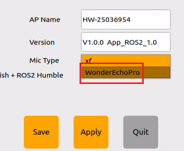

For the 6-Microphone Array, select **xf** as the microphone type as shown in the figure.


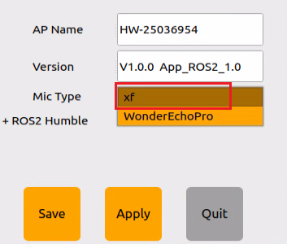

4) Change the ASR mode to **offline**.

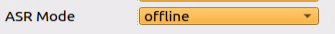

5) Then, click **Save**.


6) A **Save Success** message will confirm that the configuration has been stored in the system environment.

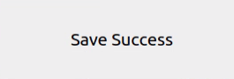

7) Then, click **Quit** to close the interface.


### 10.5.2 Offline Large AI Model Basic Course

#### 10.5.2.1 Speech-to-Text Test

* **Working Principle**

This section demonstrates offline real-time speech recognition using **sherpa-onnx**. Audio is captured from the voice module via **sounddevice** in 100 ms chunks. Recognition is performed locally using a pre-trained **transducer** model with encoder, decoder, and joiner components. Endpoint detection is used to determine when speech ends based on trailing silence duration and utterance length. Once an endpoint is detected, the final recognition result is output and the recognition stream is reset. The process is handled in a streaming manner, updating intermediate results every 100 ms and displaying them in real time on the terminal.

* **Preparation**

Reference Tutorial: [10.5.1 Preparation](#anther10.5.1).

* **Operation Steps**

1\) Open the command line terminal  from the left sidebar. Disable the app auto-start service and navigate to the `~/third_party/sherpa-onnx` directory.

```bash
sudo systemctl stop start_app_node.service
cd ~/third_party/sherpa-onnx
```

2\) Run the command to start the speech-to-text test.

```bash
python3 python-api-examples/speech-recognition-from-microphone-with-endpoint-detection.py \
 --encoder ./sherpa-onnx-streaming-zipformer-zh-xlarge-int8-2025-06-30/encoder.int8.onnx \
 --decoder ./sherpa-onnx-streaming-zipformer-zh-xlarge-int8-2025-06-30/decoder.onnx \
 --joiner ./sherpa-onnx-streaming-zipformer-zh-xlarge-int8-2025-06-30/joiner.int8.onnx \
 --tokens ./sherpa-onnx-streaming-zipformer-zh-xlarge-int8-2025-06-30/tokens.txt
```

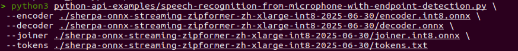

3\) When the prompt below appears, the voice module is ready to receive audio input.

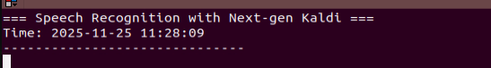

4\) If text starts appearing as shown, the voice module is working properly.

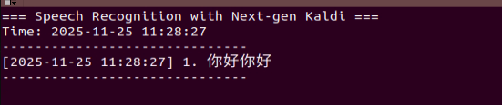

5\) If no text is displayed, adjust the audio settings:

Open the dropdown ① and select **Settings**.

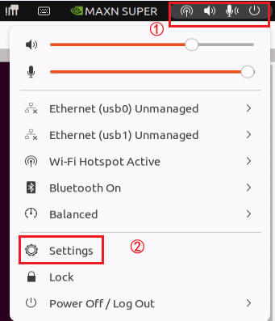

Go to **Sound**, set **Output Device** to **Speakers-USB Audio Device** and Input to **Analog Input-XFM-DP-V0.0.18**, and close the settings after making the changes.

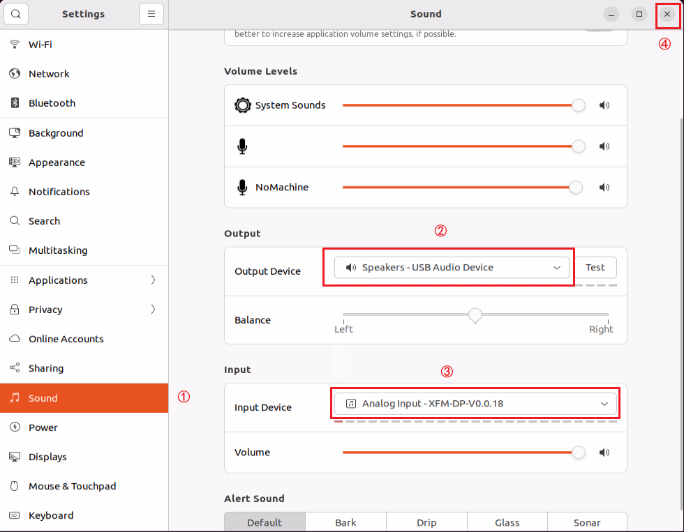

* **Program Analysis**

File Path: **/home/ubuntu/third_party/sherpa-onnx/python-api-examples/speech-recognition-from-microphone-with-endpoint-detection.py**.

1\) Import library files.

```python
import argparse
import sys
from pathlib import Path

try:
    import sounddevice as sd
except ImportError:
    print("Please install sounddevice first. You can use")
    print()
    print("  pip install sounddevice")
    print()
    print("to install it")
    sys.exit(-1)

import sherpa_onnx
```

2\) `def assert_file_exists(filename: str)`

Checks whether a model file exists using `Path`. If the file is missing, a download link is provided.

```python
def assert_file_exists(filename: str):
    assert Path(filename).is_file(), (
        f"{filename} does not exist!\n"
        "Please refer to "
        "https://k2-fsa.github.io/sherpa/onnx/pretrained_models/index.html to download it"
    )
```

3\) `def get_args()`

Parameter categories:

Required parameters: `--tokens`, `--encoder`, `--decoder`, and `--joiner`, all specifying the paths to the model files.

Optional parameters:

`--decoding-method`: Decoding method, default is greedy_search.

`--provider`: Compute backend, options include cpu, cuda, and coreml.

`--hotwords-file`: Hotword file to improve recognition of specific terms.

`--hotwords-score`: Weight for hotwords.

`--blank-penalty`: Penalty for blank symbols.

`--hr-lexicon, --hr-rule-fsts`: Homophone replacement related.

```python
def get_args():
    parser = argparse.ArgumentParser(
        formatter_class=argparse.ArgumentDefaultsHelpFormatter
    )

    parser.add_argument(
        "--tokens",
        type=str,
        required=True,
        help="Path to tokens.txt",
    )

    parser.add_argument(
        "--encoder",
        type=str,
        required=True,
        help="Path to the encoder model",
    )

    parser.add_argument(
        "--decoder",
        type=str,
        required=True,
        help="Path to the decoder model",
    )

    parser.add_argument(
        "--joiner",
        type=str,
        required=True,
        help="Path to the joiner model",
    )

    parser.add_argument(
        "--decoding-method",
        type=str,
        default="greedy_search",
        help="Valid values are greedy_search and modified_beam_search",
    )

    parser.add_argument(
        "--provider",
        type=str,
        default="cpu",
        help="Valid values: cpu, cuda, coreml",
    )

    parser.add_argument(
        "--hotwords-file",
        type=str,
        default="",
        help="""
        The file containing hotwords, one words/phrases per line, and for each
        phrase the bpe/cjkchar are separated by a space. For example:

        ▁HE LL O ▁WORLD
        """,
    )

    parser.add_argument(
        "--hotwords-score",
        type=float,
        default=1.5,
        help="""
        The hotword score of each token for biasing word/phrase. Used only if
        --hotwords-file is given.
        """,
    )

    parser.add_argument(
        "--blank-penalty",
        type=float,
        default=0.0,
        help="""
        The penalty applied on blank symbol during decoding.
        Note: It is a positive value that would be applied to logits like
        this `logits[:, 0] -= blank_penalty` (suppose logits.shape is
        [batch_size, vocab] and blank id is 0).
        """,
    )

    parser.add_argument(
        "--hr-lexicon",
        type=str,
        default="",
        help="If not empty, it is the lexicon.txt for homophone replacer",
    )

    parser.add_argument(
        "--hr-rule-fsts",
        type=str,
        default="",
        help="If not empty, it is the replace.fst for homophone replacer",
    )

    return parser.parse_args()
```

4\) `def create_recognizer(args)`

Function to create the recognizer.

Key settings:

Model type: Transducer (encoder, decoder, joiner).

Sample rate: 16 kHz, used internally by the model.

Feature dimension: 80 for Mel spectrogram features.

Endpoint detection: Enabled.

Rule 1: Trailing silence ≥ 2.4 s.

Rule 2: Trailing silence ≥ 1.2 s.

Rule 3: Utterance length ≥ 300, currently disabled.

```python
def create_recognizer(args):
    assert_file_exists(args.encoder)
    assert_file_exists(args.decoder)
    assert_file_exists(args.joiner)
    assert_file_exists(args.tokens)
    # Please replace the model files if needed.
    # See https://k2-fsa.github.io/sherpa/onnx/pretrained_models/index.html
    # for download links.
    recognizer = sherpa_onnx.OnlineRecognizer.from_transducer(
        tokens=args.tokens,
        encoder=args.encoder,
        decoder=args.decoder,
        joiner=args.joiner,
        num_threads=1,
        sample_rate=16000,
        feature_dim=80,
        enable_endpoint_detection=True,
        rule1_min_trailing_silence=2.4,
        rule2_min_trailing_silence=1.2,
        rule3_min_utterance_length=300,  # it essentially disables this rule
        decoding_method=args.decoding_method,
        provider=args.provider,
        hotwords_file=args.hotwords_file,
        hotwords_score=args.hotwords_score,
        blank_penalty=args.blank_penalty,
        hr_rule_fsts=args.hr_rule_fsts,
        hr_lexicon=args.hr_lexicon,
    )
    return recognizer
```

5\) `def main()`

Parses parameters and detects devices.

```python
    args = get_args()

    devices = sd.query_devices()
    if len(devices) == 0:
        print("No microphone devices found")
        sys.exit(0)

    print(devices)
```

Creates the recognizer and display objects, then starts the audio capture loop.

```python
    recognizer = create_recognizer(args)
    print("Started! Please speak")
```

Starts the audio capture loop at 48 kHz, reading 100 ms of audio each time, which equals 4800 samples.

```python
    sample_rate = 48000
    samples_per_read = int(0.1 * sample_rate)  # 0.1 second = 100 mspy
```

Feeds audio into the recognition stream for decoding.

```python
    stream = recognizer.create_stream()

    display = sherpa_onnx.Display()
```

The audio capture loop runs at 48 kHz, reading 100 ms of audio at a time, which is 4800 samples. The data is fed into the recognition stream for decoding, endpoints are checked to obtain results, and intermediate outputs are displayed in real time. When an endpoint is detected, the current sentence is finalized and the recognition stream is reset.

```python
	with sd.InputStream(channels=1, dtype="float32", samplerate=sample_rate) as s:
        while True:
            samples, _ = s.read(samples_per_read)  # a blocking read
            samples = samples.reshape(-1)
            stream.accept_waveform(sample_rate, samples)
            while recognizer.is_ready(stream):
                recognizer.decode_stream(stream)

            is_endpoint = recognizer.is_endpoint(stream)

            result = recognizer.get_result(stream)

            display.update_text(result)
            display.display()

            if is_endpoint:
                if result:
                    display.finalize_current_sentence()
                    display.display()

                recognizer.reset(stream)

```

#### 10.5.2.2 Text-to-Speech Test

* **Working Principle**

The system uses a client-server setup, where the client communicates with the local Ollama service through an API to convert text into speech offline.

* **Preparation**

Reference Tutorial: [10.5.1 Preparation](#anther10.5.1).

* **Operation Steps**

1\) Open the command line terminal  from the left sidebar, enter the command to disable the app auto-start service.

```bash
sudo systemctl stop start_app_node.service
```

2\) Enter the command to start the offline large AI model server.

```bash
ollama serve
```

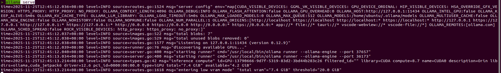

3\) Right-click and select **Split Vertically** to open a second terminal.

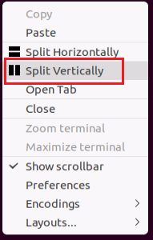

4\) Enter the command to run the text-to-speech program.

```bash
cd ~/large_models
python3 offline_tts_demo.py
```

5\) After running the program, the output appears as shown below, and the voice module plays **Hello, what can I help you**.

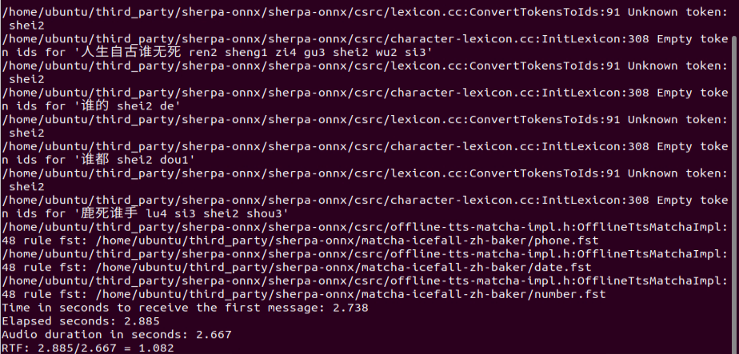

* Program Analysis

File Path: **/home/ubuntu/large_models/offline_tts_demo.py**.

1\) Import modules.

```python
import os
from config import *
from speech import speech
import sherpa_onnx
from pathlib import Path
```

2\) Initialize configuration.

Set the volume.

```python
speech.set_volume(80)
```

Set the language to English.

```python
language = 'Chinese'
```

Model path.

```python
sherpa_onnx_path = os.path.join(Path.home(), 'third_party/sherpa-onnx')
```


```python
if language == 'Chinese':
    offline_tts = 'matcha-icefall-zh-baker'
    model_path = f'{sherpa_onnx_path}/{offline_tts}'
    tts = speech.OfflineRealTimeTTS(
        provider="cuda",
        debug=1,
        matcha_acoustic_model=os.path.join(model_path, 'model-steps-3.onnx'),
        matcha_vocoder=os.path.join(sherpa_onnx_path, 'vocos-22khz-univ.onnx'),
        matcha_lexicon=os.path.join(model_path, 'lexicon.txt'),
        matcha_tokens=os.path.join(model_path, 'tokens.txt'),
        tts_rule_fsts=f'{model_path}/phone.fst,{model_path}/date.fst,{model_path}/number.fst',
        sherpa = sherpa_onnx
    )
```

4\) English Model

Configure parameters using VITS.

```python
else:
    offline_tts = 'vits-ljs'
    model_path = f'{sherpa_onnx_path}/{offline_tts}'
    tts = speech.OfflineRealTimeTTS(
        provider="cuda",
        debug=1,
        vits_model=os.path.join(model_path, f'{offline_tts}.onnx'),
        vits_lexicon=os.path.join(model_path, 'lexicon.txt'),
        vits_tokens=os.path.join(model_path, 'tokens.txt'),
        sherpa = sherpa_onnx
    )
```

5\) Example

```python
tts.tts('Hello, what can I help you', block=True)
```

#### 10.5.2.3 Large AI Model Invocation

* **Working Principle**

Uses a client-server architecture. The client communicates with the local Ollama service via API. By defining roles and tasks, the model interprets the context and generates structured outputs in the required format, leveraging its ability to follow instructions and produce structured responses.

* **Preparation**

Reference Tutorial: [10.5.1 Preparation](#anther10.5.1).

* Operation Steps

1\) Open the command line terminal  from the left sidebar, enter the command to disable the app auto-start service.

```bash
sudo systemctl stop start_app_node.service
```

2\) Enter the command to start the offline large AI model server.

```bash
ollama serve
```


3\) Right-click and select **Split Vertically** to open a second terminal.


4\) Enter the command to launch the demo script for large-model calls.

```bash
cd ~/large_models
python3 offline_llm_demo.py
```

5\) Once the script is running, the terminal shows the output as illustrated.

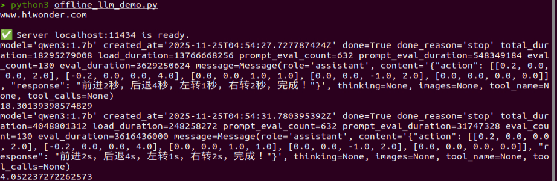

* Program Analysis

File Path: **/home/ubuntu/large_models/offline_llm_demo.py**.

1\) The prompt template.

```python
PROMPT = '''
##Role Task
You are an intelligent robot car that can control the linear velocity in the x and y directions (in m/s), the angular velocity in the z direction (in rad/s), and time (t) in seconds. Based on the input, generate the corresponding commands.

##Requirements
1. Ensure the speed range is correct:
    Linear velocity: x, y ∈ [-1.0, 1.0] (negative values represent reverse direction)
    Angular velocity: z ∈ [-1.0, 1.0] (counterclockwise is positive, clockwise is negative)
2. Execute multiple actions sequentially and output an action list containing multiple movement commands. Add [0.0, 0.0, 0.0, 0.0] only after the last action to ensure the robot stops.
3. x and y default to 0.2, z defaults to 1, t defaults to 2.
4. For each action sequence, craft a concise (5 to 10 words), witty, and endlessly varied feedback message to make the interaction fun.
5. Output the json result directly without analysis or additional content.
6. Format:
{  
  "action": [[x1, y1, z1, t1], [x2, y2, z2, t2], ..., [0.0, 0.0, 0.0, 0.0]],  
  "response": "xx"  
}  
7. Strong mathematical computation ability.
8. Note that drifting involves movement, rotation, and combination, requiring precise calculation, for example [0.0, -0.2, 1.0, 2.0].

##Notes
- The "action" key contains an array of function name strings ordered by execution sequence. If the corresponding action function is not found, the action will output [].
- The "response" key contains a carefully crafted short reply that perfectly fits the above word count and style requirements.

##Example Task
Input: Move forward for 2 seconds, then rotate clockwise for 1 second.
Output: {"action": [[0.2, 0.0, 0.0, 2.0], [0.0, 0.0, -1.0, 1.0], [0, 0, 0.0, 0.0]], "response": "Move forward for 2 seconds, then rotate clockwise for 1 second, go!"}
Input: Move forward 1 meter.
Output: {"action": [[0.2, 0.0, 0.0, 5.0], [0.0, 0.0, 0.0, 0.0]], "response": "OK."}
'''

```

2\) The message format used in Chat API mode.

```python
params = {"model": 'qwen3:1.7b', 
          "messages": [
            {
                "role": "system",
                "content": PROMPT
            },
            {
                "role": "user",
                "content": user_input
            },
          ],
```

3\) Sending a request to the local **ollama server**.

```python
client.llm_origin(params)
```

#### 10.5.2.4 Semantic Understanding

* **Working Principle**

The system uses a client–server setup to interact with the local **ollama service**. The model processes a prepared text passage and generates a concise semantic summary.

* **Preparation**

Reference Tutorial: [10.5.1 Preparation](#anther10.5.1).

* **Operation Steps**

1\) Open the command line terminal  from the left sidebar, enter the command to disable the app auto-start service.

```bash
sudo systemctl stop start_app_node.service
```

2\) Enter the command to start the offline large AI model server.

```bash
ollama serve
```


3\) Right-click and select **Split Vertically** to open a second terminal.


4\) Enter the command to run the program.

```bash
cd ~/large_models
python3 offline_llm_nlu_demo.py
```

5\) Once the script is running, the terminal shows the output as illustrated.

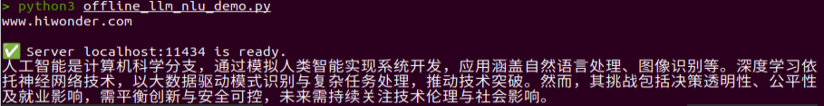

#### 10.5.2.5 Emotion Perception

* **Working Principle**

The system uses a client–server setup to communicate with the local **ollama service**. The model receives short emotion-related descriptions and generates its interpretation, allowing an evaluation of its ability to recognize emotional cues.

* **Preparation**

Reference Tutorial: [10.5.1 Preparation](#anther10.5.1).

* Operation Steps

1\) Open the command line terminal  from the left sidebar, enter the command to disable the app auto-start service.

```bash
sudo systemctl stop start_app_node.service
```

2\) Enter the command to start the offline large AI model server.

```bash
ollama serve
```


3\) Right-click and select **Split Vertically** to open a second terminal.


4\) Enter the command to run the program.

```bash
cd ~/large_models
python3 offline_llm_er_demo.py
```

5\) Once the script is running, the terminal shows the output as illustrated.

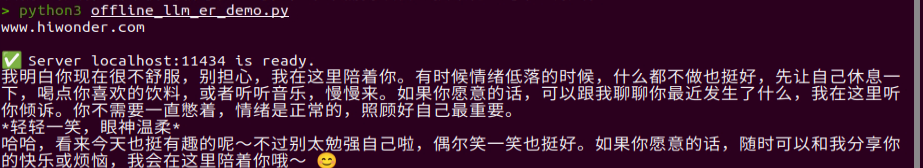

* **Program Analysis**

File Path: **/home/ubuntu/large_models/offline_llm_er_demo.py**.

1\) Initialize the **API client**.

```python
client = speech.OllamaAPI(ollama_host)
```

2\) Send the emotion-related prompt to the **ollama server**.

```python
messages = [{"role": "user", "content": 'Annoying'}]
assistant_output = client.llm_multi_turn(messages, model='qwen3:1.7b')
```

3\) Store the dialogue history from the previous turn.

```python
messages.append({"role": "assistant", "content": assistant_output})
```

4\) Proceed to the next turn.

Call `llm_multi_turn` again with the full conversation history included.

```python
messages.append({"role": "user", "content": 'Laughing'})
assistant_output = client.llm_multi_turn(messages, model='qwen3:1.7b')
```

#### 10.5.2.6 Recording Test

* **Working Principle**

The system uses a client–server setup to communicate with the local **ollama service**. The model receives short emotion-related descriptions and generates its interpretation, allowing an evaluation of its ability to recognize emotional cues.

* **Preparation**

Reference Tutorial: [10.5.1 Preparation](#anther10.5.1).

* **Operation Steps**

1\) Open the command line terminal  from the left sidebar, enter the command to disable the app auto-start service.

```bash
sudo systemctl stop start_app_node.service
```

2\) Enter the command to start the **streaming ASR server**.

```bash
python3 third_party/sherpa-onnx/python-api-examples/streaming_server.py \
 --tokens=third_party/sherpa-onnx/sherpa-onnx-streaming-zipformer-zh-xlarge-int8-2025-06-30/tokens.txt \
 --encoder=third_party/sherpa-onnx/sherpa-onnx-streaming-zipformer-zh-xlarge-int8-2025-06-30/encoder.int8.onnx \
 --decoder=third_party/sherpa-onnx/sherpa-onnx-streaming-zipformer-zh-xlarge-int8-2025-06-30/decoder.onnx \
 --joiner=third_party/sherpa-onnx/sherpa-onnx-streaming-zipformer-zh-xlarge-int8-2025-06-30/joiner.int8.onnx \
 --doc-root=third_party/sherpa-onnx/python-api-examples/web
```

3\) Right-click and select **Split Vertically** to open a second terminal.


4\) Enter the command to launch the audio-recording program.

```bash
cd ~/large_models
python3 offline_asr_demo.py
```

5\) Once **Recording······** appears, the module has started capturing audio and speech input can be provided. The recognized text will be printed in the terminal, as shown in the figure.

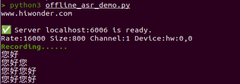

6\) The recorded audio can be played from the path `~/large_models/resources/audio`.

```bash
cd ~/large_models/resources/audio
aplay test_recording.wav
```

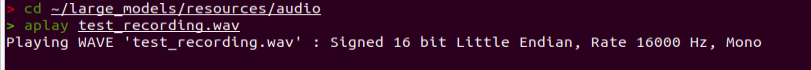

* **Program Analysis**

**Streaming ASR server** script path: **/home/ubuntu/third_party/sherpa-onnx/python-api-examples/streaming_server.py**.

Audio recording script path: **/home/ubuntu/large_models/offline_asr_demo.py**.

Audio file path: **/home/ubuntu/large_models/resources/audio/test_recording.wav**.

**Streaming ASR Server** `streaming_server.py` Program Analysis:

Client → WebSocket → Receive audio → Recognition stream → Queue → Batch processing → Recognizer decoding → Return results → Client.

1\) Import modules.

```python
import argparse
import asyncio
import http
import json
import logging
import socket
import ssl
from concurrent.futures import ThreadPoolExecutor
from datetime import datetime
from pathlib import Path
from typing import List, Optional, Tuple

import numpy as np
import sherpa_onnx
import websockets

from http_server import HttpServer
```

2\) Configure the logging system.

Logs include timestamps and filenames, output to both file and console.

```python
def setup_logger(
    log_filename: str,
    log_level: str = "info",
    use_console: bool = True,
) -> None:
    """Setup log level.

    Args:
      log_filename:
        The filename to save the log.
      log_level:
        The log level to use, e.g., "debug", "info", "warning", "error",
        "critical"
      use_console:
        True to also print logs to console.
    """
    now = datetime.now()
    date_time = now.strftime("%Y-%m-%d-%H-%M-%S")
    formatter = "%(asctime)s %(levelname)s [%(filename)s:%(lineno)d] %(message)s"
    log_filename = f"{log_filename}-{date_time}.txt"

    Path(log_filename).parent.mkdir(parents=True, exist_ok=True)

    level = logging.ERROR
    if log_level == "debug":
        level = logging.DEBUG
    elif log_level == "info":
        level = logging.INFO
    elif log_level == "warning":
        level = logging.WARNING
    elif log_level == "critical":
        level = logging.CRITICAL

    logging.basicConfig(
        filename=log_filename,
        format=formatter,
        level=level,
        filemode="w",
    )
    if use_console:
        console = logging.StreamHandler()
        console.setLevel(level)
        console.setFormatter(logging.Formatter(formatter))
        logging.getLogger("").addHandler(console)
```

3\) Model parameters.

```python
def add_model_args(parser: argparse.ArgumentParser):
    parser.add_argument(
        "--encoder",
        type=str,
        help="Path to the transducer encoder model",
    )

    parser.add_argument(
        "--decoder",
        type=str,
        help="Path to the transducer decoder model.",
    )

    parser.add_argument(
        "--joiner",
        type=str,
        help="Path to the transducer joiner model.",
    )

    parser.add_argument(
        "--zipformer2-ctc",
        type=str,
        help="Path to the model file from zipformer2 ctc",
    )

    parser.add_argument(
        "--wenet-ctc",
        type=str,
        help="Path to the model.onnx from WeNet",
    )

    parser.add_argument(
        "--paraformer-encoder",
        type=str,
        help="Path to the paraformer encoder model",
    )

    parser.add_argument(
        "--paraformer-decoder",
        type=str,
        help="Path to the paraformer decoder model.",
    )

    parser.add_argument(
        "--tokens",
        type=str,
        required=True,
        help="Path to tokens.txt",
    )

    parser.add_argument(
        "--sample-rate",
        type=int,
        default=16000,
        help="Sample rate of the data used to train the model. "
        "Caution: If your input sound files have a different sampling rate, "
        "we will do resampling inside",
    )

    parser.add_argument(
        "--feat-dim",
        type=int,
        default=80,
        help="Feature dimension of the model",
    )

    parser.add_argument(
        "--provider",
        type=str,
        default="cpu",
        help="Valid values: cpu, cuda, coreml",
    )
```

4\) Decoding parameters.

```python
def add_decoding_args(parser: argparse.ArgumentParser):
    parser.add_argument(
        "--decoding-method",
        type=str,
        default="greedy_search",
        help="""Decoding method to use. Current supported methods are:
        - greedy_search
        - modified_beam_search
        """,
    )

    add_modified_beam_search_args(parser)
```

5\) Endpoint detection parameters.

```python
def add_endpointing_args(parser: argparse.ArgumentParser):
    parser.add_argument(
        "--use-endpoint",
        type=int,
        default=1,
        help="1 to enable endpoiting. 0 to disable it",
    )

    parser.add_argument(
        "--rule1-min-trailing-silence",
        type=float,
        default=2.4,
        help="""This endpointing rule1 requires duration of trailing silence
        in seconds) to be >= this value""",
    )

    parser.add_argument(
        "--rule2-min-trailing-silence",
        type=float,
        default=1.2,
        help="""This endpointing rule2 requires duration of trailing silence in
        seconds) to be >= this value.""",
    )

    parser.add_argument(
        "--rule3-min-utterance-length",
        type=float,
        default=20,
        help="""This endpointing rule3 requires utterance-length (in seconds)
        to be >= this value.""",
    )
```

6\) Server parameters.

```python
    parser.add_argument(
        "--port",
        type=int,
        default=6006,
        help="The server will listen on this port",
    )

    parser.add_argument(
        "--nn-pool-size",
        type=int,
        default=1,
        help="Number of threads for NN computation and decoding.",
    )

    parser.add_argument(
        "--max-batch-size",
        type=int,
        default=3,
        help="""Max batch size for computation. Note if there are not enough
        requests in the queue, it will wait for max_wait_ms time. After that,
        even if there are not enough requests, it still sends the
        available requests in the queue for computation.
        """,
    )

    parser.add_argument(
        "--max-wait-ms",
        type=float,
        default=10,
        help="""Max time in millisecond to wait to build batches for inference.
        If there are not enough requests in the stream queue to build a batch
        of max_batch_size, it waits up to this time before fetching available
        requests for computation.
        """,
    )

    parser.add_argument(
        "--max-message-size",
        type=int,
        default=(1 << 20),
        help="""Max message size in bytes.
        The max size per message cannot exceed this limit.
        """,
    )

    parser.add_argument(
        "--max-queue-size",
        type=int,
        default=32,
        help="Max number of messages in the queue for each connection.",
    )

    parser.add_argument(
        "--max-active-connections",
        type=int,
        default=200,
        help="""Maximum number of active connections. The server will refuse
        to accept new connections once the current number of active connections
        equals to this limit.
        """,
    )

    parser.add_argument(
        "--num-threads",
        type=int,
        default=2,
        help="Number of threads to run the neural network model",
    )

    parser.add_argument(
        "--certificate",
        type=str,
        help="""Path to the X.509 certificate. You need it only if you want to
        use a secure websocket connection, i.e., use wss:// instead of ws://.
        You can use ./web/generate-certificate.py
        to generate the certificate `cert.pem`.
        Note ./web/generate-certificate.py will generate three files but you
        only need to pass the generated cert.pem to this option.
        """,
    )

    parser.add_argument(
        "--doc-root",
        type=str,
        default="./python-api-examples/web",
        help="Path to the web root",
    )
```

7\) Create the recognizer.

Instantiate the recognizer according to the specified parameters.

```python
def create_recognizer(args) -> sherpa_onnx.OnlineRecognizer:
    if args.encoder:
        recognizer = sherpa_onnx.OnlineRecognizer.from_transducer(
            tokens=args.tokens,
            encoder=args.encoder,
            decoder=args.decoder,
            joiner=args.joiner,
            num_threads=args.num_threads,
            sample_rate=args.sample_rate,
            feature_dim=args.feat_dim,
            decoding_method=args.decoding_method,
            max_active_paths=args.num_active_paths,
            hotwords_score=args.hotwords_score,
            hotwords_file=args.hotwords_file,
            blank_penalty=args.blank_penalty,
            enable_endpoint_detection=args.use_endpoint != 0,
            rule1_min_trailing_silence=args.rule1_min_trailing_silence,
            rule2_min_trailing_silence=args.rule2_min_trailing_silence,
            rule3_min_utterance_length=args.rule3_min_utterance_length,
            provider=args.provider,
            modeling_unit=args.modeling_unit,
            bpe_vocab=args.bpe_vocab
        )
    elif args.paraformer_encoder:
        recognizer = sherpa_onnx.OnlineRecognizer.from_paraformer(
            tokens=args.tokens,
            encoder=args.paraformer_encoder,
            decoder=args.paraformer_decoder,
            num_threads=args.num_threads,
            sample_rate=args.sample_rate,
            feature_dim=args.feat_dim,
            decoding_method=args.decoding_method,
            enable_endpoint_detection=args.use_endpoint != 0,
            rule1_min_trailing_silence=args.rule1_min_trailing_silence,
            rule2_min_trailing_silence=args.rule2_min_trailing_silence,
            rule3_min_utterance_length=args.rule3_min_utterance_length,
            provider=args.provider,
        )
    elif args.zipformer2_ctc:
        recognizer = sherpa_onnx.OnlineRecognizer.from_zipformer2_ctc(
            tokens=args.tokens,
            model=args.zipformer2_ctc,
            num_threads=args.num_threads,
            sample_rate=args.sample_rate,
            feature_dim=args.feat_dim,
            decoding_method=args.decoding_method,
            enable_endpoint_detection=args.use_endpoint != 0,
            rule1_min_trailing_silence=args.rule1_min_trailing_silence,
            rule2_min_trailing_silence=args.rule2_min_trailing_silence,
            rule3_min_utterance_length=args.rule3_min_utterance_length,
            provider=args.provider,
        )
    elif args.wenet_ctc:
        recognizer = sherpa_onnx.OnlineRecognizer.from_wenet_ctc(
            tokens=args.tokens,
            model=args.wenet_ctc,
            num_threads=args.num_threads,
            sample_rate=args.sample_rate,
            feature_dim=args.feat_dim,
            decoding_method=args.decoding_method,
            enable_endpoint_detection=args.use_endpoint != 0,
            rule1_min_trailing_silence=args.rule1_min_trailing_silence,
            rule2_min_trailing_silence=args.rule2_min_trailing_silence,
            rule3_min_utterance_length=args.rule3_min_utterance_length,
            provider=args.provider,
        )
    else:
        raise ValueError("Please provide a model")

    return recognizer
```

8\) Core class `class StreamingServer(object)`

Initialization includes `self.recognizer` as the recognizer instance, `self.nn_pool` as the thread pool for neural network computation, `self.max_queue_size` as the asynchronous queue for streaming, and `self.http_server` as the HTTP server.

```python
    def __init__(
        self,
        recognizer: sherpa_onnx.OnlineRecognizer,
        nn_pool_size: int,
        max_wait_ms: float,
        max_batch_size: int,
        max_message_size: int,
        max_queue_size: int,
        max_active_connections: int,
        doc_root: str,
        certificate: Optional[str] = None,
    ):
        """
        Args:
          recognizer:
            An instance of online recognizer.
          nn_pool_size:
            Number of threads for the thread pool that is responsible for
            neural network computation and decoding.
          max_wait_ms:
            Max wait time in milliseconds in order to build a batch of
            `batch_size`.
          max_batch_size:
            Max batch size for inference.
          max_message_size:
            Max size in bytes per message.
          max_queue_size:
            Max number of messages in the queue for each connection.
          max_active_connections:
            Max number of active connections. Once number of active client
            equals to this limit, the server refuses to accept new connections.
          beam_search_params:
            Dictionary containing all the parameters for beam search.
          online_endpoint_config:
            Config for endpointing.
          doc_root:
            Path to the directory where files like index.html for the HTTP
            server locate.
          certificate:
            Optional. If not None, it will use secure websocket.
            You can use ./web/generate-certificate.py to generate
            it (the default generated filename is `cert.pem`).
        """
        self.recognizer = recognizer

        self.certificate = certificate
        self.http_server = HttpServer(doc_root)

        self.nn_pool_size = nn_pool_size
        self.nn_pool = ThreadPoolExecutor(
            max_workers=nn_pool_size,
            thread_name_prefix="nn",
        )

        self.stream_queue = asyncio.Queue()

        self.max_wait_ms = max_wait_ms
        self.max_batch_size = max_batch_size
        self.max_message_size = max_message_size
        self.max_queue_size = max_queue_size
        self.max_active_connections = max_active_connections

        self.current_active_connections = 0

        self.sample_rate = int(recognizer.config.feat_config.sampling_rate)
```

9\) Streaming tasks.

Extract streams from the queue, process them in batches, and decode using the recognizer.

```python
    async def stream_consumer_task(self):
        """This function extracts streams from the queue, batches them up, sends
        them to the neural network model for computation and decoding.
        """
        while True:
            if self.stream_queue.empty():
                await asyncio.sleep(self.max_wait_ms / 1000)
                continue

            batch = []
            try:
                while len(batch) < self.max_batch_size:
                    item = self.stream_queue.get_nowait()

                    assert self.recognizer.is_ready(item[0])

                    batch.append(item)
            except asyncio.QueueEmpty:
                pass
            stream_list = [b[0] for b in batch]
            future_list = [b[1] for b in batch]

            loop = asyncio.get_running_loop()
            await loop.run_in_executor(
                self.nn_pool,
                self.recognizer.decode_streams,
                stream_list,
            )

            for f in future_list:
                self.stream_queue.task_done()
                f.set_result(None)
```

10\) Connection handling.

Receive audio data, feed it into the recognition stream, perform batch decoding, return results, handle endpoint detection and segmentation, and process padding at the end of the connection.

```python
    async def handle_connection(
        self,
        socket: websockets.WebSocketServerProtocol,
    ):
        """Receive audio samples from the client, process it, and send
        decoding result back to the client.

        Args:
          socket:
            The socket for communicating with the client.
        """
        try:
            await self.handle_connection_impl(socket)
        except websockets.exceptions.ConnectionClosedError:
            logging.info(f"{socket.remote_address} disconnected")
        finally:
            # Decrement so that it can accept new connections
            self.current_active_connections -= 1

            logging.info(
                f"Disconnected: {socket.remote_address}. "
                f"Number of connections: {self.current_active_connections}/{self.max_active_connections}"  # noqa
            )

    async def handle_connection_impl(
        self,
        socket: websockets.WebSocketServerProtocol,
    ):
        """Receive audio samples from the client, process it, and send
        decoding result back to the client.

        Args:
          socket:
            The socket for communicating with the client.
        """
        logging.info(
            f"Connected: {socket.remote_address}. "
            f"Number of connections: {self.current_active_connections}/{self.max_active_connections}"  # noqa
        )

        stream = self.recognizer.create_stream()
        segment = 0
        while True:
            samples = await self.recv_audio_samples(socket)
            if samples is None:
                break
            # TODO(fangjun): At present, we assume the sampling rate
            # of the received audio samples equal to --sample-rate
            stream.accept_waveform(sample_rate=self.sample_rate, waveform=samples)

            while self.recognizer.is_ready(stream):
                await self.compute_and_decode(stream)
                result = self.recognizer.get_result(stream)
                message = {
                    "text": result,
                    "segment": segment,
                }
                if self.recognizer.is_endpoint(stream):
                    self.recognizer.reset(stream)
                    segment += 1
                await socket.send(json.dumps(message))

        tail_padding = np.zeros(int(self.sample_rate * 0.3)).astype(np.float32)
        stream.accept_waveform(sample_rate=self.sample_rate, waveform=tail_padding)
        stream.input_finished()
        while self.recognizer.is_ready(stream):
            await self.compute_and_decode(stream)

        result = self.recognizer.get_result(stream)

        message = {
            "text": result,
            "segment": segment,
        }
        await socket.send(json.dumps(message))
```

11\) Server connection.

Launch the WebSocket server.

```python
    async def run(self, port: int):
        tasks = []
        for i in range(self.nn_pool_size):
            tasks.append(asyncio.create_task(self.stream_consumer_task()))

        if self.certificate:
            logging.info(f"Using certificate: {self.certificate}")
            ssl_context = ssl.SSLContext(ssl.PROTOCOL_TLS_SERVER)
            ssl_context.load_cert_chain(self.certificate)
        else:
            ssl_context = None
            logging.info("No certificate provided")

        async with websockets.serve(
            self.handle_connection,
            host="",
            port=port,
            max_size=self.max_message_size,
            max_queue=self.max_queue_size,
            process_request=self.process_request,
            ssl=ssl_context,
        ):
            ip_list = ["localhost"]
            if ssl_context:
                ip_list += ["0.0.0.0", "127.0.0.1"]
                ip_list.append(socket.gethostbyname(socket.gethostname()))
            proto = "http://" if ssl_context is None else "https://"
            s = "Please visit one of the following addresses:\n\n"
            for p in ip_list:
                s += "  " + proto + p + f":{port}" "\n"

            if not ssl_context:
                s += "\nSince you are not providing a certificate, you cannot "
                s += "use your microphone from within the browser using "
                s += "public IP addresses. Only localhost can be used."
                s += "You also cannot use 0.0.0.0 or 127.0.0.1"

            logging.info(s)

            await asyncio.Future()  # run forever

        await asyncio.gather(*tasks)  # not reachable
```

12\) `def main()`

Parse parameters.

```python
    args = get_args()
    logging.info(vars(args))
```

Validate parameters.

```python
    check_args(args)
```

Create the recognizer.

```python
    recognizer = create_recognizer(args)
```

Create the server.

```
    port = args.port
    nn_pool_size = args.nn_pool_size
    max_batch_size = args.max_batch_size
    max_wait_ms = args.max_wait_ms
    max_message_size = args.max_message_size
    max_queue_size = args.max_queue_size
    max_active_connections = args.max_active_connections
    certificate = args.certificate
    doc_root = args.doc_root

    if certificate and not Path(certificate).is_file():
        raise ValueError(f"{certificate} does not exist")

    if not Path(doc_root).is_dir():
        raise ValueError(f"Directory {doc_root} does not exist")

    server = StreamingServer(
        recognizer=recognizer,
        nn_pool_size=nn_pool_size,
        max_batch_size=max_batch_size,
        max_wait_ms=max_wait_ms,
        max_message_size=max_message_size,
        max_queue_size=max_queue_size,
        max_active_connections=max_active_connections,
        certificate=certificate,
        doc_root=doc_root,
    )
```

Run the server.

```python
	asyncio.run(server.run(port))
```

Create the offline real-time ASR client instance:

1\) Instantiate the client.

```python
asr = speech.OfflineRealTimeASR()
```

2\) Perform speech recognition.

Call ` asr.asr()` to recognize the recorded audio file at **./resources/audio/test_recording.wav**. The resulting text is printed to the terminal.

```python
print(asr.asr('./resources/audio/test_recording.wav'))
```


### 10.5.3 Offline Large AI Model for Voice Control

#### 10.5.3.1 Overview

When the program starts, the voice device announces **I’m ready**. Say the wake word **Hello Hiwonder** to activate the voice device, which responds with **I’m here**. After activation, the robot can be controlled via voice commands to perform corresponding actions, such as **Move forward for one second, then turn left for one second, and finally move backward for one second**. The device will then announce the AI-generated response and execute the requested actions.

#### 10.5.3.2 Preparation

* **Version Confirmation**

Reference Tutorial: [10.5.1 Preparation](#anther10.5.1).

#### 10.5.3.3 Operation Steps

> [!NOTE]
>
> **Command input is case-sensitive and space-sensitive.**

1. Open the command line terminal from the left side of the system interface.  In the terminal window, enter the following command and press **Enter** to stop the auto-start service.

2. Enter the command to disable the auto-start service of the app.

```bash
sudo systemctl stop start_app_node.service
```

3. Enter the following command and press **Enter** to launch the voice control feature.

```bash
ros2 launch large_models_examples llm_control_move.launch.py
```

4. When the terminal displays the output shown below and announces **I’m ready**, the voice device has completed initialization. At this point, say the wake word **Hello Hiwonder**.


5. When the terminal displays the corresponding output shown in the figure and the device responds with **I’m here**, it indicates successful activation. The system will begin recording voice commands.

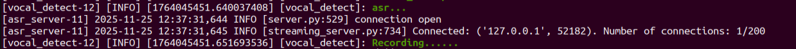

6. When the terminal displays the next output as the reference image, it shows the recognized speech transcribed by the voice device.

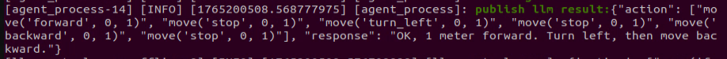

7. Upon successful recognition by the speech recognition service of a cloud-based large speech model, the parsed command will be displayed under the **publish_asr_result** output in the terminal.


> [!NOTE]
>
> **The response is automatically generated by the large model. Only the semantic accuracy of the reply is guaranteed, while the wording and formatting may vary.**


8. When the terminal shows the output shown in the figure indicating the end of one interaction cycle, the system is ready for the next round. To initiate another interaction, repeat step 4 by speaking the wake words again.

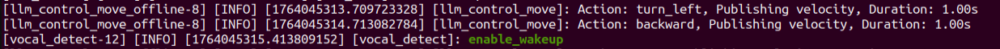

9. To exit the feature, press **Ctrl+C** in the terminal. If the feature does not shut down immediately, press **Ctrl+C** multiple times. If it still fails to exit, open a new terminal window and run the following command to clear the ROS node.

```bash
~/.stop_ros.sh
```

#### 10.5.3.4 Project Outcome

Once the feature is started, voice commands can be issued to the robot, for example: **Move forward for one second, then turn left for one second, and finally move backward for one second**. The robot will then move forward for one second, turn left for one second, and finally move backward for one second.

#### 10.5.3.5 Program Analysis

* **Launch File Analysis**

File Path:

**/home/ubuntu/ros2_ws/src/large_models_examples/large_models_examples/llm_control_move.launch.py**

1\) Import library files.

```python
import os
from ament_index_python.packages import get_package_share_directory

from launch_ros.actions import Node
from launch.substitutions import LaunchConfiguration
from launch import LaunchDescription, LaunchService
from launch.launch_description_sources import PythonLaunchDescriptionSource
from launch.actions import IncludeLaunchDescription, DeclareLaunchArgument, OpaqueFunction
```

`os`: Used for handling file paths and operating system-related functions.

`ament_index_python.packages.get_package_share_directory`: Retrieves the share directory path of ROS 2 package.

`launch_ros.actions.Node`: Used to define ROS 2 nodes.

`launch.substitutions.LaunchConfiguration`: Retrieves parameter values defined in the Launch file.

`LaunchDescription,LaunchService`: Used to define and start the Launch file.

`launch.launch_description_sources.PythonLaunchDescriptionSource`: Enables the inclusion of other Launch files.

`launch.actions.IncludeLaunchDescription、DeclareLaunchArgument、OpaqueFunction`: Used to define actions and arguments within the Launch file.

2\) Define `launch_setup` Function

Declare launch parameters:

`mode`: Mode parameter, default value `1`.

`camera_topic`: Camera topic, default `depth_cam/rgb0/image_raw`.

`asr_mode` is read from the environment variable ` ASR_MODE`, defaulting to `online` and converted to lowercase.

`interruption`: Interruption toggle, default ` False`.

```python
    mode = LaunchConfiguration('mode', default=1)
    mode_arg = DeclareLaunchArgument('mode', default_value=mode)
    camera_topic = LaunchConfiguration('camera_topic', default='depth_cam/rgb0/image_raw')
    camera_topic_arg = DeclareLaunchArgument('camera_topic', default_value=camera_topic)

    asr_mode = os.environ.get("ASR_MODE", "online").lower()


    interruption = LaunchConfiguration('interruption', default=False)
    interruption_arg = DeclareLaunchArgument('interruption', default_value=interruption)
```

Obtain package paths:

Retrieve paths for `controller` and `large_models` packages.

```python
    controller_package_path = get_package_share_directory('controller')
    large_models_package_path = get_package_share_directory('large_models')
```

Include launch.py files using `IncludeLaunchDescription`.

`controller_launch`: Chassis controller launch file.

`vocal_detect_launch` is the launch file for voice detection, with the `mode` parameter passed in.

`agent_process_launch` is the launch file for agent processing, with the `camera_topic` parameter passed in.

`tts_node_launch` is the launch file for the TTS node.

```python
    controller_launch = IncludeLaunchDescription(
        PythonLaunchDescriptionSource(
            os.path.join(controller_package_path, 'launch/controller.launch.py')),
    )

    vocal_detect_launch = IncludeLaunchDescription(
        PythonLaunchDescriptionSource(
            os.path.join(get_package_share_directory('large_models'), 'launch/vocal_detect.launch.py')),
        launch_arguments={'mode': mode,}.items(),
    )

    agent_process_launch = IncludeLaunchDescription(
        PythonLaunchDescriptionSource(
            os.path.join(get_package_share_directory('large_models'), 'launch/agent_process.launch.py')),
        launch_arguments={'camera_topic': camera_topic}.items(),
    )

    tts_node_launch = IncludeLaunchDescription(
        PythonLaunchDescriptionSource(
            os.path.join(get_package_share_directory('large_models'), 'launch/tts_node.launch.py')),
    )
```

Delayed launch configuration:

In `offline` mode, `vocal_detect_launch` and `agent_process_launch` are delayed by 10 seconds, while in `online` mode they are delayed by 1 second, and `tts_node_launch` starts immediately.

```python
    time_interval = 10.0 if asr_mode == 'offline' else 1.0
    large_models_launch = GroupAction(
     actions=[
        tts_node_launch,
        TimerAction(
                period=time_interval, actions=[
                vocal_detect_launch,
            ],
         ),
        TimerAction(period=time_interval, actions=[
            agent_process_launch,
            ],
         ),
      ]
    )
```

Conditional node selection:

`online` mode: start the `llm_control_move` node.  
`offline` mode: start the `llm_control_move_offline` node.

```python
    if asr_mode == 'online':
        llm_control_move_node = Node(
            package='large_models_examples',
            executable='llm_control_move',
            output='screen',
            parameters=[{
                'interruption': interruption,
            }],
        )
    else:
        llm_control_move_node = Node(
            package='large_models_examples',
            executable='llm_control_move_offline',
            output='screen',
            parameters=[{
                'interruption': interruption,
            }],
        )
```

3\) Define `generate_launch_description` Function

This function generates the Launch description and adds the `launch_setup` function to it using `OpaqueFunction`.

```python
def generate_launch_description():
    return LaunchDescription([
        OpaqueFunction(function = launch_setup)
    ])
```

4\) Main Program Entry

```python
if __name__ == '__main__':
    # Create a LaunchDescription object
    ld = generate_launch_description()

    ls = LaunchService()
    ls.include_launch_description(ld)
    ls.run()
```

`ld = generate_launch_description()` generates the Launch description object.

`ls = LaunchService()` creates a Launch service object.

`ls.include_launch_description(ld)` adds the Launch description to the Launch service.

`ls.run()` starts the Launch service and executes all defined Launch actions.

* **Python File Analysis**

File Path:

**ros2_ws/src/large_models_examples/large_models_examples/llm_control_move_offline.py**

1\) Prompt template.

```python
PROMPT = '''
##Role Task
You are an intelligent robot car responsible for parsing user movement instructions and extracting actions and parameters.

##Action Function Library
- "move(direction, distance, duration)"
- direction (Direction): 'forward', 'backward', 'turn_left', 'turn_right', 'shift_left', 'shift_right', 'stop'
- distance (Distance, in meters): A number. If the user does not specify distance, it is set to 0.
- duration (Time, in seconds): A number. If the user does not specify time, it is set to 0.

##Requirements
1. Parse the user’s intent and generate an action list containing one or more move function calls.
2. **Strictly follow**: If the user command includes **time** (e.g., "move forward for 3 seconds"), the **distance parameter must be 0**, and the duration will be the corresponding time.
3. **Strictly follow**: If the user command includes **distance** (e.g., "move forward 1 meter"), the **duration parameter must be 0**, and the distance will be the corresponding distance.
4. Directly output the JSON result without analysis.
5. Format: {"action": ["move('forward', 1, 0)"], "response": "Alright, moving forward 1 meter"}
6. After each action, a stop action must be included to stop the robot: "move('forward', 1, 0)"

##Example Task
Input: Move forward for 2 seconds, then turn left for 1 second.
Output: {"action": ["move('forward', 0, 2)", "move('turn_left', 0, 1)", "move('stop', 0, 1)"], "response": "Got it, executing!"}
Input: Move forward 1 meter.
Output: {"action": ["move('forward', 1, 0)", "move('stop', 0, 1)"], "response": "Alright, let's go!"}
'''

```

2\) Variable Initialization

Initializes member variables.

`self.action`: list of actions.

`self.llm_result`: result returned by the LLM.

`self.running`: running flag.

`self.interrupt`: interrupt flag.

`self.action_finish`: action completed flag.

`self.play_audio_finish`: audio playback completed flag.

`interruption`: whether interruption is enabled.

`self.interruption`: value of the `interruption` parameter.

`self.asr_mode`: current system voice mode.

```python
    def __init__(self, name):
        rclpy.init()
        super().__init__(name)
        
        self.action = []
        self.llm_result = ''
        self.running = True
        self.interrupt = False
        self.action_finish = False
        self.play_audio_finish = False
        
        self.declare_parameter('interruption', False)  
        self.interruption = self.get_parameter('interruption').value  
        self.declare_parameter('offline', 'false')
        self.asr_mode = os.environ.get("ASR_MODE", "online").lower()
```

A reentrant callback group is created to allow callbacks to call other callbacks.

```python
        timer_cb_group = ReentrantCallbackGroup()
```

ROS2 communication:

Publishers include `self.tts_text_pub`, which publishes TTS text, and `self.mecanum_pub`, which publishes chassis control.

Subscribers include `agent_process/result` which receives LLM results, `vocal_detect/wakeup` which receives wake signals, and `tts_node/play_finish` which receives the playback completion status.

Service Clients include `self.set_model_client` for setting the model, `self.awake_client` for setting the wake state, `self.set_mode_client` for setting the mode, and `self.set_prompt_clien` for setting the prompt.

```python
        self.tts_text_pub = self.create_publisher(String, 'tts_node/tts_text', 1)
        self.create_subscription(String, 'agent_process/result', self.llm_result_callback, 1)
        self.create_subscription(Bool, 'vocal_detect/wakeup', self.wakeup_callback, 1, callback_group=timer_cb_group)
        self.create_subscription(Bool, 'tts_node/play_finish', self.play_audio_finish_callback, 1, callback_group=timer_cb_group)
        self.set_model_client = self.create_client(SetModel, 'agent_process/set_model')
        self.set_model_client.wait_for_service()

        self.awake_client = self.create_client(SetBool, 'vocal_detect/enable_wakeup')
        # self.awake_client.wait_for_service()
        self.set_mode_client = self.create_client(SetInt32, 'vocal_detect/set_mode')
        # self.set_mode_client.wait_for_service()
        self.set_prompt_client = self.create_client(SetString, 'agent_process/set_prompt')
        self.set_prompt_client.wait_for_service()
        self.mecanum_pub = self.create_publisher(Twist, '/controller/cmd_vel', 1)
```

Create timer:

A timer is created to repeatedly call a callback function through the callback group.

```python
        self.timer = self.create_timer(0.0, self.init_process, callback_group=timer_cb_group)
```

3\) `def wakeup_callback(self, msg)` Wakeup Callback Method

The interrupt flag is set when an LLM result is available.

```python
    def wakeup_callback(self, msg):
        if self.llm_result:
            self.get_logger().info('wakeup interrupt')
            self.interrupt = msg.data
```

4\) `def llm_result_callback(self, msg)` LLM Result Callback Method

Stores the result returned by the LLM.

```python
	def llm_result_callback(self, msg):
        self.llm_result = msg.data
```

5\) `def play_audio_finish_callback(self, msg)` Audio Playback Completion Callback Method

Enables the wake function and sets the completion flag after audio playback finishes.

```python
    def play_audio_finish_callback(self, msg):
        msg = SetBool.Request()
        msg.data = True
        self.send_request(self.awake_client, msg)
        # msg = SetInt32.Request()
        # msg.data = 1
        # self.send_request(self.set_mode_client, msg)
        self.play_audio_finish = msg.data
```

6\) `def parse_action(self, action_str)` Action Parsing Method

Extracts parameters from the `move()` function using regular expressions, parses direction, distance, and duration, and returns the parsed result. Returns None, 0, 0 if parsing fails.

```python
    def parse_action(self, action_str):
            """
        Helper function to parse strings in the format "move('direction', distance, duration)".
        Uses regular expressions to extract parameters for more robust handling.
        """
            # Match the content inside move(...)
            match = re.search(r"move\((.*)\)", action_str)
            if not match:
                return None, 0, 0

            # Extract the parameter string, e.g., "'forward', 5, 0"
            params_str = match.group(1)
            
            # Split parameters
            params = [p.strip() for p in params_str.split(',')]
            
            # Extract and convert types
            direction = params[0].strip("'\"") # Remove quotes from the string parameter
            distance = float(params[1])
            duration = float(params[2])
            
            return direction, distance, duration
```

7\) `def process(self)`

Define speeds.

```python
        DEFAULT_LINEAR_SPEED = 0.2  # m/s
        DEFAULT_ANGULAR_SPEED = 1.0 # rad/s 
```

Loop through and execute the action sequence.

        while self.running:
            if self.llm_result:
                msg = String()

If no corresponding action is returned, only respond without performing any action.

```
                else:
                    response = self.llm_result
                    msg.data = response
                    self.tts_text_pub.publish(msg)
```

If actions are returned, extract and process them, checking the LLM result.

```python
                if 'action' in self.llm_result:
                    result = eval(self.llm_result[self.llm_result.find('{'):self.llm_result.find('}') + 1])
```

Parse the JSON to extract `action` and `response`.

```python
                    self.get_logger().info(str(result))
                    action_list = []
                    if 'action' in result:
                        action_list = result['action']
                    if 'response' in result:
                        response = result['response']
```

Publish the TTS response.

```python
                    msg.data = response
                    self.tts_text_pub.publish(msg)
```

Execute the action sequence by parsing each action string.

```python
                    for action_str in action_list:
                        direction, distance, duration = self.parse_action(action_str)
                        
                        if direction is None:
                            continue # Parsing failed, skip this action

                        twist_msg = Twist()
                        final_duration = 0
```

Set speed based on direction.

```python
                        if direction == 'forward':
                            twist_msg.linear.x = DEFAULT_LINEAR_SPEED
                        elif direction == 'backward':
                            twist_msg.linear.x = -DEFAULT_LINEAR_SPEED
                        elif direction == 'shift_left':
                            twist_msg.linear.y = DEFAULT_LINEAR_SPEED
                        elif direction == 'shift_right':
                            twist_msg.linear.y = -DEFAULT_LINEAR_SPEED
                        elif direction == 'turn_left':
                            twist_msg.angular.z = DEFAULT_ANGULAR_SPEED
                        elif direction == 'turn_right':
                            twist_msg.angular.z = -DEFAULT_ANGULAR_SPEED
```

Calculate the duration by prioritizing distance. If no distance is provided, use the specified duration by default.

```python
                        if distance > 0:
                            # Prefer using distance to calculate duration
                            final_duration = distance / (DEFAULT_LINEAR_SPEED if 'turn' not in direction else DEFAULT_ANGULAR_SPEED)
                        else:
                            # Otherwise use the specified duration
                            final_duration = duration
```

Publish velocity command and wait.

```python
                        if final_duration > 0:
                            self.get_logger().info(f"Action: {direction}, Publishing velocity, Duration: {final_duration:.2f}s")
                            self.mecanum_pub.publish(twist_msg)
                            time.sleep(final_duration)
```

Check interrupt flag. After all actions are completed, publish stop command.

```python
                        if self.interrupt:
                            # self.get_logger().info("Action sequence interrupted.")
                            self.interrupt = False
                            break # Exit the for loop
                    self.mecanum_pub.publish(Twist())
```

Handle completion flag and mode switch.

```python
                self.action_finish = True 
                self.llm_result = ''
```

The synchronization mechanism ensures that audio playback and action execution are completed before proceeding. Mode management controls speech detection behavior by setting mode value 2 when interruption is enabled. The state is reset for the next interaction.

```python
            if self.play_audio_finish and self.action_finish:
                self.play_audio_finish = False
                self.action_finish = False
                if self.interruption:
                    msg = SetInt32.Request()
                    msg.data = 2
                    self.send_request(self.set_mode_client, msg)
```

8\) Main function `def main()`

Create the node, run with a multithreaded executor, and finally destroy the node.

```python
def main():
    node = LLMControlMove('llm_control_move')
    executor = MultiThreadedExecutor()
    executor.add_node(node)
    executor.spin()
    node.destroy_node()
```


### 10.5.4 Offline Large AI Model for Autonomous Line Following

#### 10.5.4.1 Overview

When the program starts, the voice device announces **I’m ready**. Say the wake word **Hello Hiwonder** to activate the voice device, which responds with **I’m here**. Now, the robot can be controlled by voice commands. For example, **Follow the black line and stop when you meet an obstacle.** The terminal will display the recognized speech, while the voice device will announce the response generated after processing. The robot will also detect the black line captured by the camera. When the robot encounters an obstacle ahead, it will stop.

#### 10.5.4.2 Preparation

Reference Tutorial: [10.5.1 Preparation](#anther10.5.1).

#### 10.5.4.3 Operation Steps

> [!NOTE]
>
> **Command input is case-sensitive and space-sensitive.**

1. Open the command line terminal from the left side of the system interface.  In the terminal window, enter the following command and press **Enter** to stop the auto-start service.

2. Enter the command to disable the auto-start service of the app.

   ```bash
   sudo systemctl stop start_app_node.service
   ```

3. Enter the following command and press **Enter** to launch the autonomous line following feature.

   ```bash
   ros2 launch large_models_examples llm_visual_patrol.launch.py
   ```

4. When the terminal displays the output shown below and announces **I’m ready**, the voice device has completed initialization. At this point, say the wake word **Hello Hiwonder**.

   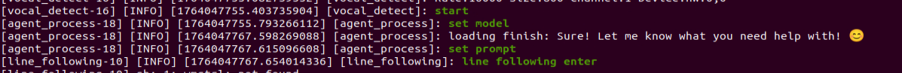

5. When the terminal displays the corresponding output shown in the figure and the device responds with **I’m here**, it indicates successful activation. The system will begin recording voice commands.

   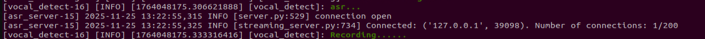

6. When the terminal prints the output shown below, it indicates that the voice device has transcribed the spoken command. In this example, the command spoken is **Follow the black line and stop when you encounter an obstacle**.

   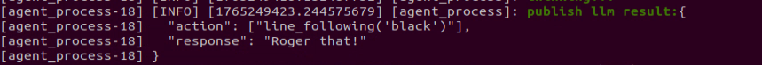

7. Upon successful recognition by the speech recognition service of a cloud-based large speech model, the parsed command will be displayed under the **publish_asr_result** output in the terminal.

   

> [!NOTE]
>
> **The response is automatically generated by the large model. Only the semantic accuracy of the reply is guaranteed, while the wording and formatting may vary.**

8. To exit the feature, press **Ctrl+C** in the terminal. If the feature does not shut down immediately, press **Ctrl+C** multiple times. If it still fails to exit, open a new terminal window and run the following command to terminate all active ROS processes and related programs.

```bash
~/.stop_ros.sh
```

#### 10.5.4.4 Project Outcome

Once the feature is activated, feel free to give commands in your own words. For instance, **Follow the black line and stop when you encounter an obstacle**. The robot uses its camera to detect and follow the black line, and it will stop when an obstacle is detected in its path. The system is pre-configured to recognize four line colors: red, blue, green, and black.

#### 10.5.4.5 Program Analysis

* **Launch File Analysis**

File Path:

**/home/ubuntu/ros2_ws/src/large_models_examples/large_models_examples/llm_visual_patrol.launch.py**

1\) Import library files.

```python
import os
from ament_index_python.packages import get_package_share_directory

from launch_ros.actions import Node
from launch.substitutions import LaunchConfiguration
from launch import LaunchDescription, LaunchService
from launch.launch_description_sources import PythonLaunchDescriptionSource
from launch.actions import IncludeLaunchDescription, DeclareLaunchArgument, OpaqueFunction
from launch.actions import GroupAction,TimerAction
```

`os`: Used for handling file paths and operating system-related functions.

`ament_index_python.packages.get_package_share_directory`: Retrieves the share directory path of ROS 2 package.

`launch_ros.actions.Node`: Used to define ROS 2 nodes.

`launch.substitutions.LaunchConfiguration`: Retrieves parameter values defined in the Launch file.

`LaunchDescription, LaunchService`: Used to define and start the Launch file.

`PythonLaunchDescriptionSource`: Enables the inclusion of other Launch files.

`launch.actions.IncludeLaunchDescription、DeclareLaunchArgument、OpaqueFunction`: Used to define actions and arguments within the Launch file.

`launch.actions.GroupAction、TimerAction`: Action group and delayed startup.

2\) Define the launch_setup Function

Declare launch parameters:

`mode`: Mode parameter, default value `1`.

`camera_topic`: Camera topic, default `depth_cam/rgb0/image_raw`.

`asr_mode` is read from the environment variable ` ASR_MODE`, defaulting to `online` and converted to lowercase.

`interruption`: Interruption toggle, default ` False`.

```python
    mode = LaunchConfiguration('mode', default=1)
    mode_arg = DeclareLaunchArgument('mode', default_value=mode)
    camera_topic = LaunchConfiguration('camera_topic', default='depth_cam/rgb0/image_raw')
    camera_topic_arg = DeclareLaunchArgument('camera_topic', default_value=camera_topic)

    asr_mode = os.environ.get("ASR_MODE", "online").lower()


    interruption = LaunchConfiguration('interruption', default=False)
    interruption_arg = DeclareLaunchArgument('interruption', default_value=interruption)
```

Obtain package paths:

Retrieve paths for `app` and `large_models` packages.

```python
    app_package_path = get_package_share_directory('app')
    large_models_package_path = get_package_share_directory('large_models')
```

Include launch.py files using `IncludeLaunchDescription`.

`line_following_node_launch`: Line tracking node.

`vocal_detect_launch` is the launch file for voice detection, with the `mode` parameter passed in.

`agent_process_launch` is the launch file for agent processing, with the `camera_topic` parameter passed in.

`tts_node_launch` is the launch file for the TTS node.

```python
    line_following_node_launch = IncludeLaunchDescription(
        PythonLaunchDescriptionSource(
            os.path.join(app_package_path, 'launch/line_following_node.launch.py')),
        launch_arguments={
            'debug': 'true',
        }.items(),
    )

    vocal_detect_launch = IncludeLaunchDescription(
        PythonLaunchDescriptionSource(
            os.path.join(get_package_share_directory('large_models'), 'launch/vocal_detect.launch.py')),
        launch_arguments={'mode': mode,}.items(),
    )

    agent_process_launch = IncludeLaunchDescription(
        PythonLaunchDescriptionSource(
            os.path.join(get_package_share_directory('large_models'), 'launch/agent_process.launch.py')),
        launch_arguments={'camera_topic': camera_topic}.items(),
    )

    tts_node_launch = IncludeLaunchDescription(
        PythonLaunchDescriptionSource(
            os.path.join(get_package_share_directory('large_models'), 'launch/tts_node.launch.py')),
    )

```

Delayed launch configuration:

In `offline` mode, `vocal_detect_launch` and `agent_process_launch` are delayed by 10 seconds, while in `online` mode they are delayed by 1 second, and `tts_node_launch` starts immediately.

```python
    time_interval = 10.0 if asr_mode == 'offline' else 1.0
    large_models_launch = GroupAction(
     actions=[
        tts_node_launch,
        TimerAction(
                period=time_interval, actions=[
                vocal_detect_launch,
            ],
         ),
        TimerAction(period=time_interval, actions=[
            agent_process_launch,
            ],
         ),
      ]
    )
```

Conditional node selection:

Start the `llm_visual_patrol_node` node.

```python
    llm_visual_patrol_node = Node(
        package='large_models_examples',
        executable='llm_visual_patrol',
        output='screen',
        parameters=[{
            'interruption': interruption,
            }],
    )
```

3\) Define `generate_launch_description` Function

This function generates the Launch description and adds the `launch_setup` function to it using `OpaqueFunction`.

```python
def generate_launch_description():
    return LaunchDescription([
        OpaqueFunction(function = launch_setup)
    ])
```

4\) Main Program Entry

```python
if __name__ == '__main__':
    # Create a LaunchDescription object
    ld = generate_launch_description()

    ls = LaunchService()
    ls.include_launch_description(ld)
    ls.run()
```

`ld = generate_launch_description()` generates the Launch description object.

`ls = LaunchService()` creates a Launch service object.

`ls.include_launch_description(ld)` adds the Launch description to the Launch service.

`ls.run()` starts the Launch service and executes all defined Launch actions.

* **Python File Analysis**

File Path:

**/home/ubuntu/ros2_ws/src/large_models_examples/large_models_examples/llm_visual_patrol.py**

1\) Prompt template.

```python
    PROMPT = '''
**Role
You are a smart robot that generates corresponding JSON commands based on user input.

**Requirements
- For every user input, search for matching commands in the action function library and output the corresponding JSON instruction.
- For each action sequence, craft a witty and creative response (10 to 30 characters) to make interactions delightful.
- Directly return the JSON result — do not include any explanations or extra text.
- There are four target colors: red, green, blue, and black.
- Format:
{
  "action": ["xx", "xx"],
  "response": "xx"
}

**Special Notes
The "action" field should contain a list of function names as strings, ordered by execution. If no matching action is found, output an empty list: [].
The "response" field should provide a concise and charming reply, staying within the word and tone guidelines.

**Action Function Library
Follow a line of a given color: line_following('black')

**Example
Input: Follow the black line
Output:
{
  "action": ["line_following('black')"],
  "response": "Roger that!"
}
    '''
```

2\) Variable Initialization

Initializes member variables.

`self.action`: list of actions.

`self.stop` controls whether to stop the current action, with True indicating that the action should be stopped.

`self.llm_result`: result returned by the LLM.

`self.running`: running flag.

`self.interrupt`: interrupt flag.

`self.action_finish`: action completed flag.

`self.play_audio_finish`: audio playback completed flag.

`interruption`: whether interruption is enabled.

`self.interruption`: value of the `interruption` parameter.

`self.asr_mode`: Reads the value of speech mode `ASR_MODE` from the environment variable, defaulting to `online`.

```python
    def __init__(self, name):
        rclpy.init()
        super().__init__(name)
        
        self.action = []
        self.stop = True
        self.llm_result = ''
        # self.llm_result = '{"action": ["line_following(\'black\')"], "response": "ok！"}'
        self.running = True
        self.action_finish = False
        self.play_audio_finish = False
        
        self.declare_parameter('interruption', False)  
        self.interruption = self.get_parameter('interruption').value  
        
        self.asr_mode = os.environ.get("ASR_MODE", "online").lower()
```

A reentrant callback group is created to allow callbacks to call other callbacks.

```python
        timer_cb_group = ReentrantCallbackGroup()
```

ROS2 communication:

Publisher: `self.tts_text_pub` publishes TTS text.

Subscribers include `agent_process/result` which receives LLM results, `vocal_detect/wakeup` which receives wake signals, and `tts_node/play_finish` which receives the playback completion status.

Service clients: `self.set_model_client` for setting the model, `self.awake_client` for setting the wake-up, `self.set_mode_client` for setting the mode, `self.set_prompt_clien` for setting the prompt, `self.enter_client` for entering line-following mode, `self.start_client` for starting or stopping the line-following, and `self.set_target_client` for setting the target color.

```python
        self.tts_text_pub = self.create_publisher(String, 'tts_node/tts_text', 1)
        self.create_subscription(String, 'agent_process/result', self.llm_result_callback, 1)
        self.create_subscription(Bool, 'vocal_detect/wakeup', self.wakeup_callback, 1, callback_group=timer_cb_group)
        self.create_subscription(Bool, 'tts_node/play_finish', self.play_audio_finish_callback, 1, callback_group=timer_cb_group)
        self.awake_client = self.create_client(SetBool, 'vocal_detect/enable_wakeup')
        self.awake_client.wait_for_service()
        self.set_mode_client = self.create_client(SetInt32, 'vocal_detect/set_mode')
        self.set_mode_client.wait_for_service()

        self.set_model_client = self.create_client(SetModel, 'agent_process/set_model')
        self.set_model_client.wait_for_service()
        self.set_prompt_client = self.create_client(SetString, 'agent_process/set_prompt')
        self.set_prompt_client.wait_for_service()
        self.enter_client = self.create_client(Trigger, 'line_following/enter')
        self.enter_client.wait_for_service()
        self.start_client = self.create_client(SetBool, 'line_following/set_running')
        self.start_client.wait_for_service()
        self.set_target_client = self.create_client(SetColor, 'line_following/set_color')
        self.set_target_client.wait_for_service()
```

A timer is created to repeatedly call a callback function through the callback group.

```python
        self.timer = self.create_timer(0.0, self.init_process, callback_group=timer_cb_group)
```

3\) def init_process(self) Initialization

Cancel the timer.

```python
        self.timer.cancel()
```

Configure the LLM model:

Create a `SetModel.Request()` message object.

```python
        msg = SetModel.Request()
```

Set the model type to `llm`.

```python
        msg.model_type = 'llm'
```

Select the model and configuration based on `self.asr_mode`.

```python
		if self.asr_mode == 'offline':
            msg.model = 'qwen3:0.6b'
            msg.base_url = ollama_host
        else:
            msg.model = llm_model
            msg.api_key = api_key 
            msg.base_url = base_url
```

Synchronously call the `agent_process/set_model` service via `self.send_request`.

```python
        self.send_request(self.set_model_client, msg)
```

Set the prompt:

Create a `SetString.Request()` message.

```
        msg = SetString.Request()
```

Set `msg.data` to the module-level variable `PROMPT`, using the `ASR_LANGUAGE` environment variable to determine whether it is in English or another language.

```python
        msg.data = PROMPT
```

Call the `agent_process/set_prompt` service to pass the prompt to the LLM agent.

```python
		self.send_request(self.set_prompt_client, msg)
```

Initialize the line-following feature:

Create a temporary client to check if the `line_following/init_finish` service is ready.

```python
        init_finish = self.create_client(Trigger, 'line_following/init_finish')
```

Ensure the line-following node is fully initialized.

```python
        init_finish.wait_for_service()
```

Call the `line_following/enter` service to enter line-following mode.

```
        self.send_request(self.enter_client, Trigger.Request())
```

Play the start audio.

```
        speech.play_audio(start_audio_path)
```

Start the main processing thread.

```python
        threading.Thread(target=self.process, daemon=True).start()
```

Create the initialization completion service. Output logging information.

```python
        self.create_service(Empty, '~/init_finish', self.get_node_state)
```


```python
        self.get_logger().info('\033[1;32m%s\033[0m' % 'start')
        self.get_logger().info('\033[1;32m%s\033[0m' % PROMPT)
```

4\) def wakeup_callback(self, msg) Wakeup Callback Method

Wakeup interrupt handling: when receiving a wakeup signal, interrupt the current action and re-enter line-following mode.

```python
    def wakeup_callback(self, msg):
        if msg.data and self.llm_result:
            self.get_logger().info('wakeup interrupt')
            self.send_request(self.enter_client, Trigger.Request())
            self.stop = True
        elif msg.data and not self.stop:
            self.get_logger().info('wakeup interrupt')
            self.send_request(self.enter_client, Trigger.Request())
            self.stop = True
```

5\) `def llm_result_callback(self, msg)` LLM Result Callback Method

Stores the result returned by the LLM.

```python
	def llm_result_callback(self, msg):
        self.llm_result = msg.data
```

6\) def llm_result_callback(self, msg) LLM Result Callback Method

Enables the wake function and sets the completion flag after audio playback finishes.

```python
    def play_audio_finish_callback(self, msg):
        self.play_audio_finish = msg.data
```

7\) def process(self) Main Processing Loop Method

Run continuously until `self.running` is set to `false`.

```python
        while self.running:
```

Check if there is an LLM result.

```python
            if self.llm_result:
```

Create a TTS message object.

```python
                msg = String()
```

If the string does not contain `action`, only respond via voice.

```
                else:
                    msg.data = self.llm_result
```

If an action is present, extract and process it.

```python
                if 'action' in self.llm_result:
```

Parse the JSON result.

```python
                    result = eval(self.llm_result[self.llm_result.find('{'):self.llm_result.find('}')+1])
```

Check if `result` contains `action`.

```python
                    if 'action' in result:
```

Get the action list, define a regular expression to match the format `line_following('color')`.

```python
                        text = result['action']
                        # Use a regular expression to extract all strings inside parentheses
                        pattern = r"line_following\('([^']+)'\)"
                        # Use re.search to find matches
```

Iterate over the action list:

Perform regex matching for each action string.

```python
                        for i in text:
                            match = re.search(pattern, i)
```

Extract the color parameter and log the result.

```python
                            # Extract the result
                            if match:
                                # Get the parameter part, which is the content inside parentheses  
                                color = match.group(1)
                                self.get_logger().info(str(color))           
```

Set the target color.

```python
                                color_msg = SetColor.Request()
                                color_msg.data = color
                                self.send_request(self.set_target_client, color_msg)
```

Start line-following.

```python
                                start_msg = SetBool.Request()
                                start_msg.data = True 
                                self.send_request(self.start_client, start_msg)
```

Response text processing.

```python
                    if 'response' in result:
                        msg.data = result['response']
```

Publish the TTS response and reset the state.

```python
                self.tts_text_pub.publish(msg)
                self.action_finish = True
                self.llm_result = ''
```

Idle wait.

```python
            else:
                time.sleep(0.01)
```

Wakeup mechanism recovery.

```python
            if self.play_audio_finish and self.action_finish:
                self.play_audio_finish = False
                self.action_finish = False
                msg = SetBool.Request()
                msg.data = True
                self.send_request(self.awake_client, msg)
                if self.interruption:
                    msg = SetInt32.Request()
                    msg.data = 2
                    self.send_request(self.set_mode_client, msg)
                self.stop = False
```

Loop end and cleanup.

```python
        rclpy.shutdown()
```

8\) Main function `def main()`

Create the node, run with a multithreaded executor, and finally destroy the node.

```python
def main():
    node = LLMControlMove('llm_line_following')
    executor = MultiThreadedExecutor()
    executor.add_node(node)
    executor.spin()
    node.destroy_node()
```


### 10.5.5 Offline Large AI Model for Color Tracking

#### 10.5.5.1 Overview

When the program starts, the voice device announces **I’m ready**. Say the wake word **Hello Hiwonder** to activate the voice device, which responds with **I’m here**. Then you can use voice commands to control robot such as **Follow the red object**. The terminal will display the recognized command, and the voice device will respond with a generated reply after processing. The robot will then autonomously identify the red object captured by its camera and begin tracking it.

#### 10.5.5.2 Preparation

Reference Tutorial: [10.5.1 Preparation](#anther10.5.1).

#### 10.5.5.3 Operation Steps

> [!NOTE]
>
> **Command input is case-sensitive and space-sensitive.**

1. Open the command line terminal from the left side of the system interface.  In the terminal window, enter the following command and press **Enter** to stop the auto-start service.

2. Enter the command to disable the auto-start service of the app.

   ```bash
   sudo systemctl stop start_app_node.service
   ```

3. Enter the following command and press **Enter** to launch the color tracking feature.

   ```bash
   ros2 launch large_models_examples llm_color_track.launch.py
   ```

4. When the terminal displays the output shown below and announces **I’m ready**, the voice device has completed initialization. At this point, say the wake word **Hello Hiwonder**.

   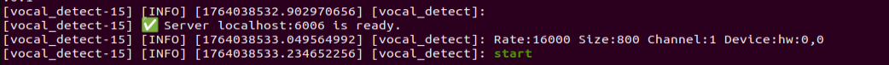

5. After the program has loaded successfully, the camera feed will appear on screen.

6. When the terminal displays the corresponding output shown in the figure and the device responds with **I’m here**, it indicates successful activation. The system will begin recording voice commands.

   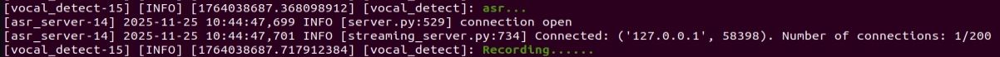

7. When the terminal prints the output shown below, it indicates that the voice device has transcribed the spoken command. In this example, the command spoken is **Follow the red object**.

   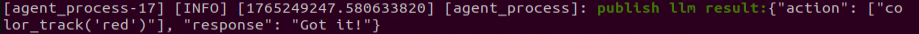

8. Upon successful recognition by the speech recognition service of a cloud-based large speech model, the parsed command will be displayed under the **publish_asr_result** output in the terminal.

   

> [!NOTE]
>
> **The response is automatically generated by the large model. Only the semantic accuracy of the reply is guaranteed, while the wording and formatting may vary.**

9. Then, the robot will detect the red object in its camera feed and begin tracking it in real time.

10. To exit the feature, press **Ctrl+C** in the terminal. If the feature does not shut down immediately, press **Ctrl+C** multiple times. If it still fails to exit, open a new terminal window and run the following command to terminate all active ROS processes and related programs.

```bash
~/.stop_ros.sh
```

#### 10.5.5.4 Project Outcome

Once the feature is activated, feel free to give commands in your own words. For instance, **Follow the red object**. The robot will use the camera feed to identify and track the red object. Similarly, commands like “Follow the blue object” or “Follow the green object” can be used to instruct the robot to track objects of the specified colors.

#### 10.5.5.5 Program Analysis

* **Launch File Analysis**

File Path:

**/home/ubuntu/ros2_ws/src/large_models_examples/large_models_examples/llm_color_track.launch.py**

1\) Import library files.

```python
import os
from ament_index_python.packages import get_package_share_directory

from launch_ros.actions import Node
from launch.substitutions import LaunchConfiguration
from launch import LaunchDescription, LaunchService
from launch.launch_description_sources import PythonLaunchDescriptionSource
from launch.actions import IncludeLaunchDescription, DeclareLaunchArgument, OpaqueFunction
from launch.actions import GroupAction,TimerAction
```

`os`: Used for handling file paths and operating system-related functions.

`ament_index_python.packages.get_package_share_directory`: Retrieves the share directory path of ROS 2 package.

`launch_ros.actions.Node`: Used to define ROS 2 nodes.

`launch.substitutions.LaunchConfiguration`: Retrieves parameter values defined in the Launch file.

`LaunchDescription, LaunchService`: Used to define and start the Launch file.

`PythonLaunchDescriptionSource`: Enables the inclusion of other Launch files.

`launch.actions.IncludeLaunchDescription、DeclareLaunchArgument、OpaqueFunction`: Used to define actions and arguments within the Launch file.

`launch.actions.GroupAction、TimerAction`: Action group and delayed startup.

2\) Define `launch_setup` Function

Declare launch parameters:

`mode`: Mode parameter, default value `1`.

`camera_topic`: Camera topic, default `depth_cam/rgb0/image_raw`.

`asr_mode` is read from the environment variable ` ASR_MODE`, defaulting to `online` and converted to lowercase.

`interruption`: Interruption toggle, default ` False`.

```python
    mode = LaunchConfiguration('mode', default=1)
    mode_arg = DeclareLaunchArgument('mode', default_value=mode)
    camera_topic = LaunchConfiguration('camera_topic', default='depth_cam/rgb0/image_raw')
    camera_topic_arg = DeclareLaunchArgument('camera_topic', default_value=camera_topic)

    asr_mode = os.environ.get("ASR_MODE", "online").lower()


    interruption = LaunchConfiguration('interruption', default=False)
    interruption_arg = DeclareLaunchArgument('interruption', default_value=interruption)
```

Obtain package paths:

Retrieve paths for `app` and `large_models` packages.

```python
    app_package_path = get_package_share_directory('app')
    large_models_package_path = get_package_share_directory('large_models')
```

Include launch.py files using `IncludeLaunchDescription`.

`object_tracking_node_launch`: Color-tracking node.

`vocal_detect_launch` is the launch file for voice detection, with the `mode` parameter passed in.

`agent_process_launch` is the launch file for agent processing, with the `camera_topic` parameter passed in.

`tts_node_launch` is the launch file for the TTS node.

```python
    object_tracking_node_launch = IncludeLaunchDescription(
        PythonLaunchDescriptionSource(
            os.path.join(app_package_path, 'launch/object_tracking_node.launch.py')),
        launch_arguments={
            'debug': 'true',
        }.items(),
    )

    vocal_detect_launch = IncludeLaunchDescription(
        PythonLaunchDescriptionSource(
            os.path.join(get_package_share_directory('large_models'), 'launch/vocal_detect.launch.py')),
        launch_arguments={'mode': mode,}.items(),
    )

    agent_process_launch = IncludeLaunchDescription(
        PythonLaunchDescriptionSource(
            os.path.join(get_package_share_directory('large_models'), 'launch/agent_process.launch.py')),
        launch_arguments={'camera_topic': camera_topic}.items(),
    )

    tts_node_launch = IncludeLaunchDescription(
        PythonLaunchDescriptionSource(
            os.path.join(get_package_share_directory('large_models'), 'launch/tts_node.launch.py')),
    )

```

Delayed launch configuration:

In `offline` mode, `vocal_detect_launch` and `agent_process_launch` are delayed by 10 seconds, while in `online` mode they are delayed by 1 second, and `tts_node_launch` starts immediately.

```python
    time_interval = 10.0 if asr_mode == 'offline' else 1.0
    large_models_launch = GroupAction(
     actions=[
        tts_node_launch,
        TimerAction(
                period=time_interval, actions=[
                vocal_detect_launch,
            ],
         ),
        TimerAction(period=time_interval, actions=[
            agent_process_launch,
            ],
         ),
      ]
    )
```

Conditional node selection:

Start the `llm_color_track_node` node.

```python
    llm_color_track_node = Node(
        package='large_models_examples',
        executable='llm_color_track',
        output='screen',
        parameters=[
            {
                'interruption': interruption,
            }],
    )
```

3\) Define `generate_launch_description` Function

This function generates the Launch description and adds the `launch_setup` function to it using `OpaqueFunction`.

```python
def generate_launch_description():
    return LaunchDescription([
        OpaqueFunction(function = launch_setup)
    ])
```

4\) Main Program Entry

```python
if __name__ == '__main__':
    # Create a LaunchDescription object
    ld = generate_launch_description()

    ls = LaunchService()
    ls.include_launch_description(ld)
    ls.run()
```

`ld = generate_launch_description()` generates the Launch description object.

`ls = LaunchService()` creates a Launch service object.

`ls.include_launch_description(ld)` adds the Launch description to the Launch service.

`ls.run()` starts the Launch service and executes all defined Launch actions.

* **Python File Analysis**

File Path:

**/home/ubuntu/ros2_ws/src/large_models_examples/large_models_examples/llm_color_track.py**

1\) Prompt template.

```python
    PROMPT = '''
**Role
You are an intelligent companion robot. Your job is to generate corresponding JSON commands based on the user’s input.

**Requirements
- For every user input, search the action function library for matching commands and return the corresponding JSON instruction.
- Craft a witty, ever-changing, and concise response (between 10 to 30 characters) for each action sequence to make interactions lively and fun.
- Output only the JSON result — do not include explanations or any extra text.
- Output format:{"action": ["xx", "xx"], "response": "xx"}

**Special Notes
The "action" key holds an array of function name strings arranged in execution order. If no match is found, return an empty array [].
The "response" key must contain a cleverly worded, short reply (10–30 characters), adhering to the tone and length guidelines above.

**Action Function Library
Track an object of a specific color: color_track('red')

**Example
Input: Track a green object
Output:
{"action": ["color_track('green')"], "response": "Got it!"}
    '''
```

2\) Variable Initialization

Initializes member variables.

`self.action`: list of actions.

`self.stop` controls whether to stop the current action, with True indicating that the action should be stopped.

`self.llm_result`: result returned by the LLM.

`self.running`: running flag.

`self.interrupt`: interrupt flag.

`self.action_finish`: action completed flag.

`self.play_audio_finish`: audio playback completed flag.

`interruption`: whether interruption is enabled.

`self.interruption`: value of the `interruption` parameter.

`self.asr_mode`: Reads the value of speech mode `ASR_MODE` from the environment variable, defaulting to `online`.

```python
    def __init__(self, name):
        rclpy.init()
        super().__init__(name)
        
        self.action = []
        self.stop = True
        self.llm_result = ''
        # self.llm_result = '{"action": ["line_following(\'black\')"], "response": "ok！"}'
        self.running = True
        self.action_finish = False
        self.play_audio_finish = False
        
        self.declare_parameter('interruption', False)  
        self.interruption = self.get_parameter('interruption').value  
        
        self.asr_mode = os.environ.get("ASR_MODE", "online").lower()
```

A reentrant callback group is created to allow callbacks to call other callbacks.

```python
        timer_cb_group = ReentrantCallbackGroup()
```

ROS2 communication:

Publisher: `self.tts_text_pub` publishes TTS text.

Subscribers include `agent_process/result` which receives LLM results, `vocal_detect/wakeup` which receives wake signals, and `tts_node/play_finish` which receives the playback completion status.

Service clients: `self.set_model_client` for setting the model, `self.awake_client` for setting the wake-up, `self.set_mode_client` for setting the mode, `self.set_prompt_clien` for setting the prompt, `self.enter_client` for entering color tracking mode, `self.start_client` for starting or stopping the mode, and `self.set_target_client` for setting the target color.

```python
        self.tts_text_pub = self.create_publisher(String, 'tts_node/tts_text', 1)
        self.create_subscription(String, 'agent_process/result', self.llm_result_callback, 1)
        self.create_subscription(Bool, 'vocal_detect/wakeup', self.wakeup_callback, 1, callback_group=timer_cb_group)
        self.create_subscription(Bool, 'tts_node/play_finish', self.play_audio_finish_callback, 1, callback_group=timer_cb_group)
        self.awake_client = self.create_client(SetBool, 'vocal_detect/enable_wakeup')
        # self.awake_client.wait_for_service()
        self.set_mode_client = self.create_client(SetInt32, 'vocal_detect/set_mode')
        # self.set_mode_client.wait_for_service()

        self.set_model_client = self.create_client(SetModel, 'agent_process/set_model')
        self.set_model_client.wait_for_service()
        self.set_prompt_client = self.create_client(SetString, 'agent_process/set_prompt')
        self.set_prompt_client.wait_for_service()
        self.enter_client = self.create_client(Trigger, 'object_tracking/enter')
        self.enter_client.wait_for_service()
        self.start_client = self.create_client(SetBool, 'object_tracking/set_running')
        self.start_client.wait_for_service()
        self.set_target_client = self.create_client(SetColor, 'object_tracking/set_color')
        self.set_target_client.wait_for_service()
```

A timer is created to repeatedly call a callback function through the callback group.

```python
        self.timer = self.create_timer(0.0, self.init_process, callback_group=timer_cb_group)
```

3\) `def init_process(self)` Initialization Configuration

Cancel the timer.

```python
        self.timer.cancel()
```

Configure the LLM model:

Create a `SetModel.Request()` message object.

```python
        msg = SetModel.Request()
```

Set the model type to `llm`.

```python
        msg.model_type = 'llm'
```

Select the model and configuration based on `self.asr_mode`.

```python
		if self.asr_mode == 'offline':
            msg.model = 'qwen3:0.6b'
            msg.base_url = ollama_host
        else:
            msg.model = llm_model
            msg.api_key = api_key 
            msg.base_url = base_url
```

Synchronously call the `agent_process/set_model` service via `self.send_request`.

```python
        self.send_request(self.set_model_client, msg)
```

Set the prompt:

Create a `SetString.Request()` message.

```
        msg = SetString.Request()
```

Set `msg.data` to the module-level variable `PROMPT`, using the `ASR_LANGUAGE` environment variable to determine whether it is in English or another language.

```python
        msg.data = PROMPT
```

Call the `agent_process/set_prompt` service to pass the prompt to the LLM agent.

```python
		self.send_request(self.set_prompt_client, msg)
```

Initialize the line-following feature:

Create a temporary client to check if the `object_tracking/init_finish` service is ready.

```python
        init_finish = self.create_client(Trigger, 'object_tracking/init_finish')
```

Ensure the color tracking node is fully initialized.

```python
        init_finish.wait_for_service()
```

Call the `object_tracking/enter` service to enter line-following mode.

```python
        self.send_request(self.enter_client, Trigger.Request())
```

Play the start audio.

```python
        speech.play_audio(start_audio_path)
```

Start the main processing thread.

```python
        threading.Thread(target=self.process, daemon=True).start()
```

Create the initialization completion service.

```python
        self.create_service(Empty, '~/init_finish', self.get_node_state)
```

Output logging information.

```python
        self.get_logger().info('\033[1;32m%s\033[0m' % 'start')
        self.get_logger().info('\033[1;32m%s\033[0m' % PROMPT)
```

4\) `def wakeup_callback(self, msg)` Wakeup Callback Method

Wakeup interrupt handling: when receiving a wakeup signal, interrupt the current action and re-enter line-following mode.

```python
    def wakeup_callback(self, msg):
        if msg.data and self.llm_result:
            self.get_logger().info('wakeup interrupt')
            self.send_request(self.enter_client, Trigger.Request())
            self.stop = True
        elif msg.data and not self.stop:
            self.get_logger().info('wakeup interrupt')
            self.send_request(self.enter_client, Trigger.Request())
            self.stop = True
```

5\) `def llm_result_callback(self, msg)` LLM Result Callback Method

Stores the result returned by the LLM.

```python
	def llm_result_callback(self, msg):
        self.llm_result = msg.data
```

6\) `def play_audio_finish_callback(self, msg)` Audio Playback Completion Callback Method

Enables the wake function and sets the completion flag after audio playback finishes.

```python
    def play_audio_finish_callback(self, msg):
        self.play_audio_finish = msg.data
```

7\) `def process(self)` Main Processing Loop

Run continuously until `self.running` is set to `false`.

```python
        while self.running:
```

Check if there is an LLM result.

```python
            if self.llm_result:
```

Create a TTS message object.

```python
                msg = String()
```

If the string does not contain `action`, only respond via voice.

```
                else:
                    msg.data = self.llm_result
```

If an action is present, extract and process it.

```python
                if 'action' in self.llm_result:
```

Parse the JSON result.

```python
                    result = eval(self.llm_result[self.llm_result.find('{'):self.llm_result.find('}')+1])
```

Check if `result` contains `action`.

```python
                    if 'action' in result:
```

Get the action list, define a regular expression to match the format `line_following('color')`.

```python
                        text = result['action']
                        # Use a regular expression to extract all strings inside parentheses
                        pattern = r"line_following\('([^']+)'\)"
                        # Use re.search to find matches
```

Iterate over the action list:

Perform regex matching for each action string.

```python
                        for i in text:
                            match = re.search(pattern, i)
```

Extract the color parameter and log the result.

```python
                            # Extract the result  
                            if match:
                                # Get the parameter part, which is the content inside parentheses
                                color = match.group(1)
                                self.get_logger().info(str(color))           
```

Set the target color.

```python
                                color_msg = SetColor.Request()
                                color_msg.data = color
                                self.send_request(self.set_target_client, color_msg)
```

Start color tracking.

```python
                                start_msg = SetBool.Request()
                                start_msg.data = True 
                                self.send_request(self.start_client, start_msg)
```

Response text processing.

```python
                    if 'response' in result:
                        msg.data = result['response']
```

Publish the TTS response and reset the state.

```python
                self.tts_text_pub.publish(msg)
                self.action_finish = True
                self.llm_result = ''
```

Idle wait.

```python
            else:
                time.sleep(0.01)
```

Wakeup mechanism recovery.

```python
            if self.play_audio_finish and self.action_finish:
                self.play_audio_finish = False
                self.action_finish = False
                msg = SetBool.Request()
                msg.data = True
                self.send_request(self.awake_client, msg)
                if self.interruption:
                    msg = SetInt32.Request()
                    msg.data = 2
                    self.send_request(self.set_mode_client, msg)
                self.stop = False
```

Loop end and cleanup.

```python
        rclpy.shutdown()
```

8\) Main function `def main()`

Create the node, run with a multithreaded executor, and finally destroy the node.

```python
def main():
    node = LLMControlMove('llm_color_track')
    executor = MultiThreadedExecutor()
    executor.add_node(node)
    executor.spin()
    node.destroy_node()
```

