# 10\. ROS1-Group Control

## 10.1 Multi-Robot Communication Setup
<p id ="anther10.1"></p>

Real-time synchronized control of multiple robots requires all robots to be connected to the same network. This section explains the multi-robot communication setup.

### 10.1.1 Leader and Follower Concept

Leader receives commands and executes them while synchronizing the instructions to other robots. Only one robot can be designated as the Leader.

Follower receives commands from the Leader and carries out the corresponding actions. At least one Follower is required.

### 10.1.2 Preparation

1. At least two robots are required.
2. Prepare a Wi-Fi router, preferably one that supports the 5GHz band to ensure smooth group control. A low-performance router may cause delays, unsynchronized movements, or lag during group control.

### 10.1.3 Network Configuration

1. Connect all robots to the same network. Make sure the Wi-Fi on the router is enabled.

> [!NOTE]
> 
> **The robot’s default network mode is set to AP. For detailed information, please refer to the file [1. ROSOrin User Manual](https://wiki.hiwonder.com/projects/ROSOrin/en/jetson-nano/docs/1_ROSOrin_User_Manual.html#rosorin-user-manual). Using the robot’s built-in hotspot allows control of only two robots. For more than two, using the hotspot generated by the robot is not recommended, as it may cause lag and affect performance. To control multiple robots, connect them to a Wi-Fi router, preferably one that supports the 5GHz band.**

2. Ensure all robots are connected to the prepared Wi-Fi network.

### 10.1.4 Virtual Machine Installation and Import

For detailed information of installation, please refer to the [18.1.1 Virtual Machine Installation](https://wiki.hiwonder.com/projects/ROSOrin/en/jetson-nano/docs/18_ROS2-Gazebo_Simulation.html#virtual-machine-installation). After installing the virtual machine software, extract the prepared virtual machine image located under [5. Virtual Machine Software](c:\Users\ADMINI~1\AppData\Local\Temp\QQ_1766818084543.png) in the 2. Software folder.

1. Ensure the computer is connected to the same network as the robots, either via Wi-Fi or Ethernet.


2. Open **VMware Workstation**, click **File** in the menu bar, and select **Open**, or use the shortcut **Ctrl+O**.


3. Navigate to the folder containing the virtual machine files, [5. Virtual Machine Software/ubuntu_ros1_melodic](https://drive.google.com/drive/folders/1vL6BsExx7dsp1N_jicL2BORTpmzP8nk6), select the virtual machine file, and click Open to import it.

### 10.1.5 Copying Robot Files to the Virtual Machine and Compiling

* **Export Files from the Robot**

1) Power on the robot and connect it via the NoMachine remote control software. For detailed information on connecting to a remote desktop, please refer to section [1.7 Development Environment Setup](https://wiki.hiwonder.com/projects/ROSOrin/en/jetson-nano/docs/1_ROSOrin_User_Manual.html#development-environment-setup) in the user manual.

2) Click the terminal icon  in the system desktop to open a command-line window.

3) Enter the command to disable the app auto-start service.

```bash
sudo systemctl stop start_app_node.service
```

4) Click the terminal icon  in the system desktop to open a command-line window.

5) Open a new terminal window and enter the command to navigate to the `ros_ws/src/` directory.

```bash
cd ros_ws/src/
```

6) Use the command to package the `multi_control`, `navigation`, `peripherals`, `simulations`, `slam`, and `third_party` directories, as well as the `explore`, `frontier_exploration`, `rrt_exploration`, `sparse_bundle_adjustment`, and `virtual_wall` files, into a compressed archive.

```bash
zip -r src.zip multi_control navigation peripherals simulations slam third_party/explore third_party/frontier_exploration third_party/rrt_exploration third_party/sparse_bundle_adjustment third_party/virtual_wall
```

7) Click the desktop icon  to open the file manager, navigate to the `home/ros_ws/src` directory, and drag the generated `src.zip` file to the computer desktop.

8) Click the icon  to open the file manager again, go to the `home/ros_ws/` directory.

9) Press **Ctrl+H** to show the hidden `.typerc` file.

10) Drag the `.typerc` file to the desktop.


* **Import Files into the Virtual Machine**

1) Click the icon  to open the software, which by default opens the **home** directory.


2) Drag and drop the `.typerc` and `src.zip` files from the computer desktop into the virtual machine.


* **Create and Build the Workspace**

1) Click the icon  on the virtual machine interface to open a command-line terminal.

2) Enter the following command to create a file directory:

```bash
mkdir -p ros_ws/src
```

3) Unzip `src.zip` to the current `home/ubuntu` directory:

```bash
unzip src.zip -d /home/ubuntu/ros_ws/src/
```

4) Move the`.typerc` file to the `ros_ws` directory:

```bash
mv .typerc ros_ws/
```

5) Navigate to the `ros_ws` directory:

```bash
cd ros_ws/
```

6) Check if `.typerc` has been moved to the `ros_ws` directory:

```bash
ls -a
```

7) Enter the command to compile the workspace:

```bash
catkin_make
```

8) If compilation errors occur due to missing header files, such as **exploration_msgs/SetPolygon.h**, **exploration_msgs/ExploreAction.h**, or **virtual_wall/Wall.h**, repeat the compilation several times until it succeeds.


9) Run the command to check the current IP address of the virtual machine.

```bash
ifconfig
```


10) Edit the `.bashrc` file by entering the following command:

```bash
gedit ~/.bashrc
```

11. Copy and add the following content into the `.bashrc` file.

```bash
source /home/ubuntu/ros_ws/.typerc
source /home/ubuntu/ros_ws/devel/setup.bash
```


12) After editing, save and exit using the **Ctrl+S** shortcut or by clicking the **Save** button at the top right.
    
    
    
13) Run the command to refresh the environment configuration.

```bash
source ~/.bashrc
```

### 10.1.6 Configuring the Virtual Machine

* **Configure the Virtual Machine Network**

1. Connect the computer to a Wi-Fi network, then in the virtual machine software menu, click **Edit** and select **Virtual Network Editor**.


2. Click **Change Settings** to gain permission to make modifications.


3. Click **Add Network**.

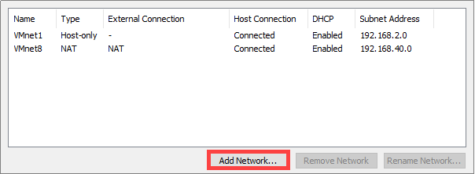

4. Select the network to add, for example, **VMnet0**, and click **OK**.


5. Select the newly added network **VMnet0**, set it to **Bridged** mode, and choose the network adapter as the bridge target. After making the changes, click **OK**.


6. Click **Power on this virtual machine** and wait for the system to start.

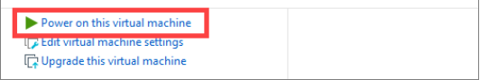

* **Configure the Virtual Machine Name**

> [!NOTE]
> 
> **Commands must be entered with correct capitalization. The Tab key can be used to auto-complete keywords.**

1. Check whether the virtual machine name conflicts with the configured robot host name. Start the virtual machine and click the icon 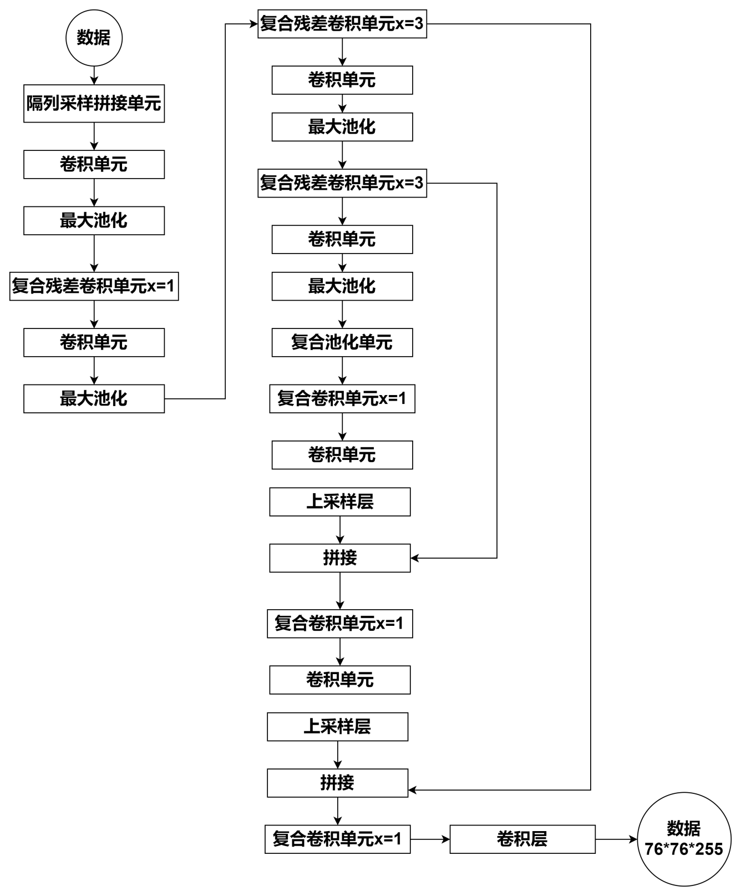 on the left to open a terminal.

2. Enter the command to open the basic configuration file.

```bash
vim ~/ros_ws/.typerc
```

3. Keep **HOST=robot_1** as the default value and leave **MASTER** unchanged, as shown in the figure. Press **Esc**, then enter the command to save and exit.

```bash
:wq
```

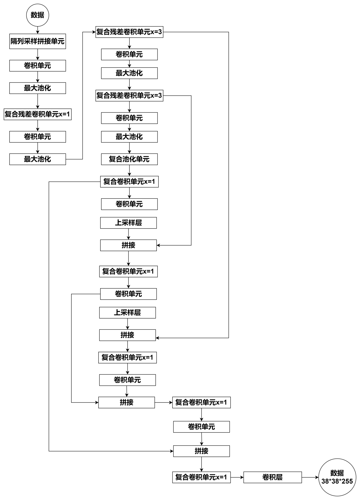

* **Configure the Virtual Machine Node Publishing Address**

1. Enter the command to view the virtual machine IP address.

```bash
ifconfig
```

2. Record the IP address highlighted in the figure.

> [!NOTE]
> 
> **If no IP address is displayed, run `sudo dhclient ens33` to refresh the Wi-Fi connection.**


3. Enter the command to open the virtual machine configuration file.

```bash
gedit ~/.bashrc
```

4. Copy the content below and add it to the `.bashrc` file. Set the value of **MASTER_IP=$IP** to the IP address of the virtual machine.

```bash
export HOST_IP=192.168.1.186
export MASTER_IP=192.168.1.186
export ROS_MASTER_URI=http://$MASTER_IP:11311
export ROS_HOSTNAME=$HOST_IP
```


5. After editing, save and exit using the **Ctrl+S** shortcut or by clicking the **Save** button at the top right.
   
   
   
6. Enter the command to reload the configuration so the settings take effect.

```bash
source ~/.bashrc
```

### 10.1.7 Configure the Leader Robot

After completing the preparation steps, connect to the robot using NoMachine or an SSH tool to make the required changes. Two connection methods are available.

1. One option is to obtain the robot IP address through the app or the router management interface.

2. The other option is to connect the robot to the computer using a USB cable and access it via the fixed IP address 192.168.55.1.

For this guide, the USB connection method is used, since it provides a more stable connection and allows access even when earlier steps were not configured correctly. Follow the steps below.

1) After the robot has finished booting, connect the robot to the computer using a USB cable.

2) Open the NoMachine remote desktop software, enter **192.168.55.1** in the address bar, and press **Enter**.


3) Select the option with **Connect** in its name to enter the robot system.
   
   
   
4) Click the terminal icon  in the system desktop to open a command-line window.

* **Configuring the Leader Robot Network**

1. Enter the command to open the robot network configuration file.

```bash
vim ~/wifi_manager/wifi_conf.py
```

2. Modify the highlighted fields in the file as follows. Change the first highlighted entry from top to bottom to **HW_WIFI_MODE = 2**. Change the second highlighted entry to **HW_WIFI_STA_SSID =** followed by the WiFi network name. Change the third highlighted entry to **HW_WIFI_STA_PASSWORD =** followed by the WiFi password. Press **Esc**, then enter the save and exit command.

```bash
:wq
```

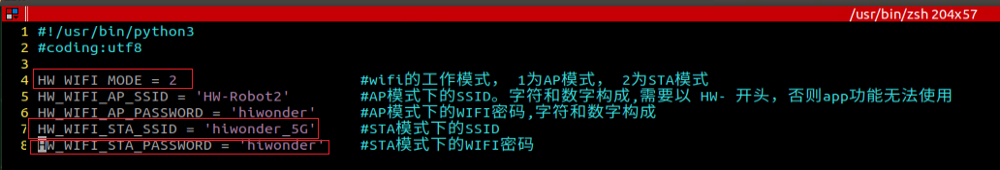

3. Restart the robot's Wi-Fi service using the following command.

```bash
sudo systemctl restart wifi.service
```

> [!NOTE]
> 
> **Restarting the robot WiFi service is required. Otherwise, the network configuration will not take effect.**

4. After the configuration is applied successfully, the LED indicator on the Jetson expansion board will turn solid blue, indicating that the settings have taken effect.

* **Configure the Name of Leader Robot**

> [!NOTE]
> 
> **Commands must be entered with correct capitalization. The Tab key can be used to auto-complete keywords.**

1) Enter the command to open the basic configuration file.

```bash
vim ros_ws/.typerc
```

2) Verify that the robot selected as the host matches the configuration shown in the highlighted area. Press **Esc**, then enter the save and exit command.

```bash
:wq
```


* **Configure the Leader Node Publishing Address**

1. Enter the command to open the robot configuration file.

```bash
vim ros_ws/.hiwonderrc
```

2. Set the value of **MASTER_IP=$IP** to the IP address of the virtual machine. Press **Esc**, then enter the command to save and exit. The virtual machine IP refers to the address obtained in the previous steps.

```bash
:wq
```

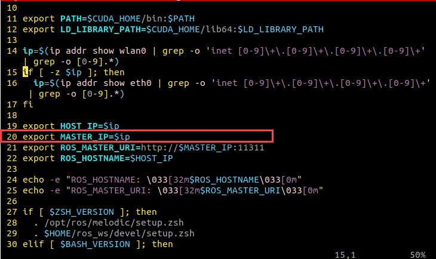

3. Enter the command to update the robot configuration file so that the changes take effect.

```bash
source .zshrc
```

### 10.1.8 Configure the Follower Robots

* **Configure the Name of Follower Robots**

> [!NOTE]
> 
> **Commands must be entered with correct capitalization. The Tab key can be used to auto-complete keywords.**

1. Enter the command to open the basic configuration file.

```bash
vim ros_ws/.typerc
```

2. Verify that each robot configured as a follower matches the highlighted settings shown in the figure. Set **HOST** to the follower robot name, for example **robot_2**, and set **MASTER=robot_1**. Press **Esc**, then enter the command to save and exit.

```
:wq
```

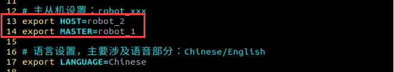

> [!NOTE]
> 
> * **MASTER must be set to robot_1.**
> 
> * **The follower robot name can be set to robot_2, robot_3, and so on. Do not set it to robot_1, as this would conflict with the leader name and may cause errors.**

* **Configure the Follower Node Publishing Address**

1. Enter the command to open the robot configuration file.

```bash
vim ros_ws/.hiwonderrc
```

2. Set the value of **MASTER_IP=$IP** to the IP address of the virtual machine. Press **Esc**, then enter the command to save and exit.

```
:wq
```


3. Enter the command to update the robot configuration file so that the changes take effect.

```bash
source .zshrc
```

* **Configuring the Follower Robot Network**

1. Enter the command to open the robot network configuration file.

```bash
vim ~/wifi_manager/wifi_conf.py
```

2. Modify the highlighted fields in the file as follows. Change the first highlighted entry from top to bottom to **HW_WIFI_MODE = 2**. Change the second highlighted entry to **HW_WIFI_STA_SSID =** followed by the WiFi network name. Change the third highlighted entry to **HW_WIFI_STA_PASSWORD =** followed by the WiFi password. Press **Esc**, then enter the save and exit command.

```bash
:wq
```

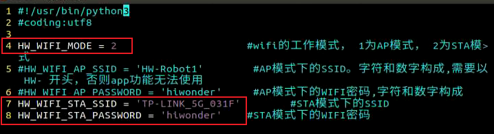

3. Restart the robot's Wi-Fi service using the following command.

```bash
sudo systemctl restart wifi.service
```


### 10.1.9 Configure Communication Between Virtual Machine and Robot
<p id ="anther10.1.9"></p>

* **Connect Robots from the Virtual Machine**

Using the SSH protocol, the leader node can manage other nodes uniformly, such as setting parameters, testing, and debugging.

> [!NOTE]
> 
> **Commands must be entered with correct capitalization. The Tab key can be used to auto-complete keywords.**

1. In the virtual machine terminal, right-click and select **Split Horizontally** or **Split Vertically** to divide the terminal pane.

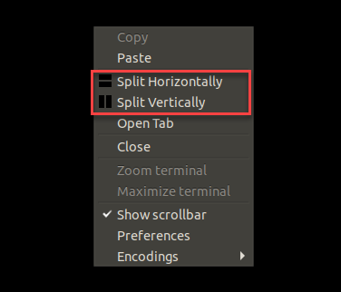

2. After splitting, enter the SSH command and the remote password **hiwonder** to connect to the robot.

```bash
ssh robot_1
ssh robot_2
```

To connect to another follower robot, replace **robot_X** with the corresponding robot name.

* **Configure SSH Communication in the Virtual Machine**

1. Enter the command to initialize the SSH service. Follow the on-screen prompts, pressing **Enter** or typing **y** when required.

```bash
ssh-keygen
```


2. Next, enter the command to set up the SSH service, press **Enter**, and input the password, which is **ubuntu**. The IP address 192.168.1.186 is the IP of the virtual machine itself. This IP should be adjusted according to the actual virtual machine environment. The IP provided here is for reference only.

```bash
ssh-copy-id -i ubuntu@192.168.1.186
```

* **Configure SSH Communication Between Leader and Follower Robots**

The following example uses the leader robot. The steps and commands are the same for all follower robots—repeat the configuration for each follower as needed.

1. On the robot’s terminal, enter the command to initialize the SSH service. After pressing **Enter**, follow the prompts and keep pressing **Enter** to proceed.

```bash
ssh-keygen
```


2. Next, enter the command to set up the SSH service, press **Enter**, and input the password, which is **ubuntu**. The IP address 192.168.1.186 is the IP of the virtual machine itself. This IP should be adjusted according to the actual virtual machine environment. The IP provided here is for reference only.

```bash
ssh-copy-id -i ubuntu@192.168.1.186
```

* **Configure Virtual Machine SSH Communication Parameters**

1. To configure SSH parameters, input the following command:

```bash
vim .ssh/config
```

2. Fill in the **config** file as shown in the diagram below. Set the robot names, such as `robot_1` and `robot_2`, the `HostName` as the robot's IP address, and the `User` as the robot's username. Add more robots following the same format, depending on how many robots need to be controlled. Press **Esc**, then enter the command to save and exit.

```bash
:wq
```


### 10.1.10 Time Synchronization (Key Step)

Time synchronization is critical in a multi-robot system using ROS for group control. If the clocks are not synchronized, messages may be delivered incorrectly or processed out of order. After each reboot, the robot must confirm and perform the time synchronization process.

1. Start the virtual machine and click the icon  on the left to open a terminal.

2. Right-click the command bar to split the view.

3. In the first split, connect the leader and follower robots by following the steps in section [10.1.9 Configure Communication Between Virtual Machine and Robot](#anther10.1.9).

```bash
ssh robot_1
```

4. Click on the arrow to the indicated position and select the option in the red box to enable broadcast mode for both split views.


5. In the first split, enter the command to synchronize the time between the virtual machine and the connected robot using SSH. In the command, `"2022/12/6 19:42:7"` is a custom time, which can be set as needed.

```bash
sudo date -s "2022/12/6 19:42:7"
```

Once the synchronization is successful, input the command again to verify the synchronization.

```bash
date
```

6. After confirming synchronization, click the arrow position as shown below and select the option in the red box to turn off the broadcast mode.


## 10.2 Multi-Robot Control

Multi-robot control refers to using a single wireless controller to simultaneously control multiple robots, making them perform synchronized actions.

### 10.2.1 Preparation

1) Prepare two or more robots.

2) Ensure the virtual machine needed for the task is ready.

3) Follow the steps in [10.1 Multi-Robot Communication Setup](#anther10.1) to understand the roles of the leader and follower robots and complete the necessary communication configurations.

4) Insert the USB controller receiver into the robot designated as the leader robot. The follower robots do not require a receiver, and the receiver should be removed from all follower robots.

### 10.2.2 Time Synchronization

Time synchronization is critical in a multi-robot system using ROS for group control. If the clocks are not synchronized, messages may be delivered incorrectly or processed out of order. After each reboot, the robot must confirm and perform the time synchronization process.

1. Start the virtual machine and click the icon  on the left to open a terminal.

2. Right-click the command bar to split the view.

3. In the first split, connect the leader and follower robots by following the steps in section [10.1.9 Configure Communication Between Virtual Machine and Robot](#anther10.1.9). After expanding, enter the commands `ssh robot_1`, `ssh robot_2`, and `ssh robot_3` if using a third robot, then input the remote password **hiwonder** to remotely connect to each robot.

```bash
ssh robot_1
```

4. Next, open a new terminal in the virtual machine to facilitate time synchronization between the robot and the virtual machine. Select the top-left corner, click on the arrow to choose the option highlighted in the red box, and enable command broadcast mode across the two terminals, or three, if using three robots.


5. In the first split, enter the command to synchronize the time between the virtual machine and the connected robot using SSH. In the command, `"2022/12/6 19:42:7"` is a custom time, which can be set as needed.

```bash
sudo date -s "2022/12/6 19:42:7"
```

6. Once the synchronization is successful, input the command again to verify the synchronization.

```bash
date
```

7. After the synchronization, the app service for all three robots can be turned off in broadcast mode simultaneously by entering the command:

```bash
sudo systemctl stop start_app_node.service
```

8. Once the time synchronization is confirmed and the app service is closed, the broadcast mode can be turned off by selecting the appropriate option indicated in the figure below.


### 10.2.3 Enable Services

1. Start the virtual machine node controller, open the command line, and enter the command to enable inter-node communication services.

```bash
roscore
```

2. Activate the controller service for the leader robot (robot_1). In the connected command line, enter the command to enable the multi-robot control service.

```bash
roslaunch multi multi_control.launch
```

3. Next, activate the service for the follower robot (robot_2). Wait for the services of the leader robot to fully start, then enter the command in the connected command line to enable the multi-robot control service.

```
roslaunch multi multi_control.launch
```

For additional follower robots, activate the follower robot controller service on each one by repeating the steps above.

### 10.2.4 Wireless Controller Button Functions

Turn on the controller and press the **Start** button to confirm the connection to the robot. When a **beep** sound is heard, the connection is successful, and the controller can now be used to control multiple robots.

The table below explains the functions of the controller buttons and joysticks:

<table>
  <thead>
    <tr>
      <th>Button</th>
      <th>Function</th>
      <th>Operation</th>
    </tr>
  </thead>
  <tbody>
    <tr>
      <td>START</td>
      <td>Stop and reset the robot</td>
      <td>Short press</td>
    </tr>
    <tr>
      <td>Left joystick up</td>
      <td>Move forward</td>
      <td>Push</td>
    </tr>
    <tr>
      <td>Left joystick down</td>
      <td>Move backward</td>
      <td>Push</td>
    </tr>
    <tr>
      <td>Left joystick left</td>
      <td>Move left for Mecanum and differential chassis</td>
      <td>Push</td>
    </tr>
    <tr>
      <td>Left joystick right</td>
      <td>Move right for Mecanum and differential chassis</td>
      <td>Push</td>
    </tr>
    <tr>
      <td>Right joystick left</td>
      <td>Turn left</td>
      <td>Push</td>
    </tr>
    <tr>
      <td>Right joystick right</td>
      <td>Turn right</td>
      <td>Push</td>
    </tr>
  </tbody>
</table>


## 10.3 Multi-Robot Mapping

<p id ="anther10.3"></p>

Multi-robot mapping involves using multiple wireless controllers to simultaneously control multiple robots, causing them to move and merge the maps created by each robot.

For the logic behind multi-robot mapping, refer to the flowchart below:


### 10.3.1 Preparation

1) Prepare two or more robots.

2) Ensure the virtual machine needed for the task is ready.

3) Follow the steps in [10.1 Multi-Robot Communication Setup](#anther10.1) to understand the roles of the leader and follower robots and complete the necessary communication configurations.

4) Place the robot in the area where the map needs to be built. It is recommended to perform this indoors, as factors such as lighting and distance in outdoor environments may affect the mapping results.

5) Position the robots side by side on a wide platform. From the robot’s perspective, the leader robot should be on the right side, with the follower robot on the left, and the distance between them should be 1 meter.

### 10.3.2 Time Synchronization

Time synchronization is critical in a multi-robot system using ROS for group control. If the clocks are not synchronized, messages may be delivered incorrectly or processed out of order. After each reboot, the robot must confirm and perform the time synchronization process.

1. Start the virtual machine and click the icon  on the left to open a terminal.

2. Right-click the command bar to split the view.

3. Enter the SSH command in the first split, then connect the leader and follower robots by following the steps in section [10.1.9 Configure Communication Between Virtual Machine and Robot](#anther10.1.9). After expanding, enter the commands `ssh robot_1`, `ssh robot_2`, and `ssh robot_3` if using a third robot, then input the remote password **hiwonder** to remotely connect to each robot.

```bash
ssh robot_1
```

4. Next, open a new terminal in the virtual machine to facilitate time synchronization between the robot and the virtual machine. Select the top-left corner, click on the arrow to choose the option highlighted in the red box, and enable command broadcast mode across the two terminals, or three, if using three robots.

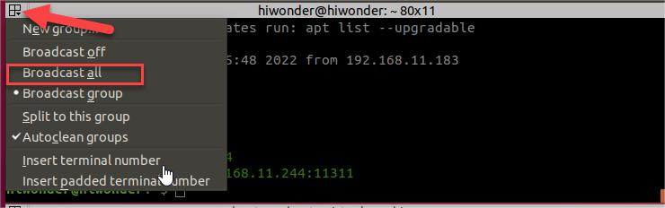

5. In the first split, enter the command to synchronize the time between the virtual machine and the connected robot using SSH. In the command, `"2022/12/6 19:42:7"` is a custom time, which can be set as needed.

```bash
sudo date -s "2022/12/6 19:42:7"
```

Once the synchronization is successful, input the command again to verify the synchronization.

```bash
date
```

6. After the synchronization, the app service for all three robots can be turned off in broadcast mode simultaneously by entering the command:

```bash
sudo systemctl stop start_app_node.service
```

7. Once the time synchronization is confirmed and the app service is closed, the broadcast mode can be turned off by selecting the appropriate option indicated in the figure below.


### 10.3.3 Gmapping Algorithm Mapping

> [!NOTE]
> 
> **Commands must be entered with correct capitalization. The Tab key can be used to auto-complete keywords.**

1. Power on the robot. Once LED1 on the expansion board is solid, connect the robot to the computer using a USB data cable.

2. Follow the instructions in section [10.1.9 Configure Communication Between Virtual Machine and Robot](#anther10.1.9) to establish an SSH connection to both the leader and follower robots from the virtual machine.

3. Start the virtual machine node controller, open the command line, and enter the command to enable inter-node communication services.

```bash
roscore
```

4. Activate the mapping service for the leader robot (robot_1). In the connected command line, enter the command to enable the mapping service.

```bash
roscd multi/launch/multi_slam && roslaunch master_node.launch
```

5. Next, activate the mapping service for the follower robot (robot_2). Wait for the leader robot service to fully start, then enter the command in the connected command line to activate the follower robot mapping service.

```bash
roscd multi/launch/multi_slam && roslaunch slave_node.launch
```

6. View the mapping process on RVIZ in the virtual machine. Enter the command and press **Enter** to launch the RVIZ tool and monitor the robot's mapping process.

```bash
roslaunch multi multi_slam_rviz.launch
```

Once all robots are configured, turn on the first wireless controller. After it connects to the leader robot, the controller can be used to move the leader robot and build the map of the current area. Turn on the second controller. After it connects to the follower robot, the controller can be used to move the follower robot and build the map of the current area.

This example demonstrates the process of multi-robot mapping using two robots. To use more robots, the corresponding number of controllers is required to control each robot.

7. Save the Map

This example uses the leader robot (robot_1), but the same steps can be followed on the follower robots to save their maps.

Enter the command and press **Enter** to save the map.

```bash
roscd slam/maps && rosrun map_server map_saver map:=/robot_1/map -f map_01
```

In the command, `map_01` is the map name, which can be modified as needed. If the following message appears, the map has been successfully saved.

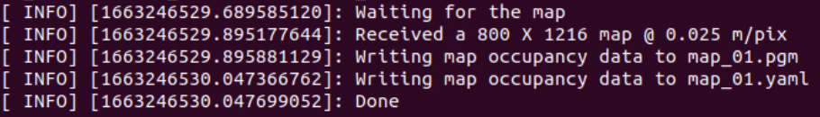


## 10.4 Multi-Robot Formation

Multi-robot formation involves placing three robots on the same mapped area and using a single wireless controller to simultaneously control the robots for a formation performance. The leader and follower robots maintain three possible formations, with each robot adjusting its position based on navigation and positioning data to ensure relative positioning. The formations include row formation, column formation, and triangle formation.

Formation details, with `robot_1` as the leader and `robot_2` and `robot_3` as the followers:

1. Row Formation (`raw`): The three robots are arranged horizontally. The distance between `robot_3` and `robot_1` is 0.7m, and the distance between `robot_1` and `robot_2` is also 0.7m, forming a straight horizontal line.

2. Column Formation (`column`): The three robots are arranged vertically. The distance between `robot_1` and `robot_2` is 0.6m, and the distance between `robot_2` and `robot_3` is 0.6m, forming a straight vertical line.

3. Triangle Formation (`triangle`): The three robots are arranged in a triangular layout, with `robot_1` positioned in front of the other two robots. The `robot_2` and `robot_3` are located at the left and right lower positions, respectively. The vertical distance between `robot_1` and `robot_2`, as well as between `robot_1` and `robot_3`, is 0.7m. The distance between `robot_2` and `robot_3` is 0.8m, forming a triangle.

### 10.4.1 Preparation

1) Prepare two or more robots.

2) Ensure the virtual machine needed for the task is ready.

3) Follow the steps in [10.1 Multi-Robot Communication Setup](#anther10.1) to understand the roles of the leader and follower robots and complete the necessary communication configurations.

4) Create a map of the current area where the robot is located. For information on the mapping method, refer to the document in section [10.3 Multi-Robot Mapping](#anther10.3).

5) Place the robots in the selected formation within the mapped area.

### 10.4.2 Time Synchronization

Time synchronization is critical in a multi-robot system using ROS for group control. If the clocks are not synchronized, messages may be delivered incorrectly or processed out of order. After each reboot, the robot must confirm and perform the time synchronization process.

1. Start the virtual machine and click the icon  on the left to open a terminal.

2. Right-click the command bar to split the view.

3. Enter the SSH command in the first split, then connect the leader and follower robots by following the steps in section [10.1.9 Configure Communication Between Virtual Machine and Robot](#anther10.1.9). After expanding, enter the commands `ssh robot_1`, `ssh robot_2`, and `ssh robot_3` if using a third robot, then input the remote password **hiwonder** to remotely connect to each robot.

```bash
ssh robot_1
```

4. Next, open a new terminal in the virtual machine to facilitate time synchronization between the robot and the virtual machine. Select the top-left corner, click on the arrow to choose the option highlighted in the red box, and enable command broadcast mode across the two terminals, or three, if using three robots.


5. In the first split, enter the command to synchronize the time between the virtual machine and the connected robot using SSH. In the command, `"2022/12/6 19:42:7"` is a custom time, which can be set as needed.

```bash
sudo date -s "2022/12/6 19:42:7"
```

Once the synchronization is successful, input the command again to verify the synchronization.

```bash
date
```

6. After the synchronization, the app service for all three robots can be turned off in broadcast mode simultaneously by entering the command:

```bash
sudo systemctl stop start_app_node.service
```

7. Once the time synchronization is confirmed and the app service is closed, the broadcast mode can be turned off by selecting the appropriate option indicated in the figure below.


### 10.4.3 Enable Formation Service

> [!NOTE]
> 
> **Commands must be entered with correct capitalization. The Tab key can be used to auto-complete keywords.**

1. Power on the robot. Once LED1 on the expansion board is solid, connect the robot to the computer using a USB data cable.

2. Follow the instructions in section [10.1.9 Configure Communication Between Virtual Machine and Robot](#anther10.1.9) to establish an SSH connection to both the leader and follower robots from the virtual machine.

3. Start the virtual machine node controller, open the command line, and enter the command to enable inter-node communication services.

```bash
roscore
```

4. Activate the leader robot formation service (robot_1). In the terminal, enter the leader formation service command and input the desired formation type to activate the service.

Row Formation:

```bash
roscd multi/launch/multi_formation && roslaunch master_node.launch map:=map_01 multi_mode:=row
```

Column Formation:

```bash
roscd multi/launch/multi_formation && roslaunch master_node.launch map:=map_01 multi_mode:=column
```

Triangle Formation:

```bash
roscd multi/launch/multi_formation && roslaunch master_node.launch map:=map_01 multi_mode:=triangle
```

5. Next, activate the formation service for the follower robot (robot_2 and robot_3). Wait for the leader robot service to fully start, then enter the command in the connected command line to activate the follower robot formation service.

```bash
roscd multi/launch/multi_formation && roslaunch slave_node.launch
```

6. View the navigation in RVIZ on the virtual machine. Enter the command and press **Enter** to launch the RVIZ tool.

```bash
roslaunch multi multi_formation_rviz.launch
```


## 10.5 Multi-Robot Navigation

Multi-robot navigation refers to the simultaneous navigation of multiple robots on the same map, while avoiding other robots within a 240-degree range directly ahead.

### 10.5.1 Preparation

1) Prepare two or more robots.

2) Ensure the virtual machine needed for the task is ready.

3) Follow the steps in [10.1 Multi-Robot Communication Setup](#anther10.1) to understand the roles of the leader and follower robots and complete the necessary communication configurations.

4) Place the robot in the area where the map needs to be built. It is recommended to perform this indoors, as factors such as lighting and distance in outdoor environments may affect the mapping results.

### 10.5.2 Time Synchronization

Time synchronization is critical in a multi-robot system using ROS for group control. If the clocks are not synchronized, messages may be delivered incorrectly or processed out of order. After each reboot, the robot must confirm and perform the time synchronization process.

1. Start the virtual machine and click the icon  on the left to open a terminal.

2. Right-click the command bar to split the view.

3. Enter the SSH command in the first split, then connect the leader and follower robots by following the steps in section [10.1.9 Configure Communication Between Virtual Machine and Robot](#anther10.1.9). After expanding, enter the commands `ssh robot_1`, `ssh robot_2`, and `ssh robot_3` if using a third robot, then input the remote password **hiwonder** to remotely connect to each robot.

```bash
ssh robot_1
```

4. Next, open a new terminal in the virtual machine to facilitate time synchronization between the robot and the virtual machine. Select the top-left corner, click on the arrow to choose the option highlighted in the red box, and enable command broadcast mode across the two terminals, or three, if using three robots.

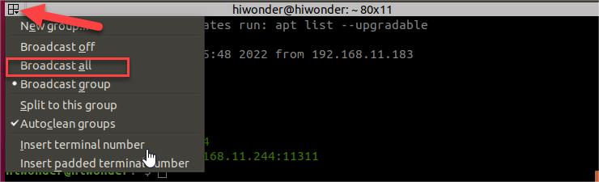

5. In the first split, enter the command to synchronize the time between the virtual machine and the connected robot using SSH. In the command, `"2022/12/6 19:42:7"` is a custom time, which can be set as needed.

```bash
sudo date -s "2022/12/6 19:42:7"
```

Once the synchronization is successful, input the command again to verify the synchronization.

```bash
date
```

6. After the synchronization, the app service for all three robots can be turned off in broadcast mode simultaneously by entering the command:

```bash
sudo systemctl stop start_app_node.service
```

7. Once the time synchronization is confirmed and the app service is closed, the broadcast mode can be turned off by selecting the appropriate option indicated in the figure below.


### 10.5.3 Enable Navigation Service

> [!NOTE]
> 
> **Commands must be entered with correct capitalization. The Tab key can be used to auto-complete keywords.**

1. Power on the robot. Once LED1 on the expansion board is solid, connect the robot to the computer using a USB data cable.

2. Follow the instructions in section [10.1.9 Configure Communication Between Virtual Machine and Robot](#anther10.1.9) to establish an SSH connection to both the leader and follower robots from the virtual machine.

3. Start the virtual machine node controller, open the command line terminal within the virtual machine, and enter the command to enable inter-node communication services.

```bash
roscore
```

4. Activate the navigation service for the leader robot (robot_1). In the connected command line, enter the command to enable the navigation service.

```bash
roscd multi/launch/multi_navigation && roslaunch master_node.launch map:=map_01
```

5. Next, activate the navigation service for the follower robot (robot_2). Wait for the leader robot service to fully start, then enter the command in the connected command line to activate the follower robot navigation service.

```bash
roscd multi/launch/multi_navigation && roslaunch slave_node.launch
```

6. View the navigation in RVIZ on the virtual machine. Enter the command and press **Enter** to launch the RVIZ tool.

```
roslaunch multi multi_navigation_rviz.launch
```

After starting navigation, the robot needs to be calibrated to the corresponding location on the real map. Refer to the next section for more details.

### 10.5.4 RVIZ Usage Instructions

RVIZ is a 3D visualization platform provided by ROS. It not only enables graphical display of external information but also allows the publication of control information to objects, providing a monitoring and control interface for the robot.

The table below explains the functions of the toolbar buttons:

<table>
<colgroup>
<col />
<col />
</colgroup>
<tbody>
<tr>
<td ><strong>Icon</strong></td>
<td ><strong>Function</strong></td>
</tr>
<tr>
<td ></td>
<td >Select a robot or a specific position to adjust orientation.</td>
</tr>
<tr>
<td ></td>
<td >After selecting this tool, hold the left mouse button and drag within the 3D view to adjust the camera angle.</td>
</tr>
<tr>
<td ></td>
<td >After selecting this tool, hold the left mouse button in the 3D view to draw a selection box around models.</td>
</tr>
<tr>
<td ></td>
<td >After selecting this tool, click anywhere in the 3D view to set that point as the map center.</td>
</tr>
<tr>
<td ></td>
<td >After selecting this tool, click once at the start point and once at the end point in the 3D view to measure the distance between the two points.</td>
</tr>
<tr>
<td ></td>
<td >
<p>Set the robot's position within the 3D view.</p>
<p>If the robot has moved and its actual position does not match the position in the 3D view, reset the robot's position to maintain accurate navigation.</p>
<p>After selecting this tool, hold at any point in the 3D view to choose a direction and release the left mouse button to set the robot's position.</p>
</td>
</tr>
<tr>
<td ></td>
<td >
<p>Set a single target point for the robot.</p>
<p>After selecting this tool, click anywhere within the map display to set a target point.</p>
<p>Once set, the robot will automatically generate a path and follow it to reach the target.</p>
</td>
</tr>
</tbody>
</table>


## 10.6 Multi-Robot Surrounding

Multi-robot surrounding allows one wireless controller to simultaneously control two robots for a surrounding performance.

In this case, `robot_1` is the leader, and `robot_2` is the follower.

### 10.6.1 Preparation

1) Prepare two or more robots.

2) Ensure the virtual machine needed for the task is ready.

3) Follow the steps in [10.1 Multi-Robot Communication Setup](#anther10.1) to understand the roles of the leader and follower robots and complete the necessary communication configurations.

4) Place the robot in the area where the map needs to be built. It is recommended to perform this indoors, as factors such as lighting and distance in outdoor environments may affect the mapping results.

5) Position the robots side by side on a wide platform. From the robot’s perspective, the leader robot should be on the right side, with the follower robot on the left, and the distance between them should be 0.5 meters.

### 10.6.2 Time Synchronization

Time synchronization is critical in a multi-robot system using ROS for group control. If the clocks are not synchronized, messages may be delivered incorrectly or processed out of order. After each reboot, the robot must confirm and perform the time synchronization process.

1. Start the virtual machine and click the icon  on the left to open a terminal.

2. Right-click the command bar to split the view.

3. Enter the SSH command in the first split, then connect the leader and follower robots by following the steps in section [10.1.9 Configure Communication Between Virtual Machine and Robot](#anther10.1.9). Then, enter the commands `ssh robot_1` and `ssh robot_2` respectively, and input the remote password **hiwonder** to establish the remote connection.

```bash
ssh robot_1
```

4. Next, open a new terminal in the virtual machine to facilitate time synchronization between the robot and the virtual machine. Select the top-left corner, click on the arrow to choose the option highlighted in the red box, and enable command broadcast mode across the two terminals, or three, if using three robots.


5. In the first split, enter the command to synchronize the time between the virtual machine and the connected robot using SSH. In the command, `"2022/12/6 19:42:7"` is a custom time, which can be set as needed.

```bash
sudo date -s "2022/12/6 19:42:7"
```

Once the synchronization is successful, input the command again to verify the synchronization.

```bash
date
```

6. After the synchronization, the app service for all three robots can be turned off in broadcast mode simultaneously by entering the command:

```bash
sudo systemctl stop start_app_node.service
```

7. Once the time synchronization is confirmed and the app service is closed, the broadcast mode can be turned off by selecting the appropriate option indicated in the figure below.


### 10.6.3 Enable Services

> [!NOTE]
> 
> **Commands must be entered with correct capitalization. The Tab key can be used to auto-complete keywords.**

1. Power on the robot. Once LED1 on the expansion board is solid, connect the robot to the computer using a USB data cable.

2. Follow the instructions in section [10.1.9 Configure Communication Between Virtual Machine and Robot](#anther10.1.9) to establish an SSH connection to both the leader and follower robots from the virtual machine.

3. Start the virtual machine node controller, open the command line, and enter the command to enable inter-node communication services.

```bash
roscore
```

4. Activate the surrounding service for the leader robot (robot_1). In the connected command line, enter the command to enable the surrounding service.

```bash
roscd multi/launch/multi_surround && roslaunch master_node.launch map:=map_01
```

5. Next, activate the surrounding service for the follower robot (robot_2). Wait for the leader robot service to fully start, then enter the command in the connected command line to activate the follower robot surrounding service.

```bash
roscd multi/launch/multi_surround && roslaunch slave_node.launch
```

6. View the surrounding effect in RVIZ on the virtual machine. Enter the command and press **Enter** to launch the RVIZ tool.

```bash
roslaunch multi multi_surround_rviz.launch
```