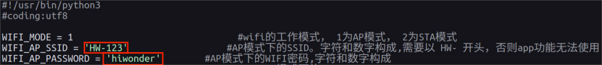
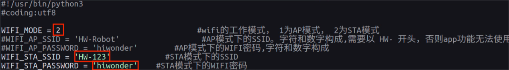
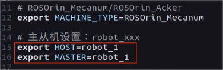
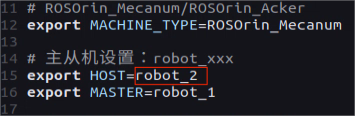

# 11\. Group Control

[TOC]


## 11.1 Leader-Follower Configuration

### 11.1.1 Preparation

1) Prepare at least two robots.

2) Refer to the section [7. Development Environment Setup](1_ROSOrin_User_Manual.html#development-environment-setup) in the user manual for instructions on downloading and installing the remote connection tool, NoMachine.

### 11.1.2 Working Principle

By configuring the leader and follower robots on the same network and utilizing different namespaces, the broadcast program sends speed commands to the follower robot, achieving group control.

### 11.1.3 Network Configuration

* **Configuring the Leader Device Network**

1) First, select one robot as the leader, power it on, and then remotely connect to its system desktop.

2. Open a terminal and input the following command to navigate to the directory where the file is located.

```bash
cd wifi_manager
```

3) Next, input the command below to open the Wi-Fi configuration file using the vim editor.

```bash
vim wifi_conf.py
```

4) Press the **i** key to enter the edit mode. Locate the two lines of code highlighted in the image below and modify the leader hotspot password.



5. Once the changes are complete, press the **Esc** key to exit the edit mode. Then input `:wq` to save the changes and exit.

```bash
:wq
```

6. Finally, input the command to reboot the leader device.

```bash
sudo reboot
```

7) After the leader device restarts, when reconnecting to the Wi-Fi, enter the Wi-Fi password **hiwonder**.

* **Configuring the Follower Device Network**

1) Power on the follower device and remotely connect to its system desktop.

2. Open a terminal and input the following command to navigate to the directory where the file is located.

```bash
cd wifi_manager
```

3) Next, input the command below to open the Wi-Fi configuration file using the vim editor.

```bash
vim wifi_conf.py
```

4) Press the **i** key to enter the edit mode, then modify the Wi-Fi name and password lines as shown in the image below. Locate the three highlighted lines of code.



Set the follower device's network mode to **2** for LAN mode. **HW-123** and **hiwonder** are the Wi-Fi name and password configured for the leader device network.

5. Once the changes are complete, press the **Esc** key to exit the edit mode. Then input the command to save and exit.

```bash
:wq
```

6) Finally, input the command to reboot the device. This step cannot be skipped!

```bash
sudo reboot
```

> [!NOTE]
> 
> * **When ROSOrin starts up in LAN mode, it will automatically search for the pre-configured network. During this process, LED2 on the expansion board will blink rapidly, indicating that the system is looking for the network. If no network is found after three consecutive search attempts, ROSOrin will automatically switch to direct connection mode, with LED2 blinking slowly.**
> 
> * **In the event that ROSOrin cannot find the network in LAN mode and switches to direct connection mode, the wifi_conf.py file will not be updated automatically. It will still contain the LAN configuration, and if not manually adjusted, ROSOrin will attempt to connect in LAN mode again on the next boot.**
> 
> * **Once the follower device is set to LAN mode, ensure that the leader device is powered on and its network is properly configured, so that its hotspot can be detected before the follower starts up. If the follower device fails to detect the leader's hotspot within a certain time frame, it will automatically switch to direct connection mode, which may prevent the leader and follower devices from establishing a network connection.**

### 11.1.4 Configuring Environment Variables

* **For Leader Device**

1) Select one ROSOrin as the leader device and power it on. Then, remotely connect to the desktop via NoMachine.

2) Click the terminal icon  in the system desktop to open a command-line window.

3) Ensure that the leader device has a USB receiver for the wireless controller connected.

4. Input the command to disable the auto-start feature and press **Enter**.

```bash
~/.stop_ros.sh
```

5. Input the command to open the file and configure the environment variables for the leader device.

```bash
vim /home/ubuntu/ros2_ws/.typerc
```

6) Press the **i** key to enter edit mode, then set both the leader and follower configurations, setting the leader device as `robot_1`.



7. Once the changes are complete, press the **Esc** key to exit the edit mode. Then input the command to save and exit.

```bash
:wq
```

8) Finally, input the following command to complete the leader device configuration.

```bash
source ~/.zshrc
```

* **For Follower Device**

1) First, connect to the Wi-Fi network created by the leader device on the app. Once connected, search for the follower device. The vehicle icon will appear in the app, and by long-pressing the screen, the follower device’s IP address will be displayed. Refer to the section [5.2.2 LAN Mode Connection (Optional)](1_ROSOrin_User_Manual.html#lan-mode-connection-optional)  in the user manual for guidance to use this IP address.

2) Click the terminal icon  on the system desktop to open a command-line window.

3. Input the command to disable the auto-start service and press **Enter**.

```bash
~/.stop_ros.sh
```

4. Input the command to open the file and configure the environment variables for the follower device.

```bash
vim /home/ubuntu/ros2_ws/.typerc
```

5) Press the **i** key to enter edit mode, then open the leader-follower settings and set the follower device's HOST variable to `robot_2`.



6. Once the changes are complete, press the **Esc** key to exit the edit mode. Then input the command to save and exit.

```bash
:wq
```

7) Finally, run the command to refresh the environment variables.

```bash
source ~/.zshrc
```


## 11.2 Group Control Start-up Steps and Operations

### 11.2.1 Synchronizing Time

1. On the leader device terminal, enter the command to check the current time.

```
date
```


2. Then, open the follower device and enter the command to synchronize the system time. Note: The time on the leader device should be used as the reference.

```
sudo date -s "2025-8-20 10:50:03"
```


> [!NOTE]
> 
> * **If there is a noticeable synchronization issue when controlling with the wireless controller later, it is likely due to the system time mismatch between the leader and follower devices. If this happens, return to this step to resynchronize.**
> 
> * **When using the date command to update the follower’s time with the leader’s time, the process will take some time to execute. As a result, by the time the time is updated on the follower device, the leader device’s actual time will have advanced slightly. To avoid errors during this operation, after getting the time from the leader device, use a stopwatch or manually track the seconds. The time entered into the follower device's terminal should be the leader device’s time plus the seconds counted on the stopwatch.**
> 
> * **After synchronizing the time on both the leader and follower devices, enter the date command on both terminals with a short interval between them, and check the system times displayed. If the difference is minimal, synchronization can be considered successful.**

### 11.2.2 Program Execution

1. On the leader device, open three terminals and enter the commands to run the following programs in sequence.

```bash
ros2 launch multi multi_controller.launch.py
```

```bash
python3 ros2_ws/src/multi/launch/joystick_control_multi.py
```

```bash
ros2 run joy joy_node
```

2. On the follower device, enter the command to execute the following program.

```bash
ros2 launch multi multi_controller.launch.py
```

> [!NOTE]
>
> **Each time the devices are powered on to run group control, ensure that the auto-start service is disabled on both the leader and follower devices, and that the system time is synchronized.**

### 11.2.3 Group Control Operation

1) Push the switch on the wireless controller to the **ON** position. At this point, both the red and green LEDs on the wireless controller will blink simultaneously.

2) Wait a few seconds for the robot and wireless controller to pair automatically. Once pairing is successful, the green LED will remain solid while the red LED turns off.

3) The wireless controller is now connected to the leader device. Press the **START** button, and both robots' buzzers will emit a beep sound.

> [!NOTE]
>
> **Gently pushing the joysticks in any direction allows low-speed movement.**

| Key                  | Function                                            | Description |
| -------------------- | --------------------------------------------------- | ----------- |
| START                | Stop and reset the robot                            | Press       |
| Left Joystick Up     | Move forward                                        | Push        |
| Left Joystick Down   | Move backward                                       | Push        |
| Left Joystick Left   | Strafe left for the Mecanum & differential chassis  | Push        |
| Left Joystick Right  | Strafe right for the Mecanum & differential chassis | Push        |
| Right Joystick Left  | Turn left                                           | Push        |
| Right Joystick Right | Turn right                                          | Push        |

