# 12\. ROS2-LiDAR Course

[TOC]


12.1 Introduction to LiDAR
---

### 12.1.1 Overview

LiDAR is a high-precision, high-speed remote sensing technology essential for mapping, autonomous driving, environmental perception, and robotic navigation. This document outlines LiDAR’s principles, key components, operation, applications, advantages, and future trends.

LiDAR plays a critical role in autonomous driving and intelligent transportation, enabling real-time detection of obstacles, pedestrians, and vehicles while providing precise distance and positional information. In robotic navigation and environmental perception, LiDAR provides accurate maps and detailed information about the surrounding environment. Additionally, LiDAR is widely used in 3D modeling and mapping, security monitoring, and remote sensing surveys.

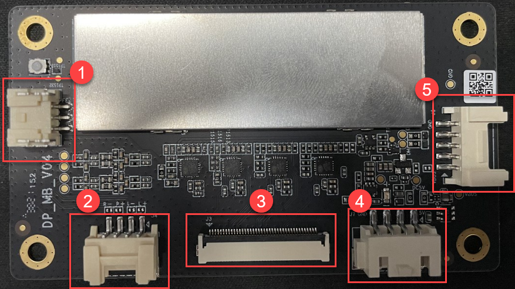

### 12.1.2 LiDAR Components and Classification

LiDAR consists of a laser emitter, receiver and photodetector, scanning mechanism, and angle resolution system. The laser emitter generates laser beams, the receiver and photodetector capture the reflected signals, the scanning mechanism scans the surrounding environment, and the angle resolution system determines the positions of target objects.

Based on the scanning method, LiDAR can be functionally classified into the following types:

1. Rotating LiDAR: Rotating LiDAR achieves full scanning in the horizontal direction by rotating the emitter or scanning mechanism. It typically provides high scanning speed and measurement accuracy, which are widely used in autonomous driving, 3D environmental modeling, and mapping.

2. Solid-State LiDAR: Solid-State LiDAR uses a solid-state laser emitter and requires no rotating components. It is typically more compact, lightweight, and energy-efficient, making it suitable for applications such as mobile devices, drones, and robots.

3. Mechanical LiDAR: Mechanical LiDAR uses mechanical components to achieve laser beam scanning, such as rotating mirrors or rotating prisms. It usually has a longer measurement range and higher measurement accuracy but a slower scanning speed. Mechanical LiDAR is widely used in fields such as terrain measurement, building scanning, and navigation.

4. Phase-Modulated LiDAR: Phase-Modulated LiDAR measures the distance between the target object and the radar by changing the phase of the laser beam. It usually features high measurement accuracy and a large measurement range, and is widely used in fields such as map making, surveying, and industrial applications.

5. Flash LiDAR: Flash LiDAR uses a single short high-power laser pulse to illuminate the entire scene at once, and the reflected light signals are captured by a receiver array. It offers the advantages of high speed and high resolution, making it suitable for applications such as rapid scene capture and motion tracking.

### 12.1.3 Switch the LiDAR Version

The robot can be equipped with various types of LiDAR, such as A1 and G4. To check the current LiDAR model or make a selection, follow the steps below:

1. Confirm the LiDAR version of the robot

The platform uses the MS200 LiDAR by default, which connects to the intelligent processor through a USB (URAT conversion) interface. It provides precise position information, supports a detection range of up to 15 m, and enables functions such as obstacle avoidance, following, SLAM, and navigation.

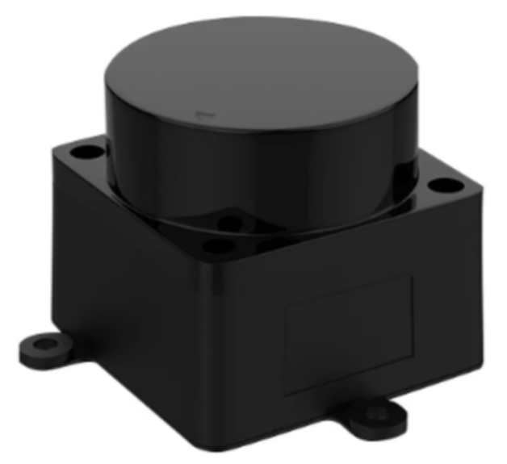

2. Power on the robot and connect it using a remote desktop tool. For detailed connection instructions, refer to section [1.7.2 AP Mode Connection Steps]() in the user manual.

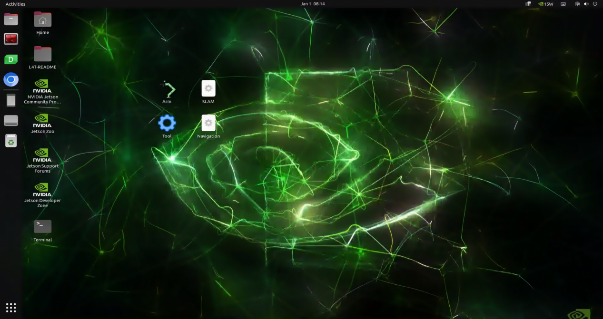

3. After the connection is complete, double-click the 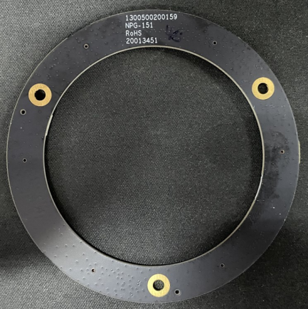 **Tool** icon on the desktop.

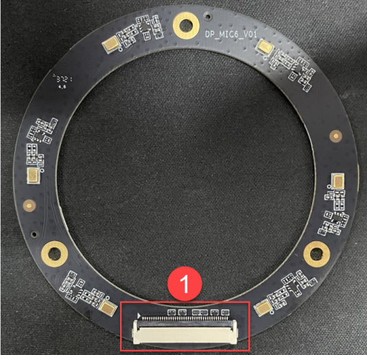

4. Click the dropdown button on the LiDAR tab, select the LiDAR model that matches the robot, such as **MS200**, then click **Save** and **Apply.**

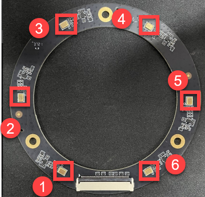

5. After the reboot is complete, click **Quit**.

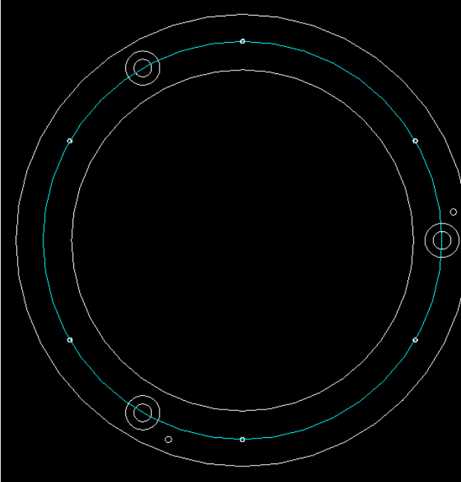

6. Once the switch is finished, click the command line terminal icon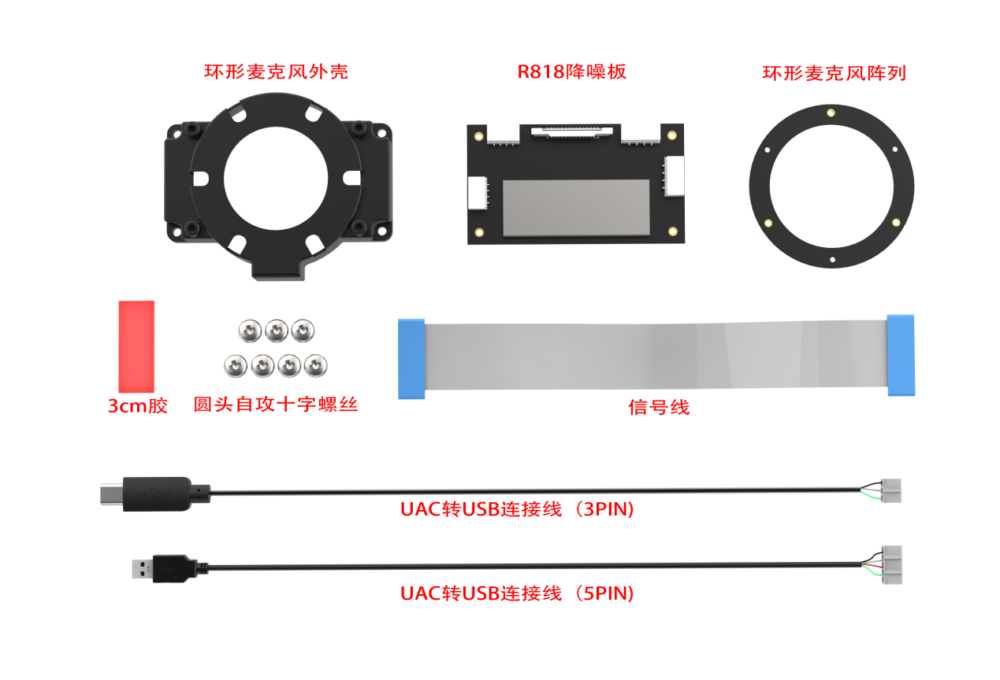 on the left side of the system desktop to confirm the LiDAR version.

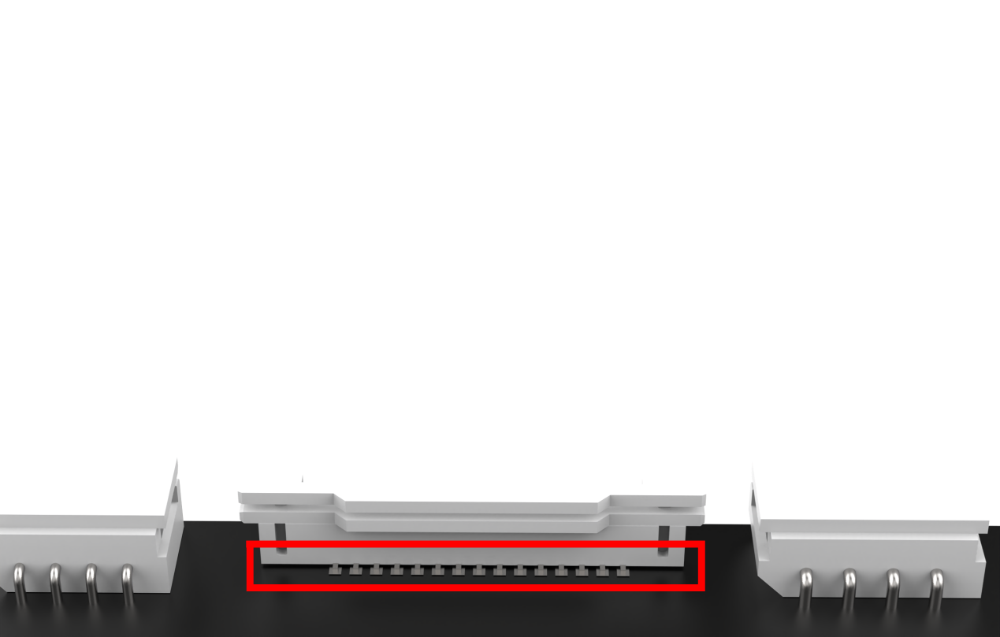


12.2 Working Principle and Distance Measurement Methods
---

### 12.2.1 LiDAR Distance Measurement

There are two common methods for LiDAR to measure the distance to a target: one is called triangulation, and the other is called Time of Flight (TOF).

For TOF, as illustrated below, the LiDAR emits light toward the object, which reflects directly back to the LiDAR. The LiDAR calculates the time taken for the light to return and multiplies it by the speed of light to determine the distance between the object and the LiDAR.

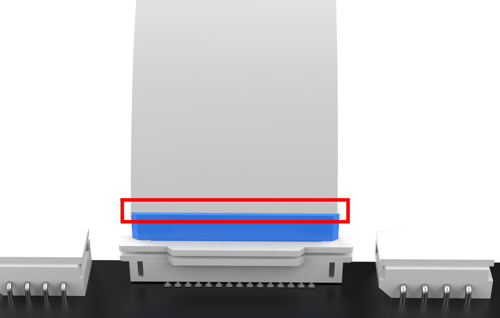

For triangulation, as shown below, during manufacturing, the LiDAR is adjusted so that the light does not directly hit the object but strikes at a fixed angle. This angle is preset and does not change during operation. Using trigonometric calculations with this angle, the distance from the object to the LiDAR can be determined.

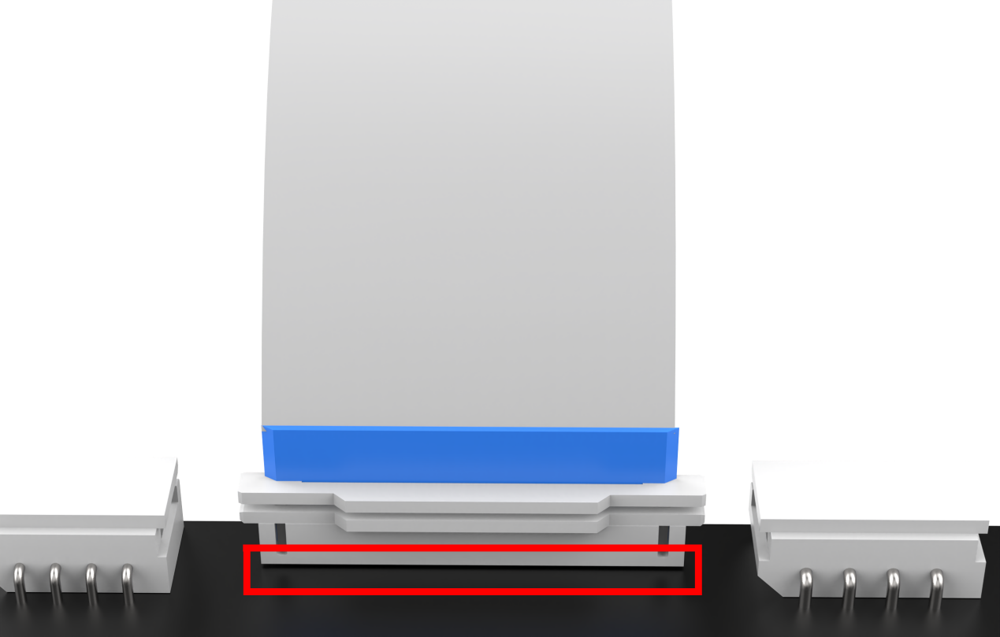

### 12.2.2 LiDAR Performance

As illustrated below, the LiDAR emits light that illuminates the surface of an object. When the LiDAR receives the light reflected from the object, it marks the outline of the object at the positions where the light struck.

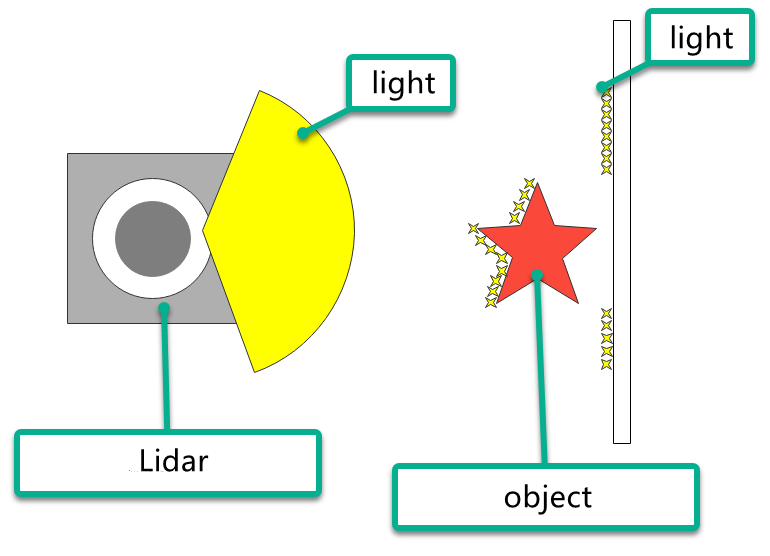


12.3 LiDAR Obstacle Avoidance
---

The robot will detect the distance between objects directly in front and its body, and will turn left or right to avoid obstacles based on the set distance. If no obstacles are encountered, it will continue moving forward.

There are two ways to enable this feature. The first is through the app, and the second is by using commands after connecting to the system remotely.

For instructions on using the app, refer to the section [1.5 App Installation and Connection]() in the user manual to view the related course.

1. Power on the robot and connect it to the remote control software NoMachine. For instructions on setting up the remote desktop connection, refer to the section [1.7.2 AP Mode Connection Steps]() in the user manual.

2. Click the terminal icon  in the system desktop to open a ROS1 command-line window.

3. Enter the following command and press **Enter** to stop the app auto-start service.

```bash
sudo systemctl stop start_app_node.service
```

4. Click the terminal icon 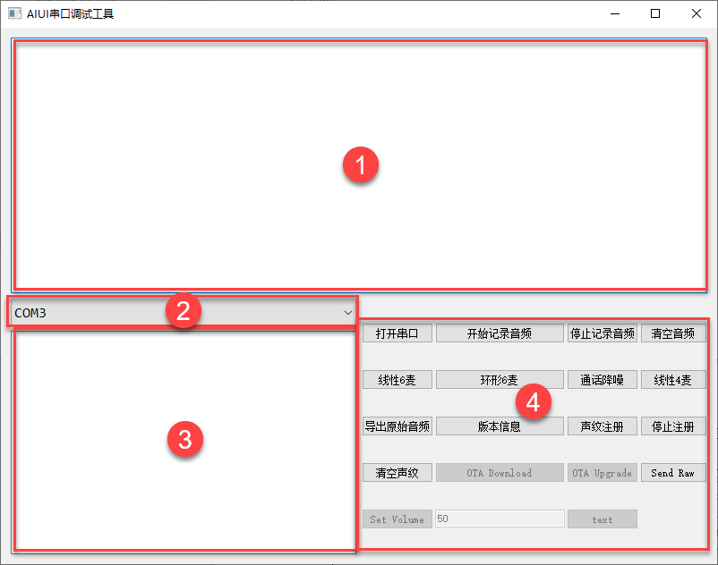 in the system desktop to open a ROS2 command-line window.

5. Next, enter the command and press **Enter** to activate the robot's auto-start program:

```bash
ros2 launch app lidar_node.launch.py debug:=true
```

6. Open another ROS2 command-line terminal, enter the command, and press **Enter** to access the LiDAR feature:

```bash
ros2 service call /lidar_app/enter std_srvs/srv/Trigger {}
```

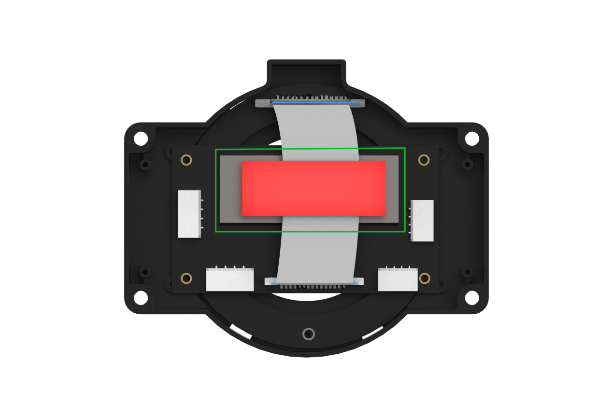

7. Next, enter the command in the current command line terminal and press **Enter** to activate the LiDAR obstacle avoidance feature:

```bash
ros2 service call /lidar_app/set_running interfaces/srv/SetInt64 "{data: 1}"
```

8. To stop the current function, enter the command in the current command line terminal and press **Enter** to execute.

```bash
ros2 service call /lidar_app/set_running interfaces/srv/SetInt64 "{data: 0}"
```

9. To exit the feature completely, press **Ctrl+C** in the terminal used in steps 4 or 5.


12.4 LiDAR Following
---

The robot detects the distance between objects in front and its body. When an obstacle is too close, the robot will perform a turning action to avoid the obstacle.

There are two ways to enable this feature. The first is through the app, and the second is by using commands after connecting to the system remotely.

For instructions on using the app, refer to the section [1.5 App Installation and Connection]() in the user manual to view the related course.

1. Power on the robot and connect it to the remote control software NoMachine. For instructions on setting up the remote desktop connection, refer to the section [1.7.2 AP Mode Connection Steps]() in the user manual.

2. Click the terminal icon  in the system desktop to open a ROS1 command-line window.

3. Enter the following command and press **Enter** to stop the app auto-start service.

```bash
sudo systemctl stop start_app_node.service
```

4. Click the terminal icon  in the system desktop to open a ROS2 command-line window.

5. Enter the command and press **Enter** to start the local services for the app features and chassis control.

```bash
ros2 launch app lidar_node.launch.py debug:=true
```

6. Open a new ROS2 command-line terminal, enter the command, and press **Enter** to access the LiDAR feature:

```bash
ros2 service call /lidar_app/enter std_srvs/srv/Trigger {}
```


7. Next, enter the command in the current command line terminal and press **Enter** to activate the LiDAR following feature:

```bash
ros2 service call /lidar_app/set_running interfaces/srv/SetInt64 "{data: 2}"
```

8. To stop the current function, enter the command in the current command line terminal and press **Enter** to execute.

```bash
ros2 service call /lidar_app/set_running interfaces/srv/SetInt64 "{data: 0}"
```

9. To exit the feature completely, press **Ctrl+C** in the terminal used in steps 4 or 5.


12.5 LiDAR Guarding
---

The robot detects the distance between objects in front and its body. When an obstacle is too close, the robot will perform a turning action to avoid the obstacle.

There are two ways to enable this feature. The first is through the app, and the second is by using commands after connecting to the system remotely.

For instructions on using the app, refer to the section [1.5 App Installation and Connection]() in the user manual to view the related course.

This feature is only available for the robot with Mecanum chassis.

1. Power on the robot and connect it to the remote control software NoMachine. For instructions on setting up the remote desktop connection, refer to the section [1.7.2 AP Mode Connection Steps]() in the user manual.

2. Click the terminal icon  in the system desktop to open a ROS1 command-line window.

3. Enter the following command and press **Enter** to stop the app auto-start service.

```bash
sudo systemctl stop start_app_node.service
```

4. Click the terminal icon  in the system desktop to open a ROS2 command-line window.

5. Enter the command and press **Enter** to start the local services for the app features and chassis control.

```bash
ros2 launch app lidar_node.launch.py debug:=true
```

6. Open a new ROS2 command-line terminal, enter the command, and press **Enter** to access the LiDAR feature:

```bash
ros2 service call /lidar_app/enter std_srvs/srv/Trigger {}
```


7. Next, enter the command in the current command line terminal and press **Enter** to activate the LiDAR guarding feature:

```bash
ros2 service call /lidar_app/set_running interfaces/srv/SetInt64 "{data: 3}"
```

8. To stop the current function, enter the command in the current command line terminal and press **Enter** to execute.

```bash
ros2 service call /lidar_app/set_running interfaces/srv/SetInt64 "{data: 0}"
```

9. To exit the feature completely, press **Ctrl+C** in the terminal used in steps 4 or 5.