# 14\. ROS2-Mapping \& Navigation Course

## 14.1 Mapping Tutorial

### 14.1.1 Introduction and Getting Started with URDF Model

#### 14.1.1.1 URDF Model Introduction

URDF is a format based on the XML specification, designed for describing the structure of robots. Its purpose is to provide a robot description standard that is as general and widely applicable as possible.

Robots are typically composed of multiple links and joints. A link is defined as a rigid object with certain physical properties, while a joint connects two links and constrains their relative motion.

By connecting links with joints and imposing motion restrictions, a kinematic model is formed. The URDF file specifies the relationships between joints and links, their inertial properties, geometric characteristics, and collision models.

#### 14.1.1.2 Comparison between Xacro and URDF Model

The URDF model serves as a description file for simple robot models, offering a clear and easily understandable structure. However, when it comes to describing complex robot structures, using URDF alone can result in lengthy and unclear descriptions.

To address this limitation, the xacro model extends the capabilities of URDF while maintaining its core features. The Xacro format provides a more advanced approach to describing robot structures. It greatly improves code reusability and helps avoid excessive description length.

For instance, when describing the two legs of a humanoid robot, the URDF model would require separate descriptions for each leg. On the other hand, the Xacro model allows for describing a single leg and reusing that description for the other leg, resulting in a more concise and efficient representation.

#### 14.1.1.3 URDF Model Basic Syntax

<p id ="p14-1-1-3"></p>

* **XML Basic Syntax**

Since URDF models are written based on the XML specification, it is necessary to understand the basic structure of the XML format.

1. Elements:

An element can be defined as desired using the following formula:

\<Element>

\</Element>

2. Properties:

Properties are included within elements to define characteristics and parameters. Please refer to the following formula to define an element with properties:

\<Element attribute_1="value1" attribute_2="value2">

\</Element>

3. Comments:

Comments have no impact on the definition of other properties and elements. Please use the following formula to define a comment:

<！ \-- Comment content \-->

* **Link**

The Link element describes the visual and physical properties of the robot's rigid component. The following tags are commonly used to define the motion of a link:


\<visual>: Describe the appearance of the link, such as size, color, and shape.

\<inertial>: Describe the inertia parameters of the link, which will be used in the dynamics calculation.

\<collision>: Defines the collision properties of the link.

Each tag contains its own child elements and serves different purposes. Refer to the table below for details.

| **Tag**| **Function**|
|----------|----------|
| origin| Describe the pose of the link. It contains two parameters, including xyz and rpy. xyz describes the pose of the link in the simulated map. rpy describes the pose of the link in the simulated map.|
| mess| Describe the mass of the link.|
| inertia| Describe the inertia of the link. As the inertia matrix is symmetrical, these six parameters need to be input, ixx, ixy, ixz, iyy, iyz, and izz, as properties. These parameters can be calculated.|
| geometry| Describe the shape of the link. It uses mesh parameter to load texture file, and employs filename parameters to load the path for texture file. It has three child tags, namely box, cylinder and sphere, representing rectangles, cylinders and spheres.|
| material| Describe the material of the link. The parameter name is the required filed. The tag color can be used to change the color and transparency of the link.|

* **Joint**

In a URDF model, a joint is represented by the **joint** tag. It describes the kinematic and dynamic properties of the robot joint, including motion type, as well as position and velocity limits. According to the type of motion, joints in a URDF model can be categorized into six types:

| **Type and Explanation**| **Tag**|
|----------|----------|
| Rotational joint: can rotate infinitely around a single axis| continuous|
| Rotational joint: similar to continuous, but with rotation angle limits| revolute|
| Prismatic joint: allows translation along an axis, with position limits| prismatic|
| Planar joint: allows translation or rotation in orthogonal directions within a plane| planar|
| Floating joint: allows both translation and rotation| floating|
| Fixed joint: a special joint that does not allow any motion| fixed|

When defining joint behavior, the following tags are commonly used:


\<parent_link>: Specifies the parent link.

\<child_link>: Specifies the child link.

\<calibration>: Used to calibrate the joint angle.

\<dynamics>: Describes certain physical properties of the motion.

\<limit>: Defines motion constraints.

Each tag contains its own child elements and serves different purposes. Refer to the table below for details.

| **Tag**| **Function**|
|----------|----------|
| origin| Describes the pose of the parent link. It contains two parameters, including xyz and rpy. xyz describes the pose of the link in the simulated map. rpy describes the pose of the link in the simulated map.|
| axis| Specifies the axis of rotation or translation along the parent link’s X, Y, or Z axis.|
| limit| Defines motion constraints for the child link. lower and upper attributes specify the range of motion in radians for revolute joints, while the effort attribute specifies the force/torque limit during motion, with both positive and negative values measured in newtons (N). The velocity attribute limits the rotational speed, measured in meters per second (m/s).|
| mimic| Indicates that this joint’s motion is dependent on another joint.|
| safety_controller| Defines safety parameters that protect the joint from exceeding safe motion limits.|

* **robot Tag**

The top-level tag of a complete robot is \<robot>. All \<link> and \<joint> tags must be included within \<robot>, as shown below:


* **Gazebo Tag**

Used with the Gazebo simulator, this tag allows configuration of simulation parameters, including Gazebo plugins and physical property settings.


* **Creating a Simple URDF Model**

1. Name the model of the robot

To start writing the URDF model, we need to set the name of the robot following this format: **\<robot name=“robot model name”>**. Lastly, input **\</robot>** at the end to represent that the model is written successfully.


2. Set links

(1) To write the first link and use indentation to indicate that it is part of the currently set model. Set the name of the link using the following format: **\<link name=“Link_Name">**. Finally, conclude with **\</link>** to indicate the successful completion of the link definition.


(2)When writing the link description, use indentation to indicate that the description belongs to the current link. Start the description with **\<visual>** and end it with **\</visual>**.


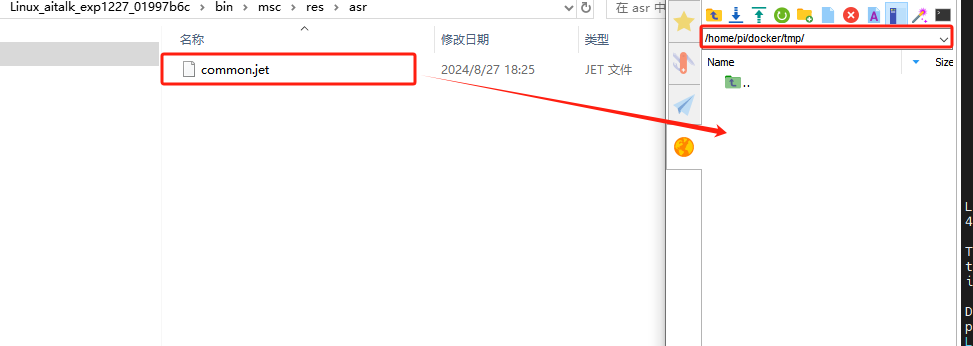

(3) The **\<geometry>** tag is employed to define the shape of a link. Once the description is complete, include **\</geometry>**. Within the tag, indentation is used to specify the detailed description of the link's shape. The code below shows the shape of a link: **\<cylinder&nbsp;length=“0.01”&nbsp;radius=“0.2”/>**. Here, length="0.01" indicates that the link is 0.01 meters long, and radius="0.2" indicates that the link has a radius of 0.2 meters, forming a cylinder.


(4) The **\<origin>** tag is utilized to specify the position of a link, with indentation used to indicate the detailed description of the link's position. The following example demonstrates the position of a link: **\<origin rpy="0 0 0" xyz="0 0 0" />**. In this example, "rpy" represents the angles of the link, while "xyz" represents the coordinates of the link's position. This example places the link at the origin of the coordinate system.

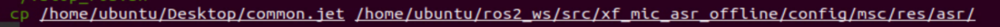

(5) The **\<material>** tag is used to define the visual appearance of a link, with indentation used to specify the detailed description of the link's color. To start describing the color, include **\<material>**, and end with **\</material>** when the description is complete. The following example demonstrates setting a link color to yellow: **\<color rgba="1 1 0 1" />**. In this example, rgba="1 1 0 1" represents the color threshold for achieving the set color.


3. Set Joint

(1) To define the first joint, use indentation to indicate that the joint belongs to the current model being set. Then, specify the name and type of the joint as follows: **\<joint name="Joint_Name" type="Joint_Type">**. Finally, include **\</joint>** to indicate the completion of the joint definition.


(2) Define the parent and child links of the joint. Indent the contents to show that this description belongs to the current joint. Set the \`parent\` and \`child\` parameters as follows: using the following format: **\<parent link="parent link"/>** and **\<child link="child link" />**. When the joint rotates, the parent link serves as the pivot, and the child link rotates relative to it.


(3) **\<origin>** describes the position of the joint, with indentation used to specify the detailed coordinates of the joint. The image below describes the position of the joint: **\<origin xyz=“0 0 0.1” />**. xyz is the coordinate of the joint, indicating that the joint is located at x=0, y=0, z=0.1 in the coordinate system.


(4) **\<axis>** describes the orientation of the joint, with indentation used to specify its precise posture. The figure below shows the posture of a joint **\<axis xyz="0 0 1" />**, where xyz defines the orientation of the joint.

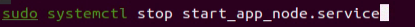

(5) **\<limit>** is used to restrict joint motion, with indentation applied to specify detailed angle constraints. The code below shows a joint whose maximum torque does not exceed 300 N, with an upper rotation limit of 3.14 radians and a lower limit of -3.14 radians. These limits are defined according to the following formula: effort = **joint torque (N)**, velocity = **joint speed**, lower = **lower bound of the rotation angle (radians)**, upper = **upper bound of the rotation angle (radians)**.

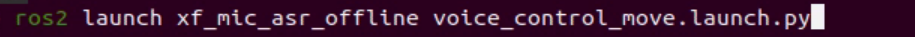

(6) **\<dynamics>** describes the dynamic properties of the joint, with indentation used to specify detailed motion parameters. The figure below shows an example of a joint’s dynamics parameters: **\<dynamics damping="50" friction="1" />** where damping specifies the **damping value**, and friction specifies the **friction coefficient**.


The complete code is as follows:

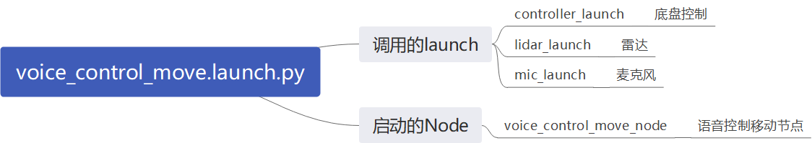


### 14.1.2 ROS Robot URDF Model Instructions

#### 14.1.2.1 Preparation

To understand the URDF model, refer to section [14.1.1.3 URDF Model Basic Syntax](#p14-1-1-3) in this file for related syntax. This section provides a brief analysis of the robot model code and component models.

#### 14.1.2.2 Viewing the Robot Model Code

1. Power on the robot and connect it to the remote control software NoMachine. For instructions on setting up the remote desktop connection, refer to the section [1.7.2 AP Mode Connection Steps](https://wiki.hiwonder.com/projects/ROSOrin/en/jetson-nano/docs/1_ROSOrin_User_Manual.html#ap-mode-connection-steps) in the user manual.

2. Click the terminal icon  in the system desktop to open a ROS1 command-line terminal.

3. Enter the following command and press **Enter** to stop the app auto-start service.

```bash
sudo systemctl stop start_app_node.service
```

4. Enter the following command to open the robot simulation model folder.

```bash
cd ~/ros2_ws/src/simulations/rosorin_description/urdf
```

5. Use the cat command to view the robot's description file:

```bash
cat rosorin.xacro
```

6. The robot's relevant descriptions are as follows:

(1) `base_link`: The base coordinate joint of the robot, used to connect the various hardware URDF joints on the robot.

(2) `lidar_frame`: The LiDAR joint.

(3) `left_front_wheel_link`: The left front wheel joint.

(4) `left_back_wheel_link`: The left rear wheel joint.

(5) `right_front_wheel_link`: The right front wheel joint.

(6) `right_back_wheel_link`: The right rear wheel joint.

(7) `mic_link`: The voice device joint description.


### 14.1.3 SLAM Map Construction Principle

#### 14.1.3.1Introduction to SLAM

Take humans as an example: before reaching a destination, one needs to know their current position, whether or not a map is available. Humans rely on their eyes, whereas robots rely on LiDAR. SLAM refers to simultaneous localization and mapping.

Localization determines the robot’s pose within a coordinate system. The origin and orientation of the coordinate system can be obtained from the first keyframe, an existing global map or landmarks, or GPS.

Mapping refers to creating a map of the environment perceived by the robot, where the basic geometric elements of the map are points. The primary purpose of the map is for localization and navigation. Navigation can be divided into guiding and moving: guiding includes global and local path planning, while moving refers to controlling the robot’s motion according to the planned path.

#### 14.1.3.2 SLAM Mapping Principles

SLAM mapping mainly involves the following three processes:

1. **Preprocessing:** Optimize the raw point cloud data from the LiDAR, remove problematic data, or apply filtering.

Using laser as the signal source, pulses emitted by the LiDAR hit surrounding obstacles, causing scattering.

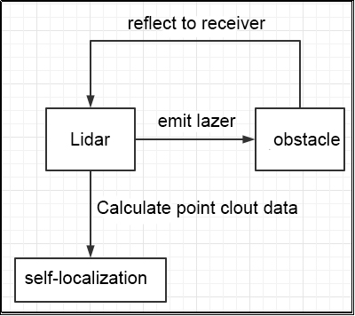

Part of the reflected light returns to the LiDAR receiver. Using the laser ranging principle, the distance from the LiDAR to the target point can be calculated.

Regarding point clouds: Simply put, the information captured by the LiDAR about the surrounding environment is called the point cloud. It represents the part of the environment that the robot’s “eyes” can see. The captured object information is presented as a series of discrete points with precise angles and distances.

2. **Matching:** Match the current local point cloud data to the existing map to find the corresponding position.

Typically, a LiDAR SLAM system compares point clouds captured at different times to calculate the LiDAR’s relative movement and pose change, thereby completing the robot’s localization.

3. **Map fusion:** Merge the new data from the LiDAR into the existing map, updating the map continuously.

#### 14.1.3.3 Mapping Guidelines

1. When constructing the map at startup, it is best for the robot to face a straight wall, or use a closed cardboard box instead, so that the LiDAR can capture as many points as possible.

2. Try to ensure the completeness of the map. For all 360° areas surrounding the robot along its possible paths, the LiDAR needs to scan them to increase map integrity.

3. In wide or open spaces, it is best to first let the robot close the mapping loop before proceeding to scan smaller details, which improves accuracy and consistency in the final map.

#### 14.1.3.4 Map Evaluation Criteria

After the map construction is complete, the results can be evaluated using the following items:

1. Whether the edges of obstacles in the map are clear;

2. Whether there are areas in the map that do not match the actual environment, such as closed loops.

3. Whether there are gray areas in the map within the robot's operating range, indicating areas not scanned.

4. Whether there are obstacles in the map that will no longer exist during subsequent localization, such as moving obstacles.

5. Confirm that, within the robot’s working area, the LiDAR has scanned the full 360° field of view from every position.


### 14.1.4 SLAM Toolbox Mapping Algorithm

#### 14.1.4.1 Algorithm Overview

The Slam Toolbox package combines data from the LiDAR using LaserScan messages and applies a TF transformation from the odom frame to the base_link frame, creating a 2D spatial map. This package allows full serialization of SLAM map data and pose graphs, enabling reloading for continuous mapping, localization, merging, or other operations. Slam Toolbox can operate in both synchronous mode to process all valid sensor measurements even if delayed, and asynchronous mode to process valid sensor measurements whenever possible.

Built on top of the powerful Karto scan matcher, which has been widely used and optimized for speed, SLAM Toolbox serves as a feature-complete SLAM system in ROS, replacing packages such as gmapping, cartographer, karto, and hector. It also integrates a Google Ceres–based optimization plugin and a novel method called Elastic Pose-Graph Localization, which uses a sliding measurement window for optimization. This allows the system to track local environmental changes rather than treating them as errors, and to remove redundant nodes once the robot leaves an area, without affecting the long-term map.

Slam Toolbox is a suite of tools for 2D SLAM. Its main features include:

1. Create maps and save them as .pgm files.
2. Refine maps, rebuild them, or continue mapping on an existing saved map.
3. Long-term mapping: Load a saved map, continue mapping, and remove irrelevant data from new laser point clouds
4. Improve localization using previously built maps. Run in localization mode using “laser odometry,” without requiring map building.
5. Synchronous and asynchronous mapping.
6. Dynamic map merging.
7. Plugin-based optimization solvers, including a new Google Ceres–based optimization plugin.
8. Interactive RViz plugin.
9. Provides graphical tools to manipulate nodes and connections during mapping.
10. Map serialization and lossless data storage.

**KARTO**

Karto_SLAM is based on the concept of graph optimization, using highly optimized and non-iterative Cholesky decomposition to decouple sparse systems as a solution. The graph optimization method represents the map using the mean of the graph, where each node represents a position point in the robot's trajectory and a set of sensor measurements. Each new node added triggers a computational update.

The ROS version of Karto_SLAM employs Sparse Pose Adjustment (SPA) related to scan matching and loop closure detection. The more landmarks there are, the higher the memory requirement. However, compared to other methods, the graph optimization approach has greater advantages in large environments because it only includes the robot pose in the graph. After obtaining the poses, the map is generated.

Karto SLAM algorithm framework:


As shown in the figure above, the workflow of Karto SLAM is relatively straightforward. It follows the traditional soft real-time mechanism of SLAM: each incoming frame of data is processed immediately and then returned.


- **KartoSLAM related source code and WIKI address:**

- **KartoSLAM ROS Wiki: *http://wiki.ros.org/slam_karto***

- **slam_karto software package: *https://github.com/ros-perception/slam_karto***

- **open_karto Open-Source Algorithm: *https://github.com/ros-perception/open_karto***

#### 14.1.4.2 Mapping Steps

1. Power on the robot and connect it to the remote control software NoMachine. For instructions on setting up the remote desktop connection, refer to the section [1.7.2 AP Mode Connection Steps](https://wiki.hiwonder.com/projects/ROSOrin/en/jetson-nano/docs/1_ROSOrin_User_Manual.html#ap-mode-connection-steps) in the user manual.

2. Click the terminal icon  in the system desktop to open a ROS1 command-line terminal.

3. Enter the command to disable the app auto-start service.

```bash
sudo systemctl stop start_app_node.service
```

4. Click the icon  on the system desktop to open a new ROS2 command line terminal. Enter the command to start mapping:

```bash
ros2 launch slam slam.launch.py
```

5. Open a new ROS2 command line terminal and enter the command to launch RViz and display the mapping effect:

```bash
ros2 launch slam rviz_slam.launch.py
```

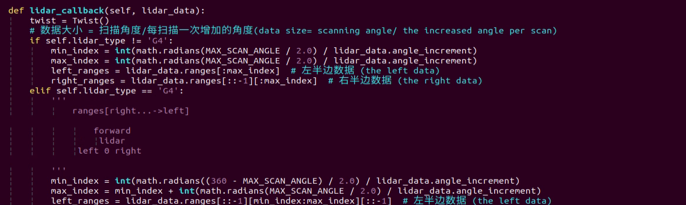

6. Open a new ROS2 command line terminal, then enter the command to start the keyboard control node and press **Enter**:

```bash
ros2 launch peripherals teleop_key_control.launch.py
```

If the prompt shown below appears, the keyboard control service has started successfully.

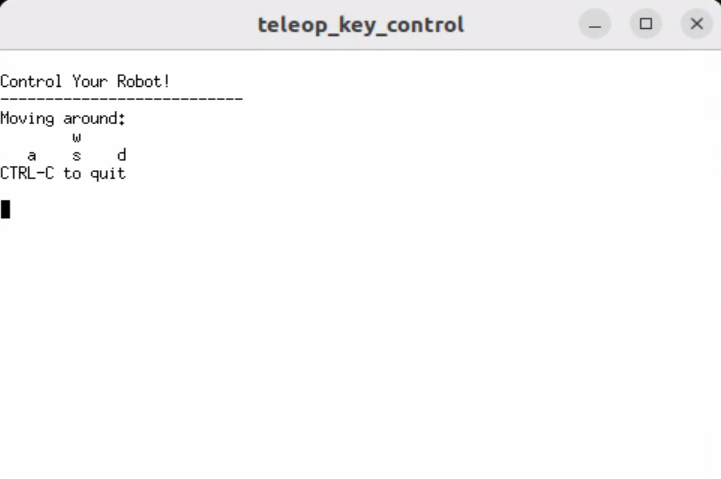

7. Control the robot to move within the current environment to build a more complete map. The table below shows the keyboard keys and their corresponding functions for controlling the robot's movement during mapping:

| **Keyboard Key**| **Robot Action**|
|----------|----------|
| W| Short press to switch to forward state, then the robot will keep moving forward.|
| S| Short press to switch to backward state, then the robot will keep moving backward.|
| A| Long press to interrupt forward or backward state and turn left.|
| D| Long press to interrupt forward or backward state and rotate clockwise in place.|

#### 14.1.4.3 Save the Map

1. Click the terminal icon  in the system desktop to open a ROS2 command-line window.

2. Save the map by entering the following command and pressing Enter:

```bash
cd ~/ros2_ws/src/slam/maps && ros2 run nav2_map_server map_saver_cli -f "map_01" --ros-args -p map_subscribe_transient_local:=true
```

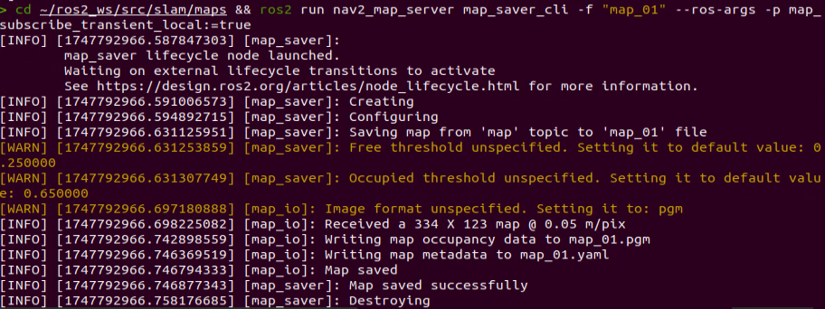

The prompt message shown in the image confirms that the map has been saved successfully.

#### 14.1.4.4 Exiting Mapping

1. Click the terminal icon  in the system desktop to open a ROS2 command-line window.

2. Then, enter the command and press **Enter** to execute the program for all ROS nodes in the current system environment. If it doesn’t close successfully, the command can be executed multiple times.

```bash
~/.stop_ros.sh
```

#### 14.1.4.5 Optimization

For more accurate mapping, the odometry can be optimized. Odometry is required for robot mapping, and odometry relies on the IMU.

The robot is preloaded with calibrated IMU data, which allows it to perform mapping and navigation normally. However, the IMU can still be recalibrated to achieve higher precision. For IMU calibration methods and steps, refer to section [11.1.1 IMU Calibration](https://wiki.hiwonder.com/projects/ROSOrin/en/jetson-nano/docs/11_ROS2_Chassis_Motion_Control_Course.html#imu-calibration) in the **11. ROS2-Chassis Motion Control Course**.

#### 14.1.4.6 Parameter Description

The parameter file can be found at: **~/ros2_ws/src/slam/config/slam.yaml**.

For detailed explanations about the parameters, please refer to the official documentation: https://wiki.ros.org/slam_toolbox.

#### 14.1.4.7 Launch File Analysis

The launch file is located at: **/home/ubuntu/ros2_ws/src/slam/launch/slam.launch.py**.

- **Import Libraries**

Detailed explanations for launch library can be found in the official ROS documentation: https://docs.ros.org/en/humble/How-To-Guides/Launching-composable-nodes.html.

```python
import os
from ament_index_python.packages import get_package_share_directory

from launch_ros.actions import PushRosNamespace
from launch import LaunchDescription, LaunchService
from launch.substitutions import LaunchConfiguration
from launch.launch_description_sources import PythonLaunchDescriptionSource
from launch.actions import DeclareLaunchArgument, IncludeLaunchDescription, GroupAction, OpaqueFunction, TimerAction
```

- **Setting Paths**

The slam package path is obtained using `get_package_share_directory`.

```python
    if compiled == 'True':
        slam_package_path = get_package_share_directory('slam')
    else:
        slam_package_path = '/home/ubuntu/ros2_ws/src/slam'
```

- **Starting Other Launch Files**

```python
    base_launch = IncludeLaunchDescription(
        PythonLaunchDescriptionSource(
            os.path.join(slam_package_path, 'launch/include/robot.launch.py')),
        launch_arguments={
            'sim': sim,
            'master_name': master_name,
            'robot_name': robot_name
        }.items(),
    )

    slam_launch = IncludeLaunchDescription(
        PythonLaunchDescriptionSource(
            os.path.join(slam_package_path, 'launch/include/slam_base.launch.py')),
        launch_arguments={
            'use_sim_time': use_sim_time,
            'map_frame': map_frame,
            'odom_frame': odom_frame,
            'base_frame': base_frame,
            'scan_topic': f'{frame_prefix}scan_raw',  # Using scan_raw topic
            'enable_save': enable_save
        }.items(),
    )

    if slam_method == 'slam_toolbox':
        bringup_launch = GroupAction(
            actions=[
                PushRosNamespace(robot_name),
                base_launch,
                TimerAction(
                    period=10.0,
                    actions=[slam_launch],
                ),
            ]
        )

    return [sim_arg, master_name_arg, robot_name_arg, slam_method_arg, bringup_launch]
```

`base_launch` is the hardware launch files required by the program to start.

`slam_launch` is the base launch file for mapping.

`bringup_launch` is the launch file for the initial pose.


### 14.1.5 RTAB-VSLAM 3D Mapping

<p id ="p14-1-5"></p>

#### 14.1.5.1 Introduction to RTAB-VSLAM

RTAB-VSLAM is a real-time, appearance-based 3D mapping system. It is an open-source library that implements loop closure detection through memory management methods. By limiting map size, it ensures that loop closure detection is always processed within a fixed time frame, thereby meeting the requirements for long-term and large-scale online mapping.

#### 14.1.5.2 RTAB-VSLAM Principles

RTAB-VSLAM 3D mapping uses a feature-based mapping method. Its advantage lies in the abundance of feature points available in most environments, providing good scene adaptability and enabling relocalization using feature points. However, it has several drawbacks: feature point extraction is time-consuming, feature points utilize limited information, losing most of the image details, the method becomes ineffective in weak-texture areas, and feature matching is prone to mismatches, which can significantly affect the results.

After extracting image features, features from different time frames are matched to form a loop closure detection. Once matching is completed, data are categorized into two types — long-term memory data and short-term memory data. Long-term memory data are used for matching future data, while short-term memory data are used for matching temporally continuous data.

During operation, the RTAB-VSLAM algorithm first uses short-term memory data to update pose estimation and mapping. When future data can be matched with long-term memory data, the corresponding long-term memory data are incorporated into short-term memory to further update pose and mapping.

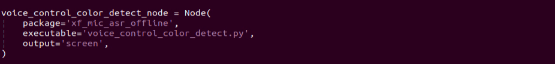

**RTAB-VSLAM software resources: *https://github.com/introlab/rtabmap*.**

#### 14.1.5.3 3D Mapping Steps

1. Power on the robot and connect it to the remote control software NoMachine. For instructions on setting up the remote desktop connection, refer to the section [1.7.2 AP Mode Connection Steps](https://wiki.hiwonder.com/projects/ROSOrin/en/jetson-nano/docs/1_ROSOrin_User_Manual.html#ap-mode-connection-steps) in the user manual.

2. Click the icon  on the system desktop to open a ROS1 command line terminal. Enter the command to disable the app’s auto-start service:

```bash
sudo systemctl stop start_app_node.service
```

3. Click the icon  on the system desktop to open a new ROS2 command line terminal. Enter the command to start mapping:

```bash
ros2 launch slam rtabmap_slam.launch.py
```

4. Open a new ROS2 command line terminal and enter the command to launch RViz and display the mapping effect:

```bash
ros2 launch slam rviz_rtabmap.launch.py
```

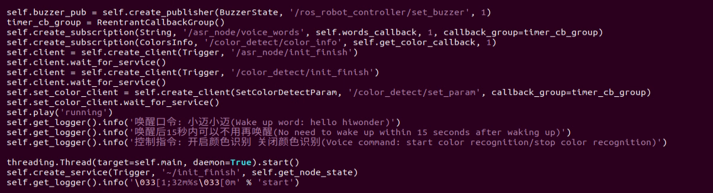

5. Open a new ROS2 command line terminal, then enter the command to start the keyboard control node and press **Enter**:

```bash
ros2 launch peripherals teleop_key_control.launch.py
```

If the prompt shown below appears, the keyboard control service has started successfully.


6. Control the robot to move within the current environment to build a more complete map. The table below shows the keyboard keys and their corresponding functions for controlling the robot's movement during mapping:

| **Keyboard Key**| **Robot Action**|
|----------|----------|
| W| Short press to switch to forward state, then the robot will keep moving forward.|
| S| Short press to switch to backward state, then the robot will keep moving backward.|
| A| Long press to interrupt forward or backward state and turn left.|
| D| Long press to interrupt forward or backward state and rotate clockwise in place.|

When using the keyboard to move the robot for mapping, you can reduce the robot’s speed. A slower speed results in smaller relative odometry errors and better mapping accuracy. As the robot moves, the map displayed in RVIZ will continue to expand until the entire environment is fully mapped.

#### 14.1.5.4 Save the Map

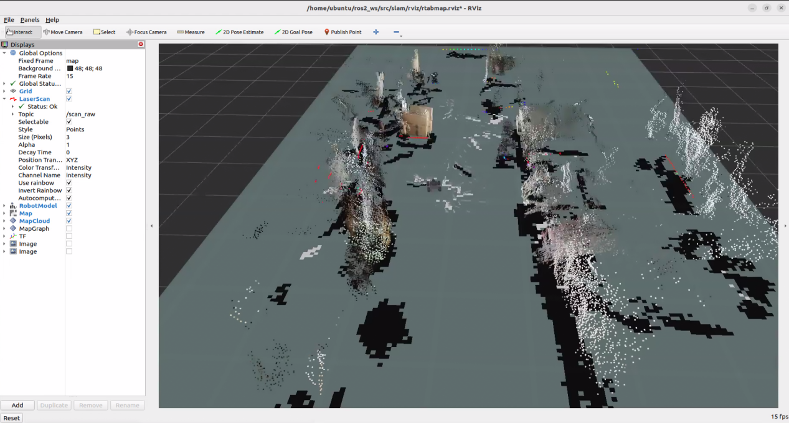

After completing the mapping, press **Ctrl+C** in each command-line terminal window to stop the currently running program.

> [!NOTE]
>
> **For 3D mapping, manual map saving is not required. When the mapping command is stopped using Ctrl+C, the map is automatically saved.**

#### 14.1.5.5 Exiting Mapping

1. Click the terminal icon  in the system desktop to open a ROS2 command-line window.

2. Then, enter the command and press **Enter** to execute the program for all ROS nodes in the current system environment. If it doesn’t close successfully, the command can be executed multiple times.

```bash
~/.stop_ros.sh
```

#### 14.1.5.6 Launch File Analysis

The launch file is located at: **/home/ubuntu/ros2_ws/src/slam/launch/rtabmap_slam.launch.py**.

- **Import Libraries**

Detailed explanations for launch library can be found in the official ROS documentation: https://docs.ros.org/en/humble/How-To-Guides/Launching-composable-nodes.html.

```python
import os
from ament_index_python.packages import get_package_share_directory
from launch_ros.actions import PushRosNamespace
from launch import LaunchDescription
from launch.substitutions import LaunchConfiguration
from launch.launch_description_sources import PythonLaunchDescriptionSource
from launch.actions import DeclareLaunchArgument, IncludeLaunchDescription, GroupAction, OpaqueFunction, TimerAction
```

- **Setting Paths**

The slam package path is obtained using `get_package_share_directory`.

```python
    if compiled == 'True':
        slam_package_path = get_package_share_directory('slam')
    else:
        slam_package_path = '/home/ubuntu/ros2_ws/src/slam'
```

- **Starting Other Launch Files**

```python
    base_launch = IncludeLaunchDescription(
        PythonLaunchDescriptionSource(
            os.path.join(slam_package_path, 'launch/include/robot.launch.py')),
        launch_arguments={
            'sim': sim,
            'master_name': master_name,
            'robot_name': robot_name,
            'action_name': 'horizontal',
        }.items(),
    )    
    

    rtabmap_launch = IncludeLaunchDescription(
        PythonLaunchDescriptionSource(
            os.path.join(slam_package_path, 'launch/include/rtabmap.launch.py')),
        launch_arguments={
            'use_sim_time': use_sim_time, 
        }.items(),
    )
    
    bringup_launch = GroupAction(
     actions=[
         PushRosNamespace(robot_name),
         base_launch,
         TimerAction(
             period=10.0, 
             actions=[rtabmap_launch],
         ),
      ]
    )
```

`base_launch` is the hardware launch files required by the program to start.

`slam_launch` is the base launch file for mapping.

`rtabmap_launch rtab` is the launch file for mapping.

`bringup_launch` is the launch file for the initial pose.


## 14.2 Navigation Tutorial

### 14.2.1 ROS Robot Autonomous Navigation

#### 14.2.1.1 Overview

Autonomous navigation is the method of guiding a device to move from one point to another along a designated route. The main application scenarios of navigation include:

Land applications: Vehicle autonomous navigation, vehicle tracking and monitoring, intelligent vehicle information systems, Internet of Vehicles (IoV) applications, and railway operation monitoring.

Maritime applications: Ocean transport, inland river shipping, ship berthing, and docking.

Aviation applications: Route navigation, airport surface monitoring, and precision approach.


ROS provides a set of general navigation-related packages for robots, allowing developers to focus on higher-level functionalities rather than complex and low-level implementations such as navigation algorithms and hardware interactions. To utilize the navigation functions, simply configure each module’s parameter files according to the robot’s specific parameters. Existing packages can also be redeveloped to meet customized needs, greatly improving development efficiency and reducing product deployment time.

Overall, ROS navigation packages offer stable and comprehensive functions maintained by professional teams, enabling developers to focus on high-level implementation for more efficient development.

#### 14.2.1.2 Navigation Package Details

This section provides a detailed explanation of the navigation packages and their parameter usage.

* **Principle and Framework Overview**

The Nav2 project inherits and extends the philosophy of the ROS Navigation Stack, aiming to enable mobile robots to move safely from point A to point B. Nav2 can also be applied to other scenarios, including dynamic point tracking, which involves dynamic path planning, motor speed calculation, obstacle avoidance, and recovery behaviors.

Nav2 uses behavior trees (BT) to invoke modular servers to perform specific actions. These actions can include path computation, force control, recovery operations, or any other navigation-related tasks. Each action is executed as an independent node that communicates with the behavior tree through ROS Action servers. The figure below provides an overview of the Nav2 architecture.


This architecture can be conceptually divided into one main component and three subordinate components for easier understanding.

Main Component:

BT Navigator Server – The navigation behavior tree (BT) service, which organizes and invokes the three subordinate services below.

Subordinate Components:

(1) Planner Server – The planning server is responsible for computing paths that satisfy certain objective functions. Depending on the chosen naming conventions and algorithms, these paths may also be referred to as routes. In simple terms, it finds a path on the map.

(2) Controller Server – The control server, also known as the local planner in ROS1, determines how the robot follows the globally computed path or performs local tasks. In simple terms, it controls the robot’s movement along the planned path.

(3) Recovery Server – The recovery server acts as the backbone of the fault-tolerant system. Its purpose is to handle unexpected situations or faults and autonomously manage these events. In simple terms, it helps the robot recover from incidents, such as escaping if it falls into a pit.

Autonomous navigation is achieved by continuously switching between path planning, controlling the robot along the path, and performing recovery actions when problems arise. During robot navigation, relying solely on a static map generated by SLAM is not sufficient. New obstacles may appear as the robot moves, and some obstacles in the original map may no longer exist. Therefore, the map maintained during navigation is a dynamic map, which can be categorized into two types based on update frequency and purpose:

Global Costmap:

The global costmap is primarily used by the global planner, which can be seen in the Planner Server in the architecture diagram.

It typically includes the following layers:

Static Map Layer: The static map layer, usually generated by SLAM.

Obstacle Map Layer: Records obstacles detected by sensors dynamically.

Inflation Layer: Expands obstacles outward on the above layers to prevent the robot’s body from colliding with them.

Local Costmap:

The local costmap is primarily used by the local planner, which can be seen in the Controller Server in the architecture diagram.

It typically includes the following layers:

Obstacle Map Layer: Records obstacles detected by sensors dynamically.

Inflation Layer: Expands obstacles outward on the obstacle map layer to prevent collisions with the robot’s body.

* **Package Installation**

The navigation system uses navigation goals, localization data, and map information as inputs to generate control commands for the robot. First, the robot’s current position must be determined, followed by its target destination.

There are two methods for installing the navigation packages. The first method is to install them directly into the system using apt-get, with the following commands:

```bash
sudo apt install ros-*-navigation2
```

```bash
sudo apt install ros-*-nav2-bringup
```

> [!NOTE]
>
> **The asterisk (*) represents your ROS 2 version. The ROS2 version can be checked by entering a command in the terminal.**

```bash
echo $ROS_DISTRO
```


Another method is to download the package source code and compile and install it manually. For learning and basic usage, binary installation is recommended because it is quick and convenient. To modify the code in a package to improve the algorithm, manual installation from source is required.

Navigation feature wiki link: https//wiki.ros.org/Robots/Nav2.

> [!NOTE]
> 
> **The navigation package has already been pre-installed on this robot at the factory, so there is no need for the user to install it again.**


### 14.2.2 AMCL Adaptive Monte Carlo Localization

#### 14.2.2.1 AMCL Localization

Localization estimates the robot’s position within the global map. While SLAM also includes localization algorithms, SLAM localization is used for global map construction and occurs before navigation begins. In navigation, localization allows the robot to follow a planned route and verify that its actual trajectory aligns with expectations. The ROS navigation package ros-navigation provides the AMCL localization system for real-time robot positioning during navigation.

AMCL is a probabilistic localization system for 2D mobile robots. It implements the adaptive Monte Carlo localization method, using a particle filter with an existing map to estimate the robot’s position.

Localization addresses the relationship between the robot and surrounding obstacles, as path planning fundamentally relies on obstacle information to make navigation decisions. In an ideal scenario, knowing the robot’s global position and utilizing sensors like LiDAR for real-time obstacle detection would be enough for navigation. However, the real-time performance and accuracy of global localization are generally limited. Local localization, using sensors like odometry and IMU, provides better precision and ensures the robot's motion trajectory aligns with the IMU’s real-time accuracy. The AMCL node in the navigation package provides global localization by publishing map_odom. Global localization via AMCL is not mandatory. It can be replaced with other systems that provide map_odom, such as SLAM, UWB, or QR-code-based localization.

Global and local positioning have established a dynamic tf coordinate system with map_odom and base_footprint. The static tf coordinates between the robot's various sensors are provided through the robot's URDF model. This section of the TF relationships resolves the connection between the robot and obstacles. For example, if the laser scanner detects an obstacle 3 meters ahead, the transformation between the base_link and laser_link coordinates allows the relationship between the obstacle and the robot's chassis to be determined using the TF data.

#### 14.2.2.2 Particle Filter

The Monte Carlo localization process simulates particle updates for a one-dimensional robot. First, a set of particles is randomly generated with position, orientation, or other state variables to be estimated. Each particle is assigned a weight that represents how closely it matches the actual system state. Next, the state of each particle is predicted for the next time step. This prediction moves the particles based on the expected behavior of the real system. Next, the particles' weights are updated based on measurements. Particles that match better with the measurements are given higher weights. Then resampling is performed, discarding unlikely particles and replacing them with more probable ones. Finally the weighted average and covariance of the particle set are calculated to obtain the state estimate.


The Monte Carlo method varies, but generally follows a specific pattern:

1. Define the domain of possible inputs.

2. Randomly generate inputs based on the probability distribution over the domain.

3. Perform deterministic calculations on the inputs.

4. Summarize the results.

There are two key considerations:

1. If the sampling points are not uniformly distributed, the approximation will be poor.

2. A large number of particles is required. If only a few points are randomly placed across the entire square, the approximation will generally be inaccurate. On average, as more points are added, the accuracy of the approximation improves.

The Monte Carlo particle filter algorithm has a wide range of applications in various fields, including physics, engineering, climatology, and computational biology.

#### 14.2.2.3 AMCL Adaptive Monte Carlo Localization

Adaptive Monte Carlo Localization (AMCL) can be seen as an improved version of the Monte Carlo localization algorithm. It enhances real-time performance by reducing execution time through the use of fewer samples. AMCL implements an adaptive, or KLD-sampling, version of the Monte Carlo localization method, where a particle filter is used with a pre-existing map to track a robot’s pose.

The AMCL node primarily relies on laser scans and a LiDAR-based map to exchange messages and compute pose estimation. The process begins by initializing the particle filter for the adaptive Monte Carlo localization algorithm using the parameters provided by the ROS system. If no initial pose is specified, the algorithm assumes the robot starts from the origin of the coordinate frame, which makes calculations more complex.

Therefore, it is recommended to set the initial pose in RViz using the 2D Pose Estimate button. For more details on Adaptive Monte Carlo Localization, refer to the wiki page: https//github.com/ros-planning/navigation.


#### 14.2.2.4 Costmaps

Whether the SLAM map is generated by a LiDAR or a depth camera in 2D or 3D, it cannot be directly used for navigation. Instead, the map must be converted into a costmap, which in ROS is typically represented in a grid format. In a grid map, each cell is stored in one byte (8 bits), meaning it can hold values from 0 to 255. For navigation, we usually only need three states: Occupied (an obstacle is present), Free (no obstacle), and Unknown Space (unmapped area).

Before diving into costmap_2d, it is important to introduce the Bresenham algorithm. The Bresenham line algorithm is used to draw a straight line defined by two points, calculating the closest rasterized points along the line in an n-dimensional grid. The algorithm relies only on fast integer operations such as addition, subtraction, and bit shifting, and is widely used in computer graphics for line rendering. It was one of the earliest algorithms developed in this field.


When constructing the costmap, a set of virtual grid lines is drawn through the center of each row and column of pixels as shown in the figure. The algorithm then calculates the intersections of the line segment with the vertical grid lines in sequence from the start point to the end point, and based on the sign of the error term, determines which pixel in that column is closest to the intersection.

The core idea of the algorithm assumes that k = dy/dx. Since the line starts at a pixel center, the initial error term is d0 = 0. Each time the x-index increases by 1, the error value d increments by the slope value k, i.e., d = d + k. Whenever d ≥ 1, subtract 1 to keep d within 0 and 1. If d ≥ 0.5, the closest pixel is the one at the upper-right (x+1, y+1). If d < 0.5, the closest pixel is the one directly to the right (x+1, y). For convenience, let e = d – 0.5, with an initial value of -0.5 and an increment of k. When e ≥ 0, the algorithm selects the upper-right pixel (x+1, y+1). When e < 0, it selects the right pixel (x+1, y). To simplify calculations, integer arithmetic can be used to avoid division. Since the algorithm only depends on the sign of the error term, it can be reformulated as e1 = 2 * e * dx.


The Costmap2D class maintains the cost values for each grid cell. The Layer class serves as a virtual base class that unifies the interface for all costmap plugin layers. The most important interface functions include:

initialize(), which calls onInitialize() to initialize each costmap layer.

matchSize(), which in both the StaticLayer and ObstacleLayer classes calls the CostmapLayer’s matchSize() function to initialize each layer’s size, resolution, origin, and default cost value, ensuring consistency with the layered costmap. For the InflationLayer class, the cost table is calculated based on the inflation radius, where the cost values vary with distance. This allows querying the cost of inflated grid cells directly by distance. Meanwhile, the seen\_ array is defined to mark whether a grid cell has already been traversed. For the VoxelLayer class, the voxel grid size is initialized.

The updateBounds function adjusts the size range of the current costmap layer that needs updating. For the StaticLayer class, the update range of the costmap is set to the size of the static map. The static layer is typically only used in the global costmap. For the ObstacleLayer class, sensor data in clearing_observations is traversed to determine obstacle boundaries.

Among them, the initialize function and matchSize function are only executed once. The updateBounds and updateCosts functions are executed periodically, and their execution frequency is determined by map_update_frequency.

The CostmapLayer class inherits from both the Layer class and the Costmap2D class, and provides several methods for updating cost values. Both the StaticLayer class and the ObstacleLayer class need to maintain the cost values of the instantiated costmap layer, so they both inherit from the CostmapLayer class. The StaticLayer class updates its costmap using static grid map data. The ObstacleLayer class updates its costmap using sensor data. Compared with the ObstacleLayer class, the VoxelLayer class additionally considers data along the z-axis. The difference in effect mainly lies in obstacle clearing. One works on a 2D plane, while the other performs clearing in 3D space.


The costmap is highly flexible in representing obstacles, allowing specific layers to be created as needed to maintain obstacle information of interest. If the robot is equipped only with a LiDAR, an Obstacles layer should be created to maintain the obstacle information detected by LiDAR scans. If the robot is additionally equipped with an ultrasonic sensor, a Sonar layer should be created to maintain the obstacle information detected by sonar scans. Each layer can define its own obstacle update rules, such as adding obstacles, removing obstacles, or updating the confidence level of obstacle points, which greatly enhances the scalability of the navigation system.

#### 14.2.2.5 Global Path Planning

Depending on the robot’s understanding of the environment, the nature of the environment, and the algorithm being used, path planning can generally be classified into environment-based algorithms, map-knowledge-based algorithms, and completeness-based algorithms.


In autonomous navigation, commonly used path planning algorithms include Dijkstra, A\*, D\*, PRM, RRT, genetic algorithms, ant colony algorithms, and fuzzy algorithms.

Among these, Dijkstra and A* are graph-based search algorithms. ROS navigation packages integrate several global path planning plugins such as navfn, global planner, and carrot planner. One option is to choose a global planner and load it into move_base for use. Alternatively, third-party global path planning plugins, such as SBPL_Lattice_Planner or srl_global_planner, can be loaded into move_base, or a custom global path planner can be developed according to the nav_core interface specifications.


Path planning enables a mobile robot to autonomously reach the target point. The navigation planning framework can be divided into three layers.

1. Global Path Planning Layer: Based on a given target, it uses the weighted costmap information to generate a global costmap and plan a global path from the start point to the goal, which serves as a reference for local path planning.

2. Local Path Planning Layer: As the local planning component, it uses the locally generated costmap and nearby obstacle information to compute a feasible local path.

3. Behavior Execution Layer: Integrates high-level commands with the path planning results to determine the robot’s current actions.

As one of the key research areas in mobile robotics, the performance of path planning algorithms plays a decisive role in the overall efficiency of robot navigation.

* **Dijkstra Algorithm**

The Dijkstra algorithm is a classic shortest path algorithm and a typical example of a single-source shortest path approach. Its main feature is expanding outward from the starting point layer by layer—similar to a breadth-first search but with edge weights considered—until the destination is reached. For this reason, it is one of the most widely used algorithms for global path planning.

Illustration of the algorithm process:

1. At the beginning, set dis[start] = 0 and initialize all other nodes to inf.
   
   
   
2. In the first iteration, the node with the smallest distance value, node 1, is selected and marked as visited. Then, the distance values of all blue nodes connected to node 1 are updated, resulting in dis[2] = 2, dis[3] = 4, and dis[4] = 7.
   
   
   
3. In the second iteration, the node with the smallest distance value, node 2, is selected and marked as visited. The distance values of all unvisited nodes connected to node 2 are then updated, resulting in dis[3] = 3 and dis[5] = 4.
   
   
   
4. In the third iteration, the node with the smallest distance value, node 3, is selected and marked as visited. The distance values of all unvisited nodes connected to node 3 are then updated, resulting in dis[4] = 4.
   
   
   
5. In the following two iterations, nodes 4 and 5 are marked as visited, and the algorithm terminates, yielding the shortest paths to all nodes.

For more details on the Dijkstra algorithm and usage examples, refer to the wiki link: http://wiki.ros.org/navfn.

* **A\* Algorithm**

The A* algorithm is an optimized version of Dijkstra’s algorithm for a single destination. While Dijkstra’s algorithm finds paths to all nodes, A* finds the path to a specific node or the nearest node among several targets. It prioritizes paths that appear closer to the goal.

The A* algorithm uses the formula F = G + H, where G represents the cost to move from the start to a given cell, and H is the estimated cost from that cell to the goal. There are two common ways to calculate H:

1. Calculate the horizontal and vertical movement distances only, using the Manhattan distance method, without considering diagonal movement.


2. Calculate the horizontal and vertical movement distances while allowing diagonal movement, using the diagonal distance method.


For more details on the A* algorithm and usage examples, refer to the wiki link: http://wiki.ros.org/global_planner.

And the redblobgames website: https://www.redblobgames.com/pathfinding/a-star/introduction.html#graphs.


### 14.2.3 Local Path Planning

Global path planning takes the start point and the goal point as input and uses obstacle information from the global map to plan a global path from the start to the goal. The global path consists of a series of discrete waypoints and only considers static obstacles, so it cannot be directly used for navigation control and serves merely as a high-level reference.

#### 14.2.3.1 DWA Algorithm

* **Description**

The DWA algorithm, also known as the Dynamic Window Approach, is a classical method for mobile robot path planning and motion control. The algorithm searches for the optimal combination of linear and angular velocities within the velocity space to ensure safe navigation on a known map. The following is a basic description of the DWA algorithm along with some formulas:


The core idea of DWA is that at each moment, the robot considers its current state and sensor information, then generates a set of possible motion trajectories in the velocity and angular velocity space, called the dynamic window, and evaluates these trajectories to select the best one. Evaluation criteria usually include obstacle avoidance, maximizing forward speed, and minimizing angular velocity. By continuously repeating this process, the robot can plan its motion trajectory in real time to handle dynamic environments and obstacles.

* **Formulas:**

1. Robot state: position (x, y) and orientation θ.

2. Motion control parameters: linear velocity V and angular velocity ω.

3. Velocity and angular velocity sampling range: V<sub>min</sub>, V<sub>max</sub>, ω<sub>min</sub>, and ω<sub>max</sub>.

4. Time step: Δt.

Formulas:

Velocity sampling: The DWA algorithm first samples the linear and angular velocities in the state space to generate a set of possible velocity-angular velocity pairs, known as the dynamic window.

V<sub>samples</sub> = \[v<sub>min</sub>, v<sub>max</sub>]

ω<sub>samples</sub> = \[-ω<sub>max</sub>, ω<sub>max</sub>]

V<sub>samples</sub> represents the linear velocity sampling range, and ω<sub>samples</sub> represents the angular velocity sampling range.

Motion simulation: For each velocity–angular velocity pair, the DWA algorithm simulates the robot's motion and computes the trajectory resulting from applying that velocity–angular velocity combination from the current state.

x(t+1) = x(t) + v * cos(θ(t)) *Δt

y(t+1) = y(t) + v * sin(θ(t)) *Δt

θ(t+1) = θ(t) + ω * Δt

The variables x(t) and y(t) represent the robot’s position, θ(t) represents the robot’s orientation, v represents the linear velocity, ω represents the angular velocity, and Δt represents the time step.

Trajectory Evaluation: For each generated trajectory, the DWA algorithm evaluates it using an evaluation function, such as obstacle avoidance, maximum velocity, and minimum angular velocity.

Obstacle avoidance evaluation: Checks whether the trajectory intersects with any obstacles.

Maximum velocity evaluation: Checks whether the maximum linear velocity along the trajectory is within the allowed range.

Minimum angular velocity evaluation: Checks whether the minimum angular velocity along the trajectory is within the allowed range. The evaluation functions can be defined and adjusted according to task requirements.

Selecting the best trajectory: The DWA algorithm selects the trajectory with the best evaluation score as the robot's next movement.


* **Extensions**

DWA Algorithm Extensions and Learning Links:

The DWA algorithm is a foundational method in mobile robotics, and there are many extended and improved versions, such as DWA, e-DWA, and DP-DWA, aimed at enhancing the performance and efficiency of path planning:

1. DWA algorithm extension: *https://arxiv.org/abs/1703.08862*.

2. Enhanced DWA (e-DWA) algorithm: *https://arxiv.org/abs/1612.07470*.

3. DP-DWA algorithm (DP-based Dynamic Window Approach): *https://arxiv.org/abs/1909.05305*.

4. For more details, visit the wiki: :http://wiki.ros.org/dwa_local_planner.

These links provide comprehensive information and further research on the DWA algorithm and its extensions.

#### 14.2.3.2 TEB Algorithm

* **Description**

The TEB (Timed Elastic Band) algorithm is a method used for path planning and motion planning, primarily applied in robotics and autonomous vehicles. The core idea of the TEB algorithm is to model the path planning problem as an optimization problem, where the goal is to generate an optimal trajectory within a given time while satisfying the robot’s or vehicle’s dynamic constraints and obstacle avoidance requirements. Key features of the TEB algorithm include:

1. Time-layered representation: The TEB algorithm introduces a time-layered concept, dividing the trajectory into multiple time steps. Each time step corresponds to a specific position of the robot or vehicle along the trajectory, which helps enforce temporal constraints and avoid collisions.

2. Trajectory parameterization: The trajectory is parameterized as a series of displacements and velocities, making it easier to optimize. Each time step has an associated displacement and velocity parameter.

3. Constraint optimization: The algorithm takes into account the robot’s dynamic constraints, obstacle avoidance constraints, and trajectory smoothness constraints. These are incorporated into the optimization problem as part of the objective function.

4. Optimization solving: TEB uses optimization techniques, such as quadratic programming (QP) or nonlinear programming (NLP), to compute the optimal trajectory parameters while satisfying all constraints.


* **Formulas:**

The figure below illustrates the objective function used in the TEB algorithm:


For more details:

(1) J(x) is the objective function, where x represents the trajectory parameters.

(2) w<sub>smooth</sub> and w<sub>obstacle</sub> are the weights for smoothness and obstacle avoidance.

(3) H is the smoothness penalty matrix.

(4) f(x<sub>i</sub>,o<sub>j</sub>) represents the obstacle cost function between trajectory point x<sub>i</sub> and obstacle o<sub>j</sub>.

1. State definition:

First, define the robot’s state in the path planning problem.

(1) Position: P=[X,Y], representing the robot’s position in a 2D plane.

(2) Velocity: V=[Vx,Vy], representing the robot’s velocity along the X and Y axes.

(3) Time: t, representing time.

(4) Control input: u=[ux,uy], representing the robot’s control inputs, which can be velocity or acceleration.

(5) Robot trajectory: x(t)=[p(t),v(t)], representing the robot’s state at time t.

2. Objective Function:

The core of the TEB algorithm is an optimization problem, with the goal of minimizing an objective function composed of multiple components:


For more details:

(1) J<sub>smooth</sub>(x): The smoothness objective, used to ensure that the generated trajectory is smooth.

(2) J<sub>obstacle</sub>(x): The obstacle avoidance objective, used to prevent collisions with obstacles.

(3) J<sub>dynamic</sub>(x): The dynamics objective, used to ensure that the trajectory satisfies the robot’s dynamic constraints.

3. Smoothness Objective Jsmooth(x): The smoothness objective typically involves the curvature of the trajectory to ensure it is smooth. It can be expressed as:


where k(t) represents the curvature.

4. Obstacle Avoidance Objective Jobstacle(x):

The obstacle avoidance objective calculates the distance between trajectory points and obstacles, penalizing points that are too close to obstacles. The specific obstacle cost function f(x,o) can be customized according to the application requirements.


5. Dynamics Objective J<sub>dynamic</sub>(x):

The dynamics objective ensures that the generated trajectory satisfies the robot’s dynamic constraints. This can be defined based on the robot’s kinematic and dynamic model and typically involves constraints on velocity and acceleration. Typically, this involves constraints on velocity and acceleration.

6. Optimization:

Finally, the TEB algorithm formulates the above objective functions as a constrained optimization problem, where the optimization variables include trajectory parameters, time allocation, and control inputs. The optimization problem is typically solved as a nonlinear programming (NLP) problem.

* **Extensions**


TEB Algorithm Extensions and Learning Links:

The TEB algorithm is an important technique in the field of path planning, and there are many extended and improved variants. The following resources and topics can help you gain a deeper understanding of the TEB algorithm and related concepts:

1. Original TEB Paper: One of the best ways to learn is to study the original TEB paper to gain insights into its principles and applications.

- Original TEB Paper: "**Trajectory modification considering dynamic constraints of autonomous robots**" by M. Rösmann et al.

2. TEB Implementation in ROS: The ROS package for the TEB algorithm is a common implementation that can be used for robot path planning.

ROS TEB Local Planner Package: :https://github.com/rst-tu-dortmund/teb_local_planner.

Wiki official website: http://wiki.ros.org/teb_local_planner.

These links provide resources for users to study the TEB algorithm in depth and explore related path planning topics.


### 14.2.4 Single-Point and Multi-Point Navigation and Obstacle Avoidance

1. Power on the robot and connect it to the remote control software NoMachine. For instructions on setting up the remote desktop connection, refer to the section [1.7.2 AP Mode Connection Steps](https://wiki.hiwonder.com/projects/ROSOrin/en/jetson-nano/docs/1_ROSOrin_User_Manual.html#ap-mode-connection-steps) in the user manual.

2. Click the terminal icon  in the system desktop to open a ROS1 command-line window. Enter the command to disable the app auto-start service.

```bash
sudo systemctl stop start_app_node.service
```

3. Click the icon  on the system desktop to open a ROS2 command line terminal. Enter the command to start the navigation service and press **Enter**:

```bash
ros2 launch navigation navigation.launch.py map:=map_01
```

The **map_01** at the end of the command is the map name and can be modified as needed. The map is stored at the directory of **/home/ubuntu/ros2_ws/src/slam/maps**.

4. Open a new ROS2 command line terminal and enter the command to launch RViz for navigation visualization.

```bash
ros2 launch navigation rviz_navigation.launch.py
```

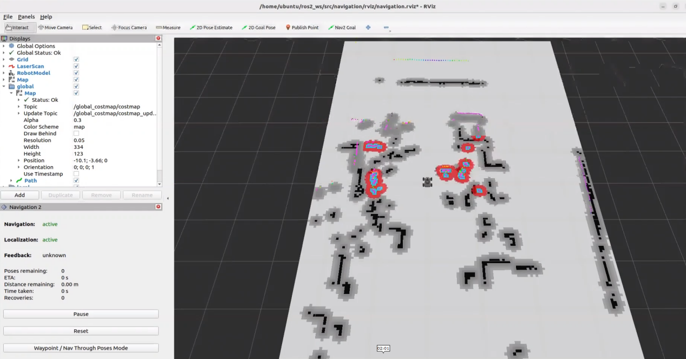

#### 14.2.4.1 Single-Point Navigation

In the software menu bar, **2D Pose Estimate** is used to set the robot’s initial position, while **2D Nav Goal** is used to set a single target point.

1. To set the robot’s initial position, click  in the software to choose a location on the map, and drag the mouse to select the robot’s pose.
   
   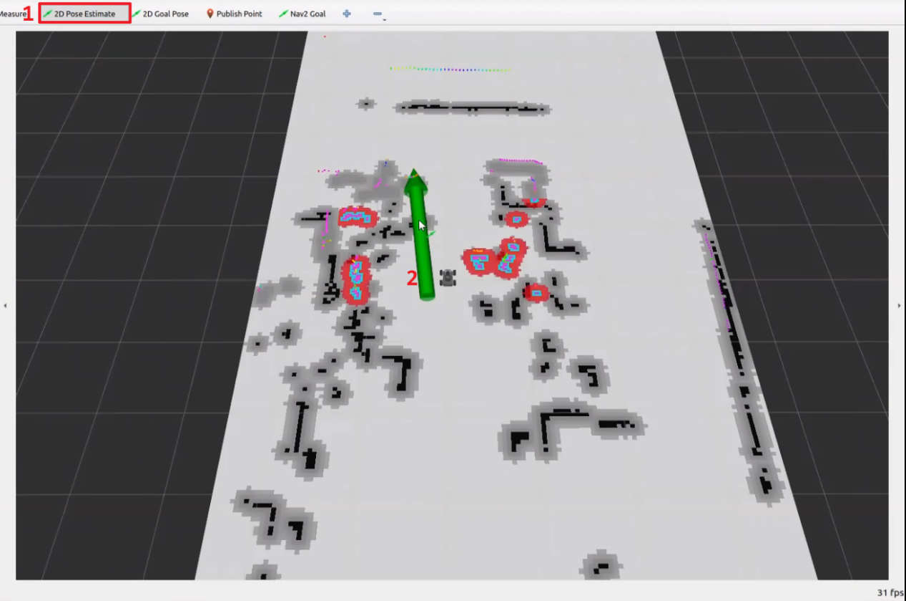
   
2. After the robot’s initial pose is set, the result is shown below, with the LiDAR point cloud aligned with the obstacles on the map:
   
   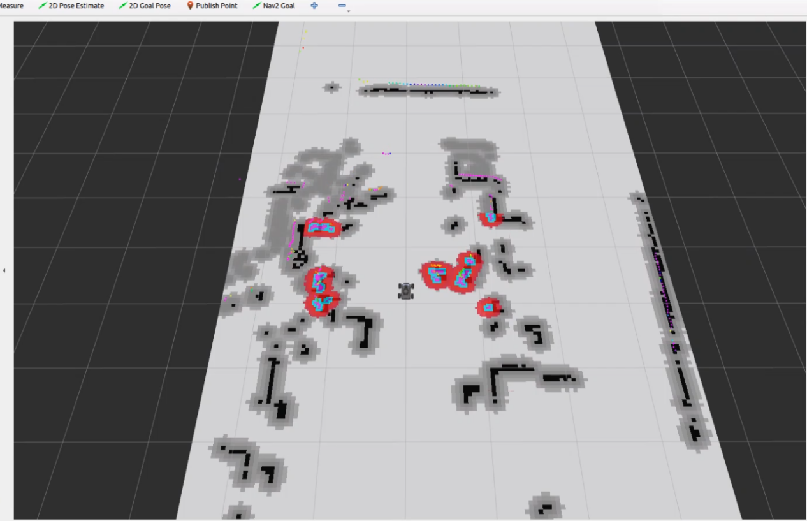
   
3. Click the icon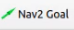, then select a location on the map as the target point and simply click once at that point with the mouse. Once the target is selected, the robot will automatically generate a route and move toward the target point.
   
   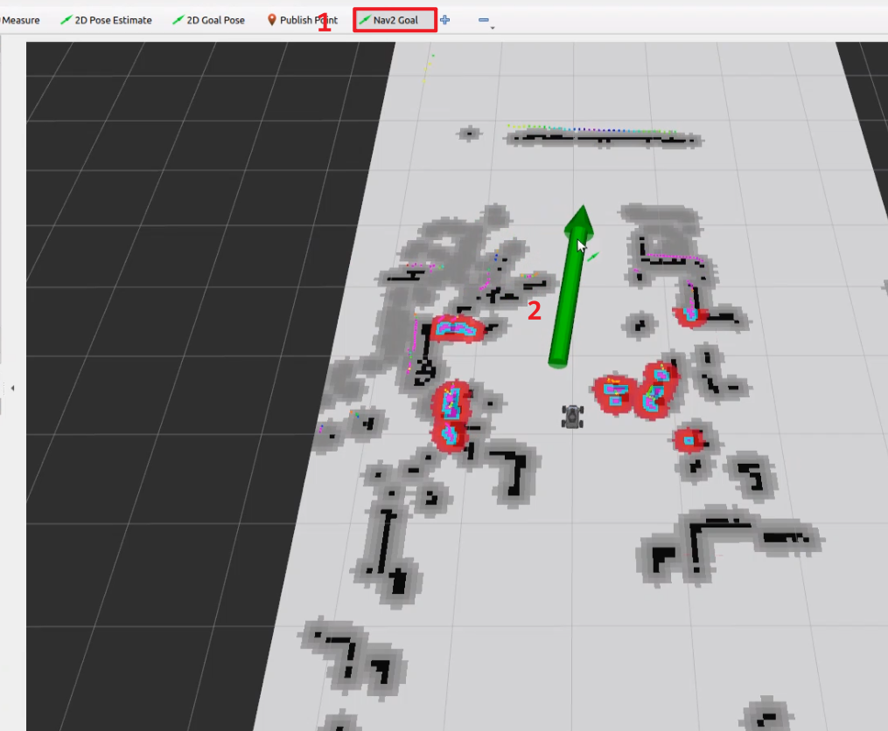
   
4. After the target is set, the map will display two paths: the green line represents the straight-line path from the robot to the target, while the dark blue line shows the robot’s planned trajectory.
   
   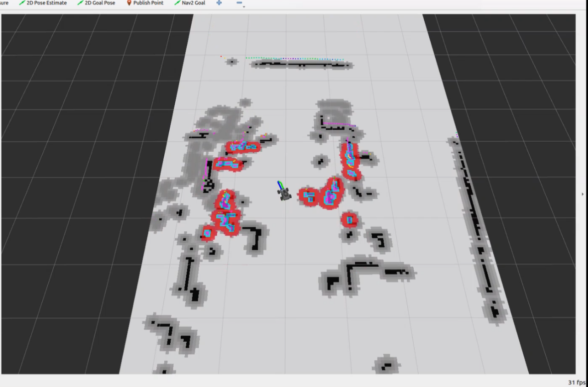
   
5. Navigation is complete once the robot reaches the specified target position.
   
   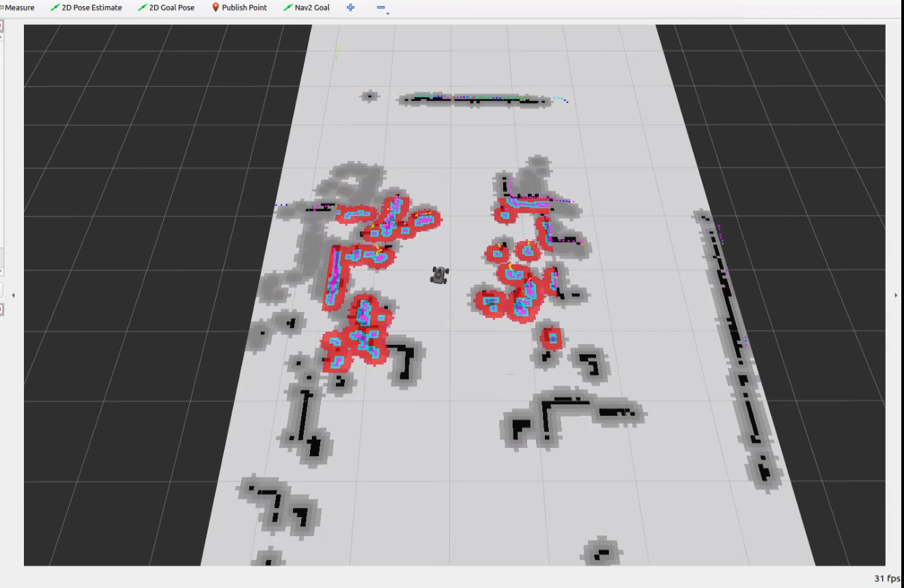
   


#### 14.2.4.2 Multi-Point Navigation

1. In the lower-left area of the RViz2 interface, locate the navigation toolbar and click the **Waypoint** button to enter multi-point navigation mode.


2. Click the **Nav2 Goal** button to begin configuration.

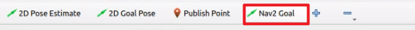

3. Set multiple navigation points for the robot in non-obstacle areas on the map.

To define a navigation point, press and hold the left mouse button to set the target position, then drag the mouse to define the robot’s orientation. The arrow indicates the robot’s forward direction. The example below shows three target points defined on the map.

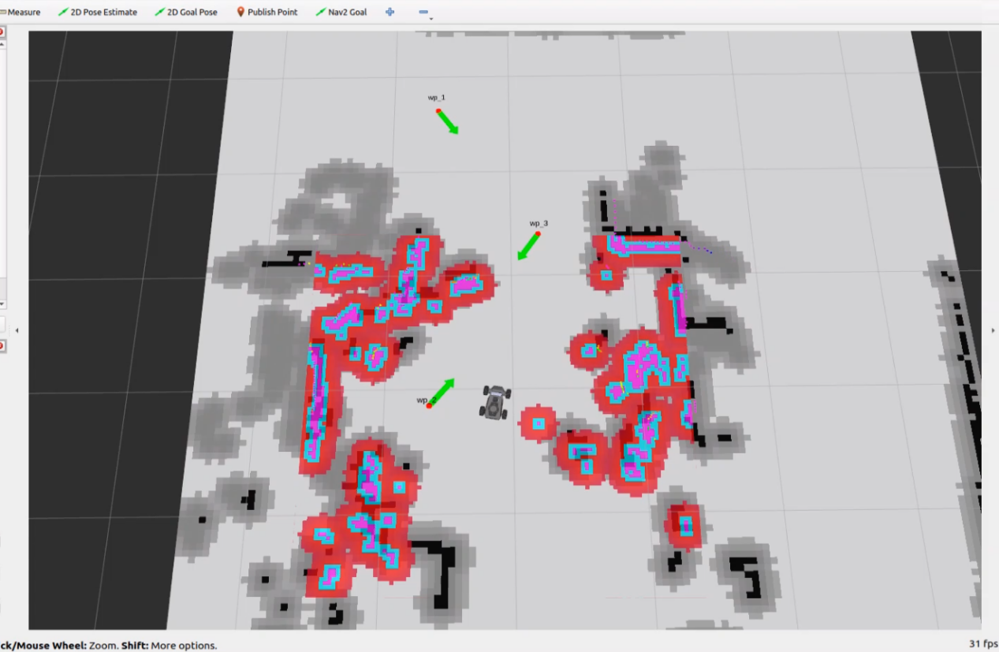

4. Click **Start Nav Through Poses** or **Start Waypoint Following** to begin navigation. **Start Nav Through Poses** guides the robot to reach each waypoint with a specific pose. **Start Waypoint Following** does not enforce a final pose at each waypoint and is recommended for navigation in this section.


5. The multi-point navigation result is shown below, with the robot reaching each target point in sequence.

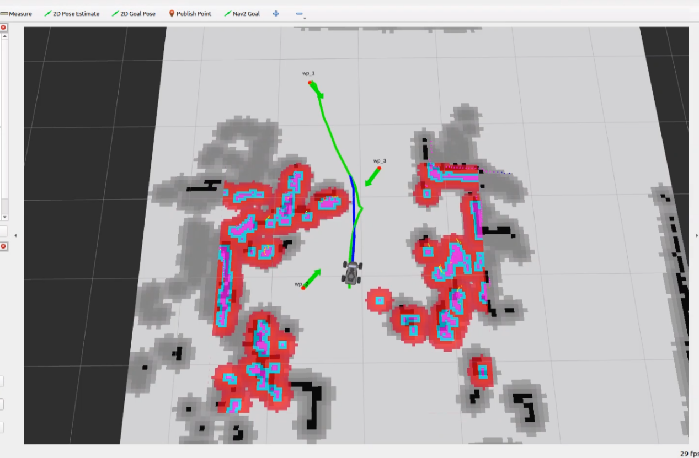


6. Multi-point navigation is complete once the robot reaches the final target point.

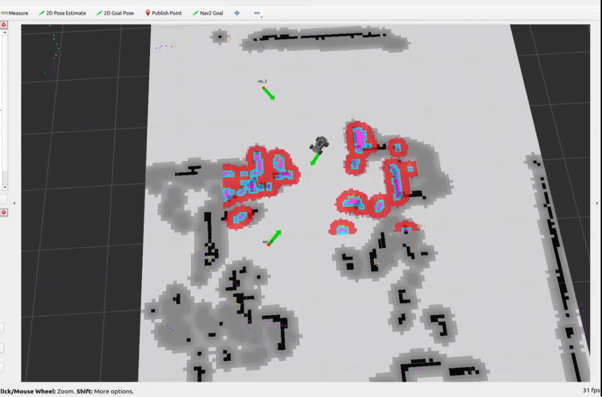

#### 14.2.4.3 Exiting Navigation

1. Click the terminal icon  in the system desktop to open a ROS2 command-line window.

2. Then, enter the command and press **Enter** to execute the program for all ROS nodes in the current system environment. If it doesn’t close successfully, the command can be executed multiple times.

```bash
~/.stop_ros.sh
```

#### 14.2.4.4 Launch Description

The launch file is located at: **/home/ubuntu/ros2_ws/src/navigation/launch/navigation.launch.py**.

```python
import os
from ament_index_python.packages import get_package_share_directory

from launch_ros.actions import PushRosNamespace
from launch import LaunchDescription, LaunchService
from launch.substitutions import LaunchConfiguration
from launch.launch_description_sources import PythonLaunchDescriptionSource
from launch.actions import DeclareLaunchArgument, IncludeLaunchDescription, GroupAction, OpaqueFunction, TimerAction
```

- **Setting Paths**

Obtain the paths for the three packages: `peripherals`, `controller`, and `servo_controller`.

```python
    if compiled == 'True':
        slam_package_path = get_package_share_directory('slam')
        navigation_package_path = get_package_share_directory('navigation')
    else:
        slam_package_path = '/home/ubuntu/ros2_ws/src/slam'
        navigation_package_path = '/home/ubuntu/ros2_ws/src/navigation'
```

- **Starting Other Launch Files**
  
  **base_launch: Launches all required hardware components.**
  
  **navigation_launch: Starts the navigation algorithm.**
  
  **bringup_launch: Initializes the robot’s actions.**

```python
    base_launch = IncludeLaunchDescription(
        PythonLaunchDescriptionSource(os.path.join(slam_package_path, 'launch/include/robot.launch.py')),
        launch_arguments={
            'sim': sim,
            'master_name': master_name,
            'robot_name': robot_name
        }.items(),
    )
    
    navigation_launch = IncludeLaunchDescription(
        PythonLaunchDescriptionSource(os.path.join(navigation_package_path, 'launch/include/bringup.launch.py')),
        launch_arguments={
            'use_sim_time': use_sim_time,
            'map': os.path.join(slam_package_path, 'maps', map_name + '.yaml'),
            'params_file': os.path.join(navigation_package_path, 'config', 'nav2_params.yaml'),
            'namespace': robot_name,
            'use_namespace': use_namespace,
            'autostart': 'true',
            'use_teb': use_teb,
        }.items(),
    )

    bringup_launch = GroupAction(
     actions=[
         PushRosNamespace(robot_name),
         base_launch,
         TimerAction(
             period=10.0,  # Delay for enabling other nodes
             actions=[navigation_launch],
         ),
      ]
    )
```

#### 14.2.4.5 Package Description

The navigation package path is **~/ros2_ws/src/navigation/**.

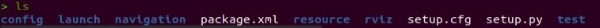

**config:** Contains configuration parameters related to navigation, as shown below.


**launch:** Contains launch files related to navigation, including localization, map loading, different navigation modes, and simulation model, as shown below.


**rviz:** Loads parameters for the RViz visualization tool, including robot RViz configuration files for different navigation algorithms, and navigation configuration files, as shown in the image below.


**package.xml:** The configuration file for the current package.


### 14.2.5 RTAB-VSLAM 3D Navigation

#### 14.2.5.1 Algorithm Overview and Principles

For an introduction and explanation of the RTAB-VSLAM algorithm, refer to section [14.1.5 RTAB-VSLAM 3D Mapping](#p14-1-5) for study and reference.

#### 14.2.5.2 Operation Steps

1. Power on the robot and connect it to the remote control software NoMachine. For instructions on setting up the remote desktop connection, refer to the section [1.7.2 AP Mode Connection Steps](https://wiki.hiwonder.com/projects/ROSOrin/en/jetson-nano/docs/1_ROSOrin_User_Manual.html#ap-mode-connection-steps) in the user manual.

2. Click the command line terminal  on the left side of the system desktop to open a ROS1 command line terminal. Enter the command to disable the app auto-start service:

```bash
sudo systemctl stop start_app_node.service
```

3. Click the command line terminal  on the left side of the system desktop to open a ROS2 command line terminal. Enter the command to start the navigation service and press **Enter**:

```bash
ros2 launch navigation rtabmap_navigation.launch.py
```

4. Open a new ROS2 command line terminal and enter the command to launch RViz for navigation visualization.

```bash
ros2 launch navigation rviz_rtabmap_navigation.launch.py
```

5. Once the program has started successfully, the output is shown below.

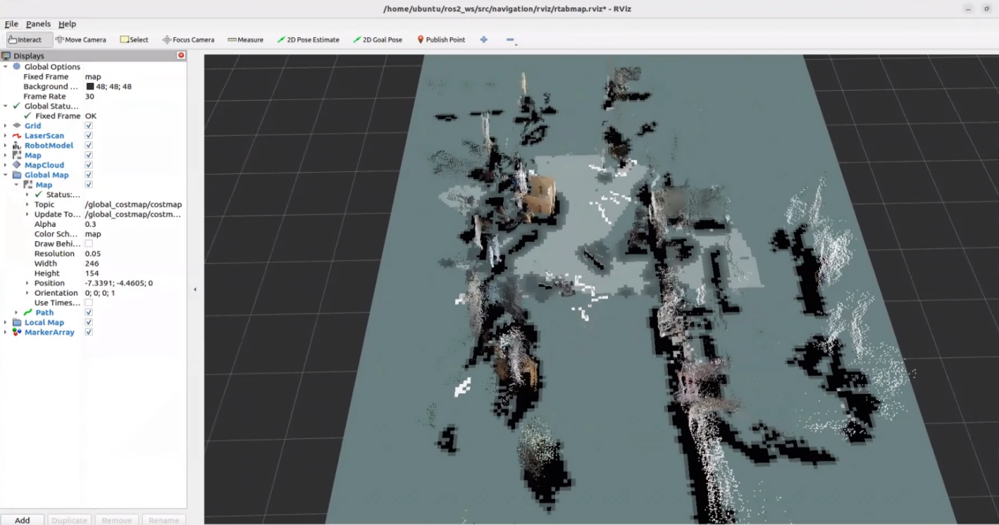

6. Click the goal-setting icon  at the top of the software to define navigation target points for the robot.

7. Select a location on the map interface as the target point by clicking once with the mouse. Once the target is selected, the robot will automatically generate a route and move toward the target point.


8. Once the target is confirmed, two paths will be displayed on the map. The robot follows these paths to reach the target:

The green path is generated by the global path planner.

The blue path is generated by the local path planner.

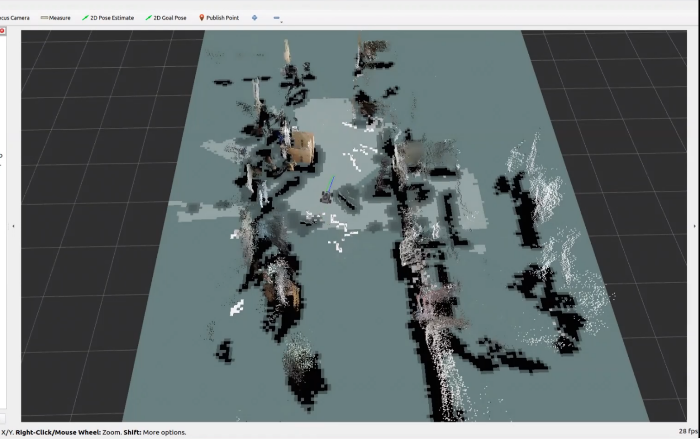

9. When encountering obstacles, the robot will navigate around them while continuously adjusting its pose and trajectory.

#### 14.2.5.3 Launch Description

The launch file is located at: **/home/ubuntu/ros2_ws/src/navigation/launch/navigation.launch.py**.

```python
import os
from ament_index_python.packages import get_package_share_directory

from launch_ros.actions import PushRosNamespace
from launch import LaunchDescription, LaunchService
from launch.substitutions import LaunchConfiguration
from launch.launch_description_sources import PythonLaunchDescriptionSource
from launch.actions import DeclareLaunchArgument, IncludeLaunchDescription, GroupAction, OpaqueFunction, TimerAction

def launch_setup(context):
    compiled = os.environ['need_compile']
    if compiled == 'True':
        slam_package_path = get_package_share_directory('slam')
        navigation_package_path = get_package_share_directory('navigation')
    else:
        slam_package_path = '/home/ubuntu/ros2_ws/src/slam'
        navigation_package_path = '/home/ubuntu/ros2_ws/src/navigation'

    sim = LaunchConfiguration('sim', default='false').perform(context)
    map_name = LaunchConfiguration('map', default='map_01').perform(context)
    robot_name = LaunchConfiguration('robot_name', default=os.environ['HOST']).perform(context)
    master_name = LaunchConfiguration('master_name', default=os.environ['MASTER']).perform(context)
    use_teb = LaunchConfiguration('use_teb', default='true').perform(context)

    sim_arg = DeclareLaunchArgument('sim', default_value=sim)
    map_name_arg = DeclareLaunchArgument('map', default_value=map_name)
    master_name_arg = DeclareLaunchArgument('master_name', default_value=master_name)
    robot_name_arg = DeclareLaunchArgument('robot_name', default_value=robot_name)
    use_teb_arg = DeclareLaunchArgument('use_teb', default_value=use_teb)
```

- **Setting Paths**

Obtain the paths for the three packages: `peripherals`, `controller`, and `servo_controller`.

```python
compiled = os.environ['need_compile']
if compiled == 'True':
    slam_package_path = get_package_share_directory('slam')
    navigation_package_path = get_package_share_directory('navigation')
else:
    slam_package_path = '/home/ubuntu/ros2_ws/src/slam'
    navigation_package_path = '/home/ubuntu/ros2_ws/src/navigation'
```

- **Starting Other Launch Files**
  
  `rtabmap_launch` starts the 3D navigation algorithm.
  
  `navigation_launch` starts the 2D navigation algorithm.
  
  `bringup_launch` initializes the actions.

```python
base_launch = IncludeLaunchDescription(
    PythonLaunchDescriptionSource(os.path.join(slam_package_path, 'launch/include/robot.launch.py')),
    launch_arguments={
        'sim': sim,
        'master_name': master_name,
        'robot_name': robot_name
    }.items(),
)

navigation_launch = IncludeLaunchDescription(
    PythonLaunchDescriptionSource(os.path.join(navigation_package_path, 'launch/include/bringup.launch.py')),
    launch_arguments={
        'use_sim_time': use_sim_time,
        'map': os.path.join(slam_package_path, 'maps', map_name + '.yaml'),
        'params_file': os.path.join(navigation_package_path, 'config', 'nav2_params.yaml'),
        'namespace': robot_name,
        'use_namespace': use_namespace,
        'autostart': 'true',
        'use_teb': use_teb,
    }.items(),
)

bringup_launch = GroupAction(
 actions=[
     PushRosNamespace(robot_name),
     base_launch,
     TimerAction(
         period=10.0,  # Delay for enabling other nodes
         actions=[navigation_launch],
     ),
  ]
)
```