# 15\. ROS2-ROS+OpenCV Course

[TOC]


15.1 Color Threshold Adjustment
---

Various light sources can affect colors differently, leading to discrepancies in recognition. To address this issue, you can utilize LAB TOOL to adjust the color threshold, ensuring more accurate and consistent color recognition.

### 15.1.1 Launching and Closing LAB TOOL

> [!NOTE]
> 
> The input command should be case sensitive, and the keywords can be complemented by the **Tab** key.

1. Please strictly follow the steps below to open the LAB TOOL. Otherwise, the tool cannot be opened.

2. Power on the robot and connect it to the remote control software NoMachine. For instructions on setting up the remote desktop connection, refer to the section [1.7.2 AP Mode Connection Steps]() in the user manual.

3. Click the terminal icon 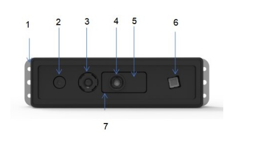 in the system desktop to open a ROS1 command-line window.

4. Enter the following command and press **Enter** to stop the app auto-start service.

```bash
sudo systemctl stop start_app_node.service
```

5. Enter the command to start the camera node:

```bash
roslaunch peripherals depth_cam.launch
```

6. Then open a new terminal, run the LAB Tool by entering the following command, and press **Enter**:

```bash
python3 /home/ubuntu/software/lab_tool/main.py
```

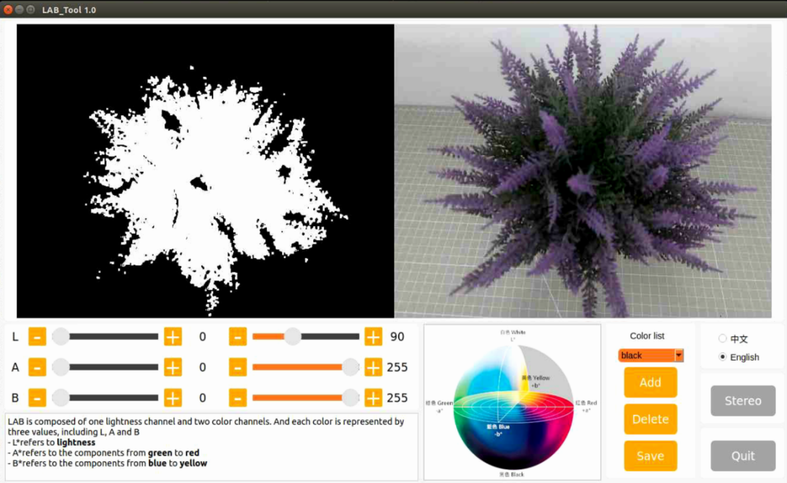

7. See the next section for an introduction to the interface and instructions for the buttons. Click the **Quit** button at the bottom right to close it.


8. After closing the LAB Tool, enter the command to restart the app auto-start service.

```bash
sudo systemctl restart start_app_node.service
```

> [!NOTE]
> 
> **If the app auto-start service is not running, some app functions may not work properly. If the auto-start command has not been executed, restarting the robot will also automatically restart the APP auto-start service.**

### 15.1.2 LAB TOOL Interface Introduction

LAB TOOL is divided into two parts, including the image display area and the recognition adjustment area.


1. Image display area: The processed camera feed is shown on the left, and the raw feed is shown on the right.

> [!NOTE]
> 
> **If the video feed fails to display, indicating a camera connection error, check the camera cable for a secure connection or reconnect it.**

2. Adjustment Panel: Allows color-threshold tuning. The functions of each button are listed below.

| **Icon**| **Function**|
|----------|----------|
| | Sliders L, A, and B are respectively used to adjust L, A, and B components of the camera returned image. The left sliders set the **minimum** values for each channel, and the right sliders set the **maximum** values.|
| 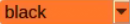| Select the target color for threshold tuning.|
| | Delete the selected color.|
| | Add a new detectable color.|
| | Save the adjusted value.|
| | Switch the camera between the depth camera and the monocular camera.|
| | Exit from the LAB TOOL.|

### 15.1.2 Adjusting Color Thresholds

1. Open LABTOOL, and select the color in the drop-down menu. Take adjusting the red color, for example.


2. Modify all **min** values of L, A, and B to **0**, and **max** values to **255**.

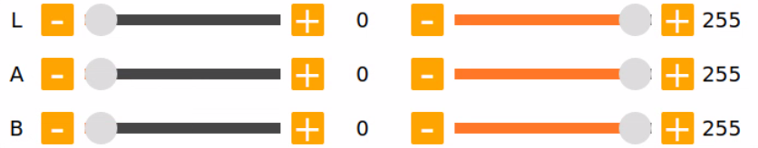

3. Put the red block within the camera frame. According to the LAB color space, adjust L, A, and B components to approach the zone of the target color.


If the red area appears close to **+a**, increase the A component. Keep the A component’s **max** value unchanged and raise its **min** value until the target object in the left display turns white while all other areas turn black.

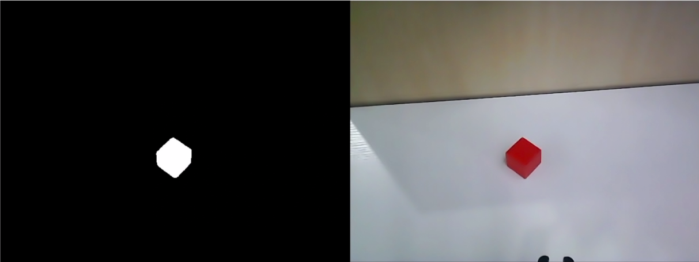


4. Based on the environment, modify the value of L and B. Increase the L component’s **min** value if the red tone is too light, or reduce its **max** value if it is too dark. Increase the B component’s **min** value if the red tone is too warm, or reduce its **max** value if it is too cool.

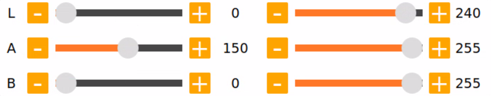

LAB Threshold Adjustment Parameter

| **Color Component**| **Range**| **Corresponding Color Zone**|
|----------|----------|----------|
| L| 0~255| Black-White（-L ~ +L）|
| A| 0~255| Green-Red（-a ~ +a）|
| B| 0~255| Blue-Yellow（-b ~ +b）|

5. Click **Save** in the Adjustment Panel to save the adjusted color threshold parameter.


### 15.1.4 Add New Color for Detection

In addition to the built-in detectable colors, additional colors can be added. Yellow is used as an example below. The steps are as follows:

1. Open the LAB TOOL and click the **Add** button.

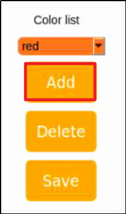

2. Then fill in the color name in the **name** field, and click **OK**.


3. Select the newly added color from the color list.


4. Face the camera at the yellow block. And drag the sliders of L, A, and B to adjust the color threshold till the object on the left turns white and the other area turns black.


5. Click **Save** in the Adjustment Panel to save the adjusted color threshold parameter.

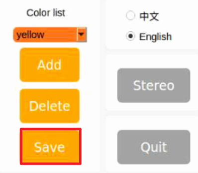

Once the adjustment is completed, press **Ctrl+C** to disable the camera service, then click **Quit** to exit the interface.


15.2 Color Recognition
---

This section demonstrates the recognition of red, green, and blue objects using OpenCV, with the results displayed on the video feed. Before starting the feature, please prepare three objects in these colors: red, green, and blue.

### 15.2.1 Recognition Process

Firstly, the program will acquire the RGB image of the camera, scale the image, and perform Gaussian filtering on the image to convert the image color space from RGB to LAB.

Based on this, color thresholds are used to identify the color of the object within the circle. A mask is then applied to the image, which involves selecting parts of the image, graphics, or objects to globally or locally block out areas in the image for processing.

After masking, morphological operations, including opening and closing, are performed on the object image to refine the results.

Opening operation: Involves erosion followed by dilation. Effect: Removes small objects, smooths object boundaries, and does not affect object area.

 It can remove small particle noise and separate objects that are stuck together.

Erosion: Removes boundary pixels of an object, causing the edges to shrink inward. This operation can eliminate objects smaller than the structuring element.

Dilation: Expands the boundary pixels of an object by merging surrounding background pixels that are in contact with the object, causing the edges to grow outward.

Finally, the recognition results are overlaid on the return image.

### 15.2.2 Color Recognition Operation

> [!NOTE]
> 
> **Commands must be entered with correct capitalization. The Tab key can be used to auto-complete keywords.**

1. Power on the robot and connect it via the NoMachine remote control software. For detailed information on connecting to a remote desktop, please refer to section [1.7.2 AP Mode Connection Steps]() in the user manual.

2. Click the terminal icon  in the system desktop to open a ROS1 command-line window.

3. Enter the command to disable the app auto-start service.

```bash
sudo systemctl stop start_app_node.service
```

4. Click the icon  on the system desktop to open a new ROS2 command line terminal. Enter the command to start the camera node:

```bash
ros2 launch peripherals depth_camera.launch.py
```

5. Open a new terminal, navigate to the program directory, and start the color detection feature by entering the following command:

```bash
cd ~/ros2_ws/src/example/example/color_detect && python3 color_detect_demo.py
```

6. To exit the feature, press **Ctrl+C** in the terminal. If the program does not close successfully, try pressing **Ctrl+C** again.

### 15.2.3 Project Outcome

> [!NOTE]
> 
> **After the feature starts, please ensure there is no other object containing the recognition color except the target object within the camera view. Otherwise, the recognition result will be affected.**

After the feature starts, put the objects within the camera’s view. When the target object is detected, the program will highlight it with a circle of the corresponding color and display the color name in the lower-left corner of the window. The program can detect objects in red, blue, and green.


### 15.2.4 Program Analysis

The feature's source code is located at: **/home/ubuntu/ros2_ws/src/example/example/color_detect/color_detect_demo.py**.

```python
# Color detection

range_rgb = {
    'red': (0, 0, 255),
    'blue': (255, 0, 0),
    'green': (0, 255, 0),
    'black': (0, 0, 0),
    'white': (255, 255, 255),
}

def get_yaml_data(yaml_file):
    yaml_file = open(yaml_file, 'r', encoding='utf-8')
    file_data = yaml_file.read()
    yaml_file.close()
    
    data = yaml.load(file_data, Loader=yaml.FullLoader)
    
    return data

lab_data = get_yaml_data("/home/ubuntu/software/lab_tool/lab_config.yaml")
```

* **Main Function**

Initializes the ROS node and creates the color detection node named `color_detect_node`, subscribes to the image topic `/depth_cam/rgb/image_raw` with `image_callback` as its callback function, runs the color detection `main` function using multi-threading, and waits for the node to shut down.

```python
if __name__ == '__main__':
    rclpy.init()
    node = rclpy.create_node('color_detect_node')
    node.create_subscription(Image, '/depth_cam/rgb/image_raw', image_callback, 1)
    threading.Thread(target=main, daemon=True).start()
    rclpy.spin(node)
```

* **Functions**

1. The camera callback function is primarily used to read the video stream from the topic and push it into a queue, ensuring real-time display.

```python
def image_callback(ros_image):
    cv_image = bridge.imgmsg_to_cv2(ros_image, "bgr8")
    bgr_image = np.array(cv_image, dtype=np.uint8)
    if image_queue.full():
        # If the queue is full, discard the oldest image
        image_queue.get()
        # Put the image into the queue
    image_queue.put(bgr_image)
```

2. Color Detection main Function

The images in the queue are read and passed into the `run` function to obtain the color-recognized frames, which are then displayed using `cv2`.

```python
def main():
    running = True
    while running:
        try:
            image = image_queue.get(block=True, timeout=1)
        except queue.Empty:
            if not running:
                break
            else:
                continue
        image = run(image)
        cv2.imshow('image', image)
        key = cv2.waitKey(1)
        if key == ord('q') or key == 27:  # Press Q or Esc to exit
            break
```

3. YAML File Reading Function

```python
def get_yaml_data(yaml_file):
    yaml_file = open(yaml_file, 'r', encoding='utf-8')
    file_data = yaml_file.read()
    yaml_file.close()
    
    data = yaml.load(file_data, Loader=yaml.FullLoader)
    
    return data
```

4. Maximum Contour Function

The function takes the contours detected by OpenCV as input, identifies the largest contour based on area, and returns both the contour and its area.

```python
# Find the contour with the largest area
# The parameter is a list of contours to be compared
def getAreaMaxContour(contours):
    contour_area_temp = 0
    contour_area_max = 0
    area_max_contour = None

    for c in contours:  # Iterate through all contours
        contour_area_temp = math.fabs(cv2.contourArea(c))  # Calculate the area of the contour
        if contour_area_temp > contour_area_max:
            contour_area_max = contour_area_temp
            if contour_area_temp > 50:  # Only when the area is greater than 50, the contour with the largest area is valid. This allows to filter out interference
                area_max_contour = c

    return area_max_contour, contour_area_max  # Return the contour with the largest area
```

5. Color Recognition Function

The function takes an image as input and resizes it to the specified size (320, 240) to facilitate detection. The image is then processed with a Gaussian filter and converted to the LAB color space.

```python
def run(img):
    global draw_color
    global color_list
    global detect_color
    
    img_copy = img.copy()
    img_h, img_w = img.shape[:2]

    frame_resize = cv2.resize(img_copy, size, interpolation=cv2.INTER_NEAREST)
    frame_gb = cv2.GaussianBlur(frame_resize, (3, 3), 3)      
    frame_lab = cv2.cvtColor(frame_gb, cv2.COLOR_BGR2LAB)  # Convert image to LAB space

    max_area = 0
    color_area_max = None    
    areaMaxContour_max = 0
    for i in ['red', 'green', 'blue']:
        frame_mask = cv2.inRange(frame_lab, tuple(lab_data['lab']['Stereo'][i]['min']), tuple(lab_data['lab']['Stereo'][i]['max']))  # Perform bitwise operation on the original image and the mask
        eroded = cv2.erode(frame_mask, cv2.getStructuringElement(cv2.MORPH_RECT, (3, 3)))  # Erode
        dilated = cv2.dilate(eroded, cv2.getStructuringElement(cv2.MORPH_RECT, (3, 3))) # Dilate
        contours = cv2.findContours(dilated, cv2.RETR_EXTERNAL, cv2.CHAIN_APPROX_NONE)[-2]  # Find contours
        areaMaxContour, area_max = getAreaMaxContour(contours)  # Find the largest contour
        if areaMaxContour is not None:
            if area_max > max_area:# Find the maximum area
                max_area = area_max
                color_area_max = i
                areaMaxContour_max = areaMaxContour
```

The function loops through the predefined color list to perform color recognition and outputs the color corresponding to the largest detected contour.

```python
    for i in ['red', 'green', 'blue']:
        frame_mask = cv2.inRange(frame_lab, tuple(lab_data['lab']['Stereo'][i]['min']), tuple(lab_data['lab']['Stereo'][i]['max']))  # Perform bitwise operation on the original image and the mask
        eroded = cv2.erode(frame_mask, cv2.getStructuringElement(cv2.MORPH_RECT, (3, 3)))  # Erode
        dilated = cv2.dilate(eroded, cv2.getStructuringElement(cv2.MORPH_RECT, (3, 3))) # Dilate
        contours = cv2.findContours(dilated, cv2.RETR_EXTERNAL, cv2.CHAIN_APPROX_NONE)[-2]  # Find contours
        areaMaxContour, area_max = getAreaMaxContour(contours)  # Find the largest contour
        if areaMaxContour is not None:
            if area_max > max_area:# Find the maximum area
                max_area = area_max
                color_area_max = i
                areaMaxContour_max = areaMaxContour
```

Only contours with an area greater than 200 are considered, smaller contours are filtered out. For contours larger than 200, the function calculates the contour coordinates and highlights the target color’s position in the frame based on the largest contour’s color.

```python
    if max_area > 200:  # The maximum area is found)
        ((centerX, centerY), radius) = cv2.minEnclosingCircle(areaMaxContour_max)  # Obtain the minimum circumscribed circle
        centerX = int(common.val_map(centerX, 0, size[0], 0, img_w))
        centerY = int(common.val_map(centerY, 0, size[1], 0, img_h))
        radius = int(common.val_map(radius, 0, size[0], 0, img_w))            
        cv2.circle(img, (centerX, centerY), radius, range_rgb[color_area_max], 2)# Draw circle

        if color_area_max == 'red':  # Red has the maximum area
            color = 1
        elif color_area_max == 'green':  # Green has the maximum area
            color = 2
        elif color_area_max == 'blue':  # Blue has the maximum area
            color = 3
        else:
            color = 0
        color_list.append(color)

        if len(color_list) == 3:  # Determine multiple times
            # Get mean
            color = int(round(np.mean(np.array(color_list))))
            color_list = []
            if color == 1:
                detect_color = 'red'
                draw_color = range_rgb["red"]
            elif color == 2:
                detect_color = 'green'
                draw_color = range_rgb["green"]
            elif color == 3:
                detect_color = 'blue'
                draw_color = range_rgb["blue"]
            else:
                detect_color = 'None'
                draw_color = range_rgb["black"]               
    else:
        detect_color = 'None'
        draw_color = range_rgb["black"]
            
    cv2.putText(img, "Color: " + detect_color, (10, img.shape[0] - 10), cv2.FONT_HERSHEY_SIMPLEX, 0.65, draw_color, 2)
    
    return img
```


15.3 QR Code Creation and Recognition
---

This lesson is divided into two parts. The first part explains how to create a QR code, and the second part focuses on recognizing the created QR code and decoding its information via the terminal.

### 15.3.1 QR Code Generation

* **Creation Process**

First, create an instance of the QR code tool and set its detailed parameters.

Next, obtain the input data and populate it into the QR code.

Finally, generate a QR code image based on the data, display it in a window, and save it to the specified path.

* **Creation Steps**

> [!NOTE]
> 
> **Commands must be entered with correct capitalization. The Tab key can be used to auto-complete keywords.**

1. Power on the robot and connect it via the NoMachine remote control software. For detailed information on connecting to a remote desktop, please refer to section [1.7.2 AP Mode Connection Steps]() in the user manual.

2. Click the terminal icon  in the system desktop to open a ROS1 command-line window.

3. Enter the command to disable the app auto-start service.

```bash
sudo systemctl stop start_app_node.service
```

4. Click the icon  on the system desktop to open a ROS2 command line terminal. Enter the command to navigate to the program directory and launch the QR code creation program:

```bash
cd ~/ros2_ws/src/example/example/qrcode && python3 qrcode_creater.py
```

After launching the program, enter characters in the terminal to generate a QR code. For example, type **ubuntu**.

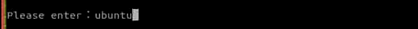

Press **Enter**, and a QR code containing the input data will be displayed.


5. To exit the QR code window, press the **ESC** key or the **q** key.

6. Returning to the command-line terminal, the message displayed below confirms that the QR code has been successfully generated and saved.

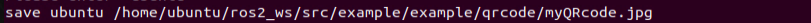

* **Program Analysis**

The source code for the program is located at: **/home/ubuntu/ros2_ws/src/example/example/qrcode/qrcode_creater.py**.

```python
# encoding: utf-8
import os
import cv2
import qrcode
import numpy as np

def create_qrcode(data, file_name):
    qr = qrcode.QRCode(
        version=1,
        error_correction=qrcode.constants.ERROR_CORRECT_H,
        box_size=5,
        border=4)
    # Add data
    qr.add_data(data)
    # Fill data
    qr.make(fit=True)
    # Generate image
    img = qr.make_image(fill_color=(0, 0, 0), back_color=(255, 255, 255))
```

- **Creating a QR Code Tool Object**

Use the `qrcode` module to create the required object and set the parameters for the QR code.

```python
    qr = qrcode.QRCode(
        version=1,
        error_correction=qrcode.constants.ERROR_CORRECT_H,
        box_size=5,
        border=4)
    # Add data
    qr.add_data(data)
```

The parameters of the function shown above are as follows:

The first parameter, `version`, is an integer from 1 to 40 that controls the size of the QR code. To let the program determine the size automatically, set this parameter to `None` and use the `fit` parameter.

The second parameter, `error_correction`, controls the error correction level of the QR code and can take the following values:

1. `ERROR_CORRECT_L` allows approximately 7% or less of errors to be corrected.

2. `ERROR_CORRECT_M` is the default value and allows approximately 15% or less of errors to be corrected.

3. `ERROR_CORRECT_H` allows approximately 30% or less of errors to be corrected.

`box_size` controls the number of pixels contained in each module of the QR code.

`border` controls the number of modules included in the border and defines the distance between the QR code and the image edge. The default value is 4, which is the minimum required by the relevant standard.

- **Generating a QR Code**

Data is added using the `add_data` and `make` functions, and the QR code image is generated using the `make_image` function.

```python
    # Add data
    qr.add_data(data)
    # Fill data
    qr.make(fit=True)
    # Generate image
    img = qr.make_image(fill_color=(0, 0, 0), back_color=(255, 255, 255))
    opencv_img = cv2.cvtColor(np.asarray(img), cv2.COLOR_RGB2BGR)
```

The parameters of the `make_image` function are as follows:

`fill_color=(0, 0, 0)` sets the fill color of the QR code, which is black in this case.

`back_color=(255, 255, 255)` sets the background color of the QR code, which is white.

- **Displaying the Image**

Convert the image’s color space using the `cvtColor` function, then display it in a window using the `imshow` function.

```python
   while True:
        cv2.imshow('img', opencv_img)
        k = cv2.waitKey(1)
        if k != -1:
            break
    cv2.imwrite(file_name, opencv_img)
    print('save', data, file_name)
```

- **Saving the Image**

Use the `imwrite` function to save the generated QR code image and print the relevant information.

```python
    cv2.imwrite(file_name, opencv_img)
    print('save', data, file_name)
```

The parameters of the `imwrite` function are:

`file_name` specifies the storage path of the image.

`opencv_img` is the image to be saved.

### 15.3.2 QR Code Recognition

In the previous section, a QR code is created, which will be used to demonstrate recognizing the content of a QR code.

* **Recognition Process**

First, create an instance of the QR code detector and load the required network structure and model weight files for detection.

Next, capture the video stream from the camera and perform detection on each frame.

Finally, when a QR code is detected, it will be highlighted with a bounding box, and the content of the QR code will be printed.

* **QR Code Recognition Steps**

> [!NOTE]
> 
> **Commands must be entered with correct capitalization. The Tab key can be used to auto-complete keywords.**

1. Power on the robot and connect it via the NoMachine remote control software. For detailed information on connecting to a remote desktop, please refer to section [1.7.2 AP Mode Connection Steps]() in the user manual.

2. Click the terminal icon  in the system desktop to open a ROS1 command-line window.

3. Enter the command to disable the app auto-start service.

```bash
sudo systemctl stop start_app_node.service
```

4. Click the icon  on the system desktop to open a new ROS2 command line terminal. Enter the command to start the camera node:

```bash
ros2 launch peripherals depth_camera.launch.py
```

5. Open a new ROS2 terminal, navigate to the program directory, and start the QR code recognition program by entering the following command:

```bash
cd ~/ros2_ws/src/example/example/qrcode && python3 qrcode_detecter.py
```

To exit the feature, press **Ctrl+C** in the terminal. If the program does not close successfully, try pressing **Ctrl+C** again.

* **Project Outcome**

After starting the feature, the QR code appearing in the returned video frame is detected, highlighted with a red box, and its content is printed.

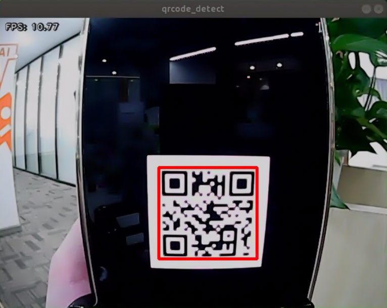

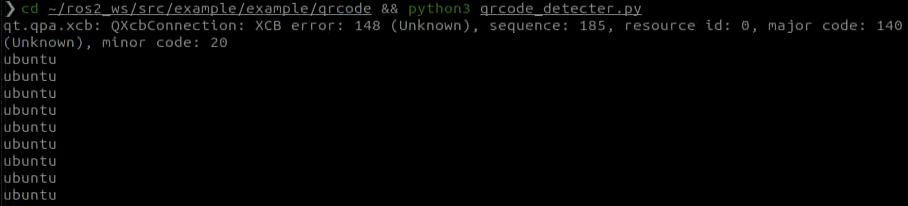

* **Program Analysis**

The source code for the program is located at: **/home/ubuntu/ros2_ws/src/example/example/qrcode/qrcode_detecter.py**.

```python
#!/usr/bin/env python3
# encoding: utf-8
import os
import cv2  
import queue
import rclpy
import threading
import numpy as np
from rclpy.node import Node
from cv_bridge import CvBridge
from sensor_msgs.msg import Image

class QRCodeDetectNode(Node):
    def __init__(self, name):
        rclpy.init()
        super().__init__(name)
        self.running = True
        self.bridge = CvBridge()
        self.model_path = os.path.join(os.path.abspath(os.path.split(os.path.realpath(__file__))[0]), 'model/detector.tflite')
        self.image_queue = queue.Queue(maxsize=2)
        self.image_sub = self.create_subscription(Image, '/depth_cam/rgb0/image_raw', self.image_callback, 1)
        self.qcd = cv2.QRCodeDetector()
        threading.Thread(target=self.main, daemon=True).start()  

    def image_callback(self, ros_image):
        cv_image = self.bridge.imgmsg_to_cv2(ros_image, "bgr8")
        bgr_image = np.array(cv_image, dtype=np.uint8)
```

1. Main Function

Initialize the `QRCodeDetectNode` and set the node name to **qrcode_detect**.

Wait for the ROS node to shut down.

If the node shuts down, unregister the current node.

```python
def main():
    node = QRCodeDetectNode('qrcode_detect')
    try:
        rclpy.spin(node)
    except KeyboardInterrupt:
        node.destroy_node()
        rclpy.shutdown()
        print('shutdown')
    finally:
        print('shutdown finish')

if __name__ == "__main__":
    main()
```

2. `QRCodeDetectNode` Class

The class initializes the node, defines parameters, and starts the `self.main` function.

Parameters:

`self.running` determines whether detection is enabled.

`self.model_path` is the path to the detection model.

`self.image_queue` is the queue for storing images.

`self.image_sub` subscribes to the camera video stream.

`self.qcd` initializes the QR code detection model.

```python
        super().__init__(name)
        self.running = True
        self.bridge = CvBridge()
        self.model_path = os.path.join(os.path.abspath(os.path.split(os.path.realpath(__file__))[0]), 'model/detector.tflite')
        self.image_queue = queue.Queue(maxsize=2)
        self.image_sub = self.create_subscription(Image, '/depth_cam/rgb0/image_raw', self.image_callback, 1)
        self.qcd = cv2.QRCodeDetector()
        threading.Thread(target=self.main, daemon=True).start()  

    def image_callback(self, ros_image):
        cv_image = self.bridge.imgmsg_to_cv2(ros_image, "bgr8")
        bgr_image = np.array(cv_image, dtype=np.uint8)
        if self.image_queue.full():
            # If the queue is full, discard the oldest image
            self.image_queue.get()
            # Put the image into the queue
        self.image_queue.put(bgr_image)

    def main(self):
        while self.running:
            try:
                image = self.image_queue.get(block=True, timeout=1)
            except queue.Empty:
                if not self.running:
                    break
                else:
                    continue
            ret_qr, decoded_info, points, _ = self.qcd.detectAndDecodeMulti(image)
            if ret_qr:
                for s, p in zip(decoded_info, points):
                    if s:
                        print(s)
                        color = (0, 255, 0)
                    else:
                        color = (0, 0, 255)
                    image = cv2.polylines(image, [p.astype(int)], True, color, 8)
            cv2.imshow('image', image)
            key = cv2.waitKey(1)
            if key == ord('q') or key == 27:  # Press q or esc to exit
                break
```

Functions:

Camera callback function reads frames from the camera and places them into `self.image_queue`, automatically updating and discarding outdated images.

```python
    def image_callback(self, ros_image):
        cv_image = self.bridge.imgmsg_to_cv2(ros_image, "bgr8")
        bgr_image = np.array(cv_image, dtype=np.uint8)
        if self.image_queue.full():
            # If the queue is full, discard the oldest image
            self.image_queue.get()
            # Put the image into the queue
        self.image_queue.put(bgr_image)
```

The main function handles QR code detection. It checks the `self.running` parameter to determine whether to start detection. If True, it reads images from the `self.image_queue`, inputs them into the initialized detection model `self.qcd`, and finally prints the recognized content and draws the detection boxes based on the output.

```python
    def main(self):
        while self.running:
            try:
                image = self.image_queue.get(block=True, timeout=1)
            except queue.Empty:
                if not self.running:
                    break
                else:
                    continue
            ret_qr, decoded_info, points, _ = self.qcd.detectAndDecodeMulti(image)
            if ret_qr:
                for s, p in zip(decoded_info, points):
                    if s:
                        print(s)
                        color = (0, 255, 0)
                    else:
                        color = (0, 0, 255)
                    image = cv2.polylines(image, [p.astype(int)], True, color, 8)
            cv2.imshow('image', image)
            key = cv2.waitKey(1)
            if key == ord('q') or key == 27:  # Press q or esc to exit
                break
```


## 15.4 Autonomous Patrolling

### 15.4.1 Recognition Process

Firstly, the program will acquire the RGB image of the camera, scale the image, and perform Gaussian filtering on the image to convert the image color space from RGB to LAB.

Based on this, color thresholds are used to identify the color of the object within the circle. A mask is then applied to the image, which involves selecting parts of the image, graphics, or objects to globally or locally block out areas in the image for processing.

After masking, morphological operations, including opening and closing, are performed on the object image to refine the results.

Opening operation: Involves erosion followed by dilation. Effect: Removes small objects, smooths object boundaries, and does not affect object area. It can remove small particle noise and separate objects that are stuck together.

Erosion: Removes boundary pixels of an object, causing the edges to shrink inward. This operation can eliminate objects smaller than the structuring element.

Dilation: Expands the boundary pixels of an object by merging surrounding background pixels that are in contact with the object, causing the edges to grow outward.

Finally, the recognition results are overlaid on the return image.

### 15.4.2 Autonomous Patrolling Operation

> [!NOTE]
> 
> **Commands must be entered with correct capitalization. The Tab key can be used to auto-complete keywords.**

1. Power on the robot and connect it via the NoMachine remote control software. For detailed information on connecting to a remote desktop, please refer to section [1.7.2 AP Mode Connection Steps]() in the user manual.

2. Click the terminal icon  in the system desktop to open a ROS1 command-line window.

3. Enter the command to disable the app auto-start service.

```bash
sudo systemctl stop start_app_node.service
```

4. Click the icon  on the system desktop to open a new ROS2 command line terminal. Enter the command to start the line-following node:

```bash
ros2 launch app line_following_node.launch.py debug:=true
```

5. Open a new ROS2 command line terminal and enter the command to start the line-following feature.

```bash
ros2 service call /line_following/enter std_srvs/srv/Trigger {}
```

6. Then, in the current terminal, enter the command again to activate line following.

```bash
ros2 service call /line_following/set_running std_srvs/srv/SetBool "{data: True}"
```

7. Click on the line in the interface, select the corresponding color of the track, and the robot will start following the line.

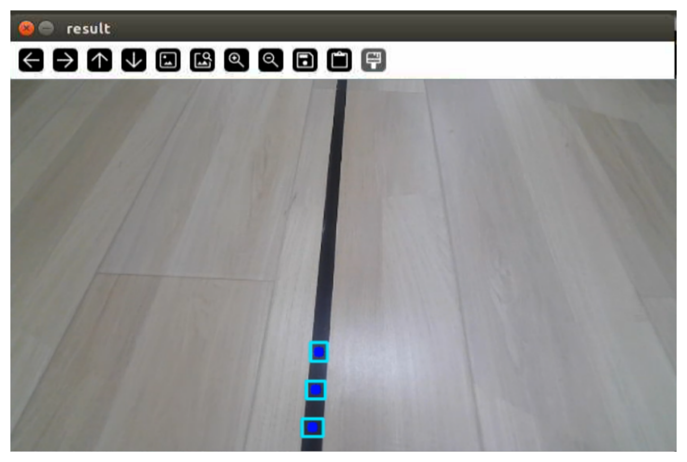

8. To stop this feature, return to the terminal and enter the following command:

```bash
ros2 service call /line_following/enter std_srvs/srv/Trigger {}
```

To exit the feature, press **Ctrl+C** in the terminal. If the program does not close successfully, try pressing **Ctrl+C** again.

### 15.4.3 Program Analysis

* **Launch Analysis**

The program file is located at: **/home/ubuntu/ros2_ws/src/app/launch/line_following_node.launch.py**.

1. Reading Paths

```python
    compiled = os.environ['need_compile']
    debug = LaunchConfiguration('debug', default='false')
    debug_arg = DeclareLaunchArgument('debug', default_value=debug)
    if compiled == 'True':
        controller_package_path = get_package_share_directory('controller')
```

The package path is obtained using `get_package_share_directory`.

2. Launch

```python
peripherals_package_path = '/home/ubuntu/ros2_ws/src/peripherals'
    line_following_node = GroupAction([
        IncludeLaunchDescription(
            PythonLaunchDescriptionSource(
                os.path.join(peripherals_package_path, 'launch/lidar.launch.py')),
            condition=IfCondition(debug),
            ),

        IncludeLaunchDescription(
            PythonLaunchDescriptionSource(
                os.path.join(peripherals_package_path, 'launch/depth_camera.launch.py')),
            condition=IfCondition(debug),
            ),

        IncludeLaunchDescription(
            PythonLaunchDescriptionSource(
                os.path.join(controller_package_path, 'launch/controller.launch.py')),
            condition=IfCondition(debug),
            ),

        Node(
            package='app',
            executable='line_following',
            output='screen',
            parameters=[{'debug': debug}],
            ),
```

`controller_launch` starts the motion control launch file.

`depth_camera_launch` starts the depth camera launch file.

`lidar_launch` starts the LiDAR launch file.

3. None

`line_following_node` starts the line following node.

```python
            package='app',
            executable='line_following',
            output='screen',
```

* **Source Code Analysis**

The program file is located at: **/home/ubuntu/ros2_ws/src/app/app/line_following.py**.

> [!NOTE]
> 
> **Before modifying the program, back up the original factory code. Do not modify the source code file directly to avoid robot malfunction due to incorrect parameter changes.**

Functions

`Main`:

```python
def main():
    node = LineFollowingNode('line_following')
    rclpy.spin(node)
    node.destroy_node()
    rclpy.shutdown()
```

Starts the line-following node.

Class:

`LineFollower`:

```python
class LineFollower:
    def __init__(self, color, node):
        self.node = node
```

`Init`:

```python
    def __init__(self, color, node):
        self.node = node
        self.target_lab, self.target_rgb = color
        if 'Mecanum' in os.environ['MACHINE_TYPE'] or 'Acker' in os.environ['MACHINE_TYPE']:
            self.rois = ((0.90, 0.92, 0, 1, 0.7), (0.78, 0.80, 0, 1, 0.2), (0.66, 0.68, 0, 1, 0.1))
        else:
            self.rois = ((0.81, 0.83, 0, 1, 0.7), (0.69, 0.71, 0, 1, 0.2), (0.57, 0.59, 0, 1, 0.1))
        self.weight_sum = 1.0
```

Sets the line-following color and ROI list.

`get_area_max_contour`:

```python
    def get_area_max_contour(contours, threshold=100):
        '''
        Get the contour of the largest area
        :param contours:
        :param threshold:
        :return:
        '''
        contour_area = zip(contours, tuple(map(lambda c: math.fabs(cv2.contourArea(c)), contours)))
        contour_area = tuple(filter(lambda c_a: c_a[1] > threshold, contour_area))
        if len(contour_area) > 0:
            max_c_a = max(contour_area, key=lambda c_a: c_a[1])
            return max_c_a
        return None
```

Gets the contour with the largest area.

`Call`:

```python
    def __call__(self, image, result_image, threshold, color=None, use_color_picker=True):
        centroid_sum = 0
        h, w = image.shape[:2]
        
        if use_color_picker:
            min_color = [int(self.target_lab[0] - 50 * threshold * 2),
                         int(self.target_lab[1] - 50 * threshold),
                         int(self.target_lab[2] - 50 * threshold)]
            max_color = [int(self.target_lab[0] + 50 * threshold * 2),
                         int(self.target_lab[1] + 50 * threshold),
                         int(self.target_lab[2] + 50 * threshold)]
            target_color = self.target_lab, min_color, max_color
            lowerb = tuple(target_color[1])
            upperb = tuple(target_color[2])
        else:
            lowerb = tuple(color['min'])
            upperb = tuple(color['max'])
        for roi in self.rois:
            blob = image[int(roi[0]*h):int(roi[1]*h), int(roi[2]*w):int(roi[3]*w)]  # Intercept roi
            img_lab = cv2.cvtColor(blob, cv2.COLOR_RGB2LAB)  # Convert rgb into lab
            img_blur = cv2.GaussianBlur(img_lab, (3, 3), 3)  # Perform Gaussian filtering to reduce noise
            mask = cv2.inRange(img_blur, lowerb, upperb)  # Image binarization
            eroded = cv2.erode(mask, cv2.getStructuringElement(cv2.MORPH_RECT, (3, 3)))  # Corrode
            dilated = cv2.dilate(eroded, cv2.getStructuringElement(cv2.MORPH_RECT, (3, 3)))  # Dilate
            # cv2.imshow('section:{}:{}'.format(roi[0], roi[1]), cv2.cvtColor(dilated, cv2.COLOR_GRAY2BGR))
            contours = cv2.findContours(dilated, cv2.RETR_EXTERNAL, cv2.CHAIN_APPROX_TC89_L1)[-2]  # Find the contour
            max_contour_area = self.get_area_max_contour(contours, 30)  # Get the contour corresponding to the largest contour
            if max_contour_area is not None:
                rect = cv2.minAreaRect(max_contour_area[0])  # Minimum circumscribed rectangle
                box = np.intp(cv2.boxPoints(rect))  # Four corners
                for j in range(4):
                    box[j, 1] = box[j, 1] + int(roi[0]*h)
                cv2.drawContours(result_image, [box], -1, (0, 255, 255), 2)  # Draw the rectangle composed of four points
```

Performs color recognition based on the set color and provides feedback on the recognized image and angle.

`LineFollowingNode`:

```python
class LineFollowingNode(Node):
    def __init__(self, name):
        rclpy.init()
        super().__init__(name, allow_undeclared_parameters=True, automatically_declare_parameters_from_overrides=True)
        
        self.name = name
        self.color = ''
        self.set_above = False
        self.set_callback = False
        self.is_running = False
```

`Init`:

```python
    def __init__(self, name):
        rclpy.init()
        super().__init__(name, allow_undeclared_parameters=True, automatically_declare_parameters_from_overrides=True)
        
        self.name = name
        self.color = ''
        self.set_above = False
        self.set_callback = False
        self.is_running = False
        self.color_picker = None
        self.follower = None
        self.scan_angle = math.radians(45)
        self.pid = pid.PID(0.01, 0.0, 0.0)
        self.empty = 0
        self.count = 0
        self.stop = False
        self.threshold = 0.5
```

Initializes parameters required for the program, calls the chassis and camera nodes, and starts services such as enter, exit, start, set color, get color, and set threshold.

`get_node_state`:

```python
    def get_node_state(self, request, response):
        response.success = True
        return response
```

Sets the current node state.

`Main`:

```python
    def main(self):
        while True:
            try:
                image = self.image_queue.get(block=True, timeout=1)
            except queue.Empty:
                continue

            result = cv2.cvtColor(image, cv2.COLOR_RGB2BGR)
            # cv2.imshow("image", result)
            cv2.imshow("image", cv2.resize(result, (display_size[0], display_size[1])))
            if self.debug and not self.set_callback:
                self.set_callback = True
                # Set callback function for mouse clicking event
                cv2.setMouseCallback("image", self.mouse_callback)
            k = cv2.waitKey(1)
            if k != -1:
                break
```

Reads the image and uses the mouse for color selection.

`mouse_callback`:

```python
    def mouse_callback(self, event, x, y, flags, param):
        if event == cv2.EVENT_LBUTTONDOWN:
            self.get_logger().info("x:{} y{}".format(x, y))
            msg = SetPoint.Request()
            if self.image_height is not None and self.image_width is not None:
                msg.data.x = x / self.image_width
                msg.data.y = y / self.image_height
                self.set_target_color_srv_callback(msg, SetPoint.Response())
```

Mouse color selection callback function to obtain the pixel coordinates of the current mouse position.

`enter_srv_callback`:

```python
    def enter_srv_callback(self, request, response):
        self.get_logger().info('\033[1;32m%s\033[0m' % "line following enter")
        with self.lock:
            self.color = ''
            self.stop = False
            self.is_running = False
            self.color_picker = None
            self.pid = pid.PID(1.1, 0.0, 0.0)
            self.follower = None
            self.threshold = 0.5
            self.empty = 0
            if self.image_sub is None:
                if 'ROSOrin' in self.machine_type:
                    self.camera_type = 'Stereo'
                    self.image_sub = self.create_subscription(Image, '/depth_cam/rgb0/image_raw', self.image_callback, 1)  # Subscribe to the camera
                else:
                    self.camera_type = 'Mono'
                    self.image_sub = self.create_subscription(Image, '/usb_cam/image_raw', self.image_callback, 1)  # Subscribe to the camera
            if self.lidar_sub is None:
                qos = QoSProfile(depth=1, reliability=QoSReliabilityPolicy.BEST_EFFORT)
                self.lidar_sub = self.create_subscription(LaserScan, '/scan_raw', self.lidar_callback, qos)  # Subscribe to Lidar data
```

Starts autonomous patrolling, initializes robot motion parameters, and subscribes to camera and LiDAR topics.

`exit_srv_callback`:

```python
    def exit_srv_callback(self, request, response):
        self.get_logger().info('\033[1;32m%s\033[0m' % "line following exit")
        try:
            if self.image_sub is not None:
                self.destroy_subscription(self.image_sub)
                self.image_sub = None
            if self.lidar_sub is not None:
                self.destroy_subscription(self.lidar_sub)
                self.lidar_sub = None
        except Exception as e:
            self.get_logger().error(str(e))
        with self.lock:
            self.is_running = False
            self.color_picker = None
            self.pid = pid.PID(0.01, 0.0, 0.0)
            self.follower = None
            self.threshold = 0.5
            self.mecanum_pub.publish(Twist())
        response.success = True
        response.message = "exit"
        return response
```

Exits the autonomous patrolling service, shuts down all active subscriptions, resets the PID controller, and stops line following.

`set_target_color_srv_callback`:

```python
    def set_target_color_srv_callback(self, request, response):
        self.get_logger().info('\033[1;32m%s\033[0m' % "set_target_color")
        with self.lock:
            self.use_color_picker = True
            x, y = request.data.x, request.data.y
            self.get_logger().info(f'{request.data.x},{request.data.y}')
            # request.data.x  = request.data.x 
            # request.data.y = 
            self.follower = None
            if x == -1 and y == -1:
                self.color_picker = None
            else:
                self.color_picker = ColorPicker(request.data, 5)
                self.mecanum_pub.publish(Twist())
        response.success = True
        response.message = "set_target_color"
        return response
```

Service to set the target line-following color.

`get_target_color_srv_callback`:

```python
    def get_target_color_srv_callback(self, request, response):
        self.get_logger().info('\033[1;32m%s\033[0m' % "get_target_color")
        response.success = False
        response.message = "get_target_color"
        with self.lock:
            if self.follower is not None:
                response.success = True
                rgb = self.follower.target_rgb
                response.message = "{},{},{}".format(int(rgb[0]), int(rgb[1]), int(rgb[2]))
        return response
```

Service to get the target line-following color.

`set_running_srv_callback`:

```python
    def set_running_srv_callback(self, request, response):
        self.get_logger().info('\033[1;32m%s\033[0m' % "set_running")
        with self.lock:
            self.is_running = request.data
            self.empty = 0
            if not self.is_running:
                self.mecanum_pub.publish(Twist())
        response.success = True
        response.message = "set_running"
        return response
```

Service to start the autonomous patrolling feature.

`set_threshold_srv_callback`:

```python
    def set_threshold_srv_callback(self, request, response):
        self.get_logger().info('\033[1;32m%s\033[0m' % "set threshold")
        with self.lock:
            self.threshold = request.data
            response.success = True
            response.message = "set_threshold"
            return response
```

Service to set the color threshold.

`lidar_callback`:

```python
    def lidar_callback(self, lidar_data):
        # Data size= scanning angle/ the increased angle per scan
        if self.lidar_type != 'G4':
            min_index = int(math.radians(MAX_SCAN_ANGLE / 2.0) / lidar_data.angle_increment)
            max_index = int(math.radians(MAX_SCAN_ANGLE / 2.0) / lidar_data.angle_increment)
            left_ranges = lidar_data.ranges[:max_index]  # Left data
            right_ranges = lidar_data.ranges[::-1][:max_index]  # Right data
        elif self.lidar_type == 'G4':
            min_index = int(math.radians((360 - MAX_SCAN_ANGLE) / 2.0) / lidar_data.angle_increment)
            max_index = int(math.radians(180) / lidar_data.angle_increment)
            left_ranges = lidar_data.ranges[min_index:max_index][::-1]  # The left data
            right_ranges = lidar_data.ranges[::-1][min_index:max_index][::-1]  # The right data

        # Get data according to settings
        angle = self.scan_angle / 2
        angle_index = int(angle / lidar_data.angle_increment + 0.50)
        left_range, right_range = np.array(left_ranges[:angle_index]), np.array(right_ranges[:angle_index])

        left_nonzero = left_range.nonzero()
        right_nonzero = right_range.nonzero()
        left_nonan = np.isfinite(left_range[left_nonzero])
        right_nonan = np.isfinite(right_range[right_nonzero])
        # Take the nearest distance left and right
        min_dist_left_ = left_range[left_nonzero][left_nonan]
        min_dist_right_ = right_range[right_nonzero][right_nonan]
        if len(min_dist_left_) > 0 and len(min_dist_right_) > 0:
            min_dist_left = min_dist_left_.min()
            min_dist_right = min_dist_right_.min()
            if min_dist_left < self.stop_threshold or min_dist_right < self.stop_threshold:
                self.stop = True
            else:
                self.count += 1
                if self.count > 5:
                    self.count = 0
                    self.stop = False
```

The Lidar callback function processes the received data and determines whether to stop moving.

`image_callback`:

```python
    def image_callback(self, ros_image):
        cv_image = self.bridge.imgmsg_to_cv2(ros_image, "rgb8")
        rgb_image = np.array(cv_image, dtype=np.uint8)
        rgb_image = cv2.resize(rgb_image, (640,480))
        self.image_height, self.image_width = rgb_image.shape[:2]
        result_image = np.copy(rgb_image)  # The image used to display the result
        with self.lock:
            if self.use_color_picker:
                # Color picker and line recognition are exclusive. If there is color picker, start picking
                if self.color_picker is not None:  # Color picker exists
                    try:
                        target_color, result_image = self.color_picker(rgb_image, result_image)
                        if target_color is not None:
                            self.color_picker = None
                            self.follower = LineFollower(target_color, self)
                            self.get_logger().info("target color: {}".format(target_color))
                    except Exception as e:
                        self.get_logger().error(str(e))
                else:
                    twist = Twist()
                    twist.linear.x = 0.15
                    if self.follower is not None:
                        try:
                            result_image, deflection_angle = self.follower(rgb_image, result_image, self.threshold)
                            if deflection_angle is not None and self.is_running and not self.stop:
                                self.pid.update(deflection_angle)
                                if 'Acker' in self.machine_type:
                                    steering_angle = common.set_range(-self.pid.output, -math.radians(322/2000*180), math.radians(322/2000*180))
                                    if steering_angle != 0:
                                        R = 0.17706/math.tan(steering_angle)
                                        twist.angular.z = twist.linear.x/R
                                else:
                                    twist.angular.z = common.set_range(-self.pid.output, -1.0, 1.0)
                                self.mecanum_pub.publish(twist)
                            elif self.stop:
                                self.mecanum_pub.publish(Twist())
                            else:
                                self.pid.clear()
                        except Exception as e:
                            self.get_logger().error(str(e))
            else:
                twist = Twist()
                if self.color in common.range_rgb:
                    twist.linear.x = 0.15
                    self.follower = LineFollower([None, common.range_rgb[self.color]], self)
                    result_image, deflection_angle = self.follower(rgb_image, result_image, self.threshold, self.lab_data['lab'][self.camera_type][self.color], False)
                    if deflection_angle is not None and self.is_running and not self.stop:
                        self.pid.update(deflection_angle)
                        if 'Acker' in self.machine_type:
                            steering_angle = common.set_range(-self.pid.output, -math.radians(322/2000*180), math.radians(322/2000*180))
                            if steering_angle != 0:
                                R = 0.17706/math.tan(steering_angle)
                                twist.angular.z = twist.linear.x/R
                        else:
                            twist.angular.z = common.set_range(-self.pid.output, -1.0, 1.0)
                        self.mecanum_pub.publish(twist)
                    elif self.stop:
                        self.mecanum_pub.publish(Twist())
                    else:
                        self.pid.clear()
                else:
                    self.mecanum_pub.publish(twist)
        if self.debug:
            if self.image_queue.full():
                # If the queue is full, discard the oldest image
                self.image_queue.get()
```

The camera callback function uses the received data to invoke the color picker and controls the robot’s movement along the recognized line using PID.