# 16\. ROS2-ROS+Machine Learning Course

## 16.1 MediaPipe Human-Robot Interaction

### 16.1.1 MediaPipe Introduction and Getting Started

#### 16.1.1.1 Overview of MediaPipe

MediaPipe is an open-source framework designed for building multimedia machine learning pipelines. It is cross-platform and can run on mobile devices, workstations, and servers, with support for mobile GPU acceleration. MediaPipe is compatible with inference engines such as TensorFlow and TensorFlow Lite, allowing seamless integration with models from both platforms. Additionally, it offers GPU acceleration on mobile and embedded platforms.

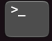

#### 16.1.1.2 Pros and Cons

* **Advantages of MediaPipe**

1. MediaPipe supports various platforms and languages, including iOS, Android, C++, Python, JAVAScript, Coral, etc.

2. The performance is fast, and the model can generally run in real time.

3. Both the model and code allow for high reusability.

* **Disadvantages of MediaPipe**

1. For mobile devices, MediaPipe will occupy 10 MB or more.

2. It heavily depends on TensorFlow, and switching to another machine learning framework would require significant code changes.

3. The framework uses static graphs, which improve efficiency but also make it more difficult to detect errors.

#### 16.1.1.3 MediaPipe Usage Workflow

The figure below shows how to use MediaPipe. The solid line represents the part to be coded, and the dotted line indicates the part not to be coded. MediaPipe can offer the result and the function realization framework quickly.


* **Dependency**

MediaPipe relies on OpenCV for video processing and FFMPEG for audio data processing. It also has other dependencies, such as OpenGL/Metal, TensorFlow, Eigen, and others.

It is recommended to gain a basic understanding of OpenCV before starting with MediaPipe. Information about OpenCV can be found in the folder: [Basic Course / OpenCV Computer Vision Lesson](https://drive.google.com/drive/folders/1UBsPV79gPzK0EXmAq-k5Wz_2r1vk55od).

* **MediaPipe Solutions**

Solutions are based on the open-source pre-constructed sample of TensorFlow or TFLite. MediaPipe Solutions is built upon a framework, which provides 16 Solutions, including face detection, Face Mesh, iris, hand, posture, human body, and so on.

#### 16.1.1.4 Websites for MediaPipe Learning

MediaPipe Official Website: *https://developers.google.com/mediapipe*

MediaPipe Wiki: *http://i.bnu.edu.cn/wiki/index.php?title=Mediapipe*

MediaPipe github: *https://github.com/google/mediapipe*

dlib Official Website: *http://dlib.net/*

dlib github: *https://github.com/davisking/dlib*


### 16.1.2 Background Segmentation

In this lesson, MediaPipe’s Selfie Segmentation model is used to segment trained models from the background and then apply a virtual background, such as a face or a hand.

#### 16.1.2.1 Experiment Overview

First, the MediaPipe selfie segmentation model is imported, and real-time video is obtained by subscribing to the camera topic.

Next, the image is processed, and the segmentation mask is drawn onto the background image. Bilateral filtering is used to improve the segmentation around the edges.

Finally, the background is replaced with a virtual one.

#### 16.1.2.2 Operation Steps

Power on the robot and connect it via the NoMachine remote control software. For detailed information, please refer to the section [1.7.2 AP Mode Connection Steps](https://wiki.hiwonder.com/projects/ROSOrin/en/jetson-nano/docs/1_ROSOrin_User_Manual.html#ap-mode-connection-steps) in the user manual.

1. Click the terminal icon 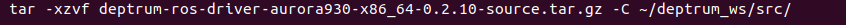 in the system desktop to open a ROS1 command-line window.

2. Enter the command to disable the app auto-start service.

```bash
sudo systemctl stop start_app_node.service
```

3. Click the icon 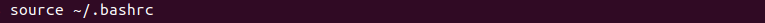 on the system desktop to open a new ROS2 command line terminal. Enter the command to start the camera node:

```bash
ros2 launch peripherals depth_camera.launch.py
```

4. Open a new ROS2 command-line terminal, enter the command, and press **Enter** to run the program.

```bash
cd ~/ros2_ws/src/example/example/mediapipe_example && python3 self_segmentation.py
```

5. To exit this feature, press the **Esc** key in the image window to close the camera feed.

6. To exit the feature, press **Ctrl+C** in the terminal. If the program does not close successfully, try pressing **Ctrl+C** again.

#### 16.1.2.3 Project Outcome

After starting the feature, the entire returned image is transformed into a uniform gray virtual background. Once a real hand enters the camera's field of view, the system immediately and accurately detects and separates the hand from the background.

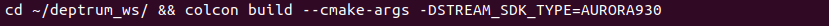

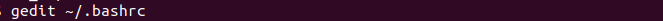

#### 16.1.2.4 Program Analysis

The program file of the feature is located at: **/ros2_ws/src/example/example/mediapipe_example/self_segmentation.py**

* **Functions**

Main:

```python
def main():
    node = SegmentationNode('self_segmentation')
    try:
        rclpy.spin(node)
    except KeyboardInterrupt:
        node.destroy_node()
        rclpy.shutdown()
        print('shutdown')
    finally:
        print('shutdown finish')
```

Starts the background control node.

* **Class**

`SegmentationNode`:

```python
class SegmentationNode(Node):
    def __init__(self, name):
        rclpy.init()
        super().__init__(name)
        self.running = True
        self.bridge = CvBridge()
        self.mp_selfie_segmentation = mp.solutions.selfie_segmentation
        self.mp_drawing = mp.solutions.drawing_utils
        self.fps = fps.FPS()
        self.image_queue = queue.Queue(maxsize=2)
        self.BG_COLOR = (192, 192, 192)  # gray
        self.image_sub = self.create_subscription(Image, '/depth_cam/rgb0/image_raw', self.image_callback, 1)
        self.get_logger().info('\033[1;32m%s\033[0m' % 'start')
        threading.Thread(target=self.main, daemon=True).start()
```

`Init`:

```python
    def __init__(self, name):
        rclpy.init()
        super().__init__(name)
        self.running = True
        self.bridge = CvBridge()
        self.mp_selfie_segmentation = mp.solutions.selfie_segmentation
        self.mp_drawing = mp.solutions.drawing_utils
        self.fps = fps.FPS()
        self.image_queue = queue.Queue(maxsize=2)
        self.BG_COLOR = (192, 192, 192)  # gray
        self.image_sub = self.create_subscription(Image, '/depth_cam/rgb0/image_raw', self.image_callback, 1)
        self.get_logger().info('\033[1;32m%s\033[0m' % 'start')
        threading.Thread(target=self.main, daemon=True).start()
```

Initializes the parameters required for background segmentation, calls the image callback function, and starts the model inference function.

`image_callback`:

```python
    def image_callback(self, ros_image):
        cv_image = self.bridge.imgmsg_to_cv2(ros_image, "rgb8")
        rgb_image = np.array(cv_image, dtype=np.uint8)
        if self.image_queue.full():
            # If the queue is full, remove the oldest image
            self.image_queue.get()
            # Put the image into the queue
        self.image_queue.put(rgb_image)
```

The image callback function is used to read data from the camera node and enqueue it.

`Main`:

```python
    def main(self):
        with self.mp_selfie_segmentation.SelfieSegmentation(
            model_selection=1) as selfie_segmentation:
            bg_image = None
            while self.running:
                try:
                    image = self.image_queue.get(block=True, timeout=1)
                except queue.Empty:
                    if not self.running:
                        break
                    else:
                        continue
                # To improve performance, optionally mark the image as not writeable to
                # pass by reference.
                image.flags.writeable = False
                results = selfie_segmentation.process(image)
                image.flags.writeable = True
                image = cv2.cvtColor(image, cv2.COLOR_RGB2BGR)
                # Draw selfie segmentation on the background image.
                # To improve segmentation around boundaries, consider applying a joint
                # bilateral filter to "results.segmentation_mask" with "image".
                condition = np.stack(
                        (results.segmentation_mask,) * 3, axis=-1) > 0.1
                # The background can be customized.
                #   a) Load an image (with the same width and height of the input image) to
                #      be the background, e.g., bg_image = cv2.imread('/path/to/image/file')
                #   b) Blur the input image by applying image filtering, e.g.,
                #      bg_image = cv2.GaussianBlur(image,(55,55),0)
                if bg_image is None:
                  bg_image = np.zeros(image.shape, dtype=np.uint8)
                  bg_image[:] = self.BG_COLOR
                output_image = np.where(condition, image, bg_image)
                self.fps.update()
                result_image = self.fps.show_fps(output_image)
                cv2.imshow('MediaPipe Selfie Segmentation', result_image)
                key = cv2.waitKey(1)
                if key == ord('q') or key == 27:  # Press Q or Esc to quit
                    break
        cv2.destroyAllWindows()
        rclpy.shutdown()
```

The model within `mediapipe` is loaded, the image is passed as input, and the output image is displayed using `opencv` after processing.


### 16.1.3 3D Object Detection

#### 16.1.3.1 Experiment Overview

First, import MediaPipe’s 3D Objection and subscribe to the topic messages to obtain the real-time camera feed.

Next, apply preprocessing steps such as image flipping, and then perform 3D object detection on the images.

Finally, draw 3D bounding boxes on the detected objects in the image. In this section, a cup is used for demonstration.

#### 16.1.3.2 Operation Steps

Power on the robot and connect it via the NoMachine remote control software. For detailed information, please refer to the section [1.7.2 AP Mode Connection Steps](https://wiki.hiwonder.com/projects/ROSOrin/en/jetson-nano/docs/1_ROSOrin_User_Manual.html#ap-mode-connection-steps) in the user manual.

1. Click the terminal icon  in the system desktop to open a ROS1 command-line window.

2. Enter the command to disable the app auto-start service.

```bash
sudo systemctl stop start_app_node.service
```

3. Click the icon  on the system desktop to open a new ROS2 command line terminal. Enter the command to start the camera node:

```bash
ros2 launch peripherals depth_camera.launch.py
```

4. Open a new ROS2 command-line terminal, enter the command, and press **Enter** to run the program.

```bash
cd ~/ros2_ws/src/example/example/mediapipe_example && python3 objectron.py
```

5. To exit this feature, press the **Esc** key in the image window to close the camera feed.

6. To exit the feature, press **Ctrl+C** in the terminal. If the program does not close successfully, try pressing **Ctrl+C** again.

#### 16.1.3.3 Project Outcome

Once the program starts, a 3D bounding box will appear around the detected object in the camera view. Currently, four types of objects are supported: a cup with a handle, a shoe, a chair, and a camera. For example, when detecting a cup, the effect is shown as follows:

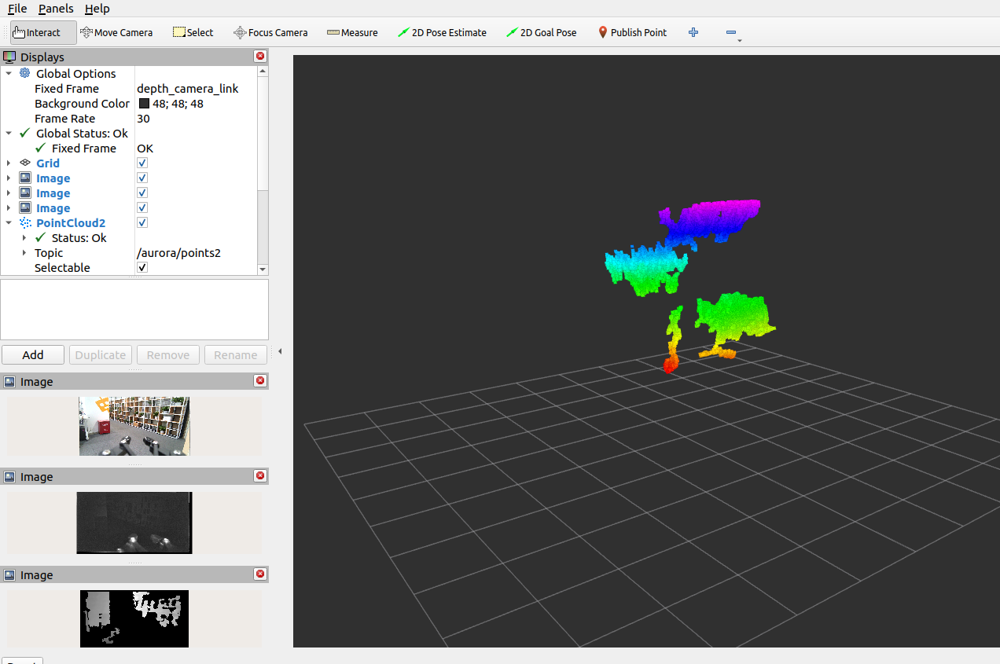

#### 16.1.3.4 Program Analysis

The program file of the feature is located at: **/ros2_ws/src/example/example/mediapipe_example/objectron.py**

* **Functions**

`Main`:

```python
def main():
    node = ObjectronNode('objectron')
    try:
        rclpy.spin(node)
    except KeyboardInterrupt:
        node.destroy_node()
        rclpy.shutdown()
        print('shutdown')
    finally:
        print('shutdown finish')
```

Used to start the 3D detection node.

* **Class**

`ObjectronNode`:

```python
class ObjectronNode(Node):
    def __init__(self, name):
        rclpy.init()
        super().__init__(name)
        self.running = True
        self.bridge = CvBridge()
        self.mp_objectron = mp.solutions.objectron
        self.mp_drawing = mp.solutions.drawing_utils
        self.fps = fps.FPS()
        self.image_queue = queue.Queue(maxsize=2)
        self.image_sub = self.create_subscription(Image, '/depth_cam/rgb0/image_raw', self.image_callback, 1)
        self.get_logger().info('\033[1;32m%s\033[0m' % 'start')
        threading.Thread(target=self.main, daemon=True).start()
```

`Init`:

```python
    def __init__(self, name):
        rclpy.init()
        super().__init__(name)
        self.running = True
        self.bridge = CvBridge()
        self.mp_objectron = mp.solutions.objectron
        self.mp_drawing = mp.solutions.drawing_utils
        self.fps = fps.FPS()
        self.image_queue = queue.Queue(maxsize=2)
        self.image_sub = self.create_subscription(Image, '/depth_cam/rgb0/image_raw', self.image_callback, 1)
        self.get_logger().info('\033[1;32m%s\033[0m' % 'start')
        threading.Thread(target=self.main, daemon=True).start()
```

Initializes the parameters required for 3D recognition, calls the image callback function, and starts the model inference function.

`image_callback`:

```python
    def image_callback(self, ros_image):
        cv_image = self.bridge.imgmsg_to_cv2(ros_image, "rgb8")
        rgb_image = np.array(cv_image, dtype=np.uint8)
        if self.image_queue.full():
            # If the queue is full, remove the oldest image
            self.image_queue.get()
            # Put the image into the queue
        self.image_queue.put(rgb_image)
```

The image callback function is used to read data from the camera node and enqueue it.

`Main `:

```python
    def main(self):
        with self.mp_objectron.Objectron(static_image_mode=False,
                                max_num_objects=1,
                                min_detection_confidence=0.4,
                                min_tracking_confidence=0.5,
                                model_name='Cup') as objectron:
            while self.running:
                try:
                    image = self.image_queue.get(block=True, timeout=1)
                except queue.Empty:
                    if not self.running:
                        break
                    else:
                        continue
                # To improve performance, optionally mark the image as not writeable to
                # pass by reference.
                image.flags.writeable = False
                results = objectron.process(image)

                # Draw the box landmarks on the image.
                image.flags.writeable = True
                image = cv2.cvtColor(image, cv2.COLOR_RGB2BGR)
                if results.detected_objects:
                    for detected_object in results.detected_objects:
                        self.mp_drawing.draw_landmarks(
                          image, detected_object.landmarks_2d, self.mp_objectron.BOX_CONNECTIONS)
                        self.mp_drawing.draw_axis(image, detected_object.rotation,
                                             detected_object.translation)
                self.fps.update()
                result_image = self.fps.show_fps(cv2.flip(image, 1))
                # Flip the image horizontally for a selfie-view display.
                cv2.imshow('MediaPipe Objectron', result_image)
                key = cv2.waitKey(1)
                if key == ord('q') or key == 27:  # Press Q or Esc to quit
                    break

        cv2.destroyAllWindows()
        rclpy.shutdown()
```

Loads the model from `mediapipe`, feeds the image into the model, and then uses OpenCV to draw object edges and display the results.


### 16.1.4 Face Detection

In this program, MediaPipe’s face detection model is utilized to detect a human face within the camera image.

MediaPipe Face Detection is a high-speed face detection solution that provides six key landmarks and supports multiple faces. Based on BlazeFace, a lightweight and efficient face detector optimized for mobile GPU inference.

#### 16.1.4.1 Experiment Overview

First, import the MediaPipe face detection model and subscribe to the topic messages to obtain the real-time camera feed.

Next, use OpenCV to process the image, including flipping and converting the color space.

Next, the system compares the detection confidence against the model’s minimum threshold to determine if face detection is successful. Once a face is detected, the system will analyze the set of facial features. Each face is represented as a detection message that contains a bounding box and six key landmarks, including right eye, left eye, nose tip, mouth center, right ear region, and left ear region.

Finally, the face will be outlined with a bounding box, and the six key landmarks will be marked on the image.

#### 16.1.4.2 Operation Steps

Power on the robot and connect it via the NoMachine remote control software. For detailed information, please refer to the section [1.7.2 AP Mode Connection Steps](https://wiki.hiwonder.com/projects/ROSOrin/en/jetson-nano/docs/1_ROSOrin_User_Manual.html#ap-mode-connection-steps) in the user manual.

1. Click the terminal icon  in the system desktop to open a ROS1 command-line window.

2. Enter the command to disable the app auto-start service.

```bash
sudo systemctl stop start_app_node.service
```

3. Click the icon  on the system desktop to open a new ROS2 command line terminal. Enter the command to start the camera node:

```bash
ros2 launch peripherals depth_camera.launch.py
```

4. Open a new ROS2 command-line terminal, enter the command, and press **Enter** to run the program.

```bash
cd ~/ros2_ws/src/example/example/mediapipe_example && python3 face_detect.py
```

5. To exit this feature, press the **Esc** key in the image window to close the camera feed.

6. To exit the feature, press **Ctrl+C** in the terminal. If the program does not close successfully, try pressing **Ctrl+C** again.

#### 16.1.4.3 Project Outcome

Once the feature is activated, the depth camera is immediately powered on and the face detection algorithm is executed. As soon as a face is detected, the robot accurately highlights the face region in the returned image with a prominent frame.

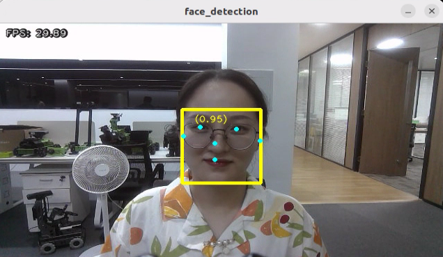

#### 16.1.4.4 Program Analysis

The program file of the feature is located at: **/ros2_ws/src/example/example/mediapipe_example/face_detect.py**

* **Functions**

`Main`:

```python
def main():
    node = FaceDetectionNode('face_detection')
    try:
        rclpy.spin(node)
    except KeyboardInterrupt:
        node.destroy_node()
        rclpy.shutdown()
        print('shutdown')
    finally:
        print('shutdown finish')
```

Launches the face detection node.

* **Class**

`FaceDetectionNode`:

```python
def __init__(self, name):
    rclpy.init()
    super().__init__(name)
    self.running = True
    self.bridge = CvBridge()
    model_path = os.path.join(os.path.abspath(os.path.split(os.path.realpath(__file__))[0]), 'model/detector.tflite')
    base_options = python.BaseOptions(model_asset_path=model_path)
    options = vision.FaceDetectorOptions(base_options=base_options)
    self.detector = vision.FaceDetector.create_from_options(options)
    self.fps = fps.FPS()
    self.image_queue = queue.Queue(maxsize=2)
    self.image_sub = self.create_subscription(Image, '/depth_cam/rgb0/image_raw', self.image_callback, 1)
    self.get_logger().info('\033[1;32m%s\033[0m' % 'start')
    threading.Thread(target=self.main, daemon=True).start()
```

`Init`:

```python
    super().__init__(name)
    self.running = True
    self.bridge = CvBridge()
    model_path = os.path.join(os.path.abspath(os.path.split(os.path.realpath(__file__))[0]), 'model/detector.tflite')
    base_options = python.BaseOptions(model_asset_path=model_path)
    options = vision.FaceDetectorOptions(base_options=base_options)
    self.detector = vision.FaceDetector.create_from_options(options)
    self.fps = fps.FPS()
    self.image_queue = queue.Queue(maxsize=2)
    self.image_sub = self.create_subscription(Image, '/depth_cam/rgb0/image_raw', self.image_callback, 1)
    self.get_logger().info('\033[1;32m%s\033[0m' % 'start')
    threading.Thread(target=self.main, daemon=True).start()
```

Initializes the parameters required for face recognition, calls the image callback function, and starts the model inference function.

`image_callback`:

```python
def image_callback(self, ros_image):
    cv_image = self.bridge.imgmsg_to_cv2(ros_image, "rgb8")
    rgb_image = np.array(cv_image, dtype=np.uint8)
    if self.image_queue.full():
        # If the queue is full, discard the oldest image
        self.image_queue.get()
        # Put the image into the queue
    self.image_queue.put(rgb_image)
```

The image callback function is used to read data from the camera node and enqueue it.

`Main`:

```python
def main(self):
    while self.running:
        try:
            image = self.image_queue.get(block=True, timeout=1)
        except queue.Empty:
            if not self.running:
                break
            else:
                continue
        image = cv2.flip(image, 1)
        mp_image = mp.Image(image_format=mp.ImageFormat.SRGB, data=image)
        detection_result = self.detector.detect(mp_image)

        annotated_image = visualize(image, detection_result)
        self.fps.update()
        result_image = self.fps.show_fps(cv2.cvtColor(annotated_image, cv2.COLOR_RGB2BGR))
        cv2.imshow('face_detection', result_image)
        key = cv2.waitKey(1)
        if key == ord('q') or key == 27:  # Press Q or Esc to quit
          break

    cv2.destroyAllWindows()
    rclpy.shutdown()
```

Load the model from `mediapipe`, input the image, and then use `opencv` to draw facial keypoints and display the returned image.


### 16.1.5 3D Face Detection

In this program, MediaPipe Face Mesh is utilized to detect the human face within the camera image.

MediaPipe Face Mesh is a powerful model capable of estimating 468 3D facial features, even when deployed on a mobile device. It uses machine learning (ML) to infer 3D facial structure. This model leverages a lightweight architecture and GPU acceleration to deliver critical real-time performance.

Additionally, the solution is bundled with a face transformation module that bridges the gap between facial landmark estimation and practical real-time augmented reality (AR) applications. It establishes a metric 3D space and uses the screen positions of facial landmarks to estimate face transformations within that space. The face transformation data consists of common 3D primitives, including a facial pose transformation matrix and a triangulated face mesh.

#### 16.1.5.1 Experiment Overview

First, it’s important to understand that the machine learning pipeline used here, which can be thought of as a linear process, consists of two real-time deep neural network models working in tandem: One is a detector that processes the full image to locate faces. The other is a face landmark model that operates on those locations and uses regression to predict an approximate 3D surface.

For the 3D face landmarks, transfer learning was applied, and a multi-task network was trained. This network simultaneously predicts 3D landmark coordinates on synthetic rendered data and 2D semantic contours on annotated real-world data. As a result, the network is informed by both synthetic and real-world data, allowing for accurate 3D landmark prediction.

The 3D landmark model takes cropped video frames as input, without requiring additional depth input. It outputs the positions of 3D points along with a probability score indicating whether a face is present and properly aligned in the input.

After importing the face mesh model, you can subscribe to the topic messages to obtain the real-time camera feed.

The image is processed through operations such as flipping and color space conversion. Then, by comparing the face detection confidence to a predefined threshold, it determines whether a face has been successfully detected.

Finally, a 3D mesh is rendered over the detected face in the video feed.

#### 16.1.5.2 Operation Steps

Power on the robot and connect it via the NoMachine remote control software. For detailed information, please refer to the section [1.7.2 AP Mode Connection Steps](https://wiki.hiwonder.com/projects/ROSOrin/en/jetson-nano/docs/1_ROSOrin_User_Manual.html#ap-mode-connection-steps) in the user manual.

1. Click the terminal icon  in the system desktop to open a ROS1 command-line window.

2. Enter the command to disable the app auto-start service.

```bash
sudo systemctl stop start_app_node.service
```

3. Click the icon  on the system desktop to open a new ROS2 command line terminal. Enter the command to start the camera node:

```bash
ros2 launch peripherals depth_camera.launch.py
```

4. Open a new ROS2 command-line terminal, enter the command, and press **Enter** to run the program.

```bash
cd ~/ros2_ws/src/example/example/mediapipe_example && python3 face_mesh.py
```

5. To exit this feature, press the **Esc** key in the image window to close the camera feed.

6. To exit the feature, press **Ctrl+C** in the terminal. If the program does not close successfully, try pressing **Ctrl+C** again.

#### 16.1.5.3 Project Outcome

Once the feature is started, the depth camera detects a face and highlights it with a bounding box in the returned video feed.

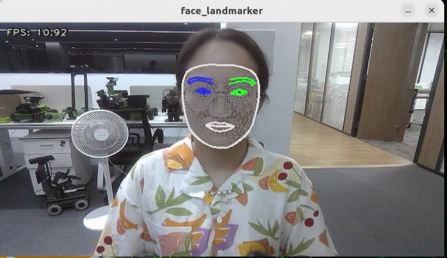

#### 16.1.5.4 Program Analysis

The program file of the feature is located at: **/ros2_ws/src/example/example/mediapipe_example/face_mesh.py**

* **Functions**

`Main`:

```python
def main():
    node = FaceMeshNode('face_landmarker')
    try:
        rclpy.spin(node)
    except KeyboardInterrupt:
        node.destroy_node()
        rclpy.shutdown()
        print('shutdown')
    finally:
        print('shutdown finish')
```

Used to launch the 3D face detection node.

* **Class**

`FaceMeshNode`:

```python
class FaceMeshNode(Node):
    def __init__(self, name):
        rclpy.init()
        super().__init__(name)
        self.running = True
        self.bridge = CvBridge()
        model_path = os.path.join(os.path.abspath(os.path.split(os.path.realpath(__file__))[0]), 'model/face_landmarker_v2_with_blendshapes.task')
        base_options = python.BaseOptions(model_asset_path=model_path)
        options = vision.FaceLandmarkerOptions(base_options=base_options,
                                       output_face_blendshapes=True,
                                       output_facial_transformation_matrixes=True,
                                       num_faces=1)
```

`Init`:

```python
        rclpy.init()
        super().__init__(name)
        self.running = True
        self.bridge = CvBridge()
        model_path = os.path.join(os.path.abspath(os.path.split(os.path.realpath(__file__))[0]), 'model/face_landmarker_v2_with_blendshapes.task')
        base_options = python.BaseOptions(model_asset_path=model_path)
        options = vision.FaceLandmarkerOptions(base_options=base_options,
                                       output_face_blendshapes=True,
                                       output_facial_transformation_matrixes=True,
                                       num_faces=1)
        self.detector = vision.FaceLandmarker.create_from_options(options)

        self.fps = fps.FPS()

        self.image_queue = queue.Queue(maxsize=2)
        self.image_sub = self.create_subscription(Image, '/depth_cam/rgb0/image_raw', self.image_callback, 1)
        self.get_logger().info('\033[1;32m%s\033[0m' % 'start')
        threading.Thread(target=self.main, daemon=True).start()
```

Initializes the parameters required for 3D face detection, calls the image callback function, and starts the model inference function.

`image_callback`:

```python
    def image_callback(self, ros_image):
        cv_image = self.bridge.imgmsg_to_cv2(ros_image, "rgb8")
        rgb_image = np.array(cv_image, dtype=np.uint8)
        if self.image_queue.full():
            # If the queue is full, discard the oldest image
            self.image_queue.get()
            # Put the image into the queue
        self.image_queue.put(rgb_image)
```

The image callback function is used to read data from the camera node and enqueue it.

`Main `:

```python
    def main(self):
        while self.running:
            try:
                image = self.image_queue.get(block=True, timeout=1)
            except queue.Empty:
                if not self.running:
                    break
                else:
                    continue
            image = cv2.flip(image, 1)
            mp_image = mp.Image(image_format=mp.ImageFormat.SRGB, data=image)
            detection_result = self.detector.detect(mp_image)
            annotated_image = draw_face_landmarks_on_image(image, detection_result)
            self.fps.update()
            result_image = self.fps.show_fps(cv2.cvtColor(annotated_image, cv2.COLOR_RGB2BGR))
            cv2.imshow('face_landmarker', result_image)
            key = cv2.waitKey(1)
            if key == ord('q') or key == 27:  # Press Q or Esc to quit
                break
        cv2.destroyAllWindows()
        rclpy.shutdown()
```

Loads the model from MediaPipe, feeds the image into it, and uses OpenCV to draw facial keypoints and display the returned video feed.


### 16.1.6 Hand Keypoint Detection

In this lesson, MediaPipe’s hand detection model is used to display hand keypoints and the connecting lines between them on the returned image.

MediaPipe Hands is a high-fidelity hand and finger tracking model. It uses machine learning (ML) to infer 21 3D landmarks of a hand from a single frame.

#### 16.1.6.1 Experiment Overview

First, it's important to understand that MediaPipe's palm detection model utilizes a machine learning pipeline composed of multiple models, which is a linear model, similar to an assembly line. The model processes the entire image and returns an oriented hand bounding box. The hand landmark model then operates on the cropped image region defined by the palm detector and returns high-fidelity 3D hand keypoints.

After importing the hand detection model, the system subscribes to topic messages to acquire real-time camera images. The images are then processed with flipping and color space conversion, which greatly reduces the need for data augmentation for the hand landmark model.

In addition, the pipeline can generate crops based on the hand landmarks recognized in the previous frame. The palm detection model is only invoked to re-locate the hand when the landmark model can no longer detect its presence.

Next, the system compares the detection confidence against the model’s minimum threshold to determine if hand detection is successful.

Finally, it detects and draws the hand keypoints on the output image.

#### 16.1.6.2 Operation Steps

Power on the robot and connect it via the NoMachine remote control software. For detailed information, please refer to the section [1.7.2 AP Mode Connection Steps](https://wiki.hiwonder.com/projects/ROSOrin/en/jetson-nano/docs/1_ROSOrin_User_Manual.html#ap-mode-connection-steps) in the user manual.

1. Click the terminal icon  in the system desktop to open a ROS1 command-line window.

2. Enter the command to disable the app auto-start service.

```bash
sudo systemctl stop start_app_node.service
```

3. Click the icon  on the system desktop to open a new ROS2 command line terminal. Enter the command to start the camera node:

```bash
ros2 launch peripherals depth_camera.launch.py
```

4. Open a new ROS2 command-line terminal, enter the command, and press **Enter** to run the program.

```bash
cd ~/ros2_ws/src/example/example/mediapipe_example && python3 hand.py
```

5. To exit this feature, press the **Esc** key in the image window to close the camera feed.

6. To exit the feature, press **Ctrl+C** in the terminal. If the program does not close successfully, try pressing **Ctrl+C** again.

#### 16.1.6.3 Project Outcome

Once the feature is activated, the depth camera is immediately powered on, and the hand detection model is triggered for hand detection. Once a hand is successfully detected, the system intelligently marks the key points of the hand in the returned image and automatically draws the connecting lines between these points.

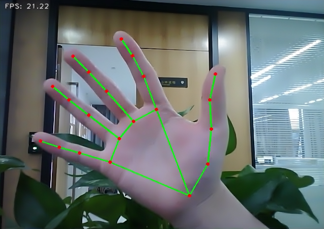

#### 16.1.6.4 Program Analysis

The program file of the feature is located at: **/ros2_ws/src/example/example/mediapipe_example/hand.py**

* **Functions**

`Main`:

```python
def main():
    node = HandNode('hand_landmarker')
    try:
        rclpy.spin(node)
    except KeyboardInterrupt:
        node.destroy_node()
        rclpy.shutdown()
        print('shutdown')
    finally:
        print('shutdown finish')
```

Used to launch the 3D face detection node.

* **Class**

`HandNode`:

```python
class HandNode(Node):
    def __init__(self, name):
        rclpy.init()
        super().__init__(name)
        self.running = True
        self.bridge = CvBridge()
        model_path = os.path.join(os.path.abspath(os.path.split(os.path.realpath(__file__))[0]), 'model/hand_landmarker.task')
        base_options = python.BaseOptions(model_asset_path=model_path)
        options = vision.HandLandmarkerOptions(base_options=base_options, num_hands=2)
        self.detector = vision.HandLandmarker.create_from_options(options)
        self.fps = fps.FPS()
        self.image_queue = queue.Queue(maxsize=2)
        self.image_sub = self.create_subscription(Image, '/depth_cam/rgb0/image_raw', self.image_callback, 1)
        self.get_logger().info('\033[1;32m%s\033[0m' % 'start')
```

`Init`:

```python
        rclpy.init()
        super().__init__(name)
        self.running = True
        self.bridge = CvBridge()
        model_path = os.path.join(os.path.abspath(os.path.split(os.path.realpath(__file__))[0]), 'model/hand_landmarker.task')
        base_options = python.BaseOptions(model_asset_path=model_path)
        options = vision.HandLandmarkerOptions(base_options=base_options, num_hands=2)
        self.detector = vision.HandLandmarker.create_from_options(options)
        self.fps = fps.FPS()
        self.image_queue = queue.Queue(maxsize=2)
        self.image_sub = self.create_subscription(Image, '/depth_cam/rgb0/image_raw', self.image_callback, 1)
        self.get_logger().info('\033[1;32m%s\033[0m' % 'start')
        threading.Thread(target=self.main, daemon=True).start()

    def image_callback(self, ros_image):
        cv_image = self.bridge.imgmsg_to_cv2(ros_image, "rgb8")
        rgb_image = np.array(cv_image, dtype=np.uint8)
        if self.image_queue.full():
            # If the queue is full, remove the oldest image
            self.image_queue.get()
            # Put the image into the queue
        self.image_queue.put(rgb_image)
```

Initializes the parameters required for hand keypoints detection, calls the image callback function, and starts the model inference function.

`image_callback`:

```python
    def image_callback(self, ros_image):
        cv_image = self.bridge.imgmsg_to_cv2(ros_image, "rgb8")
        rgb_image = np.array(cv_image, dtype=np.uint8)
        if self.image_queue.full():
            # If the queue is full, remove the oldest image
            self.image_queue.get()
            # Put the image into the queue
        self.image_queue.put(rgb_image)
```

The image callback function is used to read data from the camera node and enqueue it.

`Main `:

```python
    def main(self):
        while self.running:
            try:
                image = self.image_queue.get(block=True, timeout=1)
            except queue.Empty:
                if not self.running:
                    break
                else:
                    continue
            image = cv2.flip(image, 1)
            mp_image = mp.Image(image_format=mp.ImageFormat.SRGB, data=image)
            detection_result = self.detector.detect(mp_image)
            annotated_image = draw_hand_landmarks_on_image(image, detection_result)
            self.fps.update()
            result_image = self.fps.show_fps(cv2.cvtColor(annotated_image, cv2.COLOR_RGB2BGR))
            cv2.imshow('hand_landmarker', result_image)
            key = cv2.waitKey(1)
            if key == ord('q') or key == 27:  # Press Q or Esc to quit
                break
        cv2.destroyAllWindows()
        rclpy.shutdown()
```

Loads the model from MediaPipe, feeds the image into it, and uses OpenCV to draw the hand’s keypoints and display the returned video feed.


### 16.1.7 Body Keypoint Detection

In this lesson, MediaPipe's pose detection model is used to detect body landmarks and display them on the video feed.

MediaPipe Pose is a high-fidelity body pose tracking model. Powered by BlazePose, it infers 33 3D landmarks across the full body from RGB input. This research also supports the ML Kit Pose Detection API.


#### 16.1.7.1 Experiment Overview

First, import the pose detection model.

Then, the program applies image preprocessing such as flipping and converting the color space. By comparing against a minimum detection confidence threshold, it determines whether the human body is successfully detected.

Next, it uses a minimum tracking confidence threshold to decide whether the detected pose can be reliably tracked. If not, the model will automatically re-invoke detection on the next input image.

The pipeline first identifies the region of interest (ROI) containing the person’s pose in the frame using a detector. The tracker then uses the cropped ROI image as input to predict pose landmarks and segmentation masks within that area. For video applications, the detector is only invoked when necessary—such as for the first frame or when the tracker fails to identify a pose from the previous frame. For all other frames, the ROI is derived from the previously tracked landmarks.

After importing the MediaPipe pose detection model, you can subscribe to the topic messages to obtain the real-time video stream from the camera.

Finally, it identifies and draws the body landmarks on the image.

#### 16.1.7.2 Operation Steps

Power on the robot and connect it via the NoMachine remote control software. For detailed information, please refer to the section [1.7.2 AP Mode Connection Steps](https://wiki.hiwonder.com/projects/ROSOrin/en/jetson-nano/docs/1_ROSOrin_User_Manual.html#ap-mode-connection-steps) in the user manual.

1. Click the terminal icon  in the system desktop to open a ROS1 command-line window.

2. Enter the command to disable the app auto-start service.

```bash
sudo systemctl stop start_app_node.service
```

3. Click the icon  on the system desktop to open a new ROS2 command line terminal. Enter the command to start the camera node:

```bash
ros2 launch peripherals depth_camera.launch.py
```

4. Open a new ROS2 command-line terminal, enter the command, and press **Enter** to run the program.

```bash
cd ~/ros2_ws/src/example/example/mediapipe_example && python3 pose.py
```

5. To exit this feature, press the **Esc** key in the image window to close the camera feed.

6. To exit the feature, press **Ctrl+C** in the terminal. If the program does not close successfully, try pressing **Ctrl+C** again.

#### 16.1.7.3 Program Outcome

Once the feature is activated, the depth camera is immediately powered on, and human pose detection is initiated. Once the human body is successfully detected, the system quickly and accurately marks the key body points in the returned image and automatically draws the connecting lines between these points, forming a human pose skeleton.

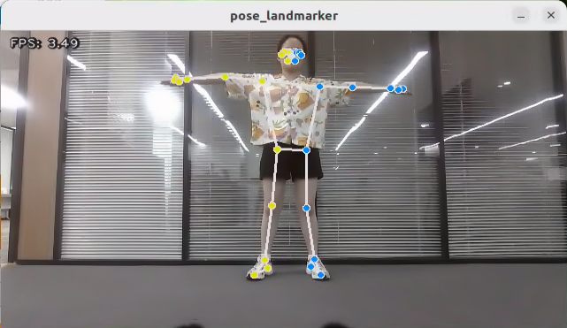

#### 16.1.7.4 Program Analysis

The program file of the feature is located at: **/ros2_ws/src/example/example/mediapipe_example/pose.py**

* **Functions**

`Main`:

```python
def main():
    node = PoseNode('pose_landmarker')
    try:
        rclpy.spin(node)
    except KeyboardInterrupt:
        node.destroy_node()
        rclpy.shutdown()
        print('shutdown')
    finally:
        print('shutdown finish')
```

Used to launch the 3D face detection node.

* **Class**

`PoseNode`:

```python
class PoseNode(Node):
    def __init__(self, name):
        rclpy.init()
        super().__init__(name)
        self.running = True
        self.bridge = CvBridge()
        model_path = os.path.join(os.path.abspath(os.path.split(os.path.realpath(__file__))[0]), 'model/pose_landmarker.task')
        base_options = python.BaseOptions(model_asset_path=model_path)
        options = vision.PoseLandmarkerOptions(
            base_options=base_options,
            output_segmentation_masks=True)
        self.detector = vision.PoseLandmarker.create_from_options(options)
        self.fps = fps.FPS()
        self.image_queue = queue.Queue(maxsize=2)
        self.image_sub = self.create_subscription(Image, '/depth_cam/rgb0/image_raw', self.image_callback, 1)
```

`Init`:

```python
    def __init__(self, name):
        rclpy.init()
        super().__init__(name)
        self.running = True
        self.bridge = CvBridge()
        model_path = os.path.join(os.path.abspath(os.path.split(os.path.realpath(__file__))[0]), 'model/pose_landmarker.task')
        base_options = python.BaseOptions(model_asset_path=model_path)
        options = vision.PoseLandmarkerOptions(
            base_options=base_options,
            output_segmentation_masks=True)
        self.detector = vision.PoseLandmarker.create_from_options(options)
        self.fps = fps.FPS()
        self.image_queue = queue.Queue(maxsize=2)
        self.image_sub = self.create_subscription(Image, '/depth_cam/rgb0/image_raw', self.image_callback, 1)
        self.get_logger().info('\033[1;32m%s\033[0m' % 'start')
        threading.Thread(target=self.main, daemon=True).start()
```

Initializes the parameters required for body keypoints detection, calls the image callback function, and starts the model inference function.

`image_callback`:

```python
    def image_callback(self, ros_image):
        cv_image = self.bridge.imgmsg_to_cv2(ros_image, "rgb8")
        rgb_image = np.array(cv_image, dtype=np.uint8)
        if self.image_queue.full():
            # If the queue is full, remove the oldest image
            self.image_queue.get()
            # Put the image into the queue
        self.image_queue.put(rgb_image)
```

The image callback function is used to read data from the camera node and enqueue it.

`Main`:

```python
    def main(self):
        while self.running:
            try:
                image = self.image_queue.get(block=True, timeout=1)
            except queue.Empty:
                if not self.running:
                    break
                else:
                    continue
            image = cv2.flip(image, 1)
            mp_image = mp.Image(image_format=mp.ImageFormat.SRGB, data=image)
            detection_result = self.detector.detect(mp_image)
            annotated_image = draw_pose_landmarks_on_image(image, detection_result)
            self.fps.update()
            result_image = self.fps.show_fps(cv2.cvtColor(annotated_image, cv2.COLOR_RGB2BGR))
            cv2.imshow('pose_landmarker', result_image)
            key = cv2.waitKey(1)
            if key == ord('q') or key == 27:  # Press Q or Esc to quit
                break
        cv2.destroyAllWindows()
        rclpy.shutdown()
```

Loads the model from MediaPipe, feeds the image into it, and uses OpenCV to draw facial keypoints and display the returned video feed.


### 16.1.8 Fingertip Trajectory Recognition

The robot uses MediaPipe's hand detection model to recognize palm joints. Once a specific hand gesture is detected, the robot locks onto the fingertip in the image and begins tracking it, drawing the movement trajectory of the fingertip.

#### 16.1.8.1 Experiment Overview

First, the MediaPipe hand detection model is called to process the camera feed.

Next, the image is flipped and processed to detect hand information within the frame. Based on the connections between hand landmarks, the finger angles are calculated to identify specific gestures.

Finally, once the designated gesture is recognized, the robot starts tracking and locking onto the fingertip, while displaying its movement trajectory in the video feed.

#### 16.1.8.2 Operation Steps

> [!NOTE]
> 
> **Commands must be entered with correct capitalization. The Tab key can be used to auto-complete keywords.**

Power on the robot and connect it via the NoMachine remote control software. For detailed information, please refer to the section [1.7.2 AP Mode Connection Steps](https://wiki.hiwonder.com/projects/ROSOrin/en/jetson-nano/docs/1_ROSOrin_User_Manual.html#ap-mode-connection-steps) in the user manual.

1. Click the terminal icon  in the system desktop to open a ROS1 command-line window.

2. Enter the command to disable the app auto-start service.

```bash
sudo systemctl stop start_app_node.service
```

3. Click the icon  on the system desktop to open a new ROS2 command line terminal. Enter the command to start the camera node:

```bash
ros2 launch peripherals depth_camera.launch.py
```

4. Open a new ROS2 command-line terminal, enter the command, and press **Enter** to run the program.

```bash
cd ~/ros2_ws/src/example/example/mediapipe_example && python3 hand_gesture.py
```

5. To exit this feature, press the **Esc** key in the image window to close the camera feed.

6. To exit the feature, press **Ctrl+C** in the terminal. If the program does not close successfully, try pressing **Ctrl+C** again.

#### 16.1.8.3 Project Outcome

After starting the feature, place your hand within the camera’s field of view. Once the hand is detected, key points of the hand will be marked in the returned image.

If the gesture **1**, which involves extending the index finger, is detected, the robot will immediately enter recording mode. The system will track and display the movement of the fingertip in real time on the returned image using dynamic lines. This feature enables free drawing in the virtual space with simple gestures.

On the other hand, if the gesture **5**, which involves an open hand forming the shape of the number **5**, is detected, a clear command will be triggered. At this point, the recorded fingertip movement will be immediately erased, and the image will return to a state without any trace.

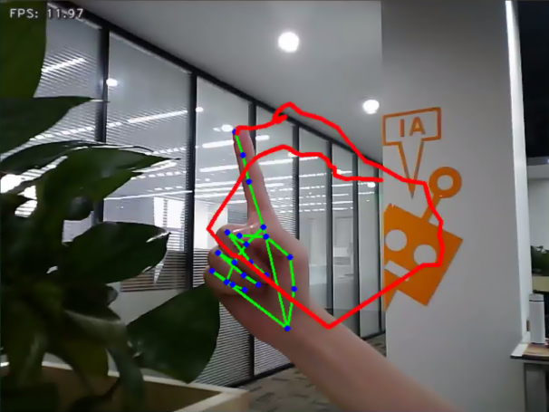


#### 16.1.8.4 Program Analysis

The program file of the feature is located at: **/ros2_ws/src/example/example/mediapipe_example/hand_gesture.py**

> [!NOTE]
> 
> **Before modifying the program, back up the original factory code. Do not modify the source code file directly to avoid robot malfunction due to incorrect parameter changes.**

* **Functions**

Main:

```python
def main():
    node = HandGestureNode('hand_gesture')
    try:
        rclpy.spin(node)
    except KeyboardInterrupt:
        node.destroy_node()
        rclpy.shutdown()
        print('shutdown')
    finally:
        print('shutdown finish')
```

The main function is used to start the fingertip trajectory recognition node.

`get_hand_landmarks`:

```python
def get_hand_landmarks(img, landmarks):
    """
    Convert landmarks from normalized output of Mediapipe to pixel coordinates
    :param img: Image corresponding to pixel coordinates
    :param landmarks: Normalized key points
    :return:
    """
    h, w, _ = img.shape
    landmarks = [(lm.x * w, lm.y * h) for lm in landmarks]
    return np.array(landmarks)
```

Converts the normalized data from MediaPipe into pixel coordinates.

`hand_angle`:

```python
def hand_angle(landmarks):
    """
    Calculate the bending angle of each finger
    :param landmarks: The key points of the hand
    :return: Each finger's angle
    """
    angle_list = []
    # thumb
    angle_ = vector_2d_angle(landmarks[3] - landmarks[4], landmarks[0] - landmarks[2])
    angle_list.append(angle_)
    # index finger
    angle_ = vector_2d_angle(landmarks[0] - landmarks[6], landmarks[7] - landmarks[8])
    angle_list.append(angle_)
    # middle finger
    angle_ = vector_2d_angle(landmarks[0] - landmarks[10], landmarks[11] - landmarks[12])
    angle_list.append(angle_)
    # ring finger
    angle_ = vector_2d_angle(landmarks[0] - landmarks[14], landmarks[15] - landmarks[16])
    angle_list.append(angle_)
    # pinky finger
    angle_ = vector_2d_angle(landmarks[0] - landmarks[18], landmarks[19] - landmarks[20])
    angle_list.append(angle_)
    angle_list = [abs(a) for a in angle_list]
    return angle_list
```

After extracting the hand keypoints into the results variable, the keypoints need to undergo logical processing. By analyzing the angular relationships between the keypoints, the specific type of finger, such as the thumb or index finger, can be identified. The `hand_angle` function takes the landmarks of the results as input, and the `vector_2d_angle` function is used to calculate the angles between the corresponding keypoints. The following diagram shows the keypoints corresponding to the elements in the landmarks set:

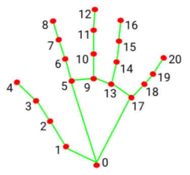

Taking the thumb's angle as an example: `vector_2d_angle`. The function is used to calculate the angle between the keypoints. The keypoints `landmarks[3]`, `landmarks[4]`, `landmarks[0]`, and `landmarks[2]` correspond to the points 3, 4, 0, and 2 in the hand feature extraction diagram. By calculating the angles between these key joints, the posture features of the thumb can be determined. Similarly, the processing logic for the remaining finger joints follows the same approach.

To ensure accurate recognition, the parameters and basic logic of angle addition and subtraction in the `hand_angle` function can be kept at their default settings.

`h_gesture`:

```python
def h_gesture(angle_list):
    """
    Determine the gesture made by the fingers based on the two-dimensional features
    :param angle_list: The angles of each finger's bending
    :return : Gesture name string
    """
    thr_angle = 65.
    thr_angle_thumb = 53.
    thr_angle_s = 49.
    gesture_str = "none"
    if (angle_list[0] > thr_angle_thumb) and (angle_list[1] > thr_angle) and (angle_list[2] > thr_angle) and (
            angle_list[3] > thr_angle) and (angle_list[4] > thr_angle):
        gesture_str = "fist"
    elif (angle_list[0] < thr_angle_s) and (angle_list[1] < thr_angle_s) and (angle_list[2] > thr_angle) and (
            angle_list[3] > thr_angle) and (angle_list[4] > thr_angle):
        gesture_str = "hand_heart"
    elif (angle_list[0] < thr_angle_s) and (angle_list[1] < thr_angle_s) and (angle_list[2] > thr_angle) and (
            angle_list[3] > thr_angle) and (angle_list[4] < thr_angle_s):
        gesture_str = "nico-nico-ni"
    elif (angle_list[0] < thr_angle_s) and (angle_list[1] > thr_angle) and (angle_list[2] > thr_angle) and (
            angle_list[3] > thr_angle) and (angle_list[4] > thr_angle):
        gesture_str = "hand_heart"
    elif (angle_list[0] > 5) and (angle_list[1] < thr_angle_s) and (angle_list[2] > thr_angle) and (
            angle_list[3] > thr_angle) and (angle_list[4] > thr_angle):
        gesture_str = "one"
    elif (angle_list[0] > thr_angle_thumb) and (angle_list[1] < thr_angle_s) and (angle_list[2] < thr_angle_s) and (
            angle_list[3] > thr_angle) and (angle_list[4] > thr_angle):
        gesture_str = "two"
    elif (angle_list[0] > thr_angle_thumb) and (angle_list[1] < thr_angle_s) and (angle_list[2] < thr_angle_s) and (
            angle_list[3] < thr_angle_s) and (angle_list[4] > thr_angle):
        gesture_str = "three"
    elif (angle_list[0] > thr_angle_thumb) and (angle_list[1] > thr_angle) and (angle_list[2] < thr_angle_s) and (
            angle_list[3] < thr_angle_s) and (angle_list[4] < thr_angle_s):
        gesture_str = "OK"
    elif (angle_list[0] > thr_angle_thumb) and (angle_list[1] < thr_angle_s) and (angle_list[2] < thr_angle_s) and (
            angle_list[3] < thr_angle_s) and (angle_list[4] < thr_angle_s):
        gesture_str = "four"
    elif (angle_list[0] < thr_angle_s) and (angle_list[1] < thr_angle_s) and (angle_list[2] < thr_angle_s) and (
            angle_list[3] < thr_angle_s) and (angle_list[4] < thr_angle_s):
        gesture_str = "five"
    elif (angle_list[0] < thr_angle_s) and (angle_list[1] > thr_angle) and (angle_list[2] > thr_angle) and (
            angle_list[3] > thr_angle) and (angle_list[4] < thr_angle_s):
        gesture_str = "six"
    else:
        "none"
    return gesture_str
```

After identifying the types of fingers on the hand and determining their positions in the image, different gestures can be recognized by implementing the `h_gestrue` function.

In the `h_gesture` function shown in the diagram above, the parameters `thr_angle = 65`, `thr_angle_thenum=53`,

and `thr_angle_s=49` represent the angle threshold values for the corresponding gesture logic points. These values have been tested and found to provide stable recognition results. It is not recommended to change them. If the recognition performance is suboptimal, adjusting the values within ±5 is sufficient. The `angle_list[0, 1, 2, 3, 4]` corresponds to the five fingers of the hand.

Taking the gesture **one** as an example:


The code shown above represents the finger angle logic for the gesture **one**. `angle_list[0]&gt;5` checks whether the angle of the thumb joint feature point in the image is greater than 5. `angle_list[1]&lt;thr_angle_s` checks whether the angle feature of the index finger joint is smaller than the predefined value `thr_angle_s，angle_list[2]&lt;thr_angle` checks whether the angle feature of the middle finger joint is smaller than the predefined value `thr_angle`. The logic for the other two fingers, `angle_list[3],angle_list[4]`, follows a similar approach. When all these conditions are met, the current hand gesture is recognized as **one**. The recognition of other gestures follows a similar approach.

Each gesture has its own logic, but the overall framework is largely the same, and other gestures can be referenced based on this method.

`draw_points`:

```python
def draw_points(img, points, thickness=4, color=(255, 0, 0)):
    points = np.array(points).astype(dtype=np.int64)
    if len(points) > 2:
        for i, p in enumerate(points):
            if i + 1 >= len(points):
                break
            cv2.line(img, p, points[i + 1], color, thickness)
```

Draw the currently detected hand shape along with all its key points.

* **Class**

`State`:

```python
class State(enum.Enum):
    NULL = 0
    START = 1
    TRACKING = 2
    RUNNING = 3
```

An enumeration class used to represent the current state of the program.

`HandGestureNode`:

```python
class HandGestureNode(Node):
    def __init__(self, name):
        rclpy.init()
        super().__init__(name)
        self.running = True
        self.drawing = mp.solutions.drawing_utils

        self.hand_detector = mp.solutions.hands.Hands(
            static_image_mode=False,
            max_num_hands=1,
            min_tracking_confidence=0.05,
            min_detection_confidence=0.6
        )
        
        self.fps = fps.FPS()  # FPS calculator
        self.state = State.NULL
        self.points = []
        self.count = 0
        self.bridge = CvBridge()
        self.image_queue = queue.Queue(maxsize=2)
        self.image_sub = self.create_subscription(Image, '/depth_cam/rgb0/image_raw', self.image_callback, 1)
        self.get_logger().info('\033[1;32m%s\033[0m' % 'start')
        threading.Thread(target=self.main, daemon=True).start()
```

`HandGestureNode` is the fingertip trajectory recognition node. It contains three functions: an initialization function, a main function, and an image callback function.

`Init`:

```python
    def __init__(self, name):
        rclpy.init()
        super().__init__(name)
        self.running = True
        self.drawing = mp.solutions.drawing_utils

        self.hand_detector = mp.solutions.hands.Hands(
            static_image_mode=False,
            max_num_hands=1,
            min_tracking_confidence=0.05,
            min_detection_confidence=0.6
        )
        
        self.fps = fps.FPS()  # FPS calculator
        self.state = State.NULL
        self.points = []
        self.count = 0
        self.bridge = CvBridge()
        self.image_queue = queue.Queue(maxsize=2)
        self.image_sub = self.create_subscription(Image, '/depth_cam/rgb0/image_raw', self.image_callback, 1)
        self.get_logger().info('\033[1;32m%s\033[0m' % 'start')
        threading.Thread(target=self.main, daemon=True).start()
```

Initializes all required components and calls the camera node.


### 16.1.9 Body Gesture Control

<p id ="p16-1-9"></p>

Using the human pose estimation model trained with the MediaPipe machine learning framework, the system detects the human pose in the camera feed and marks the relevant joint positions. Based on this, multiple actions can be recognized in sequence, allowing direct control of the robot through body gestures.

From the robot’s first-person perspective:  
Raising the left arm causes the robot to move a certain distance to the right. Raising the right arm causes the robot to move a certain distance to the left. Raising the left leg causes the robot to move forward a certain distance. Raising the right leg causes the robot to move backward a certain distance.

#### 16.1.9.1 Experiment Overview

First, the MediaPipe human pose estimation model is imported, and the camera feed is accessed by subscribing to the relevant topic messages.

MediaPipe is an open-source framework designed for building multimedia machine learning pipelines. It is cross-platform and can run on mobile devices, workstations, and servers, with support for mobile GPU acceleration. It also supports inference engines for TensorFlow and TensorFlow Lite.

Next, using the constructed model, key points of the human torso are detected in the camera feed. These key points are connected to visualize the torso, allowing the system to determine the body posture.

Finally, if the user performs a specific action, the robot responds accordingly.

#### 16.1.9.2 Operation Steps

> [!NOTE]
> 
> **Commands must be entered with correct capitalization. The Tab key can be used to auto-complete keywords.**

Power on the robot and connect it via the NoMachine remote control software. For detailed information, please refer to the section [1.7.2 AP Mode Connection Steps](https://wiki.hiwonder.com/projects/ROSOrin/en/jetson-nano/docs/1_ROSOrin_User_Manual.html#ap-mode-connection-steps) in the user manual.

1. Click the terminal icon  in the system desktop to open a ROS1 command-line window.

2. Enter the command to disable the app auto-start service.

```bash
sudo systemctl stop start_app_node.service
```

3. Click the icon  on the system desktop to open a ROS2 command line terminal. Enter the command to start the program and press **Enter**:

```bash
ros2 launch example body_control.launch.py
```

4. To exit this feature, press the **Esc** key in the image window to close the camera feed.

5. To exit the feature, press **Ctrl+C** in the terminal. If the program does not close successfully, try pressing **Ctrl+C** again.

#### 16.1.9.3 Project Outcome

After starting the feature, stand within the camera’s field of view. When a human body is detected, the returned video feed will display the key points of the torso along with lines connecting them.

An intuitive body posture control logic has been designed for the robot, allowing control through simple body movements. The control instructions are as follows:

Right movement: Raise the left arm, and the robot will move to the right.

Left movement: Raise the right arm, and the robot will move to the left.

Forward movement: Raise the left leg, and the robot will move forward.

Backward movement: Raise the right leg, and the robot will move backward.


#### 16.1.9.4 Program Analysis

The program file of the feature is located at: **ros2_ws/src/example/example/body_control/include/body_control.py**

> [!NOTE]
> 
> **Before modifying the program, back up the original factory code. Do not modify the source code file directly to avoid robot malfunction due to incorrect parameter changes.**

* **Functions**

`Main`:

```python
def main():
    node = BodyControlNode('body_control')
    rclpy.spin(node)
    node.destroy_node()
```

Starts the body motion control node.

`get_joint_landmarks`:

```python
def get_joint_landmarks(img, landmarks):
    """
    Convert landmarks from medipipe's normalized output to pixel coordinates
    :param img: Picture corresponding to pixel coordinate
    :param landmarks: Normalized keypoint
    :return:
    """
    h, w, _ = img.shape
    landmarks = [(lm.x * w, lm.y * h) for lm in landmarks]
    return np.array(landmarks)
```

Converts the detected information into pixel coordinates.

`joint_distance`:

```python
def joint_distance(landmarks):
    distance_list = []

    d1 = landmarks[LEFT_HIP] - landmarks[LEFT_SHOULDER]
    d2 = landmarks[LEFT_HIP] - landmarks[LEFT_WRIST]
    dis1 = d1[0]**2 + d1[1]**2
    dis2 = d2[0]**2 + d2[1]**2
    distance_list.append(round(dis1/dis2, 1))
   
    d1 = landmarks[RIGHT_HIP] - landmarks[RIGHT_SHOULDER]
    d2 = landmarks[RIGHT_HIP] - landmarks[RIGHT_WRIST]
    dis1 = d1[0]**2 + d1[1]**2
    dis2 = d2[0]**2 + d2[1]**2
    distance_list.append(round(dis1/dis2, 1))
    
    d1 = landmarks[LEFT_HIP] - landmarks[LEFT_ANKLE]
    d2 = landmarks[LEFT_ANKLE] - landmarks[LEFT_KNEE]
    dis1 = d1[0]**2 + d1[1]**2
    dis2 = d2[0]**2 + d2[1]**2
    distance_list.append(round(dis1/dis2, 1))
   
    d1 = landmarks[RIGHT_HIP] - landmarks[RIGHT_ANKLE]
    d2 = landmarks[RIGHT_ANKLE] - landmarks[RIGHT_KNEE]
    dis1 = d1[0]**2 + d1[1]**2
    dis2 = d2[0]**2 + d2[1]**2
    distance_list.append(round(dis1/dis2, 1))
    
    return distance_list
```

Calculates the distances between joints based on pixel coordinates.

* **Class**

```python
class BodyControlNode(Node):
    def __init__(self, name):
        rclpy.init()
        super().__init__(name, allow_undeclared_parameters=True, automatically_declare_parameters_from_overrides=True)
        self.name = name
        self.drawing = mp.solutions.drawing_utils
        self.body_detector = mp_pose.Pose(
            static_image_mode=False,
            min_tracking_confidence=0.7,
            min_detection_confidence=0.7)
        self.running = True
        self.fps = fps.FPS()  # FPS calculator
        signal.signal(signal.SIGINT, self.shutdown)

        self.move_finish = True
        self.stop_flag = False
        self.left_hand_count = []
        self.right_hand_count = []
        self.left_leg_count = []
        self.right_leg_count = []
```

This class represents the body control node.

`Init`:

```python
    def __init__(self, name):
        rclpy.init()
        super().__init__(name, allow_undeclared_parameters=True, automatically_declare_parameters_from_overrides=True)
        self.name = name
        self.drawing = mp.solutions.drawing_utils
        self.body_detector = mp_pose.Pose(
            static_image_mode=False,
            min_tracking_confidence=0.7,
            min_detection_confidence=0.7)
        self.running = True
        self.fps = fps.FPS()  # FPS calculator
        signal.signal(signal.SIGINT, self.shutdown)
```

Initializes the parameters required for body control, subscribes to the camera image topic, initializes the servos, chassis, buzzer, motors, and finally starts the main function within the class.

`get_node_state`:

```python
    def get_node_state(self, request, response):
        response.success = True
        return response
```

Sets the current initialization state of the node.

`shutdown`:

```python
    def shutdown(self, signum, frame):
        self.running = False
```

A callback function to terminate the recognition process upon program exit.

`image_callback`:

```python
    def image_callback(self, ros_image):
        cv_image = self.bridge.imgmsg_to_cv2(ros_image, "rgb8")
        rgb_image = np.array(cv_image, dtype=np.uint8)
        if self.image_queue.full():
            # If the queue is full, discard the oldest image
            self.image_queue.get()
        # Put the image into the queue
        self.image_queue.put(rgb_image)
```

The image topic callback function processes images and places them into a queue.

`Move`:

```python
    def move(self, *args):
        if args[0].angular.z == -1.0:
            self.acker_turn(1900)
            time.sleep(0.2)
            motor1 = MotorState()
            motor1.id = 2
            motor1.rps = 2.0
            motor2 = MotorState()
            motor2.id = 4
            motor2.rps = -0.5
            msg = MotorsState()
            msg.data = [motor1, motor2]
            self.motor_pub.publish(msg)
            time.sleep(8.0)
            self.acker_turn(1500)
            motor1 = MotorState()
            motor1.id = 2
            motor1.rps = 0.0
            motor2 = MotorState()
            motor2.id = 4
            motor2.rps = 0.0
            msg = MotorsState()
            msg.data = [motor1, motor2]
            self.motor_pub.publish(msg)
        elif args[0].angular.z == 1.0:
            self.acker_turn(1100)
            time.sleep(0.2)
            motor1 = MotorState()
            motor1.id = 2
            motor1.rps = 0.5
            motor2 = MotorState()
            motor2.id = 4
            motor2.rps = -2.0
            msg = MotorsState()
            msg.data = [motor1, motor2]
            self.motor_pub.publish(msg)
            time.sleep(8.0)
            self.acker_turn(1500)
            motor1 = MotorState()
            motor1.id = 2
            motor1.rps = 0.0
            motor2 = MotorState()
            motor2.id = 4
            motor2.rps = 0.0
            msg = MotorsState()
            msg.data = [motor1, motor2]
            self.motor_pub.publish(msg)
        else:
            self.mecanum_pub.publish(args[0])
            time.sleep(args[1])
            self.mecanum_pub.publish(Twist())
            time.sleep(0.1)
        self.stop_flag =True
        self.move_finish = True
```

Motion strategy function controls the robot’s movement according to the detected body actions.

`buzzer_warn`:

```python
    def buzzer_warn(self):
        msg = BuzzerState()
        msg.freq = 1900
        msg.on_time = 0.2
        msg.off_time = 0.01
        msg.repeat = 1
        self.buzzer_pub.publish(msg)
```

Buzzer control function triggers buzzer alerts.

`image_proc`:

```python
    def image_proc(self, image):
        image_flip = cv2.flip(cv2.cvtColor(image, cv2.COLOR_RGB2BGR), 1)
        results = self.body_detector.process(image)
        if results is not None and results.pose_landmarks is not None:
            if self.move_finish:
                twist = Twist()
                landmarks = get_joint_landmarks(image, results.pose_landmarks.landmark)
                distance_list = (joint_distance(landmarks))
              
                if distance_list[0] < 1:
                    self.detect_status[0] = 1
```

The body recognition function uses the model to draw human keypoints and performs movements according to the detected posture.

`Main`:

```python
    def main(self):
        while self.running:
            try:
                image = self.image_queue.get(block=True, timeout=1)
            except queue.Empty:
                if not self.running:
                    break
                else:
                    continue
            try:
                result_image = self.image_proc(np.copy(image))
            except BaseException as e:
                self.get_logger().info('\033[1;32m%s\033[0m' % e)
                result_image = cv2.flip(cv2.cvtColor(image, cv2.COLOR_RGB2BGR), 1)
            self.fps.update()
            result_image = self.fps.show_fps(result_image)
            cv2.imshow(self.name, result_image)
            key = cv2.waitKey(1)
            if key == ord('q') or key == 27:  # Press Q or Esc to exit
                self.mecanum_pub.publish(Twist())
                self.running = False
```

The main function within the `BodyControlNode` class is responsible for feeding images into the recognition function and displaying the returned frames.


### 16.1.10 Human Tracking

> [!NOTE]
> 
> **This feature is intended for indoor use, as outdoor environments can significantly interfere with its performance. The monocular camera version does not support this feature yet.**

Human detection is enabled through a pose estimation model trained using the YOLO framework. The center point of the human body will be marked in the live feed. When the human gets closer, the robot will move backward. When the human moves away, the robot will move forward, maintaining a distance of approximately 3 meters between the human and the robot.

#### 16.1.10.1 Experiment Overview

First, import the YOLO human pose estimation model and subscribe to the topic to receive real-time camera feed.

Next, using the trained model, detect the keypoints of the human body in the frame and calculate the coordinates of the human's center point based on these keypoints.

Finally, update the PID controller based on the coordinates of the human's center point and the frame's center point, allowing the robot to move in response to the human's movement.

#### 16.1.10.2 Operation Steps

> [!NOTE]
> 
> **Commands must be entered with correct capitalization. The Tab key can be used to auto-complete keywords.**

1. Power on the robot and connect it via the NoMachine remote control software. For detailed information on connecting to a remote desktop, please refer to the section [1.7.2 AP Mode Connection Steps](https://wiki.hiwonder.com/projects/ROSOrin/en/jetson-nano/docs/1_ROSOrin_User_Manual.html#ap-mode-connection-steps) in the user manual.
   
   **Starting the Model:**

2. Click the terminal icon  in the system desktop to open a ROS1 command-line window.

3. Enter the command to disable the app auto-start service.

```bash
sudo systemctl stop start_app_node.service
```

4. Click the icon  on the system desktop to open a ROS2 command line terminal. Enter the following command and press **Enter**:

```bash
ros2 launch example body_track.launch.py
```

5. To exit this feature, press the **Esc** key in the image window to close the camera feed.

6. To exit the feature, press **Ctrl+C** in the terminal. If the program does not close successfully, try pressing **Ctrl+C** again.

#### 16.1.10.3 Project Outcome

After the feature is enabled, a person stands within the camera's field of view. When detected, the center point of the person’s body will be marked in the live feed.

Using the depth camera, the robot can sense the distance to the person in real-time and automatically adjust its position to maintain a safe and comfortable distance of approximately 3 meters. When the person approaches, the robot will move backward. When the person moves away, the robot will move forward.


#### 16.1.10.4 Program Analysis

The program file of the feature is located at: **ros2_ws/src/example/example/body_control/include/body_track.py**

> [!NOTE]
> 
> **Before modifying the program, back up the original factory code. Do not modify the source code file directly to avoid robot malfunction due to incorrect parameter changes.**

* **Functions**

`Main`:

```python
def main():
    node = BodyControlNode('body_control')
    rclpy.spin(node)
    node.destroy_node()
```

This function starts the body tracking node.

* **Class**

```python
class BodyControlNode(Node):
    def __init__(self, name):
        rclpy.init()
        super().__init__(name, allow_undeclared_parameters=True, automatically_declare_parameters_from_overrides=True)
        self.name = name
       
        self.pid_d = pid.PID(0.1, 0, 0)
        #self.pid_d = pid.PID(0, 0, 0)
        
        self.pid_angular = pid.PID(0.002, 0, 0)
        #self.pid_angular = pid.PID(0, 0, 0)
        self.go_speed, self.turn_speed = 0.007, 0.04
```

This class represents the body tracking node.

`Init`:

```python
        rclpy.init()
        super().__init__(name, allow_undeclared_parameters=True, automatically_declare_parameters_from_overrides=True)
        self.name = name
       
        self.pid_d = pid.PID(0.1, 0, 0)
        #self.pid_d = pid.PID(0, 0, 0)
        
        self.pid_angular = pid.PID(0.002, 0, 0)
        #self.pid_angular = pid.PID(0, 0, 0)
        
        self.go_speed, self.turn_speed = 0.007, 0.04
```

Initializes the parameters required for body tracking, reads the camera feed, depth data, chassis control, and YOLOv11 recognition nodes. It then synchronizes the data to align depth information with the image data, and finally, starts the main function within the class.

`get_node_state`:

```python
    def get_node_state(self, request, response):
        response.success = True
        return response
```

Sets the current initialization state of the node.

`shutdown`:

```python
    def shutdown(self, signum, frame):
        self.running = False
```

A callback function to terminate the recognition process upon program exit.

`get_object_callback`:

```python
    def get_object_callback(self, msg):
        for i in msg.objects:
            class_name = i.class_name
            if class_name == 'person':
                if i.box[1] < 10:
                    self.center = [int((i.box[0] + i.box[2])/2), int(i.box[1]) + abs(int((i.box[1] - i.box[3])/4))]
                else:
                    self.center = [int((i.box[0] + i.box[2])/2), int(i.box[1]) + abs(int((i.box[1] - i.box[3])/3))]
```

This callback function from the YOLOv11 recognition node processes the recognition data and converts it into pixel coordinates.

`multi_callback`:

```python
    def depth_image_callback(self, depth_image):
        self.depth_frame = np.ndarray(shape=(depth_image.height, depth_image.width), dtype=np.uint16, buffer=depth_image.data)

    def image_callback(self, ros_image):
        cv_image = self.bridge.imgmsg_to_cv2(ros_image, "rgb8")
        rgb_image = np.array(cv_image, dtype=np.uint8)
        if self.image_queue.full():
            # If the queue is full, discard the oldest image
            self.image_queue.get()
        # Put the image into the queue
        self.image_queue.put(rgb_image)
```

This is the callback function for time synchronization. It takes both depth and RGB data, synchronizes them, and adds them to a queue.

`image_proc`:

```python
    def image_proc(self, rgb_image):
        twist = Twist()
        if self.center is not None:
            h, w = rgb_image.shape[:-1]
            cv2.circle(rgb_image, tuple(self.center), 10, (0, 255, 255), -1) 
            #################
            roi_h, roi_w = 5, 5
            w_1 = self.center[0] - roi_w
            w_2 = self.center[0] + roi_w
            if w_1 < 0:
                w_1 = 0
            if w_2 > w:
                w_2 = w
```

A function for tracking the body. It calls the model to identify the person's position and uses PID control to move the robot based on the person's location.

`Main`:

```python
    def main(self):
        while self.running:
            try:
                image = self.image_queue.get(block=True, timeout=1)
            except queue.Empty:
                if not self.running:
                    break
                else:
                    continue
            try:
                result_image = self.image_proc(image)
            except BaseException as e:
                result_image = image.copy()
                self.get_logger().info('\033[1;32m%s\033[0m' % e)
            self.center = None
            cv2.imshow(self.name, cv2.cvtColor(result_image, cv2.COLOR_RGB2BGR))
            key = cv2.waitKey(1)
            if key == ord('q') or key == 27:  # Press Q or Esc to exit
                self.mecanum_pub.publish(Twist())
                self.running = False
```

The main function within the `BodyControlNode` class is responsible for feeding images into the recognition function and displaying the returned frames.

#### 16.1.10.5 Feature Extension

> [!NOTE]
> 
> **By default, the tracking speed is fixed. To modify the robot's tracking speed, adjust the PID parameters in the program.**

1. Open a ROS2 terminal and enter the command to navigate to the directory where the program is stored.

```bash
cd ~/ros2_ws/src/example/example/body_control/include/
```

2. Then, use the command to open the program file.

```bash
vim body_track.py 
```

3. Locate the `self.pid_d` and `self.pid_angular` functions, where the values inside the parentheses correspond to the PID parameters. One controls the tracking linear velocity PID, and the other controls the tracking angular velocity PID.

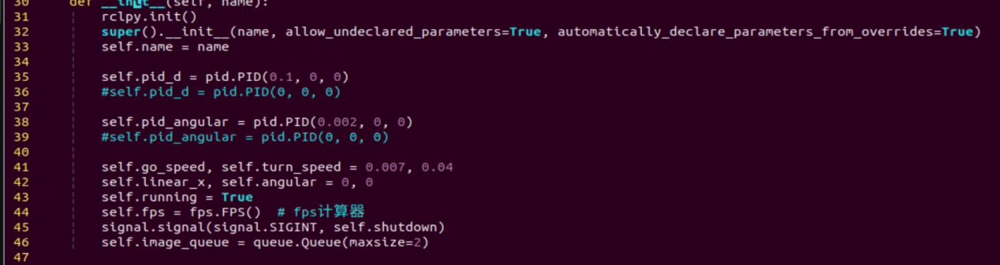

The three PID parameters—proportional, integral, and derivative—serve different purposes: the proportional adjusts the response level, the integral smooths the response, and the derivative helps control overshoot.

4. To adjust the tracking speed, press the i key to enter edit mode, then increase the values. For example, set the linear velocity PID to 0.05 to boost the tracking speed.

> [!NOTE]
> 
> **It’s recommended not to increase the parameters too much, as doing so can cause the robot to track too quickly and negatively impact the feature.**


5. After making the changes, press **Esc** to exit edit mode, then type **:wq** to save and exit.

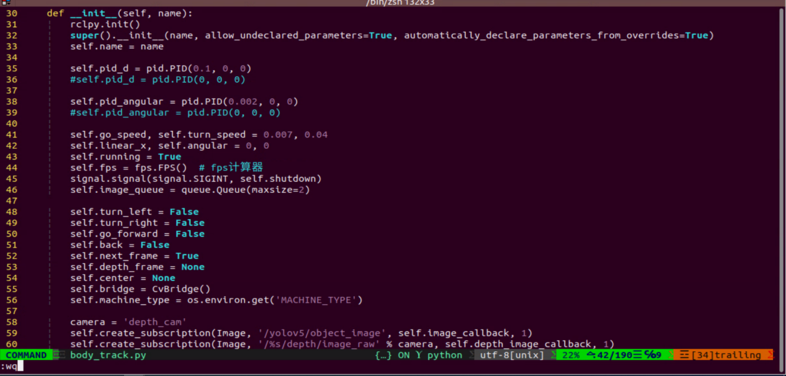

6. Follow the operation steps to activate the feature.


### 16.1.11 Body Gesture Control with RGB Fusion

The depth camera is fused with RGB, allowing the system to perform both color recognition and body-gesture control. Based on the section [16.1.9 Body Gesture Control](#p16-1-9) in this document, this session incorporates color recognition to determine the control target. Only when a person wearing a specified color is detected, which can be set through color calibration, can their body gestures be used to control the robot.

If a person wearing the specified color is not detected, the robot cannot be controlled. This allows precise targeting of the person who can control the robot.

#### 16.1.11.1 Experiment Overview

First, the MediaPipe human pose estimation model is imported, and the camera feed is accessed by subscribing to the relevant topic messages.

Next, based on the constructed model, the key points of the human torso in the camera feed are detected, and lines are drawn between the key points to visualize the torso and determine the body posture. The center of the body is calculated based on all key points.

Finally, if the detected posture is **hands on hips**, the system uses the clothing color to identify the control target, and the robot enters control mode. When the person performs specific gestures, the robot responds accordingly.

#### 16.1.11.2 Operation Steps

> [!NOTE]
> 
> **Commands must be entered with correct capitalization. The Tab key can be used to auto-complete keywords.**

1. Power on the robot and connect it via the NoMachine remote control software. For detailed information on connecting to a remote desktop, please refer to the section [1.7.2 AP Mode Connection Steps](https://wiki.hiwonder.com/projects/ROSOrin/en/jetson-nano/docs/1_ROSOrin_User_Manual.html#ap-mode-connection-steps) in the user manual.

2. Click the terminal icon  in the system desktop to open a ROS1 command-line window.

3. Enter the command to disable the app auto-start service.

```bash
sudo systemctl stop start_app_node.service
```

4. Click the icon  on the system desktop to open a ROS2 command line terminal. Enter the command and press **Enter** to start the feature:

```bash
ros2 launch example body_and_rgb_control.launch.py
```

5. To exit this feature, press the Esc key in the image window to close the camera feed.

6. To exit the feature, press **Ctrl+C** in the terminal. If the program does not close successfully, try pressing **Ctrl+C** again.

#### 16.1.11.3 Project Outcome

After starting the feature, stand within the camera’s field of view. When a person is detected, the camera feed will display the torso key points, lines connecting the points, and the body’s center point.

Step 1: Adjust the camera slightly higher and maintain a reasonable distance to ensure the full body is captured.

Step 2: When the person who will control the robot appears in the camera feed and strikes a hands-on-hips pose, wait for the buzzer to sound briefly. This indicates that the robot has completed the body center and clothing color calibration and is now in control mode.


Step 3:

Right movement: Raise the left arm, and the robot will move to the right.

Left movement: Raise the right arm, and the robot will move to the left.

Forward movement: Raise the left leg, and the robot will move forward.

Backward movement: Raise the right leg, and the robot will move backward.


Step 4: If someone wearing a different color enters the camera’s field of view, they will not be able to control the robot.


#### 16.1.11.4 Program Analysis

The program file of the feature is located at: **ros2_ws/src/example/example/body_control/include/body_and_rgb_control.py**

> [!NOTE]
> 
> **Before modifying the program, back up the original factory code. Do not modify the source code file directly to avoid robot malfunction due to incorrect parameter changes.**

* **Functions**

`Main`:

```python
def main():
    node = BodyControlNode('body_control')
    rclpy.spin(node)
    node.destroy_node()
```

Starts the RGB-based body gesture control node.

`get_body_center`:

```python
def get_body_center(h, w, landmarks):
    landmarks = np.array([(lm.x * w, lm.y * h) for lm in landmarks])
    center = ((landmarks[LEFT_HIP] + landmarks[LEFT_SHOULDER] + landmarks[RIGHT_HIP] + landmarks[RIGHT_SHOULDER])/4).astype(int)
    return center.tolist()
```

Obtains the currently detected body contour.

`get_joint_landmarks`:

```python
def get_joint_landmarks(img, landmarks):
    """
    Convert landmarks from medipipe's normalized output to pixel coordinates
    :param img: Picture corresponding to pixel coordinate
    :param landmarks: Normalized keypoint
    """
    h, w, _ = img.shape
    landmarks = [(lm.x * w, lm.y * h) for lm in landmarks]
    return np.array(landmarks)
```

Converts the detected information into pixel coordinates.

`get_dif`:

```python
def get_dif(list1, list2):
    if len(list1) != len(list2):
        return 255*3
    else:
        d = np.absolute(np.array(list1) - np.array(list2))
        return sum(d)
```

Compares the clothing color on the detected body contour.

`joint_angle`:

```python
def joint_angle(landmarks):
    """
    Calculate flex angle of each joint
    :param landmarks: Hand keypoints
    :return: Joint angle
    """
    angle_list = []
    left_hand_angle1 = vector_2d_angle(landmarks[LEFT_SHOULDER] - landmarks[LEFT_ELBOW], landmarks[LEFT_WRIST] - landmarks[LEFT_ELBOW])
    angle_list.append(int(left_hand_angle1))
   
    left_hand_angle2 = vector_2d_angle(landmarks[LEFT_HIP] - landmarks[LEFT_SHOULDER], landmarks[LEFT_WRIST] - landmarks[LEFT_SHOULDER])
    angle_list.append(int(left_hand_angle2))

    right_hand_angle1 = vector_2d_angle(landmarks[RIGHT_SHOULDER] - landmarks[RIGHT_ELBOW], landmarks[RIGHT_WRIST] - landmarks[RIGHT_ELBOW])
    angle_list.append(int(right_hand_angle1))

    right_hand_angle2 = vector_2d_angle(landmarks[RIGHT_HIP] - landmarks[RIGHT_SHOULDER], landmarks[RIGHT_WRIST] - landmarks[RIGHT_SHOULDER])
    angle_list.append(int(right_hand_angle2))
    
    return angle_list
```

Calculates the angles between detected body joints.

`joint_distance`:

```python
def joint_distance(landmarks):
    distance_list = []

    d1 = landmarks[LEFT_HIP] - landmarks[LEFT_SHOULDER]
    d2 = landmarks[LEFT_HIP] - landmarks[LEFT_WRIST]
    dis1 = d1[0]**2 + d1[1]**2
    dis2 = d2[0]**2 + d2[1]**2
    distance_list.append(round(dis1/dis2, 1))
   
    d1 = landmarks[RIGHT_HIP] - landmarks[RIGHT_SHOULDER]
    d2 = landmarks[RIGHT_HIP] - landmarks[RIGHT_WRIST]
    dis1 = d1[0]**2 + d1[1]**2
    dis2 = d2[0]**2 + d2[1]**2
    distance_list.append(round(dis1/dis2, 1))
    
    d1 = landmarks[LEFT_HIP] - landmarks[LEFT_ANKLE]
    d2 = landmarks[LEFT_ANKLE] - landmarks[LEFT_KNEE]
    dis1 = d1[0]**2 + d1[1]**2
    dis2 = d2[0]**2 + d2[1]**2
    distance_list.append(round(dis1/dis2, 1))
   
    d1 = landmarks[RIGHT_HIP] - landmarks[RIGHT_ANKLE]
    d2 = landmarks[RIGHT_ANKLE] - landmarks[RIGHT_KNEE]
    dis1 = d1[0]**2 + d1[1]**2
    dis2 = d2[0]**2 + d2[1]**2
    distance_list.append(round(dis1/dis2, 1))
    
    return distance_list
```

Calculates the distances between joints based on pixel coordinates.

* **Class**

```python
class BodyControlNode(Node):
    def __init__(self, name):
        rclpy.init()
        super().__init__(name)
        self.name = name
        self.drawing = mp.solutions.drawing_utils
        self.body_detector = mp_pose.Pose(
            static_image_mode=False,
            min_tracking_confidence=0.7,
            min_detection_confidence=0.7)
        
        self.color_picker = ColorPicker(Point(), 2)
        signal.signal(signal.SIGINT, self.shutdown)
        self.fps = fps.FPS()  # FPS calculator

        self.running = True
        self.current_color = None
        self.lock_color = None
        self.calibrating = False
        self.move_finish = True
        self.stop_flag = False
        self.count_akimbo = 0
        self.count_no_akimbo = 0
        self.can_control = False
```

This class represents the body control node.

`Init`:

```python
    def __init__(self, name):
        rclpy.init()
        super().__init__(name)
        self.name = name
        self.drawing = mp.solutions.drawing_utils
        self.body_detector = mp_pose.Pose(
            static_image_mode=False,
            min_tracking_confidence=0.7,
            min_detection_confidence=0.7)
        
        self.color_picker = ColorPicker(Point(), 2)
        signal.signal(signal.SIGINT, self.shutdown)
        self.fps = fps.FPS()  # FPS calculator
```

Initializes the parameters required for body control, subscribes to the camera image topic, initializes the servos, chassis, buzzer, motors, and finally starts the main function within the class.

`get_node_state`:

```python
    def get_node_state(self, request, response):
        response.success = True
        return response
```

Sets the current initialization state of the node.

`shutdown`:

```python
    def shutdown(self, signum, frame):
        self.running = False
```

A callback function to terminate the recognition process upon program exit.

`image_callback`:

```python
    def image_callback(self, ros_image):
        cv_image = self.bridge.imgmsg_to_cv2(ros_image, "rgb8")
        rgb_image = np.array(cv_image, dtype=np.uint8)
        if self.image_queue.full():
            # If the queue is full, discard the oldest image
            self.image_queue.get()
        # Put the image into the queue
        self.image_queue.put(rgb_image)
```

The image topic callback function processes images and places them into a queue.

`Move`:

```python
    def move(self, *args):
        if args[0].angular.z == -1.0:
            self.acker_turn(1900)
            time.sleep(0.2)
            motor1 = MotorState()
            motor1.id = 2
            motor1.rps = 2.0
            motor2 = MotorState()
            motor2.id = 4
            motor2.rps = -0.5
            msg = MotorsState()
            msg.data = [motor1, motor2]
            self.motor_pub.publish(msg)
            time.sleep(8.0)
            self.acker_turn(1500)
            motor1 = MotorState()
            motor1.id = 2
            motor1.rps = 0.0
            motor2 = MotorState()
            motor2.id = 4
            motor2.rps = 0.0
            msg = MotorsState()
            msg.data = [motor1, motor2]
            self.motor_pub.publish(msg)
        elif args[0].angular.z == 1.0:
            self.acker_turn(1100)
            time.sleep(0.2)
            motor1 = MotorState()
            motor1.id = 2
            motor1.rps = 0.5
            motor2 = MotorState()
            motor2.id = 4
            motor2.rps = -2.0
            msg = MotorsState()
            msg.data = [motor1, motor2]
            self.motor_pub.publish(msg)
            time.sleep(8.0)
            self.acker_turn(1500)
            motor1 = MotorState()
            motor1.id = 2
            motor1.rps = 0.0
            motor2 = MotorState()
            motor2.id = 4
            motor2.rps = 0.0
            msg = MotorsState()
            msg.data = [motor1, motor2]
            self.motor_pub.publish(msg)
        else:
            self.mecanum_pub.publish(args[0])
            time.sleep(args[1])
            self.mecanum_pub.publish(Twist())
            time.sleep(0.1)
        self.stop_flag =True
        self.move_finish = True
```

Motion strategy function controls the robot’s movement according to the detected body actions.

`buzzer_warn`:

```python
    def buzzer_warn(self):
        msg = BuzzerState()
        msg.freq = 1900
        msg.on_time = 0.2
        msg.off_time = 0.01
        msg.repeat = 1
        self.buzzer_pub.publish(msg)
```

Buzzer control function triggers buzzer alerts.

`image_proc`:

```python
    def image_proc(self, image):
        image_flip = cv2.flip(cv2.cvtColor(image, cv2.COLOR_RGB2BGR), 1)
        results = self.body_detector.process(image)
        if results is not None and results.pose_landmarks is not None:
            twist = Twist()
            
            landmarks = get_joint_landmarks(image, results.pose_landmarks.landmark)
            
            # Hands-on-hips calibration
            angle_list = joint_angle(landmarks)
            #print(angle_list)
            if -150 < angle_list[0] < -90 and -30 < angle_list[1] < -10 and 90 < angle_list[2] < 150 and 10 < angle_list[3] < 30:
                self.count_akimbo += 1  # Hands-on-hips detection+1
                self.count_no_akimbo = 0  # Clear no hands-on-hips detection
            else:
                self.count_akimbo = 0  # Clear hands-on-hips detection
```

Body recognition function that calls the model to detect and draw key points of the human body, then performs color recognition by reading the color information from different body contours. Finally, it determines the detected color and executes corresponding movements based on the recognized body posture.

`Main`:

```python
    def main(self):
        while self.running:
            try:
                image = self.image_queue.get(block=True, timeout=1)
            except queue.Empty:
                if not self.running:
                    break
                else:
                    continue
            try:
                result_image = self.image_proc(np.copy(image))
            except BaseException as e:
                self.get_logger().info('\033[1;32m%s\033[0m' % e)
                result_image = cv2.flip(cv2.cvtColor(image, cv2.COLOR_RGB2BGR), 1)
            self.fps.update()
            result_image = self.fps.show_fps(result_image)
            cv2.imshow(self.name, result_image)
            key = cv2.waitKey(1)
            if key == ord('q') or key == 27:  # Press Q or Esc to exit
                self.mecanum_pub.publish(Twist())
                self.running = False
        rclpy.shutdown()
```

The main function within the `BodyControlNode` class is responsible for feeding images into the recognition function and displaying the returned frames.


### 16.1.12 Human Pose Detection

In this program, a human pose estimation model from the MediaPipe machine learning framework is used to detect human poses. When the robot detects that a person has fallen, it will trigger an alert and perform a left-right twisting motion.

#### 16.1.12.1 Experiment Overview

First, the MediaPipe human pose estimation model is imported, and the camera feed is accessed by subscribing to the relevant topic messages.

Next, the image is flipped and processed to detect human body information within the frame. Based on the connections between human keypoints, the system calculates the body height to determine body movements.

Finally, if a fall is detected, the robot will trigger an alert and move forward and backward.

#### 16.1.12.2 Operation Steps

> [!NOTE]
> 
> **Commands must be entered with correct capitalization. The Tab key can be used to auto-complete keywords.**

1. Power on the robot and connect it via the NoMachine remote control software. For detailed information on connecting to a remote desktop, please refer to the section [1.7.2 AP Mode Connection Steps](https://wiki.hiwonder.com/projects/ROSOrin/en/jetson-nano/docs/1_ROSOrin_User_Manual.html#ap-mode-connection-steps) in the user manual.

2. Click the terminal icon  in the system desktop to open a ROS1 command-line window.

3. Enter the command to disable the app auto-start service.

```bash
sudo systemctl stop start_app_node.service
```

4. Click the icon  on the system desktop to open a ROS2 command line terminal. Enter the command and press **Enter** to start the feature:

```bash
ros2 launch example fall_down_detect.launch.py 
```

5. To exit this feature, press the **Esc** key in the image window to close the camera feed.

6. To exit the feature, press **Ctrl+C** in the terminal. If the program does not close successfully, try pressing **Ctrl+C** again.

#### 16.1.12.3 Project Outcome

After starting the feature, make sure the person is fully within the camera’s field of view. When a person is detected, the keypoints of the body will be marked on the live feed.

When the person appears with a significantly low height in the camera feed, the robot will recognize it as a falling posture and initiate an emergency response. The robot will emit a continuous alarm sound and move rapidly back and forth.


#### 16.1.12.4 Program Analysis

The program file of the feature is located at: **ros2_ws/src/example/example/body_control/include/fall_down_detect.py**

> [!NOTE]
> 
> **Before modifying the program, back up the original factory code. Do not modify the source code file directly to avoid robot malfunction due to incorrect parameter changes.**

* **Functions**

`Main`:

```python
def main():
    node = FallDownDetectNode('fall_down_detect')
    rclpy.spin(node)
    node.destroy_node()
```

Starts the body motion control node.

`get_joint_landmarks`:

```python
def get_joint_landmarks(img, landmarks):
    """
    Convert landmarks from medipipe's normalized output to pixel coordinates
    :param img: Picture corresponding to pixel coordinate
    :param landmarks: Normalized keypoint
    :return:
    """
    h, w, _ = img.shape
    landmarks = [(lm.x * w, lm.y * h) for lm in landmarks]
    return np.array(landmarks)
```

Converts the detected information into pixel coordinates.

`height_cal`:

```python
def height_cal(landmarks):
    y = []
    for i in landmarks:
        y.append(i[1])
    height = sum(y)/len(y)

    return height
```

Calculates the body height based on the detected information.

* **Class**

```python
class FallDownDetectNode(Node):
    def __init__(self, name):
        rclpy.init()
        super().__init__(name, allow_undeclared_parameters=True, automatically_declare_parameters_from_overrides=True)
        self.name = name
        self.drawing = mp.solutions.drawing_utils
        self.body_detector = mp_pose.Pose(
            static_image_mode=False,
            min_tracking_confidence=0.7,
            min_detection_confidence=0.7)
        self.running = True
        self.fps = fps.FPS()  # FPS calculator
        
        self.fall_down_count = []
        self.move_finish = True
        self.stop_flag = False
        signal.signal(signal.SIGINT, self.shutdown)
        self.bridge = CvBridge()
        self.image_queue = queue.Queue(maxsize=2)
```

It is the fall detection node.

`Init`:

```python
    def __init__(self, name):
        rclpy.init()
        super().__init__(name, allow_undeclared_parameters=True, automatically_declare_parameters_from_overrides=True)
        self.name = name
        self.drawing = mp.solutions.drawing_utils
        self.body_detector = mp_pose.Pose(
            static_image_mode=False,
            min_tracking_confidence=0.7,
            min_detection_confidence=0.7)
        self.running = True
        self.fps = fps.FPS()  # FPS calculator
```

Initializes the parameters required for body control, subscribes to the camera image topic, initializes the chassis, buzzer, motors, and finally starts the main function within the class.

`get_node_state`:

```python
    def get_node_state(self, request, response):
        response.success = True
        return response
```

Sets the current initialization state of the node.

`shutdown`:

```python
    def shutdown(self, signum, frame):
        self.running = False
```

A callback function to terminate the recognition process upon program exit.

`image_callback`:

```python
    def image_callback(self, ros_image):
        cv_image = self.bridge.imgmsg_to_cv2(ros_image, "rgb8")
        rgb_image = np.array(cv_image, dtype=np.uint8)
        if self.image_queue.full():
            # If the queue is full, discard the oldest image
            self.image_queue.get()
        # Put the image into the queue
        self.image_queue.put(rgb_image)
```

The image topic callback function processes images and places them into a queue.

`Move`:

```python
    def move(self):
        for i in range(5):
            twist = Twist()
            twist.linear.x = 0.2
            self.mecanum_pub.publish(twist)
            time.sleep(0.2)
            twist = Twist()
            twist.linear.x = -0.2
            self.mecanum_pub.publish(twist)
            time.sleep(0.2)
        self.mecanum_pub.publish(Twist())
        self.stop_flag =True
        self.move_finish = True
```


Motion strategy function controls the robot’s movement according to the detected body height.

`buzzer_warn`:

```python
    def move(self):
        for i in range(5):
            twist = Twist()
            twist.linear.x = 0.2
            self.mecanum_pub.publish(twist)
            time.sleep(0.2)
            twist = Twist()
            twist.linear.x = -0.2
            self.mecanum_pub.publish(twist)
            time.sleep(0.2)
        self.mecanum_pub.publish(Twist())
        self.stop_flag =True
        self.move_finish = True
```

Buzzer control function triggers buzzer alerts.

`image_proc`:

```python
    def image_proc(self, image):
        image_flip = cv2.flip(cv2.cvtColor(image, cv2.COLOR_RGB2BGR), 1)
        results = self.body_detector.process(image)
        if results is not None and results.pose_landmarks:
            if self.move_finish:
                landmarks = get_joint_landmarks(image, results.pose_landmarks.landmark)
                h = height_cal(landmarks)
                if h > image.shape[:-2][0] - 120:
                    self.fall_down_count.append(1)
                else:
                    self.fall_down_count.append(0)
                if len(self.fall_down_count) == 3:
                    count = sum(self.fall_down_count)
```

Body recognition function uses the model to draw human keypoints and performs movements according to the detected body height.

`Main`:

```python
    def main(self):
        while self.running:
            try:
                image = self.image_queue.get(block=True, timeout=1)
            except queue.Empty:
                if not self.running:
                    break
                else:
                    continue
            try:
                result_image = self.image_proc(np.copy(image))
            except BaseException as e:
                self.get_logger().info('\033[1;32m%s\033[0m' % e)
                result_image = cv2.flip(cv2.cvtColor(image, cv2.COLOR_RGB2BGR), 1)
            self.fps.update()
            result_image = self.fps.show_fps(result_image)
            cv2.imshow(self.name, result_image)
            key = cv2.waitKey(1)
            if key == ord('q') or key == 27:  # Press Q or Esc to exit
                self.mecanum_pub.publish(Twist())
                self.running = False
```

The main function within the `FallDownDetectNode` class is responsible for feeding images into the recognition function and displaying the returned frames.


## 16.2 Autonomous Driving

Before starting, it’s important to familiarize yourself with the map and the placement of relevant props.

The map should be laid on a flat surface, ensuring it is smooth without wrinkles, and that the road is clear of any obstacles. All road signs and traffic lights must be placed at the designated positions on the map, facing clockwise along the route. The positions of the road signs and the starting point are shown in the figure below.


### 16.2.1 Lane Keeping

This lesson focuses on controlling the car to move forward while keeping it within the lane.

#### 16.2.1.1 Preparation

1. When performing this feature, make sure the environment is well-lit, but avoid direct light hitting the camera to prevent misrecognition.

2. Adjust the color thresholds in advance to correctly detect the yellow lines, preventing misdetection during the lesson. For guidance on setting color thresholds, refer to the file [15. ROS2- ROS+OpenCV Course](https://wiki.hiwonder.com/projects/ROSOrin/en/jetson-nano/docs/15_ROS2_ROS%2BOpenCV_Course.html#ros2-ros-opencv-course).

3. It is recommended to position the robot in the center of the lane for easier detection.

#### 16.2.1.2 Working Principle

Lane keeping can be divided into three main parts: capturing real-time images, image processing, and result comparison.

First, real-time images are captured using the camera.

Next, the images are processed. This includes color detection, converting the detected images into a suitable color space, applying erosion and dilation, and performing binarization.

Finally, the processed images are analyzed. The region of interest (ROI) is extracted, contours are identified, and comparisons are made to determine the car’s position relative to the lane.

Based on the comparison results, the forward direction is adjusted to keep the robot centered in the lane.

#### 16.2.1.3 Operation Steps

1. Power on the robot and connect it via the NoMachine remote control software. For detailed information on connecting to a remote desktop, please refer to the section [1.7.2 AP Mode Connection Steps](https://wiki.hiwonder.com/projects/ROSOrin/en/jetson-nano/docs/1_ROSOrin_User_Manual.html#ap-mode-connection-steps) in the user manual.

2. Click the terminal icon  in the system desktop to open a ROS1 command-line window.

3. Enter the following command and press **Enter** to stop the app auto-start service.

```bash
sudo systemctl stop start_app_node.service
```

4. Click the icon  on the system desktop to open a ROS2 command line terminal. Enter the following command and press **Enter**:

```bash
ros2 launch example self_driving.launch.py only_line_follow:=true
```

5. To close the program, select the corresponding terminal window and press **Ctrl+C**.


#### 16.2.1.4 Program Outcome

After starting the feature, place the robot on the road of the map. The robot will detect the yellow lane markings at the edges of the road, adjust its position, and maintain itself in the center of the lane.


#### 16.2.1.5 Program Analysis

The source code for the program is located at: **ros2_ws/src/example/example/self_driving/lane_detect.py**.

**Functions**

**image_callback:**

```python
def image_callback(ros_image):
    cv_image = bridge.imgmsg_to_cv2(ros_image, "bgr8")
    bgr_image = np.array(cv_image, dtype=np.uint8)
    if image_queue.full():
        # If the queue is full, remove the oldest image
        image_queue.get()
        # Put the image into the queue
    image_queue.put(bgr_image)
```

Image callback function used to read data from the camera node.

**Class:**

**LaneDetector:**

```python
class LaneDetector(object):
    def __init__(self, color):
        # Lane color
        self.target_color = color
        # ROI for lane detection
        self.rois = ((340, 400, 0, 320, 0.7), (290, 310, 0, 320, 0.2), (230, 260, 0, 320, 0.1))
        self.weight_sum = 1.0

    def set_roi(self, roi):
        self.rois = roi
```

**Init:**

```python
    def __init__(self, color):
        # Lane color
        self.target_color = color
        # ROI for lane detection
        self.rois = ((340, 400, 0, 320, 0.7), (290, 310, 0, 320, 0.2), (230, 260, 0, 320, 0.1))
        self.weight_sum = 1.0
```

Initializes required parameters and sets the ROI for detection.

**set_roi:**

```python
    def set_roi(self, roi):
        self.rois = roi
```

Sets the region of interest (ROI) for detection.

**get_area_max_contour:**

```python
    def get_area_max_contour(contours, threshold=100):
        '''
        Obtain the contour corresponding to the maximum area
        :param contours:
        :param threshold:
        :return:
        '''
        contour_area = zip(contours, tuple(map(lambda c: math.fabs(cv2.contourArea(c)), contours)))
        contour_area = tuple(filter(lambda c_a: c_a[1] > threshold, contour_area))
        if len(contour_area) > 0:
            max_c_a = max(contour_area, key=lambda c_a: c_a[1])
            return max_c_a
        return None
```

Retrieves the largest contour from a list of contours obtained via `opencv`.

**add_horizontal_line:**

```python
    def add_horizontal_line(self, image):
        #   |____  --->   |————   ---> ——
        h, w = image.shape[:2]
        roi_w_min = int(w/2)
        roi_w_max = w
        roi_h_min = 0
        roi_h_max = h
        roi = image[roi_h_min:roi_h_max, roi_w_min:roi_w_max]  # Crop the right half
        flip_binary = cv2.flip(roi, 0)  # Flip upside down
        max_y = cv2.minMaxLoc(flip_binary)[-1][1]  # Extract the coordinates of the top-left point with a value of 255

        return h - max_y
```

Adds horizontal lines for detection based on the image width, height, and ROI.

**add_vertical_line_far:**

```python
    def add_vertical_line_far(self, image):
        h, w = image.shape[:2]
        roi_w_min = int(w/8)
        roi_w_max = int(w/2)
        roi_h_min = 0
        roi_h_max = h
        roi = image[roi_h_min:roi_h_max, roi_w_min:roi_w_max]
        flip_binary = cv2.flip(roi, -1)  # Flip the image horizontally and vertically
        #cv2.imshow('1', flip_binary)
        # min_val, max_val, min_loc, max_loc = cv2.minMaxLoc(ret)
        # minVal：The minimum value
        # maxVal：The maximum value
        # minLoc：The location of the minimum value
        # maxLoc：The location of the maximum value
        # The order of traversal is: first rows, then columns, with rows from left to right and columns from top to bottom
        (x_0, y_0) = cv2.minMaxLoc(flip_binary)[-1]  # Extract the coordinates of the top-left point with a value of 255
        y_center = y_0 + 55
        roi = flip_binary[y_center:, :]
        (x_1, y_1) = cv2.minMaxLoc(roi)[-1]
        down_p = (roi_w_max - x_1, roi_h_max - (y_1 + y_center))
        
        y_center = y_0 + 65
        roi = flip_binary[y_center:, :]
        (x_2, y_2) = cv2.minMaxLoc(roi)[-1]
        up_p = (roi_w_max - x_2, roi_h_max - (y_2 + y_center))

        up_point = (0, 0)
        down_point = (0, 0)
        if up_p[1] - down_p[1] != 0 and up_p[0] - down_p[0] != 0:
            up_point = (int(-down_p[1]/((up_p[1] - down_p[1])/(up_p[0] - down_p[0])) + down_p[0]), 0)
            down_point = (int((h - down_p[1])/((up_p[1] - down_p[1])/(up_p[0] - down_p[0])) + down_p[0]), h)

        return up_point, down_point
```

Adds vertical detection lines in the far area of the image based on the ROI.

**get_binary:**

```python
    def get_binary(self, image):
        # Recognize color through LAB space)
        img_lab = cv2.cvtColor(image, cv2.COLOR_RGB2LAB)  # Convert RGB to LAB
        img_blur = cv2.GaussianBlur(img_lab, (3, 3), 3)  # Gaussian blur denoising
        mask = cv2.inRange(img_blur, tuple(lab_data['lab']['Stereo'][self.target_color]['min']), tuple(lab_data['lab']['Stereo'][self.target_color]['max']))  # Binarization
        eroded = cv2.erode(mask, cv2.getStructuringElement(cv2.MORPH_RECT, (3, 3)))  # Erode
        dilated = cv2.dilate(eroded, cv2.getStructuringElement(cv2.MORPH_RECT, (3, 3)))  # Dilate

        return dilated
```

Performs color recognition in the specified color space and generates a binary image.

**add_vertical_line_near:**

```python
    def add_vertical_line_near(self, image):
        h, w = image.shape[:2]
        roi_w_min = 0
        roi_w_max = int(w/2)
        roi_h_min = int(h/5)
        roi_h_max = h
        roi = image[roi_h_min:roi_h_max, roi_w_min:roi_w_max]
        flip_binary = cv2.flip(roi, -1)  # Flip the image horizontally and vertically)
        #cv2.imshow('1', flip_binary
        (x_0, y_0) = cv2.minMaxLoc(flip_binary)[-1]  # Extract the coordinates of the top-left point with a value of 255
        down_p = (roi_w_max - x_0, roi_h_max - y_0)

        (x_1, y_1) = cv2.minMaxLoc(roi)[-1]
        y_center = int((roi_h_max - roi_h_min - y_1 + y_0)/2)
        roi = flip_binary[y_center:, :] 
        (x, y) = cv2.minMaxLoc(roi)[-1]
        up_p = (roi_w_max - x, roi_h_max - (y + y_center))

        up_point = (0, 0)
        down_point = (0, 0)
        if up_p[1] - down_p[1] != 0 and up_p[0] - down_p[0] != 0:
            up_point = (int(-down_p[1]/((up_p[1] - down_p[1])/(up_p[0] - down_p[0])) + down_p[0]), 0)
            down_point = down_p

        return up_point, down_point, y_center
```

Adds vertical detection lines in the near area of the image based on ROI and image dimensions.

**\__call__:**

```python
    def __call__(self, image, result_image):
        # Calculate the lane center with weighted contribution
        centroid_sum = 0
        h, w = image.shape[:2]
        max_center_x = -1
        center_x = []
        max_area = 0
        min_area = h*w
        f = max_area/min_area
        for roi in self.rois:
            blob = image[roi[0]:roi[1], roi[2]:roi[3]]  # Crop ROI
            contours = cv2.findContours(blob, cv2.RETR_EXTERNAL, cv2.CHAIN_APPROX_TC89_L1)[-2]  # Find contours)
            max_contour_area = self.get_area_max_contour(contours, 30)  # Obtain the contour with the largest area
            if max_contour_area is not None:
                rect = cv2.minAreaRect(max_contour_area[0])  # The minimum bounding rectangle
                box = np.intp(cv2.boxPoints(rect))  # Four box points
                area = rect[1][0]*rect[1][1]
                if area > max_area:
                    max_area = area
                if area < min_area:
                    min_area = area
                f = max_area/min_area
                for j in range(4):
                    box[j, 1] = box[j, 1] + roi[0]
                cv2.drawContours(result_image, [box], -1, (int(255*roi[-1]), 255, 0), 2)  # Draw the rectangle composed of the four points

                # Obtain the diagonal points of the rectangle
                pt1_x, pt1_y = box[0, 0], box[0, 1]
                pt3_x, pt3_y = box[2, 0], box[2, 1]
                # The center point of the line
                line_center_x, line_center_y = (pt1_x + pt3_x) / 2, (pt1_y + pt3_y) / 2

                cv2.circle(result_image, (int(line_center_x), int(line_center_y)), 5, (0, 0, 255), -1)  # Draw the center point
                center_x.append(line_center_x)
            else:
                center_x.append(-1)
        for i in range(len(center_x)):
            if center_x[i] != -1:
                if center_x[i] > max_center_x:
                    max_center_x = center_x[i]
                centroid_sum += center_x[i] * self.rois[i][-1]
        if centroid_sum == 0:
            return result_image, None, max_center_x, max_area
        center_pos = centroid_sum / self.weight_sum  # Calculate the center point based on the weight
        angle = math.degrees(-math.atan((center_pos - (w / 2.0)) / (h / 2.0)))
        
        return result_image, angle, max_center_x, max_area
```

The class’s callback function performs color recognition, draws detected yellow lines using OpenCV, and outputs the processed image, the line angles, and the pixel coordinates (X) of each ROI contour.


### 16.2.2 Traffic Sign Detection

This lesson focuses on recognizing traffic signs through programmed commands.

#### 16.2.2.1 Preparation

1. The traffic sign model in this section is a YOLOv5 trained model. For more details on YOLOv5, please refer to the previous sections.

2. When performing this feature, make sure the environment is well-lit, but avoid direct light hitting the camera to prevent misrecognition.

#### 16.2.2.2 Working Principle

First, capture the real-time video from the camera and perform image processing operations such as erosion and dilation.

Next, use YOLOv5 to run the model and compare the processed image with the target objects.

Finally, based on the comparison results, execute the corresponding traffic sign actions.

#### 16.2.2.3 Operation Steps

> [!NOTE]
> 
> * **The following steps only enable turn sign detection in the camera feed and will not trigger the corresponding robot actions. To directly experience the autonomous driving feature, skip this lesson and refer to section [16.2.6 Comprehensive Application of Autonomous Driving](#p16-2-6) in this document.**
> 
> * **The input command should be case sensitive, and the keywords can be complemented by the Tab key.**

1. Power on the robot and connect it via the NoMachine remote control software.

2. Click the terminal icon  in the system desktop to open a ROS1 command-line window.

3. Enter the following command and press Enter to stop the app auto-start service.

```bash
sudo systemctl stop start_app_node.service
```

4. Click the icon  on the system desktop to open a new ROS2 command line terminal. Enter the command to navigate to the program directory:

```bash
cd /home/ubuntu/ros2_ws/src/example/example/yolov5_detect
```

5. Open the source code of the feature by entering:

```bash
vim yolov5_trt.py
```

6. Press the **i** key, locate the code in the red box, uncomment the list on line 403, and comment out the list on line 404. Then, find line 415 and replace `./yolov5s.engine` with `traffic_signs_640s_7_0.engine`. After making the changes, press the **ESC** key, type `:wq`, and press **Enter** to save and exit.


7. Enter the following command to start the feature:

```bash
python3 yolov5_trt.py
```

8. Place the traffic sign in front of the camera. The system will detect the sign and highlight it on the display. To exit this feature, press **Ctrl+C** in the terminal. If the program does not close successfully, try pressing **Ctrl+C** again.

> [!NOTE]
> 
> **If the model fails to detect traffic signs, lower the confidence threshold. If the model misidentifies traffic signs, increase the confidence threshold.**

9. Enter the command to navigate to the program directory:

```bash
cd ~/ros2_ws/src/example/example/self_driving
```

10. Enter the command to open the program:

```bash
vim self_driving.launch.py
```

The value in the red box represents the confidence threshold, which can be adjusted to modify the object detection performance. After making the changes, press the **ESC** key, type `:wq`, and press **Enter** to save and exit.


#### 16.2.2.4 Program Outcome

After launching the feature, place the robot on the map’s road. When the robot detects a traffic sign, it will highlight the detected sign and display the label with the highest confidence based on the trained model.


### 16.2.3 Traffic Light Recognition

This feature allows the robot to recognize traffic lights through command execution using the camera.

#### 16.2.3.1 Preparation

1. The traffic sign model in this section is a YOLOv5 trained model. For more details on YOLOv5, please refer to the previous sections.

2. When performing this feature, make sure the environment is well-lit, but avoid direct light hitting the camera to prevent misrecognition.

#### 16.2.3.2 Project Process

First, capture the real-time video from the camera and perform image processing operations such as erosion and dilation.

Next, use YOLOv5 to run the model and compare the processed image with the target objects.

Finally, based on the comparison results, execute the corresponding traffic sign actions.

#### 16.2.3.3 Operation Steps

<p id ="p16-2-3-3"></p>

> [!NOTE]
> 
> * **The following steps only enable traffic light recognition in the camera feed and will not trigger the corresponding robot actions. To directly experience the autonomous driving feature, skip this lesson and refer to section [16.2.6 Comprehensive Application of Autonomous Driving](#p16-2-6) in this document.**
> 
> * **The input command should be case sensitive, and the keywords can be complemented by the Tab key.**

Power on the robot and connect it via the NoMachine remote control software. For detailed information on connecting to a remote desktop, please refer to the section [1.7.2 AP Mode Connection Steps](https://wiki.hiwonder.com/projects/ROSOrin/en/jetson-nano/docs/1_ROSOrin_User_Manual.html#ap-mode-connection-steps) in the user manual.

1. Power on the robot and connect it via the NoMachine remote control software.

2. Click the terminal icon  in the system desktop to open a ROS1 command-line window.

3. Enter the following command and press Enter to stop the app auto-start service.

```bash
sudo systemctl stop start_app_node.service
```

4. Click the icon  on the system desktop to open a new ROS2 command line terminal. Enter the command to navigate to the program directory:

```bash
cd /home/ubuntu/ros2_ws/src/example/example/yolov5_detect
```

5. Open the source code of the feature by entering:

```bash
vim yolov5_trt.py
```

6. Press the **i** key, locate the code in the red box, uncomment the list on line 403, and comment out the list on line 404. Then, find line 415 and replace `./yolov5s.engine` with `traffic_signs_640s_7_0.engine`. After making the changes, press the **ESC** key, type `:wq`, and press **Enter** to save and exit.


7. Enter the following command to start the feature:

```bash
python3 yolov5_trt.py
```

8. Place the traffic sign in front of the camera. The system will detect the sign and highlight it on the display. To exit this feature, press **Ctrl+C** in the terminal. If the program does not close successfully, try pressing **Ctrl+C** again.

> [!NOTE]
> 
> **If the model fails to detect traffic signs, lower the confidence threshold. If the model misidentifies traffic signs, increase the confidence threshold.**

9. Enter the command to navigate to the program directory:

```bash
cd /home/ubuntu/ros2_ws/src/example/example/self_driving
```

10. Enter the command to open the program:

```bash
vim self_driving.launch.py
```

The value highlighted in red represents the confidence threshold, which can be adjusted to fine-tune the object detection performance.


#### 16.2.3.4 Program Outcome

Once the feature is started, place the robot on the map’s road. When the robot detects a traffic light, it will identify the light’s color and highlight red and green signals accordingly.


### 16.2.4 Turing Decision Making

This section demonstrates how to detect and recognize turn signs through command instructions.

#### 16.2.4.1 Preparation

1. The traffic sign model in this section is a YOLOv5 trained model. For more details on YOLOv5, please refer to the previous sections.

2. When performing this feature, make sure the environment is well-lit, but avoid direct light hitting the camera to prevent misrecognition.

#### 16.2.4.2 Working Principle

First, capture the real-time video from the camera and perform image processing operations such as erosion and dilation.

Next, use YOLOv5 to run the model and compare the processed image with the target objects.

Finally, based on the comparison results, the robot identifies the turn sign and proceeds in the indicated direction.

#### 16.2.4.3 Operation Steps

> [!NOTE]
> 
> * **The following steps only enable detection of the turning sign in the camera feed and will not trigger the corresponding robot actions. To directly experience the autonomous driving feature, skip this lesson and refer to section [16.2.6 Comprehensive Application of Autonomous Driving](#p16-2-6) in this document.**
> 
> * **The input command should be case sensitive, and the keywords can be complemented by the Tab key.**

Power on the robot and connect it via the NoMachine remote control software. For detailed information on connecting to a remote desktop, please refer to the section [1.7.2 AP Mode Connection Steps](https://wiki.hiwonder.com/projects/ROSOrin/en/jetson-nano/docs/1_ROSOrin_User_Manual.html#ap-mode-connection-steps) in the user manual.

1. Power on the robot and connect it via the NoMachine remote control software.

2. Click the terminal icon  in the system desktop to open a ROS1 command-line window.

3. Enter the following command and press Enter to stop the app auto-start service.

```bash
sudo systemctl stop start_app_node.service
```

4. Click the icon  on the system desktop to open a new ROS2 command line terminal. Enter the command to navigate to the program directory:

```bash
cd /home/ubuntu/ros2_ws/src/example/example/yolov5_detect
```

5. Open the source code of the feature by entering:

```bash
vim yolov5_trt.py
```

6. Press the **i** key, locate the code in the red box, uncomment the list on line 403, and comment out the list on line 404. Then, find line 415 and replace `./yolov5s.engine` with `traffic_signs_640s_7_0.engine`. After making the changes, press the **ESC** key, type `:wq`, and press **Enter** to save and exit.


7. Enter the following command to start the feature:

```bash
python3 yolov5_trt.py
```

8. Place the traffic sign in front of the camera. The system will detect the sign and highlight it on the display. To exit this feature, press **Ctrl+C** in the terminal. If the program does not close successfully, try pressing **Ctrl+C** again.

> [!NOTE]
> 
> **If the model fails to detect traffic signs, lower the confidence threshold. If the model misidentifies traffic signs, increase the confidence threshold.**

9. Enter the command to navigate to the program directory:

```bash
cd /home/ubuntu/ros2_ws/src/example/example/self_driving
```

10. Enter the command to open the program:

```bash
vim self_driving.launch.py
```

The value highlighted in red represents the confidence threshold, which can be adjusted to fine-tune the object detection performance.


#### 16.2.4.4 Program Outcome

After starting the feature, place the robot on the map road. When the robot approaches a turn sign, it will adjust its direction of travel according to the sign’s instruction.


### 16.2.5 Autonomous Parking

This section demonstrates how to detect and recognize parking signs through command instructions.

#### 16.2.5.1 Preparation

1. The traffic sign model in this section is a YOLOv5 trained model. For more details on YOLOv5, please refer to the previous sections.

2. When performing this feature, make sure the environment is well-lit, but avoid direct light hitting the camera to prevent misrecognition.

#### 16.2.5.2 Project Process

First, capture the real-time video from the camera and perform image processing operations such as erosion and dilation.

Next, use YOLOv5 to run the model and compare the processed image with the target objects.

Finally, based on the comparison results, the robot recognizes the parking sign and automatically parks in the designated spot.

#### 16.2.5.3 Operation Steps

> [!NOTE]
> 
> * **The following steps only enable detection of the turning sign in the camera feed and will not trigger the corresponding robot actions. To directly experience the autonomous driving feature, skip this lesson and refer to section [16.2.6 Comprehensive Application of Autonomous Driving](#p16-2-6) in this document.**
> 
> * **The input command should be case sensitive, and the keywords can be complemented by the Tab key.**

Power on the robot and connect it via the NoMachine remote control software. For detailed information on connecting to a remote desktop, please refer to the section [1.7.2 AP Mode Connection Steps](https://wiki.hiwonder.com/projects/ROSOrin/en/jetson-nano/docs/1_ROSOrin_User_Manual.html#ap-mode-connection-steps) in the user manual.

1. Power on the robot and connect it via the NoMachine remote control software.

2. Click the terminal icon  in the system desktop to open a ROS1 command-line window.

3. Enter the following command and press Enter to stop the app auto-start service.

```bash
sudo systemctl stop start_app_node.service
```

4. Click the icon  on the system desktop to open a new ROS2 command line terminal. Enter the command to navigate to the program directory:

```bash
cd /home/ubuntu/ros2_ws/src/example/example/yolov5_detect
```

5. Open the source code of the feature by entering:

```bash
vim yolov5_trt.py
```

6. Press the **i** key, locate the code in the red box, uncomment the list on line 403, and comment out the list on line 404. Then, find line 415 and replace `./yolov5s.engine` with `traffic_signs_640s_7_0.engine`. After making the changes, press the **ESC** key, type `:wq`, and press **Enter** to save and exit.


7. Enter the following command to start the feature:

```bash
python3 yolov5_trt.py
```

8. Place the traffic sign in front of the camera. The system will detect the sign and highlight it on the display. To exit this feature, press **Ctrl+C** in the terminal. If the program does not close successfully, try pressing **Ctrl+C** again.

> [!NOTE]
> 
> **If the model fails to detect traffic signs, lower the confidence threshold. If the model misidentifies traffic signs, increase the confidence threshold.**

9. Enter the command to navigate to the program directory:

```bash
cd /home/ubuntu/ros2_ws/src/example/example/self_driving
```

10. Enter the command to open the program:

```bash
vim self_driving.launch.py
```

The value highlighted in red represents the confidence threshold, which can be adjusted to fine-tune the object detection performance.


#### 16.2.5.4 Program Outcome

After starting the feature, place the robot on the roadway of the map. When the robot reaches the parking sign, it will follow the sign’s instructions and automatically park in the designated spot.

#### 16.2.5.5 Parameter Adjustment

<p id ="p16-2-5-5"></p>

If the robot stops after detecting a parking sign but the parking position is not ideal, the parameters in the source code can be adjusted to fine-tune the stopping position.

1. Click the terminal icon  in the system desktop to open a ROS2 command-line window.

2. Enter the following command to navigate to the directory where the program is located:

```bash
cd ~/ros2_ws/src/example/example/self_driving/
```

3. Open the source code of the feature by entering:

```bash
vim self_driving.py
```

4. Press the i key to enter edit mode, then locate the highlighted code.

By modifying the parameters inside the red box, you can control where the robot begins the parking operation. Decreasing the parameter value will make the robot stop closer to the crosswalk, while increasing it will make the robot stop farther from the crosswalk. After editing, press **Esc**, type the command :wq, and press **Enter** to save and exit.


The parking function can be modified to adjust the robot's parking position. The parking action first sets the linear velocity in the negative Y-axis direction, to the right of the robot, to 0.2 meters per second. The movement time is set to 0.19 seconds to move the robot to the left side of the parking spot. The speed and time can be adjusted to position the robot ideally.


### 16.2.6 Comprehensive Application of Autonomous Driving

<p id ="p16-2-6"></p>

This section demonstrates the comprehensive autonomous driving functionality of the robot through commands. It integrates multiple features, including lane keeping, traffic sign detection, traffic light recognition, turning decision making, and autonomous parking.

#### 16.2.6.1 Project Process

The robot is currently capable of performing the following actions:

1. Following the outer yellow line of the map.

2. Slowing down when crossing a crosswalk.

3. Turning when a turn sign is detected.

4. Parking when a stop sign is detected.

5. Stopping at red lights.

6. Slowing down when a streetlight is detected.

First, load the YOLOv5-trained model file along with the required libraries, and obtain the real-time video feed from the camera. The input image is pre-processed using erosion, dilation, and other operations.

Next, detect the target color line in the image, and extract key information such as the size and center point of the detected region. Then, apply the YOLOv5 model to compare the processed image with the target dataset.

Finally, calculate the offset of the target center point, and adjust the robot’s heading accordingly to keep it aligned in the middle of the road. During navigation, the robot also executes specific actions based on the detected traffic signs.

#### 16.2.6.2 Preparation

* **Map Preparation**

The map should be laid on a flat surface, ensuring it is smooth without wrinkles, and that the road is clear of any obstacles. All road signs and traffic lights must be placed at the designated positions on the map, facing clockwise along the route. The positions of the road signs and the starting point are shown in the figure below.


* **Color Threshold Setting**

Since lighting conditions affect color recognition, you need to adjust the thresholds for black, white, red, green, blue, and yellow before starting, following the instructions in the file [15. ROS2-ROS + OpenCV Course](https://wiki.hiwonder.com/projects/ROSOrin/en/jetson-nano/docs/15_ROS2_ROS%2BOpenCV_Course.html#ros2-ros-opencv-course).

If the robot encounters inaccurate recognition during its movement, the color threshold should be adjusted in areas of the map where recognition fails.

#### 16.2.6.3 Operation Steps

Power on the robot and connect it via the NoMachine remote control software. For detailed information on connecting to a remote desktop, please refer to the section [1.7.2 AP Mode Connection Steps](https://wiki.hiwonder.com/projects/ROSOrin/en/jetson-nano/docs/1_ROSOrin_User_Manual.html#ap-mode-connection-steps) in the user manual.

1. Click the terminal icon  in the system desktop to open a ROS1 command-line window.

2. Enter the following command and press **Enter** to stop the app auto-start service.

```bash
sudo systemctl stop start_app_node.service
```

3. Click the icon  on the system desktop to open a ROS2 command line terminal. Enter the following command and press **Enter**:

```bash
ros2 launch example self_driving.launch.py
```

4. To close the program, select the corresponding terminal window and press **Ctrl+C**.


#### 16.2.6.4 Program Outcome

- **Lane Keeping**

After the program is started, the robot follows the yellow line at the edge of the road. Depending on whether the yellow line is straight or curved, it will move forward or turn accordingly to stay within the lane.

- **Traffic Light Recognition**

When encountering a traffic light, the robot will stop if the light is red and move forward if the light is green. When crossing a crosswalk, the robot will automatically reduce its speed and proceed slowly.

- **Turn Signs and Parking Signs**

While moving forward, if the robot detects a traffic sign, it will take the corresponding action. If a right-turn sign is detected, the robot will turn right and continue moving forward. If a parking sign is detected, the robot will perform parallel parking.

Following these rules, the robot continuously navigates around the map in a loop.

#### 16.2.6.5 Program Analysis

The source code for the program is located at: **ros2_ws/src/example/example/self_driving/self_driving.py**

**Functions:**

```python
	def main():
    node = SelfDrivingNode('self_driving')
    executor = MultiThreadedExecutor()
    executor.add_node(node)
    executor.spin()
    node.destroy_node()
```

Launches the autonomous driving class.

**Class:**

```python
class SelfDrivingNode(Node):
    def __init__(self, name):
        rclpy.init()
        super().__init__(name, allow_undeclared_parameters=True, automatically_declare_parameters_from_overrides=True)
        self.name = name
        self.is_running = True
        self.pid = pid.PID(0.005, 0.0, 0.0)
        self.param_init()
```

`init`

```python
        super().__init__(name, allow_undeclared_parameters=True, automatically_declare_parameters_from_overrides=True)
        self.name = name
        self.is_running = True
        self.pid = pid.PID(0.005, 0.0, 0.0)
        self.param_init()

        self.image_queue = queue.Queue(maxsize=2)
        self.classes = ['go', 'right', 'park', 'red', 'green', 'crosswalk']
        self.display = False
        self.bridge = CvBridge()
        self.lock = threading.RLock()
        self.colors = common.Colors()
        self.machine_type = os.environ['MACHINE_TYPE']
        # signal.signal(signal.SIGINT, self.shutdown)
        self.lane_detect = lane_detect.LaneDetector("yellow")
        self.cmd_vel_topic = '/controller/cmd_vel'

        # Debug Mode
        self.debug_mode = self.get_parameter('debug_mode').value
        if self.debug_mode:
            self.cmd_vel_topic = '/controller/cmd_vel1'

        self.mecanum_pub = self.create_publisher(Twist, '%s' % self.cmd_vel_topic, 1)
        self.servo_state_pub = self.create_publisher(SetPWMServoState, 'ros_robot_controller/pwm_servo/set_state', 10)
        
        # self.joints_pub = self.create_publisher(ServosPosition, '/servo_controller', 1) # Servo control
        self.result_publisher = self.create_publisher(Image, '~/image_result', 1)

        self.create_service(Trigger, '~/enter', self.enter_srv_callback) # Enter the feature
        self.create_service(Trigger, '~/exit', self.exit_srv_callback) # Exit the feature
        self.create_service(SetBool, '~/set_running', self.set_running_srv_callback)
        Heart(self, self.name + '/heartbeat', 5, lambda _: self.exit_srv_callback(request=Trigger.Request(), response=Trigger.Response()))  # Heartbeat package
        timer_cb_group = ReentrantCallbackGroup()
        self.client = self.create_client(Trigger, '/controller_manager/init_finish')
        self.client.wait_for_service()
        self.client = self.create_client(Trigger, '/yolov5/init_finish')
        self.client.wait_for_service()
        self.start_yolov5_client = self.create_client(Trigger, '/yolov5/start', callback_group=timer_cb_group)
        self.start_yolov5_client.wait_for_service()
        self.stop_yolov5_client = self.create_client(Trigger, '/yolov5/stop', callback_group=timer_cb_group)
        self.stop_yolov5_client.wait_for_service()

        self.timer = self.create_timer(0.0, self.init_process, callback_group=timer_cb_group)
```

Initializes required parameters, identifies the current robot type, sets the line-following color to yellow, starts chassis control, servo control, and image acquisition. Also sets up three services including enter, exit, and start, and connects to the YOLOv5 node.

`init_process`

```python
    def init_process(self):
        self.timer.cancel()

        self.mecanum_pub.publish(Twist())
        if not self.get_parameter('only_line_follow').value:
            self.send_request(self.start_yolov5_client, Trigger.Request())
            # set_servo_position(self.joints_pub, 1, ((10, 500), (5, 500), (4, 250), (3, 0), (2, 750), (1, 500)))  # initial position
        time.sleep(1)
        self.display = False
        if self.get_parameter('start').value:
            self.display = True
            self.enter_srv_callback(Trigger.Request(), Trigger.Response())
            request = SetBool.Request()
            request.data = True
            self.set_running_srv_callback(request, SetBool.Response())
            
        if 'Acker' in self.machine_type:
            servo_state = PWMServoState()
            servo_state.id = [1]
            servo_state.position = [1500]
            data = SetPWMServoState()
            data.state = [servo_state]
            data.duration = 0.02
            self.servo_state_pub.publish(data)

        #self.park_action()
        if self.debug_mode:
            threading.Thread(target=self.debug_function, daemon=True).start()
        else:
            threading.Thread(target=self.main, daemon=True).start()
        self.create_service(Trigger, '~/init_finish', self.get_node_state)
        self.get_logger().info('\033[1;32m%s\033[0m' % 'start')
```

Initializes the robot arm and starts the main function.

`param_init`

```python
    def param_init(self):
        self.start = False
        self.enter = False

        self.have_turn_right = False
        self.detect_turn_right = False
        self.detect_far_lane = False
        self.park_x = -1  # Oobtain the x-pixel coordinate of a parking sign
        self.park_y = -1  # Obtain the y-pixel coordinate of a parking sign

        self.start_turn_time_stamp = 0
        self.count_turn = 0
        self.start_turn = False  # Start to turn
```

Initializes parameters for position recognition and other required operations.

`get_node_state`

```python
    def get_node_state(self, request, response):
        response.success = True
        return response
```

Retrieves the current state of the node.

`send_request`

```python
    def send_request(self, client, msg):
        future = client.call_async(msg)
        while rclpy.ok():
            if future.done() and future.result():
                return future.result()
```

Publishes a service request.

`enter_srv_callback`

```python
    def enter_srv_callback(self, request, response):
        self.get_logger().info('\033[1;32m%s\033[0m' % "self driving enter")
        with self.lock:
            self.start = False
            if self.get_parameter('use_depth_cam').value:
                self.camera = 'depth_cam'
                self.image_sub = self.create_subscription(Image, '/%s/rgb0/image_raw' % self.camera, self.image_callback, 1)  # Subscribe to the camera
            else:
                self.camera = 'usb_cam'
                self.image_sub = self.create_subscription(Image, '/%s/image_raw' % self.camera, self.image_callback, 1)  # Subscribe to the camera
            self.create_subscription(ObjectsInfo, '/yolov5/object_detect', self.get_object_callback, 1)
            self.mecanum_pub.publish(Twist())
            self.enter = True
        response.success = True
        response.message = "enter"
        return response
```

Service callback for entering autonomous driving mode, starts image acquisition, YOLOv5 recognition, and initializes speed.

`exit_srv_callback`

```python
    def exit_srv_callback(self, request, response):
        self.get_logger().info('\033[1;32m%s\033[0m' % "self driving exit")
        with self.lock:
            try:
                if self.image_sub is not None:
                    self.image_sub.unregister()
                if self.object_sub is not None:
                    self.object_sub.unregister()
            except Exception as e:
                self.get_logger().info('\033[1;32m%s\033[0m' % str(e))
            self.mecanum_pub.publish(Twist())
        self.param_init()
        response.success = True
        response.message = "exit"
        return response
```

Service callback for exiting autonomous driving mode, stops image acquisition and YOLOv5 recognition, resets speed, and restores parameters.

`set_running_srv_callback`

```python
    def set_running_srv_callback(self, request, response):
        self.get_logger().info('\033[1;32m%s\033[0m' % "set_running")
        with self.lock:
            self.start = request.data
            if not self.start:
                self.mecanum_pub.publish(Twist())
        response.success = True
        response.message = "set_running"
        return response
```

Service callback for starting autonomous driving by setting the start parameter to True.

`Shutdown`

```python
    def shutdown(self, signum, frame):  # Press 'ctrl+c' to close the program
        self.is_running = False
```

Callback executed when the program is closed, used to stop any ongoing processes.

`image_callback`

```python
    def image_callback(self, ros_image):  # Callback target checking
        cv_image = self.bridge.imgmsg_to_cv2(ros_image, "rgb8")
        rgb_image = np.array(cv_image, dtype=np.uint8)
        if self.image_queue.full():
            # If the queue is full, remove the oldest image
            self.image_queue.get()
        # Put the image into the queue
        self.image_queue.put(rgb_image)
```

Image callback function, enqueues received images while discarding outdated frames.

`park_action`

```python
    def park_action(self):
        if 'Mecanum' in self.machine_type:
            twist = Twist()
            twist.linear.y = -0.2
            self.mecanum_pub.publish(twist)
            time.sleep(0.38/0.2)
            self.mecanum_pub.publish(Twist())
        elif 'Acker' in self.machine_type:
            twist = Twist()
            twist.linear.x = 0.15
            twist.angular.z = -0.55
            self.mecanum_pub.publish(twist)
            time.sleep(3)

            twist = Twist()
            twist.linear.x = 0.15
            twist.angular.z = 0.55
            self.mecanum_pub.publish(twist)
            time.sleep(2)

            twist = Twist()
            twist.linear.x = -0.15
            twist.angular.z = -0.55
            self.mecanum_pub.publish(twist)
            time.sleep(1.5)
            self.mecanum_pub.publish(Twist())
            servo_state = PWMServoState()
            servo_state.id = [1]
            servo_state.position = [1500]
            data = SetPWMServoState()
            data.state = [servo_state]
            data.duration = 0.02
            self.servo_state_pub.publish(data)
            twist = Twist()
            twist.linear.x = -0.15
            self.mecanum_pub.publish(twist)
            time.sleep(1.5)
            self.mecanum_pub.publish(Twist())
```

Parking logic executes different parking strategies depending on the chassis type.

`get_object_callback`

```python
    def get_object_callback(self, msg):
        self.objects_info = msg.objects
        if self.objects_info == []:  # If it is not recognized, reset the variable
            self.traffic_signs_status = None
            self.crosswalk_distance = 0
            self.park_y = -1
        else:
            min_distance = 0
            for i in self.objects_info:
                class_name = i.class_name
                center = (int((i.box[0] + i.box[2])/2), int((i.box[1] + i.box[3])/2))
                if class_name == 'crosswalk':  
                    if center[1] > min_distance:  # Obtain recent y-axis pixel coordinate of the crosswalk
                        min_distance = center[1]
                elif class_name == 'right':  # Obtain the right turning sign
                    area = abs(i.box[0] - i.box[2])*abs(i.box[1] - i.box[3])
                    if area > 200:
                        if not self.turn_right:
                            self.count_right += 1
                            self.count_right_miss = 0
                            if self.count_right >= 1:  # If it is detected multiple times, take the right turning sign to true
                                self.have_turn_right = True
                                self.detect_turn_right = True
                                self.count_right = 0
                    else:
                        self.get_logger().info('right tag too far')
                elif class_name == 'park':  # Obtain the center coordinate of the parking sign
                    area = abs(i.box[0] - i.box[2])*abs(i.box[1] - i.box[3])
                    if area > 150:
                        self.park_x = center[0]
                    self.park_y = center[1]
                elif class_name == 'red' or class_name == 'green':  # Obtain the status of the traffic light
                    self.traffic_signs_status = i
        
            self.crosswalk_distance = min_distance
```

Callback for YOLOv5 results, retrieves the current recognized classes.

`Main`

```python
    def main(self):
        while self.is_running:
            time_start = time.time()
            try:
                image = self.image_queue.get(block=True, timeout=1)
            except queue.Empty:
                if not self.is_running:
                    break
                else:
                    continue
            result_image = image.copy()
            if self.start:
                h, w = image.shape[:2]
                # self.get_logger().info('\033[1;32m%d,%d\033[0m' %(h, w))  # Output the height and width, w
                # Obtain the binary image of the lane
                binary_image = self.lane_detect.get_binary(image)
                # cv2.imshow('binary', binary_image)
                # If detecting the zebra crossing, start to slow down
                if 300 < self.crosswalk_distance and not self.start_slow_down:  # The robot starts to slow down only when it is close enough to the zebra crossing, which is determined by judging the y-axis pixel distance of the zebra crossing
                    self.count_crosswalk += 1
                    if self.count_crosswalk == 3:  # Judge multiple times to prevent false detection
                        self.count_crosswalk = 0
                        self.start_slow_down = True  # Sign for slowing down
                        self.count_slow_down = time.time()  # Start timestamp for slowing down
                else:  # Need to detect continuously, otherwise reset
                    self.count_crosswalk = 0
```

Main function of the class, executes different line-following strategies based on the chassis type.


### 16.2.7 FAQ

1\. The robot performs poorly during line-following, moving in a wobbly manner.

Adjust the color thresholds according to the actual lighting environment. For detailed instructions, refer to the file [15. ROS2-ROS + OpenCV Course](https://wiki.hiwonder.com/projects/ROSOrin/en/jetson-nano/docs/15_ROS2_ROS%2BOpenCV_Course.html#ros2-ros-opencv-course).

2\. The robot’s turning radius is too large or too small.

Click the icon  on the system desktop to open a new ROS2 command line terminal. Enter the command to navigate to the program directory of the feature:

```bash
cd ~/ros2_ws/src/example/example/self_driving
```

Enter the command to open the program:

```bash
vim self_driving.py
```

The highlighted value represents the lane center point. Decreasing the value makes the robot turn earlier, while increasing it delays the turn.

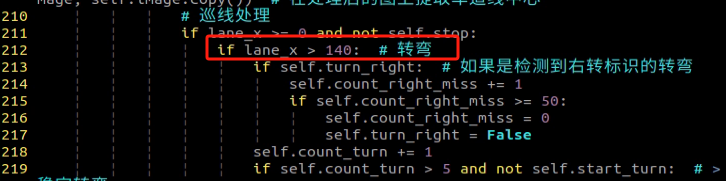

3\. Parking position is inaccurate.

The parking handling function or the starting position of the parking operation can be modified. For detailed instructions, refer to section [16.2.5.5 Parameter Adjustment Instructions](#p16-2-5-5).

4\. Traffic sign recognition is inaccurate.

Adjust the detection confidence level. For details, see [16.2.3.3 Operation Steps](#p16-2-3-3).