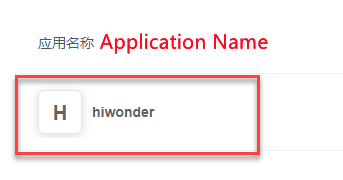
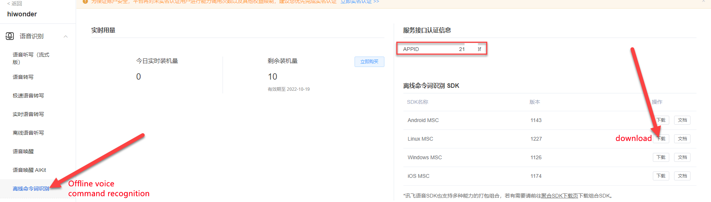
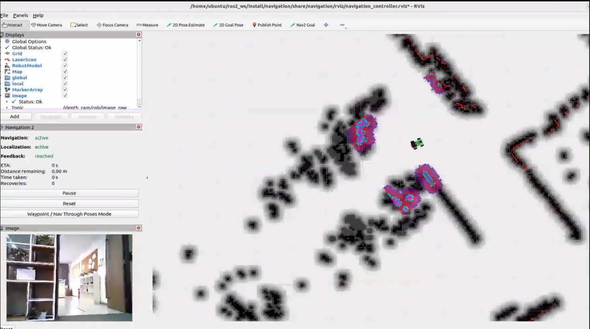

# 17\. ROS2-Voice Interaction Applications

## 17.1 Voice Module Installation

### 17.1.1 Installing the AI Voice Interaction Module


### 17.1.2 Installing the 6-Microphone Array


<p id ="anther17.2"></p>

## 17.2 Switching Wake Words

The system uses the English wake-up phrase **Hello Hiwonder** by default. To use a different wake word or command, follow the steps below.

1) For robots with the WonderEcho Pro:  
Make sure the corresponding language firmware is flashed first. Refer to the tutorial [02 Firmware Flashing](https://drive.google.com/drive/folders/1k99wcXlh2hoAdDcCBwK_ws4eVpDZGrMG?usp=sharing) under the folder **Voice Control Basic Lesson** for detailed instructions.


2) For robots using the 6-Microphone Array:  
Set the recognition language via the desktop configuration tool. Double-click the **Tool** icon  on the system desktop.

3) In the Tool interface, switch the language, then click **Save** → **Apply** → **Quit**. The default language is **English**.

4) After restarting the robot, the wake word will be successfully switched.

<p id ="anther17.3"></p>

17.3 6-Microphone Array Configuration (Must Read)
---

### 17.3.1 Apply for Offline Speech Recognition Resources and App ID

Since offline speech recognition is used in this section, an offline speech resource package from iFLYTEK is required. The offline speech package is only available to accounts registered in supported regions. The following steps describe how to complete the registration process.

1. Visit the iFlytek Open Platform at https://www.xfyun.cn/. And create a new account.
   
   
   
2. Choose **Login with phone number** and fill in the required information. For international access, the corresponding country code should be selected.
   
   
   
3. Once registered, go to **console** > **My Application** to create a new application.


4. Fill in the required fields and click **Submit**.


5. Open the newly created application.



6. Click on Offline Voice Command Recognition, locate the corresponding APPID in the red box shown below. Then navigate to **Offline Wake Word Recognition SDK** → **Linux MSC** and click to download.




> [!NOTE]
>
> **Each newly registered application can be used for free for 90 days. After the free period expires, continued use requires a paid plan. When an application expires, a new one can be registered, with a maximum of five applications per account. The process for creating a new app is the same.**

### 17.1.2 Replace Offline Speech Resources and APPID

1. Extract the compressed package from the provided materials.


> [!NOTE]
> 
> **Locate the extracted files according to the chosen download path.**

Open the folder named **Linux_aitalk_exp1227_01997b6c**. The version ID, such as **1227_01997b6c**, may vary depending on the official release. Navigate to the **bin/msc/res/asr** directory and locate the **common.jet** file. Drag this file onto the desktop of the robot’s system image.


2. Click the terminal icon  in the system desktop to open a ROS1 command-line window.

3. Enter the following command and press **Enter**.

```bash
cp /home/ubuntu/Desktop/common.jet /home/ubuntu/docker/tmp
```

4. Click the icon  on the system desktop to open a ROS2 command line terminal. Enter the command and press **Enter** to replace the **common.jet** file:

```bash
cp /home/ubuntu/share/tmp/common.jet /home/ubuntu/ros2_ws/src/xf_mic_asr_offline/config/msc/res/asr/
```

5. Run the following command to modify the APPID:

```bash
vim ./ros2_ws/src/xf_mic_asr_offline/launch/mic_init.launch.py
```

6. Locate the code shown in the figure below.


7. Press the **i** key to enter edit mode. Then replace **01997b6c** with the newly obtained APPID.


17.4 Voice-Controlled Robot Movement
---

### 17.4.1 Experiment Overview

In this section, the robot’s built-in speech recognition capabilities are used to control its movements through voice commands, such as moving forward or backward.

From a programming perspective, the system subscribes to the voice recognition service published by the microphone array node. It processes the incoming voice data through localization, noise reduction, and recognition, and then retrieves the recognized sentence and the angle of the sound source. Once the robot is successfully awakened with a wake word and a specific command is spoken, the robot provides a voice response and performs the corresponding action. When a specific color is detected, the robot receives a voice command and performs movement actions such as forward, backward, turn left, or turn right.

Follow the **Preparation** section below to complete the setup for this feature, then refer to the **Operation Steps** section to carry out the feature.

### 17.4.2 Preparation

1) Before starting, install the voice module onto the robot and connect it to the hub via the USB port. Skip if already installed.
2) Please refer to section [17.3 6-Microphone Array Configuration (Must Read)](#anther17.3) in this document. Follow the instructions to apply for an APPID and replace the corresponding files.
3) The system uses the English wake word **Hello Hiwonder** by default. If using a WonderEcho Pro as a voice module, the voice interaction command phrases must be flashed. Refer to section [17.2 Switching Wake Words](#anther17.2) for instructions on changing the language or flashing the command words.

### 17.2.3 Operation Steps

<p id ="p17-2-3"></p>

> [!NOTE]
> 
> **Commands must be entered with correct capitalization. The Tab key can be used to auto-complete keywords.**

1. Power on the robot and connect it via the NoMachine remote control software. For detailed information, please refer to the section [1.7.2 AP Mode Connection Steps](https://wiki.hiwonder.com/projects/ROSOrin/en/jetson-nano/docs/1_ROSOrin_User_Manual.html#ap-mode-connection-steps) in the user manual.
2. Click the terminal icon  in the system desktop to open a ROS1 command-line window.
3. Enter the command to disable the app auto-start service.

```bash
sudo systemctl stop start_app_node.service
```

4. Click the icon  on the system desktop to open a ROS2 command line terminal. Enter the command and press **Enter** to start the voice-controlled movement feature:

```bash
ros2 launch xf_mic_asr_offline voice_control_move.launch.py
```

5. After the program has successfully loaded, first say the wake word **Hello Hiwonder** and wait for the speaker to respond with **I’m here** before issuing the next voice command. For example, say **Move forward**. Once the robot recognizes the command, the speaker will respond **Copy that, starting to move forward**, and the robot will execute the corresponding action.

The command phrases and their corresponding actions are as follows:

| **Command Phrase**| **Corresponding Action**|
|----------|----------|
| Move forward| Control the robot to move forward.|
| Move backward| Control the robot to move backward.|
| Turn Left| Control the robot to turn left.|
| Turn Right| Control the robot to turn right.|

> [!NOTE]
> 
> * **To ensure optimal performance, operate the robot in a relatively quiet environment.**
> 
> * **It is recommended to say the wake word before issuing each voice command.**
> 
> * **When speaking the voice command, make sure the voice is loud and clear.**
> 
> * **Issue voice commands one at a time, waiting for the robot to complete the current action and provide feedback before giving the next command.**

6. To disable this feature, open a new command-line terminal and enter the following command:

```bash
~/.stop_ros.sh
```

7. Next, close all the open terminals.

### 17.2.4 Program Analysis

Voice control for robot movement involves establishing a connection between the voice control node and the robot’s low-level driver node. Through voice commands, the robot is controlled to execute the corresponding actions.

* **launch File**

The launch file is located at: **/home/ubuntu/ros2_ws/src/xf_mic_asr_offline/launch/voice_control_move.launch.py**

1\. Launch File

```python
    controller_launch = IncludeLaunchDescription(
        PythonLaunchDescriptionSource(
            os.path.join(controller_package_path, 'launch/controller.launch.py')),
    )

    lidar_launch = IncludeLaunchDescription(
        PythonLaunchDescriptionSource(
            os.path.join(peripherals_package_path, 'launch/lidar.launch.py')),
    )

    mic_launch = IncludeLaunchDescription(
        PythonLaunchDescriptionSource(
            os.path.join(xf_mic_asr_offline_package_path, 'launch/mic_init.launch.py')),
    )
```

`controller_launch` is used to start the chassis control node. After launching, it allows control of the servo motors.

`lidar_launch` starts the LiDAR node, which will publish LiDAR data.

`mic_launch` starts the microphone functionality.

2\. Starting Nodes

```python
    voice_control_move_node = Node(
        package='xf_mic_asr_offline',
        executable='voice_control_move.py',
        output='screen',
    )
```

`voice_control_move_node` is used to call the voice-controlled movement source code and start the program.

* **Python Launch File**

The source code is located at: **/home/ubuntu/ros2_ws/src/xf_mic_asr_offline/scripts/voice_control_move.py**

**Functions**

`Main`:

```python
def main():
    node = VoiceControMovelNode('voice_control_move')
    rclpy.spin(node)
    node.destroy_node()
    rclpy.shutdown()
```

Starts the voice control movement.

**Class:**

```python
class VoiceControMovelNode(Node):
    def __init__(self, name):
        rclpy.init()
        super().__init__(name)

        self.angle = None
        self.words = None
        self.running = True
        self.haved_stop = False
        self.lidar_follow = False
        self.start_follow = False
        self.last_status = Twist()
        self.threshold = 3
        self.speed = 0.3
        self.stop_dist = 0.4
        self.count = 0
        self.scan_angle = math.radians(90)

        self.pid_yaw = pid.PID(1.6, 0, 0.16)
        self.pid_dist = pid.PID(1.7, 0, 0.16)

        self.language = os.environ['ASR_LANGUAGE']
        self.lidar_type = os.environ.get('LIDAR_TYPE')
        self.machine_type = os.environ.get('MACHINE_TYPE')
        self.mecanum_pub = self.create_publisher(Twist, '/controller/cmd_vel', 1)
```

`Init`:

```python
        self.mecanum_pub = self.create_publisher(Twist, '/controller/cmd_vel', 1)
        self.buzzer_pub = self.create_publisher(BuzzerState, '/ros_robot_controller/set_buzzer', 1)
        qos = QoSProfile(depth=1, reliability=QoSReliabilityPolicy.BEST_EFFORT)
        self.create_subscription(LaserScan, '/scan_raw', self.lidar_callback, qos)  # Subscribe to Lidar data
        self.create_subscription(String, '/asr_node/voice_words', self.words_callback, 1)
        self.create_subscription(Int32, '/awake_node/angle', self.angle_callback, 1)

        self.client = self.create_client(Trigger, '/asr_node/init_finish')
        self.client.wait_for_service()  # Blocking wait
        self.declare_parameter('delay', 0)
        time.sleep(self.get_parameter('delay').value)
        self.mecanum_pub.publish(Twist())
        self.play('running')

        self.get_logger().info('Wake word: Hello Hiwonder')
        self.get_logger().info('No need to wake up within 15 seconds after waking up')
        if self.machine_type == 'ROSOrin_Acker':
            self.get_logger().info('Voice command: turn left/turn right/go forward/go backward')
        else:
            self.get_logger().info('Voice command: turn left/turn right/go forward/go backward/come here')
        self.time_stamp = time.time()
        self.current_time_stamp = time.time()
        threading.Thread(target=self.main, daemon=True).start()
        self.create_service(Trigger, '~/init_finish', self.get_node_state)
        self.get_logger().info('\033[1;32m%s\033[0m' % 'start')
```

Initializes various parameters, calls the chassis node, buzzer node, lidar node, and voice recognition node, and finally starts the main function.

`get_node_state`:

```python
    def get_node_state(self, request, response):
        response.success = True
        return respons
```

Initializes the node state.

`Play`:

```python
    def play(self, name):
        voice_play.play(name, language=self.language)
```

Plays audio.

`words_callback`:

```python
    def words_callback(self, msg):
        self.words = json.dumps(msg.data, ensure_ascii=False)[1:-1]
        if self.language == 'Chinese':
            self.words = self.words.replace(' ', '')
        self.get_logger().info('words:%s' % self.words)
        if self.words is not None and self.words not in ['Wake-up-success', 'Sleep', 'Fail-5-times',
                                                         'Fail-10-times']:
            pass
        elif self.words == 'Wake-up-success':
            self.play('awake')
        elif self.words == 'Sleep':
            msg = BuzzerState()
            msg.freq = 1000
            msg.on_time = 0.1

            msg.off_time = 0.01
            msg.repeat = 1
            self.buzzer_pub.publish(msg)
```

The voice recognition callback function reads the data sent back by the microphone through the node.

`angle_callback`:

```python
    def angle_callback(self, msg):
        self.angle = msg.data
        self.get_logger().info('angle:%s' % self.angle)
        self.start_follow = False
        self.mecanum_pub.publish(Twist())
```

The sound source recognition callback function reads the angle of the sound source based on the direction of the wake word. The angle is detected by the microphone’s sound source localization.

`lidar_callback`:

```python
    def lidar_callback(self, lidar_data):
        twist = Twist()
        # Data size= scanning angle/ the increased angle per scan
        if self.lidar_type != 'G4':
            min_index = int(math.radians(MAX_SCAN_ANGLE / 2.0) / lidar_data.angle_increment)
            max_index = int(math.radians(MAX_SCAN_ANGLE / 2.0) / lidar_data.angle_increment)
            left_ranges = lidar_data.ranges[:max_index]  # The left data
            right_ranges = lidar_data.ranges[::-1][:max_index]  # The right data
        elif self.lidar_type == 'G4':
            min_index = int(math.radians((360 - MAX_SCAN_ANGLE) / 2.0) / lidar_data.angle_increment)
            max_index = min_index + int(math.radians(MAX_SCAN_ANGLE / 2.0) / lidar_data.angle_increment)
            left_ranges = lidar_data.ranges[::-1][min_index:max_index][::-1]  # The left data
            right_ranges = lidar_data.ranges[min_index:max_index][::-1]  # The right data
        # self.get_logger().info(self.lidar_type)
```

The LiDAR callback function processes LiDAR data. The robot follows the detected sound source angle and uses PID to compute the angular velocity. It then tracks the nearest object by combining the radar’s scan data, and adjusts the linear and angular velocities according to the radar’s location of the object.

`Main`:

```python
    def main(self):
        while True:
            if self.words is not None:
                twist = Twist()
                if self.words == '前进' or self.words == 'go forward':
                    self.play('go')
                    self.time_stamp = time.time() + 2
                    twist.linear.x = 0.2
                elif self.words == '后退' or self.words == 'go backward':
                    self.play('back')
                    self.time_stamp = time.time() + 2
                    twist.linear.x = -0.2
                elif self.words == '左转' or self.words == 'turn left':
                    self.play('turn_left')
                    self.time_stamp = time.time() + 2
                    if self.machine_type == 'ROSOrin_Acker':
                        twist.linear.x = 0.2
                        twist.angular.z = twist.linear.x/0.5 
                    else:
                        twist.angular.z = 0.8
                elif self.words == '右转' or self.words == 'turn right':
                    self.play('turn_right')
                    self.time_stamp = time.time() + 2
                    if self.machine_type == 'ROSOrin_Acker':
                        twist.linear.x = 0.2
                        twist.angular.z = -twist.linear.x/0.5
                    else:
                        twist.angular.z = -0.8
                elif self.words == '过来' or self.words == 'come here' and self.machine_type != 'ROSOrin_Acker':
                    self.play('come')
                    if 270 > self.angle > 90:
                        twist.angular.z = -1.0
                        self.time_stamp = time.time() + abs(math.radians(self.angle - 90) / twist.angular.z)
                    else:
                        twist.angular.z = 1.0
                        if self.angle <= 90:
                            self.angle = 90 - self.angle
                        else:
                            self.angle = 450 - self.angle
                        self.time_stamp = time.time() + abs(math.radians(self.angle) / twist.angular.z)
                    # self.get_logger().info(self.angle)
                    self.lidar_follow = True
                elif self.words == 'Sleep':
                    time.sleep(0.01)
                self.words = None
                self.haved_stop = False
```

The execution strategy after receiving a command involves publishing different linear and angular velocities based on the command, used to control the robot's movement in various directions.

### 17.2.5 Feature Extension

* **Changing the Wake Word**

The default wake word is **Hello Hiwonder**. It can be changed by modifying the configuration file. The example below demonstrates how to change the wake word to **hello**.

> [!NOTE]
> 
> **Commands must be entered with correct capitalization. The Tab key can be used to auto-complete keywords.**

1. Power on the robot and connect it via the NoMachine remote control software.
2. Click the terminal icon  in the system desktop to open a ROS2 command-line window.
3. Enter the following command and press **Enter**：

```bash
vim ~/ros2_ws/src/xf_mic_asr_offline/launch/mic_init.launch.py
```

4. Locate the code shown in the figure below.


5. Press the **i** key to enter edit mode. Change the value of `english_awake_words` to **hello**.


6. After editing, press **Esc**, then enter the command below and press **Enter** to save and exit.

```bash
:wq
```

7. Enter the following command to apply the new wake word:

```bash
ros2 launch xf_mic_asr_offline mic_init.launch.py enable_setting:=true
```

The configuration will take effect after about 30 seconds. On the next startup, the `enable_setting` parameter is no longer required.

8. Refer to [17.2.3 Operation Steps](#p17-2-3) to restart the feature and verify that the wake word has been updated.


17.5 Voice-Controlled Color Recognition
---

### 17.5.1 Experiment Overview

This experiment uses the robot's built-in speech recognition in combination with the vision-equipped robotic arm to identify objects in three different colors: red, green, and blue.

From a programming perspective, the system subscribes to the voice recognition service published by the microphone array node. It processes the incoming voice data through localization, noise reduction, and recognition, and then retrieves the recognized sentence and the angle of the sound source. Once the robot is successfully awakened and a specific voice command is issued, it provides corresponding voice feedback. At the same time, the onboard camera detects objects in red, green, and blue.

Follow the **Preparation** section below to complete the setup for this feature, then refer to the **Operation Steps** section to carry out the feature.

### 17.5.2 Preparation

1) Before starting, install the voice module onto the robot and connect it to the hub via the USB port. Skip if already installed.
2) Please refer to section [17.3 6-Microphone Array Configuration (Must Read)](#anther17.3) in this document. Follow the instructions to apply for an APPID and replace the corresponding files.
3) The system uses the English wake word **Hello Hiwonder** by default. If using a WonderEcho Pro as a voice module, the voice interaction command phrases must be flashed. Refer to section [17.2 Switching Wake Words](#anther17.2) for instructions on changing the language or flashing the command words.

### 17.5.3 Operation Steps

> [!NOTE]
> 
> * **Ensure that no objects with similar or identical colors to the target block appear in the background, as this may cause interference during recognition.**
> 
> * **If the color detection is inaccurate, the color thresholds can be adjusted. For more details, refer to section [15.1 Color Threshold Adjustment](https://wiki.hiwonder.com/projects/ROSOrin/en/jetson-nano/docs/15_ROS2_ROS%2BOpenCV_Course.html#color-threshold-adjustment)  in the file 15. ROS2-ROS+OpenCV Course.**

1. Power on the robot and connect it via the NoMachine remote control software. For detailed information, please refer to the section [1.7.2 AP Mode Connection Steps](https://wiki.hiwonder.com/projects/ROSOrin/en/jetson-nano/docs/1_ROSOrin_User_Manual.html#ap-mode-connection-steps) in the user manual.

2. The system uses the English wake word **Hello Hiwonder** by default. Refer to section [17.2 Switching Wake Words](#anther17.2)  in this document for instructions on changing the language or flashing the command phrases.

3. Click the terminal icon  in the system desktop to open a ROS1 command-line window.

4. Enter the command to disable the app auto-start service.

```bash
sudo systemctl stop start_app_node.service
```

5. Click the icon  on the system desktop to open a ROS2 command line terminal. Enter the command and press **Enter** to start the voice-controlled movement feature:

```bash
ros2 launch xf_mic_asr_offline voice_control_color_detect.launch.py
```

6. After starting the program, first say the wake word **Hello Hiwonder**, then say the command **Start color recognition** to make the robot begin detecting colors. The robot will identify the color and announce its name. For example, place a red block within the camera’s field of view. When the red object is detected, the robot will announce **Red**.

To stop the feature, say the wake word **Hello Hiwonder** followed by the command **Stop color recognition**.

> [!NOTE]
> 
> * **To ensure optimal performance, operate the robot in a relatively quiet environment.**
> 
> * **It is recommended to say the wake word before issuing each voice command.**
> 
> * **When speaking the voice command, make sure the voice is loud and clear.**
> 
> * **Issue voice commands one at a time, waiting for the robot to complete the current action and provide feedback before giving the next command.**

7. To disable this feature, open a new command-line terminal and enter the following command:

```bash
~/.stop_ros.sh
```

8. Next, close all the open terminals.

### 17.5.4 Program Analysis

Voice control allows the voice recognition node to interact with the robot's underlying driving nodes and camera nodes. By issuing voice commands, the robot can identify color blocks and respond accordingly.

* **launch File**

The launch file is located at: **/home/ubuntu/ros2_ws/src/xf_mic_asr_offline/launch/voice_control_color_detect.launch.py**

- **launch File**

```python
    controller_launch = IncludeLaunchDescription(
        PythonLaunchDescriptionSource(
            os.path.join(controller_package_path, 'launch/controller.launch.py')),
    )

    color_detect_launch = IncludeLaunchDescription(
        PythonLaunchDescriptionSource(
            os.path.join(example_package_path, 'example/color_detect/color_detect_node.launch.py')),
        launch_arguments={
            'enable_display': 'true',
        }.items(),       
    )

    mic_launch = IncludeLaunchDescription(
        PythonLaunchDescriptionSource(
            os.path.join(xf_mic_asr_offline_package_path, 'launch/mic_init.launch.py')),
    )
```

`controller_launch` is used to start the chassis control node. After launching, it allows control of the servo motors.

`color_detect_launch` starts the color recognition node.

`mic_launch` starts the microphone functionality.

`init_pose_launch` initializes the actions.

- **Starting Nodes**

```python
    voice_control_color_detect_node = Node(
        package='xf_mic_asr_offline',
        executable='voice_control_color_detect.py',
        output='screen',
    )
```

`voice_control_color_detect_node` calls the voice-controlled color recognition source code and starts the program.

* **Python Program**

The source code is located at: **/home/ubuntu/ros2_ws/src/xf_mic_asr_offline/scripts/voice_control_color_detect.py**

**Functions**

Main:

```python
def main():
    node = VoiceControlColorDetectNode('voice_control_color_detect')
    executor = MultiThreadedExecutor()
    executor.add_node(node)
    executor.spin()
    node.destroy_node()
```

Starts the voice-controlled color recognition.

**Class:**

`VoiceControlColorDetectNode`:

```python
class VoiceControlColorDetectNode(Node):
    def __init__(self, name):
        rclpy.init()
        super().__init__(name, allow_undeclared_parameters=True, automatically_declare_parameters_from_overrides=True)
        
        self.count = 0
        self.color = None
        self.running = True
        self.last_color = None
        signal.signal(signal.SIGINT, self.shutdown)

        self.language = os.environ['ASR_LANGUAGE']
        
        self.buzzer_pub = self.create_publisher(BuzzerState, '/ros_robot_controller/set_buzzer', 1)
        timer_cb_group = ReentrantCallbackGroup()
        self.create_subscription(String, '/asr_node/voice_words', self.words_callback, 1, callback_group=timer_cb_group)
        self.create_subscription(ColorsInfo, '/color_detect/color_info', self.get_color_callback, 1)
        self.client = self.create_client(Trigger, '/asr_node/init_finish')
        self.client.wait_for_service()
        self.client = self.create_client(Trigger, '/color_detect/init_finish')
        self.client.wait_for_service() 
        self.set_color_client = self.create_client(SetColorDetectParam, '/color_detect/set_param', callback_group=timer_cb_group)
        self.set_color_client.wait_for_service()
        self.play('running')
        self.get_logger().info('Wake word: Hello Hiwonder')
        self.get_logger().info('No need to wake up within 15 seconds after waking up')
        self.get_logger().info('Voice command: start color recognition/stop color recognition')
```

`Init`:

```python
self.buzzer_pub = self.create_publisher(BuzzerState, '/ros_robot_controller/set_buzzer', 1)
        timer_cb_group = ReentrantCallbackGroup()
        self.create_subscription(String, '/asr_node/voice_words', self.words_callback, 1, callback_group=timer_cb_group)
        self.create_subscription(ColorsInfo, '/color_detect/color_info', self.get_color_callback, 1)
        self.client = self.create_client(Trigger, '/asr_node/init_finish')
        self.client.wait_for_service()
        self.client = self.create_client(Trigger, '/color_detect/init_finish')
        self.client.wait_for_service() 
        self.set_color_client = self.create_client(SetColorDetectParam, '/color_detect/set_param', callback_group=timer_cb_group)
        self.set_color_client.wait_for_service()
        self.play('running')
        self.get_logger().info('Wake word: Hello Hiwonder')
        self.get_logger().info('No need to wake up within 15 seconds after waking up')
        self.get_logger().info('Voice command: start color recognition/stop color recognition')

        threading.Thread(target=self.main, daemon=True).start()
        self.create_service(Trigger, '~/init_finish', self.get_node_state)
        self.get_logger().info('\033[1;32m%s\033[0m' % 'start')
```

Initializes various parameters and calls the chassis node, buzzer node, LiDAR node, voice recognition node, and color recognition node. Finally, the `main` function is launched.

`get_node_state`:

```python
    def get_node_state(self, request, response):
        response.success = True
        return response
```

Sets the current node state.

`Play`:

```python
    def play(self, name):
        voice_play.play(name, language=self.language)
```

Audio Display:

`Shutdown`:

```python
    def shutdown(self, signum, frame):
        self.running = False
```

Callback function when the program shuts down. It sets the `running` parameter to False, stopping the program.

`get_color_callback`:

```python
    def get_color_callback(self, msg):
        data = msg.data
        if data != []:
            if data[0].radius > 30:
                self.color = data[0].color
            else:
                self.color = None
        else:
            self.color = None
```

Receives information from the color recognition node and provides the current color recognition result.

`send_request`:

```python
    def send_request(self, client, msg):
        future = client.call_async(msg)
        while rclpy.ok():
            if future.done() and future.result():
                return future.result()
```

Publishes a service request.

`words_callback`:

```python
    def words_callback(self, msg):
        words = json.dumps(msg.data, ensure_ascii=False)[1:-1]
        if self.language == 'Chinese':
            words = words.replace(' ', '')
        self.get_logger().info('words: %s'%words)
        if words is not None and words not in ['Wake-up-success', 'Sleep', 'Fail-5-times',
                                               'Fail-10-times']:
            if words == '开启颜色识别' or words == 'start color recognition':
                msg_red = ColorDetect()
                msg_red.color_name = 'red'
                msg_red.detect_type = 'circle'
                msg_green = ColorDetect()
                msg_green.color_name = 'green'
                msg_green.detect_type = 'circle'
                msg_blue = ColorDetect()
                msg_blue.color_name = 'blue'
                msg_blue.detect_type = 'circle'
                msg = SetColorDetectParam.Request()
                msg.data = [msg_red, msg_green, msg_blue]
                res = self.send_request(self.set_color_client, msg)
                if res.success:
                    self.play('open_success')
                else:
                    self.play('open_fail')
            elif words == '关闭颜色识别' or words == 'stop color recognition':
                msg = SetColorDetectParam.Request()
                res = self.send_request(self.set_color_client, msg)
                if res.success:
                    self.play('close_success')
                else:
                    self.play('close_fail')
        elif words == 'Wake-up-success':
            self.play('awake')
        elif words == 'Sleep':
            msg = BuzzerState()
            msg.freq = 1900
            msg.on_time = 0.05
            msg.off_time = 0.01
            msg.repeat = 1
            self.buzzer_pub.publish(msg)
```

Voice recognition callback function that controls whether color recognition should be started based on the recognized voice. If started, it will respond according to the color recognition node’s information.

`Main`:

```python
    def main(self):
        while self.running:
            if self.color == 'red' and self.last_color != 'red':
                self.last_color = 'red'
                self.play('red')
                self.get_logger().info('\033[1;32m%s\033[0m' % 'red')
            elif self.color == 'green' and self.last_color != 'green':
                self.last_color = 'green'
                self.play('green')
                self.get_logger().info('\033[1;32m%s\033[0m' % 'green')
            elif self.color == 'blue' and self.last_color != 'blue':
                self.last_color = 'blue'
                self.play('blue')
                self.get_logger().info('\033[1;32m%s\033[0m' % 'blue')
            else:
                self.count += 1
                time.sleep(0.01)
                if self.count > 50:
                    self.count = 0
                    self.last_color = self.color
```

Based on the recognized color, it announces the corresponding color name.


17.6 Voice-Controlled Multi-Point Navigation
---

### 17.6.1 Experiment Overview

In this section, the robot’s voice recognition feature will be used to control the robot, which will then navigate on a pre-built map.

From a programming perspective, the system subscribes to the voice recognition service published by the microphone array node. It processes the incoming voice data through localization, noise reduction, and recognition, and then retrieves the recognized sentence and the angle of the sound source. Next, after successfully waking up the robot, saying a specific command will trigger a corresponding voice response. The robot will then navigate to the predefined A, B, and C target points.

Follow the **Preparation** section below to complete the setup for this feature, then refer to the **Operation Steps** section to carry out the feature.

### 17.6.2 Preparation

1. Before starting, install the voice module onto the robot and connect it to the hub via the USB port. Skip if already installed.

2. Please refer to section [17.3 6-Microphone Array Configuration (Must Read)](#anther17.3) in this document. Follow the instructions to apply for an APPID and replace the corresponding files.

3. The system uses the English wake word **Hello Hiwonder** by default. If using a **WonderEcho Pro** as a voice module, the voice interaction command phrases must be flashed. Refer to section [17.2 Switching Wake Words](#anther17.2) for instructions on changing the language or flashing the command words.

4. Before starting this feature, a map must be prepared in advance. Refer to the file [14. ROS2-Mapping \& Navigation Course](https://wiki.hiwonder.com/projects/ROSOrin/en/jetson-nano/docs/14_ROS2_Mapping_%26_Navigation_Course.html#ros2-mapping-navigation-course) for guidance.

5. It is recommended to place the robot on an open platform, ensuring at least a 3-meter radius around the robot is free for safe movement.

### 17.6.3 Operation Steps

<p id ="p17-6-3"></p>

> [!NOTE]
> 
> **Commands must be entered with correct capitalization. The Tab key can be used to auto-complete keywords.**

1. Power on the robot and connect it via the NoMachine remote control software. For detailed information, please refer to the section [1.7.2 AP Mode Connection Steps](https://wiki.hiwonder.com/projects/ROSOrin/en/jetson-nano/docs/1_ROSOrin_User_Manual.html#ap-mode-connection-steps) in the user manual.
2. Click the terminal icon  in the system desktop to open a ROS1 command-line window.
3. Enter the command to disable the app auto-start service.

```bash
sudo systemctl stop start_app_node.service
```

4. Click the icon  on the system desktop to open a ROS2 command line terminal. Enter the command and press **Enter** to start the voice-controlled movement feature:

```bash
ros2 launch xf_mic_asr_offline voice_control_navigation.launch.py map:=map_01
```

The **map_01** at the end of the command is the map name. It can be modified as needed. The map is stored at the directory of **/home/ubuntu/ros2_ws/src/slam/maps**.

5. After the program starts, first say **Hello Hiwonder**. The robot will respond with **I’m here**. Next, say **Go to point A**, and the robot will move to the upper-right position relative to its starting point.

The following table lists the voice commands and their corresponding functions from the robot’s perspective:

| **Command Phrase**| **Function**|
|----------|----------|
| Go to A point| Move the robot to point A, front-right of the starting position.|
| Go to B point| Move the robot to point B, in front of the starting position.|
| Go to C point| Move the robot to point C, front-left of the starting position.|
| Go back to the start| Move the robot back to the starting position.|

6. To disable this feature, open a new command-line terminal and enter the following command:

```bash
~/.stop_ros.sh
```

7. Next, close all the open terminals.

### 17.6.4 Program Analysis

* **launch File**

The launch file is located at: **/home/ubuntu/ros2_ws/src/xf_mic_asr_offline/launch/voice_control_navigation.launch.py**.

1\. Launch File

```python
import os
from ament_index_python.packages import get_package_share_directory

from launch_ros.actions import Node
from launch import LaunchDescription, LaunchService
from launch.substitutions import LaunchConfiguration
from launch.launch_description_sources import PythonLaunchDescriptionSource
from launch.actions import IncludeLaunchDescription, DeclareLaunchArgument, OpaqueFunction, ExecuteProcess

def launch_setup(context):
    compiled = os.environ['need_compile']

    if compiled == 'True':
        navigation_package_path = get_package_share_directory('navigation')
        xf_mic_asr_offline_package_path = get_package_share_directory('xf_mic_asr_offline')
    else:
        navigation_package_path = '/home/ubuntu/ros2_ws/src/navigation'
        xf_mic_asr_offline_package_path = '/home/ubuntu/ros2_ws/src/xf_mic_asr_offline'

    robot_name = LaunchConfiguration('robot_name', default=os.environ['HOST']).perform(context)
    master_name = LaunchConfiguration('master_name', default=os.environ['MASTER']).perform(context)
    map_name = LaunchConfiguration('map_name', default='map_01')
    master_name_arg = DeclareLaunchArgument('master_name', default_value=master_name)
    robot_name_arg = DeclareLaunchArgument('robot_name', default_value=robot_name)
    map_name_arg = DeclareLaunchArgument('map_name', default_value=map_name)
```

`navigation_launch` starts the navigation.

`mic_launch` starts the microphone functionality.

2\. Starting Nodes

```python
    voice_control_navigation_node = Node(
        package='xf_mic_asr_offline',
        executable='voice_control_navigation.py',
        output='screen',
        parameters=[{
            'map_frame': map_frame,
            'costmap': cosmap,
            'cmd_vel': cmd_vel,
            'goal': goal,
        }]
    )
```

`voice_control_navigation_node` calls the voice-controlled multi-point navigation source code and starts the program.

* **Python Program**

The source code is located at: **/home/ubuntu/ros2_ws/src/xf_mic_asr_offline/scripts/voice_control_navigation.py**.

**Functions**

`Main`:

```python
def main():
    node = VoiceControlNavNode('voice_control_nav')
    rclpy.spin(node)
    node.destroy_node()
    rclpy.shutdown()
```

Starts the voice control for multi-point navigation.

**Class:**

`VoiceControlColorSortingNode`**：**

```python
class VoiceControlNavNode(Node):
    def __init__(self, name):
        rclpy.init()
        super().__init__(name)

        self.angle = None
        self.words = None
        self.running = True
        self.haved_stop = False
        self.last_status = Twist()
```

`Init`:

```python
        self.language = os.environ['ASR_LANGUAGE']
        self.declare_parameter('costmap', '/local_costmap/costmap')
        self.declare_parameter('map_frame', 'map')
        self.declare_parameter('goal_pose', '/goal_pose')
        self.declare_parameter('cmd_vel', '/controller/cmd_vel')

        self.costmap = self.get_parameter('costmap').value
        self.map_frame = self.get_parameter('map_frame').value
        self.goal_pose = self.get_parameter('goal_pose').value
        self.cmd_vel = self.get_parameter('cmd_vel').value

        self.clock = self.get_clock()
        self.mecanum_pub = self.create_publisher(Twist, self.cmd_vel, 1)
        self.goal_pub = self.create_publisher(PoseStamped, self.goal_pose, 1)
        self.create_subscription(String, '/voice_control/voice_words', self.words_callback, 1)
        self.create_subscription(Int32, '/awake_node/angle', self.angle_callback, 1)
        
        self.client = self.create_client(Trigger, '/asr_node/init_finish')
        self.client.wait_for_service()

        self.mecanum_pub.publish(Twist())
        self.buzzer_pub = self.create_publisher(BuzzerState, '/ros_robot_controller/set_buzzer', 1)
        self.play('running')

        self.get_logger().info('Wake word: Hello Hiwonder')
        self.get_logger().info('No need to wake up within 15 seconds after waking up')
        self.get_logger().info('Voice command: go to A/B/C point go back to the start')

        threading.Thread(target=self.main, daemon=True).start()
        self.create_service(Trigger, '~/init_finish', self.get_node_state)
        self.get_logger().info('\033[1;32m%s\033[0m' % 'start')
```

Initialize various parameters, set the navigation parameters, call the voice recognition node and the buzzer node, and then start the main function.

`get_node_state`:

```python
    def get_node_state(self, request, response):
        response.success = True
        return response
```

Sets the current node state.

`Play`:

```python
    def play(self, name):
        voice_play.play(name, language=self.language)
```

Audio Display:

`words_callback`:

```python
    def words_callback(self, msg):
        self.words = json.dumps(msg.data, ensure_ascii=False)[1:-1]
        if self.language == 'Chinese':
            self.words = self.words.replace(' ', '')
        self.get_logger().info('words:%s' % self.words)
        if self.words is not None and self.words not in ['Wake-up-success', 'Sleep', 'Fail-5-times',
                                                         'Fail-10-times']:
            pass
        elif self.words == 'Wake-up-success':
            self.play('awake')
        elif self.words == 'Sleep':
            msg = BuzzerState()
            msg.freq = 1000
            msg.on_time = 0.1
            msg.off_time = 0.01
            msg.repeat = 1
            self.buzzer_pub.publish(msg)
```

The voice recognition callback function controls whether to start waste classification and announces the corresponding result based on the recognized speech. The sorting is implemented within the waste classification node.

`angle_callback`:

```python
    def angle_callback(self, msg):
        self.angle = msg.data
        self.get_logger().info('angle:%s' % self.angle)
```

The sound source recognition callback function reads the angle of the sound source relative to the microphone after waking up.

`Main`:

```python
    def main(self):
        while True:
            if self.words is not None:
                pose = PoseStamped()
                pose.header.frame_id = self.map_frame
                pose.header.stamp = self.clock.now().to_msg()
                if self.words == '去\'A\'点' or self.words == 'go to A point':
                    self.get_logger().info('>>>>>> go a')
                    pose.pose.position.x = 1.0
                    pose.pose.position.y = -1.0
                    pose.pose.orientation.w = 1.0
                    self.play('go_a')
                    self.goal_pub.publish(pose)
                elif self.words == '去\'B\'点' or self.words == 'go to B point':
                    self.get_logger().info('>>>>>> go b')
                    pose.pose.position.x = 2.0
                    pose.pose.position.y = 0.0
                    pose.pose.orientation.w = 1.0
                    self.play('go_b')
                    self.goal_pub.publish(pose)
                elif self.words == '去\'C\'点' or self.words == 'go to C point':
                    self.get_logger().info('>>>>>> go c')
                    pose.pose.position.x = 1.0
                    pose.pose.position.y = 1.0
                    pose.pose.orientation.w = 1.0
                    self.play('go_c')
                    self.goal_pub.publish(pose)
                elif self.words == '回原点' or self.words == 'go back to the start':
                    self.get_logger().info('>>>>>> go origin')
                    pose.pose.position.x = 0.0
                    pose.pose.position.y = 0.0
                    pose.pose.orientation.w = 1.0
                    self.play('go_origin')
                    self.goal_pub.publish(pose)
                self.words = None
            else:
                time.sleep(0.01)
```

Based on the node recognized by the speech, publish the navigation points to the navigation node and provide voice feedback.

### 17.6.5 Feature Extension

The default position of Point A is at the top-right corner of the robot’s starting position on the map, with coordinates (1, -1) in meters. To change the location of Point A, modify the coordinate values. For example, to place Point A at the rear-right corner of the starting position, follow these steps:

> [!NOTE]
> 
> * **The positions of points B and C can be adjusted according to the procedures in this section.**
> 
> * **Commands must be entered with correct capitalization. The Tab key can be used to auto-complete keywords.**

1. Power on the robot and connect it via the NoMachine remote control software.

2. Click the terminal icon  in the system desktop to open a ROS1 command-line window.

3. Enter the command to disable the app auto-start service.

```bash
sudo systemctl stop start_app_node.service
```

4. Click the icon  on the system desktop to open a ROS2 command line terminal. Enter the following command and press **Enter** to open the program file:

```bash
vim ~/ros2_ws/src/xf_mic_asr_offline/scripts/voice_control_navigation.py 
```

5. Locate the code shown in the figure below.



6. Press the **i** key to enter edit mode. Change the value **1** to **-1**.


The positive direction of the X-axis is considered the front, while the positive direction of the Y-axis is to the left. To place Point A in the rear-right corner of the robot’s starting position, change the X-axis coordinate of Point A from positive to negative.

7. Once the modification is complete, press the **Esc** key, type `:wq`, and press **Enter** to save and exit the file.

```bash
:wq
```

8. Refer to section [17.6.3 Operation Steps](#p17-6-3) to restart the feature and observe the effect of the modifications.