# 18\. ROS2-Gazebo Simulation

## 18.1 Virtual Machine Installation and Import
<p id ="anther18.1"></p>

### 18.1.1 Virtual Machine Installation

- **VMware Installation**

A virtual machine is software that allows one operating system to run another operating system inside it. Here, VMware Workstation is used as an example. The installation steps are as follows:

1. Extract the virtual machine software package located in [Resources\\1. Virtual Machine Software](https://drive.google.com/drive/folders/1qseZqoPJW3tNiJR-VbK3osFqaPcvf78E) in the same folder as this document.

2. Locate the extracted folder and double-click the virtual machine executable file with the **.exe** extension.


3. Follow the on-screen instructions to complete the installation.


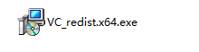

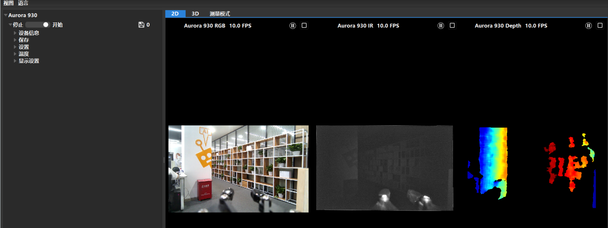


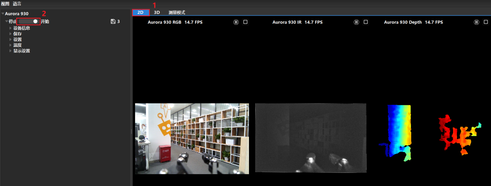

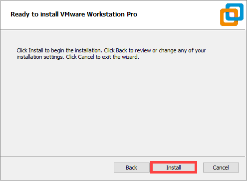

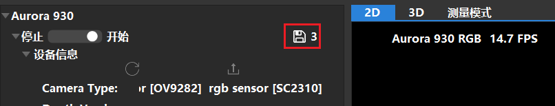

4. When starting the virtual machine for the first time, enter the product key and click **Continue**.

- **Starting VMware Services on Local Computer**

1. Switch to the local computer and press **WIN+R** to open the **Run** dialog. Type control and press **Enter** to open the Control Panel.

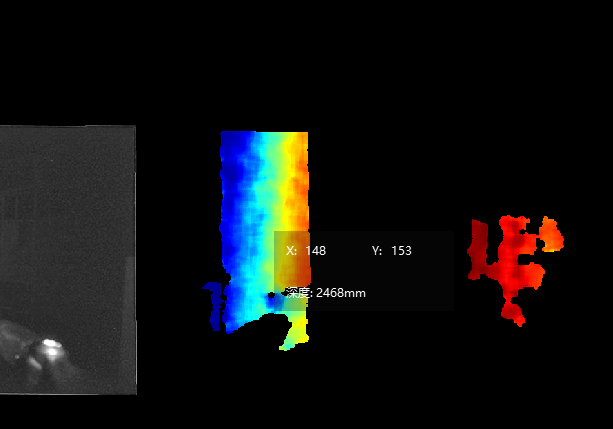

2. Click **Administrative Tools**, then double-click **Services**.

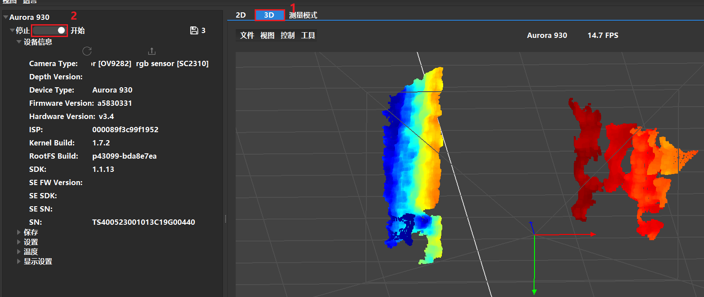

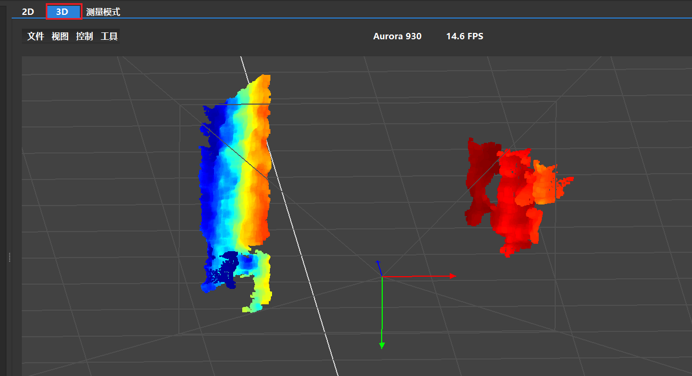

3. Find the VMware-related services as shown below.

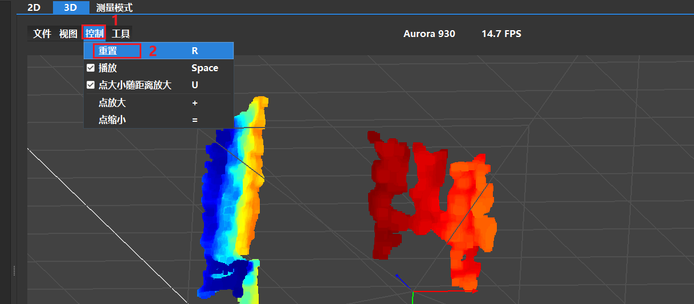

4. Right-click and select **Start** to enable all VMware-related services.

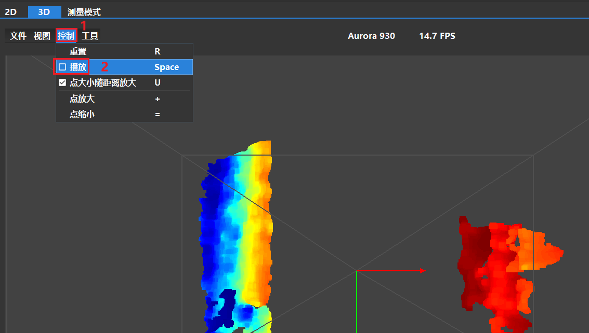

### 18.1.2 Virtual System Image Import

1. In the software interface, click on **Open a Virtual Machine**.

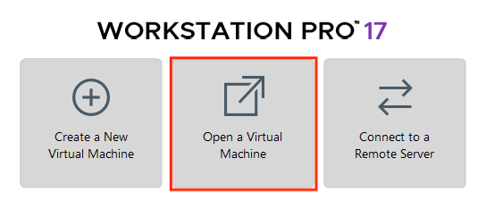

2. Navigate to the required virtual machine file in the directory [1. Virtual Machine Software \& Image File \\ Resources  \\ 2. Virtual Machine Image](https://drive.google.com/drive/folders/1VNCw2knTO7_Yq4PjOHK5JxmxQZIsellc?usp=sharing), and open it.

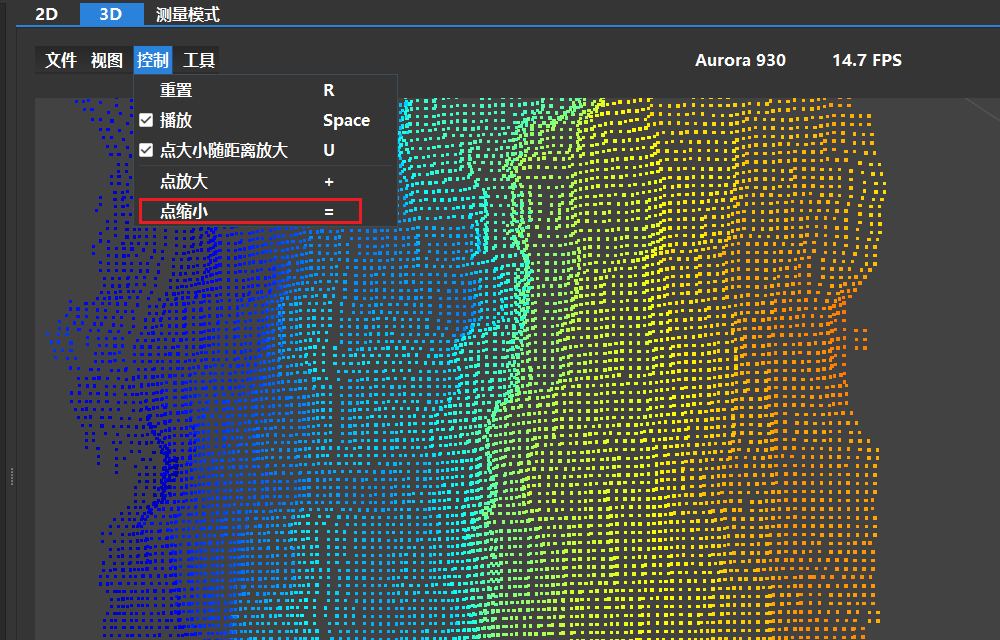

3. Select a storage path and click **Import**. Wait for the import to complete.

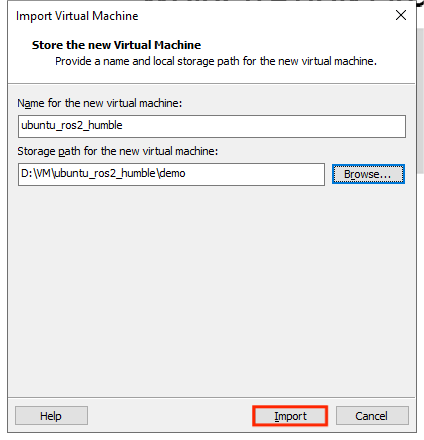


4. After the import is complete, the virtual machine is ready to use.

### 18.1.3 Virtual Machine Settings

1. Locate the virtual machine that was imported and click **Edit virtual machine settings**.


2. Click on **Network Adapter** and select **Bridged**.


3. Click on **Display** and uncheck the **Accelerate 3D graphics** option.


## 18.2 Configuration

> [!NOTE]
>
> **It’s normal for the virtual machine to take longer than usual during the first startup.**

The virtual machine interface is as follows:


### 18.2.1 Importing the Feature Package

1. Launch the virtual machine. Click the terminal icon  in the system desktop to open a command-line window.

2. Click the Home folder  on the desktop to enter the directory.

3. Locate the compressed **simulations** file and the `.typerc` file in the directory [1. Virtual Machine Software \& Image File \\ Resources \\ 3. Feature Package](https://drive.google.com/drive/folders/1Ev5CLpM07vHqlzC3lH0o07k8jxpdUprk?usp=sharing). Drag the compressed file into the Home directory of the virtual machine.

4. Right-click in the Home directory and select **Open in terminal** to open the terminal.


5. Enter the following command to create a directory.

```bash
mkdir -p ~/ros2_ws/src
```

6. Enter the following commands to extract the files and place the feature packages in the workspace directory.

```bash
unzip ~/simulations.zip
mv ~/simulations ~/ros2_ws/src/simulations 
```

7. Enter the following command to compile the package, then wait for the process to complete.

```bash
cd ~/ros2_ws && colcon build --symlink-install
```

8. Run the following command to move the `.typerc` file.

```bash
mv /home/ubuntu/.typerc ~/ros2_ws/.typerc
```

9. Enter the command to verify that the file was moved successfully.

```bash
cd ~/ros2_ws/ && ls -a
```

10. Enter the command to enable automatic loading of the configuration file.

```bash
echo "source ~/ros2_ws/install/setup.bash">>~/.bashrc
echo "source ~/ros2_ws/.typerc">>~/.bashrc
```

11. Reload the configuration file to apply the updated settings.

```bash
source ~/.bashrc
```


## 18.3 Introduction to URDF Models

<p id ="anther18.3.1"></p>

### 18.3.1 Overview and Basics of URDF Models

> [!NOTE]
> 
> **This section is based on configuration and simulation within a virtual machine. If the virtual machine is not yet installed, please first refer to section [18.1 Virtual Machine Installation and Import](#anther18.1) to complete the installation.**

* **URDF Model Introduction**

URDF is a format based on the XML specification, designed for describing the structure of robots. Its purpose is to provide a robot description standard that is as general and widely applicable as possible.

Robots are typically composed of multiple links and joints. A link is defined as a rigid object with certain physical properties, while a joint connects two links and constrains their relative motion.

By connecting links with joints and imposing motion restrictions, a kinematic model is formed. The URDF file specifies the relationships between joints and links, their inertial properties, geometric characteristics, and collision models.

* **Comparison between Xacro and URDF Model**

The URDF model serves as a description file for simple robot models, offering a clear and easily understandable structure. However, when it comes to describing complex robot structures, using URDF alone can result in lengthy and unclear descriptions.

To address this limitation, the xacro model extends the capabilities of URDF while maintaining its core features. The Xacro format provides a more advanced approach to describing robot structures. It greatly improves code reusability and helps avoid excessive description length.

For instance, when describing the two legs of a humanoid robot, the URDF model would require separate descriptions for each leg. On the other hand, the Xacro model allows for describing a single leg and reusing that description for the other leg, resulting in a more concise and efficient representation.

* **Install URDF Dependency**

> [!NOTE]
> 
> **The URDF and Xacro models are already installed in the virtual machine, so there is no need to reinstall them. This section is provided for reference only.**

1. Run the following command and press **Enter** to update the package information:

```bash
sudo apt update
```


2. Run the following command and press **Enter** to install the URDF dependencies:

```bash
sudo apt-get install ros-humble-urdf
```

When the output matches the image below, the installation is successful:


3. Run the following command and press **Enter** to install the Xacro model extension for URDF:

```bash
sudo apt-get install ros-humble-xacro
```

When the output matches the image below, the installation is successful:


* **URDF Model Basic Syntax**

1. XML Basic Syntax

Since URDF models are written based on the XML specification, it is necessary to understand the basic structure of the XML format.

(1) An element can be defined as desired using the following formula:

**\<Element>**

**\</Element>**

(2) Attributes are contained within an element and are used to define certain properties and parameters of that element. When defining an element, the following format can be used:

**\<Element attribute_1="value1" attribute_2="value2">**

**\</Element>**

(3) Comments do not affect other attributes or elements. The following syntax can be used to define a comment:

<**！ \-- Comment content \-->**

2. Link

The Link element describes the visual and physical properties of the robot's rigid component. The following tags are commonly used to define the motion of a link:


\<visual>: Describe the appearance of the link, such as size, color, and shape.

\<inertial>: Describe the inertia parameters of the link, which will be used in the dynamics calculation.

\<collision>: Defines the collision properties of the link.

Each tag contains its own child elements and serves different purposes. Refer to the table below for details.

<table border="1">
  <tr>
    <th style>Tag</th>
    <th style>Function</th>
  </tr>
  <tr>
    <td>origin</td>
    <td>Describes the pose of the link. xyz defines the link’s position in the simulation map, and rpy defines its orientation in the simulation map.</td>
  </tr>
  <tr>
    <td>mass</td>
    <td>Describes the mass of the link.</td>
  </tr>
  <tr>
    <td>inertia</td>
    <td>Describes the inertia of the link. Due to the symmetry of the inertia matrix, six parameters ixx, ixy, ixz, iyy, iyz, izz must be provided as attributes. These values need to be calculated.</td>
  </tr>
  <tr>
    <td>geometry</td>
    <td>Describes the shape of the link. The mesh parameter loads the texture file, and the filename parameter loads the texture path. It includes three child tags: box, cylinder, sphere, used for rectangular, cylindrical, and spherical shapes.</td>
  </tr>
  <tr>
    <td>material</td>
    <td>Describes the material of the link. The name parameter is required. The color child tag adjusts color and transparency.</td>
  </tr>
</table>

3. Joint

In a URDF model, a joint is represented by the \<joint> tag. It describes the kinematic and dynamic properties of the robot joint, including motion type, as well as position and velocity limits. According to the type of motion, joints in a URDF model can be categorized into six types:

<table border="1">
  <tr>
    <th>Type & Description</th>
    <th>Label</th>
  </tr>
  <tr>
    <td>Rotational joint: can rotate infinitely around a single axis</td>
    <td>continuous</td>
  </tr>
  <tr>
    <td>Rotational joint: similar to continuous, but with rotation angle limits</td>
    <td>revolute</td>
  </tr>
  <tr>
    <td>Prismatic joint: moves along an axis with position limits</td>
    <td>prismatic</td>
  </tr>
  <tr>
    <td>Planar joint: allows translation or rotation in orthogonal plane directions</td>
    <td>planar</td>
  </tr>
  <tr>
    <td>Floating joint: allows both translation and rotation</td>
    <td>floating</td>
  </tr>
  <tr>
    <td>Fixed joint: a special joint that does not allow movement</td>
    <td>fixed</td>
  </tr>
</table>


When defining joint behavior, the following tags are commonly used:


\<parent_link>: Specifies the parent link.

\<child_link>: Specifies the child link.

\<calibration>: Used to calibrate the joint angle.

\<dynamics>: Describes certain physical properties of the motion.

\<limit>: Defines motion constraints.

Each tag contains its own child elements and serves different purposes. Refer to the table below for details.

<table border="1">
  <tr>
    <th>Label</th>
    <th>Function</th>
  </tr>
  <tr>
    <td>origin</td>
    <td>Describes the pose of the parent link. It contains two parameters: xyz specifies the link's position in the simulation map, and rpy specifies the link's orientation in the simulation map.</td>
  </tr>
  <tr>
    <td>axis</td>
    <td>Sets the child link to rotate around any of the XYZ axes relative to the parent link.</td>
  </tr>
  <tr>
    <td>limit</td>
    <td>Restricts the child link. The lower and upper attributes define the rotation range in radians, the effort attribute limits the force during rotation with a positive or negative value, in Newtons or N, and the velocity attribute limits the rotational speed in meters per second or m/s.</td>
  </tr>
  <tr>
    <td>mimic</td>
    <td>Describes the relationship of this joint with other joints.</td>
  </tr>
  <tr>
    <td>safety_controller</td>
    <td>Defines safety control parameters to protect the robot's joint movement.</td>
  </tr>
</table>


4. robot Tag

The top-level tag of a complete robot is \<robot>. All \<link> and \<joint> tags must be included within \<robot>, as shown below:


5. Gazebo Tag

Used with the Gazebo simulator, this tag allows configuration of simulation parameters, including Gazebo plugins and physical property settings.


6. Creating a Simple URDF Model

(1) Set the Robot Model Name

At the beginning of the URDF model, set the robot’s name using: **\<robot name="Robot_Model_Name">** At the end of the model, enter **\</robot>** to indicate that the robot model definition is complete.


(2) Define Links

① To write the first link and use indentation to indicate that it is part of the currently set model. Set the name of the link using the following format: **\<link name="Link_Name">**. At the end of the link definition, enter **\</link>** to indicate that the link definition is complete.


② When writing the link description, use indentation to indicate that the description belongs to the current link. Start the description with **\<visual>** and end it with **\</visual>**.


③ The **\<geometry>** tag is employed to define the shape of a link. Once the description is complete, end it with **\</geometry>**. Within the **\<geometry>** tag, indentation is used to specify the detailed description of the link's shape. The code below shows the shape of a link: **\<cylinder&nbsp;length=“0.01”&nbsp;radius=“0.2”/>**. Here, length="0.01" indicates that the link is 0.01 meters long, and radius="0.2" indicates that the link has a radius of 0.2 meters, forming a cylinder.


④ The **\<origin>** tag is utilized to specify the position of a link, with indentation used to indicate the detailed description of the link's position. The following example demonstrates the position of a link: **\<origin rpy="0 0 0" xyz="0 0 0" />**. In this example, rpy represents the angles of the link, while xyz represents the coordinates of the link's position. This example places the link at the origin of the coordinate system.


⑤ The **\<material>** tag is used to define the visual appearance of a link, with indentation used to specify the detailed description of the link's color. To start describing the color, include **\<material>**, and end with **\</material>** when the description is complete. The following example demonstrates setting a link color to yellow: **\<color rgba="1 1 0 1" />**. In this example, rgba="1 1 0 1" represents the color threshold for achieving a yellow color.


(3) Define Joints

① To define the first joint, use indentation to indicate that the joint belongs to the current model being set. Then, specify the name and type of the joint as follows: **\<joint name="Joint_Name" type="Joint_Type">**. At the end of the joint definition, enter **\</joint>** to indicate that the joint definition is complete.


② Define the parent and child links of the joint. Indent the contents to show that this description belongs to the current joint. Set the parent and child parameters as follows: Format: **\<parent link="Parent_Link"/>

\<child link="Child_Link"/>** When the joint rotates, the parent link serves as the pivot, and the child link rotates relative to it.


③ **\<origin>** describes the position of the joint, with indentation used to specify the detailed coordinates of the joint. The code below describes the position of the joint: **\<origin xyz=“0 0 0.1” />**. Here, xyz specifies the coordinates of the joint, placing it at x=0, y=0, z=0.1 in the coordinate system.


④ **\<axis>** specifies the joint’s orientation. Indent its contents to define the joint’s axis and rotation direction. The code below shows a joint’s orientation: **\<axis&nbsp;xyz=“0&nbsp;0&nbsp;1”&nbsp;/>**. Here, xyz specifies the orientation of the joint.


⑤ **\<limit>** defines motion constraints for the joint. Indent its contents to provide detailed limits on the joint’s angle. The code below shows a joint whose maximum torque does not exceed 300 N, with an upper rotation limit of 3.14 radians and a lower limit of -3.14 radians. These limits are defined according to the following formula: effort = joint torque (N), velocity = joint movement speed, lower = lower rotation limit (rad), upper = upper rotation limit (rad).


⑥ **\<dynamics>** describes the joint’s dynamics, with indentation used to define the joint’s dynamic properties. The code below shows an example of a joint’s dynamics parameters: **\<dynamics damping="50" friction="1" />**, where damping specifies the damping value, and friction specifies the friction coefficient.


The complete code is as follows:


### 18.3.2 Robot URDF Model Instructions

* **Preparation**

To understand the URDF model, refer to section [18.3.1 Overview and Basics of URDF Models](#anther18.3.1) in this file for related syntax. This section provides a brief analysis of the robot model code and component models.

* **Viewing the Robot Model Code**

1. Launch the virtual machine. Click the terminal icon  on the left of the system desktop to open a command-line window.

2. Enter the command and press **Enter** to navigate to the program’s startup directory.

```bash
cd ~/ros2_ws/src/rosorin_description/urdf/
```

3. Enter the following command to open the robot simulation model file.

```bash
ls
```

4. Simulation model files:


## 18.4 Gazebo Simulation

> [!NOTE]
> 
> **This section uses a virtual machine as an example for configuration and learning. If the virtual machine is not yet installed, please follow the instructions in section [18.1 Virtual Machine Installation and Import](#anther18.1) in this file to install it before proceeding with the tutorial.**

### 18.4.1 Introduction to Gazebo

To simulate a realistic virtual physical environment where robots can perform tasks more effectively, a simulation software named Gazebo can be used.

Gazebo is a standalone software and is the most commonly used simulation tool in the ROS ecosystem. It provides high-fidelity physical simulation conditions, a comprehensive set of sensor models, and a user-friendly interactive interface, enabling robots to function effectively even in complex environments.

Gazebo supports URDF and SDF file formats for describing simulation environments. The robot models use the URDF format. Additionally, Gazebo provides many pre-built model modules that can be used directly.

* **Gazebo GUI Introduction**

The Gazebo simulation interface is shown below.

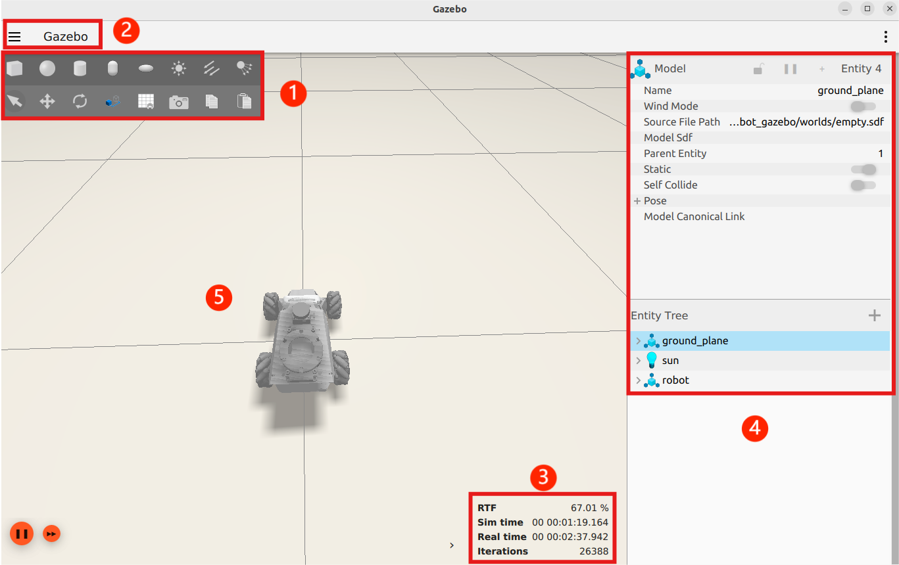

The functions of each section are described in the table below:

<table border="1">
  <thead>
    <tr>
      <th>Name</th>
      <th>Function</th>
    </tr>
  </thead>
  <tbody>
    <tr>
      <td>Area 1: Toolbar</td>
      <td>Provides the most commonly used options for interacting with the simulator.</td>
    </tr>
    <tr>
      <td>Area 2: Menu Bar</td>
      <td>Configures or modifies simulation software parameters, as well as some interactive functions.</td>
    </tr>
    <tr>
      <td>Area 3: Timestamp</td>
      <td>Allows manipulation of time within the virtual space.</td>
    </tr>
    <tr>
      <td>Area 4: Action Bar</td>
      <td>Operates on models and allows parameter modifications.</td>
    </tr>
    <tr>
      <td>Area 5: Scene</td>
      <td>The main area of the simulator where simulation models are displayed.</td>
    </tr>
  </tbody>
</table>

For more information about Gazebo, please visit the official website: http://gazebosim.org/.

* **Gazebo Learning Resources**

Gazebo Official Website: https://gazebosim.org/

Gazebo Tutorials: https://gazebosim.org/tutorials

Gazebo GitHub Repository: https://github.com/osrf/gazebo

Gazebo Answers Forum: http://answers.gazebosim.org/

### 18.4.2 Gazebo Xacro Model Visualization

To better understand the robot's model and structure, you can use Gazebo for visualization. Follow these steps:

* **Start the Simulation**

> [!NOTE]
> 
> **Commands must be entered with correct capitalization. The Tab key can be used to auto-complete keywords.**

1) Launch the virtual machine. Click the terminal icon  in the system desktop to open a command-line window.

2) Enter the following command to open the Gazebo simulation model:

```bash
ros2 launch robot_gazebo worlds.launch.py
```

If the interface shown below appears, the tool has launched successfully:

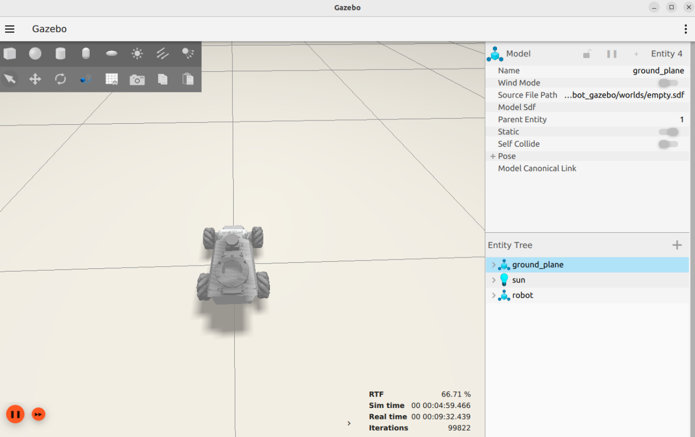

3) To close the currently running program in the terminal window, press the shortcut **Ctrl+C**.

* **Introduction to Shortcuts and Tools**

This section introduces some commonly used shortcuts and tools in Gazebo, using mouse controls as examples:

Left Mouse Button: In Gazebo simulation, the left mouse button is used for dragging the map and selecting objects. Press and hold the left mouse button on the map to drag it, or click on a model to select it.

Middle Mouse Button or Shift + Left Mouse Button:  

Press and hold while moving the mouse to rotate the view around the current target position.

Right Mouse Button or Mouse Wheel: Hold the right mouse button or scroll the wheel to zoom in and out, focusing on the point under the cursor.

For the toolbar tools, the following three will be used as examples for explanation.

1\. Selection Tool : The default tool in Gazebo, used to select models.

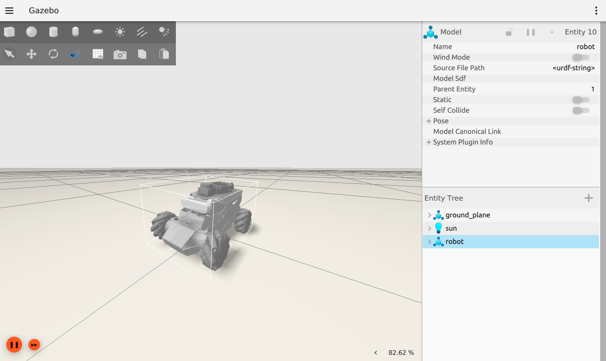

2\. Move Tool : After selecting a model with this tool, drag along the three axes to move the model.


3\. Rotate Tool : After selecting a model with this tool, drag along the three axes to rotate the model.

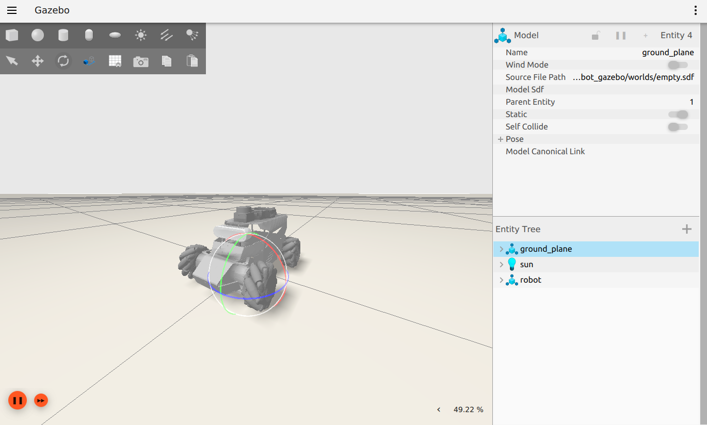

For more information about Gazebo, please visit the official website: http://gazebosim.org/

### 18.4.3 Gazebo Hardware Simulation

To understand the simulation models of various expansion devices on the robot, it is necessary to review the related model code.

* **LiDAR Simulation**

> [!NOTE]
> 
> **Commands must be entered with correct capitalization. The Tab key can be used to auto-complete keywords.**

1) Launch the virtual machine. Click the terminal icon  in the system desktop to open a command-line window.

2. Enter the command and press **Enter** to navigate to the program’s startup directory.

```
cd /home/ubuntu/ros2_ws/src/robot_gazebo/urdf/
```

3) Open the LiDAR simulation model file with:

```
vim lidar.gazebo.xacro
```

This file describes the Lidar simulation model, including its name, detection range, position, noise reduction settings, topic messages, and other properties.

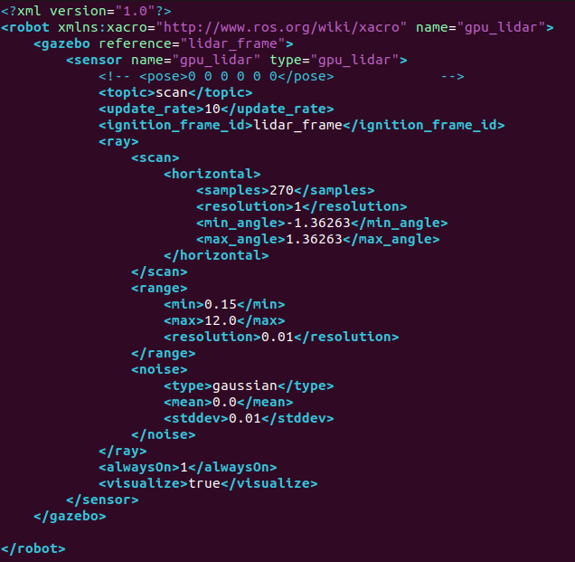

* **IMU Simulation**

> [!NOTE]
> 
> **Commands must be entered with correct capitalization. The Tab key can be used to auto-complete keywords.**

1) Launch the virtual machine. Click the terminal icon  in the system desktop to open a command-line window.

2. Enter the command and press **Enter** to navigate to the program’s startup directory.

```
cd /home/ubuntu/ros2_ws/src/robot_gazebo/urdf/
```

3) Open the LiDAR simulation model file with:

```
vim imu.gazebo.xacro
```

This file describes the IMU simulation model, including its name, offset settings, topic messages, and other properties.


### 18.4.4 Gazebo Mapping Simulation

* **Configuration**

> [!NOTE]
> 
> **Commands must be entered with correct capitalization. The Tab key can be used to auto-complete keywords.**

When mapping is required in an ideal environment that cannot be replicated in the real world, the desired scenario can be created in Gazebo for mapping simulation.

1) On the virtual machine, click the desktop icon  to open a terminal.

2. Enter the command to launch the Gazebo simulation.

```
ros2 launch robot_gazebo room_worlds.launch.py
```

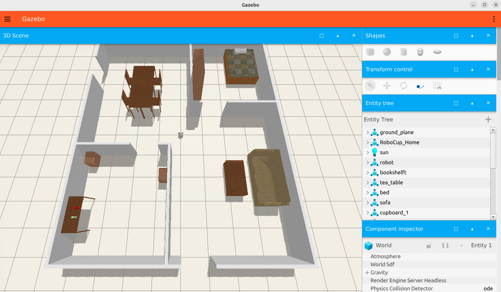

3) Click the icon  to open a new terminal and enter the following command to start the mapping service.

```
ros2 launch robot_gazebo slam.launch.py
```


* **Mapping Operation**

1) Enter the following command to enable keyboard-controlled mapping:

```
ros2 run robot_gazebo teleop_key_control
```

Once the following window appears, click anywhere inside the window with the mouse to start controlling. The specific key functions are listed in the table below:

<table border="1">
  <thead>
    <tr>
      <th>Key</th>
      <th>Function</th>
      <th>Operation</th>
    </tr>
  </thead>
  <tbody>
    <tr>
      <td>W</td>
      <td>Robot moves forward</td>
      <td>Tap</td>
    </tr>
    <tr>
      <td>S</td>
      <td>Robot moves backward</td>
      <td>Tap</td>
    </tr>
    <tr>
      <td>A</td>
      <td>Turn left</td>
      <td>Hold</td>
    </tr>
    <tr>
      <td>D</td>
      <td>Turn right</td>
      <td>Hold</td>
    </tr>
  </tbody>
</table>

2)  Control the robot to explore and build the simulation map. The mapping progress will be displayed simultaneously in RViz, as shown below:

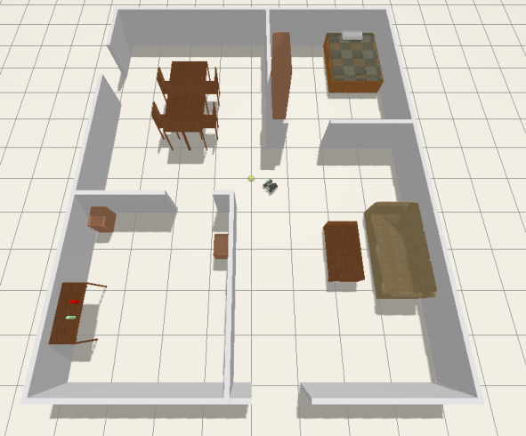

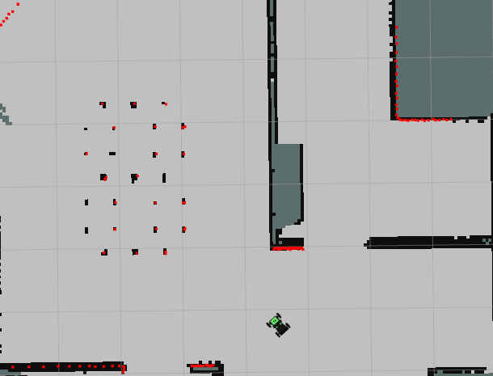

Scan the map until it roughly reaches the state shown below.

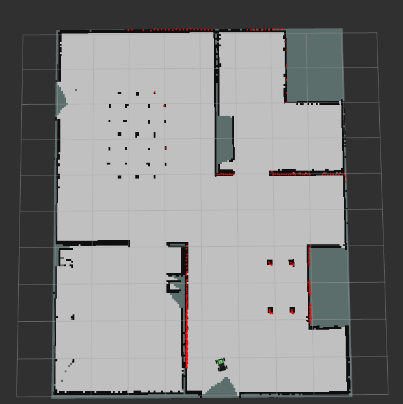

3) Enter the command to navigate to the directory where maps are stored and save the map.

```bash
cd ~/ros2_ws/src/robot_gazebo/maps && ros2 run nav2_map_server map_saver_cli -f "map_01" --ros-args -p map_subscribe_transient_local:=true
```

In this command, **map_01** is the map name, which can be renamed as needed. If the following prompt appears, it means the map has been saved successfully.


4) To close the currently running program in each terminal window, press **Ctrl+C**.

### 18.4.5 Gazebo Navigation Simulation

After completing the mapping in Gazebo, navigation can also be performed within the simulation environment to achieve a full simulated experience.

* **Configuration**

> [!NOTE]
> 
> **Commands must be entered with correct capitalization. The Tab key can be used to auto-complete keywords.**

1) Launch the virtual machine. Click the terminal icon  in the system desktop to open a command-line window.

2. Enter the following command to launch the simulation map:

```bash
ros2 launch robot_gazebo room_worlds.launch.py nav:=true
```

3) Click the icon  to open a new terminal.

4) Enter the following command to load the map for navigation and start the navigation process:

```bash
ros2 launch robot_gazebo navigation.launch.py map:=map_01
```

The **map_01** at the end of the command is the map name and can be modified as needed. The map is stored at the directory of **/home/ubuntu/ros2_ws/src/robot_gazebo/maps**.


* **Starting Navigation**

The software menu bar contains three tools: 2D Pose Estimate, 2D Nav Goal, and Publish Point.


**2D Pose Estimate**: Used to set the robot’s initial position. **2D Nav Goal**: Used to set a single target point for the robot. **Publish Point**: Used to set multiple target points for the robot.

1\. Click the **2D Nav Goal** tool in the software menu, then click a location on the map to set it as the target point. By pressing and dragging the mouse, the robot’s orientation upon reaching the target point can also be specified. The robot will automatically generate a path and move to the target point.


2\. Once the target point is set, the map will display the planned path, and the robot’s simulation model will move to the corresponding position.

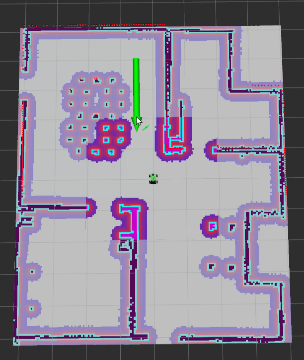


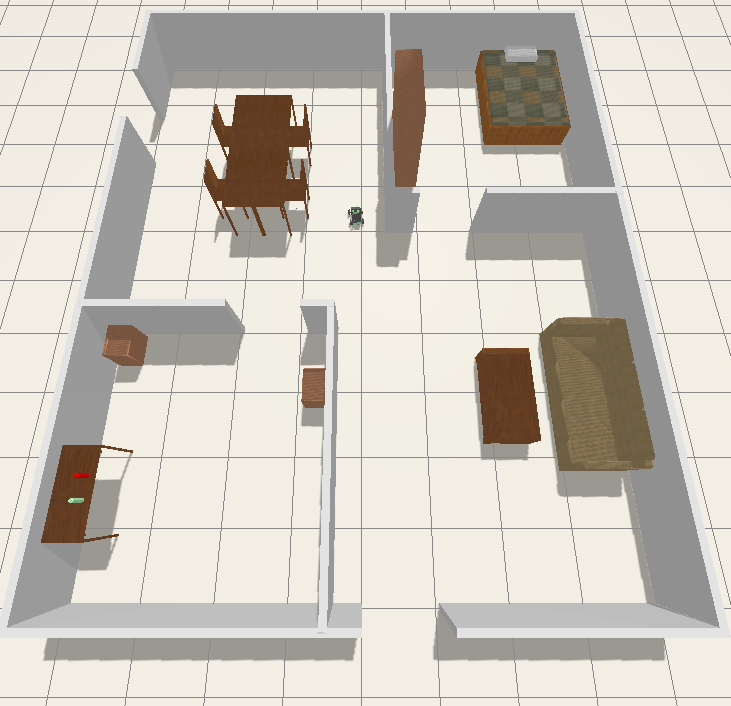

3\. To use the multi-point navigation feature, first click the button shown in the lower-left corner.

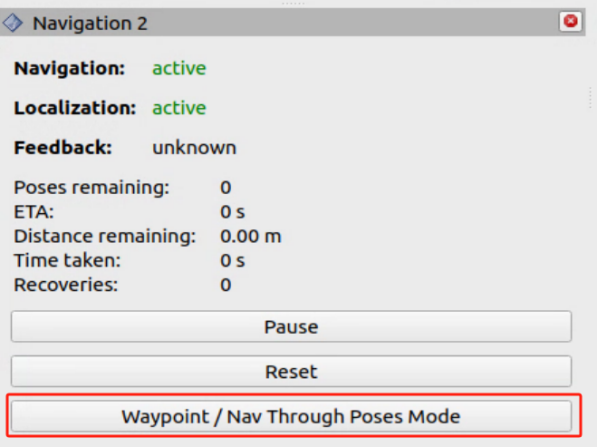

4\. Click the icon 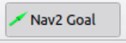, then click and drag the left mouse button at a point on the map to set the target direction and create a target point. To set multiple target points, repeat the above steps.

5\. Click the button in the lower-left corner to start navigation.


6\. To stop the navigation, return to the terminal and press **Ctrl+C** in each terminal to terminate the processes.