# 2\. Chassis Motion Control Course

## 2.1 Motion Control

### 2.1.1 IMU Calibration

> [!NOTE]
> 
> * **The robot is factory-calibrated and generally does not require recalibration. This section is provided for reference only. If the robot deviates significantly during navigation—for example, drifting noticeably to one side while moving forward and unable to drive in a straight line, follow the tutorial below to perform calibration.**
> 
> * **Calibration is intended to reduce errors. Some hardware deviations are inevitable, so the goal is to adjust the settings to achieve a performance that is relatively accurate and meets your needs.**

If deviations occur during use, the IMU, linear velocity, and angular velocity should be recalibrated. After calibration, the robot can perform all its functions correctly.

The IMU, Inertial Measurement Unit, is a device that measures an object’s three-axis orientation, angular velocity, and acceleration. The gyroscope and accelerometer are the main components of the IMU, providing a total of six degrees of freedom to measure angular velocity and acceleration in 3D space.

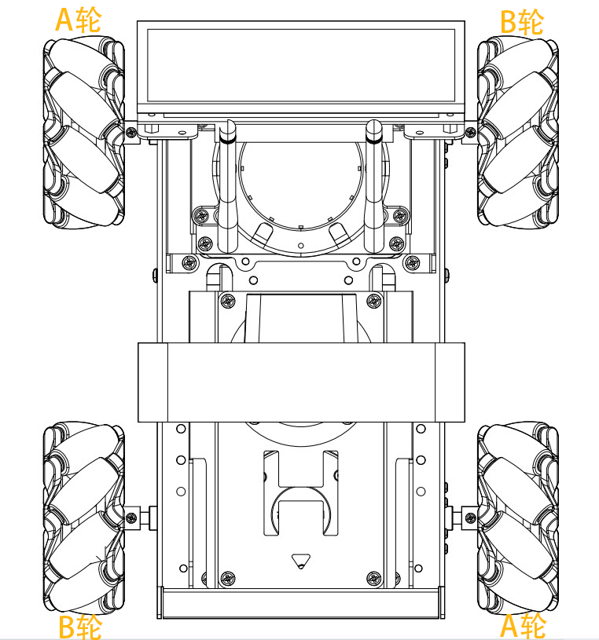

The figure above shows the positive directions of the IMU’s x, y, and z axes. During the calibration process, you can refer to this coordinate system. After the node receives the first IMU message, it will prompt you to hold the IMU in a specific orientation and press Enter to record the measurement. Once all six orientations are completed, the node calculates the calibration parameters and writes them to the specified YAML file. The detailed steps are as follows:

> [!NOTE]
>
> **The input command should be case sensitive, and the keywords can be complemented by the Tab key.**

1. Power on the robot and connect it via the VNC remote control software. For detailed information, please refer to the section [1.7 Development Environment Setup]() in the user manual.

2. Click the terminal icon  in the system desktop to open a command-line window.

3. Enter the following command and press **Enter** to stop the app auto-start service.

```bash
~/.stop_ros.sh
```

4. Next, enter the command and press **Enter** to start the chassis control node:

```bash
ros2 launch ros_robot_controller ros_robot_controller.launch.py
```

5. Then, open a new terminal, enter the command, and press **Enter** to start the IMU calibration:

```bash
ros2 run imu_calib do_calib --ros-args -r imu:=/ros_robot_controller/imu_raw --param output_file:=/home/ubuntu/ros2_ws/src/calibration/config/imu_calib.yaml
```

6. When the command line terminal displays the following prompt, it indicates that calibration of the IMU’s **X-axis** angular velocity offset in the **positive direction** is ready to start. Next, tilt the robot to the side so that the orientation matches the figure below, ensuring both the direction and angle are correct. Then, press **Enter** to execute.


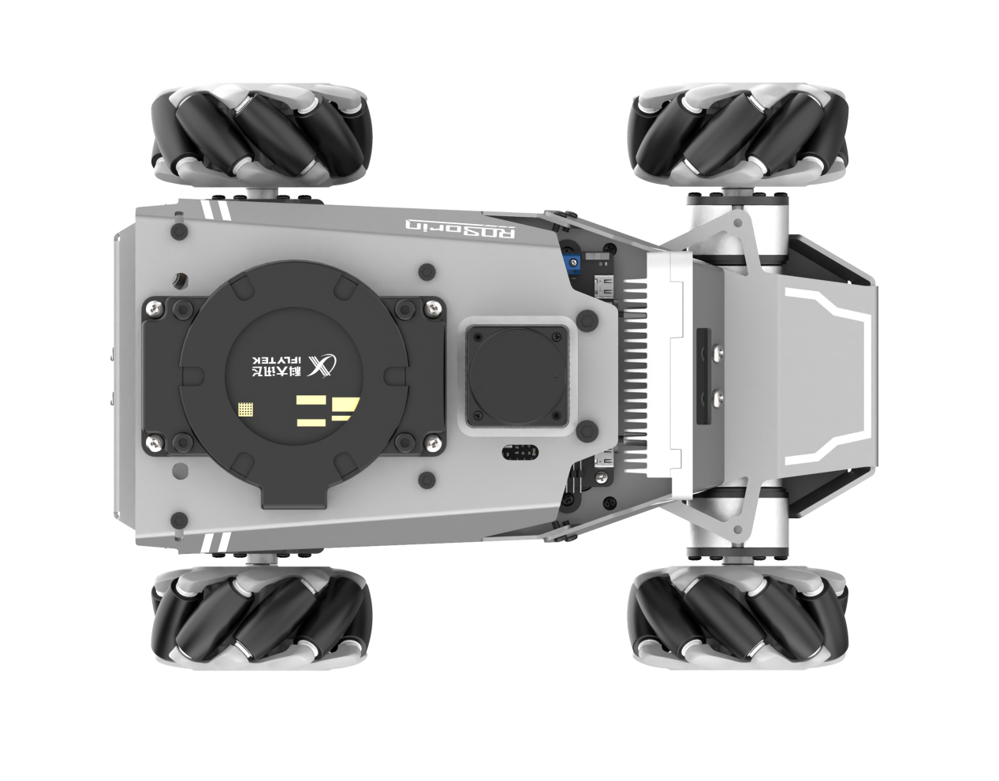

After each orientation is successfully calibrated, the following prompts will appear:


7. When the command line terminal displays the following prompt, it indicates that calibration of the IMU’s **X-axis** angular velocity offset in the **negative direction** is ready to start. Next, tilt the robot to the side so that the orientation matches the figure below, ensuring both the direction and angle are correct. Then, press **Enter** to execute.


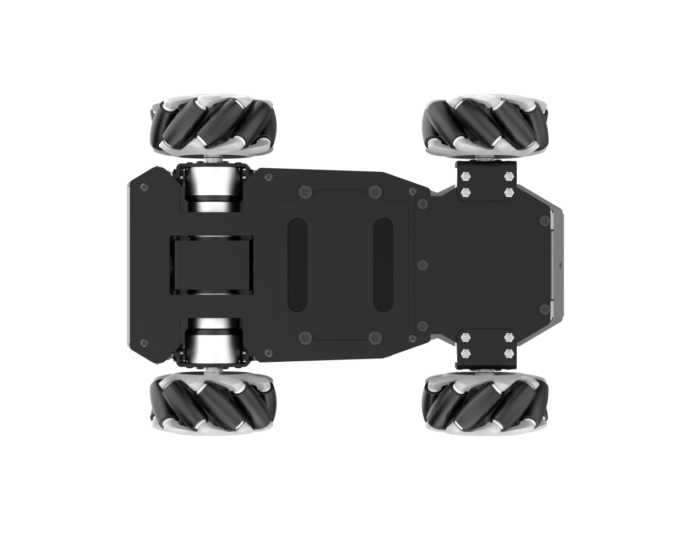

8. Next, when the command line terminal displays the following prompt, it indicates that calibration of the IMU’s **Y-axis** angular velocity offset in the **positive direction** is ready to start. Place the robot upright according to the orientation shown in the figure below, ensuring the direction and angle match the diagram. Then, press **Enter** to execute.


9. When the command line terminal shows the next prompt, it indicates that calibration of the IMU’s **Y-axis** angular velocity offset in the **negative direction** is ready to start. Position the robot face-down following the orientation shown in the diagram, making sure its direction and angle match the reference. Then, press **Enter** to proceed.


10. When the command line terminal displays the next prompt, it indicates that calibration of the IMU’s **Z-axis** angular velocity offset in the **positive direction** is ready to start. Pick up the robot, hold it upright facing upward, keep it steady, and press **Enter** to continue. Hold the robot in the orientation shown in the image, making sure the direction and angle match the diagram, then press **Enter** to proceed.


11. The terminal will then display a prompt indicating that the **negative** **Z-axis** gyroscope offset can be calibrated. Position the robot as shown in the diagram, ensuring its orientation and angle match the reference, and press **Enter** to continue.


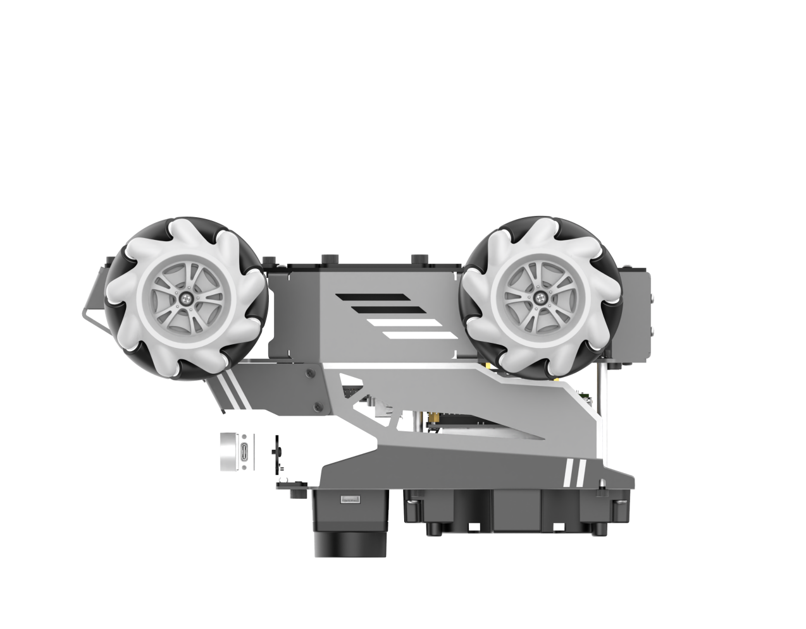

12. When the following message appears, the calibration is complete. Press **Ctrl+C** to exit.

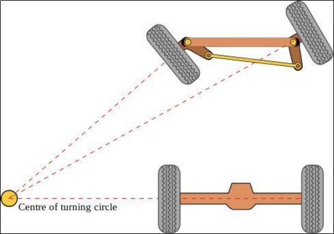

13. After calibration, you can check the calibrated model by running the command:

```bash
ros2 launch peripherals imu_view.launch.py
```

14. Gently tilt the platform to check whether the model’s tilt direction matches the actual movement. Refer to the example below. If both directions align, the IMU calibration results are considered accurate.

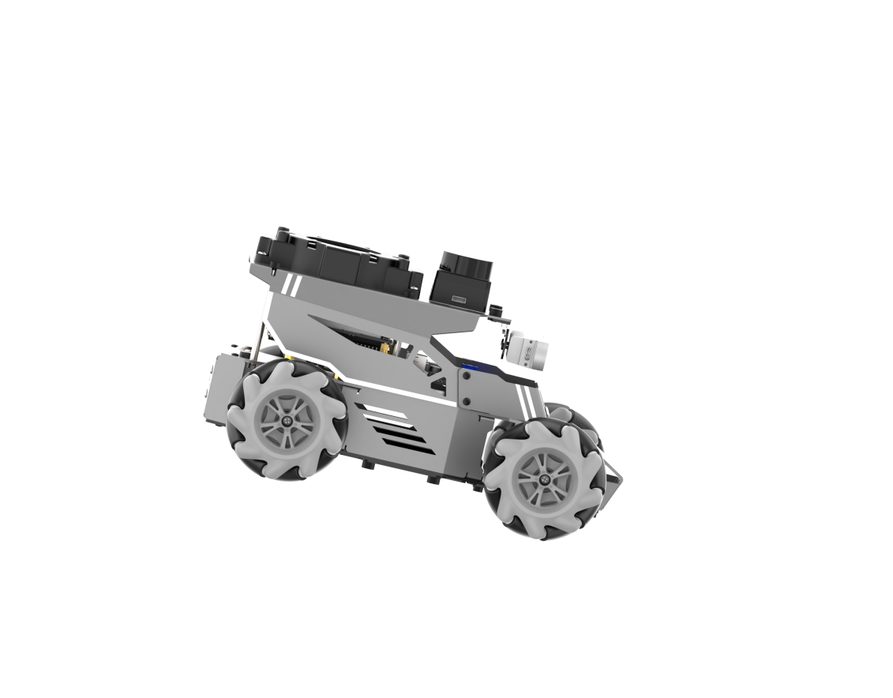

### 2.1.2 Angular Velocity Calibration

When the robot shows noticeable deviation in turning points or turning angles during mapping, navigation, or routine driving, angular-velocity calibration is required. The process is as follows:

> [!NOTE]
>
> **Commands must be entered with correct capitalization. The Tab key can be used to auto-complete keywords.**

1. Place the robot on a flat surface and apply a piece of tape—or position another marker—at the center of its front side, as shown below.


2. Power on the robot and connect to it using the remote connection tool by following the section [1.7.2 AP Mode Connection Steps]() in the user manual.

3. Click the terminal icon  on the system desktop.

4. Enter the following command and press **Enter** to stop the app auto-start service.

```bash
~/.stop_ros.sh
```

5. Before starting the calibration, navigate to the calibration configuration file directory and open the configuration file.

```bash
cd ~/ros2_ws/src/driver/controller/config && vim calibrate_params.yaml
```

6. Set the angular velocity parameter to 1.0 before proceeding with the calibration.


7. After editing, press **ESC**, type `:wq`, and press **Enter** to save and exit.

8. Next, enter the command and press **Enter** to start the chassis control node:

```bash
ros2 launch ros_robot_controller ros_robot_controller.launch.py
```

9. Then, open a new terminal, enter the command, and press **Enter** to start the angular velocity calibration:

```bash
ros2 launch calibration angular_calib.launch.py
```

10. Then, click **calibrate_angular** on the left to open the calibration interface, as shown below.


The meanings of the parameters on the left side of the interface are as follows:

(1) `test_angle` – The rotation angle for testing, 360° by default.

(2) `speed` – The linear speed, default is 0.15 m/s.

(3) `tolerance` – The allowable error. A smaller error value results in more noticeable oscillation when the robot reaches its target position.

(4) `odom_angule_scale_correction` – The odometry angle scaling ratio.

(5) `start_test` – Button to start testing the odometry angle scaling.

Make sure the robot is properly aligned, then check **start_test**. The robot will rotate in place. If it cannot complete a full rotation or shows deviation, adjust the **odom_angle_scale_correction** value, which scales the motor rotation during turning. It is recommended to adjust in increments of 0.01 and repeat the test until the robot can rotate exactly one full turn, then record this value.

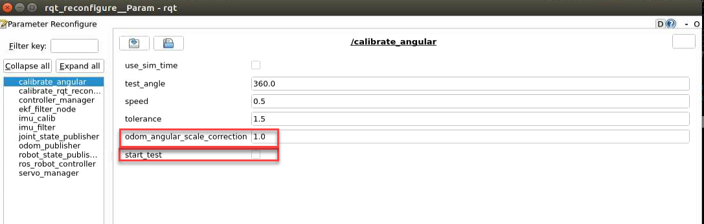

If the rotation angle exceeds one full turn, it indicates a deviation in the robot’s angular velocity. To correct it, increase the **odom_angular_scale_correction** parameter in the input field next to the slider, adjusting by 0.01 each time. For example, changing 1.0 to 1.01. Conversely,

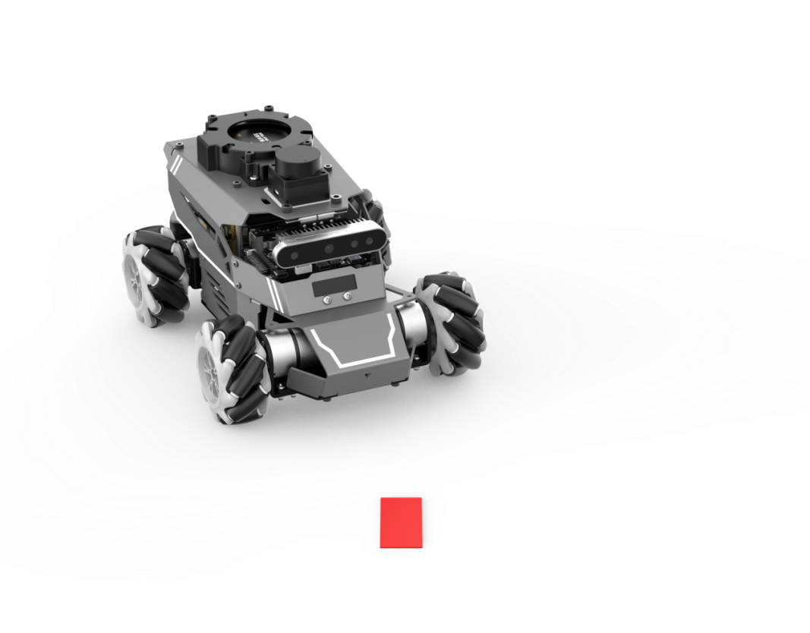

If the rotation angle is less than one full turn, decrease the parameter `odom_angular_scale_correction`.

When the robot completes exactly one full turn, the calibration is correct. Record the current value of **odom_angular_scale_correction**.


11. After calibration, open the calibration configuration file to save the corrected parameter:

```bash
cd ~/ros2_ws/src/driver/controller/config && vim calibrate_params.yaml
```

Press the key **i** to enter edit mode and modify the value of **angular_correctqion_factor** to the calibrated value of **odom_angule_scale_correction**.


> [!NOTE]
>
> **This section uses the Mecanum chassis as an example for calibration. The Ackermann chassis does not require angular velocity calibration.**

12. After editing, press **ESC**, enter the following command, and press **Enter** to save and exit.

```bash
:wq
```

### 2.1.3 Linear Velocity Calibration

> [!NOTE]
>
> **Commands must be entered with correct capitalization. The Tab key can be used to auto-complete keywords.**

1. Place the robot on a flat, open surface. Attach a start marker, such as tape, directly in front of the platform, and place an end marker about 1 meter ahead, as shown below.

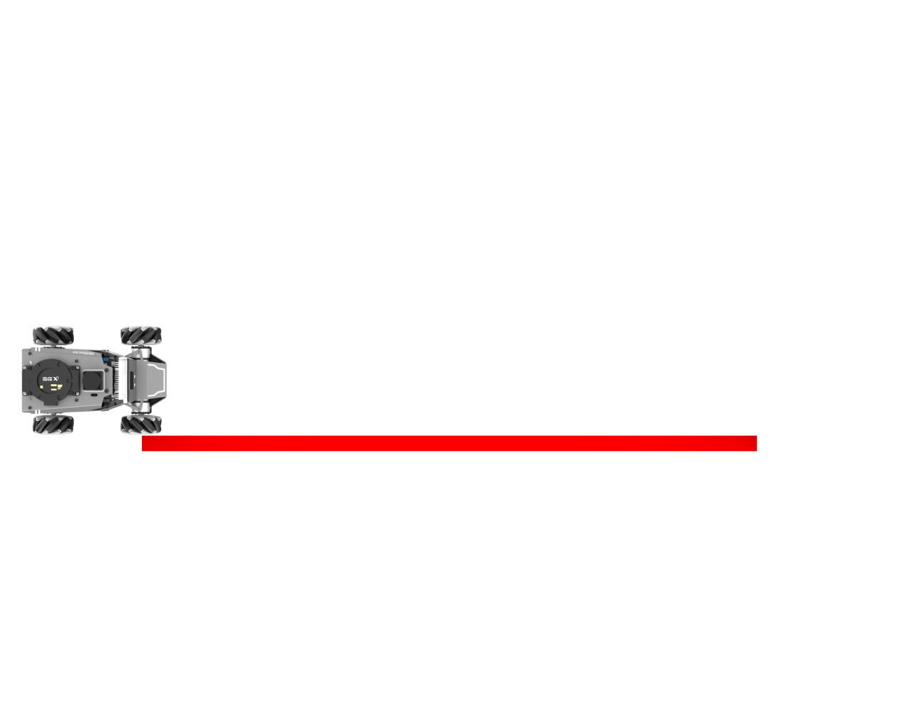

2. Power on the robot and connect to it using the remote connection tool by following the section [1.7.2 AP Mode Connection Steps]() in the user manual.

3. Click the terminal icon  in the system desktop to open a command-line window.

4. Enter the following command and press Enter to stop the app auto-start service.

```bash
~/.stop_ros.sh
```

5. Before starting the calibration, navigate to the calibration configuration file directory and open the configuration file.

```bash
cd ~/ros2_ws/src/driver/controller/config && vim calibrate_params.yaml
```

6. Change the linear velocity parameter **linear_correction_factor** to 1.0 before proceeding with the calibration.

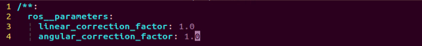

7. After editing, press **ESC**, type `:wq`, and press **Enter** to save and exit.

8. Next, enter the command and press **Enter** to start the chassis control node:

```bash
ros2 launch ros_robot_controller ros_robot_controller.launch.py
```

9. Then, open a new terminal, enter the command, and start the linear velocity calibration:

```bash
ros2 launch calibration linear_calib.launch.py
```

10. After the calibration program starts, click on **calibrate_linear** on the left to open the calibration interface, as shown below:


The meanings of the parameters on the left side of the interface are as follows:

(1) `test_distance` – The test distance, default is 1 meter.

(2) `speed` – The linear speed, default is 0.2 m/s.

(3) `tolerance` – The allowable error. Smaller values reduce the deviation from the target but may cause more shaking after reaching the target.

(4) `odom_linear_scale_correction` – The odometry linear scale factor.

(5) `start_test` – The button to start testing the odometry linear scale factor.

11. Ensure the robot is properly aligned and positioned at the start marker, then check **start_test**. The robot will move forward 1 meter in a straight line.

If no adjustment to the interface parameters is needed and the platform moves exactly 1 meter, the current settings are correct, as shown below.


If the robot moves more than 1 meter, the robot’s linear speed is off. Increase the `odom_linear_scale_correction` parameter by 0.01 at a time until the robot moves exactly 1 meter. Record this critical value, increasing it by 0.01 will cause the robot to travel less than 1 meter. If the robot moves less than 1 meter, decrease the parameter in 0.01 increments.

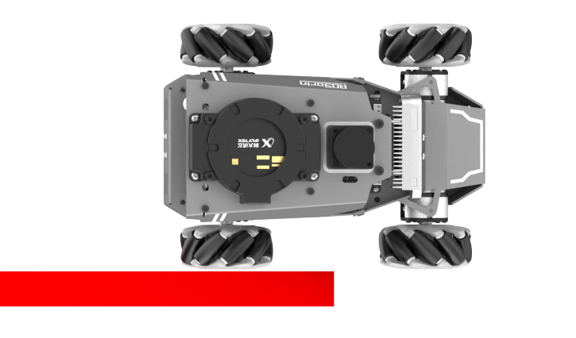

12. If there is any deviation, adjust the `odom_linear_scale_correction` value, which controls the scaling of the motor’s forward movement. It is recommended to change it in increments of 0.01 each time.


13. After calibration, open the calibration configuration file to save the corrected parameter.

```bash
cd ~/ros2_ws/src/driver/controller/config && vim calibrate_params.yaml
```

14. Press the key **i** to enter edit mode and modify `linear_correction_factor` to the calibrated value of `odom_linear_scale_correction`.


15. After editing, press **ESC**, type `:wq`, and press **Enter** to save and exit.

### 2.1.4 IMU and Odometry Data Publishing

In robot navigation, calculating the real-time position is crucial.

Typically, odometry information is computed using the motor encoders combined with the robot’s kinematic model. However, in some special scenarios, such as when the robot’s wheels spin in place or the robot is lifted off the ground, it may appear that the robot has moved a certain distance, even though the wheels did not actually turn.

In such cases, fusing IMU and odometry data provides a more accurate estimation of the robot’s position, which helps improve mapping and enhances navigation accuracy.

#### 2.1.4.1 Introduction to IMU and Odometry

The IMU, Inertial Measurement Unit, measures an object's three-axis orientation (angular velocity) and acceleration. The gyroscope and accelerometer are the main components of the IMU, providing a total of six degrees of freedom to measure angular velocity and acceleration in 3D space.

Odometry is a method for estimating an object's position over time based on data obtained from motion sensors. It is widely used in robotic systems to estimate how far a robot has moved relative to its initial position.

Common odometry methods include wheel odometry, visual odometry, and visual-inertial odometry. For the robot, wheel odometry is used.

The principle of wheel odometry can be illustrated with an example: Imagine you have a cart, and you want to know the distance from point A to point B.

If you know the circumference of the cart’s wheels and have a device to count the number of rotations while driving, you can calculate the distance by combining the wheel circumference with the total number of rotations during the trip from A to B.

For a wheeled robot, odometry provides a basic estimate of its pose. However, it has a significant limitation, which is cumulative error. Besides inherent hardware inaccuracies, environmental factors, such as wheel slippage caused by wet or slippery surfaces, can increase odometry errors as the robot travels farther.

Therefore, both the IMU and odometry are key components of the robot. They are used to measure the object's three-axis orientation or angular velocity, and acceleration, as well as to estimate the robot's displacement and pose relative to its initial position, including movement speed and direction.

To correct for errors in odometry, the IMU is used in combination, and the data from both sources are fused to obtain more accurate information.

The IMU data is published on the topic /imu, and the odometry data is published on /odom. Once both sets of data are obtained, they are fused using the ekf package in ROS, and the resulting fused localization information is then re-published.

#### 2.1.4.2 IMU Data Publishing

* **Enable Service**

> [!NOTE]
>
> **Commands must be entered with correct capitalization. The Tab key can be used to auto-complete keywords.**

1. Power on the robot and connect it via the VNC remote control software. For detailed information, please refer to the section [1.7.2 AP Mode Connection Steps]() in the user manual.

2. Click the terminal icon  in the system desktop to open a command-line window.

3. Enter the following command and press **Enter** to stop the app auto-start service.

```bash
~/.stop_ros.sh
```

4. Next, enter the command and press **Enter** to start the chassis control node:

```bash
ros2 launch ros_robot_controller ros_robot_controller.launch.py
```

5. Open a new terminal, enter the command, and press **Enter** to start publishing IMU data:

```bash
ros2 launch peripherals imu_filter.launch.py
```

* **View Data**

1. Then, open a new terminal, enter the command to check the current topics:

```bash
ros2 topic list
```

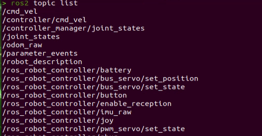

2. Next, enter the command to check the type, publisher, and subscriber of the `/imu` topic. You can replace it with any topic you want to check. The type of this topic is `sensor_msgs/msg/Imu`:

```bash
ros2 topic info /imu
```


3. Then, enter the command to print the topic message content, and you can replace it with any topic you want:

```bash
ros2 topic echo /imu
```


The message content shows the data collected from the three axes of the IMU.

#### 2.1.4.3 Odometry Data Publishing

* **Enable Service**

> [!NOTE]
>
> **Commands must be entered with correct capitalization. The Tab key can be used to auto-complete keywords.**

1. Power on the robot and connect it via the VNC remote control software. For detailed information on connecting to a remote desktop, please refer to section [1.7.2 AP Mode Connection Steps]() in the user manual.

2. Click the terminal icon  in the system desktop to open a command-line window.

3. Enter the following command and press **Enter** to stop the app auto-start service.

```bash
~/.stop_ros.sh
```

4. Enter the command and press **Enter** to start publishing odometry data:

```bash
ros2 launch controller odom_publisher.launch.py
```

* **View Data**

1. Open a new terminal, enter the command to check the current topics:

```bash
ros2 topic list
```


2. Next, enter the command to check the type, publisher, and subscriber of the `/odom_raw` topic. You can replace it with any topic you want to check. The type of this topic is `nav_msgs/msg/Odometry`:

```bash
ros2 topic info /odom_raw
```


3. Then, enter the command to print the topic message content. You can replace it with any topic you want:

```bash
ros2 topic echo /odom_raw
```

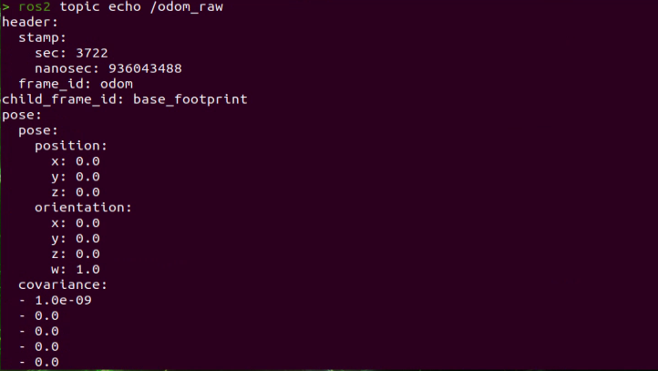

The message contains the robot's pose and twist data.

### 2.1.5 Robot Speed Control

This section shows how to control the robot’s forward speed by tuning the linear velocity parameter.

#### 2.1.5.1 Working Principle

Based on the robot’s motion characteristics, the forward, backward, and turning motions are achieved by controlling the rotation direction of the driving wheels.

The program subscribes to the `/controller/cmd_vel` topic to get the set linear and angular velocities, which are then used to calculate the robot’s movement speed.

<p id ="anther2.1.5.2"></p>

#### 2.1.5.2 Disable the App Service and Enable Speed Control

> [!NOTE]
>
> **Commands must be entered with correct capitalization. The Tab key can be used to auto-complete keywords.**

1. Power on the robot and connect it to the remote control software VNC. For instructions on setting up the remote desktop connection, refer to the section [1.7.2 AP Mode Connection Steps]() in the user manual.

2. Click the terminal icon  in the system desktop to open a command-line window.

3. Enter the command to stop the app service and press **Enter**:

```bash
~/.stop_ros.sh
```

4. Enter the command to start the motion control service:

```bash
ros2 launch controller controller.launch.py
```

5. Open a new ROS2 terminal and enter the command to enable speed control:

```bash
ros2 topic pub /controller/cmd_vel geometry_msgs/Twist "linear:
x: 0.0
y: 0.0
z: 0.0
angular:
x: 0.0
y: 0.0
z: 0.0"
```

The `linear` parameter sets the linear velocity. From the robot's perspective, the positive X direction points forward, with no motion along the Y or Z axes.

The `angular` parameter sets the angular velocity. A positive Z value makes the robot turn left, while a negative Z value makes it turn right. There is no rotation along the X or Y axes.

> [!NOTE]
> 
> * **The unit of linear velocity X is meters per second (m/s), with a recommended range of -0.6 ~ 0.6.**
> 
> * **Z represents the angular velocity for turning. It can be calculated using the formulas: V = ωR and tanΦ<sub>A</sub> = D / R, where z = ω, D = 0.213, and Φ<sub>A</sub> is the turn angle, ranging from 0° to 36°.**

Use the keyboard arrow keys to modify the corresponding parameters. For example, to move forward, set linear **X** to 0.1 and press **Enter** to execute.


6. To stop the robot, open a new terminal, set the previously modified linear **X** back to 0.0, and press **Enter**.


7. To exit this control mode, press **Ctrl+C** in each terminal.

> [!NOTE]
>
> **First, open a new terminal to stop the robot as in Step 6 before closing the control mode. If you press Ctrl+C directly in the terminal to exit, the robot may not stop properly.**

#### 2.1.5.3 Modifying Forward Speed

By adjusting the linear velocity X value, the robot can move forward at different speeds. For example, to make the robot move straight forward, set **X** to 0.3 as described in Step 5 of [2.1.5.2 Disable the App Service and Enable Speed Control](#anther2.1.5.2).

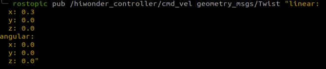

After pressing **Enter**, the robot will move forward at a speed of 0.3 m/s.

#### 2.1.5.4 Program Outcome

After starting the feature, the robot will move forward at the previously set speed of 0.3 m/s.

#### 2.1.5.5 Program Analysis

* **launch File**

The launch file is located at **/home/ubuntu/ros2_ws/src/driver/controller/launch/controller.launch.py**

```python
import os
from ament_index_python.packages import get_package_share_directory

from launch_ros.actions import Node
from launch.conditions import IfCondition
from nav2_common.launch import ReplaceString
from launch import LaunchDescription, LaunchService
from launch.substitutions import LaunchConfiguration
from launch.launch_description_sources import PythonLaunchDescriptionSource
from launch.actions import DeclareLaunchArgument, IncludeLaunchDescription, GroupAction, TimerAction, OpaqueFunction

def launch_setup(context):
    compiled = os.environ['need_compile']
    namespace = LaunchConfiguration('namespace', default='')
    use_namespace = LaunchConfiguration('use_namespace', default='false').perform(context)
    use_sim_time = LaunchConfiguration('use_sim_time', default='false')
    enable_odom = LaunchConfiguration('enable_odom', default='true')
    map_frame = LaunchConfiguration('map_frame', default='map')
    odom_frame = LaunchConfiguration('odom_frame', default='odom')
    base_frame = LaunchConfiguration('base_frame', default='base_footprint')
    imu_frame = LaunchConfiguration('imu_frame', default='imu_link')
    frame_prefix = LaunchConfiguration('frame_prefix', default='')

    namespace_arg = DeclareLaunchArgument('namespace', default_value=namespace)
    use_namespace_arg = DeclareLaunchArgument('use_namespace', default_value=use_namespace)
    use_sim_time_arg = DeclareLaunchArgument('use_sim_time', default_value=use_sim_time)
    enable_odom_arg = DeclareLaunchArgument('enable_odom', default_value=enable_odom)
    map_frame_arg = DeclareLaunchArgument('map_frame', default_value=map_frame)
    odom_frame_arg = DeclareLaunchArgument('odom_frame', default_value=odom_frame)
    base_frame_arg = DeclareLaunchArgument('base_frame', default_value=base_frame)
    imu_frame_arg = DeclareLaunchArgument('imu_frame', default_value=imu_frame)
    frame_prefix_arg = DeclareLaunchArgument('frame_prefix', default_value=frame_prefix)
```

1. Setting Paths

Obtain the paths for the three packages: `peripherals`, `controller`, and `servo_controller`.

```python
    if compiled == 'True':
        peripherals_package_path = get_package_share_directory('peripherals')
        controller_package_path = get_package_share_directory('controller')
        servo_controller_package_path = get_package_share_directory('servo_controller')
    else:
        peripherals_package_path = '/home/ubuntu/ros2_ws/src/peripherals'
        controller_package_path = '/home/ubuntu/ros2_ws/src/driver/controller'
        servo_controller_package_path = '/home/ubuntu/ros2_ws/src/driver/servo_controller'
```

2. Starting Other Launch Files

```python
    odom_publisher_launch = IncludeLaunchDescription(
        PythonLaunchDescriptionSource([os.path.join(controller_package_path, 'launch/odom_publisher.launch.py')
        ]),
        launch_arguments={
            'namespace': namespace,
            'use_namespace': use_namespace,
            'imu_frame': imu_frame,
            'frame_prefix': frame_prefix,
            'base_frame': base_frame,
            'odom_frame': odom_frame
        }.items()
    )
```

`odom_publisher_launch`: Launch file for odometry

`imu_filter_launch IMU launch`

3. Start Nodes

Starts the EKF fusion node.

```python
    ekf_filter_node = Node(
        package='robot_localization',
        executable='ekf_node',
        name='ekf_filter_node',
        output='screen',
        parameters=[ekf_param, {'use_sim_time': use_sim_time}],
        remappings=[
            ('/tf', 'tf'),
            ('/tf_static', 'tf_static'),
            ('odometry/filtered', 'odom'),
            ('cmd_vel', 'controller/cmd_vel')
        ],
        condition=IfCondition(enable_odom),
    )

    servo_controller_launch = IncludeLaunchDescription(
        PythonLaunchDescriptionSource([os.path.join(servo_controller_package_path, 'launch/servo_controller.launch.py')
        ]),
        launch_arguments={
            'base_frame': base_frame,
        }.items()
    )
```

* **Python File**

The Python file is located at **/home/ubuntu/ros2_ws/src/driver/controller/controller/odom_publisher_node.py**

1. Imported Libraries

```python
#!/usr/bin/env python3
# -*- coding: utf-8 -*-
import os
import math
import time
import rclpy
import signal
import threading
from rclpy.node import Node
from std_srvs.srv import Trigger
from nav_msgs.msg import Odometry
from controller import ackermann, mecanum
from ros_robot_controller_msgs.msg import MotorsState, SetPWMServoState, PWMServoState
from geometry_msgs.msg import Pose2D, Pose, Twist, PoseWithCovarianceStamped, TransformStamped
```

2. Main Function

```python
def main():
    node = Controller('odom_publisher')
    rclpy.spin(node)
```

Calls the `Controller` class and waits for the node to exit.

3. Global Parameters

```python
ODOM_POSE_COVARIANCE = list(map(float, 
                        [1e-3, 0, 0, 0, 0, 0, 
                        0, 1e-3, 0, 0, 0, 0,
                        0, 0, 1e6, 0, 0, 0,
                        0, 0, 0, 1e6, 0, 0,
                        0, 0, 0, 0, 1e6, 0,
                        0, 0, 0, 0, 0, 1e3]))

ODOM_POSE_COVARIANCE_STOP = list(map(float, 
                            [1e-9, 0, 0, 0, 0, 0, 
                             0, 1e-3, 1e-9, 0, 0, 0,
                             0, 0, 1e6, 0, 0, 0,
                             0, 0, 0, 1e6, 0, 0,
                             0, 0, 0, 0, 1e6, 0,
                             0, 0, 0, 0, 0, 1e-9]))

ODOM_TWIST_COVARIANCE = list(map(float, 
                        [1e-3, 0, 0, 0, 0, 0, 
                         0, 1e-3, 0, 0, 0, 0,
                         0, 0, 1e6, 0, 0, 0,
                         0, 0, 0, 1e6, 0, 0,
                         0, 0, 0, 0, 1e6, 0,
                         0, 0, 0, 0, 0, 1e3]))

ODOM_TWIST_COVARIANCE_STOP = list(map(float, 
                            [1e-9, 0, 0, 0, 0, 0, 
                              0, 1e-3, 1e-9, 0, 0, 0,
                              0, 0, 1e6, 0, 0, 0,
                              0, 0, 0, 1e6, 0, 0,
                              0, 0, 0, 0, 1e6, 0,
                              0, 0, 0, 0, 0, 1e-9]))
```

`ODOM_POSE_COVARIANCE`: Odometry POSE covariance.

`ODOM_POSE COVARIANCE STOP`: Odometry POSE covariance when velocity is zero.

`ODOM_TWIST_COVARIANCE`: Odometry TWIST covariance.

`ODOM_TWIST_COVARIANCE_STOP`: Odometry TWIST covariance when velocity is zero.

4. Functions

```python
def rpy2qua(roll, pitch, yaw):
    cy = math.cos(yaw*0.5)
    sy = math.sin(yaw*0.5)
    cp = math.cos(pitch*0.5)
    sp = math.sin(pitch*0.5)
    cr = math.cos(roll * 0.5)
    sr = math.sin(roll * 0.5)
    
    q = Pose()
    q.orientation.w = cy * cp * cr + sy * sp * sr
    q.orientation.x = cy * cp * sr - sy * sp * cr
    q.orientation.y = sy * cp * sr + cy * sp * cr
    q.orientation.z = sy * cp * cr - cy * sp * sr
    return q.orientation

def qua2rpy(x, y, z, w):
    roll = math.atan2(2 * (w * x + y * z), 1 - 2 * (x * x + y * y))
    pitch = math.asin(2 * (w * y - x * z))
    yaw = math.atan2(2 * (w * z + x * y), 1 - 2 * (z * z + y * y))
  
    return roll, pitch, yaw
```

`rpy2qua`: Converts Euler angles to a quaternion.

`qua2rpy`: Converts a quaternion to Euler angles.

5. Controller Class

(1) Call Kinematics:

```python
        self.ackermann = ackermann.AckermannChassis(wheelbase=0.17706, track_width=0.17165, wheel_diameter=0.085)  
        self.mecanum = mecanum.MecanumChassis(wheelbase=0.17706, track_width=0.17165, wheel_diameter=0.08)
```

`self.ackermann` invokes the Ackermann kinematics by initializing an Ackermann kinematics object.

(2) Define ROS Parameters:

```python
        self.declare_parameter('pub_odom_topic', True)
        self.declare_parameter('base_frame_id', 'base_footprint')
        self.declare_parameter('odom_frame_id', 'odom')
        self.declare_parameter('linear_correction_factor', 1.00)
        self.declare_parameter('linear_correction_factor_tank', 0.52)
        self.declare_parameter('angular_correction_factor', 1.00)
        self.declare_parameter('machine_type', os.environ['MACHINE_TYPE'])
        

        
        self.pub_odom_topic = self.get_parameter('pub_odom_topic').value
        self.base_frame_id = self.get_parameter('base_frame_id').value
        self.odom_frame_id = self.get_parameter('odom_frame_id').value
        
        #self.machine_type = os.environ.get('MACHINE_TYPE', 'ROSOrin_Mecanum')
        self.machine_type = self.get_parameter('machine_type').value
        self.ackermann = ackermann.AckermannChassis(wheelbase=0.17706, track_width=0.17165, wheel_diameter=0.085)  
        self.mecanum = mecanum.MecanumChassis(wheelbase=0.17706, track_width=0.17165, wheel_diameter=0.08)
```

The function `self.declare_parameter` is used to define a parameter.

The function `self.get_parameter` is used to obtain a parameter.

`pub_odom_topic ` determines whether to publish the odometry topic.

`base_frame_id` specifies the robot’s base frame ID.

`odom_frame_id` specifies the robot’s odometry frame ID.

`linear_correction_factor` sets the linear velocity correction factor.

`angular_correction_factor` sets the angular velocity correction factor.

`machine_type` specifies the type of robot.

(3) Publish Odometry:

```python
        if self.pub_odom_topic:
            # self.odom_broadcaster = tf2_ros.TransformBroadcaster(self)            # self.odom_trans = TransformStamped()
            # self.odom_trans.header.frame_id = self.odom_frame_id
            # self.odom_trans.child_frame_id = self.base_frame_id
            
            self.odom = Odometry()
            self.odom.header.frame_id = self.odom_frame_id
            self.odom.child_frame_id = self.base_frame_id
            
            self.odom.pose.covariance = ODOM_POSE_COVARIANCE
            self.odom.twist.covariance = ODOM_TWIST_COVARIANCE
            
            self.odom_pub = self.create_publisher(Odometry, 'odom_raw', 1)
            self.dt = 1.0/50.0

            threading.Thread(target=self.cal_odom_fun, daemon=True).start()
```

Whether to publish the odometry topic is determined by the `pub_odom_topic` parameter. If enabled, the node is initialized.

Relevant parameters are set, and the odometry is published using the `self.create_publisher` function. The odometry data is updated via the `self.cal_odom_fun` function.

(4) Topic Publishing:

```python
        self.motor_pub = self.create_publisher(MotorsState, 'ros_robot_controller/set_motor', 1)
        self.servo_state_pub = self.create_publisher(SetPWMServoState, 'ros_robot_controller/pwm_servo/set_state', 10)
        self.pose_pub = self.create_publisher(PoseWithCovarianceStamped, 'set_pose', 1)
        self.create_subscription(Pose2D, 'set_odom', self.set_odom, 1)
        self.create_subscription(Twist, 'controller/cmd_vel', self.cmd_vel_callback, 1)
        self.create_subscription(Twist, '/app/cmd_vel', self.acker_cmd_vel_callback, 1)
        self.create_subscription(Twist, 'cmd_vel', self.app_cmd_vel_callback, 1)
        self.create_service(Trigger, 'controller/load_calibrate_param', self.load_calibrate_param)
        self.create_service(Trigger, '~/init_finish', self.get_node_state)
```

`self.create_subscription` is used to subscribe to a topic.

`self.create_service` is used to create a service.

`self.motor_pub` publishes motor control messages to `ros_robot_controller/set_motor` with message type **MotorsState**.

`self.servo_state_pub` publishes servo control messages to `ros_robot_controller/bus_servo/set_state` with message type **SetBusServoState**.

`self.pose_pub` publishes servo pose messages to `set_pose` with message type **PoseWithCovarianceStamped**.

`set_odom` topic publishes **Pose2D** messages, with the callback function `self.set_odom`.

`controller/cmd_vel` topic publishes **Twist** messages, with the callback function `self.cmd_vel_callback`.

`cmd_vel` topic publishes **Twist** messages, with the callback function `self.set_app_cmd_vel_callback`.

`controller/load_calibrate_param` service uses the **Trigger** type, with the callback `self.load_calibrate_param`.

`~/init_finish` service uses the **Trigger** type, with the callback `self.get_node_state`.

(5) Controller Class Function Descriptions:

`get_node_state` retrieves the current state of the node, used as a callback function.

`load_calibrate_param` reads the current motion parameters, used as a callback function.

`set_odom` sets the odometry values, used as a callback function.

`app_cmd_vel_callback` sets the robot velocity based on commands from the app, used as a callback function.

`cmd_vel_callback` sets the robot velocity, used as a callback function.

`cal_odom_fun` publishes odometry data.


## 2.2 Kinematics Analysis

### 2.2.1 Overview

The Mecanum and Ackermann robots use two fundamentally different chassis designs, each with distinct structural and motion characteristics.

#### 2.2.1.1 Wheel Types

- **Mecanum Robot:** A Mecanum chassis uses four Mecanum wheels to support the robot. Each wheel can rotate independently, and the angled rollers allow the robot to move omnidirectionally, making tight maneuvering and lateral motion possible.
- **Ackermann Robot:** An Ackermann chassis also relies on wheels, typically with front-wheel steering and rear wheels that carry most of the robot’s weight. While the front wheels handle steering to enable turning.
- **Differential Robot:** A differential drive chassis drives the left and right wheels independently. By varying the wheel speeds on each side, the robot can move forward, reverse, turn, or even rotate in place.

#### 2.2.1.2 Typical Applications

- **Mecanum Robot:** A Mecanum chassis offers exceptional maneuverability, allowing smooth and flexible turning in tight or complex environments.

- **Ackermann Robot:** Ackermann chassis is widely used in road-driving scenarios—such as cars, trucks, and motorcycles—where steering through front wheels provides stable, predictable motion at speed.

- **Differential Robot:** Differential drive chassis are typically used indoors or on flat surfaces because their simple layout allows for in-place turning.

### 2.2.2 Mecanum Chassis

#### 2.2.2.1 Hardware Structure

A Mecanum wheel consists of a main wheel hub and multiple rollers mounted around the hub. The rollers are angled at 45 degrees relative to the axis of the hub. Typically, Mecanum wheels are used in sets of four, two left-handed wheels (Type A) and two right-handed wheels (Type B), which are arranged symmetrically.

There are several common configurations, such as AAAA, BBBB, AABB, ABAB, BABA, etc. However, not all configurations support full-range movement functions like forward/backward motion, rotation, and lateral movement. The Mecanum chassis uses the ABAB configuration, which enables true omnidirectional movement.

#### 2.2.2.2 Physical Characteristics

The motion of a Mecanum wheel robot is determined by the direction and speed of each individual wheel. The forces generated by each wheel combine to produce a resultant force vector, allowing the robot to move freely in any desired direction without changing the orientation of the wheels.

Because of the angled rollers distributed around the edge of the wheel, lateral movement is also possible. The rollers follow a unique path. When the wheel rotates around its central axis, the roller surfaces form a cylindrical envelope, allowing the robot to roll continuously in a given direction.

The Mecanum-wheel chassis has the following main features:

1\. Wheel arrangement: The chassis usually consists of four specially arranged wheels. One at each corner of the chassis, forming a diagonal pattern within a plane. This arrangement allows the robot to generate both lateral and longitudinal thrust simultaneously.

2\. Rolling mechanism: Each Mecanum wheel has a unique rolling design with multiple angled rollers or beads around the circumference. These rollers enable the wheel to move in multiple directions, including sideways and forward/backward, allowing the robot to perform translational movements without changing its orientation.

3\. Wheel motion control: By adjusting the speed and direction of each wheel, the robot’s movement and direction can be precisely controlled. Proper wheel control enables the vehicle to rotate, translate, or move diagonally, offering highly flexible maneuvering.

Stability: Mecanum wheels provide good stability, as the robot can move or translate in place without rotating. This is especially useful for robots navigating narrow passages or performing complex tasks.

5\. Load capacity: The load capacity of Mecanum wheels depends on the design of the wheels and the drive system. They can accommodate a range of payloads, from small robots to industrial equipment.

#### 2.2.2.3 Kinematic Principles and Equations

In kinematic analysis, the motion of Mecanum wheels can be described using a kinematic model. This includes several key parameters:

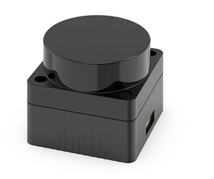

1. : Linear velocity of the Mecanum chassis along the X-axis, typically the forward/backward direction.
2. 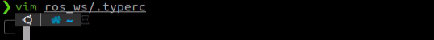: Linear velocity of the Mecanum chassis along the Y-axis, typically the left/right or lateral direction.
3. 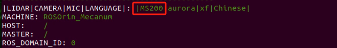: Angular velocity of the Mecanum chassis, which is the rotation speed around its own center.
4. : The real-time speeds of the four Mecanum wheels.
5. For example, the motion of the front-right wheel (Wheel B) on a 2D plane can be decomposed into:
6. VBx: Linear velocity of the chassis along the X-axis, typically the forward/backward direction.
7. VBy: Linear velocity of the chassis along the Y-axis, typically the left/right or lateral direction.
8. L: The distance between the centers of the left and right wheels.
9. H: The distance between the centers of the front and rear wheels.
10. : The angle between the robot’s center of chassis and the front-right wheel is 45°.
11. Based on these parameters, we can perform a kinematic analysis of the Mecanum wheel chassis to determine how wheel speeds contribute to the overall movement of the robot in any direction. Key equations are given below:

Kinematic Analysis and Formula Derivation:

To simplify the kinematic model, we make the following two idealized assumptions:

(1) The Mecanum wheels do not slip on the ground, and the ground provides sufficient friction.

(2) The four wheels are positioned at the corners of a rectangle or square, and all wheels are parallel to their corresponding axes.

In this model, the robot’s rigid body movement is decomposed into three linear components: translation along the X-axis, translation along the Y-axis, and rotation around the Z-axis. By calculating the individual wheel speeds required for these three simple motions, we can combine them to compute the required rotational speed for each wheel during the compound motion of simultaneous translation and rotation.

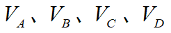 represent the rotational speeds of wheels A, B, C, and D, respectively, corresponding to the motor speeds. is the translational velocity of the robot along the X-axis,  is the translational velocity along the Y-axis, and  is the rotational velocity around the Z-axis.

 is half the wheel track *L*, and 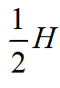 is half the wheelbase *H*.

1. When the robot moves along the X-axis, the speed component of each wheel can be calculated using the following formula:


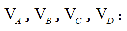 represent the real-time speeds of the four Mecanum wheels, while  represents the wheels’ speed along the X-axis.

2. When the robot moves along the Y-axis, the speed component of each wheel can be calculated using the following formula:


 represents the speed of the Mecanum wheels along the Y-axis.

3. When the robot rotates around the Z-axis, the speed component of each wheel can be calculated using the following formula:

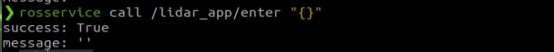

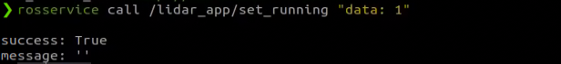

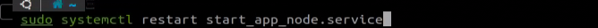: Angular velocity of the Mecanum chassis, which is the rotation speed around its own center.

4. By combining the velocities along the X, Y, and Z axes, the rotational speed required for each of the four wheels can be derived according to the robot’s overall motion state.

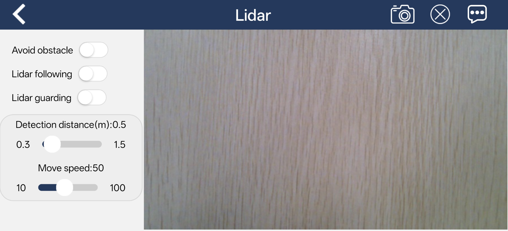

#### 2.2.2.4 Program Implementation

File path: **ros2_ws\\src\\driver\\controller\\controller\\mecanum.py**

```python
import math
from ros_robot_controller_msgs.msg import MotorState, MotorsState

class MecanumChassis:
    # wheelbase = 0.1368   # Distance between front and real axles
    # track_width = 0.1446 # Distance between left and right axles
    # wheel_diameter = 0.065  # Wheel diameter
    def __init__(self, wheelbase=0.206, track_width=0.194, wheel_diameter=0.0065):
        self.wheelbase = wheelbase
        self.track_width = track_width
        self.wheel_diameter = wheel_diameter
```

Mecanum wheel kinematics class, used to calculate wheel speeds and implement the Mecanum wheel motion.

Init:

```python
    def __init__(self, wheelbase=0.206, track_width=0.194, wheel_diameter=0.0065):
        self.wheelbase = wheelbase
        self.track_width = track_width
        self.wheel_diameter = wheel_diameter
```

Initializes the wheel dimensions for subsequent calculations.

`speed_covert`:

```python
    def speed_covert(self, speed):
        """
        covert speed m/s to rps/s
        :param speed:
        :return:
        """
        # distance / circumference = rotations per second
        return speed / (math.pi * self.wheel_diameter)
```

Converts linear velocity (m/s) to angular velocity (rps/s) based on wheel parameters.

`set_velocity`:

```python
    def set_velocity(self, linear_x, linear_y, angular_z):
        """
        Use polar coordinates to control moving
                    x
        v1 motor1|  ↑  |motor3 v3
          +  y - |     |
        v2 motor2|     |motor4 v4
        :param speed: m/s
        :param direction: Moving direction 0~2pi, 1/2pi<--- ↑ ---> 3/2pi
        :param angular_rate:  The speed at which the chassis rotates rad/sec
        :param fake:
        :return:
        """
        # vx = speed * math.sin(direction)
        # vy = speed * math.cos(direction)
        # vp = angular_rate * (self.wheelbase + self.track_width) / 2
        # v1 = vx - vy - vp
        # v2 = vx + vy - vp
        # v3 = vx + vy + vp
        # v4 = vx - vy + vp
        # v_s = [self.speed_covert(v) for v in [v1, v2, -v3, -v4]]
        motor1 = (linear_x - linear_y - angular_z * (self.wheelbase + self.track_width) / 2)
        motor2 = (linear_x + linear_y - angular_z * (self.wheelbase + self.track_width) / 2)
        motor3 = (linear_x + linear_y + angular_z * (self.wheelbase + self.track_width) / 2)
        motor4 = (linear_x - linear_y + angular_z * (self.wheelbase + self.track_width) / 2)
        v_s = [self.speed_covert(v) for v in [motor1, motor2, -motor3, -motor4]]
        data = []
        for i in range(len(v_s)):
            msg = MotorState()
            msg.id = i + 1
            msg.rps = float(v_s[i])
            data.append(msg)
        
        msg = MotorsState()
        msg.data = data
        return msg
```

Decomposes the input velocity parameters, computes the corresponding angular velocity using `speed_covert`, and publishes the resulting radian velocity to the motors.

### 2.2.3 Ackermann Chassis

#### 2.2.3.1 Hardware Structure

The front-wheel steering mechanism of the Ackerman chassis consists of a servo, a linkage, and the wheels. The servo connects to the linkage, which in turn connects to the wheels. By controlling the rotation of the servo, the linkage rotates accordingly, which adjusts the steering angle of the front wheels.

When the robot turns, the two front wheels remain parallel, meaning both wheels turn at the same angle. The rear wheels are driven by motors, which control the robot’s forward and backward motion as well as its speed.


#### 2.2.3.2 Physical Characteristics

The Ackerman chassis is designed to provide excellent steering performance and stability. It employs the Ackermann geometry principle to achieve this.

The Ackermann chassis has the following main features:

1\. Steering Geometry: A key feature of the Ackermann chassis is its steering geometry. By mounting the front wheels on separate steering axes, the inner and outer tires follow different turning radii during a turn. This design makes it easier for the robot to turn while reducing friction and tire wear.

2\. Wheel Angles: The angles of the front wheels change with steering to match the robot's turning radius. The inner front wheel is usually angled more than the outer front wheel to achieve better suspension performance.

3\. Steering Stability: The Ackermann chassis improves robot stability and suspension performance. It helps reduce steering wobble at higher speeds and provides better control and absorption.

4\. Suspension Design: The suspension system of an Ackermann chassis is typically adjusted to accommodate different front wheel steering angles, ensuring optimal suspension performance under various driving conditions.

5\. Turning Radius: Because the front wheels follow different radii when turning, robots with an Ackermann chassis usually have a smaller turning radius, which is advantageous for maneuvering in tight spaces and complex paths.

#### 2.2.3.3 Kinematic Principles and Equations

When analyzing the kinematics of an Ackerman chassis, the following mathematical parameters and formulas are used to describe its motion characteristics.

To achieve pure rolling motion, with no lateral slip when the vehicle turns, the normals of all four wheels’ rolling directions, which are the lines perpendicular to the wheel’s rolling direction, must intersect at a single point, known as the instantaneous center of rotation.

For simplicity, the model assumes only a single front wheel located at the midpoint of the front axle, as illustrated by the dashed line in the diagram. The key parameters are:

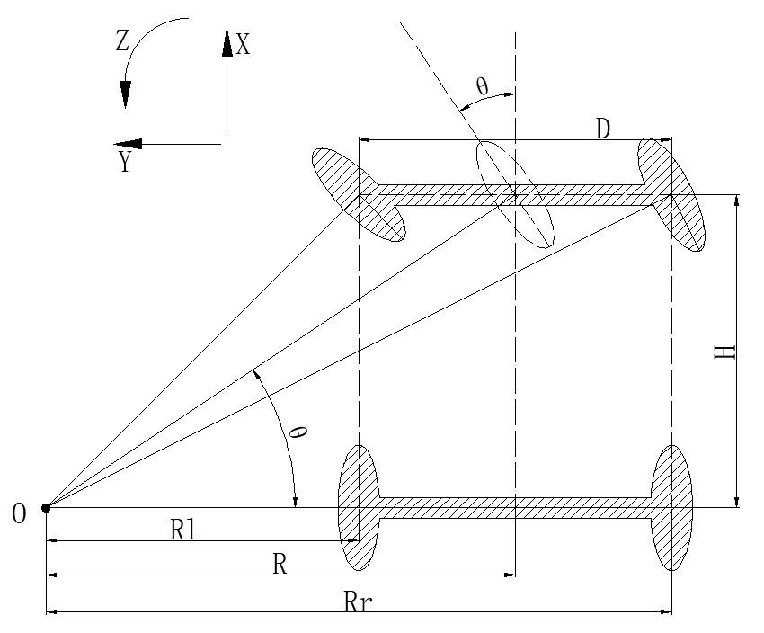

1. **Front Wheel Steering Angle (θ):** The steering angle of the front wheel relative to the vehicle’s forward direction, typically measured in radians (rad).

2. **Vehicle Linear Velocity (V):** The translational speed of the vehicle, measured in meters per second (m/s). **Left rear wheel speed: V<sub>L</sub>. Right rear wheel speed: V<sub>R</sub>.**

3. **Wheel Track (D):** The distance between the left and right wheels, measured in meters (m).

4. **Wheelbase (H):** The distance between the front and rear wheels, measured in meters (m).

5. **Turning Radius (R):** The radius of the circular path followed by the vehicle when turning, measured in meters (m).

**Left wheel turning radius: R<sub>L</sub>. Right wheel turning radius: R<sub>R</sub>.**

Computation of robot velocity and wheel speeds:

1. Angular velocity consistency:
   
   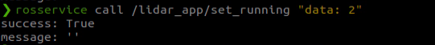
   


**ω** is the angular velocity of the robot, **R** is the turning radius of the robot’s center, **V** is the linear velocity of the robot, **V<sub>L</sub>** and **V<sub>R</sub>** are the linear velocities of the left and right rear wheels, and R<sub>L</sub> and R<sub>R</sub> are their respective turning radii.

2. Relationship between the front wheel steering angle and the turning radius:

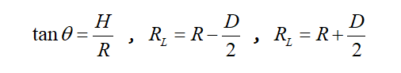

H is the wheelbase, R is the turning radius of the robot, D is the track width, and θ is the steering angle of the front wheel, where H is the distance between the front and rear axles, and D is the distance between the left and right wheels.

3. Left rear wheel velocity:

4. Right rear wheel velocity:

Given the robot’s track width, wheelbase, linear velocity, and steering angle, the velocities of the left and right rear wheels can be determined.

#### 2.2.3.4 Program Implementation

File path: **ros2_ws\\src\\driver\\controller\\controller\\ackermann.py**

```python
class AckermannChassis:
    # wheelbase = 0.213  # Distance between front and real axles
    # track_width = 0.222  # Distance between left and right axles
    # wheel_diameter = 0.101  # Wheel diameter

    def __init__(self, wheelbase=0.213, track_width=0.222, wheel_diameter=0.101):
        self.wheelbase = wheelbase
        self.track_width = track_width
        self.wheel_diameter = wheel_diameter
```

Ackerman Kinematics class, used to compute wheel velocities and implement Ackerman steering kinematics.

`Init`:

```python
    def __init__(self, wheelbase=0.213, track_width=0.222, wheel_diameter=0.101):
        self.wheelbase = wheelbase
        self.track_width = track_width
        self.wheel_diameter = wheel_diameter
```

Initializes the wheel dimensions for subsequent calculations.

`speed_covert`:

```python
    def speed_covert(self, speed):
        """
        covert speed m/s to rps/s
        :param speed:
        :return:
        """
        return speed / (math.pi * self.wheel_diameter)
```

Converts linear velocity (m/s) to angular velocity (rps/s) based on wheel parameters.

`set_velocity`:

```python
    def set_velocity(self, linear_speed, angular_speed, reset_servo=True):
        servo_angle = 1500
        data = []
        if abs(linear_speed) >= 1e-8:
            if abs(angular_speed) >= 1e-8:
                theta = math.atan(self.wheelbase*angular_speed/linear_speed)
                steering_angle = theta
                # print(math.degrees(steering_angle))
                if steering_angle > math.radians(34):
                    steering_angle = math.radians(34)
                elif steering_angle < math.radians(-34):
                    steering_angle = math.radians(-34)
                servo_angle = 1500 + 2000*math.degrees(-steering_angle)/180
                
            vr = linear_speed + angular_speed*self.track_width/2
            vl = linear_speed - angular_speed*self.track_width/2
            v_s = [self.speed_covert(v) for v in [0, vl, 0, -vr]]
            for i in range(len(v_s)):
                msg = MotorState()
                msg.id = i + 1
                msg.rps = float(v_s[i])
                data.append(msg)
            msg = MotorsState()
            msg.data = data
            return servo_angle, msg
        else:
            for i in range(4):
                msg = MotorState()
                msg.id = i + 1
                msg.rps = 0.0
                data.append(msg)
            msg = MotorsState()
            msg.data = data
```

Decomposes the input velocity parameters, converts them into wheel speeds using `speed_covert`, and publishes the computed angular velocities to the motors. Based on the linear and angular velocities, it calculates the required steering angle for the servo and sends the converted value to the servo for execution.