# 2\. ROS1- Chassis Motion Control Course

## 2.1 Kinematics Analysis
<p id ="anther2.1"></p>

### 2.1.1 Overview

The Mecanum and Ackermann robots use two fundamentally different chassis designs, each with distinct structural and motion characteristics.

* **Wheel Types**

**Mecanum Robot:** A Mecanum chassis uses four Mecanum wheels to support the robot. Each wheel can rotate independently, and the angled rollers allow the robot to move omnidirectionally, making tight maneuvering and lateral motion possible.

**Ackermann Robot:** An Ackermann chassis also relies on wheels, typically with front-wheel steering and rear wheels that carry most of the robot’s weight. While the front wheels handle steering to enable turning.

* **Applications**

**Mecanum Robot:** A Mecanum chassis offers exceptional maneuverability, allowing smooth and flexible turning in tight or complex environments.

**Ackermann Robot:** Ackermann chassis is widely used in road-driving scenarios—such as cars, trucks, and motorcycles—where steering through front wheels provides stable, predictable motion at speed.

<p id ="anther2.1.2"></p>

### 2.1.2 Mecanum Chassis

* **Hardware Structure**

A Mecanum wheel consists of a main wheel hub and multiple rollers mounted around the hub. The rollers are angled at 45 degrees relative to the axis of the hub. Typically, Mecanum wheels are used in sets of four, two left-handed wheels (Type A) and two right-handed wheels (Type B), which are arranged symmetrically.

There are several common configurations, such as AAAA, BBBB, AABB, ABAB, BABA, etc. However, not all configurations support full-range movement functions like forward/backward motion, rotation, and lateral movement. The Mecanum chassis uses the ABAB configuration, which enables true omnidirectional movement.

* **Physical Characteristics**

The motion of a Mecanum wheel robot is determined by the direction and speed of each individual wheel. The forces generated by each wheel combine to produce a resultant force vector, allowing the robot to move freely in any desired direction without changing the orientation of the wheels.

Because of the angled rollers distributed around the edge of the wheel, lateral movement is also possible. The rollers follow a unique path. When the wheel rotates around its central axis, the roller surfaces form a cylindrical envelope, allowing the robot to roll continuously in a given direction.

The Mecanum-wheel chassis has the following main features:

1. Wheel arrangement: The chassis usually consists of four specially arranged wheels. One at each corner of the chassis, forming a diagonal pattern within a plane. This arrangement allows the robot to generate both lateral and longitudinal thrust simultaneously.

2. Rolling mechanism: Each Mecanum wheel has a unique rolling design with multiple angled rollers or beads around the circumference. These rollers enable the wheel to move in multiple directions, including sideways and forward/backward, allowing the robot to perform translational movements without changing its orientation.

3. Wheel motion control: By adjusting the speed and direction of each wheel, the robot’s movement and direction can be precisely controlled. Proper wheel control enables the vehicle to rotate, translate, or move diagonally, offering highly flexible maneuvering.

4. Stability: Mecanum wheels provide good stability, as the robot can move or translate in place without rotating. This is especially useful for robots navigating narrow passages or performing complex tasks.

5. Load capacity: The load capacity of Mecanum wheels depends on the design of the wheels and the drive system. They can accommodate a range of payloads, from small robots to industrial equipment.

* **Kinematic Principles and Equations**

In kinematic analysis, the motion of Mecanum wheels can be described using a kinematic model. This includes several key parameters:


1. : Linear velocity of the Mecanum chassis along the X-axis, typically the forward/backward direction.

2. : Linear velocity of the Mecanum chassis along the Y-axis, typically the left/right or lateral direction.

3. : Angular velocity of the Mecanum chassis, which is the rotation speed around its own center.

4. : The real-time speeds of the four Mecanum wheels.

5. For example, the motion of the front-right wheel (Wheel B) on a 2D plane can be decomposed into:

6. VBx: Linear velocity of the chassis along the X-axis, typically the forward/backward direction.

7. VBy: Linear velocity of the chassis along the Y-axis, typically the left/right or lateral direction.

8. L: The distance between the centers of the left and right wheels.

9. H: The distance between the centers of the front and rear wheels.

10. : The angle between the robot’s center of chassis and the front-right wheel is 45°.

11. Based on these parameters, we can perform kinematic analysis of the Mecanum wheel chassis to determine how wheel speeds contribute to the overall movement of the robot in any direction. Key equations are given below:

Kinematic Analysis and Formula Derivation:

To simplify the kinematic model, we make the following two idealized assumptions:

(1) The Mecanum wheels do not slip on the ground, and the ground provides sufficient friction.

The four wheels are positioned at the corners of a rectangle or square, and all wheels are parallel to their corresponding axes.

In this model, the robot’s rigid body movement is decomposed into three linear components: translation along the X-axis, translation along the Y-axis, and rotation around the Z-axis. By calculating the individual wheel speeds required for these three simple motions, we can combine them to compute the required rotational speed for each wheel during compound motion of simultaneous translation and rotation.

 represent the rotational speeds of wheels A, B, C, and D, respectively, corresponding to the motor speeds.  is the translational velocity of the robot along the X-axis,  is the translational velocity along the Y-axis, and  is the rotational velocity around the Z-axis.

 is half the wheel track *L*, and  is half the wheelbase *H*.

1. When the robot moves along the X-axis, the speed component of each wheel can be calculated using the following formula:


 represent the real-time speeds of the four Mecanum wheels, while  represents the wheels’ speed along the X-axis.

2. When the robot moves along the Y-axis, the speed component of each wheel can be calculated using the following formula:


 represents the speed of the Mecanum wheels along the Y-axis.

3. When the robot rotates around the Z-axis, the speed component of each wheel can be calculated using the following formula:


: Angular velocity of the Mecanum chassis, which is the rotation speed around its own center.

4. By combining the velocities along the X, Y, and Z axes, the rotational speed required for each of the four wheels can be derived according to the robot’s overall motion state.


* **Program Analysis**

The program files are located in the directories shown in the following diagram:


`controller.launch` as the launch file, `calibrate_params.yaml` as the configuration file, and `odom_publisher.py` as the program file. When starting, the launch file is executed first. It loads the YAML configuration file and passes the parameters to the ROS nodes. The nodes then read these parameters, initialize themselves, and communicate with other nodes to coordinate the robot’s behavior.

1. launch File

The launch file is located at: **/home/ros_ws/src/driver/controller/launch/controller.launch**.

(1) Parameter Definitions

```
<arg name="freq"              default="50"/>
<arg name="enable_odom"       default="true"/>
<arg name="odom_topic"        default="odom"/>
<arg name="odom_raw_topic"    default="odom_raw"/>
<arg name="odom_frame"        default="odom"/>
<arg name="base_frame"        default="base_footprint"/>
<arg name="lidar_frame"       default="lidar_frame"/>
<arg name="odom_lidar_topic"  default="odom_lidar"/>
<arg name="scan_topic"        default="scan"/>
<arg name="map_frame"         default="map"/>
<arg name="cmd_vel"           default="controller/cmd_vel"/>
<arg name="imu_raw_topic"     default="/ros_robot_controller/imu_raw"/>
<arg name="imu_topic"         default="imu"/>
<arg name="imu_link"          default="imu_link"/>
<arg name="tf_prefix"         default=""/>
```

\<arg> is mainly used to define parameters that are passed between the launch file and other components. Each parameter has a default value, which can be overridden from the command line during launch.

`freq`: The update frequency, with a default value of 50Hz, controlling how often the node updates. `enable_odom`: Determines whether odometry fusion is enabled, with the default set to true. Topic names for ROS are specified, such as `odom_topic` and `scan_topic`, which facilitate communication between nodes. TF frame names are also defined, such as `odom_frame、base_frame`.`tf_prefix` : The prefix used for TF frame names.

(2) Loading the Robot Model

```
<param name="robot_description" command="$(find xacro)/xacro '$(find rosorin_description)/urdf/rosorin.xacro'" />
```

The xacro tool is used to parse the `rosorin.xacro` URDF file, generating a robot model description. This description is then stored in the `robot_description` parameter on the parameter server.

(3) Publishing Static TF

```
<node pkg="robot_state_publisher" type="robot_state_publisher" name="robot_state_publisher" >
    <param name="tf_prefix" value="$(arg tf_prefix)" />
</node>
```

Using the robot's `robot_descripiton`, static coordinate transformations between various parts of the robot are published.

(4) Including Other Launch Files

```
<include file="$(find ros_robot_controller)/launch/ros_robot_controller_node.launch">
    <arg name="freq"    value="$(arg freq)"/>
    <arg name="imu_link" value="$(arg imu_link)"/>
</include>
<include file="$(find peripherals)/launch/imu_base.launch">
    <arg name="imu_raw_topic" value="$(arg imu_raw_topic)"/>
    <arg name="imu_topic"     value="$(arg imu_topic)"/>
</include>
```

`launch` files for the controller node and IMU processing are included.

(5) Odometry Node

```
<node name="odom_publisher" pkg="controller" type="odom_publisher.py" required="true" output="screen">
    <rosparam file="$(find controller)/config/calibrate_params.yaml" command="load"/>
    <param name="freq"              value="$(arg freq)"/>
    <param name="odom_topic"        value="$(arg odom_raw_topic)"/>
    <param name="base_frame_id"     value="$(arg base_frame)"/>
    <param name="odom_frame_id"     value="$(arg odom_frame)"/>
    <param name="cmd_vel"           value="$(arg cmd_vel)"/>
</node>
```

The `odom_publisher` node is added to the computation graph. Relevant parameters are declared within the node using the `<param>` tag, and their values are extracted from the main file via the `value` attribute. Additionally, other configurations are loaded through the `<rosparam>` tag from external files. This setup enables odometry calculations, which fuse sensor data to produce odometry outputs, then publish the results to the defined topic.

(6) EKF Algorithm

```
<group if="$(arg enable_odom)">
    <include file="$(find slam)/launch/include/ekf.launch">
        <arg name="odom_topic"       value="$(arg odom_topic)"/>
        <arg name="odom_raw_topic"   value="$(arg odom_raw_topic)"/>
        <arg name="odom_lidar_topic" value="$(arg odom_lidar_topic)"/>
        <arg name="imu_topic"        value="$(arg imu_topic)"/>
        <arg name="map_frame"        value="$(arg map_frame)"/>
        <arg name="base_frame"       value="$(arg base_frame)"/>
        <arg name="odom_frame"       value="$(arg odom_frame)"/>
    </include>
</group>
```

The EKF algorithm is loaded based on specific conditions, and the necessary parameters for its operation are passed to it. This integration supports global positioning functionality.

2. Python File

The source code is located at: **src/driver/controller/scripts**.

(1) Quaternion and Euler Angle Conversion

```python
def rpy2qua(roll, pitch, yaw):
    cy = math.cos(yaw*0.5)
    sy = math.sin(yaw*0.5)
    cp = math.cos(pitch*0.5)
    sp = math.sin(pitch*0.5)
    cr = math.cos(roll * 0.5)
    sr = math.sin(roll * 0.5)
    
    q = Pose()
    q.orientation.w = cy * cp * cr + sy * sp * sr
    q.orientation.x = cy * cp * sr - sy * sp * cr
    q.orientation.y = sy * cp * sr + cy * sp * cr
    q.orientation.z = sy * cp * cr - cy * sp * sr
    return q.orientation

def qua2rpy(x, y, z, w):
    roll = math.atan2(2 * (w * x + y * z), 1 - 2 * (x * x + y * y))
    pitch = math.asin(2 * (w * y - x * z))
    yaw = math.atan2(2 * (w * z + x * y), 1 - 2 * (z * z + y * y))
  
    return roll, pitch, yaw
```

`rpy2qua(roll, pitch, yaw)`: Converts Euler angles of roll, pitch, and yaw into a quaternion, which is used for attitude representation in ROS messages. `qua2rpy(x, y, z, w)`: Converts a quaternion to Euler angles.

(2) Class Initialization

```py
def __init__(self):
    rospy.init_node('odom_publisher', anonymous=False)

    self.freq = rospy.get_param('~freq', 50)
    self.pub_odom_topic = rospy.get_param('~pub_odom_topic','false')
    self.odom_topic = rospy.get_param('~odom_topic','odom_raw')
    self.base_frame_id = rospy.get_param('~base_frame_id', 'base_footprint')
    self.odom_frame_id = rospy.get_param('~odom_frame_id', 'odom')
    self.pub_odom_transform = rospy.get_param('~pub_odom_transform','true')

    self.linear_factor = rospy.get_param('~linear_correction_factor', 1.00)
    self.angular_factor = rospy.get_param('~angular_correction_factor', 1.00)
    self.machine_type = rospy.get_param('~machine_type', 'ROSOrin_Mecanum')
    self.cmd_vel = rospy.get_param('~cmd_vel', '/controller/cmd_vel')

    self.lock = threading.RLock()

    self.x = 0
    self.y = 0
    self.linear_x = 0
    self.linear_y = 0
    self.angular_z = 0
    self.pose_yaw = 0
    self.last_time = None
    self.current_time = None
    self.motor_pub = rospy.Publisher('ros_robot_controller/set_motor', MotorsState, queue_size=1)
    self.servo_state_pub = rospy.Publisher('ros_robot_controller/pwm_servo/set_state', SetPWMServoState, queue_size=10)
    self.ackermann = AckermannChassis(wheelbase=0.17706, track_width=0.17165, wheel_diameter=0.085)  
    self.mecanum = MecanumChassis(wheelbase=0.17706, track_width=0.17165, wheel_diameter=0.08)

    self.machine_type = os.environ.get('MACHINE_TYPE')
    if self.machine_type == 'ROSOrin_Mecanum':
        self.linear_factor = rospy.get_param('~mecanum/linear_correction_factor', 1.00)
        self.angular_factor = rospy.get_param('~mecanum/angular_correction_factor', 1.00)
    elif self.machine_type == 'ROSOrin_Acker':
        self.linear_factor = rospy.get_param('~acker/linear_correction_factor', 1.00)
        self.angular_factor = rospy.get_param('~acker/angular_correction_factor', 1.00)

    if self.pub_odom_topic:
        self.odom_broadcaster = tf2_ros.TransformBroadcaster()  # Define TF transform broadcaster
        self.odom_trans = TransformStamped()
        self.odom_trans.header.frame_id = self.odom_frame_id
        self.odom_trans.child_frame_id = self.base_frame_id

        self.odom = Odometry()
        self.odom.header.frame_id = self.odom_frame_id
        self.odom.child_frame_id = self.base_frame_id

        self.odom.pose.covariance = ODOM_POSE_COVARIANCE
        self.odom.twist.covariance = ODOM_TWIST_COVARIANCE

        self.odom_pub = rospy.Publisher(self.odom_topic, Odometry, queue_size=10)
        self.dt = 1.0/self.freq

        rospy.Timer(rospy.Duration(self.dt), self.cal_odom_fun)

    self.pose_pub = rospy.Publisher('set_pose', PoseWithCovarianceStamped, queue_size=1)
    rospy.Subscriber('set_odom', Pose2D, self.set_odom)
    rospy.Subscriber(self.cmd_vel, Twist, self.cmd_vel_callback)
    rospy.Subscriber('cmd_vel', Twist, self.app_cmd_vel_callback)
    rospy.Subscriber('/app/cmd_vel', Twist, self.acker_cmd_vel_callback)
    rospy.Service('controller/load_calibrate_param', Trigger, self.load_calibrate_param)

def load_calibrate_param(self, msg):
    if self.machine_type == 'ROSOrin_Mecanum':
        self.go_factor = rospy.get_param('~mecanum/go_factor', 1.00)
        self.turn_factor = rospy.get_param('~mecanum/turn_factor', 1.00)
    elif self.machine_type == 'ROSOrin_Acker':
        self.go_factor = rospy.get_param('~acker/go_factor', 1.00)
        self.turn_factor = rospy.get_param('~acker/turn_factor', 1.00)

    return [True, 'load_calibrate_param']
```

The ROS node is initialized and configuration parameters are read from the parameter server, such as frequency, topic names, coordinate frames, and calibration coefficients. Based on the robot type, determined by the `MACHINE_TYPE` environment variable, such as `ROSOrin_Mecanum` or `ROSOrin_Acker`, the corresponding parameters are loaded. Publishers and subscribers are initialized for odometry, motor control signals, and subscriptions to velocity commands such as `cmd_vel`, `/app/cmd_vel`, and odometry reset commands like `set_odom`. A timer is set to call the odometry calculation function `cal_odom_fun` at the specified frequency `freq`.

(3) Parameter Calibration

```python
def load_calibrate_param(self, msg):
    if self.machine_type == 'ROSOrin_Mecanum':
        self.go_factor = rospy.get_param('~mecanum/go_factor', 1.00)
        self.turn_factor = rospy.get_param('~mecanum/turn_factor', 1.00)
    elif self.machine_type == 'ROSOrin_Acker':
        self.go_factor = rospy.get_param('~acker/go_factor', 1.00)
        self.turn_factor = rospy.get_param('~acker/turn_factor', 1.00)

    return [True, 'load_calibrate_param']
```

Linear and angular velocity calibration coefficients are loaded from the parameter server based on the chassis type.

(4) Odometry Reset

```py
def set_odom(self, msg):
    self.odom = Odometry()
    self.odom.header.frame_id = self.odom_frame_id
    self.odom.child_frame_id = self.base_frame_id

    self.odom.pose.covariance = ODOM_POSE_COVARIANCE
    self.odom.twist.covariance = ODOM_TWIST_COVARIANCE
    self.odom.pose.pose.position.x = msg.x
    self.odom.pose.pose.position.y = msg.y
    self.pose_yaw = msg.theta
    self.odom.pose.pose.orientation = rpy2qua(0, 0, self.pose_yaw)

    self.linear_x = 0
    self.linear_y = 0
    self.angular_z = 0

    pose = PoseWithCovarianceStamped()
    pose.header.frame_id = self.odom_frame_id
    pose.header.stamp = rospy.Time.now()
    pose.pose.pose = self.odom.pose.pose
    pose.pose.covariance = ODOM_POSE_COVARIANCE
    self.pose_pub.publish(pose)
```

The robot’s odometry initial position, including x, y, and yaw angle, is reset, and the updated pose information is published.

(5) Velocity Command Processing

```python
def app_cmd_vel_callback(self, msg):
    if msg.linear.x > 0.2:
        msg.linear.x = 0.2
    if msg.linear.x < -0.2:
        msg.linear.x = -0.2
    if msg.linear.y > 0.2:
        msg.linear.y = 0.2
    if msg.linear.y < -0.2:
        msg.linear.y = -0.2
    if msg.angular.z > 0.5:
        msg.angular.z = 0.5
    if msg.angular.z < -0.5:
        msg.angular.z = -0.5
    self.cmd_vel_callback(msg)

def acker_cmd_vel_callback(self, msg):
    if msg.linear.x == 0:
        msg.linear.z = 1
        servo_state = PWMServoState()
        servo_state.id = [1]
        servo_state.position = [1500 + int(math.degrees(-msg.angular.z)/180*2000)]
        data = SetPWMServoState()
        data.state = [servo_state]
        data.duration = 0.02
        self.servo_state_pub.publish(data)
    else:
        if msg.angular.z != 0:
            R = 0.17706/math.tan(msg.angular.z)
            msg.angular.z = msg.linear.x/R
    self.cmd_vel_callback(msg)

def cmd_vel_callback(self, msg):
    if self.machine_type == 'ROSOrin_Mecanum':
        self.linear_x = msg.linear.x
        self.linear_y = msg.linear.y
    elif self.machine_type == 'ROSOrin_Differential':
        self.linear_x = msg.linear.x
        self.linear_y = 0.0
    else:
        self.linear_x = msg.linear.x
        self.linear_y = msg.linear.y
        if abs(msg.linear.y) > 1e-8:
            self.linear_x = 0
        else:
            self.linear_x = msg.linear.x 
        self.linear_y = 0

    if self.machine_type != 'ROSOrin_Acker':
        self.angular_z = msg.angular.z
        speed = math.sqrt(self.linear_x ** 2 + self.linear_y ** 2)
        direction = math.atan2(self.linear_x, self.linear_y)
        direction = math.pi * 2 + direction if direction < 0 else direction
        speeds = self.mecanum.set_velocity(speed, direction, self.angular_z)
        self.motor_pub.publish(speeds)
    elif self.machine_type == 'ROSOrin_Acker':
        if msg.angular.z != 0:
            r = self.linear_x/msg.angular.z
            if r == 0:
                self.angular_z = 0
            else:
                self.angular_z = msg.angular.z
        else:
            self.angular_z = 0
        servo_state = PWMServoState()
        servo_state.id = [1]
        speeds = self.ackermann.set_velocity(self.linear_x, self.angular_z)
        self.motor_pub.publish(speeds[1])
        if speeds[0] is not None:
            servo_state.position = [speeds[0]]
            data = SetPWMServoState()
            data.state = [servo_state]
            data.duration = 0.02
            self.servo_state_pub.publish(data)
```

Velocity commands from various sources such as `cmd_vel`, /`/app/cmd_vel`, and others are processed to control movement, with adaptations for different chassis types.

`app_cmd_vel_callback` limits the maximum linear and angular velocities to prevent the robot from moving too fast.

`acker_cmd_vel_callback` handles velocity commands for the Ackermann chassis, calculating steering angles and controlling the servo while converting angular velocity to motion parameters related to the curvature radius.

`cmd_vel_callback` is the core velocity processing function, generating motor control signals based on the chassis type. For a Mecanum wheel chassis, the function calculates the wheel speeds and publishes motor control messages. For an Ackermann chassis, it calculates wheel speeds and steering angles, controlling both motors and servos. For a differential chassis, it ignores lateral velocity `linear.y`, processing only longitudinal velocity `linear.x` and angular velocity `angular.z`.

(6) Odometry Data

```py
def cal_odom_fun(self, event):
    self.current_time = rospy.Time.now()

    if self.last_time is None:
        self.dt = 0
    else:
        # Compute time interval
        self.dt = (self.current_time - self.last_time).to_sec()

    self.odom.header.stamp = self.current_time

    self.x += math.cos(self.pose_yaw)*self.linear_x*self.dt - math.sin(self.pose_yaw)*self.linear_y*self.dt
    self.y += math.sin(self.pose_yaw)*self.linear_x*self.dt + math.cos(self.pose_yaw)*self.linear_y*self.dt 

    self.odom.pose.pose.position.x = self.linear_factor*self.x 
    self.odom.pose.pose.position.y = self.linear_factor*self.y
    self.odom.pose.pose.position.z = 0

    self.pose_yaw += self.angular_factor*self.angular_z*self.dt

    self.odom.pose.pose.orientation = rpy2qua(0, 0, self.pose_yaw)
    self.odom.twist.twist.linear.x = self.linear_x
    self.odom.twist.twist.linear.y = self.linear_y
    self.odom.twist.twist.angular.z = self.angular_z

    if self.linear_x == 0 and self.linear_y == 0 and self.angular_z == 0:
        self.odom.pose.covariance = ODOM_POSE_COVARIANCE_STOP
        self.odom.twist.covariance = ODOM_TWIST_COVARIANCE_STOP
    else:
        self.odom.pose.covariance = ODOM_POSE_COVARIANCE
        self.odom.twist.covariance = ODOM_TWIST_COVARIANCE

    # self.odom_broadcaster.sendTransform(self.odom_trans)
    self.odom_pub.publish(self.odom)
    self.last_time = self.current_time
```

This function is periodically called by a timer callback. Each time it’s called, it numerically integrates the pose updates, calculates the new odometry state, and publishes the updated odometry message.

The `rospy.Timer` callback is used to repeatedly execute this process, continuously calculating the new state, updating, and publishing the odometry data in a loop.

3. Parameter Configuration File

The parameter file is located at: **src/driver/controller/config/calibrate_params.yaml**.

```yaml
mecanum:
    linear_correction_factor: 1.0
    angular_correction_factor: 1.02
```

The `linear_correction_factor` is set to 1.0. This parameter is an adjustment factor used to control the robot's forward speed, proportional to the forward speed command sent by the robot control program.

When the `linear_correction_factor` is 1.0, and the control program sends a forward speed command of 0.5 m/s, the actual forward speed of the robot will be: Actual speed = `linear_correction_factor` × Command speed = 1.0 × 0.5 m/s = 0.5 m/s, meaning the robot will move directly at the speed specified by the control program.

The `angular_correction_factor` is also an adjustment factor, but it controls the robot's rotational speed.

When the `angular_correction_factor` is set to 1.0, it is directly proportional to the rotational speed command sent by the robot control program.

If the control program sends a rotational speed command of 1 rad/s and the `angular_correction_factor` is 1.0, the robot's actual rotational speed will be: Actual speed = `angular_correction_factor` × Command speed = 1.0 × 1 rad/s = 1 rad/s.

This means that when the `angular_correction_factor` is set to 1.0, the robot will execute the rotational speed command sent by the control program directly without any adjustments.

This is because Mecanum wheels offer excellent linear and angular movement capabilities. Each wheel can independently steer and drive, providing perfect mobility flexibility. Therefore, the robot executes linear and angular motion commands directly as specified, without the need for additional parameter adjustments, ensuring precise movement control.

### 2.1.3 Ackermann Chassis

* **Hardware Structure**

The front-wheel steering mechanism of the Ackerman chassis consists of a servo, a linkage, and the wheels. The servo connects to the linkage, which in turn connects to the wheels. By controlling the rotation of the servo, the linkage rotates accordingly, which adjusts the steering angle of the front wheels.

When the robot turns, the two front wheels remain parallel, meaning both wheels turn at the same angle. The rear wheels are driven by motors, which control the robot’s forward and backward motion as well as its speed.


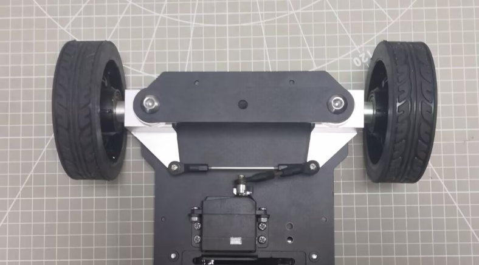

* **Physical Characteristics**

The Ackerman chassis is designed to provide excellent steering performance and stability. It employs the Ackermann geometry principle to achieve this.

The Ackermann chassis has the following main features:

1\. Steering Geometry: A key feature of the Ackermann chassis is its steering geometry. By mounting the front wheels on separate steering axes, the inner and outer tires follow different turning radii during a turn. This design makes it easier for the robot to turn while reducing friction and tire wear.

2\. Wheel Angles: The angles of the front wheels change with steering to match the robot's turning radius. The inner front wheel is usually angled more than the outer front wheel to achieve better suspension performance.

3\. Steering Stability: The Ackermann chassis improves robot stability and suspension performance. It helps reduce steering wobble at higher speeds and provides better control and absorption.

4\. Suspension Design: The suspension system of an Ackermann chassis is typically adjusted to accommodate different front wheel steering angles, ensuring optimal suspension performance under various driving conditions.

5\. Turning Radius: Because the front wheels follow different radii when turning, robots with an Ackermann chassis usually have a smaller turning radius, which is advantageous for maneuvering in tight spaces and complex paths.

* **Kinematic Principles and Equations**

When analyzing the kinematics of an Ackerman chassis, the following mathematical parameters and formulas are used to describe its motion characteristics.

To achieve pure rolling motion, with no lateral slip when the vehicle turns, the normals of all four wheels’ rolling directions, which are the lines perpendicular to the wheel’s rolling direction, must intersect at a single point, known as the instantaneous center of rotation.

For simplicity, the model assumes only a single front wheel located at the midpoint of the front axle, as illustrated by the dashed line in the diagram. The key parameters are:


1\. Front Wheel Steering Angle (θ): The steering angle of the front wheel relative to the vehicle’s forward direction, typically measured in radians (rad).

2\. Vehicle Linear Velocity (V): The translational speed of the vehicle, measured in meters per second (m/s). Left rear wheel speed: V<sub>L</sub>. Right rear wheel speed: V<sub>R</sub>.

3\. Wheel Track (D): The distance between the left and right wheels, measured in meters (m).

4\. Wheelbase (H): The distance between the front and rear wheels, measured in meters (m).

5\. Turning Radius (R): The radius of the circular path followed by the vehicle when turning, measured in meters (m). Left wheel turning radius: R<sub>L</sub>. Right wheel turning radius: R<sub>R</sub>.

Computation of robot velocity and wheel speeds:

1\. Angular velocity consistency:


**ω** is the angular velocity of the robot, **R** is the turning radius of the robot’s center, **V** is the linear velocity of the robot, V<sub>L</sub> and V<sub>R</sub> are the linear velocities of the left and right rear wheels, and R<sub>L</sub> and R<sub>R</sub> are their respective turning radii.

Relationship between the front wheel steering angle and the turning radius:


where H is the wheelbase, the distance between front and rear axles, R is the turning radius of the vehicle, **D** is the track width, the distance between left and right wheels, and **θ** is the steering angle of the front wheel.

3\. Left rear wheel velocity:

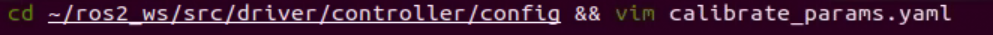

4\. Right rear wheel velocity:


Given the robot’s track width, wheelbase, linear velocity, and steering angle, the velocities of the left and right rear wheels can be determined.

* **Program Analysis**

The kinematic analysis and basic chassis control code are centralized in the script and configuration files located under the **src/driver/controller** path. The content in [2.1.2 Mecanum Chassis](#anther2.1.2) can be referred to for further understanding and learning.


## 2.2 Motion Control

### 2.2.1 IMU, Linear Velocity, Angular Velocity Calibration

> [!NOTE]
> 
> * **The robot is factory-calibrated and generally does not require recalibration. This section is provided for reference only. If the robot shows significant deviation while moving, such as drifting to one side when moving forward or failing to drive in a straight line, follow the tutorial below for calibration.**
> 
> * **Calibration is intended to reduce errors. Some hardware deviations are inevitable, so the goal is to adjust the settings to achieve a relatively accurate performance that meets your needs.**

If deviations occur during use, the IMU, linear velocity, and angular velocity should be recalibrated. After calibration, the robot can perform all its functions correctly.

* **IMU Calibration**

The IMU, Inertial Measurement Unit, measures an object's three-axis orientation (angular velocity) and acceleration. The gyroscope and accelerometer are the main components of the IMU, providing a total of six degrees of freedom to measure angular velocity and acceleration in 3D space. The calibration direction should be based on the orientation of the IMU on the expansion board, as shown in the diagram below. It illustrates the XY axes of the IMU on the expansion board, along with the XYZ coordinates when the robot is placed flat on the table.

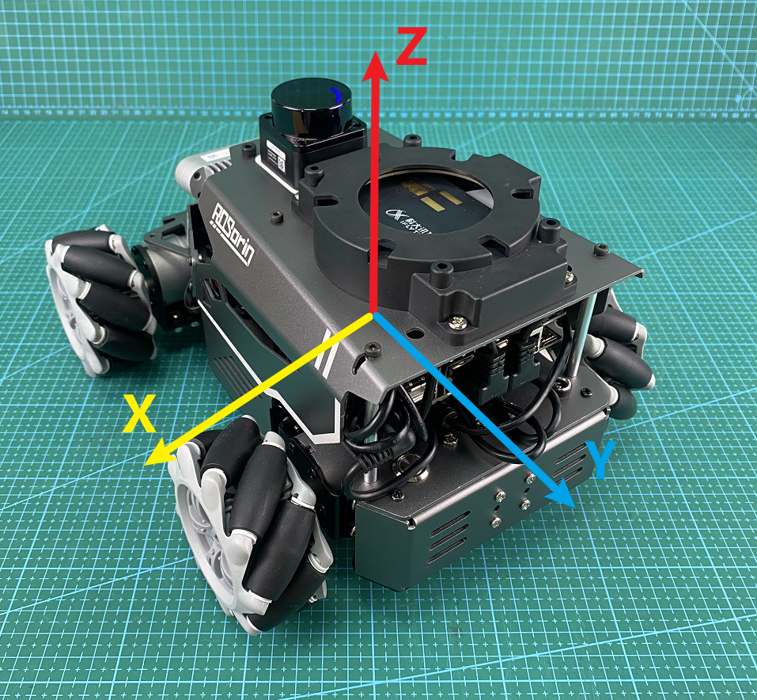

After receiving the first IMU message, the node will prompt to keep the IMU in a specific direction and press **Enter** to record the measurement. Once all six orientations are completed, the node calculates the calibration parameters and writes them to the specified YAML file. The detailed steps are as follows:

> [!NOTE]
> 
> **Commands must be entered with correct capitalization. The Tab key can be used to auto-complete keywords.**

1. Power on the robot and connect it via the NoMachine remote control software. For detailed information, please refer to the section [1.7.2 AP Mode Connection Steps]() in the user manual.

2. Click the terminal icon  in the system desktop to open a command-line window.

3. Enter the following command and press **Enter** to stop the app auto-start service.

```bash
sudo systemctl stop start_app_node.service
```

4. Enter the following command and press **Enter** to start the IMU calibration.

```bash
roslaunch calibration calibrate_imu.launch
```

5. When the following prompt appears, position the robot facing forward from its first-person perspective, then press **Enter**. The direction of the first orientation is defined as the front, and all subsequent placements should be based on this initial direction.
   
   
   
   
   


After each orientation is successfully calibrated, the following prompts will appear:


6. Position the robot facing backward, then press **Enter**.


7. Position the robot facing left, then press **Enter**.
   
   
   
   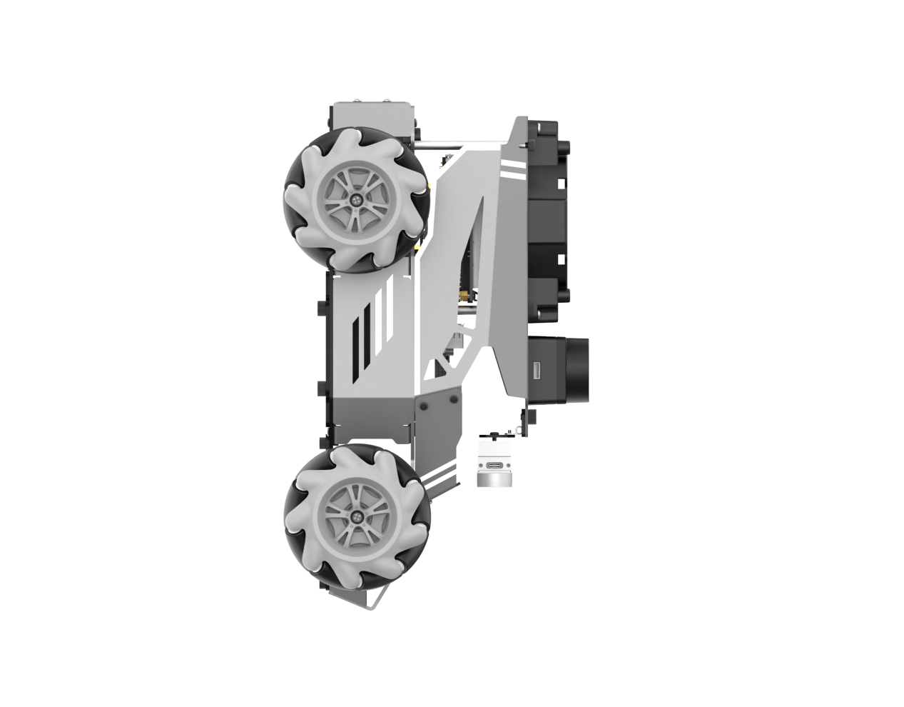
   
8. Position the robot facing right, then press **Enter**.
   
   
   
   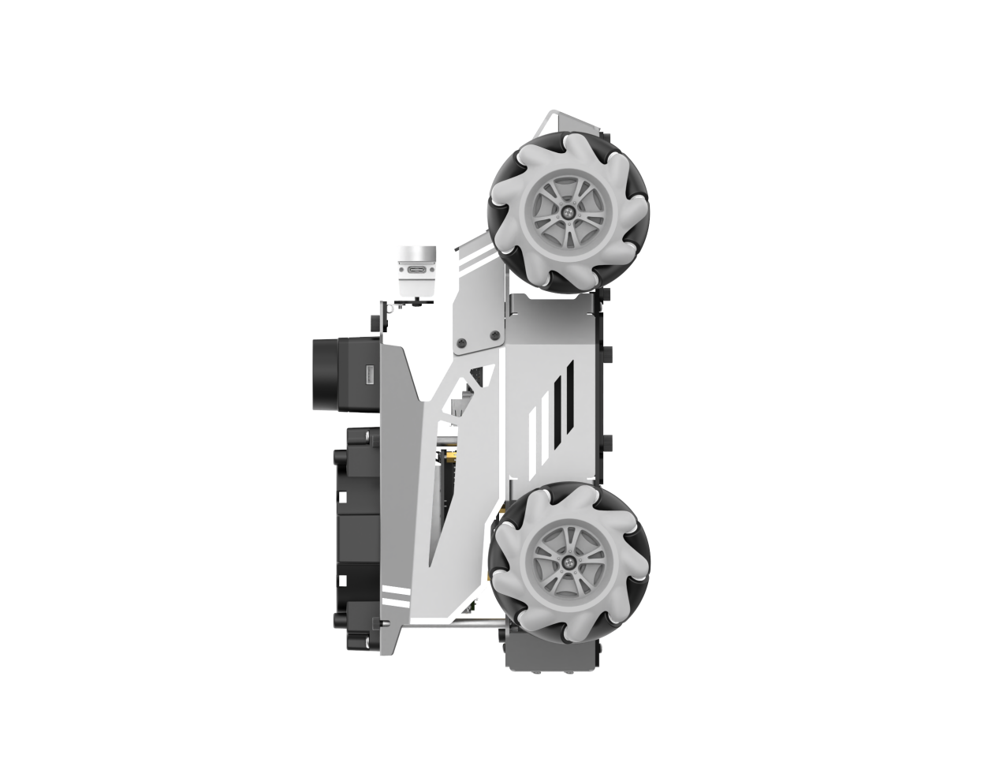
   
9. Lift the robot and position it facing upward. Secure it carefully, then press **Enter**. When placing the robot in the up and down orientation, it may be unstable or bump against surfaces. It is recommended to hold it steady by hand to avoid damaging the depth camera or screen.


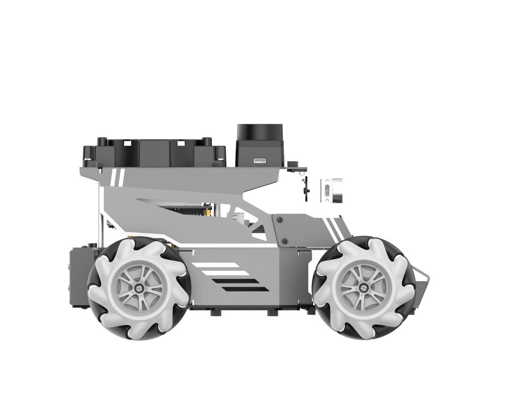

10. Lift the robot and position it facing downward. Secure it, then press **Enter**.


11. When the following message appears, the calibration is complete.
    
    
    


* **Angular Velocity Calibration**

Typically, angular velocity calibration involves rotating the robot a full circle. During testing, it is important to clearly mark the robot’s orientation to easily observe any deviations. The detailed steps are as follows:

> [!NOTE]
> 
> **Commands must be entered with correct capitalization. The Tab key can be used to auto-complete keywords.**

1. Place the robot on a flat surface, and mark a point directly in front of it using tape or another indicator.

2. Power on the robot and connect it via the NoMachine remote control software. For detailed information, please refer to the section [1.7.2 AP Mode Connection Steps]() in the user manual.

3. Click the terminal icon  in the system desktop to open a command-line window.

4. Enter the following command and press **Enter** to stop the app auto-start service.

```bash
sudo systemctl stop start_app_node.service
```

5. Enter the command and press **Enter** to activate the **turn** parameter for adjusting angular velocity.

```bash
roslaunch calibration calibrate_angular.launch turn:=true
```

Then, click **calibrate_angular** on the left to open the calibration interface, as shown below.

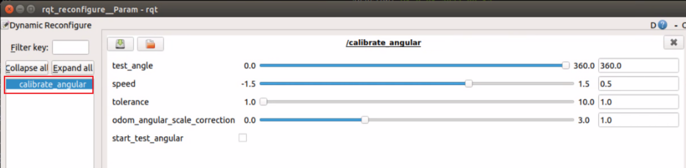

The meanings of the parameters on the left side of the interface are as follows:

(1) test_angle – The rotation angle for testing, 360° by default.

(2) speed – The linear velocity, with a default value of 0.15 m/s.

(3) tolerance – The error margin. The smaller the tolerance, the greater the robot's shaking will be once the target position is reached.

(4) odom_angle_scale_correction – The odometry angle scaling factor.

(5) start_test_angular – The button to begin testing the odometry angle scaling factor.

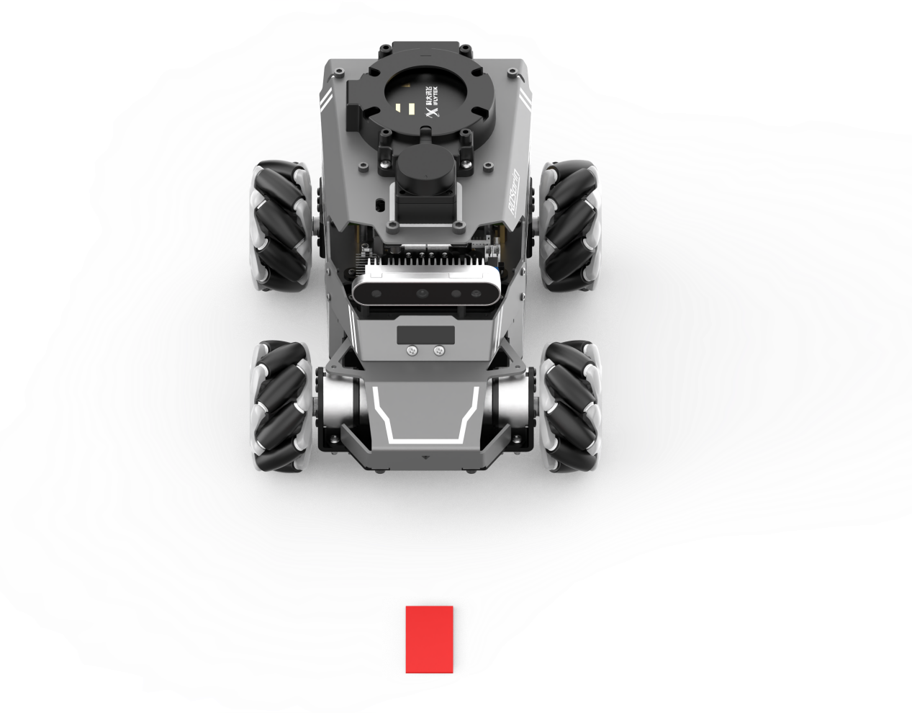

Make sure the robot is properly aligned, then check **start_test_angular**. The robot will rotate in place. If it cannot complete a full rotation or shows deviation, adjust the **odom_angle_scale_correction** value, which controls the scaling factor for the motor's rotation. It is recommended to adjust in increments of 0.01 and repeat the test until the robot can rotate exactly one full turn, then record this value.

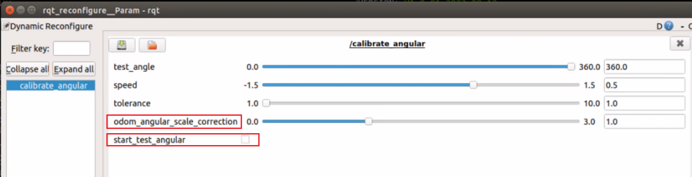

6. Open a new command-line terminal and enter the command to navigate to the calibration configuration file directory.

```bash
roscd controller/config/
```

7. Enter the following command to open the configuration file:

```bash
vim calibrate_params.yaml
```

8. Press the i key to enter edit mode, and change the value of `angular_correction_factor` to the adjusted value of `motor_turn_scale_correction`.
   
   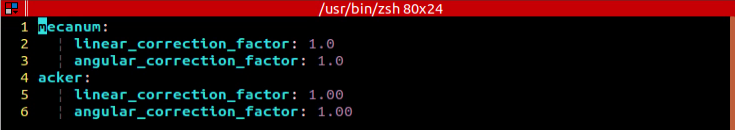
   


> [!NOTE]
> 
> **This section uses the Mecanum wheel version as an example for calibration.**

9) After editing, press **ESC**, type `:wq`, and press **Enter** to save and exit.

* **Linear Velocity Calibration**

> [!NOTE]
> 
> **Commands must be entered with correct capitalization. The Tab key can be used to auto-complete keywords.**

Place the robot on a flat, open surface. Attach a starting tape or place another starting marker in front of the robot, and attach a finishing tape or place another finishing marker 1 meter ahead of the robot.

1. Power on the robot and connect it via the NoMachine remote control software. For detailed information, please refer to the section [1.7.2 AP Mode Connection Steps]() in the user manual.

2. Click the terminal icon  in the system desktop to open a command-line window.

3. Enter the following command and press **Enter** to stop the app auto-start service.

```bash
sudo systemctl stop start_app_node.service
```

4. Enter the command and press **Enter** to activate the `go` parameter for adjusting the linear velocity.

```bash
roslaunch calibration calibrate_linear.launch go:=true
```

Click on **calibrate_linear** on the left to open the calibration interface, as shown below:

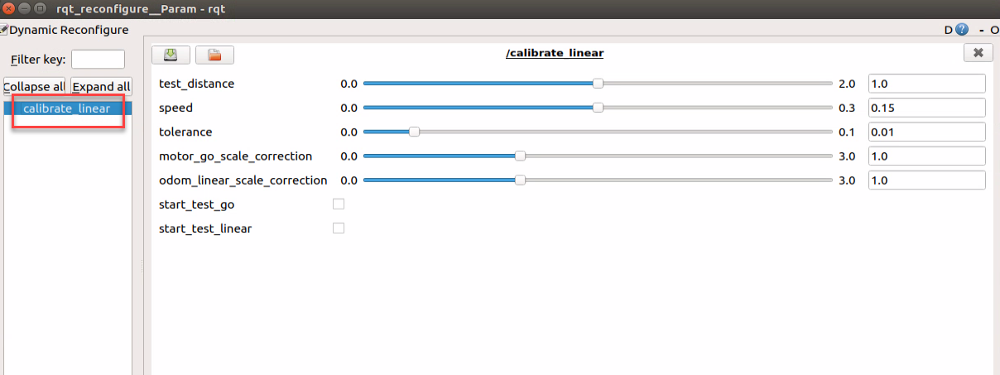

The meanings of the parameters on the left side of the interface are as follows:

(1) test_distance – The test distance, default is 1 meter.

(2) speed – The linear velocity, with a default value of 0.15 m/s.

(3) tolerance – The error margin. The smaller the tolerance, the greater the robot's shaking will be once the target position is reached.

(4) motor_go_scale_correction – The motor forward scaling factor.

(5) odom_linear_scale_correction – The odometry linear scale factor.

(6) start_test_go – The button to start testing the motor forward scaling factor.

(7) start_test_linear – The button to start testing the odometry linear scaling factor.

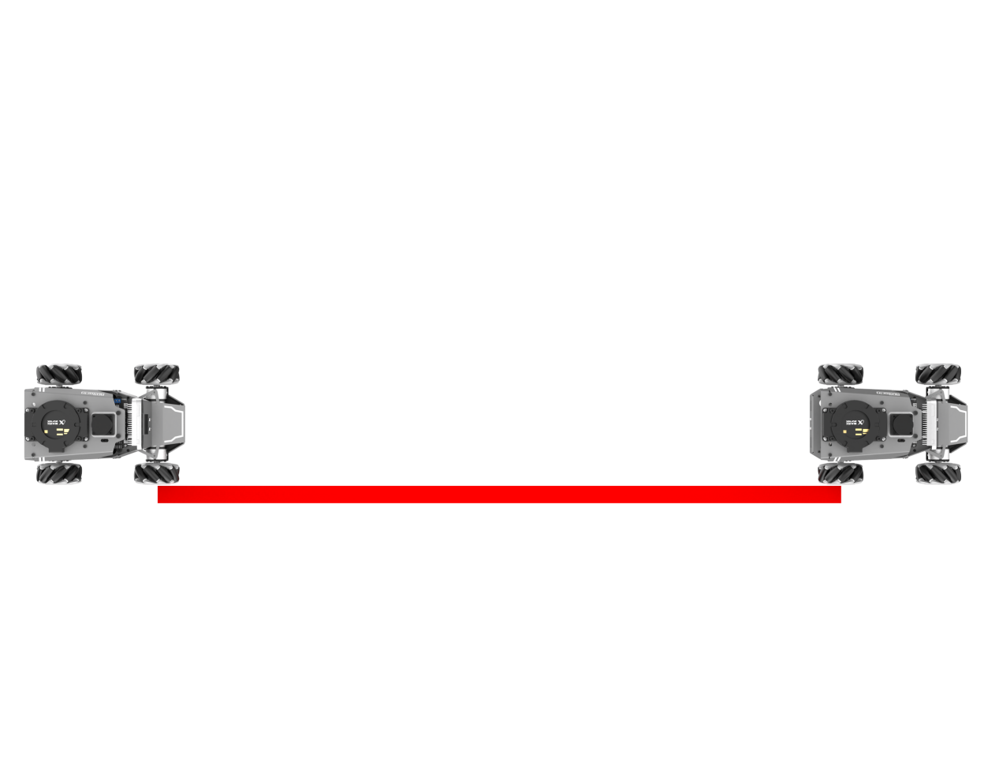

Ensure the robot is properly aligned and positioned at the starting marker. Then check **start_test_go** to begin. The robot will move forward. Observe whether the robot moves in a straight line. If there is a deviation, adjust the value of **motor_go_scale_correction**. This value controls the scaling factor for the motor's forward movement. It is recommended to adjust by increments of 0.01.

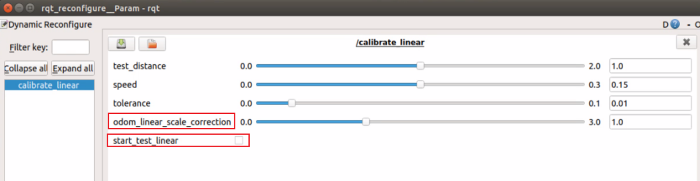

5. Open a new command-line terminal and enter the command to navigate to the calibration configuration file directory.

```bash
roscd controller/config/
```

6. Enter the following command to open the configuration file:

```bash
vim calibrate_params.yaml
```

7. Press the i key to enter edit mode, and change the value of `linear_correction_factor` to the adjusted value of `motor_go_scale_correction`.

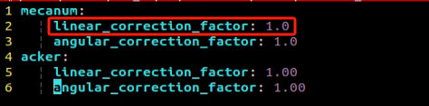

8. After editing, press **ESC**, type `:wq`, and press **Enter** to save and exit.

9. To exit the feature, press **Ctrl+C** in the terminal. If the program does not close successfully, try pressing **Ctrl+C** again.

10. After calibration is complete, the app service should be started either by using a command or by restarting the robot. If the app service is not enabled, related features in the app will not function properly. The app service will start automatically when the robot is restarted. Enter the command to restart the app service and wait for the robot to return to its initial position, indicating that the service has started.

```bash
sudo systemctl restart start_app_node.service
```

* **FAQ**

**Q**: What if the robot still shows deviation, such as when moving in a straight line, after calibration?

**A**: Taking the adjustment of linear velocity as an example, if deviation occurs, it is recommended to perform multiple tests and adjust the corresponding parameters, **motor_go_scale_correction** and **odom_linear_scale_correction**, until the robot can move straight consistently. This also helps avoid incomplete calibration that may occur if only one parameter is adjusted.

### 2.2.2 IMU and Odometry Data Publishing

In robot navigation, calculating the real-time position is crucial.

Typically, odometry information is computed using the motor encoders combined with the robot’s kinematic model. However, in some special scenarios, such as when the robot’s wheels spin in place or the robot is lifted off the ground, it may appear that the robot has moved a certain distance, even though the wheels did not actually turn.

In such cases, fusing IMU and odometry data provides a more accurate estimation of the robot’s position, which helps improve mapping and enhances navigation accuracy.

* **Introduction to IMU and Odometry**

The IMU, Inertial Measurement Unit, measures an object's three-axis orientation (angular velocity) and acceleration. The gyroscope and accelerometer are the main components of the IMU, providing a total of six degrees of freedom to measure angular velocity and acceleration in 3D space.

Odometry is a method for estimating an object's position over time based on data obtained from motion sensors. It is widely used in robotic systems to estimate how far a robot has moved relative to its initial position.

Common odometry methods include wheel odometry, visual odometry, and visual-inertial odometry. For the robot, wheel odometry is used.

An example can be used to explain the principle of a wheeled odometer. Imagine a wagon is available, and the goal is to determine the distance from point A to point B while driving it.

Once the circumference of the wagon wheel is known, and a device is installed on the wheel to count the number of rotations while driving, you can calculate the distance between points A and B by using the wheel's circumference, the time taken to travel, and the number of wheel rotations.

For a wheeled robot, odometry provides a basic estimate of its pose. However, it has a significant limitation, which is cumulative error. Besides inherent hardware inaccuracies, environmental factors, such as wheel slippage caused by wet or slippery surfaces, can increase odometry errors as the robot travels farther.

Therefore, both the IMU and odometry are key components on the robot. They are used to measure the object's three-axis orientation or angular velocity, and acceleration, as well as to estimate the robot's displacement and pose relative to its initial position, including movement speed and direction.

To correct for errors in odometry, the IMU is used in combination, and the data from both sources are fused to obtain more accurate information.

The IMU data is published on the **/imu** topic, and the odometry data is published on **/odom**. Once both sets of data are obtained, they are fused using the **ekf** package in ROS, and the resulting fused localization information is then re-published.

* **Odometry Data Publishing**

> [!NOTE]
> 
> **Commands must be entered with correct capitalization. The Tab key can be used to auto-complete keywords.**

Power on the robot and connect it via the NoMachine remote control software. For detailed information on connecting to a remote desktop, please refer to the section [1.7.2 AP Mode Connection Steps]() in the user manual.

1. Click the terminal icon  in the system desktop to open a command-line window.

2. Enter the following command and press **Enter** to stop the app auto-start service:

```bash
sudo systemctl stop start_app_node.service
```

3. Enter the command and press **Enter** to start publishing odometry data:

```bash
roslaunch controller controller.launch
```

After the data publishing is completed, the app service can be started either by using a command or by restarting the robot. If the app service is not enabled, related features in the app will not function properly. The app service will start automatically when the robot is restarted.

Enter the command to restart the app service and wait for a beep from the buzzer, indicating that the service has started.

```bash
sudo systemctl restart start_app_node.service
```

* **Viewing Odometry Data**

1. Open a new command-line terminal and enter the command to view the current topics.

```bash
rostopic list
```

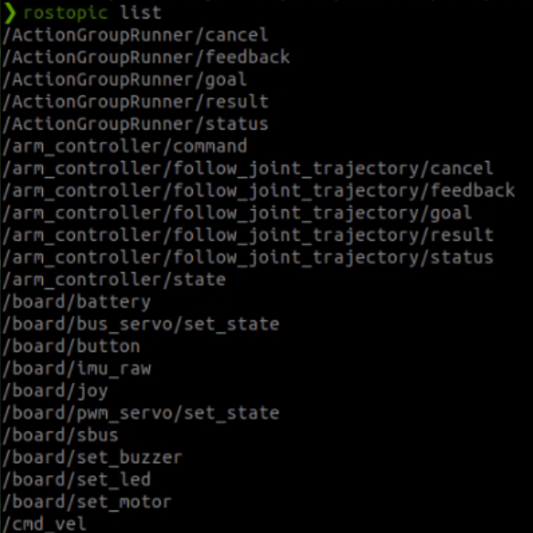

2. Enter the command to check the type, publisher, and subscribers of the `/odom_raw` topic, or replace it with any topic of interest.

```bash
rostopic info /odom_raw
```

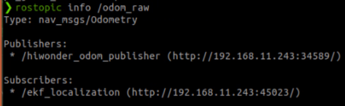

The topic type is `nav_msgs/Odometry`, the publisher is `/odom_publisher`, and the subscriber is `/ekf_localization`.

3. Enter the command to print the topic message content, or replace it with any topic of interest.

```bash
rostopic echo /odom_raw
```

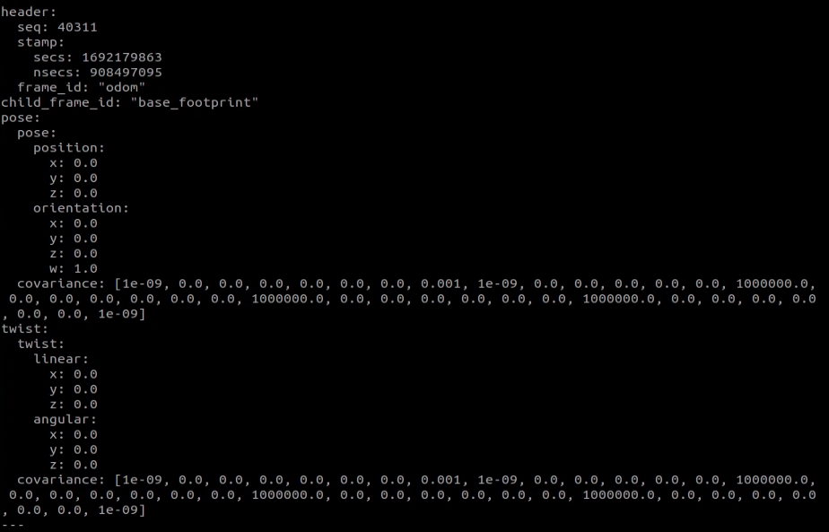

The message content includes `pose` and `twist`, the retrieved pose and velocity data.

### 2.2.3 Robot Speed Control

This section focuses on controlling the robot's forward speed by modifying the linear velocity parameter.

* **Working Principle**

Based on the robot’s motion characteristics, the forward, backward, and turning motions are achieved by controlling the rotation direction of the driving wheels.

In the program, the `controller` movement control node subscribes to receive the set linear and angular velocities. Based on these velocities, the robot's movement speed is calculated through analysis and computation.

* **Disable App Service and Enable Speed Control**

> [!NOTE]
> 
> **Commands must be entered with correct capitalization. The Tab key can be used to auto-complete keywords.**

1. Power on the robot and connect it via the NoMachine remote control software.

2. Click the terminal icon  in the system desktop to open a command-line window.

3. Enter the following command and press **Enter** to stop the app auto-start service.

```bash
sudo systemctl stop start_app_node.service
```

Enter the command to start the motion control service:

```bash
roslaunch controller controller.launch
```

4. Open a new command-line terminal, enter the command, then press the **TAB** key to auto-complete the remaining parameters.

```bash
rostopic pub /controller/cmd_vel geometry_msgs/Twist "linear:
```

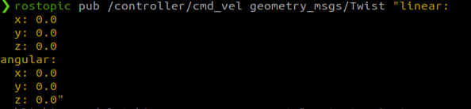

The `linear` parameter sets the linear velocity. From the robot's perspective, the positive X direction points forward, with no motion along the Y or Z axes.

The `angular` parameter sets the angular velocity. A positive Z value makes the robot turn left, while a negative Z value makes it turn right. There is no rotation along the X or Y axes.

> [!NOTE]
> 
> * **The unit of linear velocity X is meters per second (m/s), with a recommended range of -0.6 ~ 0.6.**
> 
> * **Z represents the angular velocity for turning. It can be calculated using the formulas: V = ωR and tanΦ<sub>A</sub> = D / R, where z = ω, D = 0.213, and Φ<sub>A</sub> is the turn angle, ranging from 0° to 36°.**

Use the keyboard arrow keys to modify the corresponding parameters. For example, to move forward, set linear `X` to 0.1 and press **Enter** to execute.

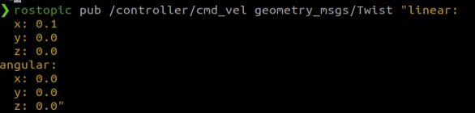

5. To stop the robot, press **Ctrl+C** in the terminal from the previous step, set the modified linear velocity back to `0.0`, and then press **Enter**.


6. To exit this control mode, press **Ctrl+C** in each terminal.

> [!NOTE]
> 
> **First, follow the steps in step 5, then close the feature to shut it down properly. If Ctrl+C is pressed directly in the terminal to close, the robot may not stop.**

After closing the feature, the app service should be started either by using a command or by restarting the robot. If the app service is not enabled, related features in the app will not function properly. The app service will start automatically when the robot is restarted.

Enter the command to restart the app service and wait for a beep from the buzzer, indicating that the service has started.

```bash
sudo systemctl restart start_app_node.service
```

* **Modifying Forward Speed**

By modifying the value of the linear velocity in the X direction, the robot can move at different speeds. For example, to make the robot move faster, set X to `X: 0.3`.

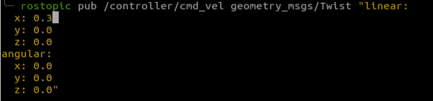

After pressing **Enter**, the robot will move forward at a speed of 0.3 m/s.

* **Program Outcome**

After starting the feature, the robot will move forward at the previously set speed of 0.3 m/s.

* **Program Analysis**

The kinematic analysis and basic chassis control code are centralized in the script and configuration files located under the **src/driver/controller** path. The content in [2.1 Kinematics Analysis](#anther2.1) can be referred to for further understanding and learning.

* **FAQ**

**Q**: The robot keeps moving even after pressing **Ctrl+C** in the terminal.

**A**: In this case, a new terminal needs to be opened. In the new terminal, enter the command, press the **TAB** key to auto-complete, set the speed to 0, and then press **Enter** to execute.

```bash
rostopic pub /controller/cmd_vel geometry_msgs/Twist "linear:
```