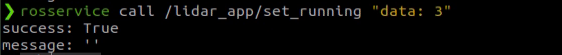

# 3\. ROS1-LiDAR Course

## 3.1 Introduction to LiDAR

### 3.1.1 Overview

LiDAR is a high-precision, high-speed remote sensing technology essential for mapping, autonomous driving, environmental perception, and robotic navigation. This document outlines LiDAR’s principles, key components, operation, applications, advantages, and future trends.

LiDAR plays a critical role in autonomous driving and intelligent transportation, enabling real-time detection of obstacles, pedestrians, and vehicles while providing precise distance and positional information. In robotic navigation and environmental perception, LiDAR provides accurate maps and detailed information about the surrounding environment. Additionally, LiDAR is widely used in 3D modeling and mapping, security monitoring, and remote sensing surveys.


### 3.1.2 LiDAR Components and Classification

LiDAR consists of a laser emitter, receiver and photodetector, scanning mechanism, and angle resolution system. The laser emitter generates laser beams, the receiver and photodetector capture the reflected signals, the scanning mechanism scans the surrounding environment, and the angle resolution system determines the positions of target objects.

Based on the scanning method, LiDAR can be functionally classified into the following types:

Rotating LiDAR: Rotating LiDAR achieves full scanning in the horizontal direction by rotating the emitter or scanning mechanism. It typically provides high scanning speed and measurement accuracy, which are widely used in autonomous driving, 3D environmental modeling, and mapping.

Solid-State LiDAR: Solid-State LiDAR uses a solid-state laser emitter and requires no rotating components. It is typically more compact, lightweight, and energy-efficient, making it suitable for applications such as mobile devices, drones, and robots.

Mechanical LiDAR: Mechanical LiDAR uses mechanical components to achieve laser beam scanning, such as rotating mirrors or rotating prisms. It usually has a longer measurement range and higher measurement accuracy but a slower scanning speed. Mechanical LiDAR is widely used in fields such as terrain measurement, building scanning, and navigation.

Phase-Modulated LiDAR: Phase-Modulated LiDAR measures the distance between the target object and the radar by changing the phase of the laser beam. It usually features high measurement accuracy and a large measurement range, and is widely used in fields such as map making, surveying, and industrial applications.

Flash LiDAR: Flash LiDAR uses a single short high-power laser pulse to illuminate the entire scene at once, and the reflected light signals are captured by a receiver array. It offers the advantages of high speed and high resolution, making it suitable for applications such as rapid scene capture and motion tracking.

### 3.1.3 LiDAR Version

The robot offers a variety of LiDAR options. The default LiDAR in the robot image is the MS200 LiDAR. Therefore, after receiving the robot, the LiDAR hardware should first be confirmed. Once confirmed, the LiDAR version in the image should be set to match the version of the robot's LiDAR.

LiDAR is a sensor that uses laser beams to obtain precise positional information. It has a wide range of applications in robotics, including obstacle avoidance, object following, SLAM mapping, and navigation. The robot is equipped with the MS200 LiDAR.


Click the icon  on the desktop to check that the current LiDAR is MS200.


## 3.2 Working Principle and Distance Measurement Methods

### 3.2.1 LiDAR Distance Measurement

There are two common methods for LiDAR to determine the distance to a target: triangulation and time-of-flight (TOF).

For TOF, as illustrated below, the LiDAR emits light toward the object, which reflects directly back to the LiDAR. The LiDAR calculates the time taken for the light to return and multiplies it by the speed of light to determine the distance between the object and the LiDAR.


For triangulation, as shown below, during manufacturing, the LiDAR is adjusted so that the light does not directly hit the object but strikes at a fixed angle. This angle is preset and does not change during operation. Using trigonometric calculations with this angle, the distance from the object to the LiDAR can be determined.


### 3.2.2 LiDAR Performance

As illustrated below, the LiDAR emits light that illuminates the surface of an object. When the LiDAR receives the light reflected from the object, it marks the outline of the object at the positions where the light struck.


## 3.3 LiDAR Obstacle Avoidance

The robot will detect the distance between objects directly in front and its body, and will turn left or right to avoid obstacles based on the set distance. If no obstacles are encountered, it will continue moving forward.

There are two ways to enable this feature. The first is through the mobile app, and the second is by using commands after connecting to the system remotely.

For instructions on using the app, refer to the section [1.5.3 App Control](https://wiki.hiwonder.com/projects/ROSOrin/en/jetson-nano/docs/1_ROSOrin_User_Manual.html#app-control) in the user manual to view the related course.

For detailed information on connecting to a remote desktop, please refer to the section [1.7.2 AP Mode Connection Steps](https://wiki.hiwonder.com/projects/ROSOrin/en/jetson-nano/docs/1_ROSOrin_User_Manual.html#ap-mode-connection-steps) in the user manual.

### 3.3.1 Feature Enabling via App

1. Open the **WonderAi** app and connect to the robot.

2. Tap **Lidar** on the mode selection screen to enter the feature’s interface.


3. Click the switch button on the right of **Avoid obstacle** to activate this mode.


4. The robot will move forward, and when an obstacle is detected, it will automatically turn to avoid it.

### 3.3.2 Feature Enabling via Command

1. Power on the robot and connect it via the NoMachine remote control software. For detailed information, please refer to the section [1.7.2 AP Mode Connection Steps](https://wiki.hiwonder.com/projects/ROSOrin/en/jetson-nano/docs/1_ROSOrin_User_Manual.html#ap-mode-connection-steps) in the user manual.

2. Click the terminal icon  in the system desktop to open a command-line window.

3. Enter the following command and press **Enter** to stop the app auto-start service: The service includes functions for the wireless controller, depth camera, and other features.

```bash
sudo systemctl stop start_app_node.service
```

4. Enter the command and press **Enter** to start the local services for the app features and chassis control.

```bash
roslaunch bringup bringup.launch
```

5. Open another command-line terminal, enter the command, and press **Enter** to access the LiDAR feature:

```bash
rosservice call /lidar_app/enter "{}"
```


6. Enter the following command and press **Enter** to start the LiDAR feature.

```bash
rosservice call /lidar_app/set_running "data: 1"
```


> [!NOTE]
> 
> **The effect is the same as enabling the feature via the mobile app. To view the source code, the lidar.py file can be found in the /ros_ws/src/app/scripts/ folder.**

7) To exit the feature, press **Ctrl+C** in the terminal used in steps 4 or 5.

After the feature is closed, the app service can be activated either by using a command or by restarting the robot. If the app service is not enabled, related features in the app will not function properly. The app service will start automatically when the robot is restarted.

Enter the command to restart the app service and wait for a beep from the buzzer, indicating that the service has started.

```bash
sudo systemctl restart start_app_node.service
```


## 3.4 LiDAR Following

The robot will detect the distance between the object in front and its body. If the distance is greater than 35 cm, it will follow the object. If the distance is less than 35 cm, the robot will reverse. When the robot detects that the distance to the object in front is 35 cm, it will automatically stop.

There are two ways to enable this feature. The first is through the mobile app, and the second is by using commands after connecting to the system remotely.

For instructions on using the app, refer to Section [1.5 App Installation and Connection](https://wiki.hiwonder.com/projects/ROSOrin/en/jetson-nano/docs/1_ROSOrin_User_Manual.html#app-installation-and-connection) in the user manual to view the related course.

For detailed information on connecting to a remote desktop, please refer to Section [1.7.2 AP Mode Connection Steps](https://wiki.hiwonder.com/projects/ROSOrin/en/jetson-nano/docs/1_ROSOrin_User_Manual.html#ap-mode-connection-steps) in the user manual.

### 3.4.1 Feature Enabling via App

1. Open the **WonderAi** app and connect to the robot.

2. Tap **Lidar** on the mode selection screen to enter the feature’s interface.


3. Click the switch button on the right of **Lidar following** to activate this mode.


4. When an obstacle is detected, the robot will adjust its position to maintain a distance of approximately 0.35 meters between its body and the obstacle.

### 3.4.2 Feature Enabling via Command

1. Power on the robot and connect it via the NoMachine remote control software. For detailed information, please refer to the section [1.7.2 AP Mode Connection Steps](https://wiki.hiwonder.com/projects/ROSOrin/en/jetson-nano/docs/1_ROSOrin_User_Manual.html#ap-mode-connection-steps) in the user manual.

2. Click the terminal icon  in the system desktop to open a command-line window.

3. Enter the following command and press **Enter** to stop the app auto-start service: The service includes functions for the wireless controller, depth camera, and other features.

```bash
sudo systemctl stop start_app_node.service
```

4. Enter the command and press **Enter** to start the local services for the app features and chassis control.

```bash
roslaunch bringup bringup.launch
```

5. Open another command-line terminal, enter the command, and press **Enter** to access the LiDAR feature:

```bash
rosservice call /lidar_app/enter "{}"
```


6) Enter the following command and press **Enter** to start the LiDAR following feature.

```bash
rosservice call /lidar_app/set_running "data: 2"
```


> [!NOTE]
> 
> **The effect is the same as enabling the feature via the mobile app. To view the source code, the `lidar.py` file can be found in the /ros_ws/src/app/scripts/ folder.**

7) To exit the feature completely, press **Ctrl+C** in the terminal used in steps 4 or 5.

After the feature is closed, the app service can be activated either by using a command or by restarting the robot. If the app service is not enabled, related features in the app will not function properly. The app service will start automatically when the robot is restarted.

Enter the command to restart the app service and wait for a beep from the buzzer, indicating that the service has started.

```bash
sudo systemctl restart start_app_node.service
```


## 3.5 LiDAR Guarding

The robot will detect the distance between the object in front and its body. If an object is within the set distance, the robot will steer, keeping the body always facing the object.

There are two ways to enable this feature. The first is through the app, and the second is by using commands after connecting to the system remotely.

For instructions on using the app, refer to the section [1.5 App Installation and Connection](https://wiki.hiwonder.com/projects/ROSOrin/en/jetson-nano/docs/1_ROSOrin_User_Manual.html#app-installation-and-connection) in the user manual to view the related course.

For detailed information on connecting to a remote desktop, please refer to the section [1.7.2 AP Mode Connection Steps](https://wiki.hiwonder.com/projects/ROSOrin/en/jetson-nano/docs/1_ROSOrin_User_Manual.html#ap-mode-connection-steps) in the user manual.

### 3.5.1 Feature Enabling via App

1. Open the **WonderAi** app and connect to the robot.

2. Tap **Lidar** on the mode selection screen to enter the feature’s interface.


3. Click the switch button on the right of ****Lidar guarding**** to activate this mode.


4. When an obstacle is detected, the robot will adjust its orientation in place to face the obstacle, with the camera directly aligned with it.

### 3.5.2 Feature Enabling via Command

1. Power on the robot and connect it via the NoMachine remote control software. For detailed information, please refer to the section [1.7.2 AP Mode Connection Steps](https://wiki.hiwonder.com/projects/ROSOrin/en/jetson-nano/docs/1_ROSOrin_User_Manual.html#ap-mode-connection-steps) in the user manual.

2. Click the terminal icon  in the system desktop to open a command-line window.

3. Enter the following command and press **Enter** to stop the app auto-start service: The service includes functions for the wireless controller, depth camera, and other features.

```bash
sudo systemctl stop start_app_node.service
```

4. Enter the command and press **Enter** to start the local services for the app features and chassis control.

```bash
roslaunch bringup bringup.launch
```

5. Open another command-line terminal, enter the command, and press **Enter** to access the LiDAR feature:

```bash
rosservice call /lidar_app/enter "{}"
```


6) Enter the following command and press **Enter** to start the Lidar guarding feature.

```bash
rosservice call /lidar_app/set_running "data: 3"
```



> [!NOTE]
> 
> **The effect is the same as enabling the feature via the mobile app. To view the source code, the lidar.py file can be found in the /ros_ws/src/app/scripts/ folder.**

7) To exit the feature completely, press **Ctrl+C** in the terminal used in steps 4 or 5.

After the feature is closed, the app service can be activated either by using a command or by restarting the robot. If the app service is not enabled, related features in the app will not function properly. The app service will start automatically when the robot is restarted.

Enter the command to restart the app service and wait for a beep from the buzzer, indicating that the service has started.

```bash
sudo systemctl restart start_app_node.service
```