# 5. Mapping & Navigation Course

[TOC]

<p id ="anther5.1"></p>

## 5.1 Mapping Tutorial

### 5.1.1 Getting Started with URDF Model

#### 5.1.1.1 URDF Model Introduction

URDF is an XML-based format used to describe the structure of a robot. The purpose of this format is to provide a robot description standard that is as general as possible.

A robot is typically modeled as a structure composed of multiple links and joints. Links can be understood as rigid bodies with mass, and joints can be understood as elements that connect and constrain the relative motion between two links.

When multiple links are connected and constrained through joints, they form a robot motion model. A URDF document describes the relative relationships of these joints and links, along with their inertial properties, geometric features, and collision models.

#### 5.1.1.2 Comparison Between Xacro Model and URDF Model

The URDF model is a relatively simple robot description file. It features a clear structure and is easy to understand. However, when describing more complex robot structures using URDF, the description file can become lengthy and unable to concisely represent the robot model.

The Xacro model is an extended form of the URDF model. They are essentially the same. When using the Xacro format to describe a robot, the description file can be made more concise, enhancing code reusability and alleviating the verbosity problem common in URDF models.

For example, when describing the legs of a humanoid robot, using URDF requires describing each leg individually, whereas using Xacro allows you to describe a single leg and reuse it.

<p id ="anther5.1.1.3"></p>

#### 5.1.1.3 Basic URDF Syntax

* **XML Basic Syntax**

Since URDF models are written based on the XML standard, it is necessary to understand the basic structure of XML.

1. Elements:

Elements are defined using the names you assign. The following rules apply when creating these elements:

\<element>

\</element>

2. Attributes: 

Attributes are included within an element to define its properties and parameters. When defining an element, you can use the following format:

\<element attribute_1="value1" attribute_2="value2">  

\</element>

3. Comments:

Comments do not affect other attributes or elements. They can be defined using the following syntax:

<! \-- Comment content \-->

* **Links**

In URDF models, links are represented by the \<link> tag. They describe the appearance and physical properties of a rigid part of the robot. When defining a link, the following tags are used:


\<visual>: Specifies the visual properties of the robot link, such as size, color, and shape.

\<inertial>: Specifies the inertial properties of the link, mainly used in the robot's dynamics calculations.

\<collision>: Specifies the collision properties of the link.

Each tag contains corresponding sub-tags with specific functions, as summarized in the table below:

| **Tag**| **Description**|
|----------|----------|
| origin| Describes the pose of the link. It contains two parameters: xyz specifies the link’s position in the simulation map, and rpy specifies the link’s orientation in the simulation map.|
| mess| Defines the mass of the link.|
| inertia| Defines the inertia of the link. Due to the symmetry of the inertia matrix, six parameters—ixx, ixy, ixz, iyy, iyz, and izz—must be provided as attributes. These parameters are obtained through calculation.|
| geometry| Describes the shape of the link. It uses the mesh parameter to load texture files and the filename parameter to specify the file path. There are three sub-tags: box, cylinder, and sphere, representing a rectangular box, a cylinder, and a sphere respectively.|
| material| Defines the material of the link. The name parameter is required. The color sub-tag can be used to adjust the color and transparency.|

* **Joint**

In a URDF model, joints are defined using the **“joint”** tag. They describe the kinematic and dynamic properties of the robot’s joints, as well as limits on position and velocity. Based on the type of motion, joints are classified into six types as shown in the table below:

| **Type and Description**| **Tag**|
|----------|----------|
| Rotational joint: Allows unlimited rotation around a single axis| continuous|
| Rotational joint: Similar to continuous but with angular limits| revolute|
| Prismatic joint: Moves along a single axis with positional limits| prismatic|
| Planar joint: Allows translation and rotation within a plane| planar|
| Floating joint: Allows both translational and rotational movement| floating|
| Fixed joint: A special joint that does not allow any movement| fixed|

The following tags are used when defining joint actions:


\<parent_link>: Defines the parent link.

\<child_link>: Defines the child link.

\<calibration>: Used to calibrate the joint angle.

\<dynamics>: Describes certain physical properties of the motion.

\<limit>: Defines the motion limits.

Each tag contains corresponding sub-tags with specific functions, as summarized in the table below:

| **Tag**| **Description**|
|----------|----------|
| origin| Describes the pose of the parent link. It contains two parameters: xyz specifies the link’s position in the simulation map, and rpy specifies the link’s orientation in the simulation map.|
| axis| Defines the rotation of the child link around one of the X, Y, or Z axes of the parent link.|
| limit| Constrains the child link. The lower and upper attributes define the rotation range in radians, the effort attribute limits the force applied during rotation (positive and negative values in newtons, N), and the velocity attribute limits the rotational speed in meters per second (m/s).|
| mimic| Defines the relationship between this joint and other joints.|
| safety_controller| Specifies the safety controller parameters used to protect the robot’s joint movements.|

* **robot tag**

The top-level tag for a complete robot. \<link> and \<joint> tags must be contained within \<robot>, formatted as follows:


* **gazebo tag**

Used with the Gazebo simulator to set simulation parameters. This tag allows the inclusion of Gazebo plugins, physical property settings, and more.


* **Create a simple URDF model**

1. Set the robot model name

At the beginning of a URDF model, set the robot’s name: **\<robot name="robot_model_name">**. At the end of the model, enter **\</robot>** to indicate the completion of the robot model.


2. Sett a Link

(1) Define the first link. Use indentation to indicate that this link belongs to the current model. Set the link name: **\<link name="link_name">**. At the end of the link definition, enter **\</link>** to indicate the link is complete.


(2) Define the link’s visual description. Use indentation to indicate that this description belongs to the current link. Start with **\<visual>** and end with **\</visual>**.


(3) **\<geometry>** describes the shape of the link. Close it with **\</geometry>**. Use indentation to indicate that its content provides the detailed description of the link’s shape. The example below describes a link shape: **\<cylinder length="0.01" radius="0.2"/>**, where length="0.01" indicates the link’s length is 0.01 meters, and radius="0.2" indicates the link’s radius is 0.2 meters, forming a cylinder.


(4) **\<origin>** describes the position of the link. Use indentation to indicate the detailed description of the link’s position. The example below describes a link’s position: **\<origin rpy="0 0 0" xyz="0 0 0"/>**, where rpy defines the link’s angles, and xyz defines the link’s coordinates. This indicates that the link is positioned at the origin of the coordinate system.


(5) **\<material>** describes the link’s appearance. Use indentation to indicate the detailed description of the link’s color. Start with **\<material>** and end with **\</material>**. The example below sets the link color to yellow: **\<color rgba="1 1 0 1"/>**, where rgba="1 1 0 1" specifies the color values.


3. Set a Joint

(1) Define the first joint. Use indentation to indicate that this joint belongs to the current model. Set the joint name and type: **\<joint name="joint_name" type="joint_type">**. At the end of the joint definition, enter **\</joint>** to indicate the joint is complete.


(2) Define the joint’s connected links. Use indentation to indicate that this description belongs to the current joint. Set the parent and child parameters. They can be set as follows: **\<parent link="parent_link"/>**, **\<child link="child_link"/>**. When the joint rotates, the parent link serves as the pivot, and the child link rotates accordingly.


(3) **\<origin>** describes the joint’s position. Use indentation to indicate the detailed description of the joint’s position. The example below describes a joint position: **\<origin xyz="0 0 0.1"/>**, where xyz specifies the joint coordinates, indicating that the joint is located at x=0, y=0, z=0.1 in the coordinate system.


(4) **\<axis>** describes the joint’s orientation. Use indentation to indicate the detailed description of the joint’s pose. The example below describes a joint orientation: **\<axis xyz="0 0 1"/>**, where xyz specifies the joint’s orientation.


(5) **\<limit>** constrains the joint’s movement. Use indentation to indicate the detailed description of the joint’s angular limits. The example below shows a joint limited to a maximum effort of 300 N, an upper rotation limit of 3.14 radians, and a lower rotation limit of -3.14 radians. It is set as follows: effort=**"joint effort (N)"**, velocity=**"joint speed"**, lower=**"lower rotation limit (rad)"**, upper=**"upper rotation limit (rad)"**.


(6) **\<dynamics>** describes the joint’s dynamics. Use indentation to indicate the detailed description of the joint’s properties. The example below shows a joint’s dynamic parameters: **\<dynamics damping="50" friction="1"/>**, where damping=**"damping value"** and friction=**"friction force"**.


The complete code is as follows:


### 5.1.2 ROS Robot URDF Model

#### 5.1.2.1 Getting Ready

To understand the URDF model, refer to [5.1.1.3 Basic URDF Syntax](#anther5.1.1.3).  

This section provides a brief analysis of the robot model code and component models. This section provides a brief analysis of the robot model code and component models.

#### 5.1.2.2 Access the Robot Model Code

1. Start the robot and connect it to the remote control software NoMachine. For connection instructions, please refer to the section [7.2 AP Mode Connection Steps](1.ROSOrin使用手册.md#AP-Mode-Connection-Steps) in the user manual.

2. Click the terminal icon  in the system desktop to open a new command-line window.

3. Stop the app auto-start service by entering the following command and press **Enter**:
   
   ```bash
   sudo systemctl stop start_app_node.service
   ```

4. Enter the command to navigate to the robot simulation model folder.
   
   ```bash
   cd ~/ros2_ws/src/simulations/rosorin_description/urdf
   ```

5. Use the cat command to inspect the robot’s description file:
   
   ```bash
   cat rosorin.xacro
   ```

6. The robot’s relevant descriptions are as follows:

(1) `base_link`: Base coordinate joint, used to connect various hardware URDF joints on the robot.

(2) `lidar_frame`: Lidar joint.

(3) `left_front_wheel_link`: Left front wheel joint.

(4) `left_back_wheel_link`: Left rear wheel joint.

(5) `right_front_wheel_link`: Right front wheel joint.

(6) `right_back_wheel_link`: Right rear wheel joint.

(7) `mic_link`: Voice device joint description.

### 5.1.3 SLAM Map Construction Principle

#### 5.1.3.1 SLAM Introduction

Take humans as an example: before reaching a destination, one needs to know their current position, whether or not a map is available. Humans rely on their eyes, whereas robots rely on Lidar. SLAM refers to simultaneous localization and mapping.

Localization determines the robot’s pose within a coordinate system. The origin and orientation of the coordinate system can be obtained from the first keyframe, an existing global map or landmarks, or GPS.

Mapping refers to creating a map of the environment perceived by the robot, where the basic geometric elements of the map are points. The primary purpose of the map is for localization and navigation. Navigation can be divided into guiding and moving: guiding includes global and local path planning, while moving refers to controlling the robot’s motion according to the planned path.

#### 5.1.3.2 SLAM Mapping Principle

SLAM mapping mainly involves the following three processes:

1. **Preprocessing:** Optimize the raw point cloud data from the Lidar, remove problematic data, or apply filtering.

Using laser as the signal source, pulses emitted by the Lidar hit surrounding obstacles, causing scattering.


Part of the reflected light returns to the Lidar receiver. Using the laser ranging principle, the distance from the Lidar to the target point can be calculated.

Regarding point clouds: Simply put, the information captured by the Lidar about the surrounding environment is called the point cloud. It represents the part of the environment that the robot’s “eyes” can see. The captured object information is presented as a series of discrete points with precise angles and distances.

2. **Matching:** Match the current local point cloud data to the existing map to find the corresponding position.

Typically, a Lidar SLAM system compares point clouds captured at different times to calculate the Lidar’s relative movement and pose change, thereby completing the robot’s localization.

3. Map fusion: Merge the new data from the Lidar into the existing map, updating the map continuously.

#### 5.1.3.3 Note on Map Construction

1. When constructing the map at startup, it is best for the robot to face a straight wall, or use a closed cardboard box instead, so that the Lidar can capture as many points as possible.

2. Try to ensure the completeness of the map. For all 360° areas surrounding the robot along its possible paths, the Lidar needs to scan them to increase map integrity.

3. When mapping in a large environment, it is recommended that the robot first completes the map’s loop closure, and then scans the smaller details of the environment.

#### 5.1.3.4 Evaluate Map Construction Result

After the map construction is complete, the results can be evaluated using the following items:

1. Whether the edges of obstacles in the map are clear;

2. Whether there are areas in the map inconsistent with the real environment (e.g., missing loop closure);

3. Whether there are gray areas in the robot’s operational region (e.g., unscanned areas);

4. Whether there are obstacles in the map that will not exist during subsequent localization (e.g., movable obstacles);

5. Whether the map ensures that at any position within the robot’s operational area, the full 360-degree view has been scanned.

### 5.1.4 slam_toolbox Mapping Algorithm

#### 5.1.4.1 Algorithm Concept

The Slam Toolbox package combines information from a Lidar in the form of LaserScan messages and performs TF transformation from odom to the base link to create a 2D spatial map. This package allows full serialization of reloaded SLAM map data and pose graphs for continuous mapping, localization, merging, or other operations. Slam Toolbox can operate in synchronous mode (processing all valid sensor measurements, regardless of lag) and asynchronous mode (processing valid sensor measurements whenever possible).

ROS replaces functionalities of gapping, cartographer, karto, hector, etc., providing a fully-featured SLAM capability built on the powerful scan matcher at the core of Karto, widely used and optimized for this package. The package also introduces a new optimization plugin based on Google Ceres. Additionally, it provides a new localization method called “elastic pose-graph localization,” which uses a sliding window of measurements added to the pose graph for optimization and refinement. This approach allows the system to track locally changed features in the environment without treating them as errors and to remove redundant nodes when leaving a region, preserving the integrity of the long-term map.

Slam Toolbox is a set of tools for 2D SLAM. Its main functions are as shown below:

- Build maps and save map PGM files.

- Refine maps, rebuild maps, or continue building on saved maps.

- Long-term mapping: continue building on saved maps while removing irrelevant information from new laser point clouds.

- Optimize localization mode on existing maps. Run localization mode without mapping using “Lidar odometry” mode.

- Synchronous and asynchronous mapping.

- Dynamic map merging.

- Plugin-based optimization solver with a new Google Ceres-based optimization plugin.

- Interactive RVIZ plugins.

- Provide RVIZ graphical operation tools to manipulate nodes and connections during mapping.

- Map serialization and lossless data storage.

**KARTO：**

Karto_SLAM is based on the concept of graph optimization, using highly optimized and non-iterative Cholesky decomposition to decouple sparse systems as a solution. The graph optimization method represents the map using the mean of the graph, where each node represents a position point in the robot's trajectory and a set of sensor measurements. Each new node added triggers a computational update.

The ROS version of Karto_SLAM employs Sparse Pose Adjustment (SPA) related to scan matching and loop closure detection. The more landmarks there are, the higher the memory requirement. However, compared to other methods, the graph optimization approach has greater advantages in large environments because it only includes the robot pose in the graph. After obtaining the poses, the map is generated.

The algorithmic framework of Karto_SLAM is as shown below:


From the figure above, the process is actually quite simple. Following the traditional soft real-time operation mechanism of SLAM,

each incoming frame of data is processed immediately and then returned.

- **KartoSLAM related source code and WIKI address:**

- **KartoSLAM ROS Wiki: *http://wiki.ros.org/slam_karto***

- **slam_karto package: *https://github.com/ros-perception/slam_karto***

- **open_karto open-source algorithm: *https://github.com/ros-perception/open_karto***

#### 5.1.4.2 Mapping Steps

1. Start the robot and connect it to the remote control software NoMachine. For connection instructions, please refer to the section [7.2 AP Mode Connection Steps](1.ROSOrin使用手册.md#AP-Mode-Connection-Steps) in the user manual.

2. Click the terminal icon  in the system desktop to open a new command-line window.

3. Enter the command to disable the app auto-start service.

```bash
sudo systemctl stop start_app_node.service
```

4. Entering the following command to start mapping.

```bash
ros2 launch slam slam.launch.py
```

5. Right-click the system command-line terminal icon and select **New Window** to open a new command-line terminal.


6. Enter the command to start the RVIZ tool to display mapping results:

```bash
ros2 launch slam rviz_slam.launch.py
```


7. Right-click the system command-line terminal icon and select **New Window** to open another command-line terminal.


8. Then enter the command to start the keyboard control node and press **Enter**:

```bash
ros2 launch peripherals teleop_key_control.launch.py
```

If the prompt shown below appears, the keyboard control service has started successfully.


9. Control the robot to move within the current space to build a more complete map. Table of keyboard keys and the robot action functions.

| **Keyboard Key**| **Robot Action**|
|----------|----------|
| W| Short press to switch to forward mode, keep moving forward.|
| S| Short press to switch to backward mode, keep moving backward.|
| A| Long press to interrupt forward or backward movement and turn left.|
| D| Long press to interrupt forward or backward movement and turn right.|

#### 5.1.4.3 Save Map

1. Right-click the system command-line terminal icon and select **New Window** to open a new command-line terminal.
   
   
   
2. Enter the command to save the map and press **Enter**:

```bash
cd ~/ros2_ws/src/slam/maps && ros2 run nav2_map_server map_saver_cli -f "map_01" --ros-args -p map_subscribe_transient_local:=true**
```


If the prompt shown above appears, the map has been saved successfully.

#### 5.1.4.4 Exit Mapping

1. Right-click the system command-line terminal icon and select **New Window** to open another command-line terminal.
   
   
   
2. Then enter the command and press Enter to execute the program for all ROS nodes in the current system environment. If it does not close successfully, repeat the command as needed.

```bash
~/.stop_ros.sh
```

#### 5.1.4.5 Effect Optimization

To achieve more accurate mapping results, optimize the odometer. The odometer is required for robot mapping, and it depends on the IMU.

The robot is preloaded with calibrated IMU data, which allows it to perform mapping and navigation normally. However, the IMU can still be recalibrated to achieve higher precision. For IMU calibration methods and procedures, refer to the section [2.1.1 IMU Calibration](2_底盘运动控制课程.md#IMU-Calibration) of **2\. Chassis Motion Control Course**.

#### 5.1.4.6 Parameter Description

The parameter file can be found at: **~/ros2_ws/src/slam/config/slam.yaml**

For detailed parameter information, refer to the official documentation at: https://wiki.ros.org/slam_toolbox

#### 5.1.4.7 Launch File Analysis

The path of the launch file is:

**/home/ubuntu/ros2_ws/src/slam/launch/slam.launch.py**

- **Import Libraries:**

The launch library can be referenced in the official ROS documentation for detailed explanations:

https://docs.ros.org/en/humble/How-To-Guides/Launching-composable-nodes.html

```python
import os
from ament_index_python.packages import get_package_share_directory

from launch_ros.actions import PushRosNamespace
from launch import LaunchDescription, LaunchService
from launch.substitutions import LaunchConfiguration
from launch.launch_description_sources import PythonLaunchDescriptionSource
from launch.actions import DeclareLaunchArgument, IncludeLaunchDescription, GroupAction, OpaqueFunction, TimerAction
```

- **Set Path**

Use `get_package_share_directory` to obtain the path of the slam package.

```python
    if compiled == 'True':
        slam_package_path = get_package_share_directory('slam')
    else:
        slam_package_path = '/home/ubuntu/ros2_ws/src/slam'
```

- **Launch Other Files**

```python
    base_launch = IncludeLaunchDescription(
        PythonLaunchDescriptionSource(
            os.path.join(slam_package_path, 'launch/include/robot.launch.py')),
        launch_arguments={
            'sim': sim,
            'master_name': master_name,
            'robot_name': robot_name
        }.items(),
    )

    slam_launch = IncludeLaunchDescription(
        PythonLaunchDescriptionSource(
            os.path.join(slam_package_path, 'launch/include/slam_base.launch.py')),
        launch_arguments={
            'use_sim_time': use_sim_time,
            'map_frame': map_frame,
            'odom_frame': odom_frame,
            'base_frame': base_frame,
            'scan_topic': f'{frame_prefix}scan_raw',  # Using scan_raw topic
            'enable_save': enable_save
        }.items(),
    )

    if slam_method == 'slam_toolbox':
        bringup_launch = GroupAction(
            actions=[
                PushRosNamespace(robot_name),
                base_launch,
                TimerAction(
                    period=10.0,
                    actions=[slam_launch],
                ),
            ]
        )

    return [sim_arg, master_name_arg, robot_name_arg, slam_method_arg, bringup_launch]
```

`base_launch` Hardware launch required for the program.

`slam_launch`Basic mapping launch.

`bringup_launch`Initial pose launch.

<p id ="anther5.1.5"></p>

### 5.1.5 RTAB-VSLAM 3D Mapping

#### 5.1.5.1 RTAB-VSLAM Overview

RTAB-VSLAM is a real-time, appearance-based 3D mapping system. It is an open-source library that implements loop closure detection through memory management methods. By limiting map size, it ensures that loop closure detection is always processed within a fixed time frame, thereby meeting the requirements for long-term and large-scale online mapping.

#### 5.1.5.2 RTAB-VSLAM Working Principle

RTAB-VSLAM 3D mapping uses a feature-based mapping method. Its advantage lies in the abundance of feature points available in most environments, providing good scene adaptability and enabling relocalization using feature points. However, it has several drawbacks: feature point extraction is time-consuming; feature points utilize limited information, losing most of the image details; the method becomes ineffective in weak-texture areas; and feature matching is prone to mismatches, which can significantly affect the results.

After extracting image features, features from different time frames are matched to form loop closure detection. Once matching is completed, data are categorized into two types — long-term memory data and short-term memory data. Long-term memory data are used for matching future data, while short-term memory data are used for matching temporally continuous data.

During operation, the RTAB-VSLAM algorithm first uses short-term memory data to update pose estimation and mapping. When future data can be matched with long-term memory data, the corresponding long-term memory data are incorporated into short-term memory to further update pose and mapping.


**RTAB-VSLAM package link: *https://github.com/introlab/rtabmap***

#### 5.1.5.3 3D Mapping Steps

1. Start the robot and connect it to the remote control software NoMachine. For connection instructions, please refer to the section [7.2 AP Mode Connection Steps](1.ROSOrin使用手册.md#AP-Mode-Connection-Steps) in the user manual.

2. Click the terminal icon  in the system desktop to open a ROS2 command-line window. Enter the command to disable the app auto-start service.

```bash
sudo systemctl stop start_app_node.service
```

3. Entering the following command to start mapping.

```bash
ros2 launch slam rtabmap_slam.launch.py
```

4. Press **Ctrl + Shift + E** to open a new command-line terminal, then enter the command to start the RVIZ tool for displaying the mapping process.

```bash
ros2 launch slam rviz_rtabmap.launch.py
```


5. Press **Ctrl + Shift + O** to open another command-line terminal, then enter the command to start the keyboard control node and press Enter.

```bash
ros2 launch peripherals teleop_key_control.launch.py
```

If the prompt shown below appears, the keyboard control service has started successfully.


6. Control the robot to move within the current space to build a more complete map. Table of keyboard keys and the robot action functions.

| **Keyboard Key**| **Robot Action**|
|----------|----------|
| W| Short press to switch to forward mode, keep moving forward.|
| S| Short press to switch to backward mode, keep moving backward.|
| A | Long press to interrupt forward or backward movement and turn left.|
| D| Long press to interrupt forward or backward movement and turn right.|

When controlling the robot via keyboard for mapping, it is recommended to reduce the robot’s movement speed appropriately. The lower the movement speed, the smaller the odometry error, resulting in better mapping performance. As the robot moves, the map displayed in RVIZ will continue to expand until the entire environment is fully mapped.

#### 5.1.5.4 Save Map


After completing the mapping, press **Ctrl + C** in each command-line terminal window to stop the currently running program.

> [!NOTE]
>
> **For 3D mapping, manual map saving is not required. When the mapping command is stopped using Ctrl + C, the map is automatically saved.**

#### 5.1.5.5 Exit Mapping

1. Right-click the system command-line terminal icon and select **New Window** to open a new command-line terminal.
   
   
   
2. Then enter the command and press Enter to execute the program for all ROS nodes in the current system environment. If it does not close successfully, repeat the command as needed.

```bash
~/.stop_ros.sh
```

#### 5.1.5.6 Launch File Analysis

The path of the launch file is:

**/home/ubuntu/ros2_ws/src/slam/launch/rtabmap_slam.launch.py**

- **Import Libraries:**

The launch library can be referenced in the official ROS documentation for detailed explanations:

https://docs.ros.org/en/humble/How-To-Guides/Launching-composable-nodes.html

```python
import os
from ament_index_python.packages import get_package_share_directory
from launch_ros.actions import PushRosNamespace
from launch import LaunchDescription
from launch.substitutions import LaunchConfiguration
from launch.launch_description_sources import PythonLaunchDescriptionSource
from launch.actions import DeclareLaunchArgument, IncludeLaunchDescription, GroupAction, OpaqueFunction, TimerAction
```

- **Set Path**

Use `get_package_share_directory` to obtain the path of the slam package.

```python
    if compiled == 'True':
        slam_package_path = get_package_share_directory('slam')
    else:
        slam_package_path = '/home/ubuntu/ros2_ws/src/slam'
```

- **Launch Other Files**

```python
    base_launch = IncludeLaunchDescription(
        PythonLaunchDescriptionSource(
            os.path.join(slam_package_path, 'launch/include/robot.launch.py')),
        launch_arguments={
            'sim': sim,
            'master_name': master_name,
            'robot_name': robot_name,
            'action_name': 'horizontal',
        }.items(),
    )    
    

    rtabmap_launch = IncludeLaunchDescription(
        PythonLaunchDescriptionSource(
            os.path.join(slam_package_path, 'launch/include/rtabmap.launch.py')),
        launch_arguments={
            'use_sim_time': use_sim_time, 
        }.items(),
    )
    
    bringup_launch = GroupAction(
     actions=[
         PushRosNamespace(robot_name),
         base_launch,
         TimerAction(
             period=10.0, 
             actions=[rtabmap_launch],
         ),
      ]
    )
```

`base_launch` Hardware launch required for the program.

`slam_launch`Basic mapping launch.

`rtabmap_launch rtab`Mapping launch.

`bringup_launch`Initial pose launch.


## 5.2 Navigation Tutorial

### 5.2.1 ROS Robot Autonomous Navigation

#### 5.2.1.1 Overview

Autonomous navigation is the method of guiding a device to move from one point to another along a designated route. The main application scenarios of navigation include:

Land applications: such as vehicle autonomous navigation, vehicle tracking and monitoring, intelligent vehicle information systems, Internet of Vehicles (IoV) applications, and railway operation monitoring.

Maritime applications: such as ocean transport, inland river shipping, ship berthing, and docking.

Aviation applications: such as route navigation, airport surface monitoring, and precision approach.


ROS provides a set of general navigation-related packages for robots, allowing developers to focus on higher-level functionalities rather than complex and low-level implementations such as navigation algorithms and hardware interactions. To utilize the navigation functions, simply configure each module’s parameter files according to the robot’s specific parameters. Existing packages can also be redeveloped to meet customized needs, greatly improving development efficiency and reducing product deployment time.

Overall, ROS navigation packages offer stable and comprehensive functions maintained by professional teams, enabling developers to focus on high-level implementation for more efficient development.

#### 4.2.1.2 Package Details

This section provides a detailed explanation of the navigation packages and their parameter usage.

* **Principle and Framework Overview**

The Nav2 project extends the ROS navigation stack, providing a secure framework for enabling robots to move from point A to point B. It supports advanced functions such as dynamic path planning, velocity control, obstacle avoidance, and recovery behaviors.

Nav2 adopts a behavior tree architecture to manage modular action servers. Actions can include path planning, control, recovery, or other navigation-related operations. All of these are implemented as independent nodes that communicate with the behavior tree (BT) through ROS Action servers. The following diagram provides an overview of the Nav2 architecture:

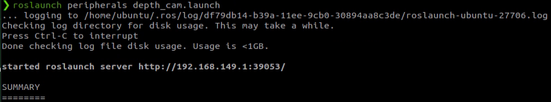

It is composed of one main module and three submodules.

Main Module:

The BT Navigator Server is the navigation behavior tree service, responsible for organizing and coordinating the three subordinate services below.

Three Submodules:

1.Planner Server: The planning server is responsible for computing paths that satisfy defined objective functions. Depending on the selected algorithm, the computed path may also be referred to as a route. Its function is essentially to determine a navigable path on the map.

2.Controller Server: The control server, also known as the local planner in ROS1, executes motion commands to follow the global path or perform local navigation tasks. Its function is to control the robot’s movement along the planned path.

3\. Recovery Server: The recovery server serves as the core of the fault-tolerance system. Its purpose is to detect and autonomously handle unexpected situations or system faults. In other words, it enables the robot to recover from unexpected situations, such as navigating out of a pit or obstacle.

Autonomous navigation is achieved by continuously switching between path planning, motion control along the path, and recovery from unexpected situations. During this process, a static SLAM-generated map alone is insufficient, as new obstacles may appear and some previously mapped obstacles may disappear. Therefore, navigation relies on a dynamic map, which is maintained and updated in real time. Based on update frequency and usage, dynamic maps can be classified into the following two types:

Global Costmap:

The global costmap is primarily used by the global planner, as shown in the Planner Server of the architecture diagram.

It typically includes the following layers:

Static Map Layer: A static map, usually generated by SLAM.

Obstacle Map Layer: Records obstacles detected dynamically by sensors.

Inflation Layer: Expands obstacles from the previous layers outward to prevent the robot’s body from colliding with them.

Local Costmap:

The local costmap is primarily used by the local planner, as shown in the Controller Server of the architecture diagram.

It typically includes the following layers:

Obstacle Map Layer: Records obstacles detected dynamically by sensors.

Inflation Layer: Expands obstacles from the obstacle map outward to prevent the robot’s body from colliding with them.

* **Package Installation**

The navigation system uses navigation goals, localization data, and map information as inputs to generate control commands for the robot. First, the robot’s current position must be determined, followed by its target destination.

There are two methods to install the navigation packages. The first method is direct installation via apt-get, using the following command:

```bash
sudo apt install ros-*-navigation2
```

```bash
sudo apt install ros-*-nav2-bringup
```

> [!NOTE]
>
> **The asterisk (*) represents your ROS2 version, which can be checked by entering a command in the terminal.**

```bash
echo $ROS_DISTRO
```

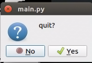

The second method is to download the package source code and compile it manually. For learning purposes, binary installation is recommended for convenience and speed. If you want to modify the package code to improve algorithms, manual installation from source is required. Refer to the video tutorial for detailed instructions.

Navigation package wiki: https://wiki.ros.org/Robots/Nav2

> [!NOTE]
>
> **The robot comes with the navigation package preinstalled; no additional installation is required.**

### 5.2.2 Adaptive Monte Carlo Localization(AMCL)

#### 5.2.2.1 AMCL Localization

Localization estimates the robot’s position within the global map. While SLAM also includes localization algorithms, SLAM localization is used for global map construction and occurs before navigation begins. In navigation, localization allows the robot to follow a planned route and verify that its actual trajectory aligns with expectations. The ROS navigation package ros-navigation provides the AMCL localization system for real-time robot positioning during navigation.

AMCL is a probabilistic localization system for 2D mobile robots. It implements the adaptive Monte Carlo localization method, using a particle filter with an existing map to estimate the robot’s position.

Localization addresses the relationship between the robot and surrounding obstacles, as path planning fundamentally relies on obstacle information to make navigation decisions. In an ideal scenario, knowing the robot’s global position and utilizing sensors like Lidar for real-time obstacle detection would be enough for navigation. However, the real-time performance and accuracy of global localization are generally limited. Local localization, using sensors like odometry and IMU, provides better precision and ensures the robot's motion trajectory aligns with the IMU’s real-time accuracy. The AMCL node in the navigation package provides global localization by publishing map_odom. Global localization via AMCL is not mandatory; users can replace it with other systems that provide map_odom, such as SLAM, UWB, or QR-code-based localization.

Global and local localization together establish a dynamic tf coordinate system (map → odom → base_footprint), while static tf coordinates between the robot's sensors are provided through the robot's URDF model. This TF relationship resolves the spatial association between the robot and obstacles. For example, if the LiDAR detects an obstacle 3 meters ahead, the transformation between the base_link and laser_link allows determining the relationship between the obstacle and the robot’s chassis.

#### 5.2.2.2 Particle Filtering

The Monte Carlo localization process simulates particle updates for a one-dimensional robot. First, a set of particles is randomly generated with position, orientation, or other state variables to be estimated. Each particle is assigned a weight that represents how closely it matches the actual system state. Next, the state of each particle is predicted for the next time step. This prediction moves the particles based on the expected behavior of the real system. Next, the particles' weights are updated based on measurements. Particles that match better with the measurements are given higher weights. Then resampling is performed, discarding unlikely particles and replacing them with more probable ones. Finally the weighted average and covariance of the particle set are calculated to obtain the state estimate.


The Monte Carlo method varies, but generally follows a specific pattern:

1. Define the domain of possible inputs.

2. Randomly generate inputs based on the probability distribution over the domain.

3. Perform deterministic calculations on the inputs.

4. Summarize the results.

There are two important considerations:

(1)If the points are not uniformly distributed, the approximation will be poor.

(2)The process requires many points. If only a few points are randomly placed across the entire square, the approximation will generally be inaccurate. On average, as more points are added, the accuracy of the approximation improves.

The Monte Carlo particle filter algorithm has many applications across a wide range of fields, including physical sciences, engineering, climatology, and computational biology.

#### 4.2.2.3 Adaptive Monte Carlo Localization (AMCL)

AMCL can be considered an improved version of the Monte Carlo localization algorithm. It reduces execution time by using fewer samples in the algorithm, thereby enhancing real-time performance. AMCL implements the adaptive or KLD (Kullback-Leibler Divergence) sampling-based Monte Carlo localization method. It uses particle filtering to track the robot’s pose with an existing map.

The AMCL node primarily uses laser scans and LiDAR maps to pass messages and compute pose estimates. The implementation process begins by initializing the particle filter for the adaptive Monte Carlo localization algorithm using various parameters provided by the ROS system. If no initial pose is set, the algorithm assumes the robot starts at the origin of the coordinate system, which can make the calculation more complex.

Therefore, it is recommended to set the initial pose using the 2D Pose Estimate button in RViz. For more details on AMCL, refer to the wiki: https://github.com/ros-planning/navigation

#### 5.2.2.4 Costmap

Whether it’s a 2D or 3D SLAM map generated by Lidar or depth cameras, it cannot be directly used for navigation. The map must be converted into a costmap for practical navigation. ROS costmaps typically use a grid format. In a grid map, each cell occupies one byte (8 bits), with values ranging from 0 to 255. For navigation purposes, we only need three values for each cell:  
Occupied: The space is occupied (obstacle detected).  
Free: The space is free (no obstacle).  
Unknown: The space is unknown.

Before introducing costmap_2d, we first need to explain the Bresenham algorithm. The Bresenham line algorithm is used to draw a straight line between two points. It calculates the closest points along a line segment on an n-dimensional raster. This algorithm only requires fast integer addition, subtraction, and bit-shifting, making it commonly used for drawing lines in computer graphics. It was one of the first algorithms developed in computer graphics.


The algorithm constructs a virtual grid of lines through the pixel centers of each row and column, as shown in the diagram above. It calculates the intersection points of the line with each vertical grid line, and based on the error term's sign, determines the pixel closest to this intersection in each column.

Core Idea of the Algorithm: Assume that k=dy/dx Since the starting point of the line is at the pixel center, the initial error term d0＝0. 

For each increment of X, the value of d increases according to the slope k, d=d+k. Once d≥1, subtract 1 to keep d between 0 and 1. When d≥0.5, the pixel closest to the current position is the pixel at (x+1,y+1). When d<0.5, the pixel closer to the current position is (x+1,y). For easier calculation, let e=d−0.5, with an initial value of e=−0.5 and an increment of k. When e≥0, select the pixel at (x+1,y+1); when e<0, select the pixel at (x+1,y). To avoid division, use integers instead of floating-point values. Since the algorithm only uses the sign of the error term, it can be replaced with e1 = 2\*e\*dx.

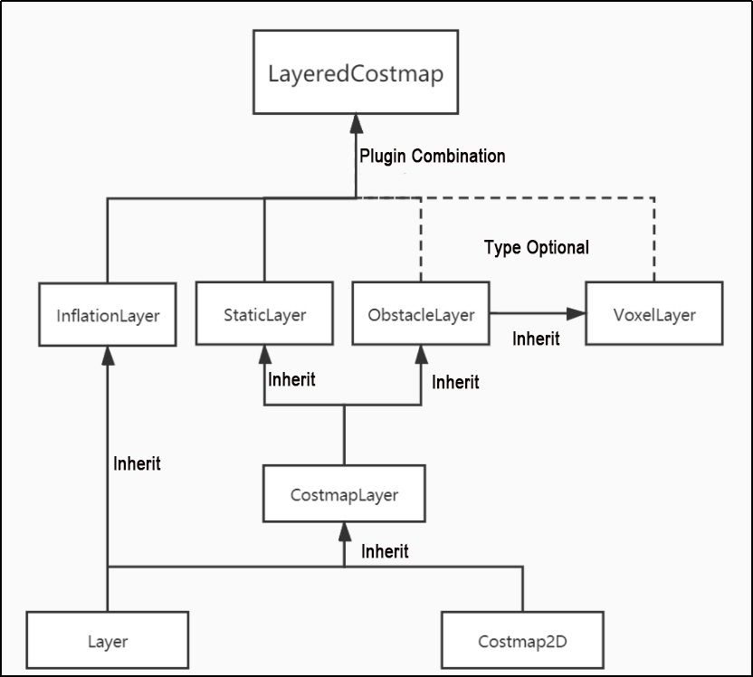

The Costmap2D class maintains the cost value for each grid. The Layer class is a virtual base class that standardizes the interface for the various plugin costmap layers. The key interface functions include:

The initialize function calls the onInitialize function to initialize each costmap layer individually.

The matchSize function, found in the StaticLayer and ObstacleLayer classes, calls the matchSize function of the CostmapLayer class to initialize each costmap layer's size, resolution, origin, and default cost value, ensuring consistency with the layered_costmap. For the InflationLayer class, a cost table is calculated based on the inflation radius, with cost values changing according to distance. This allows for querying the inflated grid's cost based on distance. Additionally, a seen\_ array is defined to track whether a grid cell has been visited. For the VoxelLayer class, the size of the voxel grid is initialized.

The updateBounds function adjusts the size range that needs to be updated for the current costmap layer. For the StaticLayer class, the update range of the costmap is determined by the size of the static map. Note: the static layer is typically only used in the global costmap. For the ObstacleLayer class, the function iterates over the sensor data in clearing_observations to determine the boundaries of obstacles.

The initialize and matchSize functions are each executed only once. The updateBounds and updateCosts functions are executed periodically, with the frequency of execution determined by the map_update_frequency parameter.

The CostmapLayer class inherits from both the Layer and Costmap2D classes, providing several methods to update the cost values. Both the StaticLayer and ObstacleLayer classes need to store the cost values of the instantiated costmap layers, so they inherit from the CostmapLayer class. The StaticLayer class uses static grid map data to update its costmap. The ObstacleLayer class uses sensor data to update its costmap. The VoxelLayer class, compared to ObstacleLayer, also considers data along the z-axis. The main difference in functionality lies in how obstacles are cleared. The ObstacleLayer clears obstacles in 2D, while the VoxelLayer clears obstacles in 3D.

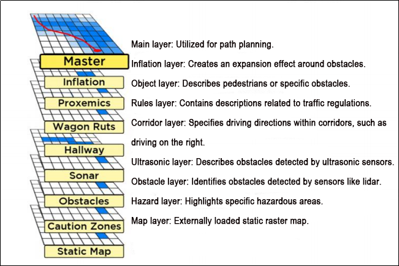

Costmap provides flexible obstacle measurement, allowing specific layers to be created based on requirements to maintain relevant obstacle information. If the robot is equipped only with a LiDAR, an Obstacles layer can be created to store the obstacle data from LiDAR scans. If the robot is also equipped with ultrasonic sensors, a new Sonar layer should be created to manage obstacle data from the sonar sensors. Each layer can have its own set of obstacle update rules, such as adding or removing obstacles, or updating the confidence of detected obstacles. This greatly enhances the scalability of the navigation system.

#### 5.2.2.5 Global Path Planning

Introduction: Path planning can be categorized based on the robot's understanding of the environment, the nature of the environment, and the algorithms used. These categories include environment-based path planning algorithms, map-based path planning algorithms, and completeness-based path planning algorithms.


Commonly used path planning algorithms in autonomous robot navigation include Dijkstra, A\*, D\*, PRM, RRT, Genetic Algorithms, Ant Colony Optimization, and Fuzzy Logic Algorithms.

Among these, Dijkstra and A* are graph-based path search algorithms. The navigation package integrates global path planning plugins such as navfn, global planner, and carrot planner. Users can select one of these plugins and load it into move_base for use. Alternatively, third-party global path planning plugins, such as SBPL_Lattice_Planner and srl_global_planner, can be loaded into move_base. Additionally, users can develop custom global path planning plugins by adhering to the nav_core interface specifications.

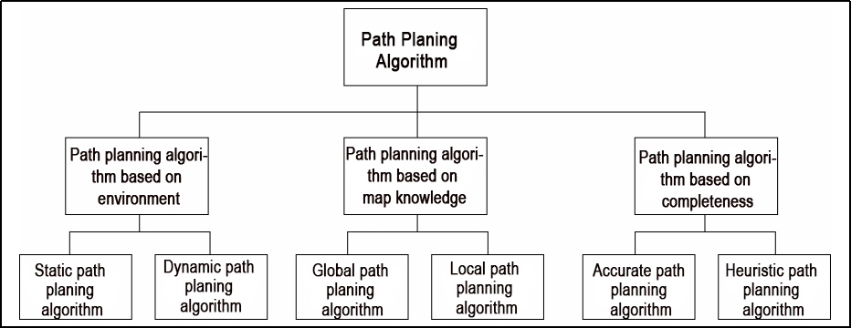

Autonomous robot navigation relies on path planning to guide the robot to its target point. The navigation planning layer can be divided into several components: global path planning, local path planning, and behavior execution layers.

1. **Global Path Planning Layer:** This layer generates a global path from the starting point to the target position, based on the provided goal and the weighted map information. The global path serves as a reference for the local path planning.

2. **Local Path Planning Layer:** This layer generates a local weighted map based on the information from the global path. It then performs local path planning, taking into account nearby obstacles.

3. **Behavior Execution Layer:** This layer integrates the commands from the higher layers with the path planning output to determine the robot's current behavior.

As a key area of research in mobile robotics, the quality of path planning algorithms significantly impacts the robot's operational efficiency.

* **Dijkstra Algorithm**

The Dijkstra algorithm is a classic shortest path algorithm. It is a single-source shortest path algorithm, primarily characterized by its breadth-first search approach. Starting from the source point, it expands outward layer by layer until reaching the destination. It is a breadth-first algorithm with edge weight consideration, making it one of the most commonly used algorithms for global path planning.

How Dijkstra Algorithm Works:

1. Initialize dis[start] to 0 and all other points to inf at the beginning.

   

2. In the first iteration, find the point with the smallest dis value, which is 1. Change point 1 to a white point and update the dis values of all blue points connected to 1. Set dis[2] = 2, dis[3] = 4, dis[4] = 7.

   

3. In the second iteration, find the point with the smallest dis value, which is 2. Change point 2 to a white point and update the dis values of all blue points connected to 2. Set dis[3] = 3, dis[5] = 4.

   

4. In the third iteration, find the point with the smallest dis value, which is 3. Change point 3 to a white point and update the dis values of all blue points connected to 3. Set dis[4] = 4.

   

5. In the next two iterations, change points 4 and 5 to white, then finish the algorithm. The shortest path for all points is calculated.

For an introduction and usage of the Dijkstra algorithm, visit the wiki at the following link: http://wiki.ros.org/navfn

* **A\* Algorithm**

A* is a modification of the Dijkstra algorithm, optimized for a single destination. Dijkstra’s algorithm finds the path for all positions, whereas A* finds the path to the nearest position from a set of positions. A* prioritizes paths that appear closer to the goal.

The formula for the A* algorithm is: F = G + H Where G is the cost of moving from the start point to a specified grid, and H is the estimated cost from the specified grid to the end point. There are two ways to calculate H:

1. Calculate the distance of horizontal and vertical movements, no diagonal movements allowed (Manhattan distance).


2. Calculate the distance of horizontal and vertical movements, diagonal movements allowed (Diagonal distance).


For an introduction and usage of the A* algorithm, refer to the video tutorial or visit the wiki at the following link: http://wiki.ros.org/global planner

Also visit the redblobgames website: https://www.redblobgames.com/pathfinding/a-star/introduction.html#graphs

### 5.2.3 Local Path Planning

Global path planning takes the start and goal points as input and uses the obstacle information described in the global map to plan a global path from the start to the goal. The global path consists of a series of discrete waypoints and only considers static obstacle information. Therefore, the global path cannot be directly used for navigation control but serves as a macro-level reference for navigation.

#### 5.2.3.1 DWA Algorithm

* **Description**

The DWA algorithm, also known as the Dynamic Window Approach, is a classic algorithm for mobile robot path planning and motion control. DWA works by searching for the optimal combination of speed and angular velocity in the state space of velocity and angular velocity, enabling the robot to navigate safely on a known map. Here is the basic description and some formulas of the DWA algorithm:


The core concept of the DWA algorithm is that, at each moment, the robot considers its current state and sensor information, then generates a set of possible motion trajectories (also known as the dynamic window) in the state space of velocity and angular velocity, and evaluates these trajectories to select the optimal one. The evaluation criteria typically include avoiding obstacles, maximizing forward velocity, and minimizing angular velocity. By repeatedly performing this process, the robot can plan its motion trajectory in real time to adapt to dynamic environments and obstacles.

* **Formulas**

1. The robot's state: position (x, y) and orientation θ;

2. Motion control parameters: Linear velocity V and angular velocity ω;

3. Sampling ranges for velocity and angular velocity: V<sub>min,</sub>V<sub>max</sub> and ω<sub>min</sub>,ω<sub>max;</sub>

4. Time step: Δt

The formula is as follows:

**Velocity sampling:** The DWA algorithm first samples in the state space of velocity and angular velocity to generate a set of possible velocity-angular velocity pairs, which are referred to as the dynamic window.

V<sub>samples</sub> = \[v<sub>min</sub>, v<sub>max</sub>]

ω<sub>samples</sub> = \[-ω<sub>max</sub>, ω<sub>max</sub>]

Where, (V<sub>samples</sub>) represents the velocity sampling range, and (ω<sub>samples</sub>) represents the angular velocity sampling range.

**Motion simulation:** For each velocity-angular velocity pair, the DWA algorithm performs a motion simulation to calculate the trajectory of the robot when using these velocity-angular velocity combinations from the current state.

x(t+1) = x(t) + v * cos(θ(t)) *Δt

y(t+1) = y(t) + v * sin(θ(t)) *Δt

θ(t+1) = θ(t) + ω * Δt

Where, x(t) and y(t) represent the robot's position, θ(t) represents the robot's orientation, (v) represents the linear velocity, (ω) represents the angular velocity, and (Δt) represents the time step.

**Trajectory evaluation:** For each generated trajectory, the DWA algorithm evaluates the trajectory using evaluation functions, such as obstacle avoidance evaluation, maximum speed evaluation, and minimum angular velocity evaluation.

**Obstacle avoidance evaluation:** Detects whether the trajectory intersects with any obstacles.

**Maximum speed evaluation:** Checks whether the maximum linear velocity along the trajectory is within the allowed range.

**Minimum angular velocity evaluation:** Checks whether the minimum angular velocity along the trajectory is within the allowed range.  
The evaluation functions can be defined and adjusted according to task requirements.

**Selecting the best trajectory:** The DWA algorithm selects the trajectory with the best evaluation score as the robot's next movement.


* **Extensions**

DWA Algorithm Extensions and Learning Links:

The DWA algorithm is a foundational algorithm in the field of mobile robotics, with several extended and improved versions, such as DWA, e-DWA, and DP-DWA, designed to enhance path planning performance and efficiency:

1. DWA Algorithm Extension: https://arxiv.org/abs/1703.08862

2. Enhanced DWA (e-DWA) Algorithm: https://arxiv.org/abs/1612.07470

3. DP-DWA Algorithm (DP-based Dynamic Window Approach): https://arxiv.org/abs/1909.05305

4. For more details, visit the wiki:  :http://wiki.ros.org/dwa_local_planner

These links provide comprehensive information and further research on the DWA algorithm and its extensions.

#### 5.2.3.2 TEB Algorithm

* **Description**

The TEB (Timed Elastic Band) algorithm is a path and motion planning algorithm primarily used in applications such as robotics and autonomous vehicles. The core concept of the TEB algorithm is to model the path planning problem as an optimization problem, where the goal is to generate an optimal trajectory within a given time frame while satisfying the robot or vehicle's dynamic constraints and obstacle avoidance requirements. Key features of the TEB algorithm:

1. **Time Hierarchical Representation:** The TEB algorithm introduces time hierarchy. It divides the trajectory into multiple time steps. Each step corresponds to a position of the robot or vehicle along the path. This helps establish time constraints and avoid collisions.

2. **Trajectory Parameterization:** The TEB algorithm parameterizes the trajectory as a series of displacements and velocities, making optimization easier. Each time step has its own displacement and velocity parameters.

3. Constraint Optimization: The TEB algorithm considers the robot's dynamic constraints, obstacle avoidance constraints, and trajectory smoothness constraints. These constraints are modeled as part of the objective function in the optimization problem.

4. **Optimization Solving:** The TEB algorithm uses optimization techniques, such as Quadratic Programming (QP) or Nonlinear Programming (NLP), to solve for the optimal trajectory parameters that satisfy the constraints.


* **Formulas**

The following diagram describes the optimization objective function in the TEB algorithm:


Where:

(1) J(x) is the objective function, and x represents the trajectory parameters.

(2) w<sub>smooth</sub> and w<sub>obstacle</sub> are the weights for smoothness and obstacle avoidance, respectively.

(3) H is the smoothness penalty matrix.

(4) f(x<sub>i</sub>,o<sub>j</sub>) represents the obstacle cost function between trajectory point x<sub>i</sub> and obstacle o<sub>j</sub>.

**1.State Definition:**

First, define the robot (or vehicle) state in the path planning problem.

(1) Position: P=[X,Y], represents the robot's position on the 2D plane.

(2) Velocity: V = [Vx,Vy], represents the robot's velocity along the X and Y axes.

(3) Time: t, represents time.

(4) Control Input: u = [ux, uy], represents the robot's control input, which can be velocity or acceleration.

(5) Robot Trajectory: x(t)=[p(t),v(t)], represents the robot's state at time t.

**2\. Objective Function:**

The core of the TEB algorithm is an optimization problem, with the goal of minimizing an objective function composed of multiple components:

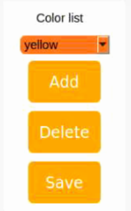

Where:

(1) J<sub>smooth</sub>(x): The smoothness objective function, used to ensure the generated trajectory is smooth.

(2) J<sub>obstacle</sub>(x): The obstacle avoidance objective function, used to avoid collisions with obstacles.

(3) J<sub>dynamic</sub>(x): The dynamics objective function, used to ensure the robot's dynamic constraints are satisfied.

**3. Smoothness Objective Function Jsmooth(x):** The smoothness objective function typically involves the trajectory's curvature to ensure the generated trajectory is smooth.**************** It can be expressed as:


where k(t) is the curvature at time t.

**4\. Obstacle Avoidance Objective Function Jobstacle(x):**

The obstacle avoidance objective function calculates the distance between trajectory points and obstacles, penalizing trajectory points that are close to obstacles. The specific obstacle cost function f(x,o) can be defined as you want.


**5\. Dynamics Objective Function J<sub>dynamic</sub>(x):**

The dynamics objective function ensures that the generated trajectory satisfies the robot's dynamic constraints, which can be defined based on the robot's kinematic and dynamic models. Typically, this involves constraints on velocity and acceleration.

**6\. Optimization:**

Finally, the TEB algorithm formulates the above objective functions as a constrained optimization problem, where the optimization variables include trajectory parameters, time allocation, and control inputs. This optimization problem is typically a Nonlinear Programming (NLP) problem.

* **Extensions**


TEB Algorithm Extensions and Learning Links:

The TEB algorithm is an important technique in the field of path planning, with many extensions and improved variants. Here are some learning links and extension topics to help you gain a deeper understanding of the TEB algorithm and related concepts:

1. Original TEB Algorithm Paper: One of the best learning resources is to review the original TEB algorithm paper to understand its principles and applications.

- Original TEB Paper: "**Trajectory modification considering dynamic constraints of autonomous robots**" by M. Rösmann et al.

2. TEB Implementation in ROS:  
   The ROS package for the TEB algorithm (Robot Operating System Package) is a common implementation used for robot path planning.

ROS TEB Local Planner Package: *https://github.com/rst-tu-dortmund/teb_local_planner*

Official Wiki: *http://wiki.ros.org/teb_local_planner*

These links provide valuable resources for users to explore the TEB algorithm and its applications in path planning in greater depth.

### 5.2.4 Single/Multi-Point Navigation and Obstacle Avoidance

1. Start the robot and connect it to the remote control software NoMachine. For connection instructions, please refer to the section [7.2 AP Mode Connection Steps](1.ROSOrin使用手册.md#AP-Mode-Connection-Steps) in the user manual.

2. Click the terminal icon 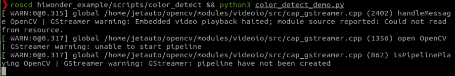 in the system desktop to open a command-line window. Enter the command to disable the app auto-start service.

```bash
sudo systemctl stop start_app_node.service
```

3. Entering the following command and press Enter to start the navigation service.

```bash
ros2 launch navigation navigation.launch.py map:=map_01
```

The "map_01" at the end of the command is the map name. Users can modify this parameter according to their needs. The map storage path is **/home/ubuntu/ros2_ws/src/slam/maps.**

4. Open a new terminal and enter the following command to launch RViz and display navigation:

```bash
ros2 launch navigation rviz_navigation.launch.py
```


#### 5.2.4.1 Single-Point Navigation

In the software menu bar, **2D Pose Estimate** is used to set the robot's initial position, and **2D Nav Goal** is used to set a single target point for the robot.

1. To set the robot's initial position, click on 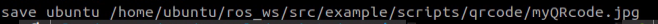 in the software interface, select a location on the map, then click and drag the mouse to choose the robot's pose.

   

2. After setting the robot's initial position, the result is as shown below (where the robot's Lidar point cloud data overlaps with the obstacles in the map).

   

3. Click the icon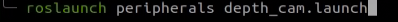 and select a target point on the map. Simply click once at the target point on the map. After the selection, the robot will automatically generate a route and move toward the target point.

   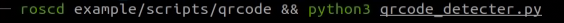

4. Once the target point is set, the map will display two paths: The green line represents the straight path between the robot and the target point; The dark blue line represents the robot's planned path.

   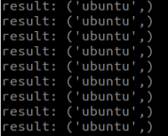

5. When the robot reaches the set target point, navigation is complete.

   


#### 5.2.4.2 Multi-Point Navigation

1. In the RViz2 software tool, find the navigation toolbar in the lower left corner, then click the **Waypoint** button to enter multi-point navigation mode.

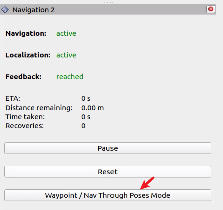

2. Click the **Nav2 Goal** button to set the goals.

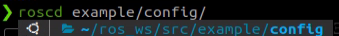

3. Next, set the robot's navigation points in the non-obstacle areas of the map:

The setting method involves left-clicking to set a target point, then dragging the mouse to set the robot's orientation. The direction indicated by the arrow is the robot's forward direction. The example below shows three target points set for the robot.


4. Finally click **Start Nav Through Poses** or **Start Waypoint Following** to enable navigation. Start Nav Through Poses will control the robot's posture at each navigation point.  
   Start Waypoint Following will not focus on the robot's posture at each navigation point. It is recommended to use Start Waypoint Following for navigation.

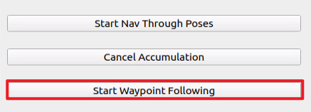

5. The result of multi-point navigation is shown in the image below, with the robot reaching the target points in sequence.

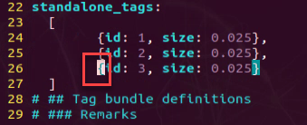

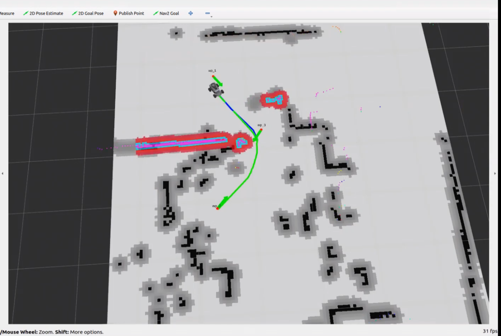

6. When the robot reaches the last set target point, it indicates that the multi-point navigation is complete.

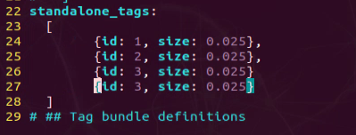

#### 5.2.4.3 Exit Navigation

1. Right-click on the system command terminal icon, then click **New Window** to open a new command terminal.

   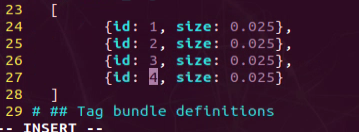

2. Next, enter the following command and press Enter to execute the program for all ROS nodes in the current system environment. If it does not close successfully, try a few more times.

   ```bash
   ~/.stop_ros.sh
   ```

#### 5.2.4.4 Launch Instruction

The path to the launch file is located at:

**/home/ubuntu/ros2_ws/src/navigation/launch/navigation.launch.py**

```python
import os
from ament_index_python.packages import get_package_share_directory

from launch_ros.actions import PushRosNamespace
from launch import LaunchDescription, LaunchService
from launch.substitutions import LaunchConfiguration
from launch.launch_description_sources import PythonLaunchDescriptionSource
from launch.actions import DeclareLaunchArgument, IncludeLaunchDescription, GroupAction, OpaqueFunction, TimerAction
```

- **Set Path**

Get the paths of the `peripherals`,`controller`,`servo_controller` packages.

```python
    if compiled == 'True':
        slam_package_path = get_package_share_directory('slam')
        navigation_package_path = get_package_share_directory('navigation')
    else:
        slam_package_path = '/home/ubuntu/ros2_ws/src/slam'
        navigation_package_path = '/home/ubuntu/ros2_ws/src/navigation'
```

- **Launch Other Files**

  **base_launch is used for various hardware.**

  **navigation_launch launches the navigation algorithm.**

  **bringup_launch initializes actions.**

```python
    base_launch = IncludeLaunchDescription(
        PythonLaunchDescriptionSource(os.path.join(slam_package_path, 'launch/include/robot.launch.py')),
        launch_arguments={
            'sim': sim,
            'master_name': master_name,
            'robot_name': robot_name
        }.items(),
    )
    
    navigation_launch = IncludeLaunchDescription(
        PythonLaunchDescriptionSource(os.path.join(navigation_package_path, 'launch/include/bringup.launch.py')),
        launch_arguments={
            'use_sim_time': use_sim_time,
            'map': os.path.join(slam_package_path, 'maps', map_name + '.yaml'),
            'params_file': os.path.join(navigation_package_path, 'config', 'nav2_params.yaml'),
            'namespace': robot_name,
            'use_namespace': use_namespace,
            'autostart': 'true',
            'use_teb': use_teb,
        }.items(),
    )

    bringup_launch = GroupAction(
     actions=[
         PushRosNamespace(robot_name),
         base_launch,
         TimerAction(
             period=10.0,  # Delay for enabling other nodes
             actions=[navigation_launch],
         ),
      ]
    )
```

#### 5.2.4.5 Package Description

The path to the navigation package is: **~/ros2_ws/src/navigation/**


**config:** Contains configuration parameters related to navigation, as shown in the figure below.

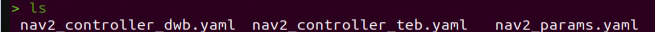

**launch:** Includes launch files related to navigation, including files for localization, map loading, navigation methods, and simulation model launch files, as shown in the figure below.

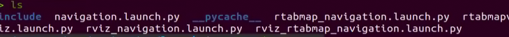

**rviz:** Loads parameters for the RViz visualization tool, including robot RViz configuration files for different navigation algorithms and navigation configuration files, as shown in the figure below.

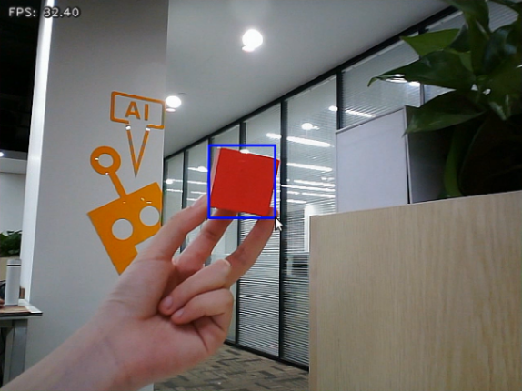

**Package.xml:** The configuration file for the current package.

### 5.2.5 RTAB-VSLAM 3D Navigation

#### 5.2.5.1 Algorithm Introduction and Principles

For an introduction to the RTAB-VSLAM algorithm and its principles, refer to the section [5.1.5 RTAB-VSLAM 3D Mapping](#anther5.1.5) in this tutorial for learning and reference.

#### 5.2.5.2 Operating Steps

1. Start the robot and connect it to the remote control software NoMachine. For connection instructions, please refer to the section [7.2 AP Mode Connection Steps](1.ROSOrin使用手册.md#AP-Mode-Connection-Steps) in the user manual.

2. Click the terminal icon  in the system desktop to open a command-line window. Enter the command to disable the app auto-start service.

```bash
sudo systemctl stop start_app_node.service
```

3. Entering the following command and press Enter to start the navigation service.

```bash
ros2 launch navigation rtabmap_navigation.launch.py
```

4. Open a new terminal and enter the following command to launch RViz and display navigation:

```bash
ros2 launch navigation rviz_rtabmap_navigation.launch.py
```

5. The program will appear as shown below after starting successfully.


6. Click on the target point setting icon 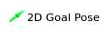at the top of the software to set a navigation target point for the robot.

7. Select a location on the map and click once with the mouse at the desired target point on the map interface. After the selection, the robot will automatically generate a route and move toward the target point.

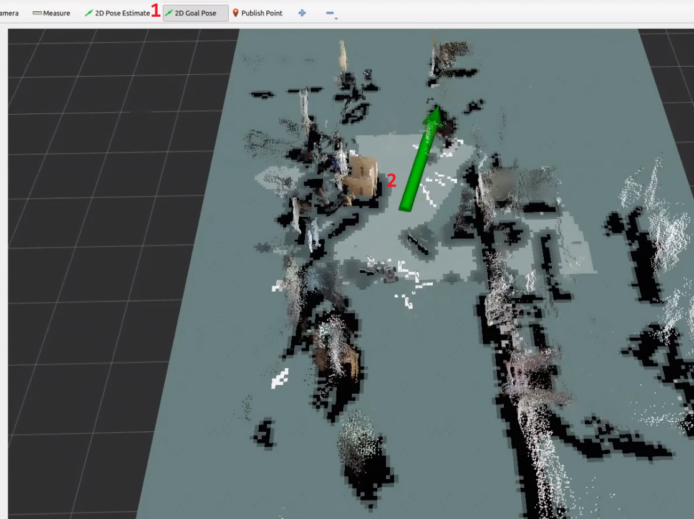

8. Once the target point is set, the map will display two paths. The robot will move towards the target along these two paths.

The green path is the global path planned by the global planner.

The blue path is the local path planned by the local planner.


9. When encountering obstacles, the robot will bypass them while continuously adjusting its posture and trajectory.

#### 5.2.5.3 Launch Instruction

The path to the launch file is located at:

**/home/ubuntu/ros2_ws/src/navigation/launch/navigation.launch.py**

```python
import os
from ament_index_python.packages import get_package_share_directory

from launch_ros.actions import PushRosNamespace
from launch import LaunchDescription, LaunchService
from launch.substitutions import LaunchConfiguration
from launch.launch_description_sources import PythonLaunchDescriptionSource
from launch.actions import DeclareLaunchArgument, IncludeLaunchDescription, GroupAction, OpaqueFunction, TimerAction

def launch_setup(context):
    compiled = os.environ['need_compile']
    if compiled == 'True':
        slam_package_path = get_package_share_directory('slam')
        navigation_package_path = get_package_share_directory('navigation')
    else:
        slam_package_path = '/home/ubuntu/ros2_ws/src/slam'
        navigation_package_path = '/home/ubuntu/ros2_ws/src/navigation'

    sim = LaunchConfiguration('sim', default='false').perform(context)
    map_name = LaunchConfiguration('map', default='map_01').perform(context)
    robot_name = LaunchConfiguration('robot_name', default=os.environ['HOST']).perform(context)
    master_name = LaunchConfiguration('master_name', default=os.environ['MASTER']).perform(context)
    use_teb = LaunchConfiguration('use_teb', default='true').perform(context)

    sim_arg = DeclareLaunchArgument('sim', default_value=sim)
    map_name_arg = DeclareLaunchArgument('map', default_value=map_name)
    master_name_arg = DeclareLaunchArgument('master_name', default_value=master_name)
    robot_name_arg = DeclareLaunchArgument('robot_name', default_value=robot_name)
    use_teb_arg = DeclareLaunchArgument('use_teb', default_value=use_teb)
```

- **Set Path**

Get the paths of the `peripherals`,`controller`,`servo_controller` packages.

```python
    compiled = os.environ['need_compile']
    if compiled == 'True':
        slam_package_path = get_package_share_directory('slam')
        navigation_package_path = get_package_share_directory('navigation')
    else:
        slam_package_path = '/home/ubuntu/ros2_ws/src/slam'
        navigation_package_path = '/home/ubuntu/ros2_ws/src/navigation'
```

- **Launch Other Files**

  `rtabmap_launch`Start 3D navigation algorithm

  `navigation_launch`Start 2D navigation algorithm

  `bringup_launch`Initialize actions

```python
    base_launch = IncludeLaunchDescription(
        PythonLaunchDescriptionSource(os.path.join(slam_package_path, 'launch/include/robot.launch.py')),
        launch_arguments={
            'sim': sim,
            'master_name': master_name,
            'robot_name': robot_name
        }.items(),
    )
    
    navigation_launch = IncludeLaunchDescription(
        PythonLaunchDescriptionSource(os.path.join(navigation_package_path, 'launch/include/bringup.launch.py')),
        launch_arguments={
            'use_sim_time': use_sim_time,
            'map': os.path.join(slam_package_path, 'maps', map_name + '.yaml'),
            'params_file': os.path.join(navigation_package_path, 'config', 'nav2_params.yaml'),
            'namespace': robot_name,
            'use_namespace': use_namespace,
            'autostart': 'true',
            'use_teb': use_teb,
        }.items(),
    )

    bringup_launch = GroupAction(
     actions=[
         PushRosNamespace(robot_name),
         base_launch,
         TimerAction(
             period=10.0,  # Delay for enabling other nodes
             actions=[navigation_launch],
         ),
      ]
    )

```