# 5\. ROS1-Mapping \& Navigation Course

## 5.1 Mapping Tutorial
<p id ="anther5.1"></p>

### 5.1.1 SLAM Map Construction Principle

#### 5.1.1.1 Introduction to SLAM

Take humans as an example: before reaching a destination, one needs to know their current position, whether or not a map is available. Humans rely on their eyes, whereas robots rely on LiDAR. SLAM refers to simultaneous localization and mapping.

Localization determines the robot’s pose within a coordinate system. The origin and orientation of the coordinate system can be obtained from the first keyframe, an existing global map or landmarks, or GPS.

Mapping refers to creating a map of the environment perceived by the robot, where the basic geometric elements of the map are points. The primary purpose of the map is for localization and navigation. Navigation can be divided into guiding and moving: guiding includes global and local path planning, while moving refers to controlling the robot’s motion according to the planned path.

#### 5.1.1.2 SLAM Mapping Principles

SLAM mapping mainly involves the following three processes:

1. **Preprocessing:** Optimize the raw point cloud data from the LiDAR, remove problematic data, or apply filtering.

Using laser as the signal source, pulses emitted by the LiDAR hit surrounding obstacles, causing scattering.


Part of the reflected light returns to the LiDAR receiver. Using the laser ranging principle, the distance from the LiDAR to the target point can be calculated.

Regarding point clouds: Simply put, the information captured by the LiDAR about the surrounding environment is called the point cloud. It represents the part of the environment that the robot’s “eyes” can see. The captured object information is presented as a series of discrete points with precise angles and distances.

2. **Matching:** Match the current local point cloud data to the existing map to find the corresponding position.

Typically, a LiDAR SLAM system compares point clouds captured at different times to calculate the LiDAR’s relative movement and pose change, thereby completing the robot’s localization.

3. Map fusion: Merge the new data from the LiDAR into the existing map, updating the map continuously.

#### 5.1.1.3 Note on Map Construction

1. When constructing the map at startup, it is best for the robot to face a straight wall, or use a closed cardboard box instead, so that the LiDAR can capture as many points as possible.

2. Try to ensure the completeness of the map. For all 360° areas surrounding the robot along its possible paths, the LiDAR needs to scan them to increase map integrity.

3. In wide or open spaces, it is best to first let the robot close the mapping loop before proceeding to scan smaller details, which improves accuracy and consistency in the final map.

#### 5.1.1.4 Evaluate Map Construction Result

After the map construction is complete, the results can be evaluated using the following items:

1. Whether the edges of obstacles in the map are clear;

2. Whether there are areas in the map that do not match the actual environment, such as closed loops.

3. Whether there are gray areas in the map within the robot's operating range, indicating areas not scanned.

4. Whether there are obstacles in the map that will no longer exist during subsequent localization, such as moving obstacles.

5. Confirm that, within the robot’s working area, the LiDAR has scanned the full 360° field of view from every position.

#### 5.1.1.5 Mapping Package

The robot's mapping package is slam, which includes pre-installed mapping algorithms such as `Gmapping`, `Hector`, `Cartographer`, `Karto`, `Explore_Lite`, `Frontier`, and `RRT`. The mapping algorithms are started using the slam.launch file in the package.

By launching the `slam.launch` file, it starts nodes for the depth camera, robot chassis, wireless controller, and others, and then calls the respective mapping algorithm launch files based on the parameters.

```
<?xml version="1.0"?>
<launch>
    <arg name="sim"         default="false"/>
    <arg name="app"         default="false"/>
    <arg     if="$(arg app)" name="robot_name"  default="/"/>
    <arg unless="$(arg app)" name="robot_name"  default="$(env HOST)"/>
    <arg     if="$(arg app)" name="master_name" default="/"/>
    <arg unless="$(arg app)" name="master_name" default="$(env MASTER)"/>

    <!--建图方法选择-->
    <arg name="slam_methods" default="gmapping" doc="slam type 
        [gmapping, cartographer, hector, karto, frontier, explore, rrt_exploration, rtabmap]"/>

    <arg name="gmapping"        default="gmapping"/>
    <arg name="cartographer"    default="cartographer"/>
    <arg name="hector"          default="hector"/>
    <arg name="karto"           default="karto"/>
    <arg name="frontier"        default="frontier"/>
    <arg name="explore"         default="explore"/>
    <arg name="rrt_exploration" default="rrt_exploration"/>
    <arg name="rtabmap"         default="rtabmap"/>

    <include file="$(find slam)/launch/include/robot.launch">
        <arg name="sim"         value="$(arg sim)"/>
        <arg name="app"         value="$(arg app)"/>
        <arg name="robot_name"  value="$(arg robot_name)"/>
        <arg name="master_name" value="$(arg master_name)"/>
        <arg if="$(eval slam_methods == hector)" name="enable_odom"    value="false"/>
    </include>

    <include file="$(find slam)/launch/include/slam_base.launch">
        <arg name="sim"             value="$(arg sim)"/>
        <arg name="slam_methods"    value="$(arg slam_methods)"/>
        <arg name="robot_name"      value="$(arg robot_name)"/>
    </include>
</launch>
```

* **Package Internal Structure**

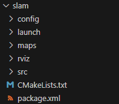

The above diagram shows the internal file structure of the mapping package. The corresponding functions for each folder are as follows:

1. `config`: Folder containing algorithm parameter configuration files.

2. `launch`: Folder containing launch files for the related packages.

3. `maps`: Folder for storing map messages.

4. `rviz`: Folder for storing rviz configuration files.

5. `src`: Folder for algorithm source files and calls.

6. `CMakeLists.txt`: File for compiling dependencies.

7. `package.xml`: Package description file.

* **Package File Description**

1) The `config` folder contains configuration files for various mapping algorithms, including `cartographer`, `frontier`, and `Gmappingdeng`.

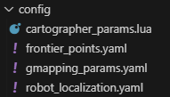

For example, the following is part of the configuration file for the Cartographer algorithm.

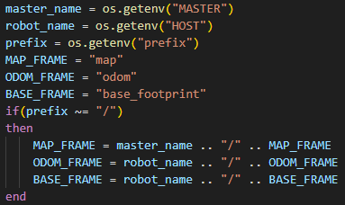

More detailed explanations of this can be found in later sections.

2) The `launch` folder contains launch files for various mapping algorithm packages.

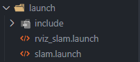

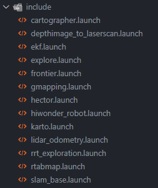

3) The `maps` folder stores map messages. To save a map, navigate to the maps folder and run the following two commands:

```bash
roscd slam/maps
```

```bash
rosrun map_server map_saver map:=/robot_1/map -f map_01
```

The **robot_1** is the robot name, and **map_01** is the map name.

This will save the map information into the **maps** folder for easy modification and future navigation functions.

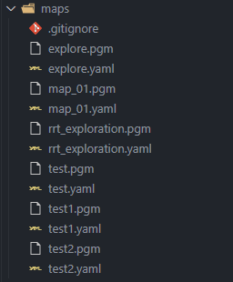

4) The **rviz** folder stores simulation maps and robot model files. Place the simulation models required by different mapping algorithms in this folder for use with RViz to view the mapping results.

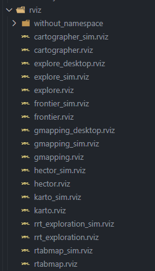

5) The **src** folder is for calling algorithm source files.

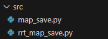

`map_save.py`: Script for saving map information.

`rrt_map_save.py`: Script for saving map information in the autonomous mapping algorithm RRT.

6) `CMakeLists.txt`: File for compiling dependencies. `package.xml`: Describes the package version information and some functional dependencies.

#### 5.1.1.6 Differences Between Mapping Algorithms

The table below provides a brief comparison of the different mapping algorithms for quick reference. Detailed explanations of each algorithm can be found later in the text. The most suitable mapping algorithm can be selected based on specific requirements and environmental conditions.

<table style="width:100%;"  border="1">
<colgroup>
<col style="width: 10%" />
<col style="width: 10%" />
<col style="width: 10%" />
<col style="width: 5%" />
<col style="width: 35%" />
<col style="width: 30%" />
</colgroup>
<tbody>
<tr>
<td style="text-align: center;">Algorithm</td>
<td style="text-align: center;">Accuracy</td>
<td style="text-align: center;">Real-time</td>
<td style="text-align: center;">Computational Complexity</td>
<td style="text-align: center;">Requirements</td>
<td style="text-align: center;">Applicable Scenarios</td>
</tr>
<tr>
<td style="text-align: center;">Gmapping</td>
<td style="text-align: center;">High</td>
<td style="text-align: center;">Real-time</td>
<td style="text-align: center;">Medium</td>
<td style="text-align: left;">Requires good perception of features and the environment.</td>
<td style="text-align: left;">Small to medium indoor environments where real-time mapping and accuracy are important.</td>
</tr>
<tr>
<td style="text-align: center;">Hector</td>
<td style="text-align: center;">Relatively Accurate</td>
<td style="text-align: center;">Real-time</td>
<td style="text-align: center;">Low</td>
<td style="text-align: left;">Requires high update rate of LiDAR data to support fast-moving robots.</td>
<td style="text-align: left;">Fast-moving robots or environments with motion blur.</td>
</tr>
<tr>
<td style="text-align: center;">Cartographer</td>
<td style="text-align: center;">High</td>
<td style="text-align: center;">Real-time / Offline</td>
<td style="text-align: center;">High</td>
<td style="text-align: left;">High-quality sensor data is required. Accurate calibration of LiDAR and other sensors is necessary.</td>
<td style="text-align: left;">Applications requiring high-precision mapping and localization, suitable for indoor and outdoor environments.</td>
</tr>
<tr>
<td style="text-align: center;">Karto</td>
<td style="text-align: center;">Relatively Accurate</td>
<td style="text-align: center;">Real-time</td>
<td style="text-align: center;">Medium</td>
<td style="text-align: left;">Requires well-defined environmental features and structures for accurate scan matching and mapping. Low computational resources needed, suitable for resource-limited platforms.</td>
<td style="text-align: left;">Small environments or scenarios with limited computational resources or lower-performance hardware.</td>
</tr>
<tr>
<td style="text-align: center;">Explore_Lite</td>
<td style="text-align: center;">Low</td>
<td style="text-align: center;">Real-time</td>
<td style="text-align: center;">Low</td>
<td style="text-align: left;">Mapping accuracy is relatively low; focus is on discovering new areas and planning paths to them.</td>
<td style="text-align: left;">Exploration tasks for autonomous robots in unknown environments.</td>
</tr>
<tr>
<td style="text-align: center;">Frontier Exploration</td>
<td style="text-align: center;">Low</td>
<td style="text-align: center;">Real-time</td>
<td style="text-align: center;">Low</td>
<td style="text-align: left;">Mapping accuracy is relatively low. Focus is on discovering new areas and planning paths to them.</td>
<td style="text-align: left;">Exploration tasks for autonomous robots in unknown environments.</td>
</tr>
<tr>
<td style="text-align: center;">RRT</td>
<td style="text-align: center;">Depends on the quality of the search</td>
<td style="text-align: center;">Real-time / Offline</td>
<td style="text-align: center;">High</td>
<td style="text-align: left;">Low requirements for obstacles and constraints, but sufficient sampling and search steps are needed to find feasible paths. More sampling and search may be required in complex environments to improve accuracy.</td>
<td style="text-align: left;">Scenarios requiring path planning, especially in irregular or uncertain environments.</td>
</tr>
</tbody>
</table>


### 5.1.2 Gmapping Mapping Algorithm

#### 5.1.2.1 Algorithm Concept

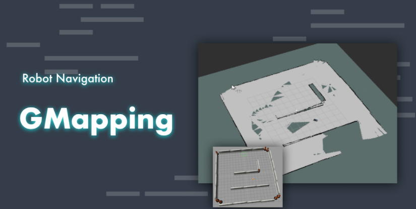

The theoretical concept of Gmapping is relatively simple. It is an open-source SLAM algorithm based on the Rao-Blackwellized Particle Filter (RBPF) algorithm. The Gmapping algorithm separates the localization and mapping processes. First, it performs localization using the particle filter algorithm, then the particles are matched with the generated map via scan matching. The odometry errors are continuously corrected, and new scans are added to the map.

Gmapping introduces two main improvements to the RBpf algorithm: improved proposal distribution and selective resampling.

Compared to other mapping algorithms, Gmapping has notable advantages and disadvantages.

The advantages of Gmapping lie in its ability to build indoor maps in real-time, requiring less computational power and offering high accuracy for small-scale maps. In comparison to Hector, Gmapping has lower requirements for LiDAR frequency and is more robust. Hector tends to make errors in map alignment when the robot turns quickly, mainly because the optimization algorithm can get stuck in local minima. On the other hand, Gmapping does not require as many particles for small-scale maps and does not have loop closure detection, which results in lower computational load than Cartographer while maintaining similar accuracy. Gmapping effectively utilizes wheel odometry information, which is why it has lower requirements for LiDAR frequency: odometry provides prior knowledge of the robot's pose. Hector and Cartographer, on the other hand, were not designed to solve localization and mapping for mobile robots on flat surfaces. Hector is primarily used in uneven terrains such as disaster areas, where odometry cannot be used. Cartographer is designed for handheld LiDAR to complete the SLAM process, and therefore lacks odometry.

A disadvantage of the Gmapping algorithm is that as the scene size increases, the number of particles required also increases, because each particle carries its own map. This leads to increased memory and computational load when building large maps, making it unsuitable for large-scale mapping. Additionally, Gmapping does not have loop closure detection, meaning that when a loop is closed, it may cause map misalignment. While increasing the number of particles can help close the loop, it comes at the cost of higher computation and memory usage. Therefore, it cannot build large maps like Cartographer. Although some research papers have shown Gmapping generating maps up to tens of thousands of square meters, in practice, errors occur when the map is a few thousand square meters. Gmapping and Cartographer represent two types of SLAM: one based on a filtering framework (Gmapping) and the other on an optimization framework (Cartographer). Both algorithms involve trade-offs between time complexity and space complexity. As Gmapping prioritizes time efficiency over space efficiency, it becomes unsuitable for large-scale mapping. For instance, when mapping a 200x200 meter area with a 5 cm grid resolution, the memory required for one particle’s map would be 16 MB. If 100 particles are used, this would demand 1.6 GB of memory, making it impractical for large environments. If the map expands to 500x500 meters with 200 particles, the computer may crash due to excessive memory usage. Looking at the Cartographer algorithm, optimization works by using only one particle in the map, which drastically reduces memory consumption compared to Gmapping. However, the computational load is significantly higher, making it difficult for typical laptops to generate high-quality maps, or even run the algorithm properly. Optimization requires complex matrix calculations, which is one of the reasons Google developed the Ceres Solver library.

Gmapping Resources Wiki:<http://wiki.ros.org/gmapping>

Slam_Gmapping software package:<https://github.com/ros-perception/slam_gmapping>

OpenSlam_Gmapping open-source algorithm:<https://github.com/ros-perception/openslam_gmapping>

#### 5.1.2.2 Mapping Steps

> [!NOTE]
> 
> **Commands must be entered with correct capitalization. The Tab key can be used to auto-complete keywords.**

* **Enable Service**

1. Power on the robot and connect it via the NoMachine remote control software. For detailed information on connecting to a remote desktop, please refer to section [1.7.2 AP Mode Connection Steps](https://wiki.hiwonder.com/projects/ROSOrin/en/jetson-nano-version/docs/1_ROSOrin_User_Manual.html#ap-mode-connection-steps) in the user manual.

2. Click the terminal icon  in the system desktop to open a command-line window.

3. Enter the following command and press **Enter** to stop the app auto-start service:

```bash
sudo systemctl stop start_app_node.service
```

4) Open a new command-line terminal window and execute the Gmapping mapping node command.

```bash
roslaunch slam slam.launch slam_methods:=gmapping
```

After a short wait, the following information should appear, indicating that the process has started successfully.

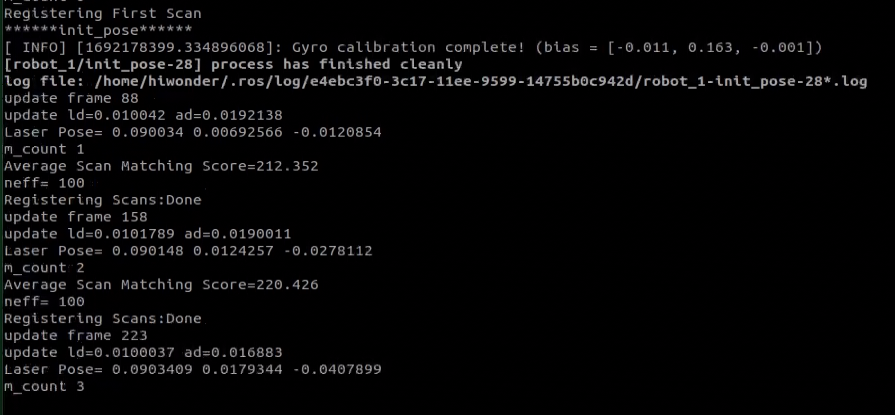

These messages provide feedback on key steps and parameters during the mapping process. `m_count 1`: This shows that 1 frame of data has been processed, meaning one laser scan has been completed.

`Average Scan Matching Score=212.352`: This indicates that the average scan matching score is 212.352. The scan matching score is used to assess how well each frame of laser scan data aligns with the map. A lower score indicates a better match.

`neff=100`: This indicates that there are 100 effective particles, which are those with the highest weight in the particle filter. This helps assess the filter's accuracy and diversity.

`Registering Scans:Done`: This means that the laser scan registration process is complete. Registration refers to aligning the laser scan data with the map to estimate the robot's position.

`update frame 158`: This indicates that data from frame 158 has been processed. After each scan, the map and particle set are updated.

`update ld=0.010789 ad=0.0192138`: This shows the linear displacement (ld) and angular displacement (ad) of the robot in the current frame, with values of 0.010789 and 0.0192138, respectively.

`Laser Pose= 0.090148 0.0124257 -0.0278112`: This represents the laser pose, with 0.090148 as the x-coordinate, 0.0124257 as the y-coordinate, and -0.0278112 as the orientation angle.

5. Open a new terminal window, enter the command to launch the model viewer software, and press **Enter**.

```bash
roslaunch slam rviz_slam.launch slam_methods:=gmapping
```

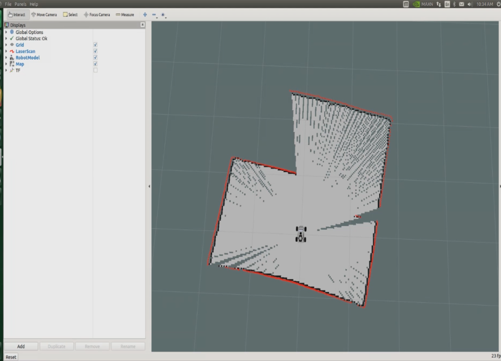

* **Start the Mapping Process**

This section uses keyboard control for mapping. If mapping via the wireless controller is preferred, refer to the section [1.6 Wireless Controller Control](https://wiki.hiwonder.com/projects/ROSOrin/en/jetson-nano-version/docs/1_ROSOrin_User_Manual.html#wireless-controller-control) of the user manual for detailed instructions.

1. Open a new terminal window, enter the command to start the keyboard control node, and press **Enter**.

```bash
roslaunch peripherals teleop_key_control.launch
```

If the prompt shown below appears, the keyboard control service has started successfully.

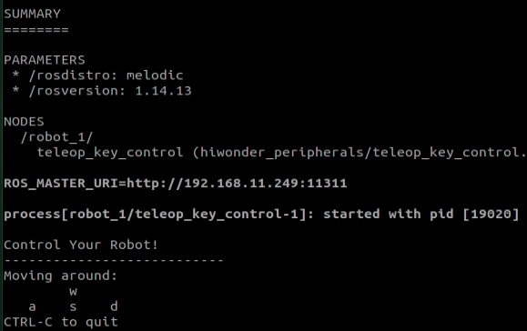

2) Control the robot to move within the current environment to build a more complete map. The table below shows the keyboard keys and their corresponding functions for controlling the robot's movement during mapping:

<table  border="1">
  <thead>
    <tr>
      <th>Keyboard Key</th>
      <th>Robot Action</th>
    </tr>
  </thead>
  <tbody>
    <tr>
      <td>W</td>
      <td>Short press to switch to forward mode and move continuously forward.</td>
    </tr>
    <tr>
      <td>S</td>
      <td>Short press to switch to backward mode and move continuously backward.</td>
    </tr>
    <tr>
      <td>A</td>
      <td>Long press to interrupt forward or backward motion and turn left.</td>
    </tr>
    <tr>
      <td>D</td>
      <td>Long press to interrupt forward or backward motion and turn right.</td>
    </tr>
  </tbody>
</table>


When controlling the robot via keyboard for mapping, it is recommended to reduce the robot’s movement speed appropriately. The lower the movement speed, the smaller the odometry error, resulting in better mapping performance. As the robot moves, the map displayed in RVIZ will continue to expand until the entire environment is fully mapped.

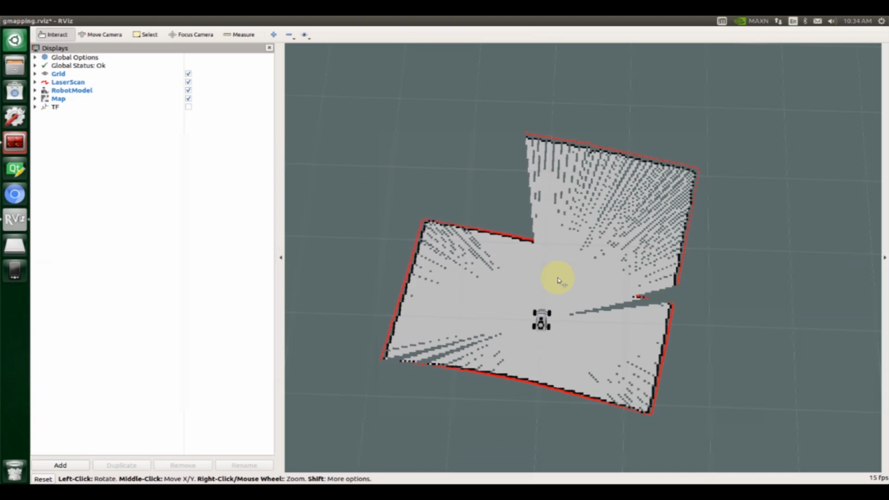

* **Save the Map**

1. Open a new terminal window, enter the command, and press **Enter** to navigate to the folder where the map is stored.

```bash
roscd slam/maps
```

2. Then, enter the command and press **Enter** to save the map.

```bash
rosrun map_server map_saver map:=/robot_1/map -f map_01
```

In the command, **robot_1** is the robot's name, and **map_01** is the map's name. Feel free to rename them as needed. If the following prompt appears, it means the map has been saved successfully.

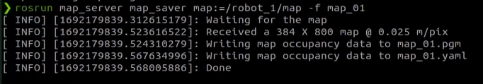

3. To close the currently running program in the terminal window, use the shortcut **Ctrl+C**.

After completing the mapping process, the app service can be started either by using a command or by rebooting the robot. If the app service is not enabled, related features in the app will not function properly. If the robot is rebooted, the app service will start automatically. Enter the command to restart the app service and wait for a beep from the buzzer, indicating that the service has started.

```bash
sudo systemctl restart start_app_node.service
```

* **Optimization**

For more accurate mapping, the odometry can be optimized. Odometry is required for robot mapping, and odometry relies on the IMU.

The robot is preloaded with calibrated IMU data, which allows it to perform mapping and navigation normally. However, the IMU can still be recalibrated to achieve higher precision. For IMU calibration methods and steps, refer to the [2. ROS1- Chassis Motion Control Course](https://wiki.hiwonder.com/projects/ROSOrin/en/jetson-nano-version/docs/2_ROS1_Chassis_Motion_Control_Course.html) file.

#### 5.1.2.3 Specifications

The parameter file can be found at: **slam\\config\\gmapping_params.yaml**.

```yaml
maxUrange: 5.0            # Maximum laser range to consider
maxRange: 12.0            # Full laser range
sigma: 0.05               # Standard deviation
kernelSize: 1             # Kernel size
lstep: 0.05               # Linear step
astep: 0.05               # Angular step
iterations: 1             # Number of iterations
lsigma: 0.075             # Laser standard deviation
ogain: 3.0                # Gain value
lskip: 0                  # Process all laser points; set to 1 if computation heavy
minimumScore: 30          # Minimum matching score
srr: 0.01                 # Motion model error parameter
srt: 0.02                 # Motion model error parameter
str: 0.01                 # Motion model error parameter
stt: 0.02                 # Motion model error parameter
linearUpdate: 0.01        # Scan update after robot moves this linear distance
angularUpdate: 0.1        # Scan update after robot rotates this angle
temporalUpdate: -1.0      # Time-based update
resampleThreshold: 0.5    # Resampling threshold
particles: 100            # Number of particles
xmin: -5.0                # Minimum x-axis value
ymin: -5.0                # Minimum y-axis value
xmax: 5.0                 # Maximum x-axis value
ymax: 5.0                 # Maximum y-axis value
delta: 0.025              # Map resolution
llsamplerange: 0.01       # Linear sampling range
llsamplestep: 0.01        # Linear sampling step
lasamplerange: 0.005      # Angular sampling range
lasamplestep: 0.005       # Angular sampling step
```

For detailed parameter information, refer to the official documentation at: http://wiki.ros.org/gmapping.

#### 5.1.2.4 Launch File Analysis

* **File Paths**

The main launch files involved in mapping are as follows:

1. `slam.launch` – selects the mapping method, located at **/ros_ws/src/slam/launch/slam.launch**.
2. `slam_base.launch` – sets up core topics and starts mapping functions, located at **/ros_ws/src/slam/launch/include/slam_base.launch**.
3. `gmapping.launch` – defines topic settings and parameters for the mapping method, located at **slam/launch/include/gmapping.launch**.

* **Choose a Mapping Method**

```
<arg name="slam_methods" default="gmapping" doc="slam type 
    [gmapping, cartographer, hector, karto, frontier, explore, rrt_exploration, rtabmap]"/>

<arg name="gmapping"        default="gmapping"/>
<arg name="cartographer"    default="cartographer"/>
<arg name="hector"          default="hector"/>
<arg name="karto"           default="karto"/>
<arg name="frontier"        default="frontier"/>
<arg name="explore"         default="explore"/>
<arg name="rrt_exploration" default="rrt_exploration"/>
<arg name="rtabmap"         default="rtabmap"/>
```

Before mapping begins, the mapping method must be selected.

The `slam_methods ` parameter determines the method, defaulting to `gmapping`. Available options include:

Manual mapping: `gmapping`, `cartographer`, `hector`, and `karto`.

Autonomous mapping: `frontier`, `explorer`, and `rt_exploration`.

3D mapping: `rtabmap`.

* **Launch Mapping Functions and Topics**

```
<include file="$(find slam)/launch/include/slam_base.launch">
    <arg name="sim"             value="$(arg sim)"/>
    <arg name="slam_methods"    value="$(arg slam_methods)"/>
    <arg name="robot_name"      value="$(arg robot_name)"/>
</include>
```

Once the `slam_methods` method is selected, **slam_base.launch** starts the mapping functions and configures the required topics.

The `sim` parameter controls whether simulation nodes are used and is false by default. `slam_methods` sets the mapping method for the current session, here set to **gmapping**. `<robot_name>` represents the robot’s node name.

* **Configure Mapping Parameters**

```
<group if="$(eval slam_methods == 'gmapping')">
    <include file="$(find slam)/launch/include/$(arg slam_methods).launch">
        <arg name="scan"        value="$(arg scan_topic)"/>
        <arg name="base_frame"  value="$(arg base_frame)"/>
        <arg name="odom_frame"  value="$(arg odom_frame)"/>
        <arg name="map_frame"   value="$(arg map_frame)"/>
    </include>
</group>
```

`slam_base.launch` also includes the launch files for the selected mapping method. For `gmapping`, parameter configurations are defined in the `gmapping.launch` file at **slam/launch/include/gmapping.launch**.

1\. Topic Parameters

```
<!-- Arguments -->
<arg name="scan"        default="scan"/>
<arg name="base_frame"  default="base_footprint"/>
<arg name="odom_frame"  default="odom"/>
<arg name="map_frame"   default="map"/>
```

`<scan>` specifies the LiDAR scan topic.

`<base_frame>` sets the robot’s base coordinate frame, configured as `base_footprint`.

`<odom_frame>` sets the odometry topic, configured as `odom`.

`<map_frame>` sets the map topic, configured as `map`.

After launching the mapping function, the topics can be checked using rostopic list.

2\. Basic Parameter Configuration File

```
<node pkg="gmapping" type="slam_gmapping" name="slam_gmapping" output="screen">
    <param name="base_frame"    value="$(arg base_frame)"/>
    <param name="odom_frame"    value="$(arg odom_frame)"/>
    <param name="map_frame"     value="$(arg map_frame)"/>
    <remap from="/scan"         to="$(arg scan)"/>
    <rosparam command="load"    file="$(find slam)/config/gmapping_params.yaml" />
</node>
```

In addition to topic settings passed to the Gmapping package, there is a configuration file named `gmapping_params.yaml`. The basic parameter configuration file is located at **slam/config/gmapping_params.yaml**.

```
map_update_interval: 0.2
maxUrange: 5.0            
maxRange: 12.0           
sigma: 0.05                
kernelSize: 1
lstep: 0.05
astep: 0.05
iterations: 1
lsigma: 0.075
ogain: 3.0
lskip: 0
minimumScore: 30   
```

Key parameters to note:

<table  border="1">
  <thead>
    <tr>
      <th>Name</th>
      <th>Function</th>
    </tr>
  </thead>
  <tbody>
    <tr>
      <td>map_update_interval</td>
      <td>Map update rate in seconds. Smaller values increase computational load.</td>
    </tr>
    <tr>
      <td>maxUrange</td>
      <td>Maximum usable detection range, i.e., the distance the laser beam can reach.</td>
    </tr>
    <tr>
      <td>maxRange</td>
      <td>Maximum sensor range. Areas within the sensor range without obstacles are marked as free space on the map.</td>
    </tr>
    <tr>
      <td>sigma</td>
      <td>Method for matching end points.</td>
    </tr>
    <tr>
      <td>lstep</td>
      <td>Translation optimization step size.</td>
    </tr>
    <tr>
      <td>astep</td>
      <td>Rotation optimization step size.</td>
    </tr>
    <tr>
      <td>lsigma</td>
      <td>Laser standard deviation for scan matching probability.</td>
    </tr>
    <tr>
      <td>minimumScore</td>
      <td>Prevents poor matching in large open spaces when using a laser scanner with limited range, ensuring better matching results.</td>
    </tr>
  </tbody>
</table>

```
srr: 0.01
srt: 0.02
str: 0.01
stt: 0.02
```

During robot motion and rotation, several parameters related to the mapping method should be considered.

<table  border="1">
  <thead>
    <tr>
      <th>Name</th>
      <th>Function</th>
    </tr>
  </thead>
  <tbody>
    <tr>
      <td>srr</td>
      <td>Odometry error in translation used as the translation function in radians.</td>
    </tr>
    <tr>
      <td>srt</td>
      <td>Odometry error in translation used as the rotation function in radians.</td>
    </tr>
    <tr>
      <td>str</td>
      <td>Odometry error in rotation used as the translation function in degrees.</td>
    </tr>
    <tr>
      <td>stt</td>
      <td>Odometry error in rotation used as the rotation function in degrees.</td>
    </tr>
  </tbody>
</table>


> [!NOTE]
> 
> **Default values are usually sufficient. Avoid changing these settings individually to ensure stable mapping performance.**


### 5.1.3 Hector Mapping Algorithm

#### 5.1.3.1 Algorithm Concept


Hector SLAM uses the Gauss-Newton method to solve the scan-matching problem, which places high demands on sensors.

Its main advantage is that it does not rely on odometry, making it suitable for drones and ground vehicles operating in uneven environments. The algorithm optimizes laser point clouds using an existing map, estimating the representation of laser points and the probability of occupied grid cells. Gauss-Newton is used to compute the rigid body transformation of the laser points onto the existing map in terms of x, y, and theta. To avoid local minima and achieve better results, multi-resolution maps are employed. State estimation in navigation integrates an inertial measurement unit (IMU) using EKF filtering.

However, Hector SLAM has significant limitations. It requires high-frequency LiDAR updates and low measurement noise. For optimal mapping, the robot should move at relatively low speeds, which is partly why loop closure is not implemented. It can also not effectively utilize odometry data even when it is precise. To address Hector SLAM's high LiDAR frequency requirements, Tucker Robot collaborated with SAIL to launch the RPlidar A1-TK version. This upgraded the data frequency of the widely used A1 LiDAR from 5.5 Hz to 15 Hz, greatly enhancing the performance of Hector and similar mapping algorithms.

The flow of Hector SLAM is illustrated in the diagram below:

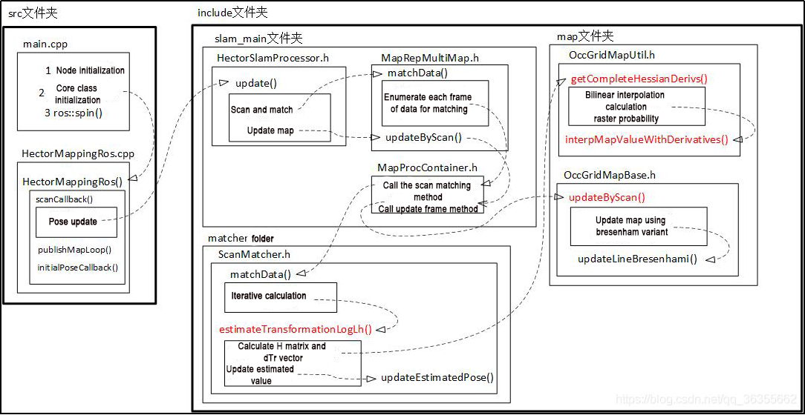

This diagram shows both the algorithm process and the structure of Hector’s source code, which can serve as a reference for understanding and studying the Hector SLAM code.

- **HectorSLAM related source code and WIKI address:**

Hector Mapping ROS Wiki: <http://wiki.ros.org/hector_mapping>

Hector_slam software package: <https://github.com/tu-darmstadt-ros-pkg/hector_slam>


#### 5.1.3.2 Mapping Steps

> [!NOTE]
> 
> **Commands must be entered with correct capitalization. The Tab key can be used to auto-complete keywords.**

* **Enable Service**

1. Power on the robot and connect it via the NoMachine remote control software. For detailed information on connecting to a remote desktop, please refer to section [1.7.2 AP Mode Connection Steps](https://wiki.hiwonder.com/projects/ROSOrin/en/jetson-nano-version/docs/1_ROSOrin_User_Manual.html#ap-mode-connection-steps) in the user manual.

2. Click the terminal icon  in the system desktop to open a command-line window.

3. Enter the following command and press **Enter** to stop the app auto-start service:

```bash
sudo systemctl stop start_app_node.service
```

4. Open a new terminal window, enter the command to start the mapping service, and press **Enter**. If no errors appear, the mapping service has started successfully.

```bash
roslaunch slam slam.launch slam_methods:=hector
```

5. Open a new terminal window, enter the command to launch the model viewer software, and press **Enter**.

```bash
roslaunch slam rviz_slam.launch slam_methods:=hector
```

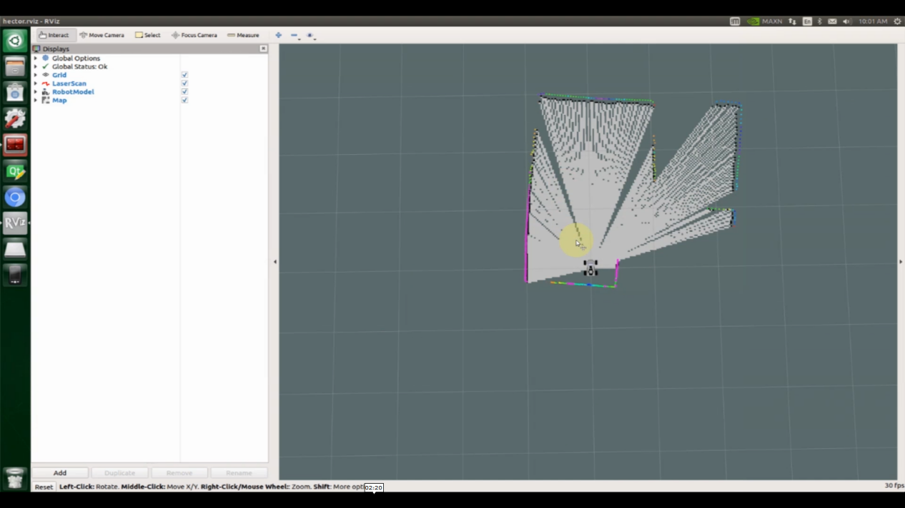

* **Start the Mapping Process**

This section uses keyboard control for mapping. If mapping via the wireless controller is preferred, refer to the section [1.6 Wireless Controller Control](https://wiki.hiwonder.com/projects/ROSOrin/en/jetson-nano-version/docs/1_ROSOrin_User_Manual.html#wireless-controller-control) of the user manual for detailed instructions.

1. Open a new terminal window, enter the command to start the keyboard control service, and press **Enter**.

```bash
roslaunch peripherals teleop_key_control.launch
```

If the prompt shown below appears, the keyboard control service has started successfully.


2) Control the robot to move within the current environment to build a more complete map. The table below shows the keyboard keys and their corresponding functions for controlling the robot's movement during mapping:

<table  border="1">
  <thead>
    <tr>
      <th>Keyboard Key</th>
      <th>Robot Action</th>
    </tr>
  </thead>
  <tbody>
    <tr>
      <td>W</td>
      <td>Short press to switch to forward mode and move continuously forward.</td>
    </tr>
    <tr>
      <td>S</td>
      <td>Short press to switch to backward mode and move continuously backward.</td>
    </tr>
    <tr>
      <td>A</td>
      <td>Long press to interrupt forward or backward motion and turn left.</td>
    </tr>
    <tr>
      <td>D</td>
      <td>Long press to interrupt forward or backward motion and turn right.</td>
    </tr>
  </tbody>
</table>


* **Save the Map**

1. Open a new terminal window, enter the command, and press **Enter** to navigate to the folder where the map is stored.

```bash
roscd slam/maps
```

2. Then, enter the command and press **Enter** to save the map.

```bash
rosrun map_server map_saver map:=/robot_1/map -f map_01
```

In the command, **robot_1** is the robot's name, and **map_01** is the map's name. Feel free to rename them as needed. If the following prompt appears, it means the map has been saved successfully.


3. To close the currently running program in each terminal window, press **Ctrl+C**.

4. Enter the command to enable the app auto-start service.

```bash
sudo systemctl start start_app_node.service
```

After completing the mapping process, the app service can be started either by using a command or by rebooting the robot. If the app service is not enabled, related features in the app will not function properly. If the robot is rebooted, the app service will start automatically. Enter the command to restart the app service and wait for a beep from the buzzer, indicating that the service has started.

```bash
sudo systemctl restart start_app_node.service
```

* **Optimization**

For more accurate mapping, the odometry can be optimized. Odometry is required for robot mapping, and odometry relies on the IMU.

The robot is preloaded with calibrated IMU data, which allows it to perform mapping and navigation normally. However, the IMU can still be recalibrated to achieve higher precision. For IMU calibration methods and steps, refer to the [2. ROS1- Chassis Motion Control Course](https://wiki.hiwonder.com/projects/ROSOrin/en/jetson-nano-version/docs/2_ROS1_Chassis_Motion_Control_Course.html) file.

#### 5.1.3.3 Specifications

Hector mapping algorithm parameters are loaded from the launch files. Details can be found in the next section **Launch File Analysis**.

#### 5.1.3.4 Launch File Analysis

* **File Paths**

The main launch files involved in mapping are as follows:

1. `slam.launch` – selects the mapping method, located at **/ros_ws/src/slam/launch/slam.launch**.
2. `slam_base.launch` – sets up core topics and starts mapping functions, located at **/ros_ws/src/slam/launch/include/slam_base.launch**.
3. `hector.launch` – defines topic settings and parameters for the mapping method, located at **/ros_ws/src/slam/launch/include/hector.launch**.

* **Choose a Mapping Method**

```
<arg name="slam_methods" default="gmapping" doc="slam type 
    [gmapping, cartographer, hector, karto, frontier, explore, rrt_exploration, rtabmap]"/>

<arg name="gmapping"        default="gmapping"/>
<arg name="cartographer"    default="cartographer"/>
<arg name="hector"          default="hector"/>
<arg name="karto"           default="karto"/>
<arg name="frontier"        default="frontier"/>
<arg name="explore"         default="explore"/>
<arg name="rrt_exploration" default="rrt_exploration"/>
<arg name="rtabmap"         default="rtabmap"/>
```

Before mapping begins, the mapping method must be selected.

The `slam_methods ` parameter determines the method, defaulting to `gmapping`. Available options include:

Manual mapping: `gmapping`, `cartographer`, `hector`, and `karto`.

Autonomous mapping: `frontier`, `explorer`, and `rt_exploration`.

3D mapping: `rtabmap`.

* **Launch Mapping Functions and Topics**

```
<include file="$(find slam)/launch/include/slam_base.launch">
    <arg name="sim"             value="$(arg sim)"/>
    <arg name="slam_methods"    value="$(arg slam_methods)"/>
    <arg name="robot_name"      value="$(arg robot_name)"/>
</include>
```

Once the slam_methods method is selected, `slam_base.launch` starts the mapping functions and configures the required topics.

The `sim` parameter indicates whether to use simulation, with the default setting not launching simulation nodes. The `slam_methods` parameter specifies the mapping algorithm and should be set to **hector**. `<robot_name>` represents the node name of the robot.

* **Configure Mapping Parameters**

```
<group if="$(eval slam_methods == 'hector')">
    <include file="$(find slam)/launch/include/$(arg slam_methods).launch">
        <arg name="scan_topic"  value="$(arg scan_topic)"/>
        <arg name="map_frame"   value="$(arg map_frame)"/>
        <arg name="base_frame"  value="$(arg base_frame)"/>
        <arg name="odom_frame"  value="$(arg base_frame)"/>
    </include>
</group>
```

`slam_base.launch` also includes the launch files for the selected mapping method. For hector, parameter configurations are defined in the `hector.launch` file at **slam/launch/include/hector.launch**.

1\. Topic Parameters

```
<arg name="tf_map_scanmatch_transform_frame_name" default="scanmatch_frame"/>
<arg name="base_frame"                  default="base_footprint"/>
<arg name="odom_frame"                  default="odom"/>
<arg name="map_frame"                   default="map_frame"/>
<arg name="pub_map_odom_transform"      default="true"/>
<arg name="scan_subscriber_queue_size"  default="5"/>
<arg name="scan_topic"                  default="scan"/>
<arg name="map_size"                    default="1024"/>
```

The `<tf_map_scanmath_transform_frame_name>` parameter specifies the TF topic name for the transformation between the map coordinate frame and the laser scan frame and should be set to `scanmath_frame`.

`<base_frame>` sets the robot’s base coordinate frame, configured as `base_footprint`.

`<odom_frame>` sets the odometry topic, configured as `odom`.

`<map_frame>` sets the map topic, configured as `map`.

After launching the mapping function, the topics can be checked using `rostopic list`.

2\. Basic Parameter Configuration File

Unlike Gmapping, Hector SLAM configures parameters directly in the `hector.launch` file rather than using a `yaml` file. The main parameter settings for Hector SLAM mapping is as follows:

```
<!-- Frame names -->
<param name="map_frame"     value="$(arg map_frame)" />
<param name="base_frame"    value="$(arg base_frame)" />
<param name="odom_frame"    value="$(arg odom_frame)" />

<!-- Tf use -->
<param name="use_tf_scan_transformation"    value="true"/>
<param name="use_tf_pose_start_estimate"    value="false"/>
<param name="pub_map_scanmatch_transform"   value="true"/>
<param name="pub_map_odom_transform"        value="$(arg pub_map_odom_transform)"/>
```

Topic names for the relevant coordinate frames and the TF transformation logic need to be set. For this mapping method, TF transformation of laser scan data is enabled by setting `<use_tf_scan_transformation>` to true, allowing the scan data to be interpreted as robot movement distance and direction during the mapping process.

```
<!-- Map size / start point -->
<param name="map_pub_period"        value="0.5"/>
<param name="map_resolution"        value="0.05"/>
<param name="map_size"              value="$(arg map_size)"/>
<param name="map_start_x"           value="0.5"/>
<param name="map_start_y"           value="0.5"/>
<param name="map_multi_res_levels"  value="2"/>
```

Map message parameters also need to be set.

<table  border="1">
  <thead>
    <tr>
      <th>Name</th>
      <th>Function</th>
    </tr>
  </thead>
  <tbody>
    <tr>
      <td>map_pub_period</td>
      <td>Map publishing period.</td>
    </tr>
    <tr>
      <td>map_resolution</td>
      <td>Map resolution in meters, representing the length of each grid cell edge.</td>
    </tr>
    <tr>
      <td>map_size</td>
      <td>Map dimensions</td>
    </tr>
    <tr>
      <td>map_start_x</td>
      <td>X position of the map topic origin, 0.5 represents the center.</td>
    </tr>
    <tr>
      <td>map_start_y</td>
      <td>Y position of the map topic origin, 0.5 represents the center.</td>
    </tr>
    <tr>
      <td>map_multi_res_levels</td>
      <td>Number of multi-resolution grid levels in the map.</td>
    </tr>
  </tbody>
</table>

```
<!-- Map update parameters -->
<param name="update_factor_free"            value="0.4"/>
<param name="update_factor_occupied"        value="0.9"/>
<param name="map_update_distance_thresh"    value="0.1"/>
<param name="map_update_angle_thresh"       value="0.06"/>
<param name="laser_z_min_value"             value="-0.1"/>
<param name="laser_z_max_value"             value="0.2"/>
<param name="laser_min_dist"                value="0.15"/>
<param name="laser_max_dist"                value="12"/>
```

After defining the basic logical points and size of the map, the update parameters for the scanned map also need to be configured. As shown above, the main parameters to pay attention to are four:

`<laser_z_min_value>`: minimum height of the laser scan in meters. Scan points below this value are ignored.

`<laser_z_max_value>`: maximum height of the laser scan in meters. Scan points above this value are ignored.

`<laser_min_dist>`: minimum distance of the laser scan in meters. Scan points closer than this distance are ignored.

`<laser_max_dist>`: maximum distance of the laser scan in meters. Scan points farther than this distance are ignored.

During mapping with Hector SLAM, the quality of the map can be adjusted by modifying these four parameters. Adjusting them appropriately controls the scanning range of the laser to achieve more accurate mapping. The default values provided by the factory are optimized for good results and can generally be kept as is.

> [!NOTE]
> 
> * **Default values are usually sufficient. Avoid changing these settings individually to ensure stable mapping performance.**
> 
> * **For more details, please refer to the official website: http://wiki.ros.org/hector_mapping.**


### 5.1.4 Karto Mapping Algorithm

#### 5.1.4.1 Algorithm Concept

Karto_SLAM is based on the concept of graph optimization, using highly optimized and non-iterative Cholesky decomposition to decouple sparse systems as a solution. The graph optimization method represents the map using the mean of the graph, where each node represents a position point in the robot's trajectory and a set of sensor measurements. Each new node added triggers a computational update.

The ROS version of Karto_SLAM employs Sparse Pose Adjustment (SPA) related to scan matching and loop closure detection. The more landmarks there are, the higher the memory requirement. However, compared to other methods, the graph optimization approach has greater advantages in large environments because it only includes the robot pose in the graph. After obtaining the poses, the map is generated.

Karto SLAM algorithm framework:


As shown in the figure above, the workflow of Karto SLAM is relatively straightforward. It follows the traditional soft real-time mechanism of SLAM: each incoming frame of data is processed immediately and then returned.


**KartoSLAM related source code and WIKI address:**

**KartoSLAM ROS Wiki: <http://wiki.ros.org/slam_karto>**

**slam_karto software package: <https://github.com/ros-perception/slam_karto>**

**open_karto Open-Source Algorithm: <https://github.com/ros-perception/open_karto>**

#### 5.1.4.2 Mapping Steps

> [!NOTE]
> 
> **Commands must be entered with correct capitalization. The Tab key can be used to auto-complete keywords.**

* **Enable Service**

1. Power on the robot and connect it via the NoMachine remote control software. For detailed information on connecting to a remote desktop, please refer to section [1.7.2 AP Mode Connection Steps](https://wiki.hiwonder.com/projects/ROSOrin/en/jetson-nano-version/docs/1_ROSOrin_User_Manual.html#ap-mode-connection-steps) in the user manual.

2. Click the terminal icon  in the system desktop to open a command-line window.

3. Enter the following command and press **Enter** to stop the app auto-start service:

```bash
sudo systemctl stop start_app_node.service
```

4. Open a new terminal window, enter the command to start the mapping service, and press **Enter**. If no errors appear, the mapping service has started successfully.

```bash
roslaunch slam slam.launch slam_methods:=karto
```

5. Open a new terminal window, enter the command to launch the model viewer software, and press **Enter**.

```bash
roslaunch slam rviz_slam.launch slam_methods:=karto
```


* **Start the Mapping Process**

1. If mapping via the wireless controller is preferred, refer to the section [1.6 Wireless Controller Control](https://wiki.hiwonder.com/projects/ROSOrin/en/jetson-nano-version/docs/1_ROSOrin_User_Manual.html#wireless-controller-control) of the user manual for detailed instructions.

2. Open a new terminal window, enter the command to start the keyboard control service, and press **Enter**.

```bash
roslaunch peripherals teleop_key_control.launch
```

If the prompt shown below appears, the keyboard control service has started successfully.


3. Control the robot to move within the current environment to build a more complete map. The table below shows the keyboard keys and their corresponding functions for controlling the robot's movement during mapping:

<table border="1">
  <thead>
    <tr>
      <th>Keyboard Key</th>
      <th>Robot Action</th>
    </tr>
  </thead>
  <tbody>
    <tr>
      <td>W</td>
      <td>Short press to switch to forward mode and move continuously forward.</td>
    </tr>
    <tr>
      <td>S</td>
      <td>Short press to switch to backward mode and move continuously backward.</td>
    </tr>
    <tr>
      <td>A</td>
      <td>Long press to interrupt forward or backward motion and turn left.</td>
    </tr>
    <tr>
      <td>D</td>
      <td>Long press to interrupt forward or backward motion and turn right.</td>
    </tr>
  </tbody>
</table>


* **Save the Map**

1. Open a new terminal window, enter the command, and press **Enter** to navigate to the folder where the map is stored.

```bash
roscd slam/maps
```

2. Then, enter the command and press **Enter** to save the map.

```bash
rosrun map_server map_saver map:=/robot_1/map -f map_01
```

In the command, **robot_1** is the robot's name, and **map_01** is the map's name. Feel free to rename them as needed. If the following prompt appears, it means the map has been saved successfully.


3. To close the currently running program in each terminal window, press **Ctrl+C**.

4. Enter the command to enable the app auto-start service.

```bash
sudo systemctl start start_app_node.service
```

After completing the mapping process, the app service can be started either by using a command or by rebooting the robot. If the app service is not enabled, related features in the app will not function properly. If the robot is rebooted, the app service will start automatically. Enter the command to restart the app service and wait for a beep from the buzzer, indicating that the service has started.

```bash
sudo systemctl restart start_app_node.service
```

* **Optimization**

For more accurate mapping, the odometry can be optimized. Odometry is required for robot mapping, and odometry relies on the IMU.

The robot is preloaded with calibrated IMU data, which allows it to perform mapping and navigation normally. However, the IMU can still be recalibrated to achieve higher precision. For IMU calibration methods and steps, refer to the [2. ROS1- Chassis Motion Control Course](https://wiki.hiwonder.com/projects/ROSOrin/en/jetson-nano-version/docs/2_ROS1_Chassis_Motion_Control_Course.html) file.

#### 5.1.4.3 Launch File Analysis

* **File Paths**

The main launch files involved in mapping are as follows:

1. `slam.launch` – selects the mapping method, located at **/ros_ws/src/slam/launch/slam.launch**.
2. `slam_base.launch` – sets up core topics and starts mapping functions, located at **/ros_ws/src/slam/launch/include/slam_base.launch**.
3. `karto.launch` – defines topic settings and parameters for the mapping method, located at **/ros_ws/src/slam/launch/include/karto.launch**.

* **Choose a Mapping Method**

```
<arg name="slam_methods" default="gmapping" doc="slam type 
    [gmapping, cartographer, hector, karto, frontier, explore, rrt_exploration, rtabmap]"/>

<arg name="gmapping"        default="gmapping"/>
<arg name="cartographer"    default="cartographer"/>
<arg name="hector"          default="hector"/>
<arg name="karto"           default="karto"/>
<arg name="frontier"        default="frontier"/>
<arg name="explore"         default="explore"/>
<arg name="rrt_exploration" default="rrt_exploration"/>
<arg name="rtabmap"         default="rtabmap"/>
```

Before mapping begins, the mapping method must be selected.

The `slam_methods ` parameter determines the method, defaulting to `gmapping`. Available options include:

Manual mapping: `gmapping`, `cartographer`, `hector`, and `karto`.

Autonomous mapping: `frontier`, `explorer`, and `rt_exploration`.

3D mapping: `rtabmap`.

* **Launch Mapping Functions and Topics**

```
<include file="$(find slam)/launch/include/slam_base.launch">
    <arg name="sim"             value="$(arg sim)"/>
    <arg name="slam_methods"    value="$(arg slam_methods)"/>
    <arg name="robot_name"      value="$(arg robot_name)"/>
</include>
```

Once the `slam_methods` method is selected, `slam_base.launch` starts the mapping functions and configures the required topics.

The `sim` parameter indicates whether to use simulation, with the default setting not launching simulation nodes. The `slam_methods` parameter specifies the mapping algorithm and should be set to **karto**. `robot_name` represents the node name of the robot.

* **Configure Mapping Parameters**

```
<group if="$(eval slam_methods == 'karto')">
    <include file="$(find slam)/launch/include/$(arg slam_methods).launch">
        <arg name="map_frame"   value="$(arg map_frame)"/>
        <arg name="base_frame"  value="$(arg base_frame)"/>
        <arg name="odom_frame"  value="$(arg odom_frame)"/>
    </include>
</group>
```

`slam_base.launch` also includes the launch files for the selected mapping method. For **karto**, parameter configurations are defined in the `karto.launch` file at **/ros_ws/src/slam/launch/include/karto.launch**.

The karto.launch file mainly includes the following settings:

```
<arg name="map_frame"  default="map"/>
<arg name="odom_frame" default="odom"/>
<arg name="base_frame" default="base_footprint"/>
```

`<map_frame>` sets the map topic, configured as `map`.

`<odom_frame>` sets the odometry topic, configured as `odom`.

`<base_frame>` sets the robot’s base coordinate frame, configured as `base_footprint`.

```
<node pkg="slam_karto" type="slam_karto" name="slam_karto" output="screen">
    <param name="map_frame"             value="$(arg map_frame)"/>
    <param name="odom_frame"            value="$(arg odom_frame)"/>
    <param name="base_frame"            value="$(arg base_frame)"/>
    <param name="map_update_interval"   value="5"/>
    <param name="resolution"            value="0.05"/>
</node>
```

The following two parameters should be noted:

`<map_update_interval>`: Frequency at which the map is updated, in milliseconds. A value of 5 means 5 ms.

`<resolution>`: Map resolution.

These two parameters can be adjusted during mapping. However, they have already been fine-tuned before the robot leaves the factory to ensure precise mapping, so it is recommended to keep the default values.

> [!NOTE]
> 
> * **Default values are usually sufficient. Avoid changing these settings individually to ensure stable mapping performance.**
> 
> * **For detailed parameter information, refer to the official documentation at: http://wiki.ros.org/slam_karto.**


### 5.1.5 Cartographer Mapping Algorithm

#### 5.1.5.1 Algorithm Concept

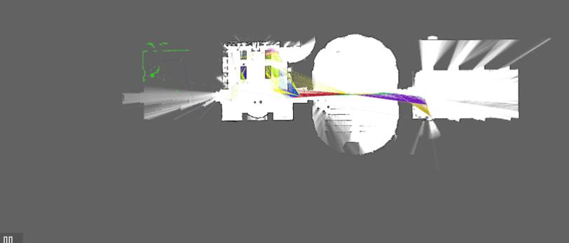

The core principle of Cartographer is to eliminate cumulative errors that occur during mapping through loop closure detection. The fundamental unit used for loop closure is the `submap`. A `submap` consists of a certain number of `laser scan`. When a `laser scan` is inserted into its corresponding `submap`, its optimal position within the `submap` is estimated based on the existing `laser scan` in the `submap` and other sensor data. The error accumulation during the creation of the `submap` is considered negligible over a short period. However, as more `submap` are generated over time, the accumulated error between the `submap` increases. To correct this, loop closure detection is used to optimize the poses of these `submap`, effectively turning the problem into a pose optimization task. Once a `submap` is complete—meaning no new `laser scan` will be added—it becomes part of the loop closure process.`submap``submap` The loop closure considers all fully constructed `submap`. When a new `laser scan` is added to the map, if its estimated pose is close to that of a `laser scan` within an existing `submap`, a scan matching strategy is used to detect a loop.`laser scan` In Cartographer, this scan matching strategy examines a window around the estimated pose of the new `laser scan` and searches for a possible match within that window. If a sufficiently good match is found, the corresponding loop closure constraint is added to the pose optimization problem.`laser scan` The key aspects of Cartographer lie in the creation of local `submap` that fuse multi-sensor data and the implementation of the scan matching strategy used for loop closure detection.

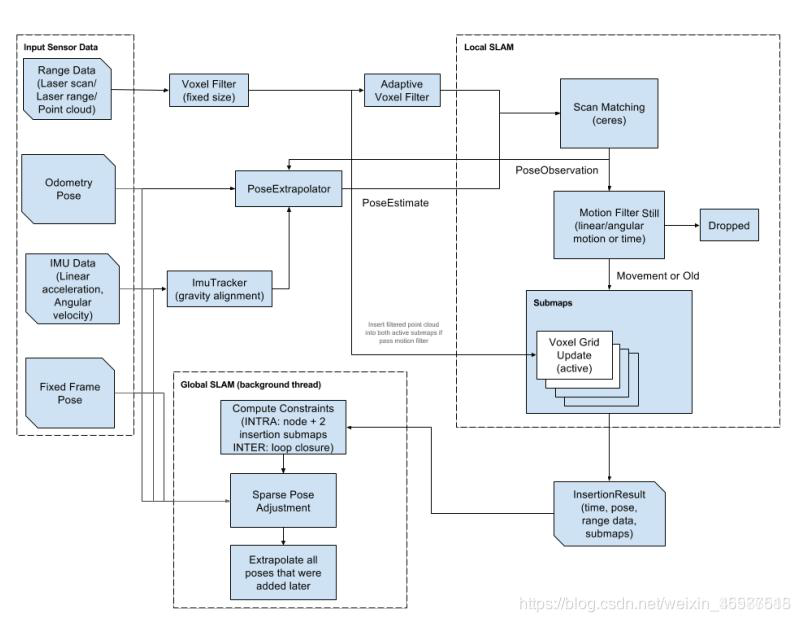

Cartographer can be divided into two main parts:

Local SLAM, also known as the Frontend: This part is primarily responsible for creating and maintaining `submap`s. However, the challenge is that the mapping errors in this part accumulate over time. The parameters related to this part are defined in:

**/src/cartographer/configuration_files/trajectory_builder_2d.lua** and **/src/cartographer/configuration_files/trajectory_builder_3d.lua**.


Global SLAM, also known as the Backend: The main task of this part is to perform Loop Closure. As mentioned earlier, loop closure is essentially an optimization problem, and it is expressed as a pixel-accurate match in the paper. The Branch-and-Bound Approach (BBA) method is used to solve it. For more details on how the Branch-and-Bound method is used, refer to the paper Real-Time Loop Closure in 2D LIDAR SLAM. In the 3D case, this part also determines the gravity direction based on IMU data.

In summary, the Local SLAM part is responsible for generating high-quality submaps, while the Global SLAM part performs global optimization to tie the submaps together with the best matching poses.

From the sensor data perspective, the laser data undergoes two filtering stages before Scan Matching, which is used to build `submap`. When new `laser scan` come in, they are inserted into the appropriate positions in the already maintained submaps. The optimal pose for insertion is determined using Ceres Scan Matching. The estimated optimal pose is then fused with odometry and IMU data to estimate the pose for the next moment.

For more information on the Cartographer package: <https://github.com/cartographer-project/cartographer>

#### 5.1.5.2 Mapping Steps

> [!NOTE]
> 
> **Commands must be entered with correct capitalization. The Tab key can be used to auto-complete keywords.**

* **Enable Service**

1. Power on the robot and connect it via the NoMachine remote control software. For detailed information on connecting to a remote desktop, please refer to section [1.7.2 AP Mode Connection Steps](https://wiki.hiwonder.com/projects/ROSOrin/en/jetson-nano-version/docs/1_ROSOrin_User_Manual.html#ap-mode-connection-steps) in the user manual.

2. Click the terminal icon  in the system desktop to open a command-line window.

3. Enter the following command and press **Enter** to stop the app auto-start service:

```bash
sudo systemctl stop start_app_node.service
```

4. Open a new terminal window, enter the command to start the mapping service, and press **Enter**. If no errors appear, the mapping service has started successfully.

```bash
roslaunch slam slam.launch slam_methods:=cartographer
```

5. Open a new terminal window, enter the command to launch the model viewer software, and press **Enter**.

```bash
roslaunch slam rviz_slam.launch slam_methods:=cartographer
```

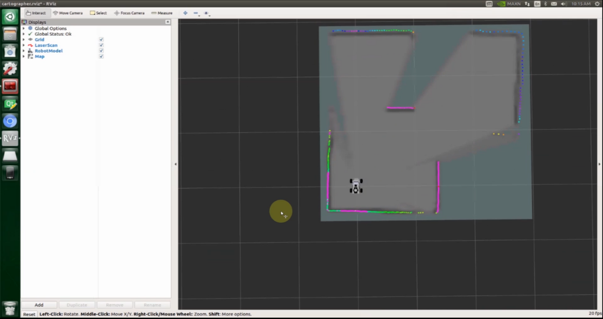

* **Start the Mapping Process**

If mapping via the wireless controller is preferred, refer to the section [1.6 Wireless Controller Control](https://wiki.hiwonder.com/projects/ROSOrin/en/jetson-nano-version/docs/1_ROSOrin_User_Manual.html#wireless-controller-control) of the user manual for detailed instructions.

1. Open a new terminal window, enter the command to start the keyboard control service, and press **Enter**.

```bash
roslaunch peripherals teleop_key_control.launch
```

If the prompt shown below appears, the keyboard control service has started successfully.


2. Control the robot to move within the current environment to build a more complete map. The table below shows the keyboard keys and their corresponding functions for controlling the robot's movement during mapping:

<table border="1">
  <thead>
    <tr>
      <th>Keyboard Key</th>
      <th>Robot Action</th>
    </tr>
  </thead>
  <tbody>
    <tr>
      <td>W</td>
      <td>Short press to switch to forward mode and move forward continuously.</td>
    </tr>
    <tr>
      <td>S</td>
      <td>Short press to switch to backward mode and move backward continuously.</td>
    </tr>
    <tr>
      <td>A</td>
      <td>Long press to interrupt forward or backward motion and turn left.</td>
    </tr>
    <tr>
      <td>D</td>
      <td>Long press to interrupt forward or backward motion and turn right.</td>
    </tr>
  </tbody>
</table>

* **Save the Map**

1. Open a new terminal window, enter the command, and press **Enter** to navigate to the folder where the map is stored.

```
roscd slam/maps
```

2. Then, enter the command and press **Enter** to save the map.

```
rosrun map_server map_saver map:=/robot_1/map -f map_01
```

In the command, **robot_1** is the robot's name, and **map_01** is the map's name. Feel free to rename them as needed. If the following prompt appears, it means the map has been saved successfully.


3. To close the currently running program in each terminal window, press **Ctrl+C**.

4. Enter the command to enable the app auto-start service.

```bash
sudo systemctl start start_app_node.service
```

After completing the mapping process, the app service can be started either by using a command or by rebooting the robot. If the app service is not enabled, related features in the app will not function properly. If the robot is rebooted, the app service will start automatically. Enter the command to restart the app service and wait for a beep from the buzzer, indicating that the service has started.

```bash
sudo systemctl restart start_app_node.service
```

* **Optimization**

For more accurate mapping, the odometry can be optimized. Odometry is required for robot mapping, and odometry relies on the IMU.

The robot is preloaded with calibrated IMU data, which allows it to perform mapping and navigation normally. However, the IMU can still be recalibrated to achieve higher precision. For IMU calibration methods and steps, refer to the [2. ROS1- Chassis Motion Control Course](https://wiki.hiwonder.com/projects/ROSOrin/en/jetson-nano-version/docs/2_ROS1_Chassis_Motion_Control_Course.html) file.

#### 5.1.5.3 Specifications

The parameter file can be found at: **/ros_ws/src/slam/config/cartographer_params.lua**.

```yaml
master_name = os.getenv("MASTER")       -- Get the value of the system environment variable "MASTER"
robot_name = os.getenv("HOST")          -- Get the value of the system environment variable "HOST"
prefix = os.getenv("prefix")            -- Get the value of the system environment variable "prefix"
MAP_FRAME = "map"                        -- Default name of the map frame
ODOM_FRAME = "odom"                      -- Default name of the odometry frame
BASE_FRAME = "base_footprint"            -- Default name of the base frame

if(prefix ~= "/") then
    MAP_FRAME = master_name .. "/" .. MAP_FRAME
    ODOM_FRAME = robot_name .. "/" .. ODOM_FRAME
    BASE_FRAME = robot_name .. "/" .. BASE_FRAME
end

options = {
  map_builder = MAP_BUILDER,                  -- Configuration from map_builder.lua
  trajectory_builder = TRAJECTORY_BUILDER,    -- Configuration from trajectory_builder.lua
  map_frame = MAP_FRAME,                       -- Name of the map coordinate frame
  tracking_frame = BASE_FRAME,                 -- Frame to which all sensor data will be transformed
  published_frame = ODOM_FRAME,                -- TF frame published for map -> odom
  odom_frame = ODOM_FRAME,                     -- Name of the odometry coordinate frame
  provide_odom_frame = false,                  -- Whether to provide odom TF
  publish_frame_projected_to_2d = false,       -- Whether to project the published frame to 2D

  use_odometry = true,                         -- Whether to use odometry
  use_nav_sat = false,                         -- Whether to use GPS
  use_landmarks = false,                       -- Whether to use landmarks
  num_laser_scans = 1,                         -- Number of single-line laser scans
  num_multi_echo_laser_scans = 0,              -- Number of multi-echo laser scans
  num_subdivisions_per_laser_scan = 1,        -- Number of subdivisions per laser scan
  num_point_clouds = 0,                        -- Number of point cloud inputs

  lookup_transform_timeout_sec = 0.2,          -- Timeout for looking up transforms
  submap_publish_period_sec = 0.3,            -- Interval for publishing submaps
  pose_publish_period_sec = 5e-3,             -- Interval for publishing poses
  trajectory_publish_period_sec = 30e-3,      -- Interval for publishing trajectories

  rangefinder_sampling_ratio = 1.,            -- Sampling ratio for rangefinder data
  odometry_sampling_ratio = 1.,               -- Sampling ratio for odometry data
  fixed_frame_pose_sampling_ratio = 1.,       -- Sampling ratio for fixed frame poses
  imu_sampling_ratio = 1.,                    -- Sampling ratio for IMU data
  landmarks_sampling_ratio = 1.,              -- Sampling ratio for landmarks data
}

MAP_BUILDER.use_trajectory_builder_2d = true  -- Enable 2D trajectory builder and related parameters
```

Cartographer offers a wide range of configurable parameters, and listing them all here would be impractical. For a detailed study of the Cartographer algorithm, please refer to the official documentation through the following link:

Cartographer Github:https://github.com/cartographer-project/cartographer

#### 5.1.5.4 Launch File Analysis

* **File Paths**

The main launch files involved in mapping are as follows:

1. `slam.launch` – selects the mapping method, located at **/ros_ws/src/slam/launch/slam.launch**.
2. `slam_base.launch` – sets up core topics and starts mapping functions, located at **/ros_ws/src/slam/launch/include/slam_base.launch**.
3. `cartographer.launch` – defines topic settings and parameters for the mapping method, located at **slam/launch/include/cartographer.launch**.

* **Choose a Mapping Method**

```
<include file="$(find slam)/launch/include/slam_base.launch">
    <arg name="sim"             value="$(arg sim)"/>
    <arg name="slam_methods"    value="$(arg slam_methods)"/>
    <arg name="robot_name"      value="$(arg robot_name)"/>
</include>
```

Before mapping begins, the mapping method must be selected.

The `slam_methods` parameter determines the method, defaulting to `gmapping`. Available options include:

Manual mapping: `gmapping`, `cartographer`, `hector`, and `karto`.

Autonomous mapping: `frontier`, `explorer`, and `rt_exploration`.

3D mapping: `rtabmap`.

* **Launch Mapping Functions and Topics**

```
<include file="$(find slam)/launch/include/slam_base.launch">
    <arg name="sim"             value="$(arg sim)"/>
    <arg name="slam_methods"    value="$(arg slam_methods)"/>
    <arg name="robot_name"      value="$(arg robot_name)"/>
</include>
```

Once the `slam_methods` method is selected, `slam_base.launch` starts the mapping functions and configures the required topics.

The `sim` indicates whether to use simulation, with the default setting being no simulation. `slam_methods` refers to the mapping method, which is set to **cartographer** for this mapping task. `robot_name` represents the name of the robot node.

* **Configure Mapping Parameters**

```
<group if="$(eval slam_methods == 'cartographer')">
    <include file="$(find slam)/launch/include/$(arg slam_methods).launch">
        <arg name="sim"        value="$(arg sim)"/>
        <arg name="prefix"     value="$(arg robot_name)"/>
    </include>
</group>
```

`slam_base.launch` also includes the launch files for the selected mapping method. For the **cartographer**, parameter configurations are defined in the `cartographer.launch` file at **slam/launch/include/cartographer.launch**.

The cartographer.launch file mainly includes the following settings:

```
<arg name="sim"             default="false"/>
<param name="/use_sim_time" value="$(arg sim)"/>
<arg name="prefix"          default=""/>
<env name="prefix"          value="$(arg prefix)"/>
```

`<sim>` specifies whether to enable simulation, and is set to `false`.

`<prefix>` is the default prefix for the environment, set to an empty value.

In the Cartographer mapping method, parameter configuration for the mapping method is done using the `cartographer_params.lua` configuration file, located at **slam/config/cartographer_params.lua**.

Here is an analysis of the main contents of the parameter configuration file:

```
map_frame = MAP_FRAME,        
tracking_frame = BASE_FRAME,  
published_frame = ODOM_FRAME, 
odom_frame = ODOM_FRAME,     
provide_odom_frame = false, 
```

It includes basic coordinate system configurations, used for exchanging node information between various sensors and coordinates during the mapping process. For specific explanations of the parameters, refer to the comments in the later sections of the file.

```
use_odometry = true,                    
use_nav_sat = false,                     
use_landmarks = false,                   
num_laser_scans = 1,                      
num_multi_echo_laser_scans = 0,           
num_subdivisions_per_laser_scan = 1, 
num_point_clouds = 0,     
```

Some parameters involve the logical setup for `odom`, `gps`, and `landmarks`, as well as the logical configuration for laser scan segmentation `subdivisions_per_laser_scan` and point cloud data `point_clouds`. Again, for specific explanations, refer to the comments later in the file.

```
rangefinder_sampling_ratio = 1.,  
odometry_sampling_ratio = 0.1,
fixed_frame_pose_sampling_ratio = 1.,
imu_sampling_ratio = 0.1,
landmarks_sampling_ratio = 1.,
```

`<rangefinder_sampling_ration>`: The sampling frequency of the range sensor. If range sensors are used in the Cartographer mapping algorithm, this parameter can be set to control the sampling rate. The default value is 1. If the feature is not used, this setting is ineffective, and it should be left at the default of 1.

`<odometry_sampling_ratio>`: The sampling frequency for odometry.

`<fixed_frame_pose_sampling_ratio>`: The sampling frequency for the fixed frame position.

`<imu_sampling_ratio>`: The sampling frequency for the IMU.

`<landmarks_sampling_ratio>`: The sampling frequency for landmarks. Since landmarks are set to be unused earlier, this setting is ineffective, but keeping it enabled does not affect the actual mapping results.

```
TRAJECTORY_BUILDER_2D.`submap`s.num_range_data = 35
TRAJECTORY_BUILDER_2D.min_range = 0.15
TRAJECTORY_BUILDER_2D.max_range = 3.5
TRAJECTORY_BUILDER_2D.use_imu_data = false
TRAJECTORY_BUILDER_2D.missing_data_ray_length = 3.
TRAJECTORY_BUILDER_2D.voxel_filter_size = 0.025
TRAJECTORY_BUILDER_2D.use_online_correlative_scan_matching = true
TRAJECTORY_BUILDER_2D.motion_filter.max_angle_radians = math.rad(0.1)
TRAJECTORY_BUILDER_2D.real_time_correlative_scan_matcher.linear_search_window = 0.1
TRAJECTORY_BUILDER_2D.real_time_correlative_scan_matcher.translation_delta_cost_weight = 10.
TRAJECTORY_BUILDER_2D.real_time_correlative_scan_matcher.rotation_delta_cost_weight = 1e-1
```

`TRAJECTORY_BUILDER_2D` is a class in the Cartographer mapping algorithm that includes logic settings for parameters and methods for obtaining parameters.

<table border="1">
  <thead>
    <tr>
      <th>Name</th>
      <th>Function</th>
    </tr>
  </thead>
  <tbody>
    <tr>
      <td>num_range_data</td>
      <td>Data range for submap layer.</td>
    </tr>
    <tr>
      <td>use_imu_data</td>
      <td>Enable IMU data usage.</td>
    </tr>
    <tr>
      <td>min_range</td>
      <td>Minimum laser range.</td>
    </tr>
    <tr>
      <td>max_range</td>
      <td>Maximum laser range.</td>
    </tr>
    <tr>
      <td>min_z</td>
      <td>Minimum height scanned by LiDAR.</td>
    </tr>
    <tr>
      <td>max_z</td>
      <td>Maximum height scanned by LiDAR.</td>
    </tr>
    <tr>
      <td>missing_data_ray_length</td>
      <td>Default value assigned when data is outside the min and max range.</td>
    </tr>
    <tr>
      <td>use_online_correlative_scan_matching</td>
      <td>Enable CSM laser scan matching.</td>
    </tr>
  </tbody>
</table>


It also includes another class `real_time_correlative_scan_matcher `:

<table border="1">
  <thead>
    <tr>
      <th>Name</th>
      <th>Function</th>
    </tr>
  </thead>
  <tbody>
    <tr>
      <td>linear_search_window</td>
      <td>Angular search range.</td>
    </tr>
    <tr>
      <td>translation_delta_cost_weight</td>
      <td>Weight for translation cost. The farther from the initial value, the higher the matching score needed to be trusted. Serves as a parameter limit.</td>
    </tr>
    <tr>
      <td>rotation_delta_cost_weight</td>
      <td>Weight for rotation cost.</td>
    </tr>
  </tbody>
</table>


> [!NOTE]
>
> **Default values are usually sufficient. Avoid changing these settings individually to ensure stable mapping performance.**


### 5.1.6 Frontier Autonomous Mapping

#### 5.1.6.1 Algorithm Concept

Frontier autonomous mapping refers to an approach based on the Gmapping mapping algorithm, which adds functionalities such as mapping navigation, path planning, and obstacle avoidance. This allows the robot to autonomously move to a specified target point and build the map during the process, without any manual control via a wireless controller or a keyboard.

The implementation of Frontier autonomous mapping can be divided into two parts: one is the mapping algorithm, and the other is the navigation system.

The available mapping algorithms include Gmapping, Hector, Karto, and Cartographer. In this section, the Gmapping algorithm is used.

Navigation refers to the process of setting one or more target points for the robot. The robot then automatically completes path planning and begins moving towards the target. If the robot encounters an obstacle during the movement, it will update its path through a local optimizer to avoid the obstacle.


The frontier_exploration Software Package:<https://github.com/paulbovbel/frontier_exploration>

#### 5.1.6.2 Mapping Steps

> [!NOTE]
>
> * **Before starting, please set up a closed environment and place the robot inside. Ensure that the environment is fully enclosed!**
>
> * **Commands must be entered with correct capitalization. The Tab key can be used to auto-complete keywords.**

* **Start the Mapping Process**

1. Power on the robot and connect it via the NoMachine remote control software. For detailed information on connecting to a remote desktop, please refer to section [1.7.2 AP Mode Connection Steps](https://wiki.hiwonder.com/projects/ROSOrin/en/jetson-nano-version/docs/1_ROSOrin_User_Manual.html#ap-mode-connection-steps) in the user manual.

2. Click the terminal icon  in the system desktop to open a command-line window.

3. Enter the following command and press **Enter** to stop the app auto-start service:

```bash
sudo systemctl stop start_app_node.service
```

4. Open a new terminal window, enter the command to start the mapping service, and press **Enter**. If no errors appear, the mapping service has started successfully.

```bash
roslaunch slam slam.launch slam_methods:=frontier
```

5. Open a new terminal window, enter the command to launch the model viewer software, and press **Enter**.

```bash
roslaunch slam rviz_slam.launch slam_methods:=frontier
```

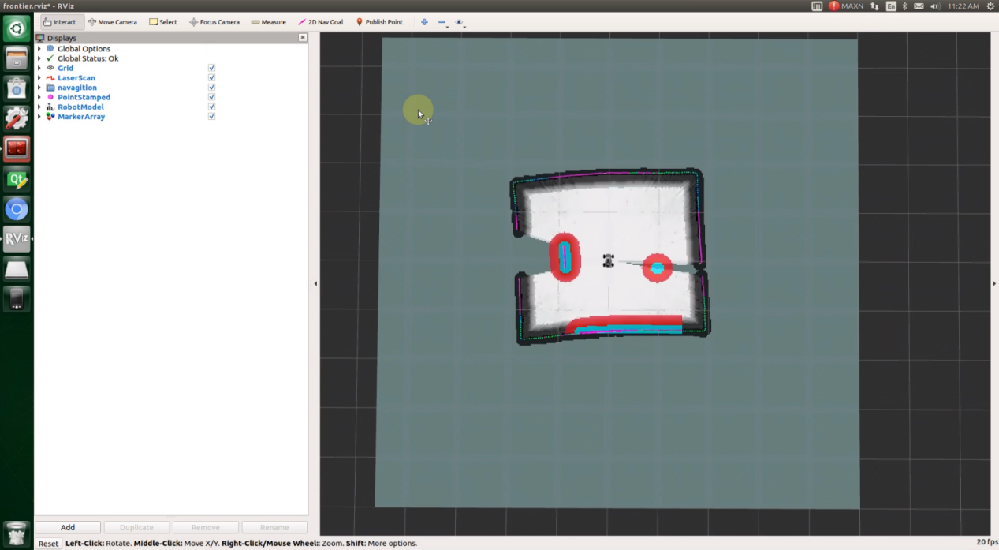

5. Click the **2D Nav Goal** button at the top of the software, then move it to the desired location on the map. Left-click to set the initial goal for the robot. The robot will then move towards the set goal while simultaneously mapping the environment during its movement.

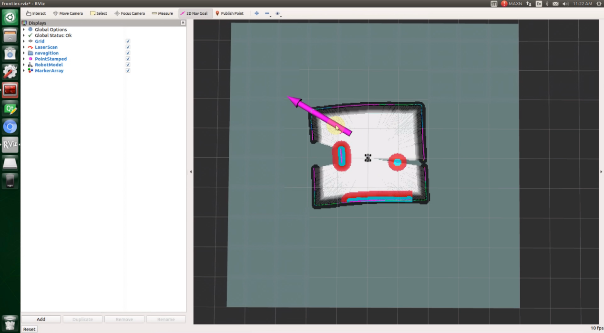

* **Save the Map**

1. Open a new terminal window, enter the command, and press **Enter** to navigate to the folder where the map is stored.

```bash
roscd slam/maps
```

2. Then, enter the command and press **Enter** to save the map.

```bash
rosrun map_server map_saver map:=/robot_1/map -f map_01
```

In the command, **robot_1** is the robot's name, and **map_01** is the map's name. Feel free to rename them as needed. If the following prompt appears, it means the map has been saved successfully.


3. To close the currently running program in each terminal window, press **Ctrl+C**.

4. Enter the command to enable the app auto-start service.

```bash
sudo systemctl start start_app_node.service
```

After completing the mapping process, the app service can be started either by using a command or by rebooting the robot. If the app service is not enabled, related features in the app will not function properly. If the robot is rebooted, the app service will start automatically. Enter the command to restart the app service and wait for a beep from the buzzer, indicating that the service has started.

```bash
sudo systemctl restart start_app_node.service
```

* **Optimization**

For more accurate mapping, the odometry can be optimized. Odometry is required for robot mapping, and odometry relies on the IMU.

The robot is preloaded with calibrated IMU data, which allows it to perform mapping and navigation normally. However, the IMU can still be recalibrated to achieve higher precision. For IMU calibration methods and steps, refer to the [2. ROS1- Chassis Motion Control Course](https://wiki.hiwonder.com/projects/ROSOrin/en/jetson-nano-version/docs/2_ROS1_Chassis_Motion_Control_Course.html) file.

#### 5.1.6.3 Parameter Description

The parameter file can be found at the path **slam/config/frontier_points.yaml**. This file contains the settings for the `points` that define the robot's exploration path planning and navigation points.

```yaml
points:
  - [1.0, 1.0]
  - [4.5, 5.0]
  - [10.0, 3.0]
  - [2.0, 7.8]
  - [3.0, 4.0]
  - [0.0, -2.0]
  - [5.0, 33.0]
  - [6.0, 28.0]
```

#### 5.1.6.4 Launch File Analysis

* **File Paths**

The main launch files involved in mapping are as follows:

1. `slam.launch` – selects the mapping method, located at **/ros_ws/src/slam/launch/slam.launch**.
2. `slam_base.launch` – sets up core topics and starts mapping functions, located at **/ros_ws/src/slam/launch/include/slam_base.launch**.
3. `frontier.launch` – defines topic settings and parameters for the mapping method, located at **slam/launch/include/frontier.launch**.

* **Choose a Mapping Method**

```
<arg name="slam_methods" default="gmapping" doc="slam type 
    [gmapping, cartographer, hector, karto, frontier, explore, rrt_exploration, rtabmap]"/>

<arg name="gmapping"        default="gmapping"/>
<arg name="cartographer"    default="cartographer"/>
<arg name="hector"          default="hector"/>
<arg name="karto"           default="karto"/>
<arg name="frontier"        default="frontier"/>
<arg name="explore"         default="explore"/>
<arg name="rrt_exploration" default="rrt_exploration"/>
<arg name="rtabmap"         default="rtabmap"/>
```

Before mapping begins, the mapping method must be selected.

The `slam_methods ` parameter determines the method, defaulting to `gmapping`. Available options include:

Manual mapping: `gmapping`, `cartographer`, `hector`, and `karto`.

Autonomous mapping: `frontier`, `explorer`, and `rt_exploration`.

3D mapping: `rtabmap`.

* **Launch Mapping Functions and Topics**

```
<include file="$(find slam)/launch/include/slam_base.launch">
    <arg name="sim"             value="$(arg sim)"/>
    <arg name="slam_methods"    value="$(arg slam_methods)"/>
    <arg name="robot_name"      value="$(arg robot_name)"/>
</include>
```

Once the slam_methods method is selected, slam_base.launch starts the mapping functions and configures the required topics.

The `sim` indicates whether to use simulation, with the default setting being no simulation. `slam_methods` refers to the mapping method, which is set to **frontier** for this mapping task. `robot_name` represents the name of the robot node.

The following content is from the `slam_base.launch` file, specifically regarding the frontier part.

```
<group if="$(eval slam_methods == 'frontier')">
    <include file="$(find slam)/launch/include/gmapping.launch">
        <arg name="scan"        value="$(arg scan_topic)"/>
        <arg name="base_frame"  value="$(arg base_frame)"/>
        <arg name="odom_frame"  value="$(arg odom_frame)"/>
        <arg name="map_frame"   value="$(arg map_frame)"/>
    </include>
    <include file="$(find slam)/launch/include/$(arg slam_methods).launch">
        <arg name="global_frame"        value="$(arg map_frame)"/>
        <arg name="robot_base_frame"    value="$(arg base_frame)"/>
        <arg name="odom_frame"          value="$(arg odom_frame)"/>
        <arg name="map_topic"           value="$(arg map_topic)"/>
        <arg name="map_frame"           value="$(arg map_frame)"/>
        <arg name="odom_topic"          value="$(arg odom_topic)"/>
        <arg name="scan_topic"          value="$(arg scan_topic)"/>
        <arg name="clicked_point"       value="$(arg clicked_point)"/>
        <arg name="move_base_result"    value="$(arg move_base_result)"/>
        <arg name="cmd_vel_topic"       value="$(arg cmd_vel_topic)"/>
    </include>
</group>
```

Since this is autonomous mapping, the Gmapping algorithm is integrated with the navigation algorithm to enable mapping while navigating. Unlike manual mapping, as seen in previous lessons, in addition to parameters such as scan, `base_frame`, `odom_frame`, and `map_frame`, there are additional parameters defined and loaded into the `frontier.launch` file, such as:

The `global_frame` is set to `map_frame`, where the global coordinate system is mapped to the map coordinate system.

The `clicked_ponit` is set to `clicked_point[“topic_prefix/clicked_point”]`, where the `topic_prefix/clicked_point` parameter corresponds to the default value of clicked_point in the launch file.

The `cmd_vel_topic`, robot speed topic, is set to `cmd_vel_topic[topic_prefix/controller/cmd_vel]`, which matches the default value of `cmd_vel_topic` in the launch file.

* **Configure Mapping Parameters**

The location of the **frontier.launch** file can be found through the functionality package of this feature: **src/slam/launch/include/frontier.launch**.

```
<arg name="global_frame"        default="map"/>
<arg name="robot_base_frame"    default="base_footprint"/>
<arg name="odom_frame"          default="odom"/>
<arg name="map_topic"           default="map"/>
<arg name="map_frame"           default="map"/>
<arg name="odom_topic"          default="odom"/>
<arg name="scan_topic"          default="scan"/>
<arg name="clicked_point"       default="clicked_point"/>
<arg name="move_base_result"    default="move_base_result"/>
<arg name="cmd_vel_topic"       default="controller/cmd_vel"/>
```

This file contains the configuration of various coordinate systems, `global_frame` for the global coordinate system, `robot_base_frame` for the robot’s base coordinate system, `odom_frame` for the odometry coordinate system, and `map_frame` for the map coordinate system, as well as settings for different topics, `map_topic` for the map topic, `map_topic` for the odometry topic, and `scan_topic` for the radar scan topic.

- **Parameter Explanation for Activating Path Planning Functionality**

```
<include file="$(find navigation)/launch/include/move_base.launch">
    <arg name="cmd_vel_topic"                   value="$(arg cmd_vel_topic)" />
    <arg name="global_costmap_map_topic"        value="$(arg map_topic)"/>
    <arg name="global_costmap_sensor_frame"     value="$(arg robot_base_frame)"/>
    <arg name="global_costmap_sensor_topic"     value="$(arg scan_topic)"/>
    <arg name="global_costmap_global_frame"     value="$(arg global_frame)"/>
    <arg name="global_costmap_robot_base_frame" value="$(arg robot_base_frame)"/>
    <arg name="local_costmap_map_topic"         value="$(arg map_topic)"/>
    <arg name="local_costmap_sensor_frame"      value="$(arg robot_base_frame)"/>
    <arg name="local_costmap_sensor_topic"      value="$(arg scan_topic)"/>
    <arg name="local_costmap_global_frame"      value="$(arg odom_frame)"/>
    <arg name="local_costmap_robot_base_frame"  value="$(arg robot_base_frame)"/>
    <arg name="virtual_wall_map_frame"          value="$(arg map_frame)"/>
    <arg name="teb_odom_topic"                  value="$(arg odom_topic)"/>
    <arg name="teb_map_frame"                   value="$(arg odom_frame)"/>
</include>
```

The robot's velocity topic is set as `cmd_vel_topic`.

The global costmap parameter message name `global_costmap_[...]` and local costmap parameter message name `local_costmap_[...]` are configured.

The `teb_odom_topic`, the odom topic for the teb path planning algorithm, and `teb_map_frame`, the map coordinate system for the teb path planning algorithm, are also set.

> [!NOTE]
>
> * **Default values are usually sufficient. Avoid changing these settings individually to ensure stable mapping performance.**
>
> * **For detailed parameter information, refer to the official documentation at: http://wiki.ros.org/explore_lite.**


### 5.1.7 Explore_Lite Autonomous Mapping

#### 5.1.7.1 Algorithm Concept

Explorer_Lite Mapping, or exploration mapping, is a fully automated mapping method that requires no manual control or setting of target points. Once this mode is activated, the robot begins to move. During the movement, the robot automatically avoids obstacles and performs mapping.

The implementation of Explorer_Lite mapping can be divided into two parts: the mapping algorithm and the movement.

The available mapping algorithms include Gmapping, Hector, Karto, and Cartographer. In this section, the Gmapping algorithm is used.

The robot's movement route is planned based on the map that has already been constructed. The robot continuously moves towards the boundary of the current map for exploration, until the map of the current area is completed.

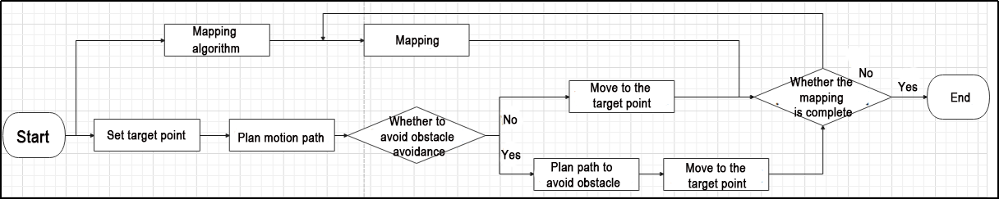

The Explore_Lite software package link:<https://github.com/hrnr/m-explore>

#### 5.1.7.2 Mapping Steps

> [!NOTE]
>
> * **Before starting, please set up a closed environment and place the robot inside. Ensure that the environment is fully enclosed!**
>
> * **Commands must be entered with correct capitalization. The Tab key can be used to auto-complete keywords.**

* **Enable Service**

1. Power on the robot and connect it via the NoMachine remote control software. For detailed information on connecting to a remote desktop, please refer to section [1.7.2 AP Mode Connection Steps](https://wiki.hiwonder.com/projects/ROSOrin/en/jetson-nano-version/docs/1_ROSOrin_User_Manual.html#ap-mode-connection-steps) in the user manual.

2. Click the terminal icon  in the system desktop to open a command-line window.

3. Enter the following command and press **Enter** to stop the app auto-start service:

```bash
sudo systemctl stop start_app_node.service
```

4. Open a new terminal window, enter the command to start the mapping service, and press **Enter**. If no errors appear, the mapping service has started successfully, and the robot will begin exploration and mapping.

```bash
roslaunch slam slam.launch slam_methods:=explore
```

5. Open a new terminal window, enter the command to launch the model viewer software, and press **Enter**.

```bash
roslaunch slam rviz_slam.launch slam_methods:=explore
```

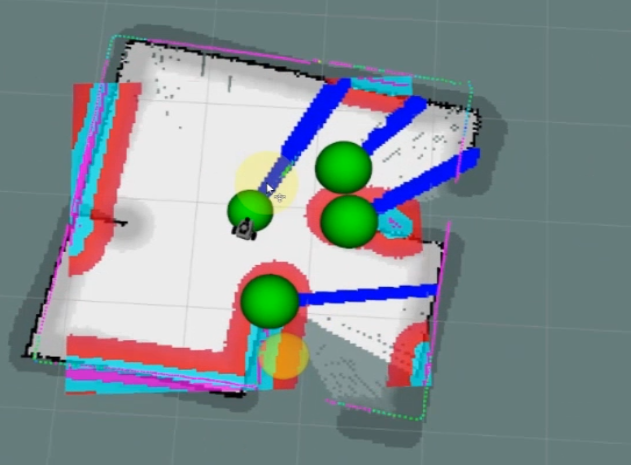

* **Save the Map**

1. Open a new terminal window, enter the command, and press **Enter** to navigate to the folder where the map is stored.

```bash
roscd slam/maps
```

2. Then, enter the command and press **Enter** to save the map.

```bash
rosrun map_server map_saver map:=/robot_1/map -f map_01
```

In the command, **robot_1** is the robot's name, and **map_01** is the map's name. Feel free to rename them as needed. If the following prompt appears, it means the map has been saved successfully.


3. To close the currently running program in each terminal window, press **Ctrl+C**.

4. Enter the command to enable the app auto-start service.

```bash
sudo systemctl start start_app_node.service
```

After completing the mapping process, the app service can be started either by using a command or by rebooting the robot. If the app service is not enabled, related features in the app will not function properly. If the robot is rebooted, the app service will start automatically. Enter the command to restart the app service and wait for a beep from the buzzer, indicating that the service has started.

```bash
sudo systemctl restart start_app_node.service
```

#### 5.1.7.3 Optimization

For more accurate mapping, the odometry can be optimized. Odometry is required for robot mapping, and odometry relies on the IMU.

The robot is preloaded with calibrated IMU data, which allows it to perform mapping and navigation normally. However, the IMU can still be recalibrated to achieve higher precision. For IMU calibration methods and steps, refer to the [2. ROS1- Chassis Motion Control Course](https://wiki.hiwonder.com/projects/ROSOrin/en/jetson-nano-version/docs/2_ROS1_Chassis_Motion_Control_Course.html) file.

#### 5.1.7.4 Launch File Analysis

* **File Paths**

The main launch files involved in mapping are as follows:

1. `slam.launch` – selects the mapping method, located at **/ros_ws/src/slam/launch/slam.launch**.

2. `slam_base.launch` – sets up core topics and starts mapping functions, located at **/ros_ws/src/slam/launch/include/slam_base.launch**.

3. `explore.launch` – defines topic settings and parameters for the mapping method, located at **slam/launch/include/explore.launch**.

* **Choose a Mapping Method**

```
<arg name="slam_methods" default="gmapping" doc="slam type 
    [gmapping, cartographer, hector, karto, frontier, explore, rrt_exploration, rtabmap]"/>

<arg name="gmapping"        default="gmapping"/>
<arg name="cartographer"    default="cartographer"/>
<arg name="hector"          default="hector"/>
<arg name="karto"           default="karto"/>
<arg name="frontier"        default="frontier"/>
<arg name="explore"         default="explore"/>
<arg name="rrt_exploration" default="rrt_exploration"/>
<arg name="rtabmap"         default="rtabmap"/>
```

Before mapping begins, the mapping method must be selected.

The `slam_methods` parameter determines the method, defaulting to `gmapping`. Available options include:

Manual mapping: `gmapping`, `cartographer`, `hector`, and `karto`.

Autonomous mapping: `frontier`, `explorer`, and `rt_exploration`.

3D mapping: `rtabmap`.

* **Launch Mapping Functions and Topics**

```
<include file="$(find slam)/launch/include/slam_base.launch">
    <arg name="sim"             value="$(arg sim)"/>
    <arg name="slam_methods"    value="$(arg slam_methods)"/>
    <arg name="robot_name"      value="$(arg robot_name)"/>
</include>
```

Once the `slam_methods` method is selected, `slam_base.launch` starts the mapping functions and configures the required topics.

The `sim` indicates whether to use simulation, with the default setting being no simulation. `slam_methods` refers to the mapping method, which is set to **explore** for this mapping task. `robot_name` represents the name of the robot node.

```
<group if="$(eval slam_methods == 'explore')">
    <include file="$(find slam)/launch/include/gmapping.launch">
        <arg name="scan"        value="$(arg scan_topic)"/>
        <arg name="base_frame"  value="$(arg base_frame)"/>
        <arg name="odom_frame"  value="$(arg odom_frame)"/>
        <arg name="map_frame"   value="$(arg map_frame)"/>
    </include>
    <include file="$(find slam)/launch/include/$(arg slam_methods).launch">
        <arg name="map_topic"               value="$(arg map_topic)"/>
        <arg name="base_frame"              value="$(arg base_frame)"/>
        <arg name="costmap_topic"           value="$(arg costmap_topic)"/>
        <arg name="costmap_updates_topic"   value="$(arg costmap_updates_topic)"/>
    </include>
    <!-- Start path planning algorithm -->
    <include file="$(find navigation)/launch/include/move_base.launch">
        <arg name="cmd_vel_topic"                   value="$(arg cmd_vel_topic)"/>
        <arg name="global_costmap_map_topic"        value="$(arg map_topic)"/>
        <arg name="global_costmap_sensor_frame"     value="$(arg base_frame)"/>
        <arg name="global_costmap_sensor_topic"     value="$(arg scan_topic)"/>
        <arg name="global_costmap_global_frame"     value="$(arg map_frame)"/>
        <arg name="global_costmap_robot_base_frame" value="$(arg base_frame)"/>
        <arg name="local_costmap_map_topic"         value="$(arg map_topic)"/>
        <arg name="local_costmap_sensor_frame"      value="$(arg base_frame)"/>
        <arg name="local_costmap_sensor_topic"      value="$(arg scan_topic)"/>
        <arg name="local_costmap_global_frame"      value="$(arg odom_frame)"/>
        <arg name="local_costmap_robot_base_frame"  value="$(arg base_frame)"/>
        <arg name="virtual_wall_map_frame"          value="$(arg map_frame)"/>
        <arg name="teb_odom_topic"                  value="$(arg odom_topic)"/>
        <arg name="teb_map_frame"                   value="$(arg odom_frame)"/>
    </include>
</group>
```

The system uses three launch files: `gmapping.launch` for the Gmapping mapping algorithm, `explore.launch` for detailed mapping method parameter configuration, and `move_base.launch` for robot pose planning during the mapping process.

* **Configure Mapping Parameters**

The location of the `explore.launch` file can be found through the functionality package of this feature: **slam/launch/include/explore.launch**.

```
<arg name="base_frame"              default="base_footprint"/>
<arg name="costmap_topic"           default="map"/>
<arg name="costmap_updates_topic"   default="map_updates"/>
<arg name="map_topic"               default="map"/>
<arg name="map_save_path"           default="$(find slam)/maps/explore"/>
```

Key parameter to focus on is `map_save_path`, which specifies the default save location for the map after using the Explore_Lite algorithm for mapping. If the map is not saved manually, the default save location will be **slam/maps/explore**. Typically, the map is saved using a command.

```
<node pkg="explore_lite" type="explore" respaHW="false" name="explore" output="screen">
    <param name="map_topic"             value="$(arg map_topic)"/>
    <param name="map_save_path"         value="$(arg map_save_path)"/>
    <param name="robot_base_frame"      value="$(arg base_frame)"/>
    <param name="costmap_topic"         value="$(arg costmap_topic)"/>
    <param name="costmap_updates_topic" value="$(arg costmap_updates_topic)"/>
    <param name="visualize"             value="true"/>
    <param name="planner_frequency"     value="0.33"/>
    <param name="progress_timeout"      value="20.0"/>
    <param name="potential_scale"       value="3.0"/>
    <param name="orientation_scale"     value="0.0"/>
    <param name="gain_scale"            value="1.0"/>
    <param name="transform_tolerance"   value="0.3"/>
    <param name="min_frontier_size"     value="0.5"/>
</node>
```

Apart from the map, robot coordinates, and cost map topic parameters, the following parameters should also be noted:

`<planner_frequency>`: Path planner frequency, set to 0.33. This parameter controls the robot’s movement speed during autonomous mapping and the frequency of map updates. Values that are too high or too low may affect the robot’s movement direction and mapping speed.

`<progress_timeout>`: Timeout for the package operation, set to 20 seconds. If the program encounters an abnormal termination or stuck process, there will be a 20-second detection time. If the process exceeds this time, the current goal will be abandoned, and the system will continue with the next task.

`<potential_scale>`: Weight for the distance to the boundary, set to 3.0. This parameter acts as a weight for the boundary distance, but adjusting it directly will not change the safety distance judgment for the boundary. It’s recommended to keep it at the default value.

`<orientation_scale>`: Weight for the robot’s front-facing direction, set to 0.0.

`<gain_scale>`: Boundary gain value, set to 1.0. Since this is a multiplicative gain value, it will not affect the value of `potential_scale`.

`<transform_tolerance>`: Robot turning tolerance while operating, set to 0.3. It’s best to leave it at the default value.

`<min_frontier_size>`: Minimum threshold for setting the boundary as the target value, set to 0.5. It’s best to leave it at the default value.

> [!NOTE]
>
> **Default values are usually sufficient. Avoid changing these settings individually to ensure stable mapping performance.**


### 5.1.8 RRT Exploration Mapping

#### 5.1.8.1 Algorithm Concept

RRT, or Rapidly-exploring Random Tree, is a motion planning algorithm that has become widely used in recent years.

It is a probabilistic sampling-based search method that directs the search into unoccupied areas by randomly sampling points in the state space, thus establishing a planned path from the starting point to the goal. By performing collision detection on the sampled points in the state space, it avoids the need for mapping the space itself.

The original RRT algorithm starts with an initial point as the root node, and by adding leaf nodes through random sampling, it generates a random tree. When a leaf node in the tree reaches the goal point or enters the target area, the path from the start point to the goal can be found by backtracking within the random tree.

The steps are as follows:

1. Build the tree, with the root node as the starting point and the goal point specified.
2. Read the map data.
3. Randomly select a point on the map, denoted as p_rand.
4. Traverse the current tree to find the nearest point to p_rand, denoted as p_near.
5. Extend a step-length distance from p_near towards p_rand, recording the step length as Delta, and the newly extended point as p_new.
6. Check whether the point p_new is on an obstacle. If it is, break the loop and restart from step 3.
7. Insert the newly generated point p_new into the tree.
8. When p_new is within a certain range of the goal point, exit the search and draw the entire path.

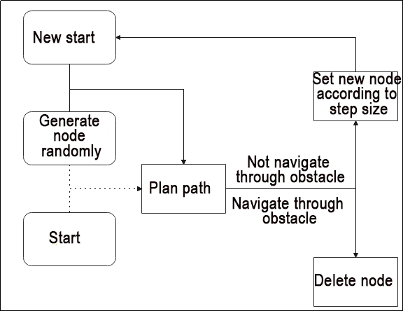

The RRT Software Package:<https://github.com/RoboJackets/rrt>

#### 5.1.8.2 Mapping Steps

> [!NOTE]
>
> * **Before starting, please set up a closed environment and place the robot inside. Ensure that the environment is fully enclosed!**
>
> * **Commands must be entered with correct capitalization. The Tab key can be used to auto-complete keywords.**

* **Enable Service**

1. Power on the robot and connect it via the NoMachine remote control software. For detailed information on connecting to a remote desktop, please refer to section [1.7.2 AP Mode Connection Steps](https://wiki.hiwonder.com/projects/ROSOrin/en/jetson-nano-version/docs/1_ROSOrin_User_Manual.html#ap-mode-connection-steps) in the user manual.

2. Click the terminal icon  in the system desktop to open a command-line window.

3. Enter the following command and press **Enter** to stop the app auto-start service:

```bash
sudo systemctl stop start_app_node.service
```

4. Open a new command-line terminal, enter the command, and press **Enter** to start the mapping service. If no errors appear, the mapping service has started successfully.

```bash
roslaunch slam slam.launch slam_methods:=rrt_exploration
```

> [!NOTE]
>
> **Since the robot will automatically plan a path and start mapping after the mapping service is enabled, please ensure it is placed on the ground before starting.**

5. Open a new terminal window, enter the command to launch the model viewer software, and press **Enter**.

```bash
roslaunch slam rviz_slam.launch slam_methods:=rrt_exploration
```

* **Start the Mapping Process**

1) First, select the option highlighted in red at the top of the window, then click on an empty area on the map. A total of five points need to be set. The first four points define the exploration area, while the fifth point sets the starting position, which should be clicked in front of the robot, not on it. Once all the points are set, the exploration and mapping process will begin.

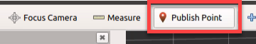

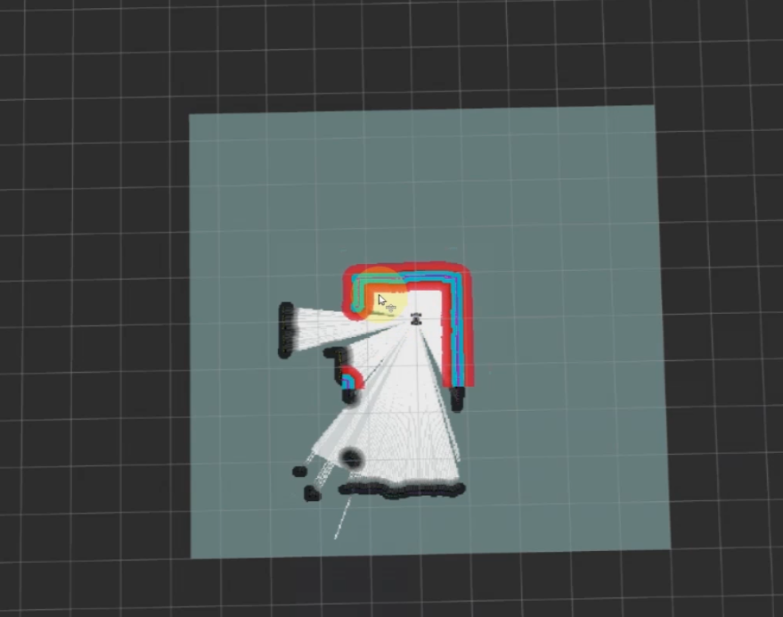

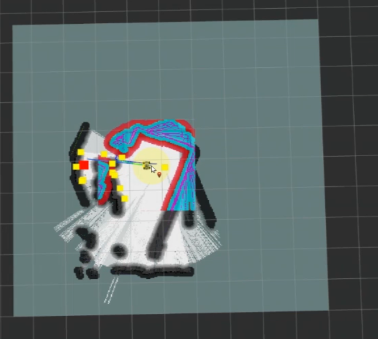

* **Save the Map**

1. Open a new terminal window, enter the command, and press **Enter** to navigate to the folder where the map is stored.

```bash
roscd slam/maps
```

2. Then, enter the command and press **Enter** to save the map.

```bash
rosrun map_server map_saver map:=/robot_1/map -f map_01
```

In the command, **robot_1** is the robot's name, and **map_01** is the map's name. Feel free to rename them as needed. If the following prompt appears, it means the map has been saved successfully.


3. To close the currently running program in each terminal window, press **Ctrl+C**.

4. Enter the command to enable the app auto-start service.

```bash
sudo systemctl start start_app_node.service
```

* **Optimization**

For more accurate mapping, the odometry can be optimized. Odometry is required for robot mapping, and odometry relies on the IMU.

The robot is preloaded with calibrated IMU data, which allows it to perform mapping and navigation normally. However, the IMU can still be recalibrated to achieve higher precision. For IMU calibration methods and steps, refer to the [2. ROS1- Chassis Motion Control Course](https://wiki.hiwonder.com/projects/ROSOrin/en/jetson-nano-version/docs/2_ROS1_Chassis_Motion_Control_Course.html) file.

#### 5.1.8.3 Specifications

The parameter file can be found at the path: **slam/launch/include/rrt_exploration.launch**.

```
map_update_interval: Map update speed in seconds, lower values update the map more frequently but require higher computational load.
maxUrange: Maximum laser range to consider, laser data can be clipped to this value.
maxRange: Maximum laser range, areas within this range with no obstacles are shown as free space. Set this to maxUrange < actual lidar max range <= maxRange.
sigma: Sigma value used in greedy endpoint matching.
kernelSize: Kernel size for finding laser match relationships.
lstep: Linear optimization step size.
astep: Angular optimization step size.
iterations: Number of iterations.
lsigma: Standard deviation for laser measurements.
ogain: Gain value.
lskip: Set to 0 to process all laser scans. Increase to 1 if computational load is too high.
minimumScore: Minimum matching score to evaluate scan matching quality. Higher values require higher confidence in laser matching, too low values may introduce noise.
srr: Linear error in the motion model for linear movement.
srt: Linear error in the motion model for rotation.
str: Rotational error in the motion model for linear movement.
stt: Rotational error in the motion model for rotation.
linearUpdate: Distance the robot must move linearly before performing a new scan, in meters.
angularUpdate: Angle the robot must rotate before performing a new scan, in radians
temporalUpdate: Temporal update interval, -1 disables.
resampleThreshold: Resampling threshold.
particles: Number of particles, an important parameter.
xmin: Minimum initial map size along x-axis, in meters.
ymin: Minimum initial map size along y-axis, in meters.
xmax: Maximum initial map size along x-axis, in meters.
ymax: Maximum initial map size along y-axis, in meters.
delta: Map resolution.
llsamplerange: Likelihood range for linear translation sampling.
llsamplestep: Likelihood step size for linear translation sampling.
```

#### 5.1.8.4 Launch File Analysis

* **File Paths**

The main launch files involved in mapping are as follows:

1. `slam.launch` – selects the mapping method, located at **/ros_ws/src/slam/launch/slam.launch**.

2. `slam_base.launch` – sets up core topics and starts mapping functions, located at **/ros_ws/src/slam/launch/include/slam_base.launch**.

3. `rrt_exploration` – defines topic settings and parameters for the mapping method, located at **/ros_ws/src/slam/launch/include/rrt_exploration.launch**.

* **Choose a Mapping Method**

```
<arg name="slam_methods" default="gmapping" doc="slam type 
    [gmapping, cartographer, hector, karto, frontier, explore, rrt_exploration, rtabmap]"/>

<arg name="gmapping"        default="gmapping"/>
<arg name="cartographer"    default="cartographer"/>
<arg name="hector"          default="hector"/>
<arg name="karto"           default="karto"/>
<arg name="frontier"        default="frontier"/>
<arg name="explore"         default="explore"/>
<arg name="rrt_exploration" default="rrt_exploration"/>
<arg name="rtabmap"         default="rtabmap"/>
```

Before mapping begins, the mapping method must be selected.

The `slam_methods` parameter determines the method, defaulting to `gmapping`. Available options include:

Manual mapping: `gmapping`, `cartographer`, `hector`, and `karto`.

Autonomous mapping: `frontier`, `explorer`, and `rt_exploration`.

3D mapping: `rtabmap`.

* **Launch Mapping Functions and Topics**

```
<include file="$(find slam)/launch/include/slam_base.launch">
    <arg name="sim"             value="$(arg sim)"/>
    <arg name="slam_methods"    value="$(arg slam_methods)"/>
    <arg name="robot_name"      value="$(arg robot_name)"/>
</include>
```

Once the `slam_methods` method is selected, `slam_base.launch` starts the mapping functions and configures the required topics.

The `sim` indicates whether to use simulation, with the default setting being no simulation. `slam_methods` refers to the mapping method, which is set to `rrt_exploration` for this mapping task. `robot_name` represents the name of the robot node.

```
<group if="$(eval slam_methods == 'rrt_exploration')">
    <include file="$(find slam)/launch/include/gmapping.launch">
        <arg name="scan"        value="$(arg scan_topic)"/>
        <arg name="base_frame"  value="$(arg base_frame)"/>
        <arg name="odom_frame"  value="$(arg odom_frame)"/>
        <arg name="map_frame"   value="$(arg map_frame)"/>
    </include>
    <!-- Start path planning algorithm -->
    <include file="$(find navigation)/launch/include/move_base.launch">
        <arg name="cmd_vel_topic"                   value="$(arg cmd_vel_topic)"/>
        <arg name="global_costmap_map_topic"        value="$(arg map_topic)"/>
        <arg name="global_costmap_sensor_frame"     value="$(arg base_frame)"/>
        <arg name="global_costmap_sensor_topic"     value="$(arg scan_topic)"/>
        <arg name="global_costmap_global_frame"     value="$(arg map_frame)"/>
        <arg name="global_costmap_robot_base_frame" value="$(arg base_frame)"/>
        <arg name="local_costmap_map_topic"         value="$(arg map_topic)"/>
        <arg name="local_costmap_sensor_frame"      value="$(arg base_frame)"/>
        <arg name="local_costmap_sensor_topic"      value="$(arg scan_topic)"/>
        <arg name="local_costmap_global_frame"      value="$(arg odom_frame)"/>
        <arg name="local_costmap_robot_base_frame"  value="$(arg base_frame)"/>
        <arg name="virtual_wall_map_frame"          value="$(arg map_frame)"/>
        <arg name="teb_odom_topic"                  value="$(arg odom_topic)"/>
        <arg name="teb_map_frame"                   value="$(arg odom_frame)"/>
    </include>
    <!-- Start autonomous exploring mapping algorithm -->
    <include file="$(find slam)/launch/include/rrt_exploration.launch">
        <arg name="namespace"       value="$(arg robot_prefix)"/>
        <arg name="n_robots"        value="$(arg robot_number)"/>
        <arg name="map_topic"       value="$(arg map_topic)"/>
        <arg name="odom_topic"      value="$(arg odom_topic)"/>
        <arg name="robot_base"      value="$(arg base_frame)"/>
        <arg name="global_frame"    value="$(arg map_frame)"/>
    </include>
</group>
```

Includes and uses three launch files: `gmapping.launch` for the Gmapping mapping algorithm, `move_base.launch` for robot pose planning during mapping, and `rrt_exploration.launch`, which can be referred to for mapping method parameter configuration.

* **Configure Mapping Parameters**

The location of the `rrt_exploration.launch` file can be found through the functionality package of this feature: **slam/launch/include/rrt_exploration.launch**.

The following content covers relevant topics, robot coordinate system names, and the initialization of logical parameters:

```
<arg name="eta"                     value="0.5"/>
<arg name="Geta"                    value="2.0"/>
<arg name="map_topic"               default="map"/>
<arg name="odom_topic"              default="odom"/>
<arg name="robot_base"              default="base_footprint"/>
<arg name="global_frame"            default="map"/>
<arg name="namespace"               default="/robot_"/>
<arg name="n_robots"                default="1"/>
<arg name="robot_name"              value="$(arg namespace)$(arg n_robots)"/>
<param name="namespace_init_count"  value="1"/>
```

`<eta>`: Boundary growth rate, used to detect the growth rate of the RRT algorithm. The larger this value, the faster the RRT planner explores branches, but it also increases the computational load. It is recommended to keep the default value of 0.5.

`<Geta>`: Lateral weight of the boundary growth rate, used in combination with eta.

`<map_topic>` refers to the map topic message, `<odom_topic>` refers to the odometry topic message, `<robot_base>` is the robot's initial pose message, and `<global_frame>` is the global coordinate system.

`<namespace>` is the robot's namespace, `<n_robots>` sets the robot number, `<robot_name>` is the robot's name, and `<namespace_init_count>` is the initialization count for the namespace.

The following content refers to the startup of the RRT global detector and the RRT local detector package, as well as the related parameter settings:

```
<node pkg="rrt_exploration" type="global_rrt_detector" name="global_detector" output="screen">
    <param name="eta"               value="$(arg Geta)"/>
    <param name="map_topic"         value="$(arg map_topic)"/>
    <param name="clicked_point"     value="/$(arg robot_name)/clicked_point"/>
    <param name="detected_points"   value="detected_points"/>
    <param name="shapes"            value="/$(arg robot_name)/global_detector_shapes"/>
</node>

<node pkg="rrt_exploration" type="local_rrt_detector" name="local_detector" output="screen">
    <param name="eta"               value="$(arg eta)"/>
    <param name="map_topic"         value="$(arg map_topic)"/>
    <param name="robot_frame"       value="$(arg robot_base)"/>
    <param name="clicked_point"     value="/$(arg robot_name)/clicked_point"/>
    <param name="detected_points"   value="detected_points"/>
    <param name="shapes"            value="/$(arg robot_name)/local_detector_shapes"/>
</node>
```

Similar parameter variable names can be referenced in the previous section, and these parameters should remain at their default values.

Next is the RRT algorithm’s boundary filtering script `filter.py`:

```
<node pkg="rrt_exploration" type="filter.py" name="filter" output="screen">
    <param name="map_topic"                     value="$(arg map_topic)"/>
    <param name="robot_frame"                   value="base_footprint"/>
    <param name="info_radius"                   value="0.8"/>
    <param name="costmap_clearing_threshold"    value="70"/>
    <param name="goals_topic"                   value="/$(arg robot_name)/detected_points"/>
    <param name="namespace"                     value="/$(arg namespace)"/>
    <param name="n_robots"                      value="$(arg n_robots)"/>
    <param name="rate"                          value="100"/>
    <param name="global_costmap_topic"          value="/move_base/global_costmap/costmap"/>
</node>
```

`<info_radius>`: Boundary expansion range, increasing the original grid by 0.8 times.

`<costmap_clearing_threshold>`: Costmap clearing threshold. If the detected cost does not exceed the specified value, the identified unit will be disregarded from the grid information.

`<goals_topic>`: RRT detector goal point topic.

`<rate>`: RRT detector update frequency.

`<global_costmap_topic>`: Global costmap topic.

The following content covers the robot's motion priority settings, executed by the file `assigner.py`:

```
<node pkg="rrt_exploration" type="assigner.py" name="assigner" output="screen">
    <param name="map_topic"                 value="$(arg map_topic)"/>
    <param name="global_frame"              value="$(arg global_frame)"/>
    <param name="robot_frame"               value="base_footprint"/>
    <param name="info_radius"               value="1"/>
    <param name="info_multiplier"           value="3.0"/>
    <param name="hysteresis_radius"         value="3.0"/>
    <param name="hysteresis_gain"           value="2.0"/>
    <param name="frontiers_topic"           value="/$(arg robot_name)/filtered_points"/>
    <param name="n_robots"                  value="$(arg n_robots)"/>
    <param name="namespace"                 value="/$(arg namespace)"/>
    <param name="delay_after_assignement"   value="0.5"/>
    <param name="rate"                      value="100"/>
    <param name="plan_service"              value="/move_base/GlobalPlanner/make_plan"/>
</node>
```

`<info_radius>`: Boundary expansion range, increasing the original grid by 0.8 times.

`<info_multiplier>`: Defines the expansion of the boundary polygon, with the expansion value set to 3.0.

` <hysteresis_radius>`: The radar scan hysteresis radius, which should not be smaller than the radar scan radius, is typically set to 3.0.

`<hysteresis_gain>`: The radar scan gain is typically set to 2.0.

` <frontiers_topic>`: The information message for the robot's frontier direction.

` <plane_service>`: The path message service.

The following describes the executable file for saving the map after RRT exploration:

```
<node pkg="slam" type="rrt_map_save.py" name="map_save" output="screen">
    <param name="map_frame"         value="$(arg global_frame)"/>
    <param name="odom_topic"        value="$(arg odom_topic)"/>
    <param name="clicked_point"     value="/$(arg robot_name)/clicked_point"/>
    <param name="wait_finish_time"  value="5"/>
</node>
```

`<clicked_point>`: Defines the five points for the area. The first four points represent the four corners of the square region to be explored, while the last point is the starting point of the tree, i.e., the robot's starting position.

`<wait_finish_time>`: The message waiting time after reaching the goal. This parameter can be set freely, but should generally be greater than 3 seconds to ensure the map is fully constructed.

> [!NOTE]
>
> **Default values are usually sufficient. Avoid changing these settings individually to ensure stable mapping performance.**


### 5.1.9 ORBSLAM2 and ORB-SLAM3 Mapping

#### 5.1.9.1 Algorithm Overview and Principles

ORB-SLAM2, designed for stereo and RGB-D cameras, is built on the foundation of monocular feature-based ORB-SLAM system. The system operates through three parallel threads, as shown in the diagram: (1) Track each camera frame by finding features that match the local map and minimizing the reprojection error. (2) Manage and optimize the local map, performing local bundle adjustment (BA). (3) Detect large loops and correct accumulated drift by executing pose graph optimization for loop closure. After the pose graph optimization, a fourth thread is launched to perform full BA, which computes the optimal structure-from-motion (SfM) solution.

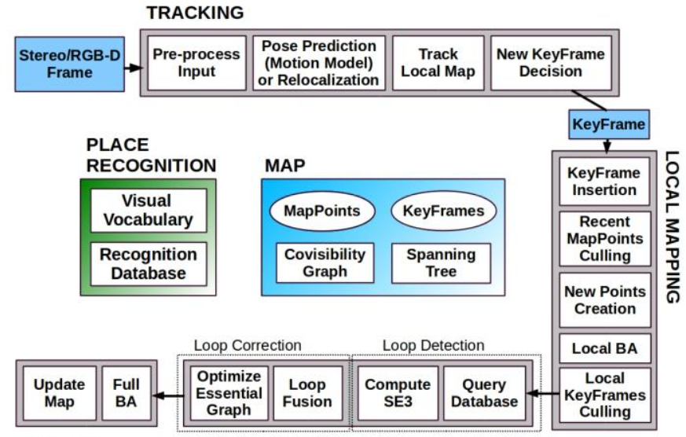

ORB-SLAM2 comprises three main parallel threads: tracking, local mapping, and loop closure. After loop closure, the system creates a fourth thread for full BA. The tracking thread pre-processes stereo or RGB-D input, allowing the system to operate independently of the input sensor. Although the diagram doesn’t show it, ORB-SLAM2 also works with monocular inputs.

The system uses the same ORB features for tracking, mapping, and localization tasks. These features are robust to rotation and scaling and are highly invariant to automatic camera gain, automatic exposure, and lighting changes. Additionally, they are fast to extract and match, enabling real-time operation and exhibiting good precision/recall in visual localization.

Current State of ORB-SLAM2: ORB-SLAM2 has achieved the highest accuracy in most cases. In the KITTI visual odometry benchmark, ORB-SLAM2 is currently the best stereo SLAM solution. Notably, unlike other stereo visual odometry methods that have emerged in recent years, ORB-SLAM2 provides zero-drift localization in already-mapped areas.

[ORB-SLAM2](https://so.csdn.net/so/search?q=ORB-SLAM2&spm=1001.2101.3001.7020) and ORB-SLAM3 are both visual SLAM systems based on monocular cameras, but there are notable differences between them:

**Feature Extraction and Descriptors:** ORB-SLAM2 uses ORB features and ORB descriptors, whereas ORB-SLAM3 employs SuperPoint features and SuperPoint descriptors. SuperPoint is a feature extraction and description method based on convolutional neural networks, which is more robust and accurate compared to ORB.

**Pose Estimation:** ORB-SLAM2 uses an EPnP-based pose estimation method, while ORB-SLAM3 uses a PnP-based method, which is more efficient and accurate.

**Semantic Information:** ORB-SLAM3 supports semantic information input and processing, allowing it to combine semantic data with visual information to enhance the robustness and precision of the SLAM system.

**Multi-Camera Systems:** ORB-SLAM3 supports mapping and localization with multi-camera systems, enabling it to handle visual information from multiple cameras simultaneously.

The following diagram provides an overview of ORB-SLAM3, which incorporates ORB-SLAM2:

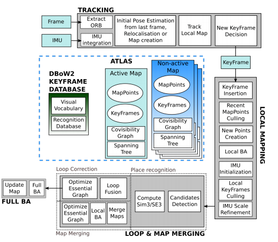

ORB-SLAM3 extracts ORB features from images, estimates the pose based on the previous frame or initializes the pose via global relocalization, and then tracks the already reconstructed local map. The pose is optimized, and new keyframes are determined. After inserting these keyframes into the map and verifying the map, redundant keyframes are removed. Finally, the local map is matched, and after the matching process, the map is fused, and the global map is adjusted.

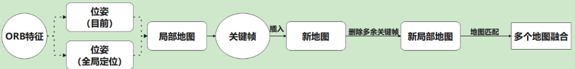

- **ORB-SLAM2 Software Package Link: <https://github.com/ethz-asl/orb_slam_2_ros>**

- **ORB-SLAM3 Software Package Link: <https://github.com/shanpenghui/ORB_SLAM3_Fixed>**

#### 5.1.9.2 Mapping Operation

* **Start the ORB-SLAM2 Mapping**

1. Power on the robot and connect it via the NoMachine remote control software. For detailed information on connecting to a remote desktop, please refer to section [1.7.2 AP Mode Connection Steps](https://wiki.hiwonder.com/projects/ROSOrin/en/jetson-nano-version/docs/1_ROSOrin_User_Manual.html#ap-mode-connection-steps) in the user manual.

2. Click the terminal icon  in the system desktop to open a command-line window.

3. Enter the following command and press **Enter** to stop the app auto-start service:

```bash
sudo systemctl stop start_app_node.service
```

4. Open a new command-line terminal, enter the command, and press **Enter** to start the mapping service. If no errors appear, the mapping service has started successfully.

```bash
roslaunch example orb_slam2_rgbd.launch
```

The following window indicates that the process has been successfully started:

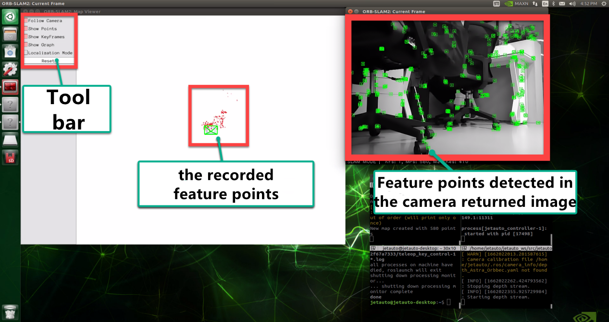

5. Open a new terminal window, enter the command to start the keyboard control service, and press **Enter**.

```bash
roslaunch peripherals teleop_key_control.launch robot_name:=/
```

If the interface shown below appears, the keyboard control service has started successfully.


6. Control the robot to move within the current environment to build a more complete map. The table below shows the keyboard keys and their corresponding functions for controlling the robot's movement during mapping:

<table border="1">
  <thead>
    <tr>
      <th>Keyboard Key</th>
      <th>Robot Action</th>
    </tr>
  </thead>
  <tbody>
    <tr>
      <td>W</td>
      <td>Short press to switch to forward mode, moves continuously forward.</td>
    </tr>
    <tr>
      <td>S</td>
      <td>Short press to switch to backward mode, moves continuously backward.</td>
    </tr>
    <tr>
      <td>A</td>
      <td>Long press to interrupt forward or backward motion and turn left.</td>
    </tr>
    <tr>
      <td>D</td>
      <td>Long press to interrupt forward or backward motion and turn right.</td>
    </tr>
  </tbody>
</table>


7) By controlling the robot with a keyboard, more feature points can be collected, which can then be used for 3D mapping.

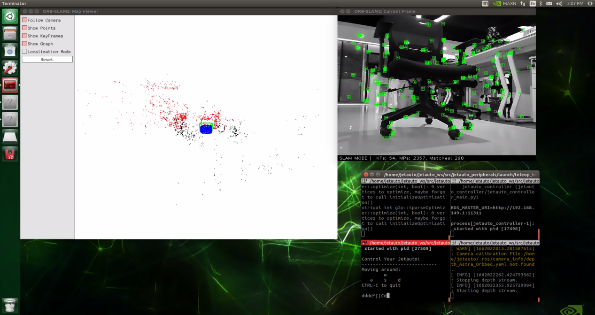

8) To close the currently running program in each terminal window, press **Ctrl+C**.

* **Start the ORB-SLAM3 Mapping**

1. Power on the robot and connect it via the NoMachine remote control software. For detailed information on connecting to a remote desktop, please refer to section [1.7.2 AP Mode Connection Steps](https://wiki.hiwonder.com/projects/ROSOrin/en/jetson-nano-version/docs/1_ROSOrin_User_Manual.html#ap-mode-connection-steps) in the user manual.

2. Click the terminal icon  in the system desktop to open a command-line window.

3. Enter the following command and press **Enter** to stop the app auto-start service:

```bash
sudo systemctl stop start_app_node.service
```

4) Open a new command-line terminal, enter the command, and press **Enter** to start the mapping service. If no errors appear, the mapping service has started successfully.

```bash
roslaunch example orb_slam3_rgbd.launch
```

The following two windows indicate that the process has been successfully started:

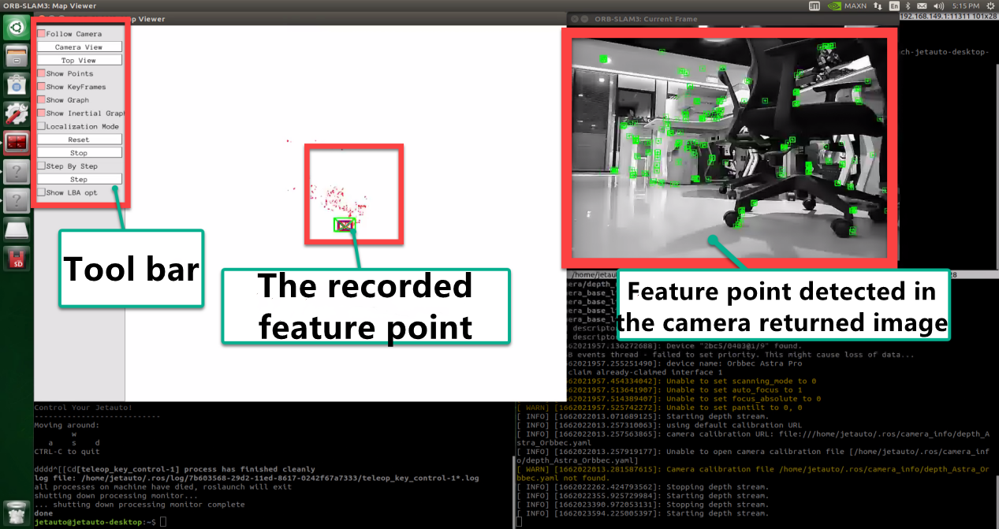

5. Open a new terminal window, enter the command to start the keyboard control service, and press **Enter**.

```bash
roslaunch peripherals teleop_key_control.launch robot_name:=/
```

If the interface shown below appears, the keyboard control service has started successfully.


6) Control the robot to move within the current environment to build a more complete map. The table below shows the keyboard keys and their corresponding functions for controlling the robot's movement during mapping:

<table border="1">
  <thead>
    <tr>
      <th>Keyboard Key</th>
      <th>Robot Action</th>
    </tr>
  </thead>
  <tbody>
    <tr>
      <td>W</td>
      <td>Short press to switch to forward mode, moves continuously forward.</td>
    </tr>
    <tr>
      <td>S</td>
      <td>Short press to switch to backward mode, moves continuously backward.</td>
    </tr>
    <tr>
      <td>A</td>
      <td>Long press to interrupt forward or backward motion and turn left.</td>
    </tr>
    <tr>
      <td>D</td>
      <td>Long press to interrupt forward or backward motion and turn right.</td>
    </tr>
  </tbody>
</table>
7) By controlling the robot with a keyboard, more feature points can be collected, which can then be used for 3D mapping.

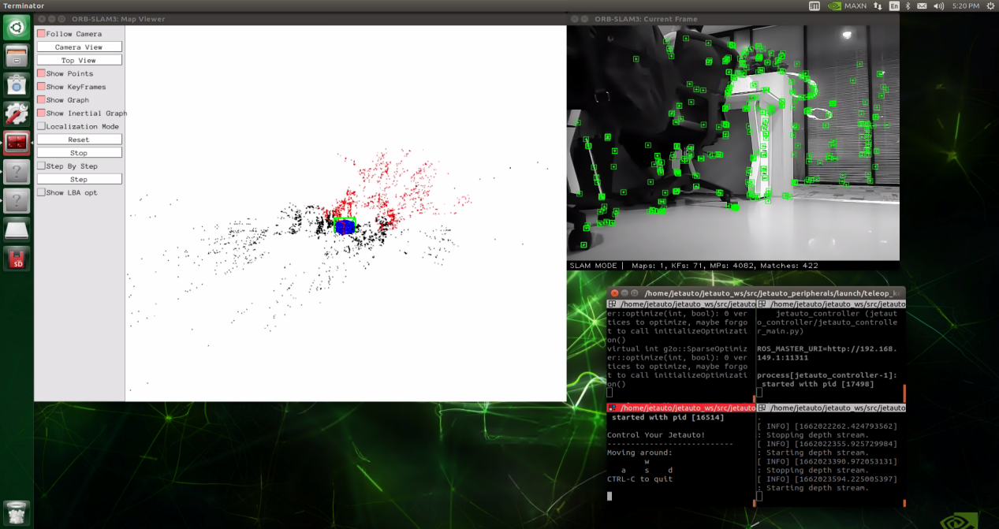

8) To close the currently running program in each terminal window, press **Ctrl+C**.

<p id ="anther5.1.10"></p>

### 5.1.10 RTAB-VSLAM 3D Mapping

#### 5.1.10.1 Introduction to RTAB-VSLAM

RTAB-VSLAM is a real-time, appearance-based 3D mapping system. It is an open-source library that implements loop closure detection through memory management methods. By limiting map size, it ensures that loop closure detection is always processed within a fixed time frame, thereby meeting the requirements for long-term and large-scale online mapping.

#### 5.1.10.2 RTAB-VSLAM Principles

RTAB-VSLAM 3D mapping uses a feature-based mapping method. Its advantage lies in the abundance of feature points available in most environments, providing good scene adaptability and enabling relocalization using feature points. However, it has several drawbacks: feature point extraction is time-consuming; feature points utilize limited information, losing most of the image details; the method becomes ineffective in weak-texture areas; and feature matching is prone to mismatches, which can significantly affect the results.

After extracting image features, features from different time frames are matched to form loop closure detection. Once matching is completed, data are categorized into two types — long-term memory data and short-term memory data. Long-term memory data are used for matching future data, while short-term memory data are used for matching temporally continuous data.

During operation, the RTAB-VSLAM algorithm first uses short-term memory data to update pose estimation and mapping. When future data can be matched with long-term memory data, the corresponding long-term memory data are incorporated into short-term memory to further update pose and mapping.

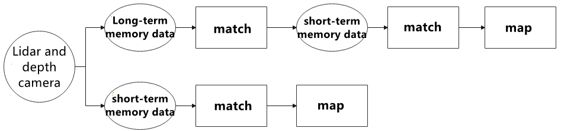

RTAB-VSLAM software resources: <https://github.com/introlab/rtabmap>

#### 5.1.10.3 LiDAR Mapping Operation

1. Power on the robot and connect it via the NoMachine remote control software.

2. Click the terminal icon  in the system desktop to open a command-line window.

3. Enter the following command and press **Enter** to stop the app auto-start service:

```bash
sudo systemctl stop start_app_node.service
```

4. Open a new command-line terminal, enter the command, and press **Enter** to start the mapping service. If no errors appear, the mapping service has started successfully.

```bash
roslaunch slam slam.launch slam_methods:=rtabmap
```

5. Open a new terminal window, enter the command to launch the model viewer software, and press **Enter**.

```bash
roslaunch slam rviz_slam.launch slam_methods:=rtabmap
```

While mapping, the point cloud data related to the depth camera can be observed, as shown in the image below:

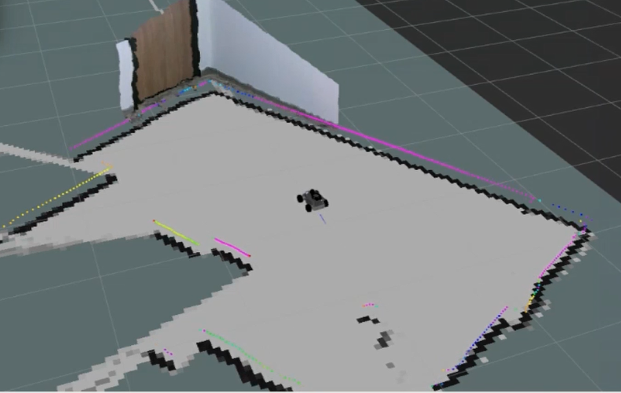

6. Open a new terminal window, enter the command to start the keyboard control service, and press **Enter**.

```bash
roslaunch peripherals teleop_key_control.launch
```

If the prompt shown below appears, the keyboard control service has started successfully.


7) Control the robot to move within the current environment to build a more complete map. The table below shows the keyboard keys and their corresponding functions for controlling the robot's movement during mapping:

<table border="1">
  <thead>
    <tr>
      <th>Keyboard Key</th>
      <th>Robot Action</th>
    </tr>
  </thead>
  <tbody>
    <tr>
      <td>W</td>
      <td>Short press to switch to forward mode, moves continuously forward.</td>
    </tr>
    <tr>
      <td>S</td>
      <td>Short press to switch to backward mode, moves continuously backward.</td>
    </tr>
    <tr>
      <td>A</td>
      <td>Long press to interrupt forward/backward motion and turn left.</td>
    </tr>
    <tr>
      <td>D</td>
      <td>Long press to interrupt forward/backward motion and turn right.</td>
    </tr>
  </tbody>
</table>

8) After completing the mapping, press **Ctrl+C** in each command-line terminal window to stop the currently running program.

> [!NOTE]
>
> **For 3D mapping, manual map saving is not required. When the mapping command is stopped using Ctrl+C, the map is automatically saved.**

After the feature is closed, the app service can be activated either by using a command or by restarting the robot. If the app service is not enabled, related features in the app will not function properly. The app service will start automatically when the robot is restarted.

Enter the command to restart the app service and wait for a beep from the buzzer, indicating that the service has started.

```bash
sudo systemctl restart start_app_node.service
```


### 5.1.11 App Mapping

In this section, the app **Make A Map** will be used to control the robot and create maps.

#### 5.1.11.1 App Installation

The installation packages for the **Make A Map** and **Map Nav** apps are located in the directory [2. Softwares \ 6. App Mapping and Navigation Installation Packages](https://drive.google.com/drive/folders/1Z4VPnEeeXRvYvscgUZvYmfyMkPd8Akcp). These packages can be transferred to a mobile device for installation.

> [!NOTE]
>
> **The installation packages are available only for Android devices.**

#### 5.1.11.2 App Mapping

* **Enable Service**

1. Power on the robot and connect it via the NoMachine remote control software.

2. Click the terminal icon  in the system desktop to open a command-line window.

3. Enter the command and press **Enter** to stop the auto-start services of the app, including services for the wireless controller, depth camera, chassis control, and others.

```bash
sudo systemctl stop start_app_node.service
```

4. Open a new command-line terminal window and execute the command to start the mapping service.

```bash
roslaunch slam slam.launch app:=true
```

5. To close the currently running program in each terminal window, press **Ctrl+C**.

* **Connecting to Make A Map App**

1. Go to the settings on the mobile device and connect to the hotspot generated by the robot. The hotspot password is **hiwonder**.


2. Open the app **Make A Map** and enter **http://192.168.149.1:11311/** in the **Master URI** field, then click the **CONNECT** button.

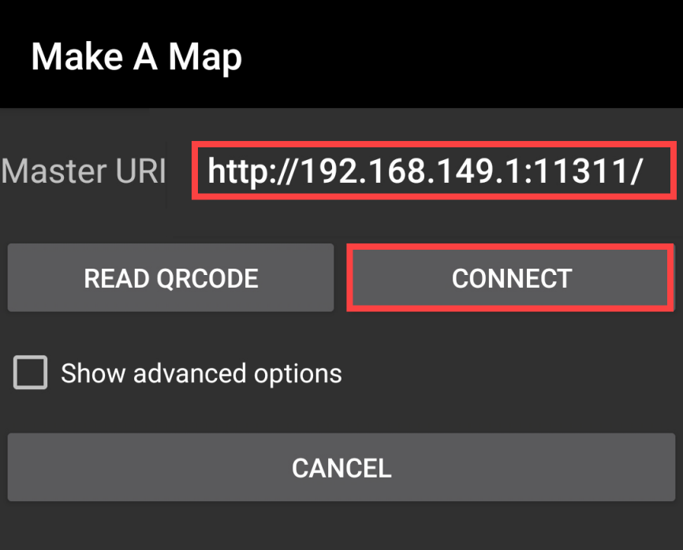

* **Using Make A Map**

> [!NOTE]
>
> * **The save button shown in the red box in the image below has no actual function. To save, follow the Save the Map steps below.**

The **Make A Map** interface is divided into three areas: The green box area displays the current camera view. The yellow box area shows the generated map. The blue box area controls the robot's movement.

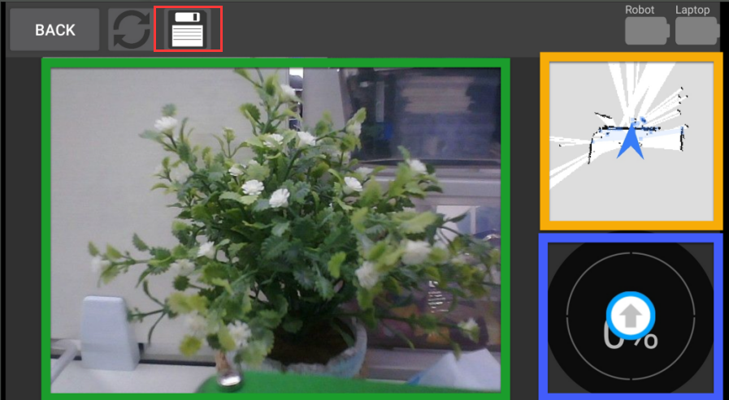

1. Drag the arrow icon in the blue box area in any direction to move the robot and create the map.

Dragging the arrow icons up, down, left, or right will move the robot forward, backward, turn left, or turn right, respectively.

2. During the robot's movement, the yellow box area displays the current map being built, while the blue box shows the robot's movement speed in percentage form.

* **Save the Map**

1. Return to the remote control software NoMachine, then click the terminal icon  in the system desktop to open a command-line window.

2. After the mapping is complete, open a new terminal window, enter the command, and press **Enter** to navigate to the folder where the map is stored.

```bash
roscd slam/maps
```

3. Then, enter the command and press **Enter** to save the map.

```bash
rosrun map_server map_saver map:=/map -f map_01
```

In this command, **map_01** is the map name, which can be renamed as needed. If the following prompt appears, it means the map has been saved successfully.


4. After the feature is closed, the app service can be activated either by using a command or by restarting the robot. If the app service is not enabled, related features in the app will not function properly. If the robot is rebooted, the app service will start automatically. Enter the command to restart the app service and wait for a **beep** from the buzzer, indicating that the service has started.

```bash
sudo systemctl restart start_app_node.service
```


## 5.2 Navigation Tutorial

### 5.2.1 ROS Robot Autonomous Navigation

#### 5.2.1.1 Overview

Autonomous navigation is the method of guiding a device to move from one point to another along a designated route. The main application scenarios of navigation include:

Land applications: Vehicle autonomous navigation, vehicle tracking and monitoring, intelligent vehicle information systems, Internet of Vehicles (IoV) applications, and railway operation monitoring.

Maritime applications: Ocean transport, inland river shipping, ship berthing, and docking.

Aviation applications: Route navigation, airport surface monitoring, and precision approach.


ROS provides a set of general navigation-related packages for robots, allowing developers to focus on higher-level functionalities rather than complex and low-level implementations such as navigation algorithms and hardware interactions. To utilize the navigation functions, simply configure each module’s parameter files according to the robot’s specific parameters. Existing packages can also be redeveloped to meet customized needs, greatly improving development efficiency and reducing product deployment time.

Overall, ROS navigation packages offer stable and comprehensive functions maintained by professional teams, enabling developers to focus on high-level implementation for more efficient development.

The ROS navigation package set, ros-navigation, is one of the most important components in the ROS system. The majority of autonomous mobile robots’ navigation functions are based on the ros-navigation system. The following sections will explain its operation, principles, installation, and usage.

#### 5.2.1.2 Navigation Operation

After completing the mapping process as outlined in the previous tutorial, and gaining a basic understanding of the 2D grid map, this section will use the constructed map to run autonomous navigation. This will provide a practical understanding of how the navigation system works. The main aspects involved include global maps, self-localization, path planning, motion control, and environmental perception.

The SLAM autonomous navigation process starts by manually controlling the robot for SLAM environmental scanning and saving the constructed map. Then, a pre-built offline map is loaded, and SLAM relocalization mode is activated to obtain the robot's real-time position and orientation. Next, a target point for the robot is specified. The robot uses its onboard LiDAR and other sensors for localization and environment detection, navigating along the planned path toward the target location. It can dynamically avoid obstacles along the way.

Before performing robot navigation, the map must be built and saved. This example uses the previously created grid map, which is loaded when the navigation node is started.

Before running the `navigation` package, remotely connect to the robot and execute the following command to check the map file path and name in the `navigation.launch` file.

Open a new terminal and enter the following command:

```
cd ros_ws/src/navigation/launch/include
```

```
vim load_map.launch
```

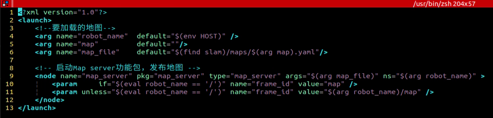

The above command loads the path of the map into this launch file, making it available for the `map_server` package to read. Once the map is loaded, the `navigation.launch` package from the parent directory can be used to start navigation.

```bash
roslaunch navigation navigation.launch
```

At this point, the node will have started, and when the terminal shows the content in the image below, it indicates that the navigation function has been successfully activated.

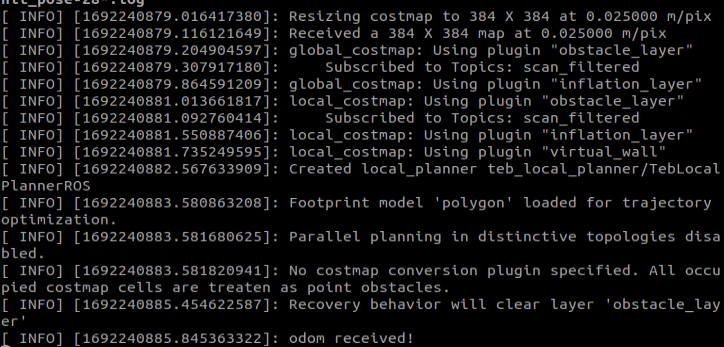

Open a new terminal window, enter the command, and press **Enter**.

```bash
roslaunch navigation rviz_navigation.launch
```

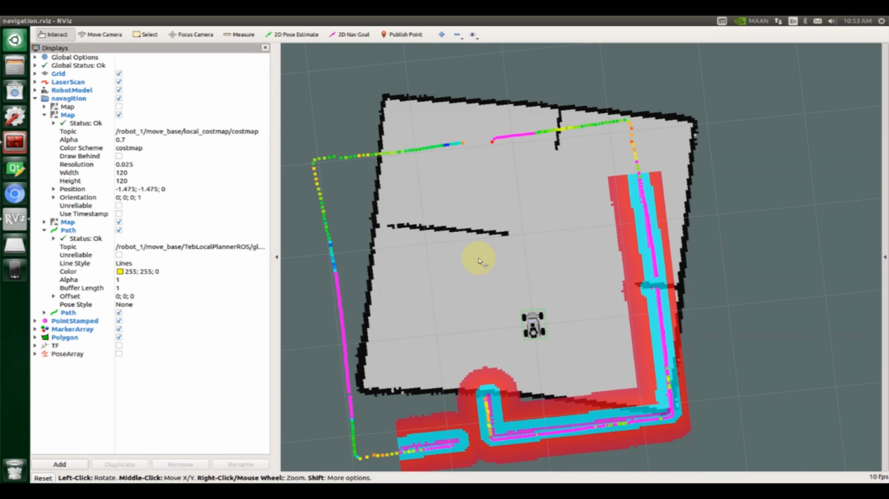

Before navigating, the robot’s initial position needs to be calibrated. This is done based on the robot's position and orientation in the actual situation shown in the image below. Use the **2D Pose Estimate** button in RVIZ to calibrate the robot. The tail of the arrow represents the position of the ROS robot, and the direction of the arrow indicates its orientation, as shown in the image below:

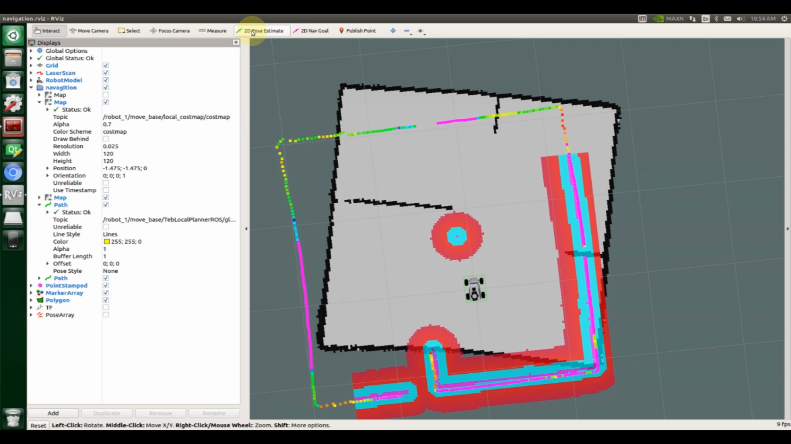

The current topic and node relationship diagram:

```bash
rosrun rqt_graph rqt_graph
```

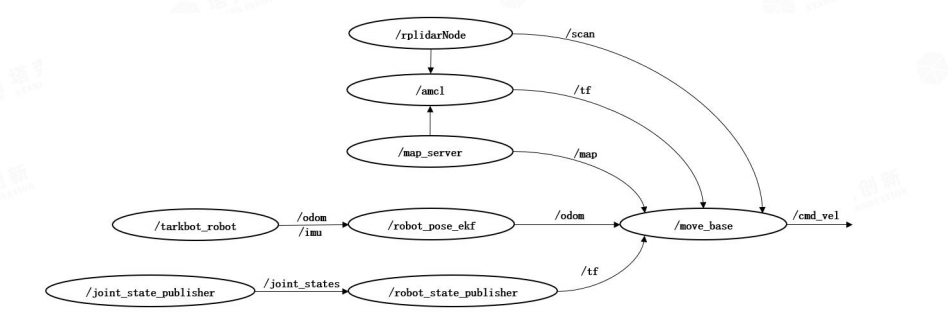

The tf tree can also be used to view communication information between nodes and topics.

```bash
rosrun rqt_tf_tree rqt_tf_tree
```

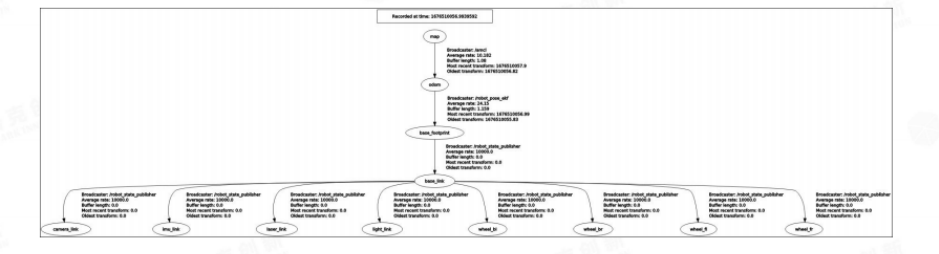

#### 5.2.1.3 Feature Package Explanation

This section provides a detailed explanation of the navigation packages and their parameter usage.

* **Principle and Framework Overview**

The navigation system uses navigation goals, localization data, and map information as inputs to generate control commands for the robot. The first step is to determine the robot's current position, then to identify the target destination, and finally, to find the optimal path and use control strategies to start navigation.

The navigation goal is usually set by an operator or triggered by a specific program, which answers the question: "Where do I want to go?" Localization data is typically provided by SLAM or other localization algorithms, answering the question: "Where am I?" Map information provides descriptions of obstacles between the starting and destination points, allowing the robot to use path planning algorithms to find a route. Based on this, the robot applies control strategies to output actual linear and angular velocity commands for navigation.

The ros-navigation system follows this basic approach. It is essentially a collection of packages, containing a variety of ROS packages and specific implementation nodes for various algorithms. These nodes can be categorized into three types: essential nodes, optional nodes, and robot platform-specific nodes, as shown in the diagram below. For more details: The white section represents the modules that are provided by ROS and are mandatory to use. The gray section represents modules that are provided by ROS but are optional. The blue section represents parts that need to be implemented independently.

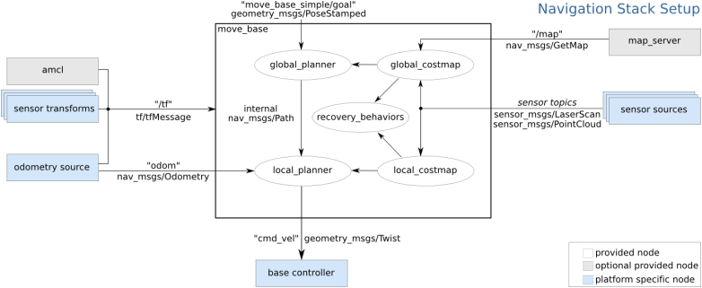

The move_base node is an essential node, while the amd and map_server nodes are optional. The sensor transforms, odometry source, sensor sources, and base_controller are platform-specific nodes. The core essential node, move_base, organizes its code using a plugin mechanism. This allows algorithms such as global planner, local planner, global costmap, local costmap, and recovery behaviors to be easily replaced or improved. The map_server node is responsible for providing the map, the amcl node provides localization data, the sensor driver nodes offer obstacle information, the odometry node gives motion feedback, and the chassis control node is responsible for executing movement commands. Below is a detailed explanation of each node.

**move base:** As the core node, it is responsible for receiving topic messages from other nodes and converting them into motion control commands for execution.

**sensor sources:** These are the sensor data sources that receive information from LiDAR sensors or depth cameras, which are used for real-time environmental detection, enabling functions like obstacle avoidance and navigation.

**sensor transforms:** Sensor coordinate transformation ensures that the sensor's coordinate system is aligned with the robot’s chassis and other coordinates. This conversion ensures that sensor data accurately represents the actual distance between the robot and obstacles.

**odometry source:** This provides the robot's odometry data, which records the robot's motion information on the map. It is the main source of localization data for the robot on the map.

**amcl:** Monte Carlo Localization (MCL) helps estimate the robot's position by using laser scanner data to assist with localization. Although this node is optional, it is highly effective in practice and is generally used.

**map_server:** The map service, which is used to import pre-built maps into the system. If the map created in the mapping section is to be used, the map_server function must be used for loading it.

**base controller:** This is the only node that outputs a topic from move_base. After receiving the above messages, move_base sends control commands to the robot's chassis to navigate to the specified target point.

**move base simple/goal:** This publishes a target point on the map. It can be done through the RViz tool or by directly publishing the topic.

The above provides an explanation of the components within the navigation framework. The configuration of the navigation package primarily focuses on these elements. Next, the ros-navigation system framework will be analyzed in terms of localization, cost maps, path planning, and recovery strategies.

First, the navigation package needs to collect the robot's sensor data to enable real-time obstacle avoidance. This includes 2D laser data sensor_msgs/LaserScan or 3D point cloud data sensor_msgs/PointCloud.

Next, the navigation package requires the robot to publish odometry information in the nav_msgs/Odometry format, along with the corresponding TF transformations.

Finally, the navigation package outputs control commands in the geometry_msgs/Twist format. These commands are parsed to control the robot’s movement and execute the required actions.

* **Package Installation**

The navigation system uses navigation goals, localization data, and map information as inputs to generate control commands for the robot. First, the robot’s current position must be determined, followed by its target destination.

There are two ways to install the ros-navigation package: one is to directly install the precompiled ros-navigation library to the system using apt-get. The command is as follows:

```bash
sudo apt-get install ros-\*-navigation
```

The second method is to download the ros-navigation source code and compile it manually. For learning purposes, binary installation is recommended for convenience and speed. If modifications to the code in ros-navigation are required to improve the algorithms, the package needs to be manually installed from source.

Navigation package wiki: [http://wiki.ros.org/navigation](http://wiki.ros.org/navigation)

> [!NOTE]
>
> **The navigation package has already been pre-installed on this robot at the factory, so there is no need for the user to install it again.**


### 5.2.2 AMCL Adaptive Monte Carlo Localization

**AMCL learning source Wiki:** <http://wiki.ros.org/amcl>

**AMCL package resources:** <https://github.com/ros-planning/navigation/tree/melodic-devel/amcl>

#### 5.2.2.1 AMCL Localization

Localization estimates the robot’s position within the global map. While SLAM also includes localization algorithms, SLAM localization is used for global map construction and occurs before navigation begins. In navigation, localization allows the robot to follow a planned route and verify that its actual trajectory aligns with expectations. The ROS navigation package ros-navigation provides the AMCL localization system for real-time robot positioning during navigation.

AMCL is a probabilistic localization system for 2D mobile robots. It implements the adaptive Monte Carlo localization method, using a particle filter with an existing map to estimate the robot’s position.

Localization addresses the relationship between the robot and surrounding obstacles, as path planning fundamentally relies on obstacle information to make navigation decisions. In an ideal scenario, knowing the robot’s global position and utilizing sensors like LiDAR for real-time obstacle detection would be enough for navigation. However, the real-time performance and accuracy of global localization are generally limited. Local localization, using sensors like odometry and IMU, provides better precision and ensures the robot's motion trajectory aligns with the IMU’s real-time accuracy. The AMCL node in the navigation package provides global localization by publishing map_odom. Global localization via AMCL is not mandatory. It can be replaced with other systems that provide map_odom, such as SLAM, UWB, or QR-code-based localization.

Global and local localization together establish a dynamic tf coordinate system (map → odom → base_footprint), while static tf coordinates between the robot's sensors are provided through the robot's URDF model. This TF framework enables correlation between the robot and obstacles. For example, if LiDAR detects an obstacle 3 meters ahead, the static transform between base_link and laser_link can be used to determine the obstacle’s relative position to the robot’s chassis. the transformation between the base_link and laser_link allows determining the relationship between the obstacle and the robot’s chassis.

#### 5.2.2.2 Particle Filtering

The Monte Carlo localization process simulates particle updates for a one-dimensional robot. First, a set of particles is randomly generated with position, orientation, or other state variables to be estimated. Each particle is assigned a weight that represents how closely it matches the actual system state. Next, the state of each particle is predicted for the next time step. This prediction moves the particles based on the expected behavior of the real system. Next, the particles' weights are updated based on measurements. Particles that match better with the measurements are given higher weights. Then resampling is performed, discarding unlikely particles and replacing them with more probable ones. Finally the weighted average and covariance of the particle set are calculated to obtain the state estimate.


The Monte Carlo method varies, but generally follows a specific pattern:

1. Define the domain of possible inputs.

2. Randomly generate inputs based on the probability distribution over the domain.

3. Perform deterministic calculations on the inputs.

4. Summarize the results.

There are two key considerations:

1. If the sampling points are not uniformly distributed, the approximation will be poor.

2. A large number of particles is required. If only a few points are randomly placed across the entire square, the approximation will generally be inaccurate. On average, as more points are added, the accuracy of the approximation improves.

The Monte Carlo particle filter algorithm has a wide range of applications in various fields, including physics, engineering, climatology, and computational biology.

#### 5.2.2.3 Adaptive Monte Carlo Localization

Adaptive Monte Carlo Localization (AMCL) can be seen as an improved version of the Monte Carlo localization algorithm. It enhances real-time performance by reducing execution time through the use of fewer samples. AMCL implements an adaptive, or KLD-sampling, version of the Monte Carlo localization method, where a particle filter is used with a pre-existing map to track a robot’s pose.

The AMCL node primarily relies on laser scans and a LiDAR-based map to exchange messages and compute pose estimation. The process begins by initializing the particle filter for the adaptive Monte Carlo localization algorithm using the parameters provided by the ROS system. If no initial pose is specified, the algorithm assumes the robot starts from the origin of the coordinate frame, which makes calculations more complex.

Therefore, it is recommended to set the initial pose in RViz using the 2D Pose Estimate button. For more details on Adaptive Monte Carlo Localization, you can also refer to the official wiki page: https://github.com/ros-planning/navigation.

#### 5.2.2.4 Costmap

Whether the SLAM map is generated by a LiDAR or a depth camera in 2D or 3D, it cannot be directly used for navigation. Instead, the map must be converted into a costmap, which in ROS is typically represented in a grid format. In a grid map, each cell is stored in one byte (8 bits), meaning it can hold values from 0 to 255. For navigation, we usually only need three states: Occupied (an obstacle is present), Free (no obstacle), and Unknown Space (unmapped area).

Before diving into costmap_2d, it is important to introduce the Bresenham algorithm. The Bresenham line algorithm is used to draw a straight line defined by two points, calculating the closest rasterized points along the line in an n-dimensional grid. The algorithm relies only on fast integer operations such as addition, subtraction, and bit shifting, and is widely used in computer graphics for line rendering. It was one of the earliest algorithms developed in this field.


When constructing the costmap, a set of virtual grid lines is drawn through the center of each row and column of pixels as shown in the figure. The algorithm then calculates the intersections of the line segment with the vertical grid lines in sequence from the start point to the end point, and based on the sign of the error term, determines which pixel in that column is closest to the intersection.

The core idea of the algorithm assumes that k = dy/dx. Since the line starts at a pixel center, the initial error term is d0 = 0. Each time the x-index increases by 1, the error value d increments by the slope value k, i.e., d = d + k. Whenever d ≥ 1, subtract 1 to keep d within 0 and 1. If d ≥ 0.5, the closest pixel is the one at the upper-right (x+1, y+1). If d < 0.5, the closest pixel is the one directly to the right (x+1, y). For convenience, let e = d – 0.5, with an initial value of -0.5 and an increment of k. When e ≥ 0, the algorithm selects the upper-right pixel (x+1, y+1). When e < 0, it selects the right pixel (x+1, y). To simplify calculations, integer arithmetic can be used to avoid division. Since the algorithm only depends on the sign of the error term, it can be reformulated as e1 = 2 * e * dx.


The Costmap2D class maintains the cost values for each grid cell. The Layer class serves as a virtual base class that unifies the interface for all costmap plugin layers. The most important interface functions include:

initialize(), which calls onInitialize() to initialize each costmap layer.

matchSize(), which in both the StaticLayer and ObstacleLayer classes calls the CostmapLayer’s matchSize() function to initialize each layer’s size, resolution, origin, and default cost value, ensuring consistency with the layered costmap. For the InflationLayer class, the cost table is calculated based on the inflation radius, where the cost values vary with distance. This allows querying the cost of inflated grid cells directly by distance. Meanwhile, the seen\_ array is defined to mark whether a grid cell has already been traversed. For the VoxelLayer class, the voxel grid size is initialized.

The updateBounds function adjusts the size range of the current costmap layer that needs updating. For the StaticLayer class, the update range of the costmap is set to the size of the static map. Note: The static layer is typically only used in the global costmap. For the ObstacleLayer class, sensor data in clearing_observations is traversed to determine obstacle boundaries.

Among them, the initialize function and matchSize function are only executed once. The updateBounds and updateCosts functions are executed periodically, and their execution frequency is determined by map_update_frequency.

The CostmapLayer class inherits from both the Layer class and the Costmap2D class, and provides several methods for updating cost values. Both the StaticLayer class and the ObstacleLayer class need to maintain the cost values of the instantiated costmap layer, so they both inherit from the CostmapLayer class. The StaticLayer class updates its costmap using static grid map data. The ObstacleLayer class updates its costmap using sensor data. Compared with the ObstacleLayer class, the VoxelLayer class additionally considers data along the z-axis. The difference in effect mainly lies in obstacle clearing. One works on a 2D plane, while the other performs clearing in 3D space.


The costmap is highly flexible in representing obstacles, allowing specific layers to be created as needed to maintain obstacle information of interest. If the robot is equipped only with a LiDAR, an Obstacles layer should be created to maintain the obstacle information detected by LiDAR scans. If the robot is additionally equipped with ultrasonic sensor, a Sonar layer should be created to maintain the obstacle information detected by sonar scans. Each layer can define its own obstacle update rules, such as adding obstacles, removing obstacles, or updating the confidence level of obstacle points, which greatly enhances the scalability of the navigation system.

For more details, please refer to:

ROS navigation wiki: <http://wiki.ros.org/navigation>

ROS move_base wiki: <http://wiki.ros.org/move_base>


### 5.2.3 Global Path Planning

Depending on the robot’s understanding of the environment, the nature of the environment, and the algorithm being used, path planning can generally be classified into environment-based algorithms, map-knowledge-based algorithms, and completeness-based algorithms.


In autonomous navigation, commonly used path planning algorithms include Dijkstra, A\*, D\*, PRM, RRT, genetic algorithms, ant colony algorithms, and fuzzy algorithms.

Among these, Dijkstra and A* are graph-based search algorithms. ROS navigation packages integrate several global path planning plugins such as navfn, global planner, and carrot planner. One option is to choose a global planner and load it into move_base for use. Alternatively, third-party global path planning plugins, such as SBPL_Lattice_Planner or srl_global_planner, can be loaded into move_base, or a custom global path planner can be developed according to the nav_core interface specifications.


Path planning enables a mobile robot to autonomously reach the target point. The navigation planning framework can be divided into three layers.

1. Global Path Planning Layer: Based on a given target, it uses the weighted costmap information to generate a global costmap and plan a global path from the start point to the goal, which serves as a reference for local path planning.
2. Local Path Planning Layer: As the local planning component, it uses the locally generated costmap and nearby obstacle information to compute a feasible local path.
3. Behavior Execution Layer: Integrates high-level commands with the path planning results to determine the robot’s current actions.

As one of the key research areas in mobile robotics, the performance of path planning algorithms plays a decisive role in the overall efficiency of robot navigation.

#### 5.2.3.1 Dijkstra Algorithm

The Dijkstra algorithm is a classic shortest path algorithm and a typical example of a single-source shortest path approach. Its main feature is expanding outward from the starting point layer by layer—similar to a breadth-first search but with edge weights considered—until the destination is reached. For this reason, it is one of the most widely used algorithms for global path planning.

Illustration of the algorithm process:

1. At the beginning, set dis[start] = 0 and initialize all other nodes to inf.

   

2. In the first iteration, the node with the smallest distance value, node 1, is selected and marked as visited. Then, the distance values of all blue nodes connected to node 1 are updated, resulting in dis[2] = 2, dis[3] = 4, and dis[4] = 7.

   

3. In the second iteration, the node with the smallest distance value, node 2, is selected and marked as visited. The distance values of all unvisited nodes connected to node 2 are then updated, resulting in dis[3] = 3 and dis[5] = 4.

   

4. In the third iteration, the node with the smallest distance value, node 3, is selected and marked as visited. The distance values of all unvisited nodes connected to node 3 are then updated, resulting in dis[4] = 4.

   

5. In the following two iterations, nodes 4 and 5 are marked as visited, and the algorithm terminates, yielding the shortest paths to all nodes.

For more details on the Dijkstra algorithm and usage examples, refer to the wiki link: http://wiki.ros.org/navfn>

#### 5.2.3.1 A* Algorithm

The A* algorithm is an optimized version of Dijkstra’s algorithm for a single destination. While Dijkstra’s algorithm finds paths to all nodes, A* finds the path to a specific node or the nearest node among several targets. It prioritizes paths that appear closer to the goal.

The A* algorithm uses the formula F = G + H, where G represents the cost to move from the start to a given cell, and H is the estimated cost from that cell to the goal. There are two common ways to calculate H:

1. Calculate the horizontal and vertical movement distances only, using the Manhattan distance method, without considering diagonal movement.


2. Calculate the horizontal and vertical movement distances while allowing diagonal movement, using the diagonal distance method.


For more details on the A* algorithm and usage examples, refer to the wiki link: http://wiki.ros.org/globalplanner

And the redblobgames website: <https://www.redblobgames.com/pathfinding/a-star/introduction.html#graphs>


### 5.2.4 Local Path Planning

Global path planning takes the start point and the goal point as input and uses obstacle information from the global map to plan a global path from the start to the goal. The global path consists of a series of discrete waypoints and only considers static obstacles, so it cannot be directly used for navigation control and serves merely as a high-level reference.

#### 5.2.4.1 DWA Algorithm

* **Description**

The DWA algorithm, also known as the Dynamic Window Approach, is a classical method for mobile robot path planning and motion control. The algorithm searches for the optimal combination of linear and angular velocities within the velocity space to ensure safe navigation on a known map. The following is a basic description of the DWA algorithm along with some formulas:


The core idea of DWA is that at each moment, the robot considers its current state and sensor information, then generates a set of possible motion trajectories in the velocity and angular velocity space, called the dynamic window, and evaluates these trajectories to select the best one. Evaluation criteria usually include obstacle avoidance, maximizing forward speed, and minimizing angular velocity. By continuously repeating this process, the robot can plan its motion trajectory in real time to handle dynamic environments and obstacles.

* **Formulas:**

1. Robot state: position (x, y) and orientation θ.

2. Motion control parameters: linear velocity V and angular velocity ω.

3. Velocity and angular velocity sampling range: V<sub>min</sub>, V<sub>max</sub>, ω<sub>min</sub>, and ω<sub>max</sub>.

4. Time step: Δt.

Formulas:

(1) Velocity sampling: The DWA algorithm first samples the linear and angular velocities in the state space to generate a set of possible velocity-angular velocity pairs, known as the dynamic window.

V<sub>samples</sub> = \[v<sub>min</sub>, v<sub>max</sub>]

ω<sub>samples</sub> = \[-ω<sub>max</sub>, ω<sub>max</sub>]

V<sub>samples</sub> represents the linear velocity sampling range, and ω<sub>samples</sub> represents the angular velocity sampling range.

(2) Motion simulation: For each velocity–angular velocity pair, the DWA algorithm simulates the robot's motion and computes the trajectory resulting from applying that velocity–angular velocity combination from the current state.

x(t+1) = x(t) + v * cos(θ(t)) *Δt

y(t+1) = y(t) + v * sin(θ(t)) *Δt

θ(t+1) = θ(t) + ω * Δt

The variables x(t) and y(t) represent the robot’s position, θ(t) represents the robot’s orientation, v represents the linear velocity, ω represents the angular velocity, and Δt represents the time step.

(3) Trajectory Evaluation: For each generated trajectory, the DWA algorithm evaluates it using an evaluation function, such as obstacle avoidance, maximum velocity, and minimum angular velocity.

Obstacle avoidance evaluation: Checks whether the trajectory intersects with any obstacles.

Maximum velocity evaluation: Checks whether the maximum linear velocity along the trajectory is within the allowed range.

Minimum angular velocity evaluation: Checks whether the minimum angular velocity along the trajectory is within the allowed range. The evaluation functions can be defined and adjusted according to task requirements.

(4) Selecting the best trajectory: The DWA algorithm selects the trajectory with the best evaluation score as the robot's next movement.


* **Extensions**

The DWA algorithm is a foundational algorithm in the field of mobile robotics, with several extended and improved versions, such as DWA, e-DWA, and DP-DWA, designed to enhance path planning performance and efficiency.

DWA Algorithm Extensions and Learning Links:

1\. DWA algorithm extension: <https://arxiv.org/abs/1703.08862>

2\. Enhanced DWA (e-DWA) algorithm: <https://arxiv.org/abs/1612.07470>

3\. DP-DWA algorithm (DP-based Dynamic Window Approach): <https://arxiv.org/abs/1909.05305>

4\. For more details, visit the wiki: http://wiki.ros.org/dwa_local_planner

These links provide comprehensive information and further research on the DWA algorithm and its extensions.

#### 5.2.4.2 TEB Algorithm

* **Description**

The TEB (Timed Elastic Band) algorithm is a method used for path planning and motion planning, primarily applied in robotics and autonomous vehicles. The core idea of the TEB algorithm is to model the path planning problem as an optimization problem, where the goal is to generate an optimal trajectory within a given time while satisfying the robot’s or vehicle’s dynamic constraints and obstacle avoidance requirements. Key features of the TEB algorithm include:

1\. Time-layered representation: The TEB algorithm introduces a time-layered concept, dividing the trajectory into multiple time steps. Each time step corresponds to a specific position of the robot or vehicle along the trajectory, which helps enforce temporal constraints and avoid collisions.

2\. Trajectory parameterization: The trajectory is parameterized as a series of displacements and velocities, making it easier to optimize. Each time step has an associated displacement and velocity parameter.

3\. Constraint optimization: The algorithm takes into account the robot’s dynamic constraints, obstacle avoidance constraints, and trajectory smoothness constraints. These are incorporated into the optimization problem as part of the objective function.

4\. Optimization solving: TEB uses optimization techniques, such as quadratic programming (QP) or nonlinear programming (NLP), to compute the optimal trajectory parameters while satisfying all constraints.


* **Formulas:**

The figure below illustrates the objective function used in the TEB algorithm:


For more details:

J(x) is the objective function, where x represents the trajectory parameters.

w<sub>smooth</sub> and w<sub>obstacle</sub> are the weights for smoothness and obstacle avoidance.

H is the smoothness penalty matrix.

f(x<sub>i</sub>,o<sub>j</sub>) represents the obstacle cost function between trajectory point x<sub>i</sub> and obstacle o<sub>j</sub>.

1. State definition:

First, define the robot’s state in the path planning problem.

Position: P=[X,Y], representing the robot’s position in a 2D plane.

Velocity: V=[Vx,Vy], representing the robot’s velocity along the X and Y axes.

Time: t, representing time.

Control input: u=[ux,uy], representing the robot’s control inputs, which can be velocity or acceleration.

Robot trajectory: x(t)=[p(t),v(t)], representing the robot’s state at time t.

2. Objective Function:

The core of the TEB algorithm is an optimization problem, with the goal of minimizing an objective function composed of multiple components:


For more details:

J<sub>smooth</sub>(x): The smoothness objective, used to ensure that the generated trajectory is smooth.

J<sub>obstacle</sub>(x): The obstacle avoidance objective, used to prevent collisions with obstacles.

J<sub>dynamic</sub>(x): The dynamics objective, used to ensure that the trajectory satisfies the robot’s dynamic constraints.

3. Smoothness Objective Jsmooth(x):

The smoothness objective typically involves the curvature of the trajectory to ensure it is smooth. It can be expressed as:


where k(t) represents the curvature.

4. Obstacle Avoidance Objective Jobstacle(x):

The obstacle avoidance objective calculates the distance between trajectory points and obstacles, penalizing points that are too close to obstacles. The specific obstacle cost function f(x,o) can be customized according to the application requirements.


5. Dynamics Objective J<sub>dynamic</sub>(x):

The dynamics objective ensures that the generated trajectory satisfies the robot’s dynamic constraints. This can be defined based on the robot’s kinematic and dynamic model and typically involves constraints on velocity and acceleration. Typically, this involves constraints on velocity and acceleration.

6. Optimization:

Finally, the TEB algorithm formulates the above objective functions as a constrained optimization problem, where the optimization variables include trajectory parameters, time allocation, and control inputs. The optimization problem is typically solved as a nonlinear programming (NLP) problem.

* **Extensions**


The TEB algorithm is an important technique in the field of path planning, and there are many extended and improved variants. The following resources and topics can help you gain a deeper understanding of the TEB algorithm and related concepts:

1\. Original TEB Paper: One of the best ways to learn is to study the original TEB paper to gain insights into its principles and applications.

\- Original TEB Paper: "**Trajectory modification considering dynamic constraints of autonomous robots**" by M. Rösmann et al.

2\. TEB Implementation in ROS: The ROS package for the TEB algorithm is a common implementation that can be used for robot path planning.

ROS TEB Local Planner Package: https://github.com/rst-tu-dortmund/teb_local_planner<https://github.com/rst-tu-dortmund/teb_local_planner>

Wiki page: <http://wiki.ros.org/teb_local_planner>

These links provide resources for users to study the TEB algorithm in depth and explore related path planning topics.


### 5.2.5 LiDAR Single-Point and Multi-Point Navigation and Obstacle Avoidance

Before starting navigation, the map must be pre-scanned and built. Refer to the [5.1 Mapping Tutorial](#anther5.1) for guidance.

#### 5.2.5.1 Single-Point Navigation

The navigation system provides a basic interface for autonomous navigation, allowing the robot to navigate from point A to point B. In real-world applications, however, robots often need to perform more complex tasks. These tasks are typically composed of several basic actions, organized together in the form of a state machine. This chapter focuses on implementing the robot’s multi-point loop navigation functionality.

This section will cover how the robot moves to the selected target destination.

* **Operation**

1. Power on the robot and connect it via the NoMachine remote control software. For detailed information on connecting to a remote desktop, please refer to section [1.7.2 AP Mode Connection Steps](https://wiki.hiwonder.com/projects/ROSOrin/en/jetson-nano-version/docs/1_ROSOrin_User_Manual.html#ap-mode-connection-steps) in the user manual.

2. Click the terminal icon  in the system desktop to open a command-line window.

3. Enter the following command and press **Enter** to stop the app auto-start service:

```bash
sudo systemctl stop start_app_node.service
```

4. Open a new terminal window, enter the command to start the navigation service, and press **Enter**.

```bash
roslaunch navigation navigation.launch map:=map_01
```

The **map_01** at the end of the command is the map name and can be modified as needed. The map is stored at the directory of **/home/ros_ws/src/slam/maps**.

5. Open a new terminal window, enter the command to launch the model viewer software, and press **Enter**.

```bash
roslaunch navigation rviz_navigation.launch
```


In the software menu bar, **2D Pose Estimate** is used to set the robot’s initial position, **2D Nav Goal** is used to set a single target point, and **Publish Point** is used to set multiple target points.

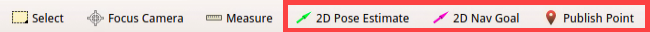

Click the icon, then select a location on the map as the target point and simply click once at that point with the mouse. Once the target is selected, the robot will automatically generate a route and move toward the target point.

Once the target point is set, the map will display two paths: the line formed by blue squares represents the straight-line path from the robot to the target, while the dark blue line represents the robot’s planned path.

When encountering obstacles, the robot will navigate around them, continuously adjusting its orientation and following the updated path.

* **Package Description**

The LiDAR single-point functionality package path is: **navigation/launch/navigation.launch**.

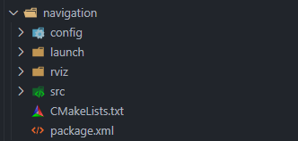

It contains the following folders, such as `config`, `launch`, `rivz`, and `src`, and files, such as `CMakeLists.txt` and `package.xml`.

`config`: Contains configuration files related to navigation, used for invoking navigation algorithms, including the path planner-global and local paths, and robot navigation localization configuration files-move_base, as shown in the image below.

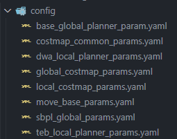

`launch`: Contains launch files related to navigation, including localization, map loading, navigation methods, and simulation models, as shown below.

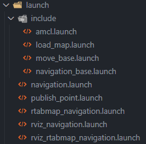

`rviz`: Loads parameters for the RViz visualization tool, including robot RViz configuration files for different navigation algorithms, and navigation configuration files, as shown in the image below.

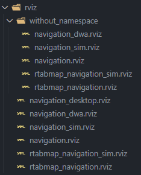

`src:`: Contains custom source files for calling navigation algorithms, such as publishing multi-point navigation target points, as shown in the image below.


`Cmakelists.txt`: ROS package configuration file.

`Package.xml`: Configuration information file for the current package.

#### 5.2.5.2 Multi-Point Navigation

* **Operation**

> [!NOTE]
>
> **Commands must be entered with correct capitalization. The Tab key can be used to auto-complete keywords.**

1. Power on the robot and connect it via the NoMachine remote control software. For detailed information on connecting to a remote desktop, please refer to section [1.7.2 AP Mode Connection Steps](https://wiki.hiwonder.com/projects/ROSOrin/en/jetson-nano-version/docs/1_ROSOrin_User_Manual.html#ap-mode-connection-steps) in the user manual.

2. Click the terminal icon  in the system desktop to open a command-line window.

3. Enter the following command and press **Enter** to stop the app auto-start service:

```bash
sudo systemctl stop start_app_node.service
```

4. Open a new terminal window, enter the command to start the navigation service, and press **Enter**.

```bash
roslaunch navigation navigation.launch map:=map_01
```

The **map_01** at the end of the command is the map name, which can be modified according to the requirements. The map storage path is **/home/ws/src/slam/maps**.

5. Open a new terminal window, enter the command to launch the model viewer software, and press **Enter**.

```bash
roslaunch navigation rviz_navigation.launch	
```

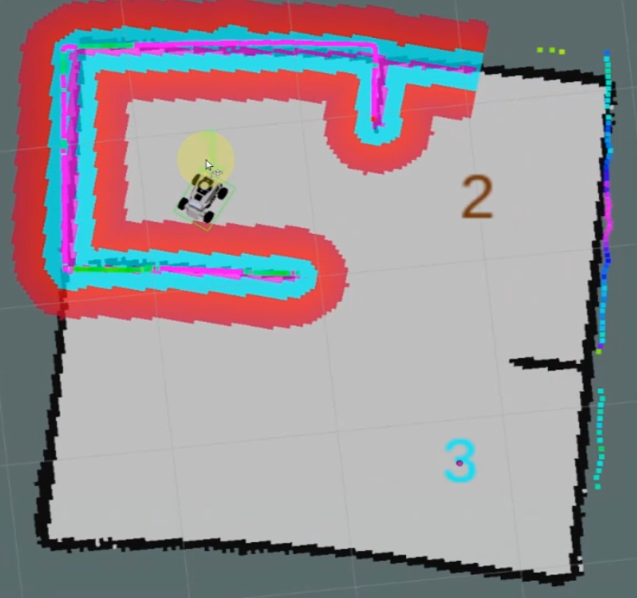

6. Open a new command-line terminal window, enter the command to start multi-point navigation, and press **Enter**.

```bash
roslaunch navigation publish_point.launch
```

7. In the software menu bar, 2D Pose Estimate is used to set the robot’s initial position, 2D Nav Goal is used to set a single target point, and Publish Point is used to set multiple target points.


8. Click the icon , then left-click on a point on the map to set it as the target point. The remaining target points can be set using the same procedure.

> [!NOTE]
>
> **Click Publish Point before setting each target point.**

9) The last set target point will be marked with a purple dot. By default, the map displays only one purple dot. The number of visible purple dots can be changed by modifying the **History Length** under **PointStamped** in the left-side properties panel.


10) Once the target points are set, the robot will automatically generate a travel route based on the order of the target points and proceed to each target point in sequence. To cancel multi-point navigation, open the command window where multi-point navigation was started, press **Ctrl+C**, and then restart the process to set up multi-point navigation again.

11) The map will display two paths: the line formed by blue squares represents the straight-line path from the robot to the target, while the dark blue line represents the robot’s planned path.

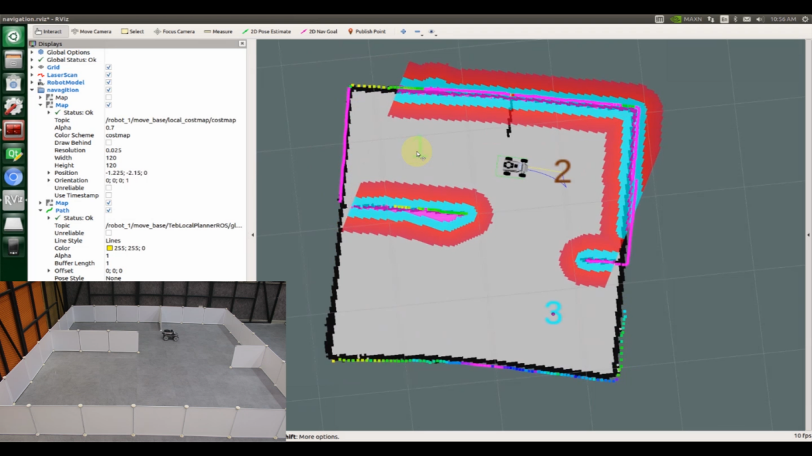

> [!NOTE]
>
> **To interrupt navigation, set the robot’s current position as the target point using the 2D Nav Goal tool. If the robot is lifted or its position is changed by external forces, the initial position and target points need to be reset.**


### 5.2.6 RTAB-VSLAM 3D Navigation

#### 5.2.6.1 Algorithm Overview and Principles

For an introduction and explanation of the RTAB-VSLAM algorithm, refer to section [5.1.10 RTAB-VSLAM 3D Mapping](#anther5.1.10) for study and reference.

#### 5.2.6.2 Operation Steps

1. Power on the robot and connect it via the NoMachine remote control software. For detailed information on connecting to a remote desktop, please refer to section [1.7.2 AP Mode Connection Steps](https://wiki.hiwonder.com/projects/ROSOrin/en/jetson-nano-version/docs/1_ROSOrin_User_Manual.html#ap-mode-connection-steps) in the user manual.

2. Click the terminal icon  in the system desktop to open a command-line window.

3. Enter the following command and press **Enter** to stop the app auto-start service:

```bash
sudo systemctl stop start_app_node.service
```

4. Open a new command-line terminal, enter the command, and press **Enter** to start the navigation service. If no errors appear, the service has started successfully.

```bash
roslaunch navigation rtabmap_navigation.launch
```

5. Open a new terminal window, enter the command to launch the model viewer software, and press **Enter**.

```bash
roslaunch navigation rviz_rtabmap_navigation.launch
```

During navigation, the point cloud data from the depth camera can also be observed.

6. Open a new command-line terminal window, enter the command to start multi-point navigation, and press **Enter**.

```
roslaunch navigation publish_point.launch
```

Open the **Rtabmap_cloud** tab and change the **Download namespace** field to **robot_1/rtabmap**.

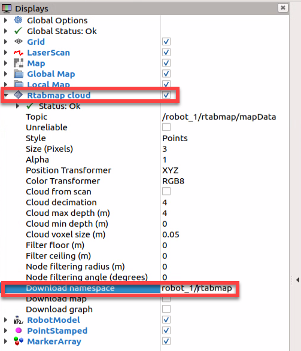

7) Check **Download map** to load the map.

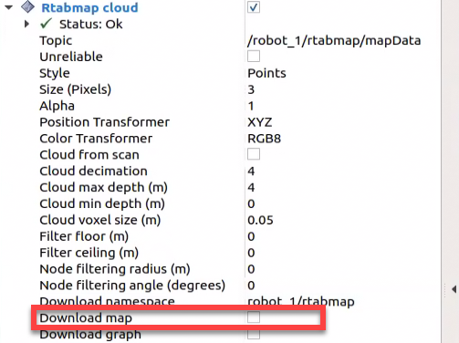


The software menu bar contains two tools: 2D Nav Goal and Publish Point.

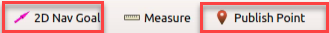

The **2D Nav Goal** is used to set a single navigation goal for the robot, while Publish Point is used to set multiple navigation goals. To cancel multi-point navigation, open the command window where multi-point navigation was started, press **Ctrl+C**, and then restart the process to set up multi-point navigation again.

To set a target point, click **2D Nav Goal** in the menu bar, then click once on the desired location in the map interface. Once the target is selected, the robot will automatically generate a route and move toward the target point.


After the target is set, the map will display two paths: the red line represents the straight-line path from the robot to the target, while the blue line shows the robot’s planned trajectory.

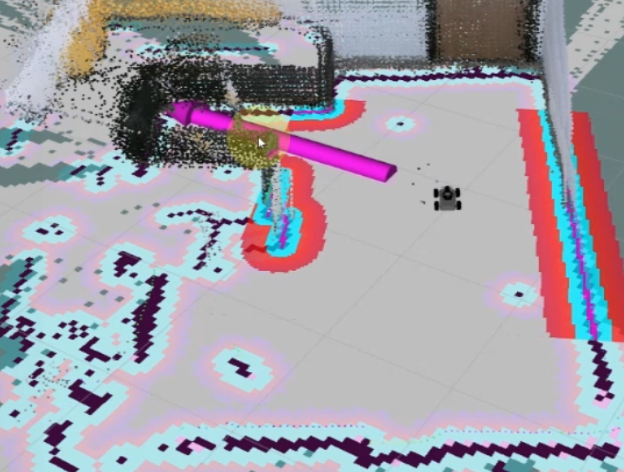

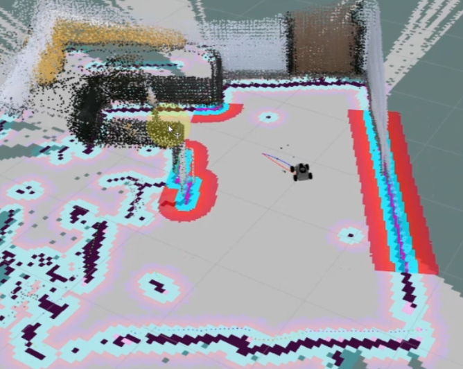

After the feature is closed, the app service can be activated either by using a command or by restarting the robot. If the app service is not enabled, related features in the app will not function properly. If the robot is rebooted, the app service will start automatically. Enter the command to restart the app service and wait for a beep from the buzzer, indicating that the service has started.

```bash
sudo systemctl restart start_app_node.service
```


### 5.2.7 App Navigation

This section covers how to use the **Map Nav** app to control the robot for navigation within the map, along with detailed operational instructions.

#### 5.2.7.1 App Installation

The installation packages for the **Make A Map** and **Map Nav** apps are located in the directory [2. Softwares \\ 6. App Mapping and Navigation Installation Packages](https://drive.google.com/drive/folders/1Z4VPnEeeXRvYvscgUZvYmfyMkPd8Akcp). These packages can be transferred to a mobile device for installation.

> [!NOTE]
>
> **The installation packages are available only for Android devices.**

#### 5.2.7.2 App Navigation Steps

* **Enable Service**

1. Power on the robot and connect it via the NoMachine remote control software.

2. Click the terminal icon  in the system desktop to open a command-line window.

3. Enter the command and press **Enter** to stop the auto-start services of the app, including services for the wireless controller, depth camera, chassis control, and others.

```bash
sudo systemctl stop start_app_node.service
```

4. Open a new command-line terminal window and execute the command to start the navigation service.

```bash
roslaunch navigation navigation.launch map:=map_app app:=true
```

5. To close the currently running program in each terminal window, press **Ctrl+C**.

After the feature is closed, the app service can be activated either by using a command or by restarting the robot. If the app service is not enabled, related features in the app will not function properly. If the robot is rebooted, the app service will start automatically. Enter the command to restart the app service and wait for a beep from the buzzer, indicating that the service has started.

```bash
sudo systemctl restart start_app_node.service
```

* **Connecting to Map Nav**

1. Go to the settings on the mobile device and connect to the hotspot generated by the robot, which starts with **HW**. The hotspot password is **hiwonder**.

2. Open the app **Map Nav** and enter **http://192.168.149.1:11311/** in the **Master URI** field, then click the **CONNECT** button.


* **Using Map Nav**

> [!NOTE]
>
> **The button highlighted in the blue box in the image has no actual function, as the map will load automatically.**

The **Map Nav** interface is divided into four areas: The green box area displays the map, the yellow box area shows the live camera feed, and the red box area is used to control the robot’s movement. The **Set Pose** and **Set Goal** options are used with the green box area to set the robot’s initial position and navigation target points.

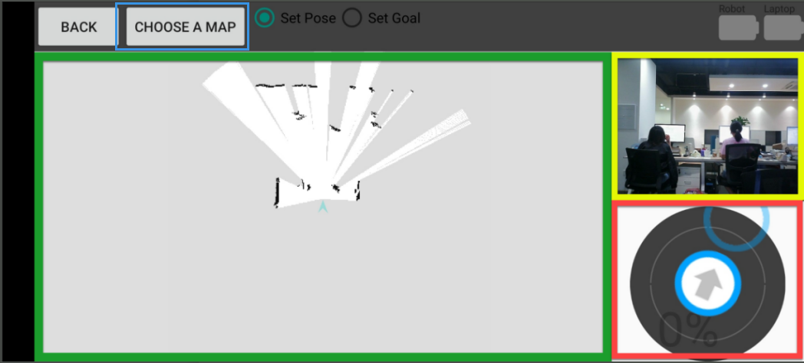

1. To set the initial position and orientation, select **Set Pose** and long-press on a point on the map.

2. Drag the arrows in the red box in all directions to move the robot and perform position calibration.

Dragging the arrow icons up, down, left, or right will move the robot forward, backward, turn left, or turn right, respectively.

3. Select **Set Goal** and long-press on a point on the map to set it as the navigation target.

4. Once the initial position and navigation target points are set, the robot will automatically generate a route and move from the initial position to the target point.

During movement, the red box area displays the robot’s speed as a percentage.