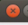
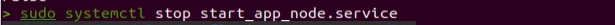
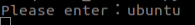
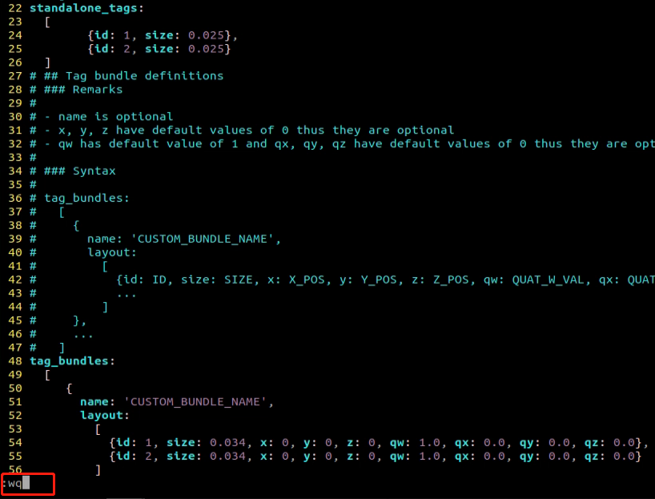
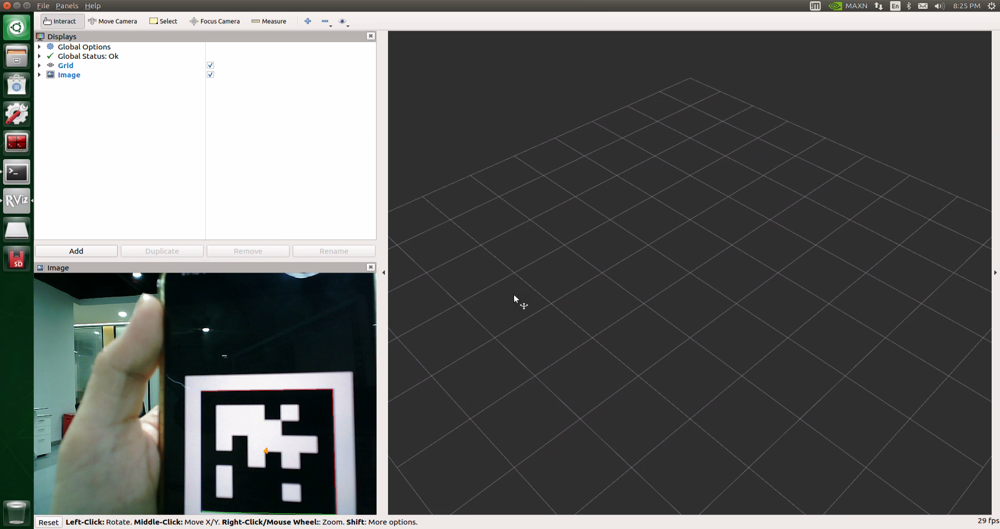
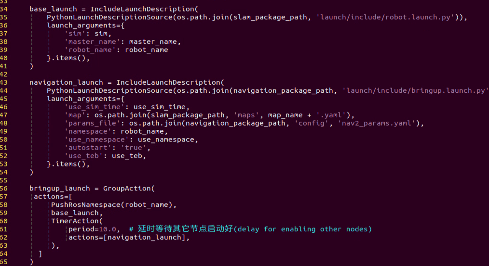
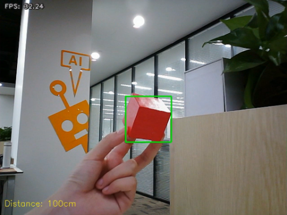

# 6\. ROS1- ROS+OpenCV Course

## 6.1 Color Threshold Adjustment

Various light sources can affect colors differently, leading to discrepancies in recognition. To address this issue, you can utilize LAB TOOL to adjust the color threshold, ensuring more accurate and consistent color recognition.

### 6.1.1 Launching and Closing LAB TOOL

> [!NOTE]
> 
> * **Commands must be entered with correct capitalization. The Tab key can be used to auto-complete keywords.**
> 
> * **Please strictly follow the steps below to open LAB TOOL. Otherwise, the tool cannot be opened.**

1) Power on the robot and connect it via the NoMachine remote control software.

2) Click the terminal icon  in the system desktop to open a command-line window.

3) Enter the following command and press **Enter** to stop the app auto-start service:

```bash
sudo systemctl stop start_app_node.service
```

4) Run the command and press **Enter** to enable camera service.

```bash
roslaunch peripherals depth_cam.launch
```


5) Open a new terminal and enter the command to start the LAB Tool to launch it.

```
python3 /home/ubuntu/software/lab_tool/main.py
```


For the instructions and use of the interface buttons, you can refer to the subsequent content of this document. To close it, click  and select **Yes** in the pop-up prompt.


After closing the LAB Tool, press **Ctrl+C** to close the terminal. Then, enter the command:

```bash
sudo systemctl restart start_app_node.service
```

Once the app auto-start service restarts, the robotic arm will return to its initial position.

> [!NOTE]
> 
> **If the app auto-start service is not running, some app functions may not work properly. If the auto-start command has not been executed, restarting the robot will also automatically restart the APP auto-start service.**

### 6.1.2 LAB TOOL Interface Introduction

LABTOOL is divided into two parts, including the image display area and the recognition adjustment area.


1. Image display area: The processed camera feed is shown on the left, and the raw feed is shown on the right.

> [!NOTE]
> 
> **If the video feed fails to display, indicating a camera connection error, check the camera cable for a secure connection or reconnect it.**

2. Adjustment Panel: Allows color-threshold tuning. The functions of each button are listed below.

| **Icon**                                                     | **Function**                                                 |
| ------------------------------------------------------------ | ------------------------------------------------------------ |
|  | Sliders L, A, and B are respectively used to adjust L, A, and B components of the camera returned image. The left sliders set the **minimum** values for each channel, and the right sliders set the **maximum** values. |
|  | Select the target color for threshold tuning.                |
|  | Delete the selected color.                                   |
|  | Add a new detectable color.                                  |
|  | Save the adjusted value.                                     |
|  | Switch the camera between the depth camera and the monocular camera. |
|  | Exit from the LAB TOOL.                                      |


### 6.1.3 Adjust Color Threshold

1) Open LAB TOOL, and select the color in the drop-down menu. Take adjusting the red color, for example.


2) Modify all **min** values of L, A, and B to **0**, and **max** values to **255**.


3) Put the red block within the camera frame. According to the LAB color space, adjust L, A, and B components to approach the zone of the target color.


If the red area appears close to **+a**, increase the A component. Keep the A component’s **max** value unchanged and raise its **min** value until the target object in the left display turns white while all other areas turn black.


4) Based on the environment, modify the value of L and B. Increase the L component’s **min** value if the red tone is too light, or reduce its **max** value if it is too dark. Increase the B component’s **min** value if the red tone is too warm, or reduce its **max** value if it is too cool.


LAB Threshold Adjustment Parameter

| **Color Component** | **Range** | **Corresponding Color Zone** |
| ------------------- | --------- | ---------------------------- |
| L                   | 0~255     | Black-White（-L ~ +L）       |
| A                   | 0~255     | Green-Red（-a ~ +a）         |
| B                   | 0~255     | Blue-Yellow（-b ~ +b）       |


5) Click **Save** in the Adjustment Panel to save the adjusted color threshold parameter.


### 6.1.4 Add New Color for Detection

In addition to the built-in detectable colors, additional colors can be added. Yellow is used as an example below. The steps are as follows:

1) Open the LAB TOOL and click the **Add** button.


2) Then fill in the color name in the **name** field, and click **OK**.


3) Select the newly added color from the color list.


4) Face the camera at the yellow block. And drag the sliders of L, A, and B to adjust the color threshold till the object on the left turns white and the other area turns black.


5) Click **Save** in the Adjustment Panel to save the adjusted color threshold parameter.


## 6.2 Color Recognition

This section demonstrates the recognition of red, green, and blue objects using OpenCV, with the results displayed on the video feed. Before starting the feature, please prepare three objects in these colors: red, green, and blue.

### 6.2.1 Recognition Process

Firstly, the program will acquire the RGB image of the camera, scale the image, and perform Gaussian filtering on the image to convert the image color space from RGB to LAB.

Based on this, color thresholds are used to identify the color of the object within the circle. A mask is then applied to the image, which involves selecting parts of the image, graphics, or objects to globally or locally block out areas in the image for processing.

After masking, morphological operations, including opening and closing, are performed on the object image to refine the results.

**Opening operation: Involves erosion followed by dilation. Effect: Removes small objects, smooths object boundaries, and does not affect object area. It can remove small particle noise and separate objects that are stuck together.**

**Erosion: Removes boundary pixels of an object, causing the edges to shrink inward. This operation can eliminate objects smaller than the structuring element.**

**Dilation: Expands the boundary pixels of an object by merging surrounding background pixels that are in contact with the object, causing the edges to grow outward.**

Finally, the recognition results are overlaid on the return image.

### 6.2.2 Operation

> [!NOTE]
> 
> **Commands must be entered with correct capitalization. The Tab key can be used to auto-complete keywords.**

1) Power on the robot and connect it via the NoMachine remote control software.

2) Click the terminal icon  in the system desktop to open a command-line window.

3. Enter the following command and press **Enter** to stop the app auto-start service:

```
sudo systemctl stop start_app_node.service
```

4. Run the command and press **Enter** to enable camera service.

```
roslaunch peripherals depth_cam.launch
```


5) Navigate to the program directory and start the color recognition feature by entering the following command:

```
roscd example/scripts/color_detect && python3 color_detect_demo.py
```


6) To exit the feature, press **Ctrl+C** in the terminal. If the program does not close successfully, try pressing **Ctrl+C** again.

After the feature is closed, the app service can be activated either by using a command or by restarting the robot. If the app service is not enabled, related features in the app will not function properly. The app service will start automatically when the robot is restarted.

Enter the command to restart the app service and wait for a beep from the buzzer, indicating that the service has started.

```
sudo systemctl restart start_app_node.service
```


### 6.2.3 Project Outcome

> [!NOTE]
> 
> **After the feature starts, please ensure there is no other object containing the recognition color except the target object within the camera view. Otherwise, the recognition result will be affected.**

After the feature starts, put the objects within the camera’s view. When the target object is detected, the program will highlight it with a circle of the corresponding color and display the color name in the lower-left corner of the window. The program can detect objects in red, blue, and green.



### 6.2.4 Program Analysis

The feature's source code is located at: **/home/ubuntu/ros_ws/src/example/scripts/color_detect/color_detect_demo.py**.

1\. Color Mapping Constants

```python
range_rgb = {
    'red': (0, 0, 255),
    'blue': (255, 0, 0),
    'green': (0, 255, 0),
    'black': (0, 0, 0),
    'white': (255, 255, 255),
}
```

Color mappings used to label detection results in the image.

2\. YAML Configuration Loading

```python
def get_yaml_data(yaml_file):
    yaml_file = open(yaml_file, 'r', encoding='utf-8')
    file_data = yaml_file.read()
    yaml_file.close()
    
    data = yaml.load(file_data, Loader=yaml.FullLoader)
    
    return data

lab_data = get_yaml_data("/home/ubuntu/software/lab_tool/lab_config.yaml")
```

Reads the color-threshold configuration from a specified YAML file.

3\. Largest Contour Extraction

```python
def getAreaMaxContour(contours):
    contour_area_temp = 0
    contour_area_max = 0
    area_max_contour = None

    for c in contours:  # Iterate through all contours
        contour_area_temp = math.fabs(cv2.contourArea(c))  # Calculate the area of the contour
        if contour_area_temp > contour_area_max:
            contour_area_max = contour_area_temp
            if contour_area_temp > 50:  # Only when the area is greater than 50, the contour with the largest area is valid. This allows to filter out interference.
                area_max_contour = c

    return area_max_contour, contour_area_max  # Return the contour with the largest area
```

Identifies the largest contour in the image and filters out small, irrelevant regions.

4\. Image Preprocessing

```py
img_copy = img.copy()
img_h, img_w = img.shape[:2]

frame_resize = cv2.resize(img_copy, size, interpolation=cv2.INTER_NEAREST)
frame_gb = cv2.GaussianBlur(frame_resize, (3, 3), 3)      
frame_lab = cv2.cvtColor(frame_gb, cv2.COLOR_BGR2LAB)  # Convert image to LAB space
```

The image is downsampled to reduce resolution and improve processing speed. Gaussian blur smooths the frame to suppress high-frequency noise. The color space is converted from BGR to LAB to support threshold-based color segmentation more effectively.

5\. Color Segmentation and Contour Analysis

```python
max_area = 0
color_area_max = None    
areaMaxContour_max = 0

for i in ['red', 'green', 'blue']:
    frame_mask = cv2.inRange(frame_lab, tuple(lab_data['lab']['Stereo'][i]['min']), tuple(lab_data['lab']['Stereo'][i]['max']))  # Perform bitwise operation on the original image and the mask
    eroded = cv2.erode(frame_mask, cv2.getStructuringElement(cv2.MORPH_RECT, (3, 3)))  # Erode
    dilated = cv2.dilate(eroded, cv2.getStructuringElement(cv2.MORPH_RECT, (3, 3))) # Dilate
    contours = cv2.findContours(dilated, cv2.RETR_EXTERNAL, cv2.CHAIN_APPROX_NONE)[-2]  # Find contours
    areaMaxContour, area_max = getAreaMaxContour(contours)  # Find the largest contour
    if areaMaxContour is not None:
        if area_max > max_area:# Find the maximum area
            max_area = area_max
            color_area_max = i
            areaMaxContour_max = areaMaxContour
```

Use `cv2.inRange` to binarize the image. Pixels whose RGB values fall within the configured color thresholds are set to 1, otherwise set to 0. Perform corrosion and dilation on the image to smooth the contour edge of the image for better searching for the target contour. Extract contours, select the largest contour, and record the color corresponding to the contour with the greatest area.

6\. Result Visualization

```python
if max_area > 200:  # The maximum area is found
    ((centerX, centerY), radius) = cv2.minEnclosingCircle(areaMaxContour_max)  # Obtain the minimum circumscribed circle
    centerX = int(misc.val_map(centerX, 0, size[0], 0, img_w))
    centerY = int(misc.val_map(centerY, 0, size[1], 0, img_h))
    radius = int(misc.val_map(radius, 0, size[0], 0, img_w))            
    cv2.circle(img, (centerX, centerY), radius, range_rgb[color_area_max], 2)# Draw circle

    if color_area_max == 'red':  # Red has the maximum area
        color = 1
    elif color_area_max == 'green':  # Green has the maximum area
        color = 2
    elif color_area_max == 'blue':  # Blue has the maximum area
        color = 3
    else:
        color = 0
    color_list.append(color)

    if len(color_list) == 3:  # Determine multiple times
        # Averaging
        color = int(round(np.mean(np.array(color_list))))
        color_list = []
        if color == 1:
            detect_color = 'red'
            draw_color = range_rgb["red"]
        elif color == 2:
            detect_color = 'green'
            draw_color = range_rgb["green"]
        elif color == 3:
            detect_color = 'blue'
            draw_color = range_rgb["blue"]
        else:
            detect_color = 'None'
            draw_color = range_rgb["black"]               
else:
    detect_color = 'None'
    draw_color = range_rgb["black"]

cv2.putText(img, "Color: " + detect_color, (10, img.shape[0] - 10), cv2.FONT_HERSHEY_SIMPLEX, 0.65, draw_color, 2)
```

Draw a circle around the detected object in the video feed using the ` circle` function. Accumulate results from three detections and take the average to reduce single-frame misclassifications. Overlay the detected color name on the image using the `putText` function.

7\. Main Program

```python
if __name__ == '__main__':
    import rospy
    from sensor_msgs.msg import Image

    def image_callback(ros_image):
        image = np.ndarray(shape=(ros_image.height, ros_image.width, 3), dtype=np.uint8, buffer=ros_image.data)    
        result_image = run(image)
        cv2.imshow('result_image', result_image)
        key = cv2.waitKey(1)
        if key != -1: 
            rospy.signal_shutdown('shutdown')
            cv2.destroyAllWindows()

    rospy.init_node('color_detect')
    rospy.Subscriber('/depth_cam/rgb/image_raw', Image, image_callback)
    rospy.spin()
```

The ROS node subscribes to the camera RGB image topic and converts incoming ROS Image messages into OpenCV numpy arrays. The converted frames are processed by the `run` function, and the processed images are displayed.


## 6.3 QR Code Generation

### 6.3.1 Generation Process

First, create an instance of the QR code tool and set its detailed parameters.

Next, obtain the input data and populate it into the QR code.

Finally, generate a QR code image based on the data, display it in a window, and save it to the specified path.

### 6.3.2 Operation Steps

> [!NOTE]
> 
> **Commands must be entered with correct capitalization. The Tab key can be used to auto-complete keywords.**

1) Power on the robot and connect it via the NoMachine remote control software.

2) Click the terminal icon  in the system desktop to open a command-line window.

3. Enter the following command and press **Enter** to stop the app auto-start service:

```
sudo systemctl stop start_app_node.service
```

4. Run the command and press **Enter** to enable camera service.

```
roslaunch peripherals depth_cam.launch
```


5) Enter the following command to switch to the program directory and start the QR code generation program:

```
roscd example/scripts/qrcode && python3 qrcode_creater.py
```

After launching the program, enter characters in the terminal to generate a QR code. For example, type **ubuntu**.



Press **Enter**, and a QR code containing the input data will be displayed.


6) To exit the feature, press **Ctrl+C** in the terminal. If the program does not close successfully, try pressing **Ctrl+C** again.

7) After the window is closed, the terminal outputs the saved file information along with its storage path.


8) The image can then be located at that path and dragged to the desktop through NoMachine. From there, it can be printed or transferred to a mobile device as needed.
   
   
   


After the feature is closed, the app service can be activated either by using a command or by restarting the robot. If the app service is not enabled, related features in the app will not function properly. The app service will start automatically when the robot is restarted.

Enter the command to restart the app service and wait for a beep from the buzzer, indicating that the service has started.

```
sudo systemctl restart start_app_node.service
```


### 6.3.3 Program Analysis

The source code for the program is located at: **/home/ubuntu/ros_ws/src/example/scripts/qrcode/qrcode_creater.py**

1\. Creating a QR Code Tool Object

```python
qr = qrcode.QRCode(
    version=1,
    error_correction=qrcode.constants.ERROR_CORRECT_H,
    box_size=5,
    border=4)
```

Use the qrcode module to create the required object and set the parameters for the QR code.

The first parameter, `version`, is an integer from 1 to 40 that controls the size of the QR code. To let the program determine the size automatically, set this parameter to `None` and use the `fit` parameter.

The second parameter, `error_correction`, controls the error correction level of the QR code and can take the following values:

`ERROR_CORRECT_L` allows roughly 7% or less of the data to be recovered. `ERROR_CORRECT_M` is the default level, supporting recovery of about 15% or less. `ROR_CORRECT_H` supports recovery of approximately 30% or less.

`box_size` controls the number of pixels contained in each module of the QR code.

`border` controls the number of modules included in the border and defines the distance between the QR code and the image edge. The default value is 4, which is the minimum required by the relevant standard.

2\. Generating and Processing QR Code

```py
# Add data
qr.add_data(data)
# Fill data
qr.make(fit=True)
# Generate the image
img = qr.make_image(fill_color=(0, 0, 0), back_color=(255, 255, 255))
opencv_img = cv2.cvtColor(np.asarray(img), cv2.COLOR_RGB2BGR)
```

Data is added using the `add_data` and `make` functions, and the QR code image is generated using the `make_image` function.

The parameters of the `make_image` function are as follows:

The first parameter, **fill_color=(0, 0, 0)**, specifies the fill color of the image, which is black in this case. The second parameter, **back_color=(255, 255, 255)**, specifies the background color of the image, which is white here.

Convert the RGB image to OpenCV’s default BGR format using `cv2.cvtColor`.

3\. Display and Save Image

```python
cv2.imshow('img', opencv_img)
cv2.waitKey(0)
cv2.imwrite(file_name, opencv_img)
print('save', data, file_name)
```

Use the `imshow` function to display the image in a window. Use the `imwrite` function to save the generated QR code image and print the relevant information.

4\. Main Program

```python
if __name__ == '__main__':
    file_path = os.getcwd()
    out_img = file_path + '/myQRcode.jpg'
    qrcode_text = input("Please enter：")
    create_qrcode(qrcode_text, out_img)
```

Retrieve the text to encode from the input. Save the generated QR code image with the filename **myQRcode.jpg**.


## 6.4 QR Code Recognition

In the previous section, a QR code is created, which will be used to demonstrate recognizing the content of a QR code.

### 6.4.1 Recognition Process

First, create an instance of the QR code detector and load the required network structure and model weight files for detection.

Next, capture the video stream from the camera and perform detection on each frame.

Finally, when a QR code is detected, it will be highlighted with a bounding box, and the content of the QR code will be printed.

### 6.4.2 QR Code Recognition Steps

> [!NOTE]
> 
> **Commands must be entered with correct capitalization. The Tab key can be used to auto-complete keywords.**

1. Power on the robot and connect it via the NoMachine remote control software.

2. Click the terminal icon  in the system desktop to open a command-line window.

3. Enter the following command and press **Enter** to stop the app auto-start service:

```
sudo systemctl stop start_app_node.service
```

4. Enter the command to start the depth camera service:

```
roslaunch peripherals depth_cam.launch
```

5. Enter the following command to switch to the program directory and start the QR code recognition program:

```
roscd example/scripts/qrcode && python3 qrcode_detecter.py
```

To exit the feature, press **Ctrl+C** in the terminal. If the program does not close successfully, try pressing **Ctrl+C** again.

After the feature is closed, the app service can be activated either by using a command or by restarting the robot. If the app service is not enabled, related features in the app will not function properly. The app service will start automatically when the robot is restarted.

Enter the command to restart the app service and wait for a beep from the buzzer, indicating that the service has started.

```
sudo systemctl restart start_app_node.service
```

### 6.4.3 Project Outcome

After starting the feature, the QR code appearing in the returned video frame is detected, highlighted with a red box, and its content is printed.


### 6.4.4 Program Analysis

The source code for the program is located at: **/home/ubuntu/ros_ws/src/example/scripts/qrcode/qrcode_detecter.py**.

1\. Creating QR Code Detection Object

```python
MODEL_PATH = os.path.join(os.path.split(os.path.realpath(__file__))[0], 'opencv_3rdparty')
model1 = os.path.join(MODEL_PATH, 'detect.prototxt')
model2 = os.path.join(MODEL_PATH, 'detect.caffemodel')
model3 = os.path.join(MODEL_PATH, 'sr.prototxt')
model4 = os.path.join(MODEL_PATH, 'sr.caffemodel')

detect_obj = cv2.wechat_qrcode_WeChatQRCode(model1, model2, model3, model4)
```

Create the required object using the `wechat_qrcode_WeChatQRCode` module. This module utilizes the QR code engine based on the open-source ZXing engine and has been highly optimized and extensively modified to provide a high-performance, lightweight QR code recognizer.

2\. Class Initialization

```python
def __init__(self, name):
    rospy.init_node(name)
    self.image = None
    self.running = True
    self.fps = fps.FPS()
    signal.signal(signal.SIGINT, self.shutdown)

    rospy.Subscriber('/depth_cam/rgb/image_raw', Image, self.image_callback)  # Subscribe to camera topic
    self.run()
```

Initialize the ROS node, subscribe to the camera's RGB image topic, and prepare tools for FPS calculation and interrupt handling.

3\. Image Callback

```python
def image_callback(self, ros_image):
    self.image = np.ndarray(shape=(ros_image.height, ros_image.width, 3), dtype=np.uint8, buffer=ros_image.data) 
```

Once an ROS image message is received, convert it into an OpenCV-compatible numpy array and store it in `self.image` for processing in the main loop.

4\. Main Loop

```python
def run(self):
    while self.running:
        if self.image is not None:
            res, points = detect_obj.detectAndDecode(self.image)
            if res != ():
                print('result:', res)
            for pos in points:
                color = (0, 0, 255)
                thick = 3
                for p in [(0, 1), (1, 2), (2, 3), (3, 0)]:
                    start = int(pos[p[0]][0]), int(pos[p[0]][1])
                    end = int(pos[p[1]][0]), int(pos[p[1]][1])
                    cv2.line(self.image, start, end, color, thick)
            self.fps.update()
            result_image = self.fps.show_fps(self.image)
            cv2.imshow('qrcode_detect', result_image)
            key = cv2.waitKey(1)
            if key != -1: 
                break
        else:
            rospy.sleep(0.01)
```

Detect QR codes in the frame using the `detectAndDecode` function. Highlight detected QR codes using the `line` function. Display the annotated frame using the `imshow` function.


## 6.5 AprilTag Recognition

Before starting, unzip the AprilTag image package in this section's directory. The tag images can also be transferred to a mobile device.

This section demonstrates how to detect AprilTags using OpenCV and display the recognized tag information on the video feed.

AprilTag is a type of visual fiducial marker, similar to QR codes or barcodes, that enables rapid detection and calculation of relative position. It is widely used in various applications such as augmented reality (AR), robotics, and camera calibration.

### 6.5.1 Recognition Process

First, subscribe to the topic published by the camera node to obtain the RGB image, then convert it to grayscale and resize it.

Next, extract tag information, including the tag ID, center coordinates, and corner coordinates.

Finally, perform camera calibration to display the tag recognition results on the video feed.

### 6.5.2 Tag Recognition Steps

> [!NOTE]
> 
> **Commands must be entered with correct capitalization. The Tab key can be used to auto-complete keywords.**

1) Power on the robot and connect it via the NoMachine remote control software.

2) Click the terminal icon  in the system desktop to open a command-line window.

3. Enter the following command and press **Enter** to stop the app auto-start service:

```
sudo systemctl stop start_app_node.service
```

4) Entering the following command to start the tag recognition feature.

```
roslaunch example apriltag_detect_demo.launch
```

> [!NOTE]
> 
> * **If an error occurs, retry a few times.**
> 
> * **Since the 3D visualization platform RViz will be loaded, the startup may take some time.**

5) To exit the feature, press **Ctrl+C** in the terminal. If the program does not close successfully, try pressing **Ctrl+C** again.

After the feature is closed, the app service can be activated either by using a command or by restarting the robot. If the app service is not enabled, related features in the app will not function properly. The app service will start automatically when the robot is restarted.

Enter the command to restart the app service and wait for a beep from the buzzer, indicating that the service has started.

```
sudo systemctl restart start_app_node.service
```

### 6.5.3 Project Outcome

After starting the operation, place Tag 1 within the camera’s field of view. The video feed will be displayed in the lower-left corner of the RViz interface. Once the tag is detected, its ID will be displayed at the center of the tag in the video feed, and the four edges of the tag will be highlighted with colored lines.


### 6.5.4 Extensions of Adding Recognition for Other IDs

> [!NOTE]
> 
> **Locate the AprilTag images in this section’s directory, unzip them, and transfer the images to a mobile device.**

By default, the program recognizes Tag 1, Tag 2, or Tag 3. To modify the configuration, the following example demonstrates how to add Tag 4:

1) Power on the robot and connect it via the NoMachine remote control software.

2) Click the terminal icon  in the system desktop to open a command-line window.

3) Enter the following command and press **Enter** to go to the configuration directory.

```bash
roscd example/config/
```

4) Enter the following command to open the configuration file:

```bash
vim tags.yaml
```

5) Locate the code highlighted in the red box as shown below:


6) Use the arrow keys to move the cursor just before line 26 and press **1yy** to copy one line. The number before yy specifies how many lines to copy. For example, to copy 5 lines, enter 5yy.


7) Next, use the arrow keys to move the cursor to the end of line 26 and press **p** to paste.


8) Press the **i** key to enter edit mode, move the cursor to line 26, and add a comma at the end of the line using an English comma. Then, move to line 27, change the id to 4 while keeping the size unchanged. As shown below:
   
   
   
9) After making the modifications, press **Esc**, type `:wq`, and save and exit the file. Re-run the feature following the previous steps.



10) After re-running, the result will appear as shown below:




## 6.6 AR Vision

This section demonstrates how to detect AR marker cards using OpenCV and display the AR visualizations in the **Camera** window of RViz, a 3D visualization platform.

AR, Augmented Reality, is a technology that calculates the position and orientation of camera images in real time and overlays corresponding images, videos, or 3D models. It integrates the virtual world into the real world on the screen, allowing direct interaction between the two.

> [!NOTE]
> 
> **Before starting, locate the AR marker images corresponding to this feature in this section’s directory and print them out.**

### 6.6.1 Working Principle

First, subscribe to the topic published by the camera node to obtain the RGB image, then convert it to grayscale and resize it.

Next, detect the marker and retrieve its information, including the tag ID, center coordinates, and corner coordinates.

Finally, use model projection, polygon filling, and other operations to render the 3D image at the designated position on the video feed.

### 6.6.2 Operation Steps

> [!NOTE]
> 
> **Commands must be entered with correct capitalization. The Tab key can be used to auto-complete keywords.**

1) Power on the robot and connect it via the NoMachine remote control software.

2) Click the terminal icon  in the system desktop to open a command-line window.

3. Enter the following command and press **Enter** to stop the app auto-start service:

```
sudo systemctl stop start_app_node.service
```

4) Entering the following command to start the AR vision feature.

```
roslaunch example ar_detect_demo.launch
```

> [!NOTE]
> 
> * **If an error occurs, retry a few times.**
> 
> * **Since the 3D visualization platform RViz will be loaded, the startup may take some time.**

5) To exit the feature, press **Ctrl+C** in the terminal. If the program does not close successfully, try pressing **Ctrl+C** again.

After the feature is closed, the app service can be activated either by using a command or by restarting the robot. If the app service is not enabled, related features in the app will not function properly. The app service will start automatically when the robot is restarted.

Enter the command to restart the app service and wait for a beep from the buzzer, indicating that the service has started.

```
sudo systemctl restart start_app_node.service
```

### 6.6.3 Function Outcome

In RViz, the **Image** window displays the camera feed, while the **Camera** window shows the AR visualization. The left side of the interface serves as the RViz model display area.

After starting the feature, place the AR marker within the camera’s field of view. The **Camera** window will display the corresponding AR effects for each marker, and the model display area will reflect the marker’s orientation and position relative to the camera.




## 6.7 Line Following

> [!NOTE]
> 
> **This section focuses on program analysis only. For hands-on experience, refer to 1. ROSOrin User Manual.**

### 6.7.1 File Path

The source code for this feature is located at **/ros_ws/src/app/scripts/line_following.py**.

### 6.7.2 Project Outcome

After the app selects the line color, the robot begins to follow the line.

### 6.7.3 Program Analysis

> [!NOTE]
> 
> **Before modifying the program, back up the original factory code. Do not modify the source code file directly to avoid robot malfunction due to incorrect parameter changes.**

First, the robot subscribes to the topic published by the camera node to acquire RGB images. Detect the line to be followed in the image and select it. By sampling its color, obtain the color threshold. Based on the line color information, extract the features of the line. Calculate the robot’s offset relative to the line within the camera’s field of view, and control the robot to move along the line, continuously correcting its position so that the line remains at the center of the view. Use the LiDAR to detect obstacles and perform avoidance.

1\. LineFollower Class Initialization

```python
def __init__(self, color, node):
    self.node = node
    self.target_lab, self.target_rgb = color
    self.rois = ((0.9375, 1, 0, 1, 0.7), (0.8125, 0.875, 0, 1, 0.2), (0.6875, 0.75, 0, 1, 0.1))
    self.weight_sum = 1.0
```

Receives the target color and the ROS node instance. Defines the ROI (Region of Interest), divided into three areas to detect the line in sections, improving stability. Each ROI has a different weight, with the bottom region having the highest weight to emphasize the influence of nearby lines.

2\. Maximum Contour Extraction

```python
def get_area_max_contour(contours, threshold=100):
    contour_area = zip(contours, tuple(map(lambda c: math.fabs(cv2.contourArea(c)), contours)))
    contour_area = tuple(filter(lambda c_a: c_a[1] > threshold, contour_area))
    if len(contour_area) > 0:
        max_c_a = max(contour_area, key=lambda c_a: c_a[1])
        return max_c_a
    return None
```

Filters contours whose area exceeds a set threshold and returns the largest contour along with its area, helping to eliminate noise.

3\. `__call__` Method

```python
def __call__(self, image, result_image, threshold):
    centroid_sum = 0
    h, w = image.shape[:2]
    min_color = [int(self.target_lab[0] - 50 * threshold * 2),
                 int(self.target_lab[1] - 50 * threshold),
                 int(self.target_lab[2] - 50 * threshold)]
    max_color = [int(self.target_lab[0] + 50 * threshold * 2),
                 int(self.target_lab[1] + 50 * threshold),
                 int(self.target_lab[2] + 50 * threshold)]
    target_color = self.target_lab, min_color, max_color
    for roi in self.rois:
        blob = image[int(roi[0] * h):int(roi[1] * h), int(roi[2] * w):int(roi[3] * w)]  # Intercept roi
        img_lab = cv2.cvtColor(blob, cv2.COLOR_RGB2LAB)  # Convert rgb into lab
        img_blur = cv2.GaussianBlur(img_lab, (3, 3), 3)  # Perform Gaussian filtering to reduce noise
        mask = cv2.inRange(img_blur, tuple(target_color[1]), tuple(target_color[2]))  # Image binarization
        eroded = cv2.erode(mask, cv2.getStructuringElement(cv2.MORPH_RECT, (3, 3)))  # Corrode
        dilated = cv2.dilate(eroded, cv2.getStructuringElement(cv2.MORPH_RECT, (3, 3)))  # Dilate
        # cv2.imshow('section:{}:{}'.format(roi[0], roi[1]), cv2.cvtColor(dilated, cv2.COLOR_GRAY2BGR))
        contours = cv2.findContours(dilated, cv2.RETR_EXTERNAL, cv2.CHAIN_APPROX_TC89_L1)[-2]  # Find the contour
        max_contour_area = self.get_area_max_contour(contours, 30)  # Get the contour corresponding to the largest contour
        if max_contour_area is not None:
            rect = cv2.minAreaRect(max_contour_area[0])  # Minimum circumscribed rectangle
            box = np.int0(cv2.boxPoints(rect))  # Four corners
            for j in range(4):
                box[j, 1] = box[j, 1] + int(roi[0] * h)
            cv2.drawContours(result_image, [box], -1, (255, 255, 0), 2)  # Draw the rectangle composed of four points

            # Acquire the diagonal points of the rectangle
            pt1_x, pt1_y = box[0, 0], box[0, 1]
            pt3_x, pt3_y = box[2, 0], box[2, 1]
            # Center point of the line
            line_center_x, line_center_y = (pt1_x + pt3_x) / 2, (pt1_y + pt3_y) / 2

            cv2.circle(result_image, (int(line_center_x), int(line_center_y)), 5, (255, 0, 0), -1)   # Draw the center point
            centroid_sum += line_center_x * roi[-1]
    if centroid_sum == 0:
        return result_image, None
    center_pos = centroid_sum / self.weight_sum  # Calculate the center point according to the ratio
    deflection_angle = -math.atan((center_pos - (w / 2.0)) / (h / 2.0))   # Calculate the line angle
    return result_image, deflection_angle
```

The LAB color space detection ranges, `min_color` and `max_color`, are dynamically adjusted based on the input `threshold`. The ROI image is cropped and converted to LAB color space, then Gaussian blur is applied to reduce noise. The image is binarized using `cv2.inRange`, followed by erosion and dilation to remove remaining noise. Contours are extracted, and the largest contour is selected. The line position is marked using the minimum enclosing rectangle. The overall line center is calculated by weighting each ROI according to its assigned importance. Based on the deviation between the line center and the image center, the robot’s steering angle `deflection_angle` is computed.

4\. LineFollowingNode Class Initialization

```python
def __init__(self, name):
    rospy.init_node(name)
    self.name = rospy.get_name()
    self.is_running = False
    self.color_picker = None
    self.follower = None
    self.scan_angle = math.radians(45)
    self.pid = pid.PID(0.01, 0.0, 0.0)
    self.empty = 0
    self.count = 0
    self.stop = False
    self.imgs = collections.deque(maxlen=20)
    self.threshold = 0.1
    self.stop_threshold = 0.4
    self.lock = threading.RLock()
    self.image_sub = None
    self.lidar_sub = None
    self.lidar_type = os.environ.get('LIDAR_TYPE')
    self.mecanum_pub = rospy.Publisher('/controller/cmd_vel', geo_msg.Twist, queue_size=1)  # Chassis control)
    self.result_publisher = rospy.Publisher('~image_result', Image, queue_size=1)  # Publish the image processing result)
    self.enter_srv = rospy.Service('~enter', Trigger,  self.enter_srv_callback)  # Enter the feature
    self.exit_srv = rospy.Service('~exit', Trigger, self.exit_srv_callback)  # Exit the feature
    self.set_running_srv = rospy.Service('~set_running', SetBool, self.set_running_srv_callback)  # Start the feature
    self.set_target_color_srv = rospy.Service('~set_target_color', SetPoint, self.set_target_color_srv_callback)  # Set the color
    self.get_target_color_srv = rospy.Service('~get_target_color', Trigger, self.get_target_color_srv_callback)   # Get the color
    self.set_threshold_srv = rospy.Service('~set_threshold', SetFloat64, self.set_threshold_srv_callback)  # Set the threshold
    self.heart = Heart(self.name + '/heartbeat', 5, lambda _: self.exit_srv_callback(None))  # Heartbeat package
```

Initializes the ROS node and defines publishers for chassis control and processed images. Provides multiple service interfaces to support external control, such as ~enter, ~exit, ~set_running, etc. Initializes the `PID` controller, heartbeat monitoring, and other necessary components.

5\. Service Callbacks

```python
def enter_srv_callback(self, _):
    rospy.loginfo("line following enter")
    try:
        if self.image_sub is not None:
            self.image_sub.unregister()
    except Exception as e:
        rospy.logerr(str(e))
    with self.lock:
        self.stop = False
        self.is_running = False
        self.color_picker = None
        self.pid = pid.PID(1.1, 0.0, 0.0)
        self.follower = None
        self.threshold = 0.1
        self.empty = 0
        depth_camera = rospy.get_param('/depth_camera/camera_name', 'depth_cam')  # Acquire the parameter
        self.image_sub = rospy.Subscriber('/%s/rgb/image_raw'%depth_camera, Image, self.image_callback)  # Subscribe to the camera
        self.lidar_sub = rospy.Subscriber('/scan', LaserScan, self.lidar_callback)  # Subscribe to LiDAR
        self.mecanum_pub.publish(geo_msg.Twist())
    return TriggerResponse(success=True)

def exit_srv_callback(self, _):
    rospy.loginfo("line following exit")
    try:
        if self.image_sub is not None:
            self.image_sub.unregister()
        if self.lidar_sub is not None:
            self.lidar_sub.unregister()
    except Exception as e:
        rospy.logerr(str(e))
    with self.lock:
        self.is_running = False
        self.color_picker = None
        self.pid = pid.PID(0.01, 0.0, 0.0)
        self.follower = None
        self.threshold = 0.1
        self.mecanum_pub.publish(geo_msg.Twist())
    return TriggerResponse(success=True)

def set_target_color_srv_callback(self, req: SetPointRequest):
    rospy.loginfo("set_target_color")
    with self.lock:
        x, y = req.data.x, req.data.y
        self.follower = None
        if x == -1 and y == -1:
            self.color_picker = None
        else:
            self.color_picker = ColorPicker(req.data, 10)
            self.mecanum_pub.publish(geo_msg.Twist())
    return SetPointResponse(success=True)

def get_target_color_srv_callback(self, _):
    rospy.loginfo("get_target_color")
    rsp = TriggerResponse(success=False, message="")
    with self.lock:
        if self.follower is not None:
            rsp.success = True
            rgb = self.follower.target_rgb
            rsp.message = "{},{},{}".format(int(rgb[0]), int(rgb[1]), int(rgb[2]))
    return rsp

def set_running_srv_callback(self, req: SetBoolRequest):
    rospy.loginfo("set_running")
    with self.lock:
        self.is_running = req.data
        self.empty = 0
        if not self.is_running:
            self.mecanum_pub.publish(geo_msg.Twist())
    return SetBoolResponse(success=req.data)

def set_threshold_srv_callback(self, req: SetFloat64Request):
    rospy.loginfo("set threshold")
    with self.lock:
        self.threshold = req.data
    return SetFloat64Response(success=True)
```

`enter/~exit`: Enter or exit line-following mode and register/unregister sensor subscriptions.

`set_target_color`: Set the target color using the `ColorPicker` tool to select a color from the image.

`get_target_color`: Return the current target color in RGB format.

`set_running`: Start or stop line-following using `is_running` flag.

`set_threshold`: Adjust the color detection threshold.

6\. LiDAR Callback

```python
def lidar_callback(self, lidar_data):
    # Data size= scanning angle/ the increased angle per scan
    if self.lidar_type != 'G4':
        max_index = int(math.radians(MAX_SCAN_ANGLE / 2.0) / lidar_data.angle_increment)
        left_ranges = lidar_data.ranges[:max_index]  # Left data
        right_ranges = lidar_data.ranges[::-1][:max_index]  # Right data
    elif self.lidar_type == 'G4':
        min_index = int(math.radians((360 - MAX_SCAN_ANGLE) / 2.0) / lidar_data.angle_increment)
        max_index = int(math.radians(180) / lidar_data.angle_increment)
        left_ranges = lidar_data.ranges[::-1][min_index:max_index][::-1]  # Left data
        right_ranges = lidar_data.ranges[min_index:max_index][::-1]  # Right data

    # Get data according to settings
    angle = self.scan_angle / 2
    angle_index = int(angle / lidar_data.angle_increment + 0.50)
    left_range, right_range = np.array(left_ranges[:angle_index]), np.array(right_ranges[:angle_index])

    left_nonzero = left_range.nonzero()
    right_nonzero = right_range.nonzero()
    left_nonan = ~np.isnan(left_range[left_nonzero])
    right_nonan = ~np.isnan(right_range[right_nonzero])
    # Take the nearest distance left and right
    min_dist_left_ = left_range[left_nonzero][left_nonan]
    min_dist_right_ = right_range[right_nonzero][right_nonan]
    if len(min_dist_left_) > 1 and len(min_dist_right_) > 1:
        min_dist_left = min_dist_left_.min()
        min_dist_right = min_dist_right_.min()
        if min_dist_left < self.stop_threshold or min_dist_right < self.stop_threshold:
            self.stop = True
        else:
            self.count += 1
            if self.count > 5:
                self.count = 0
                self.stop = False
```

Processes laser scan data, filtering valid scanning angles and ignoring occluded regions. Detects the nearest obstacles within a set angle range on both sides. If the distance is below `stop_threshold`, default 0.4 m, sets `stop=True` to trigger the robot to stop.

7\. Image Callback

```python
def image_callback(self, ros_image: Image):
    bgr_image = np.ndarray(shape=(ros_image.height, ros_image.width, 3), dtype=np.uint8,
                           buffer=ros_image.data)  # Raw RGB frame
    rgb_image = cv2.cvtColor(bgr_image, cv2.COLOR_BGR2RGB)
    result_image = np.copy(rgb_image)  # Frame used for displaying results
    with self.lock:
        # Color picker and line recognition are exclusive. If there is color picker, start picking.
        if self.color_picker is not None:  # Color picker exists
            try:
                target_color, result_image = self.color_picker(rgb_image, result_image)
                if target_color is not None:
                    self.color_picker = None
                    self.follower = LineFollower(target_color, self) 
            except Exception as e:
                rospy.logerr(str(e))
        else:
            twist = geo_msg.Twist()
            twist.linear.x = 0.15
            if self.follower is not None:
                try:
                    result_image, deflection_angle = self.follower(rgb_image, result_image, self.threshold)
                    if deflection_angle is not None and self.is_running and not self.stop:
                        self.pid.update(deflection_angle)
                        twist.angular.z = misc.set_range(-self.pid.output, -1.0, 1.0)
                        self.mecanum_pub.publish(twist)
                    elif self.stop:
                        self.mecanum_pub.publish(geo_msg.Twist())
                    else:
                        self.pid.clear()
                except Exception as e:
                    rospy.logerr(str(e))
    self.result_publisher.publish(cv2_image2ros(cv2.cvtColor(result_image, cv2.COLOR_RGB2BGR)))  # Publish image
```

Receives images and converts them to RGB format for processing.

Color Picking: If `color_picker` is enabled, it selects the target color from the image and creates a `LineFollower` instance.

Line Following: If stopping is not triggered, not `self.stop`, calls `LineFollower` to get the line’s deflection angle. The PID controller calculates the angular velocity `twist.angular.z`, while the linear velocity, `twist.linear.x`, is fixed at 0.15 m/s. Velocity commands are published to `/controller/cmd_vel` to drive the robot along the line.

Publishes the processed image, with the line and center position marked, to the `image_result` topic.


## 6.8 KCF Object Tracking

This section demonstrates how to use the KCF algorithm to track objects. By drawing a bounding box around the target with the mouse, the depth camera on the robot’s pan-tilt will follow the selected object.

### 6.8.1 Introduction to KCF Algorithm

KCF (Kernel Correlation Filter), also known as the Kernelized Correlation Filter algorithm, was proposed by Joao F. Henriques, Rui Caseiro, Pedro Martins, and Jorge Batista in 2014.

KCF is a discriminative tracking method that operates by collecting positive and negative samples using a circulant matrix around the target region. It trains a target detector, and subsequently uses this detector to check whether the predicted position in the next frame is the target. Based on the updated detection results, the training set is then updated, iteratively refining the target detector.

### 6.8.2 Program Overview

First, a tracker is built using OpenCV’s KCF object tracking algorithm, and it subscribes to the camera topic to receive real-time video feed.

Next, a mouse callback function is used to draw a bounding box around the target in the video feed. The tracker then obtains the target’s real-time position, which is updated using a PID control algorithm.

### 6.8.3 Operation Steps

> [!NOTE]
> 
> **Commands must be entered with correct capitalization. The Tab key can be used to auto-complete keywords.**

1) Power on the robot and connect it via the NoMachine remote control software. For detailed information on connecting to a remote desktop, please refer to the section [1.7.2 AP Mode Connection Steps](https://wiki.hiwonder.com/projects/ROSOrin/en/jetson-nano/docs/1_ROSOrin_User_Manual.html#ap-mode-connection-steps) in the user manual.

2) Click the terminal icon  in the system desktop to open a command-line window.

3) Enter the following command and press **Enter** to stop the app auto-start service:

```
sudo systemctl stop start_app_node.service
```

4. Then enter the command and press **Enter** to start the feature.

```
roslaunch example object_tracking.launch
```

5) Once the feature is launched, place the target object within the camera’s field of view and use the left mouse button to draw a bounding box around it in the video feed.

6) To exit the program, press the shortcut **Ctrl+C**.

After the feature is closed, the app service can be activated either by using a command or by restarting the robot. If the app service is not enabled, related features in the app will not function properly. The app service will start automatically when the robot is restarted.

Enter the command to restart the app service and wait for a beep from the buzzer, indicating that the service has started.

```
sudo systemctl restart start_app_node.service
```

### 6.8.4 Project Outcome

Once the feature is launched, place the target object within the camera’s field of view and use the left mouse button to draw a bounding box around it in the video feed. During the selection process, the chosen area will be highlighted with a blue rectangle in the live feed. Releasing the left mouse button completes the selection, and the rectangle will turn green.




> [!NOTE]
> 
> **When selecting a target, make sure to enclose only the object itself and avoid including the background, as this can significantly affect tracking performance.**

Then, move the tracking target. The green bounding box in the video feed will follow the target as it moves.

To reselect a tracking target, right-click within the video feed to clear the current selection, then repeat the selection steps described above.

### 6.8.5 Program Analysis

The source code for this feature is located at **/ros_ws/src/example/scripts/tracker/object_tracking.py**.

> [!NOTE]
> 
> **Before modifying the program, back up the original factory code. Do not modify the source code file directly to avoid robot malfunction due to incorrect parameter changes.**

1\. Class Initialization

```python
def __init__(self, name):
    rospy.init_node(name)
    self.name = name
    self.pid_d = pid.PID(1.8, 0, 0)

    self.pid_angular = pid.PID(0.005, 0, 0)
    self.go_speed, self.turn_speed = 0.007, 0.04
    self.linear_x, self.angular = 0, 0

    self.fps = fps.FPS()

    self.DISTANCE = 100  # Stop distance in cm
    self.distance = self.DISTANCE  # Selected stop distance in cm
    self.mouse_click = False
    self.selection = None   # Tracking region following the mouse in real time
    self.track_window = None   # Region where the target object is located
    self.drag_start = None   # Flag indicating whether mouse dragging has started
    self.start_circle = True
    self.start_click = False
    self.depth_frame = None

    self.tracker = cv2.legacy.TrackerMedianFlow_create()
    fs = cv2.FileStorage("custom_csrt.xml", cv2.FILE_STORAGE_READ)
    fn = fs.getFirstTopLevelNode()
    self.tracker.read(fn)

    cv2.namedWindow(name, 1)
    cv2.setMouseCallback(name, self.onmouse)
    camera = rospy.get_param('/depth_camera/camera_name', 'depth_cam')
    self.image_sub = rospy.Subscriber('/%s/rgb/image_raw' % camera, Image, self.image_callback, queue_size=1)  # Subscribe to the object detection topic
    self.depth_image_sub = rospy.Subscriber('/%s/depth/image_raw' % camera, Image, self.depth_image_callback, queue_size=1)
    self.mecanum_pub = rospy.Publisher('/controller/cmd_vel', Twist, queue_size=1)
    rospy.sleep(0.2)
    self.mecanum_pub.publish(Twist())
    rospy.set_param('~init_finish', True)
```

Initialize the ROS node, set up the PID controller, tracker, and mouse interaction variables. Subscribe to camera and depth image topics and create a publisher for chassis control commands.

2\. Depth Image Callback

```python
def depth_image_callback(self, depth_image):
        self.depth_frame = np.ndarray(shape=(depth_image.height, depth_image.width), dtype=np.uint16, buffer=depth_image.data)
```

Convert depth image messages into NumPy arrays for calculating the actual distance to the tracked object.

3\. Image Callback

```python
def image_callback(self, ros_image: Image):
    rgb_image = np.ndarray(shape=(ros_image.height, ros_image.width, 3), dtype=np.uint8, buffer=ros_image.data)  # Convert custom image message to image

    try:
        result_image = self.image_proc(np.copy(rgb_image))
    except BaseException as e:
        print(e)
        result_image = rgb_image
    cv2.imshow(self.name, result_image)
    key = cv2.waitKey(1)
    if key != -1:
        self.mecanum_pub.publish(Twist())
        rospy.signal_shutdown('shutdown')
```

Receive ROS image messages and convert them into an OpenCV-compatible format. Invoke image processing and tracking `image_proc`, and fall back to the original image if errors occur. Display the processed image showing tracking results. Monitor keyboard input. Pressing any key stops the robot and shuts down the ROS node.

4\. Mouse Callback

```python
def onmouse(self, event, x, y, flags, param):   
    if event == cv2.EVENT_LBUTTONDOWN:       # Left mouse button pressed
        self.mouse_click = True
        self.drag_start = (x, y)       # Mouse start position
        self.track_window = None
    if self.drag_start:       # Check whether mouse dragging has started and record mouse position
        xmin = min(x, self.drag_start[0])
        ymin = min(y, self.drag_start[1])
        xmax = max(x, self.drag_start[0])
        ymax = max(y, self.drag_start[1])
        self.selection = (xmin, ymin, xmax, ymax)
    if event == cv2.EVENT_LBUTTONUP:        # Left mouse button released
        self.mouse_click = False
        self.drag_start = None
        self.track_window = self.selection
        self.selection = None
        roi = self.depth_frame[self.track_window[1]:self.track_window[3], self.track_window[0]:self.track_window[2]]
        try:
            roi_h, roi_w = roi.shape
            if roi_h > 0 and roi_w > 0:
                roi_cut = [1/3, 1/3]
                if roi_w < 100:
                    roi_cut[1] = 0
                if roi_h < 100:
                    roi_cut[0] = 0
                roi_distance = roi[int(roi_h*roi_cut[0]):(roi_h - int(roi_h*roi_cut[0])), 
                        int(roi_w*roi_cut[1]):(roi_w - int(roi_w*roi_cut[1]))]
                self.distance = int(np.mean(roi_distance[np.logical_and(roi_distance>0, roi_distance<30000)])/10)
            else:
                self.distance = self.DISTANCE
        except:
            self.distance = self.DISTANCE
    if event == cv2.EVENT_RBUTTONDOWN:
        self.mouse_click = False
        self.selection = None   # Real-time mouse tracking region
        self.track_window = None   # Region where the target object is located
        self.drag_start = None   # Flag indicating mouse dragging ends
        self.start_circle = True
        self.start_click = False
        self.mecanum_pub.publish(Twist())
        self.tracker = cv2.legacy.TrackerMedianFlow_create()
        fs = cv2.FileStorage("custom_csrt.xml", cv2.FILE_STORAGE_READ)
        fn = fs.getFirstTopLevelNode()
        self.tracker.read(fn)
```

Handle mouse interactions to enable target selection using left-click and drag to define the tracking area and calculate target distance, and tracking reset using right-click to clear the selection.

5\. Image Processing and Tracking

```python
def image_proc(self, image):
    if self.start_circle:
        # Use mouse dragging to define a region        
        if self.track_window:      # After the tracking window is drawn, mark the target in real time
            cv2.rectangle(image, (self.track_window[0], self.track_window[1]), (self.track_window[2], self.track_window[3]), (0, 0, 255), 2)
        elif self.selection:      # Show the tracking window dynamically while dragging
            cv2.rectangle(image, (self.selection[0], self.selection[1]), (self.selection[2], self.selection[3]), (0, 0, 255), 2)
        if self.mouse_click:
            self.start_click = True
        if self.start_click:
            if not self.mouse_click:
                self.start_circle = False
        if not self.start_circle:
            print('start tracking')
            bbox = (self.track_window[0], self.track_window[1], self.track_window[2] - self.track_window[0], self.track_window[3] - self.track_window[1])
            self.tracker.init(image, bbox)
    else:
        twist = Twist()
        ok, bbox = self.tracker.update(image)
        if ok and min(bbox) > 0:
            p1 = (int(bbox[0]), int(bbox[1]))
            p2 = (int(bbox[0] + bbox[2]), int(bbox[1] + bbox[3]))
            center = [(p1[0] + p2[0])/2, (p1[1] + p2[1])/2]
            roi = self.depth_frame[p1[1]:p2[1], p1[0]:p2[0]]
            roi_h, roi_w = roi.shape
            if roi_h > 0 and roi_w > 0:
                roi_cut = [1/3, 1/3]
                if roi_w < 100:
                    roi_cut[1] = 0
                if roi_h < 100:
                    roi_cut[0] = 0
                roi_distance = roi[int(roi_h*roi_cut[0]):(roi_h - int(roi_h*roi_cut[0])), 
                        int(roi_w*roi_cut[1]):(roi_w - int(roi_w*roi_cut[1]))]
                try:
                    distance = int(np.mean(roi_distance[np.logical_and(roi_distance>0, roi_distance<30000)])/10)
                except:
                    distance = self.DISTANCE
                cv2.putText(image, 'Distance: ' + str(distance) + 'cm', (10, 460), cv2.FONT_HERSHEY_SIMPLEX, 0.6, (255, 255, 0), 1) 
                cv2.rectangle(image, p1, p2, (0, 255, 0), 2, 1)
                h, w = image.shape[:2]

                self.pid_d.SetPoint = self.distance
                if abs(distance - self.distance) < 10:
                    distance = self.distance
                self.pid_d.update(distance)  # Update PID
                tmp = self.go_speed - self.pid_d.output
                self.linear_x = tmp
                if tmp > 0.3:
                    self.linear_x = 0.3
                if tmp < -0.3:
                    self.linear_x = -0.3
                if abs(tmp) < 0.008:
                    self.linear_x = 0
                twist.linear.x = self.linear_x

                self.pid_angular.SetPoint = w/2
                if abs(center[0] - w/2) < 10:
                    center[0] = w/2
                self.pid_angular.update(center[0])  # Update PID
                tmp = self.turn_speed + self.pid_angular.output
                self.angular = tmp
                if tmp > 1:
                    self.angular = 1
                if tmp < -1:
                    self.angular = -1
                if abs(tmp) < 0.05:
                    self.angular = 0
                twist.angular.z = self.angular
            else:
                cv2.putText(image, "Tracking failure detected !", (10, 460), cv2.FONT_HERSHEY_SIMPLEX, 0.6, (255, 255, 0), 1)
        else:
            # Tracking failure
            cv2.putText(image, "Tracking failure detected !", (10, 460), cv2.FONT_HERSHEY_SIMPLEX, 0.6, (255, 255, 0), 1)
        self.mecanum_pub.publish(twist)
    self.fps.update()
    result_image = self.fps.show_fps(image)

    return result_image
```

When processing the image, display the selection box until the target is fully selected. Once selected, start tracking. Use the PID controller to steer the robot to follow the target while outputting a visualized result.