# 7. ROS+Machine Learning Course

## 7.1 MediaPipe Human-Robot Interaction

### 7.1.1 MediaPipe Introduction and Getting Started

#### 7.1.1.1 Overview of MediaPipe

MediaPipe is an open-source framework designed for building multimedia machine learning pipelines. It is cross-platform and can run on mobile devices, workstations, and servers, with support for mobile GPU acceleration. MediaPipe is compatible with inference engines such as TensorFlow and TensorFlow Lite, allowing seamless integration with models from both platforms. Additionally, it offers GPU acceleration on mobile and embedded platforms.


#### 7.1.1.2 Pros and Cons

* **Advantages of MediaPipe**

1. MediaPipe supports various platforms and languages, including iOS, Android, C++, Python, JAVAScript, Coral, etc.

2. The performance is fast, and the model can generally run in real time.

3. Both the model and code allow for high reusability.

* **Disadvantages of MediaPipe**

1. For mobile devices, MediaPipe will occupy 10 MB or more.

2. It heavily depends on TensorFlow, and switching to another machine learning framework would require significant code changes.

3. The framework uses static graphs, which improve efficiency but also make it more difficult to detect errors.

#### 7.1.1.3 MediaPipe Usage Workflow

The figure below shows how to use MediaPipe. The solid line represents the part to be coded, and the dotted line indicates the part not to be coded. MediaPipe can offer the result and the function realization framework quickly.

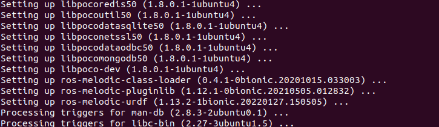

* **Dependency**

MediaPipe relies on OpenCV for video processing and FFMPEG for audio data processing. It also has other dependencies, such as OpenGL/Metal, TensorFlow, Eigen, and others.

It is recommended to gain a basic understanding of OpenCV before starting with MediaPipe. Information about OpenCV can be found in the folder: [Basic Course / OpenCV Computer Vision Lesson](https://drive.google.com/drive/folders/1UBsPV79gPzK0EXmAq-k5Wz_2r1vk55od?usp=sharing).

* **MediaPipe Solutions**

Solutions are based on the open-source pre-constructed sample of TensorFlow or TFLite. MediaPipe Solutions is built upon a framework, which provides 16 Solutions, including face detection, Face Mesh, iris, hand, posture, human body, and so on.

#### 7.1.1.4 Websites for MediaPipe Learning

MediaPipe Official Website: *https://developers.google.com/mediapipe*

MediaPipe Wiki: *http://i.bnu.edu.cn/wiki/index.php?title=Mediapipe*

MediaPipe github: *https://github.com/google/mediapipe*

dlib Official Website: *http://dlib.net/*

dlib github: *https://github.com/davisking/dlib*

### 7.1.2 Background Segmentation

In this lesson, MediaPipe’s Selfie Segmentation model is used to segment trained models from the background and then apply a virtual background, such as a face or a hand.

#### 7.1.2.1 Experiment Overview

First, the MediaPipe selfie segmentation model is imported, and real-time video is obtained by subscribing to the camera topic.

Next, the image is processed, and the segmentation mask is drawn onto the background image. Bilateral filtering is used to improve the segmentation around the edges.

Finally, the background is replaced with a virtual one.

#### 7.1.2.2 Operation Steps

Power on the robot and connect it via the NoMachine remote control software. For detailed information, please refer to the section [1.7.2 AP Mode Connection Steps](https://wiki.hiwonder.com/projects/ROSOrin/en/latest/docs/1_ROSOrin_User_Manual.html#ap-mode-connection-steps) in the user manual.

1. Click the terminal icon 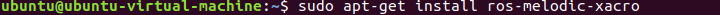 in the system desktop to open a command-line window.

2. Enter the command to disable the app auto-start service.

```bash
sudo systemctl stop start_app_node.service
```

3. Enter the command to start the camera node:

```bash
ros2 launch peripherals depth_camera.launch.py
```

4. Open a new command-line terminal, enter the command, and press **Enter** to run the program.

```bash
cd ~/ros2_ws/src/example/example/mediapipe_example && python3 self_segmentation.py
```

5. To exit this feature, press the **Esc** key in the image window to close the camera feed.

6. To exit the feature, press **Ctrl+C** in the terminal. If the program does not close successfully, try pressing **Ctrl+C** again.

#### 7.1.2.3 Project Outcome

After starting the feature, the entire returned image is transformed into a uniform gray virtual background. Once a real hand enters the camera's field of view, the system immediately and accurately detects and separates the hand from the background.

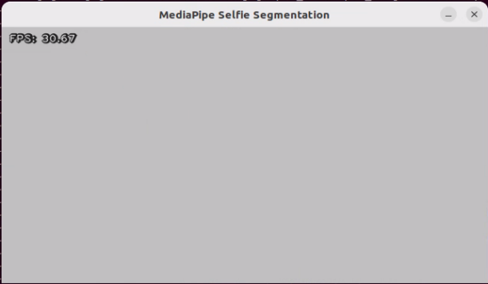


#### 7.1.2.4 Program Analysis

The program file of the feature is located at: **/ros2_ws/src/example/example/mediapipe_example/self_segmentation.py**

* **Functions**

Main:

```python
def main():
    node = SegmentationNode('self_segmentation')
    try:
        rclpy.spin(node)
    except KeyboardInterrupt:
        node.destroy_node()
        rclpy.shutdown()
        print('shutdown')
    finally:
        print('shutdown finish')
```

Starts the background control node.

* **Class**

`SegmentationNode`:

```python
class SegmentationNode(Node):
    def __init__(self, name):
        rclpy.init()
        super().__init__(name)
        self.running = True
        self.bridge = CvBridge()
        self.mp_selfie_segmentation = mp.solutions.selfie_segmentation
        self.mp_drawing = mp.solutions.drawing_utils
        self.fps = fps.FPS()
        self.image_queue = queue.Queue(maxsize=2)
        self.BG_COLOR = (192, 192, 192)  # gray
        self.image_sub = self.create_subscription(Image, '/depth_cam/rgb0/image_raw', self.image_callback, 1)
        self.get_logger().info('\033[1;32m%s\033[0m' % 'start')
        threading.Thread(target=self.main, daemon=True).start()
```

`Init`:

```python
    def __init__(self, name):
        rclpy.init()
        super().__init__(name)
        self.running = True
        self.bridge = CvBridge()
        self.mp_selfie_segmentation = mp.solutions.selfie_segmentation
        self.mp_drawing = mp.solutions.drawing_utils
        self.fps = fps.FPS()
        self.image_queue = queue.Queue(maxsize=2)
        self.BG_COLOR = (192, 192, 192)  # gray
        self.image_sub = self.create_subscription(Image, '/depth_cam/rgb0/image_raw', self.image_callback, 1)
        self.get_logger().info('\033[1;32m%s\033[0m' % 'start')
        threading.Thread(target=self.main, daemon=True).start()
```

Initializes the parameters required for background segmentation, calls the image callback function, and starts the model inference function.

`image_callback`:

```python
    def image_callback(self, ros_image):
        cv_image = self.bridge.imgmsg_to_cv2(ros_image, "rgb8")
        rgb_image = np.array(cv_image, dtype=np.uint8)
        if self.image_queue.full():
            # If the queue is full, remove the oldest image
            self.image_queue.get()
            # Put the image into the queue
        self.image_queue.put(rgb_image)
```

The image callback function is used to read data from the camera node and enqueue it.

`Main`:

```python
    def main(self):
        with self.mp_selfie_segmentation.SelfieSegmentation(
            model_selection=1) as selfie_segmentation:
            bg_image = None
            while self.running:
                try:
                    image = self.image_queue.get(block=True, timeout=1)
                except queue.Empty:
                    if not self.running:
                        break
                    else:
                        continue
                # To improve performance, optionally mark the image as not writeable to
                # Pass by reference.
                image.flags.writeable = False
                results = selfie_segmentation.process(image)
                image.flags.writeable = True
                image = cv2.cvtColor(image, cv2.COLOR_RGB2BGR)
                # Draw selfie segmentation on the background image.
                # To improve segmentation around boundaries, consider applying a joint
                # Bilateral filter to "results.segmentation_mask" with "image".
                condition = np.stack(
                        (results.segmentation_mask,) * 3, axis=-1) > 0.1
                # The background can be customized.
                #   a) Load an image (with the same width and height of the input image) to
                #      be the background, e.g., bg_image = cv2.imread('/path/to/image/file')
                #   b) Blur the input image by applying image filtering, e.g.,
                #      bg_image = cv2.GaussianBlur(image,(55,55),0)
                if bg_image is None:
                  bg_image = np.zeros(image.shape, dtype=np.uint8)
                  bg_image[:] = self.BG_COLOR
                output_image = np.where(condition, image, bg_image)
                self.fps.update()
                result_image = self.fps.show_fps(output_image)
                cv2.imshow('MediaPipe Selfie Segmentation', result_image)
                key = cv2.waitKey(1)
                if key == ord('q') or key == 27:  # Press Q or Esc to quit)
                    break
        cv2.destroyAllWindows()
        rclpy.shutdown()
```

The model within `mediapipe` is loaded, the image is passed as input, and the output image is displayed using `opencv` after processing.

### 7.1.3 3D Object Detection

#### 7.1.3.1 Experiment Overview

First, import MediaPipe’s 3D Objection and subscribe to the topic messages to obtain the real-time camera feed.

Next, apply preprocessing steps such as image flipping, and then perform 3D object detection on the images.

Finally, draw 3D bounding boxes on the detected objects in the image. In this section, a cup is used for demonstration.

#### 7.1.3.2 Operation Steps

Power on the robot and connect it via the NoMachine remote control software. For detailed information, please refer to the section [[1.7.2 AP Mode Connection Steps](https://docs.hiwonder.com/projects/ROSOrin/en/latest/docs/1_ROSOrin_User_Manual.html#ap-mode-connection-steps)](https://docs.hiwonder.com/projects/ROSOrin/en/latest/docs/https://docs.hiwonder.com/projects/ROSOrin/en/latest/docs/1_ROSOrin_User_Manual.html#ap-mode-connection-steps) in the user manual.

1. Click the terminal icon  in the system desktop to open a command-line window.

2. Enter the command to disable the app auto-start service.

```bash
sudo systemctl stop start_app_node.service
```

3. Enter the command to start the camera node:

```bash
ros2 launch peripherals depth_camera.launch.py
```

4. Open a new command-line terminal, enter the command, and press **Enter** to run the program.

```bash
cd ~/ros2_ws/src/example/example/mediapipe_example && python3 objectron.py
```

5. To exit this feature, press the **Esc** key in the image window to close the camera feed.

6. To exit the feature, press **Ctrl+C** in the terminal. If the program does not close successfully, try pressing **Ctrl+C** again.

#### 7.1.3.3 Project Outcome

Once the program starts, a 3D bounding box will appear around the detected object in the camera view. Currently, four types of objects are supported: a cup with a handle, a shoe, a chair, and a camera. For example, when detecting a cup, the effect is shown as follows:


#### 7.1.3.4 Program Analysis

The program file of the feature is located at: **/ros2_ws/src/example/example/mediapipe_example/objectron.py**

* **Functions**

`Main`:

```python
def main():
    node = ObjectronNode('objectron')
    try:
        rclpy.spin(node)
    except KeyboardInterrupt:
        node.destroy_node()
        rclpy.shutdown()
        print('shutdown')
    finally:
        print('shutdown finish')
```

Used to start the 3D detection node.

* **Class**

`ObjectronNode`:

```python
class ObjectronNode(Node):
    def __init__(self, name):
        rclpy.init()
        super().__init__(name)
        self.running = True
        self.bridge = CvBridge()
        self.mp_objectron = mp.solutions.objectron
        self.mp_drawing = mp.solutions.drawing_utils
        self.fps = fps.FPS()
        self.image_queue = queue.Queue(maxsize=2)
        self.image_sub = self.create_subscription(Image, '/depth_cam/rgb0/image_raw', self.image_callback, 1)
        self.get_logger().info('\033[1;32m%s\033[0m' % 'start')
        threading.Thread(target=self.main, daemon=True).start()
```

`Init`:

```python
    def __init__(self, name):
        rclpy.init()
        super().__init__(name)
        self.running = True
        self.bridge = CvBridge()
        self.mp_objectron = mp.solutions.objectron
        self.mp_drawing = mp.solutions.drawing_utils
        self.fps = fps.FPS()
        self.image_queue = queue.Queue(maxsize=2)
        self.image_sub = self.create_subscription(Image, '/depth_cam/rgb0/image_raw', self.image_callback, 1)
        self.get_logger().info('\033[1;32m%s\033[0m' % 'start')
        threading.Thread(target=self.main, daemon=True).start()
```

Initializes the parameters required for 3D recognition, calls the image callback function, and starts the model inference function.

`image_callback`:

```python
    def image_callback(self, ros_image):
        cv_image = self.bridge.imgmsg_to_cv2(ros_image, "rgb8")
        rgb_image = np.array(cv_image, dtype=np.uint8)
        if self.image_queue.full():
            # If the queue is full, remove the oldest image
            self.image_queue.get()
            # Put the image into the queue
        self.image_queue.put(rgb_image)
```

The image callback function is used to read data from the camera node and enqueue it.

`Main `:

```python
    def main(self):
        with self.mp_objectron.Objectron(static_image_mode=False,
                                max_num_objects=1,
                                min_detection_confidence=0.4,
                                min_tracking_confidence=0.5,
                                model_name='Cup') as objectron:
            while self.running:
                try:
                    image = self.image_queue.get(block=True, timeout=1)
                except queue.Empty:
                    if not self.running:
                        break
                    else:
                        continue
                # To improve performance, optionally mark the image as not writeable to
                # pass by reference.
                image.flags.writeable = False
                results = objectron.process(image)

                # Draw the box landmarks on the image.
                image.flags.writeable = True
                image = cv2.cvtColor(image, cv2.COLOR_RGB2BGR)
                if results.detected_objects:
                    for detected_object in results.detected_objects:
                        self.mp_drawing.draw_landmarks(
                          image, detected_object.landmarks_2d, self.mp_objectron.BOX_CONNECTIONS)
                        self.mp_drawing.draw_axis(image, detected_object.rotation,
                                             detected_object.translation)
                self.fps.update()
                result_image = self.fps.show_fps(cv2.flip(image, 1))
                # Flip the image horizontally for a selfie-view display.
                cv2.imshow('MediaPipe Objectron', result_image)
                key = cv2.waitKey(1)
                if key == ord('q') or key == 27:  # Press Q or Esc to quit
                    break

        cv2.destroyAllWindows()
        rclpy.shutdown()
```

Loads the model from MediaPipe, feeds the image into the model, and then uses OpenCV to draw object edges and display the results.

### 7.1.4 3D Face Detection

In this program, MediaPipe’s face detection model is utilized to detect a human face within the camera image.

MediaPipe Face Detection is a high-speed face detection solution that provides six key landmarks and supports multiple faces. Based on BlazeFace, a lightweight and efficient face detector optimized for mobile GPU inference.

#### 7.1.4.1 Experiment Overview

First, import the MediaPipe face detection model and subscribe to the topic messages to obtain the real-time camera feed.

Next, use OpenCV to process the image, including flipping and converting the color space.

Next, the system compares the detection confidence against the model’s minimum threshold to determine if face detection is successful. Once a face is detected, the system will analyze the set of facial features. Each face is represented as a detection message that contains a bounding box and six key landmarks, including right eye, left eye, nose tip, mouth center, right ear region, and left ear region.

Finally, the face will be outlined with a bounding box, and the six key landmarks will be marked on the image.

#### 7.1.4.2 Operation Steps

Power on the robot and connect it via the NoMachine remote control software. For detailed information, please refer to the section [[1.7.2 AP Mode Connection Steps](https://docs.hiwonder.com/projects/ROSOrin/en/latest/docs/1_ROSOrin_User_Manual.html#ap-mode-connection-steps)](https://docs.hiwonder.com/projects/ROSOrin/en/latest/docs/1_ROSOrin_User_Manual.html#ap-mode-connection-steps) in the user manual.

1. Click the terminal icon  in the system desktop to open a command-line window.

2. Enter the command to disable the app auto-start service.

```bash
sudo systemctl stop start_app_node.service
```

3. Enter the command to start the camera node:

```bash
ros2 launch peripherals depth_camera.launch.py
```

4. Open a new command-line terminal, enter the command, and press **Enter** to run the program.

```bash
cd ~/ros2_ws/src/example/example/mediapipe_example && python3 face_detect.py
```

5. To exit this feature, press the **Esc** key in the image window to close the camera feed.

6. To exit the feature, press **Ctrl+C** in the terminal. If the program does not close successfully, try pressing **Ctrl+C** again.

#### 7.1.4.3 Project Outcome

Once the feature is activated, the depth camera is immediately powered on and the face detection algorithm is executed. As soon as a face is detected, the robot accurately highlights the face region in the returned image with a prominent frame.


#### 7.1.4.4 Program Analysis

The program file of the feature is located at: **/ros2_ws/src/example/example/mediapipe_example/face_detect.py**

* **Functions**

`Main`:

```python
def main():
    node = FaceDetectionNode('face_detection')
    try:
        rclpy.spin(node)
    except KeyboardInterrupt:
        node.destroy_node()
        rclpy.shutdown()
        print('shutdown')
    finally:
        print('shutdown finish')
```

Launches the face detection node.

* **Class**

`FaceDetectionNode`:

```python
    def __init__(self, name):
        rclpy.init()
        super().__init__(name)
        self.running = True
        self.bridge = CvBridge()
        model_path = os.path.join(os.path.abspath(os.path.split(os.path.realpath(__file__))[0]), 'model/detector.tflite')
        base_options = python.BaseOptions(model_asset_path=model_path)
        options = vision.FaceDetectorOptions(base_options=base_options)
        self.detector = vision.FaceDetector.create_from_options(options)
        self.fps = fps.FPS()
        self.image_queue = queue.Queue(maxsize=2)
        self.image_sub = self.create_subscription(Image, '/depth_cam/rgb0/image_raw', self.image_callback, 1)
        self.get_logger().info('\033[1;32m%s\033[0m' % 'start')
        threading.Thread(target=self.main, daemon=True).start()
```

`Init`:

```python
        super().__init__(name)
        self.running = True
        self.bridge = CvBridge()
        model_path = os.path.join(os.path.abspath(os.path.split(os.path.realpath(__file__))[0]), 'model/detector.tflite')
        base_options = python.BaseOptions(model_asset_path=model_path)
        options = vision.FaceDetectorOptions(base_options=base_options)
        self.detector = vision.FaceDetector.create_from_options(options)
        self.fps = fps.FPS()
        self.image_queue = queue.Queue(maxsize=2)
        self.image_sub = self.create_subscription(Image, '/depth_cam/rgb0/image_raw', self.image_callback, 1)
        self.get_logger().info('\033[1;32m%s\033[0m' % 'start')
        threading.Thread(target=self.main, daemon=True).start()
```

Initializes the parameters required for face recognition, calls the image callback function, and starts the model inference function.

`image_callback`:

```python
    def image_callback(self, ros_image):
        cv_image = self.bridge.imgmsg_to_cv2(ros_image, "rgb8")
        rgb_image = np.array(cv_image, dtype=np.uint8)
        if self.image_queue.full():
            # If the queue is full, discard the oldest image
            self.image_queue.get()
            # Put the image into the queue
        self.image_queue.put(rgb_image)
```

The image callback function is used to read data from the camera node and enqueue it.

`Main`:

```python
    def main(self):
        while self.running:
            try:
                image = self.image_queue.get(block=True, timeout=1)
            except queue.Empty:
                if not self.running:
                    break
                else:
                    continue
            image = cv2.flip(image, 1)
            mp_image = mp.Image(image_format=mp.ImageFormat.SRGB, data=image)
            detection_result = self.detector.detect(mp_image)

            annotated_image = visualize(image, detection_result)
            self.fps.update()
            result_image = self.fps.show_fps(cv2.cvtColor(annotated_image, cv2.COLOR_RGB2BGR))
            cv2.imshow('face_detection', result_image)
            key = cv2.waitKey(1)
            if key == ord('q') or key == 27:  # Press Q or Esc to quit
              break

        cv2.destroyAllWindows()
        rclpy.shutdown()
```

Loads the model from MediaPipe, feeds the image into it, and uses OpenCV to draw facial keypoints and display the returned video feed.

### 7.1.5 3D Face Detection

In this program, MediaPipe Face Mesh is utilized to detect the human face within the camera image.

MediaPipe Face Mesh is a powerful model capable of estimating 468 3D facial features, even when deployed on a mobile device. It uses machine learning (ML) to infer 3D facial structure. This model leverages a lightweight architecture and GPU acceleration to deliver critical real-time performance.

Additionally, the solution is bundled with a face transformation module that bridges the gap between facial landmark estimation and practical real-time augmented reality (AR) applications. It establishes a metric 3D space and uses the screen positions of facial landmarks to estimate face transformations within that space. The face transformation data consists of common 3D primitives, including a facial pose transformation matrix and a triangulated face mesh.

#### 7.1.5.1 Experiment Overview

First, it’s important to understand that the machine learning pipeline used here, which can be thought of as a linear process, consists of two real-time deep neural network models working in tandem: One is a detector that processes the full image to locate faces. The other is a face landmark model that operates on those locations and uses regression to predict an approximate 3D surface.

For the 3D face landmarks, transfer learning was applied, and a multi-task network was trained. This network simultaneously predicts 3D landmark coordinates on synthetic rendered data and 2D semantic contours on annotated real-world data. As a result, the network is informed by both synthetic and real-world data, allowing for accurate 3D landmark prediction.

The 3D landmark model takes cropped video frames as input, without requiring additional depth input. It outputs the positions of 3D points along with a probability score indicating whether a face is present and properly aligned in the input.

After importing the face mesh model, you can subscribe to the topic messages to obtain the real-time camera feed.

The image is processed through operations such as flipping and color space conversion. Then, by comparing the face detection confidence to a predefined threshold, it determines whether a face has been successfully detected.

Finally, a 3D mesh is rendered over the detected face in the video feed.

#### 7.1.5.2 Operation Steps

Power on the robot and connect it via the NoMachine remote control software. For detailed information, please refer to the section [[1.7.2 AP Mode Connection Steps](https://docs.hiwonder.com/projects/ROSOrin/en/latest/docs/1_ROSOrin_User_Manual.html#ap-mode-connection-steps)](https://docs.hiwonder.com/projects/ROSOrin/en/latest/docs/1_ROSOrin_User_Manual.html#ap-mode-connection-steps) in the user manual.

1. Click the terminal icon  in the system desktop to open a command-line window.

2. Enter the command to disable the app auto-start service.

```bash
sudo systemctl stop start_app_node.service
```

3. Enter the command to start the camera node:

```bash
ros2 launch peripherals depth_camera.launch.py
```

4. Open a new command-line terminal, enter the command, and press **Enter** to run the program.

```bash
cd ~/ros2_ws/src/example/example/mediapipe_example && python3 face_mesh.py
```

5. To exit this feature, press the **Esc** key in the image window to close the camera feed.

6. To exit the feature, press **Ctrl+C** in the terminal. If the program does not close successfully, try pressing **Ctrl+C** again.

#### 7.1.5.3 Project Outcome

Once the feature is started, the depth camera detects a face and highlights it with a bounding box in the returned video feed.

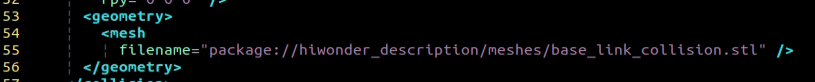

#### 7.1.5.4 Program Analysis

The program file of the feature is located at: **/ros2_ws/src/example/example/mediapipe_example/face_mesh.py**

* **Functions**

`Main`:

```python
def main():
    node = FaceMeshNode('face_landmarker')
    try:
        rclpy.spin(node)
    except KeyboardInterrupt:
        node.destroy_node()
        rclpy.shutdown()
        print('shutdown')
    finally:
        print('shutdown finish')
```

Used to launch the 3D face detection node.

* **Class**

`FaceMeshNode`:

```python
class FaceMeshNode(Node):
    def __init__(self, name):
        rclpy.init()
        super().__init__(name)
        self.running = True
        self.bridge = CvBridge()
        model_path = os.path.join(os.path.abspath(os.path.split(os.path.realpath(__file__))[0]), 'model/face_landmarker_v2_with_blendshapes.task')
        base_options = python.BaseOptions(model_asset_path=model_path)
        options = vision.FaceLandmarkerOptions(base_options=base_options,
                                       output_face_blendshapes=True,
                                       output_facial_transformation_matrixes=True,
                                       num_faces=1)
```

`Init`:

```python
        rclpy.init()
        super().__init__(name)
        self.running = True
        self.bridge = CvBridge()
        model_path = os.path.join(os.path.abspath(os.path.split(os.path.realpath(__file__))[0]), 'model/face_landmarker_v2_with_blendshapes.task')
        base_options = python.BaseOptions(model_asset_path=model_path)
        options = vision.FaceLandmarkerOptions(base_options=base_options,
                                       output_face_blendshapes=True,
                                       output_facial_transformation_matrixes=True,
                                       num_faces=1)
        self.detector = vision.FaceLandmarker.create_from_options(options)

        self.fps = fps.FPS()

        self.image_queue = queue.Queue(maxsize=2)
        self.image_sub = self.create_subscription(Image, '/depth_cam/rgb0/image_raw', self.image_callback, 1)
        self.get_logger().info('\033[1;32m%s\033[0m' % 'start')
        threading.Thread(target=self.main, daemon=True).start()
```

Initializes the parameters required for 3D face detection, calls the image callback function, and starts the model inference function.

`image_callback`:

```python
    def image_callback(self, ros_image):
        cv_image = self.bridge.imgmsg_to_cv2(ros_image, "rgb8")
        rgb_image = np.array(cv_image, dtype=np.uint8)
        if self.image_queue.full():
            # If the queue is full, discard the oldest image
            self.image_queue.get()
            # Put the image into the queue
        self.image_queue.put(rgb_image)
```

The image callback function is used to read data from the camera node and enqueue it.

`Main `:

```python
    def main(self):
        while self.running:
            try:
                image = self.image_queue.get(block=True, timeout=1)
            except queue.Empty:
                if not self.running:
                    break
                else:
                    continue
            image = cv2.flip(image, 1)
            mp_image = mp.Image(image_format=mp.ImageFormat.SRGB, data=image)
            detection_result = self.detector.detect(mp_image)
            annotated_image = draw_face_landmarks_on_image(image, detection_result)
            self.fps.update()
            result_image = self.fps.show_fps(cv2.cvtColor(annotated_image, cv2.COLOR_RGB2BGR))
            cv2.imshow('face_landmarker', result_image)
            key = cv2.waitKey(1)
            if key == ord('q') or key == 27:  # Press Q or Esc to quit
                break
        cv2.destroyAllWindows()
        rclpy.shutdown()
```

Loads the model from MediaPipe, feeds the image into it, and uses OpenCV to draw facial keypoints and display the returned video feed.

### 7.1.6 Hand Keypoint Detection

In this lesson, MediaPipe’s hand detection model is used to display hand keypoints and the connecting lines between them on the returned image.

MediaPipe Hands is a high-fidelity hand and finger tracking model. It uses machine learning (ML) to infer 21 3D landmarks of a hand from a single frame.

#### 7.1.6.1 Experiment Overview

First, it's important to understand that MediaPipe's palm detection model utilizes a machine learning pipeline composed of multiple models, which is a linear model, similar to an assembly line. The model processes the entire image and returns an oriented hand bounding box. The hand landmark model then operates on the cropped image region defined by the palm detector and returns high-fidelity 3D hand keypoints.

After importing the hand detection model, the system subscribes to topic messages to acquire real-time camera images. The images are then processed with flipping and color space conversion, which greatly reduces the need for data augmentation for the hand landmark model.

In addition, the pipeline can generate crops based on the hand landmarks recognized in the previous frame. The palm detection model is only invoked to re-locate the hand when the landmark model can no longer detect its presence.

Next, the system compares the detection confidence against the model’s minimum threshold to determine if hand detection is successful.

Finally, it detects and draws the hand keypoints on the output image.

#### 7.1.6.2 Operation Steps

Power on the robot and connect it via the NoMachine remote control software. For detailed information, please refer to the section [[1.7.2 AP Mode Connection Steps](https://docs.hiwonder.com/projects/ROSOrin/en/latest/docs/1_ROSOrin_User_Manual.html#ap-mode-connection-steps)](https://docs.hiwonder.com/projects/ROSOrin/en/latest/docs/1_ROSOrin_User_Manual.html#ap-mode-connection-steps) in the user manual.

1. Click the terminal icon  in the system desktop to open a command-line window.

2. Enter the command to disable the app auto-start service.

```bash
sudo systemctl stop start_app_node.service
```

3. Enter the command to start the camera node:

```bash
ros2 launch peripherals depth_camera.launch.py
```

4. Open a new command-line terminal, enter the command, and press **Enter** to run the program.

```bash
cd ~/ros2_ws/src/example/example/mediapipe_example && python3 hand.py
```

5. To exit this feature, press the **Esc** key in the image window to close the camera feed.

6. To exit the feature, press **Ctrl+C** in the terminal. If the program does not close successfully, try pressing **Ctrl+C** again.

#### 7.1.6.3 Project Outcome

Once the feature is activated, the depth camera is immediately powered on, and the hand detection model is triggered for hand detection. Once a hand is successfully detected, the system intelligently marks the key points of the hand in the returned image and automatically draws the connecting lines between these points.

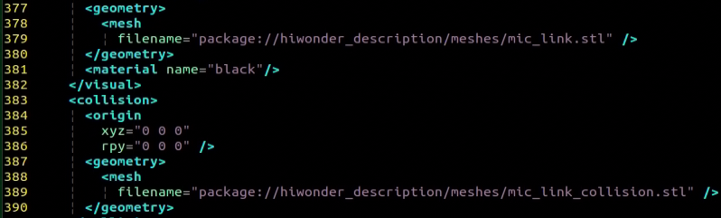

#### 7.1.6.4 Program Analysis

The program file of the feature is located at: **/ros2_ws/src/example/example/mediapipe_example/hand.py**

* **Functions**

`Main`:

```python
def main():
    node = HandNode('hand_landmarker')
    try:
        rclpy.spin(node)
    except KeyboardInterrupt:
        node.destroy_node()
        rclpy.shutdown()
        print('shutdown')
    finally:
        print('shutdown finish')
```

Used to launch the 3D face detection node.

* **Class**

`HandNode`:

```python
class HandNode(Node):
    def __init__(self, name):
        rclpy.init()
        super().__init__(name)
        self.running = True
        self.bridge = CvBridge()
        model_path = os.path.join(os.path.abspath(os.path.split(os.path.realpath(__file__))[0]), 'model/hand_landmarker.task')
        base_options = python.BaseOptions(model_asset_path=model_path)
        options = vision.HandLandmarkerOptions(base_options=base_options, num_hands=2)
        self.detector = vision.HandLandmarker.create_from_options(options)
        self.fps = fps.FPS()
        self.image_queue = queue.Queue(maxsize=2)
        self.image_sub = self.create_subscription(Image, '/depth_cam/rgb0/image_raw', self.image_callback, 1)
        self.get_logger().info('\033[1;32m%s\033[0m' % 'start')
```

`Init`:

```python
        rclpy.init()
        super().__init__(name)
        self.running = True
        self.bridge = CvBridge()
        model_path = os.path.join(os.path.abspath(os.path.split(os.path.realpath(__file__))[0]), 'model/hand_landmarker.task')
        base_options = python.BaseOptions(model_asset_path=model_path)
        options = vision.HandLandmarkerOptions(base_options=base_options, num_hands=2)
        self.detector = vision.HandLandmarker.create_from_options(options)
        self.fps = fps.FPS()
        self.image_queue = queue.Queue(maxsize=2)
        self.image_sub = self.create_subscription(Image, '/depth_cam/rgb0/image_raw', self.image_callback, 1)
        self.get_logger().info('\033[1;32m%s\033[0m' % 'start')
        threading.Thread(target=self.main, daemon=True).start()

    def image_callback(self, ros_image):
        cv_image = self.bridge.imgmsg_to_cv2(ros_image, "rgb8")
        rgb_image = np.array(cv_image, dtype=np.uint8)
        if self.image_queue.full():
            # If the queue is full, remove the oldest image
            self.image_queue.get()
            # Put the image into the queue
        self.image_queue.put(rgb_image)
```

Initializes the parameters required for hand keypoints detection, calls the image callback function, and starts the model inference function.

`image_callback`:

```python
    def image_callback(self, ros_image):
        cv_image = self.bridge.imgmsg_to_cv2(ros_image, "rgb8")
        rgb_image = np.array(cv_image, dtype=np.uint8)
        if self.image_queue.full():
            # If the queue is full, remove the oldest image
            self.image_queue.get()
            # Put the image into the queue
        self.image_queue.put(rgb_image)
```

The image callback function is used to read data from the camera node and enqueue it.

`Main `:

```python
    def main(self):
        while self.running:
            try:
                image = self.image_queue.get(block=True, timeout=1)
            except queue.Empty:
                if not self.running:
                    break
                else:
                    continue
            image = cv2.flip(image, 1)
            mp_image = mp.Image(image_format=mp.ImageFormat.SRGB, data=image)
            detection_result = self.detector.detect(mp_image)
            annotated_image = draw_hand_landmarks_on_image(image, detection_result)
            self.fps.update()
            result_image = self.fps.show_fps(cv2.cvtColor(annotated_image, cv2.COLOR_RGB2BGR))
            cv2.imshow('hand_landmarker', result_image)
            key = cv2.waitKey(1)
            if key == ord('q') or key == 27:  # Press Q or Esc to quit
                break
        cv2.destroyAllWindows()
        rclpy.shutdown()
```

Loads the model from MediaPipe, feeds the image into it, and uses OpenCV to draw the hand’s keypoints and display the returned video feed.

### 7.1.7 Body Keypoint Detection

In this lesson, MediaPipe's pose detection model is used to detect body landmarks and display them on the video feed.

MediaPipe Pose is a high-fidelity body pose tracking model. Powered by BlazePose, it infers 33 3D landmarks across the full body from RGB input. This research also supports the ML Kit Pose Detection API.

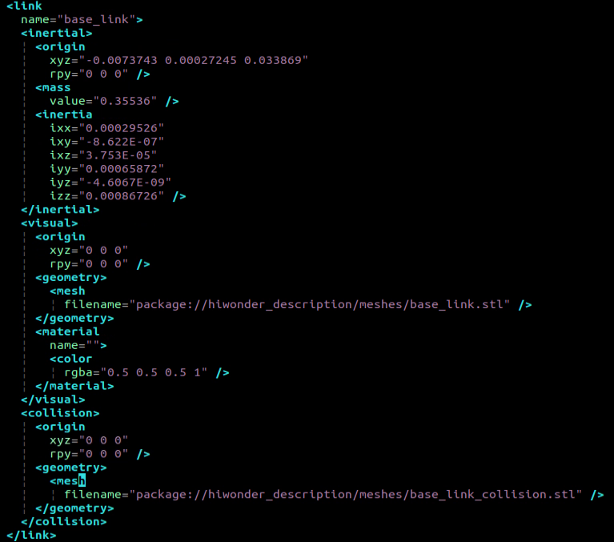

#### 7.1.7.1 Experiment Overview

First, import the pose detection model.

Then, the program applies image preprocessing such as flipping and converting the color space. By comparing against a minimum detection confidence threshold, it determines whether the human body is successfully detected.

Next, it uses a minimum tracking confidence threshold to decide whether the detected pose can be reliably tracked. If not, the model will automatically re-invoke detection on the next input image.

The pipeline first identifies the region of interest (ROI) containing the person’s pose in the frame using a detector. The tracker then uses the cropped ROI image as input to predict pose landmarks and segmentation masks within that area. For video applications, the detector is only invoked when necessary—such as for the first frame or when the tracker fails to identify a pose from the previous frame. For all other frames, the ROI is derived from the previously tracked landmarks.

After importing the MediaPipe pose detection model, you can subscribe to the topic messages to obtain the real-time video stream from the camera.

Finally, it identifies and draws the body landmarks on the image.

#### 7.1.7.2 Operation Steps

Power on the robot and connect it via the NoMachine remote control software. For detailed information, please refer to the section [[1.7.2 AP Mode Connection Steps](https://docs.hiwonder.com/projects/ROSOrin/en/latest/docs/1_ROSOrin_User_Manual.html#ap-mode-connection-steps)](https://docs.hiwonder.com/projects/ROSOrin/en/latest/docs/1_ROSOrin_User_Manual.html#ap-mode-connection-steps) in the user manual.

1. Click the terminal icon  in the system desktop to open a command-line window.

2. Enter the command to disable the app auto-start service.

```bash
sudo systemctl stop start_app_node.service
```

3. Enter the command to start the camera node:

```bash
ros2 launch peripherals depth_camera.launch.py
```

4. Open a new command-line terminal, enter the command, and press **Enter** to run the program.

```bash
cd ~/ros2_ws/src/example/example/mediapipe_example && python3 pose.py
```

5. To exit this feature, press the **Esc** key in the image window to close the camera feed.

6. To exit the feature, press **Ctrl+C** in the terminal. If the program does not close successfully, try pressing **Ctrl+C** again.

#### 7.1.7.3 Project Outcome

Once the feature is activated, the depth camera is immediately powered on, and human pose detection is initiated. Once the human body is successfully detected, the system quickly and accurately marks the key body points in the returned image and automatically draws the connecting lines between these points, forming a human pose skeleton.

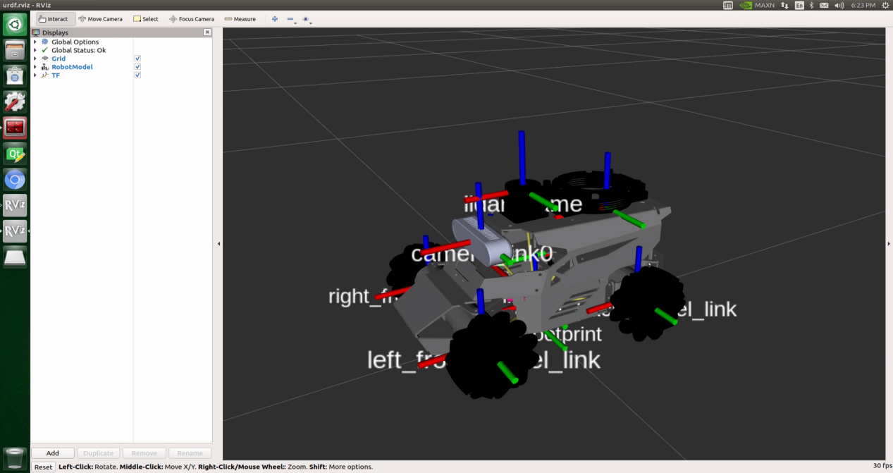

#### 7.1.7.4 Program Analysis

The program file of the feature is located at: **/ros2_ws/src/example/example/mediapipe_example/pose.py**

* **Functions**

`Main`:

```python
def main():
    node = PoseNode('pose_landmarker')
    try:
        rclpy.spin(node)
    except KeyboardInterrupt:
        node.destroy_node()
        rclpy.shutdown()
        print('shutdown')
    finally:
        print('shutdown finish')
```

Used to launch the 3D face detection node.

* **Class**

`PoseNode`:

```python
class PoseNode(Node):
    def __init__(self, name):
        rclpy.init()
        super().__init__(name)
        self.running = True
        self.bridge = CvBridge()
        model_path = os.path.join(os.path.abspath(os.path.split(os.path.realpath(__file__))[0]), 'model/pose_landmarker.task')
        base_options = python.BaseOptions(model_asset_path=model_path)
        options = vision.PoseLandmarkerOptions(
            base_options=base_options,
            output_segmentation_masks=True)
        self.detector = vision.PoseLandmarker.create_from_options(options)
        self.fps = fps.FPS()
        self.image_queue = queue.Queue(maxsize=2)
        self.image_sub = self.create_subscription(Image, '/depth_cam/rgb0/image_raw', self.image_callback, 1)
```

`Init`:

```python
    def __init__(self, name):
        rclpy.init()
        super().__init__(name)
        self.running = True
        self.bridge = CvBridge()
        model_path = os.path.join(os.path.abspath(os.path.split(os.path.realpath(__file__))[0]), 'model/pose_landmarker.task')
        base_options = python.BaseOptions(model_asset_path=model_path)
        options = vision.PoseLandmarkerOptions(
            base_options=base_options,
            output_segmentation_masks=True)
        self.detector = vision.PoseLandmarker.create_from_options(options)
        self.fps = fps.FPS()
        self.image_queue = queue.Queue(maxsize=2)
        self.image_sub = self.create_subscription(Image, '/depth_cam/rgb0/image_raw', self.image_callback, 1)
        self.get_logger().info('\033[1;32m%s\033[0m' % 'start')
        threading.Thread(target=self.main, daemon=True).start()
```

Initializes the parameters required for body keypoints detection, calls the image callback function, and starts the model inference function.

`image_callback`:

```python
    def image_callback(self, ros_image):
        cv_image = self.bridge.imgmsg_to_cv2(ros_image, "rgb8")
        rgb_image = np.array(cv_image, dtype=np.uint8)
        if self.image_queue.full():
            # If the queue is full, remove the oldest image
            self.image_queue.get()
            # Put the image into the queue
        self.image_queue.put(rgb_image)
```

The image callback function is used to read data from the camera node and enqueue it.

`Main`:

```python
    def main(self):
        while self.running:
            try:
                image = self.image_queue.get(block=True, timeout=1)
            except queue.Empty:
                if not self.running:
                    break
                else:
                    continue
            image = cv2.flip(image, 1)
            mp_image = mp.Image(image_format=mp.ImageFormat.SRGB, data=image)
            detection_result = self.detector.detect(mp_image)
            annotated_image = draw_pose_landmarks_on_image(image, detection_result)
            self.fps.update()
            result_image = self.fps.show_fps(cv2.cvtColor(annotated_image, cv2.COLOR_RGB2BGR))
            cv2.imshow('pose_landmarker', result_image)
            key = cv2.waitKey(1)
            if key == ord('q') or key == 27:  # Press Q or Esc to quit
                break
        cv2.destroyAllWindows()
        rclpy.shutdown()
```

Loads the model from MediaPipe, feeds the image into it, and uses OpenCV to draw facial keypoints and display the returned video feed.

### 7.1.8 Fingertip Trajectory Recognition

The robot uses MediaPipe's hand detection model to recognize palm joints. Once a specific hand gesture is detected, the robot locks onto the fingertip in the image and begins tracking it, drawing the movement trajectory of the fingertip.

#### 7.1.8.1 Experiment Overview

First, the MediaPipe hand detection model is called to process the camera feed.

Next, the image is flipped and processed to detect hand information within the frame. Based on the connections between hand landmarks, the finger angles are calculated to identify specific gestures.

Finally, once the designated gesture is recognized, the robot starts tracking and locking onto the fingertip, while displaying its movement trajectory in the video feed.

#### 7.1.8.2 Operation Steps

> [!NOTE]
>
> **Commands must be entered with correct capitalization. The Tab key can be used to auto-complete keywords.**

Power on the robot and connect it via the NoMachine remote control software. For detailed information, please refer to the section [[1.7.2 AP Mode Connection Steps](https://docs.hiwonder.com/projects/ROSOrin/en/latest/docs/1_ROSOrin_User_Manual.html#ap-mode-connection-steps)](https://docs.hiwonder.com/projects/ROSOrin/en/latest/docs/1_ROSOrin_User_Manual.html#ap-mode-connection-steps) in the user manual.

1. Click the terminal icon  in the system desktop to open a command-line window.

2. Enter the command to disable the app auto-start service.

```bash
sudo systemctl stop start_app_node.service
```

3. Enter the command to start the camera node:

```bash
ros2 launch peripherals depth_camera.launch.py
```

4. Open a new command-line terminal, enter the command, and press **Enter** to run the program.

```bash
cd ~/ros2_ws/src/example/example/mediapipe_example && python3 hand_gesture.py
```

5. The program will launch the camera image interface. For details on the detection steps, please refer to section [7.1.8.3 Project Outcome](#anther7.1.8.3) in this document.

6. To exit this feature, press the **Esc** key in the image window to close the camera feed.

7. To exit the feature, press **Ctrl+C** in the terminal. If the program does not close successfully, try pressing **Ctrl+C** again.

<p id ="anther7.1.8.3"></p>

#### 7.1.8.3 Project Outcome

After starting the feature, place your hand within the camera’s field of view. Once the hand is detected, key points of the hand will be marked in the returned image.

If the gesture **1**, which involves extending the index finger, is detected, the robot will immediately enter recording mode. The system will track and display the movement of the fingertip in real time on the returned image using dynamic lines. This feature enables free drawing in the virtual space with simple gestures.

On the other hand, if the gesture **5**, which involves an open hand forming the shape of the number **5**, is detected, a clear command will be triggered. At this point, the recorded fingertip movement will be immediately erased, and the image will return to a state without any trace.


#### 7.1.8.4 Program Analysis

The program file of the feature is located at: **/ros2_ws/src/example/example/mediapipe_example/hand_gesture.py**

> [!NOTE]
>
> **Before modifying the program, back up the original factory code. Do not modify the source code file directly to avoid robot malfunction due to incorrect parameter changes.**

* **Functions**

Main:

```python
def main():
    node = HandGestureNode('hand_gesture')
    try:
        rclpy.spin(node)
    except KeyboardInterrupt:
        node.destroy_node()
        rclpy.shutdown()
        print('shutdown')
    finally:
        print('shutdown finish')
```

The main function is used to start the fingertip trajectory recognition node.

`get_hand_landmarks`:

```python
def get_hand_landmarks(img, landmarks):
    """
    Convert landmarks from normalized output of Mediapipe to pixel coordinates.
    :param img: Image corresponding to pixel coordinates.
    :param landmarks: Normalized key points.
    :return:
    """
    h, w, _ = img.shape
    landmarks = [(lm.x * w, lm.y * h) for lm in landmarks]
    return np.array(landmarks)
```

Converts the normalized data from MediaPipe into pixel coordinates.

`hand_angle`:

```python
def hand_angle(landmarks):
    """
    Calculate the bending angle of each finger.
    :param landmarks: The key points of the hand.
    :return: Each finger's angle.
    """
    angle_list = []
    # thumb
    angle_ = vector_2d_angle(landmarks[3] - landmarks[4], landmarks[0] - landmarks[2])
    angle_list.append(angle_)
    # index finger
    angle_ = vector_2d_angle(landmarks[0] - landmarks[6], landmarks[7] - landmarks[8])
    angle_list.append(angle_)
    # middle finger
    angle_ = vector_2d_angle(landmarks[0] - landmarks[10], landmarks[11] - landmarks[12])
    angle_list.append(angle_)
    # ring finger
    angle_ = vector_2d_angle(landmarks[0] - landmarks[14], landmarks[15] - landmarks[16])
    angle_list.append(angle_)
    # pinky finger
    angle_ = vector_2d_angle(landmarks[0] - landmarks[18], landmarks[19] - landmarks[20])
    angle_list.append(angle_)
    angle_list = [abs(a) for a in angle_list]
    return angle_list
```

After extracting the hand keypoints into the results variable, the keypoints need to undergo logical processing. By analyzing the angular relationships between the keypoints, the specific type of finger, such as the thumb or index finger, can be identified. The `hand_angle` function takes the landmarks of the results as input, and the `vector_2d_angle` function is used to calculate the angles between the corresponding keypoints. The following diagram shows the keypoints corresponding to the elements in the landmarks set:


Taking the thumb's angle as an example: `vector_2d_angle` The function is used to calculate the angle between the keypoints. The keypoints, `landmarks[3]`, `landmarks[4]`, `landmarks[0]`, and `landmarks[2]` correspond to the points 3, 4, 0, and 2 in the hand feature extraction diagram. By calculating the angles between these key joints, the posture features of the thumb can be determined. Similarly, the processing logic for the remaining finger joints follows the same approach.

To ensure accurate recognition, the parameters and basic logic of angle addition and subtraction in the `hand_angle` function can be kept at their default settings.

`h_gesture`:

```python
def h_gesture(angle_list):
    """
    Determine the gesture made by the fingers based on the two-dimensional features
    :param angle_list: The angles of each finger's bending
    :return : Gesture name string
    """
    thr_angle = 65.
    thr_angle_thumb = 53.
    thr_angle_s = 49.
    gesture_str = "none"
    if (angle_list[0] > thr_angle_thumb) and (angle_list[1] > thr_angle) and (angle_list[2] > thr_angle) and (
            angle_list[3] > thr_angle) and (angle_list[4] > thr_angle):
        gesture_str = "fist"
    elif (angle_list[0] < thr_angle_s) and (angle_list[1] < thr_angle_s) and (angle_list[2] > thr_angle) and (
            angle_list[3] > thr_angle) and (angle_list[4] > thr_angle):
        gesture_str = "hand_heart"
    elif (angle_list[0] < thr_angle_s) and (angle_list[1] < thr_angle_s) and (angle_list[2] > thr_angle) and (
            angle_list[3] > thr_angle) and (angle_list[4] < thr_angle_s):
        gesture_str = "nico-nico-ni"
    elif (angle_list[0] < thr_angle_s) and (angle_list[1] > thr_angle) and (angle_list[2] > thr_angle) and (
            angle_list[3] > thr_angle) and (angle_list[4] > thr_angle):
        gesture_str = "hand_heart"
    elif (angle_list[0] > 5) and (angle_list[1] < thr_angle_s) and (angle_list[2] > thr_angle) and (
            angle_list[3] > thr_angle) and (angle_list[4] > thr_angle):
        gesture_str = "one"
    elif (angle_list[0] > thr_angle_thumb) and (angle_list[1] < thr_angle_s) and (angle_list[2] < thr_angle_s) and (
            angle_list[3] > thr_angle) and (angle_list[4] > thr_angle):
        gesture_str = "two"
    elif (angle_list[0] > thr_angle_thumb) and (angle_list[1] < thr_angle_s) and (angle_list[2] < thr_angle_s) and (
            angle_list[3] < thr_angle_s) and (angle_list[4] > thr_angle):
        gesture_str = "three"
    elif (angle_list[0] > thr_angle_thumb) and (angle_list[1] > thr_angle) and (angle_list[2] < thr_angle_s) and (
            angle_list[3] < thr_angle_s) and (angle_list[4] < thr_angle_s):
        gesture_str = "OK"
    elif (angle_list[0] > thr_angle_thumb) and (angle_list[1] < thr_angle_s) and (angle_list[2] < thr_angle_s) and (
            angle_list[3] < thr_angle_s) and (angle_list[4] < thr_angle_s):
        gesture_str = "four"
    elif (angle_list[0] < thr_angle_s) and (angle_list[1] < thr_angle_s) and (angle_list[2] < thr_angle_s) and (
            angle_list[3] < thr_angle_s) and (angle_list[4] < thr_angle_s):
        gesture_str = "five"
    elif (angle_list[0] < thr_angle_s) and (angle_list[1] > thr_angle) and (angle_list[2] > thr_angle) and (
            angle_list[3] > thr_angle) and (angle_list[4] < thr_angle_s):
        gesture_str = "six"
    else:
        "none"
    return gesture_str
```

After identifying the types of fingers on the hand and determining their positions in the image, different gestures can be recognized by implementing the `h_gestrue` function.

In the `h_gesture` function shown in the diagram above, the parameters `thr_angle = 65`, `thr_angle_thenum=53`, and `thr_angle_s=49` represent the angle threshold values for the corresponding gesture logic points. These values have been tested and found to provide stable recognition results. It is not recommended to change them. If the recognition performance is suboptimal, adjusting the values within ±5 is sufficient. The `angle_list[0, 1, 2, 3, 4]` corresponds to the five fingers of the hand.

Taking the gesture **one** as an example:

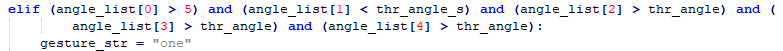

The code shown above represents the finger angle logic for the gesture **one**. `angle_list[0]>5` checks whether the angle of the thumb joint feature point in the image is greater than 5. `angle_list[1]<thr_angle_s` checks whether the angle feature of the index finger joint is smaller than the predefined value `thr_angle_s`，`angle_list[2]>thr_angle` checks whether the angle feature of the middle finger joint is smaller than the predefined value `thr_angle`. The logic for the other two fingers, `angle_list[3]` and `angle_list[4]`, follows a similar approach. When all these conditions are met, the current hand gesture is recognized as **one**. The recognition of other gestures follows a similar approach.

Each gesture has its own logic, but the overall framework is largely the same, and other gestures can be referenced based on this method.

`draw_points`:

```python
def draw_points(img, points, thickness=4, color=(255, 0, 0)):
    points = np.array(points).astype(dtype=np.int64)
    if len(points) > 2:
        for i, p in enumerate(points):
            if i + 1 >= len(points):
                break
            cv2.line(img, p, points[i + 1], color, thickness)
```

Draw the currently detected hand shape along with all its key points.

* **Class**

`State`:

```python
class State(enum.Enum):
    NULL = 0
    START = 1
    TRACKING = 2
    RUNNING = 3
```

An enumeration class used to represent the current state of the program.

`HandGestureNode`:

```python
class HandGestureNode(Node):
    def __init__(self, name):
        rclpy.init()
        super().__init__(name)
        self.running = True
        self.drawing = mp.solutions.drawing_utils

        self.hand_detector = mp.solutions.hands.Hands(
            static_image_mode=False,
            max_num_hands=1,
            min_tracking_confidence=0.05,
            min_detection_confidence=0.6
        )
        
        self.fps = fps.FPS()  # FPS calculator
        self.state = State.NULL
        self.points = []
        self.count = 0
        self.bridge = CvBridge()
        self.image_queue = queue.Queue(maxsize=2)
        self.image_sub = self.create_subscription(Image, '/depth_cam/rgb0/image_raw', self.image_callback, 1)
        self.get_logger().info('\033[1;32m%s\033[0m' % 'start')
        threading.Thread(target=self.main, daemon=True).start()
```

`HandGestureNode` is the fingertip trajectory recognition node. It contains three functions: an initialization function, a main function, and an image callback function.

`Init`:

```python
    def __init__(self, name):
        rclpy.init()
        super().__init__(name)
        self.running = True
        self.drawing = mp.solutions.drawing_utils

        self.hand_detector = mp.solutions.hands.Hands(
            static_image_mode=False,
            max_num_hands=1,
            min_tracking_confidence=0.05,
            min_detection_confidence=0.6
        )
        
        self.fps = fps.FPS()  # FPS calculator
        self.state = State.NULL
        self.points = []
        self.count = 0
        self.bridge = CvBridge()
        self.image_queue = queue.Queue(maxsize=2)
        self.image_sub = self.create_subscription(Image, '/depth_cam/rgb0/image_raw', self.image_callback, 1)
        self.get_logger().info('\033[1;32m%s\033[0m' % 'start')
        threading.Thread(target=self.main, daemon=True).start()
```

Initializes all required components and calls the camera node.

### 7.1.9 Body Gesture Control

Using the human pose estimation model trained with the MediaPipe machine learning framework, the system detects the human pose in the camera feed and marks the relevant joint positions. Based on this, multiple actions can be recognized in sequence, allowing direct control of the robot through body gestures.

From the robot’s first-person perspective:  
Raising the left arm causes the robot to move a certain distance to the right. Raising the right arm causes the robot to move a certain distance to the left. Raising the left leg causes the robot to move forward a certain distance. Raising the right leg causes the robot to move backward a certain distance.

#### 7.1.9.1 Experiment Overview

First, the MediaPipe human pose estimation model is imported, and the camera feed is accessed by subscribing to the relevant topic messages.

MediaPipe is an open-source framework designed for building multimedia machine learning pipelines. It is cross-platform and can run on mobile devices, workstations, and servers, with support for mobile GPU acceleration. It also supports inference engines for TensorFlow and TensorFlow Lite.

Next, using the constructed model, key points of the human torso are detected in the camera feed. These key points are connected to visualize the torso, allowing the system to determine the body posture.

Finally, if the user performs a specific action, the robot responds accordingly.

#### 7.1.9.2 Operation Steps

> [!NOTE]
>
> **Commands must be entered with correct capitalization. The Tab key can be used to auto-complete keywords.**

Power on the robot and connect it via the NoMachine remote control software. For detailed information, please refer to the section [[1.7.2 AP Mode Connection Steps](https://docs.hiwonder.com/projects/ROSOrin/en/latest/docs/1_ROSOrin_User_Manual.html#ap-mode-connection-steps)](https://docs.hiwonder.com/projects/ROSOrin/en/latest/docs/1_ROSOrin_User_Manual.html#ap-mode-connection-steps) in the user manual.

1. Click the terminal icon  in the system desktop to open a command-line window.

2. Enter the command to disable the app auto-start service.

```bash
sudo systemctl stop start_app_node.service
```

3. Enter the following command and press **Enter** to start the feature.

```bash
ros2 launch example body_control.launch.py
```

4. To exit this feature, press the **Esc** key in the image window to close the camera feed.

5. To exit the feature, press **Ctrl+C** in the terminal. If the program does not close successfully, try pressing **Ctrl+C** again.

#### 7.1.9.3 Project Outcome

After starting the feature, stand within the camera’s field of view. When a human body is detected, the returned video feed will display the key points of the torso along with lines connecting them.

An intuitive body posture control logic has been designed for the robot, allowing control through simple body movements. The control instructions are as follows:

Right movement: Raise the left arm, and the robot will move to the right.

Left movement: Raise the right arm, and the robot will move to the left.

Forward movement: Raise the left leg, and the robot will move forward.

Backward movement: Raise the right leg, and the robot will move backward.


#### 7.1.9.4 Program Analysis

The program file of the feature is located at: **ros2_ws/src/example/example/body_control/include/body_control.py**

> [!NOTE]
>
> **Before modifying the program, back up the original factory code. Do not modify the source code file directly to avoid robot malfunction due to incorrect parameter changes.**

* **Functions**

`Main`:

```python
def main():
    node = BodyControlNode('body_control')
    rclpy.spin(node)
    node.destroy_node()
```

Starts the body motion control node.

`get_joint_landmarks`:

```python
def get_joint_landmarks(img, landmarks):
    """
    Convert landmarks from medipipe's normalized output to pixel coordinates
    :param img: Picture corresponding to pixel coordinate
    :param landmarks: Normalized keypoint
    :return:
    """
    h, w, _ = img.shape
    landmarks = [(lm.x * w, lm.y * h) for lm in landmarks]
    return np.array(landmarks)
```

Converts the detected information into pixel coordinates.

`joint_distance`:

```python
def joint_distance(landmarks):
    distance_list = []

    d1 = landmarks[LEFT_HIP] - landmarks[LEFT_SHOULDER]
    d2 = landmarks[LEFT_HIP] - landmarks[LEFT_WRIST]
    dis1 = d1[0]**2 + d1[1]**2
    dis2 = d2[0]**2 + d2[1]**2
    distance_list.append(round(dis1/dis2, 1))
   
    d1 = landmarks[RIGHT_HIP] - landmarks[RIGHT_SHOULDER]
    d2 = landmarks[RIGHT_HIP] - landmarks[RIGHT_WRIST]
    dis1 = d1[0]**2 + d1[1]**2
    dis2 = d2[0]**2 + d2[1]**2
    distance_list.append(round(dis1/dis2, 1))
    
    d1 = landmarks[LEFT_HIP] - landmarks[LEFT_ANKLE]
    d2 = landmarks[LEFT_ANKLE] - landmarks[LEFT_KNEE]
    dis1 = d1[0]**2 + d1[1]**2
    dis2 = d2[0]**2 + d2[1]**2
    distance_list.append(round(dis1/dis2, 1))
   
    d1 = landmarks[RIGHT_HIP] - landmarks[RIGHT_ANKLE]
    d2 = landmarks[RIGHT_ANKLE] - landmarks[RIGHT_KNEE]
    dis1 = d1[0]**2 + d1[1]**2
    dis2 = d2[0]**2 + d2[1]**2
    distance_list.append(round(dis1/dis2, 1))
    
    return distance_list
```

Calculates the distances between joints based on pixel coordinates.

* **Class**

```python
class BodyControlNode(Node):
    def __init__(self, name):
        rclpy.init()
        super().__init__(name, allow_undeclared_parameters=True, automatically_declare_parameters_from_overrides=True)
        self.name = name
        self.drawing = mp.solutions.drawing_utils
        self.body_detector = mp_pose.Pose(
            static_image_mode=False,
            min_tracking_confidence=0.7,
            min_detection_confidence=0.7)
        self.running = True
        self.fps = fps.FPS()  # FPS calculator
        signal.signal(signal.SIGINT, self.shutdown)

        self.move_finish = True
        self.stop_flag = False
        self.left_hand_count = []
        self.right_hand_count = []
        self.left_leg_count = []
        self.right_leg_count = []
```

This class represents the body control node.

`Init`:

```python
    def __init__(self, name):
        rclpy.init()
        super().__init__(name, allow_undeclared_parameters=True, automatically_declare_parameters_from_overrides=True)
        self.name = name
        self.drawing = mp.solutions.drawing_utils
        self.body_detector = mp_pose.Pose(
            static_image_mode=False,
            min_tracking_confidence=0.7,
            min_detection_confidence=0.7)
        self.running = True
        self.fps = fps.FPS()  # FPS calculator
        signal.signal(signal.SIGINT, self.shutdown)
```

Initializes the parameters required for body control, subscribes to the camera image topic, initializes the servos, chassis, buzzer, motors, and finally starts the main function within the class.

`get_node_state`:

```python
    def get_node_state(self, request, response):
        response.success = True
        return response
```

Sets the current initialization state of the node.

`shutdown`:

```python
    def shutdown(self, signum, frame):
        self.running = False
```

Callback function for program exit, used to terminate detection.

`image_callback`:

```python
    def image_callback(self, ros_image):
        cv_image = self.bridge.imgmsg_to_cv2(ros_image, "rgb8")
        rgb_image = np.array(cv_image, dtype=np.uint8)
        if self.image_queue.full():
            # If the queue is full, discard the oldest image
            self.image_queue.get()
        # Put the image into the queue
        self.image_queue.put(rgb_image)
```

Image topic callback function, processes images and places them into a queue.

`Move`:

```python
    def move(self, *args):
        if args[0].angular.z == -1.0:
            self.acker_turn(1900)
            time.sleep(0.2)
            motor1 = MotorState()
            motor1.id = 2
            motor1.rps = 2.0
            motor2 = MotorState()
            motor2.id = 4
            motor2.rps = -0.5
            msg = MotorsState()
            msg.data = [motor1, motor2]
            self.motor_pub.publish(msg)
            time.sleep(8.0)
            self.acker_turn(1500)
            motor1 = MotorState()
            motor1.id = 2
            motor1.rps = 0.0
            motor2 = MotorState()
            motor2.id = 4
            motor2.rps = 0.0
            msg = MotorsState()
            msg.data = [motor1, motor2]
            self.motor_pub.publish(msg)
        elif args[0].angular.z == 1.0:
            self.acker_turn(1100)
            time.sleep(0.2)
            motor1 = MotorState()
            motor1.id = 2
            motor1.rps = 0.5
            motor2 = MotorState()
            motor2.id = 4
            motor2.rps = -2.0
            msg = MotorsState()
            msg.data = [motor1, motor2]
            self.motor_pub.publish(msg)
            time.sleep(8.0)
            self.acker_turn(1500)
            motor1 = MotorState()
            motor1.id = 2
            motor1.rps = 0.0
            motor2 = MotorState()
            motor2.id = 4
            motor2.rps = 0.0
            msg = MotorsState()
            msg.data = [motor1, motor2]
            self.motor_pub.publish(msg)
        else:
            self.mecanum_pub.publish(args[0])
            time.sleep(args[1])
            self.mecanum_pub.publish(Twist())
            time.sleep(0.1)
        self.stop_flag =True
        self.move_finish = True
```

Motion strategy function, controls the robot’s movement according to the detected body actions.

`buzzer_warn`:

```python
    def buzzer_warn(self):
        msg = BuzzerState()
        msg.freq = 1900
        msg.on_time = 0.2
        msg.off_time = 0.01
        msg.repeat = 1
        self.buzzer_pub.publish(msg)
```

Buzzer control function, triggers buzzer alerts.

`image_proc`:

```python
    def image_proc(self, image):
        image_flip = cv2.flip(cv2.cvtColor(image, cv2.COLOR_RGB2BGR), 1)
        results = self.body_detector.process(image)
        if results is not None and results.pose_landmarks is not None:
            if self.move_finish:
                twist = Twist()
                landmarks = get_joint_landmarks(image, results.pose_landmarks.landmark)
                distance_list = (joint_distance(landmarks))
              
                if distance_list[0] < 1:
                    self.detect_status[0] = 1
```

The body recognition function uses the model to draw human keypoints and performs movements according to the detected posture.

`Main`:

```python
    def main(self):
        while self.running:
            try:
                image = self.image_queue.get(block=True, timeout=1)
            except queue.Empty:
                if not self.running:
                    break
                else:
                    continue
            try:
                result_image = self.image_proc(np.copy(image))
            except BaseException as e:
                self.get_logger().info('\033[1;32m%s\033[0m' % e)
                result_image = cv2.flip(cv2.cvtColor(image, cv2.COLOR_RGB2BGR), 1)
            self.fps.update()
            result_image = self.fps.show_fps(result_image)
            cv2.imshow(self.name, result_image)
            key = cv2.waitKey(1)
            if key == ord('q') or key == 27:  # Press Q or Esc to exit
                self.mecanum_pub.publish(Twist())
                self.running = False
```

The main function within the `BodyControlNode` class, responsible for feeding images into the recognition function and displaying the returned frames.

### 7.1.10 Human Tracking

> [!NOTE]
>
> **This feature is intended for indoor use, as outdoor environments can significantly interfere with its performance. The monocular camera version does not support this feature yet.**

Human detection is enabled through a pose estimation model trained using the YOLOv11 framework. The center point of the human body will be marked in the live feed. When the human gets closer, the robot will move backward. When the human moves away, the robot will move forward, maintaining a distance of approximately 3 meters between the human and the robot.

#### 7.1.10.1 Experiment Overview

First, import the YOLOv11 human pose estimation model and subscribe to the topic to receive real-time camera feed.

Next, using the trained model, detect the keypoints of the human body in the frame and calculate the coordinates of the human's center point based on these keypoints.

Finally, update the PID controller based on the coordinates of the human's center point and the frame's center point, allowing the robot to move in response to the human's movement.

#### 7.1.10.2 Operation Steps

> [!NOTE]
>
> **Commands must be entered with correct capitalization. The Tab key can be used to auto-complete keywords.**

1. Power on the robot and connect it via the NoMachine remote control software. For detailed information on connecting to a remote desktop, please refer to the section [[1.7.2 AP Mode Connection Steps](https://docs.hiwonder.com/projects/ROSOrin/en/latest/docs/1_ROSOrin_User_Manual.html#ap-mode-connection-steps)](https://docs.hiwonder.com/projects/ROSOrin/en/latest/docs/1_ROSOrin_User_Manual.html#ap-mode-connection-steps) in the user manual.

2. Click the terminal icon  in the system desktop to open a command-line window.

3. Enter the command to disable the app auto-start service.

```bash
sudo systemctl stop start_app_node.service
```

4. In the terminal, enter the following command and press **Enter**:

```bash
ros2 launch example body_track.launch.py
```

5. To exit this feature, press the **Esc** key in the image window to close the camera feed.

6. To exit the feature, press **Ctrl+C** in the terminal. If the program does not close successfully, try pressing **Ctrl+C** again.

#### 7.1.10.3 Project Outcome

After the feature is enabled, a person stands within the camera's field of view. When detected, the center point of the person’s body will be marked in the live feed.

Using the depth camera, the robot can sense the distance to the person in real-time and automatically adjust its position to maintain a safe and comfortable distance of approximately 3 meters. When the person approaches, the robot will move backward. When the person moves away, the robot will move forward.


#### 7.1.10.4 Program Analysis

The program file of the feature is located at: **ros2_ws/src/example/example/body_control/include/body_track.py**

> [!NOTE]
>
> **Before modifying the program, back up the original factory code. Do not modify the source code file directly to avoid robot malfunction due to incorrect parameter changes.**

* **Functions**

`Main`:

```python
def main():
    node = BodyControlNode('body_control')
    rclpy.spin(node)
    node.destroy_node()
```

This function starts the body tracking node.

* **Class**

```python
class BodyControlNode(Node):
    def __init__(self, name):
        rclpy.init()
        super().__init__(name, allow_undeclared_parameters=True, automatically_declare_parameters_from_overrides=True)
        self.name = name
       
        self.pid_d = pid.PID(0.1, 0, 0)
        #self.pid_d = pid.PID(0, 0, 0)
        
        self.pid_angular = pid.PID(0.002, 0, 0)
        #self.pid_angular = pid.PID(0, 0, 0)
        self.go_speed, self.turn_speed = 0.007, 0.04
```

This class represents the body tracking node.

`Init`:

```python
        rclpy.init()
        super().__init__(name, allow_undeclared_parameters=True, automatically_declare_parameters_from_overrides=True)
        self.name = name
       
        self.pid_d = pid.PID(0.1, 0, 0)
        #self.pid_d = pid.PID(0, 0, 0)
        
        self.pid_angular = pid.PID(0.002, 0, 0)
        #self.pid_angular = pid.PID(0, 0, 0)
        
        self.go_speed, self.turn_speed = 0.007, 0.04
```

Initializes the parameters required for body tracking, reads the camera feed, depth data, chassis control, and YOLOv11 recognition nodes. It then synchronizes the data to align depth information with the image data, and finally, starts the main function within the class.

`get_node_state`:

```python
    def get_node_state(self, request, response):
        response.success = True
        return response
```

Sets the current initialization state of the node.

`shutdown`:

```python
    def shutdown(self, signum, frame):
        self.running = False
```

A callback function to terminate the recognition process upon program exit.

`get_object_callback`:

```python
    def get_object_callback(self, msg):
        for i in msg.objects:
            class_name = i.class_name
            if class_name == 'person':
                if i.box[1] < 10:
                    self.center = [int((i.box[0] + i.box[2])/2), int(i.box[1]) + abs(int((i.box[1] - i.box[3])/4))]
                else:
                    self.center = [int((i.box[0] + i.box[2])/2), int(i.box[1]) + abs(int((i.box[1] - i.box[3])/3))]
```

This callback function from the YOLOv11 recognition node processes the recognition data and converts it into pixel coordinates.

`multi_callback`:

```python
    def depth_image_callback(self, depth_image):
        self.depth_frame = np.ndarray(shape=(depth_image.height, depth_image.width), dtype=np.uint16, buffer=depth_image.data)

    def image_callback(self, ros_image):
        cv_image = self.bridge.imgmsg_to_cv2(ros_image, "rgb8")
        rgb_image = np.array(cv_image, dtype=np.uint8)
        if self.image_queue.full():
            # If the queue is full, discard the oldest image
            self.image_queue.get()
        # Put the image into the queue
        self.image_queue.put(rgb_image)
```

This is the callback function for time synchronization. It takes both depth and RGB data, synchronizes them, and adds them to a queue.

`image_proc`:

```python
    def image_proc(self, rgb_image):
        twist = Twist()
        if self.center is not None:
            h, w = rgb_image.shape[:-1]
            cv2.circle(rgb_image, tuple(self.center), 10, (0, 255, 255), -1) 
            #################
            roi_h, roi_w = 5, 5
            w_1 = self.center[0] - roi_w
            w_2 = self.center[0] + roi_w
            if w_1 < 0:
                w_1 = 0
            if w_2 > w:
                w_2 = w
```

A function for tracking the body. It calls the model to identify the person's position and uses PID control to move the robot based on the person's location.

`Main`:

```python
    def main(self):
        while self.running:
            try:
                image = self.image_queue.get(block=True, timeout=1)
            except queue.Empty:
                if not self.running:
                    break
                else:
                    continue
            try:
                result_image = self.image_proc(image)
            except BaseException as e:
                result_image = image.copy()
                self.get_logger().info('\033[1;32m%s\033[0m' % e)
            self.center = None
            cv2.imshow(self.name, cv2.cvtColor(result_image, cv2.COLOR_RGB2BGR))
            key = cv2.waitKey(1)
            if key == ord('q') or key == 27:  # Press Q or Esc to exit
                self.mecanum_pub.publish(Twist())
                self.running = False
```

The main function within the `BodyControlNode` class is responsible for feeding images into the recognition function and displaying the returned frames.

#### 7.1.10.5 Feature Extension

**By default, the tracking speed is fixed. To modify the robot's tracking speed, adjust the PID parameters in the program.**

1. Open the terminal and enter the command to navigate to the directory where the program is stored.

```bash
cd ~/ros2_ws/src/example/example/body_control/include/
```

2. Then, use the command to open the program file.

```bash
vim body_track.py 
```

3. Locate the `self.pid_d` and `self.pid_angular` functions, where the values inside the parentheses correspond to the PID parameters. One controls the tracking linear velocity PID, and the other controls the tracking angular velocity PID.


The three PID parameters—proportional, integral, and derivative—serve different purposes: the proportional adjusts the response level, the integral smooths the response, and the derivative helps control overshoot.

4. To adjust the tracking speed, press the i key to enter edit mode, then increase the values. For example, set the linear velocity PID to 0.05 to boost the tracking speed.

> [!NOTE]
>
> **It’s recommended not to increase the parameters too much, as doing so can cause the robot to track too quickly and negatively impact the feature.**

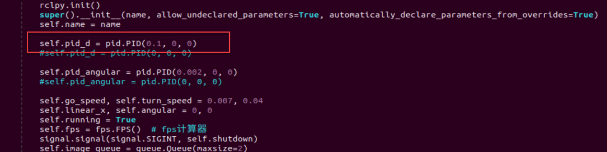

5. After making the changes, press **Esc** to exit edit mode, then type `:wq` to save and exit.


6. Follow the steps to activate the feature.

### 7.1.11 Body Gesture Control with RGB Fusion

The depth camera is fused with RGB, allowing the system to perform both color recognition and body-gesture control. Based on the section Body Gesture Control in this document, this session incorporates color recognition to determine the control target. Only when a person wearing a specified color is detected, which can be set through color calibration, can their body gestures be used to control the robot.

If a person wearing the specified color is not detected, the robot cannot be controlled. This allows precise targeting of the person who can control the robot.

#### 7.1.11.1 Experiment Overview

First, the MediaPipe human pose estimation model is imported, and the camera feed is accessed by subscribing to the relevant topic messages.

Next, based on the constructed model, the key points of the human torso in the camera feed are detected, and lines are drawn between the key points to visualize the torso and determine the body posture. The center of the body is calculated based on all key points.

Finally, if the detected posture is “hands on hips,” the system uses the clothing color to identify the control target, and the robot enters control mode. When the person performs specific gestures, the robot responds accordingly.

#### 7.1.11.2 Operation Steps

> [!NOTE]
>
> **Commands must be entered with correct capitalization. The Tab key can be used to auto-complete keywords.**

1. Power on the robot and connect it via the NoMachine remote control software. For detailed information on connecting to a remote desktop, please refer to the section [[1.7.2 AP Mode Connection Steps](https://docs.hiwonder.com/projects/ROSOrin/en/latest/docs/1_ROSOrin_User_Manual.html#ap-mode-connection-steps)](https://docs.hiwonder.com/projects/ROSOrin/en/latest/docs/1_ROSOrin_User_Manual.html#ap-mode-connection-steps) in the user manual.

2. Click the terminal icon  in the system desktop to open a command-line window.

3. Enter the command to disable the app auto-start service.

```bash
sudo systemctl stop start_app_node.service
```

4. Enter the following command and press **Enter** to start the feature.

```bash
ros2 launch example body_and_rgb_control.launch.py
```

5. To exit this feature, press the **Esc** key in the image window to close the camera feed.

6. To exit the feature, press **Ctrl+C** in the terminal. If the program does not close successfully, try pressing **Ctrl+C** again.

#### 7.1.11.3 Project Outcome

After starting the feature, stand within the camera’s field of view. When a person is detected, the camera feed will display the torso key points, lines connecting the points, and the body’s center point.

Step 1: Adjust the camera slightly higher and maintain a reasonable distance to ensure the full body is captured.

Step 2: When the person who will control the robot appears in the camera feed and strikes a hands-on-hips pose, wait for the buzzer to sound briefly. This indicates that the robot has completed the body center and clothing color calibration and is now in control mode.


Step 3:

Left movement: Raise the right arm, and the robot will move to the left.

Right movement: Raise the left arm, and the robot will move to the right.

Forward movement: Raise the left leg, and the robot will move forward.

Backward movement: Raise the right leg, and the robot will move backward.


Step 4: If someone wearing a different color enters the camera’s field of view, they will not be able to control the robot.

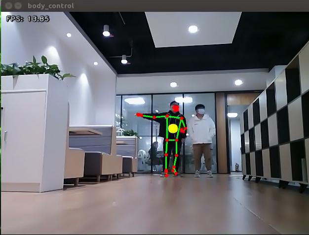

#### 7.1.11.4 Program Analysis

The program file of the feature is located at: **ros2_ws/src/example/example/body_control/include/body_and_rgb_control.py**

> [!NOTE]
>
> **Before modifying the program, back up the original factory code. Do not modify the source code file directly to avoid robot malfunction due to incorrect parameter changes.**

* **Functions**

`Main`:

```python
def main():
    node = BodyControlNode('body_control')
    rclpy.spin(node)
    node.destroy_node()
```

Starts the RGB-based body gesture control node.

`get_body_center`:

```python
def get_body_center(h, w, landmarks):
    landmarks = np.array([(lm.x * w, lm.y * h) for lm in landmarks])
    center = ((landmarks[LEFT_HIP] + landmarks[LEFT_SHOULDER] + landmarks[RIGHT_HIP] + landmarks[RIGHT_SHOULDER])/4).astype(int)
    return center.tolist()
```

Obtains the currently detected body contour.

`get_joint_landmarks`:

```python
def get_joint_landmarks(img, landmarks):
    """
    Convert landmarks from medipipe's normalized output to pixel coordinates
    :param img: Picture corresponding to pixel coordinate
    :param landmarks: Normalized keypoint
    """
    h, w, _ = img.shape
    landmarks = [(lm.x * w, lm.y * h) for lm in landmarks]
    return np.array(landmarks)
```

Converts the detected information into pixel coordinates.

`get_dif`:

```python
def get_dif(list1, list2):
    if len(list1) != len(list2):
        return 255*3
    else:
        d = np.absolute(np.array(list1) - np.array(list2))
        return sum(d)
```

Compares the clothing color on the detected body contour.

`joint_angle`:

```python
def joint_angle(landmarks):
    """
    Calculate flex angle of each joint
    :param landmarks: Hand keypoints
    :return: Joint angle
    """
    angle_list = []
    left_hand_angle1 = vector_2d_angle(landmarks[LEFT_SHOULDER] - landmarks[LEFT_ELBOW], landmarks[LEFT_WRIST] - landmarks[LEFT_ELBOW])
    angle_list.append(int(left_hand_angle1))
   
    left_hand_angle2 = vector_2d_angle(landmarks[LEFT_HIP] - landmarks[LEFT_SHOULDER], landmarks[LEFT_WRIST] - landmarks[LEFT_SHOULDER])
    angle_list.append(int(left_hand_angle2))

    right_hand_angle1 = vector_2d_angle(landmarks[RIGHT_SHOULDER] - landmarks[RIGHT_ELBOW], landmarks[RIGHT_WRIST] - landmarks[RIGHT_ELBOW])
    angle_list.append(int(right_hand_angle1))

    right_hand_angle2 = vector_2d_angle(landmarks[RIGHT_HIP] - landmarks[RIGHT_SHOULDER], landmarks[RIGHT_WRIST] - landmarks[RIGHT_SHOULDER])
    angle_list.append(int(right_hand_angle2))
    
    return angle_list
```

Calculates the angles between detected body joints.

`joint_distance`:

```python
def joint_distance(landmarks):
    distance_list = []

    d1 = landmarks[LEFT_HIP] - landmarks[LEFT_SHOULDER]
    d2 = landmarks[LEFT_HIP] - landmarks[LEFT_WRIST]
    dis1 = d1[0]**2 + d1[1]**2
    dis2 = d2[0]**2 + d2[1]**2
    distance_list.append(round(dis1/dis2, 1))
   
    d1 = landmarks[RIGHT_HIP] - landmarks[RIGHT_SHOULDER]
    d2 = landmarks[RIGHT_HIP] - landmarks[RIGHT_WRIST]
    dis1 = d1[0]**2 + d1[1]**2
    dis2 = d2[0]**2 + d2[1]**2
    distance_list.append(round(dis1/dis2, 1))
    
    d1 = landmarks[LEFT_HIP] - landmarks[LEFT_ANKLE]
    d2 = landmarks[LEFT_ANKLE] - landmarks[LEFT_KNEE]
    dis1 = d1[0]**2 + d1[1]**2
    dis2 = d2[0]**2 + d2[1]**2
    distance_list.append(round(dis1/dis2, 1))
   
    d1 = landmarks[RIGHT_HIP] - landmarks[RIGHT_ANKLE]
    d2 = landmarks[RIGHT_ANKLE] - landmarks[RIGHT_KNEE]
    dis1 = d1[0]**2 + d1[1]**2
    dis2 = d2[0]**2 + d2[1]**2
    distance_list.append(round(dis1/dis2, 1))
    
    return distance_list
```

Calculates the distances between joints based on pixel coordinates.

* **Class**

```python
class BodyControlNode(Node):
    def __init__(self, name):
        rclpy.init()
        super().__init__(name)
        self.name = name
        self.drawing = mp.solutions.drawing_utils
        self.body_detector = mp_pose.Pose(
            static_image_mode=False,
            min_tracking_confidence=0.7,
            min_detection_confidence=0.7)
        
        self.color_picker = ColorPicker(Point(), 2)
        signal.signal(signal.SIGINT, self.shutdown)
        self.fps = fps.FPS()  # FPS calculator

        self.running = True
        self.current_color = None
        self.lock_color = None
        self.calibrating = False
        self.move_finish = True
        self.stop_flag = False
        self.count_akimbo = 0
        self.count_no_akimbo = 0
        self.can_control = False
```

This class represents the body control node.

`Init`:

```python
    def __init__(self, name):
        rclpy.init()
        super().__init__(name)
        self.name = name
        self.drawing = mp.solutions.drawing_utils
        self.body_detector = mp_pose.Pose(
            static_image_mode=False,
            min_tracking_confidence=0.7,
            min_detection_confidence=0.7)
        
        self.color_picker = ColorPicker(Point(), 2)
        signal.signal(signal.SIGINT, self.shutdown)
        self.fps = fps.FPS()  # FPS calculator
```

Initializes the parameters required for body control, subscribes to the camera image topic, initializes the servos, chassis, buzzer, motors, and finally starts the main function within the class.

`get_node_state`:

```python
    def get_node_state(self, request, response):
        response.success = True
        return response
```

Sets the current initialization state of the node.

`shutdown`:

```python
    def shutdown(self, signum, frame):
        self.running = False
```

A callback function to terminate the recognition process upon program exit.

`image_callback`:

```python
    def image_callback(self, ros_image):
        cv_image = self.bridge.imgmsg_to_cv2(ros_image, "rgb8")
        rgb_image = np.array(cv_image, dtype=np.uint8)
        if self.image_queue.full():
            # If the queue is full, discard the oldest image
            self.image_queue.get()
        # Put the image into the queue
        self.image_queue.put(rgb_image)
```

Image topic callback function processes images and places them into a queue.

`Move`:

```python
    def move(self, *args):
        if args[0].angular.z == -1.0:
            self.acker_turn(1900)
            time.sleep(0.2)
            motor1 = MotorState()
            motor1.id = 2
            motor1.rps = 2.0
            motor2 = MotorState()
            motor2.id = 4
            motor2.rps = -0.5
            msg = MotorsState()
            msg.data = [motor1, motor2]
            self.motor_pub.publish(msg)
            time.sleep(8.0)
            self.acker_turn(1500)
            motor1 = MotorState()
            motor1.id = 2
            motor1.rps = 0.0
            motor2 = MotorState()
            motor2.id = 4
            motor2.rps = 0.0
            msg = MotorsState()
            msg.data = [motor1, motor2]
            self.motor_pub.publish(msg)
        elif args[0].angular.z == 1.0:
            self.acker_turn(1100)
            time.sleep(0.2)
            motor1 = MotorState()
            motor1.id = 2
            motor1.rps = 0.5
            motor2 = MotorState()
            motor2.id = 4
            motor2.rps = -2.0
            msg = MotorsState()
            msg.data = [motor1, motor2]
            self.motor_pub.publish(msg)
            time.sleep(8.0)
            self.acker_turn(1500)
            motor1 = MotorState()
            motor1.id = 2
            motor1.rps = 0.0
            motor2 = MotorState()
            motor2.id = 4
            motor2.rps = 0.0
            msg = MotorsState()
            msg.data = [motor1, motor2]
            self.motor_pub.publish(msg)
        else:
            self.mecanum_pub.publish(args[0])
            time.sleep(args[1])
            self.mecanum_pub.publish(Twist())
            time.sleep(0.1)
        self.stop_flag =True
        self.move_finish = True
```

Motion strategy function controls the robot’s movement according to the detected body actions.

`buzzer_warn`:

```python
    def buzzer_warn(self):
        msg = BuzzerState()
        msg.freq = 1900
        msg.on_time = 0.2
        msg.off_time = 0.01
        msg.repeat = 1
        self.buzzer_pub.publish(msg)
```

Buzzer control function, triggers buzzer alerts.

`image_proc`:

```python
    def image_proc(self, image):
        image_flip = cv2.flip(cv2.cvtColor(image, cv2.COLOR_RGB2BGR), 1)
        results = self.body_detector.process(image)
        if results is not None and results.pose_landmarks is not None:
            twist = Twist()
            
            landmarks = get_joint_landmarks(image, results.pose_landmarks.landmark)
            
            # Hands-on-hips calibration
            angle_list = joint_angle(landmarks)
            #print(angle_list)
            if -150 < angle_list[0] < -90 and -30 < angle_list[1] < -10 and 90 < angle_list[2] < 150 and 10 < angle_list[3] < 30:
                self.count_akimbo += 1  # Hands-on-hips detection+1
                self.count_no_akimbo = 0  # Clear no hands-on-hips detection
            else:
                self.count_akimbo = 0  # Clear hands-on-hips detection
```

Body recognition function that calls the model to detect and draw key points of the human body, then performs color recognition by reading the color information from different body contours. Finally, it determines the detected color and executes corresponding movements based on the recognized body posture.

`Main`:

```python
    def main(self):
        while self.running:
            try:
                image = self.image_queue.get(block=True, timeout=1)
            except queue.Empty:
                if not self.running:
                    break
                else:
                    continue
            try:
                result_image = self.image_proc(np.copy(image))
            except BaseException as e:
                self.get_logger().info('\033[1;32m%s\033[0m' % e)
                result_image = cv2.flip(cv2.cvtColor(image, cv2.COLOR_RGB2BGR), 1)
            self.fps.update()
            result_image = self.fps.show_fps(result_image)
            cv2.imshow(self.name, result_image)
            key = cv2.waitKey(1)
            if key == ord('q') or key == 27:  # Press Q or Esc to exit
                self.mecanum_pub.publish(Twist())
                self.running = False
        rclpy.shutdown()
```

The main function within the `BodyControlNode` class is responsible for feeding images into the recognition function and displaying the returned frames.

### 7.1.12 Human Pose Detection

In this program, a human pose estimation model from the MediaPipe machine learning framework is used to detect human poses. When the robot detects that a person has fallen, it will trigger an alert and perform a left-right twisting motion.

#### 7.1.12.1 Experiment Overview

First, the MediaPipe human pose estimation model is imported, and the camera feed is accessed by subscribing to the relevant topic messages.

Next, the image is flipped and processed to detect human body information within the frame. Based on the connections between human keypoints, the system calculates the body height to determine body movements.

Finally, if a fall is detected, the robot will trigger an alert and move forward and backward.

#### 7.1.12.2 Operation Steps

> [!NOTE]
>
> **Commands must be entered with correct capitalization. The Tab key can be used to auto-complete keywords.**

1. Power on the robot and connect it via the NoMachine remote control software. For detailed information on connecting to a remote desktop, please refer to the section [[1.7.2 AP Mode Connection Steps](https://docs.hiwonder.com/projects/ROSOrin/en/latest/docs/1_ROSOrin_User_Manual.html#ap-mode-connection-steps)](https://docs.hiwonder.com/projects/ROSOrin/en/latest/docs/1_ROSOrin_User_Manual.html#ap-mode-connection-steps) in the user manual.

2. Click the terminal icon  in the system desktop to open a command-line window.

3. Enter the command to disable the app auto-start service.

```bash
sudo systemctl stop start_app_node.service
```

4. Enter the following command and press **Enter** to start the feature.

```bash
ros2 launch example fall_down_detect.launch.py 
```

5. To exit this feature, press the **Esc** key in the image window to close the camera feed.

6. To exit the feature, press **Ctrl+C** in the terminal. If the program does not close successfully, try pressing **Ctrl+C** again.

#### 7.1.12.3 Project Outcome

After starting the feature, make sure the person is fully within the camera’s field of view. When a person is detected, the keypoints of the body will be marked on the live feed.

When the person appears with a significantly low height in the camera feed, the robot will recognize it as a falling posture and initiate an emergency response. The robot will emit a continuous alarm sound and move rapidly back and forth.

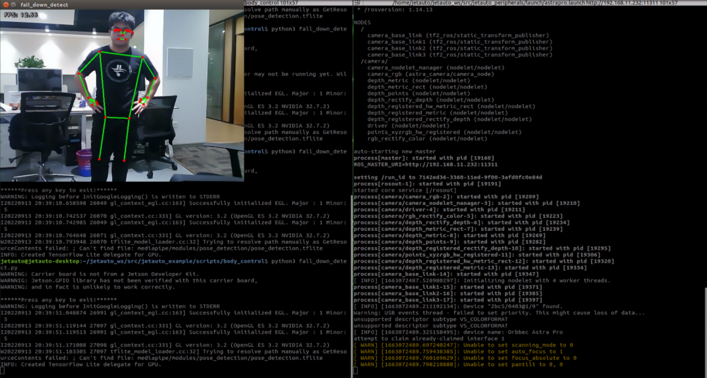


#### 7.1.12.4 Program Analysis

The program file of the feature is located at: **ros2_ws/src/example/example/body_control/include/fall_down_detect.py**

> [!NOTE]
>
> **Before modifying the program, back up the original factory code. Do not modify the source code file directly to avoid robot malfunction due to incorrect parameter changes.**

* **Functions**

`Main`:

```python
def main():
    node = FallDownDetectNode('fall_down_detect')
    rclpy.spin(node)
    node.destroy_node()
```

Starts the body motion control node.

`get_joint_landmarks`:

```python
def get_joint_landmarks(img, landmarks):
    """
    Convert landmarks from medipipe's normalized output to pixel coordinates
    :param img: Picture corresponding to pixel coordinate
    :param landmarks: Normalized keypoint
    :return:
    """
    h, w, _ = img.shape
    landmarks = [(lm.x * w, lm.y * h) for lm in landmarks]
    return np.array(landmarks)
```

Converts the detected information into pixel coordinates.

`height_cal`:

```python
def height_cal(landmarks):
    y = []
    for i in landmarks:
        y.append(i[1])
    height = sum(y)/len(y)

    return height
```

Calculates the body height based on the detected information.

* **Class**

```python
class FallDownDetectNode(Node):
    def __init__(self, name):
        rclpy.init()
        super().__init__(name, allow_undeclared_parameters=True, automatically_declare_parameters_from_overrides=True)
        self.name = name
        self.drawing = mp.solutions.drawing_utils
        self.body_detector = mp_pose.Pose(
            static_image_mode=False,
            min_tracking_confidence=0.7,
            min_detection_confidence=0.7)
        self.running = True
        self.fps = fps.FPS()  # FPS calculator
        
        self.fall_down_count = []
        self.move_finish = True
        self.stop_flag = False
        signal.signal(signal.SIGINT, self.shutdown)
        self.bridge = CvBridge()
        self.image_queue = queue.Queue(maxsize=2)
```

It is the fall detection node.

`Init`:

```python
    def __init__(self, name):
        rclpy.init()
        super().__init__(name, allow_undeclared_parameters=True, automatically_declare_parameters_from_overrides=True)
        self.name = name
        self.drawing = mp.solutions.drawing_utils
        self.body_detector = mp_pose.Pose(
            static_image_mode=False,
            min_tracking_confidence=0.7,
            min_detection_confidence=0.7)
        self.running = True
        self.fps = fps.FPS()  # FPS calculator
```

Initializes the parameters required for body control, subscribes to the camera image topic, initializes the chassis, buzzer, motors, and finally starts the main function within the class.

`get_node_state`:

```python
    def get_node_state(self, request, response):
        response.success = True
        return response
```

Sets the current initialization state of the node.

`shutdown`:

```python
    def shutdown(self, signum, frame):
        self.running = False
```

A callback function to terminate the recognition process upon program exit.

`image_callback`:

```python
    def image_callback(self, ros_image):
        cv_image = self.bridge.imgmsg_to_cv2(ros_image, "rgb8")
        rgb_image = np.array(cv_image, dtype=np.uint8)
        if self.image_queue.full():
            # If the queue is full, discard the oldest image
            self.image_queue.get()
        # Put the image into the queue
        self.image_queue.put(rgb_image)
```

The image topic callback function processes images and places them into a queue.

`Move`:

```python
    def move(self):
        for i in range(5):
            twist = Twist()
            twist.linear.x = 0.2
            self.mecanum_pub.publish(twist)
            time.sleep(0.2)
            twist = Twist()
            twist.linear.x = -0.2
            self.mecanum_pub.publish(twist)
            time.sleep(0.2)
        self.mecanum_pub.publish(Twist())
        self.stop_flag =True
        self.move_finish = True
```

Motion strategy function controls the robot’s movement according to the detected body height.

`buzzer_warn`:

```python
def buzzer_warn(self):
    if not self.stop_flag:
        while not self.stop_flag:
            msg = BuzzerState()
            msg.freq = 1000
            msg.on_time = 0.1
            msg.off_time = 0.1
            msg.repeat = 1
            self.buzzer_pub.publish(msg)
            time.sleep(0.2)
    else:
        msg = BuzzerState()
        msg.freq = 1900
        msg.on_time = 0.2
        msg.off_time = 0.01
        msg.repeat = 1
        self.buzzer_pub.publish(msg)
```

Buzzer control function triggers buzzer alerts.

`image_proc`:

```python
    def image_proc(self, image):
        image_flip = cv2.flip(cv2.cvtColor(image, cv2.COLOR_RGB2BGR), 1)
        results = self.body_detector.process(image)
        if results is not None and results.pose_landmarks:
            if self.move_finish:
                landmarks = get_joint_landmarks(image, results.pose_landmarks.landmark)
                h = height_cal(landmarks)
                if h > image.shape[:-2][0] - 120:
                    self.fall_down_count.append(1)
                else:
                    self.fall_down_count.append(0)
                if len(self.fall_down_count) == 3:
                    count = sum(self.fall_down_count)
```

Body recognition function uses the model to draw human keypoints and performs movements according to the detected body height.

`Main`:

```python
    def main(self):
        while self.running:
            try:
                image = self.image_queue.get(block=True, timeout=1)
            except queue.Empty:
                if not self.running:
                    break
                else:
                    continue
            try:
                result_image = self.image_proc(np.copy(image))
            except BaseException as e:
                self.get_logger().info('\033[1;32m%s\033[0m' % e)
                result_image = cv2.flip(cv2.cvtColor(image, cv2.COLOR_RGB2BGR), 1)
            self.fps.update()
            result_image = self.fps.show_fps(result_image)
            cv2.imshow(self.name, result_image)
            key = cv2.waitKey(1)
            if key == ord('q') or key == 27:  # Press Q or Esc to exit
                self.mecanum_pub.publish(Twist())
                self.running = False
```

The main function within the `FallDownDetectNode` class is responsible for feeding images into the recognition function and displaying the returned frames.


## 7.2 Machine Learning Basics

### 7.2.1 Introduction to Machine Learning

#### 7.2.1.1 Overview

Artificial Intelligence (AI) is a new technological science focused on the theories, methods, technologies, and applications used to simulate, extend, and augment human intelligence.

AI encompasses various fields such as machine learning, computer vision, natural language processing, and deep learning. Among them, machine learning is a subfield of AI, and deep learning is a specific type of machine learning.

Since its inception, AI has seen rapid development in both theory and technology, with expanding application areas, gradually evolving into an independent discipline.

#### 7.2.1.2 What Is Machine Learning

Machine Learning is the core of AI and the fundamental approach to enabling machine intelligence. It is an interdisciplinary field involving probability theory, statistics, approximation theory, convex analysis, algorithmic complexity, and more.


The essence of machine learning lies in enabling computers to simulate or implement human learning behaviors in order to acquire new knowledge or skills, and reorganize existing knowledge structures to continuously improve performance. From a practical perspective, machine learning involves training models using data and making predictions with those models.

Take AlphaGo as an example—it was the first AI program to defeat a professional human Go player and later a world champion. AlphaGo operates based on deep learning, which involves learning the underlying patterns and hierarchical representations from sample data to gain insights.

#### 7.2.1.3 Types of Machine Learning

Machine learning is generally classified into supervised learning and unsupervised learning, with the key distinction being whether the dataset's categories or patterns are known.

* **Supervised Learning**

Supervised learning provides a dataset along with correct labels or answers. The algorithm learns to map inputs to outputs based on this labeled data. This is the most common type of machine learning.

Labeled Data: Supervised learning uses training data that includes both input features and corresponding labels or outputs. Features describe the attributes of the data, while labels represent the target variable the model is expected to predict or classify. For instance, in image recognition, a large number of images of dogs can be labeled as "dog." The machine learns to recognize dogs in new images through this data.


Model Selection: Choosing the appropriate model to represent the relationship in the data is crucial. Common models include linear regression, logistic regression, decision trees, support vector machines (SVM), and deep neural networks. The choice depends on the data characteristics and the specific problem.

Feature Engineering: This involves preprocessing and transforming raw data to extract meaningful features. It includes data cleaning, handling missing values, normalization or standardization, feature selection, and feature transformation. Good feature engineering enhances model performance and generalization.

Training and Optimization: Using labeled training data, the model is trained to fit the underlying relationships. This typically involves defining a loss function, selecting an appropriate optimization algorithm, and iteratively adjusting model parameters to minimize the loss. Common optimization methods include gradient descent and stochastic gradient descent.

Model Evaluation: After training, the model is evaluated to assess its performance on new data. Common metrics include accuracy, precision, recall, F1-score, and ROC curves. Evaluating the model ensures it is suitable for real-world applications.

In summary, supervised learning involves using labeled training data to build a model that can classify or predict unseen data. Key steps include model selection, feature engineering, model training and optimization, and performance evaluation. Together, these steps form the foundation of supervised learning.

* **Unsupervised Learning**

Unsupervised learning involves providing the algorithm with data without labels or known answers. All data is treated equally, and the machine is expected to uncover hidden structures or patterns.

For example, in image classification, if you provide a set of images containing cats and dogs without any labels. The algorithm will analyze the data and automatically group the images into two categories—cat images and dog images—based on similarities.


### 7.2.2 Introduction to Machine Learning Libraries

#### 7.2.2.1 Common Machine Learning Frameworks

There are many machine learning frameworks available. The most commonly used include PyTorch, TensorFlow, PaddlePaddle, and MXNet.

#### 7.2.2.2 PyTorch

Torch is an open-source machine learning framework under the BSD License, widely used for its powerful multi-dimensional array operations. PyTorch is a machine learning library based on Torch but offers greater flexibility, supports dynamic computation graphs, and provides a Python interface.

Unlike TensorFlow’s static computation graphs, PyTorch uses dynamic computation graphs, which can be modified in real-time according to the needs of the computation. PyTorch allows developers to accelerate tensor operations using GPUs, build dynamic graphs, and perform automatic differentiation.


#### 7.2.2.3 Tensorflow

TensorFlow is an open-source machine learning framework designed to simplify the process of building, training, evaluating, and saving neural networks. It enables the implementation of machine learning and deep learning concepts in the simplest way. With its foundation in computational algebra and optimization techniques,

TensorFlow allows for efficient mathematical computations. It can run on a wide range of hardware—from supercomputers to embedded systems—making it highly versatile. TensorFlow supports CPU, GPU, or both simultaneously. Compared to other frameworks, TensorFlow is best suited for industrial deployment, making it highly appropriate for use in production environments.


#### 7.2.2.4 PaddlePaddle

PaddlePaddle, developed by Baidu, is China’s first open-source, industrial-grade deep learning platform. It integrates a deep learning training and inference framework, a library of foundational models, end-to-end development tools, and a rich suite of supporting components. Built on years of Baidu’s R\&D and real-world applications in deep learning, PaddlePaddle is powerful and versatile.

In recent years, deep learning has achieved outstanding performance across many fields such as image recognition, speech recognition, natural language processing, robotics, online advertising, medical diagnostics, and finance.


#### 7.2.2.5 MXNet

MXNet is another high-performance deep learning framework that supports multiple programming languages, including Python, C++, Scala, and R. It offers data flow graphs similar to those in Theano and TensorFlow and supports multi-GPU configuration. It also includes high-level components for model building, comparable to those in Lasagne and Blocks, and can run on nearly any hardware platform—including mobile devices.


MXNet is designed to maximize efficiency and flexibility. As an accelerated library, it provides powerful tools for developers to take full advantage of GPUs and cloud computing. MXNet supports distributed deployment via a parameter server and can scale almost linearly across multiple CPUs and GPUs.


## 7.3 Machine Learning Application

### 7.3.1 GPU Acceleration

#### 7.3.1.1 Introduction to GPU-Accelerated Computing

GPU stands for Graphics Processing Unit, which is also known as the display core, visual processor, or display chip. A GPU is a microprocessor designed to perform image rendering and image-related computation tasks on devices such as personal computers, workstations, game consoles, tablets, and smartphones.

GPU-accelerated computing refers to the use of both the GPU and CPU together to speed up the execution of scientific, analytical, engineering, consumer, and enterprise applications. This acceleration capability enables faster performance for applications running on various platforms, including cars, smartphones, tablets, drones, and robots.

#### 7.3.1.2 Performance Comparison: GPU vs. CPU

The CPU is designed for general-purpose computing, which handles multitasking and system-level operations, but has limited computational throughput. In contrast, the GPU is designed for high-volume, repetitive calculations and excels at tasks involving massive parallelism, though it is less suited for complex logical operations.

Architecture Differences The CPU follows a serial architecture with a small number of powerful cores, making it ideal for executing single tasks quickly. The GPU adopts a parallel architecture with a large number of simpler cores, making it highly efficient at executing many tasks simultaneously.

In terms of hardware structure, the CPU is equipped with multiple functional modules, allowing it to handle complex computational environments. In contrast, the GPU has a relatively simpler architecture, with the majority of its transistors dedicated to stream processors and memory controllers.

In a CPU, most transistors are used to build control circuits and cache, with only a small portion allocated to actual computation. This design enhances the CPU’s versatility, enabling it to process a wide range of data types and perform complex logical operations, but it also limits its computational performance.

In a GPU, however, most transistors are devoted to specialized circuits and pipelines. This configuration significantly boosts the GPU’s processing speed and greatly enhances its floating-point computational power.

#### 7.3.1.3 Advantages of GPU

GPUs have a large number of cores and are suitable for large-scale parallel data processing, making them particularly advantageous for repetitive tasks in multimedia processing.

Take deep learning as an example—the neural network systems it relies on are designed to analyze massive amounts of data at high speed, and such analysis is exactly what GPUs excel at.

Moreover, the GPU architecture does not include dedicated image processing algorithms; instead, it is optimized based on CPU architecture. Therefore, in addition to image processing, GPUs are also widely used in fields such as scientific computing, cryptographic cracking, numerical analysis, big data processing, and financial analysis, where parallel computing is required.

### 7.3.2 TensorRT Acceleration

#### 7.3.2.1 Introduction to TensorRT

TensorRT is a high-performance deep learning inference SDK developed by NVIDIA. It includes a deep learning inference optimizer and runtime that enables low-latency and high-throughput deployment of inference applications.

TensorRT now supports deep learning frameworks such as TensorFlow, Caffe, MXNet, and PyTorch. By integrating TensorRT with NVIDIA GPUs, fast and efficient inference deployment can be achieved across most frameworks.

There are many optimization methods for deep learning models, such as weight quantization, weight sparsity, and channel pruning, which are typically performed during the training phase. In contrast, TensorRT optimizes already-trained models by improving the efficiency of the computational graph.

#### 7.3.2.2 Optimization Methods

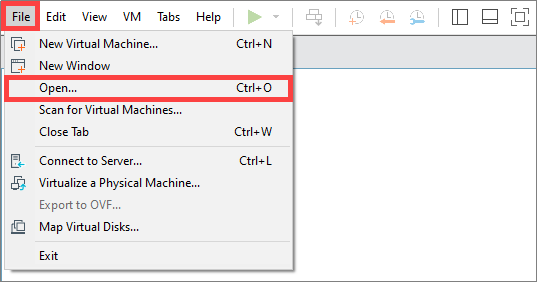

TensorRT employs the following optimization strategies:

- Precision Calibration

- Layer \& Tensor Fusion

- Kernel Auto-Tuning

- Dynamic Tenser Memory

- Multi-Stream Execution

- **Precision Calibration for Weights and Activations**

Most deep learning frameworks use 32-bit floating-point (FP32) precision for network tensors during training. After training, because inference does not require backpropagation, data precision can be reduced to formats like FP16 or INT8. Lowering data precision reduces memory usage and latency and shrinks the model size.

The following table shows the dynamic ranges for different precisions:

| **Precision** | **Dynamic Range**     |
| ------------- | --------------------- |
| FP32          | −3.4×1038 ~ +3.4×1038 |
| FP16          | −65504 ~- +65504      |
| INT8          | −128 ~ +127           |

INT8 has only 256 distinct values. Using INT8 to represent FP32 values may result in information loss and degraded performance. However, TensorRT provides a fully automated calibration process to optimally convert FP32 data to INT8 with minimal performance loss.

- **Layer and Tensor Fusion**

Although CUDA cores compute tensors quickly, significant time can still be spent on kernel launches and input/output tensor read-write operations per layer, which wastes GPU resources and creates memory bandwidth bottlenecks.

TensorRT optimizes model structure by horizontally or vertically merging layers to reduce the total number of layers and the CUDA cores they occupy.

Horizontal fusion combines convolution, bias, and activation into a CBR structure, which occupies only one CUDA core. Vertical fusion merges layers with the same structure but different weights into a wider layer, also using only one CUDA core.

Additionally, for multi-branch merges, TensorRT can direct outputs to the correct memory address without copying, eliminating the concat layer and reducing memory access operations.

- **Kernel Auto-Tuning**

During inference, the network model performs calculations using CUDA kernels on the GPU. TensorRT automatically tunes CUDA kernels based on different algorithms, network models, and GPU platforms to ensure optimal performance on a given platform.

- **Dynamic Tensor Memory**

TensorRT assigns memory to each tensor only during its usage period to avoid redundant memory allocation. This reduces memory usage and improves memory reuse efficiency.

- **Multi-Stream Execution**

By utilizing CUDA streams, TensorRT enables parallel computation across multiple branches of the same input, maximizing parallel operation.

### 7.3.3 YOLOv11 Model

#### 7.3.3.1 Overview of the YOLO Models

* **YOLO Series**

YOLO (You Only Look Once) is a One-stage, deep learning-based regression approach to object detection.

Before the advent of YOLOv1, the R-CNN family of algorithms dominated the object detection field. Although the R-CNN series achieved high detection accuracy, its Two-stage architecture limited its speed, making it unsuitable for real-time applications.

To address this issue, the YOLO series was developed. The core idea behind YOLO is to redefine object detection as a regression problem. It processes the entire image as input to the network and directly outputs Bounding Box coordinates along with their corresponding class labels. Compared to traditional object detection methods, YOLO offers faster detection speed and higher average precision.

* **YOLOv11**

Yolov11 builds upon previous versions of the YOLO model, delivering significant improvements in both detection speed and accuracy.

A typical object detection algorithm can be divided into four modules: the input module, the backbone network, the neck network, and the head output module. Analyzing Yolov11 according to these modules reveals the following enhancements:

1\) Input: Added adaptive grayscale filling and dynamic Mosaic enhancement, optimizing adaptability and training efficiency.

2\) Backbone Network: Utilizes the C3K2 module, which combines 1×1, 3×3, and 5×5 multi-scale convolution kernels to expand the receptive field while reducing computational load, along with the GSConv+GWGA combination.

3\) Neck Network: Based on the FPN+PAN framework, the C2PSA module is inserted.

Head Output Layer: Adopts a classification-regression decoupled head, with the classification head focusing on semantic features and the regression head focusing on location features, and introduces dynamic head weight adjustment where weights are dynamically allocated between the two heads based on the loss during training to improve overall performance.

#### 7.3.3.2 YOLOv11 Model Structure

* **Components**

1. Convolutional Layer: Feature Extraction

Convolution is the process where an entity at multiple past time points does or is subjected to the same action, influencing its current state. Convolution can be divided into **convolution** and **multiplication**.

**Convolution** can be understood as flipping the data, and **multiplication** as the accumulation of the influence that past data has on the current data. The data flipping is done to establish relationships between data points, facilitating the calculation of accumulated influence with a proper reference.


In YOLOv11, the data to be processed are images, which are two-dimensional in computer vision. Accordingly, the convolution is a two-dimensional convolution. The purpose of 2D convolution is to extract features from images. To perform a 2D convolution, it is necessary to understand the convolution kernel.

The convolution kernel is the unit region over which the convolution calculation is performed each time. The unit is pixels, and the convolution sums the pixel values within the region. Typically, convolution is done by sliding the kernel across the image, and the kernel size is manually set.

When performing convolution, depending on the desired effect, the image borders may be padded with zeros or extended by a certain number of pixels, then the convolution results are placed back into the corresponding positions in the image. For example, a 6×6 image is first expanded to 7×7, then convolved with the kernel, and finally the results are filled back into a blank 6×6 image.


2. Pooling Layer: Feature Amplification

The pooling layer, also called the downsampling layer, is usually used together with convolution layers. After convolution, pooling performs further sampling on the extracted features. Pooling includes various types such as global pooling, average pooling, max pooling, etc., each producing different effects.

To make it easier to understand, max pooling is used here as an example. Before understanding max pooling, it is important to know about the filter, which is like the convolution kernel—a manually set region that slides over the image and selects pixels within the area.

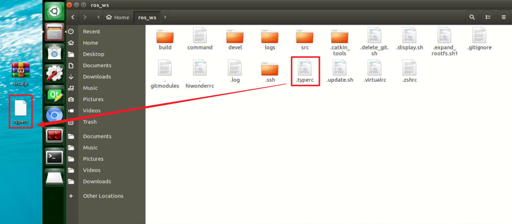

Max pooling keeps the most prominent features and discards others. For example, starting with a 6×6 image, applying a 2×2 filter for max pooling produces a new image with reduced size.


3. Upsampling Layer: Restoring Image Size

Upsampling can be understood as “reverse pooling.” After pooling, the image size shrinks, and upsampling restores the image to its original size. However, only the size is restored, the pooled features are also modified accordingly.

For example, starting with a 6×6 image, applying a 3×3 filter for upsampling produces a new image.


4. Batch Normalization Layer: Data Regularization

Batch normalization means rearranging the data neatly, which reduces the computational difficulty of the model and helps map data better into the activation functions.

Batch normalization reduces the loss rate of features during each calculation, retaining more features for the next computation. After multiple computations, the model’s sensitivity to the data increases.

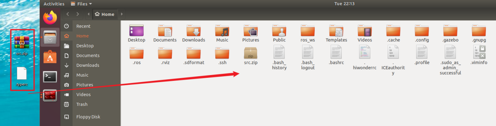

5. ReLU Layer: Activation Function

Activation functions are added during model construction to introduce non-linearity. Without activation functions, each layer is essentially a matrix multiplication. Every layer’s output is a linear function of the previous layer’s input, so no matter how many layers the neural network has, the output is just a linear combination of the input. This prevents the model from adapting to actual situations.

There are many activation functions, commonly ReLU, Tanh, Sigmoid, etc. Here, ReLU is used as an example. ReLU is a piecewise function that replaces all values less than 0 with 0 and keeps positive values unchanged.


6. ADD Layer: Tensor Addition

Features can be significant or insignificant. The ADD layer adds feature tensors together to enhance the significant features.

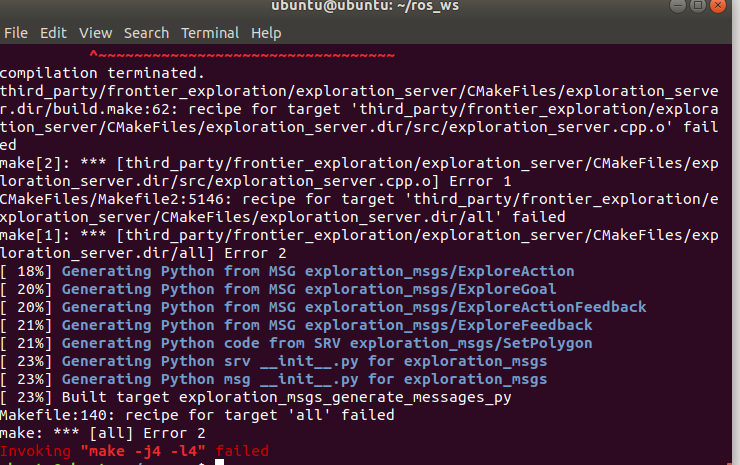

7. Concat Layer: Tensor Concatenation

The Concat layer concatenates feature tensors to combine features extracted by different methods, thereby preserving more features.


* **Composite Elements**

When building a model, using only the basic layers mentioned earlier can lead to overly lengthy, disorganized code with unclear hierarchy. To improve modeling efficiency, these basic elements are often grouped into modular units for reuse.

1. Convolutional Block

A convolutional block consists of a convolutional layer, a batch normalization layer, and an activation function. The process follows this order: convolution → batch normalization → activation.

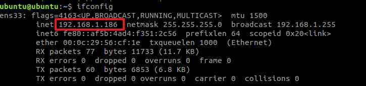

1. Strided Sampling and Concatenation Unit（Focus）

The input image is first divided into multiple large regions. Then, small image patches located at the same relative position within each large region are concatenated together to form a new image. This effectively splits the input image into several smaller images. Finally, an initial sampling is performed on the images using a convolutional block.

As shown in the figure below, for a 6×6 image, if each large region is defined as 2×2, the image can be divided into 9 large regions, and each contains 4 small patches.

By taking the small patches at position 1 from each large region and concatenating them, a 3×3 image can be formed. The patches at other positions are concatenated in the same way.  
Ultimately, the original 6×6 image is decomposed into four 3×3 images.

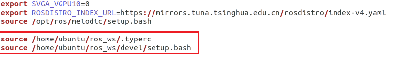

2. Residual Block

The residual block enables the model to learn subtle variations in the image. Its structure is relatively simple and involves merging data from two paths.

In the first path, two convolutional blocks are used to extract features from the image. In the second path, the original image is passed through directly without convolution. Finally, the outputs from both paths are added together to enhance learning.


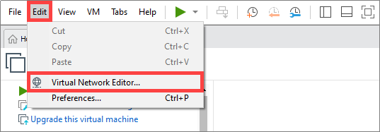

3. Composite Convolutional Block

In YOLOv11, a key feature of the composite convolutional block is its customizable design, allowing convolutional blocks to be configured as needed. This structure also uses two paths whose outputs are merged.

The first path contains a single convolutional layer for feature extraction, while the second path includes 2𝑥+1 convolutional blocks followed by an additional convolutional layer. After sampling and concatenation, batch normalization is applied to standardize the data, followed by an activation function. Finally, a convolutional block is used to process the combined features.

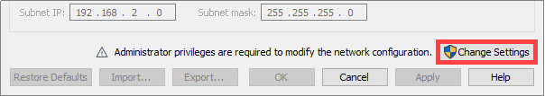

4. Composite Residual Convolutional Block

The composite residual convolutional block modifies the composite convolutional block by replacing the 2𝑥 convolutional blocks with   
𝑥 residual blocks. In YOLOv11, this block is also customizable, allowing residual blocks to be tailored according to specific requirements.

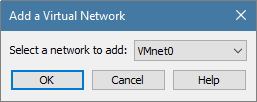

5. Composite Pooling Block

The output from a convolutional block is simultaneously passed through three separate max pooling layers, while an additional unprocessed copy is preserved. The resulting four feature maps are then concatenated and passed through a convolutional block. By processing data with the composite pooling block, the original features can be significantly enhanced and emphasized.

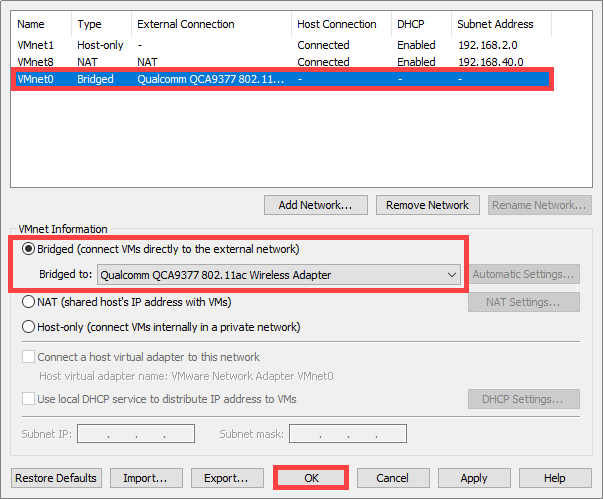

### 7.3.4 YOLOv11 Workflow

This section explains the model’s processing flow using the concepts of prior boxes, prediction boxes, and anchor boxes involved in YOLOv11.

#### 7.3.4.1 Prior Box

When an image is fed into the model, predefined regions of interest must be specified. These regions are marked using prior boxes, which serve as initial bounding box templates indicating potential object locations in the image.

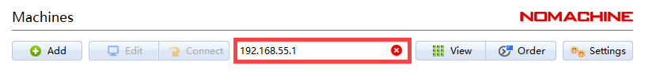

#### 7.3.4.2 Prediction Box

Prediction boxes are generated by the model as output and do not require manual input. When the first batch of training data is fed into the model, the prediction boxes are automatically created. The center points of prediction boxes tend to be located in areas where similar objects frequently appear.


#### 7.3.4.3 Anchor Box

Since predicted boxes may have deviations in size and location, anchor boxes are introduced to correct these predictions.

Anchor boxes are positioned based on the predicted boxes. By influencing the generation of subsequent predicted boxes, anchor boxes are placed around their relative centers to guide future predictions.


#### 7.3.4.4 Project Process

Once the bounding box annotations are complete, prior boxes appear on the image. When the image data is input into the model, predicted boxes are generated based on the locations of the prior boxes. Subsequently, anchor boxes are generated to adjust the predicted results. The weights from this round of training are then updated in the model.

With each new training iteration, the predicted boxes are influenced by the anchor boxes from the previous round. This process is repeated until the predicted boxes gradually align with the prior boxes in both size and location.

<p id ="anther7.3.5"></p>

### 7.3.5 Image Collection and Annotation

Training the YOLOv11 model requires a large amount of data, so data collection and annotation must be performed first to prepare for model training.

In this example, the demonstration uses traffic signs as target objects.

#### 7.3.5.1 Image Collection

1. Power on the robot and connect it via the NoMachine remote control software.

2. Click the terminal icon 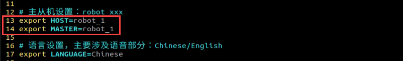 in the system desktop to open a command-line window.

3. Stop the app auto-start service by entering the following command:

```bash
sudo systemctl stop start_app_node.service
```

4. Start the depth camera service with the command.

```bash
ros2 launch peripherals depth_camera.launch.py
```

5. Open a new command-line terminal and enter the command to create a directory for storing your dataset.

```bash
mkdir -p ~/my_data
```

6. Then, launch the tool by entering the following command.

```bash
cd ~/software/collect_picture && python3 main.py
```

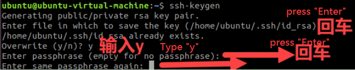

The **save number** in the top-left corner of the tool interface shows the ID of the saved image. The **existing** shows how many images have already been saved.

7. Click `Select` to change the save path to the **my_data** folder created before.

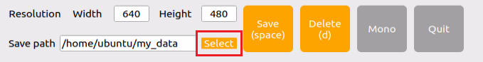

8. After selecting the target directory, click `Choose`.

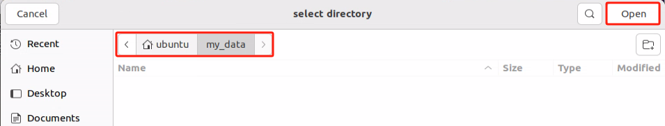

9. Click the `Save(Space)` button or press the `space` key to save the current camera frame. A `JPEGImages` folder will be automatically created under the directory **/home/ubuntu/my_data** to store the images.


> [!NOTE]
>
> **To improve model reliability, capture the target object from various distances, angles, and tilts.**

10. After collecting images, click the `Quit` button to close the tool.

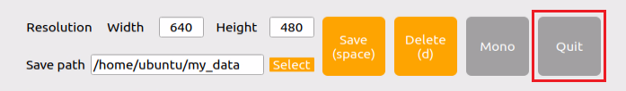

11. Click on the icon  in the system status bar to open the file manager, where the saved images can be viewed.

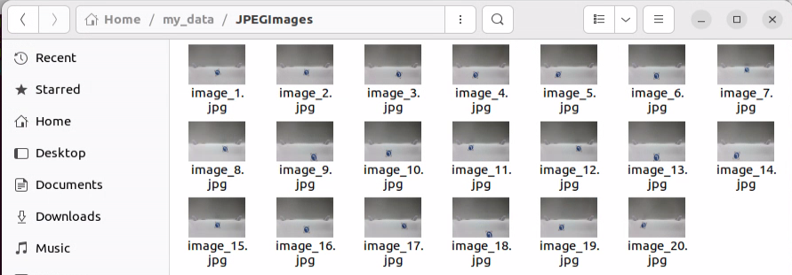

12. Then press **Ctrl+C** in all open terminal windows to exit—this completes the image collection process.

#### 7.3.5.2 Image Annotation

Once the images are collected, they need to be annotated. Annotation is essential for creating a functional dataset, as it tells the training model which parts of the image correspond to which categories. This allows the model to later identify those categories in new, unseen images.

> [!NOTE]
>
> **Commands must be entered with correct capitalization. The Tab key can be used to auto-complete keywords.**

1. Open a terminal and enter the command to start the image annotation tool:

```bash
python3 ~/software/labelImg/labelImg.py
```

Below is a table of common shortcut keys:

| **Function**                                                 | **Shortcut Key** | **Function**                               |
| ------------------------------------------------------------ | ---------------- | ------------------------------------------ |
|  | Ctrl+U           | Choose the directory for images.           |
|  | Ctrl+R           | Choose the directory for calibration data. |
|  | W                | Create an annotation box.                  |
|  | Ctrl+S           | Save the annotation.                       |
|  | A                | Switch to the previous image.              |
|  | D                | Switch to the next image.                  |

2. Click the button  to open the folder where your images are stored. In this tutorial, select the directory used for image collection.

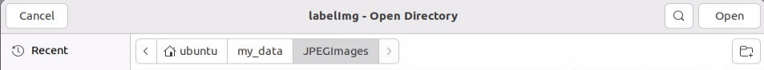

3. Click Open  to open the folder.


4. Then click the **Change Save Dir** button 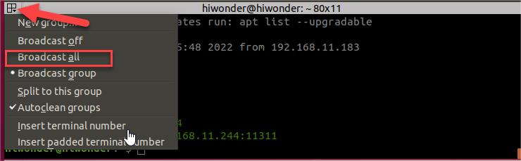 and select the annotation save folder, which is the **Annotations** directory located under the same path as the image collection.

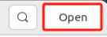

5. Click **Open**  to return to the annotation interface.

6. Press the **W** key to begin creating a bounding box.

7. Move the mouse to the desired location and hold the left mouse button to draw a box that covers the entire object. Release the left mouse button to finish drawing the box.


8. In the pop-up window, name the category of the object, e.g., **left**. After naming, click **OK** or press **Enter** to save the label.


9. Press **Ctrl+S** to save the annotation for the current image.

10. Press the **D** key to move to the next image, then repeat steps 7 to 9 to complete all annotations. Click the close button 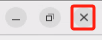 at the top-right corner of the tool to exit.

11. Click the icon  in the system status bar  to open the file manager and navigate to the directory **/home/ubuntu/my_data/**. The annotation files for each image will be available in this folder.


<p id ="anther7.3.6"></p>

### 7.3.6 Data Format Conversion

#### 7.3.6.1 Preparation

Before starting the operations in this section, image collection and annotation must be completed first. For detailed steps, refer to section [7.3.5 Image Collection and Annotation](#anther7.3.5).

Before training the YOLOv11 model with the data, the images need to be assigned categories, and the annotation data must be converted into the proper format.

#### 7.3.6.2 Format Conversion

Before starting the operations in this section, image collection and annotation must be completed first.

> [!NOTE]
>
> **Commands must be entered with correct capitalization. The Tab key can be used to auto-complete keywords.**

1. Open a new terminal and enter the following command to open the file: **Note: If the file is missing, the related file can be created by entering the following command.**

```bash
gedit ~/my_data/classes.names
```

2. Write the labeled category **left** into the text file. If there are multiple categories, each one should be listed on a new line.

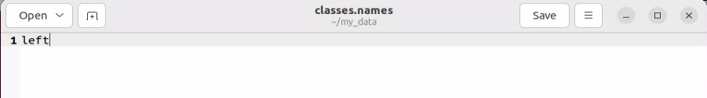

> [!NOTE]
>
> **The class names here must match the labels used in the labelImg annotation tool exactly.**

3. After editing, press **Ctrl+S** to save and exit.

4. Next, return to the terminal and run the following command to convert the annotation format:

```bash
python3 ~/software/xml2yolo.py --data ~/my_data --yaml ~/my_data/data.yaml
```


> [!NOTE]
>
> **Make sure the paths to ~/software/xml2yolo.py and my_data match your actual file structure!**

This command uses three main parameters:

**xml2yolo.py:** A script that converts annotations from XML format to the YOLOv11 format. Make sure the path is correct.

**my_data:** The directory containing your annotated dataset. Make sure the path is correct.

**data.yaml:** Indicates the format conversion for the entire folder after the model has been split. From the command, it is clear that the saved directory is within the **my_data** folder.

The following image shows the generated **data.yaml** file.

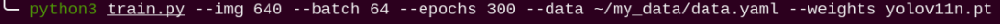

The items listed after the `names` represent the types of labels. The `nc` field specifies the total number of label categories. The `train` refers to the training set—a commonly used term in deep learning that indicates the data used for model training. The parameter following it is the path to the training images. Similarly, the `val` refers to the validation set, which is used to verify the model’s performance during the training process, and the path that follows indicates where the validation data is located. It is important to note that the paths need to be filled in or updated according to their actual locations. For example, during the training process, if there is a need to speed up training by moving the dataset from the robot to a local PC or cloud server, the paths corresponding to `train` and `val` should be updated accordingly.

Finally, an XML file will be generated under the ~/my_data folder to record the path location of the currently split dataset. Similarly, the last parameter in step 4, **~/my_data/data.yaml**, can be changed to modify the save path. This file path must be remembered, as it will be used later for model training.

### 7.3.7 Model Training

> [!NOTE]
>
> **Commands must be entered with correct capitalization. The Tab key can be used to auto-complete keywords.**

#### 7.3.7.1 Preparation

After converting the model format, the next step is to proceed with model training. Before starting, make sure the dataset with the correct format is ready. For details, refer to section [7.3.6 Data Format Conversion](#anther7.3.6).

#### 7.3.7.2 Training Process

1. Power on the robot and connect it via the **NoMachine** remote control software.

2. Click the terminal icon  in the system desktop to open a command-line window.

3. Enter the following command and press Enter to go to the specific directory.

```bash
cd ~/third_party/yolo/yolov11/
```

4. Enter the command to start training the model.

```bash
python3 train.py --img 640 --batch 8 --epochs 300 --data ~/my_data/data.yaml --weights yolo11n.pt
```

In the command, the parameters stands for:  
**\--img**: image size.  
**\--batch**: number of images per batch.  
**\--epochs**: number of training iterations.  
**\--data**: path to the dataset.  
**\--weights**: path to the pre-trained model.

You can modify the parameters above based on your specific needs. To improve model accuracy, consider increasing the number of training epochs. Note that this will also increase training time.

If the following content appears, it indicates that the training is in progress.


After training is complete, the terminal will display the path where the trained model files are saved. The training results are stored in the directory of **yolov11/runs/train/exp**.


> [!NOTE]
>
> **The generated folder name under runs/train/ may vary. Please locate it accordingly.**

#### 7.3.7.3 Importing Training Results (Optional)

The following steps outline how to import the trained model into the robot's controller after training on an external computer or server, and then perform the model conversion. Taking Jetson Orin Nano as an example.

**Steps:**

1. Transfer the trained model file to the Jetson Orin Nano controller using NoMachine software. Simply drag the file from your local machine to the remote desktop, as shown below. The .pt model file, marked in red, should be dragged into the remote desktop.

> [!NOTE]
>
> **The screenshot below shows the robot’s remote desktop. The interface may look slightly different depending on the robot type, but the file transfer process remains the same.**

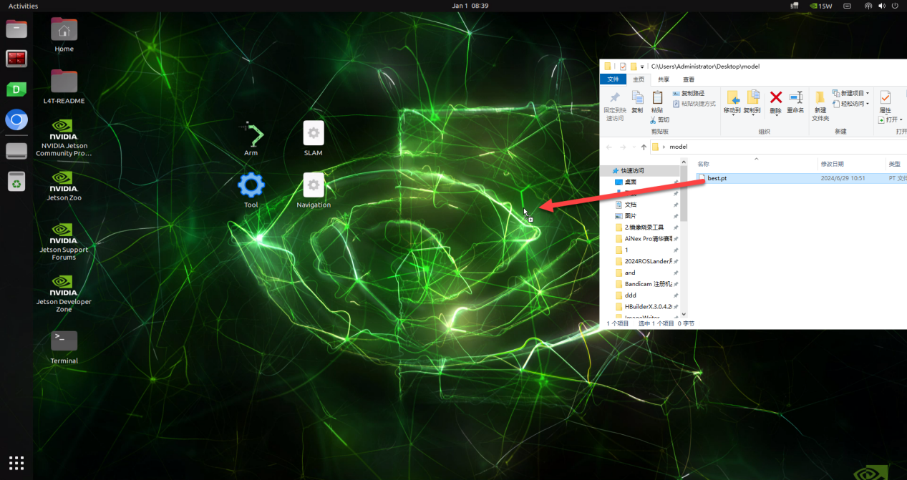

After dragging the file, the model will be successfully imported and visible on the desktop.

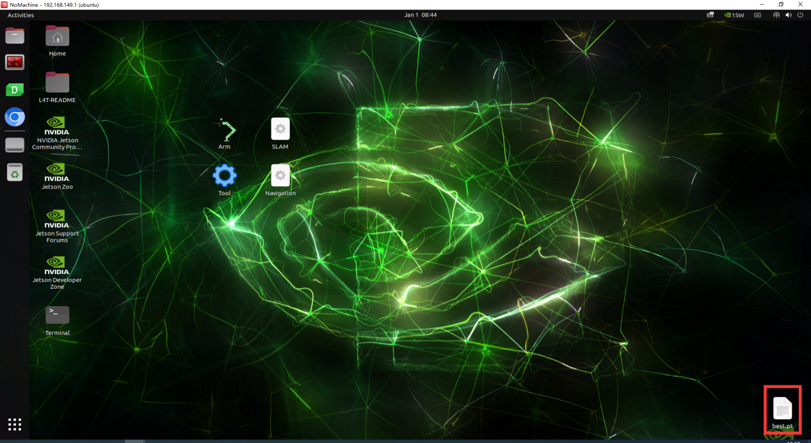

Next, copy the trained model file, for example, **best.pt**, to the **/third_party/yolo/yolov11** directory.

2. Right-click on the desktop and select **Open Terminal**.

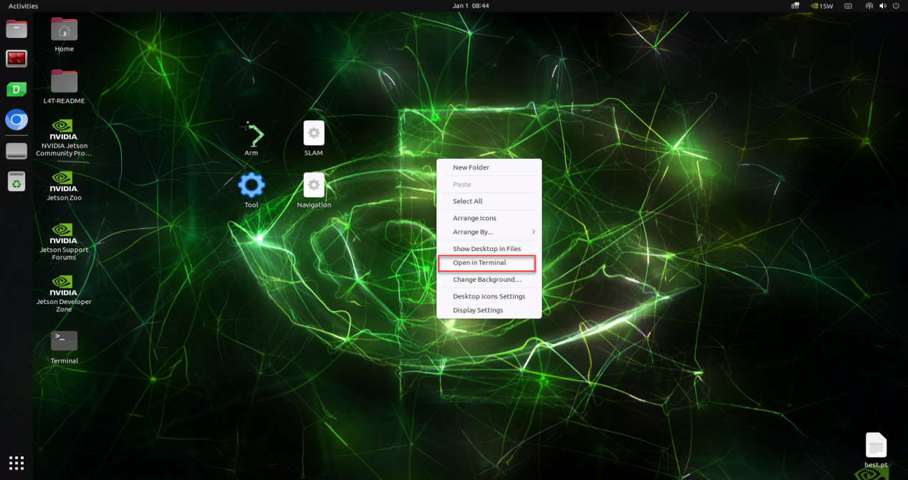

3. In the terminal, input the command to copy the model to the **yolov5** folder.

```bash
mv ~/Desktop/best.pt ~/third_party/yolo/yolov11
```

Next, follow the instructions in **7.3.8 TensorRT Inference Acceleration** for model conversion and testing.

### 7.3.8 TensorRT Inference Acceleration

#### 7.3.8.1 Preparation

After extensive training, the new model needs to be converted into a TensorRT-accelerated version to improve its performance.

#### 7.3.8.2 Creating a TensorRT Model Engine

> [!NOTE]
>
> **Commands must be entered with correct capitalization. The Tab key can be used to auto-complete keywords.**

1. Power on the robot and connect it via the NoMachine remote control software.

2. Click the terminal icon  in the system desktop to open a command-line window.

3. Enter the command to navigate to the specified folder path.

```bash
cd ~/third_party/yolo/yolov11/
```

4. Then, use the command to convert the `pt` file into an `engine` file.

```bash
python3 export.py --weights best.pt --include engine --device 0 --half --imgsz 480 640
```

If the generated `best.engine` file is locked and not readable, as shown in the image below:


To add permissions to the **best.engine** file, open a terminal in the folder containing the best.engine file, then input the following command:

```bash
sudo chmod +x+w+r best.engine
```

#### 7.3.8.3 Object Detection

* **Operation Steps**

1. Click the icon  in the desktop to open the terminal, enter the following command and press **Enter** to disable the app auto-start service.

```bash
sudo systemctl stop start_app_node.service
```

2. Enter the command to copy the trained `best.pt` file into the `~/third_party/yolo/yolov11` directory.

```
cp ~/third_party/yolo/yolov11/runs/detect/train/weights/best.pt ~/third_party/yolo/yolov11
```

3. Open the `yolov11_detect_demo.py` file for object detection.

```bash
gedit ~/ros2_ws/src/example/example/yolov11_detect/yolov11_detect_demo.py
```

4. Change the `MODEL_DEFAULT_NAME` parameter to `best`.


5. Run the object detection using the corresponding command.

```
ros2 launch example yolov11_detect_demo.launch.py
```

* **Detection Result**

Place a traffic sign within the camera’s field of view. Once the sign is detected, a bounding box will appear in the camera feed, highlighting the sign along with its class name and detection confidence.

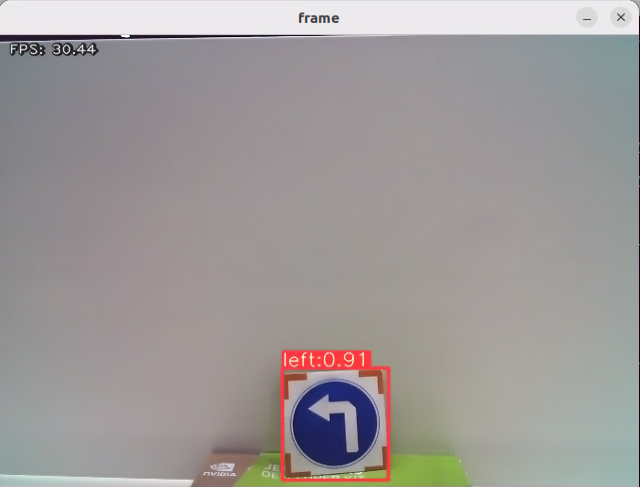

### 7.3.9 Traffic Sign Model Training

**The product names and reference paths mentioned in this document may vary. Please refer to the actual setup for accurate information.**

It is not recommended to use the Jetson Orin Nano for training with large datasets, as the training speed is slow due to I/O speed and memory limitations. Instead, it is advised to use a PC with a dedicated GPU, which follows the same training steps, only requiring proper environment configuration.

If the traffic sign recognition performance in autonomous driving feature is unsatisfactory, training a custom model can be done by following the procedures in this section.

In the following instructions, screenshots may show different robot hostnames, as different robots have similar environment setups. Simply follow the command steps in the document as described — it does not affect the execution.

#### 7.3.9.1 Preparation

1. Prepare a laptop, or if using a desktop, make sure to have a wireless network card, mouse, and other necessary tools.

2. Follow the previous steps to install and launch the remote connection tool, NoMachine.

#### 7.3.9.2 Operation Steps

* **Image Collection**

1. Power on the robot and connect it via the NoMachine remote control software.

2. Click the terminal icon  in the system desktop to open a command-line window.

3. Execute the following command to stop the app auto-start service:

```bash
sudo systemctl stop start_app_node.service
```

4. Execute the following command to start the camera service:

```bash
ros2 launch peripherals depth_camera.launch.py 
```

5. **Open a new terminal**, navigate to the image collection tool directory, and run the image collection script:

```bash
cd ~/software/collect_picture && python3 main.py
```


The **save number** in the top-left corner of the tool interface shows the ID of the saved image. The **existing** shows how many images have already been saved.

6. Change the `Save path` to **/home/ubuntu/my_data**, which will also be used in later steps.

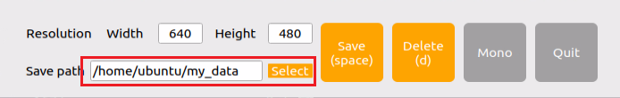

7. Place the target object within the camera's view. Press the `Save (space)` button or the `space` bar on the keyboard to save the current camera frame. After pressing it, both the **save number** and the **existing** counters will increase by 1. This helps track the current image ID and total image count in the folder.


8. After clicking `Save (space)`, a folder named **JPEGImages** will be automatically created under the path **/home/ubuntu/my_data** to store the images.


> [!NOTE]
>
> * **To improve model reliability, capture the target object from various distances, angles, and tilts.**
>
> * **To ensure stable recognition, collect at least 200 images per category during the data collection phase.**

9. After collecting images, click the **Quit** button to close the tool.

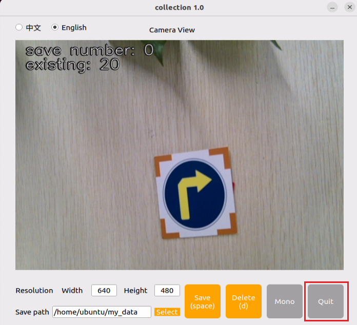

10. Click on the icon  in the system status bar to open the file manager. Navigate to the directory as shown in the image below to view the saved images.

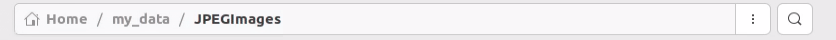

* **Image Annotation**

> [!NOTE]
>
> **Commands must be entered with correct capitalization. The Tab key can be used to auto-complete keywords.**

1. Power on the robot and connect it via the **NoMachine** remote control software.

2. Click the terminal icon  in the system desktop to open a command-line window.

3. Execute the following command to stop the app service:

```bash
sudo systemctl stop start_app_node.service
```

4. Open a new terminal and enter the following command.

```bash
python3 software/labelImg/labelImg.py
```

5. After opening the image annotation tool. Below is a table of common shortcut keys:

| **Function**                                                 | **Shortcut Key** | **Function**                               |
| ------------------------------------------------------------ | ---------------- | ------------------------------------------ |
|  | Ctrl+U           | Choose the directory for images.           |
|  | Ctrl+R           | Choose the directory for calibration data. |
|  | W                | Create an annotation box.                  |
|  | Ctrl+S           | Save the annotation.                       |
|  | A                | Switch to the previous image.              |
|  | D                | Switch to the next image.                  |

6. Use the shortcut **Ctrl+U** and set the image directory to `/home/ubuntu/my\_data/JPEGImages/`, then click the `Open` button.

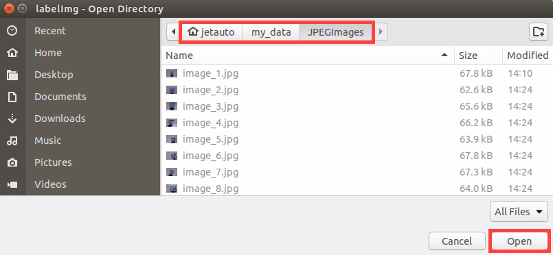

7. Use the shortcut **Ctrl+R**, set the annotation data storage directory to `/home/ubuntu/my\_data/Annotations/`, and click `Open`. The **Annotations** folder will be automatically generated when collecting images.


8. Press the `w` key to begin creating a bounding box.

Move the mouse to the desired location and hold the left mouse button to draw a box that covers the entire object. Release the left mouse button to finish drawing the box.


9. In the pop-up window, name the category of the object, e.g., **right**. After naming, click **`OK`** or press `Enter` to save the label.


10. Press **Ctrl+S** to save the annotation for the current image.

11. Refer to Step 9 to complete the annotation of the remaining images.

12. Click the icon  in the system status bar to open the file manager and navigate to the directory `/home/ubuntu/my\_data/Annotations/` to view the image annotation files. This is the same dataset path where the images were saved during data collection.

* **Generating Related Files**

1. Click the terminal icon  in the system desktop to open a command-line window.

2. Enter the following command to open the file for editing:

```bash
vim ~/my_data/classes.names
```

3. Press the **i** key to enter edit mode and add the class names for the target recognition objects. When adding multiple class names, each class name should be listed on a separate line.


> [!NOTE]
>
> **The class names here must match the labels used in the labelImg annotation tool exactly.**

4. After editing, press **Esc**, then type `:wq` to save and close the file.


5. Next, enter the command to convert the data format and press **Enter**:

```bash
python3 software/xml2yolo.py --data ~/my_date --yaml ~/my_data/data.yaml
```

In this command, the **xml2yolo.py** file is used to convert the annotated files into XML format and categorize the dataset into training and validation sets.

If the prompt shown in the figure below appears, the conversion was successful.


The output paths depend on the actual storage location of the folders in your robot’s file system. Paths may vary across devices, but the generated **data.yaml** file will correspond to your annotated dataset.

* **Model Training**

1. Click the terminal icon  in the system desktop to open a command-line window.

2. Then enter the command to navigate to the specific directory.

```bash
cd ~/third_party/yolo/yolov11/  
```

3. Enter the command to start training the model.

```bash
python3 train.py --img 640 --batch 8 --epochs 300 --data ~/my_data/data.yaml --weights yolo11s.pt
```

In the command, `--img` specifies the image size, `--batch` indicates the number of images input per batch, `--epochs` refers to the number of training iterations, representing how many times the machine learning model will go through the dataset. This value should be optimized based on the actual performance of the final model. In this example, the number of training epochs is set to 8 for quick testing. If the computer system is more powerful, this value can be increased to achieve better training results. `--data` is the path to the dataset, which refers to the folder containing the manually annotated data. `--weights` indicates the path to the pre-trained model weights. This specifies which .pt weight file the training process is based on. It’s important to note whether `yolov11s.pt`, `yolov11n.pt`, or another version is used.

The above parameters can be adjusted according to the specific setup. To improve model accuracy, consider increasing the number of training epochs. Note that this will also increase training time.

If you see the following output, it means the training process is running successfully.


Once training is complete, the terminal will display the path where the training data is saved, as shown below.

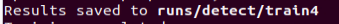

> [!NOTE]
>
> **If multiple training sessions are conducted, the folder name here, such as exp5, may be different and could be renamed to exp2, exp3, etc. Subsequent steps will depend on the specific folder name used in this step.**

* **Creating a TensorRT Model Engine**

1. Power on the robot and connect it via the **NoMachine** remote control software.

2. Click the terminal icon  in the system desktop to open a command-line window.

3. Enter the command to navigate to the specified folder path.

```bash
cd ~/third_party/yolo/yolov11/
```

4. Move the trained weight file to the `~/third_party/yolo/yolov11/` directory.

```bash
cp ~/third_party/yolo/yolov11/runs/detect/train4/weights/best.pt ~/third_party/yolo/yolov11/best.pt
```

5. Then, use the command to convert the `pt` file into an `engine` file.

```bash
python3 export.py --weights best.pt --include engine --device 0 --half --imgsz 480 640
```

If the generated `best.engine` file is locked and not readable, as shown in the image below:


To add permissions to the `best.engine` file, open a terminal in the folder containing the best.engine file, then input the following command:

```bash
sudo chmod +x+w+r best.engine
```

#### 7.3.9.3 Using the Model

1. Enter the command to copy the generated engine file `best.engine` to the `~/ros2_ws/src/example/example/yolov11_detect/models` directory.

```bash
cp ~/third_party/yolo/yolov11/best.engine ~/ros2_ws/src/example/example/yolov11_detect/models/best.engine
```

2. Enter the following command and press **Enter** to stop the app service:

```bash
sudo systemctl stop start_app_node.service
```

3. Open the autonomous driving program and change the `engine` parameter from `traffic_signs.engine` to `best.engine`, then close the program.

```
gedit ~/ros2_ws/src/example/example/self_driving/self_driving.launch.py
```

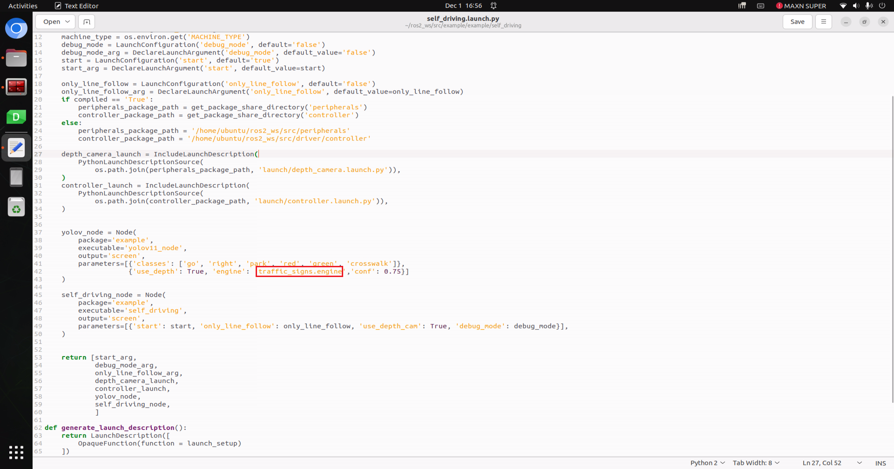

4. Entering the following command to start the autonomous driving feature.

```bash
ros2 launch example self_driving.launch.py 
```

> [!NOTE]
>
> **After testing, it is recommended to change the `engine` parameter back from `best.engine` to `traffic_signs.engine`.**

### 7.3.10 FAQ

1. **Q:** What to do if multiple training attempts fail?

   **A:** Try the following steps:

(1) Open the terminal by clicking the system desktop icon , then enter the commands below to increase the swap space.

```bash
sudo swapoff /swapfile

sudo rm /swapfile

sudo fallocate -l 6G /swapfile

sudo chmod 600 /swapfile

sudo mkswap /swapfile

sudo swapon /swapfile
```

(2) Return to the relevant section of the training guide and proceed with the next steps.


## 7.4 Autonomous Driving

Before starting, it’s important to familiarize yourself with the map and the placement of relevant props.

The map should be laid on a flat surface, ensuring it is smooth without wrinkles, and that the road is clear of any obstacles. All road signs and traffic lights must be placed at the designated positions on the map, facing clockwise along the route. The positions of the road signs and the starting point are shown in the figure below.


### 7.4.1 Lane Keeping

This lesson focuses on controlling the car to move forward while keeping it within the lane.

#### 7.4.1.1 Preparation

1. When performing this feature, make sure the environment is well-lit, but avoid direct light hitting the camera to prevent misrecognition.

2. Adjust the color thresholds in advance to correctly detect the yellow lines, preventing misdetection during the lesson. For guidance on setting color thresholds, refer to the course [6. ROS+OpenCV Course](https://docs.hiwonder.com/projects/ROSOrin/en/latest/docs/6_ROS%2BOpenCV_Course.html#ros-opencv-course).

3. It is recommended to position the robot in the center of the lane for easier detection.

#### 7.4.1.2. Working Principle

Lane keeping can be divided into three main parts: capturing real-time images, image processing, and result comparison.

First, real-time images are captured using the camera.

Next, the images are processed. This includes color detection, converting the detected images into a suitable color space, applying erosion and dilation, and performing binarization.

Finally, the processed images are analyzed. The region of interest (ROI) is extracted, contours are identified, and comparisons are made to determine the car’s position relative to the lane.

Based on the comparison results, the forward direction is adjusted to keep the robot centered in the lane.

The source code for this program is located at: **/home/ubuntu/ros2_ws/src/example/example/self_driving/self_driving.py**

#### 7.4.1.3 Operation Steps

Power on the robot and connect it via the **NoMachine** remote control software. For detailed information, please refer to the section [1.7.2.1 Connecting via NoMachine](https://docs.hiwonder.com/projects/ROSOrin/en/latest/docs/1_ROSOrin_User_Manual.html#connecting-via-nomachine) in the user manual.


**Starting the Model:**

1. Click the terminal icon  in the system desktop to open a command-line window.

2. Enter the following command and press **Enter** to stop the app auto-start service.

```bash
sudo systemctl stop start_app_node.service
```

3. In the terminal, enter the following command and press Enter:

```bash
ros2 launch example self_driving.launch.py
```

4. To close the program, select the corresponding terminal window and press **Ctrl+C**.


#### 7.4.1.4 Program Outcome

After starting the feature, place the robot on the road of the map. The robot will detect the yellow lane markings at the edges of the road, adjust its position, and maintain itself in the center of the lane.


### 7.4.2 Traffic Sign Detection

This lesson focuses on recognizing traffic signs through programmed commands.

#### 7.4.2.1 Preparation

1. The traffic sign model in this section is a YOLOv11 trained model. For more details on YOLOv11, please refer to the previous sections.

2. When performing this feature, make sure the environment is well-lit, but avoid direct light hitting the camera to prevent misrecognition.

#### 7.4.2.2 Working Principle

First, capture the real-time video from the camera and perform image processing operations such as erosion and dilation.

Next, use YOLOv11 to run the model and compare the processed image with the target objects.

Finally, based on the comparison results, execute the corresponding traffic sign actions.

The source code for this program is located at:

**/home/ubuntu/ros2_ws/src/example/example/yolov11_detect/yolov11_detect_demo.py**

<p id ="anther7.4.2.3"></p>

#### 7.4.2.3 Operation Steps

> [!NOTE]
>
> * **The following steps only enable turn sign detection in the camera feed and will not trigger the corresponding robot actions. To directly experience the autonomous driving feature, skip this lesson and refer to section [7.4.6 Comprehensive Application of Autonomous Driving](#anther7.4.6) in this document.**
>
> * **The input command should be case sensitive, and the keywords can be complemented by the Tab key.**

Power on the robot and connect it via the NoMachine remote control software. For detailed information, please refer to the section [1.7.2.1 Connecting via NoMachine](https://docs.hiwonder.com/projects/ROSOrin/en/latest/docs/1_ROSOrin_User_Manual.html#connecting-via-nomachine) in the user manual.

1. Power on the robot and connect it via the NoMachine remote control software.

2. Click the terminal icon  in the system desktop to open a command-line window.

3. Enter the following command and press Enter to stop the app auto-start service.

```bash
sudo systemctl stop start_app_node.service
```

4. Enter the following command to navigate to the directory where the program is located:

```bash
cd /home/ubuntu/ros2_ws/src/example/example/yolov11_detect
```

5. Open the source code of the feature by entering:

```bash
vim yolov11_detect_demo.py
```

6. Press the **i** key to enter edit mode, locate the code highlighted in red, change the `MODEL_DEFAULT_NAME` weight file name to `best_traffic`, and update the `MODEL_PATH` to `/home/ubuntu/ros2_ws/src/example/example/yolov11_detect/models/`. Press **Esc**, type `:wq`, and press **Enter** to save and exit.

   

7. Enter the following command to start the target detection feature:

```bash
ros2 launch example yolov11_detect_demo.launch.py
```

#### 7.4.2.4 Program Outcome

After launching the feature, place the robot on the map’s road. When the robot detects a traffic sign, it will highlight the detected sign and display the label with the highest confidence based on the trained model.


### 7.4.3 Traffic Light Recognition

This feature allows the robot to recognize traffic lights through command execution using the camera.

#### 7.4.3.1 Preparation

1. The traffic sign model in this section is a YOLOv11 trained model. For more details on YOLOv11, please refer to the previous sections.

2. When performing this feature, make sure the environment is well-lit, but avoid direct light hitting the camera to prevent misrecognition.

#### 7.4.3.2 Working Principle

First, capture the real-time video from the camera and perform image processing operations such as erosion and dilation.

Next, use YOLOv11 to run the model and compare the processed image with the target objects.

Finally, based on the comparison results, execute the corresponding traffic sign actions.

The source code for this program is located at:

**/home/ubuntu/ros2_ws/src/example/example/yolov11_detect/yolov11_detect_demo.py**

#### 7.4.3.3 Operation Steps

> [!NOTE]
>
> * **The following steps only enable traffic light recognition in the camera feed and will not trigger the corresponding robot actions. To directly experience the autonomous driving feature, skip this lesson and refer to section [7.4.6 Comprehensive Application of Autonomous Driving](#anther7.4.6) in this document.**
>
> * **The input command should be case sensitive, and the keywords can be complemented by the Tab key.**

Power on the robot and connect it via the NoMachine remote control software. For detailed information, please refer to the section [1.7.2.1 Connecting via NoMachine](https://docs.hiwonder.com/projects/ROSOrin/en/latest/docs/1_ROSOrin_User_Manual.html#connecting-via-nomachine) in the user manual.


1. Power on the robot and connect it via the NoMachine remote control software.

2. Click the terminal icon  in the system desktop to open a command-line window.

3. Enter the following command and press Enter to stop the app auto-start service.

```bash
sudo systemctl stop start_app_node.service
```

4. Enter the following command to navigate to the directory where the program is located:

```bash
cd /home/ubuntu/ros2_ws/src/example/example/yolov11_detect
```

5. Open the source code of the feature by entering:

```bash
vim yolov11_detect_demo.py
```

6. Press the **i** key to enter edit mode, locate the code highlighted in red, change the `MODEL_DEFAULT_NAME` weight file name to `best_traffic`, and update the `MODEL_PATH` to `/home/ubuntu/ros2_ws/src/example/example/yolov11_detect/models/`. Press **Esc**, type `:wq`, and press **Enter** to save and exit.

   

7. Enter the following command to start the target detection feature:

```bash
ros2 launch example yolov11_detect_demo.launch.py
```

#### 7.4.3.4 Program Outcome

Once the feature is started, place the robot on the map’s road. When the robot detects a traffic light, it will identify the light’s color and highlight red and green signals accordingly.


### 7.4.4 Turing Decision Making

This section demonstrates how to detect and recognize turn signs through command instructions.

#### 7.4.4.1 Preparation

1. The traffic sign model in this section is a YOLOv11 trained model. For more details on YOLOv11, please refer to the previous sections.

2. When performing this feature, make sure the environment is well-lit, but avoid direct light hitting the camera to prevent misrecognition.

#### 7.4.4.2 Working Principle

First, capture the real-time video from the camera and perform image processing operations such as erosion and dilation.

Next, use YOLOv11 to run the model and compare the processed image with the target objects.

Finally, based on the comparison results, the robot identifies the turn sign and proceeds in the indicated direction.

The source code for this program is located at:

**/home/ubuntu/ros2_ws/src/example/example/yolov11_detect/yolov11_detect_demo.py**

#### 7.4.4.3 Operation Steps

> [!NOTE]
>
> * **The following steps only enable turn sign detection in the camera feed and will not trigger the corresponding robot actions. To directly experience the autonomous driving feature, skip this lesson and refer to section [7.4.6 Comprehensive Application of Autonomous Driving](#anther7.4.6) in this document.**
>
> * **The input command should be case sensitive, and the keywords can be complemented by the Tab key.**

Power on the robot and connect it via the NoMachine remote control software. For detailed information, please refer to the section [1.7.2.1 Connecting via NoMachine](https://docs.hiwonder.com/projects/ROSOrin/en/latest/docs/1_ROSOrin_User_Manual.html#connecting-via-nomachine) in the user manual.

1. Power on the robot and connect it via the NoMachine remote control software.

2. Click the terminal icon  in the system desktop to open a command-line window.

3. Enter the following command and press Enter to stop the app auto-start service.

```bash
sudo systemctl stop start_app_node.service
```

4. Enter the following command to navigate to the directory where the program is located:

```bash
cd /home/ubuntu/ros2_ws/src/example/example/yolov11_detect
```

5. Open the source code of the feature by entering:

```bash
vim yolov11_detect_demo.py
```

6. Press the **i** key to enter edit mode, locate the code highlighted in red, change the `MODEL_DEFAULT_NAME` weight file name to `best_traffic`, and update the `MODEL_PATH` to `/home/ubuntu/ros2_ws/src/example/example/yolov11_detect/models/`. Press **Esc**, type `:wq`, and press **Enter** to save and exit.

   

7. Enter the following command to start the target detection feature:

```bash
ros2 launch example yolov11_detect_demo.launch.py
```

#### 7.4.4.4 Program Outcome

After starting the feature, place the robot on the map road. When the robot approaches a turn sign, it will adjust its direction of travel according to the sign’s instruction.


### 7.4.5 Autonomous Parking

This section demonstrates how to detect and recognize parking signs through command instructions.

#### 7.4.5.1 Preparation

1. The traffic sign model in this section is a YOLOv11 trained model. For more details on YOLOv11, please refer to the previous sections.

2. When performing this feature, make sure the environment is well-lit, but avoid direct light hitting the camera to prevent misrecognition.

#### 7.4.5.2 Working Principle

First, capture the real-time video from the camera and perform image processing operations such as erosion and dilation.

Next, use YOLOv11 to run the model and compare the processed image with the target objects.

Finally, based on the comparison results, the robot recognizes the parking sign.

The source code for this program is located at:

**/home/ubuntu/ros2_ws/src/example/example/yolov11_detect/yolov11_detect_demo.py**

#### 7.4.5.3 Operation Steps

> [!NOTE]
>
> * **The following steps only enable turn sign detection in the camera feed and will not trigger the corresponding robot actions. To directly experience the autonomous driving feature, skip this lesson and refer to section [7.4.6 Comprehensive Application of Autonomous Driving](#anther7.4.6) in this document.**
>
> * **The input command should be case sensitive, and the keywords can be complemented by the Tab key.**

Power on the robot and connect it via the NoMachine remote control software. For detailed information, please refer to the section [1.7.2.1 Connecting via NoMachine](https://docs.hiwonder.com/projects/ROSOrin/en/latest/docs/1_ROSOrin_User_Manual.html#connecting-via-nomachine) in the user manual.

1. Power on the robot and connect it via the NoMachine remote control software.

2. Click the terminal icon  in the system desktop to open a command-line window.

3. Enter the following command and press Enter to stop the app auto-start service.

```bash
sudo systemctl stop start_app_node.service
```

4. Enter the following command to navigate to the directory where the program is located:

```bash
cd /home/ubuntu/ros2_ws/src/example/example/yolov11_detect
```

5. Open the source code of the feature by entering:

```bash
vim yolov11_detect_demo.py
```

6. Press the **i** key to enter edit mode, locate the code highlighted in red, change the `MODEL_DEFAULT_NAME` weight file name to `best_traffic`, and update the `MODEL_PATH` to `/home/ubuntu/ros2_ws/src/example/example/yolov11_detect/models/`. Press **Esc**, type `:wq`, and press **Enter** to save and exit.

   

7. Enter the following command to start the target detection feature:

```bash
ros2 launch example yolov11_detect_demo.launch.py
```

#### 7.4.5.4 Program Outcome

After starting the feature, place the robot on the road in the map. When the robot approaches the parking sign, it will detect the sign.

<p id ="anther7.4.6"></p>

### 7.4.6 Comprehensive Application of Autonomous Driving

This section demonstrates the comprehensive autonomous driving functionality of the robot through commands. It integrates multiple features, including lane keeping, traffic sign detection, traffic light recognition, turning decision making, and autonomous parking.

#### 7.4.6.1 Preparation

* **Map Preparation**

The map should be laid on a flat surface, ensuring it is smooth without wrinkles, and that the road is clear of any obstacles. All road signs and traffic lights must be placed at the designated positions on the map, facing clockwise along the route. The positions of the road signs and the starting point are shown in the figure below.


* **Color Threshold Setting**

Since lighting conditions affect color recognition, you need to adjust the thresholds for black, white, red, green, blue, and yellow before starting, following the instructions in [6. ROS + OpenCV Course](https://docs.hiwonder.com/projects/ROSOrin/en/latest/docs/6_ROS%2BOpenCV_Course.html#ros-opencv-course).

If the robot encounters inaccurate recognition during its movement, the color threshold should be adjusted in areas of the map where recognition fails.

#### 7.4.6.2 Working Principle

The robot is currently capable of performing the following actions:

1. Following the outer yellow line of the map.

2. Slowing down when crossing a crosswalk.

3. Turning when a turn sign is detected.

4. Parking when a stop sign is detected.

5. Stopping at red lights.

6. Slowing down when a streetlight is detected.

First, load the YOLOv11-trained model file along with the required libraries, and obtain the real-time video feed from the camera. The input image is pre-processed using erosion, dilation, and other operations.

Next, detect the target color line in the image, and extract key information such as the size and center point of the detected region. Then, apply the YOLOv11 model to compare the processed image with the target dataset.

Finally, calculate the offset of the target center point, and adjust the robot’s heading accordingly to keep it aligned in the middle of the road. During navigation, the robot also executes specific actions based on the detected traffic signs.

The source code for this program is located at:

**/home/ubuntu/ros2_ws/src/example/example/self_driving/self_driving.py**

#### 7.4.6.3 Operation Steps

Power on the robot and connect it via the NoMachine remote control software. For detailed information, please refer to the section [1.7.2.1 Connecting via NoMachine](https://docs.hiwonder.com/projects/ROSOrin/en/latest/docs/1_ROSOrin_User_Manual.html#connecting-via-nomachine) in the user manual.


1. Click the terminal icon  in the system desktop to open a command-line window.

2. Enter the following command and press **Enter** to stop the app auto-start service.

```bash
sudo systemctl stop start_app_node.service
```

3. In the terminal, enter the following command and press Enter:

```bash
ros2 launch example self_driving.launch.py
```

4. To close the program, select the corresponding terminal window and press **Ctrl+C**.


#### 7.4.6.4 Program Outcome

- **Lane Keeping**

After the program is started, the robot follows the yellow line at the edge of the road. Depending on whether the yellow line is straight or curved, it will move forward or turn accordingly to stay within the lane.

- **Traffic Light Recognition**

When encountering a traffic light, the robot will stop if the light is red and move forward if the light is green. When crossing a crosswalk, the robot will automatically reduce its speed and proceed slowly.

- **Turn Signs and Parking Signs**

While moving forward, if the robot detects a traffic sign, it will take the corresponding action. If a right-turn sign is detected, the robot will turn right and continue moving forward. If a parking sign is detected, the robot will perform parallel parking.

Following these rules, the robot continuously navigates around the map in a loop.

#### 7.4.6.5 Program Analysis

* **launch**

* **Launch File Analysis**

File Path:

**/home/ubuntu/ros2_ws/src/large_models_examples/large_models_examples/llm_control_move.launch.py**

1\) Import library files.

```python
import os
from ament_index_python.packages import get_package_share_directory

from launch_ros.actions import Node
from launch.substitutions import LaunchConfiguration
from launch import LaunchDescription, LaunchService
from launch.launch_description_sources import PythonLaunchDescriptionSource
from launch.actions import IncludeLaunchDescription, DeclareLaunchArgument, OpaqueFunction
```

`os`: Used for handling file paths and operating system-related functions.

`ament_index_python.packages.get_package_share_directory`: Retrieves the share directory path of ROS 2 package.

`launch_ros.actions.Node`: Used to define ROS 2 nodes.

`launch.substitutions.LaunchConfiguration`: Retrieves parameter values defined in the Launch file.

`LaunchDescription,LaunchService`: Used to define and start the Launch file.

`launch.launch_description_sources.PythonLaunchDescriptionSource`: Enables the inclusion of other Launch files.

`launch.actions.IncludeLaunchDescription、DeclareLaunchArgument、OpaqueFunction`: Used to define actions and arguments within the Launch file.

2\) Define `launch_setup` Function

Read environment variables:

`compiled` indicates whether compilation is required.

`machine_type` specifies the chassis mode.

```python
    compiled = os.environ['need_compile']
    machine_type = os.environ.get('MACHINE_TYPE')
```

Declare launch parameters:

`debug_mode` for debug mode.

`start` to determine whether to auto-start.

`only_line_follow` for line-following mode only.

```python
    debug_mode = LaunchConfiguration('debug_mode', default='false')
    debug_mode_arg = DeclareLaunchArgument('debug_mode', default_value='false')
    start = LaunchConfiguration('start', default='true')
    start_arg = DeclareLaunchArgument('start', default_value=start)

    only_line_follow = LaunchConfiguration('only_line_follow', default='false')
    only_line_follow_arg = DeclareLaunchArgument('only_line_follow', default_value=only_line_follow)
```

Obtain package paths:

Retrieve paths for `peripherals` and `controller` packages.

```python
        peripherals_package_path = get_package_share_directory('peripherals')
        controller_package_path = get_package_share_directory('controller')
```

Include launch.py files using `IncludeLaunchDescription`.

`depth_camera_launch` for starting the depth camera.

`controller_launch` for starting the chassis controller.

```python
    depth_camera_launch = IncludeLaunchDescription(
        PythonLaunchDescriptionSource(
            os.path.join(peripherals_package_path, 'launch/depth_camera.launch.py')),
    )
    controller_launch = IncludeLaunchDescription(
        PythonLaunchDescriptionSource(
            os.path.join(controller_package_path, 'launch/controller.launch.py')),
    )
```

Start nodes using `Node`.

`yolov_node` launches the YOLOv11 object detection node with parameters `classes` for detection categories, `use_depth` to enable depth data, `engine` for the engine file name, and `conf` for confidence threshold.

`self_driving_node` launches the autonomous driving feature node with parameters `start` for auto-start, `only_line_follow` for line-following mode only, `use_depth_cam` to enable the depth camera, and `debug_mode` for debug mode.

```python
    yolov_node = Node(
        package='example',
        executable='yolov11_node',
        output='screen',
        parameters=[{'classes': ['go', 'right', 'park', 'red', 'green', 'crosswalk']},
                    {'use_depth': True, 'engine': 'traffic_signs.engine','conf': 0.75}]
    )

    self_driving_node = Node(
        package='example',
        executable='self_driving',
        output='screen',
        parameters=[{'start': start, 'only_line_follow': only_line_follow, 'use_depth_cam': True, 'debug_mode': debug_mode}],
    )
```

3\) Define `generate_launch_description` Function

This function generates the Launch description and adds the `launch_setup` function to it using `OpaqueFunction`.

```python
def generate_launch_description():
    return LaunchDescription([
        OpaqueFunction(function = launch_setup)
    ])
```

4） Main Program Entry

```python
if __name__ == '__main__':
    # 创建一个LaunchDescription对象
    ld = generate_launch_description()

    ls = LaunchService()
    ls.include_launch_description(ld)
    ls.run()
```

`ld = generate_launch_description()` generates the Launch description object.

`ls = LaunchService()` creates a Launch service object.

`ls.include_launch_description(ld)` adds the Launch description to the Launch service.

`ls.run()` starts the Launch service and executes all defined Launch actions.

* **python**

The source code for this program is located at:

**ros2_ws/src/example/example/self_driving/self_driving.py**

1\) Variable Initialization

`self.name`: The name of the current node.

`self.pid` creates the PID controller.

`self.param_init()`: Parameter Initialization.

```python
    def __init__(self, name):
        rclpy.init()
        super().__init__(name, allow_undeclared_parameters=True, automatically_declare_parameters_from_overrides=True)
        self.name = name
        self.is_running = True
        self.pid = pid.PID(0.005, 0.0, 0.0)
        self.param_init()
```

`self.image_queue` is the image queue with a maximum capacity of 2, used to decouple image callbacks from the processing thread.

`self.classes` lists the detection categories for the YOLOv11 model.

```python
        self.image_queue = queue.Queue(maxsize=2)
        self.classes = ['go', 'right', 'park', 'red', 'green', 'crosswalk']       
```

`self.bridge = CvBridge()` is the converter between ROS image messages and OpenCV images.

`self.lock` is a thread lock.

`self.colors` is a color utility class used for visualization.

`self.machine_type` specifies the chassis type, in this case, Mecanum wheels.

`self.lane_detect` creates the lane detection module to detect yellow lane lines.

`self.cmd_vel_topic` defines the chassis control topic name.

```python
        self.bridge = CvBridge()
        self.lock = threading.RLock()
        self.colors = common.Colors()
        self.machine_type = os.environ['MACHINE_TYPE']
        # signal.signal(signal.SIGINT, self.shutdown)
        self.lane_detect = lane_detect.LaneDetector("yellow")
        self.cmd_vel_topic = '/controller/cmd_vel'
```

`self.mecanum_pub` creates the publisher for chassis velocity control.

`self.servo_state_pub` creates the publisher for servo control.

`self.result_publisher` creates the publisher for processed image output.

```
        self.mecanum_pub = self.create_publisher(Twist, '%s' % self.cmd_vel_topic, 1)
        self.servo_state_pub = self.create_publisher(SetPWMServoState, 'ros_robot_controller/pwm_servo/set_state', 10)
        
        # self.joints_pub = self.create_publisher(ServosPosition, '/servo_controller', 1) # 舵机控制(servo control)
        self.result_publisher = self.create_publisher(Image, '~/image_result', 1)
```

Create `~/enter` to start the feature service, `~/exit` to exit the feature service, and `~/set_running` for run state management.

```python
        self.create_service(Trigger, '~/enter', self.enter_srv_callback) # 进入玩法(enter the game)
        self.create_service(Trigger, '~/exit', self.exit_srv_callback) # 退出玩法(exit the game)
        self.create_service(SetBool, '~/set_running', self.set_running_srv_callback)
```

Create heartbeat monitoring to check every 5 seconds and trigger the exit callback on timeout.

```python
        Heart(self, self.name + '/heartbeat', 5, lambda _: self.exit_srv_callback(request=Trigger.Request(), response=Trigger.Response()))  # 心跳包(heartbeat package)
```

Create a reentrant callback group to allow concurrent execution of callbacks.

```python
        timer_cb_group = ReentrantCallbackGroup()
```

Create the controller manager client and wait for the service to become available.

```python
        self.controller_manager_client = self.create_client(Trigger, '/controller_manager/init_finish')
        self.controller_manager_client.wait_for_service()
```

Read the **only_line_follow** parameter to determine if only line-following mode is enabled.

```python
        self.only_line_follow = self.get_parameter('only_line_follow').value
        if  self.only_line_follow:
            self.start = True
            self.display = True 
        else:
            self.yolo_init_client = self.create_client(Trigger, '/yolo/init_finish')
            self.yolo_init_client.wait_for_service()
            self.start_yolo_client = self.create_client(Trigger, '/yolo/start', callback_group=timer_cb_group)
            self.start_yolo_client.wait_for_service()
            self.stop_yolo_client = self.create_client(Trigger, '/yolo/stop', callback_group=timer_cb_group)
            self.stop_yolo_client.wait_for_service()
```

Create a timer to periodically call `self.init_process` using the reentrant callback group.

```python
        self.timer = self.create_timer(0.0, self.init_process, callback_group=timer_cb_group)
```

2\) `def init_process(self)`

Cancel the timer.

```python
    def init_process(self):
        self.timer.cancel()
```

Stop robot motion.

```python
        self.mecanum_pub.publish(Twist())
        time.sleep(1)
```

If `start` is `true`, the robot automatically launches the activity, starts the display, calls the enter activity service, triggers the run state callback, and starts running.

```python
        if self.get_parameter('start').value:
            self.display = True
            self.enter_srv_callback(Trigger.Request(), Trigger.Response())
            request = SetBool.Request()
            request.data = True
            self.set_running_srv_callback(request, SetBool.Response())
```

For Ackermann chassis, special handling applies:

Create a PWM servo state message, set servo ID=1, position=1500 (central position), duration 0.02 seconds, and publish the servo control command.

```python
        if 'Acker' in self.machine_type:
            servo_state = PWMServoState()
            servo_state.id = [1]
            servo_state.position = [1500]
            data = SetPWMServoState()
            data.state = [servo_state]
            data.duration = 0.02
            self.servo_state_pub.publish(data)
```

Output a green log indicating waiting for YOLO to start.

```python
        self.get_logger().info('\033[1;32m [Please wait YOLO START]\033[0m')
```

In non-only line-following mode, send the request to start YOLO, create the YOLO detection client, and wait for the service to become available.

```python
        if not self.only_line_follow:
            self.send_request(self.start_yolo_client, Trigger.Request())
            self.yolo_start_client = self.create_client(Trigger, '/yolo/yolo_start_detect')
            self.yolo_start_client.wait_for_service()
```

In debug mode, start the debug thread for camera angle calibration.

```python
        if self.debug_mode:
            threading.Thread(target=self.debug_function, daemon=True).start()
```

In normal operation mode, start the main processing thread for image processing and control, and create the initialization complete service for external nodes to query the status.

```python
        else:
            threading.Thread(target=self.main, daemon=True).start()
            self.create_service(Trigger, '~/init_finish', self.get_node_state)
        self.get_logger().info('\033[1;32m%s\033[0m' % 'start')
```

3\) `def param_init(self)`

Initialize parameters.

```python
    def param_init(self):
        self.start = False
        self.enter = False

        self.have_turn_right = False
        self.detect_turn_right = False
        self.detect_far_lane = False
        self.park_x = -1  # Obtain the x-pixel coordinate of a parking sign
        self.park_y = -1  # Obtain the y-pixel coordinate of a parking sign

        self.start_turn_time_stamp = 0
        self.count_turn = 0
        self.start_turn = False  # Start to turn

        self.count_right = 0
        self.count_right_miss = 0
        self.turn_right = False  # Right turning sign

        self.last_park_detect = False
        self.count_park = 0
        self.stop = False  # Stopping sign
        self.start_park = False  # Start parking sign

        self.count_crosswalk = 0
        self.crosswalk_distance = 0  # Distance to the zebra crossing
        self.crosswalk_length = 0.1 + 0.3  # The length of zebra crossing and the robot

        self.start_slow_down = False  # Slowing down sign
        self.normal_speed = 0.15  # Normal driving speed
        self.slow_down_speed = 0.1  # Slowing down speed

        self.traffic_signs_status = None  # Record the state of the traffic lights
        self.red_loss_count = 0

        self.object_sub = None
        self.image_sub = None
        self.objects_info = []

        self.display = False
```

4\) `def enter_srv_callback(self, request, response)`

Enter autonomous driving mode. Stop current motion, select and subscribe to the camera based on parameters, subscribe to YOLO detection results, and set the entry flag.

```python
    def enter_srv_callback(self, request, response):
        self.get_logger().info('\033[1;32m%s\033[0m' % "self driving enter")
        with self.lock:
            self.start = False
            if self.get_parameter('use_depth_cam').value:
                self.camera = 'depth_cam'
                self.image_sub = self.create_subscription(Image, '/%s/rgb0/image_raw' % self.camera, self.image_callback, 1)  # Subscribe to the camera
            else:
                self.camera = 'usb_cam'
                self.image_sub = self.create_subscription(Image, '/%s/image_raw' % self.camera, self.image_callback, 1)  # Subscribe to the camera
            self.create_subscription(ObjectsInfo, '/yolo/object_detect', self.get_object_callback, 1)
            self.mecanum_pub.publish(Twist())
            self.enter = True
        response.success = True
        response.message = "enter"
        return response
```

5\) `def exit_srv_callback(self, request, response)`

Exit autonomous driving mode. Unsubscribe from image and YOLO detection topics, stop the robot, and reset all state variables.

```python
    def exit_srv_callback(self, request, response):
        self.get_logger().info('\033[1;32m%s\033[0m' % "self driving exit")
        with self.lock:
            try:
                if self.image_sub is not None:
                    self.image_sub.unregister()
                if self.object_sub is not None:
                    self.object_sub.unregister()
            except Exception as e:
                self.get_logger().info('\033[1;32m%s\033[0m' % str(e))
            self.mecanum_pub.publish(Twist())
        self.param_init()
        response.success = True
        response.message = "exit"
        return response
```

6\) `def set_running_srv_callback(self, request, response)`

Service callback to handle the `~/set_running` service request.

Dynamically control the autonomous driving running state.

Start: `request.data` = `true` → set `self.start` = `true`.

Stop: `request.data` = `false` → set `self.start` = `false`.

```python
    def set_running_srv_callback(self, request, response):
        self.get_logger().info('\033[1;32m%s\033[0m' % "set_running")
        with self.lock:
            self.start = request.data
            if not self.start:
                self.mecanum_pub.publish(Twist())
        response.success = True
        response.message = "set_running"
        return response
```

7\) `def image_callback(self, ros_image)`

Process camera topic callback data. Convert ROS image messages to OpenCV format, ensure data type is uint8, manage the image queue by discarding the oldest image when full, and place images in the queue for processing threads.

```python
    def image_callback(self, ros_image):  # Callback target checking
        cv_image = self.bridge.imgmsg_to_cv2(ros_image, "rgb8")
        rgb_image = np.array(cv_image, dtype=np.uint8)
        if self.image_queue.full():
            # If the queue is full, remove the oldest image
            self.image_queue.get()
        # Put the image into the queue
        self.image_queue.put(rgb_image)
```

8\) `def park_action(self)`

Handle parking operations.

```python
    def park_action(self):
        if 'Mecanum' in self.machine_type:
            twist = Twist()
            twist.linear.y = -0.2
            self.mecanum_pub.publish(twist)
            time.sleep(0.38/0.2)
            self.mecanum_pub.publish(Twist())
        elif 'Acker' in self.machine_type:
            twist = Twist()
            twist.linear.x = 0.15
            twist.angular.z = -0.55
            self.mecanum_pub.publish(twist)
            time.sleep(3)

            twist = Twist()
            twist.linear.x = 0.15
            twist.angular.z = 0.55
            self.mecanum_pub.publish(twist)
            time.sleep(2)

            twist = Twist()
            twist.linear.x = -0.15
            twist.angular.z = -0.55
            self.mecanum_pub.publish(twist)
            time.sleep(1.5)
            self.mecanum_pub.publish(Twist())
            servo_state = PWMServoState()
            servo_state.id = [1]
            servo_state.position = [1500]
            data = SetPWMServoState()
            data.state = [servo_state]
            data.duration = 0.02
            self.servo_state_pub.publish(data)
            twist = Twist()
            twist.linear.x = -0.15
            self.mecanum_pub.publish(twist)
            time.sleep(1.5)
            self.mecanum_pub.publish(Twist())
        else:

            twist = Twist()
            time.sleep(0.5)
            twist.angular.z = -1.0
            self.mecanum_pub.publish(twist)
            time.sleep(1.1)
            self.mecanum_pub.publish(Twist())

            twist = Twist()
            twist.linear.x = 0.2
            self.mecanum_pub.publish(twist)
            time.sleep(0.40/0.2)
            self.mecanum_pub.publish(Twist())

            twist = Twist()
            twist.angular.z = 1.0
            self.mecanum_pub.publish(twist)
            time.sleep(1.1)

            self.mecanum_pub.publish(Twist())
```

9\) `def debug_function(self)`

Camera angle calibration tool. Detect the Y coordinate of the parking sign to determine proximity to the target position, 112 ± 20 pixels. Calibration is completed after meeting the condition for 50 consecutive frames. Display calibration status and reference lines in real time.

Variable Initialization

`debug_y_thre` specifies the target Y coordinate threshold.

`debug_count` tracks the consecutive matches.

```python
    def debug_function(self):
        debug_y_thre = 112
        debug_count = 0
```

Main loop:

```python
        while self.is_running:
            if debug_count >= 50:
                break
```

Image acquisition:

```python
            try:
                image = self.image_queue.get(block=True, timeout=1)
            except queue.Empty:
                if not self.is_running:
                    break
                else:
                    continue
```

Image format conversion:

```python
            result_image = image.copy()
            result_image = cv2.cvtColor(result_image, cv2.COLOR_RGB2BGR)
```

Check running state:

```python
            if self.start:
```

Retrieve image dimensions:

```python
                h, w = image.shape[:2]
```

Verify whether the parking sign is detected:

```python
                if self.park_y > 0:
```

Angle calibration logic when `park_y` falls within the range 92–132.

Increment `debug_count`, display the red text `'Hold the Camera Angle'`, and draw a red horizontal line indicating the park_y position.

```python
                    if  abs(self.park_y - debug_y_thre) < 20: # In the range
                        debug_count += 1
                        cv2.putText(result_image,
                                    'Hold the Camera Angle'
                                    ,org=(10, 30),               
                                    fontFace=cv2.FONT_HERSHEY_SIMPLEX,
                                    fontScale=0.8,
                                    color=(255, 0, 0),          
                                    thickness=2,
                                    lineType=cv2.LINE_AA
                        )
                        cv2.line(result_image,(1,self.park_y),[w-1,self.park_y],(255, 0, 0),2)
```

Outside the valid range:

Reset `debug_count` to zero, display a green text showing the current `park_y` value, and draw a red horizontal line marking its position.

```python
                    else:
                        debug_count = 0
                        cv2.putText(result_image,
                                    text=f'Y: {self.park_y}',
                                    org=(10, 30),               
                                    fontFace=cv2.FONT_HERSHEY_SIMPLEX,
                                    fontScale=0.8,
                                    color=(0, 255, 0),          
                                    thickness=2,
                                    lineType=cv2.LINE_AA
                        )
                        cv2.line(result_image,(1,self.park_y),[w-1,self.park_y],(0, 255, 0),2)
```

When a parking sign is detected, output the `park_y` value.

```python
                    self.get_logger().info('center_y: ' + str(self.park_y))
```

When no sign is detected, display a prompt instructing placement of the robot at the parking area.

```python
                else:
                    self.get_logger().info('Please put the robot to the stop Place')
```

Handling when the system is not running:

```python
            else:
                time.sleep(0.01)
```

Image display:

```python
            cv2.imshow('result_image', result_image)
            cv2.waitKey(1)
```

Calibration completion handling.

```python
        self.get_logger().info('You have completed the calibration!!!')
        self.mecanum_pub.publish(Twist())
        rclpy.shutdown()
```

10\) `def main(self)`

Image preprocessing:

```python
                h, w = image.shape[:2]
                # self.get_logger().info('\033[1;32m%d,%d\033[0m' %(h, w))  # Output the height and width, w
                # Obtain the binary image of the lane
                binary_image = self.lane_detect.get_binary(image)
                # cv2.imshow('binary', binary_image)
```

Crosswalk and deceleration logic handling:

If `self.crosswalk_distance` > 300 and deceleration has not started, deceleration is triggered after three consecutive detections, and the start timestamp is recorded. Otherwise, the detection count is reset.

```python
                # If detecting the zebra crossing, start to slow down
                if 300 < self.crosswalk_distance and not self.start_slow_down:  # The robot starts to slow down only when it is close enough to the zebra crossing, which is determined by judging the y-axis pixel distance of the zebra crossing
                    self.count_crosswalk += 1
                    if self.count_crosswalk == 3:  # Judge multiple times to prevent false detection
                        self.count_crosswalk = 0
                        self.start_slow_down = True  # Sign for slowing down
                        self.count_slow_down = time.time()  # Start timestamp for slowing down
                else:  # Need to detect continuously, otherwise reset
                    self.count_crosswalk = 0
```

Speed control logic:

Deceleration mode: Stop for red light when area > 700, slow down for green light. In other cases, decelerate and resume normal speed after timeout.

Normal mode: maintain standard speed.

```python
                twist = Twist()
                # Deceleration processing
                if self.start_slow_down:
                    if self.traffic_signs_status is not None:
                        # Determine the distance to the traffic lights through the area; if the distance is too close, the robot will not stop even if the traffic light is red
                        area = abs(self.traffic_signs_status.box[0] - self.traffic_signs_status.box[2])*abs(self.traffic_signs_status.box[1] - self.traffic_signs_status.box[3])
                        # self.get_logger().info('\033[1;32m red light area %d\033[0m' %area)
                        if self.traffic_signs_status.class_name == 'red' and area > 700:  # If the robot detects a red traffic light, it will stop; if the distance is too close, it will not stop
                            self.mecanum_pub.publish(Twist())
                            self.stop = True
                        elif self.traffic_signs_status.class_name == 'green':  # If the traffic light is green, the robot will slow down and pass through
                            twist.linear.x = self.slow_down_speed
                            self.stop = False
                    if not self.stop:  # In other cases where the robot is not stopped, slow down the speed and calculate the time needed to pass through the crosswalk. The time needed is equal to the length of the crosswalk divided by the driving speed
                        twist.linear.x = self.slow_down_speed
                        if time.time() - self.count_slow_down > self.crosswalk_length/twist.linear.x:
                            self.start_slow_down = False
                else:
                    twist.linear.x = self.normal_speed  # Normal speed
```

Parking sign handling:

When a parking sign is detected and `park_x` > 0 and the distance to the crosswalk, `self.crosswalk_distance`, is greater than 160, deceleration is applied. When the distance to the crosswalk, `self.crosswalk_distance`, is less than 225, the parking thread is started.

```python
                # If the robot detects a stop sign and a crosswalk, it will slow down to ensure stable recognition
                # self.get_logger().info('crosswalk_distance: ' + str(self.crosswalk_distance))
                if 0 < self.park_x and 160 < self.crosswalk_distance:
                    twist.linear.x = self.slow_down_speed
                    if not self.start_park and 225 < self.crosswalk_distance:  # When the robot is close enough to the crosswalk, it will start parking
                        self.mecanum_pub.publish(Twist())
                        self.start_park = True
                        self.stop = True
                        threading.Thread(target=self.park_action).start() # Start the parking thread
```

Right-turn strategy:

When a right-turn sign is detected and `self.crosswalk_distance` > 365, set the ROI, detect the horizontal line, and draw virtual lane lines to guide the turn.

```python
                # Turning right and parking line correction strategy
                if self.detect_turn_right: # If the robot detects a right turn sign and is close enough to the crosswalk, it will activate the right turn strategy
                    if 365 < self.crosswalk_distance:
                        self.detect_turn_right = False
                        self.turn_right = True
                # self.get_logger().info(str(self.turn_right))
                if self.turn_right:
                    # Set the ROI of the dectecion line
                    self.lane_detect.set_roi(((370, 400, 0, 320, 0.7), (310, 340, 0, 320, 0.2), (250, 280, 0, 320, 0.1)))
                    y = self.lane_detect.add_horizontal_line(binary_image)
                    if 0 < y < 350 :
                        roi = [(0, y), (w, y), (w, 0), (0, 0)]
                        cv2.fillPoly(binary_image, [np.array(roi)], [0, 0, 0])  # Fill the above area with black to prevent interference
                        min_x = cv2.minMaxLoc(binary_image)[-1][0]  # Get the coordinates of the leftmost point
                        cv2.line(binary_image, (min_x, y - 60), (w, y - 60), (255, 255, 255), 50)  # Draw a virtual line to drive the turn, the timing of the turn can be controlled by adjusting the value of y
                        # cv2.imshow('bin_image_turn_right',binary_image)
                    self.lane_detect.set_roi(((320, 350, 0, 320, 0.7), (260, 290, 0, 320, 0.2), (200, 230, 0, 320, 0.1)))
```

Lane line supplementation strategy:

If a parking sign is detected or a right turn has occurred and turning has not started, detect near or far lane lines and draw virtual lane lines on the binary image.

```python
                elif (0 < self.park_x or self.have_turn_right) and not self.start_turn:  # If the robot detects a stop sign and needs to fill in the line to keep going straight, it will do so
                    if not self.detect_far_lane:
                        up, down, center = self.lane_detect.add_vertical_line_near(binary_image)
                        self.get_logger().info('detect far lane' + str([center]))
                        binary_image[:, :] = 0  # Set all to black to prevent interference
                        if 100 < center < 150:  # When the lane is about to be out of sight, switch to detecting the far lane
                            self.detect_far_lane = True
                    else:
                        up, down = self.lane_detect.add_vertical_line_far(binary_image)
                        binary_image[:, :] = 0
                    # self.get_logger().info('up,down' + str(up) + str(down))
                    if up != down:
                        cv2.line(binary_image, up, down, (255, 255, 255), 20)  # Manually draw the lane
```

Lane line detection:

```python
                result_image, lane_angle, lane_x, max_area = self.lane_detect(binary_image, image.copy())  # Obtain the center of the lane on the processed image
```

Line-following control logic:

Non-stop state:

Right-turn mode: if `max_area` > 1000, turn at a fixed angular velocit. Otherwise, adjust it using PID.

Normal mode: if `lane_x` > 115, initiate turn. Otherwise, adjust it using PID.

- Stop state: reset PID.

```python
                # Line following processing
                if not self.stop:
                    if self.turn_right:
                        # self.get_logger().info('lane_x,max_area' + str([lane_x, max_area]))
                        if max_area > 1000:
                            if self.count_turn == 1:
                                self.lane_detect.set_roi(((370, 400, 0, 320, 0.7), (320, 350, 0, 320, 0.2), (270, 290, 0, 320, 0.1)))
                            self.count_turn += 1
                            if self.count_turn > 1 and not self.start_turn:  # Stable turning
                                self.start_turn = True
                                self.turn_right = False
                                self.count_turn = 0
                                self.start_turn_time_stamp = time.time()
                            twist.angular.z = -0.60  # Turning speed
                        else:  # Use PID algorithm to correct turns on a straight road
                            self.count_turn = 0
                            if time.time() - self.start_turn_time_stamp > 2 and self.start_turn:
                                if 'Acker' in self.machine_type:
                                    if time.time() - self.start_turn_time_stamp > 5:
                                        self.turn_right = False
                                        self.start_turn = False
                                else:
                                    self.turn_right = False
                                    self.start_turn = False
                            if not self.start_turn:
                                self.pid.SetPoint = 90  # The coordinate of the line while the robot is in the middle of the lane
                                if abs(lane_x - 90) < 20:
                                    lane_x = 90
                                self.pid.update(lane_x)
                                twist.angular.z = common.set_range(self.pid.output, -0.8, 0.8)
                    else:
                        # self.get_logger().info('lane_x' + str(lane_x))
                        if lane_x > 115:
                            self.count_turn += 1
                            if self.count_turn > 5 and not self.start_turn:  # Stable turning
                                self.start_turn = True
                                self.count_turn = 0
                                self.start_turn_time_stamp = time.time()
                            twist.angular.z = -0.50  # Turning speed
                        else:  # Use PID algorithm to correct turns on a straight road
                            self.count_turn = 0
                            if time.time() - self.start_turn_time_stamp > 2 and self.start_turn:
                                self.start_turn = False
                            if not self.start_turn:
                                self.pid.SetPoint = 90  # The coordinate of the line while the robot is in the middle of the lane
                                if abs(lane_x - 90) < 20:
                                    lane_x = 90
                                self.pid.update(lane_x)
                                twist.angular.z = common.set_range(self.pid.output, -0.8, 0.8)
                    self.mecanum_pub.publish(twist)
                    if not self.start:
                        self.mecanum_pub.publish(Twist())
                else:
                    self.pid.clear()
```

Object detection and visualization:

Iterate through detected objects and draw bounding boxes and labels on the output image.

```python
                # When drawing the recognized object, the drawn box may deviate from the actual position due to the slower speed of object detection compared to line detection
                if self.objects_info != []:
                    for i in self.objects_info:
                        box = i.box
                        class_name = i.class_name
                        cls_conf = i.score
                        cls_id = self.classes.index(class_name)
                        color = colors(cls_id, True)
                        plot_one_box(
                            box,
                            result_image,
                            color=color,
                            label="{}:{:.2f}".format(class_name, cls_conf),
                        )
```

Image display and publishing:

```python
            bgr_image = cv2.cvtColor(result_image, cv2.COLOR_RGB2BGR)
            if self.display:
                cv2.imshow('result', bgr_image)
                key = cv2.waitKey(1)
                if key == ord('q') or key == 27:  # Ppress Q or Esc to quit
                    self.is_running = False
            self.result_publisher.publish(self.bridge.cv2_to_imgmsg(bgr_image, "bgr8"))
```

Frame rate control:

```python
            time_d = 0.03 - (time.time() - time_start)
            if time_d > 0:
                time.sleep(time_d)
```

11\) `def get_object_callback(self, msg)`

Retrieve object detection results.

```python
        self.objects_info = msg.objects
```

Handling empty detection results: set `traffic_signs_status` to None to clear traffic light status, set `crosswalk_distance` to 0 to reset crosswalk distance, and set `park_y` to -1 to reset the parking sign Y coordinate.

```python
        if self.objects_info == []:  # If it is not recognized, reset the variable
            self.traffic_signs_status = None
            self.crosswalk_distance = 0
            self.park_y = -1
```

Handling detection results:

Initialize `min_distance` = 0 to record the nearest crosswalk Y coordinate.

```python
            min_distance = 0
```

Iterate through the detected objects.

```python
            for i in self.objects_info:
                class_name = i.class_name
                center = (int((i.box[0] + i.box[2])/2), int((i.box[1] + i.box[3])/2))
```

Crosswalk handling: when a crosswalk is detected, update `min_distance` to the largest Y coordinate, representing the closest crosswalk in the image.

```python
                if class_name == 'crosswalk':  
                    if center[1] > min_distance:  # Obtain recent y-axis pixel coordinate of the crosswalk
                        min_distance = center[1]
```

Right-turn sign handling:

Calculate the bounding box area: `area` = width × height.

```python
            elif class_name == 'right':  # Obtain the right turning sign
                area = abs(i.box[0] - i.box[2])*abs(i.box[1] - i.box[3])
```

If `area` > 200 and the right-turn state is not active, increment the counter. When the counter ≥ 1, set `self.have_turn_right` = `True` and `self.detect_turn_right` = `True`, then reset the counter.

```python
                if area > 200:
                    if not self.turn_right:
                        self.count_right += 1
                        self.count_right_miss = 0
                        if self.count_right >= 1:  # If it is detected multiple times, take the right turning sign to true
                            self.have_turn_right = True
                            self.detect_turn_right = True
                            self.count_right = 0
```

If area ≤ 200, log `'right tag too far'`.

```python
                    else:
                        self.get_logger().info('right tag too far')
```

Parking sign handling: If the bounding box `area` > 150, save the image X coordinate to `park_x`. Regardless of area, always save the Y coordinate to `park_y`.

```python
                elif class_name == 'park':  # Obtain the center coordinate of the parking sign
                    area = abs(i.box[0] - i.box[2])*abs(i.box[1] - i.box[3])
                    if area > 150:
                        self.park_x = center[0]
                    self.park_y = center[1]
```

Traffic light handling: When a red or green light is detected, save the entire detected object to `self.traffic_signs_status`.

```python
                elif class_name == 'red' or class_name == 'green':  # Obtain the status of the traffic light
                    self.traffic_signs_status = i
```

Update crosswalk distance: Save the largest Y coordinate from the iteration, the closest crosswalk, to `self.crosswalk_distance`.

```python
            self.crosswalk_distance = min_distance
```

12\) `def main()`

Create the node, run with a multithreaded executor, and finally destroy the node.

```python
def main():
    node = SelfDrivingNode('self_driving')
    executor = MultiThreadedExecutor()
    executor.add_node(node)
    executor.spin()
    node.destroy_node()

```
