# 7\. ROS1-ROS+Machine Learning Course

## 7.1 Machine Learning Basics

### 7.1.1 Introduction to Machine Learning

#### 7.1.1.1 Overview

Artificial Intelligence (AI) is a new technological science focused on the theories, methods, technologies, and applications used to simulate, extend, and augment human intelligence.

AI encompasses various fields such as machine learning, computer vision, natural language processing, and deep learning. Among them, machine learning is a subfield of AI, and deep learning is a specific type of machine learning.

Since its inception, AI has seen rapid development in both theory and technology, with expanding application areas, gradually evolving into an independent discipline.

#### 7.1.1.2 What Is Machine Learning

Machine Learning is the core of AI and the fundamental approach to enabling machine intelligence. It is an interdisciplinary field involving probability theory, statistics, approximation theory, convex analysis, algorithmic complexity, and more.


The essence of machine learning lies in enabling computers to simulate or implement human learning behaviors in order to acquire new knowledge or skills, and reorganize existing knowledge structures to continuously improve performance. From a practical perspective, machine learning involves training models using data and making predictions with those models.

Take AlphaGo as an example—it was the first AI program to defeat a professional human Go player and later a world champion. AlphaGo operates based on deep learning, which involves learning the underlying patterns and hierarchical representations from sample data to gain insights.

#### 7.1.1.3 Categories of Machine Learning

Machine learning is generally classified into supervised learning and unsupervised learning, with the key distinction being whether the dataset's categories or patterns are known.

* **Supervised Learning**

Supervised learning provides a dataset along with correct labels or answers. The algorithm learns to map inputs to outputs based on this labeled data. This is the most common type of machine learning.

Labeled Data: Supervised learning uses training data that includes both input features and corresponding labels or outputs. Features describe the attributes of the data, while labels represent the target variable the model is expected to predict or classify. For instance, in image recognition, a large number of images of dogs can be labeled as "dog." The machine learns to recognize dogs in new images through this data.


Model Selection: Choosing the appropriate model to represent the relationship in the data is crucial. Common models include linear regression, logistic regression, decision trees, support vector machines (SVM), and deep neural networks. The choice depends on the data characteristics and the specific problem.

Feature Engineering: This involves preprocessing and transforming raw data to extract meaningful features. It includes data cleaning, handling missing values, normalization or standardization, feature selection, and feature transformation. Good feature engineering enhances model performance and generalization.

Training and Optimization: Using labeled training data, the model is trained to fit the underlying relationships. This typically involves defining a loss function, selecting an appropriate optimization algorithm, and iteratively adjusting model parameters to minimize the loss. Common optimization methods include gradient descent and stochastic gradient descent.

Model Evaluation: After training, the model is evaluated to assess its performance on new data. Common metrics include accuracy, precision, recall, F1-score, and ROC curves. Evaluating the model ensures it is suitable for real-world applications.

In summary, supervised learning involves using labeled training data to build a model that can classify or predict unseen data. Key steps include model selection, feature engineering, model training and optimization, and performance evaluation. Together, these steps form the foundation of supervised learning.

* **Unsupervised Learning**

Unsupervised learning involves providing the algorithm with data without labels or known answers. All data is treated equally, and the machine is expected to uncover hidden structures or patterns.

For example, in image classification, if a set of images containing cats and dogs without any labels is provided, the algorithm will analyze the data and automatically group the images into two categories—cat images and dog images—based on similarities.


### 7.1.2 Introduction to Machine Learning Libraries

#### 7.1.2.1 Common Machine Learning Frameworks

There are many machine learning frameworks available. The most commonly used include PyTorch, TensorFlow, PaddlePaddle, and MXNet.

* **PyTorch**

Torch is an open-source machine learning framework under the BSD License, widely used for its powerful multi-dimensional array operations. PyTorch is a machine learning library based on Torch but offers greater flexibility, supports dynamic computation graphs, and provides a Python interface.

Unlike TensorFlow’s static computation graphs, PyTorch uses dynamic computation graphs, which can be modified in real-time according to the needs of the computation. PyTorch allows developers to accelerate tensor operations using GPUs, build dynamic graphs, and perform automatic differentiation.

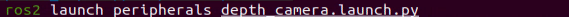

* **1.2 Tensorflow**

TensorFlow is an open-source machine learning framework designed to simplify the process of building, training, evaluating, and saving neural networks. It enables the implementation of machine learning and deep learning concepts in the simplest way. With its foundation in computational algebra and optimization techniques,

TensorFlow allows for efficient mathematical computations. It can run on a wide range of hardware—from supercomputers to embedded systems—making it highly versatile. TensorFlow supports CPU, GPU, or both simultaneously. Compared to other frameworks, TensorFlow is best suited for industrial deployment, making it highly appropriate for use in production environments.

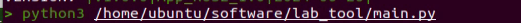

* **PaddlePaddle**

PaddlePaddle, developed by Baidu, is China’s first open-source, industrial-grade deep learning platform. It integrates a deep learning training and inference framework, a library of foundational models, end-to-end development tools, and a rich suite of supporting components. Built on years of Baidu’s R\&D and real-world applications in deep learning, PaddlePaddle is powerful and versatile.

In recent years, deep learning has achieved outstanding performance across many fields such as image recognition, speech recognition, natural language processing, robotics, online advertising, medical diagnostics, and finance.


* **MXNet**

[MXNet](https://so.csdn.net/so/search?q=MXNet&spm=1001.2101.3001.7020) is another high-performance deep learning framework that supports multiple programming languages, including Python, C++, Scala, and R. It offers data flow graphs similar to those in Theano and TensorFlow and supports multi-GPU configuration. It also includes high-level components for model building, comparable to those in Lasagne and Blocks, and can run on nearly any hardware platform—including mobile devices.


MXNet is designed to maximize efficiency and flexibility. As an accelerated library, it provides powerful tools for developers to take full advantage of GPUs and cloud computing. MXNet supports distributed deployment via a parameter server and can scale almost linearly across multiple CPUs and GPUs.

## 7.2 Machine Learning Application
<p id ="anther7.2"></p>

### 7.2.1 GPU Acceleration

#### 7.2.1.1 Introduction to GPU-Accelerated Computing

GPU stands for Graphics Processing Unit, which is also known as the display core, visual processor, or display chip. A GPU is a microprocessor designed to perform image rendering and image-related computation tasks on devices such as personal computers, workstations, game consoles, tablets, and smartphones.

GPU-accelerated computing refers to the use of both the GPU and CPU together to speed up the execution of scientific, analytical, engineering, consumer, and enterprise applications. This acceleration capability enables faster performance for applications running on various platforms, including cars, smartphones, tablets, drones, and robots.

#### 7.2.1.2 Performance Comparison: GPU vs. CPU

The CPU is designed for general-purpose computing, which handles multitasking and system-level operations, but has limited computational throughput. In contrast, the GPU is designed for high-volume, repetitive calculations and excels at tasks involving massive parallelism, though it is less suited for complex logical operations.

Architecture Differences The CPU follows a serial architecture with a small number of powerful cores, making it ideal for executing single tasks quickly. The GPU adopts a parallel architecture with a large number of simpler cores, making it highly efficient at executing many tasks simultaneously.

In terms of hardware structure, the CPU is equipped with multiple functional modules, allowing it to handle complex computational environments. In contrast, the GPU has a relatively simpler architecture, with the majority of its transistors dedicated to stream processors and memory controllers.

In a CPU, most transistors are used to build control circuits and cache, with only a small portion allocated to actual computation. This design enhances the CPU’s versatility, enabling it to process a wide range of data types and perform complex logical operations, but it also limits its computational performance.

In a GPU, however, most transistors are devoted to specialized circuits and pipelines. This configuration significantly boosts the GPU’s processing speed and greatly enhances its floating-point computational power.

#### 7.2.1.3 Advantages of GPU

GPUs have a large number of cores and are suitable for large-scale parallel data processing, making them particularly advantageous for repetitive tasks in multimedia processing.

Take deep learning as an example—the neural network systems it relies on are designed to analyze massive amounts of data at high speed, and such analysis is exactly what GPUs excel at.

Moreover, the GPU architecture does not include dedicated image processing algorithms; instead, it is optimized based on CPU architecture. Therefore, in addition to image processing, GPUs are also widely used in fields such as scientific computing, cryptographic cracking, numerical analysis, big data processing, and financial analysis, where parallel computing is required.


### 7.2.2 TensorRT Acceleration

#### 7.2.2.1 Introduction to TensorRT

TensorRT is a high-performance deep learning inference SDK developed by NVIDIA. It includes a deep learning inference optimizer and runtime that enables low-latency and high-throughput deployment of inference applications.

TensorRT now supports deep learning frameworks such as TensorFlow, Caffe, MXNet, and PyTorch. By integrating TensorRT with NVIDIA GPUs, fast and efficient inference deployment can be achieved across most frameworks.

There are many optimization methods for deep learning models, such as weight quantization, weight sparsity, and channel pruning, which are typically performed during the training phase. In contrast, TensorRT optimizes already-trained models by improving the efficiency of the computational graph.

#### 7.2.2.2 Optimization Methods


TensorRT employs the following optimization strategies:

1. Precision Calibration
2. Layer \& Tensor Fusion
3. Kernel Auto-Tuning
4. Dynamic Tenser Memory
5. Multi-Stream Execution

- **Precision Calibration for Weights and Activations**

Most deep learning frameworks use 32-bit floating-point (FP32) precision for network tensors during training. After training, because inference does not require backpropagation, data precision can be reduced to formats like FP16 or INT8. Lowering data precision reduces memory usage and latency and shrinks the model size.

The following table shows the dynamic ranges for different precisions:

<table>
  <thead>
    <tr>
      <th>Precision</th>
      <th>Dynamic Range</th>
    </tr>
  </thead>
  <tbody>
    <tr>
      <td>FP32</td>
      <td>-3.4×1038 ~ +3.4×1038</td>
    </tr>
    <tr>
      <td>FP16</td>
      <td>-65504 ~ +65504</td>
    </tr>
    <tr>
      <td>INT8</td>
      <td>-128 ~ +127</td>
    </tr>
  </tbody>
</table>


INT8 has only 256 distinct values. Using INT8 to represent FP32 values may result in information loss and degraded performance. However, TensorRT provides a fully automated calibration process to optimally convert FP32 data to INT8 with minimal performance loss.

- **Layer and Tensor Fusion**

Although CUDA cores compute tensors quickly, significant time can still be spent on kernel launches and input/output tensor read-write operations per layer, which wastes GPU resources and creates memory bandwidth bottlenecks.

TensorRT optimizes model structure by horizontally or vertically merging layers to reduce the total number of layers and the CUDA cores they occupy.

Horizontal fusion combines convolution, bias, and activation into a CBR structure, which occupies only one CUDA core. Vertical fusion merges layers with the same structure but different weights into a wider layer, also using only one CUDA core.

Additionally, for multi-branch merges, TensorRT can direct outputs to the correct memory address without copying, eliminating the concat layer and reducing memory access operations.

- **Kernel Auto-Tuning**

During inference, the network model performs calculations using CUDA kernels on the GPU. TensorRT automatically tunes CUDA kernels based on different algorithms, network models, and GPU platforms to ensure optimal performance on a given platform.

- **Dynamic Tensor Memory**

TensorRT assigns memory to each tensor only during its usage period to avoid redundant memory allocation. This reduces memory usage and improves memory reuse efficiency.

- **Multi-Stream Execution**

By utilizing CUDA streams, TensorRT enables parallel computation across multiple branches of the same input, maximizing parallel operation.


### 7.2.3 YOLOv5 Model

#### 7.2.3.1 Overview of the YOLO Models

* **YOLO Series**

YOLO (You Only Look Once) is a One-stage, deep learning-based regression approach to object detection.

Before the advent of YOLOv1, the R-CNN family of algorithms dominated the object detection field. Although the R-CNN series achieved high detection accuracy, its Two-stage architecture limited its speed, making it unsuitable for real-time applications.

To address this issue, the YOLO series was developed. The core idea behind YOLO is to redefine object detection as a regression problem. It processes the entire image as input to the network and directly outputs Bounding Box coordinates along with their corresponding class labels. Compared to traditional object detection methods, YOLO offers faster detection speed and higher average precision.

* **YOLOv5**

YOLOv5 builds upon previous versions of the YOLO model, delivering significant improvements in both detection speed and accuracy.

A typical object detection algorithm can be divided into four modules: the input module, the backbone network, the neck network, and the head output module. Analyzing YOLOv5 according to these modules reveals the following enhancements:

1. Input Module: During model training, YOLOv5 uses Mosaic data augmentation to improve training speed and accuracy. It also introduces adaptive anchor box calculation and adaptive image scaling.

2. Backbone Network: YOLOv5 incorporates the Focus and CSP structures.

3. Neck Network: Similar to YOLOv4, YOLOv5 adopts the FPN+PAN architecture in this part, though there are differences in implementation details.

4. Head Output Module: While the anchor box mechanism in YOLOv5 remains consistent with YOLOv4, improvements include the use of the GIOU_Loss loss function and DIOU_NMS for filtering predicted bounding boxes.

#### 7.2.3.2 YOLOv5 Model Structure

* **Components**

1. Convolutional Layer: Feature Extraction

Convolution is the process where an entity at multiple past time points does or is subjected to the same action, influencing its current state. Convolution can be divided into convolution and multiplication.

Convolution can be understood as flipping the data, and multiplication as the accumulation of the influence that past data has on the current data. The data flipping is done to establish relationships between data points, facilitating the calculation of accumulated influence with a proper reference.

In YOLOv5, the data to be processed are images, which are two-dimensional in computer vision. Accordingly, the convolution is a two-dimensional convolution. The purpose of 2D convolution is to extract features from images. To perform a 2D convolution, it is necessary to understand the convolution kernel.

The convolution kernel is the unit region over which the convolution calculation is performed each time. The unit is pixels, and the convolution sums the pixel values within the region. Typically, convolution is done by sliding the kernel across the image, and the kernel size is manually set.

When performing convolution, depending on the desired effect, the image borders may be padded with zeros or extended by a certain number of pixels, then the convolution results are placed back into the corresponding positions in the image. For example, a 6×6 image is first expanded to 7×7, then convolved with the kernel, and finally the results are filled back into a blank 6×6 image.


2. Pooling Layer: Feature Amplification

The pooling layer, also called the downsampling layer, is usually used together with convolution layers. After convolution, pooling performs further sampling on the extracted features. Pooling includes various types such as global pooling, average pooling, max pooling, etc., each producing different effects.

To make it easier to understand, max pooling is used here as an example. Before understanding max pooling, it is important to know about the filter, which is like the convolution kernel—a manually set region that slides over the image and selects pixels within the area.


Max pooling keeps the most prominent features and discards others. For example, starting with a 6×6 image, applying a 2×2 filter for max pooling produces a new image with reduced size.


3. Upsampling Layer: Restoring Image Size

Upsampling can be understood as “reverse pooling.” After pooling, the image size shrinks, and upsampling restores the image to its original size. However, only the size is restored, the pooled features are also modified accordingly.

For example, starting with a 6×6 image, applying a 3×3 filter for upsampling produces a new image.


4. Batch Normalization Layer: Data Regularization

Batch normalization means rearranging the data neatly, which reduces the computational difficulty of the model and helps map data better into the activation functions.

Batch normalization reduces the loss rate of features during each calculation, retaining more features for the next computation. After multiple computations, the model’s sensitivity to the data increases.


5. ReLU Layer: Activation Function

Activation functions are added during model construction to introduce non-linearity. Without activation functions, each layer is essentially a matrix multiplication. Every layer’s output is a linear function of the previous layer’s input, so no matter how many layers the neural network has, the output is just a linear combination of the input. This prevents the model from adapting to actual situations.

There are many activation functions, commonly ReLU, Tanh, Sigmoid, etc. Here, ReLU is used as an example. ReLU is a piecewise function that replaces all values less than 0 with 0 and keeps positive values unchanged.


6. ADD Layer: Tensor Addition

Features can be significant or insignificant. The ADD layer adds feature tensors together to enhance the significant features.


7. Concat Layer: Tensor Concatenation

The Concat layer concatenates feature tensors to combine features extracted by different methods, thereby preserving more features.


* **Composite Elements**

When building a model, using only the basic layers mentioned earlier can lead to overly lengthy, disorganized code with unclear hierarchy. To improve modeling efficiency, these basic elements are often grouped into modular units for reuse.

1) Convolutional Block

A convolutional block consists of a convolutional layer, a batch normalization layer, and an activation function. The process follows this order: convolution → batch normalization → activation.


2) Strided Sampling and Concatenation Unit（Focus）

The input image is first divided into multiple large regions. Then, small image patches located at the same relative position within each large region are concatenated together to form a new image. This effectively splits the input image into several smaller images. Finally, an initial sampling is performed on the images using a convolutional block.

As shown in the figure below, for a 6×6 image, if each large region is defined as 2×2, the image can be divided into 9 large regions, and each contains 4 small patches.

By taking the small patches at position 1 from each large region and concatenating them, a 3×3 image can be formed. The patches at other positions are concatenated in the same way.  
Ultimately, the original 6×6 image is decomposed into four 3×3 images.


3) Residual Block

The residual block enables the model to learn subtle variations in the image. Its structure is relatively simple and involves merging data from two paths.

In the first path, two convolutional blocks are used to extract features from the image. In the second path, the original image is passed through directly without convolution. Finally, the outputs from both paths are added together to enhance learning.


4) Composite Convolutional Block

In YOLOv5, a key feature of the composite convolutional block is its customizable design, allowing convolutional blocks to be configured as needed. This structure also uses two paths whose outputs are merged.

The first path contains a single convolutional layer for feature extraction, while the second path includes 2𝑥+1 convolutional blocks followed by an additional convolutional layer. After sampling and concatenation, batch normalization is applied to standardize the data, followed by an activation function. Finally, a convolutional block is used to process the combined features.


5) Composite Residual Convolutional Block

The composite residual convolutional block modifies the composite convolutional block by replacing the 2𝑥 convolutional blocks with 𝑥 residual blocks. In YOLOv5, this block is also customizable, allowing residual blocks to be tailored according to specific requirements.


6) Composite Pooling Block

The output from a convolutional block is simultaneously passed through three separate max pooling layers, while an additional unprocessed copy is preserved. The resulting four feature maps are then concatenated and passed through a convolutional block. By processing data with the composite pooling block, the original features can be significantly enhanced and emphasized.


* **Structure**

YOLOv5 is composed of three main parts, each responsible for producing output at different spatial resolutions. These outputs are processed differently according to their respective sizes. The structure of YOLOv5’s output is shown in the diagram below.


### 7.2.4 YOLOv5 Workflow

This section explains the model’s processing flow using the concepts of prior boxes, predicted boxes, and anchor boxes.

#### 7.2.4.1 Prior Box

When an image is fed into the model, predefined regions of interest must be specified. These regions are marked using prior boxes, which serve as initial bounding box templates indicating potential object locations in the image.


#### 7.2.4.2 Predicted Box

Prediction boxes are generated by the model as output and do not require manual input. When the first batch of training data is fed into the model, the prediction boxes are automatically created. The center points of prediction boxes tend to be located in areas where similar objects frequently appear.


#### 7.2.4.3 Anchor Box

Since predicted boxes may have deviations in size and location, anchor boxes are introduced to correct these predictions.

Anchor boxes are positioned based on the predicted boxes. By influencing the generation of subsequent predicted boxes, anchor boxes are placed around their relative centers to guide future predictions.


#### 7.2.4.4 Project Process

Once the bounding box annotations are complete, prior boxes appear on the image. When the image data is input into the model, predicted boxes are generated based on the locations of the prior boxes. Subsequently, anchor boxes are generated to adjust the predicted results. The weights from this round of training are then updated in the model.

With each new training iteration, the predicted boxes are influenced by the anchor boxes from the previous round. This process is repeated until the predicted boxes gradually align with the prior boxes in both size and location.


<p id ="anther7.2.5"></p>
### 7.2.5 Image Collection and Annotation

Training a YOLOv5 model requires a large dataset, so please first collect and annotate images to prepare for model training.

In this example, the demonstration uses traffic signs as target objects.

#### 7.2.5.1 Image Collection

1. Power on the robot and connect it via the NoMachine remote control software.

2. Click the terminal icon  in the system desktop to open a command-line window.

3. Stop the app auto-start service by running the following command:

```bash
sudo systemctl stop start_app_node.service
```

4. Execute the following command to start the depth camera service:

```bash
roslaunch peripherals depth_cam.launch
```

5. Run the following command to enable data collection tool:

```bash
cd software/collect_picture && python3 main.py
```


The **save number** in the top-left corner of the tool interface shows the ID of the saved image. The **existing** shows how many images have already been saved.

6. Change the save path to **/home/ubuntu/my_data**.


7. Place the target object within the camera view and click the **Save(space)** button or press the spacebar to save the current camera frame.


After clicking **Save(space)**, a folder named **JPEGImages** will be automatically created under the path **/home/ubuntu/my_data** to store the images.

> [!NOTE]
> 
> **To improve model reliability, capture the target object from various distances, angles, and tilts.**

8. After collecting images, click the **Quit** button to close the tool.


9. Click on the icon  in the system status bar to open the file manager, where the saved images can be viewed.

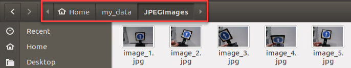

#### 7.2.5.2 Image Annotation

Annotation is essential for creating a functional dataset, as it tells the training model which parts of the image correspond to which categories. This allows the model to later identify those categories in new, unseen images.

> [!NOTE]
> 
> **Commands must be entered with correct capitalization. The Tab key can be used to auto-complete keywords.**

1. Open a terminal and enter the command to start the image annotation tool:

```bash
python3 ~/software/labelImg/labelImg.py
```

Below is a table of common shortcut keys:

<table>
  <thead>
    <tr>
      <th>Button</th>
      <th>Shortcut Key</th>
      <th>Function</th>
    </tr>
  </thead>
  <tbody>
    <tr>
      <td></td>
      <td>Ctrl+U</td>
      <td>Choose the directory for images.</td>
    </tr>
    <tr>
      <td></td>
      <td>Ctrl+R</td>
      <td>Choose the directory for calibration data.</td>
    </tr>
    <tr>
      <td></td>
      <td>W</td>
      <td>Create an annotation box.</td>
    </tr>
    <tr>
      <td></td>
      <td>Ctrl+S</td>
      <td>Save the annotation.</td>
    </tr>
    <tr>
      <td></td>
      <td>A</td>
      <td>Switch to the previous image.</td>
    </tr>
    <tr>
      <td></td>
      <td>D</td>
      <td>Switch to the next image.</td>
    </tr>
  </tbody>
</table>

2. Press **Ctrl+U**, set the image storage directory to **/home/ubuntu/my_data/JPEGImages/**, then click **Open**.

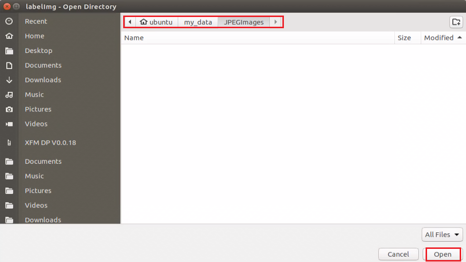

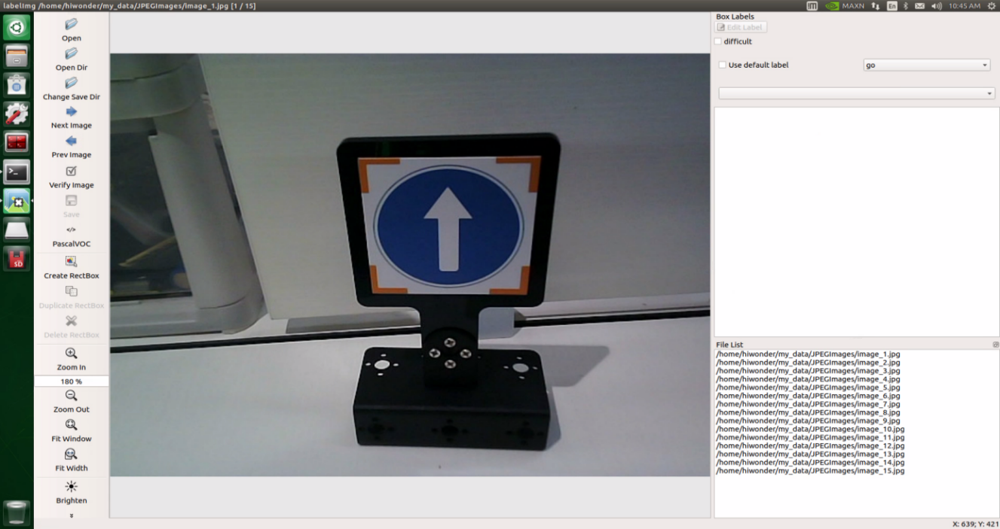

3. Use the shortcut **Ctrl+R**, set the annotation data storage directory to **/home/ubuntu/my_data/Annotations/**, and click **Open**.

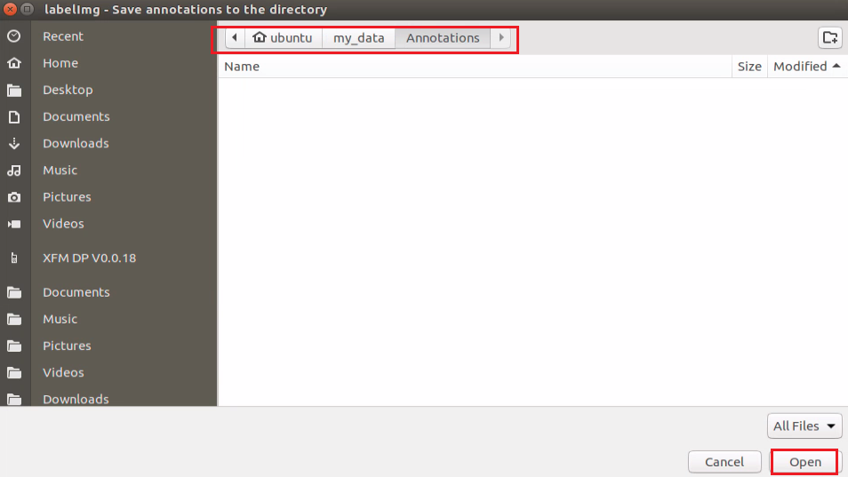

4) Press the **W** key to begin creating a bounding box.

Move the mouse to the desired location and hold the left mouse button to draw a box that covers the entire object. Release the left mouse button to finish drawing the box.


5) In the pop-up window, name the category of the object, e.g., **right**. After naming, click **OK** or press **Enter** to save the label.


6) Press **Ctrl+S** to save the annotation for the current image.

7) Click the icon  in the system status bar  to open the file manager and navigate to the directory **/home/ubuntu/my_data/Annotations/**. The annotation files for each image will be available in this folder.

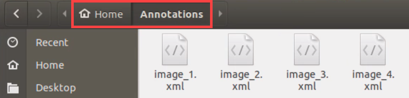

<p id ="anther7.2.6"></p>
### 7.2.6 Data Format Conversion

#### 7.2.6.1 Preparation

Before starting the operations in this section, image collection and annotation must be completed first. For detailed steps, refer to section [7.2.5 Image Collection and Annotation](#anther7.2.5) in this document.

Before training images using the YOLOv5 model, first to define class labels and convert the annotation data into the appropriate format.

#### 7.2.6.2 Format Conversion

Before starting the operations in this section, image collection and annotation must be completed first.

> [!NOTE]
> 
> **Commands must be entered with correct capitalization. The Tab key can be used to auto-complete keywords.**

1. Open a new terminal, enter the command, and press **Enter**. The first execution creates the file **classes.names**.

```bash
vim ~/my_data/classes.names
```

2. Press the **i** key to enter edit mode and add the class names for the target recognition objects. When adding multiple class names, each class name should be listed on a separate line. The class names here must match the names used when collecting the images.

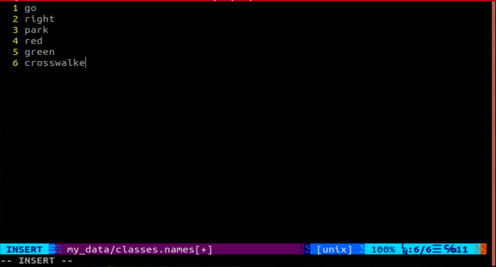

> [!NOTE]
> 
> **The class names here must match the labels used in the labelImg annotation tool exactly.**

3. After editing, press **Esc**, then type `:wq` to save and close the file.

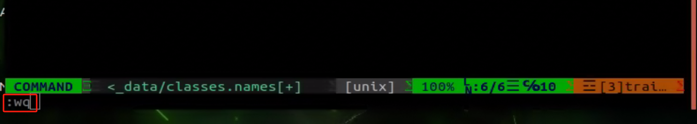

4. Next, enter the command to convert the data format and press **Enter**:

```bash
python3 ~/software/xml2yolo.py --data ~/my_data --yaml ~/my_data/data.yaml
```

> [!NOTE]
> 
> **Make sure the path to ~/software/xml2yolo.py match the actual file structure!**

This command uses three main parameters:

1\. **xml2yolo.py:** A script that converts annotations from XML format to the YOLOv5 format. Make sure the path is correct.

2\. **my_data:** The directory containing the annotated dataset. Make sure the path is correct.

3\. **data.yaml:** Indicates the format conversion for the entire folder after the model has been split. From the command, it is clear that the saved directory is within the **my_data** folder.

The following image shows a generated example of data.yaml:

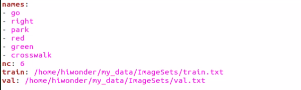

The items listed after the names represent the types of labels. The **nc** field specifies the total number of label categories. The **train** refers to the training set—a commonly used term in deep learning that indicates the data used for model training. The parameter following it is the path to the training images. Similarly, the **val** refers to the validation set, which is used to verify the model’s performance during the training process, and the path that follows indicates where the validation data is located. These file paths need to be set based on the actual location of your data. For example, to speed up the training process later by moving the dataset from the robot to a local PC or a cloud server,  the **train** and **val** paths should be updated accordingly to reflect their new locations.

Finally, an XML file will be generated under the **~/my_data** folder to record the path location of the currently split dataset. Similarly, the last parameter in step 4, **~/my_data/data.yaml**, can be changed to modify the save path. This file path must be remembered, as it will be used later for model training.


### 7.2.7 Model Training

> [!NOTE]
> 
> **Commands must be entered with correct capitalization. The Tab key can be used to auto-complete keywords.**

#### 7.2.7.1 Preparation

After converting the dataset format, you can proceed to the model training phase. Before starting, make sure the dataset with the correct format is ready. For details, refer to the section **Data Format Conversion**.

#### 7.2.7.2 Training the Model

1. Power on the robot and connect it via the NoMachine remote control software.

2. Click the terminal icon  in the system desktop to open a command-line window.

3. Enter the following command and press **Enter** to go to the specific directory.

```bash
cd third_party/yolov5/
```

4. Enter the command to start training the model.

```bash
python3 train.py --img 640 --batch 8 --epochs 5 --data ~/my_data/data.yaml --weights yolov5n.pt
```

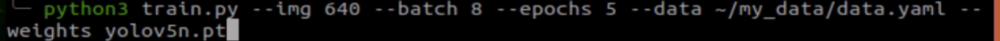

In the command, the parameters stands for:  
**\--img**: image size.  
**\--batch**: number of images per batch.  
**\--epochs**: number of training iterations.  
**\--data**: path to the dataset.  
**\--weights**: path to the pre-trained model.

The above parameters can be adjusted according to the specific setup. To improve model accuracy, consider increasing the number of training epochs. Note that this will also increase training time.

5) When the following options appear as shown in the image, enter **3** and press **Enter**.


If the following content appears, it indicates that the training is in progress.


After the model training is completed, the terminal will print the path where the output files are saved. Please make sure to record this path, as it will be needed later in the section [7.2.8 TensorRT Road Sign Detection](#anther7.2.8) in this file.


> [!NOTE]
> 
> **The generated folder name under runs/train/ may vary. Please locate it accordingly.**

#### 7.2.7.3 Importing Training Results (Optional)

The following steps outline how to import the trained model into the robot's controller after training on an external computer or server, and then perform the model conversion. Taking **Jetson Nano** as an example.

**Steps:**

1. Transfer the trained model file to the Jetson Nano controller using NoMachine software. Simply drag the file from your local machine to the remote desktop, as shown below. The .pt model file, marked in red, should be dragged into the remote desktop.

> [!NOTE]
> 
> The screenshot below shows the robot’s remote desktop. The interface may look slightly different depending on the robot type, but the file transfer process remains the same.

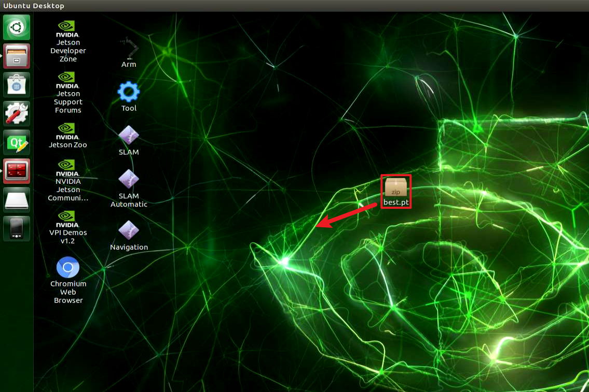

After dragging the file, the model will be successfully imported and visible on the desktop.

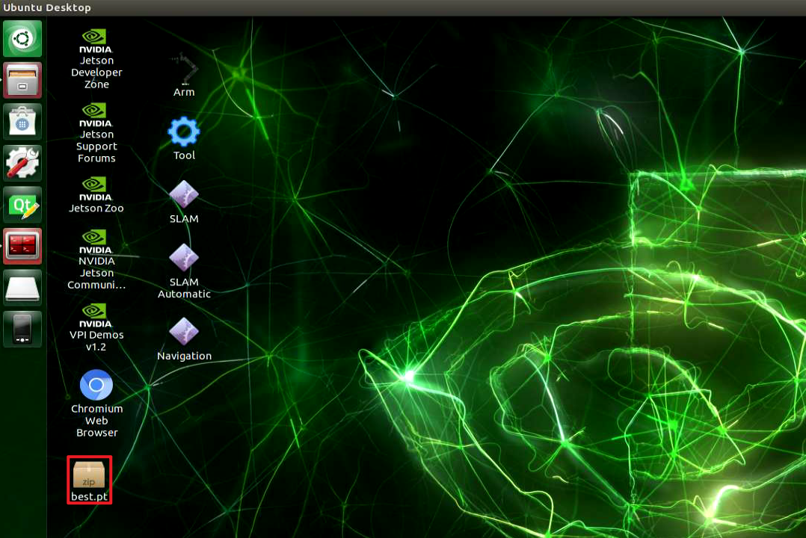

Next, copy the trained model file, for example, best.pt, to the **/third_party/yolov5** directory.

2. Right-click on the desktop and select **Open Terminal**.

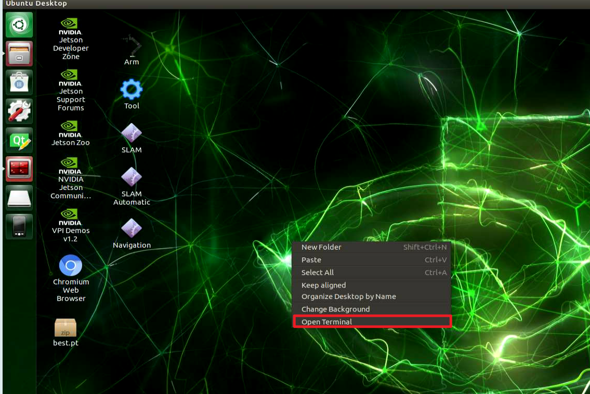

3. Then, enter the following command in the terminal:

```bash
mv ~/Desktop/best.pt ~/third_party/yolov5/
```

This will copy the model into the **yolov5** folder. The contents can be checked by entering the corresponding command.

```bash
cd ~/third_party/yolov5 && ls
```

Next, proceed to the following section for model conversion and detection.

<p id ="anther7.2.8"></p>
### 7.2.8 TensorRT Road Sign Detection

#### 7.2.8.1 Preparation

After extensive training, the new model needs to be converted into a TensorRT-accelerated version to improve its performance.

#### 7.2.8.2 Creating a TensorRT Model Engine

> [!NOTE]
> 
> **Commands must be entered with correct capitalization. The Tab key can be used to auto-complete keywords.**

1. Power on the robot and connect it via the NoMachine remote control software.

2. Click the terminal icon  in the system desktop to open a command-line window.

3. Enter the following command and press **Enter** to go to the specific directory.

```bash
cd third_party/yolov5/
```

4. Then, run the following command and press **Enter** to convert the **.pt** file to a **.wts** file: The trained model, **best.pt**, is shown in the image below. It has been placed in the directory **~/third_party/yolov5**. If using a custom-trained model, simply place the model in the same directory and modify the file name in the command accordingly.

```bash
python3 gen_wts.py -t detect -w best.pt -o best.wts
```

> [!NOTE]
> 
> **If the training used data files located in the /home/third_party/my_data/ directory, steps 6–8 can be skipped, proceeding directly to step 9.**

5. Next, run the command to navigate to the specified directory.

```bash
cd ~/third_party/tensorrtx/yolov5/
```

6. Open the file by running the following command.

```bash
vim src/config.h
```

7) Find the code shown in the image below. This parameter corresponds to the number of categories for object detection. Adjust the values according to the actual situation, but keep the default value of 80 here.

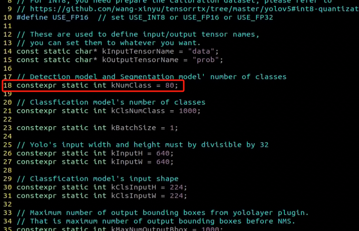

8. After adjusting, press **Esc** key, and input `:wq`, then press **Enter** to save and exit the file.


9. Enter the newly created **build** directory by entering the command.

```bash
cd ~/third_party/tensorrtx/yolov5/ && mkdir build && cd build
```

10. Run the following command and press **Enter** to compile the **build** folder.

```bash
cmake ..
```

11. Then enter the following command and press **Enter** to compile the configuration file.

```bash
make
```

12. Enter the command and press **Enter**. The generated **best.wts** file will be copied to the current directory.

```bash
cp /home/ubuntu/third_party/yolov5/best.wts ./
```

13. Enter the command and press **Enter** to generate the TensorRT model engine file.

```bash
sudo ./yolov5_det -s best.wts best.engine n
```

Since the terminal is already in the directory where the **.wts** file is located, simply use the name of the **.wts** file here. The engine file will be named **best.engine**.

If the message **Build engine successfully!** appears, the engine file has been successfully generated.


A **libmyplugins.so** file will also be generated in the same directory for later detection and recognition. When the **libmyplugins.so** file needs to be used, simply provide its corresponding path.

14. If the generated **best.engine** file is locked and not readable, as shown in the image below:

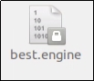

Open the terminal in the current directory, then enter the command and press **Enter**.

```bash
sudo chmod 777 best.engine
```

#### 7.2.8.3 Object Detection

* **Operation Steps**

1. Copy the TensorRT model engine file to the designated folder, then enter the command and press **Enter**.

```bash
cp yolov5n.engine libmyplugins.so ~/ros_ws/src/example/scripts/yolov5_detect/
```

2. Enter the following command and press **Enter** to stop the app service:

```bash
sudo systemctl stop start_app_node.service
```

3. Click  to open the file manager and navigate to the folder shown below.

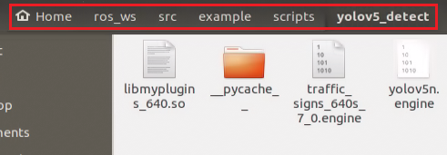

4. Right-click the file **yolov5_trt.py** and select **Open With Text Editor**.


5. In the first red box, delete the existing content and enter the names of the objects to be recognized. In the second red box, enter the name of the trained model in the first parameter. In the second parameter, enter **libmyplugins_640.so**, ensuring to rename the original **libmyplugins.so** file based on your specific file name.


6. Click **Save** at the top-right corner to save the changes.


7. Then enter the command and press **Enter** to start the object detection feature.

```bash
python3 yolov5_trt.py
```

* **Detection Result**

Place a traffic sign within the camera’s field of view. Once the sign is detected, a bounding box will appear in the camera feed, highlighting the sign along with its class name and detection confidence.


The **class_name** refers to the category name of the detected object. The **box** represents the coordinates of the bounding box, with the top-left corner as the starting point and the bottom-right corner as the endpoint. The **score** indicates the confidence level of the detection.


### 7.2.9 Traffic Sign Model Training

> [!NOTE]
> 
> The product names and reference paths mentioned in this document may vary. Please refer to the actual setup for accurate information.

It is not recommended to use the Jetson Nano for training with large datasets, as the training speed is slow due to I/O speed and memory limitations. Instead, it is advised to use a PC with a dedicated GPU, which follows the same training steps, only requiring proper environment configuration.

If the traffic sign recognition performance in autonomous driving feature is unsatisfactory, training a custom model can be done by following the procedures in this section.

In the following instructions, screenshots may show different robot hostnames, as different robots have similar environment setups. Simply follow the command steps in the document as described — it does not affect the execution.

#### 7.2.9.1 Preparation

1) Prepare a laptop, or if using a desktop, make sure to have a wireless network card, mouse, and other necessary tools.

2) Follow the previous steps to install and launch the remote connection tool, NoMachine.

#### 7.2.9.2 Operation Steps

* **Create a New Dataset Folder**

Create a new folder in any directory, such as **my_data**. Remember the folder name, as it will be used in the subsequent commands. It is recommended to avoid using special characters or spaces in the folder name. This folder will be used to store the dataset. To prevent interference with other files, create the folder under the **home** directory.

* **Image Collection**

  <p id ="p7-2-9Image-Collection"></p>

1. Power on the robot and connect it via the NoMachine remote control software.

2. Click the terminal icon  in the system desktop to open a command-line window.

3. Execute the following command to stop the app service:

```bash
sudo systemctl stop start_app_node.service
```

4. Execute the following command to start the camera service.

```bash
roslaunch peripherals depth_cam.launch
```

5. **Open a new terminal**, navigate to the image collection tool directory, and run the image collection script:

```
cd software/collect_picture && python3 main.py
```


The **save number** in the top-left corner of the tool interface shows the ID of the saved image. The **existing** shows how many images have already been saved.

6. Change the save path to **/home/ubuntu/my_data**, which will also be used in later steps.


7. Place the target object within the camera's view. Press the **Save(space)** button or the spacebar to save the current camera frame. After pressing it, both the **save number** and the **existing** counters will increase by 1. This helps track the current image ID and total image count in the folder.


After clicking **Save(space)**, a folder named **JPEGImages** will be automatically created under the path **/home/ubuntu/my_data** to store the images.

> [!NOTE]
> 
> * **To improve model reliability, capture the target object from various distances, angles, and tilts.**
> 
> * **To ensure stable recognition, collect at least 200 images per category during the data collection phase.**

8) After collecting images, click the **Quit** button to close the tool.


9) Click on the icon  in the system status bar to open the file manager. Navigate to the directory as shown in the image below to view the saved images.

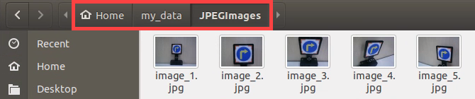

* **Image Annotation**

> [!NOTE]
> 
> **Commands must be entered with correct capitalization. The Tab key can be used to auto-complete keywords.**

1. Power on the robot and connect it via the NoMachine remote control software.

2. Click the terminal icon  in the system desktop to open a command-line window.

3. Execute the following command to stop the app service:

```bash
sudo systemctl stop start_app_node.service
```

4. Execute the following command to start the camera service.

```bash
roslaunch peripherals depth_cam.launch
```

5. Open a new terminal and enter the following command.

```
python3 software/labelImg/labelImg.py
```

6. After opening the image annotation tool. Below is a table of common shortcut keys:

<table>
  <thead>
    <tr>
      <th>Button</th>
      <th>Shortcut Key</th>
      <th>Function</th>
    </tr>
  </thead>
  <tbody>
    <tr>
      <td></td>
      <td>Ctrl+U</td>
      <td>Choose the directory for images.</td>
    </tr>
    <tr>
      <td></td>
      <td>Ctrl+R</td>
      <td>Choose the directory for calibration data.</td>
    </tr>
    <tr>
      <td></td>
      <td>W</td>
      <td>Create an annotation box.</td>
    </tr>
    <tr>
      <td></td>
      <td>Ctrl+S</td>
      <td>Save the annotation.</td>
    </tr>
    <tr>
      <td></td>
      <td>A</td>
      <td>Switch to the previous image.</td>
    </tr>
    <tr>
      <td></td>
      <td>D</td>
      <td>Switch to the next image.</td>
    </tr>
  </tbody>
</table>


7) Use the shortcut **Ctrl+U**, set the image storage directory to **/home/ubuntu/my_data/JPEGImages/**, and click **Open**.


8) Use the shortcut **Ctrl+R**, set the annotation data storage directory to **/home/ubuntu/my_data/Annotations/**, and click **Open**. The **Annotations** folder will be automatically generated when collecting images.


9) Press the **W** key to begin creating a bounding box.

Move the mouse to the desired location and hold the left mouse button to draw a box that covers the entire object. Release the left mouse button to finish drawing the box.


10) In the pop-up window, name the category of the object, e.g., **right**. After naming, click **OK** or press **Enter** to save the label.


11) Press **Ctrl+S** to save the annotation for the current image.

12) Refer to Step 9 to complete the annotation of the remaining images.

13) Click the system status bar icon  to open the file manager and navigate to the directory /home/ubuntu/my_data/Annotations/. This is the same dataset path where the images were saved during Step [Image Collection](#p7-2-9Image-Collection). The annotation files corresponding to each image can be viewed in this folder.

* **Generating Related Files**

1. Click the terminal icon  in the system desktop to open a command-line window.

2. Enter the following command and press **Enter**.

```bash
vim ~/my_data/classes.names
```

3) Press the **i** key to enter edit mode and add the class names for the target recognition objects. When adding multiple class names, each class name should be listed on a separate line.


> [!NOTE]
> 
> **The class names here must match the labels used in the labelImg annotation tool exactly.**

4) After editing, press **Esc**, then type `:wq` to save and close the file.


5. Next, enter the command to convert the data format and press **Enter**:

```bash
python3 software/xml2yolo.py --data ~/my_data --yaml ~/my_data/data.yaml
```

In this command, the **xml2yolo.py** file is used to convert the annotated files into XML format and categorize the dataset into training and validation sets.

If the prompt shown in the figure below appears, the conversion was successful.

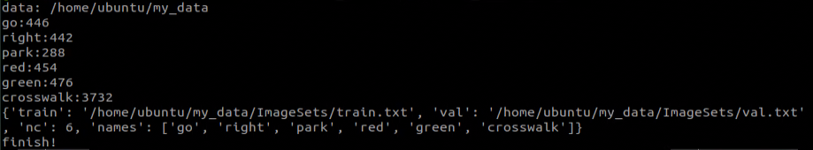

The output paths depend on the actual storage location of the folders in your robot’s file system. Paths may vary across devices, but the generated **data.yaml** file will correspond to your annotated dataset.

* **Model Training**

1. Click the terminal icon  in the system desktop to open a command-line window.

2. Enter the following command and press **Enter** to go to the specific directory.

```bash
cd third_party/yolov5
```

3. Enter the command to start training the model.

```bash
python3 train.py --img 640 --batch 8 --epochs 5 --data ~/my_data/data.yaml --weights yolov5n.pt
```

In the command, **--img** specifies the image size, **--batch** indicates the number of images input per batch, **--epochs** refers to the number of training iterations, representing how many times the machine learning model will go through the dataset. This value should be optimized based on the actual performance of the final model. In this example, the number of training epochs is set to 8 for quick testing. If the computer system is more powerful, this value can be increased to achieve better training results. **--data** is the path to the dataset, which refers to the folder containing the manually annotated data. **--weights** indicates the path to the pre-trained model weights. This specifies which .pt weight file the training process is based on. It’s important to note whether you are using yolov5n.pt, yolov5s.pt, or another version.

The above parameters can be adjusted according to the specific setup. To improve model accuracy, consider increasing the number of training epochs. Note that this will also increase training time.

4) When the following options appear as shown in the image, enter **3** and press **Enter**.


If the following content appears, it indicates that the training is in progress.


After the model training is completed, the terminal will print the path where the output files are saved. Please make sure to record this path, as it will be needed later in the **Creating a TensorRT Model Engine** step.


> [!NOTE]
> 
> **If multiple training sessions are conducted, the folder name here, such as exp5, may be different and could be renamed to exp2, exp3, etc. Subsequent steps will depend on the specific folder name used in this step.**

* **Creating a TensorRT Model Engine**

1. Click the terminal icon  in the system desktop to open a command-line window.

2. Enter the following command and press **Enter** to go to the specific directory.

```bash
cd third_party/yolov5
```

3. Copy the model file **best.pt** generated after training to the current directory, enter the following command, and press **Enter**.

```bash
cp ~/third_party/yolov5/runs/train/exp5/weights/best.pt ./
```

The path to the **best.pt** file can be modified according to the actual directory location.

4. Then, run the following command and press **Enter** to convert the **.pt** file to a **.wts** file:

```bash
python3 gen_wts.py -t detect -w best.pt -o best.wts
```

To use a different model, simply replace **best.pt** in the command with the name of the desired model file.

5. Next, run the command to navigate to the specified directory.

```bash
cd ~/third_party/tensorrtx/yolov5
```

6. Open the file by running the following command.

```bash
vim src/config.h
```

7. Locate the code shown in the image below. This parameter defines the number of categories for object detection and should be modified according to the actual number of categories. The `kNumClass` parameter, highlighted in the red box in the image, indicates how many categories have been labeled. In this case, it is set to 1, but it needs to be updated based on the actual number. For this section, it should be changed to 6, which corresponds to the number of traffic sign categories being used. After selecting the number to be changed with the left mouse button, press the **i** key on the keyboard to enter editing mode. For more detailed editing methods in vim, search relevant keywords online for learning.

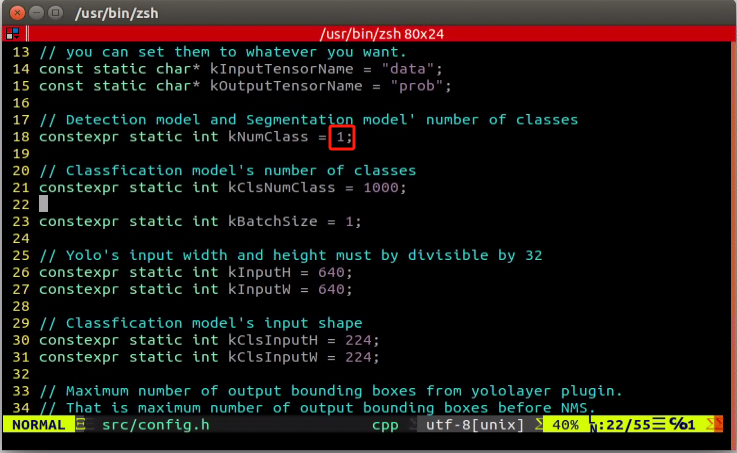

After modification, it should appear as shown in the image below:

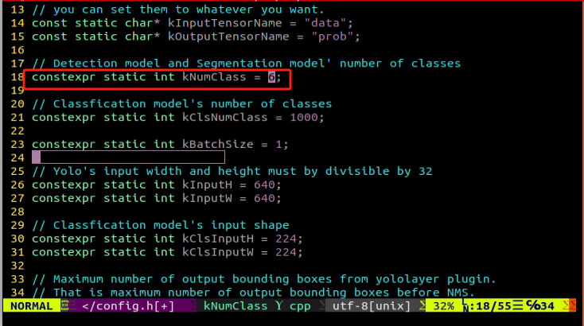

The parameter highlighted in the red box represents the input image size. By default, the height is set to 640 pixels, and the width is also set to 640 pixels. This matches the size of the images previously cropped using the image collection tool. It's fine to keep the default settings here, but if adjustments are necessary, they can be made according to the actual situation.

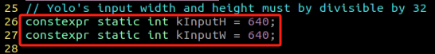

8. After adjusting, press **Esc** key, and input `:wq`, then press **Enter** to save and exit the file.

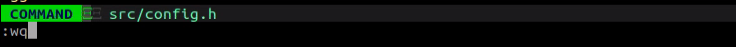

9. Enter the newly created **build** directory by entering the command.

```bash
cd ~/third_party/tensorrtx/yolov5/ && mkdir build && cd build
```

10. Run the following command and press **Enter** to compile the **build** folder.

```bash
cmake ..
```

11. Then enter the following command and press **Enter** to compile the configuration file.

```
make
```

> [!NOTE]
> 
> * **If an error occurs during the compilation step, delete the entire build folder, create a new build folder, and then repeat steps 10-11.**
> 
> * **The build folder contains data related to the previous model training, so it is recommended to save the folder before deleting it.**

12. Enter the command and press **Enter**. The generated **best.wts** file will be copied to the current directory.

```bash
cp /home/ubuntu/third_party/yolov5/best.wts ./
```


13. Enter the command and press **Enter** to generate the TensorRT model engine file.

```
sudo ./yolov5-det -s best.wts best.engine n
```

In the command, **best.wts** refers to the path where the **best.wts** file is located. Since the current directory is already the one containing the **.wts** file, simply enter the filename here. The **best.engine** is the name of the engine file. This name can be defined, but it is important to keep track of it for future reference. The last parameter, **n**, refers to the YOLOv5 model used during training. If **yolov5s.pt** was used, change this parameter to **s**. If **yolov5n.pt** was used, change it to **n**.

If the message **Build engine successfully!** appears, the engine file has been successfully generated.


#### 7.2.9.3 Using the Model

1. Then enter the command to navigate to the specific directory.

```bash
cd ~/third_party/tensorrtx/yolov5/build/
```

2. Enter the following command in the terminal to copy the generated **engine** model file to the path **/home/ubuntu/ros_ws/src/example/scripts/yolov5_detect**.

```bash
cp best.engine ~/ros_ws/src/example/scripts/yolov5_detect
```

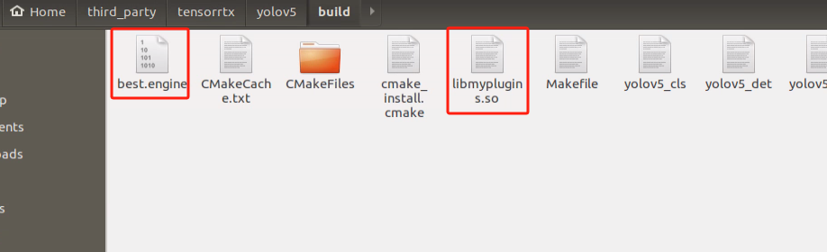

Next, enter the following command in the terminal:

```bash
cp libmyplugins.so ~/ros_ws/src/example/scripts/yolov5_detect
```

The two files should be copied to the folder, as shown in the figure below:

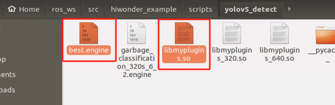

3. Enter the command to navigate to the launch file directory for the specific feature, using the autonomous driving example here.

```bash
cd ~/ros_ws/src/example/scripts/self_driving/
```

4. Enter the following command to open the launch file:

```bash
vim self_driving.launch
```

5. Modify the content in the boxes with the new model files.

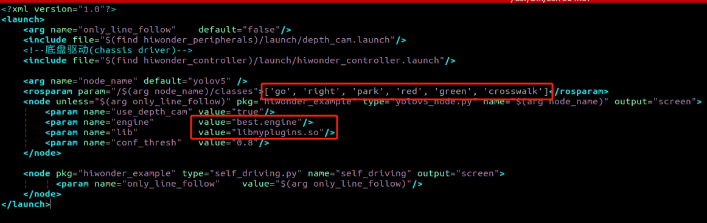

Box 1 contains the category names, which should follow the order in **classes.names**. Box 2 is for the model file name. It should correspond to the previously copied files, **best.engine** and **libmyplugins.so**. In the default robot configuration, pre-trained model files are available in the installed system. In this case, only the model file names need to be replaced with those of the custom-trained model.

6. After making the modifications, follow the section [7.4 Autonomous Driving](#anther7.4) in this document to experience the feature.


### 7.2.10 Model Training with Physical Objects

> [!NOTE]
> 
> **This section is part of the general course. The product names and reference paths mentioned in this document may vary. Please refer to the actual setup for accurate information.**

It is not recommended to use the Jetson Nano for training with large datasets, as the training speed is slow due to I/O speed and memory limitations. Instead, it is advised to use a PC with a dedicated GPU, which follows the same training steps, only requiring proper environment configuration.

If the recognition performance of the object sorting feature is unsatisfactory, and there is a need to train a custom model, refer to this section for guidance on training a custom model for the application.

#### 7.2.10.1 Preparation

1) Prepare a laptop, or if using a desktop, make sure to have a wireless network card, mouse, and other necessary tools.

2) Follow the previous steps to install and launch the remote connection tool, NoMachine.

#### 7.2.10.2 Operation Steps

The training steps are similar to those for the traffic sign model.

* **Create a New Dataset Folder**

Create a new folder in any directory, such as **my_data**. Remember the folder name, as it will be used in the subsequent commands. It is recommended to avoid using special characters or spaces in the folder name. This folder will be used to store the dataset. To prevent interference with other files, create the folder under the **home** directory.

* **Image Collection**

1. Power on the robot and connect it via the NoMachine remote control software.

2. Click the terminal icon  in the system desktop to open a command-line window.

3. Execute the following command to stop the app service:

```bash
sudo systemctl stop start_app_node.service
```

4. Execute the following command to start the camera service.

```bash
roslaunch peripherals depth_cam.launch
```

5. **Open a new terminal**, navigate to the image collection tool directory, and run the image collection script:

```
cd software/collect_picture && python3 main.py
```

The **save number** in the top-left corner of the tool interface shows the ID of the saved image. The **existing** shows how many images have already been saved.

6) Change the save path to **/home/ubuntu/my_data**, which will also be used in later steps.


7) Place the target object within the camera's view. Press the **Save(space)** button or the spacebar to save the current camera frame. After pressing it, both the **save number** and the **existing** counters will increase by 1. This helps track the current image ID and total image count in the folder.

After clicking **Save (space)**, a folder named **JPEGImages** will be automatically created under the path **/home/ubuntu/my_data** to store the images.

> [!NOTE]
> 
> * **To improve model reliability, capture the target object from various distances, angles, and tilts.**
> 
> * **To ensure stable recognition, collect at least 200 images per category during the data collection phase.**

8) After collecting images, click the **Quit** button to close the tool.


9) Click on the icon  in the system status bar to open the file manager. Navigate to the directory as shown in the image below to view the saved images.

* **Labeling Image Data**

> [!NOTE]
> 
> **Commands must be entered with correct capitalization. The Tab key can be used to auto-complete keywords.**

1. Power on the robot and connect it via the NoMachine remote control software.

2. Click the terminal icon  in the system desktop to open a command-line window.

3. Execute the following command to stop the app service:

```bash
sudo systemctl stop start_app_node.service
```

4. Execute the following command to start the camera service.

```bash
roslaunch peripherals depth_cam.launch
```

5. Open a new terminal and enter the following command.

```bash
python3 software/labelImg/labelImg.py
```

6. After opening the image annotation tool. Below is a table of common shortcut keys:

<table>
  <thead>
    <tr>
      <th>Button</th>
      <th>Shortcut Key</th>
      <th>Function</th>
    </tr>
  </thead>
  <tbody>
    <tr>
      <td></td>
      <td>Ctrl+U</td>
      <td>Choose the directory for images.</td>
    </tr>
    <tr>
      <td></td>
      <td>Ctrl+R</td>
      <td>Choose the directory for calibration data.</td>
    </tr>
    <tr>
      <td></td>
      <td>W</td>
      <td>Create an annotation box.</td>
    </tr>
    <tr>
      <td></td>
      <td>Ctrl+S</td>
      <td>Save the annotation.</td>
    </tr>
    <tr>
      <td></td>
      <td>A</td>
      <td>Switch to the previous image.</td>
    </tr>
    <tr>
      <td></td>
      <td>D</td>
      <td>Switch to the next image.</td>
    </tr>
  </tbody>
</table>


Use the shortcut **Ctrl+U**, set the image storage directory to **/home/ubuntu/my_data/JPEGImages/**, and click **Open**.


7) First, click **Open Dir** to open the folder where the images are stored. Choose **/home/ubuntu/My_Data/JPEGImage** and click **Open** to access the folder.


8) Then, click on **Create RectBox** in the left toolbar to create a bounding box.

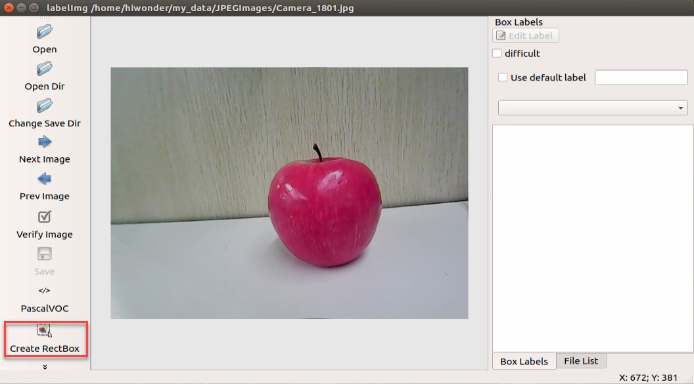

9) Position the mouse over the area to label, then press and hold the left mouse button to drag and draw a rectangle around the object in the image. Taking an apple as an example in this section.


10) After releasing the mouse button, a dialog box will appear. Enter the category name for the item, and click **OK**. For instance, **apple** for apples, **potato** for potatoes. Ensure that items of the same category have the same name.


11) Once the labeling is complete for one image, click **Save** to save the annotation, and then click **Next Image** to move on to the next image for labeling.


> [!NOTE]
> 
> * **To speed up the annotation process, keyboard shortcuts can be used. For example, pressing the D key switches to the next image, while pressing the W key creates a new bounding box.**
> 
> * **Additionally, pressing Ctrl+V pastes the bounding box from the previous image, but this method is only suitable for annotating images of the same category. This is because when the bounding box is pasted, the corresponding category name from the previous image is also copied over.**

12) Once all the materials are annotated, an XML file with the same name as the image will be generated in the **/home/ubuntu/my_data/Annotations** folder. A sufficient number of image materials is required for the model to be reliable.


* **Generating Related Files**

1. Click the terminal icon  in the system desktop to open a command-line window.

2. Enter the following command and press **Enter**.

```bash
vim ~/my_data/classes.names
```

3) Press the **i** key to enter edit mode and add the class names for the target recognition objects. When adding multiple class names, each class name should be listed on a separate line.


> [!NOTE]
> 
> **The class names here must match the labels used in the labelImg annotation tool exactly.**

4) After editing, press **Esc**, then type `:wq` to save and close the file.


5. Next, enter the command to convert the data format and press **Enter**:

```bash
python3 software/xml2yolo.py --data ~/my_date --yaml ~/my_data/data.yaml
```

The output paths depend on the actual storage location of the folders in your robot’s file system. Paths may vary across devices, but the generated **data.yaml** file will correspond to your annotated dataset.

* **Start Training**

1. Click the terminal icon  in the system desktop to open a command-line window.

2. Enter the following command and press **Enter** to go to the specific directory.

```bash
cd third_party/yolov5
```

3. Enter the command to start training the model.

```bash
python3 train.py --img 640 --batch 8 --epochs 5 --data ~/my_data/data.yaml --weights yolov5n.pt
```

In the command, **--img** specifies the image size, **--batch** indicates the number of images input per batch, **--epochs** refers to the number of training iterations, representing how many times the machine learning model will go through the dataset. This value should be optimized based on the actual performance of the final model. In this example, the number of training epochs is set to 8 for quick testing. If the computer system is more powerful, this value can be increased to achieve better training results. **--data** is the path to the dataset, which refers to the folder containing the manually annotated data. **--weights** indicates the path to the pre-trained model weights. This specifies which .pt weight file the training process is based on. It’s important to note whether you are using yolov5n.pt, yolov5s.pt, or another version.

The above parameters can be adjusted according to the specific setup. To improve model accuracy, consider increasing the number of training epochs. Note that this will also increase training time.

4) When the following options appear as shown in the image, enter **3** and press **Enter**.


If the following content appears, it indicates that the training is in progress.


After the model training is completed, the terminal will print the path where the output files are saved. Please make sure to record this path, as it will be needed later in the **Creating a TensorRT Model Engine** step.


> [!NOTE]
> 
> **If multiple training sessions are conducted, the folder name here, such as exp5, may be different and could be renamed to exp2, exp3, etc. Subsequent steps will depend on the specific folder name used in this step.**

* **Data Format Conversion**

1. Click the terminal icon  in the system desktop to open a command-line window.

2. Enter the following command and press **Enter** to go to the specific directory.

```
cd third_party/yolov5
```

3. Copy the model file **best.pt** generated after training to the current directory, enter the following command, and press **Enter**.

```bash
cp ~/third_party/yolov5/runs/train/exp5/weights/best.pt ./
```

The path to the **best.pt** file can be modified according to the actual directory location.

4. Then, run the following command and press **Enter** to convert the **.pt** file to a **.wts** file:

```
python3 gen_wts.py -t detect -w best.pt -o best.wts
```

To use a different model, simply replace **best.pt** in the command with the name of the desired model file.

5. Next, run the command to navigate to the specified directory.

```bash
cd ~/third_party/tensorrtx/yolov5
```

6. Open the file by running the following command.

```bash
vim src/config.h
```

7) Locate the code shown in the image below. This parameter defines the number of categories for object detection and should be modified according to the actual number of categories. The `kNumClass` parameter, highlighted in the red box in the image, indicates how many categories have been labeled. In this case, it is set to 1.


The parameter highlighted in the red box represents the input image size. By default, the height is set to 640 pixels, and the width is also set to 640 pixels. This matches the size of the images previously cropped using the image collection tool. It's fine to keep the default settings here, but if adjustments are necessary, they can be made according to the actual situation.


8) After adjusting, press **Esc** key, and input `:wq`, then press **Enter** to save and exit the file.


9. Enter the newly created **build** directory by entering the command.

```bash
cd ~/third_party/tensorrtx/yolov5/ && mkdir build && cd build
```

10. Run the following command and press **Enter** to compile the **build** folder.

```bash
cmake ..
```

11. Then enter the following command and press **Enter** to compile the configuration file.

```bash
make
```

> [!NOTE]
> 
> * **If an error occurs during the compilation step, delete the entire build folder, create a new build folder, and then repeat steps 10-11.**
> 
> * **The build folder contains data related to the previous model training, so it is recommended to save the folder before deleting it.**

12. Enter the command and press **Enter**. The generated **best.wts** file will be copied to the current directory.

```bash
cp /home/ubuntu/third_party/yolov5/best.wts ./
```

13. Enter the command and press **Enter** to generate the TensorRT model engine file.

```
sudo ./yolov5-det -s best.wts best.engine n
```

In the command, **best.wts** refers to the path where the **best.wts** file is located. Since the current directory is already the one containing the **.wts** file, simply enter the filename here. The **best.engine** is the name of the engine file. This name can be defined, but it is important to keep track of it for future reference. The last parameter, **n**, refers to the YOLOv5 model used during training. If **yolov5s.pt** was used, change this parameter to **s**. If **yolov5n.pt** was used, change it to **n**.

If the message **Build engine successfully!** appears, the engine file has been successfully generated.


#### 7.2.10.3 Using the Model

* **Steps**

1. Click on the file manager 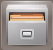 on the left side of the system, then navigate to the path **home/third_party/tensorrtx/yolov5** to access the specified directory. In this directory, find and open the file **yolov5_det_trt.py** by double-clicking it.

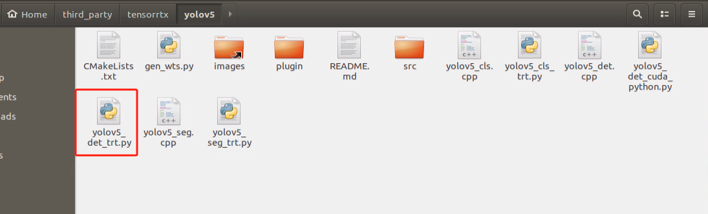

> [!NOTE]
> 
> **Before making any changes, it is recommended to back up the file. If errors occur after modifications, the original file can be restored. Direct modifications without a backup may cause other example features to malfunction.**

2. Scroll to the bottom of the document and locate the section shown in the image below. Ensure that the **build** folder has been compiled and created.

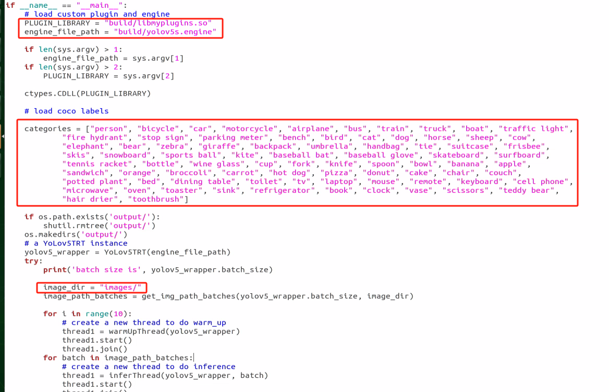

The code lines highlighted by the first red box specify the accelerated, trained model located in **~/tensorrtx/yolov5/build**. Update this entry to match the actual model file name in use.

The code lines highlighted by the second red box specify the image classes used during model training. The class names must follow the same order used for dataset annotation and in the **classes.names** file to prevent incorrect class labels during inference.

The code line highlighted by the third red box sets the image input path. Place the images to be tested in this directory. The default path is **images/** and should be updated to the target test image directory as needed.

After modification, the code lines should appear as shown in the figure.

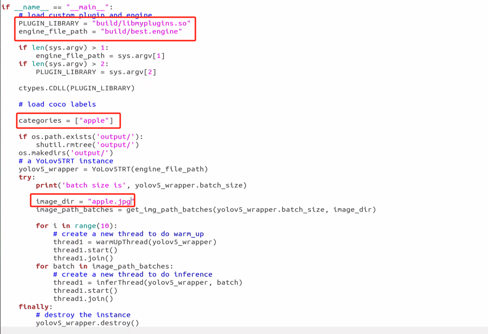

3. Click **Save** at the top-right corner to save the changes.


4. Enter the command and press **Enter** to start object detection. Once the process is complete, a message indicates that the processed images have been saved to the **output** directory under the same path. Navigate to the directory to view the results.

```bash
python3 yolov5_det_trt.py
```

* **Detection Result**

After **yolov5_det_trt.py** is executed, images in the **samples** directory are compared against the trained model. The object with the highest confidence score is highlighted with a bounding box, and the corresponding label and confidence value are rendered on the image. The final results are saved to the **output** directory.

* **Adjusting Model Confidence**

During inference, the model may fail to detect objects or produce inaccurate results. In such cases, the confidence threshold can be adjusted to improve detection performance.

1. Click on the file manager  on the left side of the system, then navigate to the path **home/third_party/tensorrtx/yolov5** to access the specified directory. In this directory, find and open the file **yolov5_det_trt.py** by double-clicking it.
   
   
   
2. After opening the file, locate the section shown in the figure. The value highlighted by the red box represents the confidence threshold. A higher value indicates a stricter confidence requirement, and only detections with confidence scores above this threshold are displayed.
   
   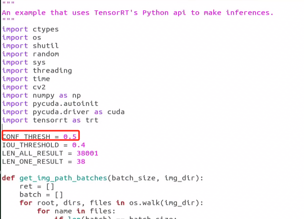
   
3. The default value is set to 0.5. If objects are not detected as expected, the threshold can be lowered. If multiple unintended detections appear in the same image, increasing the threshold can help reduce false positives.

4. Click **Save** at the top-right corner to save the changes.


## 7.3 MediaPipe Human-Robot Interaction

### 7.3.1 MediaPipe Overview and Getting Started

#### 7.3.1.1 MediaPipe Overview

MediaPipe is an open-source framework designed for building multimedia machine learning pipelines. It is cross-platform and can run on mobile devices, workstations, and servers, with support for mobile GPU acceleration. MediaPipe is compatible with inference engines such as TensorFlow and TensorFlow Lite, allowing seamless integration with models from both platforms. Additionally, it offers GPU acceleration on mobile and embedded platforms.


#### 7.3.1.2 Pros and Cons

* **Advantages of MediaPipe**

1) MediaPipe supports various platforms and languages, including [IOS](https://www.isolves.com/it/cxkf/ydd/IOS/), [Android](https://www.isolves.com/it/cxkf/ydd/Android/), C++, [Python](http://www.isolves.com/it/cxkf/yy/Python/), [JAVAScript](https://www.isolves.com/it/cxkf/yy/JAVA/), Coral, etc.

2) The performance is fast, and the model can generally run in real time.

3) Both the model and code allow for high reusability.

* **Disadvantages of MediaPipe**

1) For mobile devices, MediaPipe will occupy 10 MB or more.

2) It heavily depends on TensorFlow, and switching to another machine learning framework would require significant code changes.

3) The framework uses static graphs, which improve efficiency but also make it more difficult to detect errors.

#### 7.3.1.3 MediaPipe Usage Workflow

The figure below shows how to use MediaPipe. The solid line represents the part to be coded, and the dotted line indicates the part not to be coded. MediaPipe can offer the result and the function realization framework quickly.


* **Dependency**

MediaPipe relies on [OpenCV](https://opencv.org/) for video processing and [FFMPEG](https://www.ffmpeg.org/) for audio data processing. It also has other dependencies, such as [OpenGL/Metal](https://www.opengl.org//), [Tensorflow](https://www.tensorflow.org/), [Eigen](https://eigen.tuxfamily.org/index.php?title=Main_Page), and others.

It is recommended to have a basic understanding of OpenCV before starting with MediaPipe. Refer to the introductory [OpenCV Computer Vision Lesson](https://drive.google.com/drive/folders/1UBsPV79gPzK0EXmAq-k5Wz_2r1vk55od) to familiarize yourself with its core concepts.

* **MediaPipe Solutions**

Solutions are based on the open-source pre-constructed sample of TensorFlow or TFLite. MediaPipe Solutions is built upon a framework, which provides 16 Solutions, including face detection, Face Mesh, iris, hand, posture, human body, and so on.

#### 7.3.1.4 MediaPipe Learning Resources

MediaPipe Official Website: https://developers.google.com/mediapipe

MediaPipe Wiki: http://i.bnu.edu.cn/wiki/index.php?title=Mediapipe

MediaPipe github: <https://github.com/google/mediapipe>

dlib Official Website: http://dlib.net/

dlib github: https://github.com/davisking/dlib


### 7.3.2 Face Detection

In this program, MediaPipe’s face detection model is utilized to detect a human face within the camera image.

MediaPipe Face Detection is a high-speed face detection solution that provides six key landmarks and supports multiple faces. Based on [BlazeFace](https://arxiv.org/abs/1907.05047), a lightweight and efficient face detector optimized for mobile GPU inference.

#### 7.3.2.1 Program Overview

First, import the MediaPipe face detection model and subscribe to the topic messages to obtain the real-time camera feed.

Next, use OpenCV to process the image, including flipping and converting the color space.

Next, the system compares the detection confidence against the model’s minimum threshold to determine if face detection is successful. Once a face is detected, the system will analyze the set of facial features. Each face is represented as a detection message that contains a bounding box and six key landmarks, including right eye, left eye, nose tip, mouth center, right ear region, and left ear region.

Finally, the face will be outlined with a bounding box, and the six key landmarks will be marked on the image.

#### 7.3.2.2 Operation Steps

> [!NOTE]
> 
> **Commands must be entered with correct capitalization. The Tab key can be used to auto-complete keywords.**

1. Power on the robot and connect it via the NoMachine remote control software. For detailed information, please refer to the section [1.7.2 AP Mode Connection Steps](https://wiki.hiwonder.com/projects/ROSOrin/en/jetson-nano/docs/1_ROSOrin_User_Manual.html#ap-mode-connection-steps) in the user manual.

2. Click the terminal icon  in the system desktop to open a command-line window.

3. Enter the following command and press **Enter** to stop the app auto-start service:

```bash
sudo systemctl stop start_app_node.service
```

4. Enter the command to start the depth camera service:

```bash
roslaunch peripherals depth_cam.launch
```

5. In a new terminal, enter the command to navigate to the program directory and press **Enter**.

```bash
roscd example/scripts/mediapipe_example
```

6. Enter the following command and press **Enter** to start the face detection feature.

```bash
python3 face_detect.py
```

7) To exit the program, press the shortcut **Ctrl+C**.

After the feature is closed, the app service can be activated either by using a command or by restarting the robot. If the app service is not enabled, related features in the app will not function properly. The app service will start automatically when the robot is restarted.

Enter the command to restart the app service and wait for a beep from the buzzer, indicating that the service has started.

```bash
sudo systemctl restart start_app_node.service
```

#### 7.3.2.3 Project Outcome

Once the feature is started, the depth camera detects a face and highlights it with a bounding box in the returned video feed.

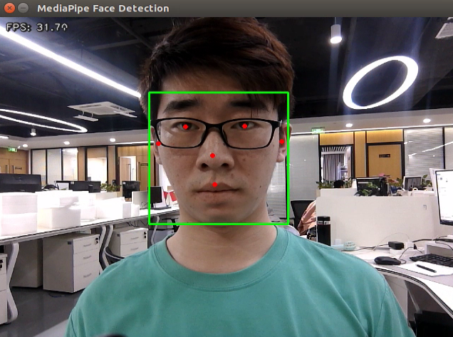

#### 7.3.2.4 Program Analysis

The source code is located at: **/home/ros_ws/src/example/scripts/mediapipe_example/face_detect.py**

1\. Class Initialization

```python
def __init__(self, name):
    rospy.init_node(name)
    self.image = None
    self.running = True
    self.fps = fps.FPS()
    signal.signal(signal.SIGINT, self.shutdown)
    self.mp_face_detection = mp.solutions.face_detection
    self.mp_drawing = mp.solutions.drawing_utils

    rospy.Subscriber('/depth_cam/rgb/image_raw', Image, self.image_callback)  # Subscribe  to the camera topic
    self.run()
```

Initialize the node, subscribe to the camera image topic, and start the main loop.

2\. Image Callback

```python
def image_callback(self, ros_image):
    self.image = np.ndarray(shape=(ros_image.height, ros_image.width, 3), dtype=np.uint8, buffer=ros_image.data) # Raw RGB frame
```

Convert the received ROS image messages into `numpy` arrays that can be processed by OpenCV.

3\. Main Loop

```python
def run(self):
    with self.mp_face_detection.FaceDetection(min_detection_confidence=0.5) as face_detection:
        while self.running:
            if self.image is not None:
                self.image.flags.writeable = False
                image = cv2.cvtColor(self.image, cv2.COLOR_BGR2RGB)
                results = face_detection.process(image)

                image.flags.writeable = True
                image = cv2.cvtColor(image, cv2.COLOR_RGB2BGR)
                if results.detections:
                  for detection in results.detections:
                    self.mp_drawing.draw_detection(image, detection)
                self.fps.update()
                result_image = self.fps.show_fps(cv2.flip(image, 1))
                cv2.imshow('MediaPipe Face Detection', result_image)
                key = cv2.waitKey(10)
                if key != -1:
                    break
            else:
                rospy.sleep(0.01)
```

Import the face detection model from the MediaPipe toolkit. Before performing detection, use the `cvtColor()` function to convert the image to the RGB color space. Detect faces in the frame using the face detection model. Use `mp_drawing.draw_detection()` to draw bounding boxes around detected faces. Finally, call `imshow()` to display the image in the specified window.


### 7.3.3 3D Face Detection

In this program, MediaPipe Face Mesh is utilized to detect the human face within the camera image.

MediaPipe Face Mesh is a powerful model capable of estimating 468 3D facial features, even when deployed on a mobile device. It uses machine learning (ML) to infer 3D facial structure. This model leverages a lightweight architecture and GPU acceleration to deliver critical real-time performance.

Additionally, the solution is bundled with a face transformation module that bridges the gap between facial landmark estimation and practical real-time augmented reality (AR) applications. It establishes a metric 3D space and uses the screen positions of facial landmarks to estimate face transformations within that space. The face transformation data consists of common 3D primitives, including a facial pose transformation matrix and a triangulated face mesh.

#### 7.3.3.1 Program Overview

First, it’s important to understand that the machine learning pipeline used here, which can be thought of as a linear process, consists of two real-time deep neural network models working in tandem: One is a detector that processes the full image to locate faces. The other is a face landmark model that operates on those locations and uses regression to predict an approximate 3D surface.

For the 3D face landmarks, transfer learning was applied, and a multi-task network was trained. This network simultaneously predicts 3D landmark coordinates on synthetic rendered data and 2D semantic contours on annotated real-world data. As a result, the network is informed by both synthetic and real-world data, allowing for accurate 3D landmark prediction.

The 3D landmark model takes cropped video frames as input, without requiring additional depth input. It outputs the positions of 3D points along with a probability score indicating whether a face is present and properly aligned in the input.

After importing the face mesh model, you can subscribe to the topic messages to obtain the real-time camera feed.

The image is processed through operations such as flipping and color space conversion. Then, by comparing the face detection confidence to a predefined threshold, it determines whether a face has been successfully detected.

Finally, a 3D mesh is rendered over the detected face in the video feed.

#### 7.3.3.2 Operation Steps

> [!NOTE]
> 
> **Commands must be entered with correct capitalization. The Tab key can be used to auto-complete keywords.**

1. Power on the robot and connect it via the NoMachine remote control software. For detailed information, please refer to the section [1.7.2 AP Mode Connection Steps](https://wiki.hiwonder.com/projects/ROSOrin/en/jetson-nano/docs/1_ROSOrin_User_Manual.html#ap-mode-connection-steps)  in the user manual.

2. Click the terminal icon  in the system desktop to open a command-line window.

3. Enter the following command and press **Enter** to stop the app auto-start service:

```bash
sudo systemctl stop start_app_node.service
```

4. Enter the command to start the depth camera service:

```bash
roslaunch peripherals depth_cam.launch
```

5. In a new terminal, enter the command to navigate to the program directory and press **Enter**.

```bash
roscd example/scripts/mediapipe_example
```

6. Enter the following command and press **Enter** to start the 3D face detection feature.

```bash
python3 face_mesh.py
```

7. To exit the program, press the shortcut **Ctrl+C**.

After the feature is closed, the app service can be activated either by using a command or by restarting the robot. If the app service is not enabled, related features in the app will not function properly. The app service will start automatically when the robot is restarted.

Enter the command to restart the app service and wait for a beep from the buzzer, indicating that the service has started.

```bash
sudo systemctl restart start_app_node.service
```

#### 7.3.3.3 Project Outcome

Once the feature is started, the depth camera detects a face and displays its 3D contours on the feedback screen.

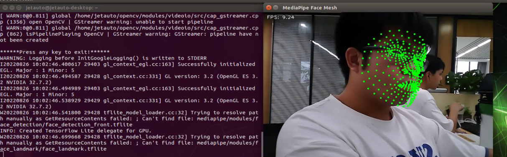

#### 7.3.3.4 Program Analysis

The source code is located at: **/home/ros_ws/src/example/scripts/mediapipe_example/face_mesh.py**

1\. Class Initialization

```python
def __init__(self, name):
    rospy.init_node(name)
    self.image = None
    self.running = True
    self.fps = fps.FPS()
    signal.signal(signal.SIGINT, self.shutdown)
    self.mp_drawing = mp.solutions.drawing_utils
    self.mp_face_mesh = mp.solutions.face_mesh
    self.drawing_spec = self.mp_drawing.DrawingSpec(thickness=1, circle_radius=1)
    rospy.Subscriber('/depth_cam/rgb/image_raw', Image, self.image_callback)  # Subscribe  to the camera topic
    self.run()
```

Initialize the node, subscribe to the camera image topic, and start the main loop.

2\. Image Callback

```python
def image_callback(self, ros_image):
    self.image = np.ndarray(shape=(ros_image.height, ros_image.width, 3), dtype=np.uint8, buffer=ros_image.data) # Raw RGB frame
```

Convert the received ROS image messages into `numpy` arrays that can be processed by OpenCV.

3\. Main Loop

```python
def run(self):
    with self.mp_face_mesh.FaceMesh(max_num_faces=1, min_detection_confidence=0.5, min_tracking_confidence=0.5) as face_mesh:
        while self.running:
            if self.image is not None:
                self.image.flags.writeable = False
                image = cv2.cvtColor(self.image, cv2.COLOR_BGR2RGB)
                results = face_mesh.process(image)
                image = cv2.cvtColor(image, cv2.COLOR_RGB2BGR)
                image.flags.writeable = True
                if results.multi_face_landmarks:
                  for face_landmarks in results.multi_face_landmarks:
                     self.mp_drawing.draw_landmarks(
                        image=image,
                        landmark_list=face_landmarks,
                        landmark_drawing_spec=self.drawing_spec)
                self.fps.update()
                result_image = self.fps.show_fps(cv2.flip(image, 1))
                cv2.imshow('MediaPipe Face Mesh', result_image)
                key = cv2.waitKey(10)
                if key != -1:
                    break
            else:
                rospy.sleep(0.01)
```

Import the Face Mesh model from the MediaPipe toolkit. Before performing detection, use the `cvtColor()` function to convert the image to the RGB color space. Detect faces in the frame using the face mesh model. Use `mp_drawing.draw_landmarks()` function to render the detected face mesh on the frame. Finally, call `imshow()` to display the image in the specified window.


### 7.3.4 Hand Keypoint Detection

In this lesson, MediaPipe’s hand detection model is used to display hand keypoints and the connecting lines between them on the returned image.

MediaPipe Hands is a high-fidelity hand and finger tracking model. It uses machine learning (ML) to infer 21 3D landmarks of a hand from a single frame.

#### 7.3.4.1 Program Overview

First, it's important to understand that MediaPipe's palm detection model utilizes a machine learning pipeline composed of multiple models, which is a linear model, similar to an assembly line. The model processes the entire image and returns an oriented hand bounding box. The hand landmark model then operates on the cropped image region defined by the palm detector and returns high-fidelity 3D hand keypoints.

After importing the hand detection model, the system subscribes to topic messages to acquire real-time camera images.

The images are then processed with flipping and color space conversion, which greatly reduces the need for data augmentation for the hand landmark model.

In addition, the pipeline can generate crops based on the hand landmarks recognized in the previous frame. The palm detection model is only invoked to re-locate the hand when the landmark model can no longer detect its presence.

Next, the system compares the detection confidence against the model’s minimum threshold to determine if hand detection is successful.

Finally, it detects and draws the hand keypoints on the output image.

#### 7.3.4.2 Operation Steps

> [!NOTE]
> 
> **Commands must be entered with correct capitalization. The Tab key can be used to auto-complete keywords.**

1. Power on the robot and connect it via the NoMachine remote control software. For detailed information, please refer to the section [1.7.2 AP Mode Connection Steps](https://wiki.hiwonder.com/projects/ROSOrin/en/jetson-nano/docs/1_ROSOrin_User_Manual.html#ap-mode-connection-steps)  in the user manual.

2. Click the terminal icon  in the system desktop to open a command-line window.

3. Enter the following command and press **Enter** to stop the app auto-start service:

```bash
sudo systemctl stop start_app_node.service
```

4. Enter the command to start the depth camera service:

```bash
roslaunch peripherals depth_cam.launch
```

5. In a new terminal, enter the command to navigate to the program directory and press **Enter**.

```bash
roscd example/scripts/mediapipe_example
```

6. Enter the following command and press **Enter** to start the hand keypoint detection feature.

```
python3 hand.py
```

7) To exit the program, press the shortcut **Ctrl+C**.

After the feature is closed, the app service can be activated either by using a command or by restarting the robot. If the app service is not enabled, related features in the app will not function properly. The app service will start automatically when the robot is restarted.

Enter the command to restart the app service and wait for a beep from the buzzer, indicating that the service has started.

```
sudo systemctl restart start_app_node.service
```

#### 7.3.4.3 Project Outcome

After starting the feature, once the depth camera detects a hand, the returned image will display the hand landmarks along with the connections between them.


#### 7.3.4.4 Program Analysis

The source code is located at: **/home/ros_ws/src/example/scripts/mediapipe_example/hand.py**

1\. Class Initialization

```python
def __init__(self, name):
    rospy.init_node(name)
    self.image = None
    self.running = True
    self.fps = fps.FPS()
    signal.signal(signal.SIGINT, self.shutdown)
    self.mp_drawing = mp.solutions.drawing_utils
    self.mp_hands = mp.solutions.hands
    rospy.Subscriber('/depth_cam/rgb/image_raw', Image, self.image_callback)  # Subscribe  to the camera topic
    self.run()
```

Initialize the node, subscribe to the camera image topic, and start the main loop.

2\. Image Callback

```python
def image_callback(self, ros_image):
    self.image = np.ndarray(shape=(ros_image.height, ros_image.width, 3), dtype=np.uint8, buffer=ros_image.data) # Raw RGB frame
```

Convert the received ROS image messages into `numpy` arrays that can be processed by OpenCV.

3\. Main Loop

```python
def run(self):
    with self.mp_hands.Hands(min_detection_confidence=0.5, min_tracking_confidence=0.5) as hands:
        while self.running:
            if self.image is not None:
                self.image.flags.writeable = False
                image = cv2.cvtColor(self.image, cv2.COLOR_BGR2RGB)
                results = hands.process(image)

                image.flags.writeable = True
                image = cv2.cvtColor(image, cv2.COLOR_RGB2BGR)
                if results.multi_hand_landmarks:
                  for hand_landmarks in results.multi_hand_landmarks:
                    self.mp_drawing.draw_landmarks(
                        image,
                        hand_landmarks,
                        self.mp_hands.HAND_CONNECTIONS)
                self.fps.update()
                result_image = self.fps.show_fps(cv2.flip(image, 1))
                cv2.imshow('MediaPipe Hands', result_image)
                key = cv2.waitKey(10)
                if key != -1:
                    break
            else:
                rospy.sleep(0.01)
```

Import the hand detection model from the MediaPipe toolkit. Before performing detection, use the `cvtColor()` function to convert the image to the RGB color space. Detect hands in the frame using the hand detection model. Use `mp_drawing.draw_landmarks()` function to render the detected hand mesh on the frame. Finally, call `imshow()` to display the image in the specified window.


### 7.3.5 Body Keypoint Detection

In this lesson, MediaPipe's pose detection model is used to detect body landmarks and display them on the video feed.

MediaPipe Pose is a high-fidelity body pose tracking model. Powered by BlazePose, it infers 33 3D landmarks across the full body from RGB input. This research also supports the ML Kit Pose Detection API.


#### 7.3.5.1 Program Overview

First, import the pose detection model.

Then, the program applies image preprocessing such as flipping and converting the color space. By comparing against a minimum detection confidence threshold, it determines whether the human body is successfully detected.

Next, it uses a minimum tracking confidence threshold to decide whether the detected pose can be reliably tracked. If not, the model will automatically re-invoke detection on the next input image.

The pipeline first identifies the region of interest (ROI) containing the person’s pose in the frame using a detector. The tracker then uses the cropped ROI image as input to predict pose landmarks and segmentation masks within that area. For video applications, the detector is only invoked when necessary—such as for the first frame or when the tracker fails to identify a pose from the previous frame. For all other frames, the ROI is derived from the previously tracked landmarks.

After importing the MediaPipe pose detection model, you can subscribe to the topic messages to obtain the real-time video stream from the camera.

Finally, it identifies and draws the body landmarks on the image.

#### 7.3.5.2 Operation Steps

> [!NOTE]
> 
> **Commands must be entered with correct capitalization. The Tab key can be used to auto-complete keywords.**

1. Power on the robot and connect it via the NoMachine remote control software. For detailed information, please refer to the section [1.7.2 AP Mode Connection Steps](https://wiki.hiwonder.com/projects/ROSOrin/en/jetson-nano/docs/1_ROSOrin_User_Manual.html#ap-mode-connection-steps)  in the user manual.

2. Click the terminal icon  in the system desktop to open a command-line window.

3. Enter the following command and press **Enter** to stop the app auto-start service:

```
sudo systemctl stop start_app_node.service
```

4. Enter the command to start the depth camera service:

```
roslaunch peripherals depth_cam.launch
```

5. In a new terminal, enter the command to navigate to the program directory and press **Enter**.

```
roscd example/scripts/mediapipe_example
```

6. Enter the following command and press **Enter** to start the body keypoint detection feature.

```
python3 pose.py
```

7) To exit the program, press the shortcut **Ctrl+C**.

After the feature is closed, the app service can be activated either by using a command or by restarting the robot. If the app service is not enabled, related features in the app will not function properly. The app service will start automatically when the robot is restarted.

Enter the command to restart the app service and wait for a beep from the buzzer, indicating that the service has started.

```
sudo systemctl restart start_app_node.service
```

#### 7.3.5.3 Project Outcome

After the program is launched, the depth camera performs human pose estimation and displays the detected keypoints and their connections on the video feed.

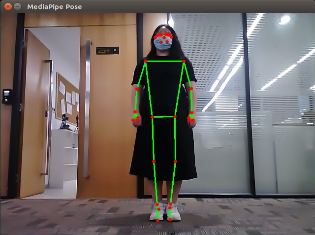

#### 7.3.5.4 Program Analysis

The source code is located at: **/home/ros_ws/src/example/scripts/mediapipe_example/pose.py**

1\. Class Initialization

```python
def __init__(self, name):
    rospy.init_node(name)
    self.image = None
    self.running = True
    self.fps = fps.FPS()
    signal.signal(signal.SIGINT, self.shutdown)
    self.mp_drawing = mp.solutions.drawing_utils
    self.mp_pose = mp.solutions.pose
    rospy.Subscriber('/depth_cam/rgb/image_raw', Image, self.image_callback)  # Subscribe  to the camera topic
    self.run()
```

Initialize the node, subscribe to the camera image topic, and start the main loop.

2\. Image Callback

```python
def image_callback(self, ros_image):
    self.image = np.ndarray(shape=(ros_image.height, ros_image.width, 3), dtype=np.uint8, buffer=ros_image.data) # Raw RGB frame
```

Convert the received ROS image messages into `numpy` arrays that can be processed by OpenCV.

3\. Main Loop

```python
def run(self):
    with self.mp_pose.Pose(min_detection_confidence=0.5, min_tracking_confidence=0.5) as pose:
        while self.running:
            if self.image is not None:
                self.image.flags.writeable = False
                image = cv2.cvtColor(self.image, cv2.COLOR_BGR2RGB)
                results = pose.process(image)

                image.flags.writeable = True
                image = cv2.cvtColor(image, cv2.COLOR_RGB2BGR)
                self.mp_drawing.draw_landmarks(
                    image,
                    results.pose_landmarks,
                    self.mp_pose.POSE_CONNECTIONS)
                self.fps.update()
                result_image = self.fps.show_fps(cv2.flip(image, 1))
                cv2.imshow('MediaPipe Pose', result_image)
                key = cv2.waitKey(10)
                if key != -1:
                    break
            else:
                rospy.sleep(0.01)
```

Import the pose detection model from the MediaPipe toolkit. Before performing detection, use the `cvtColor()` function to convert the image to the RGB color space. Detect the body pose in the video feed using the pose detection model. Use the `mp_drawing.draw_landmarks()` function to draw the detected body keypoints and their connections on the image. Finally, call `imshow()` to display the image in the specified window.


### 7.3.6 Fingertip Trajectory Recognition

The robot uses MediaPipe's hand detection model to recognize palm joints. Once a specific hand gesture is detected, the robot locks onto the fingertip in the image and begins tracking it, drawing the movement trajectory of the fingertip.

#### 7.3.6.1 Program Overview

First, the MediaPipe hand detection model is called to process the camera feed.

Next, the image is flipped and processed to detect hand information within the frame. Based on the connections between hand landmarks, the finger angles are calculated to identify specific gestures.

Finally, once the designated gesture is recognized, the robot starts tracking and locking onto the fingertip, while displaying its movement trajectory in the video feed.

#### 7.3.6.2 Operation Steps

> [!NOTE]
> 
> **Commands must be entered with correct capitalization. The Tab key can be used to auto-complete keywords.**

1. Power on the robot and connect it via the NoMachine remote control software. For detailed information, please refer to the section [1.7.2 AP Mode Connection Steps](https://wiki.hiwonder.com/projects/ROSOrin/en/jetson-nano/docs/1_ROSOrin_User_Manual.html#ap-mode-connection-steps)  in the user manual.

2. Click the terminal icon  in the system desktop to open a command-line window.

3. Enter the following command and press **Enter** to stop the app auto-start service:

```bash
sudo systemctl stop start_app_node.service
```

4. Enter the following command and press **Enter** to start the feature.

```bash
roslaunch example hand_trajectory_node.launch
```

To reduce memory usage, the image display window should be opened manually as described below.

Open a new terminal, enter the command, and press **Enter**.

```
rqt_image_view
```

After running the program, a window will appear. Click the box and select the **/hand_trajectory/image_result** topic to display the image.

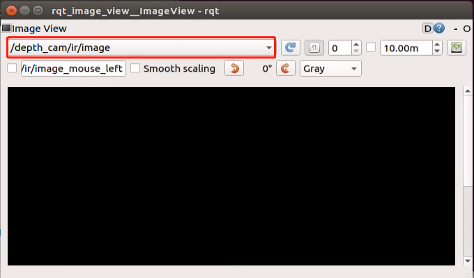

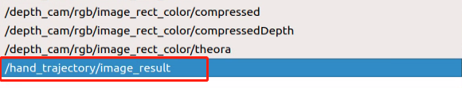

5) To exit the program, press the shortcut **Ctrl+C**.

After the feature is closed, the app service can be activated either by using a command or by restarting the robot. If the app service is not enabled, related features in the app will not function properly. The app service will start automatically when the robot is restarted.

Enter the command to restart the app service and wait for a beep from the buzzer, indicating that the service has started.

```
sudo systemctl restart start_app_node.service
```

#### 7.3.6.3 Project Outcome

After starting the feature, place your hand within the camera’s field of view. Once the hand is detected, key points of the hand will be marked in the returned image.

If the gesture 1 is recognized, the returned image will begin recording the movement trajectory of the index fingertip. If the gesture 5 is recognized, the recorded trajectory will be cleared.


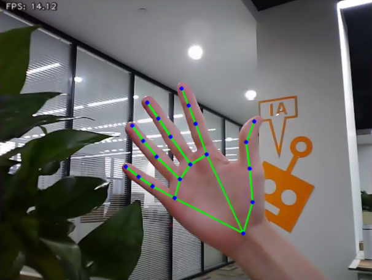

#### 7.3.6.4 Program Analysis

The source code for the program is located at: **/home/ros_ws/src/example/scripts/hand_trajectory/hand_trajectory_node.py**.

> [!NOTE]
> 
> **Before modifying the program, back up the original factory code. Do not modify the source code file directly to avoid robot malfunction due to incorrect parameter changes.**

1\. Finger Type Classification

```python
def hand_angle(landmarks):
    angle_list = []
    # thumb
    angle_ = vector_2d_angle(landmarks[3] - landmarks[4], landmarks[0] - landmarks[2])
    angle_list.append(angle_)
    # index finger
    angle_ = vector_2d_angle(landmarks[0] - landmarks[6], landmarks[7] - landmarks[8])
    angle_list.append(angle_)
    # middle finger
    angle_ = vector_2d_angle(landmarks[0] - landmarks[10], landmarks[11] - landmarks[12])
    angle_list.append(angle_)
    # ring finger
    angle_ = vector_2d_angle(landmarks[0] - landmarks[14], landmarks[15] - landmarks[16])
    angle_list.append(angle_)
    # pinky finger
    angle_ = vector_2d_angle(landmarks[0] - landmarks[18], landmarks[19] - landmarks[20])
    angle_list.append(angle_)
    angle_list = [abs(a) for a in angle_list]
    return angle_list
```

After extracting hand landmarks, logical processing is performed on the landmarks to determine the type of each finger. The landmarks are passed as a set via `landmarks(results)`, and the `vector_2d_angle` function is used to calculate angles between corresponding points. The elements in the `landmarks` set correspond to specific points as shown in the figure.


Taking the thumb's angle as an example: `vector_2d_angle` The function is used to calculate the angle between the keypoints. The keypoints, `landmarks[3]`, `landmarks[4]`, `landmarks[0]`, and `landmarks[2]`, correspond to the points 3, 4, 0, and 2 in the hand feature extraction diagram. By calculating the angles between these key joints, the posture features of the thumb can be determined. Similarly, the processing logic for the remaining finger joints follows the same approach.

To ensure accurate recognition, the parameters and basic logic of angle addition and subtraction in the `hand_angle` function can be kept at their default settings.

2\. Gesture Feature Detection

```python
def h_gesture(angle_list):
    thr_angle = 65.
    thr_angle_thumb = 53.
    thr_angle_s = 49.
    gesture_str = "none"
    if (angle_list[0] > thr_angle_thumb) and (angle_list[1] > thr_angle) and (angle_list[2] > thr_angle) and (
            angle_list[3] > thr_angle) and (angle_list[4] > thr_angle):
        gesture_str = "fist"
    elif (angle_list[0] < thr_angle_s) and (angle_list[1] < thr_angle_s) and (angle_list[2] > thr_angle) and (
            angle_list[3] > thr_angle) and (angle_list[4] > thr_angle):
        gesture_str = "hand_heart"
    elif (angle_list[0] < thr_angle_s) and (angle_list[1] < thr_angle_s) and (angle_list[2] > thr_angle) and (
            angle_list[3] > thr_angle) and (angle_list[4] < thr_angle_s):
        gesture_str = "nico-nico-ni"
    elif (angle_list[0] < thr_angle_s) and (angle_list[1] > thr_angle) and (angle_list[2] > thr_angle) and (
            angle_list[3] > thr_angle) and (angle_list[4] > thr_angle):
        gesture_str = "hand_heart"
    elif (angle_list[0] > 5) and (angle_list[1] < thr_angle_s) and (angle_list[2] > thr_angle) and (
            angle_list[3] > thr_angle) and (angle_list[4] > thr_angle):
        gesture_str = "one"
    elif (angle_list[0] > thr_angle_thumb) and (angle_list[1] < thr_angle_s) and (angle_list[2] < thr_angle_s) and (
            angle_list[3] > thr_angle) and (angle_list[4] > thr_angle):
        gesture_str = "two"
    elif (angle_list[0] > thr_angle_thumb) and (angle_list[1] < thr_angle_s) and (angle_list[2] < thr_angle_s) and (
            angle_list[3] < thr_angle_s) and (angle_list[4] > thr_angle):
        gesture_str = "three"
    elif (angle_list[0] > thr_angle_thumb) and (angle_list[1] > thr_angle) and (angle_list[2] < thr_angle_s) and (
            angle_list[3] < thr_angle_s) and (angle_list[4] < thr_angle_s):
        gesture_str = "OK"
    elif (angle_list[0] > thr_angle_thumb) and (angle_list[1] < thr_angle_s) and (angle_list[2] < thr_angle_s) and (
            angle_list[3] < thr_angle_s) and (angle_list[4] < thr_angle_s):
        gesture_str = "four"
    elif (angle_list[0] < thr_angle_s) and (angle_list[1] < thr_angle_s) and (angle_list[2] < thr_angle_s) and (
            angle_list[3] < thr_angle_s) and (angle_list[4] < thr_angle_s):
        gesture_str = "five"
    elif (angle_list[0] < thr_angle_s) and (angle_list[1] > thr_angle) and (angle_list[2] > thr_angle) and (
            angle_list[3] > thr_angle) and (angle_list[4] < thr_angle_s):
        gesture_str = "six"
    else:
        "none"
    return gesture_str
```

Once the finger types are identified and their positions in the image are determined, gesture recognition is performed by applying logical rules to interpret different hand gestures. `thr_angle = 65`, `thr_angle_thenum=53`, and `thr_angle_s=49` represent the angle threshold values for the corresponding gesture logic points. These values have been tested and found to provide stable recognition results. It is not recommended to change them. If the recognition performance is suboptimal, adjusting the values within ±5 is sufficient. The `angle_list[0,1,2,3,4]` corresponds to the five fingers of the hand.

Taking the gesture **one** as an example:

```python
elif (angle_list[0] > 5) and (angle_list[1] < thr_angle_s) and (angle_list[2] > thr_angle) and (
        angle_list[3] > thr_angle) and (angle_list[4] > thr_angle):
    gesture_str = "one"
```

`angle_list[0]>5` checks whether the angle of the thumb joint feature point in the image is greater than 5. `angle_list[1]<thr_angle_s` checks whether the angle feature of the index finger joint is smaller than the predefined value `thr_angle_s`. `angle_list[2]>thr_angle`checks whether the angle feature of the middle finger joint is smaller than the predefined value `thr_angle`. The logic for the other two fingers, `angle_list[3],angle_list[4]`, follows a similar approach. When all these conditions are met, the current hand gesture is recognized as **one**. The recognition of other gestures follows a similar approach.

3\. Class Initialization

```python
def __init__(self, name):
    rospy.init_node(name) 

    self.drawing = mp.solutions.drawing_utils

    self.hand_detector = mp.solutions.hands.Hands(
        static_image_mode=False,
        max_num_hands=1,
        min_tracking_confidence=0.05,
        min_detection_confidence=0.6
    )

    self.name = name
    self.start = False
    self.running = True
    self.image = None
    self.fps = fps.FPS()  # FPS calculator
    self.state = State.NULL
    self.points = []
    self.count = 0

    camera = rospy.get_param('/depth_camera/camera_name', 'depth_cam')  # Get parameter
    rospy.Subscriber('/%s/rgb/image_raw' % camera, Image, self.image_callback)  # Subscribe  to the camera topic

    self.point_publisher = rospy.Publisher('~points', Points, queue_size=1)  # Use ~ to automatically add the node namespace as a prefix
    self.result_publisher = rospy.Publisher('~image_result', Image, queue_size=1)  # Publish image processing results
    rospy.Service('~start', Trigger, self.start_srv_callback)  # Enter the feature
    rospy.Service('~stop', Trigger, self.stop_srv_callback)  # Exit the feature
    self.display = False
    if rospy.get_param('~start'):
        self.display = True
        self.start_srv_callback(None)

    rospy.set_param('~init_finish', True)

    self.image_proc()
```

Initialize the node, subscribe to the camera image topic, and start the main image processing loop.

4\. Service Callbacks

```python
def start_srv_callback(self, msg):
    rospy.loginfo('start hand trajectory')
    self.start = True

    return TriggerResponse(success=True)

def stop_srv_callback(self, msg):
    rospy.loginfo('stop hand trajectory')
    self.start = False

    return TriggerResponse(success=True)
```

Provide a ROS service interface to control the start and stop of trajectory tracking.

5\. Image Callback

```python
def image_callback(self, ros_image):
    self.image = np.ndarray(shape=(ros_image.height, ros_image.width, 3), dtype=np.uint8, buffer=ros_image.data) # Raw RGB frame
```

Convert the received ROS image messages into `numpy` arrays that can be processed by OpenCV.

6\. Main Image Processing Loop

```python
def image_proc(self):
    points_list = []
    while self.running:
        if self.image is not None:
            image_flip = cv2.flip(self.image, 1)
            bgr_image = image_flip
            self.image = None
            if self.start:
                try:
                    results = self.hand_detector.process(cv2.cvtColor(image_flip, cv2.COLOR_BGR2RGB))
                    if results is not None and results.multi_hand_landmarks:
                        gesture = "none"
                        index_finger_tip = [0, 0]
                        for hand_landmarks in results.multi_hand_landmarks:
                            self.drawing.draw_landmarks(
                                bgr_image,
                                hand_landmarks,
                                mp.solutions.hands.HAND_CONNECTIONS)
                            landmarks = get_hand_landmarks(image_flip, hand_landmarks.landmark)
                            angle_list = (hand_angle(landmarks))
                            gesture = (h_gesture(angle_list))
                            index_finger_tip = landmarks[8].tolist()
                        if self.state != State.TRACKING:
                            if gesture == "one":  # Detect index finger gesture, start fingertip tracking
                                self.count += 1
                                if self.count > 5:
                                    self.count = 0
                                    self.state = State.TRACKING
                                    self.points = []
                                    points_list = []
                            else:
                                self.count = 0

                        elif self.state == State.TRACKING:
                            if gesture != "two":
                                if len(self.points) > 0:
                                    last_point = self.points[-1]
                                    if distance(last_point, index_finger_tip) < 5:
                                        self.count += 1
                                    else:
                                        self.count = 0
                                        pixels = PixelPosition()
                                        pixels.x = int(index_finger_tip[0])
                                        pixels.y = int(index_finger_tip[1])
                                        points_list.append(pixels)
                                        self.points.append(index_finger_tip)
                                else:
                                    pixels = PixelPosition()
                                    pixels.x = int(index_finger_tip[0])
                                    pixels.y = int(index_finger_tip[1])
                                    points_list.append(pixels)
                                    self.points.append(index_finger_tip)
                            draw_points(bgr_image, self.points)
                        if gesture == "five":
                            self.state = State.NULL
                            if points_list:
                                points = Points()
                                points.points = points_list
                                self.point_publisher.publish(points)
                            self.points = []
                            points_list = []
                            draw_points(bgr_image, self.points)
                except Exception as e:
                    print(e)
            else:
                rospy.sleep(0.01)
            self.fps.update()
            result_image = self.fps.show_fps(bgr_image)
            self.result_publisher.publish(cv2_image2ros(cv2.resize(bgr_image, (640, 480)), self.name))
            if self.display:
                cv2.imshow(self.name, cv2.resize(result_image, (640, 480)))
                key = cv2.waitKey(1)
                if key != -1:
                    break
```

Use MediaPipe hand detection to extract hand keypoints and convert them to pixel coordinates. Draw the hand structure and identify gestures by calculating finger bend angles. When the gesture **one**, index finger extended, is detected, enter tracking mode: continuously record the index fingertip coordinates as valid trajectory points, and draw a red continuous trajectory line on the image. The processed image is then resized and published via a ROS topic. When the gesture **five**, all fingers extended, is detected, stop tracking and clear the trajectory.


### 7.3.7 Body Gesture Control

<p id ="p7-3-7"></p>

Using the human pose estimation model trained with the MediaPipe machine learning framework, the system detects the human pose in the camera feed and marks the relevant joint positions. Based on this, multiple actions can be recognized in sequence, allowing direct control of the robot through body gestures.

From the robot’s first-person perspective:  
Raising the left arm causes the robot to move a certain distance to the right. Raising the right arm causes the robot to move a certain distance to the left. Raising the left leg causes the robot to move forward a certain distance. Raising the right leg causes the robot to move backward a certain distance.

#### 7.3.7.1 Program Overview

First, the MediaPipe human pose estimation model is imported, and the camera feed is accessed by subscribing to the relevant topic messages.

MediaPipe is an open-source framework designed for building multimedia machine learning pipelines. It is cross-platform and can run on mobile devices, workstations, and servers, with support for mobile GPU acceleration. It also supports inference engines for TensorFlow and TensorFlow Lite.

Next, using the constructed model, key points of the human torso are detected in the camera feed. These key points are connected to visualize the torso, allowing the system to determine the body posture.

Finally, if the user performs a specific action, the robot responds accordingly.

#### 7.3.7.2 Operation Steps

> [!NOTE]
> 
> **Commands must be entered with correct capitalization. The Tab key can be used to auto-complete keywords.**

1. Power on the robot and connect it via the NoMachine remote control software. For detailed information, please refer to the section [1.7.2 AP Mode Connection Steps](https://wiki.hiwonder.com/projects/ROSOrin/en/jetson-nano/docs/1_ROSOrin_User_Manual.html#ap-mode-connection-steps)  in the user manual.

2. Click the terminal icon  in the system desktop to open a command-line window.

3. Enter the following command and press **Enter** to stop the app auto-start service:

```bash
sudo systemctl stop start_app_node.service
```

4. Enter the command to enable the camera in the terminal.

```bash
roslaunch peripherals depth_cam.launch
```

5. Open a new terminal, enter the following command and press **Enter** to start the body pose control feature.

```bash
roslaunch example body_control.launch
```

6) To close the program, select the corresponding terminal window and press **Ctrl+C**.

After the feature is closed, the app service can be activated either by using a command or by restarting the robot. If the app service is not enabled, related features in the app will not function properly. The app service will start automatically when the robot is restarted.

Enter the command to restart the app service and wait for a beep from the buzzer, indicating that the service has started.

```
sudo systemctl restart start_app_node.service
```

#### 7.3.7.3 Project Outcome

After starting the feature, stand within the camera’s field of view. When a human body is detected, the returned video feed will display the key points of the torso along with lines connecting them.

From the robot’s first-person perspective:  
Raising the left arm causes the robot to move a short distance to the right. Raising the right arm causes the robot to move a short distance to the left. Raising the left leg causes the robot to move forward a short distance. Raising the right leg causes the robot to move backward a short distance.


#### 7.3.7.4 Program Analysis

The program file of the feature is located at: **/ros_ws/src/example/scripts/body_control/include/body_control.py**.

> [!NOTE]
> 
> **Before modifying the program, back up the original factory code. Do not modify the source code file directly to avoid robot malfunction due to incorrect parameter changes.**

1\. Class Initialization

```python
def __init__(self, name):
    rospy.init_node(name)
    self.name = name
    self.drawing = mp.solutions.drawing_utils
    self.body_detector = mp_pose.Pose(
        static_image_mode=False,
        min_tracking_confidence=0.5,
        min_detection_confidence=0.5)

    self.image_queue = queue.Queue(maxsize=1)
    self.fps = fps.FPS()  # FPS calculator

    self.running = True
    self.move_finish = True
    self.stop_flag = False
    self.left_hand_count = []
    self.right_hand_count = []
    self.left_leg_count = []
    self.right_leg_count = []

    self.detect_status = [0, 0, 0, 0]
    self.move_status = [0, 0, 0, 0]
    self.last_status = 0

    self.machine_type = os.environ.get('MACHINE_TYPE')
    camera = rospy.get_param('/depth_camera/camera_name', 'depth_cam')
    self.image_sub = rospy.Subscriber('/%s/rgb/image_raw' % camera, Image, self.image_callback, queue_size=1)
    self.mecanum_pub = rospy.Publisher('/controller/cmd_vel', Twist, queue_size=1)
    self.buzzer_pub = rospy.Publisher('/ros_robot_controller/set_buzzer', BuzzerState, queue_size=1)
    self.motor_pub = rospy.Publisher('/ros_robot_controller/set_motor', MotorsState, queue_size=1)
    self.servo_state_pub = rospy.Publisher('ros_robot_controller/pwm_servo/set_state', SetPWMServoState, queue_size=1)
    time.sleep(0.2)
    self.mecanum_pub.publish(Twist())
    rospy.set_param('~init_finish', True)
    self.image_proc()
```

Initialize the ROS node and configure the pose detector. Subscribe to the camera image topic `/depth_cam/rgb/image_raw`, and publish robot control commands to `/controller/cmd_vel` for movement, `/ros_robot_controller/set_buzzer` for buzzer control, `/ros_robot_controller/set_motor` for motor control, and `ros_robot_controller/pwm_servo/set_state` for servo control.

2\. Image Callback

```python
def image_callback(self, ros_image):
    bgr_image = np.ndarray(shape=(ros_image.height, ros_image.width, 3), dtype=np.uint8, buffer=ros_image.data)  
    if not self.image_queue.empty():
        try:
            self.image_queue.get_nowait()
        except queue.Empty:
            pass
    try:
        self.image_queue.put_nowait(bgr_image)
    except queue.Full:
        pass
```

Convert the received ROS image messages into `numpy` arrays that can be processed by OpenCV.

3\. Motion Control

```python
def move(self, *args):
    if args[0].angular.z == 1:
        servo_state = PWMServoState()
        servo_state.id = [1]
        servo_state.position = [1200]
        data = SetPWMServoState()
        data.state = [servo_state]
        data.duration = 0.1
        self.servo_state_pub.publish(data)
        time.sleep(0.2)
        motor1 = MotorState()
        motor1.id = 2
        motor1.rps = 0.1
        motor2 = MotorState()
        motor2.id = 4
        motor2.rps = -2
        self.motor_pub.publish([motor1, motor2])
        time.sleep(7)
        servo_state = PWMServoState()
        servo_state.id = [1]
        servo_state.position = [1500]
        data = SetPWMServoState()
        data.state = [servo_state]
        data.duration = 0.1
        self.servo_state_pub.publish(data)
        motor1 = MotorState()
        motor1.id = 2
        motor1.rps = 0
        motor2 = MotorState()
        motor2.id = 4
        motor2.rps = 0
        self.motor_pub.publish([motor1, motor2])
    elif args[0].angular.z == -1:
        servo_state = PWMServoState()
        servo_state.id = [1]
        servo_state.position = [1850]
        data = SetPWMServoState()
        data.state = [servo_state]
        data.duration = 0.1
        self.servo_state_pub.publish(data)
        time.sleep(0.2)
        motor1 = MotorState()
        motor1.id = 2
        motor1.rps = 2
        motor2 = MotorState()
        motor2.id = 4
        motor2.rps = -0.1
        self.motor_pub.publish([motor1, motor2])
        time.sleep(8)
        servo_state = PWMServoState()
        servo_state.id = [1]
        servo_state.position = [1500]
        data = SetPWMServoState()
        data.state = [servo_state]
        data.duration = 0.1
        self.servo_state_pub.publish(data)
        motor1 = MotorState()
        motor1.id = 2
        motor1.rps = 0
        motor2 = MotorState()
        motor2.id = 4
        motor2.rps = 0
        self.motor_pub.publish([motor1, motor2])
    else:
        self.mecanum_pub.publish(args[0])
        time.sleep(args[1])
        self.mecanum_pub.publish(Twist())
        time.sleep(0.1)
    self.stop_flag =True
    self.move_finish = True
```

Publish the corresponding motor and servo control commands based on the received `Twist` instructions to drive the robot.

4\. Buzzer

```python
def buzzer_warn(self):
    msg = BuzzerState()
    msg.freq = 2000
    msg.on_time = 0.2
    msg.off_time = 0.01
    msg.repeat = 1
    self.buzzer_pub.publish(msg)
```

Publish buzzer control messages to trigger a short alert tone as feedback.

5\. Recognition Logic Processing

```python
def image_proc(self):
    while self.running:
        image = self.image_queue.get(block=True)
        result_image = image.copy()
        results = self.body_detector.process(image)
        if results is not None and results.pose_landmarks is not None:
            if self.move_finish:
                twist = Twist()
                landmarks = get_joint_landmarks(image, results.pose_landmarks.landmark)
                distance_list = (joint_distance(landmarks))

                if distance_list[0] < 1:
                    self.detect_status[0] = 1
                if distance_list[1] < 1:
                    self.detect_status[1] = 1
                if 0 < distance_list[2] < 2:
                    self.detect_status[2] = 1
                if 0 < distance_list[3] < 2:
                    self.detect_status[3] = 1

                self.left_hand_count.append(self.detect_status[0])
                self.right_hand_count.append(self.detect_status[1])
                self.left_leg_count.append(self.detect_status[2])
                self.right_leg_count.append(self.detect_status[3])                   
                #print(distance_list) 

                if len(self.left_hand_count) == 4:
                    count = [sum(self.left_hand_count), 
                             sum(self.right_hand_count), 
                             sum(self.left_leg_count), 
                             sum(self.right_leg_count)]

                    self.left_hand_count = []
                    self.right_hand_count = []
                    self.left_leg_count = []
                    self.right_leg_count = []

                    if self.stop_flag:
                        if count[self.last_status - 1] <= 1:
                            self.stop_flag = False
                            self.move_status = [0, 0, 0, 0]
                            self.buzzer_warn()
                    else:
                        if count[0] > 2:
                            self.move_status[0] = 1
                        if count[1] > 2:
                            self.move_status[1] = 1
                        if count[2] > 2:
                            self.move_status[2] = 1
                        if count[3] > 2:
                            self.move_status[3] = 1

                        if self.move_status[0]:
                            self.move_finish = False
                            self.last_status = 1
                            if self.machine_type == 'ROSOrin_Mecanum':
                                twist.linear.y = -0.3
                            elif self.machine_type == 'ROSOrin_Acker':
                                twist.angular.z = -1
                            threading.Thread(target=self.move, args=(twist, 1)).start()
                        elif self.move_status[1]:
                            self.move_finish = False
                            self.last_status = 2
                            if self.machine_type == 'ROSOrin_Mecanum':
                                twist.linear.y = 0.3
                            elif self.machine_type == 'ROSOrin_Acker':
                                twist.angular.z = 1
                            threading.Thread(target=self.move, args=(twist, 1)).start()
                        elif self.move_status[2]:
                            self.move_finish = False
                            self.last_status = 3
                            twist.linear.x = 0.3
                            threading.Thread(target=self.move, args=(twist, 1)).start()
                        elif self.move_status[3]:
                            self.move_finish = False
                            self.last_status = 4
                            twist.linear.x = -0.3
                            threading.Thread(target=self.move, args=(twist, 1)).start()

                self.detect_status = [0, 0, 0, 0]

            self.drawing.draw_landmarks(
                result_image,
                results.pose_landmarks,
                mp_pose.POSE_CONNECTIONS)

        self.fps.update()
        result_image = self.fps.show_fps(cv2.flip(result_image, 1))
        cv2.imshow(self.name, result_image)
        key = cv2.waitKey(1)
        if key != -1:
            self.mecanum_pub.publish(Twist())
            self.running = False
```

Retrieve images from the image queue and use MediaPipe to detect human pose keypoints. After converting the coordinates, calculate the distance ratios between key bones to determine pose features. Smooth the detection results over four frames. When a valid pose is recognized in at least three of the four frames and the robot is in a movable state, map the pose type, left or right hand, left or right leg, to the corresponding movement command, forward, backward, left, or righ, and launch a separate thread to execute the movement. Keypoints are drawn on the image in real time, and the loop can be terminated via a key press to stop the robot.

Different robot types are handled distinctly: when the left hand is raised, the ROSorin_Mecanum moves directly to the left, while the ROSorin_Acker turns left. The executed actions differ between the two chassis.


### 7.3.8 Human Tracking

> [!NOTE]
> 
> **This feature is intended for indoor use, as outdoor environments can significantly interfere with its performance.**

Human detection is enabled through a pose estimation model trained using the YOLOv5 framework. The center point of the human body will be marked in the live feed. When the human gets closer, the robot will move backward. When the human moves away, the robot will move forward, maintaining a distance of approximately 3 meters between the human and the robot.

#### 7.3.8.1 Program Overview

First, import the YOLOv5 human pose estimation model and subscribe to the topic to receive real-time camera feed.

Next, using the trained model, detect the keypoints of the human body in the frame and calculate the coordinates of the human's center point based on these keypoints.

Finally, update the PID controller based on the coordinates of the human's center point and the frame's center point, allowing the robot to move in response to the human's movement.

#### 7.3.8.2 Operation Steps

> [!NOTE]
> 
> **Commands must be entered with correct capitalization. The Tab key can be used to auto-complete keywords.**

1. Power on the robot and connect it via the NoMachine remote control software. For detailed information on connecting to a remote desktop, please refer to the section [1.7.2 AP Mode Connection Steps](https://wiki.hiwonder.com/projects/ROSOrin/en/jetson-nano/docs/1_ROSOrin_User_Manual.html#ap-mode-connection-steps)  in the user manual.

2. Click the terminal icon  in the system desktop to open a command-line window.

3. Enter the following command and press **Enter** to stop the app auto-start service:

```bash
sudo systemctl stop start_app_node.service
```

4. Enter the following command and press **Enter** to start the human tracking feature.

```bash
roslaunch example body_track.launch
```

5) To close the program, select the corresponding terminal window and press **Ctrl+C**.

After the feature is closed, the app service can be activated either by using a command or by restarting the robot. If the app service is not enabled, related features in the app will not function properly. The app service will start automatically when the robot is restarted.

Enter the command to restart the app service and wait for a beep from the buzzer, indicating that the service has started.

```
sudo systemctl restart start_app_node.service
```

#### 7.3.8.3 Project Outcome

After the feature is enabled, a person stands within the camera's field of view. When detected, the center point of the person’s body will be marked in the live feed.

From the robot’s first-person perspective, when a person approaches, the robot moves backward. When the human moves away, the robot will move forward, maintaining a distance of approximately 3 meters between the human and the robot.

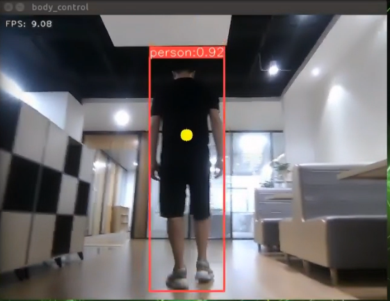

#### 7.3.8.4 Program Analysis

The program file of the feature is located at: **/ros_ws/src/example/scripts/body_control/include/body_track.py**.

> [!NOTE]
> 
> **Before modifying the program, back up the original factory code. Do not modify the source code file directly to avoid robot malfunction due to incorrect parameter changes.**

1\. Class Initialization

```python
def __init__(self, name):
    rospy.init_node(name)
    self.name = name

    self.pid_d = pid.PID(0.1, 0, 0)

    self.pid_angular = pid.PID(0.002, 0, 0)

    self.go_speed, self.turn_speed = 0.007, 0.04
    self.linear_x, self.angular = 0, 0

    self.image_queue = queue.Queue(maxsize=1)
    self.fps = fps.FPS()  # FPS calculator

    self.running = True
    self.turn_left = False
    self.turn_right = False
    self.go_forward = False
    self.back = False
    self.next_frame = True
    self.depth_frame = None
    self.center = None
    self.machine_type = os.environ.get('MACHINE_TYPE')
    camera = rospy.get_param('/depth_camera/camera_name', 'depth_cam')
    self.image_sub = rospy.Subscriber('/yolov5/object_image', Image, self.image_callback, queue_size=1)
    self.depth_image_sub = rospy.Subscriber('/%s/depth/image_raw' % camera, Image, self.depth_image_callback, queue_size=1)
    self.mecanum_pub = rospy.Publisher('/controller/cmd_vel', Twist, queue_size=1)
    rospy.Subscriber('/yolov5/object_detect', ObjectsInfo, self.get_object_callback)
    while not rospy.is_shutdown():
        try:
            if rospy.get_param('/yolov5/init_finish'):
                break
        except:
            rospy.sleep(0.1)
    rospy.ServiceProxy('/yolov5/start', Trigger)()
    rospy.sleep(1)
    self.mecanum_pub.publish(Twist())
    rospy.set_param('~init_finish', True)

    self.image_proc()
```

Initialize the ROS node and configure two `PID` controllers for distance and angle control. Create an image queue and an FPS calculator, subscribe to YOLOv5 detection images and camera image topics, and publish to the velocity control topic. Wait for YOLOv5 to initialize, start the detection service, and publish an initial zero-velocity command.

2\. Object Detection Callback

```python
def get_object_callback(self, msg):
    for i in msg.objects:
        class_name = i.class_name
        if class_name == 'person':
            if i.box[1] < 10:
                self.center = [int((i.box[0] + i.box[2])/2), int(i.box[1]) + abs(int((i.box[1] - i.box[3])/4))]
            else:
                self.center = [int((i.box[0] + i.box[2])/2), int(i.box[1]) + abs(int((i.box[1] - i.box[3])/3))]
```

Receive YOLOv5 detection results and calculate the center coordinates of the human target.

3\. Depth Image Callback

```py
def depth_image_callback(self, depth_image):
    self.depth_frame = np.ndarray(shape=(depth_image.height, depth_image.width), dtype=np.uint16, buffer=depth_image.data)
```

Convert ROS depth image messages into `NumPy` arrays and store them as `depth_frame` for distance calculations.

4\. Image Callback

```python
def image_callback(self, ros_image):
    bgr_image = np.ndarray(shape=(ros_image.height, ros_image.width, 3), dtype=np.uint8, buffer=ros_image.data)  
    if not self.image_queue.empty():
        try:
            self.image_queue.get_nowait()
        except queue.Empty:
            pass
    try:
        self.image_queue.put_nowait(bgr_image)
    except queue.Full:
        pass
```

Convert YOLOv5 output detection images to OpenCV BGR format and store them in the image queue. When the queue is full, remove older images to prevent backlog and reduce latency.

5\. Main Loop

```python
def image_proc(self):
    while self.running:
        twist = Twist()
        bgr_image = self.image_queue.get(block=True)
        if self.center is not None:
            h, w = bgr_image.shape[:-1]
            cv2.circle(bgr_image, tuple(self.center), 10, (0, 255, 255), -1) 
            #################
            roi_h, roi_w = 5, 5
            w_1 = self.center[0] - roi_w
            w_2 = self.center[0] + roi_w
            if w_1 < 0:
                w_1 = 0
            if w_2 > w:
                w_2 = w
            h_1 = self.center[1] - roi_h
            h_2 = self.center[1] + roi_h
            if h_1 < 0:
                h_1 = 0
            if h_2 > h:
                h_2 = h

            cv2.rectangle(bgr_image, (w_1, h_1), (w_2, h_2), (0, 255, 255), 2)
            roi = self.depth_frame[h_1:h_2, w_1:w_2]
            distances = roi[np.logical_and(roi > 0, roi < 40000)]
            if distances != []:
                distance = int(np.mean(distances)/10)
            else:
                distance = 0
            ################
            if distance > 600: 
                distance = 600
            elif distance < 60:
                distance = 60

            if abs(distance - 150) < 15:
                distance = 150
            self.pid_d.update(distance - 150)  # Update pid
            self.linear_x = -misc.set_range(self.pid_d.output, -0.4, 0.4)

            if abs(self.center[0] - w/2) < 30:
                self.center[0] = w/2
            self.pid_angular.update(self.center[0] - w/2)  # Update pid
            self.center = None
            twist.linear.x = self.linear_x
            if self.machine_type != 'ROSOrin_Acker':
                twist.angular.z = misc.set_range(self.pid_angular.output, -0.8, 0.8)
            else:
                twist.angular.z = twist.linear.x*math.tan(misc.set_range(self.pid_angular.output, -0.55, 0.55))/0.17706
        self.mecanum_pub.publish(twist)
        cv2.imshow(self.name, bgr_image)
        key = cv2.waitKey(1)
        if key != -1:
            self.mecanum_pub.publish(Twist())
            self.running = False
```

Retrieve images from the queue. If a human target is detected, execute tracking control. Draw the target center and detection area on the image. Extract valid depth values from the central region, ignoring zeros and excessively distant values, and calculate the average as the target distance. Use `pid_d` to stabilize the target distance and output the linear speed `linear_x`, and use `pid_angular` to align the target center with the image center, producing the angular speed `angular.z`. Publish the movement commands and display the image. Press any key to stop the robot and exit the node.

For robots other than the ROSorin_Acker, the angular speed is taken directly from the output of `pid_angular`. For ROSorin_Acker robots, the angular speed calculation also accounts for the linear speed and the robot’s turning radius.

#### 7.3.8.5 Extensions

By default, the tracking speed is fixed. To modify the robot's tracking speed, adjust the PID parameters in the program.

1. Open the terminal and enter the command to navigate to the directory where the program is stored.

```
roscd example/scripts/body_control/include
```

2. Then, use the command to open the program file.

```bash
sudo vim body_track.py
```

3. Locate the `self.pid_d` and `self.pid_angular` functions, where the values inside the parentheses correspond to the PID parameters. One controls the tracking linear velocity PID, and the other controls the tracking angular velocity PID.

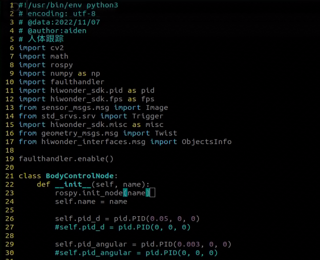

The three PID parameters—proportional, integral, and derivative—serve different purposes: the proportional adjusts the response level, the integral smooths the response, and the derivative helps control overshoot.

4. To adjust the tracking speed, press the i key to enter edit mode, then increase the values. For example, set the linear velocity PID to 0.05 to boost the tracking speed.

> [!NOTE]
> 
> **It’s recommended not to increase the parameters too much, as doing so can cause the robot to track too quickly and negatively impact the feature.**

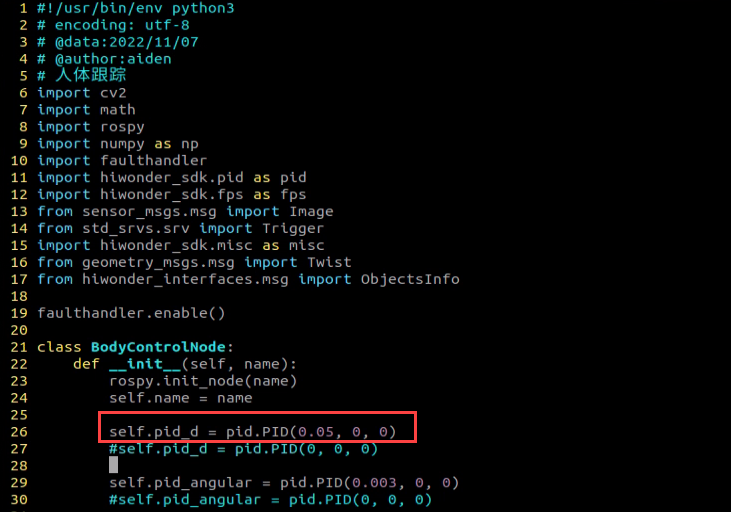

5. After making the changes, press **Esc** to exit edit mode, then type `:wq` to save and exit.

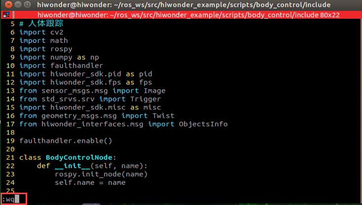

6. Follow the steps to activate the feature.


### 7.3.9 Body Gesture Control with RGB Fusion

The depth camera is fused with RGB, allowing the system to perform both color recognition and body-gesture control. Based on the section [7.3.7 Body Gesture Control](#p7-3-7) in this document, this session incorporates color recognition to determine the control target. Only when a person wearing a specified color is detected, which can be set through color calibration, can their body gestures be used to control the robot.

If a person wearing the specified color is not detected, the robot cannot be controlled. This allows precise targeting of the person who can control the robot.

#### 7.3.9.1 Program Overview

First, the MediaPipe human pose estimation model is imported, and the camera feed is accessed by subscribing to the relevant topic messages.

Next, based on the constructed model, the key points of the human torso in the camera feed are detected, and lines are drawn between the key points to visualize the torso and determine the body posture. The center of the body is calculated based on all key points.

Finally, if the detected posture is “hands on hips,” the system uses the clothing color to identify the control target, and the robot enters control mode. When the person performs specific gestures, the robot responds accordingly.

#### 7.3.9.2 Operation Steps

> [!NOTE]
> 
> **Commands must be entered with correct capitalization. The Tab key can be used to auto-complete keywords.**

1. Power on the robot and connect it via the NoMachine remote control software. For detailed information on connecting to a remote desktop, please refer to the section [1.7.2 AP Mode Connection Steps](https://wiki.hiwonder.com/projects/ROSOrin/en/jetson-nano/docs/1_ROSOrin_User_Manual.html#ap-mode-connection-steps)  in the user manual.

2. Click the terminal icon  in the system desktop to open a command-line window.

3. Enter the following command and press **Enter** to stop the app auto-start service:

```bash
sudo systemctl stop start_app_node.service
```

4. Enter the following command and press **Enter** to start the feature.

```bash
roslaunch example body_and_rgb_control.launch
```

5) To close the program, select the corresponding terminal window and press **Ctrl+C**.

After the feature is closed, the app service can be activated either by using a command or by restarting the robot. If the app service is not enabled, related features in the app will not function properly. The app service will start automatically when the robot is restarted.

Enter the command to restart the app service and wait for a beep from the buzzer, indicating that the service has started.

```bash
sudo systemctl restart start_app_node.service
```

#### 7.3.9.3 Project Outcome

After starting the feature, stand within the camera’s field of view. When a person is detected, the camera feed will display the torso key points, lines connecting the points, and the body’s center point.

Step 1: Adjust the camera slightly higher and maintain a reasonable distance to ensure the full body is captured.

Step 2: When the person who will control the robot appears in the camera feed and strikes a hands-on-hips pose, wait for the buzzer to sound briefly. This indicates that the robot has completed the body center and clothing color calibration and is now in control mode. Calibration may sometimes take a while. Wait for the brief buzzer beep.

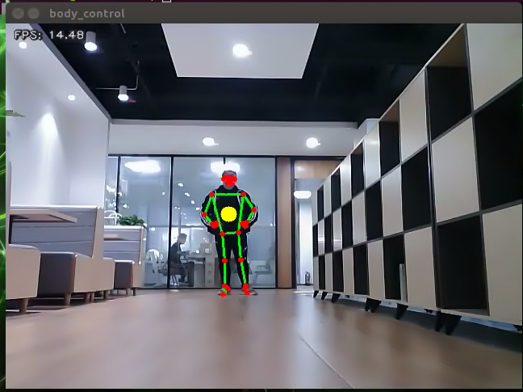

Step 3: From the robot’s first-person perspective, performing specific gestures causes the robot to move accordingly. Raise the left arm to control the robot moving to the right, and raise the right arm to control the robot moving to the left.

Raise the left leg to control the robot moving forward, and raise the right leg to control the robot moving backward.

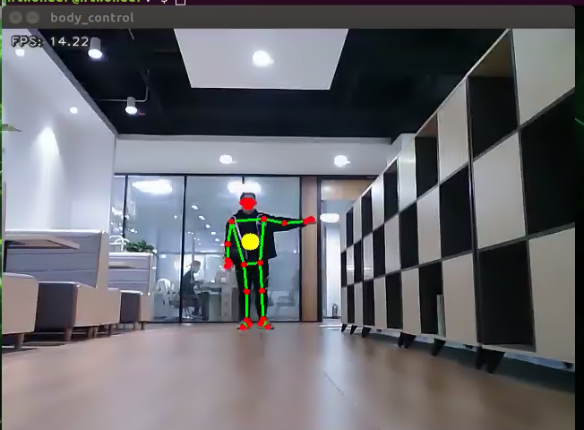

Step 4: If someone wearing a different color enters the camera’s field of view, they will not be able to control the robot.


#### 7.3.9.4 Program Analysis

The program file of the feature is located at: **/ros_ws/src/example/scripts/body_control/include/body_and_rgb_control.py**.

> [!NOTE]
> 
> **Before modifying the program, back up the original factory code. Do not modify the source code file directly to avoid robot malfunction due to incorrect parameter changes.**

1\. Class Initialization

```python
def __init__(self, name):
    rospy.init_node(name)
    self.name = name
    self.running = True
    self.drawing = mp.solutions.drawing_utils
    self.body_detector = mp_pose.Pose(
        static_image_mode=False,
        min_tracking_confidence=0.5,
        min_detection_confidence=0.5)

    self.color_picker = ColorPicker(Point(), 2)
    self.image_queue = queue.Queue(maxsize=1)
    self.fps = fps.FPS()  # FPS calculator

    self.running = True
    self.current_color = None
    self.lock_color = None
    self.calibrating = False
    self.move_finish = True
    self.stop_flag = False
    self.count_akimbo = 0
    self.count_no_akimbo = 0
    self.can_control = False
    self.have_lock = False
    self.left_hand_count = []
    self.right_hand_count = []
    self.left_leg_count = []
    self.right_leg_count = []

    self.detect_status = [0, 0, 0, 0]
    self.move_status = [0, 0, 0, 0]
    self.last_status = 0

    self.machine_type = os.environ.get('MACHINE_TYPE')
    camera = rospy.get_param('/depth_camera/camera_name', 'depth_cam')
    self.image_sub = rospy.Subscriber('/%s/rgb/image_raw' % camera, Image, self.image_callback, queue_size=1)
    self.mecanum_pub = rospy.Publisher('/controller/cmd_vel', Twist, queue_size=1)
    self.buzzer_pub = rospy.Publisher('/ros_robot_controller/set_buzzer', BuzzerState, queue_size=1)
    self.motor_pub = rospy.Publisher('/ros_robot_controller/set_motor', MotorsState, queue_size=1)

    self.mecanum_pub.publish(Twist())
    rospy.set_param('~init_finish', True)

    self.image_proc()
```

Initialize the ROS node, create the human pose detector, subscribe to image topics, publish topics for motion control, buzzer, and motors, and start the image processing loop.

2\. Image Callback

```python
def image_callback(self, ros_image):
    bgr_image = np.ndarray(shape=(ros_image.height, ros_image.width, 3), dtype=np.uint8, buffer=ros_image.data)  
    if not self.image_queue.empty():
        try:
            self.image_queue.get_nowait()
        except queue.Empty:
            pass
    try:
        self.image_queue.put_nowait(bgr_image)
    except queue.Full:
        pass
```

Convert the received image data to OpenCV format and store it in the image queue.

3\. Motion Control

```python
def move(self, *args):
    if args[0].angular.z == 1:
        servo_state = PWMServoState()
        servo_state.id = [1]
        servo_state.position = [1200]
        data = SetPWMServoState()
        data.state = [servo_state]
        data.duration = 0.1
        self.servo_state_pub.publish(data)
        time.sleep(0.2)
        motor1 = MotorState()
        motor1.id = 2
        motor1.rps = 0.1
        motor2 = MotorState()
        motor2.id = 4
        motor2.rps = -2
        self.motor_pub.publish([motor1, motor2])
        time.sleep(7)
        servo_state = PWMServoState()
        servo_state.id = [1]
        servo_state.position = [1500]
        data = SetPWMServoState()
        data.state = [servo_state]
        data.duration = 0.1
        self.servo_state_pub.publish(data)
        motor1 = MotorState()
        motor1.id = 2
        motor1.rps = 0
        motor2 = MotorState()
        motor2.id = 4
        motor2.rps = 0
        self.motor_pub.publish([motor1, motor2])
    elif args[0].angular.z == -1:
        servo_state = PWMServoState()
        servo_state.id = [1]
        servo_state.position = [1850]
        data = SetPWMServoState()
        data.state = [servo_state]
        data.duration = 0.1
        self.servo_state_pub.publish(data)
        time.sleep(0.2)
        motor1 = MotorState()
        motor1.id = 2
        motor1.rps = 2
        motor2 = MotorState()
        motor2.id = 4
        motor2.rps = -0.1
        self.motor_pub.publish([motor1, motor2])
        time.sleep(8)
        servo_state = PWMServoState()
        servo_state.id = [1]
        servo_state.position = [1500]
        data = SetPWMServoState()
        data.state = [servo_state]
        data.duration = 0.1
        self.servo_state_pub.publish(data)
        motor1 = MotorState()
        motor1.id = 2
        motor1.rps = 0
        motor2 = MotorState()
        motor2.id = 4
        motor2.rps = 0
        self.motor_pub.publish([motor1, motor2])
    else:
        self.mecanum_pub.publish(args[0])
        time.sleep(args[1])
        self.mecanum_pub.publish(Twist())
        time.sleep(0.1)
    self.stop_flag =True
    self.move_finish = True
```

Publish the corresponding motor and servo control commands based on the received `Twist` messages to drive the robot.

4\. Buzzer

```python
def buzzer_warn(self):
    msg = BuzzerState()
    msg.freq = 2000
    msg.on_time = 0.2
    msg.off_time = 0.01
    msg.repeat = 1
    self.buzzer_pub.publish(msg)
```

Trigger the buzzer to provide feedback.

5\. Main Loop

```python
def image_proc(self):
    while self.running:
        image = self.image_queue.get(block=True)
        result_image = image.copy()
        results = self.body_detector.process(image)
        if results is not None and results.pose_landmarks is not None:
            twist = Twist()

            landmarks = get_joint_landmarks(image, results.pose_landmarks.landmark)

            # Hands-on-hips calibration
            angle_list = joint_angle(landmarks)
            #print(angle_list)
            if -150 < angle_list[0] < -90 and -30 < angle_list[1] < -10 and 90 < angle_list[2] < 150 and 10 < angle_list[3] < 30:
                self.count_akimbo += 1  # Hands-on-hips detection+1
                self.count_no_akimbo = 0  # Clear no hands-on-hips detection
            else:
                self.count_akimbo = 0  # Clear hands-on-hips detection
                self.count_no_akimbo += 1  # No hands-on-hips detection+1
                # If hands-on-hips posture is detected for 5 consecutive times, and not under calibrated status
            if self.count_akimbo > 5 and not self.calibrating:
                self.count_akimbo = 0  # Clear detection
                self.calibrating = True  # Calibrating
                self.color_picker.reset()  # Reset color picker
                self.lock_color = None  # Clear calibration colors
                # Hands-on-hips posture is detected for 5 consecutive times
            if self.count_no_akimbo > 5:
                # Was calibrated
                if self.calibrating:
                    self.calibrating = False  # Not calibrating
                    self.have_lock = False  # Not be calibrated
                self.count_akimbo = 0  # Reset detection

                # Acquire the color of body center
            h, w = image.shape[:-1]
            center = get_body_center(h, w, results.pose_landmarks.landmark)
            point = Point()
            point.x = center[0] / w
            point.y = center[1] / h
            self.color_picker.set_point(point)

            if self.move_finish:
                self.current_color, image = self.color_picker(image, image.copy())
                # Color is not calibrated.
                # Color of body center is detected and calibrated but the calibration isn't finished
                if self.lock_color is None and self.current_color is not None and self.calibrating and not self.have_lock:
                    self.have_lock = True  # Calibration completed
                    self.buzzer_warn()  # Calibrate buzzer warning
                    self.lock_color = self.current_color[1]  # Save calibrated
                # print(self.current_color[1])
                # There is calibrated color and color of body center is detected but not be calibrated)
                if self.lock_color is not None and self.current_color is not None and not self.calibrating:
                    # Compare the current color and the calibrated color
                    res = get_dif(list(self.lock_color), list(self.current_color[1]))
                    # print(res)
                    # print(self.lock_color, self.current_color[1])
                    if res < 50:  # If they are consistent, it means that control function can be implemented
                        self.can_control = True
                    else:  # If they are not consistent, it means that control function cannot be implemented
                        self.can_control = False
                if self.can_control:  # If control function can be implemented, move to posture detection part
                    distance_list = (joint_distance(landmarks))

                    if distance_list[0] < 1:
                        self.detect_status[0] = 1
                    if distance_list[1] < 1:
                        self.detect_status[1] = 1
                    if 0 < distance_list[2] < 2:
                        self.detect_status[2] = 1
                    if 0 < distance_list[3] < 2:
                        self.detect_status[3] = 1

                    self.left_hand_count.append(self.detect_status[0])
                    self.right_hand_count.append(self.detect_status[1])
                    self.left_leg_count.append(self.detect_status[2])
                    self.right_leg_count.append(self.detect_status[3])                   
                    #print(distance_list) 

                    if len(self.left_hand_count) == 4:
                        count = [sum(self.left_hand_count), 
                                 sum(self.right_hand_count), 
                                 sum(self.left_leg_count), 
                                 sum(self.right_leg_count)]

                        self.left_hand_count = []
                        self.right_hand_count = []
                        self.left_leg_count = []
                        self.right_leg_count = []

                        if self.stop_flag:
                            if count[self.last_status - 1] <= 2:
                                self.stop_flag = False
                                self.move_status = [0, 0, 0, 0]
                                self.buzzer_warn()
                        else:
                            if count[0] > 2:
                                self.move_status[0] = 1
                            if count[1] > 2:
                                self.move_status[1] = 1
                            if count[2] > 2:
                                self.move_status[2] = 1
                            if count[3] > 2:
                                self.move_status[3] = 1

                            if self.move_status[0]:
                                self.move_finish = False
                                self.last_status = 1
                                if self.machine_type == 'ROSOrin_Mecanum':
                                    twist.linear.y = -0.3
                                elif self.machine_type == 'ROSOrin_Acker':
                                    twist.angular.z = -1
                                threading.Thread(target=self.move, args=(twist, 1)).start()
                            elif self.move_status[1]:
                                self.move_finish = False
                                self.last_status = 2
                                if self.machine_type == 'ROSOrin_Mecanum':
                                    twist.linear.y = 0.3
                                elif self.machine_type == 'ROSOrin_Acker':
                                    twist.angular.z = 1
                                threading.Thread(target=self.move, args=(twist, 1)).start()
                            elif self.move_status[2]:
                                self.move_finish = False
                                self.last_status = 3
                                twist.linear.x = 0.3
                                threading.Thread(target=self.move, args=(twist, 1)).start()
                            elif self.move_status[3]:
                                self.move_finish = False
                                self.last_status = 4
                                twist.linear.x = -0.3
                                threading.Thread(target=self.move, args=(twist, 1)).start()

                    self.detect_status = [0, 0, 0, 0]
            cv2.circle(image, tuple(center), 10, (255, 255, 0), -1)
            self.drawing.draw_landmarks(
                result_image,
                results.pose_landmarks,
                mp_pose.POSE_CONNECTIONS)

        self.fps.update()
        result_image = self.fps.show_fps(cv2.flip(result_image, 1))
        cv2.imshow(self.name, result_image)
        key = cv2.waitKey(1)
        if key != -1:
            self.mecanum_pub.publish(Twist())
            self.running = False
```

Retrieve the latest RGB images from the queue and use MediaPipe to detect human pose keypoints. If valid keypoints are detected, first perform the hands-on-hips calibration. When the hands-on-hips pose is detected consecutively, start the color picker to capture and record the calibration color at the body center. After calibration is complete, the buzzer signals completion, and the calibration state ends. If the hands-on-hips pose is not detected but calibration has been completed, the system automatically exits calibration mode. After calibration, the real-time color at the body center is continuously captured and compared with the calibrated reference color. When the color difference is below the defined threshold, indicating a successful color match, control authority is granted to the robot. If the color does not match, control is disabled. Once control authority is granted, the relative distance ratios of limb keypoints are calculated, and detection results are aggregated over four consecutive frames to determine whether predefined pose conditions are satisfied. When a pose condition is met and the robot is in a movable state with no pending motion commands, the corresponding motion command is generated and executed asynchronously via a separate thread that calls the `move` method, preventing the image processing pipeline from being blocked. After the motion completes, the robot stops automatically and the system state is reset. Pose keypoints are drawn on the image and the processing results are displayed in real time. Keyboard input is monitored, and pressing any key stops the robot and terminates the entire processing loop.

Based on the `move_status` from the recognition results, different chassis types respond differently. The `machine_type` variable determines the chassis type. Multithreading is implemented via `threading.Thread`, and the `move` function is used to control the robot chassis.


### 7.3.10 Human Pose Detection

In this program, a human pose estimation model from the MediaPipe machine learning framework is used to detect human poses. When the robot detects that a person has fallen, it will trigger an alert and perform a left-right twisting motion.

#### 7.3.10.1 Program Overview

First, the MediaPipe human pose estimation model is imported, and the camera feed is accessed by subscribing to the relevant topic messages.

Next, the image is flipped and processed to detect human body information within the frame. Based on the connections between human keypoints, the system calculates the body height to determine body movements.

Finally, if a fall is detected, the robot will trigger an alert and move forward and backward.

#### 7.3.10.2 Operation Steps

> [!NOTE]
> 
> **Commands must be entered with correct capitalization. The Tab key can be used to auto-complete keywords.**

1. Power on the robot and connect it via the NoMachine remote control software. For detailed information on connecting to a remote desktop, please refer to the section [1.7.2 AP Mode Connection Steps](https://wiki.hiwonder.com/projects/ROSOrin/en/jetson-nano/docs/1_ROSOrin_User_Manual.html#ap-mode-connection-steps)  in the user manual.

2. Click the terminal icon  in the system desktop to open a command-line window.

3. Enter the following command and press **Enter** to stop the app auto-start service:

```bash
sudo systemctl stop start_app_node.service
```

4. Enter the following command and press **Enter** to start the fall-down detection feature.

```bash
roslaunch example fall_down_detect.launch
```

5) To exit the program, press the shortcut **Ctrl+C**.

After the feature is closed, the app service can be activated either by using a command or by restarting the robot. If the app service is not enabled, related features in the app will not function properly. The app service will start automatically when the robot is restarted.

Enter the command to restart the app service and wait for a beep from the buzzer, indicating that the service has started.

```
sudo systemctl restart start_app_node.service
```

#### 7.3.10.3 Project Outcome

After starting the feature, make sure the person is fully within the camera’s field of view. When a person is detected, the keypoints of the body will be marked on the live feed.

If the person slightly sits down and the robot recognizes a fall posture, it will continuously sound an alert and repeatedly move forward and backward as a warning.


#### 7.3.10.4 Program Analysis

The program file of the feature is located at: **/ros_ws/src/example/scripts/body_control/include/fall_down_detect.py**.

> [!NOTE]
> 
> **Before modifying the program, back up the original factory code. Do not modify the source code file directly to avoid robot malfunction due to incorrect parameter changes.**

1\. `height_cal` Function

```python
def height_cal(landmarks):
    y = []
    for i in landmarks:
        y.append(i[1])
    height = sum(y)/len(y)

    return height
```

Compute the average y-coordinate of the human keypoints to determine whether the person is in a fallen state based on overall vertical position.

2\. Class Initialization

```python
def __init__(self, name):
    rospy.init_node(name)
    self.name = name
    self.drawing = mp.solutions.drawing_utils
    self.body_detector = mp_pose.Pose(
        static_image_mode=False,
        min_tracking_confidence=0.5,
        min_detection_confidence=0.5)

    self.image_queue = queue.Queue(maxsize=1)
    self.fps = fps.FPS()  # FPS calculator

    self.running = True
    self.fall_down_count = []
    self.move_finish = True
    self.stop_flag = False

    camera = rospy.get_param('/depth_camera/camera_name', 'depth_cam')
    self.image_sub = rospy.Subscriber('/%s/rgb/image_raw' % camera, Image, self.image_callback, queue_size=1)
    self.mecanum_pub = rospy.Publisher('/controller/cmd_vel', Twist, queue_size=1)
    self.buzzer_pub = rospy.Publisher('/ros_robot_controller/set_buzzer', BuzzerState, queue_size=1)
    rospy.sleep(1)
    self.mecanum_pub.publish(Twist())
    rospy.set_param('~init_finish', True)
    self.image_proc()
```

Initialize the ROS node, create the MediaPipe human pose detector, subscribe to the camera image topic, publish robot motion control and buzzer topics, and start the image processing loop.

3\. Image Callback

```python
def image_callback(self, ros_image):
    bgr_image = np.ndarray(shape=(ros_image.height, ros_image.width, 3), dtype=np.uint8, buffer=ros_image.data) 
    if not self.image_queue.empty():
        try:
            self.image_queue.get_nowait()
        except queue.Empty:
            pass
    try:
        self.image_queue.put_nowait(bgr_image)
    except queue.Full:
        pass
```

Convert the received image data to OpenCV format and store it in the image queue.

4\. Motion Control

```python
def move(self):
    for i in range(5):
        twist = Twist()
        twist.linear.x = 0.2
        self.mecanum_pub.publish(twist)
        rospy.sleep(0.2)
        twist = Twist()
        twist.linear.x = -0.2
        self.mecanum_pub.publish(twist)
        rospy.sleep(0.2)
    self.mecanum_pub.publish(Twist())
    self.stop_flag =True
    self.move_finish = True
```

When a fall is detected, command the robot to perform small forward and backward movements five times, then stop, serving as a visual indication of the fall event.

5\. Buzzer

```python
def buzzer_warn(self):
    if not self.stop_flag:
        while not self.stop_flag:
            msg = BuzzerState()
            msg.freq = 1000
            msg.on_time = 0.1
            msg.off_time = 0.1
            msg.repeat = 1
            self.buzzer_pub.publish(msg)
            rospy.sleep(0.2)
    else:
        msg = BuzzerState()
        msg.freq = 2000
        msg.on_time = 0.2
        msg.off_time = 0.01
        msg.repeat = 1
        self.buzzer_pub.publish(msg)
```

Trigger an audible alarm when a fall is detected, emitting a 1000 Hz beep at 0.1-second intervals. After the system returns to a non-fall state, emit a single confirmation beep at 2000 Hz for 0.2 seconds.

6\. Main Loop

```python
def image_proc(self):
    while self.running:
        image = self.image_queue.get(block=True)
        result_image = cv2.flip(image, 1)
        results = self.body_detector.process(result_image)
        if results is not None and results.pose_landmarks:
            if self.move_finish:
                landmarks = get_joint_landmarks(image, results.pose_landmarks.landmark)
                h = height_cal(landmarks)
                if h > 240:
                    self.fall_down_count.append(1)
                else:
                    self.fall_down_count.append(0)
                if len(self.fall_down_count) == 3:
                    count = sum(self.fall_down_count)

                    self.fall_down_count = []
                    if self.stop_flag:
                        if count <= 1:
                            self.buzzer_warn()
                            self.stop_flag = False
                    else:
                        if count > 1:
                            self.move_finish = False
                            threading.Thread(target=self.buzzer_warn).start()
                            threading.Thread(target=self.move).start()

            self.drawing.draw_landmarks(
                result_image,
                results.pose_landmarks,
                mp_pose.POSE_CONNECTIONS)

        self.fps.update()
        result_image = self.fps.show_fps(result_image)
        cv2.imshow(self.name, result_image)
        key = cv2.waitKey(1)
        if key != -1:
            self.mecanum_pub.publish(Twist())
            self.running = False
```

Retrieve images from the queue and use MediaPipe to detect human keypoints. Compute the average y-coordinate of the human keypoints as `height_cal`. If the value exceeds the threshold of 240, the state is classified as a possible fall. Otherwise, it is classified as normal. Detection results are aggregated over three consecutive frames. If the majority of frames indicate a fall and the robot is currently idle, a separate thread is launched to trigger the buzzer alarm and motion response. If subsequent detections indicate that the person has returned to a normal state, with more than one normal result within three consecutive frames, the alarm is stopped and the system state is reset. Human keypoints are drawn in real time, the image is displayed, and pressing any key terminates the program and stops the robot.


### 7.3.11 FAQ

**Q:** An error similar to the one shown in the figure appears.

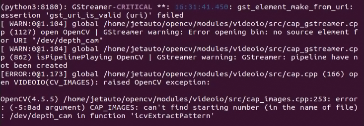

**A:** This issue is typically caused by the depth camera not being detected. Check whether the device is recognized by running the command **ls /dev/video***.

If the depth camera is not listed, try unplugging and reconnecting the camera cable, or gently pressing the USB connector to ensure a proper connection. Run **ls /dev/video*** again. When the output matches the result shown in the figure, the depth camera has been successfully detected.


## 7.4 Autonomous Driving

### 7.4.1 Autonomous Driving Debugging

Before executing the autonomous driving feature, ensure that the hardwares installed on the robot, including depth camera and chassis motors, meet the required specifications and are functioning properly, and that the battery is fully charged.

#### 7.4.1.1 Field Setup and Precautions

Before starting the autonomous driving feature, the test track needs to be set up properly. The detailed setup steps are as follows.

Setup Steps

1. Map Layout

First, lay out the map on a flat and spacious surface, ensuring that the surrounding lighting is sufficient, as shown below.

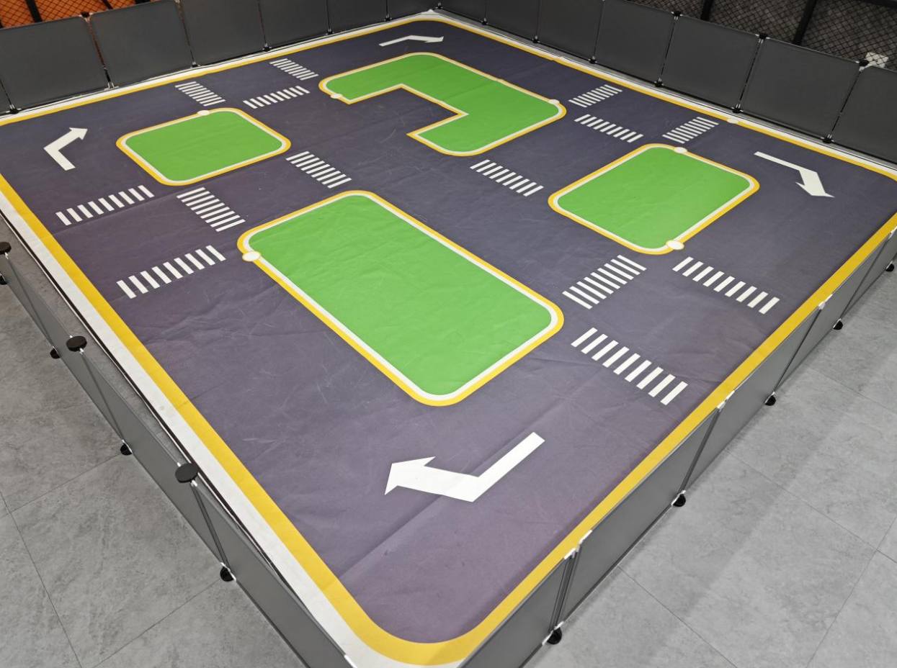

Place the robot at the starting point, as shown in the figure below.

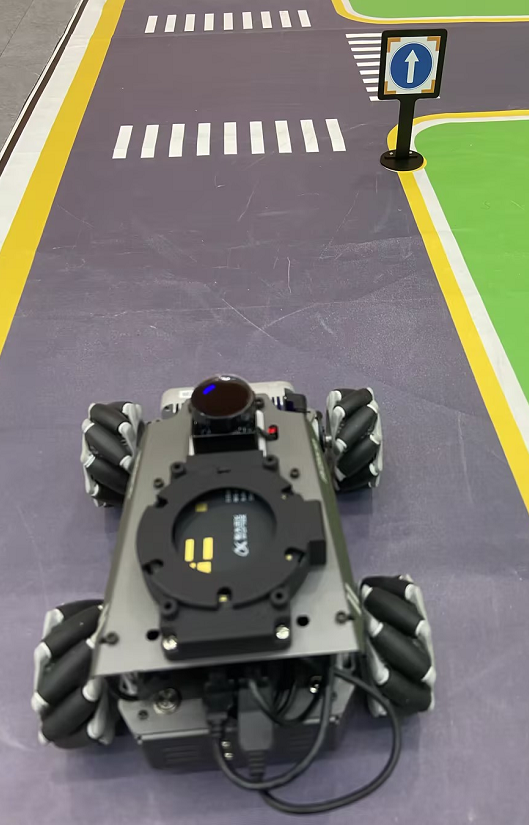

During movement, the robot will follow the yellow line around the perimeter of the map for line following, and it can adjust its posture in real-time according to the lane markings.

2. Traffic Signs Placement

For the autonomous driving feature, a total of four traffic signs need to be placed: two for going straight, one for right turn, and one for parking. The exact placement can be referenced from the figure below.

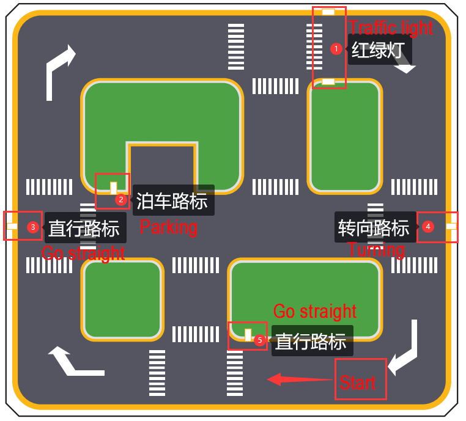

Go straight: instructs the robot to move forward.

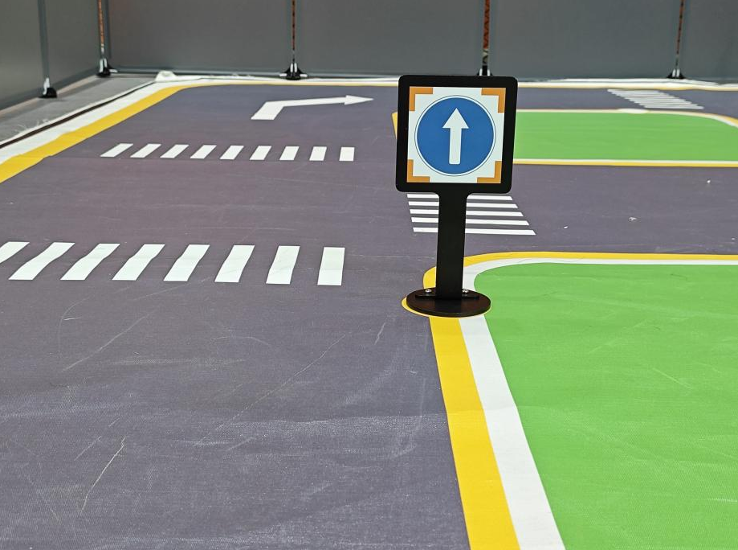

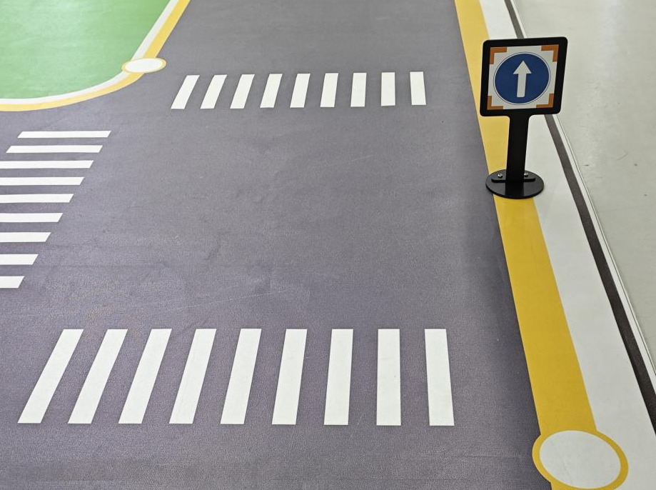

Turn right: instructs the robot to turn right.

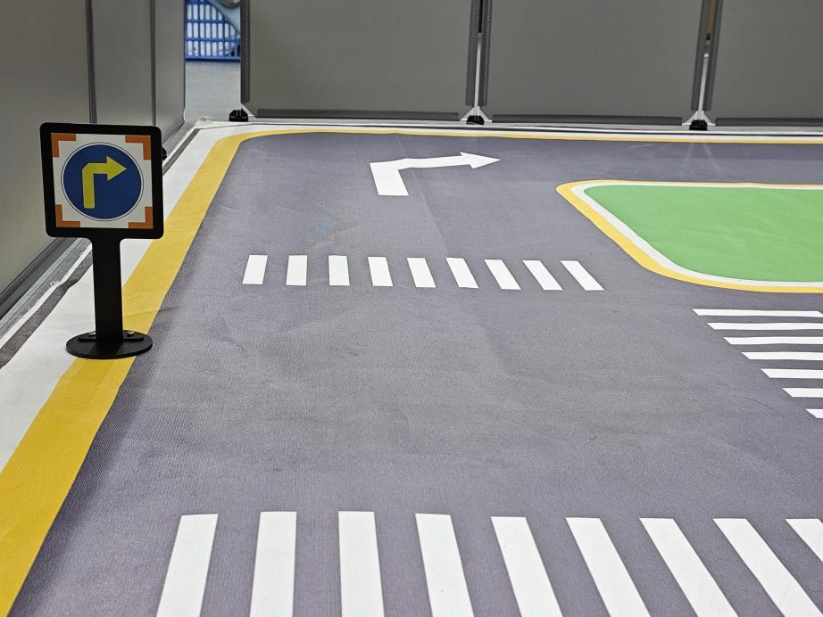

Parking: instructs the robot to enter a stop state.

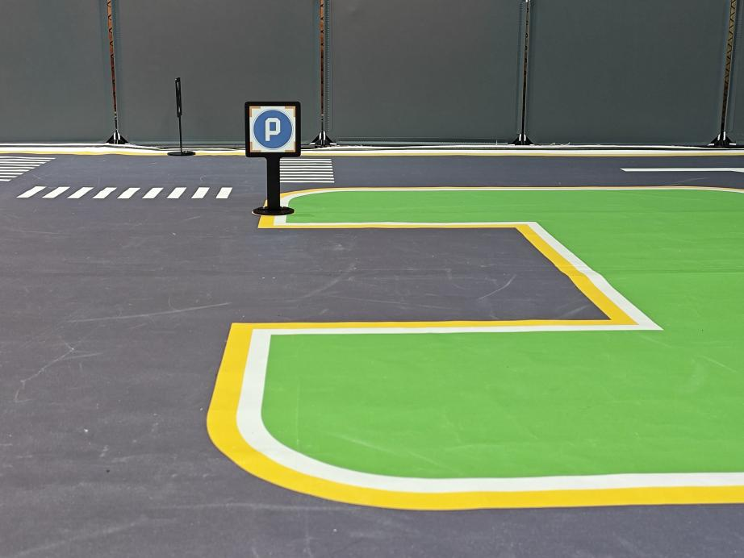

The traffic signs provide guidance to the robot during its drive. Upon recognizing a traffic sign, the robot will perform the corresponding action. Additionally, when approaching a pedestrian crosswalk, the robot will slow down.

3. Traffic Light Placement

In the autonomous driving feature, one traffic light needs to be placed at the specified position shown in the figure.

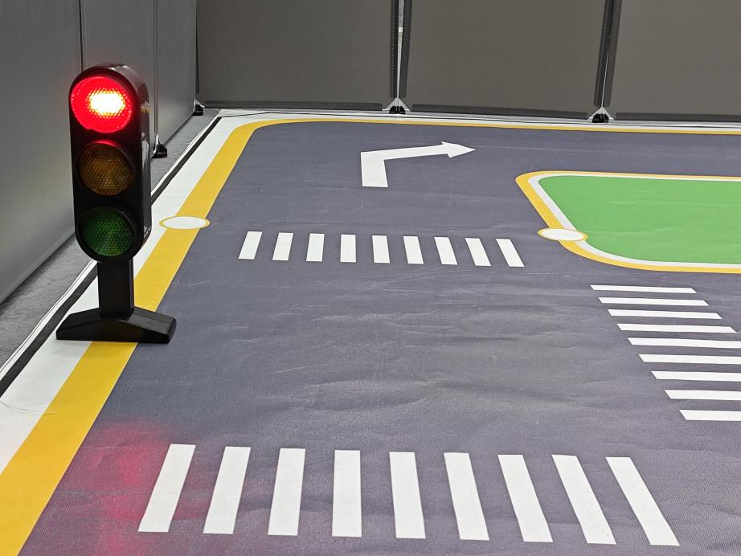

The traffic light simulates real-world traffic signals. When the vehicle detects the traffic light, it will follow the stop at red, go at green rule.


Once all props are set up on the test track, the arrangement should look like the figure below. Use this as a reference when setting up the environment.

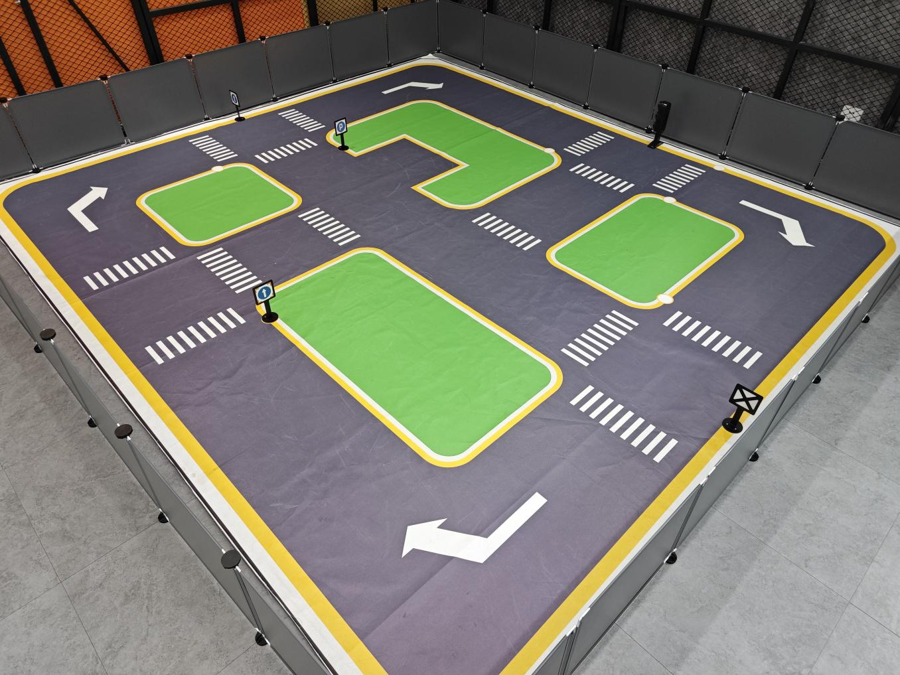

> [!NOTE]
> 
> * **Ensure the area is well-lit with normal ambient lighting. Avoid strong direct light or colored lighting, as these may affect overall recognition performance.**
> 
> * **During setup and use, take care of the course markers. If any parts of the map, traffic signs, or traffic light become damaged or unusable, please contact customer support to purchase replacements to avoid affecting recognition performance.**

#### 7.4.1.2 Start Test

> [!NOTE]
> 
> **The input command should be case sensitive, and the keywords can be complemented by the Tab key.**

1) Place the robot at the starting point on the map and move it clockwise following the map markers.

2) Power on the robot and connect it via the NoMachine remote control software.

3) Click the terminal icon 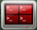 in the system desktop to open a command-line window.

4) Enter the following command and press **Enter** to stop the app service:

```
sudo systemctl stop start_app_node.service
```

5. Entering the following command to enable the autonomous driving service.

```
roslaunch example self_driving.launch
```

Wait for the service to start. When the information shown in the figure below appears, the startup is complete.


* **Project Outcome**

1\. Lane Keeping

After the program is started, the robot follows the yellow line at the edge of the road. Depending on whether the yellow line is straight or curved, it will move forward or turn accordingly to stay within the lane.

2\. Traffic Light Recognition

When encountering a traffic light, the robot will stop if the light is red and move forward if the light is green. When crossing a crosswalk, the robot will automatically reduce its speed and proceed slowly.

3\. Turn Signs and Parking Signs

While moving forward, if the robot detects a traffic sign, it will take the corresponding action. If a right-turn sign is detected, the robot will turn right and continue moving forward. If a parking sign is detected, the robot will perform parallel parking.

After the feature is closed, the app service can be activated either by using a command or by restarting the robot.

If the app service is not enabled, related features in the app will not function properly. If the robot is rebooted, the app service will start automatically. Enter the command to restart the app service and wait for a beep from the buzzer, indicating that the service has started.

```
sudo systemctl start start_app_node.service
```

#### 7.4.1.3 Recognition Debugging

During the robot's movement along the road, poor recognition may cause it to perform incorrect actions. In this case, parameter adjustments are required. The specific debugging methods can be found in the following content.

* **Adjusting the Camera Angle**

When using the autonomous driving feature, pay attention to the camera angle on the vehicle and ensure the camera’s pose is correct. The correct pose is shown in the figure below.

The camera angle affects the performance of autonomous driving. If a **Right Turn** sign is detected but the robot does not turn, slightly raise the camera to enable the robot to complete the right turn. Minor lane crossing during turns is considered normal.

Lowering the camera can improve road-following performance, but it may affect the execution of right turns after detecting a **Right Turn** sign. This effect occurs mainly because the camera is mounted low on the robot, and adjusting parameters or tilt angle has limited impact.

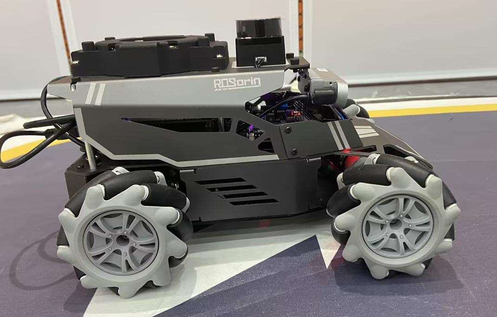

* **Color Threshold Adjustment**

If the robot drifts during movement, the issue can be corrected by adjusting the color threshold. The specific adjustment steps are as follows:

1. Enter the command in the terminal and press **Enter**.

```bash
sudo systemctl stop start_app_node.service
```

2. Enter the next command and press **Enter** to start the depth camera service.

```
roslaunch peripherals depth_cam.launch
```

3. Open a new terminal, enter the command, and press **Enter** to launch the color adjustment tool.

```
python3 software/lab_tool/main.py
```

4. Select the color to adjust as **yellow**, as shown in the figure below.

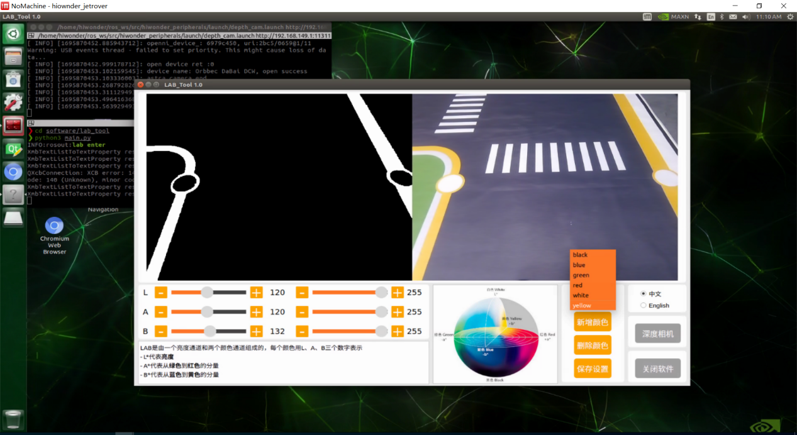

5. Adjust the three LAB values on the left until the yellow color can be recognized effectively, as shown in the figure.


6. Click **Save** to exit, as shown in the figure.


> [!NOTE]
> 
> **During adjustment, it is recommended not to adjust the color threshold based on just one section of the road. Place the robot along multiple sections it will pass during operation and adjust the threshold in each area. Adjusting in multiple locations will achieve the best results.**

* **Sign and Traffic Light Recognition Adjustment**

If the robot fails to respond correctly after detecting a sign or traffic light, the confidence threshold in the launch file can be adjusted. The steps are as follows:

1. Open a new terminal, press **Enter** to navigate to the **self_driving** folder.

```
roscd example/scripts/self_driving/
```

2. Enter the command and press **Enter** to execute.

```
vim self_driving.launch
```

3. In the editor, locate the `conf_thresh` parameter and modify its value. For example, the initial `conf_thresh` is 0.82, as shown in the figure.

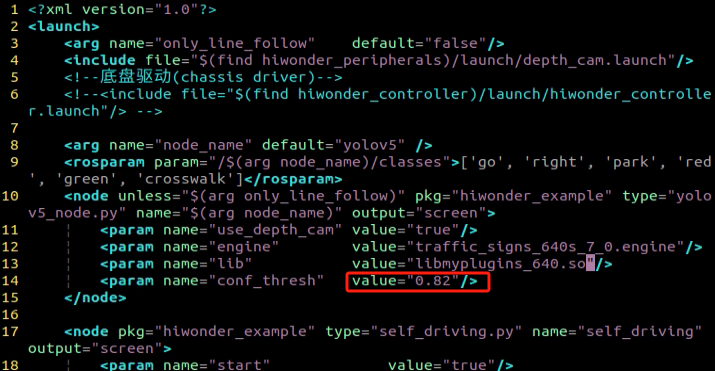

4. Adjust the `conf_thresh` value by slightly lowering it by 0.1–0.2, for example to 0.65. To modify, place the cursor on the value with the left mouse button, press **ESC**, then press the **i** key to enter text editing mode and change the value. For more details on editing, search online for **vim editor edit text**.

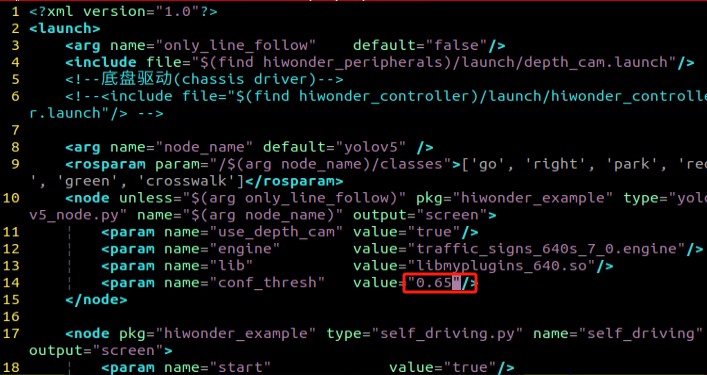

5. After editing, press **ESC**, then type `:wq` and press **Enter** to save and exit. Restart the program according to the feature instructions to check the effect. If the result is still not satisfactory, adjust the value further as needed.

6. If adjusting the **conf_thresh** value does not achieve satisfactory results, it may be necessary to retrain the YOLOv5 model. The training process can refer to the [7.2 Machine Learning Application](#anther7.2) section for guidance. After training, load the trained model path into the launch file and restart the feature to test the effect.

* **Program Adjustment**

During the robot’s operation, besides controlling the movement trajectory by adjusting the color threshold, there are also parameters in the program that constrain the robot’s motion. If the robot still drifts or shakes after adjusting the color threshold, the following adjustments can be made:

Locate and open the self_driving.py file, which is at **example\\scripts\\self_driving\\self_driving.py**.

To adjust the straight-line parameter, follow the steps below:

Find the `lane_x` parameter in the file. This can be located using a preferred software, as shown in the red box in the figure.

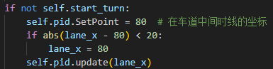

`lane_x` represents the center point of the detected lane line and is used to maintain straight-line driving. By default, this parameter is already set and does not need modification. If adjustment is necessary, the range should be within ±3.

To adjust the right turn parameter, follow the steps below:

Locate the following code section in the file.

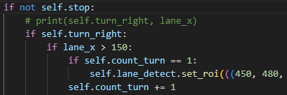

`lane_x` represents the center point of the detected lane line. If the detected position exceeds 150, the robot will turn right. This value can be adjusted to control the robot’s turning position. The adjustment range should be within ±20, depending on the camera angle. By default, this parameter is pre-set and does not require modification.


### 7.4.2 Lane Keeping

This lesson focuses on controlling the car to move forward while keeping it within the lane.

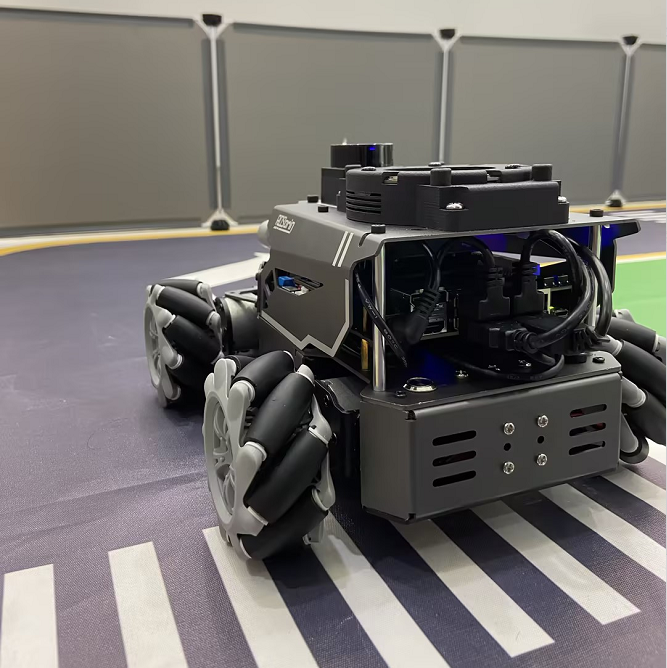

#### 7.4.2.1 Preparation

1) Before starting, lay out the map on a flat surface, ensuring it is smooth with no wrinkles and that the road is free of obstacles. For detailed instructions on map setup, refer to [7.4.1 Autonomous Driving Debugging](#anther7.4.1). Since this lesson only covers basic lane-following, there is no need to place traffic lights or signs.

2) When performing this feature, make sure the environment is well-lit, but avoid direct light hitting the camera to prevent misrecognition.

3) Adjust the color thresholds in advance to correctly detect the yellow lines, preventing misdetection during the lesson. For guidance on setting color thresholds, refer to Section [6.1 Color Threshold Adjustment](https://wiki.hiwonder.com/projects/ROSOrin/en/jetson-nano/docs/6_ROS1_ROS%2BOpenCV_Course.html#color-threshold-adjustment) in the 6. ROS+OpenCV Course.

4) It is recommended to position the robot in the center of the lane for easier detection.

#### 7.4.2.2 Working Principle

Lane keeping can be divided into three main parts: capturing real-time images, image processing, and result comparison.

First, real-time images are captured using the camera.

Next, the images are processed. This includes color detection, converting the detected images into a suitable color space, applying erosion and dilation, and performing binarization.

Finally, the processed images are analyzed. The region of interest (ROI) is extracted, contours are identified, and comparisons are made to determine the car’s position relative to the lane.

Based on the comparison results, the forward direction is adjusted to keep the robot centered in the lane.

#### 7.4.2.3 Operation Steps

> [!NOTE]
> 
> **The input command should be case sensitive, and the keywords can be complemented by the Tab key.**

1. Power on the robot and connect it via the NoMachine remote control software.

2. Click the terminal icon  in the system desktop to open a command-line window.

3. Enter the following command and press **Enter** to stop the app service:

```bash
sudo systemctl stop start_app_node.service
```

4. Entering the following command to enable the autonomous driving service.

```bash
roslaunch example self_driving.launch only_line_follow:=true
```

5. To exit the feature, press **Ctrl+C** in the terminal. If the program does not close successfully, try pressing **Ctrl+C** again.

6. After the feature is closed, the app service can be activated either by using a command or by restarting the robot.

If the app service is not enabled, related features in the app will not function properly. If the robot is rebooted, the app service will start automatically. Enter the command to restart the app service and wait for a beep from the buzzer, indicating that the service has started.

```bash
sudo systemctl restart start_app_node.service
```

#### 7.4.2.4 Function Outcome

> [!NOTE]
> 
> **After placing the robot on the map, adjust the camera angle so that it points downward as much as possible while ensuring that no part of the robot’s body appears in the camera feed.**

After starting the feature, place the robot on the road of the map. The robot will detect the yellow lane markings at the edges of the road, adjust its position, and maintain itself in the center of the lane.

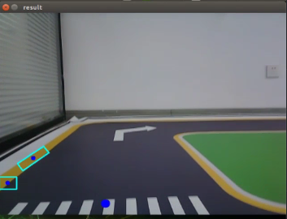

#### 7.4.2.5 Program Analysis

Refer to the [7.4.7.5 Program Analysis](#anther7.4.7.5) section for details.


### 7.4.3 Traffic Sign Detection

This lesson focuses on recognizing traffic signs through programmed commands.

#### 7.4.3.1 Preparation

1) Before starting, lay out the map on a flat surface, ensuring it is smooth with no wrinkles and that the road is free of obstacles.

2) The traffic sign model in this section is a YOLOv5 trained model. For more details on YOLOv5, please refer to the [7.2 Machine Learning Application](#anther7.2) section.

3) When performing this feature, make sure the environment is well-lit, but avoid direct light hitting the camera to prevent misrecognition.

#### 7.4.3.2 Working Principle

First, capture the real-time video from the camera and perform image processing operations such as erosion and dilation.

Next, use YOLOv5 to run the model and compare the processed image with the target objects.

Finally, based on the comparison results, execute the corresponding traffic sign actions.

#### 7.4.3.3 Operation Steps

> [!NOTE]
> 
> * **The following steps only enable traffic sign detection in the camera feed and will not trigger the corresponding robot actions. To directly experience the autonomous driving feature, skip this lesson and refer to section [7.4.7 Comprehensive Application of Autonomous Driving](#anther7.4.7) in this document.**
> 
> * **The input command should be case sensitive, and the keywords can be complemented by the Tab key.**

1. Power on the robot and connect it via the NoMachine remote control software.

2. Click the terminal icon  in the system desktop to open a command-line window.

3. Enter the following command and press **Enter** to stop the app service:

```bash
sudo systemctl stop start_app_node.service
```

4. Enter the following command to navigate to the directory where the program is located.

```
roscd example/scripts/yolov5_detect/
```

5. Enter the following command to start the feature.

```bash
python3 yolov5_trt.py
```

6. To exit the feature, press **Ctrl+C** in the terminal. If the program does not close successfully, try pressing **Ctrl+C** again.

7. After the feature is closed, the app service can be activated either by using a command or by restarting the robot.

If the app service is not enabled, related features in the app will not function properly. If the robot is rebooted, the app service will start automatically. Enter the command to restart the app service and wait for a beep from the buzzer, indicating that the service has started.

```bash
sudo systemctl restart start_app_node.service
```

#### 7.4.3.4 Function Outcome

> [!NOTE]
> 
> **After placing the robot on the map, adjust the camera angle so that it points downward as much as possible while ensuring that no part of the robot’s body appears in the camera feed.**

After launching the feature, place the robot on the map’s road. When the robot detects a traffic sign, it will highlight the detected sign and display the label with the highest confidence based on the trained model.

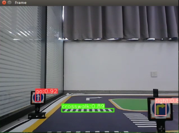

<p id ="anther7.4.3.5"></p>
#### 7.4.3.5 Program Analysis

1\. Colors Class

```python
class Colors:
    # Ultralytics color palette https://ultralytics.com/
    def __init__(self):
        # hex = matplotlib.colors.TABLEAU_COLORS.values()
        hex = ('FF3838', 'FF9D97', 'FF701F', 'FFB21D', 'CFD231', '48F90A', '92CC17', '3DDB86', '1A9334', '00D4BB',
               '2C99A8', '00C2FF', '344593', '6473FF', '0018EC', '8438FF', '520085', 'CB38FF', 'FF95C8', 'FF37C7')
        self.palette = [self.hex2rgb('#' + c) for c in hex]
        self.n = len(self.palette)

    def __call__(self, i, bgr=False):
        c = self.palette[int(i) % self.n]
        return (c[2], c[1], c[0]) if bgr else c

    @staticmethod
    def hex2rgb(h):  # rgb order (PIL)
        return tuple(int(h[1 + i:1 + i + 2], 16) for i in (0, 2, 4))
```

Provides a YOLOv5-style color palette for rendering bounding boxes and labels.

2\. `plot_one_box` Function

```python
def plot_one_box(x, img, color=None, label=None, line_thickness=None):
    tl = (
        line_thickness or round(0.002 * (img.shape[0] + img.shape[1]) / 2) + 1
    )  # line/font thickness
    color = color or [random.randint(0, 255) for _ in range(3)]
    c1, c2 = (int(x[0]), int(x[1])), (int(x[2]), int(x[3]))
    cv2.rectangle(img, c1, c2, color, thickness=tl, lineType=cv2.LINE_AA)
    if label:
        tf = max(tl - 1, 1)  # font thickness
        t_size = cv2.getTextSize(label, 0, fontScale=tl / 3, thickness=tf)[0]
        c2 = c1[0] + t_size[0], c1[1] - t_size[1] - 3
        cv2.rectangle(img, c1, c2, color, -1, cv2.LINE_AA)  # filled
        cv2.putText(
            img,
            label,
            (c1[0], c1[1] - 2),
            0,
            tl / 3,
            [225, 255, 255],
            thickness=tf,
            lineType=cv2.LINE_AA,
        )
```

Draws detection bounding boxes and labels, including class names and confidence scores, on the image.

3\. Class Initialization

```python
def __init__(self, engine_file_path, plugin, classes, conf_thresh=0.8, iou_threshold=0.4):
    self.CONF_THRESH = conf_thresh
    self.IOU_THRESHOLD = iou_threshold

    PLUGIN_LIBRARY = plugin
    self.engine_file_path = engine_file_path

    # load labels
    self.categories = classes

    ctypes.CDLL(PLUGIN_LIBRARY)

    # Create a Context on this device,
    self.ctx = cuda.Device(0).make_context()
    stream = cuda.Stream()
    TRT_LOGGER = trt.Logger(trt.Logger.INFO)
    runtime = trt.Runtime(TRT_LOGGER)

    # Deserialize the engine from file
    with open(self.engine_file_path, "rb") as f:
        engine = runtime.deserialize_cuda_engine(f.read())
    context = engine.create_execution_context()

    host_inputs = []
    cuda_inputs = []
    host_outputs = []
    cuda_outputs = []
    bindings = []

    for binding in engine:
        print('bingding:', binding, engine.get_binding_shape(binding))
        size = trt.volume(engine.get_binding_shape(binding)) * engine.max_batch_size
        dtype = trt.nptype(engine.get_binding_dtype(binding))
        # Allocate host and device buffers
        host_mem = cuda.pagelocked_empty(size, dtype)
        cuda_mem = cuda.mem_alloc(host_mem.nbytes)
        # Append the device buffer to device bindings.
        bindings.append(int(cuda_mem))
        # Append to the appropriate list.
        if engine.binding_is_input(binding):
            self.input_w = engine.get_binding_shape(binding)[-1]
            self.input_h = engine.get_binding_shape(binding)[-2]
            host_inputs.append(host_mem)
            cuda_inputs.append(cuda_mem)
        else:
            host_outputs.append(host_mem)
            cuda_outputs.append(cuda_mem)

    # Store
    self.stream = stream
    self.context = context
    self.engine = engine
    self.host_inputs = host_inputs
    self.cuda_inputs = cuda_inputs
    self.host_outputs = host_outputs
    self.cuda_outputs = cuda_outputs
    self.bindings = bindings
    self.batch_size = engine.max_batch_size
```

Initializes the TensorRT engine, GPU context, and input/output buffers, and configures detection parameters.

4\. `infer` Method

```python
def infer(self, raw_image_generator):
    # Make self the active context, pushing it on top of the context stack.
    self.ctx.push()
    # Restore
    stream = self.stream
    context = self.context
    engine = self.engine
    host_inputs = self.host_inputs
    cuda_inputs = self.cuda_inputs
    host_outputs = self.host_outputs
    cuda_outputs = self.cuda_outputs
    bindings = self.bindings
    # Do image preprocess
    batch_image_raw = []
    batch_origin_h = []
    batch_origin_w = []
    batch_input_image = np.empty(shape=[self.batch_size, 3, self.input_h, self.input_w])

    input_image, image_raw, origin_h, origin_w = self.preprocess_image(raw_image_generator)
    batch_image_raw.append(image_raw)
    batch_origin_h.append(origin_h)
    batch_origin_w.append(origin_w)
    np.copyto(batch_input_image[0], input_image)

    batch_input_image = np.ascontiguousarray(batch_input_image)

    # Copy input image to host buffer
    np.copyto(host_inputs[0], batch_input_image.ravel())
    start = time.time()
    # Transfer input data  to the GPU.
    cuda.memcpy_htod_async(cuda_inputs[0], host_inputs[0], stream)
    # Run inference.
    context.execute_async(batch_size=self.batch_size, bindings=bindings, stream_handle=stream.handle)
    # Transfer predictions back from the GPU.
    cuda.memcpy_dtoh_async(host_outputs[0], cuda_outputs[0], stream)
    # Synchronize the stream
    stream.synchronize()
    end = time.time()
    # Remove any context from the top of the context stack, deactivating it.
    self.ctx.pop()
    # Here we use the first row of output in that batch_size = 1
    output = host_outputs[0]
    # Do postprocess
    boxes = []
    scores = []
    classid = []
    for i in range(self.batch_size):
        result_boxes, result_scores, result_classid = self.post_process(
            output[i * LEN_ALL_RESULT: (i + 1) * LEN_ALL_RESULT], batch_origin_h[i], batch_origin_w[i]
        )
        # Draw rectangles and labels on the original image
        for j in range(len(result_boxes)):
            boxes.extend([result_boxes[j]])
            scores.append(result_scores[j])
            classid.append(int(result_classid[j]))
    #print(int(1/(end - start)))
    return boxes, scores, classid 
```

Runs the complete object detection pipeline, taking a raw image as input and outputting bounding boxes, confidence scores, and class IDs.

5\. `preprocess_image` Method

```python
def preprocess_image(self, raw_bgr_image):
    image_raw = raw_bgr_image
    h, w, c = image_raw.shape
    image = cv2.cvtColor(image_raw, cv2.COLOR_BGR2RGB)
    # Calculate widht and height and paddings
    r_w = self.input_w / w
    r_h = self.input_h / h
    if r_h > r_w:
        tw = self.input_w
        th = int(r_w * h)
        tx1 = tx2 = 0
        ty1 = int((self.input_h - th) / 2)
        ty2 = self.input_h - th - ty1
    else:
        tw = int(r_h * w)
        th = self.input_h
        tx1 = int((self.input_w - tw) / 2)
        tx2 = self.input_w - tw - tx1
        ty1 = ty2 = 0
    # Resize the image with long side while maintaining ratio
    image = cv2.resize(image, (tw, th))
    # Pad the short side with (128,128,128)
    image = cv2.copyMakeBorder(
        image, ty1, ty2, tx1, tx2, cv2.BORDER_CONSTANT, None, (128, 128, 128)
    )
    image = image.astype(np.float32)
    # Normalize to [0,1]
    image /= 255.0
    # HWC to CHW format:
    image = np.transpose(image, [2, 0, 1])
    # CHW to NCHW format
    image = np.expand_dims(image, axis=0)
    # Convert the image to row-major order, also known as "C order":
    image = np.ascontiguousarray(image)
    return image, image_raw, h, w
```

Converts the original BGR image in OpenCV format into the input format required by the model.

6\. `xywh2xyxy` Method

```python
def xywh2xyxy(self, origin_h, origin_w, x):
    y = np.zeros_like(x)
    r_w = self.input_w / origin_w
    r_h = self.input_h / origin_h
    if r_h > r_w:
        y[:, 0] = x[:, 0] - x[:, 2] / 2
        y[:, 2] = x[:, 0] + x[:, 2] / 2
        y[:, 1] = x[:, 1] - x[:, 3] / 2 - (self.input_h - r_w * origin_h) / 2
        y[:, 3] = x[:, 1] + x[:, 3] / 2 - (self.input_h - r_w * origin_h) / 2
        y /= r_w
    else:
        y[:, 0] = x[:, 0] - x[:, 2] / 2 - (self.input_w - r_h * origin_w) / 2
        y[:, 2] = x[:, 0] + x[:, 2] / 2 - (self.input_w - r_h * origin_w) / 2
        y[:, 1] = x[:, 1] - x[:, 3] / 2
        y[:, 3] = x[:, 1] + x[:, 3] / 2
        y /= r_h

    return y
```

Converts YOLOv5 output from center-based coordinates with width and height (xywh) to corner-based coordinates (xyxy) for bounding box rendering and further processing.

7\. `post_process` Method

```python
def post_process(self, output, origin_h, origin_w):
    """
    description: postprocess the prediction
    param:
        output:     A numpy likes [num_boxes,cx,cy,w,h,conf,cls_id, cx,cy,w,h,conf,cls_id, ...] 
        origin_h:   height of original image
        origin_w:   width of original image
    return:
        result_boxes: finally boxes, a boxes numpy, each row is a box [x1, y1, x2, y2]
        result_scores: finally scores, a numpy, each element is the score correspoing to box
        result_classid: finally classid, a numpy, each element is the classid correspoing to box
    """
    # Get the num of boxes detected
    num = int(output[0])
    # Reshape to a two dimentional ndarray
    pred = np.reshape(output[1:], (-1, LEN_ONE_RESULT))[:num, :]
    pred = pred[:, :6]
    # Do nms
    boxes = self.non_max_suppression(pred, origin_h, origin_w, conf_thres=self.CONF_THRESH, nms_thres=self.IOU_THRESHOLD)
    result_boxes = boxes[:, :4] if len(boxes) else np.array([])
    result_scores = boxes[:, 4] if len(boxes) else np.array([])
    result_classid = boxes[:, 5] if len(boxes) else np.array([])
    return result_boxes, result_scores, result_classid
```

Parses the raw TensorRT output and generates final detection results, including bounding boxes, confidence scores, and class IDs.


### 7.4.4 Traffic Light Recognition

This feature allows the robot to recognize traffic lights through command execution using the camera.

#### 7.4.4.1 Preparation

1) Before starting, lay out the map on a flat surface, ensuring it is smooth with no wrinkles and that the road is free of obstacles. For detailed instructions on map setup, refer to [7.4.1 Autonomous Driving Debugging](#anther7.4.1).

2) When performing this feature, make sure the environment is well-lit, but avoid direct light hitting the camera to prevent misrecognition.

3) Adjust the color thresholds in advance to correctly detect the red and green, preventing misdetection during the lesson. For guidance on setting color thresholds, refer to Section [6.1 Color Threshold Adjustment](https://wiki.hiwonder.com/projects/ROSOrin/en/jetson-nano/docs/6_ROS1_ROS%2BOpenCV_Course.html#color-threshold-adjustment) in the 6. ROS+OpenCV Course.

#### 7.4.4.2 Project Process

Traffic light recognition mainly consists of two stages: image acquisition and image processing.

First, real-time images are captured using the camera.

Next comes image processing, which includes color detection, color space conversion of the detected regions, morphological operations such as erosion and dilation, and binarization.

Finally, the processed regions are enclosed with bounding boxes to complete traffic light recognition.

#### 7.4.4.3 Operation Steps

> [!NOTE]
> 
> * **The following steps only enable traffic light detection in the camera feed and will not trigger the corresponding robot actions. To directly experience the autonomous driving feature, skip this lesson and refer to section [7.4.7 Comprehensive Application of Autonomous Driving](#anther7.4.7) in this document.**
> 
> * **The input command should be case sensitive, and the keywords can be complemented by the Tab key.**

1. Power on the robot and connect it via the NoMachine remote control software.

2. Click the terminal icon  in the system desktop to open a command-line window.

3. Enter the following command and press **Enter** to stop the app service:

```bash
sudo systemctl stop start_app_node.service
```

4. Enter the following command to navigate to the directory where the program is located.

```
roscd example/scripts/yolov5_detect/
```

5. Enter the following command to start the feature.

```bash
python3 yolov5_trt.py
```

6. To exit the feature, press **Ctrl+C** in the terminal. If the program does not close successfully, try pressing **Ctrl+C** again.

7. After the feature is closed, the app service can be activated either by using a command or by restarting the robot.

If the app service is not enabled, related features in the app will not function properly. If the robot is rebooted, the app service will start automatically. Enter the command to restart the app service and wait for a beep from the buzzer, indicating that the service has started.

```bash
sudo systemctl restart start_app_node.service
```

#### 7.4.4.4 Function Outcome

> [!NOTE]
> 
> **After placing the robot on the map, adjust the camera angle so that it points downward as much as possible while ensuring that no part of the robot’s body appears in the camera feed.**

Once the feature is started, place the robot on the map’s road. When the robot detects a traffic light, it will identify the light’s color and highlight red and green signals accordingly.

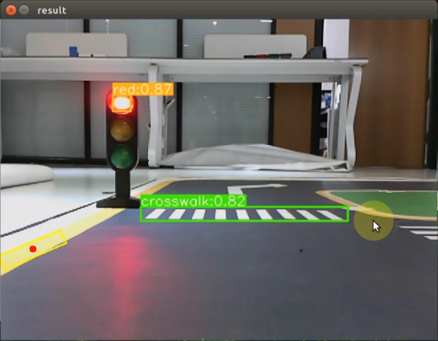

#### 7.4.4.5 Program Analysis

Refer to the [7.4.3.5 Program Analysis](#anther7.4.3.5) section for details.


### 7.4.5 Turing Decision Making

#### 7.4.5.1 Preparation

1) Before starting, lay out the map on a flat surface, ensuring it is smooth with no wrinkles and that the road is free of obstacles. For detailed instructions on map setup, refer to [7.4.1 Autonomous Driving Debugging](#anther7.4.1).

2) The traffic sign model in this section is a YOLOv5 trained model. For more details on YOLOv5, please refer to the [7.2 Machine Learning Application](#anther7.2) section.

3) When performing this feature, make sure the environment is well-lit, but avoid direct light hitting the camera to prevent misrecognition.

#### 7.4.5.2 Working Principle

First, capture the real-time video from the camera and perform image processing operations such as erosion and dilation.

Next, use YOLOv5 to run the model and compare the processed image with the target objects.

Finally, based on the comparison results, the robot identifies the turn sign and proceeds in the indicated direction.

#### 7.4.5.3 Operation Steps

> [!NOTE]
> 
> * **The following steps only enable turning sign detection in the camera feed and will not trigger the corresponding robot actions. To directly experience the autonomous driving feature, skip this lesson and refer to section [7.4.7 Comprehensive Application of Autonomous Driving](#anther7.4.7) in this document.**
> 
> * **The input command should be case sensitive, and the keywords can be complemented by the Tab key.**

1. Power on the robot and connect it via the NoMachine remote control software.

2. Click the terminal icon  in the system desktop to open a command-line window.

3. Enter the following command and press **Enter** to stop the app service:

```bash
sudo systemctl stop start_app_node.service
```

4. Enter the following command to navigate to the directory where the program is located.

```
roscd example/scripts/yolov5_detect/
```

5. Enter the following command to start the feature.

```bash
python3 yolov5_trt.py
```

6. To exit the feature, press **Ctrl+C** in the terminal. If the program does not close successfully, try pressing **Ctrl+C** again.

7. After the feature is closed, the app service can be activated either by using a command or by restarting the robot.

If the app service is not enabled, related features in the app will not function properly. If the robot is rebooted, the app service will start automatically. Enter the command to restart the app service and wait for a beep from the buzzer, indicating that the service has started.

```bash
sudo systemctl restart start_app_node.service
```

#### 7.4.5.4 Function Outcome

> [!NOTE]
> 
> **After placing the robot on the map, adjust the camera angle to ensure that no part of the robot's body is visible in the video feed. If the robot itself appears in the feed, it may interfere with the proper functioning of the feature.**

After starting the feature, place the robot on the map road. When the robot approaches a turn sign, it will adjust its direction of travel according to the sign’s instruction.

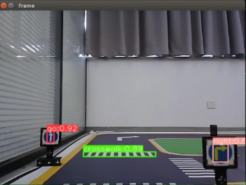

#### 7.4.5.5 Program Analysis

Refer to the [7.4.3.5 Program Analysis](#anther7.4.3.5) section for details.


### 7.4.6 Autonomous Parking

#### 7.4.6.1 Preparation

1) Before starting, lay out the map on a flat surface, ensuring it is smooth with no wrinkles and that the road is free of obstacles. For detailed instructions on map setup, refer to [7.4.1 Autonomous Driving Debugging](#anther7.4.1).

2) The traffic sign model in this section is a YOLOv5 trained model. For more details on YOLOv5, please refer to the [7.2 Machine Learning Application](#anther7.2) section.

3) When performing this feature, make sure the environment is well-lit, but avoid direct light hitting the camera to prevent misrecognition.

#### 7.4.6.2 Project Process

First, capture the real-time video from the camera and perform image processing operations such as erosion and dilation.

Next, use YOLOv5 to run the model and compare the processed image with the target objects.

Finally, based on the comparison results, the robot recognizes the parking sign and automatically parks in the designated spot.

#### 7.4.6.3 Operation Steps

> [!NOTE]
> 
> * **The following steps only enable traffic sign detection in the camera feed and will not trigger the corresponding robot actions. To directly experience the autonomous driving feature, skip this lesson and refer to section [7.4.7 Comprehensive Application of Autonomous Driving](#anther7.4.7) in this document.**
> 
> * **The input command should be case sensitive, and the keywords can be complemented by the Tab key.**

1. Power on the robot and connect it via the NoMachine remote control software.

2. Click the terminal icon  in the system desktop to open a command-line window.

3. Enter the following command and press **Enter** to stop the app service:

```bash
sudo systemctl stop start_app_node.service
```

4. Enter the following command to navigate to the directory where the program is located.

```bash
roscd example/scripts/yolov5_detect/
```

5. Enter the following command to start the feature.

```bash
python3 yolov5_trt.py
```

6. To exit the feature, press **Ctrl+C** in the terminal. If the program does not close successfully, try pressing **Ctrl+C** again.

7. After the feature is closed, the app service can be activated either by using a command or by restarting the robot.

If the app service is not enabled, related features in the app will not function properly. If the robot is rebooted, the app service will start automatically. Enter the command to restart the app service and wait for a beep from the buzzer, indicating that the service has started.

```
sudo systemctl restart start_app_node.service
```

#### 7.4.6.4 Function Outcome

> [!NOTE]
> 
> **After placing the robot on the map, adjust the camera angle to ensure that no part of the robot's body is visible in the video feed. If the robot itself appears in the feed, it may interfere with the proper functioning of the feature.**

After starting the feature, place the robot on the roadway of the map. When the robot reaches the parking sign, it will follow the sign’s instructions and automatically park in the designated spot.

#### 7.4.6.5 Program Analysis

Refer to the [7.4.3.5 Program Analysis](#anther7.4.3.5) section for details.

<p id ="anther7.4.7"></p>
### 7.4.7 Comprehensive Application of Autonomous Driving

This section demonstrates the comprehensive autonomous driving functionality of the robot through commands. It integrates multiple features, including lane keeping, traffic sign detection, traffic light recognition, turning decision making, and autonomous parking.

#### 7.4.7.1 Preparation

* **Map Preparation**

The map should be laid on a flat surface, ensuring it is smooth without wrinkles, and that the road is clear of any obstacles. All road signs and traffic lights must be placed at the designated positions on the map, facing clockwise along the route. The positions of the road signs and the starting point are shown in the figure below.


* **Color Threshold Setting**

Since lighting conditions affect color recognition differently, color thresholds should be adjusted before starting. Follow the steps in [6.1 Color Threshold Adjustment](https://wiki.hiwonder.com/projects/ROSOrin/en/jetson-nano/docs/6_ROS1_ROS%2BOpenCV_Course.html#color-threshold-adjustment) to tune the thresholds for black, white, red, green, blue, and yellow..

If the robot encounters inaccurate recognition during its movement, the color threshold should be adjusted in areas of the map where recognition fails.

#### 7.4.7.2 Project Process

First, load the YOLOv5-trained model file along with the required libraries, and obtain the real-time video feed from the camera. The input image is pre-processed using erosion, dilation, and other operations.

Next, detect the target color line in the image, and extract key information such as the size and center point of the detected region. Then, apply the YOLOv5 model to compare the processed image with the target dataset.

Finally, calculate the offset of the target center point, and adjust the robot’s heading accordingly to keep it aligned in the middle of the road. During navigation, the robot also executes specific actions based on the detected traffic signs.

#### 7.4.7.3 Operation Steps

> [!NOTE]
> 
> **The input command should be case sensitive, and the keywords can be complemented by the Tab key.**

1. Place the robot at the starting point on the map and move it clockwise following the map markers.

2. Power on the robot and connect it via the NoMachine remote control software.

3. Click the terminal icon  in the system desktop to open a command-line window.

4. Enter the following command and press **Enter** to stop the app service:

```bash
sudo systemctl stop start_app_node.service
```

5. Entering the following command to enable the autonomous driving service.

```
roslaunch example self_driving.launch
```

Wait for the service to start. When the information shown in the figure below appears, the startup is complete.

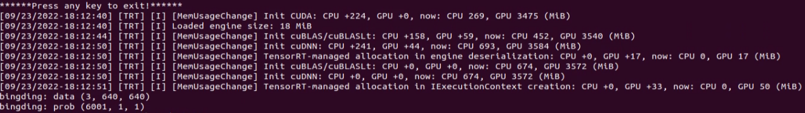

6. Open a new terminal and enter the command to launch the detection view.

```
rqt_image_view
```

Select **/yolov5/object_image** as highlighted below to open the live video feed.

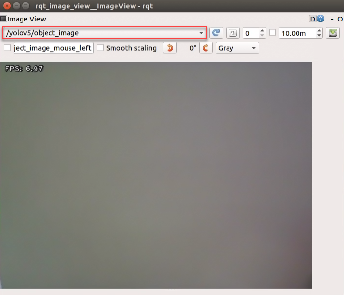

7) Check the feed to ensure the robot body does not appear in the camera view.

8) After the feature is closed, the app service can be activated either by using a command or by restarting the robot.

If the app service is not enabled, related features in the app will not function properly. If the robot is rebooted, the app service will start automatically. Enter the command to restart the app service and wait for a beep from the buzzer, indicating that the service has started.

```
sudo systemctl restart start_app_node.service
```

#### 7.4.7.4 Function Outcome

- **Lane Keeping**

After the program is started, the robot follows the yellow line at the edge of the road. Depending on whether the yellow line is straight or curved, it will move forward or turn accordingly to stay within the lane.

- **Traffic Light Recognition**

When encountering a traffic light, the robot will stop if the light is red and move forward if the light is green. When crossing a crosswalk, the robot will automatically reduce its speed and proceed slowly.

- **Turn Signs and Parking Signs**

While moving forward, if the robot detects a traffic sign, it will take the corresponding action. If a right-turn sign is detected, the robot will turn right and continue moving forward. If a parking sign is detected, the robot will perform parallel parking.

Following these rules, the robot continuously navigates around the map in a loop.

<p id ="anther7.4.7.5"></p>
#### 7.4.7.5 Program Analysis

1\. Class Initialization

```python
def __init__(self, name):
    rospy.init_node(name, anonymous=True)
    self.name = name

    self.running = True
    self.pid = pid.PID(0.01, 0.0, 0.0)
    self.param_init() 
    self.classes = ['go', 'right', 'park', 'red', 'green', 'crosswalk']

    self.lock = threading.RLock()
    self.image_queue = queue.Queue(maxsize=1)
    signal.signal(signal.SIGINT, self.shutdown)
    self.machine_type = os.environ.get('MACHINE_TYPE')
    self.lane_detect = lane_detect.LaneDetector("yellow")
    self.mecanum_pub = rospy.Publisher('/controller/cmd_vel', geo_msg.Twist, queue_size=1)  # Chassis control
    self.result_publisher = rospy.Publisher(self.name + '/image_result', Image, queue_size=1)  # Publish image processing results

    self.result_publisher = rospy.Publisher('~image_result', Image, queue_size=1)
    self.enter_srv = rospy.Service('~enter', Trigger, self.enter_srv_callback)
    self.exit_srv = rospy.Service('~exit', Trigger, self.exit_srv_callback)
    self.set_running_srv = rospy.Service('~set_running', SetBool, self.set_running_srv_callback)
    self.heart = Heart(self.name + '/heartbeat', 5, lambda _: self.exit_srv_callback(None))

    if not rospy.get_param('~only_line_follow', False):
        while not rospy.is_shutdown():
            try:
                if rospy.get_param('/yolov5/init_finish'):
                    break
            except:
                time.sleep(0.1)
        rospy.ServiceProxy('/yolov5/start', Trigger)()
    rospy.sleep(0.2)
    self.mecanum_pub.publish(geo_msg.Twist())

    self.dispaly = False
    if rospy.get_param('~start', True):
        self.dispaly = True
        self.enter_srv_callback(None)
        self.set_running_srv_callback(SetBoolRequest(data=True))
    self.image_proc()
```

Initialize the ROS node. Set up the PID controller for lane-following angle correction, and initialize the lane detector with yellow lane lines specified. Load parameters such as `only_line_follow`. Initialize runtime variables including driving state, flags, and speed parameters. Create services for starting, stopping, and controlling the running state, implemented through the `enter`, `exit`, and `set_running` services, along with heartbeat monitoring. If not running in lane-follow-only mode, wait for the YOLOv5 node to be ready and start object detection. Launch the main image-processing loop ` image_proc()`.

2\. Parameter Initialization

```python
def param_init(self):
    self.image = None
    self.start = False
    self.enter = False

    self.have_turn_right = False
    self.detect_turn_right = False
    self.detect_far_lane = False
    self.park_x = -1  # X pixel coordinate of the parking sign

    self.start_turn_time_stamp = 0
    self.count_turn = 0
    self.start_turn = False  # Turn initiation flag

    self.count_right = 0
    self.count_right_miss = 0
    self.turn_right = False  # Right-turn sign

    self.last_park_detect = False
    self.count_park = 0
    self.stop = False  # Stop sign
    self.start_park = False  # Parking process initiated

    self.count_crosswalk = 0
    self.crosswalk_distance = 0  # Distance to crosswalk
    self.crosswalk_length = 0.1 + 0.3  # Crosswalk length + robot length

    self.start_slow_down = False  # Slow-down flag
    self.normal_speed = 0.15  # Normal driving speed
    self.slow_down_speed = 0.1  # Reduced speed when slowing down

    self.traffic_signs_status = None  # Traffic light state record
    self.red_loss_count = 0

    self.object_sub = None
    self.image_sub = None
    self.objects_info = []
```

Initialize or reset all core runtime parameters to prevent residual state from previous runs.

3\. Image Callback

```python
def image_callback(self, ros_image):  # Target detection callback
    bgr_image = np.ndarray(shape=(ros_image.height, ros_image.width, 3), dtype=np.uint8, buffer=ros_image.data)  # Convert custom ROS image message to OpenCV image
    if not self.image_queue.empty():
        try:
            self.image_queue.get_nowait()
        except queue.Empty:
            pass
    try:
        self.image_queue.put_nowait(bgr_image)
    except queue.Full:
        pass
```

Convert incoming ROS image messages to OpenCV format and cache them for subsequent processing.

4\. Service Callbacks

```python
def enter_srv_callback(self, _):
    rospy.loginfo("self driving enter")
    with self.lock:
        self.start = False
        depth_camera = rospy.get_param('/depth_camera/camera_name', 'depth_cam')
        self.image_sub = rospy.Subscriber('/%s/rgb/image_raw' % depth_camera, Image, self.image_callback)  # Subscribe  to the camera topic
        self.object_sub = rospy.Subscriber('/yolov5/object_detect', ObjectsInfo, self.get_object_callback)
        self.mecanum_pub.publish(geo_msg.Twist())
        self.enter = True
    return TriggerResponse(success=True)

def exit_srv_callback(self, _):
    rospy.loginfo("self driving exit")
    with self.lock:
        try:
            if self.image_sub is not None:
                self.image_sub.unregister()
            if self.object_sub is not None:
                self.object_sub.unregister()
        except Exception as e:
            rospy.logerr(str(e))
        self.mecanum_pub.publish(geo_msg.Twist())
    self.param_init()
    self.lane_detect.set_roi(((450, 480, 0, 320, 0.7), (390, 420, 0, 320, 0.2), (330, 360, 0, 320, 0.1)))
    return TriggerResponse(success=True)

def set_running_srv_callback(self, req: SetBoolRequest):
    rospy.loginfo("set_running")
    with self.lock:
        self.start = req.data
        if not self.start:
            self.mecanum_pub.publish(geo_msg.Twist())
    return SetBoolResponse(success=req.data)
```

`enter_srv_callback`: Responds to the ` ~enter` service and starts autonomous driving by subscribing to image and detection topics.

`exit_srv_callback`: Responds to the `~exit` service and stops autonomous driving by releasing subscriptions and resources.

`set_running_srv_callback`: Responds to the `~set_running` service to control run and pause states.

5\. Parking

```python
def park_action(self):
    if self.machine_type == 'ROSOrin_Mecanum':
        twist = geo_msg.Twist()
        twist.linear.y = -0.2
        self.mecanum_pub.publish(twist)
        time.sleep(0.46/0.2)
    else:
        twist = geo_msg.Twist()
        twist.linear.x = 0.15
        twist.angular.z = twist.linear.x*math.tan(-0.55)/0.17706
        self.mecanum_pub.publish(twist)
        time.sleep(3)

        twist = geo_msg.Twist()
        twist.linear.x = 0.1
        twist.angular.z = twist.linear.x*math.tan(0.4)/0.17706
        self.mecanum_pub.publish(twist)
        time.sleep(4)

        twist = geo_msg.Twist()
        twist.linear.x = -0.15
        twist.angular.z = twist.linear.x*math.tan(-0.3)/0.17706
        self.mecanum_pub.publish(twist)
        time.sleep(2.5)

    self.mecanum_pub.publish(geo_msg.Twist())
```

Execute parking actions based on chassis type, supporting both Mecanum-wheel and Ackermann steering chassis.

6\. Detection Callback

```python
def get_object_callback(self, msg):
    self.objects_info = msg.objects
    if self.objects_info == []:  # Reset variables when nothing is detected
        self.traffic_signs_status = None
        self.crosswalk_distance = 0
    else:
        min_distance = 0
        self.last_park_detect = False
        for i in self.objects_info:
            class_name = i.class_name
            center = (int((i.box[0] + i.box[2])/2), int((i.box[1] + i.box[3])/2))

            if class_name == 'crosswalk':  
                cross_flag = True
                if center[1] > min_distance:  # Get the nearest crosswalk Y-axis pixel
                    min_distance = center[1]
            if class_name == 'right':  # Detect right-turn sign
                if not self.turn_right:
                    self.count_right += 1
                    self.count_right_miss = 0
                    if self.count_right >= 1:  # Set right-turn flag true after multiple detections
                        self.have_turn_right = True
                        self.detect_turn_right = True
                        self.count_right = 0
            if class_name == 'park' and not self.turn_right:  # Get park sign center coordinates
                self.park_x = center[0]
            if class_name == 'red' or class_name == 'green':  # Get traffic light status
                self.traffic_signs_status = class_name
            cross_flag = False
        if not self.last_park_detect:
            self.count_park = 0
        self.crosswalk_distance = min_distance
```

Parse detected traffic signs and targets, and update corresponding states.

`crosswalk`: Record the latest Y-axis pixel coordinate to estimate distance.

`right`: The right-turn sign accumulates detection counts, then sets the `detect_turn_right` flag once conditions are met.

`park`: The parking sign records the X-axis pixel coordinate to determine parking position.

`red/green`: Update ` traffic_signs_status`.

Reset traffic light state and crosswalk distance when no targets are detected.

7\. Main Loop

```python
def image_proc(self):
    while self.running:
        if self.enter:
            time_start = time.time()
            image = self.image_queue.get(block=True)
            result_image = image.copy()
            if self.start:
                h, w = image.shape[:2]

                # Get the binarized lane image
                binary_image = self.lane_detect.get_binary(image)
                # cv2.imshow('bin_image', binary_image)
                # If crosswalk detected, start slow-down flag
                if 400 < self.crosswalk_distance and not self.start_slow_down:  # Only start slowing down when close enough
                    self.count_crosswalk += 1
                    if self.count_crosswalk == 3:  # Multiple checks to avoid false detection
                        self.count_crosswalk = 0
                        self.start_slow_down = True  # Slow-down flag
                        self.count_slow_down = time.time()  # Record slow-down start time
                else:  # Needs continuous detection, otherwise reset
                    self.count_crosswalk = 0
```

Image acquisition: Retrieve cached camera images from `image_queue` and create a copy for visualization.

Crosswalk slowdown logic: When a crosswalk is detected within a certain distance, enable slowdown via `start_slow_down=True` and maintain reduced speed for a fixed duration based on crosswalk length and slowdown speed.

Slowdown mode: Set speed to `slow_down_speed=0.1`. Stop when a red light is detected.

Normal mode: Set speed to `normal_speed=0.15`.

Parking logic: When a parking sign is detected and the distance to the crosswalk meets the required condition, a zero-velocity command is published and the parking action thread `park_action()` is started.

Right turn handling: Adjust the ROI region and draw virtual lane lines to guide turning and prevent lane loss.

After parking or right turn: Add virtual lane lines to maintain straight driving when physical lane lines are missing.

Straight driving: Use the PID controller to correct the deviation between the detected `lane_x` and the target value of 80 and output the angular control `twist.angular.z` to keep the vehicle centered.

Turning: When a lane offset is detected, output a fixed turning angle of −0.65 or a value calculated using the Ackermann model, then resume PID control after the turn stabilizes.

Visualization and publishing: Draw lane lines and detection bounding boxes if enabled, and publish the processed image via `~image_result`.

Frame rate control: Maintain a loop period of approximately 30 ms to ensure stable processing speed.