# 8\. ROS1-Gazebo Simulation

[TOC]


## 8.1 Getting Started with URDF Model

<p id ="anther8.1.1"></p>
### 8.1.1 Introduction and Getting Started with URDF Model

* **URDF Model Introduction**

`URDF` is a format based on the `XML` specification, designed for describing the structure of robots. Its purpose is to provide a robot description standard that is as general and widely applicable as possible.

Robots are typically composed of multiple links and joints. A link is defined as a rigid object with certain physical properties, while a joint connects two links and constrains their relative motion.

By connecting links with joints and imposing motion restrictions, a kinematic model is formed. The `URDF` file specifies the relationships between joints and links, their inertial properties, geometric characteristics, and collision models.

* **Comparison between Xacro and URDF Model**

The `URDF` model serves as a description file for simple robot models, offering a clear and easily understandable structure. However, when it comes to describing complex robot structures, using `URDF` alone can result in lengthy and unclear descriptions.

To address this limitation, the `Xacro` model extends the capabilities of `URDF` while maintaining its core features. The `Xacro` format provides a more advanced approach to describing robot structures. It greatly improves code reusability and helps avoid excessive description length of `URDF` model.

For instance, when describing the two legs of a humanoid robot, the `URDF` model would require separate descriptions for each leg. On the other hand, the `Xacro` model allows for describing a single leg and reusing that description for the other leg, resulting in a more concise and efficient representation.

* **Install URDF Dependency**

> [!NOTE]
> 
> **The URDF and Xacro models are already installed in the robot and the virtual machine, so there is no need to reinstall them. This section is provided for reference only.**

1. Run the following command and press **Enter** to update the package information:

```bash
sudo apt update
```

2. Run the following command and press **Enter** to install the URDF dependencies:

```
sudo apt-get install ros-melodic-urdf
```

When the output matches the image below, the installation is successful:


3. Run the following command and press **Enter** to install the `Xacro` model extension for `URDF`:

```bash
sudo apt-get install ros-melodic-xacro
```

When the output matches the image below, the installation is successful:

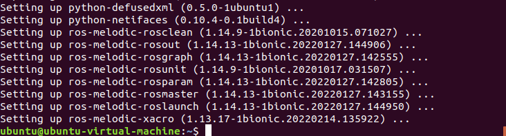

* **URDF Model Basic Syntax**

1. XML Basic Syntax

Since `URDF` models are written based on the `XML` specification, it is necessary to understand the basic structure of the XML format.

(1) An element can be defined as desired using the following formula:

**\<Element>**

**\</Element>**

(2) Attributes are contained within an element and are used to define certain properties and parameters of that element. When defining an element, the following format can be used:

**\<Element attribute_1="value1" attribute_2="value2">**

**\</Element>**

**Comments:**

(3) Comments do not affect other attributes or elements. The following syntax can be used to define a comment:

<**！ \-- Comment content \-->**

2. Link

The Link element describes the visual and physical properties of the robot's rigid component. The following tags are commonly used to define the motion of a link:

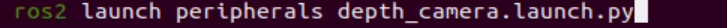

`<visual>`: Describe the appearance of the link, such as size, color, and shape.

`<inertial>`: Describe the inertia parameters of the link, which will be used in the dynamics calculation.

`<collision>`: Defines the collision properties of the link.

Each tag contains its own child elements and serves different purposes. Refer to the table below for details.

<table>
  <tr>
    <th style>Tag</th>
    <th style>Function</th>
  </tr>
  <tr>
    <td>origin</td>
    <td>Describes the pose of the link. xyz defines the link’s position in the simulation map, and rpy defines its orientation in the simulation map.</td>
  </tr>
  <tr>
    <td>mass</td>
    <td>Describes the mass of the link.</td>
  </tr>
  <tr>
    <td>inertia</td>
    <td>Describes the inertia of the link. Due to the symmetry of the inertia matrix, six parameters ixx, ixy, ixz, iyy, iyz, izz must be provided as attributes. These values need to be calculated.</td>
  </tr>
  <tr>
    <td>geometry</td>
    <td>Describes the shape of the link. The mesh parameter loads the texture file, and the filename parameter loads the texture path. It includes three child tags: box, cylinder, sphere, used for rectangular, cylindrical, and spherical shapes.</td>
  </tr>
  <tr>
    <td>material</td>
    <td>Describes the material of the link. The name parameter is required. The color child tag adjusts color and transparency.</td>
  </tr>
</table>

* **Joint**

In a URDF model, a joint is represented by the **joint** tag. It describes the kinematic and dynamic properties of the robot joint, including motion type, as well as position and velocity limits. According to the type of motion, joints in a URDF model can be categorized into six types:

<table>
  <tr>
    <th>Type & Description</th>
    <th>Label</th>
  </tr>
  <tr>
    <td>Rotational joint: can rotate infinitely around a single axis</td>
    <td>continuous</td>
  </tr>
  <tr>
    <td>Rotational joint: similar to continuous, but with rotation angle limits</td>
    <td>revolute</td>
  </tr>
  <tr>
    <td>Prismatic joint: moves along an axis with position limits</td>
    <td>prismatic</td>
  </tr>
  <tr>
    <td>Planar joint: allows translation or rotation in orthogonal plane directions</td>
    <td>planar</td>
  </tr>
  <tr>
    <td>Floating joint: allows both translation and rotation</td>
    <td>floating</td>
  </tr>
  <tr>
    <td>Fixed joint: a special joint that does not allow movement</td>
    <td>fixed</td>
  </tr>
</table>


When defining joint behavior, the following tags are commonly used:

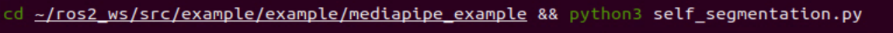

`<parent_link>`: Parent link.

`<child_link>`: Child link.

`<calibration>`: Used to calibrate the joint angle.

`<dynamics>`: Describes certain physical properties of the motion.

`<limit>`: Defines motion constraints.

Each tag contains its own child elements and serves different purposes. Refer to the table below for details.

<table>
  <tr>
    <th>Label</th>
    <th>Function</th>
  </tr>
  <tr>
    <td>origin</td>
    <td>Describes the pose of the parent link. It contains two parameters: xyz specifies the link's position in the simulation map, and rpy specifies the link's orientation in the simulation map.</td>
  </tr>
  <tr>
    <td>axis</td>
    <td>Sets the child link to rotate around any of the XYZ axes relative to the parent link.</td>
  </tr>
  <tr>
    <td>limit</td>
    <td>Restricts the child link. The lower and upper attributes define the rotation range in radians, the effort attribute limits the force during rotation with a positive or negative value, in Newtons or N, and the velocity attribute limits the rotational speed in meters per second or m/s.</td>
  </tr>
  <tr>
    <td>mimic</td>
    <td>Describes the relationship of this joint with other joints.</td>
  </tr>
  <tr>
    <td>safety_controller</td>
    <td>Defines safety control parameters to protect the robot's joint movement.</td>
  </tr>
</table>


4. robot Tag

The top-level tag of a complete robot is \<robot>. All \<link> and \<joint> tags must be included within \<robot>, as shown below:


5. Gazebo Tag

Used with the Gazebo simulator, this tag allows configuration of simulation parameters, including Gazebo plugins and physical property settings.


6. Creating a Simple URDF Model

(1) Set the Robot Model Name

To start writing the URDF model, we need to set the name of the robot following this format: **\<robot name=“robot model name”>**. Lastly, input **\</robot>** at the end to represent that the model is written successfully.

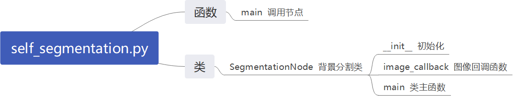

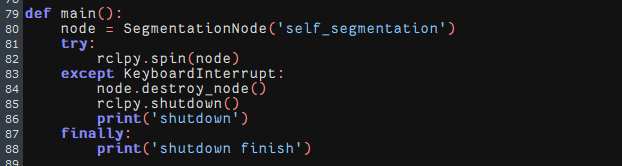

(2) Define Links

① To write the first link and use indentation to indicate that it is part of the currently set model. Set the name of the link using the following format: **\<link name=“Link_Name">**. Finally, conclude with **\</link>** to indicate the successful completion of the link definition.


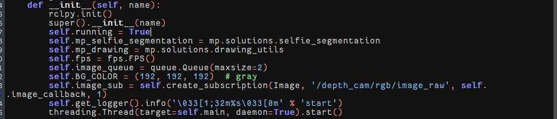

When writing the link description, use indentation to indicate that the description belongs to the current link. Start the description with **\<visual>** and end it with **\</visual>**.

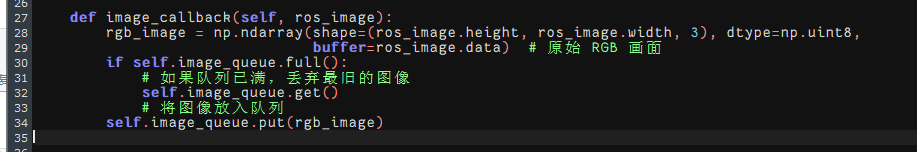

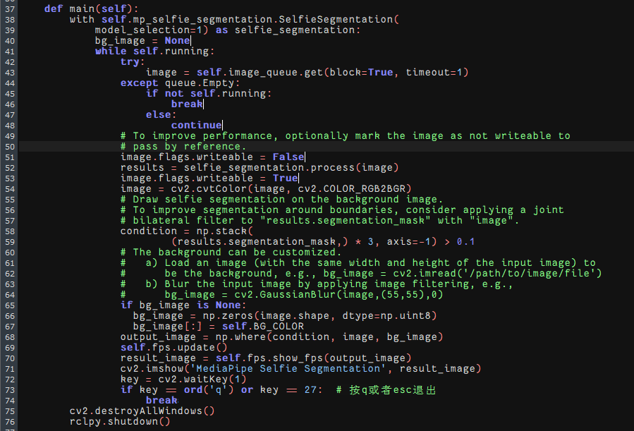

The **\<geometry>** tag is employed to define the shape of a link. Once the description is complete, include **\</geometry>**. Within the tag, indentation is used to specify the detailed description of the link's shape. The code below shows the shape of a link: **\<cylinder&nbsp;length=“0.01”&nbsp;radius=“0.2”/>**. Here, length="0.01" indicates that the link is 0.01 meters long, and radius="0.2" indicates that the link has a radius of 0.2 meters, forming a cylinder.


④ The **\<origin>** tag is utilized to specify the position of a link, with indentation used to indicate the detailed description of the link's position. The following example demonstrates the position of a link: **\<origin rpy="0 0 0" xyz="0 0 0" />**. In this example, "rpy" represents the angles of the link, while "xyz" represents the coordinates of the link's position. This example places the link at the origin of the coordinate system.


⑤ The **\<material>** tag is used to define the visual appearance of a link, with indentation used to specify the detailed description of the link's color. To start describing the color, include **\<material>**, and end with **\</material>** when the description is complete. The following example demonstrates setting a link color to yellow: "\<color rgba="1 1 0 1" />". In this example, "rgba="1 1 0 1"" represents the color threshold for achieving a yellow color.

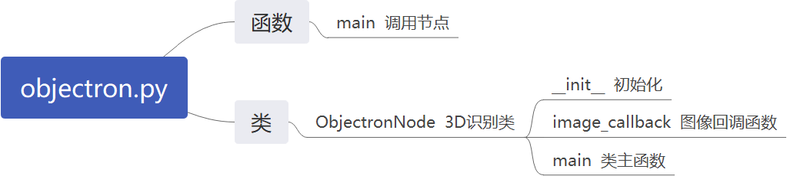

(3) Define Joints

① To define the first joint, use indentation to indicate that the joint belongs to the current model being set. Then, specify the name and type of the joint as follows: **\<joint name="Joint_Name" type="Joint_Type">**. Finally, include **\</joint>** to indicate the completion of the joint definition.

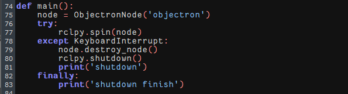

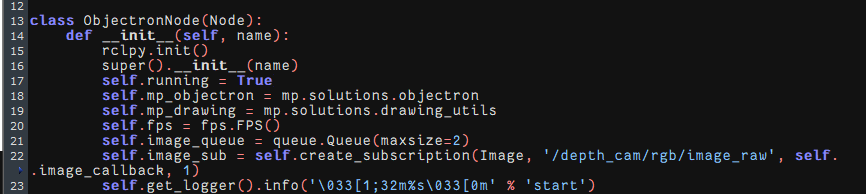

② Define the parent and child links of the joint. Indent the contents to show that this description belongs to the current joint. Set the parent and child parameters as follows: using the following format: **\<parent link="parent link"/>** and **\<child link="child link" />**. When the joint rotates, the parent link serves as the pivot, and the child link rotates relative to it.

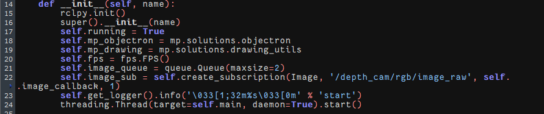

③ **\<origin>** describes the position of the joint, with indentation used to specify the detailed coordinates of the joint. The image below describes the position of the joint: **\<origin xyz=“0 0 0.1” />**. xyz is the coordinate of the joint, indicating that the joint is located at x=0, y=0, z=0.1 in the coordinate system.

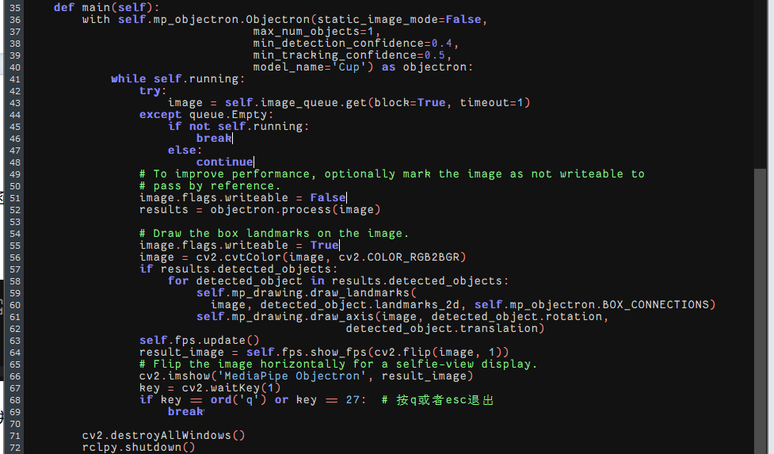

④ **\<axis>** describes the orientation of the joint, with indentation used to specify its precise posture. The figure below shows the posture of a joint **\<axis xyz="0 0 1" />**, where xyz defines the orientation of the joint.


⑤ **\<limit>** is used to restrict joint motion, with indentation applied to specify detailed angle constraints. The code below shows a joint whose maximum torque does not exceed 300 N, with an upper rotation limit of 3.14 radians and a lower limit of -3.14 radians. These limits are defined according to the following formula: effort = joint torque (N), velocity = joint speed, lower = lower bound of the rotation angle (radians), upper = upper bound of the rotation angle (radians).


⑥ **\<dynamics>** describes the joint’s dynamics, with indentation used to define the joint’s dynamic properties. The figure below shows an example of a joint’s dynamics parameters: **\<dynamics damping="50" friction="1" />**  
where damping specifies the **damping value**, and friction specifies the **friction coefficient**.

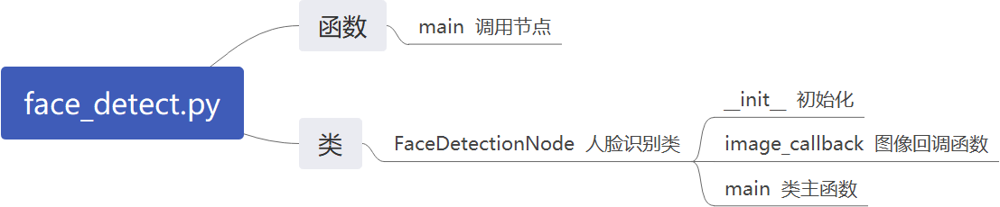

The complete code is as follows:

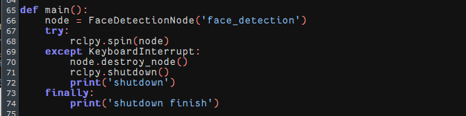

### 8.1.2 ROS Robot URDF Model Description

* **Preparation**

To understand the URDF model, refer to section [8.1.1 Overview and Basics of URDF Models](#anther8.1.1) in this file for related syntax. This section provides a brief analysis of the robot model code and component models.

* **Robot Model File Analysis**

1. Power on the robot and connect it via the NoMachine remote control software.

2. Click the terminal icon 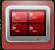 in the system desktop to open a command-line window.

3. Enter the command and press **Enter** to navigate to the program’s startup directory.

```bash
roscd rosorin_description/urdf/
```

4. Enter the following command to open the robot simulation model file.

```bash
vim rosorin.xacro
```

5. Find the code section shown in the image below:

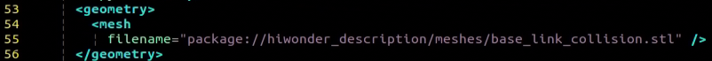


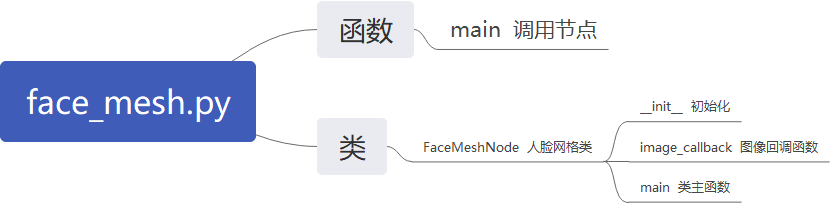

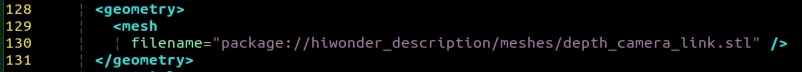

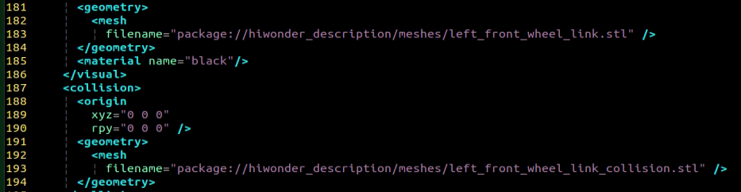

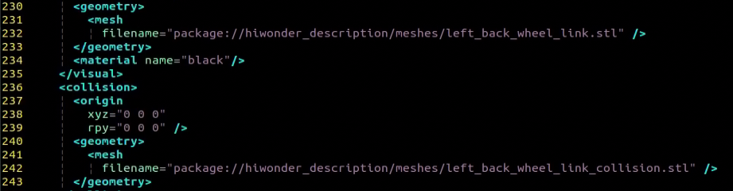

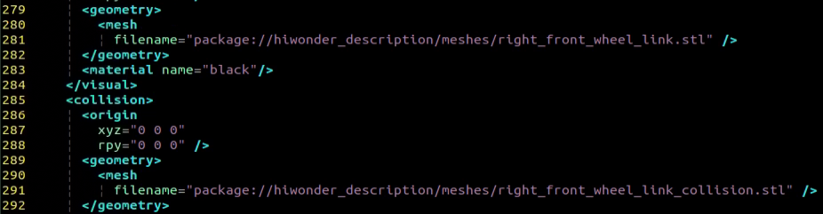

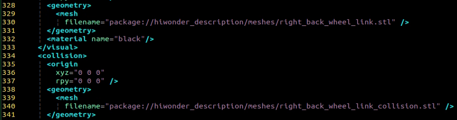


Multiple URDF models are called to form the complete robot.

<table>
  <thead>
    <tr>
      <th>File Name</th>
      <th>Device</th>
    </tr>
  </thead>
  <tbody>
    <tr>
      <td>base_link</td>
      <td>Robot chassis</td>
    </tr>
    <tr>
      <td>base_link_collision</td>
      <td>Chassis inertia matrix</td>
    </tr>
    <tr>
      <td>lidar_link</td>
      <td>MS200 LiDAR</td>
    </tr>
    <tr>
      <td>lidar_link_collision</td>
      <td>MS200 LiDAR with inertia matrix</td>
    </tr>
    <tr>
      <td>depth_camera_link</td>
      <td>Anstrong depth camera</td>
    </tr>
    <tr>
      <td>left_front_wheel_link</td>
      <td>Left front wheel</td>
    </tr>
    <tr>
      <td>left_back_wheel_link</td>
      <td>Left rear wheel</td>
    </tr>
    <tr>
      <td>right_front_wheel_link</td>
      <td>Right front wheel</td>
    </tr>
    <tr>
      <td>right_back_wheel_link</td>
      <td>Right rear wheel</td>
    </tr>
    <tr>
      <td>mic_link</td>
      <td>Microphone</td>
    </tr>
  </tbody>
</table>

ROSOrin mobile robot supports three chassis configurations: Mecanum wheel, Ackermann steering, and differential drive.  This section uses the Mecanum wheel chassis as an example. Most of the main model files are shared across configurations, with differences explained later in this document.

Enter the command to load the robot model file, which contains descriptions of the various components of the model.

```
vim rosorin.xacro
```

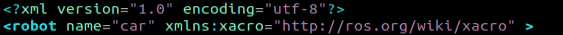

This is the beginning of the URDF file. It specifies the XML version and encoding, and defines a robot model named `car`. The `xmlns:xacro namespace` is used here to enable the use of Xacro macros for generating the URDF.

Within the file, a link definition named “base_footprint” can be found, which represents the robot’s chassis.

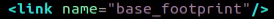

This section describes various properties of the robot, including weight, width, height, and depth.

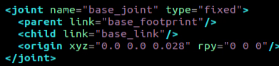

First, the following code defines a joint named **base_joint** with the type **fixed**, indicating that it is a fixed joint. This joint connects a parent link named **base_footprint** and a child link named **base_link**.

The joint position, referred to as `origin`, is specified using an xyz attribute set to 0.0 0.0 0.028.


The code begins with a `<link>` tag, which defines a link in the robot model. The name of this link is **base_link**. Inside the `<link>` tag, there are three components: `<inertial>`, `<visual>`, and `<collision>`.

The `<inertial>` section defines the inertial properties of the link, such as mass and inertia. It contains an `<origin>` tag that specifies the position and orientation of the inertial frame relative to the link frame. The `<mass>` tag defines the mass of the link, while the `<inertia>` tag specifies the inertia matrix of the link around its principal axes.

The `<visual>` section defines the visual representation of the link. It contains the `<origin>` tag, which specifies the position and orientation of the visual frame relative to the link frame. The `<geometry>` tag defines the shape of the visual representation, which in this case is a mesh. The `<mesh>` tag specifies the file name of the mesh used to represent the visual appearance of the link. Finally, the `<material>` tag defines the color or texture of the visual representation.

The `<collision>` section defines the collision properties of the link. It is similar to the `<visual>` section, but it is used for collision detection rather than visualization. This section contains `<origin>` and `<geometry>` tags that specify the position, orientation, and shape of the collision representation.

Overall, this code snippet defines a link in the robot model, including its inertial properties, visual representation, and collision properties. In simulation or visualization environments, the mesh files specified in the `<visual>` and `<collision>` sections are used for rendering the link and detecting collisions.

Similarly, the above content describes the ROSOrin chassis for simulation. In the full description file, other hardware components such as the depth camera named `depth_camera_link`, the LiDAR named `lidar_link`, the microphone named `mic_link`, and the front, rear, left, and right wheels of the robot follow a similar descriptive structure. Values within each tag can be referenced directly for comparison.

* **View the Model**

After gaining a basic understanding of the URDF description file, the following command can be used to launch the visualization tool and inspect the model.

1. Power on the robot and connect it via the NoMachine remote control software.

2. Click the terminal icon  in the system desktop to open a command-line window.

3. Enter the command and press **Enter** to navigate to the program’s startup directory.

```
roslaunch rosorin_description display.launch
```

4. The URDF model of the robot appears in the RViz simulation interface as shown below.


## 8.2 Gazebo Simulation

### 8.2.1 Introduction to Gazebo

To simulate a realistic virtual physical environment where robots can perform tasks more effectively, a simulation software named Gazebo can be used.

Gazebo is a standalone software and is the most commonly used simulation tool in the ROS ecosystem. It provides high-fidelity physical simulation conditions, a comprehensive set of sensor models, and a user-friendly interactive interface, enabling robots to function effectively even in complex environments.

Gazebo supports URDF and SDF file formats for describing simulation environments. The robot models use the URDF format. Additionally, Gazebo provides many pre-built model modules that can be used directly.

* **Gazebo GUI Introduction**

The Gazebo simulation interface is shown below.

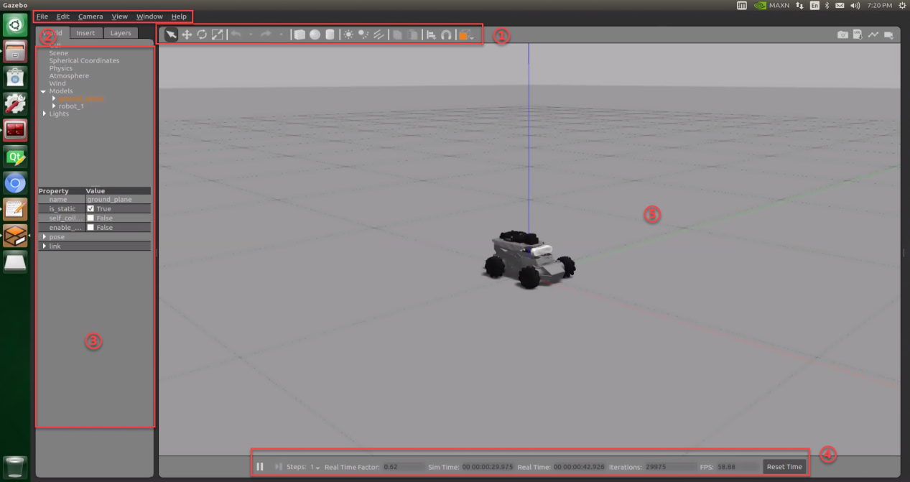

The functions of each section are described in the table below:

<table>
  <thead>
    <tr>
      <th>Name</th>
      <th>Function</th>
    </tr>
  </thead>
  <tbody>
    <tr>
      <td>Area 1: Toolbar</td>
      <td>Provides the most commonly used options for interacting with the simulator.</td>
    </tr>
    <tr>
      <td>Area 2: Menu Bar</td>
      <td>Configures or modifies simulation software parameters, as well as some interactive functions.</td>
    </tr>
    <tr>
      <td>Area 3: Action Bar</td>
      <td>Operates on models and allows parameter modifications.</td>
    </tr>
    <tr>
      <td>Area 4: Timestamp</td>
      <td>Allows manipulation of time within the virtual space.</td>
    </tr>
    <tr>
      <td>Area 5: Scene</td>
      <td>The main area of the simulator where simulation models are displayed.</td>
    </tr>
  </tbody>
</table>


For more information about Gazebo, please visit the official website: http://gazebosim.org/

* **Gazebo Learning Resources**

Gazebo Official Website: https://gazebosim.org/

Gazebo Tutorials: https://gazebosim.org/tutorials

Gazebo GitHub Repository: https://github.com/osrf/gazebo

Gazebo Answers Forum: http://answers.gazebosim.org/

### 8.2.2 Gazebo xacro Model Visualization

To better understand the robot's model and structure, Gazebo for visualization can be used. Follow these steps:

* **Start the Simulation**

> [!NOTE]
> 
> **Commands must be entered with correct capitalization. The Tab key can be used to auto-complete keywords.**

1. Power on the robot and connect it via the NoMachine remote control software.

2. Click the terminal icon  in the system desktop to open a command-line window.

3. Enter the following command and press **Enter** to stop the app auto-start service:

```bash
sudo systemctl stop start_app_node.service
```

4. Enter the following command to open the Gazebo simulation model:

```bash
roslaunch rosorin_gazebo worlds.launch
```

If the interface shown below appears, the tool has launched successfully:

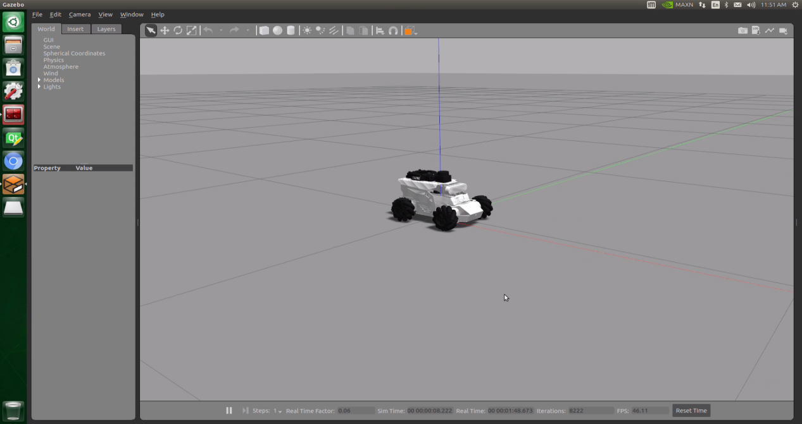

> [!NOTE]
> 
> **If Gazebo fails to launch the simulation model, it may be due to the app service running or other services being active. It is recommended to stop the app service and any other services before running the command to launch the Gazebo simulation model.**

5. To close the currently running program in the terminal window, press the shortcut **Ctrl+C**.

After the feature is closed, the app service can be activated either by using a command or by restarting the robot. If the app service is not enabled, related features in the app will not function properly. The app service will start automatically when the robot is restarted.

Enter the command to restart the app service, then wait for the buzzer beep on the robot to confirm completion.

```
sudo systemctl restart start_app_node.service
```

* **Introduction to Shortcuts and Tools**

This section introduces some commonly used shortcuts and tools in Gazebo, using mouse controls as examples:

1. Left Mouse Button: In Gazebo simulation, the left mouse button is used for dragging the map and selecting objects. Press and hold the left mouse button on the map to drag it, or click on a model to select it. The W, A, S, and D keys can be used to pan the view.
2. Middle Mouse Button or Shift + Left Mouse Button:  Press and hold while moving the mouse to rotate the view around the current target position.

3. Right Mouse Button or Mouse Wheel: Hold the right mouse button or scroll the wheel to zoom in and out, focusing on the point under the cursor.

The following three tools from the toolbar are used as examples for explanation.

Selection tool : It is Gazebo's default tool, used to select models.


Move Tool : Use this tool to select a model and drag the three axes to control its movement.


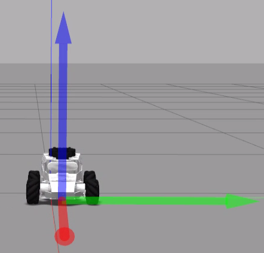

Rotate Tool : Use this tool to select a model and drag the three axes to control its rotation.

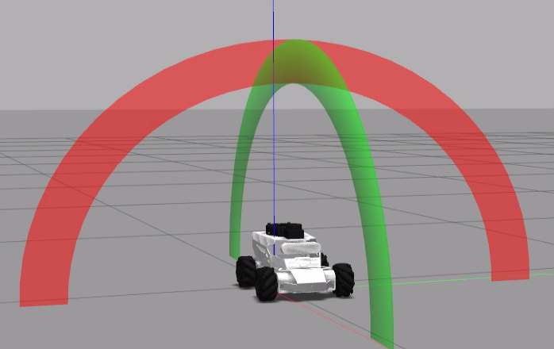

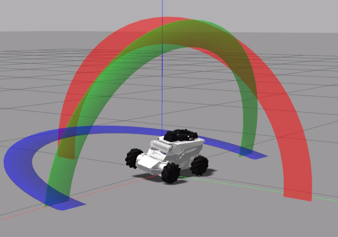

For more information about Gazebo, please visit the official website: http://gazebosim.org/.

### 8.2.3 Gazebo Hardware Simulation

To understand the simulation models of various expansion devices on the robot, it is necessary to review the related model code.

> [!NOTE]
> 
> **Commands must be entered with correct capitalization. The Tab key can be used to auto-complete keywords.**

1. Power on the robot and connect it via the NoMachine remote control software.

2. Click the terminal icon  in the system desktop to open a command-line window.

3. Enter the command and press **Enter** to navigate to the program’s startup directory.

```
roscd rosorin_description/urdf/
```

4. Open the LiDAR simulation model file with:

```
vim rosorin.xacro
```

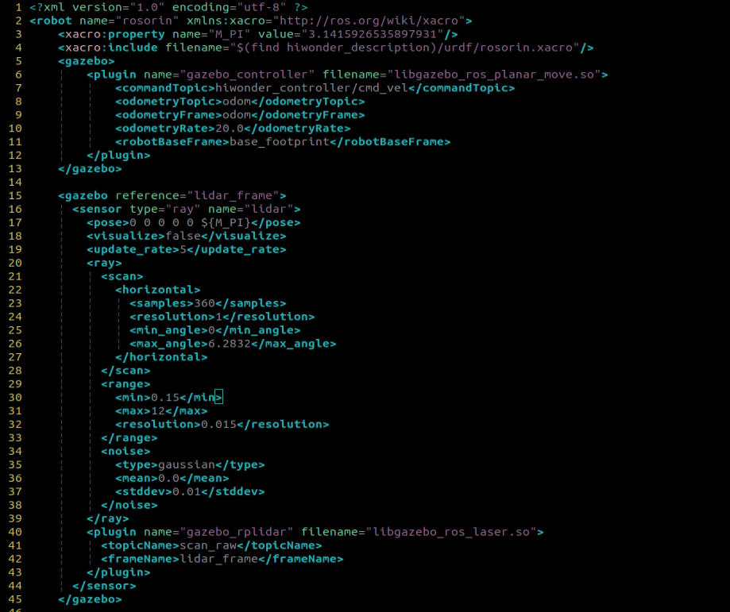

This URDF file mainly describes the robot’s basic structural, kinematic, and inertial information. It defines the spatial relationships and physical properties of each robot component in three-dimensional space.

### 8.2.4 Gazebo Mapping Simulation

* **Configuration**

> [!NOTE]
> 
> * **Commands must be entered with correct capitalization. The Tab key can be used to auto-complete keywords.**
> 
> * **The following commands should be executed only after each service has fully started. Starting the next service too early may cause the simulation to fail.**

To perform mapping in an ideal environment, but cannot build it in the real world, it can instead create the desired scene in Gazebo and carry out mapping simulation there.

1. Power on the robot and connect it via the NoMachine remote control software.

2. Click the terminal icon  in the system desktop to open a command-line window.

3. Enter the following command and press **Enter** to stop the app auto-start service:

```
sudo systemctl stop start_app_node.service
```

4. Enter the command to launch the Gazebo simulation.

```
roslaunch rosorin_gazebo room_worlds.launch
```

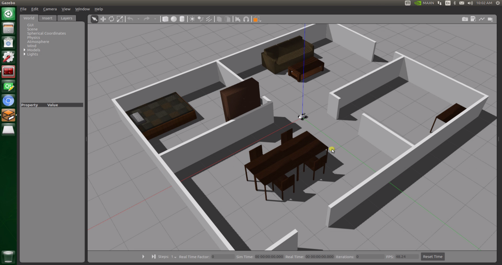

5. Open a new command-line terminal to start the mapping service.

```bash
roslaunch slam slam.launch sim:=true
```

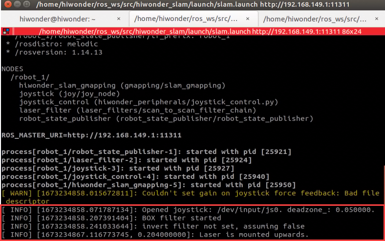

6. After the mapping service has fully started, return to the Gazebo simulation, click the button at the bottom to start, and check the status messages in the mapping service terminal.

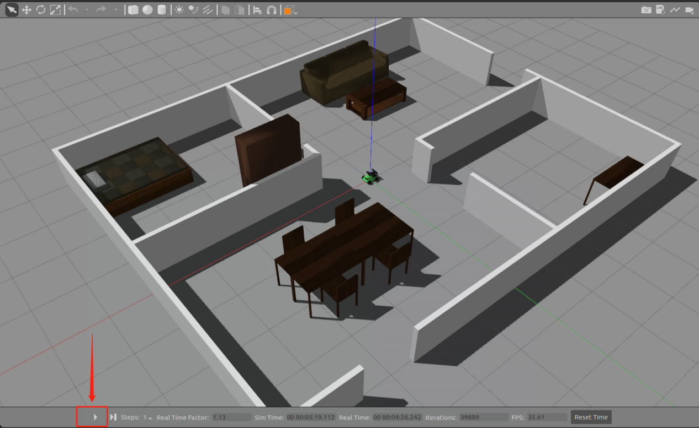

7. Then switch back to the terminal and verify that the following message appears.

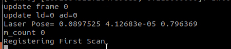

This message indicates the runtime status of the mapping service and the progress of data processing.

`update frame 0`: Indicates that the mapping service is processing frame 0. Each time sensor data is received or an update occurs, the frame index is incremented.

`update ld=0 ad=0`: Indicates the number of laser point data entries, referred to as ld, and the number of angle data entries, referred to as ad, detected in the current frame.

`Laser Pose= 0.0897525 4.12683e-05 0.796369`: Represents the position and orientation of the LiDAR. These values describe the LiDAR pose within the robot coordinate frame.

`m_count 0`: Indicates the number of feature points currently stored in the map. During the mapping process, this value increases as laser data is continuously integrated.

`Registering First Scan`: Indicates that the mapping service is registering the first laser scan. At the start of mapping, the initial laser scan is processed and registered to establish the initial map state.

8. Open a new command-line terminal and enter the command to launch RViz.

```bash
roslaunch slam rviz_slam.launch sim:=true
```

After it starts successfully, the mapping interface appears as shown below.

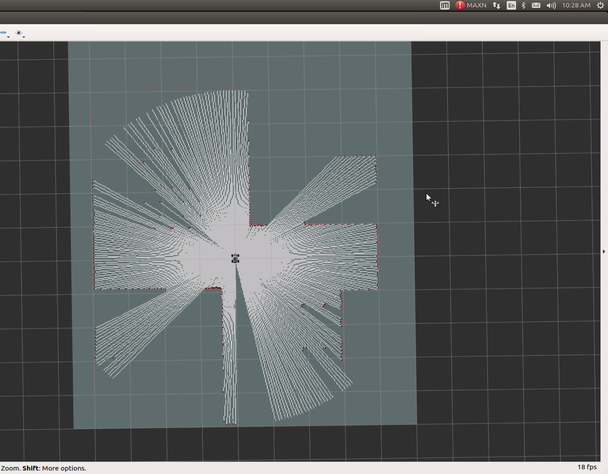

* **Mapping Operation**

Open a new terminal, enter the command to start the keyboard control service, and press **Enter**.

```bash
roslaunch peripherals teleop_key_control.launch
```

To control the robot to move within the simulated map, the table below shows the keyboard keys and their corresponding functions for controlling the robot's movement during mapping:

<table>
  <thead>
    <tr>
      <th>Key</th>
      <th>Robot Function</th>
    </tr>
  </thead>
  <tbody>
    <tr>
      <td>W</td>
      <td>Switches to forward motion and continues moving forward</td>
    </tr>
    <tr>
      <td>S</td>
      <td>Switches to reverse motion and continues moving backward</td>
    </tr>
    <tr>
      <td>A</td>
      <td>Interrupts forward or reverse motion and turns left</td>
    </tr>
    <tr>
      <td>D</td>
      <td>Interrupts forward or reverse motion and turns right</td>
    </tr>
  </tbody>
</table>

1. Control the exploration of the simulated map. The mapping process is displayed in real time in RViz, as shown below.

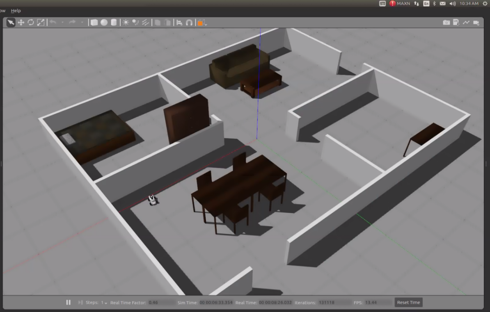

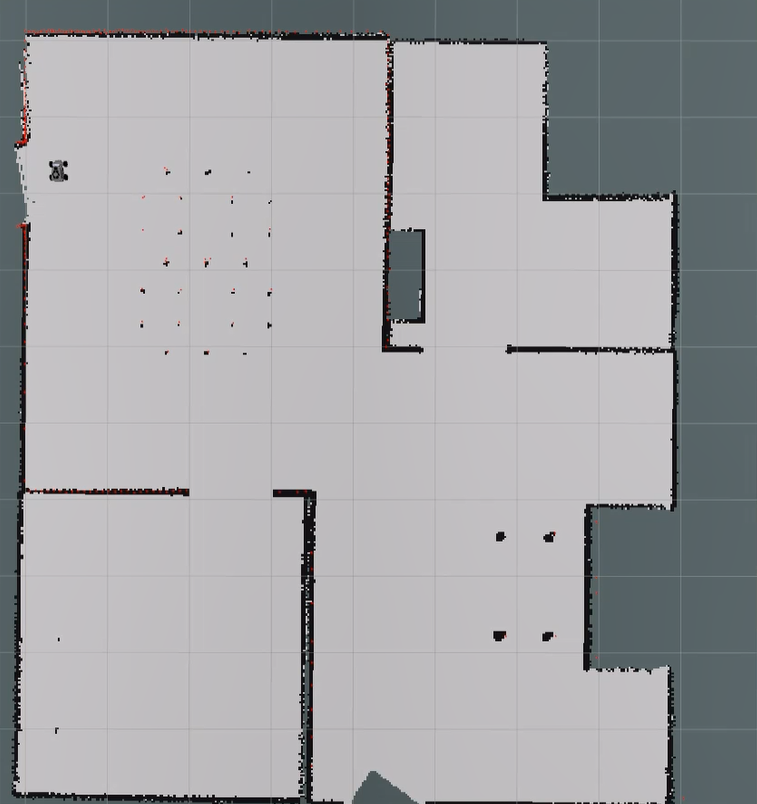

2. Enter the command to navigate to the directory where maps are stored and save the map.

```bash
roscd slam/maps && rosrun map_server map_saver map:=/robot_1/map -f map_01
```

In this command, **map_01** is the map name, which can be renamed as needed. If the following prompt appears, it means the map has been saved successfully.


3) To close the currently running program in each terminal window, press **Ctrl+C**.

After the feature is closed, the app service can be activated either by using a command or by restarting the robot. If the app service is not enabled, related features in the app will not function properly. The app service will start automatically when the robot is restarted.

Enter the command to restart the app service and wait for a beep from the buzzer, indicating that the service has started.

```
sudo systemctl restart start_app_node.service
```

* **FAQ**

**Q:** After opening the RViz simulation tool, no map is displayed, only the robot model.

**A:** This issue usually occurs when multiple services are launched at the same time, causing congestion in the robot processes. It is recommended to stop all processes using **Ctrl+C** in the terminal and then restart the services in sequence. Wait until each service has fully started before entering the next command.

### 8.2.5 Gazebo Navigation Simulation

After completing the mapping in Gazebo, navigation can also be performed within the simulation environment to achieve a full simulated experience.

* **Configuration**

> [!NOTE]
> 
> **Commands must be entered with correct capitalization. The Tab key can be used to auto-complete keywords.**

1. Power on the robot and connect it via the NoMachine remote control software.

2. Click the terminal icon  in the system desktop to open a command-line window.

3. Enter the following command and press **Enter** to stop the app auto-start service:

```
sudo systemctl stop start_app_node.service
```

> [!NOTE]
> 
> **The following commands should be executed only after each service has fully started. Starting the next service too early may cause the simulation to fail.**

4. Enter the following command to launch the simulation map:

```
roslaunch rosorin_gazebo room_worlds.launch
```

5. Open a new command-line terminal, enter the following command to load the map for navigation, and start the navigation process:

```
roslaunch navigation navigation.launch sim:=true map:=map_01
```

The **map_01** at the end of the command is the map name and can be modified as needed. The map is stored at the directory of **/home/ros_ws/src/slam/maps**.

6. Open a new command-line terminal and enter the command to launch RViz.

```
roslaunch navigation rviz_navigation.launch sim:=true
```

7. Click the start button at the bottom of the map to start the simulation.


* **Starting Navigation**

The software menu bar contains three tools: 2D Pose Estimate, 2D Nav Goal, and Publish Point.


**2D Pose Estimate**: Used to set the robot’s initial position. **2D Nav Goal**: Used to set a single target point for the robot. **Publish Point**: Used to set multiple target points for the robot.

1. Click the **2D Nav Goal** tool in the software menu, then click a location on the map to set it as the target point. By pressing and dragging the mouse, the robot’s orientation upon reaching the target point can also be specified. The robot will automatically generate a path and move to the target point.


2. Once the target point is set, the map will display the planned path, and the robot’s simulation model will move to the corresponding position.

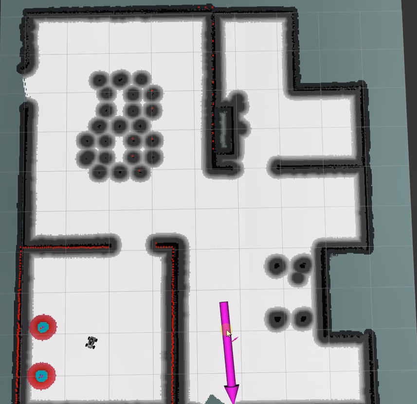

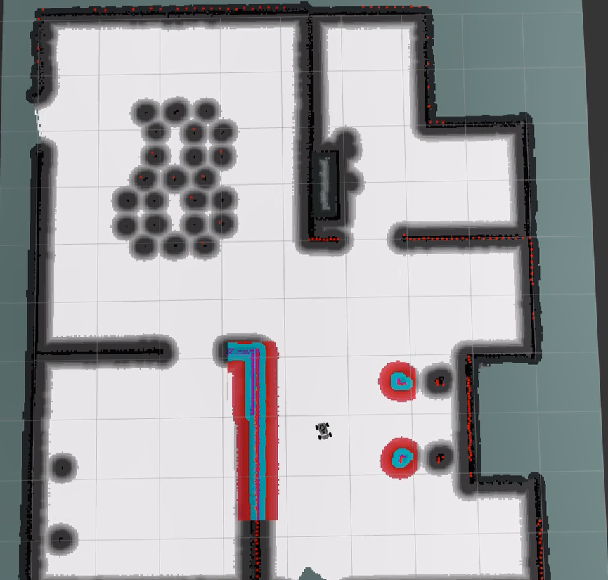

3. To use the multi-point navigation feature, open a new terminal and run the command. The feature will then be available.

```bash
roslaunch navigation publish_point.launch
```

4. Click the icon , then left-click on a point on the map to set it as the target point. The remaining target points can be set using the same procedure. Once the target points are set, the robot will automatically generate a travel route based on the order of the target points and proceed to each target point in sequence.

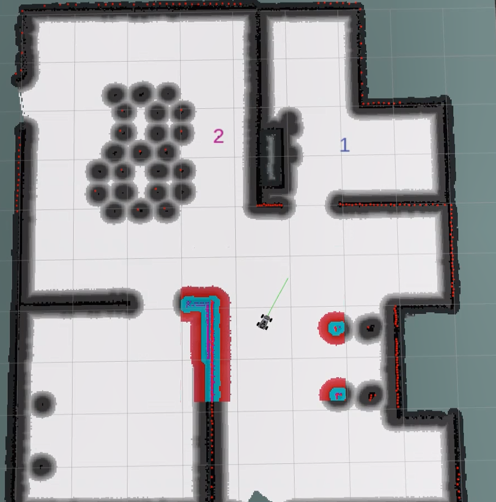

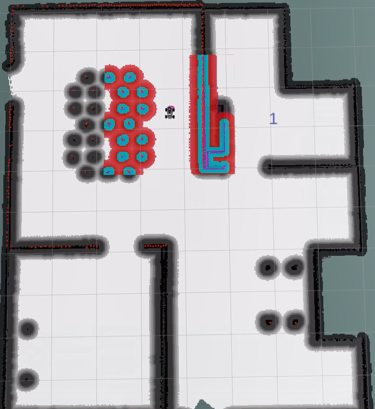

> [!NOTE]
> 
> **Click Publish Point before setting each target point.**

5. To stop the navigation, return to the terminal and press **Ctrl+C** in each terminal to terminate the processes.

6. After the feature is closed, the app service can be activated either by using a command or by restarting the robot. If the app service is not enabled, related features in the app will not function properly. The app service will start automatically when the robot is restarted.

7. Enter the command to restart the app service and wait for a beep from the buzzer, indicating that the service has started.

```bash
sudo systemctl restart start_app_node.service
```