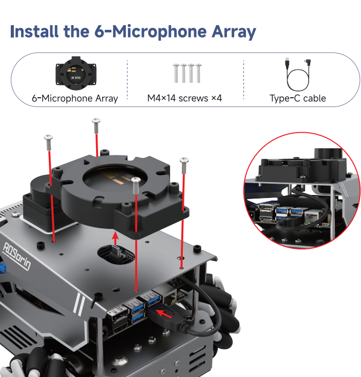
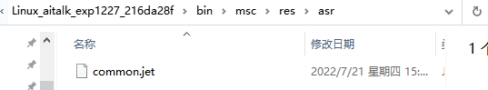
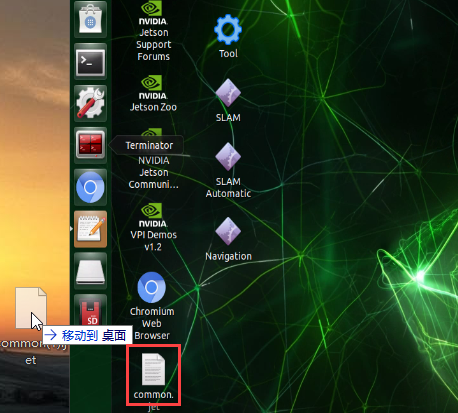
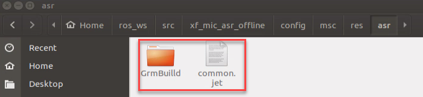
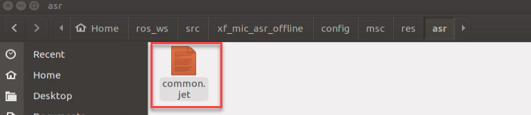
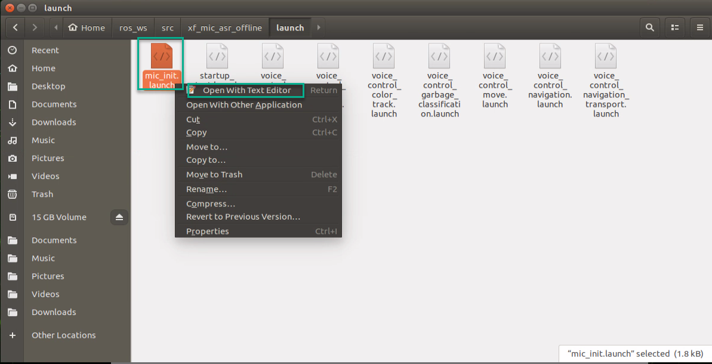
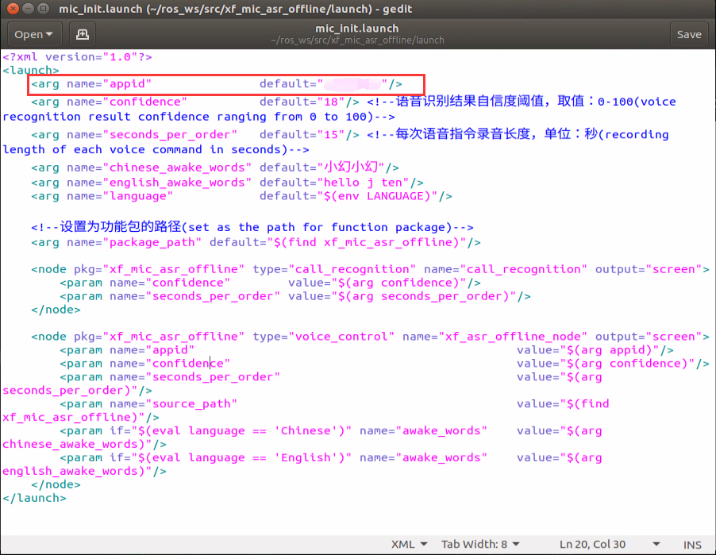
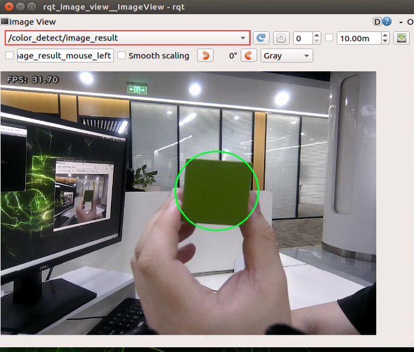
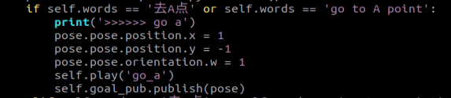
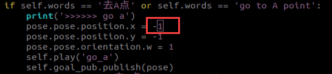

# 9\. ROS1- Voice Interaction Applications

[TOC]


## 9.1 Voice Module Installation

### 9.1.1 Installing the AI Voice Interaction Module


### 9.1.2 Installing the 6-Microphone Array



<p id ="anther9.2"></p>
## 9.2 Switching Wake Words

The system uses the English wake-up phrase **Hello Hiwonder** by default. To use a different wake word or command, follow the steps below.

1) For robots with the WonderEcho Pro:  
Make sure the corresponding language firmware is flashed first. Refer to the tutorial [02 Firmware Flashing]() under the folder **Voice Control Basic Lesson** for detailed instructions.


2) For robots using the 6-Microphone Array:  
Set the recognition language via the desktop configuration tool. Double-click the Tool icon  on the system desktop.

3) Set the language to **English**, then click **Save** > **Apply** > **Quit**.

4) After restarting the robot, the wake word will be successfully switched.

<p id ="anther9.3"></p>
## 9.3 6-Microphone Array Configuration (Must Read)

### 9.3.1 Applying for Offline Speech Package \& ID

Since offline speech recognition is used in this section, an offline speech resource package from iFLYTEK is required. The offline speech package is only available to accounts registered in supported regions. The following steps describe how to complete the registration process.

1. Copy the URL [https://www.xfyun.cn/](https://www.xfyun.cn), open the iFlytek Open Platform webpage, and register an account.
   
   
   
2. Choose **Login with phone number** and fill in the required information. For international access, the corresponding country code should be selected.
   
   
   
3. Once registered, go to **console** > **My Application** to create a new application.


Fill in the required fields and click Submit.


4. Open the newly created application.
   
   
   
5. Click on Offline Voice Command Recognition, locate the corresponding APPID in the red box shown below. Then navigate to **Offline Wake Word Recognition SDK** → **Linux MSC** and click to download.
   
   
   
   
   


> [!NOTE]
> 
> **Each newly registered application can be used for free for 90 days. After the free period expires, continued use requires a paid plan. When an application expires, a new one can be registered, with a maximum of five applications per account. The process for creating a new app is the same.**

### 9.3.2 Replacing Offline Speech Resources and ID

1. Extract the compressed package from the provided materials.


> [!NOTE]
> 
> **Locate the extracted files according to the chosen download path.**

2. Open the folder named **Linux_aitalk_exp1227_216da28f**. The version ID, such as **1227_01997b6c**, may vary depending on the official release. Navigate to the **bin/msc/res/asr** directory and locate the **common.jet** file. Drag this file onto the desktop of the robot’s system image.





3. Open the Ubuntu system in the virtual machine and navigate to:
   
   **Home/ros_ws/src/xf_mic_asr_offline/config/msc/res/asr/**, to enter the folder containing the offline voice resources and delete the files highlighted in red as shown below.
   
   
   
4. Place the file obtained from **common.jet** into this folder.
   
   
   
5. Navigate to **Home/ros_ws/src/xf_mic_asr_offline/**, right-click the **mic_init.launch** file, and select the option highlighted in green.
   
   
   
6. Set the appid in the red box to the one obtained from iFlytek, then press **Ctrl+S** to save.
   
   
   


## 9.4 Voice-Controlled Robot Movement

This section demonstrates controlling the robot by issuing corresponding voice commands, such as moving the robot forward or backward.

### 9.4.1 Preparation

1) Before starting, install the voice module onto the robot and connect it to the hub via the USB port. Skip if already installed.

2) Please refer to Section [9.3 6-Microphone Array Configuration (Must Read)](#anther9.3) in this document. Follow the instructions to apply for an APPID and replace the corresponding files.

3) The system uses the English wake word **Hello Hiwonder** by default. If using a WonderEcho Pro as a voice module, the voice interaction command phrases must be flashed. Refer to Section [9.2 Switching Wake Words](#anther9.2) for instructions on changing the language or flashing the command words.

### 9.4.2 Program Overview

First, subscribe to the voice recognition service published by the microphone array node. After performing voice localization, noise reduction, and recognition, obtain the recognized speech and the angle of the sound source. At the same time, activate the robot's chassis control service to enable direct execution of voice commands.

Next, the robot is activated using a specific wake word. Once the wake word is recognized, the robot provides voice feedback to confirm activation.

Finally, based on voice command matching, the robot will perform the corresponding actions.

### 9.4.3 Operation Steps

> [!NOTE]
> 
> **Commands must be entered with correct capitalization. The Tab key can be used to auto-complete keywords.**

1. Power on the robot and connect it via the NoMachine remote control software. For detailed information, please refer to the section [1.7.2 AP Mode Connection Steps]() in the user manual.

2. Click the terminal icon  in the system desktop to open a command-line window.

3. Enter the following command and press **Enter** to stop the app service:

```bash
sudo systemctl stop start_app_node.service
```

4. Enter the following command and press **Enter** to launch the feature.

```bash
roslaunch xf_mic_asr_offline voice_control_move.launch
```

5. To exit the feature, press **Ctrl+C** in the terminal. If the program does not close successfully, try pressing **Ctrl+C** again.

6. To replay features in the app, restart the corresponding services. After entering the command and pressing **Enter**, wait for a single beep from the buzzer.

```bash
sudo systemctl start start_app_node.service
```

### 9.4.4 Project Outcome

> [!NOTE]
> 
> * **To ensure optimal performance, operate the robot in a relatively quiet environment.**
> 
> * **It is recommended to say the wake word before issuing each voice command.**
> 
> * **When speaking the voice command, make sure the voice is loud and clear.**
> 
> * **Issue voice commands one at a time, waiting for the robot to complete the current action and provide feedback before giving the next command.**

1) After starting the feature, wait for the voice device to announce **I’m ready** before beginning voice input.

2) First, say the wake word **Hello Hiwonder**, then wait for the device to respond with **I’m here** before issuing the next voice command. For example, saying **Move Forward** will trigger the robot to recognize the voice command, after which the voice box will reply with **Copy that, starting to move forward**, and the robot will proceed with the corresponding movement.

The command phrases and their corresponding actions are as follows:

<table>
  <thead>
    <tr>
      <th>Command Phrase</th>
      <th>Corresponding Action</th>
    </tr>
  </thead>
  <tbody>
    <tr>
      <td>Go forward</td>
      <td>Control the robot to move forward.</td>
    </tr>
    <tr>
      <td>Go backward</td>
      <td>Control the robot to move backward.</td>
    </tr>
    <tr>
      <td>Turn left</td>
      <td>Control the robot to turn left.</td>
    </tr>
    <tr>
      <td>Turn right</td>
      <td>Control the robot to turn right.</td>
    </tr>
    <tr>
      <td>Come here</td>
      <td>Commands the robot to move to the front of the person issuing the command.</td>
    </tr>
  </tbody>
</table>


### 9.4.5 Program Analysis

Voice control for robot movement involves establishing a connection between the voice control node and the robot’s low-level driver node. Through voice commands, the robot is controlled to execute the corresponding actions.

* **launch File**

The launch file is located at: **/home/ros_ws/src/xf_mic_asr_offline/launch/voice_control_move.launch**.

1. Starting multiple Launch files.

```
<include file="$(find xf_mic_asr_offline)/launch/mic_init.launch"/>
<include file="$(find peripherals)/launch/lidar.launch"/>
<include file="$(find controller)/launch/controller.launch"/>
```

The `<include>` tag is used to include other `launch` files. When this file is launched, the included `launch` files are also started. This is mainly used to start the microphone initialization, chassis control, and LiDAR launch files.

2. Starting Nodes

```
<node pkg="xf_mic_asr_offline" type="voice_control_move.py" name="voice_control_move_node" output="screen"/>
```

The `<node>` tag defines a node to be launched, with subsequent tags such as `<name>`, `<pkg>`, `<type>`, and `<output>` specifying parameters for that node.

`<name>` specifies the node’s name. `<pkg>` indicates the package the node belongs to. `<type>` is the name of the file executed by the node, in this case, `voice_control_move.py`. `<output>` defines where the output is sent, which here is the screen.

* **Python File**

The source code is located at: **/home/ros_ws/src/xf_mic_asr_offline/scripts/voice_control_move.py**.

1. Class Initialization

```python
def __init__(self, name):
    rospy.init_node(name)

    self.angle = None
    self.words = None
    self.running = True
    self.haved_stop = False
    self.lidar_follow = False
    self.start_follow = False
    self.last_status = Twist()
    self.threshold = 3
    self.speed = 0.3
    self.stop_dist = 0.4
    self.count = 0
    self.scan_angle = math.radians(45)

    self.pid_yaw = pid.PID(1.6, 0, 0.16)
    self.pid_dist = pid.PID(1.7, 0, 0.16)

    self.language = os.environ['ASR_LANGUAGE']
    self.lidar_type = os.environ.get('LIDAR_TYPE')
    self.mecanum_pub = rospy.Publisher('/controller/cmd_vel', Twist, queue_size=1)
    self.lidar_sub = rospy.Subscriber('/scan', sensor_msg.LaserScan, self.lidar_callback)
    rospy.Subscriber('/asr_node/voice_words', String, self.words_callback)
    rospy.Subscriber('/awake_node/angle', Int32, self.angle_callback)
    rospy.wait_for_service('/voice_control/get_offline_result')
    rospy.sleep(rospy.get_param('~delay', 0))
    self.play('running')
    self.mecanum_pub.publish(Twist())
    signal.signal(signal.SIGINT, self.shutdown)
    self.buzzer_pub = rospy.Publisher('/ros_robot_controller/set_buzzer', BuzzerState, queue_size=1)
    rospy.loginfo('Wake word: Hello Hiwonder')
    rospy.loginfo('No need to wake up within 15 seconds after waking up')
    rospy.loginfo('Voice command: turn left/turn right/go forward/go backward/come here')

    self.time_stamp = rospy.get_time()
    self.current_time_stamp = rospy.get_time()
    self.run()
```

Initialize the ROS node and set its name. Initialize two `PID` controllers: `pid_yaw` for controlling rotation angle and `pid_dist` for controlling distance. Subscribe to LiDAR data from `/scan`, voice recognition results from `/asr_node/voice_words`, and sound source angle from `/awake_node/angle`. Publish robot velocity commands via `/controller/cmd_vel` and buzzer control via `/ros_robot_controller/set_buzzer`. Upon startup, play a voice prompt, set initial velocity commands to zero, and start the main loop.

2. Voice Command Callback

```python
def words_callback(self, msg):
    self.words = json.dumps(msg.data, ensure_ascii=False)[1:-1]
    if self.language == 'Chinese':
        self.words = self.words.replace(' ', '')
    print('words:', self.words)
    if self.words is not None and self.words not in ['Wake-up-success', 'Sleep', 'Fail-5-times',
                                                     'Fail-10-times']:
        pass
    elif self.words == 'Wake-up-success':
        self.play('awake')
    elif self.words == 'Sleep':
        msg = BuzzerState()
        msg.freq = 2000
        msg.on_time = 0.05
        msg.off_time = 0.01
        msg.repeat = 1
        self.buzzer_pub.publish(msg)
```

Receive voice recognition results from `msg.data`, parse and store them in `self.words`, and process commands such as wake-up or sleep.

3. Sound Source Angle Callback

```python
def angle_callback(self, msg):
    self.angle = msg.data
    print('angle:', self.angle)
    self.start_follow = False
    self.mecanum_pub.publish(Twist())
```

Detect the angle of the sound source, calculate the robot’s turning angle, and stop movement if necessary.

4. LiDAR Data Callback

```python
def lidar_callback(self, lidar_data: sensor_msg.LaserScan):
    twist = Twist()
    if self.lidar_type != 'G4':
        max_index = int(math.radians(MAX_SCAN_ANGLE / 2.0) / lidar_data.angle_increment)
        left_ranges = lidar_data.ranges[:max_index]  # The left data
        right_ranges = lidar_data.ranges[::-1][:max_index]  # The right data
    elif self.lidar_type == 'G4':
        min_index = int(math.radians((360 - MAX_SCAN_ANGLE) / 2.0) / lidar_data.angle_increment)
        max_index = int(math.radians(180) / lidar_data.angle_increment)
        left_ranges = lidar_data.ranges[::-1][min_index:max_index][::-1]  # The left data)
        right_ranges = lidar_data.ranges[min_index:max_index][::-1]  # The right data
    if self.start_follow:
        # Get the data according to the settings
        angle = self.scan_angle / 2
        angle_index = int(angle / lidar_data.angle_increment + 0.50)
        left_range, right_range = np.array(left_ranges[:angle_index]), np.array(right_ranges[:angle_index])

        # The merged distance data from right half counterclockwise to the left half
        ranges = np.append(right_range[::-1], left_range)
        nonzero = ranges.nonzero()
        nonan = ~np.isnan(ranges[nonzero])
        dist = ranges[nonzero][nonan].min()
        min_index = list(ranges).index(dist)
        angle = -angle + lidar_data.angle_increment * min_index  # Calculate the angle corresponding to the minimum value

        if dist < self.threshold and abs(math.degrees(angle)) > 5:  # Lateral steering control
            self.pid_yaw.update(-angle)
            twist.angular.z = misc.set_range(self.pid_yaw.output, -self.speed * 6, self.speed * 6)
        else:
            self.pid_yaw.clear()

        if dist < self.threshold and abs(self.stop_dist - dist) > 0.02:
            self.pid_dist.update(self.stop_dist - dist)
            twist.linear.x = misc.set_range(self.pid_dist.output, -self.speed, self.speed)
        else:
            self.pid_dist.clear()
        if abs(twist.angular.z) < 0.008:
            twist.angular.z = 0
        if abs(twist.linear.x) < 0.05:
            twist.linear.x = 0
        if twist.linear.x == 0 and twist.angular.z == 0:
            self.count += 1
        if self.count >= 10:
            self.count = 0
            self.start_follow = False
        self.mecanum_pub.publish(twist)
```

Analyze LiDAR scan data to determine the robot’s rotation direction and angle while maintaining a safe distance from obstacles.

5. Main Loop

```python
def run(self):
    while not rospy.is_shutdown() and self.running:
        if self.words is not None:
            twist = Twist()
            if self.words == '前进' or self.words == 'go forward':
                self.play('go')
                self.time_stamp = rospy.get_time() + 2
                twist.linear.x = 0.2
            elif self.words == '后退' or self.words == 'go backward':
                self.play('back')
                self.time_stamp = rospy.get_time() + 2
                twist.linear.x = -0.2
            elif self.words == '左转' or self.words == 'turn left':
                self.play('turn_left')
                self.time_stamp = rospy.get_time() + 2
                twist.angular.z = 0.8
            elif self.words == '右转' or self.words == 'turn right':
                self.play('turn_right')
                self.time_stamp = rospy.get_time() + 2
                twist.angular.z = -0.8
            elif self.words == '过来' or self.words == 'come here':
                self.play('come')
                if 270 > self.angle > 90:
                    twist.angular.z = -1
                    self.time_stamp = rospy.get_time() + math.radians(self.angle - 90)
                else:
                    twist.angular.z = 1
                    if self.angle <= 90:
                        self.angle = 90 - self.angle
                    else:
                        self.angle = 450 - self.angle
                    self.time_stamp = rospy.get_time() + math.radians(self.angle)
                print(self.angle)
                self.lidar_follow = True
            elif self.words == 'Sleep':
                rospy.sleep(0.01)
            self.words = None
            self.haved_stop = False
            self.mecanum_pub.publish(twist)
        else:
            rospy.sleep(0.01)
        self.current_time_stamp = rospy.get_time()
        if self.time_stamp < self.current_time_stamp and not self.haved_stop:
            self.mecanum_pub.publish(Twist())
            self.haved_stop = True
            if self.lidar_follow:
                self.lidar_follow = False
                self.start_follow = True
```

Match recognized voice commands, play the corresponding audio feedback, and set the appropriate linear or angular velocity to control the robot’s movement.

### 9.4.6 Feature Extensions

* **Changing the Wake Word**

The default wake word is **Hello Hiwonder**. It can be changed by modifying the configuration file. The example below demonstrates how to change the wake word to **hello**.

> [!NOTE]
> 
> **Commands must be entered with correct capitalization. The Tab key can be used to auto-complete keywords.**

1. Power on the robot and connect it via the NoMachine remote control software.

2. Click the terminal icon  in the system desktop to open a command-line window.

3. Enter the following command and press **Enter** to go to the configuration directory.

```bash
roscd xf_mic_asr_offline/launch/
```

4. Then enter the following command and press **Enter** to open the configuration file:

```bash
vim mic_init.launch
```

5. Locate the code shown in the figure below.


6. Press the i key to enter edit mode. Change the value of `english_awake_words` to **hello**.


7. After editing, press **Esc**, then enter the command below and press **Enter** to save and exit.

```bash
:wq
```

8. Refer to [9.4.3 Operation Steps](#anther9.4.3) to restart the feature and observe the effect of the modified setup.


## 9.5 Voice-Controlled Color Recognition

This section demonstrates how to enable or disable the color recognition function using voice commands. When red, green, or blue is detected, the voice device announces the corresponding color.

### 9.5.1 Preparation

1) Before starting, install the voice module onto the robot and connect it to the hub via the USB port. Skip if already installed.

2) Please refer to Section [9.3 6-Microphone Array Configuration (Must Read)](#anther9.3) in this document. Follow the instructions to apply for an APPID and replace the corresponding files.

3) The system uses the English wake word **Hello Hiwonder** by default. If using a WonderEcho Pro as a voice module, the voice interaction command phrases must be flashed. Refer to Section [9.2 Switching Wake Words](#anther9.2) for instructions on changing the language or flashing the command words.

### 9.5.2 Program Overview

First, the system subscribes to the voice recognition service published by the microphone array node. It processes the incoming voice data through localization, noise reduction, and recognition, and then retrieves the recognized sentence and the angle of the sound source.

Next, the robot is activated using a specific wake word. Once the wake word is recognized, the robot provides voice feedback to confirm activation.

Then give a command to the robot, it will execute the corresponding action, enabling or disabling the color recognition.

The implementation of color recognition is divided into two parts: color detection and response execution.

In the recognition process, Gaussian filtering is first applied to reduce noise in the image. Then, the image is converted to the Lab color space to better distinguish colors. For details on Lab color space, refer to [6. ROS1-ROS+OpenCV Course]().

Based on this, color thresholds are used to identify the color of the object within the circle. A mask is then applied to the image, which involves selecting parts of the image, graphics, or objects to globally or locally block out areas in the image for processing.

After masking, morphological operations, including opening and closing, are performed on the object image to refine the results.

### 9.5.3 Operation Steps

> [!NOTE]
> 
> * **Commands must be entered with correct capitalization. The Tab key can be used to auto-complete keywords.**
> 
> * **Ensure that no objects with similar or identical colors to the target block appear in the background, as this may cause interference during recognition.**
> 
> * **If the color detection is inaccurate, the color thresholds can be adjusted. For more details, refer to the tutorials in [6.1 Color Threshold Adjustment]() of the 6. ROS1-ROS+OpenCV Course.**

1. Power on the robot and connect it via the NoMachine remote control software. For detailed information, please refer to the section [1.7.2 AP Mode Connection Steps]() in the user manual.

2. Click the terminal icon  in the system desktop to open a command-line window.

3. Enter the following command and press **Enter** to stop the app service:

```bash
sudo systemctl stop start_app_node.service
```

4. Enter the following command and press Enter to start the feature.

```bash
roslaunch xf_mic_asr_offline voice_control_color_detect.launch
```

5. To display the live feed, open a new terminal, enter the command to launch the visualization tool, and select the color recognition channel **/color_detect/image_result**.

```bash
rqt_image_view
```



6. To exit this feature, press **Ctrl+C** in each terminal. If the program does not close successfully, try pressing **Ctrl+C** again.

7. To replay features in the app, restart the corresponding services. After entering the command and pressing **Enter**, wait for a single beep from the buzzer.

```bash
sudo systemctl start start_app_node.service
```

### 9.5.4 Project Outcome

> [!NOTE]
> 
> * **To ensure optimal performance, operate the robot in a relatively quiet environment.**
> 
> * **It is recommended to say the wake word before issuing each voice command.**
> 
> * **When speaking the voice command, make sure the voice is loud and clear.**
> 
> * **Issue voice commands one at a time, waiting for the robot to complete the current action and provide feedback before giving the next command.**

After starting the feature, first say the wake word **Hello Hiwonder**, then say the command **Start color recognition** to make the robot begin detecting colors.

The colors recognizable in this feature are red, green, and blue. When a color is detected, the robot announces its name. For example, place a red block within the camera’s field of view. When the red block is detected, the robot will announce **Red**. To stop the feature, say the wake word **Hello Hiwonder** followed by the command **Stop color recognition**.

### 9.5.5 Program Analysis

Voice control allows the voice recognition node to interact with the robot's underlying driving nodes and camera nodes. By issuing voice commands, the robot can identify color blocks and respond accordingly.

* **launch File**

The launch file is located at: **/home/ros_ws/src/xf_mic_asr_offline/launch/voice_control_color_detect.launch**.

1. Starting multiple Launch files.

```
<include file="$(find xf_mic_asr_offline)/launch/mic_init.launch"/>
<include file="$(find controller)/launch/controller.launch"/>
<include file="$(find example)/scripts/color_detect/color_detect_node.launch"/>
```

The `<include>` tag is used to include other `launch` files. When this file is launched, the included `launch` files are also started. Mainly starts the microphone initialization, chassis control driver, and color detection launch files.

2. Starting Nodes

```
<node pkg="xf_mic_asr_offline" type="voice_control_color_detect.py" name="voice_control_color_detect_node" output="screen"/>
```

The `<node>` tag defines a node to be launched, with subsequent tags such as `<name>`, `<pkg>`, `<type>`, and `<output>` specifying parameters for that node.

`<name>` specifies the node’s name. `<pkg>` indicates the package the node belongs to. `<type>` is the name of the file executed by the node, in this case `voice_control_color_detect.py`. `<output>` defines where the output is sent, which here is the screen.

* **Python File**

The source code is located at: **/home/ros_ws/src/xf_mic_asr_offline/scripts/voice_control_color_detect.py**.

1. Class Initialization

```python
def __init__(self, name):
    rospy.init_node(name)
    self.count = 0
    self.color = None
    self.running = True
    self.last_color = None
    signal.signal(signal.SIGINT, self.shutdown)

    self.language = os.environ['ASR_LANGUAGE']
    rospy.Subscriber('/asr_node/voice_words', String, self.words_callback)
    rospy.Subscriber('/color_detect/color_info', ColorsInfo, self.get_color_callback)

    camera = rospy.get_param('/depth_camera/camera_name', 'depth_cam')  # Get parameter
    rospy.wait_for_message('/%s/rgb/image_raw' % camera, Image)
    rospy.wait_for_service('/voice_control/get_offline_result')
    self.play('running')
    self.buzzer_pub = rospy.Publisher('/ros_robot_controller/set_buzzer', BuzzerState, queue_size=1)
    rospy.loginfo('Wake word: Hello Hiwonder')
    rospy.loginfo('No need to wake up within 15 seconds after waking up')
    rospy.loginfo('Voice command: start color recognition/stop color recognition')

    while self.running:
        if self.color == 'red' and self.last_color != 'red':
            self.last_color = 'red'
            self.play('red')
            print('red')
        elif self.color == 'green' and self.last_color != 'green':
            self.last_color = 'green'
            self.play('green')
            print('green')
        elif self.color == 'blue' and self.last_color != 'blue':
            self.last_color = 'blue'
            self.play('blue')
            print('blue')
        else:
            self.count += 1
            rospy.sleep(0.01)
            if self.count > 50:
                self.count = 0
                self.last_color = self.color
    rospy.signal_shutdown('shutdown')
```

Initialize the ROS node and subscribe to the voice recognition results in `/asr_node/voice_words` and color detection results in `/color_detect/color_info`. Wait for the camera image messages and voice service to be ready, ensuring hardware and dependent modules are functioning correctly. Play a voice prompt at startup and display the wake word and control instructions. Enter the main loop to monitor color detection results. When a new color, red, green, or blue, is detected, play the corresponding voice prompt.

2. Color Detection Callback

```py
def get_color_callback(self, msg):
    data = msg.data
    if data != []:
        if data[0].radius > 30:
            self.color = data[0].color
        else:
            self.color = None
    else:
        self.color = None
```

Receive the published color information and update the currently detected color.

3. Voice Command Callback

```python
def words_callback(self, msg):
    words = json.dumps(msg.data, ensure_ascii=False)[1:-1]
    if self.language == 'Chinese':
        words = words.replace(' ', '')
    print('words:', words)
    if words is not None and words not in ['Wake-up-success', 'Sleep', 'Fail-5-times',
                                           '失败10次(Fail-10-times']:
        if words == '开启颜色识别' or words == 'start color recognition':
            msg_red = ColorDetect()
            msg_red.color_name = 'red'
            msg_red.detect_type = 'circle'
            msg_green = ColorDetect()
            msg_green.color_name = 'green'
            msg_green.detect_type = 'circle'
            msg_blue = ColorDetect()
            msg_blue.color_name = 'blue'
            msg_blue.detect_type = 'circle'
            res = rospy.ServiceProxy('/color_detect/set_param', SetColorDetectParam)([msg_red, msg_green, msg_blue])
            if res.success:
                self.play('open_success')
            else:
                self.play('open_fail')
        elif words == '关闭颜色识别' or words == 'stop color recognition':
            res = rospy.ServiceProxy('/color_detect/set_param', SetColorDetectParam)([])
            if res.success:
                self.play('close_success')
            else:
                self.play('close_fail')
    elif words == 'Wake-up-success':
        self.play('awake')
    elif words == 'Sleep':
        msg = BuzzerState()
        msg.freq = 2000
        msg.on_time = 0.05
        msg.off_time = 0.01
        msg.repeat = 1
        self.buzzer_pub.publish(msg)
```

Parse the voice recognition commands to control the enable and disable of the color recognition.


## 9.6 Voice-Controlled Multi-Point Navigation

In this section, voice control will be used to navigate the robot on a pre-built map.

### 9.6.1 Preparation

1) Before starting, install the voice module onto the robot and connect it to the hub via the USB port. Skip if already installed.

2) Please refer to Section [9.3 6-Microphone Array Configuration (Must Read)](#anther9.3) in this document. Follow the instructions to apply for an APPID and replace the corresponding files.

3) The system uses the English wake word **Hello Hiwonder** by default. If using a WonderEcho Pro as a voice module, the voice interaction command phrases must be flashed. Refer to Section [9.2 Switching Wake Words](#anther9.2) for instructions on changing the language or flashing the command words.

4) Before starting this feature, a map must be prepared in advance. Refer to the file [5. ROS1-Mapping \& Navigation Course]() for guidance.

5) It is recommended to place the robot on an open platform, ensuring at least a 3-meter radius around the robot is free for safe movement.

### 9.6.2 Program Overview

First, open the robot's navigation service and load the map, then start the multi-point navigation service.

First, the system subscribes to the voice recognition service published by the microphone array node. It processes the incoming voice data through sound source localization, noise reduction, and recognition, and then retrieves the recognized sentence and the angle of the sound source.

Afterward, the microphone will recognize the spoken commands. Once the wake-up word and control commands are detected and the recognition threshold is met, the robot will respond with the corresponding voice feedback.

Finally, based on the recognized language, the robot will navigate to the corresponding location on the map. Navigation will first perform global planning, and during movement, local planning will be applied when encountering obstacles.

### 9.6.3 Operation Steps

<p id ="p9-6-3"></p>

> [!NOTE]
> 
> **Commands must be entered with correct capitalization. The Tab key can be used to auto-complete keywords.**

1. Power on the robot and connect it via the NoMachine remote control software. For detailed information, please refer to the section [1.7.2 AP Mode Connection Steps]() in the user manual.

2. Click the terminal icon  in the system desktop to open a command-line window.

3. Enter the following command and press **Enter** to stop the app service:

```
sudo systemctl stop start_app_node.service
```

4. Enter the following command to start the feature.

```bash
roslaunch xf_mic_asr_offline voice_control_navigation.launch map:=map_01
```

The **map_01** at the end of the command is the map name and can be modified as needed. The map is stored at the directory of **/home/ros_ws/src/slam/maps**.

5. To exit the feature, press **Ctrl+C** in the terminal. If the program does not close successfully, try pressing **Ctrl+C** again.

6. To replay features in the app, restart the corresponding services. After entering the command and pressing **Enter**, wait for a single beep from the buzzer.

```bash
sudo systemctl start start_app_node.service
```

### 9.6.4 Project Outcome

After launching the feature, say the wake word **Hello Hiwonder**, then issue a command to control the robot’s movement.

For example, first say **Hello Hiwonder**, and the robot will reply with **I’m here**. Next, say **Go to point A**, and the robot will move to the upper-right position relative to its starting point.

The following table lists the voice commands and their corresponding functions from the robot’s perspective:

<table>
  <thead>
    <tr>
      <th>Command Phrase</th>
      <th>Function</th>
    </tr>
  </thead>
  <tbody>
    <tr>
      <td>Go to A point</td>
      <td>Move the robot to point A, front-right of the starting position.</td>
    </tr>
    <tr>
      <td>Go to B point</td>
      <td>Move the robot to point B, in front of the starting position.</td>
    </tr>
    <tr>
      <td>Go to C point</td>
      <td>Move the robot to point C, front-left of the starting position.</td>
    </tr>
    <tr>
      <td>Go back to the start</td>
      <td>Move the robot back to the starting position.</td>
    </tr>
  </tbody>
</table>

### 9.6.5 Program Analysis

* **launch File**

The launch file is located at: **/home/ros_ws/src/xf_mic_asr_offline/launch/voice_control_navigation.launch**.

1. Starting multiple Launch files.

```
<include file="$(find xf_mic_asr_offline)/launch/mic_init.launch"/>

<include file="$(find navigation)/launch/navigation.launch">
    <arg name="map"         value="$(arg map)"/>
    <arg name="master_name" value="$(arg master_name)"/>
    <arg name="robot_name"  value="$(arg robot_name)"/>
</include>

<include file="$(find navigation)/launch/rviz_navigation.launch"/>
```

The `\<include>` tag is used to include other  files. When this file is launched, the included `launch` files are also started. It mainly launches the initialization of the microphone, navigation, and the simulation software startup files.

2. Starting Nodes

```
<node pkg="xf_mic_asr_offline" name="voice_control_navigation" type="voice_control_navigation.py" output="screen" ns='$(arg master_name)'>
    <param name="map_frame" value="$(arg map_frame)"/>
    <param name="costmap"   value="/$(arg frame_prefix)move_base/local_costmap/costmap"/>
</node>
```

The `<node>` tag defines a node to be launched, with subsequent tags such as `<name>`, `<pkg>`, `<type>`, and `<output>` specifying parameters for that node.

`<name>` specifies the node’s name. `<pkg>` indicates the package the node belongs to. `<type>` is the name of the file executed by the node, in this case `voice_control_navigation.py`. `<output>` defines where the output is sent, which here is the screen. The `<ns>` parameter allows nodes to run within a custom namespace.

* **Python File**

The source code is located at: **/home/ros_ws/src/xf_mic_asr_offline/scripts/voice_control_navigation.py**.

1. Class Initialization

```python
def __init__(self, name):
    rospy.init_node(name)

    self.angle = None
    self.words = None
    self.running = True
    self.haved_stop = False
    self.last_status = Twist()

    self.language = os.environ['ASR_LANGUAGE']
    self.costmap = rospy.get_param('~costmap', '/move_base/local_costmap/costmap') 
    self.map_frame = rospy.get_param('~map_frame', 'map')
    self.mecanum_pub = rospy.Publisher('controller/cmd_vel', Twist, queue_size=1)
    self.goal_pub = rospy.Publisher('move_base_simple/goal', PoseStamped, queue_size=1)
    self.goal_status_pub = rospy.Publisher('move_base/result', MoveBaseActionResult, queue_size=1)
    rospy.Subscriber('/asr_node/voice_words', String, self.words_callback)
    rospy.Subscriber('/awake_node/angle', Int32, self.angle_callback)
    rospy.wait_for_service('/voice_control/get_offline_result')
    rospy.wait_for_message(self.costmap, OccupancyGrid)
    self.play('running')
    self.buzzer_pub = rospy.Publisher('/ros_robot_controller/set_buzzer', BuzzerState, queue_size=1)
    self.mecanum_pub.publish(Twist())
    signal.signal(signal.SIGINT, self.shutdown)

    rospy.loginfo('Wake word: Hello Hiwonder')
    rospy.loginfo('No need to wake up within 15 seconds after waking up')
    rospy.loginfo('Voice command: go to A/B/C point go back to the start')

    self.run()
```

Initialize the ROS node, retrieve the `costmap` topic and the map coordinate frame `map_frame` from ROS parameters. Publish topics for robot velocity commands `controller/cmd_vel`, navigation goal points `move_base_simple/goal`l, and navigation status results `move_base/result`. Subscribe to topics for voice recognition `/asr_node/voice_words` and sound source angles `/awake_node/angle`. Wait for the voice service and costmap messages to ensure navigation is fully initialized. Play the startup prompt, print the wake word and control commands, and start the main loop. Start the main loop.

2. Voice Command Callback

```python
def words_callback(self, msg):
    self.words = json.dumps(msg.data, ensure_ascii=False)[1:-1]
    if self.language == 'Chinese':
        self.words = self.words.replace(' ', '')
    print('words:', self.words)
    if self.words is not None and self.words not in ['Wake-up-success', 'Sleep', 'Fail-5-times',
                                                     'Fail-10-times']:

        pass
    elif self.words == 'Wake-up-success':
        self.play('awake')
    elif self.words == 'Sleep':
        msg = BuzzerState()
        msg.freq = 2000
        msg.on_time = 0.05
        msg.off_time = 0.01
        msg.repeat = 1
        self.buzzer_pub.publish(msg)
```

Receive and parse the speech recognition results, store valid commands in `self.words`, and handle wake-up and sleep events.

3. Main Loop

```python
def run(self):
    while not rospy.is_shutdown() and self.running:
        if self.words is not None:
            pose = PoseStamped()
            pose.header.frame_id = self.map_frame
            pose.header.stamp = rospy.Time.now()
            if self.words == '去A点' or self.words == 'go to A point':
                print('>>>>>> go a')
                pose.pose.position.x = 1
                pose.pose.position.y = -1
                pose.pose.orientation.w = 1
                self.play('go_a')
                self.goal_pub.publish(pose)
            elif self.words == '去B点' or self.words == 'go to B point':
                print('>>>>>> go b')
                pose.pose.position.x = 2
                pose.pose.position.y = 0
                pose.pose.orientation.w = 1
                self.play('go_b')
                self.goal_pub.publish(pose)
            elif self.words == '去C点' or self.words == 'go to C point':
                print('>>>>>> go c')
                pose.pose.position.x = 1
                pose.pose.position.y = 1
                pose.pose.orientation.w = 1
                self.play('go_c')
                self.goal_pub.publish(pose)
            elif self.words == '回原点' or self.words == 'go back to the start':
                print('>>>>>> go origin')
                pose.pose.position.x = 0
                pose.pose.position.y = 0
                pose.pose.orientation.w = 1
                self.play('go_origin')
                self.goal_pub.publish(pose)
            elif self.words == '休眠(Sleep)':
                rospy.sleep(0.01)
            self.words = None
        else:
            rospy.sleep(0.01)
```

Parse speech commands, generate navigation goal points, and publish them to direct the robot to the specified location.

### 9.6.6 Feature Extensions

The default position of Point A is at the top-right corner of the robot’s starting position on the map, with coordinates (1, -1) in meters. To change the location of Point A, modify the coordinate values. For example, to place Point A at the bottom-right corner of the starting position, follow these steps:

> [!NOTE]
> 
> * **The positions of points B and C can be adjusted according to the procedures in this section.**
> 
> * **Commands must be entered with correct capitalization. The Tab key can be used to auto-complete keywords.**

1. Power on the robot and connect it via the NoMachine remote control software.

2. Click the terminal icon  in the system desktop to open a command-line window.

3. Enter the command and press **Enter** to go to the program file directory.

```bash
roscd xf_mic_asr_offline/scripts/
```

4. Open the program file by entering the following command.

```bash
vim voice_control_navigation.py
```

5. Locate the code shown in the figure below.



6) Press the **i** key to enter edit mode. Change the value 1 to -1.



The positive direction of the X-axis is considered the front, while the positive direction of the Y-axis is to the left. To place Point A in the bottom-right corner of the robot’s starting position, change the X-axis coordinate of Point A from positive to negative.

7) Once the modification is complete, press the **Esc** key, type `:wq`, and press **Enter** to save and exit the file.


8) Refer to [9.6.3 Operation Steps](#p9-6-3) to restart the feature and observe the effect of the modified setup.